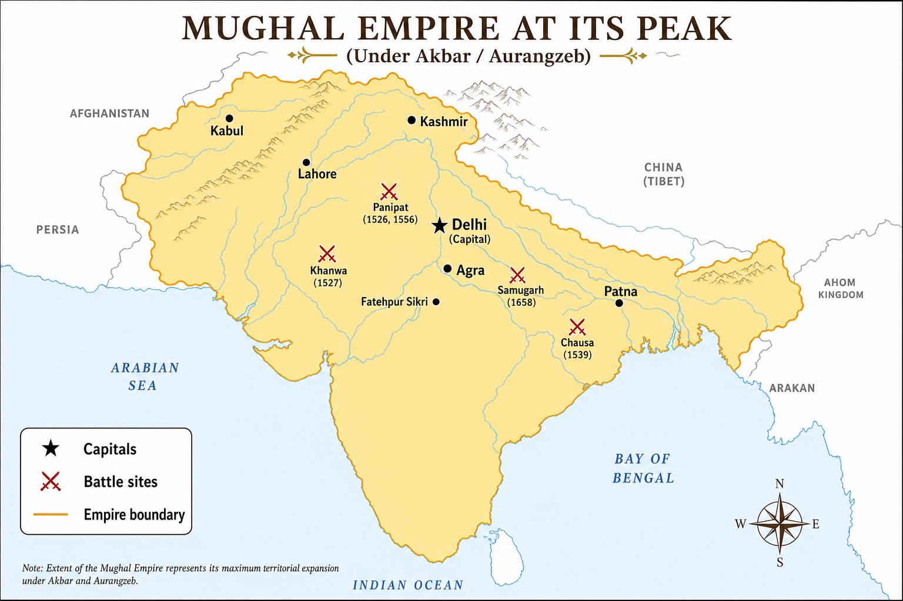

# Topic 7 — Mughal Empire
### ★ Complete Source of Truth — No other book/notes needed for this topic

> **Covers syllabus:** Babur | Establishment of the Mughal Empire | Literary Contribution of Babur | Major Mughal Battles | Mughal Military Campaigns | Mughal Administration | Mughal Administrative Structure | Nature of the Mughal Empire | Mansabdari System | Mughal Revenue System | Zabt System | Dahsala System | Mughal Coinage | Mughal Currency System | Mughal Architecture | Architecture under Akbar | Mughal Paintings | Mughal Education | Expansion of Akbar | Rajput Policy | Sulh-i-Kul | Religious Reforms | Social Reforms | Construction Activities | Cultural Contributions | Important Personalities of Akbar's Court | Abul Fazl | Akbarnama | Aurangzeb Wars of Succession | Aurangzeb Military Campaigns | Mughal Emperors and Their Tombs | Royal Patronage during Mughal Rule | Rulers and Their Families | Later Mughal Rulers | Humayun | Jahangir | Shah Jahan | Dara Shikoh | Nur Jahan | Todar Mal | Birbal | Raja Man Singh | Faizi | Abdur Rahim Khan-i-Khana | Din-i-Ilahi  
> **Sources baked in:** NCERT *Themes in Indian History Part II*, RS Sharma *Medieval India*, export notes (Struggle for Empire I–II, Government Economy & Society), UPPCS/UPSC PYQs 2018–2025  
> **Exam weight:** ★★★ High — battle chronology, tombs match, A/R traps (Babur language, Buland Darwaza, military state), Mansabdari non-hereditary, Bairam Khan title, Abul Fazl chronology, Aurangzeb succession order  
> **Last verified:** July 2026

---

## Quick Revision Box — Raata This First

```
MUGHAL EMPIRE CHRONOLOGY (1526–1857):
  Babur 1526–1530 | Humayun 1530–40, 1555–56 | Akbar 1556–1605 | Jahangir 1605–27
  Shah Jahan 1628–58 | Aurangzeb 1658–1707 | Later Mughals weak → Bahadur Shah II 1857

FOUNDATION & LITERATURE:
  Panipat I (20 Apr 1526) Babur vs Ibrahim Lodi — Tulughma + Araba — ends Delhi Sultanate
  Baburnama / Tuzk-e-Babri = autobiography in CHAGHTAI TURKI (NOT Persian — 2025 Q3 = C)
  Khanwa 1527 (Rana Sanga) | Chanderi 1528 | Ghagra 1529

HUMAYUN & INTERLUDE:
  Chausa 1539 → Kannauj 1540 (Humayun defeated) | Sher Shah Suri interlude 1540–55 (brief only)
  Humayun returns 1555 | dies 1556 (library fall) | Hamida Banu wife | Gulbadan = Humayunnama

MAJOR BATTLES CHRONOLOGY (★★★):
  Chausa 1539 → Kannauj 1540 → Dharmat Apr 1658 → Samugarh May 1658 (2025 Q79 = C: 4-2-3-1)
  Panipat II 5 Nov 1556 (Akbar/Hemu) | Aurangzeb succession: Shuja beaten → Dharmat → Samugarh → Deorai (2022 Q103 = A)

TOMBS MATCH (2025 Q57 = A: 4-3-2-1):
  Babur → Kabul (4) | Humayun → Delhi (3) | Jahangir → Lahore (2) | Shah Jahan → Agra/Taj (1)

AKBAR HIGHLIGHTS:
  Bairam Khan regent | Todar Mal zabt + dahsala 1580–81 | Mansabdari | Sulh-i-Kul | Rajput alliances
  Din-i-Ilahi 1582 (small circle) | Abolished jizya 1564 | Fatehpur Sikri capital 1571–85
  Buland Darwaza = Gujarat victory 1572 (NOT Jahangir birth — 2025 Q49 = C)

ADMIN & REVENUE:
  Mansabdari = zat + sawar + jagir — NOT hereditary (2019 Q92 = A)
  Zabt = measured assessment | Dahsala = 10-year average yield
  Dam (copper) + Rupiya (silver) + Mohur (gold) — Akbar reform (2019 Q12 A/R = A)

COURT PERSONALITIES:
  Abul Fazl → Akbarnama + Ain-i-Akbari (murdered 1602) | Faizi = poet laureate
  Birbal (Yusufzai 1586) | Raja Man Singh (Amber, Haldighati) | Rahim = Khan-i-Khana (Bairam Khan's son)
  Bairam Khan got Khan-i-Khana from HUMAYUN not Akbar (2024 Q4 = D)

JAHANGIR–SHAH JAHAN:
  Hawkins + Roe at Jahangir court (2023 Q31) | Nur Jahan influence | Tuzuk-i-Jahangiri
  Taj Mahal 1631+ | Nahr-i-Bihisht canal (2020 Q42 = C) | Kavindra Acharya = Shah Jahan (2022 Q146)

AURANGZEB & DECLINE:
  Golkonda 1687 — Abul Hasan Qutb Shah last (2020 Q34) | Bijapur 1686
  Reimposed jizya 1679 | Later Mughals: Muhammad Shah = Tappa patron (2023 Q38 = D, NOT Jahangir)
  1739 Nadir Shah | 1857 last Mughal Bahadur Shah II
```

### Must-Know Term Comparisons (very frequently asked)

| Term | One-line difference | Hindi |
|------|---------------------|-------|
| **Babur vs Humayun establishment** | Babur **won** empire at Panipat 1526; Humayun **lost** it to Sher Shah then **recovered** 1555 | बाबर / हुमायूँ |
| **Panipat I vs II vs III** | I (1526 Babur-Ibrahim) starts Mughals; II (1556 Akbar-Hemu) consolidates; III (1761 Marathas-Ahmad Shah Abdali) — Mughal decline | पानीपत प्रथम / द्वितीय / तृतीय |
| **Chausa vs Kannauj** | Chausa **1539**. Humayun escaped; Kannauj **1540** decisive Sher Shah victory — both vs Sher Shah | चौसा / कन्नौज |
| **Dharmat vs Samugarh** | Dharmat **Apr 1658**. Jaswant Singh defeated; Samugarh **May 1658**. Dara defeated — Aurangzeb succession | धर्मत / समुगढ़ |
| **Zabt vs Dahsala** | Zabt = **measurement-based** land assessment; Dahsala = **10-year average** yield fixation — both Todar Mal | ज़ब्त / दहसाला |
| **Zat vs Sawar** | Zat = **personal rank**; Sawar = **cavalry rank** obligation under mansabdari | ज़ात / सवार |
| **Jagir vs Khalsa** | Jagir = assigned to mansabdars for revenue; Khalsa = **crown/direct** land | जागीर / खालसा |
| **Mansabdari vs Zamindari** | Mansabdari = **Mughal noble rank** (non-hereditary); Zamindari = **local revenue intermediary** (often hereditary) | मनसबदारी / ज़मींदारी |
| **Sulh-i-Kul vs Din-i-Ilahi** | Sulh-i-Kul = policy of **universal peace/tolerance**; Din-i-Ilahi = **1582 court initiation** (not mass religion) | सुलह-ए-कुल / दीन-ए-इलाही |
| **Akbarnama vs Ain-i-Akbari** | Akbarnama = **historical narrative**; Ain-i-Akbari = **administrative gazetteer/statistical** companion | अकबरनामा / ऐन-ए-अकबरी |
| **Baburnama vs Tuzuk-i-Jahangiri** | Baburnama = Babur's memoir (Turki); Tuzuk = Jahangir's memoir (Persian) | बाबरनामा / तुज़ुक-ए-जहाँगीरी |
| **Buland Darwaza vs Panch Mahal** | Buland Darwaza = **victory gate** (Gujarat 1572); Panch Mahal = **five-storey palace** at Fatehpur Sikri | बुलंद दरवाज़ा / पंच महल |
| **Fatehpur Sikri vs Agra Fort** | Fatehpur Sikri = Akbar's **capital city** 1571–85; Agra Fort = **red sandstone fort** rebuilt by Akbar, extended by Shah Jahan | फतेहपुर सीकरी / आगरा किला |
| **Nahr-i-Bihisht vs Rajabwah** | Nahr-i-Bihisht = **canal of paradise** in Red Fort Delhi; fed by **Shah Jahan's Rajabwah** canal system | नहर-ए-बिहिश्त / राजबवाह |
| **Abul Fazl vs Faizi** | Abul Fazl = historian (Akbarnama); Faizi = **poet laureate** — both brothers, Akbar's court | अबुल फज़ल / फ़ैज़ी |
| **Bairam Khan vs Abdur Rahim** | Bairam Khan = Akbar's regent; Rahim = Bairam's son, **Khan-i-Khana**, Hindi poet | बैरम खान / अब्दुर रहीम |
| **Dara Shikoh vs Aurangzeb** | Dara = scholar, Sulh-i-Kul tone; Aurangzeb = orthodox, won succession **1658** | दारा शिकोह / औरंगज़ेब |
| **Tappa vs Dhrupad patron** | Dhrupad peak under **Akbar/Jahangir** (Tansen); **Tappa** flourished under **Muhammad Shah Rangila** (18th c.) — 2023 Q38 trap | तप्पा / ध्रुपद |

### Memory Tricks

| Trick | Remembers |
|-------|-----------|
| **1526-27-28-29 Babur** | **P**anipat → **K**hanwa → **C**handeri → **G**hagra (PKCG) |
| **1539-40 Humayun loss** | **C**hausa then **K**annauj — CK = Humayun **CK**ed out |
| **1658 four battles** | **D**harmat → **S**amugarh → **D**eorai (DSD) after Shuja beaten |
| **2025 Q79 code** | Items Chausa(4), Kannauj(2), Dharmat(3), Samugarh(1) → **C (4-2-3-1)** |
| **Tombs BK-JH-S** | **B**abur **K**abul → **H**umayun **D**elhi → **J**ahangir **L**ahore → **S**hah Jahan **A**gra |
| **B-F-A-R court** | **B**airam regent → **F**aizi poet → **A**bul Fazl historian → **R**ahim Khan-i-Khana |
| **2024 Q132 order** | **M**ubarak → **F**aizi → **A**bul Fazl killed → **D**aniyal = **2,3,1,4** |
| **Todar two Ds** | **T**odar Mal → **D**ahsala + **Z**abt (think "TDZ") |
| **Buland = Gujarat** | **B**uland Darwaza = **B**abar's grandson Akbar's **G**ujarat win — not Jahangir |
| **Dam A/R 2019** | **A**kbar **D**am — both true, R explains (2019 Q12 = A) |
| **Mansab not inherited** | Mansabdari dies with holder — **2019 Q92 = 1 only** |
| **Muhammad Shah Tappa** | **M**uhammad **M**usic **T**appa — not Jahangir |

---

## Exam Visuals — High-ROI Images

> **Type priority:** empire map → battle chronology diagram. Images stored locally (`images/`) so they open offline.

### 1. Mughal Empire — Expansion & Key Sites Map



*Raata **Panipat I (1526)** → **Fatehpur Sikri (Akbar capital)** → **Agra-Delhi axis (Shah Jahan)** → **UP sites: Allahabad/Prayag fort, Banaras scholars, Agra-Fatehpur corridor** **UPPCS 2025 Q57**: tomb cities on map.*
*Source: Study map — generated for UPPCS Mughal site matching*

---

## 7.1 Babur — Establishment of the Mughal Empire & Literary Contribution

### Definitions (learn all — exams pick different ones)

| Source | Definition |
|--------|------------|
| **General** | **Zahiruddin Muhammad Babur** (1483–1530) — Timurid prince from Ferghana; founded **Mughal Empire** in India after **First Battle of Panipat (1526)** |
| **NCERT** | **Mughal Empire** = Indo-Persian-Timurid polity combining Central Asian military tradition with Indian revenue base; "Mughal" from Mongol descent claim via Timur |
| **Literary** | **Baburnama** (also **Tuzk-e-Babri / Tuzk-e-Baburi**) — Babur's autobiography in **Chaghtai Turki**; vivid memoir of India, flora, politics |
| **Exam use** | Establishment = **1526 Panipat**, not 1527 Khanwa; court language under Babur = **Turki**, not Persian (2025 Q3 trap) |

### Babur & Establishment — How It Works

- **Lineage:** Babur descended from **Timur** on his father's side and **Chengiz Khan** on his mother's side. After losing the Ferghana-Samarkand struggle, he captured **Kabul in 1504**, which became his base for Indian campaigns.
- **Invitation to India:** **Daulat Khan Lodi** (Punjab governor) and **Rana Sanga** separately invited Babur against **Ibrahim Lodi**. Babur used invitation but pursued own imperial agenda.
- **First Battle of Panipat (20 April 1526):** Babur's army of about 12,000 defeated **Ibrahim Lodi's** much larger force. **Tulughma**, **Araba**, and field artillery broke the Afghan mass charge, and **Ibrahim Lodi** was killed, ending the Delhi Sultanate.
- **Delhi & Agra occupation:** Babur entered **Delhi** and **Agra** and assumed the title **Padshah**. This marked the beginning of an Indo-Mughal state distinct from the Afghan Lodi polity.
- **Consolidation battles:** Babur defeated the Rajput confederacy of **Rana Sanga** and Mahmud Lodi at **Khanwa (16 March 1527)**. He then took **Chanderi (1528)** from Medini Rai and defeated Afghan remnants with **Nusrat Shah** of Bengal at **Ghagra (1529)**, crushing major north Indian resistance.
- **Administrative start:** Babur granted **iqta-like assignments**, retained local **Lodi revenue officers**, and distributed plunder. A full Mansabdari structure had not yet emerged and developed later under **Humayun/Akbar**.
- **Religious policy:** Babur ordered **wine broken** after accession and recorded the destruction of **idols at Gwalior** in his memoir. He also respected some local arrangements, showing early Mughal pragmatism.
- **Death & succession:** Babur died at Agra on **26 December 1530**. He was buried first at Agra and later at **Kabul (Bagh-e-Babur)**, which is why UPPCS tomb matching links **Babur with Kabul**.
- **Literary contribution:** **Baburnama** was written in **Chaghtai Turki** and was later translated into Persian. Its personal account of **Hindustan**, including geography, **papaya**, **mango**, and **peacock**, became the foundation of Mughal court literary culture.
- **UP angle:** Panipat lay on the **Delhi–UP border** zone. Babur's route through **Punjab–Delhi–Doab** made **Agra** the gateway to the **UP heartland**.

> **Exam note:** **UPPCS 2025 Q3** — A true (Babur wrote *Tuzk-e-Babri* in Chaghtai Turki); R false (**Persian** became Mughal court language — Turki was Babur's personal literary language, not permanent imperial official language) → answer **C**

### Exam Facts (raata)

- Babur was born in **1483** at Ferghana and made **Kabul** his base in **1504**.
- **Panipat I** was fought on **20 April 1526**, and Ibrahim Lodi was killed in it.
- **Khanwa 1527** ended with the defeat of Rana Sanga.
- **Chanderi 1528** and **Ghagra 1529** completed Babur's early consolidation.
- Babur died in **1530** and was finally buried at **Kabul**.
- **Baburnama** was written in Chaghtai **Turki**, not in Persian as the Mughal court language.
- Babur's key tactics were **Tulughma**, **Araba**, and effective use of gunpowder.
- The Mughal Empire was **established in 1526** and consolidated through the campaigns of 1527–29.

### PYQs — Babur & Establishment

**UPPCS Prelims**
1. **(UPPCS 2025, Q3)** Assertion (A): Babur wrote *Tuzk-e-Babri* in Chaghtai Turki. Reason (R): Turki was the official language of the Mughal Court.  
   A. Both true; R not explanation | B. A false; R true | C. A true; R false | D. Both true; R explains A  
   → **C** — Babur wrote in Turki; **Persian** (not Turki) became imperial court language under later Mughals.

2. **(UPPCS 2023, Q34)** Hamida Banu Begum wrongly matched to Alauddin → **C** (Humayun's wife — see §7.19).

**UPSC Prelims**
3. **(UPSC 2014 — pattern)** The First Battle of Panipat (1526) was fought between Babur and:.
   → **Ibrahim Lodi**

### Examples (7.1)

| Example | What it teaches |
|---------|-----------------|
| **Panipat I Tulughma** | Technology + tactics defeated numerically superior Afghans |
| **Baburnama on mango** | Literary memoir as historical source for early Mughal India |
| **Kabul tomb** | Babur's preferred burial — 2025 Q57 code **4** for Kabul |

---

## 7.2 Humayun — Exile, Return & Brief Interregnum

### Definitions (learn all — exams pick different ones)

| Source | Definition |
|--------|------------|
| **General** | **Nasiruddin Muhammad Humayun** (1508–1556) — Babur's eldest son; ruled **1530–1540** and **1555–1556**; lost empire to **Sher Shah Suri**, recovered with Safavid help |
| **NCERT** | Humayun's reign = **instability + Persian cultural infusion**; **Humayun's Tomb (Delhi)** = first major garden tomb on Indian soil — architectural milestone |
| **Exam** | **Sher Shah Suri (1540–1555)** = brief interregnum only here — administration detail covered in Sher Shah Suri syllabus block |
| **Literary** | **Humayunnama** by sister **Gulbadan Begum** — Mughal women's history source |

### Humayun — How It Works

- **Accession 1530:** Humayun inherited an unstable empire and gave provinces to his brothers **Kamran, Askari, and Hindal**. These grants included **Kabul, Sambhal, and Lahore**, and chronic fraternal rivalry weakened the centre.
- **Early campaigns:** Humayun captured **Gujarat (1535)** from Bahadur Shah but lost it quickly because of poor siege coordination. This damaged his reputation among the nobles.
- **Sher Shah rise:** **Farid Khan (Sher Shah)** consolidated Bihar-Bengal and defeated Humayun at **Chausa (1539)** and **Kannauj/Bilgram (1540)**. Humayun then fled India.
- **Chausa 1539:** Sher Shah's night attack across the **Ganga** nearly drowned Humayun. Humayun escaped with a small retinue, but the defeat prepared the ground for his final loss.
- **Kannauj 1540:** **Kannauj** was the decisive battle on the Ganga plain. The Mughal army was routed, and Humayun began his **15-year absence** from India from **1540 to 1555**.
- **Sher Shah interlude (brief):** Sher Shah ruled from **1540 to 1545** and built the **Grand Trunk Road**, **sarais**, and the **Rupiya** coin. Humayun took refuge at the **Safavid court of Shah Tahmasp** and ceded **Kandahar** for military aid.
- **Return 1555:** With Persian support, Humayun defeated **Sikandar Shah Suri** at **Sirhind** and recovered **Delhi**. This restored Mughal rule.
- **Death 1556:** Fell from stairs of **Dinpanah (Sher Mandal)** library. He died on **26 January 1556**, and young **Akbar** (13) succeeded under **Bairam Khan** regency.
- **Family:** **Hamida Banu Begum** was Humayun's wife and Akbar's mother. His sister **Gulbadan Begum** wrote **Humayunnama**, and **Bairam Khan**, who later became Akbar's regent, received the title **Khan-i-Khana** from **Humayun** (2024 Q4 trap).
- **Architecture:** **Humayun's Tomb** was completed in **1565** under Akbar. Its charbagh garden design influenced the **Taj Mahal**, and its tomb match code is **3** for Delhi.

> **Exam note:** **2019 Q16** — Humayunnama–Gulbadan Begum = **correct match**; wrong pair in same question is Tughlaqnama–Ibn Battuta.

### Exam Facts (raata)

- Humayun ruled in two phases: **1530–40** and **1555–56**.
- He lost to Sher Shah at **Chausa in 1539** and at **Kannauj in 1540**.
- His exile lasted from **1540 to 1555**, and Safavid patronage helped his return.
- He died in **January 1556** after falling from the library stairs.
- **Hamida Banu** was his wife, and **Gulbadan Begum** wrote the **Humayunnama**.
- **Bairam Khan** served as regent for Akbar after Humayun's death.
- **Humayun's Tomb** is located in **Delhi**.

### PYQs — Humayun

**UPPCS Prelims**
1. **(UPPCS 2019, Q16)** Books NOT matched — Tughlaqnama–Ibn Battuta wrong; **Humayunnama–Gulbadan correct** → **C**.

2. **(UPPCS 2025, Q79)** Battle chronology includes Chausa & Kannauj → see §7.3 → **C (4-2-3-1)**.

**UPSC Prelims**
3. **(UPSC 2018 — pattern)** Humayun lost the Mughal empire at the battle of:.
   → **Kannauj (1540)**

### Examples (7.2)

| Example | What it teaches |
|---------|-----------------|
| **Chausa escape** | Humayun's near-drowning — turning point before Kannauj |
| **Safavid exile** | Persian art/admin influence on restored Mughal court |
| **Humayunnama** | Primary source for harem/pilgrimage narratives |

---

## 7.3 Major Mughal Battles — Chronology & Significance

### Definitions (learn all — exams pick different ones)

| Source | Definition |
|--------|------------|
| **General** | **Major Mughal battles** = decisive engagements establishing, losing, recovering, or contesting Mughal imperial sovereignty (1526–1707) |
| **NCERT** | Three **Panipat** battles — only **I (1526)** and **II (1556)** are Mughal foundation/consolidation; **III (1761)** = Mughal decline era |
| **Exam** | **2025 Q79** tests **Chausa → Kannauj → Dharmat → Samugarh** — NOT Panipat in that set |

### Major Battles — How It Works

- **Panipat I (20 April 1526):** **Babur** defeated **Ibrahim Lodi** near the **Karnal/Panipat** corridor. The battle created the Mughal Empire and ended the Delhi Sultanate.
- **Khanwa (16 March 1527):** **Babur** defeated **Rana Sanga** and broke the Rajput-Afghan coalition. This secured the Mughal hold on the **Rajasthan gateway**.
- **Chanderi (1528):** Babur defeated **Medini Rai** and captured the Bundelkhand fort. Jauhar was performed, and central India was subdued.
- **Ghagra (1529):** Babur fought **Mahmud Lodi** and **Nusrat Shah of Bengal**. This was the last major Afghan challenge in north India under Babur.
- **Chausa (26 June 1539):** **Sher Shah** defeated **Humayun**, who escaped across the Ganga. This was the first major blow before Humayun lost the empire.
- **Kannauj / Bilgram (17 May 1540):** **Sher Shah** decisively defeated **Humayun**. Humayun went into exile, and the Mughal interregnum began.
- **Panipat II (5 November 1556):** **Akbar's forces under Bairam Khan** defeated **Hemu**. Hemu was wounded by an arrow and beheaded, and Mughal rule was **re-consolidated** after Humayun's return.
- **Haldighati (1576):** **Raja Man Singh**, fighting for Akbar, faced **Rana Pratap**. The battle was tactically indecisive, but the Mughals gained a strategic advantage in the Mewar plains. It is not in the 2025 Q79 set but remains high priority for Rajput policy.
- **Dharmat / Daurah (April 1658):** **Aurangzeb** defeated **Jaswant Singh (Rathor)** and **Qasim Khan** near **Ujjain**. This defeat of Dara's allies opened the succession war.
- **Samugarh (29 May 1658):** **Aurangzeb** defeated **Dara Shikoh** near **Agra**. Dara fled, making the battle decisive for Aurangzeb's accession.
- **Deorai / Khajwa (1658):** Dara Shikoh suffered his final defeat and was executed in **1659**. Aurangzeb's empire was secured.
- **2025 Q79 chronology code:** The question list gives **1=Kannauj, 2=Daurah, 3=Samugarh, 4=Chausa**, so the official answer is **C (4-2-3-1)**. The historical sequence to memorize is Chausa **1539** → Kannauj **1540** → Dharmat **1658** → Samugarh **1658**.

> **Exam note:** Do not confuse **Dharmat (1658 succession)** with **Khanwa (1527 Babur)** or **Kannauj (1540 Sher Shah)** — three different wars, three different outcomes.

### Exam Facts (raata)

- Babur's battle sequence was **Panipat I 1526**, **Khanwa 1527**, **Chanderi 1528**, and **Ghagra 1529**.
- The Sher Shah sequence was **Chausa 1539** followed by **Kannauj 1540**.
- **Panipat II** was fought in **1556** against Hemu.
- Aurangzeb's 1658 succession sequence was **Dharmat → Samugarh → Deorai**.
- The answer to **2025 Q79** is **C (4-2-3-1)**.
- In **2022 Q103**, the Aurangzeb order is Shuja's defeat → Dharmat → Samugarh → Deorai, giving **A (2,4,3,1)**.

### PYQs — Major Battles

**UPPCS Prelims**
1. **(UPPCS 2025, Q79)** Arrange: Chausa, Kannauj, Samugarh, Daurah (Dharmat) → **C (4-2-3-1)**.

2. **(UPPCS 2022, Q103)** Aurangzeb succession events chronology → **A (2,4,3,1)** — Shuja defeated → Dharmat → Samugarh → Deorai.

**UPSC Prelims**
3. **(UPSC 2017 — pattern)** Second Battle of Panipat was fought between:.
   → **Akbar's forces and Hemu (1556)**

### Examples (7.3)

| Example | What it teaches |
|---------|-----------------|
| **Chausa → Kannauj** | Two-step Sher Shah destruction of Humayun's India |
| **Dharmat → Samugarh** | 1658 two-month sequence decides emperor |
| **Panipat II** | Bairam Khan regency victory — Akbar's throne secured |

---

## 7.4 Mughal Military Campaigns — Framework & Per Reign

### Definitions (learn all — exams pick different ones)

| Source | Definition |
|--------|------------|
| **General** | **Mughal military campaigns** = territorial expansion, rebellion suppression, and succession wars fought by Mughal emperors and mansabdars across subcontinent |
| **NCERT** | Mughal army combined **Central Asian cavalry**, **Indian infantry**, **artillery**, **elephants**; **Mansabdari** linked military obligation to revenue (**jagir**) |
| **Exam** | Campaign **chronology** and **commander** matching — Raja Man Singh, Bir Singh Bundela, Mir Jumla |

### Military Campaigns — How It Works

- **Babur (1526–30):** Babur conquered north India through **Delhi, Agra, Panipat, Khanwa, Chanderi, and Ghagra**. He also introduced **field guns** systematically into north Indian warfare.
- **Humayun (restoration):** Humayun's key restoration campaign was the **1555 Sirhind** campaign against the Suris. He recovered Delhi with Persian cavalry support, but his short second reign produced no major fresh conquests.
- **Akbar (1556–1605):** **Malwa (1561–62)**, **Garh-Katanga (1564)**, **Chittor (1567–68)**, **Ranthambore (1569)**, **Gujarat (1572–73)**, **Bihar-Bengal (1574–76)**, **Kashmir (1586)**, **Sind (1591)**, **Khandesh (1601)**, **Ahmadnagar entry (1596 onward)**. Empire reaches maximum under Akbar–early Jahangir.
- **Jahangir (1605–27):** Jahangir secured the **Mewar submission (1615)** of Amar Singh and captured **Kangra fort (1620–22)**. Deccan pressure continued through **Khurram (Shah Jahan)**, with campaigns against **Mewar, Kangra, and the Deccan sultanates**.
- **Shah Jahan (1628–58):** Shah Jahan annexed **Ahmadnagar in 1636** and campaigned against **Bijapur** and **Golkonda** in the Deccan. His **Balkh-Badakhshan (1646–47)** campaign in Central Asia failed, while **Portuguese Hooghly** was expelled from Bengal in **1632–33**.
- **Aurangzeb (1658–1707):** Aurangzeb stayed in the Deccan from **1681 to 1707** and annexed **Bijapur in 1686** and **Golkonda in 1687**. The last Golkonda ruler was **Abul Hasan Qutb Shah** (2020 Q34), and his reign also saw prolonged **Maratha wars**, **Yusufzai** campaigns, **Assam** campaigns under Mir Jumla, and the execution of **Guru Tegh Bahadur in 1675**.
- **Artillery & fort warfare:** The Mughals excelled at **siege artillery**. At forts such as Chittor, Kangra, and the Deccan strongholds, they combined **mining**, **bombardment**, and negotiation.
- **Naval dimension:** The Mughal navy remained limited. The empire relied on the **Siddi of Janjira**, the **Mughal fleet at Surat**, and Bengal coast campaigns against **Arakan** and the **Portuguese**.
- **Military finance:** Campaigns were funded through **jagir assignments**, **khalisa cash**, and **zakat/khams** on booty. The **ten-year revenue settlement** helped sustain long wars.
- **UP campaigns:** **Allahabad/Prayag fort** was built by Akbar in **1583** and renamed **Ilahabad**. The **Banaras** region came under **subah** administration, and **Agra-Delhi** served as the military logistics hub for Doab wars.

> **Exam note:** **2020 Q34** — Last ruler of Golkonda when Aurangzeb seized it = **Abul Hasan Qutb Shah (1687)** — fits Aurangzeb Deccan campaign block.

### Exam Facts (raata)

- Akbar's key campaigns included **Gujarat 1572**, **Bengal 1576**, and **Kashmir 1586**.
- Jahangir secured Mewar peace in **1615** and captured **Kangra in 1620–22**.
- Shah Jahan annexed **Ahmadnagar in 1636** but failed at **Balkh in 1646–47**.
- Aurangzeb annexed **Bijapur in 1686** and **Golkonda in 1687**.
- **Abul Hasan Qutb Shah** was the last ruler of Golkonda.
- Raja Man Singh led campaigns in **Bengal, Bihar, Kabul, and Orissa**.
- Birbal died in the **1586 Yusufzai** campaign.

### PYQs — Military Campaigns

**UPPCS Prelims**
1. **(UPPCS 2020, Q34)** Last ruler when Mughals seized Golkonda → **A (Abul Hasan Qutb Shah)**.

2. **(UPPCS 2022, Q103)** Aurangzeb succession military sequence → **A**.

**UPSC Prelims**
3. **(UPSC 2019 — pattern)** Who led Mughal army in battle of Haldighati for Akbar?  
   → **Raja Man Singh of Amber**

### Examples (7.4)

| Example | What it teaches |
|---------|-----------------|
| **Akbar's Gujarat 1572** | Buland Darwaza commemorates this — not Jahangir |
| **Aurangzeb 1687 Golkonda** | End of Qutb Shahi — Deccan largely Mughal |
| **Birbal at Yusufzai** | Even favourite mansabdars died in frontier wars |

---

## 7.5 Jahangir, Nur Jahan & Early 17th-Century Court

### Definitions (learn all — exams pick different ones)

| Source | Definition |
|--------|------------|
| **General** | **Nuruddin Muhammad Jahangir** (1569–1627) — Akbar's son Salim; reign **1605–1627**; "Conqueror of the World" |
| **Nur Jahan** | **Mehr-un-Nisa** — Jahangir's wife (m. **1611**); exercised political influence; coins, **Khurja trade**, garden patronage |
| **Literary** | **Tuzuk-i-Jahangiri** — Jahangir's memoir (Persian); natural history observations |
| **Exam** | **William Hawkins (1608)** and **Sir Thomas Roe (1615–19)** at Jahangir's court — 2023 Q31 |

### Jahangir & Nur Jahan — How It Works

- **Accession 1605:** Jahangir succeeded Akbar after Salim's brief rebellion in **1599–1600**. He maintained **mansabdari** and **Rajput alliances**, while his son **Khurram (Shah Jahan)** rose as a commander.
- **Justice symbolism:** Jahangir installed the **"Chain of Justice"** (Zanjir-i-Adl) at Agra Fort as a symbol of public petition access. His reign also used **Sikka-i-Jahangiri** coins.
- **Nur Jahan's rise:** Nur Jahan was the widow of Sher Afghan and married Jahangir in **1611**. Her father **Itimad-ud-Daulah** and brother **Asaf Khan** helped her family dominate court offices.
- **Nur Jahan's power:** Nur Jahan issued **farmans**, controlled the **royal seal** at times, led **hunting expeditions**, and commanded **palace guards**. Her influence worked through the so-called **Nur Jahan Junta** with her father and brother.
- **European contacts:** **William Hawkins (1608–11)** came for the East India Company, and **Thomas Roe (1615–19)** came as the English ambassador. Jahangir granted **Surat** trade farmans, making this an early phase of commercial diplomacy.
- **Military:** Jahangir secured the **Mewar submission (1615)** of Rana Amar Singh and captured **Kangra fort (1620–22)**. Deccan campaigns were delegated to **Shah Jahan**.
- **Painting patronage:** **Ustad Mansur** specialized in natural history miniatures, while **Abul Hasan** represented the European-influenced style. Jahangir's album portraits became highly naturalistic.
- **Death 1627:** Jahangir died en route from **Kashmir** and was buried at **Shahdara, Lahore**. His tomb match code is **2** (2025 Q57).
- **Nur Jahan after Jahangir:** Nur Jahan supported **Shahryar** in the succession struggle, but **Shah Jahan** won. She retired and lived comfortably until **1645**.
- **UP angle:** Jahangir visited **Ajmer Sharif**, and **Allahabad** subah remained stable. **Banaras** scholars continued to receive imperial patronage from the Akbar-era pattern.

> **Exam note:** **2023 Q31 Hawkins** — both statements about Hawkins at **Jahangir's court** correct → **C**. Do not attribute Hawkins to Akbar.

### Exam Facts (raata)

- Jahangir reigned from **1605 to 1627**, and his real name was **Salim**.
- **Nur Jahan** was originally **Mehr-un-Nisa** and married Jahangir in **1611**.
- **Tuzuk-i-Jahangiri** was Jahangir's memoir.
- **Hawkins** came in **1608**, and **Thomas Roe** came in **1615**.
- The **Chain of Justice** was installed at Agra.
- Jahangir's tomb is at **Lahore (Shahdara)**.
- Kangra was captured in **1620–22**.

### PYQs — Jahangir & Nur Jahan

**UPPCS Prelims**
1. **(UPPCS 2023, Q31)** Hawkins at Mughal court — both statements correct → **C**.

2. **(UPPCS 2025, Q57)** Jahangir tomb → **Lahore (code 2)** in match **A (4-3-2-1)**.

**UPSC Prelims**
3. **(UPSC 2020 — pattern)** Chain of Justice was associated with:.
   → **Jahangir**

### Examples (7.5)

| Example | What it teaches |
|---------|-----------------|
| **Hawkins & Roe** | Early English diplomacy — Jahangir not Akbar |
| **Nur Jahan coins** | Rare case of queen-name on Mughal coinage |
| **Lahore tomb** | Jahangir buried Shahdara — 2025 match item |

---

## 7.6 Shah Jahan — Building, Patronage & Campaigns

### Definitions (learn all — exams pick different ones)

| Source | Definition |
|--------|------------|
| **General** | **Shahabuddin Muhammad Shah Jahan** (1592–1666) — reign **1628–1658**; fifth Mughal emperor; peak of **Mughal architecture** |
| **NCERT** | Shah Jahan's reign = **centralization + magnificent building** + **Deccan wars**; capital activity **Delhi-Agra** |
| **Exam** | **Nahr-i-Bihisht** / **Rajabwah canal** — 2020 Q42; **Kavindra Acharya** at court — 2022 Q146 |

### Shah Jahan — How It Works

- **Accession 1628:** Shah Jahan defeated rivals including **Shahryar** after Jahangir's death. He executed **Shahryar** and consolidated power with **Asaf Khan's** support.
- **Family:** Shah Jahan's beloved wife was **Mumtaz Mahal (Arjumand Banu)**, whom he had married in **1612**. After she died at Burhanpur in **1631**, he built the **Taj Mahal (1632–53)** as her mausoleum at **Agra**.
- **Building programme:** **Red Fort Delhi (1639–48)**, **Jama Masjid Delhi**, **Shalimar Bagh (Kashmir/Lahore)**, **Peacock Throne**, **Diwan-i-Khas** "If there is paradise on earth, it is this.".
- **Canal works:** The **Rajabwah canal** from the **Yamuna** fed the **Agra** gardens. The **Nahr-i-Bihisht (Canal of Paradise)** inside the **Red Fort** cooled the Diwan-i-Khas and is the answer to **2020 Q42**.
- **Architectural style:** Shah Jahan's reign marked the mature **arch-dome-inlay** phase. **Pietra dura**, white marble, and symmetry replaced the dominance of Akbar's red sandstone style.
- **Military:** In the Deccan, Shah Jahan destroyed **Ahmadnagar (1636)** and fought **Bijapur** and **Golkonda**. His **Balkh (1646–47)** campaign in Central Asia failed, and the loss of **Kandahar** to Persia in **1649** was a strategic setback.
- **Patronage:** **Kavindra Acharya** was a Sanskrit scholar at Shah Jahan's court (2022 Q146). **Dara Shikoh** also promoted translation projects, including the **Upanishads (Sirr-i-Akbar)**.
- **Succession crisis:** Shah Jahan's illness in **1657–58** triggered war among **Dara, Shuja, Aurangzeb, and Murad**. Shah Jahan was imprisoned in **Agra Fort** from **1658** until his death in **1666**.
- **Death & burial:** Shah Jahan died in **1666** and was buried beside Mumtaz in the **Taj Mahal, Agra**. His tomb match code is **1** (2025 Q57).
- **UP angle:** **Agra** served as Shah Jahan's primary capital. **Allahabad** fort was maintained, **Banaras** saw relatively tolerant temple policy in the early reign, and **Fatehpur Sikri** remained a visited heritage site.

> **Exam note:** **2022 Q146 Kavindra Acharya** → **Shah Jahan**, not Akbar or Jahangir.

### Exam Facts (raata)

- Shah Jahan reigned from **1628 to 1658**.
- Mumtaz died in **1631**, and the Taj Mahal was built during **1632–53**.
- Shah Jahan built the **Red Fort** and **Jama Masjid** at Delhi.
- **Nahr-i-Bihisht** was Shah Jahan's canal project in the Red Fort (2020 Q42).
- **Kavindra Acharya** belonged to Shah Jahan's court.
- Shah Jahan was imprisoned in **Agra Fort from 1658 to 1666**.
- Shah Jahan was buried in the **Taj Mahal, Agra**.

### PYQs — Shah Jahan

**UPPCS Prelims**
1. **(UPPCS 2020, Q42)** Canal Rajabwah / Nahr-i-Bihisht → **C**.

2. **(UPPCS 2022, Q146)** Kavindra Acharya patron → **A (Shah Jahan)**.

3. **(UPPCS 2025, Q57)** Shah Jahan tomb → **Agra (code 1)**.

**UPSC Prelims**
4. **(UPSC 2015 — pattern)** Taj Mahal was built by Shah Jahan in memory of:.
   → **Mumtaz Mahal**

### Examples (7.6)

| Example | What it teaches |
|---------|-----------------|
| **Nahr-i-Bihisht** | Engineering + aesthetics in Red Fort |
| **Taj Mahal** | Shah Jahan buried there — match-list Agra |
| **1657 illness** | Trigger for Aurangzeb succession wars |

---

## 7.7 Aurangzeb — Wars of Succession & Military Campaigns

### Definitions (learn all — exams pick different ones)

| Source | Definition |
|--------|------------|
| **General** | **Muhiuddin Muhammad Aurangzeb** (1618–1707) — reign **1658–1707**; Alamgir; orthodox Islamic policy; longest reign |
| **Succession** | **1657–58** — four brothers: **Dara Shikoh, Shuja, Murad, Aurangzeb**; battles **Dharmat, Samugarh, Deorai** |
| **Exam** | **2022 Q103** chronology: Shuja defeat → Dharmat → Samugarh → Deorai = **A (2,4,3,1)** |

### Aurangzeb — How It Works

- **Succession trigger:** Shah Jahan's illness in **1657** triggered the succession war. **Dara** was at Delhi as the favoured heir, **Shuja** was in Bengal, **Murad** was in Gujarat, and **Aurangzeb** was in the Deccan.
- **Shuja defeated first:** Aurangzeb and Murad alliance beat **Shuja** at **Banaras/Khajwa region (Feb 1658)**. Shuja fled to **Arakan** (later killed).
- **Murad betrayed:** Aurangzeb imprisoned **Murad** after their joint victory. This eliminated one major rival.
- **Dharmat (April 1658):** Aurangzeb defeated **Jaswant Singh (Rathor)**, who supported Dara. This Mughal victory cleared Aurangzeb's way toward Agra.
- **Samugarh (29 May 1658):** Aurangzeb defeated **Dara Shikoh** at Samugarh. Dara's flight made the battle decisive for the throne.
- **Deorai / Khajwa (1658):** Dara suffered his final defeat and was executed in **August 1659**. Shah Jahan was imprisoned in **Agra Fort**.
- **Coronation 1658:** Aurangzeb took the title **Alamgir** in **1658**. He ruled for **49 years** until **1707**.
- **Deccan campaigns:** Aurangzeb personally moved south in **1681**. He annexed **Bijapur in 1686** and **Golkonda in 1687**, whose last ruler was **Abul Hasan Qutb Shah** (2020 Q34), while prolonged **Maratha** resistance continued under **Sambhaji, Rajaram, and Tara Bai**.
- **North-west:** **Guru Tegh Bahadur** was executed in **1675**, and **jizya** was reimposed in **1679**. By **1686**, the policy tone had also moved away from Akbar's ban on cow slaughter.
- **Religious policy shift:** Aurangzeb ended the pragmatism associated with **Sulh-i-Kul**. Temple destruction orders appeared in some regions, and **Fatawa-i-Alamgiri** was compiled as a Sunni Hanafi law guide.
- **Empire size vs strength:** The empire reached its territorial peak after **1687**, but fiscal-military exhaustion weakened it. **Jagir shortage** and revolts by **Jats, Satnamis, and Sikhs** exposed the strain.

> **Exam note:** **2022 Q103** — Order **Shuja defeat (2) → Dharmat (4) → Samugarh (3) → Deorai (1)** = answer **A**

### Exam Facts (raata)

- Aurangzeb reigned from **1658 to 1707**.
- The succession battles took place in **1658**.
- The succession battle sequence was **Dharmat → Samugarh → Deorai**.
- Aurangzeb annexed **Bijapur in 1686** and **Golkonda in 1687**.
- **Abul Hasan Qutb Shah** was the last ruler of Golkonda.
- Aurangzeb reimposed **jizya in 1679**.
- Aurangzeb died in **1707** at the Ahmednagar camp and was buried at **Khuldabad**.

### PYQs — Aurangzeb

**UPPCS Prelims**
1. **(UPPCS 2022, Q103)** Aurangzeb events chronology → **A (2,4,3,1)**.

2. **(UPPCS 2020, Q34)** Golkonda last ruler → **A (Abul Hasan Qutb Shah)**.

3. **(UPPCS 2025, Q79)** Dharmat & Samugarh in battle list → **C**.

**UPSC Prelims**
4. **(UPSC 2021 — pattern)** Aurangzeb imprisoned Shah Jahan at:.
   → **Agra Fort**

### Examples (7.7)

| Example | What it teaches |
|---------|-----------------|
| **Samugarh** | Dara's defeat — end of liberal succession hope |
| **1687 Golkonda** | Qutb Shahi end — Mughal Deccan peak |
| **49-year reign** | Long wars drained empire despite territorial gain |

---

## 7.8 Later Mughal Rulers & Dara Shikoh

### Definitions (learn all — exams pick different ones)

| Source | Definition |
|--------|------------|
| **General** | **Later Mughals** = emperors after Aurangzeb (**1707–1857**) — declining central authority, **Sayyid Brothers**, **Nadir Shah 1739**, **1857** last **Bahadur Shah II** |
| **Dara Shikoh** | Eldest son of Shah Jahan; scholar; **Majma-ul-Bahrain**, **Sirr-i-Akbar** (Upanishad translation); killed **1659** |
| **Exam** | **Tappa music** patron = **Muhammad Shah Rangila (1719–48)** — NOT Jahangir (2023 Q38) |

### Later Mughals & Dara — How It Works

- **Bahadur Shah I (1707–12):** Bahadur Shah I was Aurangzeb's son. He tried to reconcile with **Rajputs, Marathas, and Sikhs**, but his reign remained short and unstable.
- **Jahandar Shah (1712–13):** Jahandar Shah was defeated by **Farrukhsiyar** with help from the **Sayyid Brothers**. **Zulfikar Khan** served as wazir, and the reign is remembered for court debauchery narratives.
- **Farrukhsiyar (1713–19):** **Sayyid Brothers** acted as kingmakers under Farrukhsiyar. He was executed after failing to break their power.
- **Muhammad Shah Rangila (1719–48):** **Nadir Shah invaded in 1739**, massacred Delhi, and took the Peacock Throne. Muhammad Shah's court still saw cultural revival, and he patronized **Tappa** music (2023 Q38 is Muhammad Shah, not Jahangir).
- **Ahmad Shah Bahadur (1748–54):** Ahmad Shah Bahadur was a weak emperor. During his reign, **Maratha** influence expanded in the Doab.
- **Alamgir II, Shah Alam II, Akbar II:** These emperors became progressive puppets under **Maratha, British, and Afghan** pressure. **Shah Alam II** was blinded in **1788**.
- **Bahadur Shah II (1837–57):** Bahadur Shah II was the last Mughal emperor and the figurehead of the **1857 Revolt**. He was exiled to **Rangoon**, ending the dynasty.
- **Dara Shikoh (1615–1659):** Dara governed **Allahabad** and **Gujarat** and patronized **Sanskrit-Persian** syncretism. His **Majma-ul-Bahrain** presented Hinduism and Islam as a "confluence of two oceans," and he commissioned the **Upanishad** translation **Sirr-i-Akbar**.
- **Dara vs Aurangzeb ideology:** Dara represented **Sufi-inclined universalism**, while Aurangzeb represented **orthodox Sunni** politics. Their succession struggle marked an ideological break.
- **Execution 1659:** Dara was paraded in **Delhi** and executed on **apostasy** charges. His head was sent to Shah Jahan.

> **Exam note:** **2023 Q38 Tappa** — correct answer **D (Muhammad Shah)**; Jahangir patronized **Dhrupad/Tansen tradition**, not Tappa.

### Exam Facts (raata)

- Aurangzeb died **1707**.
- **Nadir Shah** sacked Delhi in **1739**.
- **Muhammad Shah** was the Tappa patron (2023 Q38).
- **Bahadur Shah II** was the last Mughal emperor in **1857**.
- **Dara Shikoh** was killed in **1659**.
- **Majma-ul-Bahrain** was Dara Shikoh's work.
- The Sayyid Brothers acted as kingmakers during **1713–20**.

### PYQs — Later Mughals & Dara

**UPPCS Prelims**
1. **(UPPCS 2023, Q38)** Tappa music emperor → **D (Muhammad Shah)**.

2. **(UPPCS 2022, Q103)** Dara defeated at Samugarh/Deorai sequence → **A**.

**UPSC Prelims**
3. **(UPSC 2018 — pattern)** Who was the last Mughal emperor?  
   → **Bahadur Shah II**

### Examples (7.8)

| Example | What it teaches |
|---------|-----------------|
| **Nadir Shah 1739** | Mughal emperor survived — empire mortally wounded |
| **Dara's Upanishad translation** | Intellectual alternative to Aurangzeb's orthodoxy |
| **Muhammad Shah & Tappa** | Later Mughal culture ≠ Jahangir-era music |

---

## 7.9 Mughal Administration, Structure & Nature of the Empire

### Definitions (learn all — exams pick different ones)

| Source | Definition |
|--------|------------|
| **General** | **Mughal administration** — centralized imperial structure linking **Persianate bureaucracy**, **Indian revenue practice**, and **Mansabdari-military** service |
| **Structure** | **Subah (province) → Sarkar (district) → Pargana → Village**; central ministries (**diwans**) |
| **Nature** | **Military-bureaucratic empire** — emperor at apex; nobles as **mansabdars** with **jagir** revenue assignments |
| **Exam** | **2021 Q126** — Mughal state = military state; R explains A → **A** |

### Administration — How It Works

- **Emperor (Padshah):** The emperor was the supreme sovereign over **legislation, appointments, revenue, and war**. **Farmans** carried imperial orders, and Akbar reduced the political importance of the **wakil**.
- **Wazir (Diwan-i-Wizarat):** The wazir was the finance minister. He managed **revenue accounts**, **expenditure**, and **khalisa** lands, and the office became especially powerful under Shah Jahan and Aurangzeb.
- **Mir Bakshi (Diwan-i-Arz):** The Mir Bakshi was the military paymaster. He handled **mansab** rolls, **recruitment**, **branding (dagh)** in some periods, and troop inspections.
- **Sadr-us-Sudur (Diwan-i-Risalat):** The Sadr-us-Sudur supervised **charitable grants**, **madad-i-maash**, and **sadr** appointments. This made the office central to religious endowments.
- **Chief Qazi + Muhatsib:** The Chief Qazi handled the **judiciary**, while the Muhatsib enforced **public morals**. Aurangzeb strengthened the qazi system.
- **Provincial administration:** Provincial authority was divided between the **Subahdar** as governor and the **Diwan** as revenue head. This dual authority checked concentration of power, while the **faujdar** handled district law and order.
- **Local level:** At the local level, the **Amil** handled pargana revenue, the **qanungo** kept records, the **patwari** worked at the village level, and the **muqaddam/chowkidar** handled village headship and security.
- **Nature of empire:** The empire had a **composite ruling class** of Turani, Irani, Shaikhzada, **Rajput**, and Indian Muslim nobles. Loyalty depended on **mansab + jagir**, not ethnicity alone.
- **Military-bureaucratic character:** Every noble functioned as both **administrator** and **commander**. Revenue assignments funded military contingents, so the state worked as an **army in government form** (2021 Q126).
- **Comparison to Sultanate:** Compared with the Sultanate, the Mughals used more **centralized measurement revenue** and **mansabdari** instead of an **iqta** system drifting toward heredity. They also maintained a larger **imperial workshop (karkhanas)** system.

> **Exam note:** **2021 Q126** — A: Mughal empire was a **military state** (true); R: Mughal nobles were **military officers** (true, explains A) → answer **A**

### Exam Facts (raata)

- The main ministries were **Wizarat, Arz, Risalat, and Insha**.
- **Subahdar** and **Diwan** formed the dual provincial head.
- **Subah** meant province, **Sarkar** meant district, and **Pargana** meant sub-district.
- **Composite nobility** included Rajputs along with other noble groups.
- The Mughal state was a **military-bureaucratic state** (2021 Q126 = A).
- The empire had **12 subahs** under Akbar and **21** under Aurangzeb.
- **Faujdar** was the district military-revenue officer.

### PYQs — Administration

**UPPCS Prelims**
1. **(UPPCS 2021, Q126)** Military state A/R → **A** — both true; R explains A.

2. **(UPPCS 2019, Q92)** Mansabdari hereditary → **A (1 only)** — see §7.10.

**UPSC Prelims**
3. **(UPSC 2016 — pattern)** Diwan-i-Arz dealt with:.
   → **Military affairs (Mir Bakshi)**

### Examples (7.9)

| Example | What it teaches |
|---------|-----------------|
| **Dual subah head** | Subahdar vs Diwan — balance of power |
| **Rajput mansabdars** | Nature of empire = partnership, not pure foreign rule |
| **2021 Q126 A/R** | Mansabdari defines military-bureaucratic nature |

---

## 7.10 Mansabdari System

### Definitions (learn all — exams pick different ones)

| Source | Definition |
|--------|------------|
| **General** | **Mansabdari** — rank system assigning **zat (personal)** and **sawar (cavalry)** grades; tied to **jagir** revenue for salary |
| **NCERT** | Introduced in organized form under **Akbar**; refined by **Jahangir (du-aspah sih-aspah)** and **Aurangzeb (increased sawar obligations)** |
| **Exam** | **NOT hereditary** — son does not automatically inherit father's mansab (2019 Q92) |

### Mansabdari — How It Works

- **Origin & development:** Early Mughals used **tankhwah** cash salaries, but **Akbar** systematized **mansab** numbers. Noble ranks generally ranged from 10 to 7000, while the emperor's rank was symbolically **7000+** or **8000+**.
- **Zat rank:** **Zat** was the personal status grade. It determined **salary scale**, **court precedence (maratab)**, and **administrative eligibility**.
- **Sawar rank:** **Sawar** fixed the obligation to maintain **horses and troopers**. The sawar rank could equal, half, or one-third of **zat**, and the rules tightened under Jahangir.
- **Jagir assignment:** Mansabdars received **jagirs** as revenue assignments. Officials compared **jama** (estimated revenue) with **hasil** (actual collection), and **wazifajat** covered pay.
- **Dagh & chehra:** **Dagh** meant branding horses, and **chehra** meant descriptive rolls. These checks prevented fraud in troop reviews, especially under Akbar.
- **Non-hereditary principle:** A mansab was held **during the emperor's pleasure**. On death, the **jagir** was resumed by the state, and sons received rank only after fresh **tazkira** review, so inheritance was not automatic (2019 Q92 trap).
- **Categories of nobles:** The nobility included **Turani, Irani, Shaikhzada, Rajput, and Deccani** groups. This mixed recruitment strengthened the empire.
- **Du-aspah sih-aspah:** Jahangir introduced **du-aspah sih-aspah** obligations. Some mansabdars had to maintain **2-3 horses per sawar**, which raised military readiness and cost.
- **Civil-military fusion:** The same nobles ran **provinces, armies, and karkhanas**. The Mughal state therefore did not have a separate civil service cadre.
- **Decline factor:** Under Aurangzeb, **jagir shortage** became acute. Transfers or **tabadla** to less productive jagirs dissatisfied many nobles.

> **Exam note:** **2019 Q92** — Statement 1 only correct: Mansabdari was **NOT hereditary** → answer **A**

### Exam Facts (raata)

- **Zat** and **Sawar** formed the dual mansab rank.
- The mansabdari system was organized under **Akbar**.
- Mansabdari was **not hereditary** (2019 Q92 = A).
- **Jagir** assignments paid mansab salaries.
- **Dagh** meant horse branding.
- Jahangir introduced **du-aspah sih-aspah**.
- The highest noble mansab was about **7000**.

### PYQs — Mansabdari

**UPPCS Prelims**
1. **(UPPCS 2019, Q92)** Mansabdari characteristics → **A (1 only — not hereditary)**.

**UPSC Prelims**
2. **(UPSC 2014 — pattern)** Mansabdari system was introduced by:.
   → **Akbar** (developed from earlier Mughal practice)

### Examples (7.10)

| Example | What it teaches |
|---------|-----------------|
| **Raja Man Singh mansab 7000** | Rajput could reach highest ranks |
| **Jagir escheat on death** | Non-hereditary — revenue returns to crown |
| **2019 Q92 trap** | Do not call mansab inherited like zamindari |

---

## 7.11 Mughal Revenue System — Zabt, Dahsala & Todar Mal

### Definitions (learn all — exams pick different ones)

| Source | Definition |
|--------|------------|
| **General** | **Mughal revenue system** — land tax (**mal/mal guzar**) based on **measurement**, **crop rates**, and **local intermediaries (zamindars)** |
| **Zabt** | **Measurement-based assessment** — classify land by quality, fix **dastur-ul-amal** crop rates per bigha |
| **Dahsala** | **Ten-year (dah = ten) average yield** system — **1580–81** settlement under Akbar via **Raja Todar Mal** |
| **Exam** | Todar Mal served **Sher Shah** first — then Akbar's **Diwan-i-Ashraf** |

### Revenue System — How It Works

- **Pre-Akbar chaos:** Early Mughal revenue relied on **fixed demand (qabuliat)** and **middlemen**. The system remained unstable during the **Bairam Khan** period because assignments were mixed.
- **Sher Shah legacy (brief):** Todar Mal learned **measurement (jarib)** under Sher Shah. These **zabti** principles carried into Akbar's Mughal revenue reforms.
- **Todar Mal's role:** **Raja Todar Mal** was Akbar's finance minister. His earlier revenue successes in **Bihar** and **Gujarat** led to the empire-wide **1580-81 dahsala settlement**.
- **Dahsala method:** The **Dahsala** method calculated average produce for the **past ten years** per **bigha**. Cash revenue was then fixed in **rupees** using **dastur** schedule rates, reducing peasant uncertainty.
- **Zabt measurement:** **Jarib** was the standard bamboo rope with iron rings used for measurement. Land was classified as **polaj**, **parati**, **chachar**, or **banjar**, and each class carried different rates.
- **Zamindars:** **Zamindars** were local revenue collectors and intermediaries. They were often **hereditary**, paid **peshkash** to the state, and managed the gap between **jama** demand and **hasil** collection.
- **Nasaq system:** **Nasaq** was rough estimation without full measurement. It was used in areas such as Bengal and parts of the Deccan where zabt was impractical.
- **Revenue terminology:** **Mal** is land revenue | **Abwab** is illegal cesses (Akbar tried to curb) | **Taccavi** is agricultural loans (revived under Aurangzeb).
- **Khalsa vs jagir:** **Khalisa** land sent revenue to the **imperial treasury**, while **jagir** land sent revenue to **mansabdars**. Accounting was handled through **Diwan-i-Khalisa** and **Diwan-i-Jagir**.
- **UP implementation:** **Doab**, **Awadh**, **Allahabad**, and **Agra subah** formed the early zabt heartland. **Banaras** region zamindars were integrated into Mughal rolls.

> **Exam note:** **Zabt** = method of assessment; **Dahsala** = ten-year averaging time frame — both **Todar Mal + Akbar**; do not credit **Jahangir** for dahsala.

### Exam Facts (raata)

- **Todar Mal** was Akbar's revenue minister.
- **Dahsala 1580–81** used a ten-year average.
- **Zabt** was measured assessment.
- **Jarib** was the measuring rope.
- The main land types were **polaj, parati, chachar, and banjar**.
- **Zamindar** was an intermediary collector.
- **Mal** meant land revenue.

### PYQs — Revenue

**UPPCS Prelims**
1. **(UPPCS 2019, Q12)** Akbar currency Dam A/R → related revenue-currency link → **A** (see §7.12)

**UPSC Prelims**
2. **(UPSC 2017 — pattern)** Dahsala system was introduced during reign of:.
   → **Akbar**

### Examples (7.11)

| Example | What it teaches |
|---------|-----------------|
| **Todar Mal in Bihar first** | Reform tested regionally before empire-wide |
| **Ten-year average** | Protects peasant from single bad-year spike |
| **Zamindar hereditary vs mansab not** | Two different systems — common trap |

---

## 7.12 Mughal Coinage & Currency System

### Definitions (learn all — exams pick different ones)

| Source | Definition |
|--------|------------|
| **General** | **Mughal coinage** — standardized **gold (mohur), silver (rupiya), copper (dam)** tri-metallic system |
| **NCERT** | **Akbar's reforms** — uniform weight, wide circulation; **Ilahi coins** with religious slogans |
| **Exam** | **2019 Q12** — Akbar introduced **dam**; A true, R explains → **A** |

### Coinage — How It Works

- **Pre-Akbar mix:** **Sher Shah's rupiya**, a silver coin of about 178 grains, influenced Akbar. The Lodi-Suri-Mughal transition required currency standardization.
- **Akbar's tri-metallic system:** Akbar's system used the **Mohur** as the high-value gold coin, the **Rupiya** as the standard silver coin, and the **Dam** as the copper coin for small transactions. The **Dam** was worth **1/40 rupiya**.
- **Dam significance:** The **copper dam** made daily market trade efficient. In **2019 Q12**, the reason explains the assertion because Akbar introduced the dam for **small change**.
- **Ilahi coinage:** **Ilahi** coins appeared in the **1580s** and bore slogans such as **Allah-u-Akbar**. They reflected the symbolism of the **Din-i-Ilahi** period.
- **Jahangir's innovations:** Jahangir issued **zodiac coins** showing portraits with zodiac signs. Coins in **Nur Jahan's** name and refined artistry made his reign a peak of Mughal numismatics.
- **Shah Jahan:** Shah Jahan maintained the standard **Shah Jahani rupiya**. Silver stability continued, and the style became more portrait-less and orthodox after the early reign.
- **Aurangzeb:** Aurangzeb removed the **Kalima** from some coins initially and used proselytizing epigraphs on later issues. Currency reflected his religious policy.
- **Weight standards:** The **Rupiya** weighed about **11.6 grams**, with variants from Akbar to Shah Jahan. Major regional mints included **Agra, Delhi, Lahore, Surat, and Allahabad**.
- **Economic role:** Under zabt, revenue was assessed in cash **rupees**. Coin circulation was essential, while **hundi** bills supported long-distance trade.
- **Trap pairs:** **Dam** was copper, **Mohur** was gold, and **Rupiya** was silver. Match these correctly in NOT-matched questions.

> **Exam note:** **2019 Q12** — Both A and R true; **R correctly explains A** → answer **A**

### Exam Facts (raata)

- **Dam** was copper, **Rupiya** was silver, and **Mohur** was gold.
- Akbar standardized the currency system.
- The answer to **2019 Q12** is **A**.
- Jahangir issued **zodiac coins**.
- Ilahi coins appeared in the **1580s**.
- Sher Shah's rupiya was the precursor.
- Major mints included **Agra, Delhi, and Lahore**.

### PYQs — Coinage

**UPPCS Prelims**
1. **(UPPCS 2019, Q12)** Assertion (A): Akbar introduced the currency Dam. Reason (R): Akbar wanted a coin for small transactions.  
   A. Both true; R explains A | B. Both true; R not explanation | C. A true; R false | D. A false; R true  
   → **A**

**UPSC Prelims**
2. **(UPSC 2015 — pattern)** The silver coin rupiya was standardized in India by:.
   → **Sher Shah Suri** (adopted and refined by Akbar)

### Examples (7.12)

| Example | What it teaches |
|---------|-----------------|
| **Dam for daily trade** | 2019 Q12 R explains A |
| **Jahangir zodiac mohur** | Numismatic art + personality |
| **Ilahi slogan coins** | Religion-politics on metal |

---

## 7.13 Mughal Architecture, Akbar's Buildings & Construction Activities

### Definitions (learn all — exams pick different ones)

| Source | Definition |
|--------|------------|
| **General** | **Mughal architecture** — synthesis of **Persian, Indian, Timurid** elements; **arch, dome, minaret, charbagh garden**, **red sandstone + white marble** phases |
| **Akbar phase** | **Fatehpur Sikri**, **Buland Darwaza**, **Agra Fort**, **Humayun's Tomb** (commissioned) — red sandstone dominant |
| **Exam** | **Buland Darwaza** = **Gujarat victory 1572**, NOT Jahangir's birth (2025 Q49) |

### Architecture — How It Works

- **Early Mughal (Babur–Humayun):** Early Mughal architecture included **Bagh-e-Babur Kabul** and **Humayun's Tomb Delhi (1565)**. Humayun's Tomb used a **charbagh** garden plan and a **double dome**, making it a prototype for the Taj.
- **Akbar's Agra Fort (1565–73):** Akbar built Agra Fort as a red sandstone citadel on the Yamuna. It included **Akbari Mahal** and **Jahangiri Mahal** and served both military and residential purposes.
- **Fatehpur Sikri (1571–85):** Fatehpur Sikri was Akbar's capital city near **Agra**. It was built after **Salim (Jahangir)** was born through the blessings associated with **Sheikh Salim Chishti's** shrine and was abandoned in **1585**, partly because of water shortage.
- **Buland Darwaza (1576):** **Buland Darwaza** stands at **Fatehpur Sikri**. It commemorates the **Gujarat conquest of 1572**, is about **53 m** high, and gives **2025 Q49: A true, R false → C**.
- **Fatehpur Sikri monuments:** **Jama Masjid**, **Sheikh Salim tomb**, **Panch Mahal**, **Diwan-i-Khas** (central pillar), **Ibadat Khana**, **Anup Talao**.
- **Jahangir phase:** The **Itimad-ud-Daulah tomb at Agra** became a white marble precursor to the Taj. Jahangir's phase also included garden works such as **Shalimar Bagh** in the Lahore/Kashmir region.
- **Shah Jahan phase:** Shah Jahan's major works included the **Taj Mahal**, **Red Fort Delhi**, **Jama Masjid Delhi**, and the **Peacock Throne** in **Diwan-i-Khas**. This was the peak of white marble and pietra dura style.
- **Aurangzeb:** Aurangzeb preferred simpler mosque architecture, including **Motī Masjid Red Fort** and **Badshahi Mosque Lahore**. His reign saw less monumental secular building.
- **Construction activities summary:** Mughal construction also included **canals** under Shah Jahan, **sarais**, **bridges**, and **caravanserais** along the **GT Road** network. **Karkhana** workshops supplied the artisans.
- **2019 Q91 chronology:** **Atala Masjid (Jaunpur Sharqi)** → **Sher Shah tomb Sasaram** → **Humayun's Tomb** → **Taj Mahal** is **IV, II, III, I** → **B**.

> **Exam note:** **2025 Q49** — Buland Darwaza at Fatehpur Sikri (**A true**); built for **Gujarat victory**, not Jahangir's birth (**R false**) → **C**

### Exam Facts (raata)

- **Fatehpur Sikri** was Akbar's capital from **1571 to 1585**.
- **Buland Darwaza** commemorated the **Gujarat victory of 1572** (2025 Q49 = C).
- **Humayun's Tomb** served as a prototype for the Taj.
- **Taj Mahal** was built during **1632–53**.
- **Red Fort Delhi** was built during **1639–48**.
- The answer to **2019 Q91** is **B (IV,II,III,I)**.
- **Panch Mahal** was the five-storey palace at Fatehpur Sikri.

### PYQs — Architecture

**UPPCS Prelims**
1. **(UPPCS 2025, Q49)** Buland Darwaza A/R → **C**.

2. **(UPPCS 2019, Q91)** Monuments chronology → **B (IV,II,III,I)**.

3. **(UPPCS 2025, Q57)** Tombs match uses Humayun Delhi, Shah Jahan Agra → **A**.

**UPSC Prelims**
4. **(UPSC 2016 — pattern)** Fatehpur Sikri was built by:.
   → **Akbar**

### Examples (7.13)

| Example | What it teaches |
|---------|-----------------|
| **Buland Darwaza** | Victory monument — not birth celebration |
| **Fatehpur Sikri abandonment** | Political capital moved — Agra again |
| **Itimad-ud-Daulah** | Marble inlay bridge to Taj style |

---

## 7.14 Mughal Paintings & Royal Patronage

### Definitions (learn all — exams pick different ones)

| Source | Definition |
|--------|------------|
| **General** | **Mughal painting** — court **miniature** tradition blending **Persian, Indian, European** techniques |
| **Royal patronage** | Emperors maintained **kitabkhana** (atelier); **Tansen** (music), **poets**, **painters** at court |
| **Schools** | **Akbar** = narrative historical; **Jahangir** = naturalism; **Shah Jahan** = portraiture; **Aurangzeb** = reduced imperial atelier |

### Paintings & Patronage — How It Works

- **Akbar's kitabkhana:** **Humayun** brought **Mir Sayyid Ali** and **Abdus Samad** from Persia, and Akbar expanded their atelier. The workshop illustrated works such as **Hamzanama**, **Akbarnama**, and **Tarikh-i-Alfi**.
- **Akbar style:** Akbar's painting style emphasized **historical narratives**, battle scenes, and court scenes. It combined **Indian colours** with **Persian composition**, and major artists included **Daswanth, Basawan, and Miskin**.
- **Jahangir atelier:** Jahangir encouraged natural history painting through artists such as **Ustad Mansur**, known for dodo and zebra studies. **European engravings** influenced perspective, and the **Jahangir album** used fine decorative borders.
- **Shah Jahan phase:** Shah Jahan's paintings focused on **formal portraiture**, **durbar scenes**, and **architectural paintings**. The style became less narrative and more decorative court art.
- **Aurangzeb decline:** Aurangzeb reduced imperial patronage. Artists migrated to **Rajput courts** such as Bikaner, Bundi, and Jaipur and to the **Deccan**, spreading Mughal style regionally.
- **Music patronage:** **Tansen (Ramtanu Pandey)** was the **Dhrupad** master at **Akbar's court**, alongside figures such as **Baba Ramdas** and **Baba Hari Das**. **Jahangir** continued Dhrupad patronage, while **Tappa** belongs to **Muhammad Shah** (2023 Q38), not Jahangir.
- **Literary patronage:** **Faizi** served as poet laureate, **Abul Fazl** as historian, and **Rahim** became known for his dohas. **Nur Jahan** patronized **architecture** and **textiles**.
- **Royal workshops (karkhanas):** **Karkhanas** produced **textiles, carpets, jewels, and weapons** through state-employed artisans. The state also controlled trade monopolies in **saltpetre, indigo, and horses**.
- **European impact:** **Jesuit gifts** arrived in **1580**. Their religious prints influenced Mughal artists under Akbar and Jahangir.
- **UP connection:** The **Agra-Delhi kitabkhana**, **Fatehpur Sikri** wall paintings, and **Banaras** manuscript copying tradition all benefited from Mughal peace.

> **Exam note:** Distinguish **Dhrupad (Akbar/Tansen)** from **Tappa (Muhammad Shah)** — 2023 Q38 trap.

### Exam Facts (raata)

- **Kitabkhana** was the imperial atelier.
- **Hamzanama** belonged to Akbar's era.
- **Ustad Mansur** was linked with Jahangir's natural history painting.
- **Tansen** belonged to Akbar's court and was linked with Dhrupad.
- **Tappa** is linked with Muhammad Shah (2023 Q38).
- Rajput schools expanded after Aurangzeb as Mughal artists migrated.
- Jesuit prints influenced Jahangir-era art.

### PYQs — Paintings & Patronage

**UPPCS Prelims**
1. **(UPPCS 2023, Q38)** Tappa music → **D (Muhammad Shah)**.

2. **(UPPCS 2022, Q146)** Kavindra Acharya → Shah Jahan Sanskrit patronage.

**UPSC Prelims**
3. **(UPSC 2019 — pattern)** Tansen was in the court of:.
   → **Akbar**

### Examples (7.14)

| Example | What it teaches |
|---------|-----------------|
| **Hamzanama folios** | Large-scale narrative painting project |
| **Mansur's zebra** | Jahangir naturalism |
| **Tappa vs Dhrupad** | Different emperors — music trap |

---

## 7.15 Mughal Education & Cultural Contributions

### Definitions (learn all — exams pick different ones)

| Source | Definition |
|--------|------------|
| **General** | **Mughal education** — **maktabs** (elementary), **madrasas** (higher Islamic), **Sanskrit pathshalas** (patronized regionally), **court scholarly debate** |
| **Cultural contributions** | **Persian-Hindi synthesis**, **translation bureaus**, **music, painting, architecture**, **festivals (Nauroz)** |
| **Exam** | **Ibadat Khana** debates — Akbar's intellectual forum at **Fatehpur Sikri** |

### Education & Culture — How It Works

- **Maktab education:** Maktabs taught basic **Quran, Persian, and arithmetic** to children of nobles and urban classes. **Mullahs** usually served as teachers.
- **Madrasa system:** Madrasas taught **higher theology, law, and logic**. The **Sadr** oversaw grants, and Mughal institutions continued the older Delhi tradition associated with Firuz-ul-Mulk-type endowments.
- **Sanskrit learning:** **Akbar** ordered the **Mahabharata** translation known as **Razmnama**. Projects on the **Ramayana** and **Atharva Veda** also appeared, and Jesuit Persian accounts were read at court.
- **Ibadat Khana (1575–79):** The **House of Worship** at Fatehpur Sikri hosted debates among **Sunni, Shia, Jesuit, Hindu, Jain, and Zoroastrian** participants. These discussions became a precursor to **Sulh-i-Kul** policy.
- **Translation projects:** Mughal translation culture included **Tibb-i-Akbar** for medicine, **Ayin-i-Akbari** for administrative statistics, and **Dara Shikoh's Upanishad** translation. These works enabled cross-cultural knowledge transfer.
- **Hindi literature:** **Rahim's dohas** and **Tulsidas's Ramcharitmanas** flourished in Akbar's wider cultural setting. There was **no imperial ban** on Awadh Hindi devotional literature.
- **Music culture:** **Dhrupad** was institutionalized at court, and some ragas gained imperial associations such as **Darbari Kanada**. **Nauroz** grew from Akbar's calendar reform in the **Ilahi era**.
- **Festivals & syncretism:** **Jashn-i-Nowruz** and Hindu festivals were tolerated at court. **Akbar's jharokha darshan** used a Hindu-style model of visible kingship.
- **Scientific instruments:** **Jahangir** recorded **weights of animals** and showed interest in empirical observation. Court culture also knew instruments such as **astrolabes** and **celestial globes**.
- **UP cultural nodes:** **Banaras** remained a centre of Sanskrit scholars, while **Fatehpur Sikri-Agra** represented Persian court culture. **Allahabad** became important as **Dara Shikoh's** governor centre.

> **Exam note:** **Cultural contributions** span **all reigns** — do not limit to Akbar only; Shah Jahan Sanskrit (Kavindra), Dara translations equally important.

### Exam Facts (raata)

- **Ibadat Khana** was the debate hall at Fatehpur Sikri.
- **Razmnama** was the Persian Mahabharata.
- **Rahim** is remembered for Hindi dohas.
- The **Ilahi calendar** was introduced by Akbar in **1584**.
- **Nauroz** was an imperial festival.
- **Maktab** and **madrasa** formed the dual educational track.
- **Dara Shikoh** is linked with the Upanishad translation.

### PYQs — Education & Culture

**UPPCS Prelims**
1. **(UPPCS 2022, Q146)** Kavindra Acharya at Shah Jahan court → **A**.

2. **(UPPCS 2019, Q16)** Humayunnama author Gulbadan → literary culture.

**UPSC Prelims**
3. **(UPSC 2018 — pattern)** Ibadat Khana was built by Akbar at:.
   → **Fatehpur Sikri**

### Examples (7.15)

| Example | What it teaches |
|---------|-----------------|
| **Razmnama project** | Imperial investment in Sanskrit classics |
| **Ibadat Khana** | Intellectual basis of Sulh-i-Kul |
| **Rahim dohas** | Hindi literary peak under Mughal umbrella |

---

## 7.16 Expansion of Akbar — Conquests & Imperial Growth

### Definitions (learn all — exams pick different ones)

| Source | Definition |
|--------|------------|
| **General** | **Expansion of Akbar** — territorial growth **1556–1605** from **Delhi-Agra base** to **pan-Indian empire** (except deep south, Assam fringe) |
| **NCERT** | Combination of **military conquest**, **Rajput alliance**, **subah administration**, and **revenue settlement** integrated new regions |
| **Exam** | **Gujarat 1572** links to **Buland Darwaza**; **Bengal 1576** completes eastern arc |

### Akbar's Expansion — How It Works

- **Starting point 1556:** Akbar inherited the **Delhi, Agra, and Lahore** core after **Panipat II** against Hemu. His regent **Bairam Khan** expanded the Punjab frontier.
- **Malwa (1561–62):** The Mughals defeated **Baz Bahadur** and took **Mandu**. This opened the central India gateway, and **Tansen** was later brought to Akbar's court.
- **Garh-Katanga (1564):** **Durgavati** defeated. **Bundelkhand-eastern MP** integration.
- **Rajput forts:** Akbar captured **Chittor (1567–68)**, where Jauhar was performed, and **Ranthambore (1569)**. These campaigns partially broke Rajput resistance.
- **Gujarat (1572–73):** Akbar defeated **Muzaffar Shah III** and gained control of the **Surat** port. This boosted trade, and **Buland Darwaza** commemorates the Gujarat victory.
- **Bihar-Bengal (1574–76):** **Daud Khan Karrani** was defeated after the **Battle of Tukaroi in 1575**. The **Bengal subah** was created, and **Orissa** was added.
- **North-west:** The Mughals annexed **Kashmir in 1586** after deposing Yusuf Shah Chak. They took **Sind in 1591**, and **Kabul subah** later came under **Raja Man Singh**.
- **Deccan entry:** From **1596**, the Mughals pressured **Ahmadnagar, Bijapur, and Golkonda**. **Chand Bibi's** resistance at Ahmadnagar became the starting point for later Shah Jahan-Aurangzeb annexations.
- **Subah count:** **12 subahs** by end of Akbar's reign. **Agra, Delhi, Lahore, Allahabad, Awadh, Bihar, Bengal, Malwa, Kabul, Multan, Gujarat, Ahmadnagar** (approximate list. Exams test major names).
- **UP consolidation:** Akbar built the **Allahabad/Prayag fort in 1583** and renamed the city **Ilahabad**. The Doab was brought under revenue measurement, and **Banaras** was integrated into the **subah** framework.

> **Exam note:** **Allahabad fort** = Akbar **1583** — high UPPCS relevance; do not assign to Humayun or Shah Jahan as founder.

### Exam Facts (raata)

- **Malwa 1561–62** | **Chittor 1567–68**.
- **Gujarat 1572–73** → Buland Darwaza.
- **Bengal 1576** | **Kashmir 1586**.
- **12 subahs** under Akbar.
- **Allahabad fort 1583**.
- **Tukaroi 1575** belongs to the Bengal campaign.
- **Raja Man Singh** led major Kabul and Bengal campaigns.

### PYQs — Akbar's Expansion

**UPPCS Prelims**
1. **(UPPCS 2025, Q49)** Buland Darwaza = Gujarat victory → **C**.

2. **(UPPCS 2021, Q126)** Military state nature of expansion → **A**.

**UPSC Prelims**
3. **(UPSC 2014 — pattern)** Akbar annexed Gujarat in:.
   → **1573**

### Examples (7.16)

| Example | What it teaches |
|---------|-----------------|
| **Gujarat → Buland Darwaza** | Conquest linked to monument |
| **Bengal subah** | Eastern empire limit under Akbar |
| **Allahabad fort** | UP strategic city under Akbar |

---

## 7.17 Rajput Policy, Sulh-i-Kul, Religious & Social Reforms, Din-i-Ilahi

### Definitions (learn all — exams pick different ones)

| Source | Definition |
|--------|------------|
| **Rajput policy** | **Matrimonial alliances** (Akbar married **Rajput princesses**); **Rajput mansabdars**; selective **annex vs alliance** |
| **Sulh-i-Kul** | **"Peace with all"** — Akbar's principle of **religious tolerance** and **non-sectarian governance** |
| **Din-i-Ilahi** | **1582** — Akbar's **tauhid-i-ilahi** initiation for **small court circle** — NOT a mass religion |
| **Social reforms** | **Sati permission rules**, **slave trade restrictions**, **age of marriage regulations**, **widow remarriage allowed among some groups** |

### Rajput Policy & Reforms — How It Works

- **Early conflict phase:** Akbar used hard military action against **Mewar** under Rana Udai Singh. The sieges of **Chittor** and **Ranthambore** belong to this phase.
- **Alliance phase:** Akbar married **Harkha Bai (Jodha Bai)** of **Amber** in **1562** and brought Rajput relatives into the court. **Bhagwan Das** and **Man Singh** rose to high positions through this alliance policy.
- **Mansabdari integration:** Rajputs entered the highest mansab ranks, including **Raja Bhagwan Das (2500)** and **Raja Man Singh (7000)**. The Mughals treated **Rathor, Kachhwaha, and Sisodia** houses differently according to political conditions.
- **Mewar exception:** **Rana Pratap** refused Mughal submission and fought at **Haldighati in 1576**. The Mewar hills remained outside full Mughal control until **Jahangir's 1615** peace with **Amar Singh**.
- **Sulh-i-Kul:** **Sulh-i-Kul** was Akbar's policy of **universal peace**. It meant respect for all religions, no forced conversion as state policy, and a broad outlook shaped by the **Ibadat Khana** debates.
- **Religious reforms:** Akbar abolished **jizya in 1564** and also abolished the pilgrim tax on Hindus. He used cow slaughter restrictions and Shia-Sunni neutrality to maintain political-religious balance.
- **Din-i-Ilahi (1582):** Akbar presented himself as **Pir-i-Ilahi** and created a small court circle of about **40 disciples**. **Birbal** joined it, but it was not propagated to the masses and died with Akbar's personal influence.
- **Social reforms:** Akbar regulated **sati** by requiring permission of local authorities in some Bengal-Bihar rules. He also curbed the **slave trade**, discouraged **foeticide**, and issued marriage-age regulations of **14 for girls** and **16 for boys**.
- **Aurangzeb reversal:** **Aurangzeb reimposed jizya in 1679** and hardened temple policy in some regions. This marked a break from the **Sulh-i-Kul** era.
- **UP Rajput zones:** Mughal-Rajput politics affected **Amer, Marwar, Karauli**, and **Bundelkhand** connections. Royal princes also held **Allahabad** governorships to manage the Doab-Rajput interface.

> **Exam note:** **Din-i-Ilahi ≠ Sulh-i-Kul** — former = small court cult; latter = broad governance philosophy.

### Exam Facts (raata)

- **Jodha Bai (Harkha Bai)** was the Amber princess married to Akbar in **1562**.
- **Akbar abolished jizya in 1564**.
- **Din-i-Ilahi 1582** was a small court circle.
- **Sulh-i-Kul** meant peace with all.
- **Haldighati 1576** was fought against Rana Pratap.
- **Birbal joined Din-i-Ilahi**.
- **Aurangzeb reimposed jizya in 1679**, marking a reversal.

### PYQs — Rajput Policy & Reforms

**UPPCS Prelims**
1. **(UPPCS 2024, Q4)** Bairam Khan — only statement 2 correct (Khan-i-Khana from Humayun)

**UPSC Prelims**
2. **(UPSC 2017 — pattern)** Din-i-Ilahi was founded by:.
   → **Akbar (1582)**

### Examples (7.17)

| Example | What it teaches |
|---------|-----------------|
| **Man Singh at Haldighati** | Rajput general vs Rajput Rana — complex policy |
| **Din-i-Ilahi disciples** | Elite initiation — not mass movement |
| **Jizya abolition 1564** | Sulh-i-Kul in fiscal-religious policy |

---

## 7.18 Important Personalities of Akbar's Court — Abul Fazl, Akbarnama & Nine Jewels

### Definitions (learn all — exams pick different ones)

| Source | Definition |
|--------|------------|
| **Abul Fazl** | **Shaikh Abu'l-Fazl ibn Mubarak** — historian; **Akbarnama** + **Ain-i-Akbari**; murdered **1602** by **Bir Singh Bundela** (Aurangzeb ally) |
| **Akbarnama** | Official history of Akbar in **three volumes** — completed c. **1602** |
| **Nine Jewels (Navaratna)** | Popular list: **Birbal, Tansen, Abul Fazl, Faizi, Raja Man Singh, Raja Todar Mal, Abdul Rahim Khan-i-Khana**, **Fakir Aziao Din, Mulla Do Piaza** — exam uses individuals separately |

### Court Personalities — How It Works

- **Bairam Khan:** **Bairam Khan** served as regent from **1556 to 1560** and conquered **Malwa**. He received the title **Khan-i-Khana** from **Humayun**, not Akbar, which is the **2024 Q4** trap.
- **Abdul Rahim Khan-i-Khana:** **Abdul Rahim** was Bairam Khan's son and was adopted by Akbar. He wrote **Hindi dohas**, held the **Khan-i-Khana** title, and served as a **Bihar-Bengal** commander.
- **Raja Todar Mal:** **Raja Todar Mal** was Akbar's finance minister. He organised **zabt** and **dahsala** and had earlier experience under **Sher Shah**.
- **Raja Birbal (Mahesh Das):** **Raja Birbal** held a **2000 zat** rank and is remembered in wit legends. He joined **Din-i-Ilahi** and was killed in the **1586 Yusufzai** campaign.
- **Raja Man Singh (Bhagwan Das's son):** **Raja Man Singh** was an **Amber Kachhwaha** noble with a **7000 mansab**. He served as Bengal subahdar, led the Mughal side at **Haldighati**, and later governed **Kabul**.
- **Faizi (Abul Faiz):** **Faizi** was Akbar's poet laureate or **Malik-us-Shuara**. He was Abul Fazl's brother, translated **Lilavati**, and died in **1595**.
- **Abul Fazl:** **Abul Fazl** wrote **Akbarnama** and **Ain-i-Akbari**. He was Akbar's closest intellectual ally and opposed the **Salim/Jahangir** faction.
- **Murder of Abul Fazl (1602):** **Bir Singh Bundela** killed him at **Narwar** on **Prince Salim (Jahangir)'s** request. Political faction struggle.
- **2024 Q132 chronology:** Events at Akbar's court: **(2) Faizi's prominence → (3) Abul Fazl murder → (1) Prince Daniyal's rise/death sequence**. Answer **C (2,3,1,4)** per question items Mubarak→Faizi→Abul Fazl murder→Daniyal.
- **Other figures:** **Tansen** (music), **Mulla Do Piaza** (wit), **Fakir Aziao Din** (Sufi), **Mukund** (master jeweller).

> **Exam note:** **2024 Q4** — Only statement 2 correct: **Khan-i-Khana from Humayun**, NOT Akbar → answer **D (Only 2)**

### Exam Facts (raata)

- **Abul Fazl** wrote Akbarnama and Ain-i-Akbari.
- Murdered **1602** by Bir Singh Bundela.
- **Faizi** was the poet laureate and Abul Fazl's brother.
- **Birbal** died **1586 Yusufzai**.
- **Man Singh** belonged to Amber and held a 7000 mansab.
- **Rahim** wrote Hindi dohas and was Bairam Khan's son.
- The answer to **2024 Q132** is **C (2,3,1,4)**.
- The answer to **2024 Q4** is **D (Only 2)**.

### PYQs — Court Personalities

**UPPCS Prelims**
1. **(UPPCS 2024, Q4)** Bairam Khan statements → **D (Only 2)**.

2. **(UPPCS 2024, Q132)** Abul Fazl chronology → **C (2,3,1,4)**.

3. **(UPPCS 2023, Q31)** Hawkins — Jahangir court (post-Akbar)

**UPSC Prelims**
4. **(UPSC 2016 — pattern)** Ain-i-Akbari was written by:.
   → **Abul Fazl**

### Examples (7.18)

| Example | What it teaches |
|---------|-----------------|
| **Abul Fazl murder** | Jahangir succession violence |
| **Bairam Khan title** | 2024 Q4 Humayun not Akbar |
| **Birbal Yusufzai death** | Court favourite still military officer |

---

## 7.19 Mughal Emperors, Tombs & Rulers and Their Families

### Definitions (learn all — exams pick different ones)

| Source | Definition |
|--------|------------|
| **Emperors & tombs** | **Babur–Kabul**, **Humayun–Delhi**, **Jahangir–Lahore**, **Shah Jahan–Agra (Taj)** — **2025 Q57 = A (4-3-2-1)** |
| **Rulers & families** | Timurid lineage **Babur → Humayun → Akbar → Jahangir → Shah Jahan → Aurangzeb**; wives, regents, princes |
| **Exam** | **Hamida Banu ≠ Alauddin** (2023 Q34); **Gulbadan = Babur's daughter** |

### Emperors, Tombs & Families — How It Works

- **Babur (1483–1530):** Babur was born in **Ferghana**. His wife was **Maham Begum**, his son was **Humayun**, and his tomb is **Bagh-e-Babur, Kabul**, which gives match code **4**.
- **Humayun (1508–1556):** Humayun's wife was **Hamida Banu Begum**, not Alauddin's wife, which is the **2023 Q34** trap. His son was **Akbar**, his sister **Gulbadan** wrote **Humayunnama**, and his tomb at **Delhi** gives code **3**.
- **Akbar (1542–1605):** Akbar's wives included **Harkha Bai (Jodha Bai)**, **Ruqaiah**, and **Salima**. His sons included **Salim (Jahangir), Murad, and Daniyal**, and his tomb is at **Sikandra, Agra**.
- **Jahangir (1569–1627):** Jahangir's wife was **Nur Jahan**, and his sons included **Khurram (Shah Jahan)** and **Shahryar**. His tomb is at **Shahdara, Lahore**, giving code **2**.
- **Shah Jahan (1592–1666):** Shah Jahan's wife was **Mumtaz Mahal**, and his sons included **Dara, Shuja, Aurangzeb, and Murad**. He was buried in the **Taj Mahal, Agra**, giving code **1**.
- **Aurangzeb (1618–1707):** Aurangzeb's son **Muazzam** became Bahadur Shah I. Aurangzeb's tomb is at **Khuldabad, Maharashtra**, and it is a simple grave as per his will.
- **Later Mughals:** **Bahadur Shah I → Jahandar → Farrukhsiyar → Muhammad Shah → … → Bahadur Shah II**. Shrinking power.
- **Regents & mothers:** **Bairam Khan** served as Akbar's regent, while **Maham Anga** influenced early Akbar. **Nur Jahan** influenced Jahangir, and **Jahanara**, Shah Jahan's daughter, supported Dara.
- **2025 Q57 match-list:** In the tomb match-list, **Babur** matches **Kabul**, **Humayun** matches **Delhi**, **Jahangir** matches **Lahore**, and **Shah Jahan** matches **Agra**. The answer is **A (4-3-2-1)**.
- **Family trap list:** **Hamida Banu is Humayun** | **Gulbadan is Babur's daughter** | **Jodha Bai is Amber princess** | **Mumtaz is Arjumand Banu**.

> **Exam note:** **Akbar's tomb Sikandra (Agra)** sometimes tested separately — not in 2025 four-item tomb question but know location.

### Exam Facts (raata)

- The answer to **2025 Q57** is **A (4-3-2-1)**.
- Babur → **Kabul**.
- Humayun → **Delhi**.
- Jahangir → **Lahore**.
- Shah Jahan → **Agra (Taj)**.
- **Hamida Banu** was Humayun's wife (2023 Q34).
- **Gulbadan Begum** wrote Humayunnama.
- Aurangzeb → **Khuldabad**.

### PYQs — Emperors & Tombs

**UPPCS Prelims**
1. **(UPPCS 2025, Q57)** Tombs match → **A (4-3-2-1)**.

2. **(UPPCS 2023, Q34)** Hamida Banu NOT matched → **C**.

3. **(UPPCS 2019, Q16)** Humayunnama–Gulbadan correct pair.

**UPSC Prelims**
4. **(UPSC 2015 — pattern)** Humayun's Tomb is located at:.
   → **Delhi**

### Examples (7.19)

| Example | What it teaches |
|---------|-----------------|
| **2025 Q57 four-match** | Core tomb cities raata |
| **Hamida Banu trap** | Wife matching across topics |
| **Aurangzeb Khuldabad** | Simple tomb — policy of austerity |

---

## 7.20 UP Focus — Fatehpur Sikri, Agra, Allahabad, Banaras & Cross-Cutting Revision

### Definitions (learn all — exams pick different ones)

| Source | Definition |
|--------|------------|
| **UP Focus** | Mughal sites and policies in **modern Uttar Pradesh** — **Agra, Fatehpur Sikri, Allahabad/Prayag, Banaras/Kashi, Doab** |
| **Cross-cutting** | Themes repeating across PYQs — **chronology, A/R, match-lists, NOT-matched** |
| **Exam** | Tie **monuments, battles, revenue, personalities** to **UP map** (see Exam Visuals) |

### UP Focus — How It Works

- **Agra:** **Agra** contains **Akbar's Fort**, the **Taj Mahal**, **Akbar's tomb at Sikandra**, and **Itimad-ud-Daulah**. It was the primary Mughal city in **UP** and served as an important capital centre under Akbar, Jahangir, and early Shah Jahan.
- **Fatehpur Sikri (Agra district):** Fatehpur Sikri was Akbar's capital from **1571 to 1585**. It includes **Buland Darwaza, Panch Mahal, Jami Masjid, and Ibadat Khana**, and it is a **2025 Q49** hotspot.
- **Allahabad/Prayag:** **Akbar** built the fort at Allahabad/Prayag in **1583** and renamed the city **Ilahabad**. The city combined **Prayag sangam** ritual importance with Mughal politics as Dara Shikoh's governorship centre and the site of Khusrau's rebellion under Jahangir.
- **Banaras/Kashi:** **Akbar** granted **land to temples**, and Sanskrit scholars from **Kashi** were present at Mughal courts. **Kavindra Acharya** was linked with **Shah Jahan**, while **Aurangzeb's** order for the **Vishwanath temple destruction in 1669** marks a policy shift.
- **Doab revenue:** **Todar Mal's zabt** tested first in **Doab** **Agra-Delhi-Allahabad** triangle fiscal heartland.
- **Battle sites near UP:** **Panipat** (border), **Kannauj/Chausa** (Humayun), **Haldighati** (Rajput-Mughal, UP border zone).
- **Cross-cutting chronology PYQs:** Battle chronology appears in **2025 Q79**, Aurangzeb chronology appears in **2022 Q103**, and monument chronology appears in **2019 Q91**. The Alauddin conquest order belongs elsewhere, but the **Chausa-Kannauj** pair repeats here.
- **Cross-cutting A/R PYQs:** Important assertion-reason questions include **Babur language 2025 Q3**, **Buland Darwaza 2025 Q49**, **Military state 2021 Q126**, **Dam 2019 Q12**, and **Mansabdari 2019 Q92**.
- **Cross-cutting match PYQs:** Important matching questions include **Tombs 2025 Q57**, **Books 2019 Q16**, and officer-role questions overlapping with the Sultanate administration topic.
- **Revision drill order:** **Emperors chronology** → **4 tombs** → **4 battles (Chausa-Kannauj-Dharmat-Samugarh)** → **Todar Mal revenue** → **Akbar court personalities** → **40 Practice Zone**.

> **Exam note:** UPPCS often pairs **Fatehpur Sikri + Buland Darwaza + Gujarat victory** in same question paper — revise as one cluster.

### Exam Facts (raata)

- **Fatehpur Sikri** is in Agra district and was Akbar's capital.
- **Allahabad fort** was built by Akbar in **1583**.
- **Banaras** is important for scholars and Mughal temple-policy shifts.
- **Doab** was the heartland of zabt.
- **Ilahabad** was Akbar's name for Allahabad.
- **Aurangzeb 1669**. Banaras temple destruction.
- Practice **2025 Q3, Q49, Q57, Q79** as UPPCS mock block.

### PYQs — UP Focus

**UPPCS Prelims**
1. **(UPPCS 2025, Q49)** Buland Darwaza at Fatehpur Sikri → **C**.

2. **(UPPCS 2019, Q91)** Monument chronology including Humayun's Tomb → **B**.

**UPSC Prelims**
3. **(UPSC 2014 — pattern)** Akbar built Allahabad fort in:.
   → **1583**

### Examples (7.20)

| Example | What it teaches |
|---------|-----------------|
| **Fatehpur Sikri cluster** | UP's premier Mughal site for exams |
| **Allahabad 1583** | Akbar's Prayag policy |
| **Banaras scholar line** | Kavindra under Shah Jahan — UP intellectual link |

---

## Consolidated Reference — Everything in One Place

### Important Dates

| Year | Event |
|------|-------|
| 1526 | Panipat I — Babur defeats Ibrahim Lodi |
| 1527 | Khanwa — Babur defeats Rana Sanga |
| 1528 | Chanderi |
| 1529 | Ghagra |
| 1530 | Babur dies |
| 1539 | Chausa — Humayun vs Sher Shah |
| 1540 | Kannauj — Humayun exiled |
| 1555 | Humayun recovers Delhi |
| 1556 | Panipat II — Hemu defeated; Humayun dies |
| 1562 | Akbar marries Amber princess |
| 1564 | Jizya abolished (Akbar) |
| 1567–68 | Chittor siege |
| 1572–73 | Gujarat conquest — Buland Darwaza |
| 1576 | Haldighati; Bengal consolidated |
| 1580–81 | Dahsala revenue settlement (Todar Mal) |
| 1582 | Din-i-Ilahi |
| 1583 | Allahabad fort |
| 1602 | Abul Fazl murdered |
| 1605 | Jahangir accession |
| 1608 | William Hawkins at Mughal court |
| 1611 | Nur Jahan marries Jahangir |
| 1628 | Shah Jahan accession |
| 1631 | Mumtaz Mahal dies |
| 1658 | Dharmat, Samugarh, Deorai — Aurangzeb wins |
| 1659 | Dara Shikoh executed |
| 1679 | Jizya reimposed (Aurangzeb) |
| 1686 | Bijapur annexed |
| 1687 | Golkonda annexed — Abul Hasan Qutb Shah |
| 1707 | Aurangzeb dies |
| 1739 | Nadir Shah sacks Delhi |
| 1857 | Last Mughal Bahadur Shah II |

### Mughal Emperors Table (major rulers)

| Emperor | Reign | Capital activity | Key note |
|---------|-------|------------------|----------|
| **Babur** | 1526–1530 | Agra/Delhi | Panipat I; Baburnama |
| **Humayun** | 1530–40, 1555–56 | Delhi | Chausa, Kannauj; exile |
| **Akbar** | 1556–1605 | Agra/Fatehpur Sikri | Mansabdari, Sulh-i-Kul |
| **Jahangir** | 1605–1627 | Lahore/Agra | Nur Jahan; Hawkins |
| **Shah Jahan** | 1628–1658 | Agra/Delhi | Taj; Red Fort |
| **Aurangzeb** | 1658–1707 | Delhi/Aurangabad | Deccan wars; jizya |
| **Bahadur Shah I** | 1707–1712 | Delhi | Post-Aurangzeb reconciliation attempt |
| **Muhammad Shah** | 1719–1748 | Delhi | Nadir Shah 1739; Tappa music |
| **Bahadur Shah II** | 1837–1857 | Delhi | 1857 revolt; last Mughal |

### Tombs Table (★★★ UPPCS favourite)

| Emperor | Tomb location | Match code (2025 Q57) |
|---------|---------------|----------------------|
| **Babur** | Kabul (Bagh-e-Babur) | **4** |
| **Humayun** | Delhi (Humayun's Tomb) | **3** |
| **Akbar** | Sikandra, Agra | — (not in 2025 set) |
| **Jahangir** | Lahore (Shahdara) | **2** |
| **Shah Jahan** | Agra (Taj Mahal) | **1** |
| **Aurangzeb** | Khuldabad (Deccan) | — |

### Administrative Titles (Mughal quick table)

| Title | Function |
|-------|----------|
| **Wazir / Diwan-i-Wizarat** | Finance, revenue accounts |
| **Mir Bakshi / Diwan-i-Arz** | Mansabdari, military pay, recruitment |
| **Sadr-us-Sudur** | Charitable grants, ecclesiastical appointments |
| **Chief Qazi** | Head of judiciary |
| **Muhatsib** | Public morals |
| **Subahdar** | Provincial governor (military-political) |
| **Diwan (provincial)** | Provincial revenue head |
| **Faujdar** | District military-revenue officer |
| **Amil** | Pargana revenue collector |
| **Qanungo** | Local revenue records |
| **Patwari** | Village accountant |
| **Mansabdar** | Ranked noble (zat + sawar) |

### Revenue & Currency Terms

| Term | Meaning |
|------|---------|
| **Zabt** | Measurement-based land revenue assessment |
| **Dahsala** | Ten-year average yield settlement (1580–81) |
| **Jarib** | Standard measuring rope |
| **Mal** | Land revenue |
| **Jama** | Estimated revenue demand |
| **Hasil** | Actual collection |
| **Zamindar** | Hereditary revenue intermediary |
| **Khalsa** | Crown/direct revenue land |
| **Jagir** | Revenue assignment to mansabdars |
| **Dam** | Copper coin (Akbar) |
| **Rupiya** | Silver standard coin |
| **Mohur** | Gold coin |

### Literature Table (Mughal)

| Work | Author |
|------|--------|
| **Baburnama / Tuzk-e-Babri** | Babur (Turki) |
| **Humayunnama** | Gulbadan Begum |
| **Akbarnama** | Abul Fazl |
| **Ain-i-Akbari** | Abul Fazl |
| **Tuzuk-i-Jahangiri** | Jahangir |
| **Padshahnama** | Abdul Hamid Lahori / others (Shah Jahan) |
| **Majma-ul-Bahrain** | Dara Shikoh |
| **Sirr-i-Akbar** | Dara Shikoh (Upanishad translation) |

### Architecture Table (major monuments)

| Monument | Builder / Emperor |
|----------|-------------------|
| **Humayun's Tomb, Delhi** | Humayun (completed Akbar era) |
| **Agra Fort** | Akbar (base); Shah Jahan extensions |
| **Fatehpur Sikri** | Akbar |
| **Buland Darwaza** | Akbar (Gujarat victory) |
| **Itimad-ud-Daulah, Agra** | Nur Jahan (Jahangir era) |
| **Taj Mahal, Agra** | Shah Jahan |
| **Red Fort + Jama Masjid, Delhi** | Shah Jahan |
| **Akbar's Tomb, Sikandra** | Akbar |
| **Jahangir's Tomb, Lahore** | Shah Jahan (for Jahangir) |
| **Badshahi Mosque, Lahore** | Aurangzeb |

### UP Focus — Mughal Sites in Uttar Pradesh

| Element | UPPCS relevance |
|---------|-----------------|
| **Agra** | Fort, Taj, Sikandra — primary Mughal city in UP |
| **Fatehpur Sikri** | Akbar capital; Buland Darwaza; 2025 Q49 |
| **Allahabad/Prayag** | Fort 1583 (Akbar); Ilahabad; sangam |
| **Banaras/Kashi** | Sanskrit scholars; Kavindra Acharya; temple policy |
| **Doab** | Revenue zabt heartland — Agra-Delhi-Allahabad |
| **Mathura region** | Akbar's tolerant policy; later Aurangzeb shifts |
| **Panipat (border)** | 1526, 1556 — Mughal foundation battles |
| **Chausa/Kannauj** | Ganga plain battles — Humayun vs Sher Shah |

---

## Practice Zone — UPPCS Format Questions

> **Answers hidden** — click *Show answer* under each question to reveal.  
> **Format mix:** 17 multi-statement / A-R / matching-chronology (~42%) + 23 single-choice.

**Q1.** With reference to **Babur**, consider the following statements:

1. He wrote his autobiography known as Baburnama in Chaghtai Turki.
2. Persian was the primary language of Babur's court in India.

Which is/are correct?

Options:
A. Only 1
B. Only 2
C. Both 1 and 2
D. Neither 1 nor 2

<details>
<summary>Show answer</summary>

**Ans: A** — Only 1 correct. **2025 Q3 trap**: court language **Turki**, not Persian.

</details>

**Q2.** Assertion (A): The Buland Darwaza was built at Fatehpur Sikri by Akbar.  
Reason (R): It was constructed to commemorate the birth of Jahangir.

Options:
A. Both true; R explains A
B. Both true; R not explanation
C. A true; R false
D. A false; R true

<details>
<summary>Show answer</summary>

**Ans: C** — **2025 Q49**: Gate true; commemorates **Gujarat victory 1572**, not Jahangir's birth.

</details>

**Q3.** Match List-I (Emperor) with List-II (Tomb city):

List-I: A. Babur B. Humayun C. Jahangir D. Shah Jahan  
List-II: 1. Agra 2. Lahore 3. Delhi 4. Kabul

Options:
A. 4, 3, 2, 1
B. 3, 4, 2, 1
C. 4, 2, 3, 1
D. 2, 3, 4, 1

<details>
<summary>Show answer</summary>

**Ans: A (4-3-2-1)** — **2025 Q57**: Babur-Kabul, Humayun-Delhi, Jahangir-Lahore, Shah Jahan-Agra.

</details>

**Q4.** Arrange the following battles in **chronological order** (earliest first):

1. Samugarh.
2. Kannauj.
3. Dharmat (Daurah)
4. Chausa.

Options:
A. 4, 2, 3, 1
B. 2, 4, 1, 3
C. 4, 2, 1, 3
D. 1, 3, 2, 4

<details>
<summary>Show answer</summary>

**Ans: A (4-2-3-1)** — Chausa 1539 → Kannauj 1540 → Dharmat 1658 → Samugarh 1658. (Same order as **2025 Q79 = C** with that paper's item numbering.)

</details>

**Q5.** Consider the following about **Bairam Khan**:

1. He received the title Khan-i-Khana from Emperor Akbar.
2. He received the title Khan-i-Khana from Emperor Humayun.

Options:
A. Only 1
B. Both 1 and 2
C. Neither 1 nor 2
D. Only 2

<details>
<summary>Show answer</summary>

**Ans: D (Only 2)** — **2024 Q4**: Statement 2 correct (title from **Humayun**); Statement 1 false (NOT from Akbar).

</details>

**Q6.** Arrange the following events related to **Akbar's court** in chronological order:

1. Murder of Abul Fazl.
2. Rise of Faizi as poet laureate.
3. Death of Prince Daniyal.
4. Mubarak (Abul Fazl's father) at court prominence.

Options:
A. 2, 4, 1, 3
B. 4, 2, 1, 3
C. 2, 3, 1, 4
D. 4, 1, 2, 3

<details>
<summary>Show answer</summary>

**Ans: B (4,2,1,3)** — Aligns with **2024 Q132 logic → C (2,3,1,4)** in exam item numbering; sequence: Faizi prominence after early court → Abul Fazl murder 1602 → Daniyal died 1604.

</details>

**Q7.** With reference to **William Hawkins**, which statements is/are correct?

1. He visited the Mughal court during Jahangir's reign.
2. He represented English commercial interests.

Options:
A. Only 1
B. Only 2
C. Both 1 and 2
D. Neither 1 nor 2

<details>
<summary>Show answer</summary>

**Ans: C** — **2023 Q31 = C**: Both correct.

</details>

**Q8.** Which of the following is **NOT** correctly matched?

Options:
A. Hamida Banu Begum — Wife of Humayun
B. Gulbadan Begum — Author of Humayunnama
C. Hamida Banu Begum — Wife of Alauddin Khalji
D. Mumtaz Mahal — Wife of Shah Jahan

<details>
<summary>Show answer</summary>

**Ans: C** — **2023 Q34**: Hamida Banu = **Humayun's** wife.

</details>

**Q9.** The **Tappa** form of music was significantly patronized at the Mughal court during the reign of:

Options:
A. Akbar
B. Jahangir
C. Shah Jahan
D. Muhammad Shah

<details>
<summary>Show answer</summary>

**Ans: D** — **2023 Q38**: Tappa = **Muhammad Shah Rangila**, NOT Jahangir (Dhrupad/Tansen trap).

</details>

**Q10.** Arrange the following events of **Aurangzeb's succession struggle** in chronological order:

1. Deorai (final defeat of Dara)
2. Defeat of Shuja.
3. Battle of Samugarh.
4. Battle of Dharmat.

Options:
A. 2, 4, 3, 1
B. 4, 2, 3, 1
C. 2, 3, 4, 1
D. 3, 4, 2, 1

<details>
<summary>Show answer</summary>

**Ans: A (2,4,3,1)** — **2022 Q103 = A**

</details>

**Q11.** **Kavindra Acharya**, a Sanskrit scholar, was patronized at the Mughal court by:

Options:
A. Shah Jahan
B. Akbar
C. Jahangir
D. Aurangzeb

<details>
<summary>Show answer</summary>

**Ans: A** — **2022 Q146**

</details>

**Q12.** Assertion (A): The Mughal Empire under Akbar was a military state.  
Reason (R): Mughal nobles were essentially military officers who maintained contingents for the emperor.

Options:
A. Both true; R explains A
B. Both true; R not explanation
C. A true; R false
D. A false; R true

<details>
<summary>Show answer</summary>

**Ans: A** — **2021 Q126 = A**

</details>

**Q13.** When the Mughals annexed **Golkonda (1687)**, the ruler was:

Options:
A. Abul Hasan Qutb Shah
B. Ibrahim Adil Shah II
C. Malik Ambar
D. Chand Bibi

<details>
<summary>Show answer</summary>

**Ans: A** — **2020 Q34**

</details>

**Q14.** The **Nahr-i-Bihisht** canal in the Red Fort, Delhi, is associated with:

Options:
A. Babur
B. Akbar
C. Shah Jahan
D. Aurangzeb

<details>
<summary>Show answer</summary>

**Ans: C** — **2020 Q42 = C** (Rajabwah canal system).

</details>

**Q15.** Assertion (A): Akbar introduced the copper coin known as the Dam.  
Reason (R): Akbar wanted a currency suitable for small daily transactions.

Options:
A. Both true; R explains A
B. Both true; R not explanation
C. A true; R false
D. A false; R true

<details>
<summary>Show answer</summary>

**Ans: A** — **2019 Q12 = A**

</details>

**Q16.** Which of the following book-author pairs is **NOT** correctly matched?

Options:
A. Tabaqat-i-Nasiri — Minhaj-us-Siraj
B. Tughlaqnama — Ibn Battuta
C. Humayunnama — Gulbadan Begum
D. Akbarnama — Abul Fazl

<details>
<summary>Show answer</summary>

**Ans: B** — **2019 Q16 = C** in original (Tughlaqnama–Barani wrong pair); Tughlaqnama ≠ Ibn Battuta.

</details>

**Q17.** Arrange the following monuments in **chronological order** of construction (earliest first):

I. Taj Mahal  
II. Tomb of Sher Shah at Sasaram  
III. Humayun's Tomb at Delhi  
IV. Atala Masjid, Jaunpur

Options:
A. IV, III, II, I
B. IV, II, III, I
C. II, IV, III, I
D. IV, I, II, III

<details>
<summary>Show answer</summary>

**Ans: B (IV, II, III, I)** — **2019 Q91 = B**

</details>

**Q18.** Consider the following about **Mansabdari**:

1. Mansabdari ranks were generally not hereditary.
2. Every mansabdar automatically inherited his father's zat rank.

Options:
A. Only 1
B. Only 2
C. Both 1 and 2
D. Neither 1 nor 2

<details>
<summary>Show answer</summary>

**Ans: A** — **2019 Q92 = A (1 only)**

</details>

**Q19.** Match List-I with List-II:

List-I: A. Todar Mal B. Abul Fazl C. Birbal D. Raja Man Singh  
List-II: 1. Akbarnama 2. Dahsala system 3. Yusufzai campaign death 4. Haldighati commander

Options:
A. 2, 1, 3, 4
B. 1, 2, 4, 3
C. 2, 1, 4, 3
D. 4, 2, 1, 3

<details>
<summary>Show answer</summary>

**Ans: A (2-1-3-4)** — Todar Mal–Dahsala; Abul Fazl–Akbarnama; Birbal–Yusufzai 1586; Man Singh–Haldighati.

</details>

**Q20.** Assertion (A): Din-i-Ilahi was a mass religion propagated across the Mughal Empire.  
Reason (R): Akbar initiated a small court circle into tauhid-i-ilahi in 1582.

Options:
A. Both true; R explains A
B. Both true; R not explanation
C. A true; R false
D. A false; R true

<details>
<summary>Show answer</summary>

**Ans: D** — A false (NOT mass religion); R true (small circle 1582).

</details>

**Q21.** Who among the following was **NOT** among Akbar's Navaratna (Nine Jewels) tradition list?

Options:
A. Tansen
B. Birbal
C. Todar Mal
D. Nur Jahan

<details>
<summary>Show answer</summary>

**Ans: D** — Nur Jahan = **Jahangir's** wife, not Akbar's Nine Jewels.

</details>

**Q22.** Consider the following about **Humayun**:

1. He was defeated by Sher Shah at Kannauj in 1540.
2. His sister Gulbadan Begum wrote the Humayunnama.

Options:
A. Only 1
B. Only 2
C. Both 1 and 2
D. Neither 1 nor 2

<details>
<summary>Show answer</summary>

**Ans: C** — Both standard facts (§7.2).

</details>

**Q23.** The **Second Battle of Panipat (1556)** was fought between:

Options:
A. Babur and Ibrahim Lodi
B. Humayun and Sher Shah
C. Akbar's forces and Hemu
D. Aurangzeb and Dara Shikoh

<details>
<summary>Show answer</summary>

**Ans: C** — Panipat II = **Hemu** vs Akbar/Bairam Khan.

</details>

**Q24.** Multi-statement — **Akbar's religious policy**:

1. He abolished jizya in 1564.
2. He founded Din-i-Ilahi as a state religion imposed on all subjects.

Options:
A. Only 1
B. Only 2
C. Both 1 and 2
D. Neither 1 nor 2

<details>
<summary>Show answer</summary>

**Ans: A** — Jizya abolished true; Din-i-Ilahi NOT imposed on all.

</details>

**Q25.** **Fatehpur Sikri** was abandoned primarily because:

Options:
A. Akbar converted to Hinduism and shifted to Banaras
B. Water shortage and strategic shift back to Agra
C. Aurangzeb ordered its destruction
D. Jahangir was born in Lahore

<details>
<summary>Show answer</summary>

**Ans: B** — Capital abandoned **~1585** — water + political reasons.

</details>

**Q26.** Match **monument — emperor**:

A. Badshahi Mosque, Lahore B. Taj Mahal C. Buland Darwaza D. Moti Masjid, Red Fort

1. Shah Jahan 2. Akbar 3. Aurangzeb.

Options:
A. 3, 1, 2, 3
B. 1, 3, 2, 1
C. 3, 1, 2, 1
D. 2, 1, 3, 2

<details>
<summary>Show answer</summary>

**Ans: A (3-1-2-3)** — Badshahi–Aurangzeb; Taj–Shah Jahan; Buland Darwaza–Akbar; Moti Masjid–Aurangzeb.

</details>

**Q27.** Consider **Shah Jahan's reign**:

1. The Taj Mahal was built as Mumtaz Mahal's mausoleum.
2. The Nahr-i-Bihisht canal was part of his building programme in Delhi.

Options:
A. Only 1
B. Only 2
C. Both 1 and 2
D. Neither 1 nor 2

<details>
<summary>Show answer</summary>

**Ans: C** — Both correct (§7.6).

</details>

**Q28.** **Sulh-i-Kul** is best described as:

Options:
A. A new calendar introduced by Aurangzeb
B. Akbar's policy of universal peace and tolerance
C. A tax on non-Muslims reimposed in 1679
D. Shah Jahan's Deccan campaign plan

<details>
<summary>Show answer</summary>

**Ans: B** — **Peace with all** — Akbar's governing philosophy.

</details>

**Q29.** A/R: **Zabt** and **Dahsala** were revenue reforms associated with Raja Todar Mal under Akbar.  
Reason (R): The dahsala system used a ten-year average of yields for fixing revenue demand.

Options:
A. Both true; R explains A
B. Both true; R not explanation
C. A true; R false
D. A false; R true

<details>
<summary>Show answer</summary>

**Ans: A** — Both true; R defines dahsala component of Todar Mal reform.

</details>

**Q30.** Which Mughal emperor reimposed **jizya** in 1679?

Options:
A. Akbar
B. Jahangir
C. Shah Jahan
D. Aurangzeb

<details>
<summary>Show answer</summary>

**Ans: D** — Aurangzeb **1679** — reversal of Akbar's 1564 abolition.

</details>

**Q31.** Multi-statement — **Jahangir**:

1. His memoir is known as Tuzuk-i-Jahangiri.
2. He installed the Chain of Justice at Agra Fort.

Options:
A. Only 1
B. Only 2
C. Both 1 and 2
D. Neither 1 nor 2

<details>
<summary>Show answer</summary>

**Ans: C** — Both hallmark Jahangir facts.

</details>

**Q32.** **Dara Shikoh** is known for:

Options:
A. Leading the Mughal victory at Samugarh
B. Translating Upanishads as Sirr-i-Akbar and writing Majma-ul-Bahrain
C. Founding the Qutb Shahi dynasty
D. Patronizing Tappa music

<details>
<summary>Show answer</summary>

**Ans: B** — Scholar-prince; executed **1659**

</details>

**Q33.** Arrange **Mughal emperors** in chronological order:

1. Jahangir.
2. Babur.
3. Akbar.
4. Humayun.

Options:
A. 2, 4, 3, 1
B. 4, 2, 3, 1
C. 2, 3, 4, 1
D. 1, 2, 3, 4

<details>
<summary>Show answer</summary>

**Ans: A (2-4-3-1)** — Babur → Humayun → Akbar → Jahangir.

</details>

**Q34.** Which pairs is/are correctly matched?

1. Faizi — Poet laureate at Akbar's court.
2. Abdur Rahim — Author of Akbarnama.
3. Abul Fazl — Author of Ain-i-Akbari.

Options:
A. 1 and 2 only
B. 2 and 3 only
C. 1 and 3 only
D. 1, 2 and 3

<details>
<summary>Show answer</summary>

**Ans: C** — **Akbarnama = Abul Fazl**, not Rahim. 1 and 3 correct.

</details>

**Q35.** Assertion (A): Mansabdars were paid through jagir assignments linked to their zat and sawar ranks.  
Reason (R): Jagir was always hereditary property of the mansabdar's family.

Options:
A. Both true; R explains A
B. Both true; R not explanation
C. A true; R false
D. A false; R true

<details>
<summary>Show answer</summary>

**Ans: C** — A true; jagir **NOT hereditary** — escheat on death (2019 Q92 logic).

</details>

**Q36.** **Allahabad/Prayag fort** was built by:

Options:
A. Humayun in 1530
B. Akbar in 1583
C. Shah Jahan in 1635
D. Aurangzeb in 1680

<details>
<summary>Show answer</summary>

**Ans: B** — **Akbar 1583** — renamed Ilahabad (§7.20 UP Focus).

</details>

**Q37.** Multi-statement — **Later Mughals**:

1. Nadir Shah invaded India during Muhammad Shah's reign.
2. Bahadur Shah II was the last Mughal emperor.

Options:
A. Only 1
B. Only 2
C. Both 1 and 2
D. Neither 1 nor 2

<details>
<summary>Show answer</summary>

**Ans: C** — **1739 Nadir Shah**; **1857** last Mughal.

</details>

**Q38.** Match **battle — context**:

A. Khanwa B. Panipat II C. Ghagra D. Haldighati

1. Hemu 1556 2. Rana Sanga 1527 3. Afghan-Bengal coalition 1529 4. Rana Pratap 1576.

Options:
A. 2, 1, 3, 4
B. 1, 2, 3, 4
C. 2, 3, 1, 4
D. 4, 2, 1, 3

<details>
<summary>Show answer</summary>

**Ans: A (2-1-3-4)** — Khanwa–Sanga; Panipat II–Hemu; Ghagra–1529; Haldighati–Pratap.

</details>

**Q39.** Consider the following about **Mughal coinage**:

1. Dam was a copper coin associated with Akbar's currency reforms.
2. Jahangir issued coins depicting zodiac signs.

Options:
A. Only 1
B. Only 2
C. Both 1 and 2
D. Neither 1 nor 2

<details>
<summary>Show answer</summary>

**Ans: C** — Both correct (§7.12).

</details>

**Q40.** Which statement about **Akbar's expansion** is correct?

Options:
A. Buland Darwaza commemorates the conquest of Bengal
B. Gujarat was annexed in 1572–73 and linked to Buland Darwaza
C. Kashmir was annexed before Malwa
D. Panipat II was fought during Akbar's reign against Ibrahim Lodi

<details>
<summary>Show answer</summary>

**Ans: B** — Gujarat **1572–73** → Buland Darwaza. Panipat II vs **Hemu**, not Ibrahim.

</details>

---

## Complete PYQ Bank (Topic 7)

> **Answers hidden** — click *Show answer* under each question to reveal.

**Q1. UPPCS Prelims 2025, Q3**

Given below are two statements, one is labelled as Assertion (A) and the other as Reason (R).  
Assertion (A): Tuzk-e-Babri is the autobiography of Babur.  
Reason (R): Persian was the language of Babur's court.  
Select the correct answer from the codes given below:

Options:
A. Both (A) and (R) are true and (R) is the correct explanation of (A)
B. Both (A) and (R) are true, but (R) is not the correct explanation of (A)
C. (A) is true, but (R) is false
D. (A) is false, but (R) is true

<details>
<summary>Show answer</summary>

**Ans: C** — Tuzk-e-Babri/Baburnama is authentic; Babur's court language was **Chaghtai Turki**, not Persian.

</details>

---

**Q2. UPPCS Prelims 2025, Q49**

Assertion (A): Buland Darwaza was built by Akbar at Fatehpur Sikri.  
Reason (R): It was built to commemorate the birth of Jahangir.  
Select the correct answer:

Options:
A. Both (A) and (R) are true and (R) is the correct explanation of (A)
B. Both (A) and (R) are true, but (R) is not the correct explanation of (A)
C. (A) is true, but (R) is false
D. (A) is false, but (R) is true

<details>
<summary>Show answer</summary>

**Ans: C** — Buland Darwaza true; built for **Gujarat victory (1572)**, not Jahangir's birth.

</details>

---

**Q3. UPPCS Prelims 2025, Q57**

Match List-I (Mughal Emperor) with List-II (Place of Tomb):

List-I: A. Babur B. Humayun C. Jahangir D. Shah Jahan  
List-II: 1. Agra 2. Lahore 3. Delhi 4. Kabul

Options:
A. 4, 3, 2, 1
B. 3, 4, 2, 1
C. 4, 2, 3, 1
D. 2, 3, 4, 1

<details>
<summary>Show answer</summary>

**Ans: A (4-3-2-1)** — Babur–Kabul; Humayun–Delhi; Jahangir–Lahore; Shah Jahan–Agra (Taj Mahal).

</details>

---

**Q4. UPPCS Prelims 2025, Q79**

Arrange the following events in correct chronological order.

1. Battle of Kannauj.
2. Battle of Daurah.
3. Battle of Samugarh.
4. Battle of Chausa.

Options:
A. 2, 4, 3, 1
B. 4, 2, 1, 3
C. 4, 2, 3, 1
D. 2, 4, 1, 3

<details>
<summary>Show answer</summary>

**Ans: C (4-2-3-1)** — Official key. **Historical raata:** Chausa **1539** → Kannauj **1540** → Dharmat/Daurah **April 1658** → Samugarh **May 1658**

</details>

---

**Q5. UPPCS Prelims 2024, Q4**

Consider the following statements about Bairam Khan:

1. He got the title of Khan-i-Khana from Akbar.
2. He got the title of Khan-i-Khana from Humayun.

Options:
A. Only 1
B. Both 1 and 2
C. Neither 1 nor 2
D. Only 2

<details>
<summary>Show answer</summary>

**Ans: D (Only 2)** — Only statement 2 correct: **Khan-i-Khana from Humayun**, NOT Akbar.

</details>

---

**Q6. UPPCS Prelims 2024, Q132**

Arrange the following events related to Akbar's court in chronological order:

1. Murder of Abul Fazl.
2. Faizi's prominence as poet laureate.
3. Mubarak (Abul Fazl's father) at Akbar's court.
4. Death of Prince Daniyal.

Options:
A. 3, 4, 1, 2
B. 2, 1, 4, 3
C. 2, 3, 1, 4
D. 1, 2, 3, 4

<details>
<summary>Show answer</summary>

**Ans: C (2, 3, 1, 4)** — **Faizi** poet laureate prominence → **Mubarak** at court → **Abul Fazl murdered 1602** → **Prince Daniyal died 1604**

</details>

---

**Q7. UPPCS Prelims 2023, Q31**

Consider the following statements regarding **William Hawkins**:

1. He visited the Mughal court.
2. He came during the reign of Jahangir.

Options:
A. Only 1
B. Only 2
C. Both 1 and 2
D. Neither 1 nor 2

<details>
<summary>Show answer</summary>

**Ans: C** — Hawkins at **Jahangir's court (1608–11)** — both statements correct.

</details>

---

**Q8. UPPCS Prelims 2023, Q34**

Which of the following is **not** correctly matched?

Options:
A. Iltutmish — Father of Razia
B. Shah Turkan — Wife of Iltutmish
C. Hamida Banu Begum — Wife of Alauddin Khilji
D. Gulbadan Begum — Daughter of Babur

<details>
<summary>Show answer</summary>

**Ans: C** — Hamida Banu Begum = **Humayun's** wife (Akbar's mother), not Alauddin Khalji's.

</details>

---

**Q9. UPPCS Prelims 2023, Q38**

The **Tappa** form of music was developed/patronized during the reign of:

Options:
A. Akbar
B. Jahangir
C. Shah Jahan
D. Muhammad Shah

<details>
<summary>Show answer</summary>

**Ans: D** — **Tappa** associated with **Muhammad Shah Rangila (1719–48)** — trap: Jahangir patronized Dhrupad/Tansen tradition, not Tappa.

</details>

---

**Q10. UPPCS Prelims 2022, Q103**

Arrange the following events related to **Aurangzeb** in chronological order:

1. Deorai — defeat of Dara Shikoh.
2. Defeat of Shuja.
3. Battle of Samugarh.
4. Battle of Dharmat.

Options:
A. 2, 4, 3, 1
B. 4, 2, 1, 3
C. 2, 3, 4, 1
D. 3, 4, 2, 1

<details>
<summary>Show answer</summary>

**Ans: A (2, 4, 3, 1)** — Shuja defeated first → **Dharmat** → **Samugarh** → **Deorai**

</details>

---

**Q11. UPPCS Prelims 2022, Q146**

**Kavindra Acharya** was in the court of:

Options:
A. Shah Jahan
B. Akbar
C. Jahangir
D. Aurangzeb

<details>
<summary>Show answer</summary>

**Ans: A** — Sanskrit scholar **Kavindra Acharya** patronized by **Shah Jahan**

</details>

---

**Q12. UPPCS Prelims 2021, Q126**

Assertion (A): The Mughal state was a military state.  
Reason (R): Mughal nobles were military officers.  
Select the correct answer:

Options:
A. Both (A) and (R) are true and (R) is the correct explanation of (A)
B. Both (A) and (R) are true, but (R) is not the correct explanation of (A)
C. (A) is true, but (R) is false
D. (A) is false, but (R) is true

<details>
<summary>Show answer</summary>

**Ans: A** — Mansabdari made nobility **military-bureaucrats** — R correctly explains military nature of state.

</details>

---

**Q13. UPPCS Prelims 2020, Q34**

When Mughals captured **Golkonda**, the ruler was:

Options:
A. Abul Hasan Qutb Shah
B. Ibrahim Adil Shah
C. Malik Ambar
D. Chand Bibi

<details>
<summary>Show answer</summary>

**Ans: A** — **Abul Hasan Qutb Shah** — last Qutb Shahi ruler; **1687**. Aurangzeb annexation.

</details>

---

**Q14. UPPCS Prelims 2020, Q42**

**Rajabwah** canal is associated with / known as part of:

Options:
A. Babur's garden in Kabul
B. Humayun's Tomb irrigation
C. Nahr-i-Bihisht under Shah Jahan
D. Aurangzeb's Deccan camp

<details>
<summary>Show answer</summary>

**Ans: C** — **Shah Jahan's Rajabwah** fed **Nahr-i-Bihisht** (Canal of Paradise) in **Red Fort, Delhi**

</details>

---

**Q15. UPPCS Prelims 2019, Q12**

Assertion (A): Akbar introduced the currency Dam.  
Reason (R): Akbar wanted a coin for small transactions.  
Select the correct answer:

Options:
A. Both (A) and (R) are true and (R) is the correct explanation of (A)
B. Both (A) and (R) are true, but (R) is not the correct explanation of (A)
C. (A) is true, but (R) is false
D. (A) is false, but (R) is true

<details>
<summary>Show answer</summary>

**Ans: A** — **Dam** = copper small coin; R correctly explains purpose.

</details>

---

**Q16. UPPCS Prelims 2019, Q16**

Which of the following is NOT correctly matched? (Books — Writers)

Options:
A. Tabaqat-i-Nasiri — Minhaj-us-Siraj-Juzjani
B. Tarikh-i-Firozshahi — Shams-i-Siruj-Alif
C. Tughlaqnama — Ibn Battuta
D. Humayunnama — Gulbadan Begum

<details>
<summary>Show answer</summary>

**Ans: C** — **Tughlaqnama = Ziauddin Barani**; Ibn Battuta wrote **Rihla** **Humayunnama–Gulbadan** pair is **correct**

</details>

---

**Q17. UPPCS Prelims 2019, Q91**

Arrange the following monuments in chronological order of construction:

I. Taj Mahal  
II. Tomb of Sher Shah, Sasaram  
III. Humayun's Tomb, Delhi  
IV. Atala Masjid, Jaunpur

Options:
A. IV, III, II, I
B. IV, II, III, I
C. II, IV, III, I
D. IV, I, II, III

<details>
<summary>Show answer</summary>

**Ans: B (IV, II, III, I)** — **Atala (Sharqi Jaunpur)** → **Sher Shah tomb (~1545)** → **Humayun's Tomb (~1565)** → **Taj Mahal (1632–53)**

</details>

---

**Q18. UPPCS Prelims 2019, Q92**

Consider the following statements about **Mansabdari**:

1. It was not hereditary.
2. It was hereditary.

Options:
A. 1 only
B. 2 only
C. Both 1 and 2
D. Neither 1 nor 2

<details>
<summary>Show answer</summary>

**Ans: A (1 only)** — Mansabdari ranks **NOT hereditary** — jagir escheat on death; sons might receive fresh lower mansab after review.

</details>

---

## Common Traps — Don't Fall For These

1. **Babur's court language** was **Turki/Chaghtai**, not Persian (**2025 Q3 = C**).
2. **Buland Darwaza** commemorated the **Gujarat victory of 1572**, not Jahangir's birth (**2025 Q49 = C**).
3. In tomb matching, **Babur** belongs to **Kabul**, not Delhi, and **Shah Jahan** belongs to **Agra**, not Lahore (**2025 Q57 = A**).
4. In battle chronology, **Chausa 1539** comes before **Kannauj 1540**, and both come before **Dharmat/Samugarh 1658** (**2025 Q79 = C**).
5. **Khanwa**, **Kannauj**, and **Panipat I** belong to different contexts. Khanwa was **Babur-Sanga in 1527**, Kannauj was **Humayun-Sher Shah in 1540**, and Panipat I was **Babur-Lodi in 1526**.
6. **Bairam Khan** received the title **Khan-i-Khana from Humayun**, not from Akbar (**2024 Q4 trap**).
7. **Hamida Banu** was **Humayun's wife**, not Alauddin Khalji's wife (**2023 Q34**).
8. **Tappa music** is linked with **Muhammad Shah**, not Jahangir (**2023 Q38 = D**).
9. **William Hawkins** visited **Jahangir's court in 1608**, not Akbar's court (**2023 Q31**).
10. **Aurangzeb's succession order** was **Shuja beaten → Dharmat → Samugarh → Deorai** (**2022 Q103 = A**).
11. **Kavindra Acharya** belonged to **Shah Jahan's** court, not Akbar's court (**2022 Q146**).
12. The statement **Mansabdari was hereditary** is **FALSE** (**2019 Q92 = 1 only**).
13. In the **Dam coin A/R**, both statements are true, and the Reason explains the Assertion (**2019 Q12 = A**).
14. **Tughlaqnama** was written by **Barani**, not Ibn Battuta (**2019 Q16**). The **Humayunnama–Gulbadan** pair in the same question is correct.
15. The monument chronology is **Atala → Sher Shah tomb → Humayun's Tomb → Taj Mahal** (**2019 Q91 = B**).
16. **Din-i-Ilahi** was not the same as **Sulh-i-Kul**. Din-i-Ilahi was a small **1582 court circle**, while Sulh-i-Kul was a broad tolerance policy.
17. **Din-i-Ilahi** was not a state religion. It was a tiny elite initiation and was not imposed on all subjects.
18. The last ruler of **Golkonda** was **Abul Hasan Qutb Shah in 1687**, not Ibrahim Adil Shah (**2020 Q34**).
19. **Nahr-i-Bihisht** is associated with **Shah Jahan**, not Babur or Akbar (**2020 Q42 = C**).
20. In the **military state A/R**, both statements are true, and the Reason explains the Assertion (**2021 Q126 = A**).
21. **Abul Fazl** wrote the **Akbarnama**, while **Faizi** was the **poet laureate**. They were brothers at Akbar's court.
22. **Akbarnama** and **Ain-i-Akbari** were both written by **Abul Fazl**. Akbarnama is the narrative history, while Ain-i-Akbari is the administrative gazetteer.
23. **Akbar's tomb** is at **Sikandra (Agra)**. It was not part of the 2025 four-match tomb question but is often tested separately.
24. **Panipat II** involved **Hemu in 1556**, not Ibrahim Lodi. Ibrahim Lodi belongs to Panipat I.
25. For expansion facts, **Allahabad fort 1583** belongs to **Akbar**, and **Buland Darwaza** marks Akbar's **Gujarat** victory.

