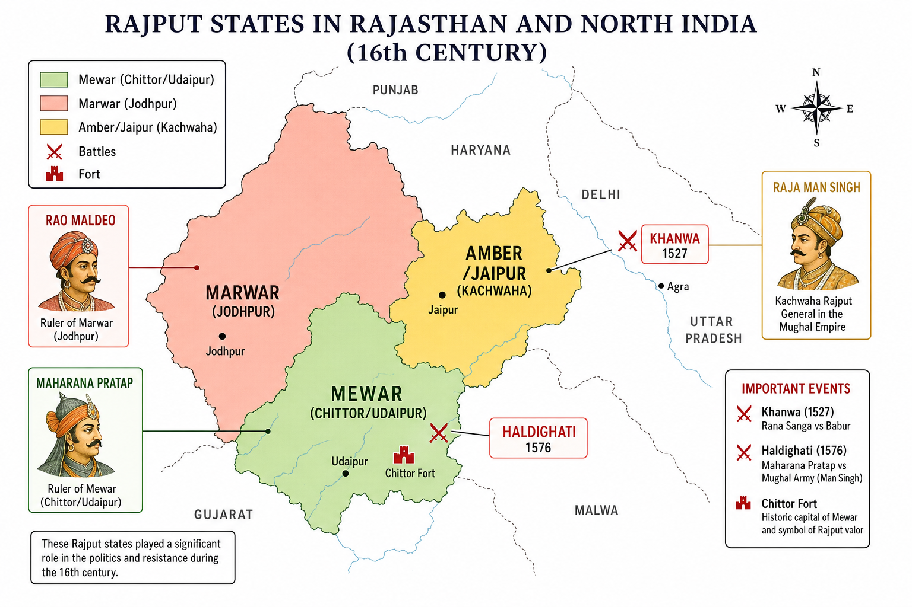

# Topic 9 — Rajputs
### ★ Complete Source of Truth — No other book/notes needed for this topic

> **Covers syllabus:** Rajput Warriors | Maharana Pratap | Battle of Haldighati | Rana Sanga | Rajput States  
> **Sources baked in:** NCERT *Themes in Indian History Part II*, RS Sharma *Medieval India*, export notes (Struggle for Empire I–II), UPPCS/UPSC PYQs 2018–2025  
> **Exam weight:** ★★★ High — ruler–state match traps (Hamir/Chunda), Khanwa vs Haldighati, Chittor siege chronology, Man Singh vs Pratap, Marwar vs Mewar  
> **Last verified:** July 2026

---

## Quick Revision Box — Raata This First

```
RAJPUT FRAME:
  Rajput = martial clans claiming Kshatriya status | Fort + cavalry warfare | Jauhar/Saka codes
  Major clans: Sisodia (Mewar) | Rathore (Marwar) | Kachhwaha (Amber/Jaipur) | Chauhan | Hada | Bhati

KEY STATES & CAPITALS (★★★):
  Mewar (Sisodia) → Chittor → Udaipur | Marwar (Rathore) → Jodhpur/Mandore
  Amber/Kachhwaha → Amber/Jaipur | Bikaner (Rathore branch) | Jaisalmer (Bhati) | Bundi-Kota (Hada)

RANA SANGA (MEWAR):
  Rana Sangram Singh | United Rajput confederacy vs Babur
  Khanwa 16 March 1527 — Babur won | Mahmud Lodi on Rajput side | Sanga died ~1528

MAHARANA PRATAP (MEWAR):
  Son of Rana Udai Singh II | Refused Akbar's submission | Capital shift: Chittor → Udaipur (1559)
  Guerrilla resistance from Aravalli | Chetak horse legend | Died 1597 | Amar Singh submitted 1615 (Jahangir)

HALDIGHATI 1576 (★★★):
  18 June 1576 | Pratap vs Mughal army under Raja Man Singh (Amber)
  Pass near Gogunda/Udaipur | Tactical indecisive — Pratap escaped | Mughal strategic gain in plains

CHITTOR & ALAUDDIN (PYQ):
  Alauddin Khalji siege 1303 (jauhar Padmini legend) | Akbar siege 1567–68 (jauhar Patta/Jaimal)
  2025 Q30 / 2022 Q59 order: Gujarat → Ranthambore → Chittor → Warangal = B/C (2-1-4-3)

MATCH TRAPS (★★★):
  Rana Hamir → Mewar ✓ | Rana Chunda → Marwar ✗ (Chunda = Mewar; Rao Chunda = Marwar) — 2021 Q118 = B
  Khanwa 1527 → Sanga | Haldighati 1576 → Pratap | Panipat II 1556 → Hemu
  Jayata/Kumpa → Marwar (Rao Maldeo) — 2022 Q95 = C | NOT Mewar
  Tansen patron before Akbar → Ramchandra Singh of Rewa — NOT Uday Singh Mewar (2019 Q89 = A)
```

### Must-Know Term Comparisons (very frequently asked)

| Term | One-line difference | Hindi |
|------|---------------------|-------|
| **Rana vs Maharana vs Rao** | **Rana/Maharana** = Sisodia **Mewar** title; **Rao** = Rathore **Marwar/Bikaner** title — don't swap | राणा / महाराणा / राव |
| **Rana Chunda vs Rao Chunda** | **Rana Chunda** = **Mewar** (Guhila regent legend); **Rao Chunda** = **Marwar** Rathore founder — **2021 Q118 trap** | राणा चुंडा / राव चुंडा |
| **Khanwa vs Haldighati** | **Khanwa 1527** Babur vs **Rana Sanga**; **Haldighati 1576** Akbar's Man Singh vs **Rana Pratap** | खानवा / हल्दीघाटी |
| **Mewar vs Marwar** | **Mewar** = Udaipur–Chittor **Sisodia**; **Marwar** = Jodhpur **Rathore** — different kingdoms | मेवाड़ / मारवाड़ |
| **Sisodia vs Rathore vs Kachhwaha** | **Sisodia** = Mewar (Pratap, Sanga); **Rathore** = Marwar (Maldeo, Jodha); **Kachhwaha** = Amber (Man Singh) | सिसोदिया / राठौड़ / कछवाहा |
| **Chittor vs Udaipur** | **Chittor** = old capital (fort sieges 1303, 1568); **Udaipur** = Udai Singh II's new capital **1559** | चित्तौड़ / उदयपुर |
| **Rana Sanga vs Maharana Pratap** | **Sanga** fought **Babur** (1527); **Pratap** fought **Akbar** (1576) — two Mewar heroes, two Mughal generations | राणा सांगा / महाराणा प्रताप |
| **Raja Man Singh vs Rana Pratap** | Both Rajputs — **Man Singh (Kachhwaha)** led **Mughal** army at Haldighati vs **Pratap (Sisodia)** | राजा मान सिंह / राणा प्रताप |
| **Jauhar vs Saka** | **Jauhar** = mass self-immolation of women before fort fall; **Saka** = Rajput warriors' death charge after | जौहर / साका |
| **Akbar's Rajput policy vs Pratap's resistance** | Most Rajputs allied (Amber, Jodhpur later); **Mewar under Pratap** = main holdout | अकबरी राजनीति / प्रताप का प्रतिरोध |
| **Alauddin's Chittor vs Akbar's Chittor** | **1303** Khalji siege (Ratan Singh/Padmini lore); **1567–68** Akbar siege (Udai Singh fled, jauhar of Patta) | अलाउद्दीन का चित्तौड़ / अकबर का चित्तौड़ |
| **Rana Hamir vs Rana Kumbha** | **Hamir** (14th c.) restored **Mewar** after Khalji; **Kumbha** (15th c.) builder/patron — Vijay Stambha | राणा हमीर / राणा कुम्भा |
| **Udai Singh II vs Udai Singh (1540)** | **Udai Singh II** = Pratap's father (Mewar); don't confuse with other namesakes | उदय सिंह (मेवाड़) |
| **Amar Singh vs Pratap** | **Pratap** resisted till death **1597**; son **Amar Singh** peace with Jahangir **1615** | अमर सिंह / प्रताप |
| **Bhati vs Rathore** | **Bhati** = **Jaisalmer** desert kingdom; **Rathore** = Marwar/Bikaner line | भाटी / राठौड़ |

### Memory Tricks

| Trick | Remembers |
|-------|-----------|
| **1527 vs 1576** | **S**anga **27** (Khanwa) → **P**ratap **76** (Haldighati) — S before P, 27 before 76 |
| **2021 Q118** | **R**ana **C**hunda ≠ **M**arwar — **RC≠M** |
| **Chunda title trap** | **Rao** = Marwar | **Rana** Chunda = Mewar |
| **Man at Haldighati** | **M**an **S**ingh — **M**ughal side at **H**aldighati |
| **Chittor 1303–1568** | **Alauddin 1303** → **Akbar 1568** — 265 years apart, same fort |
| **Alauddin order 2025 Q30** | **G**ujarat → **R**anthambore → **C**hittor → **W**arangal = **GRCW** → **2-1-4-3** |
| **Chetak** | **C**hetak carried **P**ratap from Haldighati — legend in Mewar lore |
| **Tansen trap 2019** | **R**ewa **R**amchandra — **RR** before Akbar, not Mewar |
| **Jayata-Kumpa** | **Marwar** Rathores — **2022 Q95 = C** |
| **Khanwa coalition** | **S**anga + **M**ahmud **L**odi vs Babur — SML broken |

---

## Exam Visuals — High-ROI Images

> **Type priority:** Rajput states map → battle sites. Images stored locally (`images/`) for offline revision.

### 1. Rajput States & Battle Sites Map



*Raata **Mewar–Marwar–Amber triangle** + **Khanwa (1527)** + **Haldighati (1576)** + **Chittor**. UPPCS loves **state–ruler match** and **battle–year** pairs.*
*Source: Study map — generated for UPPCS Rajput geography*

---

## 9.1 Rajput Warriors — Military Culture & Traditions

### Definitions (learn all — exams pick different ones)

| Source | Definition |
|--------|------------|
| **General** | **Rajput** = member of martial **clan–lineages** in North/West India claiming **Kshatriya** status; dominant in **Rajasthan**, **Malwa**, **Gujarat**, **Bundelkhand** from early medieval period |
| **NCERT** | Rajput age = **regional kingdoms** + **fort-based warfare** + **patronage of temples**; interaction with **Delhi Sultanate** and **Mughals** shaped politics |
| **Exam** | Rajput ≠ single dynasty — **many states** under clan names (Sisodia, Rathore, Kachhwaha, Chauhan, Paramara, Solanki, Gahadavala) |

### Rajput Warriors — How It Works

- **Clan identity:** Rajput status rested on **genealogy**, **martial service**, **land control**, and **marriage alliances**. There was no single centralized Rajput empire.
- **Fort warfare:** **Hill forts** such as Chittor, Kumbhalgarh, Ranthambore, Mandu, and Gwalior were economic and symbolic centres. Their sieges shaped Rajput interaction with the Sultanate and the Mughals.
- **Cavalry elite:** Rajput armies relied on **horse-mounted warriors**, **elephants**, and **local infantry**. Loyalty usually centred on the **clan chief** rather than an abstract empire.
- **Chivalry codes:** Rajput ballads and chronicles celebrated honour (**izzat**), protection of vassals, hospitality, and battlefield bravery.
- **Jauhar and Saka:** When defeat seemed certain, **jauhar** meant women's self-immolation and **saka** meant the warriors' final sortie. The Chittor sieges of **1303** and **1568** are the best-known examples.
- **Alliances and rivalries:** Rajput clans often fought one another as much as outsiders. **Mewar vs Marwar** and **Amber** support to the Mughals against **Sisodia** Mewar are key examples.
- **Against Delhi Sultanate:** Rajput resistance and submission both appeared against the Delhi Sultanate. Examples include **Prithviraj Chauhan** at Tarain, **Rana Hammir** against the Khaljis, and **Alauddin's Chittor siege in 1303**.
- **Against Mughals:** **Rana Sanga** fought Babur at Khanwa in **1527**, and **Rana Pratap** resisted Akbar at Haldighati in **1576**. Many **Kachhwaha** and **Rathore** Rajputs, however, joined Mughal service.
- **Rajput generals in Mughal army:** **Raja Man Singh** and **Raja Bhagwan Das** held high mansabs. Their careers show a Rajput-Mughal **composite elite**, not a simple Hindu-Muslim binary.
- **Regional spread:** The Rajput core was in **Rajasthan**, but Rajput dynasties also appeared in **Bundelkhand**, **Malwa**, **Gujarat**, and nearby **Awadh** zones. UPPCS may ask which state was not in Rajasthan.
- **Women in Rajput lore:** The **Padmini/Jauhar legend**, **Mirabai's Krishna bhakti**, and women in battle narratives show that Rajput memory is not limited to kings.
- **Decline pattern:** After **Akbar's alliances**, many Rajput states became Mughal partners. Conflict briefly revived under **Aurangzeb** in Marwar and Mewar.

> **Exam note:** Rajput warrior question usually tests **specific ruler–clan–state** match or **which battle which leader** — not generic "brave Kshatriyas" definition alone.

### Exam Facts (raata)

- Rajputs were **clan-based martial elites** who ruled multiple kingdoms.
- **Jauhar** and **saka** are closely linked with the Chittor siege tradition.
- **Fort warfare** and **cavalry** formed the core Rajput military style.
- **Prithviraj Chauhan** and **Rana Hammir** are famous early resistance figures.
- Many Rajputs also served as **Mughal mansabdars**.
- **Ballads** and **chronicles** preserve Rajput memory, but they do not always follow strict chronology.

### PYQs — Rajput Warriors

1. **(UPPCS 2022, Q95)** Jayata and Kumpa impressed Sher Shah — associated with **Marwar** (Rathore generals under Rao Maldeo) → **C**. Tests Rajput **warrior–state** geography.

2. **(UPPCS 2021, Q118)** NOT matched: **Rana Chunda – Marwar** → **B**. **Rana Chunda** belongs to **Mewar** lore; **Rao Chunda** = Marwar founder — title trap.

### Examples (9.1)

| Example | Detail | Exam use |
|---------|--------|----------|
| **Jauhar at Chittor 1568** | Akbar siege — Patta, Jaimal killed; jauhar | Rajput military–social code |
| **Jaita & Kumpa (1544)** | Marwar Rathores vs Sher Shah at Sammel | Rajput warrior fame beyond Mughal era |
| **Rana Hammir (1326–1364)** | Restored Mewar after Khalji defeat | 2021 Q118 correct pair |

---

## 9.2 Maharana Pratap — Life, Resistance & Legacy

### Definitions (learn all — exams pick different ones)

| Source | Definition |
|--------|------------|
| **General** | **Maharana Pratap Singh** (r. **1572–1597**) — Sisodia ruler of **Mewar**; leading **anti-submission** Rajput resistance against **Akbar** |
| **NCERT** | Symbol of **regional autonomy**; refused Mughal overlordship unlike **Kachhwaha Amber**; guerrilla warfare from **Aravalli** hills |
| **Exam** | Title **Maharana** (not merely Rana) = senior Sisodia rank; capital era **Kumbhalgarh / Gogunda / Chavand** — not stable single court like Mughals |

### Maharana Pratap — How It Works

- **Lineage:** Maharana Pratap was the son of **Rana Udai Singh II** of the Sisodia clan of Mewar. His traditional birth year is **1540**.
- **Accession 1572:** He became ruler after Udai Singh's death in **1572**. He inherited a reduced kingdom after **Akbar's Chittor siege (1567–68)** and the earlier shift to **Udaipur in 1559**.
- **Refused Akbar's alliance:** Unlike **Raja Bharmal of Amber**, Pratap refused Mughal subordination. He did not accept a mansab or tribute obligation under Akbar.
- **Akbar's pressure:** Akbar wanted **Mewar submission** to complete Rajput integration. The **Haldighati campaign of 1576** followed failed diplomacy.
- **Guerrilla phase:** After Haldighati, Pratap used the **Aravalli hills** around **Kumbhalgarh, Gogunda, and Chavand** as bases. He harassed Mughal posts and avoided pitched battles on the plains.
- **Chetak legend:** **Chetak** was Pratap's horse in the Haldighati tradition. The story of the wounded horse carrying Pratap to safety is central to **Mewar folk memory**.
- **Bhama Shah:** **Bhama Shah** financed Mewar resistance. His support shows the role of Rajput **merchant-patrons** in sustaining the guerrilla state.
- **Reconquest efforts:** Pratap recovered much of Mewar, but **Chittor** and **Mandalgarh** remained strong Mughal holdouts. His success was partial, not complete independence.
- **Death 1597:** Pratap died at **Chavand** in **1597**. His son **Amar Singh** continued resistance before negotiating with the Mughals.
- **1615 peace:** **Amar Singh** submitted to **Jahangir** in **1615**. Mewar received honourable terms, and open war ended.
- **Legacy:** Pratap became a national and regional icon of **freedom and honour**. UPPCS still tests his **dates, battles, and opponents** more than symbolism alone.
- **Trap — opponent at Haldighati:** **Raja Man Singh of Amber** led the Mughal army at Haldighati. Akbar was not personally present in the field.

> **Exam note:** Pratap = **1576 Haldighati** + **refused Akbar** + **Udai Singh's son** — do NOT pair with **Khanwa 1527** (that is **Rana Sanga**).

### Exam Facts (raata)

- Maharana Pratap ruled **1572–1597** and died at **Chavand** in **1597**.
- He was the son of **Rana Udai Singh II**.
- He refused submission to **Akbar**.
- He continued **guerrilla resistance** from the Aravalli region.
- **Chetak** is the horse associated with the Haldighati legend.
- His son **Amar Singh** made peace with Jahangir in **1615**.
- The title **Maharana** belongs to the Sisodia line of **Mewar**.

### PYQs — Maharana Pratap

1. **(UPPCS 2025 pattern / Topic 7 battle match)** Haldighati → **Rana Pratap 1576** — paired opposite **Khanwa → Sanga 1527**.

2. **(UPSC 2019 pattern — battle commander)** Mughal side at Haldighati led by **Raja Man Singh** for Akbar — Rajput vs Rajput command.

### Examples (9.2)

| Example | Detail | Exam use |
|---------|--------|----------|
| **Bhama Shah donation** | Funded army after Haldighati | Internal Rajput support |
| **Chavand capital** | Late-life base | Death place trap vs Chittor |
| **Amar Singh 1615** | Submission under Jahangir | End of Sisodia open war |

---

## 9.3 Battle of Haldighati (18 June 1576)

### Definitions (learn all — exams pick different ones)

| Source | Definition |
|--------|------------|
| **General** | **Battle of Haldighati** — fought in **narrow Aravalli pass** (near **Gogunda**, Mewar) between **Rana Pratap's forces** and **Mughal army** under **Raja Man Singh** |
| **NCERT** | **Tactically indecisive** — Pratap escaped; **strategically** Mughals strengthened hold on Mewar plains and forts |
| **Exam** | Date **1576**; **not** 1527 (Khanwa) or 1556 (Panipat II) |

### Battle of Haldighati — How It Works

- **Background:** Akbar's **Rajput policy** had mostly succeeded, but **Mewar under Pratap** remained defiant after the fall of Chittor in **1568**.
- **Mughal command:** **Raja Man Singh** of **Amber (Kachhwaha)** led the imperial force. **Asaf Khan** was also in the Mughal camp, while Akbar was not present at the pass.
- **Rajput command:** **Rana Pratap** personally led the Mewar army. His allies included **Bhils** and Afghan remnants under **Hakim Khan Sur**.
- **Terrain:** **Haldighati pass** had a narrow front and turmeric-coloured soil. The terrain initially reduced the Mughal numerical advantage.
- **18 June 1576:** The battle was a fierce **cavalry clash**. Sources describe Pratap targeting Man Singh's elephant or howdah, with heavy casualties on both sides.
- **Chetak episode:** Pratap's horse **Chetak** was wounded but carried him to safety before dying. The episode became iconic in Rajasthani lore.
- **Outcome debate:** The battle did not annihilate Pratap's army. Pratap withdrew to the hills, and the Mughals failed to capture him.
- **Strategic result:** The Mughals later captured posts such as **Gogunda** and **Kumbhalgarh**. Mewar's plains came under Mughal pressure, while Pratap shifted to guerrilla resistance.
- **Rajput vs Rajput:** The battle placed **Man Singh** against **Pratap**. It shows the Mughal empire as a multi-ethnic power rather than a simple religious bloc.
- **Bhils' role:** **Bhils** fought as tribal allies of Pratap. UPPCS may ask who supported Pratap at Haldighati.
- **Aftermath till 1597:** Pratap never accepted a Mughal mansab. Mewar recovered partially, but formal peace came only in **1615** under Amar Singh.
- **Trap — "Mughal victory" wording:** Textbooks vary on the battle's result. The safest exam line is **Mughal strategic advantage** with **Pratap surviving** to continue resistance.

> **Exam note:** **Man Singh** (not Akbar) commanded at Haldighati — **2025/2019 battle-match** format loves this swap trap.

### Exam Facts (raata)

- The battle was fought on **18 June 1576**.
- The site was **Haldighati pass** in Mewar near Gogunda.
- **Maharana Pratap** fought the Mughal army led by **Raja Man Singh**.
- **Chetak** is the famous horse legend, and **Bhils** supported Pratap.
- The battle was tactically **indecisive**, but the Mughals gained a strategic edge.
- Haldighati was **not** Khanwa and **not** Panipat.

### PYQs — Haldighati

1. **(UPPCS 2025 pattern — battle chronology set)** Haldighati **1576** listed after **Khanwa/Chausa era** battles — know **4-2-3-1** type orders include **1576** as Pratap marker.

2. **(UPPCS Topic 7 Practice Q38 pattern)** Match: **D. Haldighati → 4. Rana Pratap 1576** — answer code **A (2-1-3-4)** for full battle set.

### Examples (9.3)

| Example | Detail | Exam use |
|---------|--------|----------|
| **Hakim Khan Sur** | Afghan ally of Pratap at Haldighati | Coalition not purely Sisodia |
| **Punja Bhil** | Bhil chief ally | "Who supported Pratap" |
| **Gogunda** | Nearby town/military objective | Geography MCQ |

---

## 9.4 Rana Sanga — Confederacy & Khanwa

### Definitions (learn all — exams pick different ones)

| Source | Definition |
|--------|------------|
| **General** | **Rana Sanga** = **Rana Sangram Singh** of **Mewar** — early 16th c. ruler who united **Rajput confederacy** against **Babur** |
| **NCERT** | Strongest **Rajput challenge** to early Mughal power after Panipat 1526 — broken at **Khanwa 1527** |
| **Exam** | Sanga invited/helped context with **anti-Lodi** politics but later **fought Babur** — don't assume continuous Babur alliance |

### Rana Sanga — How It Works

- **Mewar power:** Sanga expanded Mewar through conflicts with **Malwa, Gujarat, and Marwar**. He became the premier Rajput ruler before Babur consolidated power.
- **Wounds and wars:** Tradition credits Sanga with **80 wounds**, one lost eye, and one lost arm. This biographical detail made him a symbol of **Rajput endurance**.
- **Anti-Lodi context:** North India was unstable after **Ibrahim Lodi**. **Rana Sanga** and **Daulat Khan Lodi** both interacted with Babur's entry into Indian politics.
- **Babur vs Sanga rivalry:** After **Panipat 1526**, Babur controlled Delhi but had not secured Rajasthan. Sanga assembled a large Rajput coalition against him.
- **Mahmud Lodi alliance:** The Lodi claimant **Mahmud Lodi** joined Sanga. Khanwa therefore involved a **Rajput-Afghan** alliance against Babur.
- **Battle of Khanwa (16 March 1527):** The battle was fought near the **Fatehpur Sikri/Bharatpur** region. Babur again used **araba** wagons and **Tulughma** tactics.
- **Outcome:** Babur won decisively at Khanwa. The Rajput confederacy was shattered, and Mughal control in North India became stronger.
- **Sanga's death:** Sanga died around **1528**, though accounts differ on whether poison or wounds caused his death. Mewar weakened temporarily after him.
- **Comparison to Pratap:** **Sanga fought Babur in 1527**, while **Pratap fought Akbar in 1576**. The two Mewar resistances were 49 years apart.
- **Invitation trap:** Some accounts say the Rajputs underestimated Babur's gunpowder tactics. This point often appears in military history comparisons.
- **After Khanwa:** Babur next fought **Chanderi in 1528** and **Ghagra in 1529**. No similar all-Rajput confederacy challenged him afterward.
- **High-priority UPPCS addition:** The syllabus explicitly lists the **Battle of Khanwa**. It must be paired with **Rana Sanga**, never with Pratap.

> **Exam note:** **Khanwa = 1527 = Sanga** | **Haldighati = 1576 = Pratap** — most common Rajput battle swap trap in UPPCS.

### Exam Facts (raata)

- **Rana Sangram Singh (Sanga)** ruled Mewar.
- He fought Babur at **Khanwa on 16 March 1527**.
- **Mahmud Lodi** fought on Sanga's side.
- Babur won decisively, and the Rajput confederacy was broken.
- Sanga died around **1528**.
- Khanwa came **49 years before** Haldighati.

### PYQs — Rana Sanga

1. **(UPPCS Topic 7 Practice Q38 / battle match)** **A. Khanwa → 2. Rana Sanga 1527** — core UPPCS battle pairing.

2. **(UPPCS 2019, Q89 — indirect)** **Uday Singh of Mewar** option — tests knowing **Mewar rulers** apart from **Sanga/Pratap** era; Tansen patron = **Rewa**, not Mewar → **A**.

### Examples (9.4)

| Example | Detail | Exam use |
|---------|--------|----------|
| **Khanwa wagons** | Babur repeated Panipat tactics | Military history link |
| **Mahmud Lodi** | Afghan ally | Coalition composition |
| **Sanga's injuries** | Biographical uniqueness | Identification MCQ |

---

## 9.5 Rajput States — Kingdoms, Capitals & Rulers

### Definitions (learn all — exams pick different ones)

| Source | Definition |
|--------|------------|
| **General** | **Rajput states** = regional kingdoms ruled by Rajput clans — **not unified empire** — each with **capital fort**, **clan genealogy**, **Mughal treaty** or **resistance** history |
| **NCERT** | Major zones: **Mewar, Marwar, Amber, Hadoti, Bikaner, Jaisalmer** — plus **Bundelkhand, Malwa** Rajput dynasties |
| **Exam** | Match **ruler–state–capital–clan** — negative questions ("NOT correctly matched") most common |

### Rajput States — How It Works

- **Mewar (Sisodia/Guhila):** Mewar's capital was **Chittor** and later **Udaipur**. Its major rulers included **Hammir, Kumbha, Sanga, Udai Singh II, and Pratap**.
- **Marwar (Rathore):** Marwar's capital shifted from **Mandore** to **Jodhpur**. **Rao Jodha** founded Jodhpur, and **Rao Maldeo** made Marwar powerful in the mid-16th century.
- **Amber/Kachhwaha (Jaipur line):** Amber later developed into the Jaipur line. **Raja Bharmal** allied with Akbar, and **Man Singh** and **Bhagwan Das** became Mughal mansabdars.
- **Bikaner (Rathore branch):** **Rao Bika** founded Bikaner in **1465**. The desert kingdom often allied with the Mughals.
- **Jaisalmer (Bhati):** Jaisalmer was a desert **trader-fort** state of the Bhati clan. Alauddin's **1299–1300** siege is linked with Jaisalmer jauhar traditions.
- **Bundi & Kota (Hada Chauhan):** Bundi and Kota belonged to the Hadoti region. They were smaller but older Hada Chauhan states.
- **Karauli (Yaduvanshi):** Karauli was an eastern Rajasthan state. It appears less often but can appear in match lists.
- **Malwa Paramaras (Dhar):** The Paramaras of Dhar were a Rajput dynasty. **Bhoja** represents their medieval peak and overlaps with early medieval topics.
- **Marwar vs Mewar trap:** Marwar and Mewar were neighbouring but distinct Rajput powers. Their clans, capitals, and rulers must not be swapped.
- **Mughal treaty tiers:** The **Kachhwahas** became close Mughal allies, the **Rathores** had a mixed relationship, and **Sisodia Mewar** submitted only in **1615**.
- **Chittor sieges — two eras:** **Alauddin Khalji** besieged Chittor in **1303**, and **Akbar** besieged it in **1567–68**. The fort was Mewar in both cases.
- **2021 Q118 logic:** **Rana Hamir** belongs to Mewar, and **Rana Chunda** should not be matched with Marwar. **Rao Chunda**, not Rana Chunda, is linked with Marwar.

### Rajput States — Complete Table

| State | Clan | Capital(s) | Key rulers (exam) |
|-------|------|------------|-------------------|
| **Mewar** | Sisodia (Guhila) | Chittor, Udaipur | Hammir, Kumbha, Sanga, Udai Singh II, Pratap |
| **Marwar** | Rathore | Mandore, Jodhpur | Rao Jodha, Rao Maldeo, Jaita & Kumpa |
| **Amber (Jaipur)** | Kachhwaha | Amber, Jaipur | Bharmal, Bhagwan Das, Man Singh |
| **Bikaner** | Rathore (Bika line) | Bikaner | Rao Bika |
| **Jaisalmer** | Bhati | Jaisalmer | Rawal Jaisal; Alauddin siege 1299–1300 |
| **Bundi** | Hada Chauhan | Bundi | Rao Surjan (sur rendered Chittor gate lore) |
| **Kota** | Hada Chauhan | Kota | Breakaway from Bundi |
| **Karauli** | Yaduvanshi | Karauli | — |

### Exam Facts (raata)

- **Mewar** was Sisodia, **Marwar** was Rathore, and **Amber** was Kachhwaha.
- **Chittor** was Mewar's old capital, and **Udaipur** became the new capital from **1559**.
- **Jodhpur** belonged to Marwar, while the **Jaipur line** developed from Amber.
- **Rana Hamir** restored Mewar in the **14th century**.
- **Rao Maldeo** belonged to Marwar and is linked with **Sammel 1544**.
- **Raja Man Singh** belonged to Amber and the Kachhwaha clan.

### PYQs — Rajput States

1. **(UPPCS 2021, Q118)** Which NOT matched? **B. Rana Chunda – Marwar** → **B** (Chunda = **Mewar**; **Rao Chunda** = Marwar).

2. **(UPPCS 2022, Q59 / 2025, Q30)** Alauddin conquests order including **Chittor (Mewar fort)** → **C / B (2-1-4-3)** — Gujarat → Ranthambore → Chittor → Warangal.

3. **(UPPCS 2022, Q95)** Jayata & Kumpa → **Marwar** (Rathore) → **C**.

### Examples (9.5)

| Example | Detail | Exam use |
|---------|--------|----------|
| **Rana Hamir – Mewar** | 2021 Q118 correct pair | Founder restorer |
| **Rao Maldeo – Marwar** | vs Sher Shah 1544 | Marwar ≠ Mewar |
| **Alauddin Chittor 1303** | Mewar fort Khalji siege | Chronology with 2025 Q30 |

---

## Consolidated Reference

### Battle — Ruler — Year Master Table

| Battle | Year | Rajput side | Opponent | Result |
|--------|------|-------------|----------|--------|
| **Tarain I & II** | 1191, 1192 | Prithviraj Chauhan | Muhammad Ghori | Rajput loss (1192) |
| **Chittor siege** | 1303 | Mewar (Ratan Singh) | Alauddin Khalji | Khalji capture; jauhar legend |
| **Khanwa** | **1527** | **Rana Sanga** + allies | **Babur** | Babur decisive win |
| **Sammel** | 1544 | Rao Maldeo (Marwar) | Sher Shah | Sher Shah costly win |
| **Chittor siege** | 1567–68 | Udai Singh II (fled) | Akbar | Mughal capture; jauhar |
| **Haldighati** | **1576** | **Rana Pratap** | Man Singh (for Akbar) | Tactical stalemate; Mughal strategic edge |

### Ruler — State — Clan Match Table (Complete)

| Ruler | State | Clan | Trap |
|-------|-------|------|------|
| Rana Hammir | Mewar | Sisodia | ✓ 2021 Q118 |
| Rana Kumbha | Mewar | Sisodia | Built Vijay Stambha |
| Rana Sanga | Mewar | Sisodia | Khanwa 1527 |
| Rana Udai Singh II | Mewar | Sisodia | Udaipur founder 1559 |
| Maharana Pratap | Mewar | Sisodia | Haldighati 1576 |
| Rana Chunda | **Mewar** | Guhila/Sisodia lore | **NOT Marwar** |
| Rao Chunda | **Marwar** | Rathore | **Rao** not Rana |
| Rao Jodha | Marwar | Rathore | Founded Jodhpur |
| Rao Maldeo | Marwar | Rathore | Sammel 1544 |
| Jaita & Kumpa | Marwar | Rathore | 2022 Q95 |
| Raja Bharmal | Amber | Kachhwaha | Akbar alliance |
| Raja Man Singh | Amber | Kachhwaha | Haldighati Mughal cmd |

### UP Focus — Rajputs & UPPCS Geography

| Element | Detail | PYQ / trap link |
|---------|--------|-----------------|
| **Bundelkhand** | Chandela forts (Kalinjar, Mahoba) — Rajput-era overlap | Border with UP |
| **Kannauj/Ganga plain** | Rajput–Turk struggles (Gahadavala) | Early medieval → Sultanate |
| **Prayag/Allahabad** | Mughal princes governed Doab — Rajput interface | Topic 7 overlap |
| **Agra–Delhi corridor** | Khanwa fought west of Doab | 1527 Babur–Sanga |
| **NOT in UP** | Mewar, Marwar, Amber = **Rajasthan** — trap "Rajput state in UP" | Negative MCQ |
| **Chittor** | Rajasthan (Mewar) — **2025 Q30** chronology | Not UP but high priority |
| **Haldighati** | Rajasthan (Udaipur district) | Syllabus high-priority addition |

### Important Dates

| Item | Date |
|------|------|
| Tarain II (Prithviraj defeated) | 1192 |
| Alauddin Khalji siege of Chittor | 1303 |
| Rana Hammir restores Mewar | from **1326** |
| Rao Bika founds Bikaner | **1465** |
| Rana Sanga vs Babur (Khanwa) | **16 March 1527** |
| Sanga dies | ~**1528** |
| Sher Shah vs Maldeo (Sammel) | **1544** |
| Udai Singh II moves to Udaipur | **1559** |
| Akbar sieges Chittor | **1567–68** |
| Battle of Haldighati | **18 June 1576** |
| Rana Pratap dies | **1597** |
| Amar Singh peace with Jahangir | **1615** |
| Alauddin: Gujarat conquest | **1299** |
| Alauddin: Ranthambore | **1301** |
| Alauddin: Warangal | **1308** |

---

## Practice Zone — UPPCS Format Questions

> **Answers hidden** — click *Show answer* under each question to reveal.

**Q1.** Consider the following statements about **Rajput warriors**:

1. Jauhar was the mass self-immolation of women before expected capture of a fort.
2. Saka referred to the Rajput warriors' final sortie after jauhar.

Which is/are correct?

Options:
A. Only 1
B. Only 2
C. Both 1 and 2
D. Neither 1 nor 2

<details>
<summary>Show answer</summary>

**Ans: C** — Standard jauhar–saka pairing.

</details>

**Q2.** Which one of the following is **NOT** correctly matched?

Options:
A. Rana Hamir – Mewar
B. Rana Chunda – Marwar
C. Rao Maldeo – Marwar
D. Maharana Pratap – Mewar

<details>
<summary>Show answer</summary>

**Ans: B** — **2021 Q118** — Rana Chunda = **Mewar**, not Marwar.

</details>

**Q3.** Match List-I (Battle) with List-II (Rajput leader / context):

| List-I | List-II |
|--------|---------|
| A. Khanwa | 1. Rana Pratap |
| B. Haldighati | 2. Rana Sanga |
| C. Sammel | 3. Rao Maldeo |
| D. Chittor (1303) | 4. Mewar vs Alauddin Khalji |

Options:
A. 2 1 3 4
B. 1 2 3 4
C. 2 3 1 4
D. 4 2 3 1

<details>
<summary>Show answer</summary>

**Ans: A (2-1-3-4)** — Khanwa-Sanga; Haldighati-Pratap; Sammel-Maldeo; 1303-Mewar.

</details>

**Q4.** Given below are two statements:

**Assertion (A):** The Battle of Haldighati was fought in 1527.

**Reason (R):** Rana Sanga led the Rajput confederacy against Babur at Haldighati.

Options:
A. Both (A) and (R) are true and (R) is the correct explanation of (A)
B. Both (A) and (R) are true but (R) is not the correct explanation of (A)
C. (A) is true but (R) is false
D. (A) is false but (R) is true

<details>
<summary>Show answer</summary>

**Ans: D** — **A false** (1576 not 1527); **R false pairing** — Sanga = Khanwa, not Haldighati.

</details>

**Q5.** Who led the Mughal army against Rana Pratap at the Battle of Haldighati?

Options:
A. Akbar personally
B. Raja Man Singh
C. Bairam Khan
D. Raja Todar Mal

<details>
<summary>Show answer</summary>

**Ans: B** — **Man Singh (Amber)** commanded for Akbar.

</details>

**Q6.** Arrange Alauddin Khalji's conquests in chronological order:

1. Ranthambore
2. Gujarat
3. Warangal
4. Chittor

Options:
A. 1, 2, 3, 4
B. 2, 1, 4, 3
C. 2, 1, 3, 4
D. 1, 2, 4, 3

<details>
<summary>Show answer</summary>

**Ans: B (2-1-4-3)** — **2025 Q30 / 2022 Q59** — Gujarat → Ranthambore → Chittor → Warangal.

</details>

**Q7.** From which place were Jayata and Kumpa associated, who impressed Sher Shah with their valour?

Options:
A. Bundelkhand
B. Malwa
C. Marwar
D. Mewar

<details>
<summary>Show answer</summary>

**Ans: C (Marwar)** — **2022 Q95** — Rathore generals of Rao Maldeo.

</details>

**Q8.** Consider the following about **Maharana Pratap**:

1. He was the son of Rana Udai Singh II.
2. He accepted a Mughal mansab under Akbar after Haldighati.

Which is/are correct?

Options:
A. Only 1
B. Only 2
C. Both 1 and 2
D. Neither 1 nor 2

<details>
<summary>Show answer</summary>

**Ans: A** — Statement 2 false — Pratap **never** submitted to Akbar.

</details>

**Q9.** Who among the following kings had given patronage to Tansen before Akbar?

Options:
A. Raja Ramchandra Singh of Bhata
B. Rajbahadur of Malwa
C. Uday Singh of Mewar
D. Muzaffar Shah of Gujarat

<details>
<summary>Show answer</summary>

**Ans: A** — **2019 Q89** — **Rewa/Bhata**, not Uday Singh Mewar (trap C).

</details>

**Q10.** Which Rajput state was ruled by the **Kachhwaha** clan?

Options:
A. Mewar
B. Marwar
C. Amber
D. Jaisalmer

<details>
<summary>Show answer</summary>

**Ans: C** — Amber/Jaipur = Kachhwaha.

</details>

**Q11.** Assertion (A): Rana Sanga was defeated by Babur at the Battle of Khanwa.

Reason (R): Babur used wagon fort (araba) tactics at Khanwa.

Options:
A. Both true; R explains A
B. Both true; R does not explain A
C. A true; R false
D. A false; R true

<details>
<summary>Show answer</summary>

**Ans: A** — Both facts correct — tactics helped Babur win **1527**.

</details>

**Q12.** Match List-I (Capital) with List-II (Rajput state):

| List-I | List-II |
|--------|---------|
| A. Jodhpur | 1. Mewar |
| B. Udaipur | 2. Marwar |
| C. Amber | 3. Kachhwaha state |
| D. Jaisalmer | 4. Bhati state |

Options:
A. 2 1 3 4
B. 1 2 3 4
C. 2 3 1 4
D. 3 2 1 4

<details>
<summary>Show answer</summary>

**Ans: A (2-1-3-4)** — Jodhpur-Marwar; Udaipur-Mewar; Amber-Kachhwaha; Jaisalmer-Bhati.

</details>

**Q13.** The Battle of Haldighati was fought in:

Options:
A. 1527
B. 1556
C. 1576
D. 1658

<details>
<summary>Show answer</summary>

**Ans: C** — **1576** — not Khanwa (1527) or Panipat II (1556).

</details>

**Q14.** Consider the following statements:

1. Rao Chunda is associated with the rise of Marwar.
2. Rana Chunda is correctly matched with Marwar in all standard chronicles.

Which is/are correct?

Options:
A. Only 1
B. Only 2
C. Both 1 and 2
D. Neither 1 nor 2

<details>
<summary>Show answer</summary>

**Ans: A** — **Rao Chunda** = Marwar ✓; **Rana Chunda** = Mewar lore ✗ for Marwar.

</details>

**Q15.** Which fort is associated with **both** Alauddin Khalji (1303) and Akbar (1567–68) sieges?

Options:
A. Ranthambore
B. Chittor
C. Kumbhalgarh
D. Mandu

<details>
<summary>Show answer</summary>

**Ans: B** — **Chittor (Mewar)** — two great sieges.

</details>

**Q16.** Rana Sanga fought against which Mughal emperor at Khanwa?

Options:
A. Akbar
B. Humayun
C. Babur
D. Aurangzeb

<details>
<summary>Show answer</summary>

**Ans: C** — **1527 = Babur**, not Akbar.

</details>

**Q17.** Which statements about Rajput–Mughal relations are correct?

1. Raja Bharmal of Amber allied with Akbar through marriage.
2. Rana Pratap accepted Mughal suzerainty in 1576 immediately after Haldighati.

Options:
A. Only 1
B. Only 2
C. Both 1 and 2
D. Neither 1 nor 2

<details>
<summary>Show answer</summary>

**Ans: A** — Bharmal alliance true; Pratap **did not** submit in 1576.

</details>

**Q18.** Match battle — year:

| List-I | List-II |
|--------|---------|
| A. Khanwa | 1. 1576 |
| B. Haldighati | 2. 1527 |
| C. Sammel | 3. 1544 |

Options:
A. 2 1 3
B. 1 2 3
C. 2 3 1
D. 3 2 1

<details>
<summary>Show answer</summary>

**Ans: A (2-1-3)** — Khanwa-1527; Haldighati-1576; Sammel-1544.

</details>

**Q19.** Who finally submitted to the Mughals on behalf of Mewar after Pratap's death?

Options:
A. Amar Singh
B. Udai Singh II
C. Rana Sanga
D. Raja Man Singh

<details>
<summary>Show answer</summary>

**Ans: A** — **Amar Singh** — peace **1615** with Jahangir.

</details>

**Q20.** Which is **NOT** a Rajput state in Rajasthan core?

Options:
A. Mewar
B. Marwar
C. Vijayanagara
D. Bikaner

<details>
<summary>Show answer</summary>

**Ans: C** — **Vijayanagara** = South India (Topic 3).

</details>

**Q21.** Consider the following:

1. Maharana Pratap used guerrilla warfare from the Aravalli hills.
2. The Chetak horse is associated with Haldighati.

Which is/are correct?

Options:
A. Only 1
B. Only 2
C. Both 1 and 2
D. Neither 1 nor 2

<details>
<summary>Show answer</summary>

**Ans: C** — Both standard Pratap lore/facts.

</details>

**Q22.** Rana Udai Singh II is best known for:

Options:
A. Fighting Babur at Khanwa
B. Shifting Mewar capital to Udaipur and surviving Akbar's Chittor siege
C. Leading Mughal army at Haldighati
D. Founding Marwar at Jodhpur

<details>
<summary>Show answer</summary>

**Ans: B** — Udai Singh II — **Udaipur 1559**, Chittor lost **1568**.

</details>

**Q23.** Assertion (A): All Rajput kingdoms uniformly resisted the Mughals till 1707.

Reason (R): Kachhwahas of Amber entered matrimonial alliance with Akbar.

Options:
A. Both true; R explains A
B. Both true; R does not explain A
C. A true; R false
D. A false; R true

<details>
<summary>Show answer</summary>

**Ans: D** — **A false** — many Rajputs allied; **R true** — proves alliance existed.

</details>

**Q24.** Which clan ruled **Jaisalmer**?

Options:
A. Rathore
B. Bhati
C. Sisodia
D. Hada Chauhan

<details>
<summary>Show answer</summary>

**Ans: B** — **Bhati** clan — desert kingdom.

</details>

**Q25.** Arrange chronologically:

1. Battle of Khanwa
2. Battle of Haldighati
3. Siege of Chittor by Akbar
4. Battle of Sammel (Maldeo vs Sher Shah)

Options:
A. 1, 4, 3, 2
B. 4, 1, 3, 2
C. 1, 3, 4, 2
D. 4, 3, 1, 2

<details>
<summary>Show answer</summary>

**Ans: A (1-4-3-2)** — Khanwa **1527** → Sammel **1544** → Akbar's Chittor **1567–68** → Haldighati **1576**.

</details>

**Q26.** Which ruler restored Mewar after early Delhi Sultanate pressure in the 14th century?

Options:
A. Rana Sanga
B. Rana Hammir
C. Rao Maldeo
D. Raja Bharmal

<details>
<summary>Show answer</summary>

**Ans: B** — **Rana Hammir** — 2021 Q118 pair.

</details>

**Q27.** Consider the following about **Haldighati**:

1. Raja Man Singh and Rana Pratap both belonged to Rajput lineages.
2. The battle ended with the immediate capture and execution of Rana Pratap.

Which is/are correct?

Options:
A. Only 1
B. Only 2
C. Both 1 and 2
D. Neither 1 nor 2

<details>
<summary>Show answer</summary>

**Ans: A** — Both Rajputs; Pratap **escaped** — statement 2 false.

</details>

**Q28.** Malik Sarwar – Malwa Khwaja Jahan and Rana Hamir – Mewar appear in a PYQ with Rana Chunda – Marwar. The **incorrect** ruler–state pair among Rajput options is:

Options:
A. Rana Hamir – Mewar
B. Rana Chunda – Marwar
C. Both A and B
D. Neither A nor B

<details>
<summary>Show answer</summary>

**Ans: B** — **2021 Q118** logic — only **B** wrong in Rajput set.

</details>

**Q29.** Who fought **Babur** at **Khanwa**?

Options:
A. Maharana Pratap
B. Rana Sanga
C. Rao Maldeo
D. Rana Hammir

<details>
<summary>Show answer</summary>

**Ans: B** — **Sanga 1527** — syllabus high-priority.

</details>

**Q30.** Which statements are correct?

1. Mewar's capital shifted from Chittor to Udaipur under Udai Singh II.
2. Haldighati is located in the Aravalli region of Mewar.

Options:
A. Only 1
B. Only 2
C. Both 1 and 2
D. Neither 1 nor 2

<details>
<summary>Show answer</summary>

**Ans: C** — Both geographically and politically correct.

</details>

---

## Complete PYQ Bank — UPPCS (2018–2025)

> Full question text from `pyq/` files. Answers in hidden blocks.

### UPPCS Prelims 2019

**Q89.** Who among the following kings had given patronage to Tansen before Akbar?

Options:
A. Raja Ramchandra Singh of Bhata
B. Rajbahadur of Malwa
C. Uday Singh of Mewar
D. Muzaffar Shah of Gujarat

<details>
<summary>Show answer</summary>

**Ans: A** — Tansen at **Rewa/Bhata** court — **Uday Singh Mewar** is deliberate trap (C).

</details>

### UPPCS Prelims 2021

**Q118.** Which one of the following is NOT correctly matched? (Ruler) (State)

Options:
A. Rana Hamir – Mewar
B. Rana Chunda – Marwar
C. Malik Raja Farooqi – Khandesh
D. Malik Sarwar – Malwa Khwaja Jahan

<details>
<summary>Show answer</summary>

**Ans: B** — **Rana Chunda** belongs to **Mewar** tradition; **Rao Chunda** = Marwar. Hamir–Mewar correct.

</details>

### UPPCS Prelims 2022

**Q59.** Arrange the following conquests of Alauddin Khilji in chronological order.

1. Ranthambor
2. Gujarat
3. Warangal
4. Chittor

Options:
A. 1, 3, 2, 4
B. 3, 4, 1, 2
C. 2, 1, 4, 3
D. 4, 2, 3, 1

<details>
<summary>Show answer</summary>

**Ans: C (2-1-4-3)** — Gujarat **1299** → Ranthambore **1301** → Chittor **1303** → Warangal **1308**.

</details>

**Q95.** From which place were Jayata and Kumpa associated, who impressed Sher Shah with their valour?

Options:
A. Bundelkhand
B. Malwa
C. Marwar
D. Mewar

<details>
<summary>Show answer</summary>

**Ans: C (Marwar)** — Rathore generals under **Rao Maldeo** — distinguish from **Mewar**.

</details>

### UPPCS Prelims 2025

**Q30.** Arrange the following victories of Alauddin Khalji in correct chronological order.

1. Ranthambore
2. Jaisalmer
3. Warangal
4. Chittor

Options:
A. 1, 2, 3, 4
B. 2, 1, 4, 3
C. 2, 1, 3, 4
D. 1, 2, 4, 3

<details>
<summary>Show answer</summary>

**Ans: B (2-1-4-3)** — Jaisalmer/Gujarat phase → Ranthambore → Chittor → Warangal.

</details>

---

## Common Traps — Rajputs (≥15)

1. **Khanwa and Haldighati are often swapped.** Khanwa was fought in **1527** by Sanga, while Haldighati was fought in **1576** by Pratap.
2. **Rana Chunda should not be matched with Marwar.** **Rana Chunda** belongs to Mewar, while **Rao Chunda** is linked with Marwar (**2021 Q118**).
3. **Akbar did not personally command at Haldighati.** **Raja Man Singh** led the Mughal army.
4. **Pratap did not submit in 1576.** He continued guerrilla resistance until his death in **1597**.
5. **Sanga fought Babur in 1527.** Do not confuse Khanwa with Panipat **1526** or Haldighati **1576**.
6. **Jayata and Kumpa were not from Mewar.** They were associated with **Marwar** (**2022 Q95**).
7. **Tansen was not first patronised by Uday Singh of Mewar.** His earlier patron was **Ramchandra Singh of Rewa** (**2019 Q89**).
8. **All Rajputs were not anti-Mughal.** **Kachhwaha Amber** allied with Akbar through marriage in **1562**.
9. **Chittor had more than one major siege.** Remember **Alauddin in 1303** and **Akbar in 1567–68**.
10. **Use Maharana Pratap, not just Rana Pratap, in formal identification.** Maharana was the senior Sisodia title.
11. **Mewar and Marwar are different states.** Jodhpur was not Udaipur.
12. **Man Singh and Pratap were both Rajputs.** Man Singh was Kachhwaha, while Pratap was Sisodia.
13. **Khanwa should not be paired with Pratap.** **Rana Sanga** fought Khanwa.
14. **Alauddin's Chittor conquest came after Gujarat and Ranthambore.** It came before **Warangal** in the **2025 Q30** order.
15. **Udaipur was not always the capital.** **Chittor** was older, and the shift to Udaipur came in **1559** under Udai Singh II.
