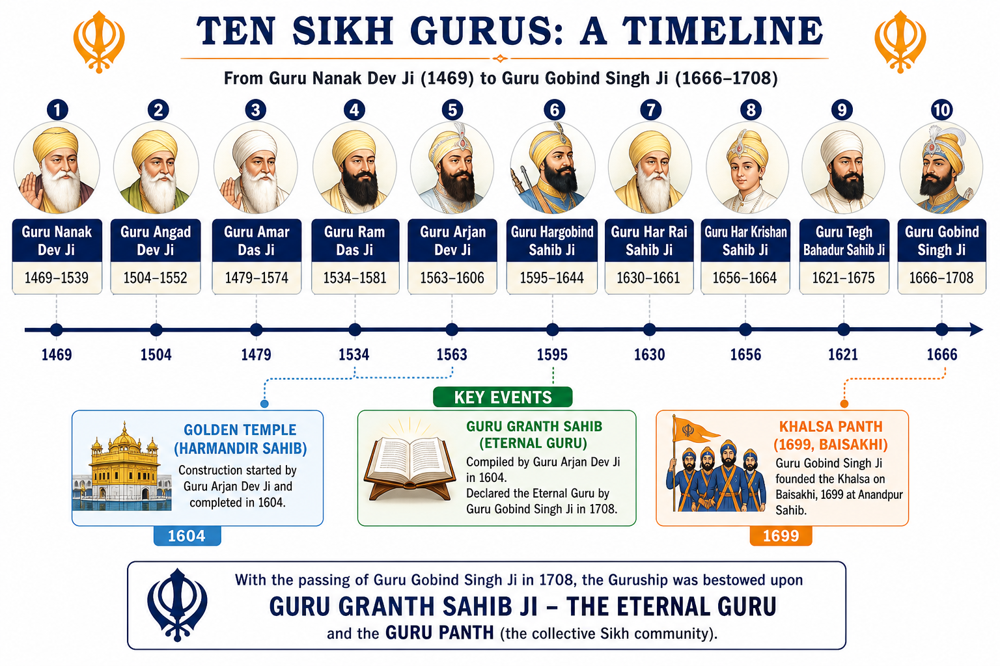

# Topic 10 — Sikhism
### ★ Complete Source of Truth — No other book/notes needed for this topic

> **Covers syllabus:** Sikhism | Guru Tradition | Ten Sikh Gurus | Guru Granth Sahib | Khalsa | Guru Gobind Singh  
> **Sources baked in:** NCERT *Themes in Indian History Part II*, RS Sharma *Medieval India*, export notes (Bhakti–Sikh tradition, Mughal period), UPPCS/UPSC PYQs 2018–2025  
> **Exam weight:** ★★★ High — 10 Gurus order, Khalsa 1699, Guru Granth vs Adi Granth, Arjan/Tegh Bahadur martyrdom, Gobind Singh → eternal Granth  
> **Last verified:** July 2026

---

## Quick Revision Box — Raata This First

```
SIKHISM CORE:
  Founded by Guru Nanak (1469–1539) | Ik Onkar (One God) | Nirguna monotheism
  Three pillars: Naam Japna | Kirat Karni | Vand Chakna (honest work + sharing)
  Householder path (grihastha) — NOT ascetic-only | Langar = community kitchen equality

GURU TRADITION:
  10 human Gurus (1469–1708) → Guru Granth Sahib = eternal Guru after Gobind Singh
  Guruship by nomination (mostly family line) | Guru = spiritual + community leader
  Mardana = disciple/companion of Nanak (rabab) — 2025 Q12: D→1

TEN GURUS (★★★ — complete order):
  1 Nanak (1469–1539) | 2 Angad (1539–52) Gurmukhi | 3 Amar Das (1552–74) Langar
  4 Ram Das (1574–81) Amritsar tank | 5 Arjan Dev (1581–1606) Adi Granth + martyrdom
  6 Hargobind (1606–44) Miri-Piri + Akal Takht | 7 Har Rai (1644–61)
  8 Har Krishan (1661–64) child guru | 9 Tegh Bahadur (1665–75) martyrdom Aurangzeb
  10 Gobind Singh (1675–1708) Khalsa 1699 | Granth eternal 1708

GURU GRANTH SAHIB:
  Adi Granth compiled by Arjan Dev 1604 | Installed Harmandir Sahib (Golden Temple)
  Hymns: 6 Gurus + bhagats (Kabir, Namdev, Farid, Ravidas) | Gobind Singh finalised → eternal Guru

KHALSA (1699 — ★★★):
  Vaisakhi 1699 Anandpur Sahib | Panj Pyare (Five Beloved) | Five Ks: Kesh Kangha Kara Kachha Kirpan
  Singh (men) / Kaur (women) names | Martial brotherhood under Gobind Singh

KEY DATES:
  1604 Adi Granth | 1606 Arjan martyred | 1675 Tegh Bahadur martyred | 1699 Khalsa | 1708 Gobind Singh dies

PYQ TRAPS:
  2025 Q12: Mardana → Guru Nanak (NOT reverse) = C (2-3-4-1)
  2025 Q74: Namdev → Kabir → Nanak → Chaitanya = C (3-4-1-2)
  Khalsa (Sikh 1699) ≠ Khalsa (Mughal crown land) — 2025 Q95 Sultanate trap
  Kabir did NOT found Sikhism — Nanak did
```

### Must-Know Term Comparisons (very frequently asked)

| Term | One-line difference | Hindi |
|------|---------------------|-------|
| **Sikhism vs Bhakti (Nanak)** | **Sikhism** = **institutional guru line** + scripture + Khalsa; **Bhakti** = broader devotional movement — Nanak bridges both | सिख धर्म / भक्ति |
| **Guru Nanak vs Guru Gobind Singh** | **Nanak** = **founder** (1469); **Gobind Singh** = **10th & last human guru** + **Khalsa creator** (1699) | गुरु नानक / गुरु गोबिंद सिंह |
| **Adi Granth vs Guru Granth Sahib** | **Adi Granth** = compiled **1604** by **Arjan Dev**; **Guru Granth Sahib** = same canon + **eternal Guru status** after **1708** | आदि ग्रंथ / गुरु ग्रंथ साहिब |
| **Harmandir Sahib vs Akal Takht** | **Harmandir** = Golden Temple (spiritual); **Akal Takht** = temporal seat — **Hargobind** built Miri-Piri idea | हरमंदिर / अकाल तख़्त |
| **Khalsa (Sikh) vs Khalsa (Mughal)** | **Sikh Khalsa** = **1699** initiated Panth; **Mughal Khalsa** = **crown/direct** revenue land — **2025 Q95 trap** | खालसा (सिख) / खालसा (मुगल) |
| **Mardana vs Guru Nanak** | **Mardana** = **disciple/companion** (rabab); **Nanak** = **guru** — never reverse (**2025 Q12**) | मर्दाना / गुरु नानक |
| **Miri vs Piri** | **Piri** = spiritual authority; **Miri** = temporal authority — **Hargobind** wore two swords | मीरी / पीरी |
| **Arjan Dev vs Tegh Bahadur martyrdom** | **Arjan** executed **1606** (Jahangir); **Tegh Bahadur** executed **1675** (Aurangzeb) — different emperors | अर्जुन देव / तेग बहादुर |
| **Panj Pyare vs Ten Gurus** | **Panj Pyare** = **first five Khalsa initiates 1699**; **Ten Gurus** = **1469–1708** line | पंज प्यारे / दस गुरु |
| **Five Ks vs Three pillars** | **Five Ks** = **Khalsa identity** (1699); **Three pillars** = **all Sikhs' ethics** (Naam, Kirat, Vand) | पंज ककार / तीन स्तंभ |
| **Singh/Kaur vs Guru title** | **Singh/Kaur** = Khalsa names; **Guru** = preceptor — only **10 persons** held Guru title | सिंह/कौर / गुरु |
| **Langar vs Sangat** | **Langar** = **free community meal**; **Sangat** = **congregation** for worship/discussion | लंगर / संगत |
| **Gurmukhi vs Gurmukhi script** | **Guru Angad** standardised **Gurmukhi** script for Punjabi hymns | गुरुमुखी |
| **Anandpur vs Amritsar** | **Amritsar** founded **Ram Das** (Harmandir); **Anandpur** = **Khalsa 1699** site (Gobind Singh) | अनंदपुर / अमृतसर |
| **Kabir in Granth vs Kabir founded Sikhism** | **Kabir's hymns** included in Granth; **Sikhism founded by Nanak** — not Kabir | कबीर / नानक |
| **Human Guru vs Eternal Granth** | **Gobind Singh (1708)** ended human guruship — **Guru Granth Sahib** supreme thereafter | मानव गुरु / शाश्वत ग्रंथ |

### Memory Tricks

| Trick | Remembers |
|-------|-----------|
| **N-A-A-R-A-H-H-T-G** | **N**anak **A**ngad **A**mar **R**am **A**rjan **H**argobind **H**ar Rai **H**ar Krishan **T**egh **G**obind — 10 Gurus |
| **1604–1606–1675–1699–1708** | Granth → Arjan dies → Tegh Bahadur dies → Khalsa → eternal Granth |
| **2025 Q12 code** | Kabir-2, Khusrau-3, Surdas-4, Mardana-1 → **C (2-3-4-1)** |
| **2025 Q74 code** | Namdev-3, Kabir-4, Nanak-1, Chaitanya-2 → **C (3-4-1-2)** |
| **Five Ks all K** | **K**esh **K**angha **K**ara **K**achha **K**irpan |
| **1699 Vaisakhi** | **V**aisakhi = **V**anguard Khalsa birth |
| **Mardana NOT guru** | **M**ardana = **M**usician disciple — 2025 trap |
| **Arjan = Architect Granth** | **A**rjan **A**di Granth **1604** |
| **Gobind = 10 + Khalsa** | **G**obind **G**uru **10** |
| **Khalsa ≠ Mughal land** | **2025 Q95** — same word, different meaning |

---

## Exam Visuals — High-ROI Images

> **Type priority:** Ten Gurus timeline → Khalsa/Granth milestones. Images stored locally (`images/`) for offline revision.

### 1. Ten Sikh Gurus — Timeline (1469–1708)



*Raata **full guru order** + **1604 Granth**, **1699 Khalsa**, **1708 eternal Guru**. UPPCS asks **sequence**, **martyrdom gurus**, and **who compiled scripture**.*
*Source: Study timeline — generated for UPPCS Sikhism*

---

## 10.1 Sikhism — Origins, Beliefs & Distinct Identity

### Definitions (learn all — exams pick different ones)

| Source | Definition |
|--------|------------|
| **General** | **Sikhism** — monotheistic religious tradition founded by **Guru Nanak (1469–1539)** in **Punjab**; evolved into **Guru-line**, **scripture-centred**, **Khalsa** community |
| **NCERT** | Grew within **Bhakti** milieu but developed **distinct institutions** — guru succession, **Adi Granth**, **langar**, later **Khalsa** militancy |
| **Exam** | Sikhism ≠ generic Bhakti sect — **10 Gurus + Guru Granth Sahib + Khalsa** = unique markers |

### Sikhism — How It Works

- **Historical context:** Sikhism arose in **15th–16th century Punjab** amid caste divisions, ritual debates, and political instability under the Lodis and Mughals. Guru Nanak's message addressed both social and spiritual concerns.
- **Ik Onkar:** **Ik Onkar** expresses belief in one formless God. Sikhism rejects idol worship and empty ritual, shares some **nirguna Bhakti** language, and develops its own canon.
- **Three pillars:** **Naam Japna**, **Kirat Karni**, and **Vand Chakna** define Sikh ethical life. The ideal is spirituality within the world, not forest renunciation.
- **Householder ideal:** Guru Nanak rejected extreme **asceticism**. Family life could remain compatible with spiritual discipline.
- **Equality symbols:** **Langar** and **sangat** expressed community equality. They challenged caste distinctions through shared meal and worship practices.
- **No priestly caste:** The **Guru** functioned as the preceptor, and later **Granthis** read scripture. Sikh practice did not require a hereditary Brahmin priesthood.
- **Scripture-centred turn:** Sikh authority moved from Nanak's oral **shabad** tradition to the **Adi Granth in 1604** and then to **Guru Granth Sahib** as eternal Guru in **1708**.
- **Mughal interaction:** Early Sikh Gurus were largely peaceful community leaders. The martyrdoms of **Arjan in 1606** and **Tegh Bahadur in 1675** helped shape the later **Khalsa** militancy of **1699**.
- **Relation to Bhakti saints:** The Granth includes hymns of **Kabir, Namdev, Farid**, and other bhagats. Institutional Sikhism, however, remained the Guru line founded by Nanak.
- **Trap — Kabir founder:** **Kabir did not found Sikhism**. Guru Nanak is the founder in exam usage.
- **Trap — Khalsa word:** **Sikh Khalsa** refers to the initiated Panth of **1699**. **Mughal Khalsa** means crown land and is a separate revenue term.
- **Geographic core:** **Punjab** was Sikhism's core region. **Amritsar, Anandpur, Kartarpur, and Nankana Sahib** are the main places to remember.

> **Exam note:** Statement **"Sikhism is identical to Kabir's panth"** = **FALSE** — shared nirguna idiom, **different institution** (10 Gurus, Khalsa, Granth).

### Exam Facts (raata)

- **Guru Nanak (1469–1539)** founded Sikhism.
- **Ik Onkar** means belief in one God.
- **Naam Japna, Kirat Karni, and Vand Chakna** are the three pillars.
- **Langar** and **sangat** were equality practices.
- Sikhism emphasised the **householder** path, not asceticism alone.
- **Punjab** was the heartland of Sikhism.
- Sikhism was **not founded by Kabir**.

### PYQs — Sikhism (Origins)

1. **(UPPCS 2025, Q74)** Arrange saints: Namdev, Kabir, **Guru Nanak**, Chaitanya → **C (3-4-1-2)** — Nanak **after Kabir**, before Chaitanya in exam list order.

2. **(UPSC 2019 pattern)** Consider: "Kabir founded the Sikh religion." → **False** — **Nanak** founded Sikh line; Kabir hymns **included** in Granth later.

### Examples (10.1)

| Example | Detail | Exam use |
|---------|--------|----------|
| **Ik Onkar symbol** | Opening creed of Granth | Monotheism MCQ |
| **Langar at Goindwal** | Amar Das institutionalised | Social equality |
| **Farid/Kabir in Granth** | Bhagat bani included | Syncretic canon not merged panths |

---

## 10.2 Guru Tradition — Lineage, Succession & Authority

### Definitions (learn all — exams pick different ones)

| Source | Definition |
|--------|------------|
| **General** | **Guru tradition** — spiritual authority passes through **line of 10 preceptors** from **Nanak to Gobind Singh**, then to **Guru Granth Sahib** |
| **NCERT** | Guru = **guide** in spiritual and organisational matters; succession by **nomination** (guruship mantra) — mostly within family but not strictly primogeniture always |
| **Exam** | **Mardana = disciple**, Nanak = guru — **2025 Q12** tests guru–shishya direction |

### Guru Tradition — How It Works

- **Nanak as first Guru:** Guru Nanak established the model of personal revelation, hymn teaching, and community guidance. His successors continued this Guru-centred pattern.
- **Succession mechanism:** Each Guru nominated his successor. **Guru Angad** succeeded Nanak, so succession was not always based on eldest-son inheritance.
- **Family line tendency:** The **3rd to 5th Gurus** linked Amar Das, Ram Das, and Arjan Dev through the Sodhi/Ram Das line. Leadership became more centralized in one family branch.
- **Guru as centre:** Followers gathered around the **Guru's court** for hymns, langar, justice, and donations. By Hargobind and Gobind Singh, the office also carried proto-state functions.
- **Scriptural authority grows:** Early Gurus were the living voice of the Panth. **Arjan's Adi Granth** added scriptural authority, and in **1708** the Granth became the eternal Guru.
- **Mardana model:** **Mardana** was a Muslim rababi companion of Guru Nanak. The pair shows a disciple-Guru relationship across religious boundaries.
- **Guru–Sikh relationship:** A **Sikh** was a disciple or learner of the Guru. The term later became the community name, while **Khalsa** referred to the initiated warrior order from **1699**.
- **End of human Guruship:** **Guru Gobind Singh** declared **Guru Granth Sahib** the eternal Guru in **1708**. There was no 11th human Guru.
- **Contrast Hindu guru:** Sikh Gurus held exclusive spiritual authority for the Panth. They were not merely one teacher among many sectarian gurus.
- **Contrast Sufi pir:** Sikh succession had some parallels with Sufi lineages. Its final outcome differed because Sikhism centred on the **Granth** and the **Khalsa**.
- **Women in tradition:** **Mata Khivi** is associated with langar, and **Guru Amar Das** supported women's participation. These points matter for social reform questions.

> **Exam note:** **2025 Q12** — **Mardana is disciple**, **Guru Nanak is guru** — statement "Mardana was Nanak's guru" = **FALSE**.

### Exam Facts (raata)

- Sikh tradition has **10 human Gurus**, followed by the **Granth** as eternal Guru.
- Succession usually occurred by **nomination**.
- **Mardana** was Guru Nanak's disciple.
- In **1708**, **Guru Granth Sahib** became the eternal Guru.
- The Guru was both spiritual guide and community head.
- A **Sikh** means a follower or learner of the Guru.

### PYQs — Guru Tradition

1. **(UPPCS 2025, Q12)** Match disciple–guru: **D. Mardana → 1. Guru Nanak Dev** — full code **C (2-3-4-1)**.

2. **(UPPCS 2025, Q74)** Nanak in bhakti chronology — guru tradition begins **1469** — placed after Namdev/Kabir.

### Examples (10.2)

| Example | Detail | Exam use |
|---------|--------|----------|
| **Mardana–Nanak pair** | 2025 Q12 | Disciple direction trap |
| **Angad succession** | Nanak chose Angad | Non-hereditary possible |
| **1708 Granth decree** | Gobind Singh | End human guruship |

---

## 10.3 Ten Sikh Gurus — Complete Line & Contributions

### Definitions (learn all — exams pick different ones)

| Source | Definition |
|--------|------------|
| **General** | **Ten Sikh Gurus** — from **Guru Nanak (1st)** to **Guru Gobind Singh (10th)** — each added hymns, institutions, or military organisation |
| **NCERT** | Period **1469–1708** — transformation from **peaceful panth** to **Khalsa** under last Guru |
| **Exam** | Must know **order**, **key contribution**, **martyrdom gurus** (Arjan, Tegh Bahadur) |

### Ten Sikh Gurus — How It Works

- **1. Guru Nanak (1469–1539):** Guru Nanak founded Sikhism, undertook **Udasis** across India, settled at **Kartarpur**, and taught **Ik Onkar**. **Mardana** was his companion.
- **2. Guru Angad (1539–1552):** Guru Angad developed the **Gurmukhi script** and collected Nanak's hymns. **Khadur Sahib** became an important centre.
- **3. Guru Amar Das (1552–1574):** Guru Amar Das institutionalised **langar** and developed **Goindwal** as a pilgrimage centre. He is also linked with the **52-step baoli** and opposition to sati influence.
- **4. Guru Ram Das (1574–1581):** Guru Ram Das founded **Amritsar** and dug the **Amrit Sarovar**. His work shaped the city's sacred identity.
- **5. Guru Arjan Dev (1581–1606):** Guru Arjan compiled the **Adi Granth in 1604** and built **Harmandir Sahib**. He became the first Sikh Guru martyr under **Jahangir in 1606**.
- **6. Guru Hargobind (1606–1644):** Guru Hargobind began the major militarisation phase through **Miri-Piri**. He built the **Akal Takht** and armed followers.
- **7. Guru Har Rai (1644–1661):** Guru Har Rai maintained the armed tradition while keeping a relatively peaceful profile. He is linked with the Dara Shikoh succession context.
- **8. Guru Har Krishan (1661–1664):** Guru Har Krishan was the **child Guru**. He served epidemic victims in **Delhi** and died young of smallpox.
- **9. Guru Tegh Bahadur (1665–1675):** Guru Tegh Bahadur was martyred in **Delhi in 1675** under **Aurangzeb**. The exam narrative links him with defending the religious rights of Kashmiri Pandits.
- **10. Guru Gobind Singh (1675–1708):** Guru Gobind Singh created the **Khalsa in 1699**, fought Mughals and hill chiefs, wrote the **Zafarnama**, and declared the Granth eternal Guru in **1708**.
- **Martyrdom pair:** **Guru Arjan in 1606** and **Guru Tegh Bahadur in 1675** were executed under different Mughal emperors. Keep their dates and emperors separate.
- **Military turn arc:** Sikh history moved from **Nanak's peaceful teaching** to **Hargobind's armed discipline** and **Gobind Singh's Khalsa**. This shift responded to persecution and political pressure.

> **Exam note:** **Child guru = Har Krishan** (not Gobind Singh childhood title confusion) — **8th Guru** died **1664** in Delhi epidemic service.

### Ten Gurus — Complete Table

| # | Guru | Period | Key contribution |
|---|------|--------|------------------|
| 1 | **Nanak** | 1469–1539 | Founder; Ik Onkar; Mardana |
| 2 | **Angad** | 1539–1552 | **Gurmukhi** script |
| 3 | **Amar Das** | 1552–1574 | **Langar**; Goindwal |
| 4 | **Ram Das** | 1574–1581 | **Amritsar** founded |
| 5 | **Arjan Dev** | 1581–1606 | **Adi Granth 1604**; Harmandir; **martyr 1606** |
| 6 | **Hargobind** | 1606–1644 | **Miri-Piri**; **Akal Takht** |
| 7 | **Har Rai** | 1644–1661 | Peaceful maintenance of panth |
| 8 | **Har Krishan** | 1661–1664 | **Child guru**; Delhi epidemic |
| 9 | **Tegh Bahadur** | 1665–1675 | **Martyr 1675** (Aurangzeb) |
| 10 | **Gobind Singh** | 1675–1708 | **Khalsa 1699**; eternal Granth |

### Exam Facts (raata)

- The **10 Gurus** run from Nanak to Gobind Singh.
- **Guru Angad** is linked with Gurmukhi.
- **Guru Ram Das** is linked with Amritsar.
- **Guru Arjan** compiled the Adi Granth and was martyred in **1606**.
- **Guru Hargobind** is linked with Miri-Piri and Akal Takht.
- **Guru Har Krishan** was the child Guru.
- **Guru Tegh Bahadur** was martyred in **1675**.
- **Guru Gobind Singh** was the 10th Guru and creator of the Khalsa.

### PYQs — Ten Sikh Gurus

1. **(UPPCS 2025, Q12)** **Guru Nanak Dev** as guru of **Mardana** — first Guru in match list.

2. **(UPPCS 2025, Q74)** **Guru Nanak** chronology among medieval saints — born **1469**, after Namdev/Kabir.

### Examples (10.3)

| Example | Detail | Exam use |
|---------|--------|----------|
| **Arjan 1606 martyrdom** | Jahangir period | First guru martyr |
| **Har Krishan Delhi** | Smallpox service | Child guru ID |
| **Angad Gurmukhi** | Script standardisation | 2nd Guru contribution |

---

## 10.4 Guru Granth Sahib — Scripture, Compilation & Eternal Guru

### Definitions (learn all — exams pick different ones)

| Source | Definition |
|--------|------------|
| **General** | **Guru Granth Sahib** — holy scripture of Sikhs; **eternal Guru** since **1708**; contains hymns of **Sikh Gurus** and selected **saints (bhagats)** |
| **NCERT** | **Adi Granth (1604)** compiled by **Guru Arjan Dev** — installed at **Harmandir Sahib** — basis of final canon |
| **Exam** | **Arjan compiled** — not Nanak/Gobind alone; **Gobind Singh** declared it **supreme Guru** |

### Guru Granth Sahib — How It Works

- **Origins in shabad:** The Gurus composed **hymns** in Punjabi, Hindi, Persian, and related languages. These hymns were sung in **ragas** before being transmitted in written form.
- **Adi Granth 1604:** **Guru Arjan Dev** compiled the Adi Granth in **1604**. It included hymns of the early Gurus and bhagats such as **Kabir, Namdev, Ravidas, Sheikh Farid, Beni, and Dhanna**.
- **Installation:** The Adi Granth was first installed at **Harmandir Sahib, Amritsar**, in **1604**. It became the central scripture for worship.
- **Language mix:** **Gurmukhi** was the main script of the corpus. This links the scripture tradition with **Guru Angad** in exam questions.
- **Bhagat bani inclusion:** The inclusion of bhagat hymns shows openness beyond the Guru line. Authority still remained with the Guru Panth and the Granth.
- **Guru Tegh Bahadur's hymns:** The 9th Guru's hymns were added before finalisation. His compositions are part of the accepted canon.
- **Gobind Singh's role:** Before his death in **1708**, Guru Gobind Singh affirmed **Guru Granth Sahib** as the permanent Guru. He appointed no human successor.
- **Adi Granth vs Guru Granth Sahib:** The Adi Granth is the core text compiled in **1604**. The title **Guru Granth Sahib** reflects its eternal Guru status after **1708**.
- **Dasam Granth:** The **Dasam Granth** is a separate compilation attributed to Guru Gobind Singh. It is not the eternal Guru.
- **Granthis:** **Granthis** read and care for the scripture in gurdwaras. The Granth is the Guru, while the granthi is the servant-reader.
- **No idol worship:** The Granth is placed on a **takht** and honoured with **rumala** and **chaur**. This is scripture veneration, not deity-statue worship.
- **Daily liturgy:** **Five banis** are central for Amritdhari Khalsa practice. **Japji** is especially linked with Guru Nanak.

> **Exam note:** **Who compiled Adi Granth?** → **Guru Arjan Dev (1604)** — trap options: Nanak, Gobind Singh, Tegh Bahadur.

### Exam Facts (raata)

- **Guru Arjan Dev** compiled the **Adi Granth in 1604**.
- The Adi Granth was installed at **Harmandir Sahib, Amritsar**.
- **Gurmukhi** script is linked with Guru Angad.
- The Granth includes **bhagat** hymns, including Kabir, Namdev, and Farid.
- In **1708**, Guru Granth Sahib received eternal Guru status.
- **Dasam Granth** is not the eternal Guru.

### PYQs — Guru Granth Sahib

1. **(UPPCS 2025, Q74)** **Kabir** before Nanak — Kabir's hymns later in **Granth** — chronology vs compilation logic.

2. **(UPSC 2018 pattern)** Guru Granth Sahib contains hymns of which Mughal-period saint-poets? → Includes **Kabir, Namdev, Farid** among others — **not** Amir Khusrau as Granth author.

### Examples (10.4)

| Example | Detail | Exam use |
|---------|--------|----------|
| **1604 Harmandir installation** | Arjan's Granth | Date + place |
| **Kabir bani in Granth** | Bhagat inclusion | Kabir ≠ Sikh founder |
| **1708 eternal Guru** | Gobind Singh decree | Human guruship end |

---

## 10.5 Khalsa — Creation, Panj Pyare & Five Ks

### Definitions (learn all — exams pick different ones)

| Source | Definition |
|--------|------------|
| **General** | **Khalsa** — **initiated** community of baptized Sikhs created by **Guru Gobind Singh on Vaisakhi 1699** at **Anandpur Sahib** |
| **NCERT** | Military–religious **brotherhood** — **Five Ks** identity — **Singh/Kaur** names — defended Panth against Mughal/hill raj pressure |
| **Exam** | **1699** date; **Anandpur** site; **NOT** Mughal **Khalsa land** (2025 Q95 trap) |

### Khalsa — How It Works

- **Context 1690s:** Guru Gobind Singh faced pressure from the **Mughal empire** and **Pahari hill rajas**. Earlier martyrdoms helped create the memory behind a unified martial Panth.
- **Vaisakhi 1699:** At **Anandpur Sahib**, the Guru called an assembly and tested the willingness of his followers. The first five initiates became the **Panj Pyare**.
- **Panj Pyare (Five Beloved):** The Panj Pyare are traditionally **Bhai Daya Singh, Bhai Dharam Singh, Bhai Himmat Singh, Bhai Mohkam Singh, and Bhai Sahib Singh**. The Guru initiated them, and they then initiated the Guru into the Khalsa.
- **Amrit ceremony:** **Amrit Sanchar** used sweetened water stirred with a **khanda**. Initiates drank it as a sign of new birth into the **Khalsa**.
- **Five Ks (Kakars):** The Five Ks are **Kesh, Kangha, Kara, Kachha, and Kirpan**. They served as visible identity markers of the Khalsa.
- **Singh & Kaur:** Men took the name **Singh**, and women took **Kaur**. The practice challenged caste surnames among initiates.
- **Code of conduct:** **Rehat Maryada** developed over time. Exam questions usually focus on the **1699** core rather than later detailed prohibitions.
- **Military role:** The Khalsa embodied the **sant-sipahi** ideal. Its purpose was to fight injustice and protect the Panth.
- **Relation to non-Khalsa Sikhs:** Not all Sikhs became initiated immediately. The **Khalsa** was the core warrior order within the broader Sikh sangat.
- **After Gobind Singh's death:** Khalsa leadership rested on **Guru Granth** and **Guru Panth** consensus. Later Misls and Ranjit Singh's empire belong mainly to modern-history continuity.
- **Trap — Khalsa homonym:** **Mughal Khalsa** meant crown land. It has no relation to Sikh initiation.
- **Trap — Baisakhi:** **Baisakhi** is both a harvest festival and the **1699** Khalsa birth event. UPPCS may ask this year-event pair.

> **Exam note:** **Khalsa founded 1699** — **NOT** by Nanak or Arjan — only **Guru Gobind Singh** — date MCQ trap.

### Exam Facts (raata)

- The Khalsa was created on **Vaisakhi 1699** at Anandpur Sahib.
- The **Panj Pyare** were the first five initiates.
- The **Five Ks** are Kesh, Kangha, Kara, Kachha, and Kirpan.
- **Singh** and **Kaur** became Khalsa names.
- **Guru Gobind Singh** created the Khalsa.
- The Khalsa followed the **sant-sipahi** ideal.

### PYQs — Khalsa

1. **(UPPCS 2025, Q95 — cross-trap)** **Khalsa vs Jagirs** = **Mughal revenue** categories — **NOT Sikh Khalsa** — if statement mixes terms, reject.

2. **(UPSC 2020 pattern)** Khalsa was created in **1699** by **Guru Gobind Singh** at **Anandpur** — **True**.

### Examples (10.5)

| Example | Detail | Exam use |
|---------|--------|----------|
| **Panj Pyare initiation** | Guru ↔ disciple mutual | Equality symbol |
| **Five Ks visible identity** | Kakars | Initiation MCQ |
| **2025 Q95 Khalsa trap** | Mughal crown land | Word disambiguation |

---

## 10.6 Guru Gobind Singh — Khalsa, Battles & Eternal Granth

### Definitions (learn all — exams pick different ones)

| Source | Definition |
|--------|------------|
| **General** | **Guru Gobind Singh (1666–1708)** — **10th and last human Sikh Guru**; created **Khalsa (1699)**; declared **Guru Granth Sahib** eternal Guru |
| **NCERT** | Transformed Sikhs into **organised martial community**; fought **Mughals** and **hill rajas**; literary figure (**Dasam Granth**) |
| **Exam** | **1675** — succeeded after **Tegh Bahadur's martyrdom**; died **1708** at **Nanded** |

### Guru Gobind Singh — How It Works

- **Birth and succession:** Guru Gobind Singh was born **Gobind Rai**, the son of Guru Tegh Bahadur. He became Guru in **1675** after his father's martyrdom in Delhi.
- **Anandpur base:** He fortified **Anandpur Sahib** as a major centre. The same place became the site of **Khalsa creation in 1699**.
- **Khalsa founding 1699:** The founding of the Khalsa was his defining achievement. The **Vaisakhi 1699** date is mandatory for exams.
- **Wars with hill rajas:** The **Battle of Bhangani (1688)** was fought against combined **Pahari rajas**. It showed his military assertion before formal Khalsa creation.
- **Mughal conflict:** Conflict intensified after **1699** through the siege of Anandpur and battles such as **Chamkaur** and **Muktsar**. The martyrdom of his four sons became a major Panth memory.
- **Zafarnama:** The **Zafarnama** was a Persian letter to **Aurangzeb**. It presented Guru Gobind Singh as a literary and political critic of tyranny.
- **Final Granth decree 1708:** At **Nanded**, Guru Gobind Singh declared **Guru Granth Sahib** the only Guru thereafter. This closed the line of human Gurus.
- **Death 1708:** He died at **Nanded** in **1708**, with accounts mentioning an assassination wound. **Gurudwara Hazur Sahib** marks the site.
- **Dasam Granth:** The **Dasam Granth** contains compositions attributed to Guru Gobind Singh. It is distinct from **Guru Granth Sahib** and is not the eternal Guru.
- **Legacy bridge:** After 1708, Sikh power moved toward **Khalsa Misls** and later **Maharaja Ranjit Singh**. The Ranjit Singh point is only a modern-history bridge.
- **Trap — 10th Guru identity:** **Guru Gobind Singh** was the 10th and last human Guru. **Guru Har Krishan** was the 8th Guru.
- **Trap — Khalsa creator:** **Guru Gobind Singh** created the Khalsa. **Guru Hargobind** began Miri-Piri militancy but did not create the Khalsa ritual.

> **Exam note:** **Four sons of Gobind Singh** martyred — cultural fact; **exam MCQ** often pairs **1699 Khalsa + Gobind Singh + Anandpur** together.

### Exam Facts (raata)

- Guru Gobind Singh was the **10th** and last human Guru.
- He succeeded Guru Tegh Bahadur in **1675**.
- He created the **Khalsa in 1699** at Anandpur.
- In **1708**, he made Guru Granth Sahib eternal Guru and died at **Nanded**.
- **Zafarnama** was addressed to Aurangzeb.
- **Bhangani 1688** was fought against hill rajas.
- The martyrdom of his sons is a major Panth memory.

### PYQs — Guru Gobind Singh

1. **(UPPCS 2021, Q67 — brief modern link)** Ranjit Singh's **Adalat-i-Ala at Amritsar** — post-Gobind Singh **Sikh polity** centred **Amritsar** — shows institutional continuity from **Ram Das/Arjan** city.

2. **(UPSC 2021 pattern)** Who was the last Sikh Guru? → **Guru Gobind Singh** as last **human** Guru; **Guru Granth Sahib** eternal thereafter.

### Examples (10.6)

| Example | Detail | Exam use |
|---------|--------|----------|
| **Anandpur Khalsa 1699** | Vaisakhi | Core date event |
| **Nanded 1708** | Eternal Granth + death | Two facts same year |
| **Zafarnama** | Persian letter | Gobind Singh literature |

---

## Consolidated Reference

### Sikh History — Master Timeline

| Year | Event |
|------|-------|
| **1469** | Birth of **Guru Nanak** (Nankana Sahib) |
| **1539** | Nanak dies; **Guru Angad** succeeds |
| **1552** | **Guru Amar Das** |
| **1574** | **Guru Ram Das** — **Amritsar** |
| **1604** | **Adi Granth** compiled — **Arjan Dev** |
| **1606** | **Arjan Dev martyred** (Jahangir) |
| **1606–1644** | **Guru Hargobind** — Miri-Piri, Akal Takht |
| **1661–1664** | **Guru Har Krishan** (child guru) |
| **1675** | **Tegh Bahadur martyred**; **Gobind Singh** becomes Guru |
| **1688** | **Battle of Bhangani** |
| **1699** | **Khalsa created** — Vaisakhi, Anandpur |
| **1708** | **Gobind Singh dies**; **Guru Granth Sahib** = eternal Guru |

### Guru — Contribution — Martyrdom Table

| Guru | # | Must-remember contribution | Martyred? |
|------|---|---------------------------|-----------|
| Nanak | 1 | Founder, Ik Onkar | No |
| Angad | 2 | Gurmukhi script | No |
| Amar Das | 3 | Langar, Goindwal | No |
| Ram Das | 4 | Amritsar | No |
| Arjan Dev | 5 | Adi Granth 1604 | **Yes 1606** |
| Hargobind | 6 | Miri-Piri, Akal Takht | No |
| Har Rai | 7 | Peaceful period | No |
| Har Krishan | 8 | Child guru, Delhi | No (died young) |
| Tegh Bahadur | 9 | Kashmiri Pandit narrative | **Yes 1675** |
| Gobind Singh | 10 | Khalsa 1699, eternal Granth | No (1708 death) |

### Five Ks — Complete List

| K | Item | Meaning |
|---|------|---------|
| **Kesh** | Uncut hair | Accept God's form |
| **Kangha** | Comb | Discipline |
| **Kara** | Steel bracelet | Bond to God/community |
| **Kachha** | Short breeches | Moral readiness |
| **Kirpan** | Sword | Protect righteousness |

### UP Focus — Sikhism & North India (incl. UP links)

| Element | Detail | Exam use |
|---------|--------|----------|
| **Nanak's travels** | Through **Banaras, Allahabad, Delhi** region — pan-Indian saint | Links to UP geography |
| **Tegh Bahadur martyrdom** | **Delhi (Chandni Chowk)** — **1675** | UP-adjacent high priority |
| **Har Krishan** | Served **Delhi** epidemic victims | Child guru + Delhi |
| **Bhagat saints in Granth** | **Kabir (Varanasi)**, **Namdev**, **Ravidas** — UP/Bhakti overlap | Topic 4 cross-trap |
| **2025 Q74 chronology** | Namdev → Kabir → Nanak → Chaitanya | Saint timeline |
| **Amritsar** | **Ram Das/Arjan** — **2021 Q67** Ranjit Singh court | Punjab core, not UP |
| **Khalsa ≠ Mughal Khalsa** | **2025 Q95** — Sultanate revenue term | Word trap |

### Important Dates (Traps synced)

| Item | Date |
|------|------|
| Guru Nanak born | **1469** |
| Guru Nanak died | **1539** |
| Adi Granth compiled | **1604** |
| Guru Arjan martyred | **1606** |
| Guru Tegh Bahadur martyred | **1675** |
| Battle of Bhangani | **1688** |
| **Khalsa created** | **Vaisakhi 1699** |
| Guru Gobind Singh died | **1708** |
| Guru Granth eternal Guru declared | **1708** |

---

## Practice Zone — UPPCS Format Questions

> **Answers hidden** — click *Show answer* under each question to reveal.

**Q1.** Consider the following statements about **Sikhism**:

1. It was founded by Guru Nanak in the 15th century.
2. It advocates extreme world-renouncing asceticism as the only path.

Which is/are correct?

Options:
A. Only 1
B. Only 2
C. Both 1 and 2
D. Neither 1 nor 2

<details>
<summary>Show answer</summary>

**Ans: A** — Nanak **1469** ✓; Sikhism supports **householder** path ✗ statement 2.

</details>

**Q2.** Match List-I (Disciple) with List-II (Guru):

| List-I | List-II |
|--------|---------|
| A. Kabir | 1. Guru Nanak Dev |
| B. Amir Khusrau | 2. Swami Ramananda |
| C. Surdas | 3. Nizamuddin Auliya |
| D. Mardana | 4. Vallabhacharya |

Options:
A. 3 2 4 1
B. 3 2 1 4
C. 2 3 4 1
D. 2 3 1 4

<details>
<summary>Show answer</summary>

**Ans: C (2-3-4-1)** — **2025 Q12** exact pattern.

</details>

**Q3.** Arrange the following saints in chronological order:

1. Guru Nanak
2. Chaitanya Mahaprabhu
3. Namdev
4. Kabir

Options:
A. 3, 4, 2, 1
B. 4, 3, 1, 2
C. 3, 4, 1, 2
D. 4, 3, 2, 1

<details>
<summary>Show answer</summary>

**Ans: C (3-4-1-2)** — **2025 Q74** — Namdev → Kabir → Nanak → Chaitanya.

</details>

**Q4.** Who compiled the **Adi Granth** in 1604?

Options:
A. Guru Nanak
B. Guru Angad
C. Guru Arjan Dev
D. Guru Gobind Singh

<details>
<summary>Show answer</summary>

**Ans: C** — **Arjan Dev** — installed at Harmandir Sahib.

</details>

**Q5.** Assertion (A): The Khalsa was created by Guru Nanak at Kartarpur.

Reason (R): Guru Nanak rejected caste distinctions through langar.

Options:
A. Both true; R explains A
B. Both true; R does not explain A
C. A true; R false
D. A false; R true

<details>
<summary>Show answer</summary>

**Ans: D** — **A false** — Khalsa **1699 Gobind Singh**; **R true** but unrelated to Khalsa date.

</details>

**Q6.** Which Sikh Guru was martyred under **Aurangzeb** in 1675?

Options:
A. Guru Arjan Dev
B. Guru Tegh Bahadur
C. Guru Hargobind
D. Guru Har Krishan

<details>
<summary>Show answer</summary>

**Ans: B** — **Tegh Bahadur 1675**; Arjan **1606** under Jahangir.

</details>

**Q7.** Consider the following about the **Guru Granth Sahib**:

1. It was declared the eternal Guru in 1708.
2. It contains hymns of Guru Nanak and Kabir.

Which is/are correct?

Options:
A. Only 1
B. Only 2
C. Both 1 and 2
D. Neither 1 nor 2

<details>
<summary>Show answer</summary>

**Ans: C** — Both standard facts.

</details>

**Q8.** The **Khalsa** was created on **Vaisakhi** of which year?

Options:
A. 1604
B. 1675
C. 1699
D. 1708

<details>
<summary>Show answer</summary>

**Ans: C** — **1699** — Anandpur Sahib.

</details>

**Q9.** Match List-I with List-II:

| List-I | List-II |
|--------|---------|
| A. Gurmukhi script | 1. Guru Ram Das |
| B. Amritsar founded | 2. Guru Angad |
| C. Miri-Piri | 3. Guru Hargobind |
| D. Khalsa | 4. Guru Gobind Singh |

Options:
A. 2 1 3 4
B. 1 2 3 4
C. 2 3 1 4
D. 3 2 1 4

<details>
<summary>Show answer</summary>

**Ans: A (2-1-3-4)** — Angad-Gurmukhi; Ram Das-Amritsar; Hargobind-Miri-Piri; Gobind-Khalsa.

</details>

**Q10.** Who among the following was the **child Guru**?

Options:
A. Guru Angad
B. Guru Har Krishan
C. Guru Amar Das
D. Guru Tegh Bahadur

<details>
<summary>Show answer</summary>

**Ans: B** — **8th Guru** — died **1664** serving Delhi epidemic victims.

</details>

**Q11.** Consider the following statements:

1. Mardana was the guru of Guru Nanak.
2. Mardana played the rabab.

Which is/are correct?

Options:
A. Only 1
B. Only 2
C. Both 1 and 2
D. Neither 1 nor 2

<details>
<summary>Show answer</summary>

**Ans: B** — **2025 Q12 trap** — Mardana = **disciple**, not guru.

</details>

**Q12.** The **Five Ks** of the Khalsa include:

Options:
A. Kesh, Kangha, Kara, Kachha, Kirpan
B. Karma, Khanda, Kirtan, Khalsa, Kirat
C. Kesh, Khalsa, Kara, Kirpan, Kartar
D. Kangha, Kachha, Kirpan, Khanda, Kesh

<details>
<summary>Show answer</summary>

**Ans: A** — Standard **Kakars** list.

</details>

**Q13.** Assertion (A): Guru Gobind Singh was the tenth and last human Guru of the Sikhs.

Reason (R): He declared the Guru Granth Sahib the eternal Guru before his death.

Options:
A. Both true; R explains A
B. Both true; R does not explain A
C. A true; R false
D. A false; R true

<details>
<summary>Show answer</summary>

**Ans: A** — Both true — **R explains** why no 11th human Guru.

</details>

**Q14.** Which Guru built the **Akal Takht** and introduced the **Miri-Piri** concept?

Options:
A. Guru Arjan Dev
B. Guru Hargobind
C. Guru Har Rai
D. Guru Gobind Singh

<details>
<summary>Show answer</summary>

**Ans: B** — **6th Guru** — militarisation phase.

</details>

**Q15.** Arrange the following Gurus in chronological order:

1. Guru Arjan Dev
2. Guru Nanak
3. Guru Gobind Singh
4. Guru Ram Das

Options:
A. 2, 4, 1, 3
B. 2, 1, 4, 3
C. 4, 2, 1, 3
D. 2, 4, 3, 1

<details>
<summary>Show answer</summary>

**Ans: A (2-4-1-3)** — Nanak → Ram Das → Arjan → Gobind Singh.

</details>

**Q16.** Which statements about **Sikh Khalsa** vs **Mughal Khalsa** are correct?

1. Sikh Khalsa refers to initiated Sikhs from 1699.
2. Mughal Khalsa refers to crown/direct revenue lands.

Options:
A. Only 1
B. Only 2
C. Both 1 and 2
D. Neither 1 nor 2

<details>
<summary>Show answer</summary>

**Ans: C** — **2025 Q95** homonym trap — both definitions true separately.

</details>

**Q17.** Guru **Arjan Dev** was martyred in:

Options:
A. 1604
B. 1606
C. 1675
D. 1699

<details>
<summary>Show answer</summary>

**Ans: B** — **1606** — Jahangir period; **1604** = Granth compilation.

</details>

**Q18.** The **Panj Pyare** are associated with:

Options:
A. Compilation of Adi Granth
B. Creation of Khalsa in 1699
C. Martyrdom of Tegh Bahadur
D. Founding of Amritsar

<details>
<summary>Show answer</summary>

**Ans: B** — **Five first Khalsa initiates**.

</details>

**Q19.** Consider the following:

1. Kabir founded Sikhism.
2. Kabir's hymns appear in the Guru Granth Sahib.

Options:
A. Only 1
B. Only 2
C. Both 1 and 2
D. Neither 1 nor 2

<details>
<summary>Show answer</summary>

**Ans: B** — Statement 1 **false** (Nanak); statement 2 **true**.

</details>

**Q20.** Where was the **Khalsa** created?

Options:
A. Amritsar
B. Anandpur Sahib
C. Kartarpur
D. Nankana Sahib

<details>
<summary>Show answer</summary>

**Ans: B** — **Vaisakhi 1699** at **Anandpur**.

</details>

**Q21.** Match Guru — martyrdom emperor:

| List-I | List-II |
|--------|---------|
| A. Guru Arjan Dev | 1. Aurangzeb |
| B. Guru Tegh Bahadur | 2. Jahangir |

Options:
A. 1 2
B. 2 1
C. 1 1
D. 2 2

<details>
<summary>Show answer</summary>

**Ans: B (2-1)** — Arjan–Jahangir; Tegh Bahadur–Aurangzeb.

</details>

**Q22.** Who founded **Amritsar**?

Options:
A. Guru Nanak
B. Guru Ram Das
C. Guru Amar Das
D. Guru Angad

<details>
<summary>Show answer</summary>

**Ans: B** — **4th Guru** — dug Amrit Sarovar.

</details>

**Q23.** Assertion (A): Dasam Granth is the eternal Guru of the Sikhs.

Reason (R): Guru Gobind Singh declared Guru Granth Sahib the eternal Guru in 1708.

Options:
A. Both true; R explains A
B. Both true; R does not explain A
C. A true; R false
D. A false; R true

<details>
<summary>Show answer</summary>

**Ans: D** — **A false** — **Guru Granth Sahib** is eternal Guru; Dasam Granth separate.

</details>

**Q24.** Consider the following about **Guru Nanak**:

1. He was born at Nankana Sahib.
2. He supported the householder (grihastha) way of life.

Options:
A. Only 1
B. Only 2
C. Both 1 and 2
D. Neither 1 nor 2

<details>
<summary>Show answer</summary>

**Ans: C** — Both core Nanak facts.

</details>

**Q25.** How many human Gurus were there in Sikh tradition?

Options:
A. Eight
B. Nine
C. Ten
D. Eleven

<details>
<summary>Show answer</summary>

**Ans: C** — **Nanak to Gobind Singh** = 10.

</details>

**Q26.** Which Guru standardised the **Gurmukhi** script?

Options:
A. Guru Nanak
B. Guru Angad
C. Guru Amar Das
D. Guru Arjan Dev

<details>
<summary>Show answer</summary>

**Ans: B** — **2nd Guru**.

</details>

**Q27.** Guru Gobind Singh died at:

Options:
A. Amritsar
B. Anandpur
C. Delhi
D. Nanded

<details>
<summary>Show answer</summary>

**Ans: D** — **1708** — **Hazur Sahib** site.

</details>

**Q28.** Arrange chronologically:

1. Compilation of Adi Granth
2. Creation of Khalsa
3. Martyrdom of Guru Tegh Bahadur
4. Martyrdom of Guru Arjan Dev

Options:
A. 4, 3, 1, 2
B. 1, 4, 3, 2
C. 4, 1, 3, 2
D. 1, 3, 4, 2

<details>
<summary>Show answer</summary>

**Ans: B (1-4-3-2)** — Adi Granth **1604** → Arjan martyrdom **1606** → Tegh Bahadur **1675** → Khalsa **1699**.

</details>

**Q29.** Consider the following about **langar**:

1. It was promoted as a community kitchen open to all castes.
2. It was first institutionalised under Guru Amar Das.

Which is/are correct?

Options:
A. Only 1
B. Only 2
C. Both 1 and 2
D. Neither 1 nor 2

<details>
<summary>Show answer</summary>

**Ans: C** — Both standard institutional history.

</details>

**Q30.** At which place did **Maharaja Ranjit Singh** set up the **Adalat-i-Ala**?

Options:
A. Amritsar
B. Lahore
C. Firozpur
D. Multan

<details>
<summary>Show answer</summary>

**Ans: A** — **2021 Q67** — post-medieval Sikh polity link to **Amritsar**.

</details>

---

## Complete PYQ Bank — UPPCS (2018–2025)

> Full question text from `pyq/` files. Answers in hidden blocks.

### UPPCS Prelims 2025

**Q12.** Match List-I with List-II and select the correct answer using the code given below the lists.

List-I (Disciple)
A. Kabir
B. Amir Khusrau
C. Surdas
D. Mardana

List-II (Guru)
1. Guru Nanak Dev
2. Swami Ramananda
3. Nizamuddin Auliya
4. Vallabhacharya

Options:
A. 3 2 4 1
B. 3 2 1 4
C. 2 3 4 1
D. 2 3 1 4

<details>
<summary>Show answer</summary>

**Ans: C (2-3-4-1)** — Mardana → **Guru Nanak Dev (1)**; Kabir → Ramananda; Khusrau → Nizamuddin; Surdas → Vallabhacharya.

</details>

**Q74.** Arrange the following saints in the correct chronological order:

1. Guru Nanak
2. Chaitanya Mahaprabhu
3. Namdev
4. Kabir

Options:
A. 3, 4, 2, 1
B. 4, 3, 1, 2
C. 3, 4, 1, 2
D. 4, 3, 2, 1

<details>
<summary>Show answer</summary>

**Ans: C (3-4-1-2)** — Namdev → Kabir → **Guru Nanak** → Chaitanya.

</details>

### UPPCS Prelims 2021

**Q67.** At which place did Raja Ranjit Singh set up the Adalat-i-Ala?

Options:
A. Amritsar
B. Lahore
C. Firozpur
D. Multan

<details>
<summary>Show answer</summary>

**Ans: A (Amritsar)** — Sikh Empire judiciary centre — links to **Ram Das/Arjan** sacred city.

</details>

---

## Common Traps — Sikhism (≥10)

1. **Kabir did not found Sikhism.** **Guru Nanak** founded the Sikh line.
2. **Mardana was not Nanak's guru.** He was Guru Nanak's disciple and companion (**2025 Q12**).
3. **Guru Nanak did not create the Khalsa.** **Guru Gobind Singh** created it in **1699**.
4. **Mughal Khalsa and Sikh Khalsa are different terms.** The Mughal term is a revenue category, while the Sikh term refers to the initiated Panth.
5. **Guru Arjan was not martyred by Aurangzeb.** He was martyred under **Jahangir in 1606**, while **Tegh Bahadur** was martyred under Aurangzeb in **1675**.
6. **Guru Gobind Singh did not compile the Adi Granth.** **Guru Arjan Dev** compiled it in **1604**.
7. **Dasam Granth is not the eternal Guru.** **Guru Granth Sahib** received eternal Guru status in **1708**.
8. **Guru Hargobind did not create the Khalsa.** He introduced **Miri-Piri**, while **Guru Gobind Singh** created the Khalsa.
9. **There were not 11 human Gurus.** Sikh tradition has exactly **10** human Gurus.
10. **Guru Har Krishan was not the 10th Guru.** He was the **8th** Guru, and **Guru Gobind Singh** was the 10th.
11. **The Khalsa was not created at Amritsar.** It was created at **Anandpur Sahib** in **1699**.
12. **Sikhism is not pure asceticism.** It emphasises the **householder** path.
13. **Guru Granth Sahib does not contain only Guru hymns.** It also includes bhagat hymns of Kabir, Namdev, Farid, and others.
14. **1604 is not the year of Arjan's martyrdom.** **1604** marks Adi Granth compilation, while the martyrdom came in **1606**.
