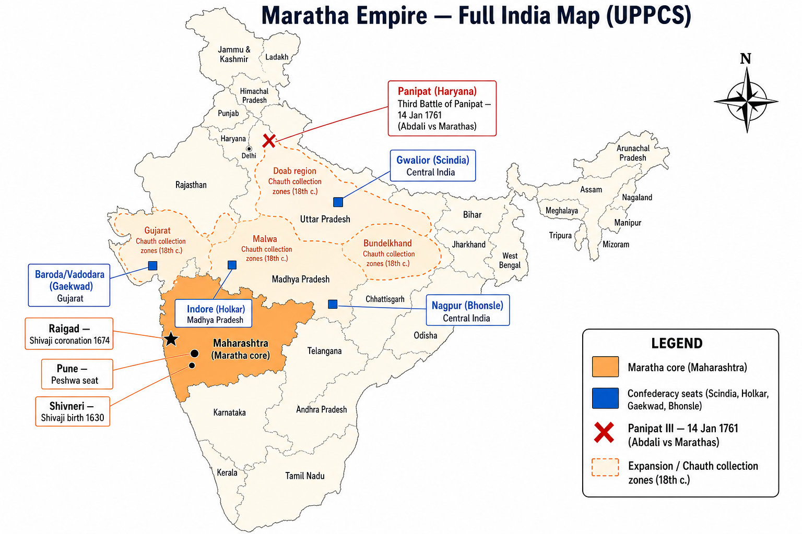

# Topic 11 — Marathas
### ★ Complete Source of Truth — No other book/notes needed for this topic

> **Covers syllabus:** Maratha Empire | Shivaji | Administrative Structure of Shivaji | Peshwas | Peshwa Period | Maratha Revenue System | Ashtapradhan Council | Chauth | Sardeshmukhi | Balaji Vishwanath | Baji Rao I | Third Battle of Panipat  
> **Sources baked in:** NCERT *Themes in Indian History Part II*, RS Sharma *Medieval India*, export notes (Struggle for Empire, Decline of Mughals), UPPCS/UPSC PYQs 2018–2025  
> **Exam weight:** ★★★ High — Chauth vs Sardeshmukhi, Peshwa chronology (2023 Q35, 2024 Q1, 2025 Q149), Shivaji–Deshmukh A/R (2024 Q18), Panipat III 1761  
> **Last verified:** July 2026

---

## Quick Revision Box — Raata This First

```
MARATHA EMPIRE ARC:
  Shivaji (1630–1680) → Sambhaji → Rajaram → Shahu (1707) → Peshwa ascendancy → Confederacy → Panipat III collapse (1761)

SHIVAJI (★★★):
  Born Shivneri 1630 | Jijabai + Shahji Bhonsle | Bijapur service early
  Forts: Torana, Rajgarh, Kondana (Sinhagad) | Afzal Khan 1659 | Shaista Khan raid
  Agra escape 1666 | Rajyabhishek Raigad 1674 | Death 1680
  2024 Q18: Deshmukh opposition — A & R both true, R explains A

ASHTAPRADHAN (8 ministers):
  Peshwa (admin) | Amatya (finance) | Mantri (records) | Senapati (army)
  Sumant (foreign) | Nyayadish (justice) | Pandit Rao (religion) | Sachiv (letters)

REVENUE (★★★):
  Chauth = 1/4 (25%) land revenue — protection tax — 2018 Q93 = B
  Sardeshmukhi = extra 10% — hereditary deshmukh claim over territory
  Ryotwari elements + deshmukhi intermediaries

PESHWA CHRONOLOGY (★★★):
  Balaji Vishwanath (1713–20) → Bajirao I (1720–40) → Balaji Bajirao (1740–61)
  → Madhav Rao I (1761–72) → Narayan Rao (1772–73) → Raghunath Rao (1773–74)
  2023 Q35: I-II-IV-III = D | 2024 Q1: 4-2-3-1 = A | 2025 Q149: 3-1-2-4 = C

BAJI RAO I:
  "Rau" | North expansion Malwa/Gujarat | Mastani | Peshwa power peak before Panipat

PANIPAT III — 14 Jan 1761 (★★★):
  Ahmad Shah Abdali (Durrani) vs Marathas (Sadashiv Rao Bhau)
  Heir Vishwas Rao killed | Maratha northern expansion ended | Mughal puppet Shah Alam weak

CONFEDERACY (later):
  Peshwa (Pune) | Scindia (Gwalior) | Holkar (Indore) | Gaekwad (Baroda) | Bhonsle (Nagpur)
```

### Must-Know Term Comparisons (very frequently asked)

| Term | One-line difference | Hindi |
|------|---------------------|-------|
| **Chauth vs Sardeshmukhi** | **Chauth** = **¼ (25%)** protection tax on land revenue; **Sardeshmukhi** = **additional 10%** hereditary chief's claim | चौथ / सरदेशमुखी |
| **Shivaji vs Peshwa** | **Shivaji** = **founder-king (Chhatrapati)**; **Peshwa** = **prime minister** → later **real ruler** after Shahu | शिवाजी / पेशवा |
| **Chhatrapati vs Peshwa** | **Chhatrapati** = **Bhonsle royal title**; **Peshwa** originally **Ashtapradhan** member — became supreme **1713+** | छत्रपति / पेशवा |
| **Ashtapradhan vs later Peshwa rule** | **Ashtapradhan** = **Shivaji's 8 ministers**; later **single Peshwa** dominated — council weakened | अष्टप्रधान / पेशवा शासन |
| **Balaji Vishwanath vs Bajirao I** | **Vishwanath** = **1st hereditary Peshwa (1713)**; **Bajirao I** = **2nd**, north expansion (**1720–40**) | बालाजी विश्वनाथ / बाजीराव प्रथम |
| **Balaji Bajirao vs Bajirao I** | **Bajirao I (Rau)** = father generation; **Balaji Bajirao (Nana Saheb)** = son Peshwa **1740–61** — Panipat era | बाजीराव प्रथम / बालाजी बाजीराव |
| **Madhav Rao I vs Narayan Rao** | **Madhav Rao I 1761–72** (post-Panipat recovery); **Narayan Rao 1772–73** (murdered) — chronology trap | माधवराव प्रथम / नारायणराव |
| **Panipat I vs II vs III** | **I 1526 Babur**; **II 1556 Akbar-Hemu**; **III 1761 Maratha-Abdali** — only III = Maratha topic | पानीपत I / II / III |
| **Ahmad Shah Abdali vs Nadir Shah** | **Abdali** = **Panipat III 1761**; **Nadir Shah** = **1739 Delhi sack** — different Afghans | अहमद शाह अब्दाली / नादिर शाह |
| **Sadashiv Rao Bhau vs Bajirao I** | **Bhau** = Maratha commander at **Panipat 1761**; **Bajirao I** died **1740** — don't merge | सदाशिवराव भाऊ / बाजीराव प्रथम |
| **Deshmukh vs Desai** | **Deshmukh** = **regional revenue/feudal chief** (Maratha); opposed Shivaji's central state (**2024 Q18**) | देशमुख / देसाई |
| **Swaraj vs Mughal jagir** | **Shivaji's swaraj** = **independent Maratha kingdom**; deshmukhs wanted **Bijapur feudal** status | स्वराज / जागीर |
| **Raigad vs Pune** | **Raigad** = **Shivaji's coronation capital**; **Pune** = **Peshwa seat** later | रायगढ़ / पुणे |
| **Sambhaji vs Shahu** | **Sambhaji** = Shivaji's son executed **1689**; **Shahu** = released **1707** → Peshwa rise | सम्भाजी / शाहू |
| **Maratha confederacy vs Shivaji kingdom** | **Shivaji** = unified kingdom; **confederacy** = **Peshwa + Scindia/Holkar/Gaekwad/Bhonsle** semi-autonomous | मराठा confederacy / शिवाजी राज्य |
| **Treaty of Purandar vs Lanavada** | **Purandar 1665** Shivaji–Jai Singh; **Lanavada 1718** Shahu–Mughals — different eras | पुरंदर / लणवाडा |

### Memory Tricks

| Trick | Remembers |
|-------|-----------|
| **Chauth = ¼** | **C**hauth = **C**hapter **25%** — **2018 Q93 = B** |
| **Sardeshmukhi = +10%** | **S**ardeshmukhi = **S**mall **10** on top of chauth |
| **Peshwa order 2025 Q149** | **V**ishwanath **B**ajirao **B**alaji **M**adhav → **3-1-2-4 = C** |
| **2023 Q35 code** | I-II-IV-III → **D** (Madhav before Narayan) |
| **2024 Q1 code** | **4-2-3-1 = A** (Vishwanath → Balaji Baji → Narayan → Raghoba) |
| **Panipat III date** | **1761** — **1** Abdali **7** Maratha **6** defeat **1** |
| **Shivaji 74-80** | Coronation **1674** | Death **1680** |
| **Afzal 59** | **1659** Afzal Khan meeting |
| **8 ministers** | **A**shtapradhan = **8** (ashta) |
| **2024 Q18 A/R** | **A** & **R** both true, **R explains A** → **A** |

---

## Exam Visuals — High-ROI Images

> **Type priority:** Maratha map + Peshwa/Panipat timeline. Images stored locally (`images/`) for offline revision.

### 1. Maratha Empire — Forts, Confederacy & Panipat III



*Full India view — **Shivaji (Raigad/Shivneri)** → **Peshwa Pune** → **confederacy houses (Gwalior, Indore, Baroda, Nagpur)** → **Panipat 1761** north. UPPCS loves **Peshwa order** + **Chauth** + **Panipat III**.*
*Source: Study map — generated for UPPCS Maratha geography*

---

## 11.1 Maratha Empire — Rise, Phases & Confederacy

### Definitions (learn all — exams pick different ones)

| Source | Definition |
|--------|------------|
| **General** | **Maratha Empire** — regional power originating in **Deccan (Maharashtra)** under **Shivaji**; expanded under **Peshwas** into **confederacy** controlling much of India before **1761 Panipat** setback |
| **NCERT** | Transition from **Shivaji's swaraj** to **Bijapur-Mughal resistance** to **18th c. all-India Maratha presence** |
| **Exam** | Three phases: **Shivaji kingdom (1674–1680)** → **Mughal wars (1680–1707)** → **Peshwa/confederacy (1713–1761 peak)** |

### Maratha Empire — How It Works

- **Geographic base:** The Maratha base lay in the **Western Ghats**, **Konkan**, and **Deccan plateau**. Hill forts (**gad**) controlled passes, trade routes, and military supply.
- **Shivaji phase (1630–1680):** Shivaji built an **independent kingdom** from Bijapur Sultanate fragments. His **Chhatrapati** coronation took place at **Raigad in 1674**.
- **Post-Shivaji crisis:** **Sambhaji** was executed by Aurangzeb in **1689**. **Rajaram** and **Tarabai** continued guerrilla resistance and drained Mughal resources in the Deccan.
- **Shahu release (1707):** After Aurangzeb's death, **Shahu** returned and challenged the Tarabai line. The **Peshwas** rose as power brokers in this struggle.
- **Peshwa ascendancy (1713+):** **Balaji Vishwanath** made the Peshwa office hereditary. The central minister gradually became the **de facto ruler**, while the Chhatrapati became symbolic.
- **Northward expansion:** **Bajirao I** expanded into **Malwa, Gujarat, Bundelkhand, and the Doab**. Maratha **rakhi** and **chauth** collections spread into Mughal territories.
- **Confederacy structure:** The confederacy had five major centres: **Peshwa (Pune)**, **Scindia (Gwalior)**, **Holkar (Indore)**, **Gaekwad (Baroda)**, and **Bhonsle (Nagpur)**. They shared Maratha identity but acted as semi-autonomous military-fiscal powers.
- **Revenue model:** **Chauth** and **sardeshmukhi** funded Maratha armies. They allowed expansion without immediate full annexation.
- **Panipat III (1761):** The Marathas suffered a catastrophic defeat against **Ahmad Shah Abdali** in **1761**. Northern expansion halted, Peshwa prestige collapsed, and **Madhav Rao I** later attempted recovery.
- **Decline:** Internal factional fights, including the Narayan Rao murder and Raghunath Rao disputes, weakened the confederacy. The Anglo-Maratha wars ended Peshwa power in **1818**.
- **UP link:** Marathas collected **chauth** in the **Doab**, **Bundelkhand**, and **Rohilkhand**. This makes north Indian geography important for UPPCS.
- **Trap — Maratha ≠ only Shivaji:** The Maratha Empire includes more than a century after Shivaji. Topic 11 covers both Shivaji's kingdom and the later Peshwa-confederacy phase.

> **Exam note:** **1761 Panipat III** marks **turning point** — not Shivaji's death (1680) — for **all-India Maratha decline**.

### Exam Facts (raata)

- The main phases were **Shivaji**, the Mughal wars, and the Peshwa-confederacy period.
- In **1713**, Balaji Vishwanath began the hereditary Peshwa line.
- The confederacy had five major houses.
- **Chauth** funded Maratha expansion.
- **Panipat III in 1761** ended in Abdali's victory.
- Peshwa power ended in **1818** as a modern-history link.

### PYQs — Maratha Empire

1. **(UPPCS 2025, Q149)** Peshwa chronology — **Balaji Vishwanath → Bajirao I → Balaji Bajirao → Madhav Rao I** → **C (3-1-2-4)**.

2. **(UPPCS 2023, Q35)** Peshwa order including **Narayan Rao & Madhav Rao I** → **D (I, II, IV, III)** — Madhav **before** Narayan.

### Examples (11.1)

| Example | Detail | Exam use |
|---------|--------|----------|
| **Confederacy five houses** | Scindia, Holkar, Gaekwad | Post-Shivaji structure |
| **Doab chauth** | Peshwa north expansion | UP geography link |
| **1761 turning point** | Panipat III | Empire phase MCQ |

---

## 11.2 Shivaji — Life, Conquests & Swaraj

### Definitions (learn all — exams pick different ones)

| Source | Definition |
|--------|------------|
| **General** | **Shivaji Bhonsle (1630–1680)** — founder of **Maratha kingdom**; **Chhatrapati** after **1674 Rajyabhishek** at **Raigad** |
| **NCERT** | Built **swaraj** through **fort capture**, **guerrilla warfare (ganimi kava)**, **administration**, **navy** — against **Bijapur** and **Mughals** |
| **Exam** | **2024 Q18** — **Deshmukh opposition** to centralised Maratha state |

### Shivaji — How It Works

- **Birth 1630:** Shivaji was born at **Shivneri fort** in **1630**. His father was **Shahji Bhonsle**, a Bijapur noble, and his mother **Jijabai** shaped his early political imagination.
- **Early conquests:** Shivaji captured forts such as **Torana, Chakan, Rajgarh, and Kondana (Sinhagad)**. These conquests secured his **Mavala** base.
- **Bijapur conflict:** Shivaji fought Adil Shahi generals, especially **Afzal Khan** in **1659**. Afzal Khan's death at **Pratapgad** became a morale turning point.
- **Mughal front:** **Shaista Khan** occupied Pune in **1663**. Shivaji's night raid damaged Mughal prestige and produced the famous finger legend.
- **Agra detention (1666):** Shivaji was detained at **Aurangzeb's court** in Agra. The fruit-basket escape legend is linked with this episode.
- **Treaty of Purandar (1665):** Shivaji made the treaty with **Raja Jai Singh I**. He surrendered **23 forts**, and Sambhaji was sent as a hostage in a temporary submission.
- **Coronation 1674:** Shivaji's **Rajyabhishek** at Raigad declared him **Chhatrapati**. It marked him as an independent sovereign, not merely a Bijapur jagirdar.
- **Navy:** Shivaji built coastal forts such as **Sindhudurg** and **Vijaydurg**. His navy protected Konkan trade and challenged the Siddi and Portuguese.
- **Deshmukh opposition (2024 Q18):** Local **deshmukhs** resisted Shivaji's central swaraj. They preferred to remain Bijapur's feudal intermediaries, so the reason explains the assertion.
- **Death 1680:** Shivaji died at **Raigad** in **1680**. **Sambhaji** succeeded him, and the Mughal war intensified under Aurangzeb.
- **Administration legacy:** Shivaji's **Ashtapradhan**, revenue practices, and welfare regulations became the foundation of the later Maratha state.
- **Trap — Shivaji never fought Panipat III:** Shivaji died in **1680**. Panipat III took place **81 years later** in **1761**.

> **Exam note:** **2024 Q18 = A** — Deshmukhs opposed **independent Maratha state** fearing loss of **feudal privileges** under Bijapur.

### Exam Facts (raata)

- Shivaji was born at **Shivneri in 1630** and died at **Raigad in 1680**.
- The **Afzal Khan** episode took place at Pratapgad in **1659**.
- Shivaji raided **Shaista Khan** in **1663**.
- The **Agra escape** is dated to **1666**.
- The **Treaty of Purandar** was made with Jai Singh in **1665**.
- Shivaji's **Rajyabhishek** took place at Raigad in **1674**.
- **Deshmukh opposition** is the key point in **2024 Q18**.

### PYQs — Shivaji

1. **(UPPCS 2024, Q18)** A: Shivaji faced Deshmukh opposition. R: They wanted Bijapur feudal lord status, not independent Maratha state.  
   → **A** — Both true; **R correctly explains A**.

2. **(UPSC 2017 pattern)** Shivaji's coronation took place at **Raigad in 1674** — **True**.

### Examples (11.2)

| Example | Detail | Exam use |
|---------|--------|----------|
| **Pratapgad 1659** | Afzal Khan | Early career MCQ |
| **Agra escape 1666** | Aurangzeb court | Biography trap |
| **Deshmukhs** | 2024 Q18 | Admin conflict |

---

## 11.3 Administrative Structure of Shivaji — Ashtapradhan Council

### Definitions (learn all — exams pick different ones)

| Source | Definition |
|--------|------------|
| **General** | **Ashtapradhan** = **council of eight ministers** advising **Chhatrapati Shivaji** — combined **military, finance, justice, diplomacy** |
| **NCERT** | Not fully separate modern departments — **personal monarchy + ministerial specialisation** — **Peshwa** later eclipsed others |
| **Exam** | **Eight** ministers — **ashta** = eight — match **portfolio ↔ minister** |

### Ashtapradhan — How It Works

- **Council concept:** Shivaji needed centralized advice beyond feudal **deshmukhs**. The **Ashtapradhan** was an institutional alternative to purely clan-based rule.
- **1. Peshwa (Mukhya Pradhan):** The Peshwa handled general administration and coordinated other ministers. Under Shahu, this office later became hereditary and supreme.
- **2. Amatya (Majumdar):** The Amatya handled finance, accounts, revenue records, and the treasury. The office connected closely with the chauth collection system.
- **3. Mantri:** The Mantri worked as private secretary and chronicler. He recorded the king's activities and performed intelligence and court diary functions.
- **4. Senapati (Sar-i-Naubat):** The Senapati was commander-in-chief. He supervised army organisation, fort garrisons, and campaigns.
- **5. Sumant (Dabir):** The Sumant handled foreign affairs. He managed correspondence and treaty negotiations with the Mughals, Bijapur, Portuguese, and other powers.
- **6. Nyayadish:** The Nyayadish was the chief justice. He handled civil and criminal cases with local panchayats under oversight.
- **7. Pandit Rao (Sadra-i-Muzzam):** The Pandit Rao handled religious affairs, charitable grants, and moral discipline. The office supported royal ritual legitimacy.
- **8. Sachiv (Shuru Navis):** The Sachiv handled official correspondence, letters, and seals. He served as the communication hub.
- **Not hereditary initially:** Shivaji appointed ministers on **merit and loyalty**. This contrasted with the hereditary deshmukhi feudalism he tried to control.
- **Peshwa transformation:** Under **Balaji Vishwanath in 1713**, the Peshwa office became hereditary. Other Ashtapradhan roles faded in political importance.
- **Military-admin link:** The **Senapati, Peshwa, and Amatya** coordinated fort defence and revenue. Guerrilla war needed flexible supply and administration.
- **Comparison Mughal:** The system resembled centralisation on a smaller and more fort-centric scale than Mughal mansabdari. UPPCS may compare the two structures.

> **Exam note:** **Peshwa** in Shivaji's time = **one of eight** ministers — **NOT yet** all-India ruler — trap "Peshwa ruled in Shivaji's lifetime as supreme" = **partially false** (Shivaji ruled; Peshwa advisory).

### Ashtapradhan — Complete Table

| # | Minister | Portfolio |
|---|----------|-----------|
| 1 | **Peshwa** | General administration |
| 2 | **Amatya** | Finance & accounts |
| 3 | **Mantri** | Chronicle & private secretary |
| 4 | **Senapati** | Commander-in-chief |
| 5 | **Sumant** | Foreign affairs |
| 6 | **Nyayadish** | Justice |
| 7 | **Pandit Rao** | Religious affairs |
| 8 | **Sachiv** | Royal correspondence |

### Exam Facts (raata)

- **Ashtapradhan** means a council of **8** ministers.
- The **Peshwa** handled general administration and later became supreme.
- The **Amatya** handled finance.
- The **Senapati** was the army chief.
- The **Sumant** handled foreign affairs.
- The **Nyayadish** handled justice.
- The **Peshwa** became hereditary from **1713**.

### PYQs — Administration

1. **(UPPCS 2024, Q18)** Deshmukh vs central admin — why Shivaji needed **Ashtapradhan** bypassing feudal chiefs.

2. **(UPSC 2020 pattern)** Which minister handled foreign affairs in Shivaji's council? → **Sumant (Dabir)**.

### Examples (11.3)

| Example | Detail | Exam use |
|---------|--------|----------|
| **Peshwa rise 1713** | Balaji Vishwanath | From minister to ruler |
| **Sumant treaties** | Purandar, Mughal letters | Diplomacy portfolio |
| **Nyayadish** | Local justice | Admin match lists |

---

## 11.4 Maratha Revenue System — Chauth & Sardeshmukhi

### Definitions (learn all — exams pick different ones)

| Source | Definition |
|--------|------------|
| **General** | **Chauth** = **¼ (25%)** of standard **land revenue** paid to Marathas for **protection**; **Sardeshmukhi** = **additional 10%** claimed as **hereditary deshmukh** overlord share |
| **NCERT** | Enabled **expansion without annexation** — **tax + protection racket** over Mughal/Bijapur territories — funded **Peshwa armies** |
| **Exam** | **2018 Q93** — "Maratha claim of revenue for protection" = **Chauth** |

### Maratha Revenue — How It Works

- **Problem of expansion:** Full conquest was expensive for the Marathas. They therefore developed parallel revenue extraction from territories still ruled by others.
- **Chauth (¼):** **Chauth** literally meant one-fourth of assessed land revenue. If land revenue was 100, chauth was 25 and functioned as a protection payment.
- **Sardeshmukhi (+10%):** **Sardeshmukhi** was an additional **10%** claim based on historical deshmukh rights. It asserted chiefly sovereignty over the territory.
- **Total burden:** Together, chauth and sardeshmukhi could reach **35%** of land revenue. This was heavy but initially less disruptive than full annexation.
- **Rakhi system:** Under the **rakhi** system, zamindars or kings paid for Maratha protection. Bundelkhand and Rajputana provide useful examples.
- **Deshmukhi intermediaries:** Local **deshmukhs** often collected revenue for the Marathas. This continued the tension between local feudal chiefs and central authority.
- **Ryot link:** The peasant (**ryot**) usually paid through existing revenue machinery. Marathas often tapped Mughal or Bijapur assessments rather than conducting a fresh survey.
- **Peshwa finance:** **Balaji Vishwanath** and **Bajirao I** used chauth from **Malwa, Gujarat, and the Doab** to fund northern campaigns. This became a fiscal base of empire.
- **Mughal decline connection:** As Mughal central power collapsed, chauth collection replaced imperial authority in many provinces. This included parts of the **UP Doab**.
- **British contrast:** The British later replaced Maratha chauth with direct settlements and fixed revenue systems.
- **Trap — Sardeshmukhi alone = protection:** **Chauth** is the classic protection quarter. **Sardeshmukhi** is the additional chief's claim.
- **Trap — Abwab/Jamadani:** **Abwab** means extra cesses, and **Jamadani** is a textile. Neither is the Maratha protection term in **2018 Q93**.

> **Exam note:** **Chauth = 25% = protection** — **single most tested** Maratha revenue fact (**2018 Q93**).

### Exam Facts (raata)

- **Chauth** was **¼ (25%)** of land revenue and worked as a protection tax.
- **Sardeshmukhi** was an additional **10%** deshmukh claim.
- Together, the two could reach **35%**.
- **Rakhi** meant a protection arrangement.
- **2018 Q93** asked this directly, and the answer was **Chauth**.
- These levies funded **Peshwa expansion**.

### PYQs — Revenue

1. **(UPPCS 2018, Q93)** Maratha claim of revenue for protection is known by what name?  
   → **B (Chauth)**.

2. **(UPSC 2018 pattern)** Sardeshmukhi was an additional **10%** levy over and above **chauth** — **True**.

### Examples (11.4)

| Example | Detail | Exam use |
|---------|--------|----------|
| **Malwa chauth** | Bajirao I campaigns | Revenue–expansion link |
| **Doab collection** | North India UP zone | Geography |
| **2018 Q93** | Chauth definition | Direct PYQ |

---

## 11.5 Peshwas & Peshwa Period — Balaji Vishwanath to Baji Rao I

### Definitions (learn all — exams pick different ones)

| Source | Definition |
|--------|------------|
| **General** | **Peshwa** = **prime minister** → **hereditary ruler** of Maratha confederacy from **Balaji Vishwanath (1713)**; **Peshwa period** = **1713–1818** real power phase |
| **NCERT** | **Shahu's grant** made Peshwa **supreme**; **Bajirao I** expanded north — **"Basalt pillar of Maratha power"** |
| **Exam** | **Chronology** — **2023 Q35, 2024 Q1, 2025 Q149** |

### Peshwas — How It Works

- **Balaji Vishwanath (1713–1720):** Balaji Vishwanath was the first hereditary Peshwa under **Chhatrapati Shahu**. He consolidated the **Saranjam** system and obtained Mughal recognition of Maratha rights through the **Treaty of Lanavada (1718)**.
- **Faction resolution:** He mediated the **Shahu vs Tarabai** conflict. This centralized Maratha loyalty under the Peshwa office and reduced exclusive Bhonsle control.
- **Bajirao I (1720–1740):** Bajirao I was Vishwanath's son and is remembered as **Rau**. He led major expansion into **Malwa, Gujarat, and Bundelkhand**.
- **Bajirao battles:** **Palkhed (1728)** against the Nizam showed Bajirao's military skill. The Mastani tradition belongs to his biography but is not the main exam point.
- **Balaji Bajirao / Nana Saheb (1740–1761):** Balaji Bajirao was Peshwa during **Panipat III**. His son **Vishwas Rao** was killed at Panipat, and the Peshwa died soon after in **1761**.
- **Madhav Rao I (1761–1772):** Madhav Rao I led a partial Maratha revival after Panipat. He briefly restored discipline but died young in **1772**.
- **Narayan Rao (1772–1773):** Narayan Rao was murdered in a palace coup. **Raghunath Rao (Raghoba)** was accused, creating major instability.
- **Raghunath Rao (1773–1774):** Raghunath Rao is linked with the First Anglo-Maratha War and the **Treaty of Surat**. This is mainly a modern-history bridge.
- **2023 Q35 order:** The correct order is **Balaji Vishwanath → Bajirao I → Madhav Rao I → Narayan Rao**. The code is **D (I, II, IV, III)**.
- **2024 Q1 order:** The correct order is **Balaji Vishwanath → Balaji Baji Rao → Narayan Rao → Raghunath Rao**. The code is **A (4, 2, 3, 1)**.
- **2025 Q149 order:** The correct order is **Vishwanath → Bajirao I → Balaji Bajirao → Madhav Rao I**. The code is **C (3, 1, 2, 4)**.
- **Confederacy solidifies:** Under the Peshwas, **Scindia, Holkar, Gaekwad, and Bhonsle** became powerful sub-states. They shared Maratha identity but maintained separate armies.

> **Exam note:** **Madhav Rao I before Narayan Rao** — **2023 Q35** trap — students swap **III and IV**.

### Peshwa — Period Master Table

| Peshwa | Period | Key note |
|--------|--------|----------|
| **Balaji Vishwanath** | 1713–1720 | 1st hereditary; Lanavada 1718 |
| **Bajirao I** | 1720–1740 | North expansion; Palkhed 1728 |
| **Balaji Bajirao (Nana Saheb)** | 1740–1761 | Panipat III era |
| **Madhav Rao I** | 1761–1772 | Post-Panipat recovery |
| **Narayan Rao** | 1772–1773 | Murdered |
| **Raghunath Rao (Raghoba)** | 1773–1774 | Anglo-Maratha link |
| **Madhav Rao II** | 1774–1795 | Nana Fadnavis regency |
| **Baji Rao II** | 1795–1818 | Last Peshwa |

### Exam Facts (raata)

- The hereditary Peshwa line began in **1713**.
- **Balaji Vishwanath** was the first hereditary Peshwa.
- **Bajirao I (1720–1740)** represents peak expansion.
- **Balaji Bajirao** belongs to the Panipat generation.
- **Madhav Rao I** came before **Narayan Rao**.
- **2025 Q149** has the code **C (3-1-2-4)**.

### PYQs — Peshwas

1. **(UPPCS 2025, Q149)** Arrange: Bajirao I, Balaji Bajirao, Balaji Vishwanath, Madhav Rao I → **C (3-1-2-4)**.

2. **(UPPCS 2023, Q35)** Arrange: Balaji Vishwanath, Bajirao I, Narayan Rao, Madhav Rao I → **D (I, II, IV, III)**.

3. **(UPPCS 2024, Q1)** Arrange: Raghunath Rao, Balaji Baji Rao, Narayan Rao, Balaji Vishwanath → **A (4, 2, 3, 1)**.

### Examples (11.5)

| Example | Detail | Exam use |
|---------|--------|----------|
| **Lanavada 1718** | Balaji Vishwanath | Mughal treaty |
| **Palkhed 1728** | Bajirao vs Nizam | Military peak |
| **2023 Q35** | Madhav/Narayan order | Chronology trap |

---

## 11.6 Third Battle of Panipat (14 January 1761)

### Definitions (learn all — exams pick different ones)

| Source | Definition |
|--------|------------|
| **General** | **Third Battle of Panipat (1761)** — **Ahmad Shah Abdali (Durrani)** defeated **Maratha army** led by **Sadashiv Rao Bhau** — ended **Maratha northward surge** |
| **NCERT** | Culmination of **Afghan–Maratha rivalry** over **Punjab, Doab, Delhi** — **Mughal emperor** reduced to **puppet** |
| **Exam** | **High-priority syllabus addition** — pair **1761 + Abdali + Maratha defeat** |

### Third Battle of Panipat — How It Works

- **Background:** After Bajirao I, the Marathas controlled Delhi and collected **chauth** in Punjab, Rajputana, and the Doab. **Ahmad Shah Abdali** returned to restore Durrani influence in Punjab.
- **Alliances:** Abdali fought with **Shuja-ud-Daula of Awadh** and the **Rohillas** against the Marathas. Rajputs stayed largely absent, and Sikhs mostly watched.
- **Maratha side:** **Sadashiv Rao Bhau**, cousin of Peshwa Balaji Bajirao, commanded the Maratha army. **Vishwas Rao**, the Peshwa's son and heir, was also present.
- **Date & place:** The battle took place on **14 January 1761** at **Panipat**. The same field is associated with the battles of **1526** and **1556**.
- **Battle course:** The battle combined artillery and cavalry action. Maratha supply shortages in winter worsened the crisis, and both **Bhau** and **Vishwas Rao** were killed.
- **Outcome:** Abdali won decisively, and the Marathas retreated south. Afghan occupation of Delhi was temporary, but Maratha northern expansion was broken.
- **Political effects:** Peshwa **Balaji Bajirao** died soon after hearing the news. **Madhav Rao I** later tried to restore Maratha power, but unity was strained.
- **Mughal angle:** **Shah Alam II** remained weak after the battle. The continuing power vacuum indirectly helped the British rise.
- **Why Marathas lost (exam themes):** The main causes were overextended supply lines, weak Rajput/Sikh support, winter logistics, and confederacy coordination failures.
- **Trap — Panipat I/II/III:** Panipat I was **Babur in 1526**, Panipat II was **Akbar-Hemu in 1556**, and Panipat III was **Abdali-Maratha in 1761**. Only the third belongs to the Maratha topic.
- **Trap — Bajirao I at Panipat:** **Bajirao I** died in **1740**, 21 years before Panipat III. The commander was **Sadashiv Rao Bhau**.

> **Exam note:** **Abdali** (not Nadir Shah 1739) fought **Panipat III** — Afghan ruler **Ahmad Shah Durrani**.

### Exam Facts (raata)

- Panipat III was fought on **14 January 1761**.
- **Ahmad Shah Abdali** defeated the **Marathas**.
- **Sadashiv Rao Bhau** commanded the Maratha army.
- **Vishwas Rao** was killed in the battle.
- Maratha **northern expansion** ended after the defeat.
- Peshwa **Balaji Bajirao** died soon after the news.
- **Madhav Rao I** later attempted recovery.

### PYQs — Panipat III

1. **(UPPCS 2025, Q149)** **Balaji Bajirao** Peshwa during **1761** — chronology links Panipat to **Peshwa period**.

2. **(UPSC 2019 pattern)** Third Battle of Panipat was fought between **Marathas** and **Ahmad Shah Abdali** in **1761** — **True**.

### Examples (11.6)

| Example | Detail | Exam use |
|---------|--------|----------|
| **Panipat field reuse** | 1526, 1556, 1761 | Three battles same region |
| **Vishwas Rao death** | Peshwa heir | Why succession crisis |
| **Abdali–Awadh alliance** | Shuja-ud-Daula | Coalition composition |

---

## Consolidated Reference

### Maratha Timeline (Complete)

| Year | Event |
|------|-------|
| **1630** | Shivaji born (Shivneri) |
| **1659** | Afzal Khan killed (Pratapgad) |
| **1665** | Treaty of Purandar |
| **1666** | Shivaji escapes Agra |
| **1674** | Rajyabhishek at Raigad |
| **1680** | Shivaji dies |
| **1689** | Sambhaji executed |
| **1707** | Aurangzeb dies; Shahu released |
| **1713** | Balaji Vishwanath — hereditary Peshwa |
| **1718** | Treaty of Lanavada |
| **1720–1740** | Bajirao I Peshwa |
| **1740–1761** | Balaji Bajirao Peshwa |
| **1761** | **Third Battle of Panipat (14 Jan)** |
| **1761–1772** | Madhav Rao I |
| **1818** | Last Peshwa (modern — British) |

### Revenue & Admin Quick Table

| Term | Meaning |
|------|---------|
| **Chauth** | ¼ (25%) protection tax on land revenue |
| **Sardeshmukhi** | Additional 10% deshmukh claim |
| **Rakhi** | Protection band/service offer |
| **Ashtapradhan** | Council of eight ministers |
| **Swaraj** | Independent Maratha kingdom (Shivaji) |
| **Deshmukh** | Local feudal revenue chief |

### UP Focus — Marathas & Uttar Pradesh

| Element | Detail | PYQ / trap link |
|---------|--------|-----------------|
| **Panipat** | **Haryana** — borders **UP** — **1761** high priority | Syllabus addition |
| **Doab chauth** | Marathas under Peshwas in **Ganga–Yamuna Doab** | Revenue geography |
| **Awadh nawab** | **Shuja-ud-Daula** allied **Abdali** at Panipat | Coalition trap |
| **Bundelkhand** | Maratha **rakhi/chauth** zone | Expansion MCQ |
| **Delhi control** | Maratha presence pre-1761 | Not Mughal capital control post-Panipat |
| **Rohilkhand** | Maratha–Afghan contested | North India interface |

### Important Dates

| Item | Date |
|------|------|
| Shivaji born | **1630** |
| Afzal Khan episode | **1659** |
| Treaty of Purandar | **1665** |
| Shivaji Rajyabhishek | **1674** |
| Shivaji died | **1680** |
| Balaji Vishwanath Peshwa | from **1713** |
| Bajirao I Peshwa | **1720–1740** |
| Palkhed battle | **1728** |
| Balaji Bajirao Peshwa | **1740–1761** |
| **Third Panipat** | **14 January 1761** |
| Madhav Rao I | **1761–1772** |

---

## Practice Zone — UPPCS Format Questions

> **Answers hidden** — click *Show answer* under each question to reveal.

**Q1.** The Maratha claim of revenue for protection is known as:

Options:
A. Sardeshmukhi
B. Chauth
C. Abwab
D. Jamadani

<details>
<summary>Show answer</summary>

**Ans: B** — **2018 Q93** — **Chauth = ¼ protection tax**.

</details>

**Q2.** Consider the following Peshwas and arrange in ascending chronological order:

1. Balaji Vishwanath
2. Bajirao I
3. Madhav Rao I
4. Balaji Bajirao

Options:
A. 1, 2, 4, 3
B. 2, 1, 3, 4
C. 1, 3, 2, 4
D. 4, 1, 2, 3

<details>
<summary>Show answer</summary>

**Ans: A (1-2-4-3)** — Same as **2025 Q149 = C** when coded 3-1-2-4.

</details>

**Q3.** Assertion (A): Shivaji had to face opposition from the big Deshmukhs.

Reason (R): These Deshmukhs were not in favour of an independent Maratha State and wanted to remain as feudal lords of Bijapur.

Options:
A. Both (A) and (R) are true and (R) is the correct explanation of (A)
B. (A) is false, but (R) is true
C. Both (A) and (R) are true, but (R) is not the correct explanation of (A)
D. (A) is true, but (R) is false

<details>
<summary>Show answer</summary>

**Ans: A** — **2024 Q18** exact pattern.

</details>

**Q4.** Chauth was:

Options:
A. One-tenth of land revenue
B. One-fourth of land revenue
C. One-third of land revenue
D. One-half of land revenue

<details>
<summary>Show answer</summary>

**Ans: B** — **25%** protection tax.

</details>

**Q5.** Sardeshmukhi was:

Options:
A. An additional 10% levy
B. Same as chauth
C. A Mughal jagir grant
D. A British land settlement

<details>
<summary>Show answer</summary>

**Ans: A** — **10%** over chauth — deshmukh claim.

</details>

**Q6.** Arrange Peshwas (2023 pattern):

1. Balaji Vishwanath
2. Bajirao I
3. Narayan Rao
4. Madhav Rao I

Options:
A. I, III, II, IV
B. I, II, III, IV
C. II, I, IV, III
D. I, II, IV, III

<details>
<summary>Show answer</summary>

**Ans: D (I, II, IV, III)** — **2023 Q35** — Madhav **before** Narayan.

</details>

**Q7.** The Third Battle of Panipat (1761) was fought between:

Options:
A. Marathas and Mughals under Aurangzeb
B. Marathas and Ahmad Shah Abdali
C. British and Marathas
D. Marathas and Rajputs under Rana Pratap

<details>
<summary>Show answer</summary>

**Ans: B** — **Abdali (Durrani)** — not Aurangzeb (died 1707).

</details>

**Q8.** Consider the following about Shivaji:

1. He was crowned Chhatrapati at Raigad in 1674.
2. He died in 1761 at Panipat.

Which is/are correct?

Options:
A. Only 1
B. Only 2
C. Both 1 and 2
D. Neither 1 nor 2

<details>
<summary>Show answer</summary>

**Ans: A** — Shivaji died **1680** — **Panipat 1761** was later Maratha era.

</details>

**Q9.** Match List-I with List-II:

| List-I | List-II |
|--------|---------|
| A. Peshwa | 1. Finance |
| B. Amatya | 2. Foreign affairs |
| C. Sumant | 3. General administration |
| D. Senapati | 4. Commander-in-chief |

Options:
A. 3 1 2 4
B. 1 3 4 2
C. 3 2 1 4
D. 4 3 2 1

<details>
<summary>Show answer</summary>

**Ans: A (3-1-2-4)** — Peshwa-admin; Amatya-finance; Sumant-foreign; Senapati-army.

</details>

**Q10.** Who was the first hereditary Peshwa?

Options:
A. Bajirao I
B. Balaji Vishwanath
C. Balaji Bajirao
D. Madhav Rao I

<details>
<summary>Show answer</summary>

**Ans: B** — **1713** under Shahu.

</details>

**Q11.** Consider the following statements:

1. Ashtapradhan was a council of eight ministers.
2. The Peshwa was originally one minister among eight.

Which is/are correct?

Options:
A. Only 1
B. Only 2
C. Both 1 and 2
D. Neither 1 nor 2

<details>
<summary>Show answer</summary>

**Ans: C** — Both define Shivaji-era council.

</details>

**Q12.** Bajirao I is associated with:

Options:
A. Third Battle of Panipat
B. Northward expansion and Palkhed 1728
C. Treaty of Purandar 1665
D. Rajyabhishek 1674

<details>
<summary>Show answer</summary>

**Ans: B** — **1720–1740** — died before **1761**.

</details>

**Q13.** Arrange (2024 Q1 pattern):

1. Raghunath Rao
2. Balaji Baji Rao
3. Narayan Rao
4. Balaji Vishwanath

Options:
A. 4, 2, 3, 1
B. 3, 4, 1, 2
C. 1, 2, 3, 4
D. 1, 3, 2, 4

<details>
<summary>Show answer</summary>

**Ans: A (4-2-3-1)** — **2024 Q1**.

</details>

**Q14.** Assertion (A): Chauth and Sardeshmukhi together could amount to 35% of land revenue.

Reason (R): Chauth was one-fourth and Sardeshmukhi was an additional one-tenth.

Options:
A. Both true; R explains A
B. Both true; R does not explain A
C. A true; R false
D. A false; R true

<details>
<summary>Show answer</summary>

**Ans: A** — 25% + 10% = 35%.

</details>

**Q15.** Who commanded the Maratha army at Panipat III?

Options:
A. Bajirao I
B. Shivaji
C. Sadashiv Rao Bhau
D. Balaji Vishwanath

<details>
<summary>Show answer</summary>

**Ans: C** — **Bhau** — not Bajirao I (died 1740).

</details>

**Q16.** Shivaji's coronation took place at:

Options:
A. Pune
B. Raigad
C. Panipat
D. Shivneri

<details>
<summary>Show answer</summary>

**Ans: B** — **1674 Rajyabhishek**.

</details>

**Q17.** Consider the following about Panipat battles:

1. The First Battle of Panipat was fought in 1526.
2. The Third Battle of Panipat was fought in 1761.

Which is/are correct?

Options:
A. Only 1
B. Only 2
C. Both 1 and 2
D. Neither 1 nor 2

<details>
<summary>Show answer</summary>

**Ans: C** — Both dates standard.

</details>

**Q18.** Which minister in Ashtapradhan handled justice?

Options:
A. Sachiv
B. Nyayadish
C. Mantri
D. Pandit Rao

<details>
<summary>Show answer</summary>

**Ans: B** — **Chief justice** role.

</details>

**Q19.** Match revenue terms:

| List-I | List-II |
|--------|---------|
| A. Chauth | 1. 10% additional |
| B. Sardeshmukhi | 2. 25% protection tax |

Options:
A. 2 1
B. 1 2
C. 2 2
D. 1 1

<details>
<summary>Show answer</summary>

**Ans: A (2-1)** — Chauth-25%; Sardeshmukhi-10%.

</details>

**Q20.** The Treaty of Lanavada (1718) is associated with:

Options:
A. Shivaji and Jai Singh
B. Balaji Vishwanath and Mughal Sayyid brothers
C. Bajirao I and Nizam
D. Abdali and Marathas

<details>
<summary>Show answer</summary>

**Ans: B** — Early **Peshwa** diplomacy.

</details>

**Q21.** Consider the following:

1. Ahmad Shah Abdali defeated the Marathas at Panipat.
2. Nadir Shah fought the Marathas at Panipat.

Which is/are correct?

Options:
A. Only 1
B. Only 2
C. Both 1 and 2
D. Neither 1 nor 2

<details>
<summary>Show answer</summary>

**Ans: A** — **Nadir Shah 1739 Delhi** — not Panipat III commander.

</details>

**Q22.** Afzal Khan was killed by Shivaji in:

Options:
A. 1659
B. 1674
C. 1680
D. 1761

<details>
<summary>Show answer</summary>

**Ans: A** — **1659** Pratapgad.

</details>

**Q23.** Assertion (A): The Peshwa became the effective ruler of the Maratha confederacy after 1713.

Reason (R): Balaji Vishwanath was granted hereditary Peshwaship by Chhatrapati Shahu.

Options:
A. Both true; R explains A
B. Both true; R does not explain A
C. A true; R false
D. A false; R true

<details>
<summary>Show answer</summary>

**Ans: A** — **1713** turning point.

</details>

**Q24.** Which was NOT a major Maratha confederacy power centre?

Options:
A. Scindia (Gwalior)
B. Holkar (Indore)
C. Vijayanagara
D. Gaekwad (Baroda)

<details>
<summary>Show answer</summary>

**Ans: C** — **Vijayanagara** = South medieval kingdom.

</details>

**Q25.** Balaji Bajirao (Nana Saheb) was Peshwa during:

Options:
A. Shivaji's reign
B. Panipat III (1761)
C. Treaty of Purandar
D. Anglo-Maratha Third War only

<details>
<summary>Show answer</summary>

**Ans: B** — **1740–1761** — Panipat generation.

</details>

**Q26.** Consider the following about Maratha revenue:

1. Chauth was a protection tax.
2. Sardeshmukhi was collected as one-fourth of land revenue.

Which is/are correct?

Options:
A. Only 1
B. Only 2
C. Both 1 and 2
D. Neither 1 nor 2

<details>
<summary>Show answer</summary>

**Ans: A** — Sardeshmukhi = **10%**, not one-fourth.

</details>

**Q27.** Arrange chronologically:

1. Shivaji's Rajyabhishek
2. Third Battle of Panipat
3. Balaji Vishwanath becomes Peshwa
4. Afzal Khan episode

Options:
A. 4, 1, 3, 2
B. 1, 4, 3, 2
C. 4, 3, 1, 2
D. 1, 3, 4, 2

<details>
<summary>Show answer</summary>

**Ans: A (4-1-3-2)** — 1659 → 1674 → 1713 → 1761.

</details>

**Q28.** Who among the following was killed at Panipat III among Peshwa family?

Options:
A. Bajirao I
B. Vishwas Rao
C. Balaji Vishwanath
D. Shivaji

<details>
<summary>Show answer</summary>

**Ans: B** — **Peshwa's son/heir** killed **1761**.

</details>

**Q29.** Consider the following statements about Shivaji's administration:

1. Ashtapradhan had eight members.
2. Deshmukhs always supported Shivaji's centralisation without opposition.

Which is/are correct?

Options:
A. Only 1
B. Only 2
C. Both 1 and 2
D. Neither 1 nor 2

<details>
<summary>Show answer</summary>

**Ans: A** — **2024 Q18** — Deshmukhs **opposed** central swaraj.

</details>

**Q30.** Match battle — year:

| List-I | List-II |
|--------|---------|
| A. Panipat III | 1. 1526 |
| B. Panipat I | 2. 1761 |
| C. Panipat II | 3. 1556 |

Options:
A. 2 1 3
B. 1 2 3
C. 3 2 1
D. 2 3 1

<details>
<summary>Show answer</summary>

**Ans: A (2-1-3)** — III-1761; I-1526; II-1556.

</details>

---

## Complete PYQ Bank — UPPCS (2018–2025)

> Full question text from `pyq/` files. Answers in hidden blocks.

### UPPCS Prelims 2018

**Q93.** The Maratha claim of revenue for protection is known by what name?

Options:
A. Sardesh Mukhi
B. Chauth
C. Abwab
D. Jamadani

<details>
<summary>Show answer</summary>

**Ans: B (Chauth)** — **¼ protection tax** — not Sardeshmukhi (which is additional 10%).

</details>

### UPPCS Prelims 2023

**Q35.** Consider the reign of the following Peshwas and arrange them in chronological order—

(I) Balaji Vishwanath  
(II) Bajirao I  
(III) Narayan Rao  
(IV) Madhav Rao I

Options:
A. I, III, II, IV
B. I, II, III, IV
C. II, I, IV, III
D. I, II, IV, III

<details>
<summary>Show answer</summary>

**Ans: D (I, II, IV, III)** — Vishwanath → Bajirao I → **Madhav Rao I** → **Narayan Rao**.

</details>

### UPPCS Prelims 2024

**Q1.** Consider the following Peshwas and arrange them in ascending chronological order:

1. Raghunath Rao (Raghoba)
2. Balaji Baji Rao
3. Narayan Rao
4. Balaji Vishwanath

Options:
A. 4, 2, 3, 1
B. 3, 4, 1, 2
C. 1, 2, 3, 4
D. 1, 3, 2, 4

<details>
<summary>Show answer</summary>

**Ans: A (4, 2, 3, 1)** — Vishwanath → Balaji Baji Rao → Narayan Rao → Raghunath Rao.

</details>

**Q18.** Given below are two statements:

**Assertion (A):** Shivaji had to face opposition from the big Deshmukhs.

**Reason (R):** These Deshmukhs were not in favour of an independent Maratha State and wanted to remain as feudal lords of Bijapur.

Options:
A. Both (A) and (R) are true and (R) is the correct explanation of (A)
B. (A) is false, but (R) is true
C. Both (A) and (R) are true, but (R) is not the correct explanation of (A)
D. (A) is true, but (R) is false

<details>
<summary>Show answer</summary>

**Ans: A** — Deshmukhs feared loss of **feudal intermediary** role under **swaraj**.

</details>

### UPPCS Prelims 2025

**Q149.** Arrange the following in chronological order of their rule:

1. Bajirao I  
2. Balaji Bajirao  
3. Balaji Vishwanath  
4. Madhav Rao I

Options:
A. 1, 3, 2, 4
B. 3, 1, 4, 2
C. 3, 1, 2, 4
D. 1, 3, 4, 2

<details>
<summary>Show answer</summary>

**Ans: C (3, 1, 2, 4)** — Vishwanath → Bajirao I → Balaji Bajirao → Madhav Rao I.

</details>

---

## Common Traps — Marathas (≥10)

1. **Chauth was not 10%.** **Chauth** was **25% (¼)** of land revenue and is the answer to **2018 Q93**.
2. **Sardeshmukhi was not the protection quarter.** **Chauth** was the protection tax, while **Sardeshmukhi** was the additional **10%** claim.
3. **Shivaji was not present at Panipat III.** He died in **1680**, and Panipat III was fought in **1761**.
4. **Bajirao I did not command at Panipat.** He died in **1740**, and **Sadashiv Rao Bhau** commanded the Maratha army.
5. **Narayan Rao did not come before Madhav Rao I.** **Madhav Rao I (1761–72)** came first in the **2023 Q35** order.
6. **The Peshwa was not supreme in Shivaji's lifetime.** He was one of the eight Ashtapradhan ministers, and the office became hereditary from **1713**.
7. **Panipat III was not fought by Nadir Shah.** **Ahmad Shah Abdali** fought it in **1761**, while Nadir Shah sacked Delhi in **1739**.
8. **Deshmukhs did not fully support Shivaji's centralisation.** They opposed swaraj because it threatened their feudal privileges (**2024 Q18**).
9. **Raigad was not the Peshwa capital.** Raigad was Shivaji's coronation centre, while **Pune** became the Peshwa seat.
10. **Ashtapradhan did not have five ministers.** It had **eight** ministers.
11. **Balaji Bajirao did not precede Bajirao I.** **Bajirao I** was the father, and **Balaji Bajirao** was the son.
12. **The 2025 Q149 order must be memorised.** It is **3-1-2-4**, or Vishwanath → Bajirao I → Balaji Bajirao → Madhav Rao I.
13. **The Maratha confederacy was not Shivaji's personal kingdom alone.** It developed later under the Peshwa era.
14. **Abwab was not the Maratha protection tax.** **Abwab** meant extra cesses, while **Chauth** was the Maratha protection tax.
