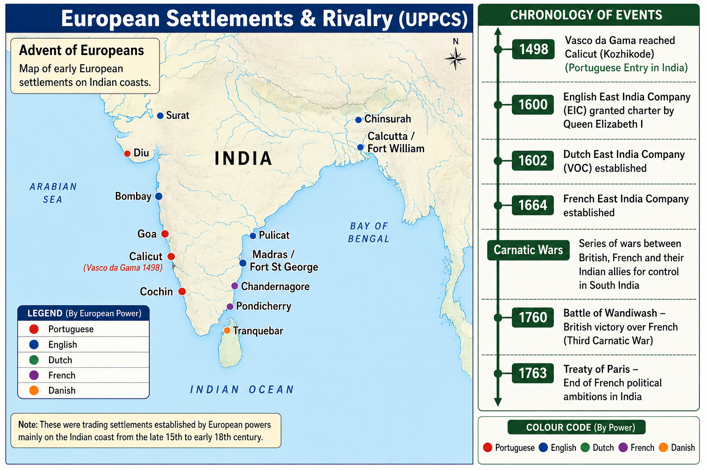

# Topic 1 — Advent of Europeans
### ★ Complete Source of Truth — No other book/notes needed for this topic

> **Covers syllabus:** Advent of Europeans | Arrival of European Companies | Portuguese in India | Dutch in India | English East India Company | French East India Company | Danish Settlements | European Trading Centres | Factories and Presidencies | British–French Rivalry | Anglo-French Conflict | Carnatic Wars | First Carnatic War | Second Carnatic War | Third Carnatic War | Portuguese Governors | Vasco da Gama | Battle of Wandiwash | Treaty of Paris (1763) | Important European Settlements in India  
> **Sources baked in:** NCERT *Themes in Indian History Part III* (Advent of Europeans / Colonialism), Spectrum *A Brief History of Modern India*, Bipan Chandra framework, UPPCS Prelims PYQs 2018–2025  
> **Exam weight:** ★★★ High — company–settlement matching, Carnatic War treaties, Anglo-French chronology, Hawkins/Roe/Fitch order  
> **Last verified:** July 2026

---

## Quick Revision Box — Raata This First

```
ARRIVAL ORDER (sea powers):
  Portuguese 1498 (Vasco da Gama, Calicut) → English EIC 1600 → Dutch VOC 1602 → Danish 1616 → French 1664

PORTUGUESE:
  Vasco da Gama 1498 Calicut (Zamorin) | Cabral 1500 | Almeida 1505 (1st Viceroy) | Albuquerque 1509–15 (Goa 1510)
  Capital = Goa | Cartaze = pass/tax on Indian Ocean ships | Hooghly expelled by Shah Jahan 1632
  Holdings later: Goa, Daman, Diu | Never ruled Delhi/Agra

DUTCH (VOC 1602):
  Pulicat, Surat, Masulipatnam, Chinsurah (Bengal) | Spice + textiles
  Battle of Bedara/Chinsurah 1759 = English defeat Dutch ← UPPCS 2022 Q64

ENGLISH EIC (charter 31 Dec 1600):
  Battle of Swally 1612 (vs Portuguese) | Hawkins 1608 (Jahangir; Turkish) | Surat factory 1612 | Roe 1615–19 (James I ambassador)
  Madras/Fort St George 1640 | Bombay leased 1668 | Calcutta/Fort William ~1698
  Travellers order 2021 Q75: Fitch → Hawkins → Downton → Roe = A (II, I, IV, III)
  Hawkins 2023 Q31: arrived 1608 (NOT 1611) + Turkish ✓ → Only 2 = B

FRENCH (1664):
  Pondicherry 1674 (François Martin) HQ | Chandernagore, Karaikal, Mahe, Yanam
  Dupleix 1742–54 | Carnatic Wars vs English

DANISH (1616):
  Tranquebar/Tharangambadi 1620 (Fort Dansborg) | Serampore (Bengal) | Sold to British 1845

FACTORIES & PRESIDENCIES:
  Factory = trading post (warehouse + agents + guards), NOT modern industry
  Three Presidencies: Madras | Bombay | Bengal (Calcutta)
  First Municipal Corporation = Madras 1687–88 ← UPPCS 2021 Q145

CAUSES OF ADVENT:
  Spices + textiles | Ottoman/Arab middlemen | Cape route | Mercantilism | Navigation advances

CARNATIC WARS (Anglo-French, Coromandel):
  1st 1746–48 → Madras taken 1746; Adyar lesson; Aix-la-Chapelle 1748 returns Madras ← 2020 Q18 / 2025 Q67 = Both
  2nd 1749–54 → Chanda Sahib (F) vs Muhammad Ali (E); Arcot 1751 (Clive); Dupleix recalled 1754 (= Second Anglo-French War)
  3rd 1758–63 → Lally; failed Madras siege; Wandiwash 1760 (Coote); Pondicherry 1761; Paris 1763
  Why English won: navy + money + allies + continuity; French: weak sea power + Dupleix recall + Lally mismanagement

2025 Q26 CHRONOLOGY:
  2nd Anglo-French → 1st Anglo-Mysore → 1st Anglo-Afghan → 1st Anglo-Sikh = A (2, 1, 4, 3)

SETTLEMENT MATCH (★★★):
  Goa = Portuguese | Pulicat/Chinsurah = Dutch | Pondicherry/Chandernagore = French
  Tranquebar/Serampore = Danish | Surat/Madras/Bombay/Calcutta = English
```

### Must-Know Term Comparisons (very frequently asked)

| Term | One-line difference | Hindi |
|------|---------------------|-------|
| **Factory vs Colony** | Factory = early trading post with permission; colony = territorial rule after wars/annexation | फैक्टरी / उपनिवेश |
| **EIC vs VOC** | EIC = English company (1600); VOC = Dutch company (1602) | ईस्ट इंडिया कंपनी / वीओसी |
| **Cartaze vs Farman** | Cartaze = Portuguese ocean pass/tax; Farman = Mughal imperial trade grant | कार्टाज़ / फ़रमान |
| **Viceroy vs Governor** | Portuguese used Viceroy (Almeida first, 1505); later company Governors (e.g. Dupleix) | वायसराय / गवर्नर |
| **Goa vs Pondicherry** | Goa = Portuguese capital in India; Pondicherry = French headquarters | गोवा / पांडिचेरी |
| **Chinsurah vs Chandernagore** | Chinsurah = Dutch Bengal; Chandernagore = French Bengal | चिन्सुरा / चंद्रनगर |
| **Surat vs Madras** | Surat = first permanent English factory (1612); Madras = Fort St George (1640), later Presidency | सूरत / मद्रास |
| **Aix-la-Chapelle vs Paris** | Aix-la-Chapelle 1748 ends First Carnatic War; Paris 1763 ends Seven Years'/Third Carnatic War | एक्स-ला-शापेल / पेरिस |
| **Carnatic War vs Anglo-Mysore** | Carnatic = Anglo-French on Coromandel (1740s–60s); Mysore = English vs Hyder/Tipu later | कर्नाटक युद्ध / आंग्ल-मैसूर |
| **Dupleix vs Clive** | Dupleix = French governor, Carnatic strategy; Clive = English, Arcot/Plassey era | डूप्ले / क्लाइव |
| **Hawkins vs Roe** | Hawkins 1608 EIC captain at Jahangir's court; Roe 1615–19 James I ambassador | हॉकिन्स / रो |
| **First vs Third Carnatic War** | First ends 1748 (status quo, Madras returned); Third ends 1763 (French political defeat) | प्रथम / तृतीय कर्नाटक युद्ध |
| **Wandiwash vs Plassey** | Wandiwash 1760 = Anglo-French Deccan victory; Plassey 1757 = Bengal (Topic 2) | वांडिवाश / प्लासी |
| **Presidency vs Factory** | Presidency = later administrative unit (Madras/Bombay/Bengal); factory = local trading station | प्रेसीडेंसी / फैक्टरी |

### Memory Tricks

| Trick | Remembers |
|-------|-----------|
| **P-E-D-Da-F** | **P**ortuguese 1498 → **E**IC 1600 → **D**utch 1602 → **Da**nish 1616 → **F**rench 1664 |
| **Gama ≠ Goa** | Gama = Calicut 1498; Albuquerque = Goa 1510 |
| **A-A-A Portuguese** | **A**lmeida (1st Viceroy) → **A**lbuquerque (Goa) → **A**ustria link not needed — remember Almeida before Albuquerque |
| **Fitch First** | Ralph **Fitch** earliest in 2021 Q75 traveller list |
| **H before R** | **H**awkins 1608 before **R**oe 1615 |
| **SMP-BBC** | Settlements: **S**urat → **M**adras → **B**ombay → **C**alcutta (English) |
| **P-P French** | **P**ondicherry = **P**rench HQ |
| **ChiN Dutch, ChaN French** | **Chi**nsurah = Dutch; **Cha**ndernagore = French |
| **1748 Aix = Both** | War ended + Madras returned (2020/2025) |
| **W-P 1760-63** | **W**andiwash 1760 → **P**aris 1763 |
| **2-1-4-3** | 2025 Q26 code: 2nd Anglo-French, 1st Mysore, 1st Afghan, 1st Sikh |
| **Tranquebar = Tiny Denmark** | Smallest company → Tranquebar ID |

---

## 1.1 Advent of Europeans / Arrival of European Companies


### Definitions

| Source | Definition |
|--------|------------|
| **General** | **Advent of Europeans** = arrival and early establishment of European sea powers and chartered companies on Indian coasts (from **1498**) |
| **NCERT** | Shift from overland Asian trade networks toward Atlantic–Indian Ocean sea routes after 1498; factory system before territorial empire |
| **Exam** | Five syllabus powers: Portuguese, Dutch, English, French, Danish — **causes of coming** + date + first settlement + why English finally outpaced rivals |

### Why Europeans Came — Causes (raata for 2-statement Qs)

| Cause | How it pushed advent |
|-------|----------------------|
| **Spice demand** | Pepper, cloves, cinnamon, nutmeg fetched huge profits in Europe |
| **Textile and other Asian goods** | Later companies also sought Indian cotton, silk, indigo, saltpetre |
| **Ottoman / Arab middlemen** | Overland and Red Sea routes were costly and politically constrained after Ottoman rise |
| **Renaissance + navigation** | Better ships, compass, cartography, Atlantic exploration culture |
| **Cape route discovery** | Dias (1488) proved Africa could be rounded; Gama (1498) reached India |
| **Bullion and mercantilism** | European states wanted direct Asian trade inside their own monopoly companies |
| **Missionary impulse (esp. Portuguese)** | Trade and Catholic mission often travelled together |

### Advent of European Companies — How It Works

- **Advent** begins with **Portuguese sea arrival (1498)** and continues through Dutch, English, Danish, and French company foundations into the 17th–18th centuries.
- Europeans sought **spices** first, then **textiles, indigo, and saltpetre**. Indian cotton and silk became as important as pepper for later companies.
- Ottoman and Arab control of older **overland routes** pushed Atlantic powers to find a direct **sea route** to India.
- **Vasco da Gama (1498)** opened the route for Portugal. Other powers followed with **joint-stock chartered companies**.
- A **chartered company** held a royal monopoly. It could trade, fortify factories, make treaties, and raise troops.
- Early European presence was **coastal and commercial**, not pan-India rule. Inland powers (Deccan Sultanates, Mughals, later Nawabs and the Nizam) still dominated politics.
- **Portuguese Estado da Índia** was a **crown empire**. Later Dutch, English, French, and Danish ventures were mainly **company-led**.
- Competition pattern: Portuguese monopoly in the **16th** century → Dutch–English challenge in the **17th** → French rivalry and Carnatic Wars in the **18th**.
- **Mughal farmans** regulated English and Dutch trade at ports such as **Surat**. Without permission, factories could not expand safely.
- The **Battle of Swally (1612)** near Surat strengthened English naval standing against the Portuguese and helped secure the Surat factory phase.
- The **Carnatic Wars** turned commercial rivalry into political struggle through Indian allies on the Coromandel coast.
- **Why English finally won the European contest in India:** stronger navy, deeper company finance, better use of Indian allies, and (after Plassey) Bengal resources — while France suffered weaker sea power and recall of key leaders.
- Trap: "All Europeans arrived in the same century." **Portuguese 1498** and **French company 1664** are about 166 years apart.
- Trap: "Advent of Europeans = British rule from 1498." Advent is **arrival and factories**; territorial British Raj comes much later.

> **Exam note:** Match pattern is **Company ↔ founding year ↔ main Indian HQ**. Never confuse **EIC 1600** with **VOC 1602**. Advent questions often hide inside causes / first power / factory-meaning statements.

### Company Arrival Master Table

| Power | Vehicle | Key year | Main early base |
|-------|---------|----------|-----------------|
| **Portuguese** | Estado da Índia | **1498** (Gama) | **Goa** (from 1510) |
| **English** | EIC | **1600** charter | **Surat** (1612) |
| **Dutch** | VOC | **1602** | **Pulicat** / Surat |
| **Danish** | Danish EIC | **1616** | **Tranquebar** (1620) |
| **French** | French EIC | **1664** | **Pondicherry** (1674) |

### Stages of Advent (exam frame)

| Stage | Approx. period | Nature |
|-------|----------------|--------|
| **1. Portuguese monopoly** | 1498–c.1600 | Crown forts, cartaze, Goa capital |
| **2. Multi-company trade** | 1600–1740 | Factories under Mughal/local permission |
| **3. Anglo-French political wars** | 1740–1763 | Carnatic Wars; empire contest |
| **4. English ascendancy** | After 1763 | Other Europeans reduced to enclaves/trade |

### Exam Facts (raata)

- Advent of Europeans starts exam-wise with **Portuguese 1498**
- First Europeans by sea: **Portuguese**
- EIC charter: **31 December 1600**
- VOC: **1602**
- Danish company: **1616**
- French company: **1664**
- Factory = trading station, not territorial capital at start
- Mughal farman = legal basis for early English/Dutch trade
- Battle of Swally **1612** = early English vs Portuguese naval edge near Surat
- Carnatic Wars = Anglo-French political climax of company rivalry
- Advent ≠ immediate British empire

### PYQs — Advent / Arrival of European Companies

1. **(UPPCS Prelims 2025, Q26)** Chronology including **Second Anglo-French War** with later Anglo wars → shows company rivalry becoming war chronology.  
   → **A (2, 1, 4, 3)** — Second Anglo-French before Mysore/Afghan/Sikh wars.

2. **(UPSC pattern)** Which European power was the first to establish sea-borne trade with India?  
   → **Portuguese**.

### Examples (1.1)

| Example | What it teaches |
|---------|-----------------|
| **Calicut 1498** | Opening event of Advent |
| **Surat under Jahangir** | Farman-based company trade |
| **Pondicherry 1674** | Late French entry still exam-critical |
| **Swally 1612** | English naval foothold vs Portuguese |

---

## 1.2 Portuguese in India

### Definitions

| Source | Definition |
|--------|------------|
| **General** | First European sea power to build a lasting Indian Ocean network of forts and ports |
| **NCERT** | Cartaze system, Goan capital, missionary expansion, 16th-century maritime monopoly |
| **Exam** | 1498 Gama, 1510 Goa, 1632 Hooghly expulsion |

### Portuguese in India — How It Works

- **Vasco da Gama** reached **Calicut (Kozhikode)** in **1498** and met the **Zamorin**. Direct Europe–India sea trade began.
- Early bases included **Cochin, Cannanore, Goa, Daman, and Diu**. Power rested on forts and fleets, not large land empires.
- **Afonso de Albuquerque** captured **Goa in 1510**. Goa became the capital of Portuguese India (**Estado da Índia**).
- The **cartaze** system forced ships to buy Portuguese passes. Refusal meant seizure or attack.
- Portuguese also held **Hormuz** and **Malacca** nodes. Control of choke points mattered more than inland conquest.
- In Bengal, the **Hooghly** settlement traded textiles, saltpetre, and slaves. **Shah Jahan** expelled the Portuguese from Hooghly in **1632**.
- Decline came from Dutch and English naval competition, limited manpower, and overextension. By the 17th century they mainly held **Goa, Daman, and Diu**.
- Cultural legacy includes Goan churches and Catholic missions (e.g. **St Francis Xavier**). Exams usually test **Goa = Portuguese**.
- Trap: “Portuguese ruled all of India.” They held coastal fortresses and never ruled Delhi or Agra.
- Trap: “Vasco da Gama conquered Goa.” Gama reached Calicut in **1498**; **Albuquerque** took Goa in **1510**.

> **Exam note:** Pair **rise = Goa 1510** with **Bengal fall = Hooghly 1632**.

### Causes of Portuguese Decline (complete list)

| Cause | Explanation |
|-------|-------------|
| **Dutch and English naval challenge** | Stronger joint-stock rivals broke cartaze monopoly in the 17th century |
| **Limited manpower** | Portugal was a small kingdom; could not garrison a vast Asian network forever |
| **Overextension** | Forts from East Africa to Malacca stretched resources thin |
| **Mughal pressure** | Hooghly expulsion (**1632**) ended the Bengal foothold |
| **Religious intolerance image** | Forced conversions and Inquisition politics hurt local alliances in places |
| **Union with Spain (1580–1640)** | Iberian politics dragged Portugal into Spain’s enemies, including the Dutch |
| **Shift of trade focus** | Rivals captured spice and textile circuits more efficiently |

### Exam Facts (raata)

- Sea arrival: **1498**, Calicut
- Goa captured: **1510** (Albuquerque)
- Cartaze = Portuguese maritime pass
- Hooghly expulsion: **1632** (Shah Jahan)
- Later holdings: Goa, Daman, Diu
- 16th century = Portuguese Indian Ocean peak
- Blue-water forts, not Gangetic empire
- Decline = Dutch/English + overextension + Hooghly loss

### PYQs — Portuguese in India

1. **(UPSC pattern)** The cartaze system is associated with which European power? → **Portuguese**.

2. **(UPSC pattern)** Who captured Goa in 1510? → **Afonso de Albuquerque**.

### Examples (1.2)

| Example | What it teaches |
|---------|-----------------|
| **Goa capital** | Portuguese HQ match |
| **Hooghly 1632** | Mughal pushback |
| **Cochin early base** | Pre-Goa foothold |

---

## 1.3 Portuguese Governors

### Definitions

| Term | Meaning |
|------|---------|
| **Viceroy of Portuguese India** | Crown representative heading Estado da Índia from Goa |
| **Governor / Captain-Major** | Earlier or subordinate titles before full viceroyalty matured |
| **Blue Water Policy** | Almeida’s strategy: dominate sea lanes rather than deep inland conquest |

### Portuguese Governors — How It Works

- **Francisco de Almeida** became the **first Portuguese Viceroy of India in 1505**. He emphasised naval supremacy (**Blue Water Policy**).
- Almeida defeated a combined Egyptian–Gujarat fleet at **Diu (1509)**. Sea control was the Portuguese method of power.
- **Afonso de Albuquerque (1509–1515)** succeeded as the great empire-builder. He captured **Goa (1510)** and strengthened **Malacca** and **Hormuz** links.
- Albuquerque promoted mixed marriages and a settled Portuguese community to hold forts permanently.
- Later governors administered from **Goa**. They managed trade, forts, missions, and cartaze enforcement.
- Governors answered to the Portuguese crown, not to a joint-stock company like the later EIC or VOC.
- Decline-era governors could not reverse Dutch and English naval rise in the 17th century.
- Exam questions often ask **first Viceroy = Almeida** and **Goa conqueror = Albuquerque**.
- Trap: “Albuquerque was the first Viceroy.” **Almeida** was first; Albuquerque was the major consolidator.
- Trap: “Blue Water Policy = inland conquest.” It meant **sea-lane control**, not occupying the Deccan interior.

> **Exam note:** Order to raata — **Almeida (1505, first Viceroy) → Albuquerque (Goa 1510)**.

### Key Portuguese Officials Table

| Official | Role / years | Exam point |
|----------|--------------|------------|
| **Francisco de Almeida** | First Viceroy, **1505** | Blue Water Policy; Diu 1509 |
| **Afonso de Albuquerque** | Governor, **1509–15** | Captured **Goa 1510** |
| **Nuno da Cunha** | Later governor | Expanded Diu/Bassein phase |
| **Constantino de Braganza** | Mid-16th c. | Consolidation era |

### Exam Facts (raata)

- First Viceroy: **Francisco de Almeida (1505)**
- Goa: **Albuquerque, 1510**
- Blue Water Policy = Almeida
- Capital of Portuguese India: **Goa**
- Crown administration, not company rule
- Peak consolidator = Albuquerque

### PYQs — Portuguese Governors

1. **(UPSC pattern)** Who was the first Portuguese Viceroy in India? → **Francisco de Almeida**.

2. **(UPSC pattern)** Blue Water Policy is associated with → **Almeida**.

### Examples (1.3)

| Example | What it teaches |
|---------|-----------------|
| **Diu 1509** | Almeida’s naval victory |
| **Goa 1510** | Albuquerque landmark |
| **Goa as capital** | Administrative centre |

---

## 1.4 Vasco da Gama

### Definitions

| Term | Meaning |
|------|---------|
| **Vasco da Gama** | Portuguese navigator who reached India by sea in **1498** |
| **Cape route** | Atlantic route around Africa’s Cape of Good Hope to the Indian Ocean |
| **Calicut landing** | First major Indian landfall linked to Gama–Zamorin encounter |

### Vasco da Gama — How It Works

- Vasco da Gama sailed from Portugal under **King Manuel I** and rounded the **Cape of Good Hope**.
- He reached **Calicut in May 1498**. This date opens the European sea chapter in Indian history syllabi.
- He met the **Zamorin (Samoothiri)** of Calicut. Early relations mixed trade hopes with tension against Arab merchants.
- Gama’s voyage proved a viable **all-sea route** from Europe to India. Middlemen on Red Sea/overland routes were bypassed.
- He returned to Portugal with spices and knowledge of monsoon sailing patterns on the Indian Ocean.
- Later voyages (including **1502**) used force more openly to secure Portuguese trade interests.
- Gama died in **Cochin in 1524** during a later assignment as Viceroy. Exams still centre on **1498 Calicut**.
- He did **not** capture Goa. That was Albuquerque in **1510**.
- Trap: “Gama discovered India.” India was long known in Afro-Asian trade; he opened a **direct Atlantic sea route for Portugal**.
- Trap: “Gama founded Goa.” Wrong person and wrong date.

> **Exam note:** One-line raata — **Vasco da Gama, Calicut, 1498**.

### Exam Facts (raata)

- Year: **1498**
- Place: **Calicut (Kozhikode)**
- Ruler met: **Zamorin**
- Nation: **Portugal**
- Route: via **Cape of Good Hope**
- Not the conqueror of Goa
- Died at Cochin, 1524 (extra fact, rarely asked)

### PYQs — Vasco da Gama

1. **(UPSC pattern)** Vasco da Gama reached India in → **1498**.

2. **(Statement pattern)** Vasco da Gama’s first landing associated with Calicut, not Goa → **True**.

### Examples (1.4)

| Example | What it teaches |
|---------|-----------------|
| **1498 Calicut** | Core date-place pair |
| **Zamorin court** | First political contact |
| **Cape route** | Geographic breakthrough |

---

## 1.5 Dutch in India

### Definitions

| Source | Definition |
|--------|------------|
| **General** | Dutch East India Company (**VOC**, 1602) — joint-stock giant focused on spices and textiles |
| **NCERT** | Factories at Pulicat, Surat, Masulipatnam, Chinsurah; rival of Portuguese then English |
| **Exam** | VOC 1602; Pulicat/Chinsurah; Battle of Bedara 1759 |

### Dutch in India — How It Works

- The **VOC** was chartered in **1602** by the United Provinces. It could wage war, coin money, and negotiate treaties.
- Dutch strategy first broke **Portuguese** monopoly in Asian waters (Ceylon, Malacca, Spice Islands).
- In India, key settlements were **Pulicat** (Coromandel), **Surat**, **Masulipatnam**, and **Chinsurah** (Bengal).
- They exported **textiles** from Coromandel and Bengal and linked them to the spice trade of Southeast Asia.
- **Chinsurah** mattered for Bengal saltpetre and silk. It is the classic Dutch Bengal match.
- Anglo-Dutch rivalry intensified in the 18th century. The **Battle of Bedara (Biderra/Chinsurah), 1759**, saw the English defeat the Dutch in Bengal.
- After Bedara, Dutch political influence in Bengal collapsed. Their Asian strength remained greater in Indonesia than in India.
- In Kerala, the **Battle of Colachel (1741)** saw Travancore under Marthanda Varma defeat the Dutch — European companies were not invincible against strong Indian states.
- Why Dutch faded in India: spice priority in Southeast Asia, English naval rise, Bedara defeat, and no lasting inland political system like later English Presidencies.
- Trap: “Dutch founded Goa.” Goa is Portuguese; Dutch = **Pulicat/Chinsurah**.
- Trap: “VOC founded in 1600.” **1600 = EIC**; **1602 = VOC**.
- Trap: “Colachel was English vs French.” Colachel = **Travancore vs Dutch**.
- UPPCS 2022 Q64 uses **Battle of Bedara** inside a mixed battle chronology.

> **Exam note:** **Chinsurah = Dutch**, **Chandernagore = French** — favourite Bengal pair trap. Bedara 1759 ends Dutch political challenge in Bengal.

### Exam Facts (raata)

- VOC founded: **1602**
- Major factories: Pulicat, Surat, Masulipatnam, Chinsurah
- Battle of Bedara: **1759** (English beat Dutch)
- Battle of Colachel: **1741** (Travancore beat Dutch)
- Focus: spices + textiles
- Declined in India vs English in 18th century
- Not owners of Pondicherry or Goa

### PYQs — Dutch in India

1. **(UPPCS Prelims 2022, Q64)** Chronology: Battle of Shakarkheda → **Bedara** → Porto Novo → Mudki.  
   → **B (III, IV, II, I)**. Bedara = Anglo-Dutch, 1759.

2. **(UPSC pattern)** Dutch East India Company established in → **1602**.

### Examples (1.5)

| Example | What it teaches |
|---------|-----------------|
| **Pulicat** | Coromandel Dutch HQ phase |
| **Chinsurah** | Bengal Dutch factory |
| **Bedara 1759** | End of Dutch challenge in Bengal |

---

## 1.6 English East India Company

### Definitions

| Source | Definition |
|--------|------------|
| **General** | English joint-stock company with royal charter (**31 Dec 1600**), later colonial ruler |
| **NCERT** | Hawkins, Roe, Surat factory, Madras–Bombay–Calcutta triangle |
| **Exam** | 1600, 1612 Surat, Hawkins 1608, Roe 1615, traveller chronology |

### English East India Company — How It Works

- **Queen Elizabeth I** granted the EIC charter on **31 December 1600**. London merchants received East Indies trade monopoly rights.
- **William Hawkins** reached India in **1608** on the *Hector* and sought trade privileges at **Jahangir’s** court. He knew **Turkish**.
- The **Battle of Swally (1612)** near Surat weakened Portuguese naval prestige and helped the English secure a stable western-coast foothold.
- The first permanent English factory was at **Surat in 1612**, under Mughal permission and customs rules.
- **Sir Thomas Roe (1615–19)** was ambassador of **James I** at Jahangir’s court. He sought stable farmans, not conquest.
- **Ralph Fitch (1585–91)** visited India before the EIC factory phase and is earliest in the UPPCS 2021 traveller list.
- **Nicholas Downton (1614)** fits between Hawkins and Roe in that chronology.
- English settlements expanded: **Madras/Fort St George (1640)**, **Bombay leased (1668)**, **Calcutta/Fort William (~1698)**.
- Company power stayed commercial until the Carnatic Wars and Bengal conquests shifted it toward empire (Topic 2).
- Trap: “Hawkins came in 1611 as first arrival.” He **arrived in 1608**; 1611 is roughly when his India stay ended. UPPCS 2023 Q31 statement 1 is therefore false if read strictly.
- Trap: “Roe came before Hawkins.” **Hawkins 1608**, **Roe 1615**.

> **Exam note:** **2021 Q75** order = Fitch → Hawkins → Downton → Roe. **2023 Q31** = Only statement 2 (Turkish) is safely correct.

### Early English Chronology Table

| Year | Event |
|------|-------|
| **1600** | EIC charter |
| **1608** | Hawkins at Surat / Jahangir’s court |
| **1612** | Permanent Surat factory |
| **1615–19** | Sir Thomas Roe embassy |
| **1640** | Madras / Fort St George |
| **1668** | Bombay leased to EIC |
| **~1698** | Calcutta / Fort William phase |

### Exam Facts (raata)

- Charter: **1600**
- Battle of Swally: **1612** (English vs Portuguese near Surat)
- First factory: **Surat 1612**
- Hawkins: **1608**, Turkish language, Jahangir
- Roe: **1615–19**, James I ambassador
- Madras 1640, Bombay 1668, Calcutta ~1698
- 2021 Q75 answer: **A (II, I, IV, III)**
- 2023 Q31 preferred: **B (Only 2)**

### PYQs — English East India Company

1. **(UPPCS Prelims 2021, Q75)** Arrange: William Hawkins, Ralph Fitch, Sir Thomas Roe, Nicholas Dawnton.  
   → **A — II, I, IV and III** (Fitch → Hawkins → Downton → Roe).

2. **(UPPCS Prelims 2023, Q31)** Captain Hawkins: (1) came in 1611 as James I envoy (2) versed in Turkish.  
   → **B — Only 2**. Arrival year is **1608**, not 1611; Turkish skill is correct.

### Examples (1.6)

| Example | What it teaches |
|---------|-----------------|
| **Hector 1608** | Hawkins voyage |
| **Fort St George** | Madras foundation |
| **Jahangir farman politics** | Legal basis of early trade |

---

## 1.7 French East India Company

### Definitions

| Source | Definition |
|--------|------------|
| **General** | French company founded **1664**; HQ at **Pondicherry**; rival of English in Carnatic Wars |
| **NCERT** | Dupleix’s political strategy through Indian allies on Coromandel coast |
| **Exam** | 1664 company, 1674 Pondicherry, Dupleix, Carnatic Wars |

### French East India Company — How It Works

- The French East India Company was founded in **1664** under **Louis XIV** and **Colbert**. France entered late compared with Portugal, England, and the Dutch.
- **François Martin** developed **Pondicherry in 1674**. It became the French political and commercial headquarters in India.
- Other French settlements: **Chandernagore** (Bengal), **Karaikal**, **Mahe**, and **Yanam**.
- **Joseph François Dupleix (Governor, 1742–1754)** used succession disputes among Indian rulers to expand French influence.
- Anglo-French conflict in India mirrored European wars (Austrian Succession; Seven Years’ War).
- French capture of **Madras in 1746** and its return in **1748** are First Carnatic War landmarks.
- Dupleix was **recalled in 1754** after setbacks in the Second Carnatic War. French political hopes faded after **Wandiwash (1760)** and **Paris (1763)**.
- Trap: “Pondicherry was Dutch.” It was **French**.
- Trap: “French company founded in 1600.” That is the **English** EIC; French = **1664**.
- Chandernagore is the French Bengal counterpart to Dutch Chinsurah.

> **Exam note:** French story for Prelims = **Pondicherry + Dupleix + Carnatic Wars + 1748/1763 treaties**.

### Exam Facts (raata)

- Company: **1664**
- Pondicherry HQ: **1674**
- Dupleix: **1742–54**
- Settlements: Pondicherry, Chandernagore, Karaikal, Mahe, Yanam
- Madras captured 1746, returned 1748
- Political defeat sealed by **Paris 1763**

### PYQs — French East India Company

1. **(UPPCS Prelims 2025, Q67)** Treaty of Aix-la-Chapelle (1748): First Carnatic War ended; Madras returned to English.  
   → **C — Both 1 and 2**.

2. **(UPPCS Prelims 2025, Q26)** Second Anglo-French War in war chronology → French–English Carnatic rivalry frame.

### Examples (1.7)

| Example | What it teaches |
|---------|-----------------|
| **Pondicherry** | French HQ match |
| **Chandernagore** | French Bengal |
| **Dupleix recall 1754** | End of peak French politics |

---

## 1.8 Danish Settlements

### Definitions

| Source | Definition |
|--------|------------|
| **General** | Minor Danish trading presence under Danish East India Company (**1616**) |
| **NCERT** | Tranquebar main fort; Serampore later missionary centre; sold to British |
| **Exam** | Tranquebar = Danish; Serampore Danish phase |

### Danish Settlements — How It Works

- The Danish company was chartered in **1616**. Limited capital kept Denmark a minor player.
- **Tranquebar (Tharangambadi)** on the Tamil Nadu Coromandel coast was founded in **1620**. **Fort Dansborg** is the identifier.
- **Serampore (Frederiksnagore)** in Bengal became important for missions, printing, and education under Danish protection.
- Danish trade included textiles and pepper but never matched VOC or EIC scale.
- Denmark sold Tranquebar to the British in **1845**, ending its territorial footprint.
- Exams usually ask Denmark through **negative matching** or one-line settlement ID.
- Trap: “Serampore was always British/French.” Early modern Serampore is linked with **Denmark**.
- Trap: “Danish company founded 1600.” Danish = **1616**.
- Tranquebar is the safest one-word Danish answer.
- UPPCS rarely asks deep Danish politics; settlement match is enough.

> **Exam note:** **Tranquebar = Danish** — memorise as the smallest syllabus company.

### Exam Facts (raata)

- Danish EIC: **1616**
- Tranquebar: **1620**, Fort Dansborg
- Serampore = Danish Bengal settlement/mission base
- Sold to British: **1845**
- Smallest European territorial role in syllabus

### PYQs — Danish Settlements

1. **(UPSC pattern)** Tranquebar was a trading settlement of → **Denmark**.

2. **(Statement pattern)** Serampore missionaries operated under Danish protection in Bengal → **True**.

### Examples (1.8)

| Example | What it teaches |
|---------|-----------------|
| **Fort Dansborg** | Tranquebar visual/ID fact |
| **Serampore College/press** | Missionary legacy |
| **1845 sale** | End of Danish India |

---

## 1.9 European Trading Centres

### Definitions

| Term | Meaning |
|------|---------|
| **Trading centre** | Port or inland market town where Europeans bought/sold goods and kept factories |
| **Coromandel coast** | East coast textile belt — Madras, Pulicat, Pondicherry, Tranquebar |
| **Western ports** | Surat, Bombay, Goa, Cochin — Arabian Sea gateways |

### European Trading Centres — How It Works

- Europeans clustered on coasts with access to **textiles, spices, and ship repair**.
- **Surat** was the great Mughal western port where English and Dutch competed under imperial customs.
- **Masulipatnam** linked Golconda/Deccan textiles to European buyers.
- **Hooghly–Calcutta–Chinsurah–Chandernagore** formed a Bengal riverine trading complex.
- **Calicut and Cochin** mattered in the early Portuguese spice phase on the Malabar coast.
- Coromandel centres specialised in **piece goods** (cotton textiles) for Asian and European markets.
- Saltpetre from Bihar–Bengal fed European gunpowder demand and raised Bengal’s strategic value.
- Trading centres began as commercial nodes and later became **political capitals** of Presidencies (Madras, Bombay, Calcutta).
- Trap: “All major centres were on one coast.” Europeans used **both** Arabian Sea and Bay of Bengal coasts.
- Trap: “Trading centre = full sovereignty.” Early centres worked under local or Mughal authority.

> **Exam note:** Know **which power sat where**, not only city names.

### Trading Centres Snapshot

| Centre | Main European link |
|--------|--------------------|
| **Calicut / Cochin** | Portuguese early spice ports |
| **Goa** | Portuguese capital |
| **Surat** | English + Dutch under Mughals |
| **Madras** | English Coromandel HQ |
| **Pulicat** | Dutch Coromandel |
| **Pondicherry** | French HQ |
| **Tranquebar** | Danish |
| **Chinsurah** | Dutch Bengal |
| **Chandernagore** | French Bengal |
| **Calcutta** | English Bengal |

### Exam Facts (raata)

- Surat = premier early western factory port
- Coromandel = textile coast
- Bengal = textiles + saltpetre
- Goa = Portuguese political centre
- Pondicherry = French political centre
- Multiple powers could share one region (Bengal)

### PYQs — European Trading Centres

1. **(UPPCS Prelims 2021, Q145 — related)** First Municipal Corporation in India at **Madras** — shows Madras as mature English urban trading centre.

2. **(UPSC pattern)** Match settlement ↔ European power (Goa/Pondicherry/Pulicat/Tranquebar).

### Examples (1.9)

| Example | What it teaches |
|---------|-----------------|
| **Surat customs** | Mughal-regulated trade |
| **Masulipatnam textiles** | Deccan export hub |
| **Hooghly cluster** | Multi-European Bengal |

---

## 1.10 Factories and Presidencies

### Definitions

| Term | Meaning |
|------|---------|
| **Factory** | European trading post with warehouse, agents, and guards (**factoire**) |
| **Presidency** | Later administrative unit of company rule — Madras, Bombay, Bengal |
| **Fort** | Defensive nucleus of a factory (Fort St George, Fort William, Fort Dansborg) |

### Factories and Presidencies — How It Works

- A **factory** was not a modern industrial plant. It stored goods, housed factors (agents), and often had light fortification.
- Early factories depended on **local rulers’ permission** or Mughal farmans.
- Successful factories grew into **fortified towns**. Madras, Bombay, and Calcutta became Presidency capitals.
- **Madras Presidency** grew around Fort St George. **Bombay Presidency** around the western island base. **Bengal Presidency** around Calcutta/Fort William.
- The three Presidencies became the administrative skeleton of British India before later provinces were carved out.
- **Madras** received India’s **first Municipal Corporation charter in 1687–88** (UPPCS 2021 Q145).
- Factory councils handled trade disputes, shipping, and relations with Indian authorities.
- Transition path: factory → fortified settlement → Presidency HQ → territorial administration.
- Trap: “Factory means industrial revolution mill.” In 17th-century sources it means **trading station**.
- Trap: “Presidencies existed in 1600.” The Presidency system matured later as settlements expanded.

> **Exam note:** **First Municipal Corporation = Madras** (not Calcutta/Bombay/Delhi).

### Exam Facts (raata)

- Factory = trading post
- Three Presidencies: Madras, Bombay, Bengal
- Fort St George = Madras
- Fort William = Calcutta
- First Municipal Corporation: **Madras, 1687–88**
- Factors = company commercial agents

### PYQs — Factories and Presidencies

1. **(UPPCS Prelims 2021, Q145)** First Municipal Corporation in India was set up at → **Madras**.

2. **(UPSC pattern)** Fort St George is associated with → **Madras**.

### Examples (1.10)

| Example | What it teaches |
|---------|-----------------|
| **Surat factory 1612** | Classic early factory |
| **Fort St George** | Factory → Presidency path |
| **Madras municipality 1687** | Urban governance milestone |

---

## 1.11 British–French Rivalry and Anglo-French Conflict

### Definitions

| Term | Meaning |
|------|---------|
| **British–French rivalry** | Long commercial and political competition in India, especially on the Coromandel coast and in the Deccan |
| **Anglo-French conflict** | Armed phase of that rivalry, peaking in the three Carnatic Wars (**1746–1763**) |
| **Proxy war pattern** | Europeans fighting mainly through Indian succession disputes, subsidies, and allied armies |
| **Second Anglo-French War** | UPPCS label (2025 Q26) for the **Second Carnatic War** |

### Why Anglo-French Rivalry Exploded in India

| Factor | Effect |
|--------|--------|
| **Late but ambitious French entry** | French company (1664) used politics under Dupleix to offset weaker commerce |
| **English naval/financial edge** | Longer wars favoured the side that could reinforce by sea |
| **European wars spillover** | War of Austrian Succession and Seven Years' War created Indian theatres |
| **Weakening Mughal centre** | Local Nawabs/Nizam succession fights invited European intervention |
| **Coromandel textile wealth** | Madras and Pondicherry became prizes worth fighting for |
| **Indian allies as force multipliers** | Small European detachments decided big local wars through native armies |

### British–French Rivalry — How It Works

- France entered late (**1664**) but used **politics + diplomacy** under Dupleix to punch above commercial weight.
- England had stronger naval and financial depth by mid-18th century. That edge decided long wars.
- Rivalry intensified when European wars (Austrian Succession, Seven Years' War) spilled into Indian theatres.
- Both sides allied with Indian claimants in **Arcot (Carnatic)** and **Hyderabad/Deccan** politics.
- Control of **Madras** and **Pondicherry** symbolised Coromandel supremacy.
- The conflict is called **Anglo-French** or framed as **Carnatic Wars** / **Anglo-French Wars** in exam chronologies.
- **Dupleix's method:** support a claimant, place him on the throne, gain territory/revenue/privileges for France.
- **English counter-method:** back a rival claimant, use sea power, and strike political centres (shown at **Arcot 1751**).
- English victory ended French hopes of an Indian land empire. France kept only small enclaves after **1763**.
- Parallel Bengal story: English also crushed French Chandernagore during the Plassey years, but that full Bengal narrative belongs to Topic 2.
- Trap: "Rivalry began in 1498." Early rivalry was Portuguese-centred; Anglo-French peak is **18th century**.
- Trap: "French won permanently under Dupleix." Temporary gains; English won the Third Carnatic War.
- UPPCS 2025 Q26 labels the Second Carnatic War as **Second Anglo-French War**.

> **Exam note:** In chronologies, **Second Anglo-French War = Second Carnatic War (c.1749–54)**.

### Causes of English Success vs French Failure (must-know)

| English advantage | French weakness |
|-------------------|-----------------|
| Superior navy and reinforcement | Weaker sea power; reinforcements uncertain |
| Stronger company finances | Dependence on state politics and limited funds |
| Continuity of local commanders (Clive, Coote) | Recall of Dupleix (1754); later Lally alienated allies |
| Better long-war logistics | Political quarrels (e.g. Dupleix–La Bourdonnais earlier) |
| After 1757, Bengal resources | No comparable territorial revenue base in India |

### Exam Facts (raata)

- Peak theatre: Carnatic / Coromandel
- Key French leaders: Dupleix, Bussy, Lally
- Key English names: Clive (Arcot), Eyre Coote (Wandiwash)
- European wars shaped Indian battles
- English naval superiority decisive
- Political outcome: English ascendancy by 1763
- Second Anglo-French War = Second Carnatic War

### PYQs — British–French Rivalry

1. **(UPPCS Prelims 2025, Q26)** Second Anglo-French War in chronological order with Mysore/Afghan/Sikh wars → **A (2, 1, 4, 3)**.

2. **(UPPCS Prelims 2025, Q67)** Aix-la-Chapelle ends First Carnatic War — opening treaty of the rivalry cycle.

### Examples (1.11)

| Example | What it teaches |
|---------|-----------------|
| **Madras 1746–48** | Prize of First War |
| **Arcot campaign** | Second War turning point |
| **Wandiwash 1760** | Third War decisive field battle |

---

## 1.12 Carnatic Wars

### Definitions

| Term | Meaning |
|------|---------|
| **Carnatic Wars** | Series of Anglo-French wars in South India (mainly **1746–1763**) fought with Indian allies |
| **Carnatic region** | Coromandel plain under Nawabs of Carnatic (**Arcot**), within wider Deccan politics |
| **Nawab of Carnatic** | Local ruler whose succession disputes became European proxy battlegrounds |
| **Nizam of Hyderabad** | Deccan overlord whose succession also drew French/English intervention |

### Background — Why Carnatic Became the Battlefield

- The Carnatic was rich in **textile trade** and open to sea power from Madras and Pondicherry.
- After Mughal decline, the **Nawab of Carnatic** and **Nizam** systems were unstable and contested.
- Europeans already had forts, money, and trained troops. Succession crises gave them an entry into inland politics.
- These wars decided **which European company** would dominate Coromandel politics — not "Carnatic independence."
- Indian actors were central: Europeans rarely fought alone without Nawabi/Nizami allies.

### Carnatic Wars — How It Works

- There were **three** main Carnatic Wars linked to European conflicts and local succession crises.
- **First War (1746–48):** sparked by European war; French take Madras; ends in status-quo peace (**Aix-la-Chapelle 1748**).
- **Second War (1749–54):** more political; succession of Carnatic and Hyderabad; **Arcot**; Dupleix recalled.
- **Third War (1758–63):** part of Seven Years' War; **Wandiwash 1760**; **Paris 1763** seals French political defeat.
- English resources from naval power and, later, Bengal revenues outmatched France.
- After the wars, France retained factories but lost the path to Indian empire.
- Carnatic Wars bridge **company trade** to **company politics**. Bengal conquests (Topic 2) complete the turn to empire.
- Trap: "Carnatic Wars = English vs Hyder Ali." That is **Anglo-Mysore** (later).
- Trap: "Only two Carnatic Wars." Standard syllabus count is **three**.
- Memorise treaty pair: **Aix-la-Chapelle 1748** and **Paris 1763**.

> **Exam note:** UPPCS loves **treaty ↔ war end** matching for Carnatic Wars.

### Carnatic Wars Overview Table

| War | Years | European link | Key events | End result |
|-----|-------|---------------|------------|------------|
| **First** | 1746–48 | War of Austrian Succession | French capture Madras 1746; Adyar/St Thome fighting | **Aix-la-Chapelle 1748** — Madras returned to English |
| **Second** | 1749–54 | Local succession politics | Chanda Sahib; Muhammad Ali; Arcot 1751; Trichinopoly | English political edge; **Dupleix recalled 1754** |
| **Third** | 1758–63 | Seven Years' War | Lally; siege of Madras; **Wandiwash 1760**; fall of Pondicherry | **Paris 1763** — French political defeat |

### Key Persons Master Table

| Person | Side | Role |
|--------|------|------|
| **Dupleix** | French | Governor; architect of proxy politics |
| **La Bourdonnais** | French | Naval commander; helped take Madras 1746 |
| **Bussy** | French | Deccan/Hyderabad operator for French influence |
| **Count de Lally** | French | Commander in Third War; defeated at Wandiwash |
| **Anwaruddin Khan** | Carnatic Nawab | Opposed French in First War phase |
| **Chanda Sahib** | French client | Claimant in Second War |
| **Muhammad Ali** | English client | Rival Carnatic claimant; later Nawab with English support |
| **Muzaffar Jung / Nasir Jung** | Hyderabad claimants | Drew French/English into Deccan succession |
| **Robert Clive** | English | Arcot defence 1751 |
| **Eyre Coote** | English | Wandiwash 1760 victor |

### Exam Facts (raata)

- Three Carnatic Wars
- Theatre: South India / Coromandel
- Anglo-French core conflict
- 1748 and 1763 = must-know treaty years
- Second War ≈ Second Anglo-French War in 2025 phrasing
- Not the same as Anglo-Mysore Wars
- Arcot = Second War; Wandiwash = Third War

### PYQs — Carnatic Wars

1. **(UPPCS Prelims 2020, Q18)** Treaty of Aix-la-Chapelle (1748): First Carnatic War ended; Madras returned → **Both**.

2. **(UPPCS Prelims 2025, Q67)** Same Aix-la-Chapelle statements → **C (Both 1 and 2)**.

### Examples (1.12)

| Example | What it teaches |
|---------|-----------------|
| **Arcot** | Second War symbol |
| **Wandiwash** | Third War climax |
| **Pondicherry sieges** | French HQ under pressure |

---

## 1.13 First Carnatic War

### Definitions

| Term | Meaning |
|------|---------|
| **First Carnatic War** | Anglo-French war in India linked to the War of Austrian Succession (**1746–1748**) |
| **Treaty of Aix-la-Chapelle (1748)** | European peace that ended the First Carnatic War in India |
| **Battle of Adyar / St Thome (1746)** | Early demonstration that a small European-trained force could defeat a much larger Nawabi army |

### Causes

- Immediate trigger: **War of Austrian Succession** in Europe made England and France enemies worldwide.
- In India, commercial jealousy between **Madras (English)** and **Pondicherry (French)** already existed.
- Naval movements under **La Bourdonnais** and political ambition under **Dupleix** turned rivalry into open war.
- Local politics of the Carnatic Nawab (**Anwaruddin Khan**) got pulled into the fighting after Madras fell.

### First Carnatic War — How It Works

- The war began as an extension of the **War of Austrian Succession** in Europe.
- French naval-land cooperation captured **Madras in 1746**. This shocked English prestige on the Coromandel coast.
- A quarrel between **Dupleix** and **La Bourdonnais** over the fate of Madras showed French internal disunity.
- The Nawab of Carnatic intervened. At the **Battle of Adyar (St Thome), 1746**, a smaller French force defeated a much larger Nawabi army. This proved European-trained infantry could decide Indian battles.
- Fighting continued around the Carnatic with Indian allies on both sides.
- The **Treaty of Aix-la-Chapelle (1748)** restored conquests on a status-quo basis in Europe and India.
- Under that treaty, **Madras was returned to the English**. French kept Pondicherry.
- Militarily inconclusive in territorial terms, the war taught both companies that **Indian alliances + disciplined troops** could remake Deccan politics.
- It set the stage for the more political **Second Carnatic War**, where succession disputes replaced European peace terms as the main fuel.
- Trap: "Aix-la-Chapelle gave Madras permanently to France." It **returned Madras to the English**.
- Trap: "First Carnatic War ended in 1763." **1763 = Third War / Paris**.
- UPPCS repeats Aix-la-Chapelle statements in **2020 Q18** and **2025 Q67**.

> **Exam note:** **2025 Q67 / 2020 Q18** — both statements correct: war ended + Madras returned.

### Results of the First Carnatic War

| Result | Exam meaning |
|--------|--------------|
| Madras restored to English (1748) | Direct UPPCS statement |
| No final winner in India | Status quo ante bellum |
| Prestige lesson | European-trained forces could beat larger Indian armies |
| Political lesson | Local alliances matter as much as forts |
| Road to Second War | Both sides prepared for succession intervention |

### Exam Facts (raata)

- Years: **1746–1748**
- European link: War of Austrian Succession
- Madras captured by French: **1746**
- Adyar/St Thome: French beat Nawabi army, **1746**
- Treaty: **Aix-la-Chapelle 1748**
- Madras returned to English: **Yes**
- Result: status quo, lessons for next war
- Anwaruddin = Carnatic Nawab in this phase

### PYQs — First Carnatic War

1. **(UPPCS Prelims 2025, Q67)** With reference to the Treaty of Aix-la-Chapelle (1748): (1) First Carnatic War ended (2) Madras returned to English → **C Both 1 and 2**.

2. **(UPPCS Prelims 2020, Q18)** Same treaty/statements pattern → **Both 1 and 2**.

### Examples (1.13)

| Example | What it teaches |
|---------|-----------------|
| **Madras 1746** | French wartime success |
| **Adyar 1746** | European military superiority lesson |
| **Aix-la-Chapelle 1748** | Peace restoring Madras |

---

## 1.14 Second Carnatic War

### Definitions

| Term | Meaning |
|------|---------|
| **Second Carnatic War** | Conflict **c.1749–1754** driven by Indian succession disputes and Anglo-French intervention |
| **Second Anglo-French War** | UPPCS 2025 label for this Carnatic phase in war chronologies |
| **Arcot (1751)** | Capital of Carnatic; Clive's defence became the war's turning prestige event |
| **Treaty of Pondicherry (1754/55 context)** | Settlement phase after Dupleix's fall; English client Muhammad Ali consolidated |

### Causes

- Unlike the First War, this war was **not** mainly a direct copy of one European peace crisis.
- Two linked succession fights exploded:
  1. **Hyderabad/Deccan:** after Nizam Asaf Jah I's death, claimants such as **Muzaffar Jung** and **Nasir Jung** sought outside help.
  2. **Carnatic:** **Chanda Sahib** challenged the Arcot Nawabi line; **Muhammad Ali** became the English-backed rival.
- **Dupleix** saw succession wars as the way to create French-protected states and revenue.
- The English intervened to stop French political encirclement of Madras.

### Course of the War — Step by Step

1. **French open the political game:** Dupleix backs Deccan/Carnatic claimants (notably **Muzaffar Jung** and **Chanda Sahib**) to install friendly rulers.
2. **Early French success:** French clients gain ground; English fear loss of Coromandel influence.
3. **English counter-policy:** support **Muhammad Ali** as Carnatic claimant and contest French nominees.
4. **Siege and defence of Arcot (1751):** Robert Clive seizes and holds Arcot with a small force. The defence raises English prestige and breaks the image of French invincibility.
5. **Trichinopoly struggle:** prolonged fighting around Trichinopoly becomes central; English-backed Muhammad Ali survives French pressure.
6. **French overreach and fatigue:** war costs, local hostility, and English recovery weaken Dupleix's project.
7. **Recall of Dupleix (1754):** France recalls Dupleix. This is the political collapse of the peak French project in India.
8. **Settlement:** fighting winds down; **Muhammad Ali** emerges as the English-supported Nawab of Carnatic. French political dream is checked before the Seven Years' War phase.

### Second Carnatic War — How It Works

- The Second Carnatic War was rooted more in **local succession politics** than in a single European peace treaty.
- Contests around the **Carnatic Nawabship** and **Hyderabad/Deccan** drew in Dupleix and the English as kingmakers.
- **Chanda Sahib** (French client) and **Muhammad Ali** (English client) became the main Carnatic rival pair in exam memory.
- **Robert Clive's defence of Arcot (1751)** raised English prestige and checked French momentum with limited troops.
- French Deccan influence under **Bussy** remained important for a time, but Coromandel politics turned against Dupleix.
- **Dupleix was recalled to France in 1754**, marking the collapse of the peak French political project.
- The war left the English better placed in Coromandel politics before the Seven Years' War phase.
- In UPPCS 2025 Q26, this war appears as **Second Anglo-French War** and comes **before** the First Anglo-Mysore War (**1767–69**).
- Trap: "Second Carnatic War ended with Paris 1763." Paris ends the **Third** War.
- Trap: "Dupleix won permanently." He was recalled after English recovery.
- Trap: "Arcot belongs to the Third Carnatic War." Arcot **1751** = **Second** War.
- Chronology anchor: **1749–54**, then Mysore wars much later (**1767+**).

> **Exam note:** **2025 Q26** — Second Anglo-French War is earliest among the four listed Anglo wars.

### Results of the Second Carnatic War

| Result | Why it matters |
|--------|----------------|
| Dupleix recalled (1754) | End of French high strategy |
| Muhammad Ali rises with English support | English political foothold in Carnatic |
| English prestige restored after Arcot | Psychological turning point |
| France still holds Pondicherry | Commercial presence remains |
| Stage set for Third War | Final military decision postponed to 1758–63 |

### Exam Facts (raata)

- Years: **c.1749–1754**
- Also called Second Anglo-French War in some papers
- Key claimants: Chanda Sahib (French), Muhammad Ali (English)
- Arcot 1751 associated with Clive
- Dupleix recalled **1754**
- More political than First War
- Precedes First Anglo-Mysore War (1767–69)
- Not ended by Treaty of Paris

### PYQs — Second Carnatic War

1. **(UPPCS Prelims 2025, Q26)** Order: Second Anglo-French War → First Anglo-Mysore → First Anglo-Afghan → First Anglo-Sikh → **A (2, 1, 4, 3)**.

2. **(UPSC pattern)** Dupleix's recall is linked with the decline of French fortunes after the Second Carnatic War.

### Examples (1.14)

| Example | What it teaches |
|---------|-----------------|
| **Arcot 1751** | English military-political turn |
| **Chanda Sahib vs Muhammad Ali** | Proxy claimant structure |
| **Dupleix 1754** | French leadership endgame |
| **2025 Q26 code A** | Chronology application |

---

## 1.15 Third Carnatic War

### Definitions

| Term | Meaning |
|------|---------|
| **Third Carnatic War** | Final major Anglo-French war in India (**1758–1763**), part of the Seven Years' War |
| **Count de Lally** | French commander-in-chief in the decisive Indian phase |
| **Battle of Wandiwash (1760)** | Decisive land battle that broke French field power in the south |
| **Treaty of Paris (1763)** | Diplomatic end of French imperial prospects in India |

### Causes

- Global cause: outbreak of the **Seven Years' War** made Britain and France enemies again.
- Local cause: unfinished Anglo-French contest for Coromandel supremacy after the Second War.
- French aim: recover prestige, defend Pondicherry, and roll back English influence under a new commander (**Lally**).
- English aim: destroy French military capacity in South India and secure Madras permanently.
- By this time England also had growing strength from Bengal politics after **Plassey (1757)**, improving war finance and attention.

### Course of the War — Step by Step

1. **War reopens with Seven Years' War (from 1756 in Europe; intense in India 1758–61).**
2. **Lally arrives** to reorganise French forces and strike at English power in the Carnatic.
3. **French pressure on Madras:** French besiege Madras (1758–59) but fail to take it permanently — a major strategic setback.
4. **English counter-offensives** use superior naval support and inland mobility.
5. **Battle of Wandiwash (22 January 1760):** **Eyre Coote** defeats Lally's army. This is the military turning point of the war.
6. **Collapse of French field power:** after Wandiwash, French posts fall in sequence.
7. **Fall of Pondicherry (1761):** English capture the French headquarters after siege. French political power in South India collapses.
8. **Treaty of Paris (1763):** diplomacy confirms the battlefield result — France keeps limited trading rights/factories but loses the road to empire.

### Third Carnatic War — How It Works

- The Third Carnatic War was the Indian theatre of the global **Seven Years' War**.
- French hopes revived briefly under **Count de Lally**, but English naval and logistical superiority decided the long campaign.
- Lally's style alienated many local allies and even strained relations with French officers; political mismanagement compounded military weakness.
- The French siege of **Madras** failed. Failure against the main English Coromandel base doomed French strategy.
- The decisive land battle was **Wandiwash (1760)**, where **Eyre Coote** defeated the French under Lally.
- **Pondicherry** then fell under severe English pressure (**1761**). French political power in South India collapsed.
- The **Treaty of Paris (1763)** confirmed French political defeat. France retained trading factories but not empire prospects.
- English supremacy on the Coromandel coast was now clear, complementary to rising Bengal power after Plassey.
- Trap: "Third Carnatic War ended in 1748." That is the **First** War.
- Trap: "Paris 1763 restored French Indian empire." It ended French imperial chances in India.
- Trap: "Wandiwash was fought by Clive against Siraj." Wrong war, wrong place, wrong enemy.
- Link chain: **Seven Years' War → failed Madras siege → Wandiwash 1760 → Pondicherry 1761 → Paris 1763**.

> **Exam note:** Third War = **Wandiwash + fall of Pondicherry + Treaty of Paris** trio.

### Results of the Third Carnatic War

| Result | Exam meaning |
|--------|--------------|
| English military supremacy in South India | Coote/Wandiwash legacy |
| Pondicherry reduced as political HQ | French empire project dead |
| Treaty of Paris 1763 | Diplomatic closure |
| France left with commercial enclaves | Factories without sovereignty path |
| Road clear for English expansion | Mysore/Maratha contests come later (Topic 2) |

### Why France Lost the Third War

- Inferior navy and uncertain reinforcements from Europe
- Failure to take Madras when it mattered
- Defeat at Wandiwash destroyed field army cohesion
- Loss of Pondicherry removed the political centre
- Lally's poor civil-military management and weak Indian alliances
- English ability to sustain a long war with sea power and wider resources

### Exam Facts (raata)

- Years: **1758–1763**
- Part of Seven Years' War
- French commander: **Lally**
- Failed French siege of Madras: **1758–59**
- Decisive battle: **Wandiwash 1760** (Eyre Coote)
- Pondicherry falls: **1761**
- End treaty: **Paris 1763**
- Outcome: English political supremacy vs French in India

### PYQs — Third Carnatic War

1. **(UPSC pattern)** Battle of Wandiwash was fought during → **Third Carnatic War**.

2. **(UPSC pattern)** Treaty of Paris (1763) ended French political ambitions in India after the Third Carnatic War → **True**.

### Examples (1.15)

| Example | What it teaches |
|---------|-----------------|
| **Madras siege failure** | Strategic turning point before Wandiwash |
| **Wandiwash 1760** | Military decision |
| **Pondicherry 1761** | Collapse of French HQ |
| **Paris 1763** | Diplomatic closure |

---

## 1.16 Battle of Wandiwash

### Definitions

| Term | Meaning |
|------|---------|
| **Battle of Wandiwash (Vandavasi)** | Decisive Third Carnatic War battle on **22 January 1760** |
| **Eyre Coote** | English commander who defeated French forces under Lally |
| **Vandavasi** | Modern name/location reference in Tamil Nadu (Carnatic theatre) |

### Battle of Wandiwash — How It Works

- Fought in **1760** near **Wandiwash (Vandavasi)** in the Carnatic region (present-day Tamil Nadu).
- English forces under **Eyre Coote** defeated French forces led by **Count de Lally**.
- It was a conventional pitched battle between European-led armies using infantry, cavalry, and artillery.
- The victory shattered French field strength and opened the path to reduce remaining French posts.
- After Wandiwash, English pressure culminated in the **fall of Pondicherry (1761)**.
- Diplomacy later confirmed the result in the **Treaty of Paris (1763)**.
- Wandiwash is an Anglo-**French** battle, not Anglo-Mysore or Anglo-Maratha.
- Trap: "Wandiwash = Clive vs Siraj." Clive–Siraj is **Plassey (1757)** in Bengal (Topic 2).
- Trap: "Wandiwash ended the First Carnatic War." First War ended **1748**.
- Trap: "Coote was French." **Coote = English**; **Lally = French**.
- Remember commander pair: **Coote (English) vs Lally (French)**.
- Date bridge: **1760 battle → 1761 Pondicherry → 1763 Paris**.
- Geography trap: Wandiwash is in the **south**, not Bengal.

> **Exam note:** **Wandiwash 1760 = Third Carnatic War turning point**.

### Why Wandiwash Matters

| Point | Detail |
|-------|--------|
| Military | Broke French army in the Carnatic |
| Political | Made Pondicherry indefensible in the long run |
| Diplomatic | Created the facts later written into Paris 1763 |
| Exam | Standard match: Wandiwash ↔ Third Carnatic War ↔ Coote |

### Exam Facts (raata)

- Year: **1760**
- War: **Third Carnatic War**
- English: **Eyre Coote**
- French: **Lally**
- Result: English decisive win
- Followed by Pondicherry **1761** and Treaty of Paris **1763**

### PYQs — Battle of Wandiwash

1. **(UPSC pattern)** Who commanded the English at Wandiwash? → **Eyre Coote**.

2. **(Statement pattern)** Wandiwash decided the Third Carnatic War militarily before Paris 1763 → **True**.

### Examples (1.16)

| Example | What it teaches |
|---------|-----------------|
| **Vandavasi location** | Tamil Nadu Carnatic theatre |
| **Coote vs Lally** | Commander match |
| **1760–1763 sequence** | Battle then treaty |

---

## 1.17 Treaty of Paris (1763)

### Definitions

| Term | Meaning |
|------|---------|
| **Treaty of Paris (1763)** | Peace ending the Seven Years' War; closed the Third Carnatic War in India |
| **Political vs commercial presence** | France kept some factories but lost the path to Indian territorial empire |
| **Aix-la-Chapelle contrast** | 1748 treaty ended First Carnatic War; 1763 treaty ended Third |

### Provisions / Outcomes Relevant to India

| Outcome | Meaning for exams |
|---------|-------------------|
| End of Seven Years' War | Global diplomatic settlement |
| Confirmation of English superiority in India | Battlefield facts recognised |
| French retain factories/enclaves for trade | Pondicherry etc. as commercial footholds |
| No French road back to Indian empire | Political ambitions closed |
| English free to focus on Indian powers | Mysore/Maratha/Bengal consolidation phases follow |

### Treaty of Paris (1763) — How It Works

- Signed in **1763** to end the global **Seven Years' War** among European powers.
- In the Indian context, it confirmed the outcome of the **Third Carnatic War**.
- French political ambitions in India were effectively finished. England emerged as the dominant European power.
- France was allowed to retain certain **trading factories** (such as Pondicherry as a commercial foothold) but not rebuild an Indian empire.
- The treaty must not be confused with **Aix-la-Chapelle 1748** (First Carnatic War).
- Sequence to memorise: **Wandiwash 1760 → Pondicherry 1761 → Paris 1763**.
- It also redistributed colonial prizes globally (e.g. Canada in the Atlantic story), but UPPCS Modern India focuses on the **India clause outcome**.
- After 1763, English attention shifted more to **Bengal consolidation** and later Mysore/Maratha wars (Topic 2).
- Trap: "Paris 1763 ended the First Carnatic War." Wrong treaty year and wrong war.
- Trap: "Paris expelled all French from India forever." French factories/enclaves continued in reduced form.
- Trap: "Paris returned Madras after 1746." That restoration was **Aix-la-Chapelle 1748**.
- Pair memory: **Aix-la-Chapelle 1748** vs **Paris 1763**.

> **Exam note:** If a question says **1763 + French defeat in India**, answer frame is **Treaty of Paris / Third Carnatic War**.

### Exam Facts (raata)

- Year: **1763**
- Ends: Seven Years' War / Third Carnatic War
- Result: English political supremacy vs French in India
- Not the 1748 treaty
- Comes after Wandiwash **1760** and Pondicherry **1761**
- French left with limited commercial presence

### PYQs — Treaty of Paris (1763)

1. **(UPSC pattern)** Treaty of Paris (1763) is associated with the end of → **Third Carnatic War / Seven Years' War**.

2. **(Comparison pattern)** Aix-la-Chapelle 1748 ≠ Paris 1763 — different Carnatic War endings.

### Examples (1.17)

| Example | What it teaches |
|---------|-----------------|
| **1763 India outcome** | French political defeat |
| **Factory retention** | Trade without empire |
| **Contrast 1748** | Two different peace treaties |

---

## 1.18 Important European Settlements in India

### Definitions

| Term | Meaning |
|------|---------|
| **Settlement** | Fortified or chartered European coastal town/factory under a specific power |
| **Enclave** | Small European-held pocket surrounded by Indian or later British territory |
| **Match-list favourite** | Settlement ↔ European nation pairing |

### Important European Settlements — How It Works

- UPPCS frequently asks **which settlement belonged to which European power**.
- Portuguese core: **Goa, Daman, Diu, Cochin** (early), Hooghly (until 1632).
- Dutch core: **Pulicat, Surat, Masulipatnam, Chinsurah**.
- English core: **Surat, Madras, Bombay, Calcutta**.
- French core: **Pondicherry, Chandernagore, Karaikal, Mahe, Yanam**.
- Danish core: **Tranquebar, Serampore**.
- Bengal is a trap zone because **Chinsurah (Dutch)** and **Chandernagore (French)** sit in the same region.
- Coromandel is another trap zone: **Madras (English), Pulicat (Dutch), Pondicherry (French), Tranquebar (Danish)**.
- Some settlements survived as enclaves into the 20th century (e.g. Goa till 1961; Pondicherry till 1954 integration process).
- Trap: swapping **Chinsurah/Chandernagore** or **Pulicat/Pondicherry**.

> **Exam note:** Build one mental map: **West (Goa/Surat/Bombay) + Coromandel four-power strip + Bengal multi-power river ports**.

### Settlement Master Match Table

| Settlement | European power | Coast / region |
|------------|----------------|----------------|
| **Goa** | Portuguese | West coast |
| **Daman / Diu** | Portuguese | West coast |
| **Cochin** | Portuguese (early) | Malabar |
| **Surat** | English (also Dutch present) | Gujarat |
| **Madras** | English | Coromandel |
| **Bombay** | English | West coast |
| **Calcutta** | English | Bengal |
| **Pulicat** | Dutch | Coromandel |
| **Chinsurah** | Dutch | Bengal |
| **Pondicherry** | French | Coromandel |
| **Chandernagore** | French | Bengal |
| **Karaikal / Mahe / Yanam** | French | South / Malabar / Andhra |
| **Tranquebar** | Danish | Coromandel |
| **Serampore** | Danish | Bengal |

### Exam Facts (raata)

- Goa = Portuguese
- Pondicherry = French
- Pulicat / Chinsurah = Dutch
- Tranquebar / Serampore = Danish
- Surat / Madras / Bombay / Calcutta = English axis
- Never mix Chinsurah with Chandernagore

### PYQs — Important European Settlements

1. **(UPSC pattern)** Match List: Goa–Portuguese, Pondicherry–French, Pulicat–Dutch, Tranquebar–Danish.

2. **(UPPCS Prelims 2021, Q145)** Madras as first Municipal Corporation — English settlement maturity marker.

### Examples (1.18)

| Example | What it teaches |
|---------|-----------------|
| **Goa vs Pondicherry** | Portuguese vs French HQ |
| **Chinsurah vs Chandernagore** | Dutch vs French Bengal |
| **Tranquebar** | Danish one-word ID |

---

## Consolidated Reference — Everything in One Place

### Important Dates

| Year | Event |
|------|-------|
| **1498** | Vasco da Gama at Calicut |
| **1505** | Almeida first Portuguese Viceroy |
| **1510** | Albuquerque captures Goa |
| **1600** | English EIC charter |
| **1602** | Dutch VOC founded |
| **1608** | Hawkins in India |
| **1612** | Battle of Swally; English Surat factory |
| **1615–19** | Sir Thomas Roe embassy |
| **1616** | Danish company |
| **1620** | Tranquebar Danish settlement |
| **1632** | Portuguese expelled from Hooghly |
| **1640** | Madras / Fort St George |
| **1664** | French East India Company |
| **1668** | Bombay leased to EIC |
| **1674** | Pondicherry French HQ phase |
| **1687–88** | First Municipal Corporation (Madras) |
| **~1698** | Calcutta / Fort William phase |
| **1741** | Battle of Colachel (Travancore vs Dutch) |
| **1746** | French capture Madras; Battle of Adyar/St Thome |
| **1748** | Treaty of Aix-la-Chapelle; First Carnatic War ends |
| **1749–54** | Second Carnatic / Second Anglo-French War |
| **1751** | Arcot (Clive) |
| **1754** | Dupleix recalled |
| **1759** | Battle of Bedara (Anglo-Dutch) |
| **1758–63** | Third Carnatic War |
| **1760** | Battle of Wandiwash |
| **1761** | Fall of Pondicherry |
| **1763** | Treaty of Paris |
| **1845** | Danes sell Tranquebar to British |

### Company ↔ Settlement Quick Sheet

| Power | Founded | Must-know settlements |
|-------|---------|------------------------|
| Portuguese | 1498 arrival | Goa, Daman, Diu, Cochin, Hooghly |
| English | 1600 | Surat, Madras, Bombay, Calcutta |
| Dutch | 1602 | Pulicat, Chinsurah, Surat, Masulipatnam |
| Danish | 1616 | Tranquebar, Serampore |
| French | 1664 | Pondicherry, Chandernagore, Karaikal, Mahe, Yanam |

### Carnatic Wars Cheat Card

| War | Years | End marker |
|-----|-------|------------|
| First | 1746–48 | Aix-la-Chapelle 1748 |
| Second | 1749–54 | Dupleix recalled; English edge |
| Third | 1758–63 | Wandiwash 1760 + Paris 1763 |

### UP Focus — Arrival of Europeans

| Angle | Detail |
|-------|--------|
| **Direct UP factory?** | Major early factories were coastal (Surat/Madras/Bengal), not inland Awadh |
| **UP link** | Later Awadh–British diplomacy grows after company rise (Topic 2 / medieval later-Awadh overlap) |
| **Exam use** | Do not invent a UP Portuguese/Dutch capital — none is standard |
| **Gangetic relevance** | Hooghly–Bengal complex affected north Indian trade circuits feeding UP markets |

---

## Practice Zone — UPPCS Format Questions

> **Answers hidden** — click *Show answer* under each question to reveal.

**Q1.** With reference to the arrival of Europeans in India, which of the following statements is/are correct?

1. The Portuguese were the first to arrive by the Cape route in 1498.
2. The French East India Company was founded before the Dutch VOC.

Select the correct answer from the code given below:

Options:
A. Only 1
B. Only 2
C. Both 1 and 2
D. Neither 1 nor 2

<details>
<summary>Show answer</summary>

**Ans: A** — Statement 1 true. Statement 2 false: VOC **1602**, French company **1664**.

</details>

**Q2.** Consider the following pairs:

1. Goa — Portuguese
2. Pulicat — Dutch
3. Pondicherry — French
4. Tranquebar — Danish

Which of the pairs are correctly matched?

Options:
A. 1, 2 and 3 only
B. 2, 3 and 4 only
C. 1, 3 and 4 only
D. 1, 2, 3 and 4

<details>
<summary>Show answer</summary>

**Ans: D** — All four are standard settlement–power matches.

</details>

**Q3.** With reference to the Treaty of Aix-la-Chapelle (1748), which of the following statements is/are correct?

1. The First Carnatic War ended.
2. Madras was returned to the English.

Select the correct answer from the code given below:

Options:
A. Only 1
B. Only 2
C. Both 1 and 2
D. Neither 1 nor 2

<details>
<summary>Show answer</summary>

**Ans: C** — Same content as UPPCS 2020 Q18 / 2025 Q67.

</details>

**Q4.** Arrange the following in correct chronological order:

1. First Anglo-Mysore War
2. Second Anglo-French War
3. First Anglo-Sikh War
4. First Anglo-Afghan War

Options:
A. 2, 1, 4, 3
B. 1, 2, 3, 4
C. 1, 2, 4, 3
D. 2, 1, 3, 4

<details>
<summary>Show answer</summary>

**Ans: A** — UPPCS 2025 Q26. Second Anglo-French (Carnatic II) is earliest.

</details>

**Q5.** Assertion (A): The Battle of Wandiwash (1760) was decisive for English supremacy over the French in South India.

Reason (R): The Treaty of Aix-la-Chapelle immediately followed Wandiwash and transferred Pondicherry permanently to England.

Options:
A. Both A and R true, R explains A
B. Both A and R true, R does not explain A
C. A true, R false
D. A false, R true

<details>
<summary>Show answer</summary>

**Ans: C** — A true. R false: Aix-la-Chapelle is **1748**; after Wandiwash came **Paris 1763**, and France retained commercial footholds.

</details>

**Q6.** Which of the following pairs is/are NOT correctly matched?

1. Chinsurah — French
2. Chandernagore — Dutch
3. Serampore — Danish

Select the correct answer from the code given below:

Options:
A. 1 and 2 only
B. 2 and 3 only
C. 1 and 3 only
D. 1, 2 and 3

<details>
<summary>Show answer</summary>

**Ans: A** — Chinsurah = Dutch; Chandernagore = French; Serampore = Danish (3 correct). 1 and 2 are wrong pairs.

</details>

**Q7.** Arrange the following foreign travellers in chronological order of arrival in India:

I. William Hawkins  
II. Ralph Fitch  
III. Sir Thomas Roe  
IV. Nicholas Dawnton  

Options:
A. II, I, IV and III
B. IV, II, I and III
C. I, III, II and IV
D. III, II, IV and I

<details>
<summary>Show answer</summary>

**Ans: A** — UPPCS 2021 Q75.

</details>

**Q8.** With reference to Captain Hawkins, which of the following statement(s) is/are correct?

1. He came to India in 1611 as an envoy of James I.
2. He was very well versed in the Turkish language.

Options:
A. Only 1
B. Only 2
C. Both 1 and 2
D. Neither 1 nor 2

<details>
<summary>Show answer</summary>

**Ans: B** — UPPCS 2023 Q31. He arrived **1608**, not 1611; Turkish skill is correct.

</details>

**Q9.** Match List-I with List-II and select the correct answer using the code given below:

**List-I (Person)**  
A. Francisco de Almeida  
B. Afonso de Albuquerque  
C. Joseph François Dupleix  
D. Eyre Coote  

**List-II (Association)**  
1. First Portuguese Viceroy  
2. Capture of Goa (1510)  
3. French Governor in Carnatic politics  
4. English commander at Wandiwash  

Options:
A. A-1, B-2, C-3, D-4
B. A-2, B-1, C-4, D-3
C. A-1, B-3, C-2, D-4
D. A-4, B-2, C-3, D-1

<details>
<summary>Show answer</summary>

**Ans: A** — Standard associations.

</details>

**Q10.** Which one of the following was the first permanent English factory in India?

Options:
A. Madras
B. Bombay
C. Surat
D. Calcutta

<details>
<summary>Show answer</summary>

**Ans: C** — Surat **1612**. Madras 1640; Bombay 1668; Calcutta later.

</details>

**Q11.** Consider the following events and arrange them in chronological order:

I. Battle of Mudki  
II. Battle of Porto Novo  
III. Battle of Shakarkheda  
IV. Battle of Bedara  

Options:
A. II, III, IV, I
B. III, IV, II, I
C. IV, III, II, I
D. I, II, III, IV

<details>
<summary>Show answer</summary>

**Ans: B** — UPPCS 2022 Q64. Bedara (1759) after Shakarkheda (1724), before Porto Novo (1781) and Mudki (1845).

</details>

**Q12.** Assertion (A): The cartaze system was used by the Portuguese in the Indian Ocean.

Reason (R): Cartaze required ships to buy Portuguese passes or risk seizure.

Options:
A. Both A and R true, R explains A
B. Both A and R true, R does not explain A
C. A true, R false
D. A false, R true

<details>
<summary>Show answer</summary>

**Ans: A** — Both true and R explains the mechanism of cartaze.

</details>

**Q13.** Which of the following settlements is correctly matched with the European power?

Options:
A. Pondicherry — Dutch
B. Pulicat — French
C. Tranquebar — Danish
D. Chinsurah — Portuguese

<details>
<summary>Show answer</summary>

**Ans: C** — Tranquebar = Danish. Others wrong.

</details>

**Q14.** With reference to the Third Carnatic War, which of the following statements is/are correct?

1. It was linked to the Seven Years’ War in Europe.
2. The Treaty of Paris (1763) marked the political defeat of the French in India.

Select the correct answer from the code given below:

Options:
A. Only 1
B. Only 2
C. Both 1 and 2
D. Neither 1 nor 2

<details>
<summary>Show answer</summary>

**Ans: C** — Both correct.

</details>

**Q15.** In India the First Municipal Corporation was set up in which one among the following places?

Options:
A. Calcutta
B. Madras
C. Bombay
D. Delhi

<details>
<summary>Show answer</summary>

**Ans: B** — Madras, 1687–88 (UPPCS 2021 Q145).

</details>

**Q16.** Which of the following pairs is/are correctly matched?

1. Blue Water Policy — Francisco de Almeida
2. Capture of Goa (1510) — Vasco da Gama
3. Fort Dansborg — Tranquebar

Select the correct answer from the code given below:

Options:
A. 1 and 2 only
B. 2 and 3 only
C. 1 and 3 only
D. 1, 2 and 3

<details>
<summary>Show answer</summary>

**Ans: C** — Pair 2 false: Goa captured by **Albuquerque**, not Gama.

</details>

**Q17.** Consider the following statements about the English East India Company:

1. It received its charter in 1600.
2. Sir Thomas Roe visited the court of Akbar to obtain trade privileges.

Which of the statements given above is/are correct?

Options:
A. Only 1
B. Only 2
C. Both 1 and 2
D. Neither 1 nor 2

<details>
<summary>Show answer</summary>

**Ans: A** — Roe visited **Jahangir**, not Akbar.

</details>

**Q18.** Match List-I with List-II:

**List-I (War)**  
A. First Carnatic War  
B. Second Carnatic War  
C. Third Carnatic War  

**List-II (Feature)**  
1. Arcot and recall of Dupleix  
2. Aix-la-Chapelle; Madras returned  
3. Wandiwash and Treaty of Paris  

Options:
A. A-2, B-1, C-3
B. A-1, B-2, C-3
C. A-3, B-1, C-2
D. A-2, B-3, C-1

<details>
<summary>Show answer</summary>

**Ans: A**

</details>

**Q19.** Which one of the following European companies was founded last among the options?

Options:
A. English East India Company
B. Dutch VOC
C. Danish East India Company
D. French East India Company

<details>
<summary>Show answer</summary>

**Ans: D** — French **1664** is latest among the four.

</details>

**Q20.** With reference to Portuguese activities in Bengal, which statement is correct?

Options:
A. They were expelled from Hooghly by Akbar in 1576
B. They were expelled from Hooghly by Shah Jahan in 1632
C. They founded Chandernagore as their Bengal capital
D. They defeated the English at Bedara in 1759

<details>
<summary>Show answer</summary>

**Ans: B** — Shah Jahan, 1632. Chandernagore = French; Bedara = Anglo-Dutch.

</details>

**Q21.** Assertion (A): Factories established by Europeans in the 17th century were industrial mills producing machine goods.

Reason (R): The term factory then meant a trading post with warehouses and agents.

Options:
A. Both A and R true, R explains A
B. Both A and R true, R does not explain A
C. A true, R false
D. A false, R true

<details>
<summary>Show answer</summary>

**Ans: D** — A false, R true.

</details>

**Q22.** Which of the following is/are correctly matched?

1. Fort St George — Madras
2. Fort William — Calcutta
3. Fort Dansborg — Pondicherry

Select the correct answer from the code given below:

Options:
A. 1 and 2 only
B. 2 and 3 only
C. 1 and 3 only
D. 1, 2 and 3

<details>
<summary>Show answer</summary>

**Ans: A** — Fort Dansborg = **Tranquebar**, not Pondicherry.

</details>

**Q23.** Consider the following statements:

1. The Battle of Wandiwash was fought in 1760.
2. Eyre Coote commanded the English forces at Wandiwash.

Which of the statements given above is/are correct?

Options:
A. Only 1
B. Only 2
C. Both 1 and 2
D. Neither 1 nor 2

<details>
<summary>Show answer</summary>

**Ans: C**

</details>

**Q24.** Which one of the following sequences of English settlements is chronologically correct?

Options:
A. Calcutta → Madras → Surat → Bombay
B. Surat → Madras → Bombay → Calcutta
C. Madras → Surat → Calcutta → Bombay
D. Bombay → Surat → Madras → Calcutta

<details>
<summary>Show answer</summary>

**Ans: B** — 1612 → 1640 → 1668 → ~1698.

</details>

**Q25.** Which of the following pairs is NOT correctly matched?

Options:
A. Almeida — First Portuguese Viceroy
B. Albuquerque — Goa 1510
C. Dupleix — Dutch Governor of Pulicat
D. Lally — French commander in Third Carnatic War

<details>
<summary>Show answer</summary>

**Ans: C** — Dupleix was **French** Governor, not Dutch.

</details>

**Q26.** With reference to the Second Carnatic War, which of the following statements is/are correct?

1. It is also referred to as the Second Anglo-French War in some exam chronologies.
2. It ended with the Treaty of Paris in 1763.

Select the correct answer from the code given below:

Options:
A. Only 1
B. Only 2
C. Both 1 and 2
D. Neither 1 nor 2

<details>
<summary>Show answer</summary>

**Ans: A** — Statement 2 belongs to the **Third** Carnatic War.

</details>

**Q27.** Match List-I with List-II:

**List-I (Settlement)**  
A. Chandernagore  
B. Chinsurah  
C. Serampore  
D. Cochin  

**List-II (Power)**  
1. Portuguese  
2. Dutch  
3. French  
4. Danish  

Options:
A. A-3, B-2, C-4, D-1
B. A-2, B-3, C-1, D-4
C. A-3, B-4, C-2, D-1
D. A-1, B-2, C-4, D-3

<details>
<summary>Show answer</summary>

**Ans: A**

</details>

**Q28.** Consider the following statements about Vasco da Gama:

1. He reached Calicut in 1498.
2. He captured Goa in 1510.

Which of the statements given above is/are correct?

Options:
A. Only 1
B. Only 2
C. Both 1 and 2
D. Neither 1 nor 2

<details>
<summary>Show answer</summary>

**Ans: A** — Goa was captured by Albuquerque.

</details>

**Q29.** Which one among the following European wars is correctly paired with its Indian end-marker?

Options:
A. First Carnatic War — Treaty of Paris 1763
B. Third Carnatic War — Treaty of Aix-la-Chapelle 1748
C. First Carnatic War — Treaty of Aix-la-Chapelle 1748
D. Second Carnatic War — Battle of Wandiwash 1760

<details>
<summary>Show answer</summary>

**Ans: C**

</details>

**Q30.** With reference to Danish settlements in India, which of the following statements is/are correct?

1. Tranquebar was their principal Coromandel settlement.
2. They sold Tranquebar to the British in 1845.

Select the correct answer from the code given below:

Options:
A. Only 1
B. Only 2
C. Both 1 and 2
D. Neither 1 nor 2

<details>
<summary>Show answer</summary>

**Ans: C**

</details>

**Q31.** Assertion (A): The English East India Company needed Mughal farmans for early trade at Surat.

Reason (R): Early English presence was commercial and dependent on imperial permission, not territorial sovereignty.

Options:
A. Both A and R true, R explains A
B. Both A and R true, R does not explain A
C. A true, R false
D. A false, R true

<details>
<summary>Show answer</summary>

**Ans: A**

</details>

**Q32.** Which of the following is/are NOT correctly matched?

1. Karaikal — French
2. Mahe — Dutch
3. Yanam — French

Select the correct answer from the code given below:

Options:
A. Only 1
B. Only 2
C. 1 and 3 only
D. 2 and 3 only

<details>
<summary>Show answer</summary>

**Ans: B** — Mahe was **French**, not Dutch.

</details>

**Q33.** Consider the following statements:

1. The VOC could wage war and make treaties like a state actor.
2. The Portuguese Estado da Índia was administered as a crown enterprise from Goa.

Which of the statements given above is/are correct?

Options:
A. Only 1
B. Only 2
C. Both 1 and 2
D. Neither 1 nor 2

<details>
<summary>Show answer</summary>

**Ans: C**

</details>

**Q34.** Which battle is associated with the decline of Dutch political challenge in Bengal?

Options:
A. Wandiwash
B. Bedara
C. Arcot
D. Plassey

<details>
<summary>Show answer</summary>

**Ans: B** — Bedara/Chinsurah, 1759.

</details>

**Q35.** Arrange the following in chronological order:

1. French East India Company founded
2. English EIC charter
3. Battle of Wandiwash
4. Treaty of Aix-la-Chapelle

Options:
A. 2, 1, 4, 3
B. 1, 2, 3, 4
C. 2, 1, 3, 4
D. 2, 4, 1, 3

<details>
<summary>Show answer</summary>

**Ans: A** — 1600 → 1664 → 1748 → 1760.

</details>

**Q36.** Which of the following statements about Presidencies is correct?

Options:
A. The three classic Presidencies were Delhi, Agra and Lahore
B. Madras, Bombay and Bengal were the three major Presidencies
C. Surat was a Presidency capital throughout the 18th century
D. Pondicherry was an English Presidency HQ

<details>
<summary>Show answer</summary>

**Ans: B**

</details>

**Q37.** With reference to Dupleix, which of the following statements is/are correct?

1. He served as French Governor in India during the Carnatic Wars phase.
2. He was recalled to France in 1754.

Select the correct answer from the code given below:

Options:
A. Only 1
B. Only 2
C. Both 1 and 2
D. Neither 1 nor 2

<details>
<summary>Show answer</summary>

**Ans: C**

</details>

**Q38.** Which one of the following pairs is correctly matched?

Options:
A. Zamorin — ruler met by Vasco da Gama at Calicut
B. Zamorin — Mughal governor of Surat
C. Zamorin — Nawab of Carnatic
D. Zamorin — Dutch Governor of Pulicat

<details>
<summary>Show answer</summary>

**Ans: A**

</details>

**Q39.** Consider the following statements about the Treaty of Paris (1763):

1. It ended the Third Carnatic War in the Indian context.
2. It restored Madras to the English after the French capture of 1746.

Which of the statements given above is/are correct?

Options:
A. Only 1
B. Only 2
C. Both 1 and 2
D. Neither 1 nor 2

<details>
<summary>Show answer</summary>

**Ans: A** — Statement 2 refers to **Aix-la-Chapelle 1748**.

</details>

**Q40.** Which of the following best explains why Anglo-French conflict in India became decisive in the mid-18th century?

Options:
A. Because Portugal abandoned Asia in 1700
B. Because European wars and Indian succession disputes turned factories into political-military contests
C. Because the Mughal emperor gifted India to France in 1740
D. Because the Dutch VOC merged with the French company

<details>
<summary>Show answer</summary>

**Ans: B** — Proxy politics + European war spillover is the mechanism.

</details>

**Q41.** Match List-I with List-II:

**List-I**  
A. 1498  
B. 1600  
C. 1748  
D. 1763  

**List-II**  
1. EIC charter  
2. Vasco da Gama at Calicut  
3. Treaty of Paris  
4. Treaty of Aix-la-Chapelle  

Options:
A. A-2, B-1, C-4, D-3
B. A-1, B-2, C-3, D-4
C. A-2, B-1, C-3, D-4
D. A-4, B-1, C-2, D-3

<details>
<summary>Show answer</summary>

**Ans: A**

</details>

**Q42.** Which of the following is/are correct about the Carnatic Wars?

1. They were primarily Anglo-French conflicts on the Coromandel coast.
2. They are identical with the Anglo-Mysore Wars against Hyder Ali and Tipu Sultan.

Select the correct answer from the code given below:

Options:
A. Only 1
B. Only 2
C. Both 1 and 2
D. Neither 1 nor 2

<details>
<summary>Show answer</summary>

**Ans: A** — Statement 2 false; Anglo-Mysore is separate (Topic 2).

</details>

---

## Complete PYQ Bank (Topic 1)

> **Answers hidden** — click *Show answer* under each question to reveal.

### UPPCS Prelims 2025

**Q26.** Consider the following wars and arrange them in correct chronological order.

1. First Anglo-Mysore War  
2. Second Anglo-French War  
3. First Anglo-Sikh War  
4. First Anglo-Afghan War  

Select the correct answer from the code given below:

Options:
A. 2, 1, 4, 3  
B. 1, 2, 3, 4  
C. 1, 2, 4, 3  
D. 2, 1, 3, 4  

<details>
<summary>Show answer</summary>

**Ans: A** — Second Anglo-French/Carnatic II (c.1749–54) → First Anglo-Mysore (1767–69) → First Anglo-Afghan (1839–42) → First Anglo-Sikh (1845–46).

</details>

**Q67.** With reference to the Treaty of Aix-la-Chapelle (1748), which of the following statements is/are correct?

1. The First Carnatic War ended.  
2. Madras was returned to the English.  

Select the correct answer from the code given below:

Options:
A. Only 2  
B. Neither 1 nor 2  
C. Both 1 and 2  
D. Only 1  

<details>
<summary>Show answer</summary>

**Ans: C** — Both statements correct.

</details>

### UPPCS Prelims 2023

**Q31.** With reference to Captain Hawkins, which of the following statement(s) is/are correct?

1. He came to India in 1611 as an envoy of James I.  
2. He was very well versed in the Turkish language.  

Options:
A. Only 1  
B. Only 2  
C. Both 1 and 2  
D. Neither 1 nor 2  

<details>
<summary>Show answer</summary>

**Ans: B** — Turkish skill is correct. Arrival year is **1608**, not 1611, so statement 1 fails on a strict reading.

</details>

### UPPCS Prelims 2022

**Q64.** Consider the following events and arrange them in chronological order.

I. Battle of Mudki  
II. Battle of Porto Novo  
III. Battle of Shakarkheda  
IV. Battle of Bedara  

Options:
A. II, III, IV, I  
B. III, IV, II, I  
C. IV, III, II, I  
D. I, II, III, IV  

<details>
<summary>Show answer</summary>

**Ans: B** — Shakarkheda (1724) → Bedara (1759, Anglo-Dutch) → Porto Novo (1781) → Mudki (1845).

</details>

### UPPCS Prelims 2021

**Q75.** Arrange the following foreign travelers in chronological order of their arrival in India:

I. William Hawkins  
II. Ralph Fitch  
III. Sir Thomas Roe  
IV. Nicholas Dawnton  

Options:
A. II, I, IV and III  
B. IV, II, I and III  
C. I, III, II and IV  
D. III, II, IV and I  

<details>
<summary>Show answer</summary>

**Ans: A** — Fitch (1580s) → Hawkins (1608) → Downton (1614) → Roe (1615).

</details>

**Q145.** In India the First Municipal Corporation was set up in which one among the following places?

Options:
A. Calcutta  
B. Madras  
C. Bombay  
D. Delhi  

<details>
<summary>Show answer</summary>

**Ans: B — Madras** (1687–88). (*Note: options restored from standard paper; source md file had garbled codes.*)

</details>

### UPPCS Prelims 2020

**Q18.** With reference to the Treaty of Aix-la-Chapelle (1748), which of the following statements is/are correct?

1. The First Carnatic War ended.  
2. Madras was returned to the English.  

Options:
A. 1 only  
B. 2 only  
C. Both 1 and 2  
D. Neither 1 nor 2  

<details>
<summary>Show answer</summary>

**Ans: C** — Same content as 2025 Q67. (*Statements restored from standard paper; 2020 md extract omitted statement text.*)

</details>

### UPSC Pattern (Concept Overlap)

**Pattern — First European sea power:** Portuguese (Vasco da Gama, 1498).

**Pattern — Goa 1510:** Afonso de Albuquerque (not Vasco da Gama).

**Pattern — Cartaze:** Portuguese maritime pass system.

**Pattern — Wandiwash 1760:** Eyre Coote defeats Lally; Third Carnatic War.

**Pattern — Tranquebar:** Danish settlement on Coromandel coast.

**Pattern — Pondicherry:** French headquarters in India.

---

## Common Traps — Don't Fall For These

1. **Gama conquered Goa** — FALSE. Gama = **Calicut 1498**; **Albuquerque** = Goa **1510**.
2. **EIC 1600 = VOC 1600** — FALSE. **EIC 1600**, **VOC 1602**.
3. **French company before Dutch** — FALSE. French **1664** is last among major companies.
4. **Hawkins arrived 1611** — Trap in **2023 Q31**. Historical arrival **1608**.
5. **Roe before Hawkins** — FALSE. Hawkins **1608**, Roe **1615** (**2021 Q75**).
6. **Roe at Akbar’s court** — FALSE. Roe and Hawkins faced **Jahangir**.
7. **Pondicherry = Dutch** — FALSE. Pondicherry = **French**; Pulicat = Dutch.
8. **Chinsurah = French** — FALSE. Chinsurah = **Dutch**; Chandernagore = **French**.
9. **Serampore = French** — FALSE. Serampore = **Danish** (later British phase).
10. **Aix-la-Chapelle = 1763** — FALSE. Aix-la-Chapelle **1748**; Paris **1763**.
11. **Paris returned Madras after 1746 capture** — FALSE. That was **Aix-la-Chapelle 1748**.
12. **Wandiwash = Plassey** — FALSE. Wandiwash **1760** Anglo-French; Plassey **1757** Bengal (Topic 2).
13. **Carnatic Wars = Anglo-Mysore Wars** — FALSE. Different enemies and decades.
14. **Factory = industrial mill** — FALSE. Early modern factory = **trading post**.
15. **First Municipal Corporation = Calcutta** — FALSE. **Madras 1687–88** (**2021 Q145**).
16. **Almeida after Albuquerque as first Viceroy** — FALSE. **Almeida 1505** first; Albuquerque consolidator.
17. **Second Anglo-French War after First Anglo-Mysore** — FALSE. **2025 Q26** puts Second Anglo-French first (**code A**).
18. **Dutch founded Goa** — FALSE. Goa = Portuguese.
19. **Dupleix won India permanently** — FALSE. Recalled **1754**; English won Third Carnatic War.
20. **All Europeans arrived in one century** — FALSE. **1498 to 1664** spans over 150 years.
21. **Arcot = Third Carnatic War** — FALSE. Arcot **1751** = **Second** Carnatic War.
22. **Wandiwash commander = Clive** — FALSE. **Eyre Coote** won Wandiwash; Clive is Arcot/Plassey fame.
23. **Advent of Europeans = British Raj from day one** — FALSE. Advent = arrival/factories; empire comes later.
24. **Muhammad Ali was a French client** — FALSE. Muhammad Ali = **English** client; Chanda Sahib = French client.

