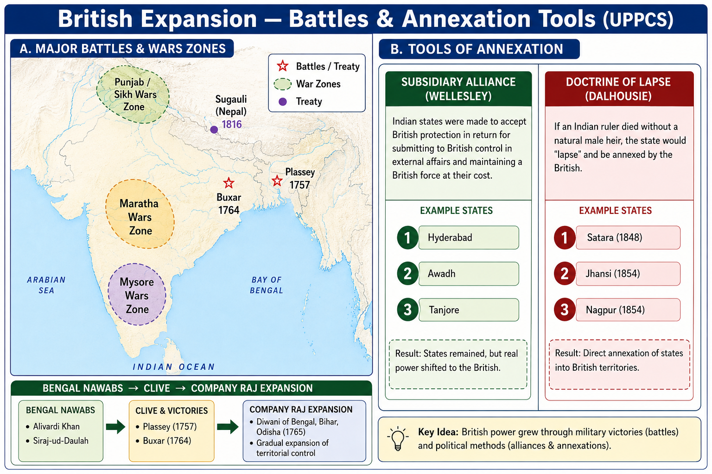

# Topic 2 — East India Company Expansion
### ★ Complete Source of Truth — No other book/notes needed for this topic

> **Covers syllabus:** East India Company and Nawabs of Bengal | Nawabs of Bengal | Battle of Plassey | Battle of Buxar | Bengal Administration | Governors of Bengal | British Expansion Policy | British Colonial States | Colonial India: Annexations, Revolts, Wars and Administrative Reforms | Colonial India: Important Events | Major British Battles | Anglo-Mysore Wars | Mysore State | Anglo-Maratha Wars | Anglo-Sikh Wars | First Anglo-Sikh War | Treaty of Lahore (1846) | Anglo-Nepal War | Treaty of Sugauli (1816) | Sikh Empire | Banaras Rebellion | Akbar Fort, Prayagraj | Robert Clive | Warren Hastings | Subsidiary Alliance | Doctrine of Lapse | Anglo-Burmese Wars | Sindh Annexation | Punjab Annexation  
> **Sources baked in:** NCERT *Themes in Indian History Part III*, Spectrum *A Brief History of Modern India*, Bipan Chandra, UPPCS Prelims PYQs 2018–2025  
> **Exam weight:** ★★★ High — Plassey/Buxar/Diwani, treaty-year matching, Anglo-Mysore/Maratha/Sikh chronology, Subsidiary Alliance, Doctrine of Lapse, Sugauli  
> **Last verified:** July 2026

---

## Quick Revision Box — Raata This First

```
BENGAL PATH (trade → diwani → dual → company raj):
  Murshid Quli Khan (1717 subahdar) → Alivardi Khan → Siraj-ud-Daulah
  Plassey 23 June 1757 (Clive + Mir Jafar) → Mir Jafar Nawab
  Buxar 22 Oct 1764 (Hector Munro) → Shah Alam II + Mir Qasim + Shuja-ud-Daula defeated
  Allahabad Treaty 1765 → Diwani of Bengal, Bihar, Orissa to EIC
  Dual Government 1765–72 (Nawab + Company) → Warren Hastings ends dual system 1772

NAWABS RAPID:
  Murshid Quli Khan (founder, Murshidabad) | Alivardi (1740–56) | Siraj (1756–57) | Mir Jafar (1757) | Mir Qasim (1760–63)

EXPANSION POLICIES:
  Ring Fence → Subsidiary Alliance (Wellesley 1798+) → Doctrine of Lapse (Dalhousie 1848)

SUBSIDIARY ALLIANCE (Wellesley):
  Indian ruler keeps internal autonomy | British troops + subsidiary payment | no foreign alliance without British consent
  First: Nizam of Hyderabad 1798 | Awadh 1801 | Mysore after 1799 | Marathas later

ANGLO-MYSORE (Hyder Ali + Tipu):
  I 1767–69 → Treaty of Madras 1769
  II 1780–84 → Treaty of Mangalore 1784
  III 1790–92 → Treaty of Seringapatam 1792; Tipu lost half territory
  IV 1799 → Tipu killed; subsidiary on Wodeyar Mysore

ANGLO-MARATHA:
  I 1775–82 → Treaty of Salbai 1782 (Warren Hastings era)
  II 1803–05 → Wellesley; Treaty of Bassein 1802 with Peshwa
  III 1817–18 → Peshwa removed; Maratha confederacy broken

ANGLO-SIKH:
  Ranjit Singh Lahore empire (Adalat-i-Ala at Lahore — 2021 Q67)
  I 1845–46 → Treaty of Lahore 1846 + Treaty of Bhairowal
  II 1848–49 → Punjab annexed 1849 (Dalhousie)
  Battles: Mudki, Ferozeshah, Sobraon (I); Chillianwala, Gujrat (II) ← 2022 Q64 Mudki

ANGLO-NEPAL:
  1814–16 → Treaty of Sugauli 1816
  Nepal lost Kumaon, Garhwal, Sikkim areas; retained independence
  UPPCS 2025 Q114 trap: Kathmandu NOT obtained; hills like Shimla/Ranikhet/Nainital region acquired

ANNEXATIONS (Dalhousie):
  Doctrine of Lapse 1848 → Satara, Jhansi, Nagpur, etc.
  2025 Q40: Dalhousie = Doctrine of Lapse | 2024 Q148: did NOT recognise Lakshmibai's adopted son

OTHER:
  Sindh 1843 (Charles Napier) | Burma I 1824–26, II 1852, III 1885
  Banaras Rebellion 1781 (Chait Singh vs Hastings) | Akbar Fort Allahabad = Mughal then British strategic fort

2025 Q26: 2nd Anglo-French → 1st Anglo-Mysore → 1st Anglo-Afghan → 1st Anglo-Sikh = A (2,1,4,3)
2019 Q93 treaties: Allahabad 1765 | Mangalore 1784 | Salbai 1782 | Madras 1769 = C (4,2,1,3)
2020 Q28: Hyder Ali armoury Dindigal 1755 = B
```

### Must-Know Term Comparisons (very frequently asked)

| Term | One-line difference | Hindi |
|------|---------------------|-------|
| **Plassey vs Buxar** | Plassey **1757** = Bengal Nawabi coup; Buxar **1764** = combined Mughal-Nawab force defeated | प्लासी / बक्सर |
| **Mir Jafar vs Mir Qasim** | Jafar = first British puppet Nawab after Plassey; Qasim = reformist Nawab who fought English at Buxar | मीर जाफ़र / मीर कासिम |
| **Diwani vs Nizamat** | Diwani = revenue/civil; Nizamat = police/justice — Company got Diwani 1765 | दीवानी / निज़ामत |
| **Dual Government vs Company Rule** | Dual **1765–72** = Nawab + Company façade; Hastings ended dual, direct rule from 1772 | दोहरी सरकार / कंपनी शासन |
| **Ring Fence vs Subsidiary Alliance** | Ring Fence = buffer states; Subsidiary = protected ally pays for British troops | रिंग फेंस / सहायक संधि |
| **Subsidiary Alliance vs Doctrine of Lapse** | Subsidiary = Wellesley, military protection; Lapse = Dalhousie, annex if no natural heir | सहायक संधि / विलुप्ति का सिद्धांत |
| **Hyder Ali vs Tipu Sultan** | Hyder built Mysore power + Dindigal armoury; Tipu fought four Anglo-Mysore wars, killed 1799 | हैदर अली / टीपू सुल्तान |
| **Treaty of Madras vs Mangalore** | Madras **1769** ends 1st Anglo-Mysore; Mangalore **1784** ends 2nd | मद्रास / मैंगलोर |
| **Salbai vs Bassein** | Salbai **1782** ends 1st Anglo-Maratha; Bassein **1802** Peshwa submits to Wellesley | सालबाई / बसsein |
| **Treaty of Lahore vs Bhairowal** | Lahore **1846** after 1st Anglo-Sikh; Bhairowal added British control over Punjab | लाहौर / भैरोंवाल |
| **Sugauli vs Lahore** | Sugauli **1816** Nepal; Lahore **1846** Sikh Punjab | सुगौली / लाहौर |
| **Clive vs Hastings** | Clive = Plassey/Buxar/Diwani frame; Hastings = ends dual govt, Rohilla war, 1st GG reforms | क्लाइव / हेस्टिंग्स |
| **Wellesley vs Dalhousie** | Wellesley = Subsidiary Alliance; Dalhousie = Lapse + Punjab/Sindh annexation | वेलेज़ली / डलहौज़ी |
| **Chauth vs Subsidiary** | Chauth = Maratha tribute claim; Subsidiary = British protection payment | चौथ / सहायक संधि |

### Memory Tricks

| Trick | Remembers |
|-------|-----------|
| **P-B-A-D** | **P**lassey 1757 → **B**uxar 1764 → **A**llahabad 1765 → **D**ual govt |
| **Mir-Mir-Siraj** | Murshid Quli → Alivardi → **Siraj** fell at Plassey |
| **Jafar then Qasim** | **J**afar after Plassey; **Q**asim before Buxar |
| **4 Mysore wars** | I Madras 69 → II Mangalore 84 → III Seringapatam 92 → IV Tipu dies 99 |
| **Sal-Bas** | **Sal**bai 1st Maratha; **Bas**sein 2nd Maratha/Wellesley |
| **Mudki = Sikh** | 2022 Q64 — Mudki 1845 First Anglo-Sikh |
| **Hyder = Dindigal** | 2020 Q28 armoury 1755 |
| **Ranjit = Lahore** | 2021 Q67 Adalat-i-Ala |
| **Dalhousie = Lapse** | 2025 Q40 match |
| **Sugauli hills not Kathmandu** | 2025 Q114 |
| **2-1-4-3** | 2025 Q26 Anglo war chronology |

---



## 2.1 East India Company and Nawabs of Bengal

### Definitions

| Term | Meaning |
|------|---------|
| **Nawab of Bengal** | Hereditary Muslim governor who became de facto independent ruler of Bengal, Bihar, and Orissa after Mughal decline |
| **Subahdar** | Mughal provincial governor — Murshid Quli Khan held this title before Nawabi became hereditary |
| **Dastak / Farman** | Trade passes allowing duty-free goods — English abused these to evade Nawabi customs |
| **Jagat Seth** | Powerful banking family at Murshidabad whose loans and political support shaped Nawabi succession |
| **Black Hole of Calcutta** | Controversial episode (June 1756) when captured English prisoners were confined in a small room; used by English as propaganda against Siraj |

### Background — Why Bengal Mattered

- Bengal was the **richest Mughal province** — fertile land, textile exports, and a huge revenue base.
- After **Aurangzeb's death (1707)**, the Mughal centre weakened; Bengal Nawabs stopped sending full revenue to Delhi.
- The **English East India Company** had factories at **Calcutta, Hooghly, and Balasore** — trade, not territory, was their original aim.
- Conflict arose when Nawabs tried to **control fortifications and customs** while the Company wanted **duty-free trade and military autonomy**.

### Causes of English–Nawab Conflict (1756–57 prelude)

1. **Fortification dispute:** English strengthened **Fort William, Calcutta** without Nawabi permission — Siraj saw this as preparation for conquest.
2. **Asylum to Krishnadas:** Siraj demanded surrender of a political refugee; English refusal insulted Nawabi authority.
3. **Misuse of dastaks:** Company officials and their Indian agents used Nawabi trade passes to evade duties on private goods.
4. **French rivalry:** Siraj had French support; English feared losing Bengal in the global **Seven Years' War** context.
5. **Jagat Seth opposition:** Bankers feared Siraj's financial demands and later backed **Mir Jafar** against him.

### Course — English vs Siraj (Step by Step)

1. **June 1756:** **Siraj-ud-Daulah** marched on Calcutta; captured **Fort William**; **Black Hole** episode followed.
2. **Early 1757:** **Robert Clive** and **Admiral Watson** sailed from Madras; retook Calcutta; Siraj agreed to **Treaty of Alinagar (Feb 1757)** — concessions to English.
3. **Conspiracy phase:** Clive negotiated with **Mir Jafar**, **Rai Durlabh**, **Jagat Seth**, and **Omichand** (double-crossed) to betray Siraj.
4. **23 June 1757:** **Battle of Plassey** — Siraj defeated (see §2.2).
5. **Post-Plassey:** **Mir Jafar** installed Nawab; paid massive sums to Clive and Company; became first **puppet Nawab**.
6. **1760:** English replaced Jafar with **Mir Qasim** (more capable) when Jafar could not pay subsidies.
7. **1760–63:** Mir Qasim shifted capital to **Munger**, reformed army, abolished internal trade duties — clashed with Company (see §2.3).
8. **After Buxar (1764):** Nawabs retained title but lost real power; **Dual Government** then direct Company rule followed.

### East India Company and Nawabs of Bengal — How It Works

- Bengal Nawabs were **not Company appointees initially** — they were powerful regional rulers who tolerated English trade.
- **Murshid Quli Khan (from 1717)** transferred capital to **Murshidabad**, reformed revenue, and laid the foundation of an independent Nawabi line.
- **Alivardi Khan (1740–56)** fought devastating **Maratha Bargi raids** and kept European traders under control — last strong pre-Plassey Nawab.
- **Siraj-ud-Daulah (1756–57)** was young and assertive; his attack on Calcutta triggered the chain that led to Plassey.
- **Mir Jafar (1757)** was the first Nawab installed by the English through conspiracy — began the **puppet Nawab** era.
- **Mir Qasim (1760–63)** tried to restore Nawabi independence through fiscal and military reform but was crushed at Buxar.
- **Jagat Seth bankers** were kingmakers — their financial leverage decided who sat on the Murshidabad masnad.
- After **Diwani (1765)**, the Nawab's office continued ceremonially until **1793** but held no real power.
- Trap: "Murshid Quli was a puppet of Clive." He died decades before Plassey.
- Trap: "English came to Bengal as conquerors in 1600." They came as **traders**; conquest began after Plassey.

> **Exam note:** Memorise Nawab line **Murshid Quli → Alivardi → Siraj → Mir Jafar → Mir Qasim** before learning battles.

### Nawabs of Bengal — Master Table

| Nawab | Period | Key note |
|-------|--------|----------|
| **Murshid Quli Khan** | from **1717** | Founder; revenue reform; Murshidabad capital |
| **Shuja-ud-Din** | **1727–1739** | Continued Murshid Quli's policies |
| **Alivardi Khan** | **1740–1756** | Fought Maratha Bargi raids; Siraj's grandfather |
| **Siraj-ud-Daulah** | **1756–1757** | Black Hole + defeated at Plassey |
| **Mir Jafar** | **1757–1760**, again **1763–65** | First British puppet Nawab |
| **Mir Qasim** | **1760–1763** | Reformist; fought English; Buxar ally |
| **Najm-ud-Daulah** | **1765–1766** | Pensioned Nawab after Buxar |
| **Saif-ud-Daulah / Mubarak-ud-Daulah** | later | Ceremonial Nawabs under Company |

### Key Persons — Bengal Nawabi Era

| Person | Role |
|--------|------|
| **Murshid Quli Khan** | Founder of independent Bengal Nawabi |
| **Alivardi Khan** | Pre-Plassey strong ruler |
| **Siraj-ud-Daulah** | Last independent Nawab of Bengal |
| **Mir Jafar** | Plassey conspirator; first puppet |
| **Mir Qasim** | Reformist Nawab; Buxar coalition |
| **Jagat Seth (Mahtab Rai, Swaroop Chand)** | Bankers who financed regimes |
| **Robert Clive** | English victor at Plassey |
| **Rai Durlabh** | Siraj's commander who defected |

### Results of English–Nawab Struggle (1756–65)

| Result | Why it matters |
|--------|----------------|
| Plassey **1757** | English political power in Bengal begins |
| Puppet Nawabs from 1757 | Nawabi sovereignty ended in practice |
| Buxar **1764** | Combined Mughal-Bengal-Awadh coalition defeated |
| Diwani **1765** | Company became revenue authority |
| Nawab reduced to pensioner | Ceremonial office till 1793 |

### Exam Facts (raata)

- Murshid Quli Khan = founder Nawab line (**1717**)
- Alivardi = pre-Plassey strong Nawab (**1740–56**)
- Siraj = Black Hole (**1756**) + Plassey (**1757**)
- Mir Jafar = first puppet after Plassey
- Mir Qasim = Munger capital; Buxar ally
- Jagat Seth bankers = Bengal political kingmakers
- Alinagar Treaty **1757** before Plassey
- Nawabi title ended as real power **1765** (Diwani)

### PYQs — East India Company and Nawabs of Bengal

1. **(UPSC pattern)** Who founded the independent Nawabi line in Bengal? → **Murshid Quli Khan**.

2. **(UPSC pattern)** Black Hole of Calcutta associated with → **Siraj-ud-Daulah's capture of Calcutta, 1756**.

3. **(UPSC pattern)** Mir Jafar was installed Nawab after → **Battle of Plassey, 1757**.

### Examples (2.1)

| Example | What it teaches |
|---------|-----------------|
| **Murshidabad** | Nawabi capital; Jagat Seth base |
| **Fort William, Calcutta** | Fortification dispute trigger |
| **Munger** | Mir Qasim's reformist capital |

---

## 2.2 Battle of Plassey

### Definitions

| Term | Meaning |
|------|---------|
| **Battle of Plassey** | Battle fought **23 June 1757** at **Palashi** (Plassey), Nadia district, Bengal |
| **Conspiracy thesis** | English victory through betrayal of Siraj by Mir Jafar, Rai Durlabh, Jagat Seths — not mainly a pitched battle |
| **Treaty of Alinagar (1757)** | February 1757 peace after English recaptured Calcutta — prelude to Plassey conspiracy |
| **Omichand** | Calcutta merchant who demanded a share in conspiracy; Clive used a forged treaty to deceive him |

### Causes

1. **Calcutta attack (1756):** Siraj captured Fort William; Black Hole episode embittered English.
2. **English ambition:** Company wanted a **pliant Nawab** granting trade monopoly and territorial concessions.
3. **Mir Jafar's ambition:** Commander-in-chief wanted the Nawabi throne for himself.
4. **Jagat Seth opposition:** Bankers feared Siraj's financial extortion and backed regime change.
5. **French threat:** Siraj's French alliance alarmed English in Seven Years' War context.
6. **Military imbalance on paper:** Siraj had ~50,000 men; English only ~3,000 — conspiracy was essential for English victory.

### Course of the Battle — Step by Step

1. **February 1757:** English recaptured Calcutta; **Treaty of Alinagar** — Siraj restored privileges to Company.
2. **April–May 1757:** Clive negotiated secret treaty with **Mir Jafar** — promise of Nawabi in return for betrayal.
3. **Omichand episode:** Clive used a **dual treaty** (real and forged) to exclude Omichand from reward — classic exam anecdote.
4. **June 1757:** Clive marched from Chandernagore toward **Murshidabad** via Plassey.
5. **23 June 1757 — morning:** Siraj's army (~50,000) faced Clive's force (~3,000) at **Palashi** on the Bhagirathi.
6. **During battle:** **Mir Jafar** and **Rai Durlabh** held their divisions back; **Monsoon rain** dampened Siraj's gunpowder.
7. **Afternoon:** Siraj's forces collapsed; he fled toward Murshidabad.
8. **After battle:** Siraj captured, executed on **Mir Jafar's orders**; **Mir Jafar** installed Nawab at Murshidabad.
9. **Rewards:** Jafar paid **₹17.7 million** to Company and gifts to Clive; English got **24 parganas** around Calcutta.

### Battle of Plassey — How It Works

- Plassey was won more by **political conspiracy** than by superior military force.
- **Robert Clive** commanded about **3,000 troops** (roughly one-third European, rest sepoys) against a vastly larger army.
- **Mir Jafar** held back his division — the decisive betrayal that made English victory possible.
- **Rai Durlabh** also restrained his troops; **Jagat Seth** financed the conspiracy.
- **Monsoon rain** on 23 June soaked Siraj's artillery gunpowder — supporting factor, not main cause.
- Siraj was only **23–24 years old**; his inexperience and alienation of nobility cost him the throne.
- **Mir Jafar** became the first **puppet Nawab** — English pulled strings from Calcutta.
- Plassey gave the Company **political control through a Nawab**, not **Diwani** (revenue right came in **1765**).
- Plassey is called the **beginning of the British political empire** in India — Buxar and Diwani consolidated it.
- Trap: "Plassey gave Diwani." **Diwani = 1765** after Buxar and Allahabad Treaty.
- Trap: "Clive fought Tipu at Plassey." Tipu belongs to **Anglo-Mysore wars (1767+)**.
- Trap: "Plassey was a long battle." It lasted only a **few hours** on one afternoon.

> **Exam note:** Plassey = **23 June 1757 + Clive + Mir Jafar conspiracy** — separate from Buxar **22 October 1764**.

### Results of the Battle of Plassey

| Result | Why it matters |
|--------|----------------|
| Siraj executed | End of independent Nawabi resistance |
| Mir Jafar installed | First British-controlled Nawab |
| Company got 24 parganas | Direct territorial base around Calcutta |
| Massive payments to Company | Funded future military expansion |
| French threat reduced in Bengal | Seven Years' War advantage to English |
| Political empire begins | Trade Company → territorial power |

### Key Persons — Plassey

| Person | Side | Role |
|--------|------|------|
| **Robert Clive** | English | Commander; architect of conspiracy |
| **Admiral Watson** | English | Naval support from Calcutta |
| **Siraj-ud-Daulah** | Nawab | Defeated and executed |
| **Mir Jafar** | Conspirator | Betrayed Siraj; became Nawab |
| **Rai Durlabh** | Conspirator | Held troops back |
| **Jagat Seth** | Financier | Funded conspiracy |
| **Mohan Lal** | Siraj's loyal officer | Fought bravely; later killed |
| **Omichand** | Merchant | Deceived by forged treaty |

### Exam Facts (raata)

- Date: **23 June 1757**
- Place: **Plassey (Palashi), Nadia, Bengal**
- English commander: **Robert Clive**
- Defeated Nawab: **Siraj-ud-Daulah**
- Installed Nawab: **Mir Jafar**
- English force: ~**3,000** vs Siraj's ~**50,000**
- Conspirators: Mir Jafar, Rai Durlabh, Jagat Seth
- Result: Puppet Nawab; political dominance begins
- Diwani came **1765**, not 1757

### PYQs — Battle of Plassey

1. **(UPSC pattern)** Battle of Plassey was fought in → **1757**.

2. **(Statement pattern)** Mir Jafar's betrayal was central to Plassey → **True**.

3. **(UPSC pattern)** Who was installed Nawab after Plassey? → **Mir Jafar**.

### Examples (2.2)

| Example | What it teaches |
|---------|-----------------|
| **Palashi, Nadia** | Battle location on Bhagirathi |
| **Mir Jafar** | Conspiracy centerpiece |
| **Omichand forged treaty** | Clive's deception tactic |
| **1757 before 1764** | Plassey precedes Buxar |

---

## 2.3 Battle of Buxar

### Definitions

| Term | Meaning |
|------|---------|
| **Battle of Buxar** | Battle **22 October 1764** — English under **Major Hector Munro** defeated a combined Indian coalition |
| **Triple alliance against English** | **Mir Qasim** (Bengal) + **Shuja-ud-Daula** (Awadh) + **Shah Alam II** (Mughal Emperor) |
| **Treaty of Allahabad (1765)** | Settlement after Buxar — granted **Diwani** of Bengal, Bihar, Orissa to the Company |
| **Diwani** | Right to collect land revenue — civil administration of finance |

### Causes

1. **Mir Qasim's reforms:** Abolished all internal trade duties (equal terms for Indian and English merchants) — destroyed Company's duty-free privilege.
2. **Patna massacre (1763):** English officials killed at Patna; open war between Mir Qasim and Company.
3. **Mir Qasim deposed:** English reinstalled **Mir Jafar (1763)** but the reformist Nawab had already fled.
4. **Grand coalition:** Mir Qasim allied with **Shuja-ud-Daula** (Awadh Nawab) and **Shah Alam II** (Mughal Emperor) to restore imperial authority.
5. **English strategic fear:** Company could not allow a united Mughal-Bengal-Awadh front — would threaten all Bengal gains since Plassey.
6. **Mir Qasim's new capital:** Shifted to **Munger** and built a modern army — direct challenge to Company military monopoly.

### Course of the Battle — Step by Step

1. **1763:** Mir Qasim defeated at **Katwah, Murshidabad, Giria**; fled Bengal toward Awadh.
2. **1764:** Coalition army assembled — Mir Qasim's forces + Shuja-ud-Daula's troops + Mughal contingents under Shah Alam II.
3. **22 October 1764:** Battle fought at **Buxar** (Bihar), on the road between Bengal and Awadh.
4. **Hector Munro** commanded ~7,000–8,000 well-trained Company troops against a larger but poorly coordinated coalition army.
5. **Decisive English victory:** Coalition routed; Mir Qasim fled to **Rohilkhand** then died in exile (1777).
6. **Shah Alam II** took refuge in English camp — later negotiated from weakness.
7. **Shuja-ud-Daula** fled; later submitted under harsh terms.
8. **1765:** **Robert Clive** returned to Bengal; negotiated **Treaty of Allahabad** with Shah Alam and Shuja-ud-Daula.
9. **Diwani granted:** Shah Alam's farman gave Company **Diwani** of Bengal, Bihar, Orissa for annual payment of **26 lakhs**.

### Battle of Buxar — How It Works

- Buxar was **not a Bengal-only affair** — it involved the **Mughal Emperor**, **Awadh Nawab**, and **Bengal Nawab** together.
- **Mir Qasim** was the most capable post-Plassey Nawab — his reforms threatened Company's trade monopoly.
- The coalition represented the **last major attempt** to unite Indian powers against the Company in eastern India.
- **Hector Munro** (not Clive) commanded at Buxar — Clive was in England and returned only for the **political settlement**.
- English victory destroyed the coalition's **military credibility** — no Indian power could challenge them in the east for decades.
- **Shah Alam II** became a Company pensioner — granted Diwani rights to the Company in exchange for protection.
- **Shuja-ud-Daula** kept Awadh but paid heavy indemnity and ceded **Allahabad and Kora** to the Emperor (under English control).
- **Mir Jafar** reinstalled briefly, then replaced by pensioned Nawab **Najm-ud-Daulah** — Nawabi sovereignty ended.
- Buxar + Allahabad made the Company a **territorial revenue authority**, not merely a trader with political influence.
- Trap: "Buxar was only a Bengal affair." It involved **Mughal Emperor + Awadh + Bengal**.
- Trap: "Clive commanded at Buxar." **Hector Munro** commanded; Clive handled aftermath diplomacy.
- Trap: "Buxar gave Diwani directly." Battle **1764**; Diwani farman came **1765** via Allahabad Treaty.

> **Exam note:** Buxar **1764** → Allahabad **1765** → **Diwani** — chain question favourite. **UPPCS 2019 Q93** tests Allahabad = **1765**.

### Results of the Battle of Buxar

| Result | Why it matters |
|--------|----------------|
| Coalition destroyed | No united Indian front in the east |
| Diwani to Company **1765** | Revenue authority over Bengal, Bihar, Orissa |
| Shah Alam II pensioner | Mughal emperor under Company protection |
| Shuja-ud-Daula subordinated | Awadh became buffer under British influence |
| Nawab reduced to puppet | Real power passed to Company |
| Clive's second Bengal term | Dual Government established |

### Treaty of Allahabad (1765) — Key Terms

| Party | Terms |
|-------|-------|
| **Shah Alam II** | Granted **Diwani** of Bengal, Bihar, Orissa to Company; received **26 lakhs/year**; resided under Company protection |
| **Company** | Got legal right to collect revenue of richest Mughal provinces |
| **Shuja-ud-Daula** | Retained Awadh after paying indemnity; **Allahabad and Kora** given to Emperor |
| **Bengal Nawab** | **Najm-ud-Daulah** — pensioned figurehead |

### Key Persons — Buxar

| Person | Side | Role |
|--------|------|------|
| **Hector Munro** | English | Victor at Buxar |
| **Mir Qasim** | Bengal | Reformist Nawab; coalition leader |
| **Shuja-ud-Daula** | Awadh | Coalition ally |
| **Shah Alam II** | Mughal | Emperor in coalition; later granted Diwani |
| **Robert Clive** | English | Negotiated Allahabad Treaty 1765 |
| **Mir Jafar** | Bengal | Briefly reinstalled; died 1765 |

### Exam Facts (raata)

- Date: **22 October 1764**
- Place: **Buxar, Bihar**
- Commander: **Hector Munro** (not Clive)
- Allies defeated: Mir Qasim, Shuja-ud-Daula, Shah Alam II
- Follow-up: **Treaty of Allahabad 1765**
- Diwani of Bengal, Bihar, Orissa to Company
- Mir Qasim fled; died in exile **1777**
- Shah Alam granted Diwani farman

### PYQs — Battle of Buxar

1. **(UPPCS Prelims 2019, Q93)** Treaty of Allahabad **1765** in treaty-year match list.

2. **(UPSC pattern)** Battle of Buxar fought in → **1764**.

3. **(UPSC pattern)** Who commanded English forces at Buxar? → **Hector Munro**.

### Examples (2.3)

| Example | What it teaches |
|---------|-----------------|
| **Buxar, Bihar** | Geographic anchor |
| **Munger** | Mir Qasim's reformist capital |
| **Shah Alam II** | Mughal link to Diwani |
| **Mir Qasim** | Reformist Nawab turned rebel |

---

## 2.4 Bengal Administration — Diwani, Dual Government and Governors

### Definitions

| Term | Meaning |
|------|---------|
| **Diwani** | Right to collect revenue of Bengal, Bihar, and Orissa — granted to EIC **1765** |
| **Nizamat** | Power of criminal justice, police, and civil order — nominally with Nawab |
| **Dual Government (1765–1772)** | Nawab retained **nizamat** façade; Company controlled revenue (**diwani**) and army |
| **District Collector** | Company official collecting revenue directly — expanded under Hastings |
| **Bengal Famine of 1770** | Catastrophic famine (~10 million deaths) exposing failures of dual administration |

### How Dual Government Worked — Step by Step

1. **1765:** **Treaty of Allahabad** — Company received **Diwani** farman from Shah Alam II.
2. **Clive's arrangement:** Company took **revenue** (diwani) but left **nizamat** (justice/police) in Nawab's name.
3. **Why dual?** Company wanted **profit without administrative responsibility** — if famine or revolt came, Nawab was blamed.
4. **Revenue collection:** Company agents and **Indian amils** extracted revenue ruthlessly; no investment in agriculture or relief.
5. **Nawab's role:** **Najm-ud-Daulah** then **Saif-ud-Daulah** — ceremonial heads; no real power over treasury or army.
6. **Corruption:** **Double government** meant double extraction — Company and Nawabi officials both squeezed zamindars.
7. **1770 famine:** Bengal, Bihar, Orissa devastated; Company continued revenue demands — exposed moral bankruptcy of dual system.
8. **1772:** **Warren Hastings** abolished dual government — Company took direct charge of revenue **and** civil administration.
9. **1793:** **Permanent Settlement** with zamindars (Cornwallis) — later phase; ends Nawabi institution formally.

### Bengal Administration — How It Works

- **Treaty of Allahabad (1765)** made the Company the **Diwan** — legal revenue collector of three provinces.
- **Robert Clive** designed the **Dual System** — Company held real power but used the Nawab's name for justice and police.
- The Nawab had **no army, no treasury, no foreign relations** — a pure figurehead maintained for legitimacy.
- **Diwani** = revenue/civil finance; **Nizamat** = criminal administration — splitting them created the dual façade.
- Revenue was collected through existing Indian officials but profits went to Company shareholders in London.
- The **Bengal Famine of 1770** killed an estimated **one-third of Bengal's population** — worst indictment of dual rule.
- **Warren Hastings** ended dual government in **1772** as Governor of Bengal — direct Company rule began.
- **Regulating Act 1773** made Hastings first **Governor-General** — Bengal crisis drove parliamentary reform.
- **District collectors** system expanded — direct British administrative penetration of countryside.
- Trap: "Diwani granted at Plassey." **1765**, not 1757.
- Trap: "Dual government continued till 1857." Ended **1772** under Hastings.
- Trap: "Nawab collected revenue after 1765." **Company** collected revenue; Nawab kept nizamat façade only.

> **Exam note:** **Clive = dual system creator (1765–72); Hastings = dual system ender (1772).**

### Governors of Bengal (expansion phase)

| Governor | Period | Expansion note |
|----------|--------|----------------|
| **Robert Clive** | 1758–60, 1765–67 | Plassey; Diwani; dual system architect |
| **Harry Verelst** | 1767–69 | Dual system continuation |
| **John Cartier** | 1769–72 | Dual system; famine era |
| **Warren Hastings** | 1772–85 | Ends dual; Rohilla war; 1st Anglo-Maratha; Banaras rebellion |
| **Lord Cornwallis** | 1786–93 | Permanent Settlement 1793; administrative reform |

### Results of Dual Government

| Result | Why it matters |
|--------|----------------|
| Company enriched | Revenue flowed to shareholders |
| Nawab disempowered | Sovereignty became fiction |
| 1770 famine | Dual system moral failure exposed |
| Hastings reforms 1772 | Direct rule replaced façade |
| District collectors | British admin penetrated villages |
| Prelude to Company Raj | Bengal model for all India later |

### Exam Facts (raata)

- Diwani year: **1765** (Allahabad Treaty)
- Dual government: **1765–1772**
- Dual architect: **Robert Clive**
- Hastings ended dual: **1772**
- Bengal Famine: **1770** under dual system
- Diwani = revenue; Nizamat = justice/police
- Allahabad Treaty: **1765**
- Permanent Settlement: **1793** (Cornwallis — later phase)

### PYQs — Bengal Administration

1. **(UPPCS Prelims 2019, Q93)** Treaty of Allahabad = **1765**.

2. **(UPSC pattern)** Dual government in Bengal ended by → **Warren Hastings (1772)**.

3. **(UPSC pattern)** Diwani of Bengal granted to Company in → **1765**.

### Examples (2.4)

| Example | What it teaches |
|---------|-----------------|
| **Diwani farman 1765** | Legal revenue right |
| **1770 famine** | Dual system catastrophic failure |
| **1772 Hastings reform** | Direct Company rule begins |
| **Murshidabad Nawab** | Ceremonial role under dual system |

---

## 2.5 Robert Clive

### Definitions

| Term | Meaning |
|------|---------|
| **Robert Clive (1725–1774)** | English soldier-administrator who transformed EIC from trader to territorial power |
| **Plassey conspiracy** | Clive's secret deal with Mir Jafar that won Bengal without a pitched battle |
| **Dual Government** | Clive's 1765 administrative arrangement — Company took diwani, Nawab kept nizamat façade |

### Clive's Career — Step by Step

1. **1743:** Joined EIC as a **writer (clerk)** at Madras; showed early ambition.
2. **1746–48:** French captured Madras; Clive escaped to **Fort St. David**; entered military service.
3. **1751:** **Siege and defence of Arcot** — established military reputation in **Second Carnatic War**.
4. **1756:** Bengal crisis — Siraj captured Calcutta; Clive sailed from Madras.
5. **1757:** Recaptured Calcutta; **Battle of Plassey** — installed Mir Jafar; became master of Bengal.
6. **1758–60:** First term as **Governor of Bengal**; consolidated Company control.
7. **1760–65:** Returned to England enormously wealthy; faced **Parliamentary inquiry** (1762–63) but defended his actions.
8. **1765–67:** Second Bengal term — secured **Diwani** via Allahabad Treaty; created **Dual Government**.
9. **1774:** Died by **suicide** amid illness, opium addiction, and political controversy.

### Robert Clive — How It Works

- Clive rose from **clerk to conqueror** — the most dramatic career in British Indian history.
- **Arcot (1751)** proved his military genius before Bengal — linked to Second Carnatic War (Topic 1).
- **Plassey (1757)** was his masterpiece of **political warfare** — conspiracy, not conventional battle.
- He personally enriched himself — took **₹2.5 million** from Mir Jafar plus a **jagir** worth £30,000/year.
- First Bengal governorship (**1758–60**) established the **puppet Nawab system** and Company army dominance.
- Parliamentary inquiry (**1762–63**) investigated his wealth but **acquitted** him — "rich by his own efforts."
- Second term (**1765–67**) secured **Diwani** — legal revenue right over Bengal, Bihar, Orissa.
- He designed **Dual Government** — Company profits without administrative burden; later discredited by 1770 famine.
- Critics blame him for laying foundations of **exploitative Company rule** and personal corruption.
- Trap: "Clive was first Governor-General." **Warren Hastings** was first GG under Regulating Act **1773**.
- Trap: "Clive fought at Buxar." **Hector Munro** commanded; Clive handled political aftermath.
- Trap: "Clive introduced Subsidiary Alliance." That was **Wellesley** decades later (**1798**).

> **Exam note:** Clive = **Plassey (1757) + Diwani diplomacy (1765) + Dual Government** — not Subsidiary Alliance or Doctrine of Lapse.

### Clive vs Hastings — Comparison

| Aspect | Robert Clive | Warren Hastings |
|--------|-------------|-----------------|
| **Era** | 1757–1767 | 1772–1785 |
| **Key act** | Plassey, Diwani, Dual Govt | Ended dual; reforms; wars |
| **Title** | Governor of Bengal | First Governor-General |
| **Expansion** | Bengal foundation | Rohilla, Maratha, Banaras |
| **Legacy** | Political empire begins | Administrative consolidation |

### Exam Facts (raata)

- Plassey **1757** commander
- Arcot **1751** fame (Second Carnatic War)
- Diwani arrangement **1765**
- Dual government architect
- Two Bengal terms: 1758–60, 1765–67
- Parliamentary inquiry 1762–63 — acquitted
- Died **1774** — suicide
- Not Governor-General (Hastings was first)

### PYQs — Robert Clive

1. **(UPSC pattern)** Who established dual government in Bengal? → **Robert Clive**.

2. **(Cross-topic)** Arcot 1751 associated with → **Robert Clive**.

3. **(UPSC pattern)** Battle of Plassey commanded by → **Robert Clive, 1757**.

### Examples (2.5)

| Example | What it teaches |
|---------|-----------------|
| **Plassey 1757** | Clive's landmark victory |
| **Arcot 1751** | Pre-Bengal military fame |
| **1765 Diwani** | Political consolidation |
| **1774 death** | Controversial legacy |

---

## 2.6 Warren Hastings (Expansion Context)

### Definitions

| Term | Meaning |
|------|---------|
| **Warren Hastings (1732–1818)** | First **Governor-General of Bengal (1773–85)**; architect of early Company state |
| **Regulating Act 1773** | British parliamentary act that created the post of Governor-General |
| **Rohilla War (1774)** | Company-backed invasion of Rohilkhand — Awadh Nawab + Company vs Rohilla Afghans |
| **Banaras Rebellion (1781)** | **Chait Singh** of Benares rebelled against Hastings' revenue demands |

### Hastings' Expansion Actions — Step by Step

1. **1772:** As Governor of Bengal, **abolished Dual Government** — Company took direct revenue and civil administration.
2. **1773:** **Regulating Act** made him first **Governor-General** with a Council of four (including **Francis**, **Clavering**, **Monson**).
3. **1774 — Rohilla War:** Supported **Awadh Nawab Shuja-ud-Daula** in invading **Rohilkhand**; Rohilla state destroyed; Hastings criticised for aggression.
4. **1775–82 — First Anglo-Maratha War:** Fought Marathas over Raghunath Rao succession; ended with **Treaty of Salbai 1782** — status quo.
5. **1778–79:** British humiliated at **Wadgaon**; Hastings sent fresh troops; recovered position.
6. **1781 — Banaras Rebellion:** **Chait Singh** of Benares refused punitive tribute; Hastings marched, defeated him; Benares under direct Company control.
7. **1782:** **Treaty of Salbai** — peace with Marathas; Hastings gained **Salsette** for Bombay.
8. **1784:** **Pitt's India Act** — strengthened Crown control over Company; Board of Control created.
9. **1785:** Hastings resigned; faced **impeachment trial** in England (1788–95) led by **Edmund Burke** — acquitted 1795.

### Warren Hastings — How It Works

- Hastings was the first **Governor-General** — not merely Governor of Bengal (Regulating Act **1773**).
- He **ended Dual Government (1772)** — the most important administrative reform of his tenure.
- **Rohilla War (1774)** expanded Company influence into north India — Awadh annexed Rohilkhand with Company military help.
- **First Anglo-Maratha War (1775–82)** was fought to limited gains; **Salbai 1782** restored balance — **UPPCS 2019 Q93**.
- **Banaras Rebellion (1781)** showed early Indian resistance to Company revenue demands outside Bengal.
- **Chait Singh** was deposed; Benares came under **direct Company administration** — important UP angle.
- **Akbar Fort, Prayagraj (Allahabad):** Strategic fort at Ganga-Yamuna confluence; under Company control from Allahabad Treaty era.
- Hastings acquired **Allahabad and Kora** strategically — controlling the Doab gateway.
- His **impeachment** (1788–95) questioned expansion methods — Burke charged corruption and aggression; acquitted after long trial.
- Trap: "Hastings introduced Subsidiary Alliance." That was **Wellesley** decades later (**1798**).
- Trap: "Hastings annexed Punjab." Punjab annexed **1849** under **Dalhousie**.
- Trap: "Salbai ended Third Maratha War." **Salbai = First War (1782)** under Hastings.

> **Exam note:** Hastings expansion markers = **Rohilla War (1774) + 1st Anglo-Maratha (Salbai 1782) + Chait Singh/Banaras (1781)**.

### Results of Hastings' Expansion Policies

| Action | Result |
|--------|--------|
| Ended dual government **1772** | Direct Company rule in Bengal |
| Rohilla War **1774** | Rohilkhand annexed to Awadh; Company influence grows |
| Salbai **1782** | Maratha peace; Salsette to British |
| Banaras rebellion suppressed **1781** | Benares under Company control |
| Impeachment **1788–95** | Acquitted; expansion methods debated |

### Exam Facts (raata)

- First Governor-General: **1773–85**
- Ended dual government: **1772**
- Rohilla War: **1774**
- Treaty of Salbai: **1782**
- Banaras Rebellion (Chait Singh): **1781**
- Akbar Fort: **Prayagraj/Allahabad**
- Impeachment by Burke: **1788–95**; acquitted
- Not Subsidiary Alliance (Wellesley)

### PYQs — Warren Hastings

1. **(UPPCS Prelims 2019, Q93)** Treaty of Salbai **1782** — Hastings-era Maratha settlement.

2. **(UPSC pattern)** Dual government ended by → **Warren Hastings (1772)**.

3. **(UPSC pattern)** Chait Singh rebellion during → **Warren Hastings (1781)**.

### Examples (2.6)

| Example | What it teaches |
|---------|-----------------|
| **Salbai 1782** | First Anglo-Maratha peace |
| **Chait Singh 1781** | Banaras rebellion |
| **Akbar Fort, Prayagraj** | Strategic Doab control |
| **Rohilla War 1774** | North India expansion |

---

## 2.7 British Expansion Policy

### Definitions

| Term | Meaning |
|------|---------|
| **Ring Fence Policy** | Warren Hastings' strategy of using **buffer states** (e.g. Awadh) around Bengal to protect Company territory |
| **Subsidiary Alliance** | Wellesley's system — Indian ruler keeps internal rule but accepts British troops and loses foreign policy |
| **Doctrine of Lapse** | Dalhousie's policy — annex state if ruler dies without natural heir; adopted son not recognised |
| **Paramountcy** | British claim to be supreme power; Indian rulers were subordinate |

### Six Phases of British Expansion — Step by Step

1. **Phase 1 — Commercial (till ~1750):** Factories at Surat, Madras, Calcutta, Bombay under Mughal/Nawabi permission; trade only.
2. **Phase 2 — Bengal Political Control (1757–65):** Plassey → puppet Nawab → Buxar → Diwani; Company becomes territorial power.
3. **Phase 3 — Ring Fence (1760s–80s):** Hastings uses Awadh, Hyderabad as buffers; fights Mysore and Marathas to protect Bengal flanks.
4. **Phase 4 — Subsidiary Alliance (1798–1805):** Wellesley brings major states under military protection — Hyderabad, Awadh, Mysore, Maratha Peshwa.
5. **Phase 5 — Paramountcy + Lapse (1848–56):** Dalhousie annexes directly — Satara, Jhansi, Nagpur via Lapse; Punjab, Sindh via war.
6. **Phase 6 — Final Annexations (1856):** Awadh on misgovernance plea; by 1857 Company controls most of India directly or indirectly.

### British Expansion Policy — How It Works

- Expansion was **not one policy** but a sequence matching British military and financial capacity at each stage.
- **Commercial phase** ended when Bengal Diwani (1765) gave revenue to fund armies — trade Company became territorial power.
- **Ring Fence** meant: don't annex Awadh yet, but control its Nawab as a buffer against Marathas and Afghan routes.
- **Subsidiary Alliance** meant: don't annex Hyderabad yet, but station British troops and control its foreign policy.
- **Doctrine of Lapse** meant: no buffer needed anymore — annex small states when rulers die without natural heirs.
- Every phase used **Indian sepoys** — over 80% of Company armies were Indian; Indian allies bore most fighting.
- **Warren Hastings** = Ring Fence + First Maratha/Mysore containment.
- **Lord Wellesley** = Subsidiary Alliance + Second Maratha War + Fourth Mysore (Tipu killed).
- **Lord Dalhousie** = Lapse + Punjab + Sindh + Awadh — most aggressive annexation Governor-General.
- **UPPCS 2025 Q40** matches Dalhousie with Doctrine of Lapse — never confuse with Wellesley.
- Trap: "Ring Fence and Subsidiary are same." Ring Fence = informal buffer; Subsidiary = formal treaty + troops.
- Trap: "Doctrine of Lapse by Wellesley." **Dalhousie 1848** — Wellesley did Subsidiary Alliance.

> **Exam note:** Match **Wellesley ↔ Subsidiary** and **Dalhousie ↔ Lapse** — **UPPCS 2025 Q40**.

### Policy Comparison Table

| Policy | Period | Architect | Mechanism | Example |
|--------|--------|-----------|-----------|---------|
| **Ring Fence** | 1760s–80s | Hastings | Buffer states around Bengal | Awadh as buffer |
| **Subsidiary Alliance** | from **1798** | Wellesley | Protected ally + British troops + subsidy | Hyderabad 1798 |
| **Doctrine of Lapse** | **1848** | Dalhousie | Annex on succession dispute | Jhansi 1853 |
| **Misgovernance annexation** | **1856** | Dalhousie | Annex on plea of maladministration | Awadh 1856 |

### Governor-General → Policy Match

| Governor-General | Era | Expansion Policy |
|------------------|-----|------------------|
| **Warren Hastings** | 1773–85 | Ring Fence; 1st Maratha |
| **Lord Cornwallis** | 1786–93 | Mysore III; administrative |
| **Lord Wellesley** | 1798–1805 | Subsidiary Alliance |
| **Lord Hastings** | 1813–23 | Maratha III; Nepal; Pindari |
| **Lord Dalhousie** | 1848–56 | Lapse; Punjab; Sindh; Awadh |

### Exam Facts (raata)

- Ring Fence = Hastings era
- Subsidiary Alliance = Wellesley from **1798**
- Doctrine of Lapse = Dalhousie **1848**
- Punjab annexed **1849**; Sindh **1843**
- Awadh annexed **1856** (misgovernance, not lapse)
- 2025 Q40: Dalhousie = Lapse

### PYQs — British Expansion Policy

1. **(UPPCS Prelims 2025, Q40)** Dalhousie = Doctrine of Lapse → **D (4,3,2,1)**.

2. **(UPPCS Prelims 2024, Q137)** Recall of Wellesley in expansion chronology context.

3. **(UPSC pattern)** Subsidiary Alliance introduced by → **Lord Wellesley**.

### Examples (2.7)

| Example | What it teaches |
|---------|-----------------|
| **Hyderabad 1798** | First Subsidiary Alliance |
| **Jhansi 1853** | Lapse annexation |
| **Awadh 1856** | Misgovernance annexation |

---

## 2.8 Subsidiary Alliance

### Definitions

| Term | Meaning |
|------|---------|
| **Subsidiary Alliance** | Treaty system by which an Indian ruler accepted British protection and permanent subsidiary force |
| **Subsidy** | Payment by Indian ruler for maintenance of British troops stationed in his territory |
| **British Resident** | Company political agent stationed at Indian court to supervise ruler |
| **Non-intervention clause** | Ruler could not employ Europeans, make war, or conduct foreign relations without British consent |

### Eight Conditions of Subsidiary Alliance (Wellesley)

1. British **permanent army** stationed in ruler's territory.
2. Ruler pays **subsidy** for troop maintenance (or cedes territory instead).
3. Ruler **cannot employ** any other European or foreign nationals.
4. Ruler **cannot negotiate** war, peace, or alliances without British consent.
5. **British Resident** posted at court — supervised internal and external policy.
6. British promised **protection** against external enemies and internal revolt.
7. Ruler retained **internal autonomy** — administration, justice, revenue collection.
8. In practice, ruler became a **puppet** — financial drain led to later annexation.

### Subsidiary Alliance — States Brought Under (Step by Step)

1. **1798 — Hyderabad (Nizam):** **First Subsidiary Alliance**; Nizam turned against Tipu; French expelled from Hyderabad.
2. **1799 — Mysore:** After Tipu's death; **Krishna Raja Wodeyar III** restored under subsidiary.
3. **1801 — Awadh:** Large territory ceded to Company for subsidiary payment; Nawab weakened further.
4. **1802 — Peshwa (Bassein Treaty):** Baji Rao II accepted subsidiary — triggered Second Anglo-Maratha War.
5. **1803–05 — Maratha sardars:** Sindhia, Bhonsle subdued; subsidiary terms imposed after Second War.
6. **1818 — Remaining Maratha states:** After Third War; Holkar, Bhonsle, Gaekwad under subsidiary.
7. **Later — Rajput states, etc.:** Most princely states eventually under subsidiary or similar treaties.

### Subsidiary Alliance — How It Works

- System perfected by **Lord Wellesley (GG 1798–1805)** — most aggressive expansionist Governor-General before Dalhousie.
- **Hyderabad 1798** was the **first** Subsidiary Alliance — ended Nizam's French alignment and isolated Tipu Sultan.
- Subsidiary was cheaper than direct conquest — Indian ruler paid for British troops; Company gained control without admin cost.
- **Awadh 1801** ceded **Rohilkhand and Doab territories** to Company — Awadh Nawab reduced to dependency.
- **Treaty of Bassein (1802)** made Peshwa a subsidiary ally — other Maratha sardars rebelled → Second Anglo-Maratha War.
- **British Resident** at court meant every decision needed Company approval — sovereignty became fiction.
- Financial burden of **subsidy payments** ruined state treasuries — Awadh annexed **1856** on "misgovernance" plea.
- Wellesley recalled **1805** — Court of Directors felt wars too expensive — **UPPCS 2024 Q137** chronology.
- Trap: "Subsidiary Alliance by Dalhousie." **Wellesley 1798**.
- Trap: "Hyderabad was first lapse annexation." Hyderabad was **first subsidiary**, never lapsed.
- Trap: "Subsidiary = direct annexation." Ruler kept **internal autonomy** — but lost defence and foreign policy.

> **Exam note:** **2024 Q137** — Recall of Wellesley **1805** after over-expansion via subsidiary wars.

### Subsidiary Alliance States — Master Table

| State | Year | Key terms |
|-------|------|-----------|
| **Hyderabad** | **1798** | First alliance; anti-Tipu |
| **Mysore** | **1799** | Wodeyar restored |
| **Awadh** | **1801** | Territory ceded for subsidy |
| **Peshwa (Poona)** | **1802** | Bassein Treaty |
| **Sindhia** | **1803–05** | After Second Maratha War |
| **Bhonsle (Nagpur)** | **1803–05** | After Second Maratha War |

### Results of Subsidiary Alliance

| Result | Why it matters |
|--------|----------------|
| British control without conquest | Cheaper expansion |
| Indian rulers financially ruined | Prelude to annexation |
| French influence eliminated | From Hyderabad, Mysore |
| Maratha confederacy broken | Via Bassein 1802 |
| Wellesley recalled 1805 | Over-expansion backlash |
| Model for later paramountcy | All princely states subordinated |

### Exam Facts (raata)

- Architect: **Lord Wellesley**
- First alliance: **Hyderabad 1798**
- Awadh subsidiary: **1801**
- Bassein (Peshwa): **1802**
- Key terms: subsidy, resident, no foreign alliance
- Wellesley recalled: **1805**
- Not Dalhousie; not Hastings

### PYQs — Subsidiary Alliance

1. **(UPPCS Prelims 2024, Q137)** Recall of Wellesley chronology with Anglo-Nepalese War.

2. **(UPSC pattern)** Subsidiary Alliance introduced by → **Lord Wellesley**.

3. **(UPSC pattern)** First Subsidiary Alliance with → **Nizam of Hyderabad, 1798**.

### Examples (2.8)

| Example | What it teaches |
|---------|-----------------|
| **Hyderabad 1798** | First Subsidiary Alliance |
| **Treaty of Bassein 1802** | Peshwa under subsidiary |
| **Wellesley recall 1805** | Expansion backlash |

---

## 2.9 Anglo-Mysore Wars and Mysore State

### Definitions

| Term | Meaning |
|------|---------|
| **Mysore Kingdom** | South Indian state under Hyder Ali and Tipu Sultan that challenged British-Madras power |
| **Seringapatam** | Capital of Mysore near Srirangapatna; site of sieges in Third and Fourth Wars |
| **Dindigal armoury** | Military workshop set up by **Hyder Ali at Dindigal in 1755** — **UPPCS 2020 Q28** |
| **Rocket warfare** | Tipu Sultan's innovative use of iron-cased rockets against British forces |

### Mysore State — Background

- **Hyder Ali** rose from ordinary Mysorean service; seized power **1761**; built a disciplined army.
- He established **Dindigal armoury (1755)** for muskets and artillery — **UPPCS 2020 Q28 answer B**.
- **Tipu Sultan** succeeded after Hyder's death (**1782**); called himself "Tiger of Mysore."
- Tipu modernised army, introduced rockets, sought **French alliance**, and promoted sericulture and trade.
- Mysore controlled **Malabar, Coorg, and rich trade routes** — direct threat to Madras Presidency.
- Four **Anglo-Mysore Wars (1767–99)** progressively destroyed Mysore as an independent power.

---

### 2.9.1 First Anglo-Mysore War (1767–1769)

#### Causes

1. **Hyder Ali's expansion:** Captured Mysore, threatened **Maratha** and **Nizam** territories; Madras feared encirclement.
2. **English-Maratha-Nizam alliance:** Three powers united against Hyder — first grand anti-Mysore coalition.
3. **Hyder's Malabar raids:** Threatened English trade routes on Malabar coast.
4. **Madras Presidency alarm:** Hyder's army appeared near Madras itself — existential threat to English in south.

#### Course — Step by Step

1. **1767:** Alliance of English, Marathas, and Nizam declared war on Hyder.
2. **1767–68:** Hyder initially defensive; then launched brilliant **counter-offensive** toward Madras.
3. **1768–69:** Hyder raided **Carnatic** up to **Pondicherry** gates; English unable to stop his cavalry.
4. **1769:** English sued for peace — Hyder had fought the triple alliance to a standstill.
5. **April 1769:** **Treaty of Madras** — mutual restoration of conquered territories; exchange of prisoners.

#### First War — How It Works

- Hyder proved he could fight the **triple alliance** alone and win strategically.
- **Treaty of Madras (1769)** restored status quo — rare Indian victory over Company in diplomacy.
- English had to accept Hyder as a **legitimate equal power** in the Deccan.
- **UPPCS 2025 Q26** places First Anglo-Mysore after Second Anglo-French War.
- Trap: "Madras Treaty ended Second War." **Madras 1769 = First**; Mangalore 1784 = Second.

---

### 2.9.2 Second Anglo-Mysore War (1780–1784)

#### Causes

1. **Hyder's grievance:** English captured **Mahe** (French port under Hyder's protection) — breach of Madras Treaty.
2. **Hyder rebuilt power:** Allied with **French** and **Marathas** after First War.
3. **English intervention in Malabar:** Supported Hyder's enemies on the west coast.
4. **War of American Independence:** French globally allied against Britain — Hyder seized opportunity.

#### Course — Step by Step

1. **1780:** Hyder invaded **Carnatic** with ~90,000 men; allied with French at **Porto Novo** coast.
2. **1780:** **Battle of Pollilur** — Hyder and Tipu destroyed an English column; major British defeat.
3. **1781:** **Battle of Porto Novo (Parangipettai)** — **Eyre Coote** defeated Hyder — **UPPCS 2022 Q64** chronology.
4. **1781:** **Battle of Sholinghur** — Coote defeated Hyder again near Vellore.
5. **December 1782:** **Hyder Ali died** at Chittoor; **Tipu Sultan** continued the war.
6. **1783:** Tipu besieged **Bednur** and raided Carnatic; stalemate continued.
7. **1784:** **Treaty of Mangalore** — mutual restoration of territories; prisoners exchanged.

#### Second War — How It Works

- Hyder's **Pollilur victory (1780)** was one of the worst British defeats in India.
- **Porto Novo (1781)** restored British prestige — Coote's tactical masterpiece.
- **Hyder died 1782**; Tipu inherited the war and proved equally formidable.
- **Treaty of Mangalore (1784)** ended war — **UPPCS 2019 Q93** treaty-year match.
- Trap: "Mangalore ended First War." **Mangalore 1784 = Second**; Madras 1769 = First.

---

### 2.9.3 Third Anglo-Mysore War (1790–1792)

#### Causes

1. **Tipu's aggression:** Attacked **Travancore** (1790) — English ally; breached Travancore lines.
2. **Tipu's French alliance:** Alarmed British after French Revolution — fear of French base in south.
3. **English coalition:** British + **Marathas** + **Nizam** allied against Tipu (1790).
4. **Lord Cornwallis** personally led the campaign — showing war's importance.

#### Course — Step by Step

1. **1790:** Three allies declared war on Tipu; attacked from multiple directions.
2. **1791:** Cornwallis marched on **Bangalore**; captured it; advanced toward Seringapatam.
3. **1791–92:** First siege of **Seringapatam** — Tipu negotiated before city fell completely.
4. **March 1792:** **Treaty of Seringapatam** — Tipu lost half his kingdom; paid **3 crore indemnity**.
5. **Hostages:** Tipu's two sons taken as hostages to Madras until indemnity paid.

#### Third War — How It Works

- Tipu lost **half of Mysore territory** — Malabar, Dindigal, Baramahal ceded to allies.
- **Cornwallis** personally commanded — rare for a Governor-General to lead in field.
- Tipu's sons as **hostages** — humiliation that fuelled Fourth War desire for revenge.
- Allies divided spoils: English got Malabar; Marathas and Nizam got other territories.

---

### 2.9.4 Fourth Anglo-Mysore War (1799)

#### Causes

1. **Tipu's continued French contacts:** Wellesley feared Tipu would become a French client like pre-1798 Hyderabad.
2. **Tipu's refusal of subsidiary:** Rejected Wellesley's demand for Subsidiary Alliance.
3. **Letters to Afghanistan/Zaman Shah:** British intercepted correspondence — seen as anti-British conspiracy.
4. **Wellesley's grand alliance:** English + Marathas + Nizam again united for final destruction of Mysore.

#### Course — Step by Step

1. **1799:** Wellesley declared war; **Arthur Wellesley** and **Harris** commanded separate columns.
2. **March 1799:** Allied armies converged on **Seringapatam**.
3. **4 May 1799:** Breach in walls; British stormed the fort.
4. **4 May 1799:** **Tipu Sultan killed** fighting at the gateway — body found among the dead.
5. **Post-war:** Young **Krishna Raja Wodeyar III** restored as Maharaja under **Subsidiary Alliance**.
6. **Mysore:** Half retained as princely state; other half annexed as Company territory.

#### Fourth War — How It Works

- **Tipu killed 4 May 1799** — defending Seringapatam personally; no surrender.
- **Wellesley** destroyed the last major independent challenger in the south.
- **Wodeyar dynasty** restored under Subsidiary Alliance — Mysore became a princely state.
- **UPPCS 2025 Q26** — Fourth Mysore (1799) long before Anglo-Sikh (1845).
- Trap: "Tipu survived Fourth War." Killed **4 May 1799**.
- Trap: "Mysore fully annexed 1799." Half annexed; Wodeyar retained half under subsidiary.

### Anglo-Mysore Wars — Master Overview Table

| War | Years | Governor-General | Key battle / treaty | Result |
|-----|-------|------------------|---------------------|--------|
| **First** | **1767–69** | — | **Madras Treaty 1769** | Status quo; Hyder equal |
| **Second** | **1780–84** | — | **Porto Novo 1781**; **Mangalore 1784** | Stalemate |
| **Third** | **1790–92** | **Cornwallis** | **Seringapatam Treaty 1792** | Tipu lost half kingdom |
| **Fourth** | **1799** | **Wellesley** | Tipu killed **4 May 1799** | Subsidiary on Wodeyar Mysore |

### Key Persons — Anglo-Mysore Wars

| Person | Side | Role |
|--------|------|------|
| **Hyder Ali** | Mysore | Founder of Mysore power; Dindigal armoury |
| **Tipu Sultan** | Mysore | Four wars; killed 1799 |
| **Eyre Coote** | British | Porto Novo, Sholinghur victories |
| **Lord Cornwallis** | British | Third War; Seringapatam siege |
| **Lord Wellesley** | British | Fourth War; destroyed Tipu |
| **Arthur Wellesley** | British | Seringapatam 1799 campaign |

### Treaty Comparison — Anglo-Mysore (do not mix)

| Treaty | Year | War | Result |
|--------|------|-----|--------|
| **Madras** | **1769** | First | Status quo — **2019 Q93** |
| **Mangalore** | **1784** | Second | Mutual restoration — **2019 Q93** |
| **Seringapatam** | **1792** | Third | Tipu lost half territory |
| *(none)* | **1799** | Fourth | Tipu killed; no treaty needed |

> **Exam note:** **2019 Q93** — Mangalore = **1784**; Madras = **1769**. **2020 Q28** — Dindigal armoury **1755** = Hyder Ali.

### Exam Facts (raata)

- Hyder Ali armoury Dindigal **1755** (2020 Q28)
- Four wars: **1767–69, 1780–84, 1790–92, 1799**
- Tipu killed **4 May 1799**
- Treaties: Madras, Mangalore, Seringapatam
- Porto Novo **1781** — Coote (2022 Q64)
- First Anglo-Mysore before First Anglo-Sikh by decades

### PYQs — Anglo-Mysore / Mysore State

1. **(UPPCS Prelims 2025, Q26)** First Anglo-Mysore in Anglo-war chronology → **A (2,1,4,3)**.

2. **(UPPCS Prelims 2020, Q28)** Dindigal armoury **1755** → **Hyder Ali**.

3. **(UPPCS Prelims 2019, Q93)** Treaty of Mangalore **1784**; Madras **1769**.

4. **(UPPCS Prelims 2022, Q64)** Porto Novo **1781** in battle chronology.

### Examples (2.9)

| Example | What it teaches |
|---------|-----------------|
| **Seringapatam 1799** | Tipu's fall |
| **Dindigal 1755** | Hyder's armoury (2020 Q28) |
| **Porto Novo 1781** | Coote's victory (2022 Q64) |
| **Mangalore 1784** | Second War peace |

---

## 2.10 Anglo-Maratha Wars

### Definitions

| Term | Meaning |
|------|---------|
| **Maratha Confederacy** | Loose union of Maratha powers after Shivaji — **Peshwa** at Poona + **Sindhia**, **Holkar**, **Bhonsle**, **Gaekwad** as major sardars |
| **Peshwa** | Prime minister who became de facto head of Maratha state at **Poona** |
| **Chauth** | Maratha tribute/tax claim (¼ of land revenue) from neighbouring territories — **not** British Subsidiary Alliance |
| **Sardeshmukhi** | Additional Maratha levy (extra 10% over chauth in some contexts) |
| **Pindari** | Freebooting horsemen linked to Maratha armies; British used Pindari menace to justify Third War |

### Maratha Confederacy — Background (before the wars)

- After **Aurangzeb's** long Deccan campaigns, Marathas filled the vacuum left by weakening Mughal authority.
- **Shivaji** founded the Maratha swarajya; **Peshwa** office became dominant under **Bajirao I** (capital **Poona**).
- By mid-18th century the confederacy was not one kingdom but **five major power centres**:
  - **Peshwa** — Poona (western Deccan political head)
  - **Sindhia (Scindia)** — Gwalior/Ujjain (north-central India)
  - **Holkar** — Indore (Malwa)
  - **Bhonsle** — Nagpur (Berar/Bundelkhand influence)
  - **Gaekwad** — Baroda (Gujarat)
- Marathas collected **chauth** and **sardeshmukhi** from large parts of India — symbol of their paramountcy even without direct administration everywhere.
- **Nana Fadnavis** (d. **1800**) was the astute Brahmin minister who balanced internal factions and checked British expansion for years — **UPPCS 2024 Q137** chronology anchor.
- English fear: Maratha confederacy could block expansion from Bengal/Bombay into the Deccan and central India.
- Three separate **Anglo-Maratha Wars** (1775–82, 1803–05, 1817–18) progressively destroyed confederacy unity.

### Peshwa Chronology — Master Table (UPPCS favourite)

| Peshwa | Period (approx.) | Exam note |
|--------|------------------|-----------|
| **Balaji Vishwanath** | **1713–1720** | First powerful Peshwa; made Peshwaship hereditary |
| **Baji Rao I** | **1720–1740** | Greatest expansion phase; "collect chauth up to Delhi" |
| **Balaji Baji Rao (Nana Saheb)** | **1740–1761** | Panipat **1761** during his tenure |
| **Madhav Rao I** | **1761–1772** | Restored Maratha power after Panipat |
| **Narayan Rao** | **1772–1773** | Murdered; succession crisis |
| **Raghunath Rao (Raghoba)** | **1773–1774** (disputed) | First Anglo-Maratha War trigger |

> **Exam note:** **2024 Q1** order = Balaji Vishwanath → Balaji Baji Rao → Narayan Rao → Raghunath Rao = **A (4, 2, 3, 1)**. **2025 Q149** order = Balaji Vishwanath → Bajirao I → Balaji Bajirao → Madhav Rao I = **C (3, 1, 2, 4)**.

---

### 2.10.1 First Anglo-Maratha War (1775–1782)

#### Causes

1. **Succession dispute at Poona:** After Peshwa **Madhav Rao II**'s death, **Raghunath Rao (Raghoba)** claimed the Peshwa gaddi but was opposed by the ministers' council (**Barbhai**).
2. **Raghoba sought British help:** He signed the **Treaty of Surat (1775)** promising **Bassein, Salsette**, and revenues if the English restored him as Peshwa.
3. **Bombay Council vs Calcutta:** Bombay Presidency favoured Raghoba; **Warren Hastings** (Calcutta) later annulled Surat and made a rival **Treaty of Purandhar (1776)** — showing divided early British policy.
4. **Maratha unity against outsider:** Sindhia and Holkar initially supported the anti-Raghoba faction; English intervention in Peshwa succession united Maratha resistance.
5. **Territorial ambition:** English wanted **Salsette** and island bases near Bombay; war became about Bombay's security, not only succession.

#### Course of the War — Step by Step

1. **1775:** British troops under **Colonel Keating** marched from Bombay; early skirmishes; Raghoba not fully accepted.
2. **1778–79:** **Battle of Wadgaon (near Poona):** Maratha forces under **Hari Pant Phadke** + **Mahadji Sindhia** trapped British column; humiliating **Treaty of Wadgaon** — British surrendered, returned conquests, Raghoba given pension only.
3. **Hastings' reversal:** Calcutta rejected Wadgaon; sent **Sir Eyre Coote** and fresh troops from Bengal — war reopened on wider scale.
4. **1780–81:** Fighting spread to **Gujarat, Malwa, and north India**; **Mahadji Sindhia** proved the most formidable Maratha general.
5. **1781:** **Battle of Sipri (Bhilsa)** — Sindhia with **Benjamin Pott** (European-trained artillery) checked British advance temporarily.
6. **Stalemate and exhaustion:** Neither side could destroy the other; Maratha internal politics shifted; Hastings needed peace to focus on Mysore and finances.
7. **1782:** **Treaty of Salbai** mediated — status quo restored; **Madhav Rao Narayan** (young Peshwa) recognised; Raghoba pensioned; **Salsette** retained by British; Sindhia got **Gwalior** area influence acknowledged.

#### First War — How It Works

- This war began as a **British attempt to control Poona through Raghunath Rao** — classic succession intervention.
- **Wadgaon 1779** was a major British defeat in the Deccan — rare in expansion history.
- **Warren Hastings** personally managed the recovery, showing Bengal Presidency's superior resources over Bombay.
- **Mahadji Sindhia** emerged as the most powerful Maratha leader of the era — reformed army with European officers (**Benjamin Pott**, **de Boigne**).
- **Treaty of Salbai (1782)** did **not** make Marathas subsidiary; it was a **balance-of-power peace** — **UPPCS 2019 Q93**.
- Hastings gained **Salsette** (important for Bombay) but failed to control Poona directly.
- Trap: "Salbai ended the Third Maratha War." **Salbai = First War (1782)**.
- Trap: "First Maratha War ended with Bassein." **Bassein Treaty = 1802**, Second War prelude.

#### Results of the First Anglo-Maratha War

| Result | Exam meaning |
|--------|--------------|
| Treaty of Salbai **1782** | War ended; status quo |
| British kept **Salsette** | Bombay security gain |
| Raghunath Rao pensioned | British puppet plan failed |
| Madhav Rao Narayan confirmed Peshwa | Ministerial faction won |
| Mahadji Sindhia's prestige rose | Dominant Maratha sardar |
| No Subsidiary Alliance yet | Marathas still independent power |

---

### 2.10.2 Second Anglo-Maratha War (1803–1805)

#### Causes

1. **Death of Nana Fadnavis (1800):** Removed the chief check on internal Maratha factionalism and British diplomacy.
2. **Peshwa Baji Rao II's weak position:** Fled Poona after killing **Vithuji Holkar**; sought British protection.
3. **Treaty of Bassein (1802):** **Baji Rao II** accepted **Subsidiary Alliance** — other Maratha sardars saw this as surrender of Maratha independence.
4. **Sindhia and Bhonsle hostility:** **Daulat Rao Sindhia** and **Raghuji Bhonsle II** refused to accept Peshwa's subsidiary status — war became **confederacy vs British**.
5. **Lord Wellesley** wanted to break Maratha power permanently and extend Subsidiary Alliance across Deccan and central India.

#### Course of the War — Step by Step

1. **1802:** **Treaty of Bassein** signed — Peshwa under British protection; subsidiary force stationed; other sardars alarmed.
2. **1803:** **Lord Wellesley** declared war on Sindhia and Bhonsle (not initially on Holkar).
3. **South theatre — Arthur Wellesley (later Duke of Wellington):**
   - **August 1803:** **Battle of Assaye** — hard-won British victory over Sindhia-Bhonsle forces; turning point in Deccan.
   - **Argaum, Gawilghur** — follow-up victories; Bhonsle power broken in the south.
4. **North theatre — Lord Lake:**
   - **September 1803:** **Battle of Delhi** — British restored **Shah Alam II** to Mughal throne under their protection.
   - **November 1803:** **Battle of Laswari** — Sindhia's northern army defeated.
   - **September 1803:** **Battle of Aligarh**; **October 1803:** **Battle of Deeg** — Sindhia's forts and allies fell in north.
5. **1803–04:** **Treaty of Surji-Anjangaon (1803)** with Sindhia; **Treaty of Deogaon (1803)** with Bhonsle — heavy cessions.
6. **1804:** **Yashwantrao Holkar** remained undefeated; raided into **Bundelkhand** and near **Poona**; British setbacks at **Mukundwara, Kunch**.
7. **1805:** **Treaty of Rajpurghat / peace with Holkar** (context of Wellesley's recall); Holkar kept **Indore** but British overall victors.
8. **1805:** **Recall of Lord Wellesley** — Court of Directors felt wars too expensive — **UPPCS 2024 Q137**.

#### Second War — How It Works

- Unlike the First War (succession in Poona), the Second War was about **Subsidiary Alliance vs Maratha confederacy independence**.
- **Bassein 1802** turned the **Peshwa into a British client** — Sindhia and Bhonsle fought to preserve confederacy balance.
- **Assaye 1803** made Arthur Wellesley's reputation — smaller British force beat larger Maratha army with disciplined infantry-artillery.
- **Lord Lake's Delhi campaign** gave British **symbolic Mughal legitimacy** plus control of north Indian gates.
- Sindhia and Bhonsle lost **Ahmednagar, Cuttack, Bundelkhand, part of Gujarat**, etc.
- **Holkar** survived as the last major independent sardar after 1805 — setting stage for Third War.
- Trap: "Bassein 1782." **Bassein = 1802**.
- Trap: "Salbai created Subsidiary Alliance." **Salbai 1782 = status quo**; Subsidiary begins **Bassein 1802**.

#### Results of the Second Anglo-Maratha War

| Result | Exam meaning |
|--------|--------------|
| Peshwa under Subsidiary Alliance | British control of Poona politics |
| Sindhia & Bhonsle defeated | Major territorial losses |
| British protect Mughal emperor | Political symbolism at Delhi |
| Holkar still independent till later | Third War unfinished business |
| Wellesley recalled **1805** | Over-expansion backlash |

---

### 2.10.3 Third Anglo-Maratha War (1817–1818)

#### Causes

1. **Pindari menace:** **Pindari** bands (linked to Maratha sardars) raided British territories in **Malwa, Central Provinces, Bengal** — Hastings (Lord Hastings / Earl of Moira, GG from 1813) used this as casus belli.
2. **Peshwa Baji Rao II's resentment:** Ruled under British control at Poona; nationalist Maratha and Brahmin circles wanted restoration of dignity.
3. **British intelligence of conspiracy:** **Trimbakji Dengle** and Peshwa's plot to attack British residency suspected.
4. **Holkar's weakness after Malhar Rao:** **Malhar Rao Holkar II** removed; succession instability in Indore.
5. **Lord Hastings' plan:** Deliberate **final war** to end Maratha confederacy as a military threat — Pindari campaign + Maratha war combined.

#### Course of the War — Step by Step

1. **1816:** **Pindari campaign** begins — British columns under **Sir Thomas Hislop** move into Malwa to destroy Pindari bases.
2. **November 1817:** **Peshwa Baji Rao II** attacks British residency at **Poona** — war formally begins; Peshwa flees.
3. **December 1817:** **Battle of Khadki (Kirkee)** near Poona — British (under **Smith**) defeat Peshwa's forces; Poona occupied.
4. **1817–18 — Bhonsle theatre:** **Appa Sahib Bhonsle** defeated; **Nagpur** came under British control.
5. **1817–18 — Sindhia theatre:** **Daulat Rao Sindhia** fought at **Nagpur, Mahidpur**; defeated; accepted British terms.
6. **1817–18 — Holkar theatre:** **Malhar Rao Holkar II** defeated; **Treaty of Mandasor (1818)** — Indore under British control.
7. **June 1818:** **Peshwa Baji Rao II** surrendered to **Sir John Malcolm**; pensioned to **Bithoor** near Kanpur.
8. **1818:** **Poona directly administered**; **Pratap Singh Gaekwad** recognised at Baroda under British control; Maratha confederacy as pan-Indian power ended.

#### Third War — How It Works

- This was a **planned final settlement**, not an accidental succession war.
- **Pindari war** and **Maratha war** were two blades of the same scissors — destroy raiders and break sardars together.
- **Khadki/Kirkee 1817** ended Peshwa's military independence in a single stroke near Poona.
- **Baji Rao II** pensioned to **Bithoor** — his adopted son later **Nana Sahib** (1857 link, but Topic 5).
- **Nana Fadnavis** had died **1800** — after his death, Poona politics became easier for British to manipulate until Peshwa revolted.
- **UPPCS 2024 Q137** chronology: Nana Fadnavis death **1800** → Wellesley recall **1805** → Vellore Mutiny **1806** → Anglo-Nepal **1814–16** → Third Maratha War **1817–18**.
- Trap: "Third War ended with Salbai." **Salbai = First War 1782**.
- Trap: "Peshwa ruled Poona after 1818." **Poona annexed**; Peshwa pensioned.

#### Results of the Third Anglo-Maratha War

| Result | Exam meaning |
|--------|--------------|
| Peshwa pensioned to Bithoor | End of Peshwa office as sovereign power |
| Poona annexed **1818** | Direct British rule |
| Sindhia, Bhonsle, Holkar subdued | Confederacy broken |
| Pindari destroyed | Malwa/Central India pacified |
| Company paramount in Deccan & central India | No pan-Indian challenger left before Sikh wars |

---

### Anglo-Maratha Wars — Master Overview Table

| War | Years | Governor-General | Key treaty / battle | Main result |
|-----|-------|------------------|---------------------|-------------|
| **First** | **1775–1782** | **Warren Hastings** | **Wadgaon 1779**; **Salbai 1782** | Status quo; Salsette to British |
| **Second** | **1803–1805** | **Lord Wellesley** | **Bassein 1802**; **Assaye, Laswari 1803** | Subsidiary on Peshwa; Sindhia/Bhonsle defeated |
| **Third** | **1817–1818** | **Lord Hastings** | **Khadki 1817**; Pindari campaign | Confederacy ended; Poona annexed |

### Key Persons — Anglo-Maratha Wars

| Person | Side | Role |
|--------|------|------|
| **Warren Hastings** | British | First War; Salbai 1782 |
| **Raghunath Rao (Raghoba)** | Maratha/British client | First War succession claimant |
| **Mahadji Sindhia** | Maratha | First War hero; army moderniser |
| **Hari Pant Phadke** | Maratha | Wadgaon victory |
| **Lord Wellesley** | British | Second War; Bassein 1802 |
| **Arthur Wellesley** | British | Assaye 1803 |
| **Lord Lake** | British | Delhi, Laswari 1803 |
| **Baji Rao II** | Peshwa | Bassein signatory; Third War rebel |
| **Nana Fadnavis** | Maratha minister | Balanced factions till **1800** |
| **Daulat Rao Sindhia** | Maratha sardar | Second & Third Wars |
| **Yashwantrao Holkar** | Maratha sardar | Survived Second; fought Third |
| **Lord Hastings** | British | Third War + Pindari campaign |
| **Sir John Malcolm** | British | Received Peshwa's surrender 1818 |

### Treaty Comparison (Maratha Wars — do not mix)

| Treaty | Year | War | What it did |
|--------|------|-----|-------------|
| **Surat** | **1775** | First | Raghoba-British (later superseded) |
| **Wadgaon** | **1779** | First | British humiliation |
| **Salbai** | **1782** | First | Peace; status quo — **2019 Q93** |
| **Bassein** | **1802** | Second (prelude) | Peshwa Subsidiary Alliance |
| **Surji-Anjangaon** | **1803** | Second | Sindhia defeated |
| **Deogaon** | **1803** | Second | Bhonsle defeated |
| **Mandasor** | **1818** | Third | Holkar subdued |

> **Exam note:** **Chauth** (Maratha tribute claim) ≠ **Subsidiary Alliance** (British protected ally paying for troops). **2018 Q93** tested Maratha **Chauth** as revenue term.

### Exam Facts (raata)

- Three Anglo-Maratha Wars: **1775–82, 1803–05, 1817–18**
- Salbai **1782** = First War (Hastings)
- Bassein **1802** = Peshwa Subsidiary (Wellesley)
- Assaye & Laswari **1803** = Second War turning battles
- Khadki **1817** = Third War near Poona
- Nana Fadnavis died **1800**; Wellesley recalled **1805**
- Peshwa pensioned **Bithoor 1818**
- Mahadji Sindhia = First War; Arthur Wellesley = Assaye

### PYQs — Anglo-Maratha Wars

1. **(UPPCS Prelims 2019, Q93)** Treaty of Salbai **1782** in treaty-year match — First Anglo-Maratha War peace.

2. **(UPPCS Prelims 2024, Q137)** Nana Fadnavis death (1800) before Wellesley recall, Vellore Mutiny, Anglo-Nepal War — Maratha decline chronology.

3. **(UPPCS Prelims 2024, Q1)** Arrange Peshwas: Raghunath Rao, Balaji Baji Rao, Narayan Rao, Balaji Vishwanath → **A (4, 2, 3, 1)**.

4. **(UPPCS Prelims 2025, Q149)** Arrange Peshwas: Bajirao I, Balaji Bajirao, Balaji Vishwanath, Madhav Rao I → **C (3, 1, 2, 4)**.

5. **(UPPCS Prelims 2018, Q93)** The Maratha claim of revenue for protection is known as → **B — Chauth** (not Subsidiary Alliance).

6. **(UPSC pattern)** Treaty of Bassein → **1802**, Subsidiary Alliance with Peshwa.

7. **(UPSC pattern)** Battle of Assaye → **Second Anglo-Maratha War, 1803**.

### Examples (2.10)

| Example | What it teaches |
|---------|-----------------|
| **Salbai 1782** | First War peace — not Third |
| **Bassein 1802** | Subsidiary turning point |
| **Assaye 1803** | Arthur Wellesley's Maratha victory |
| **Khadki 1817** | End of Peshwa military power |
| **Bithoor** | Pensioned Peshwa; later 1857 link |

---

## 2.11 Anglo-Sikh Wars, Sikh Empire and Treaty of Lahore

### Definitions

| Term | Meaning |
|------|---------|
| **Sikh Empire** | Kingdom unified by **Ranjit Singh** with capital at **Lahore** (early 19th century) |
| **Misl** | Sikh confederacy/unit before Ranjit Singh's unification |
| **Adalat-i-Ala** | Supreme court established by Ranjit Singh at **Lahore** — **UPPCS 2021 Q67** |
| **Treaty of Lahore (1846)** | Peace after First Anglo-Sikh War — Kashmir ceded, British resident imposed |
| **Treaty of Bhairowal (1846)** | Supplementary treaty — British resident given full control if minor heir died |

### Ranjit Singh's Empire — Background

- **Ranjit Singh (1780–1839)** unified 12 misls into one powerful **Lahore kingdom**.
- He modernised army with **European officers** (Ventura, Allard, Avitabile); kept British at bay through diplomacy.
- Set up **Adalat-i-Ala** (supreme court) at **Lahore** — **UPPCS 2021 Q67 answer B** (not Amritsar).
- Empire extended from **Khyber Pass to Sutlej**; richest and most militarised Indian state of the era.
- After his death (**June 1839**), court factions, assassinations, and army dominance weakened Punjab.

---

### 2.11.1 First Anglo-Sikh War (1845–1846)

#### Causes

1. **Post-Ranjit chaos:** Successor Maharajas assassinated; **Rani Jindan** and **Hira Singh** factionalism.
2. **Khalsa army's ambition:** Sikh **Panchayat** (army council) wanted war to avenge British interference.
3. **Sutlej crossing:** Sikh troops crossed the **Sutlej River** (December 1845) — British casus belli.
4. **British fear:** A united Punjab under strong leader could threaten British north-west frontier.

#### Course — Step by Step

1. **December 1845:** Sikh army crossed **Sutlej**; **Lord Hardinge** (GG) and **Sir Hugh Gough** commanded British forces.
2. **18 December 1845:** **Battle of Mudki** — first major battle; British narrow victory — **UPPCS 2022 Q64**.
3. **21–22 December 1845:** **Battle of Ferozeshah** — bloody stalemate; both sides suffered heavy losses.
4. **January 1846:** **Battle of Aliwal** — British victory under **Sir Harry Smith**.
5. **10 February 1846:** **Battle of Sobraon** — decisive British victory; Sikh army destroyed on Sutlej banks.
6. **March 1846:** **Treaty of Lahore** — Kashmir ceded to British (sold to Gulab Singh); war indemnity **1.5 crore**.
7. **December 1846:** **Treaty of Bhairowal** — British resident given full powers; army limited to 25,000.

#### First War — How It Works

- British won **narrowly** — Hardinge wrote his sword should be broken in shame after Ferozeshah.
- **Mudki (18 Dec 1845)** is the opening battle — **UPPCS 2022 Q64** chronology anchor.
- **Sobraon (10 Feb 1846)** destroyed Sikh military capacity on the Sutlej.
- **Treaty of Lahore 1846** did **not** annex Punjab — only weakened it.
- **Kashmir** ceded and sold to **Gulab Singh** (Dogras) for **75 lakhs**.
- Trap: "Punjab annexed after First War." Annexation **1849** after **Second** War.
- Trap: "Adalat-i-Ala at Amritsar." **Lahore** (2021 Q67).

---

### 2.11.2 Second Anglo-Sikh War (1848–1849)

#### Causes

1. **Multan revolt (1848):** Diwan **Mulraj** rebelled at Multan; killed British officers — revolt spread.
2. **Sikh army resentment:** Humiliated by First War treaties; wanted restoration of dignity.
3. **Sher Singh's defection:** Sikh commander joined rebels — British alarmed.
4. **Dalhousie's decision:** GG **Lord Dalhousie** determined to annex Punjab completely.

#### Course — Step by Step

1. **April 1848:** Revolt began at **Multan**; spread to Bannu, Hazara, and Punjab heartland.
2. **November 1848:** **Battle of Ramnagar** — indecisive; British advance checked.
3. **January 1849:** **Battle of Chillianwala** — British **setback**; Gough's tactics criticised; heavy casualties.
4. **21 February 1849:** **Battle of Gujrat** — decisive British victory; Sikh army finally destroyed.
5. **March 1849:** **Lord Dalhousie** proclaimed **annexation of Punjab** — end of Sikh Empire.
6. **Maharaja Duleep Singh** (minor) deposed and later sent to England.

#### Second War — How It Works

- **Chillianwala (1849)** was a British **setback** — rare in annexation wars; Gough nearly recalled.
- **Gujrat (21 Feb 1849)** was the **final decisive battle** — complete Sikh military destruction.
- **Punjab annexed March 1849** by **Dalhousie** — not after First War.
- **Duleep Singh** pensioned to England — last Maharaja of Punjab.
- **UPPCS 2025 Q26** — First Anglo-Sikh comes after Mysore and Afghan wars in chronology.

### Anglo-Sikh Wars — Master Overview Table

| War | Years | Governor-General | Key battles | Result |
|-----|-------|------------------|-------------|--------|
| **First** | **1845–46** | **Hardinge** | Mudki, Ferozeshah, Sobraon | Treaty of Lahore 1846 |
| **Second** | **1848–49** | **Dalhousie** | Chillianwala, Gujrat | Punjab annexed **1849** |

### Key Persons — Anglo-Sikh Wars

| Person | Side | Role |
|--------|------|------|
| **Ranjit Singh** | Sikh | Empire builder; Adalat-i-Ala at Lahore |
| **Lord Hardinge** | British | GG during First War |
| **Sir Hugh Gough** | British | Commander both wars |
| **Lord Dalhousie** | British | Annexed Punjab 1849 |
| **Duleep Singh** | Sikh | Last Maharaja; sent to England |
| **Rani Jindan** | Sikh | Regent; factional politics |

### Treaty Comparison — Anglo-Sikh

| Treaty | Year | War | Key terms |
|--------|------|-----|-----------|
| **Lahore** | **1846** | First | Kashmir ceded; indemnity; resident |
| **Bhairowal** | **1846** | First | Full British control if minor died |
| *(Annexation)* | **1849** | Second | Punjab fully annexed |

> **Exam note:** **Mudki = First Anglo-Sikh 1845** — **2022 Q64**. **Adalat-i-Ala = Lahore** — **2021 Q67**.

### Exam Facts (raata)

- Ranjit Singh: Lahore empire; Adalat-i-Ala at **Lahore**
- Ranjit Singh died: **1839**
- First Anglo-Sikh: **1845–46**; Treaty of Lahore **1846**
- Battles: **Mudki, Ferozeshah, Aliwal, Sobraon**
- Second War: **1848–49**; Chillianwala, **Gujrat**
- Punjab annexed: **March 1849** (Dalhousie)
- Duleep Singh sent to England

### PYQs — Anglo-Sikh / Sikh Empire

1. **(UPPCS Prelims 2021, Q67)** Adalat-i-Ala at → **Lahore**.

2. **(UPPCS Prelims 2022, Q64)** Mudki in battle chronology (1845).

3. **(UPPCS Prelims 2025, Q26)** First Anglo-Sikh after Mysore and Afghan wars.

### Examples (2.11)

| Example | What it teaches |
|---------|-----------------|
| **Lahore** | Ranjit Singh capital; Adalat-i-Ala |
| **Mudki 1845** | First War opening battle |
| **Gujrat 1849** | Second War climax; annexation |

---

## 2.12 Anglo-Nepal War and Treaty of Sugauli (1816)

### Definitions

| Term | Meaning |
|------|---------|
| **Anglo-Nepalese War** | War **1814–1816** between Gurkha Nepal and the East India Company under **Lord Hastings** |
| **Treaty of Sugauli (1816)** | Peace treaty — Nepal ceded western territories; remained independent |
| **Gurkha** | Nepalese warrior; later recruited into British Indian Army |
| **Garhwal & Kumaon** | Hill regions ceded by Nepal to British under Sugauli |

### Causes

1. **Gurkha expansion:** Nepal under **Amar Singh Thapa** and **Bhimsen Thapa** expanded into **Garhwal, Kumaon, Sikkim**.
2. **Border disputes:** Ambiguous Himalayan boundaries between Nepal and Company-controlled Awadh/Bengal.
3. **British commercial interests:** Control of hill trade routes to Tibet and Central Asia.
4. **Strategic fear:** Nepal allied with Marathas or Sikhs could threaten British north flank.
5. **Lord Hastings' design:** Wanted to secure north-west frontier before final Maratha settlement.

### Course of the War — Step by Step

1. **1814:** Lord Hastings declared war after Nepalese encroachment into **Butwal and Sheoraj** (disputed Tarai).
2. **1814–15 — Eastern front:** General **Marley** and **Wood** failed to take **Nahan** and **Nalapani** initially.
3. **1814–15 — Western front:** General **Ochterlony** fought **Amar Singh Thapa** at **Malaun** and **Nalapani**.
4. **1815:** **Nalapani** finally fell after prolonged siege — **Balbhadra Kunwar** defended heroically.
5. **1815:** **Malaun** surrendered; Amar Singh Thapa negotiated with Ochterlony.
6. **1815–16:** Ochterlony advanced toward **Kathmandu**; Nepalese position untenable.
7. **December 1815 / March 1816:** **Treaty of Sugauli** signed — Nepal ceded territories; war ended.

### Anglo-Nepal War — How It Works

- War fought under **Lord Hastings (GG from 1813)** — same era as Third Anglo-Maratha War planning.
- Nepalese resistance was **fierce** — Nalapani siege became legendary in both Nepali and British military history.
- **General Ochterlony** was the most successful British commander — honoured with baronetcy.
- **Treaty of Sugauli (1816):** Nepal ceded **Kumaon, Garhwal, Sikkim (west of Kali), Tarai tracts**.
- Nepal remained **independent and sovereign** — NOT annexed; **British Resident** posted at Kathmandu.
- British gained **strategic hill stations** — Shimla, Ranikhet, Nainital regions from ceded tracts.
- **Gurkha recruitment** began — finest legacy of the war for British Indian Army.
- **UPPCS 2025 Q114:** Kathmandu **NOT obtained**; hills like Shimla, Ranikhet, Nainital acquired → **C (2, 3 and 4)**.
- **UPPCS 2024 Q137** chronology: Anglo-Nepal **1814–16** after Wellesley recall **1805**.
- Trap: "Nepal annexed in 1816." **Independent** — only lost western territories.
- Trap: "Sugauli same as Lahore Treaty." Sugauli **1816** Nepal; Lahore **1846** Punjab.

> **Exam note:** **2025 Q114** — Kathmandu trap; hills acquired, not Nepali capital.

### Treaty of Sugauli (1816) — Key Terms

| Term | Detail |
|------|--------|
| **Territory ceded** | Kumaon, Garhwal, Sikkim (west of Kali), Tarai strips |
| **Nepal status** | Independent; not annexed |
| **British Resident** | Posted at Kathmandu |
| **Trade** | British commercial access to Tibet routes |
| **Gurkha recruitment** | British began recruiting Nepalese soldiers |

### Results of Anglo-Nepal War

| Result | Why it matters |
|--------|----------------|
| Nepal lost western hills | British gained strategic heights |
| Nepal remained independent | Unlike Punjab or Sindh |
| Gurkha regiments created | Military legacy |
| Hastings secured north flank | Before Third Maratha War |
| Hill stations developed | Shimla, Nainital later |

### Exam Facts (raata)

- War: **1814–1816**
- Treaty of Sugauli: **1816**
- Governor-General: **Lord Hastings**
- Nepal lost Garhwal, Kumaon, Sikkim tracts
- Nepal remained sovereign — not annexed
- Kathmandu NOT taken (2025 Q114)
- Ochterlony = key British commander
- Gurkha recruitment legacy

### PYQs — Anglo-Nepal / Sugauli

1. **(UPPCS Prelims 2025, Q114)** Sugauli sites — not Kathmandu → **C (2, 3 and 4)**.

2. **(UPPCS Prelims 2024, Q137)** Anglo-Nepalese War in chronology with Wellesley recall.

3. **(UPSC pattern)** Treaty of Sugauli signed in → **1816**.

### Examples (2.12)

| Example | What it teaches |
|---------|-----------------|
| **Sugauli 1816** | Treaty anchor |
| **Nalapani 1814–15** | Fierce Gurkha resistance |
| **Shimla/Nainital** | Hill gain from ceded tracts |

---

## 2.13 Doctrine of Lapse and Dalhousie Annexations

### Definitions

| Term | Meaning |
|------|---------|
| **Doctrine of Lapse** | Policy under which adopted heirs were **not recognised** — state **lapsed** (annexed) to Company on ruler's death |
| **Lord Dalhousie (1848–56)** | Governor-General who applied Lapse most aggressively and annexed Punjab, Sindh, Awadh |
| **Adopted heir** | Ruler's chosen successor under Hindu custom — rejected by Dalhousie under Lapse |
| **Misgovernance annexation** | Awadh annexed **1856** on plea of maladministration — not strictly Lapse |

### How Doctrine of Lapse Worked — Step by Step

1. **Traditional Indian custom:** Rulers without natural sons could **adopt** an heir with British consent.
2. **Dalhousie's innovation:** Refused to recognise adopted heirs of dependent states — state **lapsed** to Company.
3. **Official announcement 1848:** Applied systematically though earlier instances existed (e.g. Satara 1848).
4. **Process:** Ruler dies → British reject adopted son → Company annexes → administers directly.
5. **Exception:** **Awadh 1856** annexed on **misgovernance** plea — Wajid Ali Shah deposed — not Lapse.
6. **Result:** Massive grievance contributing to **1857 Revolt** — Jhansi, Awadh key rebel centres.

### States Annexed under Doctrine of Lapse

| State | Year | Ruler / context |
|-------|------|-----------------|
| **Satara** | **1848** | First major lapse; Bhonsle line ended |
| **Jaitpur** | **1849** | Bundelkhand state |
| **Sambalpur** | **1849** | Orissa region |
| **Baghat** | **1850** | Hill state |
| **Udaipur (Chhattisgarh)** | **1852** | Nagpur dependency |
| **Jhansi** | **1853** | Gangadhar Rao died; **Rani Lakshmibai's** adopted son rejected — **2024 Q148** |
| **Nagpur** | **1854** | Bhonsle line ended |
| **Karnal** | **1854** | Small state |
| **Awadh** | **1856** | **Misgovernance** plea — Wajid Ali Shah deposed (not Lapse) |

### Doctrine of Lapse — How It Works

- Consolidated under **Lord Dalhousie (GG 1848–56)** — most aggressive annexation Governor-General.
- If ruler died **without natural heir**, adopted son was **not recognised** — state annexed to Company.
- **Satara (1848)** was the first major lapse — set the pattern for all subsequent annexations.
- **Jhansi (1853):** **Rani Lakshmibai's** adopted son **Damodar Rao** rejected — **UPPCS 2024 Q148** Statement 2 false.
- **Nagpur (1854):** End of Bhonsle line — significant Maratha state erased.
- **Awadh (1856):** Annexed on **misgovernance** plea — **Wajid Ali Shah** deposed; NOT a lapse case.
- **UPPCS 2025 Q40:** Dalhousie matched with Doctrine of Lapse.
- Lapse + Awadh annexation created deep grievances → contributed directly to **1857 Revolt**.
- Trap: "Lakshmibai's son recognised." **Rejected** — Jhansi annexed 1853.
- Trap: "Doctrine by Wellesley." **Dalhousie 1848**.
- Trap: "Awadh annexed under Lapse." **Misgovernance** plea, not Lapse.

> **Exam note:** Lapse = **adopted heir rejected**; Awadh = **misrule** excuse. **2024 Q148** — Lakshmibai adopted son NOT recognised.

### Dalhousie's Full Annexation Record

| Territory | Year | Method |
|-----------|------|--------|
| **Punjab** | **1849** | After Second Anglo-Sikh War |
| **Sindh** | **1843** | Charles Napier (pre-Dalhousie but consolidated) |
| **Satara, Jhansi, Nagpur** | **1848–54** | Doctrine of Lapse |
| **Awadh** | **1856** | Misgovernance |

### Exam Facts (raata)

- Dalhousie GG: **1848–56**
- Doctrine of Lapse announced: **1848**
- Jhansi annexed: **1853**
- Nagpur annexed: **1854**
- Awadh annexed: **1856** (misgovernance)
- 2024 Q148: Lakshmibai adopted son NOT recognised
- 2025 Q40: Dalhousie = Lapse
- Not Wellesley; not Hastings

### PYQs — Doctrine of Lapse

1. **(UPPCS Prelims 2025, Q40)** Dalhousie = Doctrine of Lapse.

2. **(UPPCS Prelims 2024, Q148)** Statement on Lakshmibai heir false.

3. **(UPSC pattern)** Doctrine of Lapse associated with → **Lord Dalhousie**.

### Examples (2.13)

| Example | What it teaches |
|---------|-----------------|
| **Jhansi 1853** | Famous lapse; Lakshmibai grievance |
| **Awadh 1856** | Misgovernance annexation |
| **Satara 1848** | First major lapse |

---

## 2.14 Anglo-Burmese Wars

### Definitions

| Term | Meaning |
|------|---------|
| **First Anglo-Burmese War (1824–26)** | War over Assam, Manipur, Arakan border disputes; ended with **Treaty of Yandabo 1826** |
| **Treaty of Yandabo (1826)** | Burma ceded **Assam, Manipur, Arakan, Tenasserim** to British |
| **Second Anglo-Burmese War (1852)** | Lower Burma (Pegu) annexed after trade disputes |
| **Third Anglo-Burmese War (1885)** | Upper Burma annexed; Konbaung dynasty ended |

### First Anglo-Burmese War (1824–1826)

#### Causes

1. **Burmese expansion west:** Burma under **Bagyidaw** conquered **Assam (1817–19)** and **Manipur (1819)**.
2. **Border clashes:** Burmese and British spheres collided in **Cachar, Jaintia, and Arakan**.
3. **Refugee crisis:** Burmese oppression in Arakan drove refugees into British **Chittagong** territory.
4. **British alarm:** Loss of Assam threatened Bengal's eastern frontier and tea/trade prospects.

#### Course — Step by Step

1. **March 1824:** Lord Amherst declared war; British attacked from **Bengal and Assam** fronts.
2. **1824:** **Battle of Ramu** and **Arakan campaign** — slow progress in difficult terrain.
3. **1824–25:** British advanced toward **Rangoon (Yangon)** by sea; General **Archibald Campbell** led expedition.
4. **1825:** **Battle of Danubyu** — Burmese general **Maha Bandula** killed; British advanced toward Ava.
5. **1826:** Burmese sued for peace; **Treaty of Yandabo (24 February 1826)** signed.

#### First War — Results

| Ceded to British | Indemnity |
|------------------|-----------|
| **Assam, Cachar, Manipur** | **1 crore** |
| **Arakan, Tenasserim** | British Resident at Ava |
| **Trade concessions** | Burma acknowledged British allies |

### Second Anglo-Burmese War (1852)

- **Causes:** Governor of Rangoon's insult to British merchants; trade disputes; **Lord Dalhousie** era.
- **Course:** British captured **Pegu, Rangoon**; Lower Burma annexed without formal treaty.
- **Result:** **Pegu/Lower Burma** annexed as **British Burma** province **1853**.

### Third Anglo-Burmese War (1885)

- **Causes:** King **Thibaw's** French alignment; timber trade disputes.
- **Course:** British marched to **Mandalay**; Thibaw deposed.
- **Result:** **Upper Burma annexed 1886**; Burma became a province of British India.

### Anglo-Burmese Wars — How It Works

- Three wars over **six decades (1824–1885)** progressively annexed all of Burma.
- **First War (1824–26)** was the **costliest** — £13 million, 15,000 European casualties; Assam came to British.
- **Treaty of Yandabo (1826)** — first time British gained territory east of Bengal proper.
- **Second War (1852)** annexed **Lower Burma** — rice and timber resources.
- **Third War (1885)** ended Burmese monarchy — late 19th century; borderline prelims awareness.
- **Assam** linked to First War — important for NE India expansion narrative.
- Trap: "First Burma War under Dalhousie." First War **1824–26** — before Dalhousie.
- Trap: "Burma annexed in one war." **Three stages** over six decades.

> **Exam note:** Know **First War 1824–26 / Yandabo 1826** at minimum.

### Exam Facts (raata)

- First War: **1824–26**; Yandabo **1826**
- First War costliest; Assam, Manipur, Arakan ceded
- Second War: **1852** — Lower Burma/Pegu
- Third War: **1885** — Upper Burma
- Maha Bandula killed at Danubyu **1825**
- Not Dalhousie (First War)

### PYQs — Anglo-Burmese Wars

1. **(UPSC pattern)** Treaty of Yandabo → **1826** after First Anglo-Burmese War.

2. **(Statement pattern)** Assam came to British after First Anglo-Burmese War → **True**.

3. **(UPSC pattern)** First Anglo-Burmese War → **1824–26**.

### Examples (2.14)

| Example | What it teaches |
|---------|-----------------|
| **Yandabo 1826** | First War treaty |
| **Assam** | Gained after First War |
| **Pegu 1852** | Second War gain |

---

## 2.15 Sindh Annexation

### Definitions

| Term | Meaning |
|------|---------|
| **Sindh** | Indus valley region ruled by **Talpur Amirs** before British annexation |
| **Talpur Amirs** | Ruling dynasty of Sindh — four amirs at Hyderabad (Sindh), Khairpur, Mirpur, Kairpur |
| **Battle of Miani (1843)** | Decisive battle — **Charles Napier** defeated Talpur Amirs |
| **Peccavi** | Latin pun "I have sinned" (= Sindh) — Napier's famous telegraph message |

### Causes

1. **Strategic location:** Sindh controlled **Indus navigation** — gateway to Afghanistan and Central Asia.
2. **First Afghan War (1838–42):** Exposed need to control Sindh supply routes; British wanted permanent control.
3. **Treaty violations:** British accused Amirs of violating **1839 treaty** on troop passage and trade.
4. **Napier's provocation:** **Sir Charles Napier** sent to Sindh with wide military authority; deliberately provoked conflict.
5. **Imperial ambition:** Dalhousie era consolidation of north-west frontier before Punjab.

### Course of Annexation — Step by Step

1. **1839:** Treaty with Amirs allowing British troop passage during Afghan War.
2. **1842:** After Afghan disaster, British demanded greater control; Amirs resisted.
3. **1843:** Napier declared Amirs hostile; marched from **Shikarpur** toward Hyderabad (Sindh).
4. **17 February 1843:** **Battle of Miani** — 2,800 British defeated ~20,000 Baluch/Sindhi forces.
5. **24 March 1843:** **Battle of Dobo** — final resistance crushed.
6. **August 1843:** Sindh formally **annexed** as part of British India.
7. **Napier's telegram:** **"Peccavi"** (I have sinned) — famous Latin pun on Sindh.

### Sindh Annexation — How It Works

- **Sindh** under **Talpur Amirs** was strategically vital for Indus routes to Afghanistan.
- **First Afghan War (1838–42)** made British determined to control Sindh permanently.
- **Charles Napier** was appointed Commander in Sindh with authority to act independently.
- **Battle of Miani (17 Feb 1843)** — Napier's 2,800 men defeated much larger Amir force.
- Sindh **annexed August 1843** — before Punjab (1849) and during Dalhousie consolidation era.
- **"Peccavi"** telegram became famous exam folklore — Napier's pun on "Sindh."
- Annexation criticised in Britain as unjust — Amirs had been British allies during Afghan War.
- Trap: "Sindh annexed with Punjab in 1849." Sindh **1843**, Punjab **1849**.
- Trap: "Sindh annexed after Second Sikh War." Sindh **1843** — six years before Punjab.

> **Exam note:** **Napier + 1843 + Miani** = Sindh formula.

### Results of Sindh Annexation

| Result | Why it matters |
|--------|----------------|
| Indus valley controlled | Afghan frontier secured |
| Talpur Amirs deposed | End of Sindhi independence |
| Scinde Province created | Direct British administration |
| North-west arc advanced | Nepal (1816) → Sindh (1843) → Punjab (1849) |

### Exam Facts (raata)

- Annexed: **August 1843**
- Commander: **Sir Charles Napier**
- Battle of Miani: **17 February 1843**
- Battle of Dobo: **24 March 1843**
- "Peccavi" telegram
- Before Punjab annexation (1849)
- After First Afghan War context

### PYQs — Sindh Annexation

1. **(UPSC pattern)** Sindh annexed by → **Charles Napier, 1843**.

2. **(Chronology pattern)** Sindh before Punjab annexation → **True**.

3. **(UPSC pattern)** Battle of Miani → **1843, Sindh**.

### Examples (2.15)

| Example | What it teaches |
|---------|-----------------|
| **Miani 1843** | Decisive battle |
| **Napier** | Conqueror of Sindh |
| **Peccavi** | Famous telegram pun |

---

## 2.16 Punjab Annexation

### Definitions

| Term | Meaning |
|------|---------|
| **Punjab Annexation (1849)** | End of Sikh Empire — Punjab made a **Chief Commissionership** under British rule |
| **Maharaja Duleep Singh** | Last Sikh Maharaja; minor at annexation; pensioned to **England** |
| **Chief Commissionership** | Administrative form for newly annexed Punjab — ruled by **Lawrence brothers** |
| **Treaty of Lahore (1846)** | After First Anglo-Sikh War — did **not** annex Punjab; only weakened it |

### Causes of Final Annexation

1. **Multan revolt (1848):** Spread from local rebellion to full-scale **Second Anglo-Sikh War**.
2. **Sikh army defiance:** Khalsa army refused subordination after humiliating First War treaties.
3. **Dalhousie's design:** GG determined to end Sikh power permanently after **Gujrat victory**.
4. **Strategic necessity:** Punjab = gateway to Afghanistan, Central Asia, and north-west frontier.

### Course of Annexation — Step by Step

1. **1848:** Multan revolt; **Mulraj** killed British officers; rebellion spread across Punjab.
2. **1848–49:** Second Anglo-Sikh War — **Chillianwala** (setback) then **Gujrat** (decisive).
3. **21 February 1849:** **Battle of Gujrat** — final destruction of Sikh military power.
4. **29 March 1849:** **Lord Dalhousie** proclaimed annexation at **Rawalpindi**.
5. **Duleep Singh** deposed; Treaty of Bhairowal superseded; Punjab absorbed into British India.
6. **1849–57:** **Henry and John Lawrence** as Chief Commissioners — "Punjab School" of administration.

### Punjab Annexation — How It Works

- Punjab annexed **March 1849** — after **Second** (not First) Anglo-Sikh War.
- **Treaty of Lahore (1846)** had weakened Punjab but NOT annexed it — common exam trap.
- **Maharaja Duleep Singh** (age 10) was pensioned to **England** — lived at Elveden Hall.
- Punjab made a **Chief Commissionership** — not a regular governorship initially.
- **Lawrence brothers** (Henry and John) pioneered conciliatory "Punjab School" of administration.
- **North-West Frontier** policy began from annexed Punjab — later NWFP created.
- Completes **north-west expansion arc**: Nepal hills (**1816**) → Sindh (**1843**) → Punjab (**1849**).
- Trap: "Punjab annexed 1846." **1846** = Treaty of Lahore after **First** War; annexation **1849**.
- Trap: "Duleep Singh ruled after annexation." Deposed and sent to **England**.

> **Exam note:** Distinguish **Lahore Treaty 1846** (First War) vs **annexation 1849** (Second War).

### Results of Punjab Annexation

| Result | Why it matters |
|--------|----------------|
| Sikh Empire ended | Last major Indian kingdom annexed |
| NW Frontier policy begins | Afghanistan buffer strategy |
| Lawrence administration | Model "Punjab School" governance |
| Dalhousie's greatest annexation | With Sindh and Lapse states |
| 1857: Punjab loyal | Lawrence's policy kept Sikhs loyal in revolt |

### Exam Facts (raata)

- Annexation year: **29 March 1849**
- After Second Anglo-Sikh War
- Proclaimed by: **Lord Dalhousie**
- Final battle: **Gujrat 21 Feb 1849**
- Duleep Singh sent to England
- Lawrence brothers = Chief Commissioners
- Lahore Treaty **1846** ≠ annexation

### PYQs — Punjab Annexation

1. **(UPPCS Prelims 2025, Q26)** First Anglo-Sikh before annexation chronology context.

2. **(UPSC pattern)** Punjab annexed → **1849**.

3. **(UPSC pattern)** Last Sikh Maharaja → **Duleep Singh**.

### Examples (2.16)

| Example | What it teaches |
|---------|-----------------|
| **Gujrat 1849** | Final battle before annexation |
| **Duleep Singh** | Last Maharaja; sent to England |
| **Lawrence brothers** | Punjab administration |

---

## 2.17 Banaras Rebellion and Akbar Fort, Prayagraj

### Definitions

| Term | Meaning |
|------|---------|
| **Banaras Rebellion (1781)** | Revolt of **Chait Singh (Cheyte Singh)**, Raja of Benares, against Warren Hastings |
| **Chait Singh** | Zamindar/Raja of Benares who resisted Company's revenue demands and troop requisitions |
| **Akbar Fort, Prayagraj** | Mughal fort at **Allahabad/Prayagraj** — strategic post at Ganga-Yamuna confluence |
| **Benares (Kashi)** | Sacred Hindu city; its raja held special status under Mughal and later Company |

### Causes of Banaras Rebellion

1. **Revenue demands:** Hastings imposed **punitive tribute** of **23 lakhs** on Chait Singh.
2. **Troop requisition:** Hastings demanded Chait Singh provide **2,000 cavalry** for Company wars.
3. **Zamindari interference:** Company violated Benares raja's traditional rights over land and revenue.
4. **Cumulative grievance:** Chait Singh had been loyal but Hastings' demands were seen as extortionate.
5. **Hastings' personal stake:** Hastings had financial interest in crushing resistance — later cited in impeachment.

### Course of the Rebellion — Step by Step

1. **1778:** Hastings enhanced Chait Singh's tribute obligations; arrears accumulated.
2. **1781:** Hastings personally marched to **Benares** to demand payment and troops.
3. **August 1781:** Chait Singh **refused** to pay; arrested by Hastings' agents at **Shivala** palace.
4. **August 1781:** Chait Singh's guards **rescued** him; open rebellion broke out in Benares.
5. **1781:** British forces under **Major Popham** besieged **Gorakhpur** and **Chunar** fort.
6. **September 1781:** Chait Singh's forces defeated; he fled to **Gwalior** (Scindia protection).
7. **Post-rebellion:** Benares came under **direct Company administration**; Chait Singh's zamindari confiscated.

### Banaras Rebellion — How It Works

- **1781 rebellion** was early Indian resistance to Company revenue extortion **outside Bengal**.
- **Chait Singh** was not anti-British initially — pushed to rebellion by Hastings' excessive demands.
- **Warren Hastings** personally led the campaign — unusual for a Governor-General.
- Hastings' treatment of Chait Singh was a key charge in his **impeachment trial (1788–95)**.
- Benares became a **directly administered** territory — raja's semi-autonomous status ended.
- Shows pattern: Company moved from trade → revenue → direct control of sacred Hindu centres.
- **UP angle:** Benares/Kashi is crucial for UPPCS — geography + history crossover.

### Akbar Fort, Prayagraj (Allahabad)

#### Background

- **Akbar** built the fort at **Prayag** (Allahabad) at Ganga-Yamuna confluence — strategic and religious site.
- **Treaty of Allahabad (1765):** Shah Alam II granted **Allahabad and Kora** to Company; emperor resided there under protection.
- **1773:** Shah Alam returned to Delhi; Allahabad exchanged for **Kora and Kara** revenue.
- Fort remained key **British military and administrative post** controlling the **Doab** (Ganga-Yamuna plain).

#### Why Prayagraj Fort Matters for Exams

- **UPPCS high-frequency** — UP's most important historical fort after Agra.
- Controls **Doab** — richest agricultural belt in north India.
- Associated with **Allahabad Treaty 1765** and Mughal emperor's presence.
- Later: **1857** meetings at Akbar Fort; **1888, 1892, 1905** Congress sessions in Allahabad.

### Banaras + Prayagraj — How It Works

- Both are **UP-critical** sites linking Mughal, Company, and modern Indian history.
- Banaras Rebellion = **1781, Hastings, Chait Singh** — NOT 1857.
- Akbar Fort = **Prayagraj/Allahabad** — NOT Agra or Delhi.
- Trap: "Banaras rebellion under Dalhousie." **1781, Hastings era**.
- Trap: "Chait Singh won." He was **defeated and deposed**; fled to Gwalior.
- Trap: "Akbar Fort is in Delhi." **Prayagraj/Allahabad**.

> **Exam note:** Banaras Rebellion = **Chait Singh 1781 + Hastings** — not 1857. Akbar Fort = **Prayagraj**.

### Results of Banaras Rebellion

| Result | Why it matters |
|--------|----------------|
| Chait Singh deposed | Benares under direct Company rule |
| Hastings criticised | Impeachment charge |
| Precedent for 1857 | Revenue resistance pattern |
| Benares sacred status | Company control of holy city |

### Exam Facts (raata)

- Banaras Rebellion: **1781**
- Leader: **Chait Singh (Cheyte Singh)**
- Suppressed by: **Warren Hastings**
- Chait Singh fled to: **Gwalior**
- Akbar Fort: **Prayagraj/Allahabad**
- Allahabad Treaty: **1765**
- NOT 1857; NOT Dalhousie

### PYQs — Banaras / Prayagraj

1. **(UPSC pattern)** Chait Singh rebellion during → **Warren Hastings (1781)**.

2. **(UPSC pattern)** Akbar Fort associated with → **Allahabad/Prayagraj**.

3. **(UPSC pattern)** Benares Rebellion year → **1781**.

### Examples (2.17)

| Example | What it teaches |
|---------|-----------------|
| **Chait Singh** | Rebel raja of Benares |
| **Akbar Fort, Prayagraj** | Doab control; UP angle |
| **1781** | Date — before 1857 by 76 years |

---

## 2.18 Major British Battles, Colonial Events and Annexations Overview

### Definitions

| Term | Meaning |
|------|---------|
| **Master Chronology** | Year-by-year table of all major battles, treaties, and annexations in Topic 2 |
| **Paramountcy** | By 1857, Company was supreme power — direct or indirect control over most of India |
| **Colonial India** | The phase when Company moved from trade to territorial empire (1757–1857) |

### Major British Battles — Master Chronology

| Year | Battle / Event | War / context | GG / Commander |
|------|----------------|---------------|----------------|
| **1757** | **Plassey** | Bengal | Robert Clive |
| **1764** | **Buxar** | Bengal-Awadh-Mughal | Hector Munro |
| **1767–69** | Anglo-Mysore I | Madras Treaty 1769 | — |
| **1780–84** | Anglo-Mysore II | Mangalore 1784; Porto Novo 1781 | Eyre Coote |
| **1781** | **Banaras** (Chait Singh) | Hastings suppression | Warren Hastings |
| **1790–92** | Anglo-Mysore III | Seringapatam Treaty 1792 | Cornwallis |
| **1799** | **Seringapatam** | Tipu killed 4 May | Wellesley |
| **1803** | **Assaye, Laswari** | Second Anglo-Maratha | Arthur Wellesley, Lake |
| **1814–16** | **Anglo-Nepal** | Sugauli 1816 | Lord Hastings |
| **1817–18** | Anglo-Maratha III | Khadki; Pindari campaign | Lord Hastings |
| **1824–26** | Anglo-Burmese I | Yandabo 1826 | — |
| **1843** | **Miani** | Sindh annexed | Charles Napier |
| **1845–46** | **Mudki, Sobraon** | First Anglo-Sikh | Hardinge, Gough |
| **1848–49** | **Gujrat** | Punjab annexed 1849 | Dalhousie, Gough |

### Annexations — Master Chronology

| Year | Territory | Method | Governor-General |
|------|-----------|--------|------------------|
| **1765** | Diwani (Bengal, Bihar, Orissa) | Allahabad Treaty | Clive arrangement |
| **1799** | Half Mysore | Fourth Anglo-Mysore War | Wellesley |
| **1801** | Awadh territories | Subsidiary cession | Wellesley |
| **1818** | Poona, Nagpur | Third Anglo-Maratha War | Hastings |
| **1816** | Garhwal, Kumaon (from Nepal) | Sugauli Treaty | Hastings |
| **1826** | Assam, Manipur (from Burma) | Yandabo Treaty | — |
| **1843** | **Sindh** | Battle of Miani | Napier |
| **1848–54** | Satara, Jhansi, Nagpur | Doctrine of Lapse | Dalhousie |
| **1849** | **Punjab** | Second Anglo-Sikh War | Dalhousie |
| **1856** | **Awadh** | Misgovernance plea | Dalhousie |

### British Colonial States — Expansion Phases

1. **1757–65 — Bengal foundation:** Plassey → Buxar → Diwani → Dual Government.
2. **1765–92 — Containment:** Ring Fence; Mysore I–III; First Maratha War.
3. **1798–1805 — Subsidiary era:** Wellesley; Hyderabad, Mysore (Tipu killed), Maratha II.
4. **1814–18 — Paramountcy:** Nepal, Maratha III, Pindari destroyed.
5. **1843–56 — Dalhousie annexations:** Sindh, Punjab, Lapse states, Awadh.
6. **By 1857:** Company directly or indirectly controlled most of subcontinent.

### British Colonial States — How It Works

- Expansion followed a **logical sequence** — each phase matched British military and financial capacity.
- **1757–65:** Bengal foundation — Plassey, Buxar, Diwani gave revenue to fund all future wars.
- **1765–92:** Ring Fence + Mysore/Maratha containment — protect Bengal flanks without full annexation.
- **1798–1805:** Wellesley subsidiary era — indirect control of Hyderabad, Mysore, Maratha Peshwa.
- **1814–18:** Hastings era — Nepal + Maratha III + Pindari = pan-Indian paramountcy.
- **1843–56:** Dalhousie — Sindh, Punjab, Lapse states, Awadh = final annexation push.
- By **1857**, only **Punjab and Frontier** were truly loyal — rest ripe for revolt.
- **UPPCS 2025 Q26** — Anglo war chronology: 2nd Anglo-French → 1st Mysore → 1st Afghan → 1st Sikh.
- **UPPCS 2022 Q64** — Battle chronology: Mudki (1845) with Porto Novo (1781), Bedara, Shakarkheda.
- **UPPCS 2024 Q137** — Expansion timeline: Nana Fadnavis 1800 → Wellesley recall 1805 → Nepal 1814–16.
- Trap: mixing battle years across wars — use **chronology tables** above.
- Trap: attributing all annexations to one Governor-General.

> **Exam note:** Use **Master Chronology tables** for "arrange in order" PYQs like **2025 Q26, 2022 Q64, 2024 Q137**.

### Governor-General → Key Event Quick Match

| GG | Key Events |
|----|------------|
| **Clive** | Plassey 1757; Diwani 1765; Dual Govt |
| **Warren Hastings** | End dual 1772; Salbai 1782; Banaras 1781 |
| **Lord Wellesley** | Subsidiary 1798; Tipu killed 1799; Maratha II |
| **Lord Hastings** | Nepal 1814–16; Maratha III 1817–18 |
| **Lord Dalhousie** | Lapse 1848; Punjab 1849; Awadh 1856 |

### Exam Facts (raata)

- Plassey-Buxar-Diwani = Bengal foundation (1757–65)
- Four Mysore + three Maratha + two Sikh wars
- Sugauli 1816; Sindh 1843; Punjab 1849
- Dalhousie = Lapse + Punjab + Awadh
- Wellesley = Subsidiary + Maratha II + Tipu
- Hastings = Salbai + Nepal + Maratha III
- 2025 Q26: 2-1-4-3 chronology code

### PYQs — Overview

1. **(UPPCS Prelims 2025, Q26)** Multi-war chronology → **A (2,1,4,3)**.

2. **(UPPCS Prelims 2022, Q64)** Multi-battle chronology including Mudki.

3. **(UPPCS Prelims 2024, Q137)** Expansion timeline with Wellesley recall.

4. **(UPPCS Prelims 2019, Q93)** Treaty-year matching — Allahabad, Salbai, Mangalore, Madras.

### Examples (2.18)

| Example | What it teaches |
|---------|-----------------|
| **2025 Q26** | Anglo war chronological order |
| **2022 Q64** | Battle year matching |
| **2019 Q93** | Treaty-year matching |
| **2024 Q137** | Expansion timeline |

---

## Consolidated Reference — Everything in One Place

### Important Dates (Expansion)

| Year | Event |
|------|-------|
| **1717** | Murshid Quli Khan Bengal subahdar |
| **1756** | Black Hole; Siraj takes Calcutta |
| **1757** | Plassey |
| **1764** | Buxar |
| **1765** | Diwani; Treaty of Allahabad |
| **1772** | Hastings ends dual government |
| **1781** | Banaras rebellion (Chait Singh) |
| **1782** | Treaty of Salbai |
| **1798** | First Subsidiary Alliance (Hyderabad) |
| **1799** | Fourth Anglo-Mysore; Tipu killed |
| **1802** | Treaty of Bassein |
| **1814–16** | Anglo-Nepal War; Sugauli 1816 |
| **1817–18** | Third Anglo-Maratha War |
| **1824–26** | First Anglo-Burmese War |
| **1843** | Sindh annexed |
| **1845–46** | First Anglo-Sikh War; Lahore Treaty 1846 |
| **1848** | Doctrine of Lapse |
| **1849** | Punjab annexed |
| **1853** | Jhansi annexed |
| **1856** | Awadh annexed |

### Treaty Match Sheet (★★★)

| Treaty | Year | Context |
|--------|------|---------|
| **Allahabad** | **1765** | Buxar aftermath; Diwani |
| **Madras** | **1769** | First Anglo-Mysore |
| **Salbai** | **1782** | First Anglo-Maratha |
| **Mangalore** | **1784** | Second Anglo-Mysore |
| **Seringapatam** | **1792** | Third Anglo-Mysore |
| **Bassein** | **1802** | Peshwa subsidiary |
| **Sugauli** | **1816** | Anglo-Nepal |
| **Lahore** | **1846** | First Anglo-Sikh |
| **Yandabo** | **1826** | First Anglo-Burmese |

### UP Focus — Expansion & Prayagraj

| Angle | Detail |
|-------|--------|
| **Akbar Fort, Prayagraj** | Strategic fort; Mughal-British-UP history node |
| **Allahabad Treaty 1765** | Doab and imperial connection |
| **Awadh** | Shuja-ud-Daula at Buxar; later annexation 1856 |
| **Banaras** | Chait Singh rebellion 1781 |
| **Bundelkhand/Jhansi** | Doctrine of Lapse 1853 — 1857 link |

---

## Practice Zone — UPPCS Format Questions

> **Answers hidden** — click *Show answer* under each question to reveal.

**Q1.** With reference to the Battle of Plassey, which of the following statements is/are correct?

1. It was fought in 1757.
2. Mir Jafar's support to the English was crucial to the outcome.

Options:
A. Only 1
B. Only 2
C. Both 1 and 2
D. Neither 1 nor 2

<details>
<summary>Show answer</summary>

**Ans: C** — Both correct.

</details>

**Q2.** Match List-I with List-II:

List-I: A. Treaty of Allahabad B. Treaty of Salbai C. Treaty of Mangalore D. Treaty of Madras  
List-II: 1. 1782  2. 1784  3. 1769  4. 1765

Options:
A. 4 2 1 3
B. 4 2 3 1
C. 4 1 2 3
D. 2 4 1 3

<details>
<summary>Show answer</summary>

**Ans: A** — Allahabad 1765, Mangalore 1784, Salbai 1782, Madras 1769. (UPPCS 2019 Q93 used same pairs with answer code **C** in that paper's option order.)

</details>

**Q3.** Who among the following established a modern armoury in Dindigal, Mysore in 1755?

Options:
A. Nanjraj
B. Hyder Ali
C. Devraj
D. Chikka Krishnaraj

<details>
<summary>Show answer</summary>

**Ans: B** — UPPCS 2020 Q28.

</details>

**Q4.** At which place did Raja Ranjit Singh set up the Adalat-i-Ala?

Options:
A. Amritsar
B. Lahore
C. Firozpur
D. Multan

<details>
<summary>Show answer</summary>

**Ans: B** — UPPCS 2021 Q67.

</details>

**Q5.** Consider the following wars and arrange them in correct chronological order:

1. First Anglo-Mysore War
2. Second Anglo-French War
3. First Anglo-Sikh War
4. First Anglo-Afghan War

Options:
A. 2, 1, 4, 3
B. 1, 2, 3, 4
C. 1, 2, 4, 3
D. 2, 1, 3, 4

<details>
<summary>Show answer</summary>

**Ans: A** — UPPCS 2025 Q26.

</details>

**Q6.** Which of the following sites were obtained by the British East India Company under the Treaty of Sugauli (1816)?

1. Kathmandu
2. Shimla
3. Ranikhet
4. Nainital

Options:
A. 1 and 2
B. Only 3 and 4
C. 2, 3 and 4
D. Only 1

<details>
<summary>Show answer</summary>

**Ans: C** — Kathmandu not obtained; hill territories from Nepal's ceded lands.

</details>

**Q7.** Match List-I with List-II:

List-I: A. Lord Dalhousie B. Lord Cornwallis C. Lord William Bentinck D. Lord Curzon  
List-II: 1. Permanent Settlement  2. Prohibition of Sati  3. Partition of Bengal  4. Doctrine of Lapse

Options:
A. 4 3 1 2
B. 3 4 2 1
C. 3 4 1 2
D. 4 3 2 1

<details>
<summary>Show answer</summary>

**Ans: D** — Dalhousie=Lapse, Curzon=Partition, Bentinck=Sati, Cornwallis=Permanent Settlement.

</details>

**Q8.** Assertion (A): Lord Dalhousie recognised the adopted son of Rani Lakshmibai as heir to Jhansi.

Reason (R): The Doctrine of Lapse allowed adopted heirs when approved by the Governor-General.

Options:
A. Both A and R true, R explains A
B. Both A and R true, R does not explain A
C. A true, R false
D. A false, R true

<details>
<summary>Show answer</summary>

**Ans: D** — UPPCS 2024 Q148 logic: A false (Jhansi annexed); R true about lapse policy rejecting adoption.

</details>

**Q9.** Consider the following events and arrange them chronologically:

1. Vellore Mutiny
2. Death of Nana Fadnavis
3. Recall of Wellesley
4. Anglo-Nepalese War

Options:
A. 2, 3, 1, 4
B. 4, 1, 3, 2
C. 2, 3, 4, 1
D. 3, 1, 2, 4

<details>
<summary>Show answer</summary>

**Ans: A** — Nana Fadnavis 1800 → Wellesley recall 1805 → Vellore 1806 → Anglo-Nepal 1814–16.

</details>

**Q10.** Consider the following events and arrange them in chronological order:

I. Battle of Mudki  II. Battle of Porto Novo  III. Battle of Shakarkheda  IV. Battle of Bedara

Options:
A. II, III, IV, I
B. III, IV, II, I
C. IV, III, II, I
D. I, II, III, IV

<details>
<summary>Show answer</summary>

**Ans: B** — UPPCS 2022 Q64.

</details>

**Q11.** With reference to the Battle of Buxar, which of the following statements is/are correct?

1. It was fought in 1764.
2. The Mughal Emperor Shah Alam II was among the defeated allies against the English.

Options:
A. Only 1
B. Only 2
C. Both 1 and 2
D. Neither 1 nor 2

<details>
<summary>Show answer</summary>

**Ans: C** — Both correct; allies included Mir Qasim and Shuja-ud-Daula too.

</details>

**Q12.** Assertion (A): The Diwani of Bengal, Bihar and Orissa was granted to the East India Company in 1765.

Reason (R): The grant followed the English victory at the Battle of Plassey in 1757.

Options:
A. Both A and R true, R explains A
B. Both A and R true, R does not explain A
C. A true, R false
D. A false, R true

<details>
<summary>Show answer</summary>

**Ans: B** — A true; R true but Plassey alone did not grant Diwani — **Buxar 1764 + Allahabad 1765** were decisive.

</details>

**Q13.** Who among the following commanded the English forces at the Battle of Buxar?

Options:
A. Robert Clive
B. Hector Munro
C. Eyre Coote
D. Warren Hastings

<details>
<summary>Show answer</summary>

**Ans: B** — Clive was in England; Munro commanded at Buxar.

</details>

**Q14.** The Subsidiary Alliance system in India is mainly associated with which Governor-General?

Options:
A. Warren Hastings
B. Lord Cornwallis
C. Lord Wellesley
D. Lord Dalhousie

<details>
<summary>Show answer</summary>

**Ans: C** — Wellesley from 1798; first with Hyderabad.

</details>

**Q15.** Which of the following pairs is/are correctly matched?

1. Treaty of Seringapatam — 1792
2. Treaty of Bassein — 1802
3. Treaty of Lahore — 1846

Select the correct answer from the code given below:

Options:
A. 1 and 2 only
B. 2 and 3 only
C. 1 and 3 only
D. 1, 2 and 3

<details>
<summary>Show answer</summary>

**Ans: D** — All three treaty-year pairs are correct.

</details>

**Q16.** Which of the following is NOT correctly matched?

Options:
A. Mir Jafar — after Plassey
B. Mir Qasim — before Buxar
C. Tipu Sultan — Treaty of Salbai 1782
D. Ranjit Singh — Lahore

<details>
<summary>Show answer</summary>

**Ans: C** — Salbai 1782 = Anglo-Maratha; Tipu linked to Mangalore/Seringapatam treaties.

</details>

**Q17.** Consider the following statements about expansion policies:

1. The Ring Fence Policy is associated with Warren Hastings.
2. The Doctrine of Lapse was applied by Lord Dalhousie.

Which of the statements given above is/are correct?

Options:
A. Only 1
B. Only 2
C. Both 1 and 2
D. Neither 1 nor 2

<details>
<summary>Show answer</summary>

**Ans: C** — Both correct.

</details>

**Q18.** Arrange the following in chronological order:

1. Annexation of Sindh
2. Annexation of Punjab
3. Treaty of Sugauli
4. First Anglo-Sikh War

Options:
A. 3, 1, 4, 2
B. 1, 3, 4, 2
C. 3, 4, 1, 2
D. 4, 3, 1, 2

<details>
<summary>Show answer</summary>

**Ans: A** — Sugauli 1816 → Sindh 1843 → First Anglo-Sikh 1845–46 → Punjab annexed 1849.

</details>

**Q19.** The Banaras Rebellion (1781) is associated with which of the following?

Options:
A. Chait Singh and Warren Hastings
B. Kunwar Singh and Dalhousie
C. Nana Sahib and Canning
D. Begum Hazrat Mahal and Campbell

<details>
<summary>Show answer</summary>

**Ans: A** — Chait Singh vs Hastings, not 1857 leaders.

</details>

**Q20.** Match List-I with List-II:

List-I: A. First Anglo-Mysore War B. Second Anglo-Mysore War C. Third Anglo-Mysore War D. Fourth Anglo-Mysore War  
List-II: 1. Treaty of Madras 1769  2. Treaty of Mangalore 1784  3. Tipu killed 1799  4. Treaty of Seringapatam 1792

Options:
A. A-1, B-2, C-4, D-3
B. A-2, B-1, C-3, D-4
C. A-1, B-4, C-2, D-3
D. A-4, B-3, C-2, D-1

<details>
<summary>Show answer</summary>

**Ans: A** — Standard four-war treaty/result matching.

</details>

**Q21.** With reference to Anglo-Sikh Wars, which statement is correct?

Options:
A. Punjab was annexed immediately after the Treaty of Lahore in 1846
B. The Battle of Mudki belongs to the First Anglo-Sikh War
C. Ranjit Singh was defeated at Mudki
D. The Second Anglo-Sikh War ended with the Treaty of Sugauli

<details>
<summary>Show answer</summary>

**Ans: B** — Mudki 1845 = First War; Punjab annexed 1849 after Second War.

</details>

**Q22.** Which of the following states was annexed under the Doctrine of Lapse?

Options:
A. Awadh (1856) on lapse ground only
B. Jhansi (1853)
C. Hyderabad (1798)
D. Mysore (1799) under lapse

<details>
<summary>Show answer</summary>

**Ans: B** — Jhansi lapsed 1853; Awadh on misgovernance plea; Hyderabad subsidiary 1798.

</details>

**Q23.** Assertion (A): Dual Government in Bengal ended in 1772.

Reason (R): Warren Hastings took direct charge of revenue and civil administration.

Options:
A. Both A and R true, R explains A
B. Both A and R true, R does not explain A
C. A true, R false
D. A false, R true

<details>
<summary>Show answer</summary>

**Ans: A** — Hastings ended Clive's dual system.

</details>

**Q24.** Charles Napier is associated with the annexation of:

Options:
A. Punjab
B. Sindh
C. Awadh
D. Burma

<details>
<summary>Show answer</summary>

**Ans: B** — Sindh 1843 after Battle of Miani.

</details>

**Q25.** Which treaty ended the First Anglo-Maratha War?

Options:
A. Treaty of Bassein
B. Treaty of Salbai
C. Treaty of Allahabad
D. Treaty of Yandabo

<details>
<summary>Show answer</summary>

**Ans: B** — Salbai 1782 under Hastings.

</details>

**Q26.** Consider the following about Bengal Nawabs:

1. Murshid Quli Khan founded the Murshidabad-based Nawabi line.
2. Siraj-ud-Daulah was succeeded by Mir Jafar after Plassey.

Which of the statements given above is/are correct?

Options:
A. Only 1
B. Only 2
C. Both 1 and 2
D. Neither 1 nor 2

<details>
<summary>Show answer</summary>

**Ans: C** — Both correct.

</details>

**Q27.** The Akbar Fort at Prayagraj is historically significant in the expansion phase because:

Options:
A. Plassey was fought near it
B. It symbolised control of the Doab and was linked to Allahabad Treaty politics
C. Tipu Sultan was imprisoned there
D. Ranjit Singh signed the Lahore Treaty there

<details>
<summary>Show answer</summary>

**Ans: B** — Allahabad/Prayagraj strategic in post-Buxar settlement.

</details>

**Q28.** Which of the following is/are correctly matched?

1. First Anglo-Burmese War — 1824–26
2. Sindh annexation — 1843
3. Fourth Anglo-Mysore War — 1799

Options:
A. 1 and 2 only
B. 2 and 3 only
C. 1 and 3 only
D. 1, 2 and 3

<details>
<summary>Show answer</summary>

**Ans: D** — All correct.

</details>

**Q29.** Match List-I with List-II:

List-I: A. Plassey B. Buxar C. Wandiwash D. Mudki  
List-II: 1. 1764  2. 1757  3. 1845  4. 1760

Options:
A. A-2, B-1, C-4, D-3
B. A-1, B-2, C-3, D-4
C. A-2, B-4, C-1, D-3
D. A-4, B-1, C-2, D-3

<details>
<summary>Show answer</summary>

**Ans: A** — Plassey 1757, Buxar 1764, Wandiwash 1760 (Topic 1 cross-trap), Mudki 1845.

</details>

**Q30.** Which of the following events is correctly arranged in chronological order?

Options:
A. Plassey → Buxar → Diwani → Dual Government
B. Buxar → Plassey → Diwani → Dual Government
C. Plassey → Diwani → Buxar → Dual Government
D. Dual Government → Plassey → Buxar → Diwani

<details>
<summary>Show answer</summary>

**Ans: A** — 1757 → 1764 → 1765 → dual till 1772.

</details>

---

## Complete PYQ Bank (Topic 2)

> **Answers hidden** — click *Show answer* under each question to reveal.

### UPPCS Prelims 2025

**Q26.** Consider the following wars and arrange them in correct chronological order. 1. First Anglo-Mysore War 2. Second Anglo-French War 3. First Anglo-Sikh War 4. First Anglo-Afghan War

<details><summary>Show answer</summary>**A (2, 1, 4, 3)**</details>

**Q40.** Match Dalhousie with Doctrine of Lapse (among Cornwallis, Bentinck, Curzon).

<details><summary>Show answer</summary>**D (4, 3, 2, 1)** — Dalhousie=4 Doctrine of Lapse.</details>

**Q114.** Treaty of Sugauli 1816 — sites obtained (Kathmandu, Shimla, Ranikhet, Nainital).

<details><summary>Show answer</summary>**C (2, 3 and 4)** — not Kathmandu.</details>

### UPPCS Prelims 2024

**Q137.** Chronology: Vellore Mutiny, Death of Nana Fadnavis, Recall of Wellesley, Anglo-Nepalese War.

<details><summary>Show answer</summary>**A (2, 3, 1, 4)**</details>

**Q148.** Kunwar Singh statement; Dalhousie recognised Lakshmibai's adopted son?

<details><summary>Show answer</summary>**C Only 1** — statement 2 false.</details>

### UPPCS Prelims 2023–2021

**Q67 (2021).** Ranjit Singh Adalat-i-Ala place?

<details><summary>Show answer</summary>**B Lahore**</details>

### UPPCS Prelims 2022

**Q64.** Battle chronology: Mudki, Porto Novo, Shakarkheda, Bedara.

<details><summary>Show answer</summary>**B (III, IV, II, I)**</details>

### UPPCS Prelims 2020

**Q28.** Modern armoury Dindigal 1755?

<details><summary>Show answer</summary>**B Hyder Ali**</details>

### UPPCS Prelims 2019

**Q93.** Match treaties: Allahabad, Mangalore, Salbai, Madras with years.

<details><summary>Show answer</summary>**C (4, 2, 1, 3)** in 2019 paper — Allahabad 1765, Mangalore 1784, Salbai 1782, Madras 1769.</details>

**Q1.** Arrange Peshwas: Raghunath Rao (Raghoba), Balaji Baji Rao, Narayan Rao, Balaji Vishwanath.

<details><summary>Show answer</summary>**A (4, 2, 3, 1)** — Balaji Vishwanath → Balaji Baji Rao → Narayan Rao → Raghunath Rao.</details>

**Q149.** Arrange in chronological order of rule: Bajirao I, Balaji Bajirao, Balaji Vishwanath, Madhav Rao I.

<details><summary>Show answer</summary>**C (3, 1, 2, 4)** — Balaji Vishwanath → Bajirao I → Balaji Bajirao → Madhav Rao I.</details>

### UPPCS Prelims 2018

**Q93.** The Maratha claim of revenue for protection is known by what name?

<details><summary>Show answer</summary>**B — Chauth** (¼ land revenue tribute claim; not Subsidiary Alliance).</details>

---

## Common Traps — Don't Fall For These

1. **Plassey gave Diwani** — FALSE; Diwani **1765** after Buxar.
2. **Clive commanded Buxar** — FALSE; **Hector Munro**.
3. **Mir Jafar fought Buxar for English** — FALSE; **Mir Qasim** was rebel ally against English.
4. **Mangalore ends First Mysore War** — FALSE; **Madras 1769**.
5. **Salbai ends Third Maratha War** — FALSE; **Salbai 1782 = First Maratha**.
6. **Bassein 1782** — FALSE; **Bassein 1802**.
7. **Subsidiary Alliance = Dalhousie** — FALSE; **Wellesley**.
8. **Doctrine of Lapse = Wellesley** — FALSE; **Dalhousie**.
9. **Punjab annexed 1846** — FALSE; **1849** after Second Anglo-Sikh War.
10. **Sindh and Punjab same year** — FALSE; Sindh **1843**, Punjab **1849**.
11. **Kathmandu obtained in Sugauli** — FALSE; Nepal remained independent (**2025 Q114**).
12. **Ranjit Singh Adalat at Amritsar** — FALSE; **Lahore** (**2021 Q67**).
13. **Hyder armoury at Seringapatam** — FALSE; **Dindigal 1755**.
14. **Mudki = Anglo-Mysore** — FALSE; **First Anglo-Sikh 1845**.
15. **Chait Singh rebellion under Dalhousie** — FALSE; **1781, Hastings**.
16. **Dalhousie accepted Lakshmibai heir** — FALSE (**2024 Q148**).
17. **Dual government ended by Clive** — FALSE; **Hastings 1772**.
18. **Tipu survived 1799** — FALSE; killed Fourth Anglo-Mysore War.
19. **First Anglo-Sikh before First Anglo-Mysore** — FALSE (**2025 Q26**).
20. **Banaras rebellion = 1857** — FALSE; **Chait Singh 1781**.
21. **Chauth = Subsidiary Alliance** — FALSE; **Chauth = Maratha tribute** (**2018 Q93**).
22. **Bajirao I before Balaji Vishwanath** — FALSE; **Balaji Vishwanath first** (**2025 Q149**).

