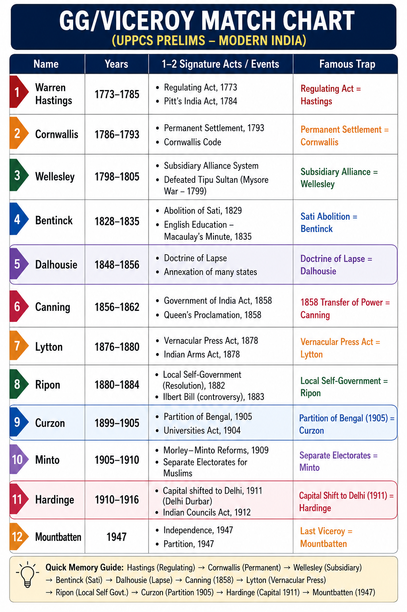

# Topic 3 — Governors-General & Viceroys
### ★ Complete Source of Truth — No other book/notes needed for this topic

> **Covers syllabus:** Governors-General and Their Reforms | Governors-General and Associated Wars | British Governors | Governors-General | Viceroys | Works and Reforms | Lord Dalhousie | Doctrine of Lapse | Lord Curzon | Lord Macaulay | Warren Hastings | Cornwallis | Wellesley | William Bentinck | Canning | Ripon | Dufferin | Elgin | Minto | Hardinge | Linlithgow | Wavell | Mountbatten | Regulating Act (1773) | Pitt's India Act (1784) | Charter Acts | Government of India Acts | Indian Councils Acts | Ilbert Bill | Vernacular Press Act | Arms Act  
> **Sources baked in:** NCERT *Themes in Indian History Part III*, Spectrum *A Brief History of Modern India*, Bipan Chandra, UPPCS Prelims PYQs 2018–2025  
> **Exam weight:** ★★★ High — GG/Viceroy ↔ reform matching, constitutional acts chronology, associated wars  
> **Last verified:** July 2026

---

## Quick Revision Box — Raata This First

```
OFFICE TIMELINE:
  1773 Regulating Act → first GG (Warren Hastings)
  1784 Pitt's India Act → Board of Control + Court of Directors (dual control)
  1833 Charter Act → GG of Bengal becomes GG of India
  1858 GOI Act → Crown rule; GG becomes Viceroy (Canning first Viceroy)
  1947 Mountbatten → last Viceroy; Independence 15 Aug

2025 Q40 MATCH = D (4,3,2,1):
  A Dalhousie → 4 Doctrine of Lapse
  B Curzon → 3 Partition of Bengal
  C Bentinck → 2 Prohibition of Sati
  D Cornwallis → 1 Permanent Settlement

KEY ACTS CHAIN:
  1773 Regulating | 1784 Pitt's | 1793/1813/1833/1853 Charters
  1858 Crown | 1861 Portfolio (2021 Q13) | 1909 Morley-Minto separate electorates
  1919 Montagu-Chelmsford + Chamber of Princes (2023 Q43) | 1935 Provincial autonomy

GG ↔ WAR MATCH:
  Warren Hastings → Rohilla 1774; 1st Anglo-Maratha → Salbai 1782
  Cornwallis → 3rd Anglo-Mysore → Seringapatam 1792
  Wellesley → 4th Mysore 1799 (Tipu killed); 2nd Maratha 1803–05; recalled 1805
  Lord Hastings → Nepal 1814–16 (Sugauli); 3rd Maratha 1817–18
  Dalhousie → Punjab 1849; Lapse annexations; Awadh 1856 (misrule)
  Canning → 1857 suppression; first Viceroy 1858
  Lytton → 2nd Anglo-Afghan 1878–80; Vernacular Press 1878

VICEROYS — FREEDOM ERA:
  Dufferin 1884–88 → INC 1885; "microscopic minority" (2018 Q76)
  Curzon 1899–1905 → Bengal Partition 16 Oct 1905
  Hardinge 1910–16 → annul Partition 1911; Delhi capital; bomb 1912
  Chelmsford 1916–21 → Rowlatt + Jallianwala 1919; Montagu-Chelmsford
  Linlithgow 1936–43 → Aug Offer 1940; Quit India 1942
  Wavell 1943–47 → Wavell Plan + Simla 1945
  Mountbatten 1947 → June 3 Plan; Independence Act

CHRONOLOGY FIXES (raata):
  2025 Q127: Awadh 1856 → Indigo 1859 → 2nd Afghan 1878 → Ilbert 1883 = A (1,3,4,2)
  2025 Q41: Cripps 1942 → Wavell Plan 1945 → Simla 1945 → Cabinet 1946 = A (1,4,3,2)

TRAPS:
  Dufferin (NOT Curzon) = "microscopic minority"
  Bentinck (NOT Cornwallis) = Sati 1829
  Dalhousie (NOT Wellesley) = Lapse
  Ripon (NOT Curzon) = Ilbert Bill 1883
  Lytton (NOT Ripon) = Vernacular Press Act 1878
  Chamber of Princes = GOI Act 1919 (NOT 1909)
  Warren Hastings ≠ Lord Hastings
  Asiatic Society 1784: Jones founder; Hastings declined presidency (2019 Q22)
```

### Must-Know Term Comparisons (very frequently asked)

| Term | One-line difference | Hindi |
|------|---------------------|-------|
| **Governor-General vs Viceroy** | GG = Company era (**1773–1858**); Viceroy = Crown representative after **1858** — same supreme office, new title | गवर्नर-जनरल / वायसराय |
| **Regulating Act vs Pitt's India Act** | **1773** created GG post + Supreme Court; **1784** created **Board of Control** over Company politics | रेगुलेटिंग एक्ट / पिट्स इंडिया एक्ट |
| **Cornwallis vs Bentinck** | Cornwallis = **Permanent Settlement 1793** + civil service; Bentinck = **Sati 1829** + Thuggee | कॉर्नवालिस / बेंटिंक |
| **Wellesley vs Dalhousie** | Wellesley = **Subsidiary Alliance 1798**; Dalhousie = **Doctrine of Lapse 1848** + railways | वेलेज़ली / डलहौज़ी |
| **Warren Hastings vs Lord Hastings** | Warren = first GG **1773–85**; Lord Hastings (Moira) = GG **1813–23** (Nepal + Maratha III) | वारेन हेस्टिंग्स / लॉर्ड हेस्टिंग्स |
| **Ripon vs Curzon** | Ripon = local self-govt + **Ilbert Bill**; Curzon = **Bengal Partition 1905** + universities | रिपन / कर्जन |
| **Canning vs Lytton** | Canning = **1857** + first Viceroy; Lytton = **Vernacular Press Act 1878** + famine | कैनिंग / लिटन |
| **Montagu-Chelmsford vs GOI 1935** | **1919** = dyarchy in provinces; **1935** = provincial autonomy (dyarchy abolished) | मॉण्टेग्यू-चेम्सफोर्ड / 1935 एक्ट |
| **Macaulay vs Wood's Dispatch** | Macaulay Minute **1835** = English education; Wood's Dispatch **1854** = education blueprint | मैकॉले / वुड का प्रेषण |
| **Ilbert Bill vs Vernacular Press Act** | Ilbert **1883** (Ripon) = Indian judges try Europeans; Vernacular Press **1878** (Lytton) = press censorship | इल्बर्ट बिल / वर्नाक्युलर प्रेस एक्ट |
| **Wavell vs Mountbatten** | Wavell = **1945** Simla/Wavell Plan; Mountbatten = **June 1947** partition plan | वेवेल / माउंटबेटन |
| **1909 vs 1919** | **1909** = separate electorates; **1919** = dyarchy + Chamber of Princes | 1909 / 1919 |

### Memory Tricks

| Trick | Remembers |
|-------|-----------|
| **C-B-D-C code D** | Cornwallis Settlement → Bentinck Sati → Dalhousie Lapse → Curzon Partition → **2025 Q40 = D** |
| **1773-84-58** | Regulating → Pitt's → Crown |
| **4 Charters** | **17**93 → **18**13 missionaries → **18**33 GG of India → **18**53 open competition |
| **Ripon = Rights** | Local self-govt + Ilbert (Indian judicial rights) |
| **Curzon = Carve** | Carved Bengal **1905** |
| **Dufferin = Disdain** | Dismissed Congress as microscopic |
| **Lytton = Lockdown** | Locked vernacular press **1878** |
| **W-W-M** | Wavell Plan → (Simla) → Mountbatten final |
| **1861 Portfolio** | Departmental system — **2021 Q13** |
| **1-3-4-2** | **2025 Q127** Awadh → Indigo → Afghan → Ilbert |
| **1-4-3-2** | **2025 Q41** Cripps → Wavell → Simla → Cabinet |

---



## 3.1 Office of Governor-General & Viceroy

### Definitions

| Term | Meaning |
|------|---------|
| **Governor-General (GG)** | Supreme executive head of British India under the East India Company (**1773–1858**) |
| **Viceroy** | Crown's direct representative in India after the **Government of India Act 1858** — same supreme office, new title |
| **Governor-General of India** | After Charter Act **1833**, GG of Bengal became GG **of India** (all-India authority) |
| **Executive Council** | Advisory body of GG/Viceroy — expanded by successive Councils Acts |
| **Board of Control** | British parliamentary body (Pitt's Act **1784**) supervising Company political affairs from London |
| **Secretary of State for India** | British cabinet minister who controlled Indian affairs after **1858** (replaced Board of Control) |

### Causes — Why the Office Evolved

1. **Company chaos after Diwani (1765):** Bengal Dual Government created famine, corruption, and no single responsible head.
2. **Three presidencies acted separately:** Madras, Bombay, and Bengal made war and treaties independently — need for one supreme office.
3. **Parliamentary demand for control:** British public and MPs wanted accountability over Company political power.
4. **1857 Revolt:** Ended confidence in Company rule — Crown took direct responsibility through a Viceroy.
5. **All-India empire:** By 1830s Company ruled far beyond Bengal — title "GG of India" matched reality.

### Evolution — Step by Step

1. **1758–1772:** **Governors of Bengal** (Clive, Verelst, Cartier) — no pan-India GG yet.
2. **1773:** **Regulating Act** created **Governor-General of Bengal**; **Warren Hastings** first incumbent.
3. **1784:** **Pitt's India Act** — dual control (Court of Directors + Board of Control).
4. **1833:** **Charter Act** — GG of Bengal became **GG of India**.
5. **1858:** **Government of India Act** — Company rule ended; GG became **Viceroy**; **Lord Canning** first Viceroy.
6. **1861–1935:** Executive Council expanded; portfolio system; dyarchy then provincial autonomy.
7. **1947:** **Mountbatten** last Viceroy; office ended with Independence (then GG of free India briefly).

### Office of GG & Viceroy — How It Works

- The **Governor-General** was the single most powerful office in British India from **1773 to 1947**.
- Before **1773**, Bengal, Madras, and Bombay each had a separate **Governor** — no unified chief.
- **Regulating Act 1773** made Bengal's head the **Governor-General** with supremacy over Madras and Bombay in war and foreign policy.
- **Pitt's India Act 1784** added the **Board of Control** in London — the GG answered to both Directors and the British government.
- **Charter Act 1833** renamed the office **Governor-General of India** — reflecting all-India authority, not Bengal alone.
- After **1857**, the **Government of India Act 1858** transferred power from Company to **British Crown**.
- The title **Viceroy** (representing the Crown) replaced Company-era Governor-General from **1858**.
- **Canning (1858–62)** was first Viceroy; **Mountbatten (1947)** was the last.
- After **1858**, the Viceroy reported to the **Secretary of State for India** in London (cabinet minister).
- Trap: "Warren Hastings was first Viceroy." **Canning** was first **Viceroy**; Hastings was first **GG**.
- Trap: "GG and Viceroy were different offices." Same supreme post — only the **title and accountability** changed after **1858**.

> **Exam note:** **1858** = dividing line between **GG (Company)** and **Viceroy (Crown)**. First Viceroy = **Canning**.

### Results of Office Evolution

| Result | Why it matters |
|--------|----------------|
| Single supreme executive | Ended presidency rivalry in war/foreign policy |
| Parliamentary oversight from 1773 | Company no longer a private empire only |
| Dual control 1784–1858 | Board of Control + Directors |
| Crown rule from 1858 | Viceroy as imperial face of Britain |
| Secretary of State post-1858 | Direct cabinet control from London |

### GG vs Viceroy — Comparison Table

| Aspect | Governor-General (1773–1858) | Viceroy (1858–1947) |
|--------|------------------------------|---------------------|
| **Appointed by** | East India Company (+ Crown oversight after 1784) | British Crown |
| **First** | Warren Hastings **1773** | Lord Canning **1858** |
| **Last as Company GG** | Canning (**1856–58** as GG) | — |
| **Last Viceroy** | — | Mountbatten **1947** |
| **Accountable to** | Court of Directors + Board of Control | Secretary of State for India |

### Exam Facts (raata)

- First GG: **Warren Hastings (1773)**
- First Viceroy: **Lord Canning (1858)**
- Last Viceroy: **Lord Mountbatten (1947)**
- 1833: title becomes GG of India
- 1858: Crown rule begins
- Pitt's Act 1784: Board of Control
- Post-1858: Secretary of State for India

### PYQs — Office of GG & Viceroy

1. **(UPPCS Prelims 2021, Q13)** Which Act strengthened the Viceroy's authority over his executive council by substituting the 'portfolio' or 'departmental' system for corporate functioning? → **Indian Councils Act, 1861**.

2. **(UPSC pattern)** First Viceroy of India → **Lord Canning**.

### Examples (3.1)

| Example | What it teaches |
|---------|-----------------|
| **Hastings 1773** | First Governor-General |
| **Canning 1858** | First Viceroy |
| **Mountbatten 1947** | Last Viceroy |

---

## 3.2 Regulating Act (1773)

### Definitions

| Term | Meaning |
|------|---------|
| **Regulating Act (1773)** | First Act of British Parliament to regulate the East India Company's government in India |
| **Governor-General of Bengal** | Supreme executive head created by the Act — **Warren Hastings** first holder |
| **Supreme Council** | Four-member council advising the GG at Fort William, Calcutta |
| **Supreme Court of Calcutta (1774)** | Royal court established alongside Company courts under **Sir Elijah Impey** |

### Causes

1. **Company misrule:** Dual Government corruption and the **Bengal Famine of 1770** shocked British opinion.
2. **Need for central authority:** Bengal, Madras, and Bombay acted independently — war and treaties lacked coordination.
3. **Parliamentary pressure:** Stockholders and reformers demanded accountability after Diwani (**1765**).
4. **Corruption of Company servants:** Plassey-era gift-taking and private trade needed legal prohibition.
5. **Political empire without law:** Company ruled territories but lacked a constitutional framework from Parliament.

### Course — Step by Step

1. **1773:** British Parliament passed the **Regulating Act** after debates on the Company charter.
2. The **Governor of Bengal** was elevated to **Governor-General of Bengal**.
3. **Warren Hastings** was appointed first **Governor-General** with a **Supreme Council** of four members.
4. A **Supreme Court** was established at Calcutta (**1774**) under **Sir Elijah Impey**.
5. **Madras and Bombay** were made subordinate to the GG in war and foreign policy.
6. Company servants were **prohibited** from accepting gifts and engaging in private trade.
7. The **Court of Directors** retained power but had to submit revenue accounts to the British Treasury.
8. Hastings used these powers to **end Dual Government** and begin administrative reforms (see §3.5).

### Regulating Act — How It Works

- The **Regulating Act (1773)** was the **first parliamentary intervention** in Company rule — it did **not** end Company rule.
- It created the **Governor-General** office that lasted (as GG/Viceroy) until **1947**.
- **Warren Hastings** became the first GG — his conflicts with council members **Francis, Clavering, and Monson** defined early GG politics.
- The **Supreme Court at Calcutta (1774)** created a dual judicial system — royal court plus Company courts.
- Madras and Bombay could not declare war or make treaties without the GG's approval.
- The Act **failed to stop corruption** fully — Hastings himself faced impeachment (**1788–95**).
- It laid the foundation for **Pitt's India Act (1784)**, which added stronger Crown control through the Board of Control.
- Trap: "Regulating Act created Viceroy." **1858** created the Viceroy title; **1773** created the **GG**.
- Trap: "Regulating Act ended Company rule." The Company continued until **1858**.

> **Exam note:** **1773 = first GG (Hastings)**. Pair with **Pitt's Act 1784** in chronology questions.

### Results of the Regulating Act

| Result | Why it matters |
|--------|----------------|
| GG office created | Centralised British executive in India |
| Supreme Court Calcutta 1774 | Royal judiciary alongside Company |
| Parliamentary control begins | Precedent for Crown supervision |
| Hastings empowered | Reforms, wars, impeachment saga |
| Company rule continues | Not Crown rule — that came **1858** |

### Key Persons — Regulating Act Era

| Person | Role |
|--------|------|
| **Warren Hastings** | First Governor-General |
| **Sir Elijah Impey** | First Chief Justice, Supreme Court Calcutta |
| **Philip Francis** | Hostile Council member; rival of Hastings |
| **Clavering / Monson** | Council members opposing Hastings |

### Exam Facts (raata)

- Year: **1773**
- First GG: **Warren Hastings**
- Supreme Court Calcutta: **1774**
- Supreme Council: **4** members
- Subordinated Madras and Bombay in war/foreign policy
- Did **not** end Company rule

### PYQs — Regulating Act

1. **(UPSC pattern)** Regulating Act passed in → **1773**.

2. **(UPSC pattern)** First Governor-General of Bengal → **Warren Hastings**.

### Examples (3.2)

| Example | What it teaches |
|---------|-----------------|
| **1773** | Act year — first parliamentary control |
| **Hastings** | First GG under the Act |
| **Supreme Court 1774** | Judicial arm of Regulating Act |

---

## 3.3 Pitt's India Act (1784)

### Definitions

| Term | Meaning |
|------|---------|
| **Pitt's India Act (1784)** | Act strengthening British government control over the East India Company |
| **Board of Control** | Parliamentary body of **6 privy councillors** directing Indian political and military affairs |
| **Court of Directors** | Company's London board — retained commercial functions and some patronage |
| **Dual Control** | Division: Board of Control (politics) + Court of Directors (commerce) |

### Causes

1. **Regulating Act failures:** Conflicts between Hastings and his Council, plus later impeachment debates, showed weak London oversight.
2. **Company as territorial power:** After Diwani and wars, the Company was a political empire needing state control.
3. **William Pitt the Younger:** As Prime Minister he pushed systematic imperial governance of India.
4. **National interest:** British state wanted Indian revenues and strategy to serve imperial goals, not only Company shareholders.

### Course — Step by Step

1. **1784:** Parliament passed **Pitt's India Act** (named after PM William Pitt the Younger).
2. A **Board of Control** of six privy councillors was created to supervise political and military affairs in India.
3. The **Court of Directors** retained commercial and patronage functions.
4. The **Governor-General** was given a **casting vote** in Council — strengthening the executive.
5. The Company became a **trustee** of the Crown for Indian territories — Crown sovereignty was recognised.
6. Patronage was split: Directors controlled commercial appointments; the Board influenced political appointments.
7. This dual-control structure continued until **1858**, when Crown direct rule replaced it.

### Pitt's India Act — How It Works

- **Pitt's India Act (1784)** established **dual control** — Board of Control plus Court of Directors.
- The **Board of Control** (chaired by the President of the Board) directed war, peace, and treaties in India.
- The **Court of Directors** managed trade, dividends, and commercial appointments.
- The GG's **casting vote** in Council made him first among equals — Cornwallis later used this effectively.
- The Act made the Company a **political agent** of the British state — Crown sovereignty over Indian territory was asserted.
- This structure lasted until **1858**, when the Crown took direct rule and created the Secretary of State for India.
- Trap: "Pitt's Act ended the Company." The Company continued till **1858** — it was only controlled more tightly.
- Trap: "Board of Control sat in India." It sat in **London**.

> **Exam note:** **1773 Regulating Act** created the GG; **1784 Pitt's Act** created the **Board of Control**.

### Results of Pitt's India Act

| Result | Why it matters |
|--------|----------------|
| Board of Control created | Crown political control over India |
| Dual control system | Directors (trade) + Board (politics) |
| GG casting vote | Stronger executive |
| Company as state agent | Imperial framework for expansion till 1858 |

### Exam Facts (raata)

- Year: **1784**
- PM: **William Pitt the Younger**
- Board of Control: **6** privy councillors
- GG casting vote in Council
- Dual control till **1858**
- Paired with Regulating Act **1773**

### PYQs — Pitt's India Act

1. **(UPSC pattern)** Pitt's India Act passed in → **1784**.

2. **(UPSC pattern)** Board of Control created by → **Pitt's India Act 1784**.

### Examples (3.3)

| Example | What it teaches |
|---------|-----------------|
| **1784** | Act year |
| **Board of Control** | London political oversight |
| **Dual control** | Politics vs commerce split |

---

## 3.4 Charter Acts (1793, 1813, 1833, 1853)

### Definitions

| Term | Meaning |
|------|---------|
| **Charter Act** | Act renewing the East India Company's charter for trade and governance for a fixed period (usually 20 years) |
| **Charter Act 1793** | Renewed Company charter; strengthened GG control over presidencies |
| **Charter Act 1813** | Ended Company trade monopoly (except tea/China); allowed missionaries; education grant |
| **Charter Act 1833** | GG of Bengal became **GG of India**; Company ceased trading |
| **Charter Act 1853** | Open competition for civil service; expanded legislative council |

### Causes of Charter Act Reforms (overall)

1. **Charter renewal cycle:** The Company charter was renewed every **20 years** — Parliament used each renewal to reform Indian government.
2. **Free trade lobby:** British manufacturers wanted access to Indian markets (**1813** onward).
3. **Missionary pressure:** Evangelicals wanted legal entry for Christian missions (**1813**).
4. **Administrative integration:** Need for pan-India GG authority (**1833**).
5. **Merit reform:** Nepotism in civil service was challenged — open competition demanded (**1853**).

### Charter Acts — Master Comparison Table

| Act | Year | Key provision | Exam trap |
|-----|------|---------------|-----------|
| **Charter Act** | **1793** | GG more control over Madras/Bombay; Cornwallis system extended | Not the Permanent Settlement Act itself |
| **Charter Act** | **1813** | Trade monopoly ended (except tea/China); **£1 lakh** for education; missionaries allowed | Not Macaulay Minute (**1835**) |
| **Charter Act** | **1833** | **GG of India**; Company ceased trading; Law Member in Council | GG title change — not **1858** Crown rule |
| **Charter Act** | **1853** | **Open competition** for covenanted civil service; local representation in Council | Not **1858** Crown rule |

---

### 3.4.1 Charter Act 1793

#### Causes

1. Company charter was due for renewal after twenty years.
2. Cornwallis wanted clearer supremacy over Madras and Bombay.
3. Parliament wanted to continue Company rule with tighter administrative control.

#### Course — Step by Step

1. **1793:** Charter renewed for twenty years.
2. GG's control over subordinate presidencies was strengthened.
3. Cornwallis Code and Permanent Settlement framework continued under this charter period.
4. Company trade monopoly was **retained** (unlike later 1813).

#### Charter Act 1793 — How It Works

- The **Charter Act of 1793** was primarily a **renewal charter** that extended East India Company rule for another twenty years rather than creating a wholly new constitutional order.
- Parliament used the renewal to **strengthen the Governor-General's supremacy** over the subordinate presidencies of Madras and Bombay in war and foreign policy.
- The **Cornwallis Code** and the **Permanent Settlement (1793)** continued to operate as the administrative backbone of Bengal under this charter period.
- The Company's **trade monopoly** over Indian commerce was **retained** in 1793, which is why private British traders could not freely enter Indian markets until **1813**.
- The Act reflected British confidence in Cornwallis-era reforms and the need for stable revenue administration after the Permanent Settlement.
- It did **not** end Company rule, create a Viceroy, or open India to missionaries — those changes came in later Acts.
- Students should pair **1793** with **Cornwallis** and **Permanent Settlement**, not with free trade or Crown rule.
- Trap: "1793 Act abolished the trade monopoly." The monopoly ended only in the **Charter Act of 1813**.
- Trap: "1793 made the GG of India." That title change came in **1833**.

#### Results

| Result | Why it matters |
|--------|----------------|
| Charter renewed 20 years | Company rule continues |
| GG supremacy clarified | Presidency coordination |
| Monopoly retained | Free trade still blocked |

---

### 3.4.2 Charter Act 1813

#### Causes

1. British industrial interests demanded free access to Indian markets.
2. Evangelicals demanded legal missionary activity in India.
3. Orientalist–Anglicist debate on education needed a legal education grant.

#### Course — Step by Step

1. **1813:** Parliament ended the Company's **trade monopoly** (except tea and China trade).
2. Private British traders were allowed into Indian commerce.
3. **Christian missionaries** were legally permitted to enter India.
4. A grant of **£1 lakh** per year was set aside for Indian education and learning.
5. Company retained political and administrative control of Indian territories.

#### Charter Act 1813 — How It Works

- The **Charter Act of 1813** ended the East India Company's **commercial monopoly** over Indian trade, except for the **tea trade** and **trade with China**.
- Private British merchants were now legally allowed to trade in India, which accelerated the shift from Company commerce to Company administration.
- **Christian missionaries** were permitted to enter India for the first time under a Company charter, marking a major cultural and religious turning point.
- Parliament set aside an annual grant of **£1 lakh** for the revival of Indian literature and the promotion of scientific and learned inquiry.
- That education grant later became the legal basis for the **Orientalist versus Anglicist** debate, which Macaulay resolved through his **Minute of 1835**.
- The Company **retained full political and territorial control** of India in 1813; only its trading privileges were curtailed.
- The Act is therefore a bridge between pure monopoly Company rule and the administrative GG-of-India phase of **1833**.
- Trap: "1813 is the Macaulay Minute year." The Minute came in **1835**; 1813 only created the education grant.
- Trap: "1813 ended Company rule." Crown rule began only in **1858**.

#### Results

| Result | Why it matters |
|--------|----------------|
| Monopoly ended (except tea/China) | Free trade begins |
| Missionaries allowed | Cultural/religious change |
| Education grant £1 lakh | Prelude to Anglicist policy |

---

### 3.4.3 Charter Act 1833

#### Causes

1. Company was already a territorial power — trading role was outdated.
2. Need for one GG with all-India authority after conquests.
3. Demand for a law member to codify Indian laws.

#### Course — Step by Step

1. **1833:** Company **ceased all commercial functions** — became a purely administrative body.
2. Title changed from GG of Bengal to **Governor-General of India**.
3. **Lord William Bentinck** became the first GG of India under this Act.
4. A **Law Member** was added to the GG's Council — **Macaulay** joined in **1834**.
5. Slavery was abolished in Company territories; a law commission was appointed.

#### Charter Act 1833 — How It Works

- The **Charter Act of 1833** transformed the Governor of Bengal into the **Governor-General of India**, reflecting the Company's all-India territorial empire after conquests in the north and west.
- **Lord William Bentinck** became the first holder of the new title **Governor-General of India** under this Act.
- The East India Company **ceased all commercial functions** in 1833 and became a purely administrative body holding Indian territories in trust for the Crown.
- A **Law Member** was added to the Governor-General's Council, and **Thomas Babington Macaulay** joined in **1834** to lead legal codification.
- Macaulay used this position to push **English education** and later helped frame the **Indian Penal Code**.
- The Act also abolished **slavery** in Company territories and appointed a law commission for systematic codification.
- This is one of the four major Charter Acts students must memorise in sequence: **1793, 1813, 1833, 1853**.
- Trap: "1833 created Crown rule in India." Crown rule began only with the **Government of India Act of 1858**.
- Trap: "1833 opened India to missionaries." Missionaries were legalised in **1813**; 1833 ended Company trade.

#### Results

| Result | Why it matters |
|--------|----------------|
| GG of India title | All-India executive |
| Company stops trading | Administrative body only |
| Law Member added | Codification begins (IPC) |

---

### 3.4.4 Charter Act 1853

#### Causes

1. Last charter renewal before the 1857 crisis.
2. Demand for merit-based civil service against patronage and nepotism.
3. Need for more legislative members including Indians (limited).

#### Course — Step by Step

1. **1853:** Charter renewed — last major Company charter before Mutiny.
2. Principle of **open competition** for the covenanted civil service was introduced.
3. Legislative Council was expanded — local (Indian) representation began in a small way.
4. Executive and legislative functions of the Council were more clearly separated.

#### Charter Act 1853 — How It Works

- The **Charter Act of 1853** was the **last major Company charter** before the **1857 Revolt** and the **1858** transfer of power to the Crown.
- It introduced the principle of **open competition** for recruitment to the covenanted civil service, replacing pure patronage with merit-based entry.
- This open-competition principle became the foundation of the later **Indian Civil Service (ICS)** system under the Crown.
- The Act **expanded the Legislative Council** and allowed a limited number of **local (Indian) members** to be associated with legislation.
- It also separated **executive** and **legislative** functions of the Council more clearly than earlier Acts.
- The charter was renewed for Company rule, but the political mood in Britain was already turning against exclusive Company government.
- Students should remember **1853** as the reform Act immediately before the crisis decade of **1857–58**.
- Trap: "1853 ended Company rule in India." Company rule ended only in **1858**.
- Trap: "1853 introduced provincial autonomy." Provincial autonomy came in the **Government of India Act of 1935**.

#### Results

| Result | Why it matters |
|--------|----------------|
| Open competition ICS | Merit over patronage |
| Legislative expansion | Early Indian representation |
| Last Company charter | Prelude to 1858 |

> **Exam note:** Memorise **1793 → 1813 → 1833 → 1853** with one key provision each. **1833 = GG of India**; **1853 = open competition**.

### Exam Facts (raata)

- 1793: GG control strengthened; monopoly continues
- 1813: Monopoly ends (except tea/China); missionaries; £1 lakh education
- 1833: GG of India; Company stops trading; Law Member
- 1853: Open competition civil service
- First GG of India title holder: **Bentinck**

### PYQs — Charter Acts

1. **(UPPCS Prelims 2023, Q43)** Chamber of Princes → **GOI Act 1919** (not Charter Act 1853).

2. **(UPSC pattern)** GG of India title from → **Charter Act 1833**.

### Examples (3.4)

| Example | What it teaches |
|---------|-----------------|
| **1813 missionaries** | Religious policy opening |
| **1833 GG of India** | Title change — not Crown rule |
| **1853 competition** | ICS reform origin |

---


## 3.5 Warren Hastings (1772–1785)

### Definitions

| Term | Meaning |
|------|---------|
| **Warren Hastings (1732–1818)** | First **Governor-General of Bengal (1773–85)** under the Regulating Act |
| **Asiatic Society of Bengal (1784)** | Learned body founded in Hastings' era; **Sir William Jones** first president |
| **Impeachment of Hastings (1788–95)** | Trial in London led by **Edmund Burke** — Hastings was acquitted in **1795** |
| **Rohilla War (1774)** | Company-backed war in Rohilkhand involving Awadh Nawab and Hastings |

### Causes / Context of His Tenure

1. **Dual Government crisis:** After Clive's system, Bengal needed direct Company administration.
2. **Regulating Act 1773:** Created the GG post — Hastings was the natural first choice after reforming Bengal as Governor.
3. **Maratha and Mysore threats:** Company needed a strong executive to fight and negotiate in North and West India.
4. **Oriental scholarship policy:** Hastings favoured learning Indian languages and laws for administration.

### Tenure — Step by Step

1. **1772:** As Governor of Bengal, Hastings **abolished Dual Government** — Company took direct revenue and civil administration.
2. **1773:** Regulating Act made him first **Governor-General** with a Supreme Council of four.
3. **1774:** **Rohilla War** — supported Awadh Nawab against Rohillas; later criticised as unjust aggression.
4. **1775–82:** **First Anglo-Maratha War** — ended with **Treaty of Salbai 1782** (status quo; Salsette to British).
5. **1781:** Suppressed **Chait Singh's Banaras Rebellion** — revenue resistance; important UP angle.
6. **1784:** **Asiatic Society of Bengal** founded; Hastings declined the presidency in favour of **Sir William Jones**.
7. **1785:** Resigned and returned to England.
8. **1788–95:** Faced **impeachment** by Burke — **acquitted** after a long trial.

### Warren Hastings — How It Works

- **Warren Hastings** was the **first Governor-General** — the foundational architect of British administrative India.
- He **ended Dual Government (1772)** — the Company took direct charge of revenue and civil administration in Bengal.
- **Rohilla War (1774)** expanded British influence in north India through Awadh and was later used against him in impeachment.
- **First Anglo-Maratha War** ended with **Salbai 1782** — status quo peace; Hastings secured **Salsette** for Bombay.
- **Banaras Rebellion (1781):** **Chait Singh** rebelled against revenue demands — Hastings suppressed it (UPPCS UP angle).
- **Asiatic Society of Bengal (1784):** Hastings encouraged Oriental studies; **William Jones** became president — **UPPCS 2019 Q22** and **2021 Q40**.
- **Impeachment (1788–95):** Burke charged corruption and aggression; Hastings was **acquitted**.
- Associated wars: **Rohilla 1774**, **First Maratha 1775–82** — full war detail is in Topic 2; here remember GG ↔ war match.
- Trap: "Hastings introduced Subsidiary Alliance." That was **Wellesley (1798)**.
- Trap: "Jones founded Asiatic Society during Bentinck." It was the **Hastings era, 1784**.
- Trap: "Warren Hastings = Lord Hastings." Different persons — Lord Hastings was GG **1813–23**.

> **Exam note:** Hastings = **first GG + end Dual Government + Salbai 1782 + Asiatic Society**. **2019 Q22** — Hastings declined presidency for Jones.

### Results of Hastings' Tenure

| Result | Why it matters |
|--------|----------------|
| Dual Government ended **1772** | Direct Company administration |
| Salbai **1782** | Maratha peace; Salsette retained |
| Asiatic Society **1784** | Oriental scholarship institutionalised |
| Impeachment acquittal **1795** | GG accountability precedent |
| Benares under Company | Revenue extraction model (UP) |

### Key Persons — Hastings Era

| Person | Role |
|--------|------|
| **Warren Hastings** | First GG; Dual Govt ender; Salbai |
| **Sir William Jones** | Founder-president, Asiatic Society |
| **Edmund Burke** | Led impeachment |
| **Chait Singh** | Banaras rebel **1781** |
| **Philip Francis** | Council rival |

### Exam Facts (raata)

- First GG: **1773–85**
- Ended Dual Government: **1772**
- Salbai: **1782**
- Chait Singh rebellion: **1781**
- Asiatic Society: **1784**; Jones president
- Impeachment: **1788–95**; acquitted
- Not Subsidiary Alliance (Wellesley)

### PYQs — Warren Hastings

1. **(UPPCS Prelims 2019, Q22)** Assertion: Asiatic Society of Bengal was established in Warren Hastings' period and he declined the presidentship in favour of Sir William Jones. Reason: Hastings was a great scholar and ardent orientalist. → **Both true; R is not the correct explanation of A** (answer **B**).

2. **(UPPCS Prelims 2021, Q40)** Who was the founder of the Asiatic Society of Bengal? → **Sir William Jones**.

3. **(UPPCS Prelims 2019, Q93)** Treaty of Salbai **1782** — Hastings-era Maratha settlement.

### Examples (3.5)

| Example | What it teaches |
|---------|-----------------|
| **Salbai 1782** | Maratha peace under Hastings |
| **Asiatic Society 1784** | Jones + Hastings link |
| **Banaras 1781** | UP revenue rebellion |

---

## 3.6 Lord Cornwallis (1786–1793, 1805)

### Definitions

| Term | Meaning |
|------|---------|
| **Lord Cornwallis (1738–1805)** | GG who introduced **Permanent Settlement (1793)** and reorganised civil service and judiciary |
| **Permanent Settlement (1793)** | Fixed land revenue with **zamindars** as proprietors in Bengal, Bihar, and Orissa |
| **Cornwallis Code (1793)** | Administrative and judicial reforms separating revenue from judiciary |
| **Sandalwood Tree policy** | Cornwallis barred Indians from higher covenanted civil and judicial posts |

### Causes of Cornwallis Reforms

1. **Revenue instability:** Flexible annual settlements created uncertainty and over-extraction.
2. **Corruption:** Company servants mixed revenue and judicial powers for private gain.
3. **Need for fixed revenue:** British state wanted predictable land revenue from Bengal.
4. **Third Anglo-Mysore War:** Cornwallis personally led the campaign and needed stable finances.

### Course — Step by Step

1. **1786:** Cornwallis arrived as GG — Pitt's Act casting vote made him an effective chief executive.
2. **1787–91:** Permanent Settlement was designed — fixed revenue with zamindars as proprietors.
3. **1790–92:** **Third Anglo-Mysore War** — Cornwallis led the field campaign; **Treaty of Seringapatam 1792**.
4. **1793:** **Permanent Settlement** formally introduced in Bengal, Bihar, and Orissa.
5. **1793:** **Cornwallis Code** — separated revenue collectors from judges; district administration reorganised.
6. **1793:** European-only covenanted civil service policy — Indians excluded from higher posts.
7. **1805:** Second short term as GG — died at **Ghazipur** the same year.

### Lord Cornwallis — How It Works

- Cornwallis is remembered for the **Permanent Settlement of 1793** — **UPPCS 2025 Q40** matches Cornwallis with this reform.
- Under Permanent Settlement, **zamindars** became proprietors paying a **fixed permanent** land revenue to the state.
- The reform aimed to encourage land improvement, but zamindars often exploited tenants.
- **Cornwallis Code** separated **revenue and judicial** functions — foundation of modern district administration.
- He created a **European-only covenanted civil service** — Indians were excluded from higher posts until later reforms.
- He personally commanded the **Third Anglo-Mysore War (1790–92)** — rare for a GG to lead in the field.
- **Treaty of Seringapatam (1792)** halved Tipu's territory — Cornwallis' main military legacy.
- Trap: "Cornwallis abolished Sati." **Bentinck 1829**.
- Trap: "Permanent Settlement in Madras Presidency." It applied to **Bengal, Bihar, Orissa**.

> **Exam note:** **2025 Q40** — Cornwallis = **Permanent Settlement (1)**. Not Sati, not Lapse, not Partition.

### Results of Cornwallis Reforms

| Result | Why it matters |
|--------|----------------|
| Permanent Settlement **1793** | Fixed zamindari system in Bengal |
| Cornwallis Code **1793** | Revenue–judiciary separation |
| European civil service monopoly | Indians excluded from higher posts |
| Seringapatam **1792** | Tipu weakened |
| District administration model | Template for British India |

### Key Persons — Cornwallis Era

| Person | Role |
|--------|------|
| **Lord Cornwallis** | Permanent Settlement; 3rd Mysore War |
| **Tipu Sultan** | Opponent in Third Mysore War |
| **John Shore** | Helped design Permanent Settlement |

### Exam Facts (raata)

- Permanent Settlement: **1793**
- Areas: Bengal, Bihar, Orissa
- Cornwallis Code: **1793**
- Third Anglo-Mysore: **1790–92**
- 2025 Q40: Cornwallis = Settlement
- Two terms: **1786–93**, **1805**

### PYQs — Lord Cornwallis

1. **(UPPCS Prelims 2025, Q40)** Match Cornwallis with Permanent Settlement of Bengal → code **D (4,3,2,1)**.

2. **(UPSC pattern)** Permanent Settlement introduced by → **Lord Cornwallis, 1793**.

### Examples (3.6)

| Example | What it teaches |
|---------|-----------------|
| **1793 Settlement** | Cornwallis landmark reform |
| **Seringapatam 1792** | Cornwallis military role |
| **Sandalwood Tree** | Indian exclusion from ICS |

---

## 3.7 Lord Wellesley (1798–1805)

### Definitions

| Term | Meaning |
|------|---------|
| **Lord Wellesley (1760–1842)** | GG who introduced **Subsidiary Alliance (1798)** and fought Fourth Mysore and Second Maratha Wars |
| **Subsidiary Alliance** | Indian rulers accepted British troops, paid subsidy, and lost independent foreign policy |
| **Recall of Wellesley (1805)** | Court of Directors recalled him for over-expansion and war costs |

### Causes of Wellesley's Expansion

1. **French threat:** Tipu and other rulers sought French help after the French Revolution — Wellesley feared a French base in India.
2. **Nizam's French troops:** Hyderabad had French soldiers — Wellesley demanded their removal.
3. **Imperial ambition:** Wellesley wanted British paramountcy across India.
4. **Subsidiary Alliance model:** Indirect control was cheaper than immediate full annexation.

### Course — Step by Step

1. **1798:** First **Subsidiary Alliance** with the **Nizam of Hyderabad** — French expelled.
2. **1799:** **Fourth Anglo-Mysore War** — **Tipu Sultan killed** at Seringapatam; Mysore under subsidiary Wodeyar rule.
3. **1801:** Awadh forced into large territorial cession under subsidiary pressure.
4. **1802:** **Treaty of Bassein** — Peshwa under Subsidiary Alliance.
5. **1803–05:** **Second Anglo-Maratha War** — Sindhia and Bhonsle defeated; Assaye and Laswari.
6. **1805:** **Recall of Wellesley** — Directors alarmed at war costs — **UPPCS 2024 Q137** chronology.
7. Brother **Arthur Wellesley** won **Assaye 1803** — later Duke of Wellington.

### Lord Wellesley — How It Works

- Wellesley was the most aggressive expansionist GG before **Dalhousie**.
- **Subsidiary Alliance (1798)** began with **Hyderabad** — the template for indirect empire.
- **Fourth Anglo-Mysore (1799)** destroyed Tipu — Mysore restored under Wodeyar subsidiary.
- **Treaty of Bassein (1802)** made the Peshwa a client and triggered the **Second Anglo-Maratha War**.
- **Arthur Wellesley** won **Assaye (1803)** — decisive British victory in the Deccan.
- **Recall 1805** showed the limits of Company finances — expansion backlash from London.
- **UPPCS 2024 Q137** places Wellesley recall before Anglo-Nepal and Third Maratha War.
- Trap: "Wellesley = Doctrine of Lapse." **Dalhousie 1848**.
- Trap: "Subsidiary Alliance first with Mysore." **Hyderabad 1798** was first.

> **Exam note:** Wellesley = **Subsidiary Alliance + Tipu 1799 + Bassein 1802 + recall 1805**.

### Results of Wellesley's Tenure

| Result | Why it matters |
|--------|----------------|
| Subsidiary Alliance system | Indirect empire model |
| Tipu killed **1799** | South India secured |
| Second Maratha War | Maratha power broken partially |
| Recall **1805** | Expansion limits shown |
| Arthur Wellesley's fame | Future Duke of Wellington |

### Key Persons — Wellesley Era

| Person | Role |
|--------|------|
| **Lord Wellesley** | GG; Subsidiary Alliance |
| **Arthur Wellesley** | Assaye 1803 |
| **Tipu Sultan** | Killed 1799 |
| **Baji Rao II** | Signed Bassein 1802 |

### Exam Facts (raata)

- Tenure: **1798–1805**
- First Subsidiary: **Hyderabad 1798**
- Tipu killed: **1799**
- Bassein: **1802**
- Recalled: **1805**
- Not Doctrine of Lapse

### PYQs — Lord Wellesley

1. **(UPPCS Prelims 2024, Q137)** Recall of Wellesley in expansion chronology with Nana Fadnavis death, Vellore Mutiny, Anglo-Nepal War.

2. **(UPSC pattern)** Subsidiary Alliance introduced by → **Lord Wellesley**.

### Examples (3.7)

| Example | What it teaches |
|---------|-----------------|
| **Hyderabad 1798** | First Subsidiary Alliance |
| **Assaye 1803** | Arthur Wellesley's victory |
| **Recall 1805** | Over-expansion cost |

---

## 3.8 Lord William Bentinck (1828–1835)

### Definitions

| Term | Meaning |
|------|---------|
| **Lord William Bentinck (1774–1839)** | GG who abolished **Sati (1829)** and suppressed **Thuggee** |
| **Bengal Sati Regulation (1829)** | Regulation XVII abolishing widow burning in Company territories |
| **Thuggee Suppression** | Campaign against ritualised highway robbery — led by **William Sleeman** |

### Causes of Bentinck's Social Reforms

1. **Reform movement pressure:** **Raja Ram Mohan Roy** and missionaries campaigned against Sati.
2. **Humanitarian argument:** British reformers cited a moral duty to stop the practice.
3. **Administrative efficiency:** Thuggee threatened trade routes and colonial order.
4. **Financial retrenchment:** Bentinck also cut military expenditure — a liberal reformer GG.

### Course — Step by Step

1. **1828:** Bentinck arrived as GG — liberal and retrenchment-minded.
2. **1829:** **Regulation XVII** — **Sati abolished** in Company territories after Roy's campaign.
3. **1830s:** **Thuggee suppression** under **William Sleeman** destroyed the cult.
4. **1833:** Charter Act made him **GG of India** — first to hold the new title.
5. **1835:** **Macaulay's Minute** on English education accepted (see §3.9).
6. **1835:** English made the official language of courts and higher education.
7. **1835:** **Calcutta Medical College** established; Bentinck left India.

### Lord William Bentinck — How It Works

- Bentinck is most famous for **abolishing Sati (1829)** — **UPPCS 2025 Q40** matches Bentinck with this.
- **Raja Ram Mohan Roy** campaigned decisively for Sati abolition — Bentinck enacted the law.
- **Thuggee suppression** by Sleeman destroyed a centuries-old criminal network.
- Bentinck pursued **financial retrenchment** — reduced army costs after earlier wars.
- He supported **Macaulay's English education policy (1835)**.
- He was the first **Governor-General of India** under the Charter Act **1833**.
- Trap: "Cornwallis abolished Sati." **Bentinck 1829**.
- Trap: "Bentinck = Permanent Settlement." **Cornwallis 1793**.

> **Exam note:** **2025 Q40** — Bentinck = **Prohibition of Sati (2)**.

### Results of Bentinck's Reforms

| Result | Why it matters |
|--------|----------------|
| Sati abolished **1829** | First major social reform law |
| Thuggee suppressed | Internal security improved |
| English education policy | Macaulay Minute **1835** |
| Financial retrenchment | Military costs cut |
| First GG of India title | Under Charter Act 1833 |

### Key Persons — Bentinck Era

| Person | Role |
|--------|------|
| **Lord William Bentinck** | Sati ban; GG of India |
| **Raja Ram Mohan Roy** | Campaigned against Sati |
| **William Sleeman** | Thuggee suppression |
| **T.B. Macaulay** | Education Minute 1835 |

### Exam Facts (raata)

- Tenure: **1828–35**
- Sati abolished: **1829** (Regulation XVII)
- Thuggee: Sleeman campaign
- Macaulay Minute: **1835**
- First GG of India title: Bentinck
- 2025 Q40: Bentinck = Sati

### PYQs — Lord William Bentinck

1. **(UPPCS Prelims 2025, Q40)** Bentinck = Prohibition of Practice of Sati → code **D (4,3,2,1)**.

2. **(UPSC pattern)** Sati abolished in → **1829** under Bentinck.

### Examples (3.8)

| Example | What it teaches |
|---------|-----------------|
| **Sati 1829** | Bentinck's landmark reform |
| **Sleeman** | Thuggee suppression |
| **Roy** | Indian reformer behind Sati ban |

---

## 3.9 Lord Macaulay & Education Policy

### Definitions

| Term | Meaning |
|------|---------|
| **Thomas Babington Macaulay (1800–59)** | Law Member of Council; author of **Minute on Education (1835)** |
| **Macaulay's Minute (1835)** | Policy favouring **English** as the medium of higher education |
| **Downward Filtration Theory** | Idea that educating the elite would trickle knowledge down to the masses |
| **Wood's Dispatch (1854)** | Later comprehensive education policy under Dalhousie's era — not Macaulay |

### Causes of English Education Policy

1. **Charter Act 1813:** Education grant created a debate on Oriental vs Western education.
2. **Orientalist–Anglicist debate:** Sanskrit/Arabic vs English education.
3. **Administrative need:** Company needed English-educated Indians for lower bureaucracy.
4. **Macaulay's conviction:** He argued English literature and science were superior for modern education.

### Course — Step by Step

1. **1834:** Macaulay arrived as **Law Member** of the GG's Council under Bentinck.
2. **2 February 1835:** **Minute on Indian Education** submitted — argued for English education.
3. **1835:** Bentinck accepted the Minute — English became the language of courts and higher education.
4. Funds shifted from Oriental colleges toward English education.
5. Macaulay drafted the **Indian Penal Code** (enacted **1860** after his death).
6. **1854:** **Wood's Dispatch** expanded mass education — a separate later document.

### Lord Macaulay — How It Works

- **Macaulay's Minute (1835)** decided the **Anglicist** side of the education debate.
- **English** became the language of courts, government, and higher education.
- **Downward Filtration Theory** assumed educating the elite would benefit the masses — later criticised.
- Macaulay also worked on the **Indian Penal Code** — enacted **1860**.
- The policy created an English-educated Indian middle class — later nationalist leadership emerged from this group.
- **Wood's Dispatch (1854)** is a **separate** document of the **Dalhousie** era — do not confuse dates.
- Trap: "Macaulay Minute 1854." **1835** Minute; **1854** = Wood's Dispatch.
- Trap: "Macaulay was Governor-General." He was **Law Member** under **Bentinck**.

> **Exam note:** Macaulay = **1835 Minute + English education** under **Bentinck's** GGship.

### Results of Macaulay's Education Policy

| Result | Why it matters |
|--------|----------------|
| English education promoted | New middle class created |
| Oriental colleges defunded | Sanskrit/Arabic education marginalised |
| IPC drafted | Legal codification |
| Nationalist leadership base | English-educated Indians later led Congress |

### Exam Facts (raata)

- Macaulay Minute: **1835**
- Law Member under Bentinck
- English as official higher-education language
- IPC drafted (enacted **1860**)
- Wood's Dispatch: **1854** (separate)

### PYQs — Lord Macaulay

1. **(UPSC pattern)** Macaulay Minute on Education → **1835**.

2. **(UPSC pattern)** English education policy under → **Lord William Bentinck**.

### Examples (3.9)

| Example | What it teaches |
|---------|-----------------|
| **Minute 1835** | English education turning point |
| **IPC** | Macaulay legal legacy |
| **Wood's Dispatch 1854** | Not Macaulay — later Dalhousie-era policy |

---

## 3.10 Lord Dalhousie (1848–1856)

### Definitions

| Term | Meaning |
|------|---------|
| **Lord Dalhousie (1812–60)** | GG who applied **Doctrine of Lapse**, built railways/telegraph, annexed Punjab and Awadh |
| **Doctrine of Lapse (1848)** | Annexation when a ruler dies without a natural heir — adopted son not recognised |
| **Public Works Department** | Expanded under Dalhousie for railways, roads, and telegraph |

### Causes of Dalhousie's Annexation Policy

1. **Doctrine of Lapse:** Strategic annexation of dependent states without natural heirs.
2. **Punjab:** Second Anglo-Sikh War (**1848–49**) ended Sikh power.
3. **Awadh:** "Misgovernance" plea — **Wajid Ali Shah** deposed **1856**.
4. **Infrastructure:** Railways and telegraph for military mobility and commercial control.

### Course — Step by Step

1. **1848:** Dalhousie arrived; announced systematic application of **Doctrine of Lapse**.
2. **1848–54:** Annexed **Satara (1848), Jhansi (1853), Nagpur (1854)** under Lapse.
3. **1849:** **Punjab annexed** after the Second Anglo-Sikh War.
4. **1853:** Railway policy accelerated; telegraph lines expanded (**O'Shaughnessy**).
5. **1854:** **Wood's Dispatch** on education; postage reforms.
6. **1856:** **Awadh annexed** on misgovernance plea — major grievance of **1857**.
7. **1856:** Dalhousie left India — his annexations fuelled the Revolt of 1857.

### Lord Dalhousie — How It Works

- Dalhousie was the most aggressive annexationist GG — **UPPCS 2025 Q40** matches him with **Doctrine of Lapse**.
- **Doctrine of Lapse (1848):** **Jhansi 1853** — Rani Lakshmibai's adopted son rejected — **2024 Q148**.
- **Awadh 1856** was annexed on **misgovernance**, not Lapse — but still Dalhousie's era.
- **Punjab annexed 1849** after the Second Anglo-Sikh War.
- **Railways, telegraph, postage** — modern infrastructure under Dalhousie.
- His policies created massive grievances that contributed directly to the **1857 Revolt**.
- **UPPCS 2025 Q127** places Acquisition of Awadh (**1856**) first among listed events.
- Trap: "Awadh annexed under Lapse." **Misgovernance** plea.
- Trap: "Dalhousie abolished Sati." **Bentinck 1829**.

> **Exam note:** **2025 Q40** — Dalhousie = **Doctrine of Lapse (4)**. **2025 Q127** — Awadh acquisition **1856** comes before Indigo, Afghan War, and Ilbert.

### Results of Dalhousie's Tenure

| Result | Why it matters |
|--------|----------------|
| Doctrine of Lapse | Satara, Jhansi, Nagpur annexed |
| Punjab **1849** | North-west frontier secured |
| Awadh **1856** | Major 1857 grievance |
| Railways and telegraph | Modern infrastructure begins |
| 1857 Revolt link | Annexation resentment |

### Key Persons — Dalhousie Era

| Person | Role |
|--------|------|
| **Lord Dalhousie** | Lapse; Punjab; Awadh |
| **Rani Lakshmibai** | Jhansi heir rejected |
| **Wajid Ali Shah** | Deposed Awadh Nawab |
| **Duleep Singh** | Last Sikh Maharaja |

### Exam Facts (raata)

- Tenure: **1848–56**
- Doctrine of Lapse: **1848**
- Jhansi: **1853**; Awadh: **1856**
- Punjab: **1849**
- Railways and telegraph promoted
- 2025 Q40: Dalhousie = Lapse

### PYQs — Lord Dalhousie

1. **(UPPCS Prelims 2025, Q40)** Dalhousie = Doctrine of Lapse → code **D (4,3,2,1)**.

2. **(UPPCS Prelims 2024, Q148)** Dalhousie did **not** recognise Lakshmibai's adopted son.

3. **(UPPCS Prelims 2025, Q127)** Acquisition of Awadh **1856** — first in chronology before Indigo, 2nd Afghan, Ilbert → **A (1,3,4,2)**.

### Examples (3.10)

| Example | What it teaches |
|---------|-----------------|
| **Jhansi 1853** | Lapse + 1857 link |
| **Awadh 1856** | Misgovernance annexation |
| **Railways** | Infrastructure legacy |

---


## 3.11 Lord Canning (1856–1862)

### Definitions

| Term | Meaning |
|------|---------|
| **Lord Canning (1812–62)** | Last Company GG (**1856–58**) and first **Viceroy (1858–62)** |
| **Queen's Proclamation (1 Nov 1858)** | Crown assurance of religious non-interference and equal opportunity after 1857 |
| **Government of India Act 1858** | Transferred India from Company to British Crown |

### Causes / Context

1. Inherited Dalhousie's annexations — especially **Awadh 1856** — on the eve of revolt.
2. **1857 Revolt** required a supreme commander who could suppress rebellion and then rebuild trust.
3. British Parliament decided Company rule must end after the Mutiny.

### Course — Step by Step

1. **1856:** Canning became GG — inherited Awadh annexation grievances.
2. **May 1857–1858:** Suppressed the **Revolt of 1857** — nicknamed "Clemency Canning" by critics of mildness.
3. **1858:** **Government of India Act** ended Company rule; Canning became **first Viceroy**.
4. **1 November 1858:** **Queen's Proclamation** — no religious interference; Indians eligible for office in theory.
5. **1861:** **Indian Councils Act** — portfolio (departmental) system; expanded legislative council.
6. **1862:** Canning died — his tenure bridged Company and Crown eras.

### Lord Canning — How It Works

- Canning is unique — he was both the **last Company GG** and the **first Viceroy**.
- He managed suppression of the **1857 Revolt** and then the political settlement with the Crown.
- **GOI Act 1858** ended the East India Company — **Crown rule** began.
- **Queen's Proclamation** promised religious tolerance and equal opportunity (often not fully practised).
- **Indian Councils Act 1861** introduced the **portfolio system** — **UPPCS 2021 Q13**.
- His era marked the shift from conquest to consolidation after 1857.
- Trap: "Canning was only Viceroy." He was **GG 1856–58**, then **Viceroy 1858–62**.
- Trap: "1857 immediately ended Company rule." The **1858 Act** formalised the transfer.

> **Exam note:** Canning = **1857 + first Viceroy + Queen's Proclamation 1858 + Councils Act 1861**.

### Results of Canning's Tenure

| Result | Why it matters |
|--------|----------------|
| 1857 suppressed | Company army reorganised later |
| Crown rule **1858** | Viceroyalty begins |
| Queen's Proclamation | Post-Mutiny policy statement |
| Portfolio system **1861** | Modern cabinet-style departments |

### Exam Facts (raata)

- Last GG: **1856–58**
- First Viceroy: **1858–62**
- GOI Act: **1858**
- Queen's Proclamation: **1 Nov 1858**
- Indian Councils Act: **1861**

### PYQs — Lord Canning

1. **(UPPCS Prelims 2021, Q13)** Portfolio system → **Indian Councils Act 1861** (Canning era).

2. **(UPSC pattern)** First Viceroy → **Lord Canning**.

### Examples (3.11)

| Example | What it teaches |
|---------|-----------------|
| **1858** | Crown rule begins |
| **Queen's Proclamation** | Post-1857 policy |
| **1861 Act** | Portfolio system |

---

## 3.12 Lord Ripon (1880–1884)

### Definitions

| Term | Meaning |
|------|---------|
| **Lord Ripon (1827–1909)** | Viceroy known as **"Father of Local Self-Government"** in India |
| **Ilbert Bill (1883)** | Bill allowing Indian judges to try Europeans — controversy forced amendment |
| **Local Self-Government Resolution (1882)** | Expanded municipal and district boards with elected elements |

### Causes of Ripon's Liberal Reforms

1. Liberal Gladstone ministry in Britain favoured Indian participation.
2. Growing Indian educated class demanded judicial equality.
3. Lytton's repressive Vernacular Press Act needed reversal.

### Course — Step by Step

1. **1880:** Ripon arrived as Viceroy — liberal, pro-Indian participation.
2. **1882:** Resolution on **Local Self-Government** — expanded municipal and district boards.
3. **1882:** Repealed **Vernacular Press Act (1878)** of Lytton — press freedom restored.
4. **1883:** **Ilbert Bill** introduced by **Sir Courtenay Ilbert** — Indian judges could try Europeans.
5. **1883–84:** European community protested violently — Bill amended (compromise).
6. **1884:** Ripon left India — remembered as the liberal Viceroy.

### Lord Ripon — How It Works

- Ripon is called the **"Father of Local Self-Government"** in India.
- His **1882 resolution** expanded elected elements in municipal and district administration.
- The **Ilbert Bill (1883)** aimed to remove racial discrimination in the judiciary — European uproar forced a compromise.
- He **repealed the Vernacular Press Act (1878)** — liberal press policy restored.
- **Age of Consent Act (1891)** came later under Lansdowne — **Behramji Malabari** campaigned; Tilak opposed — **2024 Q17**.
- **UPPCS 2025 Q127** places Ilbert Bill Controversy **last** among Awadh, Indigo, 2nd Afghan, Ilbert.
- Trap: "Ilbert Bill under Curzon." **Ripon 1883**.
- Trap: "Ripon passed Vernacular Press Act." **Lytton 1878**; Ripon **repealed** it.

> **Exam note:** Ripon = **Local self-govt 1882 + Ilbert Bill 1883**. **2025 Q127** — Ilbert is the latest of the four events.

### Results of Ripon's Tenure

| Result | Why it matters |
|--------|----------------|
| Local self-govt 1882 | Foundation of municipal democracy |
| Ilbert controversy | Exposed racial politics |
| Press Act repealed | Liberal press policy |
| Indian political awakening | Educated Indians mobilised |

### Exam Facts (raata)

- Tenure: **1880–84**
- Local self-govt: **1882**
- Ilbert Bill: **1883**
- Repealed Vernacular Press Act
- Father of Local Self-Government

### PYQs — Lord Ripon

1. **(UPPCS Prelims 2025, Q127)** Ilbert Bill Controversy — after Awadh, Indigo, 2nd Afghan → **A (1,3,4,2)**.

2. **(UPSC pattern)** Ilbert Bill introduced during → **Lord Ripon**.

### Examples (3.12)

| Example | What it teaches |
|---------|-----------------|
| **Ilbert Bill 1883** | Ripon's judicial reform attempt |
| **Local boards 1882** | Self-government start |
| **Press Act repeal** | Liberal policy vs Lytton |

---

## 3.13 Lord Dufferin (1884–1888)

### Definitions

| Term | Meaning |
|------|---------|
| **Lord Dufferin (1826–1902)** | Viceroy who called Congress a **"microscopic minority"** |
| **Indian National Congress (1885)** | Founded during Dufferin's tenure — first session Bombay |
| **Third Burmese War (1885)** | Upper Burma annexed during his viceroyalty |

### Causes / Context

1. Indian educated elite sought a national political platform.
2. A.O. Hume and others organised Congress with official awareness.
3. Burma frontier expansion continued British imperial policy.

### Course — Step by Step

1. **1884:** Dufferin arrived as Viceroy.
2. **1885:** **Indian National Congress** founded — first session at Bombay (December 1885).
3. **1885:** Dufferin initially treated Congress as a safety valve.
4. **1885:** **Third Anglo-Burmese War** — Upper Burma annexed.
5. **1886–87:** Dufferin turned hostile — called Congress a **"microscopic minority"** — **UPPCS 2018 Q76**.
6. **1888:** Dufferin left India.

### Lord Dufferin — How It Works

- **Lord Dufferin** served as Viceroy from **1884 to 1888** during the first phase of organised Indian nationalism.
- The **Indian National Congress** was founded in **December 1885** at Bombay while Dufferin was Viceroy, with the first session held under his administration.
- Dufferin initially treated Congress as a **safety valve** that could channel elite discontent away from mass unrest.
- By **1886–87** he turned hostile and famously ridiculed Congress as representing only a **"microscopic minority"** of Indians.
- That quote is a direct **UPPCS 2018 Q76** trap: the correct answer is **Lord Dufferin**, not Curzon, Minto, or Lansdowne.
- During his tenure Britain also fought the **Third Anglo-Burmese War (1885)** and annexed **Upper Burma**, extending the eastern frontier.
- Dufferin therefore sits at the intersection of **early Congress politics** and **late-Victorian imperial expansion**.
- His hostility to Congress foreshadowed the harder imperial line that would culminate under **Lord Curzon**.
- Trap: "Curzon called Congress a microscopic minority." The quote belongs to **Dufferin**.
- Trap: "Congress was founded under Curzon." The first session was in **1885 under Dufferin**.

> **Exam note:** **2018 Q76** — Dufferin = **"microscopic minority"** quote.

### Results of Dufferin's Tenure

| Result | Why it matters |
|--------|----------------|
| INC founded **1885** | Organised nationalism begins |
| "Microscopic minority" quote | Official contempt for Congress |
| Upper Burma annexed | Eastern frontier expansion |

### Exam Facts (raata)

- Tenure: **1884–88**
- INC founded: **1885**
- "Microscopic minority" quote
- Third Burma War: **1885**
- 2018 Q76 answer: Dufferin

### PYQs — Lord Dufferin

1. **(UPPCS Prelims 2018, Q76)** Who ridiculed Congress as representing only a 'microscopic minority'? → **Lord Dufferin**.

2. **(UPSC pattern)** INC founded during viceroyalty of → **Lord Dufferin**.

### Examples (3.13)

| Example | What it teaches |
|---------|-----------------|
| **INC 1885** | Founded under Dufferin |
| **2018 Q76** | Microscopic minority trap |
| **Burma 1885** | Third Burmese War |

---

## 3.14 Lord Curzon (1899–1905)

### Definitions

| Term | Meaning |
|------|---------|
| **Lord Curzon (1859–1925)** | Viceroy who ordered **Partition of Bengal (16 Oct 1905)** |
| **Partition of Bengal (1905)** | Divided Bengal into East Bengal & Assam and West Bengal — annulled **1911** |
| **Ancient Monuments Preservation Act (1904)** | Curzon's conservation legislation strengthening ASI |

### Causes of Bengal Partition

1. **Administrative argument:** Bengal was too large (~80 million) to govern efficiently.
2. **Divide and rule:** Separate Muslim-majority east from Hindu-majority west — widely suspected motive.
3. **Curzon's imperial vision:** Reorganise provinces for stronger British control.
4. **Nationalist backlash:** Partition triggered Swadeshi and Boycott.

### Course — Step by Step

1. **1899:** Curzon arrived as Viceroy — energetic, imperial, controversial.
2. **1904:** **Ancient Monuments Act** — protected heritage sites; ASI strengthened.
3. **1904:** Universities Act — tighter government control over universities.
4. **16 October 1905:** **Partition of Bengal** — East Bengal & Assam created.
5. **1905:** **Swadeshi and Boycott** movement began — major nationalist upsurge.
6. **1905:** Curzon resigned after conflict with Commander-in-Chief **Kitchener**.
7. **1911:** Partition **annulled** by **Lord Hardinge** — Delhi made capital.

### Lord Curzon — How It Works

- **Lord Curzon** was Viceroy from **1899 to 1905** and is most closely associated with the **Partition of Bengal on 16 October 1905**.
- **UPPCS 2025 Q40** matches Curzon with the **Partition of Bengal** in the Cornwallis–Bentinck–Dalhousie–Curzon reforms code.
- **UPPCS 2019 Q95** confirms that Curzon rearranged provincial boundaries and created the new province of **East Bengal and Assam** — both statements are correct.
- The Partition triggered the **Swadeshi and Boycott** movement, which became a major turning point in nationalist mass politics.
- Curzon also passed the **Ancient Monuments Preservation Act (1904)**, which strengthened the **Archaeological Survey of India** and heritage protection.
- His **Universities Act (1904)** tightened government control over higher education and angered nationalist opinion.
- Curzon resigned in **1905** after a bitter conflict with Commander-in-Chief **Lord Kitchener** over military administration.
- **Lord Hardinge** annulled the Bengal Partition in **1911**, so Curzon's reorganisation was not permanent.
- Trap: "Curzon introduced the Doctrine of Lapse." That policy belongs to **Lord Dalhousie**.
- Trap: "Curzon called Congress a microscopic minority." That quote was made by **Lord Dufferin**.

> **Exam note:** **2025 Q40** — Curzon = **Partition of Bengal (3)**.

### Results of Curzon's Tenure

| Result | Why it matters |
|--------|----------------|
| Bengal Partition **1905** | Swadeshi Movement |
| Monuments Act **1904** | Heritage protection |
| Universities Act **1904** | Tighter control of education |
| Resignation **1905** | Kitchener conflict |
| Annulment **1911** | Hardinge reversed Curzon |

### Exam Facts (raata)

- Tenure: **1899–1905**
- Bengal Partition: **16 Oct 1905**
- Annulled: **1911** (Hardinge)
- Monuments Act: **1904**
- 2019 Q95: Both statements correct
- 2025 Q40: Curzon = Partition

### PYQs — Lord Curzon

1. **(UPPCS Prelims 2025, Q40)** Curzon = Partition of Bengal → code **D (4,3,2,1)**.

2. **(UPPCS Prelims 2019, Q95)** With reference to Civil Administration in 1905: (1) Curzon rearranged provincial boundaries (2) New province East Bengal and Assam constituted → **Both 1 and 2**.

### Examples (3.14)

| Example | What it teaches |
|---------|-----------------|
| **Partition 1905** | Curzon's controversial act |
| **Swadeshi 1905** | Nationalist response |
| **Annulment 1911** | Hardinge reversed Curzon |

---

## 3.15 Lord Minto II & Morley-Minto Reforms (1905–1910)

### Definitions

| Term | Meaning |
|------|---------|
| **Lord Minto II (1845–1914)** | Viceroy during **Morley-Minto Reforms (1909)** |
| **Indian Councils Act 1909** | Introduced **separate electorates** for Muslims — "Morley-Minto Reforms" |
| **Separate Electorates** | Muslim voters elected Muslim representatives — communal electorate |

### Causes

1. Post-Partition unrest needed constitutional concession.
2. **Muslim League (1906)** and Simla Deputation demanded separate representation.
3. Liberal Secretary of State **John Morley** favoured limited Indian participation.

### Course — Step by Step

1. **1905:** **Lord Minto II** succeeded **Lord Curzon** as Viceroy at a time when nationalist protest after the Bengal Partition was still intense.
2. **1906:** The **Muslim League** was founded at Dacca, and the **Simla Deputation** presented Muslim demands for separate representation directly to Minto.
3. **1909:** Parliament passed the **Indian Councils Act**, known as the **Morley-Minto Reforms**, drafted by Secretary of State John Morley and Viceroy Minto.
4. **1909:** The Act **expanded legislative councils** at the centre and in provinces and allowed more Indian members to participate in debate.
5. **1909:** It also introduced **separate electorates** for Muslims, under which Muslim voters elected Muslim representatives in separate constituencies.
6. **1910:** Minto left India after handing constitutional concessions that increased Indian participation but also entrenched communal politics.

### Morley-Minto — How It Works

- The **Indian Councils Act of 1909** is commonly called the **Morley-Minto Reforms** after Secretary of State **John Morley** and Viceroy **Lord Minto II**.
- **Lord Minto II** became Viceroy in **1905** after Curzon and presided over the political aftermath of the Bengal Partition.
- The **Muslim League** was founded at Dacca in **1906**, and the **Simla Deputation** of the same year demanded separate Muslim representation from Minto.
- The **1909 Act** introduced **separate electorates** for Muslims, meaning Muslim voters elected Muslim representatives in separate constituencies.
- This was the first major constitutional entrenchment of **communal electorate politics** in British India.
- Legislative councils were expanded at both the centre and in provinces, and Indians could debate the budget more fully than before.
- However, the Act did **not** create responsible government, dyarchy, or the Chamber of Princes.
- **UPPCS 2023 Q43** is a common trap: the **Chamber of Princes** was created by the **Government of India Act of 1919**, not by the 1909 Act.
- Trap: "1909 Act gave provincial autonomy." Provincial autonomy came only in the **Government of India Act of 1935**.

> **Exam note:** **1909** = separate electorates. Chamber of Princes = **1919**.

### Results

| Result | Why it matters |
|--------|----------------|
| Separate electorates | Communal politics institutionalised |
| Expanded councils | More Indian debate |
| Muslim League influence | Simla Deputation success |

### Exam Facts (raata)

- Minto II: **1905–10**
- Indian Councils Act: **1909**
- Separate electorates introduced
- Morley = Secretary of State
- Not Chamber of Princes (1919)

### PYQs — Morley-Minto

1. **(UPPCS Prelims 2023, Q43)** Chamber of Princes = **GOI Act 1919** (not 1909).

2. **(UPSC pattern)** Separate electorates introduced by → **Indian Councils Act 1909**.

### Examples (3.15)

| Example | What it teaches |
|---------|-----------------|
| **1909 Act** | Communal electorates begin |
| **Simla Deputation 1906** | Muslim League + Minto |
| **Morley** | Secretary of State partner |

---

## 3.16 Lord Hardinge (1910–1916)

### Definitions

| Term | Meaning |
|------|---------|
| **Lord Hardinge (1858–1944)** | Viceroy who **annulled Bengal Partition (1911)** and shifted capital to **Delhi** |
| **Delhi Durbar (1911)** | Coronation durbar — capital shift to Delhi announced |
| **Bomb attack on Hardinge (23 Dec 1912)** | Revolutionary attack in Chandni Chowk — Hardinge injured |

### Causes

1. The **Partition of Bengal (1905)** had failed politically because it united nationalist protest through the Swadeshi and Boycott movements.
2. British officials wanted to move the imperial capital away from Calcutta, which had become a centre of Bengali nationalist agitation.
3. **Revolutionary terrorism** was rising in Bengal and North India, making security and symbolic politics central concerns.
4. The Delhi Durbar of **1911** offered a ceremonial occasion to announce major administrative changes before the First World War.

### Course — Step by Step

1. **1910:** **Lord Hardinge** succeeded **Lord Minto II** as Viceroy at a time when post-Partition unrest was still strong across Bengal.
2. **December 1911:** At the **Delhi Durbar**, King George V announced the **annulment of the Partition of Bengal**, reversing Curzon's 1905 decision.
3. **1911:** The imperial capital was officially shifted from **Calcutta to Delhi**, symbolising a new imperial centre in northern India.
4. **23 December 1912:** Revolutionaries bombed Hardinge's procession in **Chandni Chowk, Delhi**; the Viceroy was injured but survived.
5. **1914–16:** During the **First World War**, Hardinge mobilised Indian troops, labour, and resources for the British war effort.
6. **1916:** Hardinge left India as the **Home Rule** movement was gaining strength under leaders such as Annie Besant and Tilak.

### Lord Hardinge — How It Works

- **Lord Hardinge** is remembered chiefly for **reversing Curzon's Partition of Bengal in 1911**, which was one of the biggest pre-War concessions to Indian nationalist sentiment.
- The **Delhi Durbar of 1911** was used to announce both the annulment of Partition and the shift of the capital from Calcutta to Delhi.
- Moving the capital to **Delhi** was meant to weaken Calcutta's role as the heart of Bengali nationalist politics and to project imperial grandeur in northern India.
- On **23 December 1912**, revolutionaries attacked Hardinge with a bomb in **Chandni Chowk**; the incident showed that terrorist politics had reached the Viceroy himself.
- Hardinge's tenure also covered the early phase of the **First World War**, when India supplied men and material on a massive scale to Britain.
- Students must not confuse Hardinge with **Lord Chelmsford**, under whom **Jallianwala Bagh (1919)** took place.
- **Chettur Sankaran Nair** resigned from the Viceroy's Executive Council over Jallianwala Bagh — **UPPCS 2025 Q135** — but that protest belongs to the **Chelmsford** era, not Hardinge.
- Hardinge left in **1916** just before the wartime constitutional reforms and mass politics of the late 1910s gathered pace.
- Trap: "Hardinge partitioned Bengal." **Curzon partitioned Bengal in 1905**; Hardinge **annulled** it in **1911**.

> **Exam note:** Hardinge = **1911 Partition annulment + Delhi capital + 1912 bomb**.

### Results

| Result | Why it matters |
|--------|----------------|
| Partition annulled **1911** | Reversed Curzon |
| Capital to Delhi | New imperial centre |
| 1912 bomb | Revolutionary challenge |
| WWI mobilisation | Indian war contribution |

### Exam Facts (raata)

- Tenure: **1910–16**
- Partition annulled: **1911**
- Capital to Delhi: **1911**
- Bomb attack: **1912**
- WWI begins: **1914**

### PYQs — Lord Hardinge

1. **(UPPCS Prelims 2023)** Organisation that threw bomb at Viceroy Hardinge in Delhi.

2. **(UPSC pattern)** Bengal Partition annulled in → **1911** under Hardinge.

### Examples (3.16)

| Example | What it teaches |
|---------|-----------------|
| **Delhi 1911** | Capital shift |
| **Partition annulment** | Reversed Curzon |
| **1912 bomb** | Revolutionary action |

---


## 3.17 Constitutional Acts — GOI Acts & Indian Councils Acts

### Definitions

| Term | Meaning |
|------|---------|
| **Government of India Act 1858** | Ended Company rule; created Viceroy and Secretary of State for India |
| **Indian Councils Act 1861** | Introduced **portfolio (departmental) system** — **UPPCS 2021 Q13** |
| **Indian Councils Act 1892** | Indirect election elements; expanded councils |
| **Indian Councils Act 1909** | Morley-Minto — separate electorates |
| **GOI Act 1919** | Montagu-Chelmsford — dyarchy; Chamber of Princes — **2023 Q43** |
| **GOI Act 1935** | Provincial autonomy; federal framework (partly implemented) |

### Master Constitutional Timeline

| Act | Year | Key provision |
|-----|------|---------------|
| Regulating Act | **1773** | First GG |
| Pitt's India Act | **1784** | Board of Control |
| Charter Acts | **1793/1813/1833/1853** | See §3.4 |
| GOI Act | **1858** | Crown rule; Viceroy |
| Indian Councils Act | **1861** | Portfolio system |
| Indian Councils Act | **1892** | Indirect elections |
| Indian Councils Act | **1909** | Separate electorates |
| GOI Act | **1919** | Dyarchy; Chamber of Princes |
| GOI Act | **1935** | Provincial autonomy |

---

### 3.17.1 Government of India Act 1858

#### Causes

1. **1857 Revolt** destroyed confidence in Company rule.
2. British Parliament demanded direct Crown responsibility for India.
3. Company dual control was blamed for military and political failure.

#### Course — Step by Step

1. **1858:** Parliament passed the **Government of India Act**.
2. East India Company was abolished as a governing body.
3. Indian territories transferred to the **British Crown**.
4. GG became **Viceroy** — **Canning** first Viceroy.
5. **Secretary of State for India** created in the British cabinet with a 15-member India Council.
6. **Queen's Proclamation (1 Nov 1858)** announced the new policy.

#### GOI Act 1858 — How It Works

- The **Government of India Act of 1858** ended the East India Company's role as the governing authority in India after the **1857 Revolt**.
- All Indian territories held by the Company were transferred to the **British Crown**, beginning direct imperial rule.
- The Governor-General was redesignated as **Viceroy**, and **Lord Canning** became the first Viceroy of India.
- A new office of **Secretary of State for India** was created in the British cabinet to control Indian affairs from London.
- The **India Council** in London, with fifteen members, advised the Secretary of State and replaced the older **Board of Control**.
- The **Queen's Proclamation of 1 November 1858** promised non-interference in religion and equal opportunity in public service, though practice fell short.
- The Act did **not** introduce the portfolio system, separate electorates, or dyarchy — those came in later constitutional Acts.
- Students should pair **1858** with **Canning**, **Crown rule**, and the end of the Company, not with the Charter Acts.
- Trap: "1858 introduced the portfolio system." The portfolio or departmental system came in the **Indian Councils Act of 1861**.

#### Results

| Result | Why it matters |
|--------|----------------|
| Crown rule begins | End of Company |
| Viceroy title | Imperial symbolism |
| Secretary of State | Direct cabinet control |

---

### 3.17.2 Indian Councils Act 1861

#### Causes

1. Need for more efficient executive after Crown takeover.
2. Desire to associate Indians with legislation (limited).
3. Need to replace corporate council functioning with departmental responsibility.

#### Course — Step by Step

1. **1861:** Indian Councils Act passed under Canning.
2. **Portfolio (departmental) system** introduced — each member handled a department.
3. Legislative Councils expanded at centre and in provinces.
4. Indians could be nominated to legislative councils (not elected yet).
5. Viceroy gained ordinance power in emergencies.

#### Indian Councils Act 1861 — How It Works

- The **Indian Councils Act of 1861** was the first major constitutional measure after the **1858** transfer of power to the Crown.
- It strengthened the Viceroy's executive authority by replacing corporate council functioning with the **portfolio or departmental system**.
- Under this system, each member of the Viceroy's Executive Council became responsible for a specific department, similar to a modern cabinet minister.
- **UPPCS 2021 Q13** directly asks which Act introduced this portfolio system — the answer is **1861**.
- The Act also **expanded Legislative Councils** at the centre and in provinces and allowed Indians to be **nominated** to them.
- The Viceroy was given **ordinance-making power** in emergencies, which increased executive flexibility.
- However, Indians still had no elected majority and no responsible government under the 1861 Act.
- The Act should be remembered as an **executive reform** Act, not as a communal or dyarchic reform.
- Trap: "1861 introduced separate electorates." Separate electorates began in the **Indian Councils Act of 1909**.

#### Results

| Result | Why it matters |
|--------|----------------|
| Portfolio system | Modern departmental government |
| Expanded councils | Limited Indian nomination |
| Ordinance power | Emergency legislation |

---

### 3.17.3 Indian Councils Act 1892

#### Causes

1. Moderate Congress demand for more Indian representation.
2. Need to expand legislative discussion of budget and questions.

#### Course — Step by Step

1. **1892:** Councils Act expanded membership.
2. Indirect election / nomination methods introduced for some members.
3. Members could discuss budget and ask questions (limited).

#### Indian Councils Act 1892 — How It Works

- The **Indian Councils Act of 1892** was a moderate constitutional advance between the nomination system of **1861** and the communal reforms of **1909**.
- It expanded the membership of legislative councils and introduced **indirect election and nomination** methods for some Indian members.
- Council members were allowed to discuss the **budget** and ask questions, which increased legislative debate without giving Indians real power.
- The Act reflected the demands of the early **Moderate Congress** for greater Indian association with legislation.
- It did **not** create separate electorates, dyarchy, provincial autonomy, or responsible ministries.
- Indian representation remained limited and controlled by the British executive.
- The Act is best understood as a **transitional reform** rather than a turning point in self-government.
- Students should place **1892** after **1861** and before **1909** in every constitutional chronology question.
- Trap: "1892 introduced dyarchy." Dyarchy was introduced only in the **Government of India Act of 1919**.

#### Results

| Result | Why it matters |
|--------|----------------|
| Indirect election elements | More Indian voices |
| Budget discussion | Legislative growth |

---

### 3.17.4 Indian Councils Act 1909 (Morley-Minto)

(See also §3.15 for full Viceroy context.)

#### Causes

1. Post-1905 unrest and Extremist-Moderate politics.
2. Muslim League / Simla Deputation demand for separate representation.

#### Course — Step by Step

1. **1909:** Act passed by Morley (Secretary of State) and Minto (Viceroy).
2. Councils expanded at centre and provinces.
3. **Separate electorates** for Muslims introduced.
4. Indians could discuss budget more fully but still no responsible ministry.

#### Indian Councils Act 1909 — How It Works

- The **Indian Councils Act of 1909** is known as the **Morley-Minto Reforms** after Secretary of State John Morley and Viceroy Lord Minto II.
- It **institutionalised separate electorates** for Muslims, allowing Muslim voters to elect Muslim representatives in separate constituencies.
- Legislative councils were enlarged at the centre and in provinces, giving Indians more space to debate policy and the budget.
- The Act was passed in the political aftermath of the **1905 Bengal Partition** and the founding of the **Muslim League in 1906**.
- It increased Indian participation in legislature but did **not** grant responsible government or provincial autonomy.
- The **Simla Deputation of 1906** is closely linked to the political background of this Act.
- **UPPCS 2023 Q43** traps students by asking about the Chamber of Princes: that body was created in **1919**, not in 1909.
- The 1909 Act is therefore a communal-representation reform, not a princely-state reform.
- Trap: "1909 created the Chamber of Princes." The Chamber of Princes was created by the **Government of India Act of 1919**.

#### Results

| Result | Why it matters |
|--------|----------------|
| Separate electorates | Communal politics |
| Larger councils | More debate |

---

### 3.17.5 Government of India Act 1919 (Montagu-Chelmsford)

#### Causes

1. WWI Indian contribution created demand for self-government.
2. **Montagu Declaration (1917)** promised responsible government.
3. Need to involve princely states through a Chamber of Princes.

#### Course — Step by Step

1. **1918:** Montagu-Chelmsford Report published.
2. **1919:** GOI Act passed under Viceroy **Chelmsford**.
3. **Dyarchy** introduced in provinces — reserved vs transferred subjects.
4. Bicameral legislature at centre — Legislative Assembly + Council of State.
5. **Chamber of Princes** created with **120 members** — **UPPCS 2023 Q43**.
6. Direct elections introduced for some seats.

#### GOI Act 1919 — How It Works

- The **Government of India Act of 1919** is known as the **Montagu-Chelmsford Reforms** after Secretary of State Edwin Montagu and Viceroy Lord Chelmsford.
- It introduced **dyarchy in the provinces**, dividing subjects into **reserved** subjects under the Governor and **transferred** subjects under Indian ministers.
- Transferred subjects included areas such as **education, health, and local government**, while police and finance remained under British control.
- The Act created a **bicameral legislature** at the centre consisting of the **Legislative Assembly** and the **Council of State**.
- It also established the **Chamber of Princes** with **120 members**, which is the direct answer to **UPPCS 2023 Q43**.
- Direct elections were introduced for some seats, though the franchise remained narrow and power limited.
- The same reform year also saw the repressive **Rowlatt Act** and the **Jallianwala Bagh massacre**, so constitutional advance was accompanied by political repression.
- The **1935 Act** later **abolished provincial dyarchy** and introduced provincial autonomy instead.
- Trap: "1935 introduced dyarchy." Dyarchy began in **1919**; **1935** replaced it with provincial autonomy.

#### Results

| Result | Why it matters |
|--------|----------------|
| Dyarchy in provinces | Partial responsible govt |
| Chamber of Princes | Princely consultative body |
| Direct elections | Wider franchise (still limited) |

---

### 3.17.6 Government of India Act 1935

#### Causes

1. Failure of Round Table Conferences and Simon Commission boycott.
2. Demand for provincial autonomy and federation.
3. Need to replace dyarchy after its failure.

#### Course — Step by Step

1. **1935:** GOI Act passed — longest British Indian constitutional Act.
2. **Provincial autonomy** introduced — ministers responsible to provincial legislatures.
3. Dyarchy abolished at provincial level.
4. Federal scheme proposed (never fully implemented for Centre).
5. **Federal Court**, RBI provisions, and expanded franchise included.
6. Became the main model for many features of the Indian Constitution later.

#### GOI Act 1935 — How It Works

- The **Government of India Act of 1935** was the longest and most detailed constitutional Act passed by the British Parliament for India before Independence.
- Its most important operative feature was **provincial autonomy**, under which ministers became responsible to provincial legislatures in British India.
- The Act **abolished dyarchy at the provincial level**, which had been introduced by the **1919 Act** and widely regarded as a failure.
- It proposed an **All-India Federation** including princely states, but the federal scheme was **never fully implemented** at the centre.
- The Act provided for a **Federal Court**, the **Reserve Bank of India**, and an expanded but still limited franchise.
- Congress ministries were formed in several provinces after elections in **1937**, showing the practical importance of provincial autonomy.
- Many structural features of the later **Constitution of India**, including lists of powers and emergency provisions, were borrowed from the 1935 Act.
- The Act did **not** introduce separate electorates; those had begun in **1909**.
- Trap: "1935 introduced separate electorates." Separate electorates were introduced in the **Indian Councils Act of 1909**.

#### Results

| Result | Why it matters |
|--------|----------------|
| Provincial autonomy | Responsible ministries 1937 |
| Federal framework | Partly unimplemented |
| Model for Constitution | Structural inheritance |

> **Exam note:** **1861** = portfolio (**2021 Q13**); **1909** = separate electorates; **1919** = Chamber of Princes (**2023 Q43**); **1935** = provincial autonomy.

### PYQs — Constitutional Acts

1. **(UPPCS Prelims 2021, Q13)** Portfolio system → **Indian Councils Act 1861**.

2. **(UPPCS Prelims 2023, Q43)** By which Act was the Chamber of Princes with 120 members created? → **Government of India Act, 1919**.

### Examples (3.17)

| Example | What it teaches |
|---------|-----------------|
| **1861 portfolio** | Departmental government |
| **1919 dyarchy + Chamber** | Montagu-Chelmsford |
| **1935 autonomy** | Provincial self-rule |

---

## 3.18 Lord Linlithgow (1936–1943)

### Definitions

| Term | Meaning |
|------|---------|
| **Lord Linlithgow (1887–1952)** | Longest-serving Viceroy (**1936–43**) — WWII era |
| **August Offer (1940)** | British offer of expanded Executive Council after WWII — Congress rejected |
| **Individual Satyagraha (1940)** | Gandhi's limited protest after August Offer rejection |

### Causes / Context

1. **GOI Act 1935** was being implemented — Congress ministries formed **1937**.
2. WWII began — Britain needed Indian war support without full political concession.
3. Congress demanded independence as price of wartime cooperation.

### Course — Step by Step

1. **1936:** **Lord Linlithgow** became Viceroy at a time when the **Government of India Act of 1935** was being implemented and Congress ministries were about to take office in provinces.
2. **1939:** When the **Second World War** broke out, Linlithgow declared India at war with Germany **without consulting Indian political leaders**.
3. **1939:** In protest against this unilateral decision, **Congress provincial ministries resigned**, ending the brief experiment of provincial autonomy.
4. **1940:** Linlithgow announced the **August Offer**, promising dominion status after the war and an Indian-framed constitution once peace returned.
5. **1940:** Congress rejected the August Offer as inadequate, and Gandhi responded by launching **Individual Satyagraha**.
6. **1942:** The **Cripps Mission** arrived during Linlithgow's tenure but failed to secure Congress-League agreement on wartime cooperation.
7. **August 1942:** The **Quit India Movement** began and Congress leaders were arrested in a major crackdown across the country.
8. **1943:** Linlithgow left India and was replaced by **Lord Wavell**, who inherited the wartime political deadlock.

### Lord Linlithgow — How It Works

- **Lord Linlithgow** served as Viceroy from **1936 to 1943**, making him the **longest-serving Viceroy** of British India.
- His tenure covered almost the entire **Second World War** period in India and the collapse of the post-1935 constitutional experiment.
- In **1939**, Linlithgow declared India at war with Germany **without consulting Indian political leaders**, which provoked the resignation of Congress provincial ministries.
- In **1940**, he announced the **August Offer**, promising expansion of the Executive Council and a constitution framed by Indians after the war.
- Congress rejected the August Offer as insufficient, and Gandhi launched **Individual Satyagraha** in response.
- The failed **Cripps Mission of 1942** and the suppression of the **Quit India Movement** also took place during Linlithgow's viceroyalty.
- **UPPCS 2024 Q133** places the August Offer correctly in the wartime chronology with Congress resignations and the Cripps Mission.
- Linlithgow left in **1943** and was succeeded by **Lord Wavell**, who then tried to break the political deadlock.
- Trap: "The August Offer was made by Wavell." The August Offer was announced by **Linlithgow in 1940**.

> **Exam note:** Linlithgow = **WWII + August Offer 1940 + Quit India 1942**.

### Results

| Result | Why it matters |
|--------|----------------|
| Congress ministries resign **1939** | Political vacuum |
| August Offer **1940** | Insufficient wartime bargain |
| Quit India suppressed **1942** | Mass repression |
| Cripps failure **1942** | Deadlock continues |

### Exam Facts (raata)

- Tenure: **1936–43**
- Longest Viceroy
- August Offer: **1940**
- WWII declaration: **1939**
- Quit India: **1942**

### PYQs — Linlithgow

1. **(UPPCS Prelims 2024, Q133)** Linlithgow August Offer in chronology with Cripps, Ramgarh Session, Congress ministers' resignations.

2. **(UPSC pattern)** August Offer made in → **1940**.

### Examples (3.18)

| Example | What it teaches |
|---------|-----------------|
| **August Offer 1940** | WWII-era concession |
| **Quit India 1942** | Linlithgow suppressed |
| **1939 war declaration** | Without Congress consent |

---

## 3.19 Lord Wavell (1943–1947)

### Definitions

| Term | Meaning |
|------|---------|
| **Lord Wavell (1883–1950)** | Viceroy of final phase — **Wavell Plan (1945)**, **Simla Conference** |
| **Wavell Plan (June 1945)** | Proposal for reconstituted Executive Council with Indian members |
| **Simla Conference (1945)** | Failed talks among Viceroy, Congress, and Muslim League |

### Causes / Context

1. WWII ending — Britain needed a political settlement in India.
2. INA trials and post-war unrest demanded Indian participation in government.
3. League–Congress deadlock over Muslim representation.

### Course — Step by Step

1. **1943:** Wavell replaced Linlithgow.
2. **June 1945:** **Wavell Plan** announced.
3. **June–July 1945:** **Simla Conference** — Jinnah insisted League alone represent Muslims — failed.
4. **1945–46:** **INA trials** at Red Fort — nationalist upsurge.
5. **1946:** **Cabinet Mission** arrived while Wavell was still Viceroy.
6. **1947:** Wavell replaced by **Mountbatten**.

### Lord Wavell — How It Works

- **Lord Wavell** became Viceroy in **1943** after Linlithgow and presided over the final political negotiations before Partition.
- In **June 1945**, he announced the **Wavell Plan**, proposing a reconstituted **Executive Council** with Indian members in all portfolios except the Viceroy and Commander-in-Chief.
- The **Simla Conference of June–July 1945** was convened to implement the plan, but it **failed** when Jinnah insisted that the Muslim League alone should nominate all Muslim members.
- The failure of Simla left Congress and the League more deeply deadlocked on the question of Muslim representation.
- The **INA trials of 1945–46** created a nationalist upsurge that increased pressure on the British to settle the Indian question quickly.
- While Wavell was still Viceroy, the **Cabinet Mission arrived in 1946** with a new federal and constituent-assembly proposal.
- **UPPCS 2025 Q41** tests chronology: **Cripps Mission 1942**, then **Wavell Plan 1945**, then **Simla Conference 1945**, then **Cabinet Mission 1946** — answer **A (1,4,3,2)**.
- Wavell was replaced by **Mountbatten in 1947**, who then moved to partition rather than executive-council compromise.
- Trap: "The Wavell Plan was the partition plan." Partition was decided by the **Mountbatten Plan of June 1947**.

> **Exam note:** **2025 Q41** — Cripps → Wavell Plan → Shimla → Cabinet = **A (1,4,3,2)**.

### Results

| Result | Why it matters |
|--------|----------------|
| Wavell Plan **1945** | Failed bridge to interim govt |
| Simla failed | League–Congress deadlock |
| Cabinet Mission **1946** | Next constitutional attempt |
| Mountbatten replaces Wavell | Final transfer of power |

### Exam Facts (raata)

- Tenure: **1943–47**
- Wavell Plan: **June 1945**
- Simla Conference: **1945** (failed)
- Cabinet Mission: **1946**
- 2025 Q41 answer: **A (1,4,3,2)**

### PYQs — Lord Wavell

1. **(UPPCS Prelims 2025, Q41)** Arrange: Cripps, Cabinet, Shimla, Wavell Plan → **A (1,4,3,2)**.

2. **(UPSC pattern)** Simla Conference held in → **1945**.

### Examples (3.19)

| Example | What it teaches |
|---------|-----------------|
| **Wavell Plan 1945** | Pre-partition proposal |
| **Simla 1945** | Failed conference |
| **INA trials** | 1945–46 upsurge |

---

## 3.20 Lord Mountbatten (March–August 1947)

### Definitions

| Term | Meaning |
|------|---------|
| **Lord Mountbatten (1900–79)** | Last Viceroy and first **Governor-General of independent India** |
| **Mountbatten Plan (3 June 1947)** | Accepted partition; princely states to join India or Pakistan |
| **Indian Independence Act (18 July 1947)** | British Parliament Act granting independence on **15 August 1947** |

### Causes / Context

1. Cabinet Mission failed to produce lasting settlement.
2. Communal violence and League demand for Pakistan intensified.
3. British Labour government wanted rapid transfer of power.

### Course — Step by Step

1. **March 1947:** Mountbatten arrived as last Viceroy — original deadline June 1948.
2. **3 June 1947:** **Mountbatten Plan** — partition accepted; date advanced to **15 August 1947**.
3. **18 July 1947:** **Indian Independence Act** passed by British Parliament.
4. **14–15 August 1947:** Power transferred — Pakistan and India independent.
5. **1947–48:** Mountbatten served as **GG of India** — helped integrate princely states.
6. **June 1948:** Mountbatten left — **C. Rajagopalachari** became GG.

### Lord Mountbatten — How It Works

- **Lord Mountbatten** arrived in **March 1947** as the **last Viceroy of British India** with a mandate to transfer power quickly.
- He advanced the date of British withdrawal from the original **June 1948** target to **15 August 1947**.
- On **3 June 1947**, the **Mountbatten Plan** accepted **Partition** and allowed princely states to join India or Pakistan.
- Sir **Cyril Radcliffe** chaired the boundary commissions that drew the **Radcliffe Line** between India and Pakistan.
- The **Indian Independence Act** was passed by the British Parliament on **18 July 1947** and became the legal basis for freedom.
- Power was transferred on **14–15 August 1947**, creating independent **India** and **Pakistan**.
- Mountbatten then served as the first **Governor-General of independent India** until **June 1948**, helping integrate princely states with Patel.
- He was **not** the last Governor-General of India; **C. Rajagopalachari** held that office from **1948 to 1950**.
- Trap: "Mountbatten announced the Wavell Plan." The **Wavell Plan** belonged to **1945**; Mountbatten's decisive plan came in **June 1947**.

> **Exam note:** Mountbatten = **June 3 Plan 1947 + Independence Act + 15 August 1947**.

### Results

| Result | Why it matters |
|--------|----------------|
| Partition **1947** | India and Pakistan |
| Independence Act | Legal transfer of power |
| Princely integration | Patel–Mountbatten phase |
| End of Viceroyalty | Colonial office closes |

### Exam Facts (raata)

- Last Viceroy: **1947**
- June 3 Plan: **1947**
- Independence Act: **18 July 1947**
- Independence: **15 August 1947**
- GG of India till **1948**

### PYQs — Lord Mountbatten

1. **(UPSC pattern)** Last Viceroy of India → **Lord Mountbatten**.

2. **(UPSC pattern)** Indian Independence Act passed in → **1947**.

### Examples (3.20)

| Example | What it teaches |
|---------|-----------------|
| **15 Aug 1947** | Independence day |
| **June 3 Plan** | Partition decision |
| **Radcliffe Line** | Boundary drawing |

---

## 3.21 Lord Hastings (1813–1823) — NOT Warren Hastings

### Definitions

| Term | Meaning |
|------|---------|
| **Lord Hastings / Earl of Moira (1754–1826)** | GG **1813–23** — Anglo-Nepal War and Third Anglo-Maratha War |
| **Pindari Campaign** | British campaign against freebooters linked to Maratha sardars |

### Causes

1. Gurkha expansion into Garhwal/Kumaon threatened Company frontiers.
2. Pindari raids and Maratha residual power threatened British paramountcy.
3. Wellesley's expansion unfinished — Lord Hastings completed the settlement.

### Course — Step by Step

1. **1813:** **Lord Hastings** became Governor-General after the **Charter Act of 1813** ended the Company's remaining commercial privileges and confirmed its role as a purely administrative power.
2. **1814–16:** He fought the **Anglo-Nepal War** against Gurkha expansion into the Himalayan foothills, which ended with the **Treaty of Sugauli in 1816**.
3. **1816–17:** Hastings launched the **Pindari campaign** and destroyed the freebooter bases that had raided Company territories with Maratha connivance.
4. **1817–18:** He crushed the **Third Anglo-Maratha War**, defeated the Peshwa, and broke the Maratha confederacy as a pan-Indian challenger.
5. **1818:** The British annexed **Poona** and pensioned the defeated Peshwa to **Bithoor**, ending Peshwa power at the centre of Maratha politics.
6. **1823:** Hastings left office after completing the military settlement that made British paramountcy over India largely unchallenged outside the Punjab and Sindh.

### Lord Hastings — How It Works

- **Lord Hastings**, also known as the **Earl of Moira**, must **never** be confused with **Warren Hastings**, the first Governor-General of **1773–85**.
- He became Governor-General in **1813** after the Charter Act of that year ended the Company's remaining commercial privileges.
- He fought the **Anglo-Nepal War (1814–16)**, which ended with the **Treaty of Sugauli in 1816**.
- Under Sugauli, Britain acquired hill territories such as **Garhwal and Kumaon**, but **Kathmandu was not annexed** — a point tested in **UPPCS 2025 Q114**.
- He also led the **Pindari campaign (1816–17)** against freebooters who had operated with Maratha connivance.
- In **1817–18**, he crushed the **Third Anglo-Maratha War**, ended the Maratha confederacy, and pensioned the Peshwa to **Bithoor**.
- By **1818**, British paramountcy over India was largely complete outside the Punjab and Sindh.
- His tenure marks the transition from Wellesley-era expansion to a settled all-India empire under Company rule.
- Trap: "Lord Hastings was the first Governor-General." The first GG was **Warren Hastings** under the **Regulating Act of 1773**.

> **Exam note:** Pair **Lord Hastings** with **Sugauli 1816 + Third Maratha War 1817–18**.

### Results

| Result | Why it matters |
|--------|----------------|
| Sugauli **1816** | Hill territories; Nepal independent |
| Maratha III **1817–18** | Confederacy ended |
| Paramountcy | Company supreme in India |

### Exam Facts (raata)

- Tenure: **1813–23**
- Sugauli: **1816**
- Third Maratha: **1817–18**
- Not Warren Hastings

### PYQs — Lord Hastings

1. **(UPPCS Prelims 2024, Q137)** Anglo-Nepalese War after Wellesley recall — Lord Hastings era.

2. **(UPPCS Prelims 2025, Q114)** Sugauli — hills not Kathmandu.

### Examples (3.21)

| Example | What it teaches |
|---------|-----------------|
| **Lord vs Warren** | Different persons |
| **Sugauli 1816** | Nepal war settlement |
| **1818 Poona** | End of Peshwa power |

---

## 3.22 Lord Lytton (1876–1880)

### Definitions

| Term | Meaning |
|------|---------|
| **Lord Lytton (1831–91)** | Viceroy during **Great Famine 1876–78** and **Second Anglo-Afghan War** |
| **Vernacular Press Act (1878)** | Censorship on Indian-language newspapers |
| **Arms Act (1878)** | Restricted Indians from bearing arms without licence |

### Causes

1. Imperial Afghan policy after Russian expansion fears.
2. Desire to control Indian press criticising British rule.
3. Famine crisis during drought years in South and West India.

### Course — Step by Step

1. **1876:** **Lord Lytton** became Viceroy during a period of drought, famine distress, and renewed fear of Russian influence in Afghanistan.
2. **1877:** He organised the **Delhi Durbar**, where Queen Victoria was proclaimed **Kaiser-i-Hind** in a grand imperial ceremony.
3. **1876–78:** The **Great Famine** devastated large parts of South and West India, and Lytton's relief policy was widely condemned as harsh and inadequate.
4. **1878:** Lytton passed the **Vernacular Press Act** to censor Indian-language newspapers and the **Arms Act** to restrict Indian possession of firearms.
5. **1878–80:** He launched the **Second Anglo-Afghan War**, which ended with the **Treaty of Gandamak in 1879** and a temporary British advance into Afghan politics.
6. **1880:** Lytton left India after a controversial tenure, and his successor **Lord Ripon** later repealed the Vernacular Press Act.

### Lord Lytton — How It Works

- **Lord Lytton** served as Viceroy from **1876 to 1880** during a period of famine, Afghan conflict, and imperial self-assertion.
- In **1877**, he organised the **Delhi Durbar** where Queen Victoria was proclaimed **Kaiser-i-Hind**.
- The **Great Famine of 1876–78** devastated large parts of India, and Lytton's relief policy was widely criticised as inadequate and callous.
- In **1878**, he passed the **Vernacular Press Act**, which imposed censorship on Indian-language newspapers critical of government.
- The same year he also passed the **Arms Act of 1878**, which restricted Indians from bearing arms without a licence.
- He launched the **Second Anglo-Afghan War (1878–80)**, which ended with the **Treaty of Gandamak in 1879**.
- **UPPCS 2025 Q127** places the Second Afghan War in chronology before the **Ilbert Bill of 1883** under Ripon.
- **Lord Ripon** later repealed the Vernacular Press Act, which is why Lytton and Ripon are often contrasted as repressive versus liberal Viceroys.
- Trap: "Ripon passed the Vernacular Press Act." The Act was passed by **Lytton in 1878** and repealed by Ripon.

> **Exam note:** Lytton = **Vernacular Press 1878 + Famine + Second Afghan War**.

### Results

| Result | Why it matters |
|--------|----------------|
| Vernacular Press Act | Press repression |
| Arms Act | Indian disarmament |
| 2nd Afghan War | Frontier policy cost |
| Famine controversy | Humanitarian failure |

### Exam Facts (raata)

- Tenure: **1876–80**
- Vernacular Press Act: **1878**
- Arms Act: **1878**
- Second Afghan War: **1878–80**
- Delhi Durbar: **1877**

### PYQs — Lord Lytton

1. **(UPPCS Prelims 2025, Q127)** Second Anglo-Afghan War before Ilbert Bill.

2. **(UPSC pattern)** Vernacular Press Act associated with → **Lord Lytton**.

### Examples (3.22)

| Example | What it teaches |
|---------|-----------------|
| **Vernacular Press 1878** | Lytton's repression |
| **2nd Afghan War** | Chronology event |
| **Ripon repeal** | Liberal reversal |

---

## 3.23 Lord Chelmsford (1916–1921) & Lord Elgin I/II

### 3.23.1 Lord Chelmsford

### Definitions

| Term | Meaning |
|------|---------|
| **Lord Chelmsford (1868–1933)** | Viceroy during WWI endgame, **Jallianwala Bagh (1919)**, and **Montagu-Chelmsford Reforms** |
| **Rowlatt Act (1919)** | Detention without trial — triggered protests |

### Causes

1. India's massive contribution to the **First World War** in men, money, and materials created strong pressure for post-war constitutional concessions.
2. The **Home Rule** movement and revolutionary activity made British officials believe that limited reform was necessary to retain control.
3. Secretary of State **Edwin Montagu** wanted to declare a policy of gradual **responsible government** after the war.
4. At the same time, the colonial government feared mass unrest and prepared repressive laws such as the **Rowlatt Act**.
5. The princely states needed a formal consultative forum, which later took shape as the **Chamber of Princes**.

### Course — Step by Step

1. **1916:** **Lord Chelmsford** succeeded **Lord Hardinge** as Viceroy while the First World War was still raging and Indian politics was becoming more militant.
2. **August 1917:** The **Montagu Declaration** promised the gradual development of responsible government in India, setting the stage for post-war reforms.
3. **1918:** The **Montagu-Chelmsford Report** was published after wide consultation and became the blueprint for the next constitutional Act.
4. **December 1919:** Parliament passed the **Government of India Act of 1919**, introducing **dyarchy** in provinces and creating the **Chamber of Princes**.
5. **March 1919:** The **Rowlatt Act** was passed despite unanimous Indian opposition in the Imperial Legislative Council, authorising detention without trial.
6. **13 April 1919:** General **Reginald Dyer** ordered firing on an unarmed crowd at **Jallianwala Bagh, Amritsar**, causing a national outrage.
7. **1919:** **Sir Chettur Sankaran Nair** resigned from the Viceroy's Executive Council in protest against the massacre — the answer to **UPPCS 2025 Q135**.
8. **1920–21:** Mahatma Gandhi launched the **Non-Cooperation Movement**, turning wartime disillusionment into mass nationalist politics.

### Chelmsford — How It Works

- **Lord Chelmsford** was Viceroy from **1916 to 1921** and presided over one of the most contradictory phases of late colonial rule.
- He worked with Secretary of State **Edwin Montagu** to produce the **Montagu-Chelmsford Reforms**, enacted as the **Government of India Act of 1919**.
- The **1919 Act** introduced **dyarchy** in the provinces and created the **Chamber of Princes** with **120 members**, which is tested in **UPPCS 2023 Q43**.
- In the very same period, the government passed the repressive **Rowlatt Act**, showing a policy of combining limited reform with strong coercion.
- On **13 April 1919**, General **Reginald Dyer** ordered troops to fire on a crowd at **Jallianwala Bagh** in Amritsar, killing hundreds of unarmed people.
- The massacre destroyed Indian faith in fair British rule and became a turning point toward mass struggle under Gandhi.
- **Sir Chettur Sankaran Nair** was the only member of the Viceroy's Executive Council who resigned in protest against Jallianwala Bagh — **UPPCS 2025 Q135**.
- **Rabindranath Tagore** renounced his **knighthood** in protest against the Jallianwala Bagh massacre — **UPPCS 2022 Q83** (distinct from Sankaran Nair's Executive Council resignation).
- Gandhi's **Non-Cooperation Movement (1920–21)** grew directly out of the anger over Rowlatt and Jallianwala during Chelmsford's tenure.
- Students must not place Jallianwala under **Lord Hardinge**, who left India in **1916**.
- Trap: "Jallianwala Bagh happened under Hardinge." The massacre took place in **1919 under Chelmsford**.

> **Exam note:** Chelmsford = **1919 Act + Rowlatt + Jallianwala + Chamber of Princes**. Pair with **Montagu Declaration 1917**.

### Results of Chelmsford's Tenure

| Result | Why it matters |
|--------|----------------|
| **GOI Act 1919** | Introduced dyarchy and created the Chamber of Princes |
| **Rowlatt Act 1919** | Repressive wartime law that provoked nationwide protest |
| **Jallianwala Bagh 1919** | Massacre that shattered moderate faith in British justice |
| **Sankaran Nair resignation** | Only Executive Council protest over Jallianwala — **2025 Q135** |
| **Non-Cooperation 1920–21** | Gandhi turned moral outrage into a mass movement |

### Key Persons — Chelmsford Era

| Person | Role |
|--------|------|
| **Lord Chelmsford** | Viceroy **1916–21**; partner in Montagu-Chelmsford Reforms |
| **Edwin Montagu** | Secretary of State; **Montagu Declaration 1917** |
| **General Reginald Dyer** | Officer who ordered firing at Jallianwala Bagh |
| **Sir Chettur Sankaran Nair** | Resigned from Executive Council over Jallianwala — **2025 Q135** |
| **Rabindranath Tagore** | Returned knighthood over Jallianwala — **2022 Q83** |
| **Mahatma Gandhi** | Led Non-Cooperation Movement after Rowlatt and Jallianwala |

### Exam Facts (raata)

- Tenure: **1916–21**
- Montagu Declaration: **August 1917**
- GOI Act 1919: dyarchy and Chamber of Princes
- Rowlatt Act: **March 1919**
- Jallianwala Bagh: **13 April 1919**
- Sankaran Nair resignation: **2025 Q135**
- Non-Cooperation Movement: **1920–21**
- Trap: Jallianwala under **Chelmsford**, not Hardinge

### PYQs — Chelmsford

1. **(UPPCS Prelims 2025, Q135)** Who resigned from Viceroy's Executive Council in protest against Jallianwala Bagh? → **Only Chettur Sankaran Nair**.

2. **(UPPCS Prelims 2022, Q83)** Who returned the 'Knighthood' title to the British Government in reaction against Jallianwala Bagh? → **B — Rabindranath Tagore**.

3. **(UPPCS Prelims 2023, Q43)** Chamber of Princes → **GOI Act 1919**.

### Examples (3.23.1)

| Example | What it teaches |
|---------|-----------------|
| **Jallianwala 1919** | Chelmsford-era massacre |
| **Sankaran Nair** | 2025 Q135 |
| **Chamber of Princes** | 1919 Act |

---

### 3.23.2 Lord Elgin I (1862–63) & Lord Elgin II (1894–99)

### Elgin — How It Works

- **Lord Elgin I** served as Viceroy for a short period from **1862 to 1863**, immediately after **Lord Canning**.
- His tenure is mainly remembered for the suppression of the **Wahabi movement** and for avoiding costly new wars of expansion.
- **Lord Elgin II** served from **1894 to 1899**, just before **Lord Curzon**, during a period of frontier tension and administrative consolidation.
- Elgin II's period saw famine distress, plague anxiety, and frontier campaigns such as the **Chitral expedition** in the north-west.
- Neither Elgin is a major UPPCS trap on his own, but both are important for filling gaps in Viceroy chronology.
- Students should remember that **Elgin II preceded Curzon**, while **Elgin I followed Canning**.
- The two Elgins are separate persons and must not be merged into one Viceroy in memory work.
- Their tenures help anchor more famous neighbours: Canning, Curzon, and the late nineteenth-century frontier policy.
- Trap: "Elgin partitioned Bengal." The Partition of Bengal was carried out by **Lord Curzon in 1905**.

### Exam Facts (raata) — §3.23

- Chelmsford tenure: **1916–21**
- Montagu Declaration: **1917**
- GOI Act 1919: dyarchy and Chamber of Princes
- Rowlatt Act: **1919**
- Jallianwala Bagh: **13 April 1919**
- Sankaran Nair resignation: **2025 Q135**
- Non-Cooperation Movement: **1920–21**
- Elgin I: **1862–63**
- Elgin II: **1894–99**

---

## 3.24 Governors-General & Associated Wars — Master Table

| GG/Viceroy | Tenure | Associated Wars / Campaigns |
|------------|--------|----------------------------|
| **Warren Hastings** | 1773–85 | Rohilla War 1774; First Anglo-Maratha → Salbai 1782 |
| **Lord Cornwallis** | 1786–93 | Third Anglo-Mysore → Seringapatam 1792 |
| **Lord Wellesley** | 1798–1805 | Fourth Mysore 1799; Second Anglo-Maratha 1803–05 |
| **Lord Hastings** | 1813–23 | Anglo-Nepal 1814–16; Third Anglo-Maratha 1817–18; Pindari |
| **Lord Dalhousie** | 1848–56 | Second Anglo-Sikh → Punjab 1849 |
| **Lord Canning** | 1856–62 | Suppression of **1857 Revolt** |
| **Lord Lytton** | 1876–80 | Second Anglo-Afghan War 1878–80 |
| **Lord Linlithgow** | 1936–43 | WWII (political, not conquest war) |

> **Exam note:** Full war narratives are in **Topic 2**. Here master the **GG name ↔ war era** match.

---

## 3.25 Master Reforms & Policies Match Table

| GG/Viceroy | Reform / Policy | Year |
|------------|-----------------|------|
| **Warren Hastings** | Ended Dual Government | 1772 |
| **Cornwallis** | Permanent Settlement | 1793 |
| **Wellesley** | Subsidiary Alliance | 1798 |
| **Bentinck** | Sati abolished | 1829 |
| **Macaulay** | English education Minute | 1835 |
| **Dalhousie** | Doctrine of Lapse; Railways | 1848–56 |
| **Canning** | Queen's Proclamation; GOI 1858 | 1858 |
| **Lytton** | Vernacular Press Act | 1878 |
| **Ripon** | Local Self-Govt; Ilbert Bill | 1882–83 |
| **Dufferin** | INC founded (during tenure) | 1885 |
| **Curzon** | Bengal Partition | 1905 |
| **Minto II** | Morley-Minto Reforms | 1909 |
| **Hardinge** | Partition annulled; Delhi capital | 1911 |
| **Chelmsford** | Montagu-Chelmsford 1919 | 1919 |
| **Linlithgow** | August Offer | 1940 |
| **Wavell** | Wavell Plan | 1945 |
| **Mountbatten** | June 3 Plan; Independence | 1947 |

> **Exam note:** **2025 Q40** tests Dalhousie, Curzon, Bentinck, Cornwallis from this table → **D (4,3,2,1)**.

---


## Consolidated Reference — Everything in One Place

### GG & Viceroy Chronology (complete, in order)

| Period | Name | Title | Key marker |
|--------|------|-------|------------|
| **1773–85** | Warren Hastings | GG | First GG; Dual Govt ended; Salbai 1782 |
| **1786–93** | Lord Cornwallis | GG | Permanent Settlement 1793 |
| **1798–1805** | Lord Wellesley | GG | Subsidiary Alliance; Tipu 1799; recall 1805 |
| **1813–23** | Lord Hastings | GG | Sugauli; Third Maratha |
| **1828–35** | Lord William Bentinck | GG | Sati 1829; first GG of India title |
| **1848–56** | Lord Dalhousie | GG | Lapse; Punjab 1849; Awadh 1856 |
| **1856–62** | Lord Canning | GG/Viceroy | 1857; first Viceroy 1858 |
| **1862–63** | Lord Elgin I | Viceroy | Short tenure |
| **1876–80** | Lord Lytton | Viceroy | Vernacular Press; 2nd Afghan |
| **1880–84** | Lord Ripon | Viceroy | Ilbert Bill 1883 |
| **1884–88** | Lord Dufferin | Viceroy | INC 1885; "microscopic minority" |
| **1894–99** | Lord Elgin II | Viceroy | Pre-Curzon |
| **1899–1905** | Lord Curzon | Viceroy | Bengal Partition 1905 |
| **1905–10** | Lord Minto II | Viceroy | Morley-Minto 1909 |
| **1910–16** | Lord Hardinge | Viceroy | Delhi 1911; bomb 1912 |
| **1916–21** | Lord Chelmsford | Viceroy | Montagu-Chelmsford; Jallianwala |
| **1936–43** | Lord Linlithgow | Viceroy | August Offer 1940; Quit India |
| **1943–47** | Lord Wavell | Viceroy | Wavell Plan 1945 |
| **1947** | Lord Mountbatten | Viceroy/GG | Independence 15 Aug 1947 |

### Constitutional Acts — Quick Match

| Year | Act | One-line |
|------|-----|----------|
| **1773** | Regulating Act | First GG |
| **1784** | Pitt's India Act | Board of Control |
| **1793** | Charter Act | GG control; monopoly continues |
| **1813** | Charter Act | Monopoly ends (except tea); missionaries |
| **1833** | Charter Act | GG of India; Company stops trading |
| **1853** | Charter Act | Open civil service competition |
| **1858** | GOI Act | Crown rule; Viceroy |
| **1861** | Indian Councils Act | Portfolio system |
| **1892** | Indian Councils Act | Indirect election elements |
| **1909** | Indian Councils Act | Separate electorates |
| **1919** | GOI Act | Dyarchy; Chamber of Princes |
| **1935** | GOI Act | Provincial autonomy |

### Important Dates (Topic 3)

| Year | Event |
|------|-------|
| **1773** | Regulating Act; first GG |
| **1784** | Pitt's India Act; Asiatic Society |
| **1793** | Permanent Settlement |
| **1829** | Sati abolished |
| **1835** | Macaulay Minute |
| **1848** | Doctrine of Lapse |
| **1856** | Awadh annexed |
| **1858** | Crown rule; Queen's Proclamation |
| **1861** | Portfolio system |
| **1878** | Vernacular Press Act; Arms Act; 2nd Afghan begins |
| **1883** | Ilbert Bill |
| **1885** | INC founded |
| **1905** | Bengal Partition |
| **1909** | Morley-Minto |
| **1911** | Delhi capital; Partition annulled |
| **1919** | Montagu-Chelmsford; Jallianwala |
| **1940** | August Offer |
| **1945** | Wavell Plan; Simla Conference |
| **1947** | Independence |

---

## Practice Zone

**Q1.** Match List-I with List-II and select the correct answer:

List-I (Governor-General/Viceroy): A. Lord Dalhousie B. Lord Curzon C. Lord William Bentinck D. Lord Cornwallis  
List-II (Work): 1. Permanent Settlement 2. Prohibition of Sati 3. Partition of Bengal 4. Doctrine of Lapse

Options: A. 4,3,1,2  B. 3,4,2,1  C. 3,4,1,2  D. 4,3,2,1

<details><summary>Show answer</summary>

**Ans: D (4,3,2,1)** — **UPPCS 2025 Q40**.

</details>

**Q2.** Who among the following Governor-Generals ridiculed Congress as representing only a 'microscopic minority'?

Options: A. Lord Dufferin  B. Lord Curzon  C. Lord Minto  D. Lord Lansdowne

<details><summary>Show answer</summary>

**Ans: A** — **UPPCS 2018 Q76**.

</details>

**Q3.** Consider the following statements:

1. The Regulating Act was passed in 1773.
2. Pitt's India Act created the Board of Control in 1784.

Which of the statements given above is/are correct?

Options: A. Only 1  B. Only 2  C. Both 1 and 2  D. Neither 1 nor 2

<details><summary>Show answer</summary>

**Ans: C** — Both correct.

</details>

**Q4.** Which one of the following Acts strengthened the Viceroy's authority over his executive council by substituting the 'portfolio' or 'departmental' system for corporate functioning?

Options: A. Indian Councils Act, 1861  B. Government of India Act, 1858  C. Indian Councils Act, 1892  D. Indian Councils Act, 1909

<details><summary>Show answer</summary>

**Ans: A** — **UPPCS 2021 Q13**.

</details>

**Q5.** By which of the following Acts was the Chamber of Princes with 120 members created?

Options: A. Charter Act of 1853  B. Act of 1793  C. Act of 1909  D. Government of India Act, 1919

<details><summary>Show answer</summary>

**Ans: D** — **UPPCS 2023 Q43**.

</details>

**Q6.** Arrange the following events in correct chronological order:

1. Acquisition of Awadh by the British  
2. Ilbert Bill Controversy  
3. Indigo Revolt  
4. Second Anglo-Afghan War

Options: A. 1, 3, 4, 2  B. 3, 1, 2, 4  C. 3, 1, 4, 2  D. 1, 3, 2, 4

<details><summary>Show answer</summary>

**Ans: A (1,3,4,2)** — Awadh **1856** → Indigo **1859** → 2nd Afghan **1878** → Ilbert **1883**. **UPPCS 2025 Q127**.

</details>

**Q7.** Arrange the following in correct chronological order:

1. Cripps Mission  
2. Cabinet Mission  
3. Shimla Conference  
4. Wavell Plan

Options: A. 1, 4, 3, 2  B. 4, 1, 2, 3  C. 4, 1, 3, 2  D. 1, 4, 2, 3

<details><summary>Show answer</summary>

**Ans: A (1,4,3,2)** — Cripps **1942** → Wavell Plan **1945** → Simla **1945** → Cabinet **1946**. **UPPCS 2025 Q41**.

</details>

**Q8.** Assertion (A): Warren Hastings was the first Viceroy of India.  
Reason (R): The Government of India Act 1858 transferred power to the Crown.

Options: A. Both true, R explains A  B. Both true, R does not explain A  C. A false, R true  D. A true, R false

<details><summary>Show answer</summary>

**Ans: C** — First Viceroy was **Canning**; R is true.

</details>

**Q9.** Lord Wellesley is associated with:

1. Subsidiary Alliance  
2. Doctrine of Lapse

Which is/are correct?

Options: A. Only 1  B. Only 2  C. Both 1 and 2  D. Neither

<details><summary>Show answer</summary>

**Ans: A** — Lapse = Dalhousie.

</details>

**Q10.** Macaulay's Minute on Education was issued in:

Options: A. 1813  B. 1833  C. 1835  D. 1854

<details><summary>Show answer</summary>

**Ans: C** — 1854 = Wood's Dispatch.

</details>

**Q11.** Who annulled the Partition of Bengal?

Options: A. Lord Curzon  B. Lord Hardinge  C. Lord Minto  D. Lord Chelmsford

<details><summary>Show answer</summary>

**Ans: B** — **1911**.

</details>

**Q12.** Consider the following about Lord Ripon:

1. He is associated with the Ilbert Bill.  
2. He is called Father of Local Self-Government.

Options: A. Only 1  B. Only 2  C. Both 1 and 2  D. Neither

<details><summary>Show answer</summary>

**Ans: C** — Both correct.

</details>

**Q13.** The August Offer was made during the viceroyalty of:

Options: A. Lord Wavell  B. Lord Linlithgow  C. Lord Mountbatten  D. Lord Chelmsford

<details><summary>Show answer</summary>

**Ans: B** — **1940**.

</details>

**Q14.** Who among the following resigned from the Viceroy's Executive Council in protest against the Jallianwala Bagh Massacre?

1. Chettur Sankaran Nair  
2. Ishwari Prasad  
3. Muhammad Shafi  
4. Iqbal Narayan Gurtu

Options: A. 2 and 3  B. Only 4  C. 3 and 4  D. Only 1

<details><summary>Show answer</summary>

**Ans: D** — Only **Chettur Sankaran Nair**. **UPPCS 2025 Q135**.

</details>

**Q15.** Separate electorates for Muslims were introduced by:

Options: A. GOI Act 1935  B. Indian Councils Act 1909  C. Indian Councils Act 1892  D. GOI Act 1919

<details><summary>Show answer</summary>

**Ans: B** — Morley-Minto.

</details>

**Q16.** The Vernacular Press Act (1878) was passed under:

Options: A. Lord Ripon  B. Lord Lytton  C. Lord Dufferin  D. Lord Curzon

<details><summary>Show answer</summary>

**Ans: B** — Ripon repealed it.

</details>

**Q17.** Match GG to reform: A. Hastings B. Cornwallis C. Wellesley D. Dalhousie — 1. Salbai 2. Permanent Settlement 3. Subsidiary Alliance 4. Doctrine of Lapse

Options: A. A-1,B-2,C-3,D-4  B. A-2,B-1,C-4,D-3  C. A-1,B-4,C-2,D-3  D. A-3,B-2,C-1,D-4

<details><summary>Show answer</summary>

**Ans: A**.

</details>

**Q18.** Consider:  
1. Asiatic Society was founded in Bentinck's era.  
2. Sir William Jones was its first president.

Options: A. Only 1  B. Only 2  C. Both  D. Neither

<details><summary>Show answer</summary>

**Ans: B** — Society **1784** (Hastings era); Jones president. **2019 Q22 / 2021 Q40**.

</details>

**Q19.** Provincial autonomy was introduced by:

Options: A. GOI Act 1919  B. GOI Act 1935  C. Indian Councils Act 1861  D. Regulating Act 1773

<details><summary>Show answer</summary>

**Ans: B**.

</details>

**Q20.** Lord Canning is remembered for:

1. Suppressing the 1857 Revolt  
2. Being the first Viceroy

Options: A. Only 1  B. Only 2  C. Both  D. Neither

<details><summary>Show answer</summary>

**Ans: C**.

</details>

**Q21.** The last Viceroy of India was:

Options: A. Lord Wavell  B. Lord Mountbatten  C. C. Rajagopalachari  D. Lord Linlithgow

<details><summary>Show answer</summary>

**Ans: B** — Rajagopalachari was last GG of independent India.

</details>

**Q22.** Pitt's India Act is associated with:

Options: A. 1773  B. 1784  C. 1793  D. 1833

<details><summary>Show answer</summary>

**Ans: B**.

</details>

**Q23.** Who introduced the Permanent Settlement?

Options: A. Warren Hastings  B. Lord Cornwallis  C. Lord Wellesley  D. Lord William Bentinck

<details><summary>Show answer</summary>

**Ans: B** — **1793**.

</details>

**Q24.** Consider Charter Acts:

1. 1813 ended trade monopoly except tea and China.  
2. 1833 made Bentinck GG of India.

Options: A. Only 1  B. Only 2  C. Both  D. Neither

<details><summary>Show answer</summary>

**Ans: C**.

</details>

**Q25.** Dyarchy in provinces was introduced by:

Options: A. 1909 Act  B. 1919 Act  C. 1935 Act  D. 1861 Act

<details><summary>Show answer</summary>

**Ans: B** — Montagu-Chelmsford.

</details>

**Q26.** Lord Curzon's tenure saw:

1. Partition of Bengal  
2. Swadeshi Movement

Options: A. Only 1  B. Only 2  C. Both  D. Neither

<details><summary>Show answer</summary>

**Ans: C**.

</details>

**Q27.** The Indian National Congress was founded in:

Options: A. 1885  B. 1905  C. 1909  D. 1916

<details><summary>Show answer</summary>

**Ans: A** — During Dufferin's viceroyalty.

</details>

**Q28.** Assertion (A): Lord Ripon passed the Vernacular Press Act.  
Reason (R): He wanted to censor Indian-language newspapers.

Options: A. Both true, R explains A  B. Both true, R not explain  C. A false, R true  D. Both false

<details><summary>Show answer</summary>

**Ans: D** — Both false. **Lytton** passed the Vernacular Press Act (**1878**). **Ripon repealed** it and did not seek vernacular press censorship.

</details>

**Q29.** Open competition for civil service was introduced by Charter Act of:

Options: A. 1813  B. 1833  C. 1853  D. 1858

<details><summary>Show answer</summary>

**Ans: C**.

</details>

**Q30.** Consider:  
1. Lord Hardinge shifted capital to Delhi.  
2. Lord Curzon partitioned Bengal.

Options: A. Only 1  B. Only 2  C. Both  D. Neither

<details><summary>Show answer</summary>

**Ans: C**.

</details>

**Q31.** The June 3 Plan (1947) is associated with:

Options: A. Wavell  B. Mountbatten  C. Linlithgow  D. Chelmsford

<details><summary>Show answer</summary>

**Ans: B**.

</details>

**Q32.** Who abolished the practice of Sati?

Options: A. Lord Cornwallis  B. Lord William Bentinck  C. Lord Dalhousie  D. Lord Ripon

<details><summary>Show answer</summary>

**Ans: B** — **1829**.

</details>

**Q33.** Warren Hastings and Lord Hastings were:

Options: A. The same person  B. Father and son  C. Different Governors-General of different eras  D. Both Viceroys

<details><summary>Show answer</summary>

**Ans: C**.

</details>

**Q34.** Which of the following is correctly matched?

Options: A. Subsidiary Alliance — Dalhousie  B. Doctrine of Lapse — Wellesley  C. Permanent Settlement — Cornwallis  D. Ilbert Bill — Curzon

<details><summary>Show answer</summary>

**Ans: C**.

</details>

**Q35.** With reference to the Age of Consent Act, 1891:

1. Behramji Malabari advocated for this legislation.  
2. The Act was supported by the extremist wing led by Bal Gangadhar Tilak.

Options: A. Only 2  B. Neither 1 nor 2  C. Only 1  D. Both 1 and 2

<details><summary>Show answer</summary>

**Ans: C** — Tilak opposed. **UPPCS 2024 Q17**.

</details>

---

## Complete PYQ Bank — Governors-General & Viceroys

### (UPPCS Prelims 2025, Q40)
Match List-I with List-II: A. Dalhousie B. Curzon C. Bentinck D. Cornwallis / 1. Permanent Settlement 2. Sati 3. Bengal Partition 4. Doctrine of Lapse

<details><summary>Show answer</summary>

**Ans: D (4,3,2,1)**

</details>

### (UPPCS Prelims 2025, Q127)
Arrange: 1. Awadh acquisition 2. Ilbert Bill 3. Indigo Revolt 4. Second Anglo-Afghan War

<details><summary>Show answer</summary>

**Ans: A (1,3,4,2)** — 1856 → 1859 → 1878 → 1883

</details>

### (UPPCS Prelims 2025, Q41)
Arrange: 1. Cripps 2. Cabinet 3. Shimla 4. Wavell Plan

<details><summary>Show answer</summary>

**Ans: A (1,4,3,2)** — 1942 → 1945 → 1945 → 1946

</details>

### (UPPCS Prelims 2025, Q135)
Who resigned from Viceroy's Executive Council over Jallianwala Bagh?

<details><summary>Show answer</summary>

**Ans: D — Only 1 (Chettur Sankaran Nair)**

</details>

### (UPPCS Prelims 2022, Q83)
Who returned the 'Knighthood' title to the British Government in reaction against the Jallianwala Bagh Massacre?

<details><summary>Show answer</summary>

**Ans: B — Rabindranath Tagore** (not Sankaran Nair — he resigned from Executive Council).

</details>

### (UPPCS Prelims 2018, Q76)
Who ridiculed Congress as 'microscopic minority'?

<details><summary>Show answer</summary>

**Ans: A — Lord Dufferin**

</details>

### (UPPCS Prelims 2021, Q13)
Portfolio system introduced by?

<details><summary>Show answer</summary>

**Ans: A — Indian Councils Act, 1861**

</details>

### (UPPCS Prelims 2023, Q43)
Chamber of Princes created by?

<details><summary>Show answer</summary>

**Ans: D — Government of India Act, 1919**

</details>

### (UPPCS Prelims 2019, Q22)
Asiatic Society A/R — Hastings and Jones

<details><summary>Show answer</summary>

**Ans: B — Both true; R is not the correct explanation of A**

</details>

### (UPPCS Prelims 2021, Q40)
Founder of Asiatic Society of Bengal?

<details><summary>Show answer</summary>

**Ans: B — Sir William Jones**

</details>

### (UPPCS Prelims 2019, Q95)
Curzon — Bengal Partition 1905 statements

<details><summary>Show answer</summary>

**Ans: B — Both 1 and 2 correct**

</details>

### (UPPCS Prelims 2024, Q133)
Linlithgow August Offer chronology

<details><summary>Show answer</summary>

**Ans: Check paper options — August Offer 1940 sits after Congress ministers' resignations (1939) and around Ramgarh Session / before Cripps 1942.**

</details>

### (UPPCS Prelims 2024, Q17)
Age of Consent Act 1891 — Malabari yes; Tilak support no

<details><summary>Show answer</summary>

**Ans: C — Only 1**

</details>

---

## Common Traps — Don't Fall For These

1. **Trap:** Warren Hastings was first Viceroy. **Correct:** First **GG**; **Canning** first Viceroy **1858**.

2. **Trap:** Cornwallis abolished Sati. **Correct:** **Bentinck 1829**.

3. **Trap:** Dalhousie = Bengal Partition. **Correct:** **Curzon 1905**; Dalhousie = **Lapse**.

4. **Trap:** Curzon called Congress "microscopic minority." **Correct:** **Dufferin** — **2018 Q76**.

5. **Trap:** Ilbert Bill under Curzon. **Correct:** **Ripon 1883**.

6. **Trap:** Chamber of Princes in 1909 Act. **Correct:** **GOI Act 1919** — **2023 Q43**.

7. **Trap:** Macaulay Minute 1854. **Correct:** **1835**; 1854 = Wood's Dispatch.

8. **Trap:** Wellesley = Doctrine of Lapse. **Correct:** **Subsidiary Alliance**; Lapse = **Dalhousie**.

9. **Trap:** August Offer by Wavell. **Correct:** **Linlithgow 1940**.

10. **Trap:** Asiatic Society founded under Bentinck. **Correct:** **Hastings era 1784**; Jones president.

11. **Trap:** Ripon passed Vernacular Press Act. **Correct:** **Lytton 1878**; Ripon **repealed** it.

12. **Trap:** 1935 Act introduced dyarchy. **Correct:** **1919** dyarchy; **1935** provincial autonomy.

13. **Trap:** Bentinck introduced Permanent Settlement. **Correct:** **Cornwallis 1793**.

14. **Trap:** Mountbatten was last GG of India. **Correct:** **C. Rajagopalachari** (1948–50).

15. **Trap:** Tagore resigned from Executive Council over Jallianwala. **Correct:** **Sankaran Nair** resigned from Council (**2025 Q135**); **Tagore returned knighthood** (**2022 Q83**).

15. **Trap:** Regulating Act created Viceroy. **Correct:** Created **GG**; Viceroy came **1858**.

16. **Trap:** Warren Hastings = Lord Hastings. **Correct:** Different GGs — **1773–85** vs **1813–23**.

17. **Trap:** 2025 Q127 order starts with Indigo. **Correct:** Starts with **Awadh 1856** → **A (1,3,4,2)**.

18. **Trap:** 2025 Q41 starts with Wavell Plan. **Correct:** Starts with **Cripps 1942** → **A (1,4,3,2)**.

---
