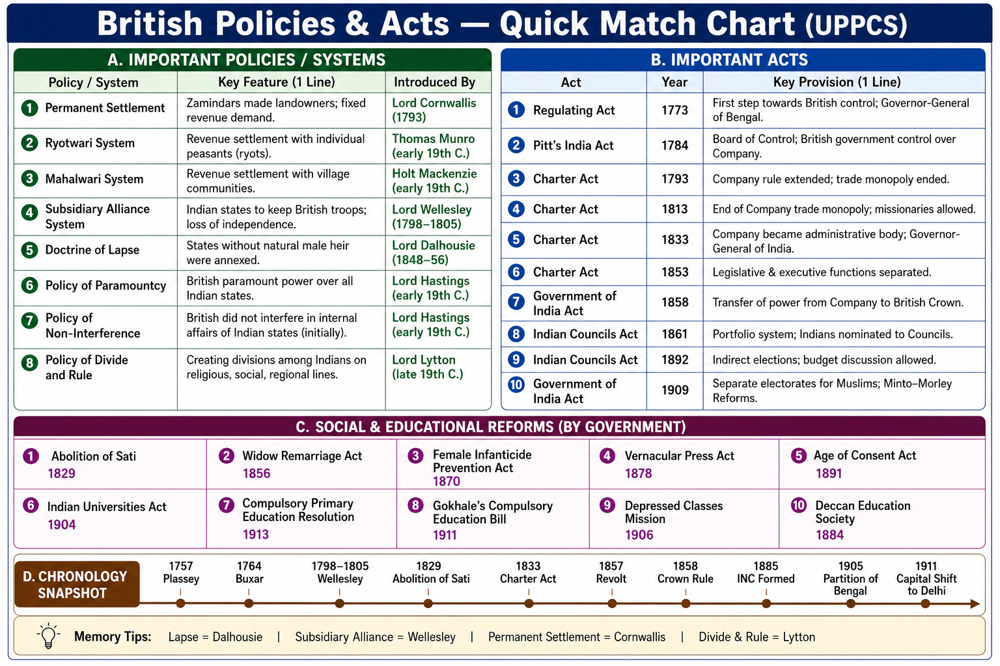

# Topic 4 — British Administration & Economy
### ★ Complete Source of Truth — No other book/notes needed for this topic

> **Covers syllabus:** Administrative System of British India | Local Administration | British Economic Policy | Impact of British Rule on Indian Economy | British Land Revenue Systems | Permanent Settlement | Ryotwari System | Mahalwari System | Drain of Wealth Theory | Commercialization of Agriculture | Deindustrialization | Railways | Telegraph | Postal System  
> **Sources baked in:** NCERT *Themes in Indian History Part III*, Bipan Chandra, R.C. Dutt, Dadabhai Naoroji, Spectrum *A Brief History of Modern India*, UPPCS Prelims PYQs 2018–2025  
> **Exam weight:** ★★★ High — land revenue comparison, Drain of Wealth, Cornwallis/Munro/Mackenzie matching, infrastructure chronology  
> **Last verified:** July 2026

---

## Quick Revision Box — Raata This First

```
3 LAND REVENUE SYSTEMS:
  Permanent Settlement (1793) — Bengal/Bihar/Orissa — Cornwallis — zamindar as proprietor
  Ryotwari — Madras/Bombay — Munro & Read — direct settlement with ryot (cultivator)
  Mahalwari — NW Provinces/Punjab — Holt Mackenzie — village/mahal as unit

2020 Q30 A&R:
  A: British introduced different land revenue systems in different parts
  R: It created different classes in Indian peasantry
  Ans = A (Both true; R is correct explanation)

2025 Q40: Cornwallis = Permanent Settlement (code D, 4-3-2-1)
2021 Q139: Poverty and Un-British Rule in India published = 1901

DRAIN OF WEALTH:
  Dadabhai Naoroji — Poverty and Un-British Rule in India (1901)
  R.C. Dutt — Economic History of India
  Components: Home Charges, salaries/pensions, interest, unrequited exports

INFRASTRUCTURE:
  Railways: 1853 Bombay–Thane (first) | Dalhousie network expansion
  Telegraph: 1851 Calcutta experimental line | O'Shaughnessy
  Postal: 1774 Calcutta GPO (Hastings) | 1854 uniform penny postage (Dalhousie)

LOCAL ADMIN:
  Ripon 1882 = "Father of local self-government in India"
  Mayo 1870 — local boards | Madras Municipal Corp 1688 (oldest)

TRAPS:
  Permanent Settlement ≠ Ryotwari (region + collector type differ)
  Munro = Ryotwari (NOT Permanent Settlement)
  Mackenzie = Mahalwari (NOT Ryotwari)
  Drain book year = 1901 (NOT 1900)
  First railway 1853 (NOT 1857)
```

### Must-Know Term Comparisons (very frequently asked)

| Term | One-line difference | Hindi |
|------|---------------------|-------|
| **Permanent Settlement vs Ryotwari** | **1793** Bengal — zamindar proprietor; Ryotwari — direct settlement with **cultivator (ryot)** in Madras/Bombay | स्थायी बंदोबस्त / रैयतवारी |
| **Ryotwari vs Mahalwari** | Ryotwari = individual cultivator unit; Mahalwari = **village/mahal** community unit in NW Provinces/Punjab | रैयतवारी / महलवारी |
| **Cornwallis vs Munro** | Cornwallis = **Permanent Settlement 1793**; Munro = **Ryotwari** in Madras Presidency | कॉर्नवालिस / मुनरो |
| **Munro vs Mackenzie** | Munro = Ryotwari; Holt **Mackenzie** = **Mahalwari** report (**1822**) | मुनरो / मैकेंज़ी |
| **Drain of Wealth vs Deindustrialization** | Drain = transfer of Indian wealth to Britain; Deindustrialization = decline of Indian **handicraft/manufacturing** | धन निष्कासन / विनिर्माण पतन |
| **Commercialization vs Permanent Settlement** | Commercialization = shift to **cash crops**; Permanent Settlement = **land revenue** system fixing zamindar rights | वाणिज्यीकरण / स्थायी बंदोबस्त |
| **Ripon vs Mayo (local admin)** | Ripon **1882** Resolution = local self-government; Mayo **1870** = financial decentralisation and local boards | रिपन / मेयो |
| **Dalhousie railways vs Hastings post** | Dalhousie = **1853** railway expansion; Hastings = early **1774** post office at Calcutta | डलहौज़ी / हेस्टिंग्स |

### Memory Tricks

| Trick | Remembers |
|-------|-----------|
| **P-R-M regions** | **P**ermanent = **B**engal; **R**yotwari = **M**adras; **M**ahalwari = **N**W Provinces |
| **1793 Cornwallis** | **2025 Q40** — Cornwallis = Permanent Settlement |
| **1901 Naoroji** | **2021 Q139** — Poverty and Un-British Rule |
| **1853 Rail** | First train same decade as last Charter Act before Mutiny |
| **Ripon = Rights local** | Local self-government + Ilbert (Topic 3 link) |
| **Munro Madras** | **M**unro — **M**adras Ryotwari |
| **Mackenzie Mahal** | **M**ackenzie — **M**ahalwari |

---


## 4.1 Administrative System of British India

### Definitions

| Term | Meaning |
|------|---------|
| **Collector** | District officer combining **revenue collection**, magisterial power, and civil administration — cornerstone of British district rule |
| **Board of Revenue** | Superior revenue authority supervising collectors in a presidency or province |
| **Covenanted Civil Service** | Senior British/Company civil servants appointed under Company/Crown charter — later ICS |
| **District Magistrate** | Collector acting as chief criminal and civil authority in a district |
| **Regulation Province** | Territories under direct British law and administration, as opposed to princely states |

### Causes — Why British Administrative Structure Took Shape

1. After **Diwani (1765)**, the Company needed a machinery to collect land revenue and maintain order across vast territories.
2. **Dual Government (1765–72)** failed because revenue and nawabi administration were split, causing famine and corruption.
3. **Warren Hastings** ended Dual Government and began centralising district administration under Company officers.
4. **Lord Cornwallis** wanted a stable, law-bound bureaucracy free from the corruption of early Company servants.
5. Expansion across presidencies required uniform district institutions that could be controlled from Calcutta, Madras, or Bombay.

### Evolution — Step by Step

1. **1765:** Company received **Diwani** of Bengal, Bihar, and Orissa but initially ruled through the Nawab in a Dual Government system.
2. **1772:** **Warren Hastings** abolished Dual Government and placed revenue and civil administration directly under Company officers.
3. **1773:** The **Regulating Act** created the Governor-General and Supreme Council, beginning parliamentary supervision of Company government.
4. **1786–93:** **Lord Cornwallis** separated the judiciary from the executive, created the **Collector** as district head, and introduced the Permanent Settlement.
5. **1833:** The Charter Act made the Governor-General of Bengal the **Governor-General of India**, reflecting all-India administrative authority.
6. **1853:** Open competition for the civil service was introduced, laying the foundation of the later **Indian Civil Service**.
7. **1858:** Crown rule replaced Company rule; the Viceroy and **Secretary of State for India** became the apex of administration.
8. **1861 onward:** Portfolio system, expanded councils, and later dyarchy added layers but the **district collector system** remained the base.

### Administrative System — How It Works

- British administration in India was built from the **district upward**, with the **Collector** as the most important local officer.
- The Collector combined **revenue, magisterial, and executive functions**, giving the British remarkable control at the grassroots level.
- **Warren Hastings** ended the Dual Government because splitting revenue from civil power had produced the **Bengal Famine of 1770** and massive corruption.
- **Cornwallis** is called the father of the modern Indian administrative system because he created a professional bureaucracy and separated executive from judiciary.
- The **Permanent Settlement (1793)** was part of this administrative design because it fixed land rights and made revenue collection predictable.
- Three presidencies — **Bengal, Madras, and Bombay** — each had Governors and Councils, but after **1833** the Governor-General of India coordinated all-India policy.
- The **Indian Civil Service** became the steel frame of British rule; recruitment through open competition after **1853** made it a merit-based elite service.
- After **1858**, Indian affairs were controlled from London by the **Secretary of State for India** and the India Council, while the **Viceroy** ruled in India.
- Provincial administration expanded under later Acts, but real power remained with British officials until the reforms of the twentieth century.
- Trap: "The Collector was only a revenue officer." He was also **District Magistrate** and chief civil administrator.
- Trap: "Dual Government continued under Cornwallis." Hastings ended it in **1772**.

> **Exam note:** British admin = **Collector + Board of Revenue + ICS + Viceroy/Secretary of State chain**. Pair Cornwallis with **Permanent Settlement** and judicial reform.

### Results of British Administrative Centralization

| Result | Why it matters |
|--------|----------------|
| Collector system | Stable district-level British control |
| End of Dual Government **1772** | Direct Company rule in Bengal |
| Cornwallis reforms **1793** | Professional bureaucracy + Permanent Settlement |
| ICS after **1853** | Merit-based civil service elite |
| Crown rule **1858** | Viceroy + Secretary of State hierarchy |

### Key Persons — Administrative System

| Person | Role |
|--------|------|
| **Warren Hastings** | Ended Dual Government **1772**; began central revenue administration |
| **Lord Cornwallis** | Collector system; judicial separation; Permanent Settlement |
| **Lord William Bentinck** | Administrative rationalisation; later extended Mahalwari |
| **Lord Dalhousie** | Railways, telegraph, post — infrastructure administration |
| **Lord Ripon** | Local self-government Resolution **1882** |

### Exam Facts (raata)

- Dual Government ended: **1772** (Hastings)
- Collector as district head: **Cornwallis era**
- GG of India title: **1833**
- Open competition civil service: **1853**
- Crown rule begins: **1858**
- Cornwallis = Permanent Settlement **1793**

### PYQs — Administrative System

1. **(UPPCS Prelims 2025, Q40)** Lord Cornwallis = **Permanent Settlement of Bengal** — answer code **D (4,3,2,1)**.

2. **(UPSC pattern)** Dual Government in Bengal ended by → **Warren Hastings (1772)**.

### Examples (4.1)

| Example | What it teaches |
|---------|-----------------|
| **Collector, Midnapore** | District as unit of British rule |
| **Board of Revenue, Calcutta** | Supervisory revenue authority |
| **ICS recruitment 1855 onward** | Merit-based bureaucracy |

---

## 4.2 Local Administration

### Definitions

| Term | Meaning |
|------|---------|
| **Local Self-Government** | Elected or nominated local bodies managing municipal and rural affairs under British supervision |
| **Municipal Corporation** | Urban local body for towns — taxes, sanitation, roads, markets |
| **District Board / Local Board** | Rural or district-level body for local public works and services |
| **Ripon Resolution (1882)** | Viceroy Ripon's policy encouraging local bodies with elected Indian members |
| **Decentralisation** | Transfer of some financial and administrative functions from central to local bodies |

### Causes — Why Local Bodies Were Introduced

1. Growing towns like **Calcutta, Bombay, and Madras** needed sanitation, policing, and market regulation beyond village custom.
2. British officials believed limited local participation could reduce the cost of administration to the imperial treasury.
3. Indian educated elites demanded a share in municipal affairs as part of wider political aspiration.
4. Financial strain after the **1857 Revolt** encouraged decentralisation of some expenditure to local bodies.
5. Lord Ripon believed local self-government was the best school for training Indians in responsible politics.

### Course — Step by Step

1. **1688:** The **Madras Municipal Corporation** was established — the oldest municipal body in India.
2. **1726:** The **Bombay Municipal Corporation** was set up under later reforms.
3. **1774:** Warren Hastings created an early **postal and municipal framework** in Calcutta, linking communication with urban administration.
4. **1870:** **Lord Mayo** introduced financial decentralisation and encouraged **local boards** for public works.
5. **1882:** **Lord Ripon** passed the famous Resolution on local self-government, expanding elected Indian membership.
6. **1907:** The **Royal Commission on Decentralisation** reviewed local government and recommended stronger rural institutions.
7. **1919 and 1935 Acts:** Provincial autonomy gradually increased Indian control over local administration in regulation provinces.

### Local Administration — How It Works

- British local administration operated at two levels: **urban municipal bodies** and **rural district/local boards**.
- The **Madras Municipal Corporation (1688)** is the oldest in India and is frequently tested as a chronology fact.
- Early municipal bodies were dominated by British merchants and officials, with very limited Indian participation.
- **Lord Mayo (1870)** is associated with **financial decentralisation**, under which certain revenues were assigned to local bodies for roads and education.
- **Lord Ripon (1882)** is called the **father of local self-government in India** because his Resolution encouraged elected local boards and municipalities.
- Ripon's policy allowed Indians to gain experience in administration, but real power remained with British officials and nominated members.
- Rural areas were served by **district boards** and later **union boards**, while cities had **municipal committees or corporations**.
- Local bodies could levy some taxes, but their finances were weak and they depended heavily on provincial grants.
- Post-Independence **73rd and 74th Amendments** belong to Polity, but Ripon is the colonial starting point UPPCS expects.
- Trap: "Ripon created the first municipal corporation." The oldest is **Madras 1688**, not Ripon.
- Trap: "Mayo Resolution 1882 introduced local self-government." That was **Ripon**; Mayo's key contribution was **1870 decentralisation**.

> **Exam note:** Ripon = **1882 local self-government**. Mayo = **1870 decentralisation**. Madras = **oldest municipal corporation (1688)**.

### Results of Local Self-Government Policy

| Result | Why it matters |
|--------|----------------|
| Ripon Resolution **1882** | Elected Indians in municipalities and boards |
| Mayo decentralisation **1870** | Local funding for local works |
| Urban municipal growth | Sanitation, roads, markets under local bodies |
| Political training ground | Indians learned council politics before provincial legislatures |

### Key Persons — Local Administration

| Person | Role |
|--------|------|
| **Lord Ripon** | Local self-government Resolution **1882** |
| **Lord Mayo** | Financial decentralisation **1870** |
| **Warren Hastings** | Early Calcutta municipal/postal framework |
| **Lord Curzon** | Later municipal reform pressure in cities |

### Exam Facts (raata)

- Oldest municipal corporation: **Madras 1688**
- Bombay corporation: **1726**
- Mayo decentralisation: **1870**
- Ripon Resolution: **1882**
- Father of local self-government: **Ripon**

### PYQs — Local Administration

1. **(UPPCS Prelims 2021, Q145)** Oldest municipal corporation in India → **Madras (1688)**.

2. **(UPSC pattern)** Father of local self-government in India → **Lord Ripon**.

3. **(UPSC pattern)** Ripon Resolution on local self-government → **1882**.

### Examples (4.2)

| Example | What it teaches |
|---------|-----------------|
| **Madras Corporation 1688** | Oldest urban body |
| **Ripon Resolution 1882** | Elected local government |
| **Lucknow Municipal Board** | UP urban local body under colonial system |

---

## 4.3 British Economic Policy — Overview

### Definitions

| Term | Meaning |
|------|---------|
| **Colonial Economic Policy** | British policy turning India into a supplier of raw materials and a market for British manufactures |
| **Free Trade Imperialism** | One-way openness favouring British goods while Indian industry faced competition without protection |
| **Home Charges** | Expenditure charged to Indian revenues for British institutions, pensions, and debt servicing in England |
| **Tribute** | Transfer of wealth from colony to metropole without equivalent return — central to Drain theory |

### Causes — Why Britain Structured the Indian Economy This Way

1. The **Industrial Revolution** in Britain required cheap raw materials and large markets for factory goods.
2. After acquiring **Diwani**, the Company used Indian land revenue to fund trade and administration rather than Indian development.
3. British manufacturers lobbied for policies that destroyed Indian handicraft competition.
4. Railways, telegraph, and ports were built partly to move troops and goods for imperial control.
5. Indian finance was used to pay for wars, civil administration, and remittances to Britain.

### British Economic Policy — How It Works

- British economic policy turned India from a major handicraft exporter into a **dependent colonial economy**.
- India exported **raw cotton, indigo, jute, opium, tea, and wheat**, while importing **British textiles, machinery, and capital goods**.
- Land revenue systems were designed primarily to secure a **fixed, maximum cash surplus** for the state, not to protect the cultivator.
- **Home Charges** included salaries and pensions of British officials, interest on Indian debt, and expenses of the India Office in London.
- British tariff policy often **protected Manchester textiles** while Indian weavers faced ruin from machine-made imports.
- Infrastructure such as **railways, telegraph, and post** served imperial communication and trade, though they also had developmental side effects.
- Famines became more devastating when cash crops replaced food crops and revenue demand remained rigid.
- Nationalist economists argued that India was not poor by nature but drained of wealth by colonial rule.
- Trap: "British railways were built only for Indian welfare." Primary motives included **troops, trade, and famine logistics** for the empire.
- Trap: "Free trade benefited India equally." It favoured **British industrial exports** over Indian manufactures.

> **Exam note:** British economic policy = **raw material supplier + market for British goods + land revenue extraction + Home Charges**.

### Results of Colonial Economic Policy

| Result | Why it matters |
|--------|----------------|
| Commercial crop expansion | Peasant dependence on market and moneylenders |
| Handicraft decline | Deindustrialization of towns |
| Recurring famines | Food crop displacement + rigid revenue |
| Nationalist critique | Drain of Wealth and economic nationalism |

### Exam Facts (raata)

- India as supplier of raw materials + buyer of British goods
- Home Charges paid from Indian revenue
- Land revenue = main colonial income source
- Policy linked to Industrial Revolution in Britain

### PYQs — British Economic Policy

1. **(UPPCS Prelims 2020, Q30)** Assertion: British introduced different land revenue systems in different parts of India. Reason: It created different classes in Indian peasantry. → **A — Both true; R is correct explanation**.

2. **(UPSC pattern)** Colonial India mainly exported → **Raw materials**; imported → **British manufactures**.

### Examples (4.3)

| Example | What it teaches |
|---------|-----------------|
| **Manchester cloth in Bengal** | British imports undercut handloom |
| **Opium trade to China** | Cash crop colonialism |
| **Home Charges** | Indian revenue spent in Britain |

---


## 4.4 British Land Revenue Systems — Master Overview

### Definitions

| Term | Meaning |
|------|---------|
| **Land Revenue** | Tax on land/agricultural produce — main source of colonial state income |
| **Zamindar** | Intermediary landlord under Permanent Settlement — recognized as proprietor of land |
| **Ryot** | Cultivator/farmer — direct payer under Ryotwari |
| **Mahal** | Village or estate unit treated as one body for revenue under Mahalwari |
| **Sunset Law** | Rule under Permanent Settlement that zamindar's land could be sold if revenue was not paid |

### Master Comparison Table — All Three Systems

| Feature | Permanent Settlement | Ryotwari | Mahalwari |
|---------|---------------------|----------|-----------|
| **Year / phase** | **1793** | **1820s** onward | **1822** report; extended later |
| **Region** | Bengal, Bihar, Orissa | Madras, Bombay, parts of Assam | NW Provinces, Punjab, parts of Central India |
| **Architect** | **Lord Cornwallis** | **Thomas Munro**, **Alexander Read** | **Holt Mackenzie** |
| **Revenue payer** | Zamindar | Ryot (cultivator) directly | Village/mahal community |
| **Land rights** | Zamindar as permanent proprietor | Ryot as occupant; state owns land | Collective village responsibility |
| **Revision of assessment** | **Permanent / fixed** | Periodic revision (20–30 years) | Periodic revision (20–30 years) |
| **Peasant class effect** | Zamindar vs tenant peasant | Direct state–cultivator relation | Village head/lambardar as intermediary |

### Land Revenue Systems — How It Works

- The British introduced **different land revenue systems in different regions** because each presidency had different pre-colonial land customs and political needs.
- **UPPCS 2020 Q30** directly tests this: Assertion and Reason are both true, and the Reason correctly explains the Assertion.
- **Permanent Settlement** was applied where the Company wanted a fixed zamindar class loyal to British rule in eastern India.
- **Ryotwari** was used where village zamindars were weak and the state could settle directly with cultivators in the south and west.
- **Mahalwari** combined elements of both by making the **village community** responsible for paying revenue.
- These systems created **different peasant classes**: zamindar-tenant relations in Bengal, direct cultivating ryots in Madras, and village collectives in the north.
- All three systems aimed to maximise revenue stability for the colonial state, not peasant welfare.
- Periodic famine and indebtedness were common because revenue demand was often high and inflexible.
- Students must memorise the **region + architect + payer** triangle for every exam match question.
- Trap: "All of India had Permanent Settlement." Only **eastern India**; south had Ryotwari; north had Mahalwari.
- Trap: "Munro introduced Permanent Settlement." Munro = **Ryotwari**; Cornwallis = **Permanent Settlement**.

> **Exam note:** **2020 Q30 = A**. Different systems → different peasant classes. Match **Cornwallis–Bengal**, **Munro–Ryotwari**, **Mackenzie–Mahalwari**.

### Exam Facts (raata)

- Three systems: Permanent, Ryotwari, Mahalwari
- 2020 Q30 answer: **A**
- Bengal = Permanent Settlement
- Madras = Ryotwari
- NW Provinces/UP region = Mahalwari

### PYQs — Land Revenue Overview

1. **(UPPCS Prelims 2020, Q30)** Different land revenue systems in different parts → created different peasant classes → **A (Both true; R correct explanation)**.

2. **(UPPCS Prelims 2025, Q40)** Cornwallis = Permanent Settlement.

### Examples (4.4)

| Example | What it teaches |
|---------|-----------------|
| **Bengal zamindar** | Permanent Settlement intermediary |
| **Madras ryot** | Direct cultivator settlement |
| **UP village mahal** | Collective revenue unit |

---

## 4.5 Permanent Settlement (1793)

### Definitions

| Term | Meaning |
|------|---------|
| **Permanent Settlement (1793)** | Cornwallis' land revenue system declaring **zamindars** permanent proprietors of land in Bengal Presidency |
| **Patta** | Document recording land rights and revenue obligation |
| **Sunset Law** | Provision allowing sale of zamindar's land for default in revenue payment |
| **Decennial Settlement** | Earlier temporary ten-year settlements before permanence was declared |

### Causes

1. The Company needed a **fixed and assured revenue** from Bengal after decades of corruption and fluctuating collections.
2. Cornwallis wanted to create a loyal **landed class (zamindars)** that would support British rule.
3. Permanent fixity was believed to encourage zamindars to invest in land improvement because their rights would not be resumed.
4. Early experiments with farmers and temporary settlements had failed to produce stable collections.
5. British officials thought a European-style landlord class would make administration easier.

### Course — Step by Step

1. **1773–93:** Company experimented with revenue farming and temporary settlements in Bengal.
2. **1790:** Cornwallis considered making settlement permanent with zamindars.
3. **10 March 1793:** The **Permanent Settlement** was declared in Bengal, Bihar, and Orissa.
4. Zamindars were recognized as **proprietors of the soil** and were required to pay a **fixed annual revenue** to the Company.
5. If zamindars failed to pay, their estates could be sold under the **Sunset Law**.
6. Actual cultivators (ryots) were reduced to **tenants** under zamindars without secure rights.
7. Revenue was fixed permanently, so the state could not gain from future agricultural improvement.
8. The system created absentee landlordism and peasant exploitation in eastern India.

### Permanent Settlement — How It Works

- Under the **Permanent Settlement of 1793**, **Lord Cornwallis** made the **zamindar** the owner of land and the payer of revenue to the state.
- The revenue demand on zamindars was fixed **permanently**, giving the Company a predictable income from Bengal.
- Cultivators lost direct relations with the state and became **tenants** at the mercy of zamindars.
- Zamindars who collected more than the fixed revenue from peasants kept the surplus as rent and profit.
- The **Sunset Law** allowed auction of zamindari estates for arrears, which sometimes transferred land to urban moneyed classes.
- Cornwallis hoped zamindars would become improving landlords, but many became **absentee rent collectors**.
- The system is central to **UPPCS 2025 Q40**, where Cornwallis is matched with Permanent Settlement.
- Permanent Settlement applied mainly to **Bengal, Bihar, and Orissa**, not to all of India.
- Trap: "Permanent Settlement was introduced by Wellesley." It was **Cornwallis in 1793**.
- Trap: "Under Permanent Settlement, cultivators owned the land." **Zamindars** were declared proprietors.

> **Exam note:** **Cornwallis + 1793 + Bengal + zamindar proprietor**. **2025 Q40** code **D**.

### Results of Permanent Settlement

| Result | Why it matters |
|--------|----------------|
| Fixed state revenue | Predictable income for Company |
| Zamindar landlord class | Loyal intermediary created |
| Peasant insecurity | Cultivators became tenants without rights |
| Absentee landlordism | Rural exploitation and underinvestment |
| No state gain from growth | Revenue could not rise with production |

### Key Persons — Permanent Settlement

| Person | Role |
|--------|------|
| **Lord Cornwallis** | Introduced Permanent Settlement **1793** |
| **Philip Francis** | Early critic of zamindar-based settlement |
| **Zamindars of Bengal** | Recognized as proprietors |
| **Cultivating ryots** | Reduced to tenants |

### Exam Facts (raata)

- Year: **1793**
- Viceroy/GG: **Lord Cornwallis**
- Region: **Bengal, Bihar, Orissa**
- Proprietor: **Zamindar**
- 2025 Q40: Cornwallis = Permanent Settlement

### PYQs — Permanent Settlement

1. **(UPPCS Prelims 2025, Q40)** Lord Cornwallis = **Permanent Settlement of Bengal**.

2. **(UPSC pattern)** Permanent Settlement introduced in → **1793**.

### Examples (4.5)

| Example | What it teaches |
|---------|-----------------|
| **1793 Bengal** | Cornwallis settlement year |
| **Sunset Law** | Sale of defaulting zamindari |
| **Absentee zamindar in Calcutta** | Social effect of settlement |

---

## 4.6 Ryotwari System

### Definitions

| Term | Meaning |
|------|---------|
| **Ryotwari System** | Land revenue system of **direct settlement** between government and the **cultivator (ryot)** |
| **Thomas Munro** | Governor of Madras who implemented Ryotwari widely |
| **Alexander Read** | Early experimenter with Ryotwari in Baramahal |
| **Ryot** | Cultivating peasant who holds land as occupant and pays revenue directly |

### Causes

1. In Madras and Bombay presidencies, powerful zamindars like those in Bengal did not dominate the countryside.
2. The Company wanted to avoid creating another hereditary zamindar class that could resist the state.
3. Direct settlement promised the state full revenue without sharing surplus with intermediaries.
4. Periodic revision allowed the government to increase demand as cultivation expanded.
5. Munro believed peasants would cultivate better if they dealt directly with the state.

### Course — Step by Step

1. **1792–1800:** Early revenue experiments in the **Baramahal** region under **Alexander Read**.
2. **1820s:** **Thomas Munro**, as Governor of Madras, extended the Ryotwari system across much of the presidency.
3. The government surveyed land and assessed revenue on each cultivator's holding.
4. The **ryot** was recognized as occupant of land, while the **state retained ultimate ownership**.
5. Revenue was revised periodically, usually every **20 to 30 years**, not fixed permanently.
6. The system spread to **Bombay Presidency** and parts of **Assam**.
7. Ryots bore the full burden of revenue demand without a protective intermediary.
8. Moneylender dependence grew because revenue had to be paid in cash.

### Ryotwari — How It Works

- The **Ryotwari system** established a **direct relationship** between the colonial state and the **cultivating peasant**.
- **Thomas Munro** is the name most associated with Ryotwari, especially in the **Madras Presidency**.
- **Alexander Read** conducted early Ryotwari trials in the **Baramahal** before Munro expanded the system.
- Under Ryotwari, the peasant was not full owner but **occupant** paying revenue assessed on his field.
- Because there was **no permanent fixity**, the state could raise revenue at revision, often squeezing the cultivator.
- Ryotwari areas saw heavy cash demand, which pushed peasants toward **commercial crops and moneylenders**.
- This system created a class of **direct tax-paying cultivators** rather than zamindar-tenant relations.
- Ryotwari was applied where zamindari was weak, especially in **south and west India**.
- Trap: "Ryotwari made peasants full owners." The **state retained land ownership**; ryot was occupant.
- Trap: "Ryotwari was introduced by Cornwallis." Cornwallis = **Permanent Settlement**; Munro = **Ryotwari**.

> **Exam note:** **Munro + Madras + direct ryot settlement + periodic revision**.

### Results of Ryotwari

| Result | Why it matters |
|--------|----------------|
| No zamindar intermediary | State dealt directly with cultivator |
| Periodic revenue revision | Government could raise demand |
| Cash burden on ryot | Indebtedness and commercial cropping |
| Widespread in south/west | Different peasant structure from Bengal |

### Key Persons — Ryotwari

| Person | Role |
|--------|------|
| **Thomas Munro** | Main architect of Ryotwari in Madras |
| **Alexander Read** | Early Ryotwari in Baramahal |
| **Elphinstone** | Supported Ryotwari ideas in Bombay |
| **Cultivating ryots** | Direct revenue payers |

### Exam Facts (raata)

- Architect: **Thomas Munro**
- Region: **Madras, Bombay, Assam**
- Payer: **Ryot (cultivator)**
- Revision: **Periodic (20–30 years)**
- Not permanent like Bengal Settlement

### PYQs — Ryotwari

1. **(UPPCS Prelims 2020, Q30)** Different systems created different peasant classes — Ryotwari created direct cultivating ryots.

2. **(UPSC pattern)** Ryotwari system associated with → **Thomas Munro**.

### Examples (4.6)

| Example | What it teaches |
|---------|-----------------|
| **Baramahal experiment** | Read's early Ryotwari |
| **Madras Presidency** | Munro's expansion |
| **Ryot and moneylender** | Cash revenue pressure |

---

## 4.7 Mahalwari System

### Definitions

| Term | Meaning |
|------|---------|
| **Mahalwari System** | Revenue system assessing land at the **village or mahal** level, with collective responsibility |
| **Holt Mackenzie** | Author of the **1822 report** that shaped Mahalwari in the North-Western Provinces |
| **Lambardar** | Village headman often responsible for collecting and paying revenue |
| **Mahal** | Revenue unit of one or more villages treated together |

### Causes

1. In the **North-Western Provinces** and Punjab, village communities had stronger collective land customs.
2. The British wanted a system between Bengal's zamindari and Madras' individual ryotwari.
3. Village-based assessment simplified surveying in areas with joint cultivation and communal rights.
4. Periodic revision allowed revenue to rise with expansion of cultivation on the frontier.
5. **William Bentinck** later extended and modified Mahalwari in the north.

### Course — Step by Step

1. **1822:** **Holt Mackenzie** prepared his report recommending village-based settlement in the NW Provinces.
2. The **mahal** or village estate was treated as the unit of revenue assessment.
3. The **lambardar** or village head often collected revenue from cultivators and paid the state.
4. Revenue was revised every **20 to 30 years**, not permanently fixed.
5. **Lord William Bentinck** extended Mahalwari principles in the **North-Western Provinces** and Punjab.
6. Parts of **Central India** also came under Mahalwari or modified village settlements.
7. Cultivators within the mahal shared collective responsibility for payment.
8. The system applied to much of the region that later formed **Uttar Pradesh**, making it UP-relevant.

### Mahalwari — How It Works

- The **Mahalwari system** treated the **village community** as the primary unit for land revenue assessment.
- **Holt Mackenzie** is the key name for this system because of his **1822 report** on NW Provinces settlement.
- Unlike Permanent Settlement, Mahalwari allowed **periodic revision** of revenue demand.
- Unlike pure Ryotwari, it used **collective village responsibility** rather than only individual field assessment.
- The **lambardar** acted as an intermediary between cultivators and the British collector.
- This system was important in **UP's colonial predecessor region**, the **North-Western Provinces**.
- Mahalwari created a different rural hierarchy from Bengal's zamindars or Madras' individual ryots.
- Trap: "Mahalwari was introduced by Munro." Munro = **Ryotwari**; Mackenzie = **Mahalwari**.
- Trap: "Mahalwari was permanent like Cornwallis' settlement." It involved **periodic revision**.

> **Exam note:** **Mackenzie + NW Provinces/UP region + village mahal unit + lambardar**.

### Results of Mahalwari

| Result | Why it matters |
|--------|----------------|
| Village-based assessment | Suited communal land customs |
| Periodic revision | State could increase revenue |
| Lambardar intermediary | New rural power within village |
| Applied in north India | UP-relevant colonial revenue system |

### Key Persons — Mahalwari

| Person | Role |
|--------|------|
| **Holt Mackenzie** | 1822 report; architect of Mahalwari |
| **Lord William Bentinck** | Extended Mahalwari in the north |
| **Lambardar** | Village revenue collector |
| **Village mahal** | Collective revenue unit |

### Exam Facts (raata)

- Report year: **1822**
- Architect: **Holt Mackenzie**
- Region: **NW Provinces, Punjab, parts of Central India**
- Unit: **Village/mahal**
- Revision: **Periodic**

### PYQs — Mahalwari

1. **(UPPCS Prelims 2020, Q30)** Different land revenue systems in different regions — Mahalwari in north created village-based peasant structure.

2. **(UPSC pattern)** Mahalwari system associated with → **Holt Mackenzie**.

### Examples (4.7)

| Example | What it teaches |
|---------|-----------------|
| **NW Provinces 1822** | Mackenzie report |
| **Lambardar in UP village** | Mahalwari intermediary |
| **Bentinck extension** | North India application |

---


## 4.8 Drain of Wealth Theory

### Definitions

| Term | Meaning |
|------|---------|
| **Drain of Wealth** | Transfer of economic resources from India to Britain **without equivalent return** |
| **Poverty and Un-British Rule in India (1901)** | Dadabhai Naoroji's classic exposition of the Drain theory |
| **The Rise and Growth of Economic Nationalism in India** | **Bipan Chandra** — modern scholarly study of colonial economic critique — **UPPCS 2019 Q97** |
| **Home Charges** | Indian revenues spent in Britain on pensions, debt interest, and India Office expenses |
| **Unrequited Exports** | Exports from India for which no matching goods or services were imported back |

### Causes — Why Nationalists Developed Drain Theory

1. Indian budgets showed large payments to Britain through **salaries, pensions, and Home Charges**.
2. British rule turned India into an exporter of raw materials without building Indian industrial capacity.
3. Revenues from Indian land tax funded British wars and administration beyond India's own needs.
4. Indian nationalists needed an economic explanation for mass poverty under a resource-rich country.
5. The **late nineteenth-century** fall in silver prices and export prices worsened India's terms of trade.

### Course — Step by Step

1. **Late 19th century:** Indian intellectuals began analysing colonial accounts to show one-way transfer of wealth.
2. **R.C. Dutt** wrote *The Economic History of India*, exposing exploitation through land revenue and trade.
3. **Dadabhai Naoroji** developed the Drain theory systematically in speeches and essays.
4. **1901:** Naoroji published **Poverty and Un-British Rule in India** — **UPPCS 2021 Q139**.
5. Drain components included **Home Charges, interest on debt, remittances, and civil/military salaries** paid in England.
6. Nationalists argued that if the Drain stopped, India could finance its own development.
7. British officials denied Drain or called it payment for services and security.
8. Drain theory became a core argument of the early nationalist economic critique.

### Drain of Wealth — How It Works

- The **Drain of Wealth theory** argued that Britain enriched itself by transferring Indian resources to the metropole without fair return.
- **Dadabhai Naoroji** is the most famous exponent; his book **Poverty and Un-British Rule in India** was published in **1901**.
- **UPPCS 2021 Q139** asks the publication year — the answer is **1901**, not 1900.
- **R.C. Dutt** also exposed colonial exploitation through land revenue and foreign trade in *The Economic History of India*.
- **Home Charges** were a major Drain item because they were paid from Indian revenues for expenditure in Britain.
- Salaries and pensions of British officials who retired to England represented another channel of wealth transfer.
- Interest on **public debt** raised in Britain for Indian projects still burdened Indian revenues.
- Nationalists distinguished Drain from normal international trade by stressing that India received no equivalent economic benefit.
- Drain theory underpinned early Congress economic demands and later swadeshi thinking.
- Trap: "Poverty and Un-British Rule was published in 1900." Correct year is **1901**.
- Trap: "Drain theory was developed by Gandhi." It was developed mainly by **Naoroji and R.C. Dutt**.

> **Exam note:** **Naoroji + 1901 + Poverty and Un-British Rule**. Drain = **Home Charges + pensions + interest + unrequited exports**.

### Results of Drain Theory

| Result | Why it matters |
|--------|----------------|
| Economic nationalism | Explained poverty politically |
| Congress critique | Strengthened anti-colonial argument |
| Focus on Home Charges | Budget analysis became weapon |
| 1901 book | Standard reference for exam |

### Key Persons — Drain Theory

| Person | Role |
|--------|------|
| **Dadabhai Naoroji** | Drain theory; *Poverty and Un-British Rule* **1901** |
| **Bipan Chandra** | *The Rise and Growth of Economic Nationalism in India* — **2019 Q97** |
| **R.C. Dutt** | *Economic History of India* |
| **M.G. Ranade** | Economic nationalism in western India |
| **G.V. Joshi** | Prarthana Samaj economist; Drain critique |

### Exam Facts (raata)

- Book: **Poverty and Un-British Rule in India**
- Author: **Dadabhai Naoroji**
- Year: **1901** — **2021 Q139**
- Also: **R.C. Dutt**
- Key item: **Home Charges**

### PYQs — Drain of Wealth

1. **(UPPCS Prelims 2021, Q139)** In which year was *Poverty and Un-British Rule in India* published? → **B — 1901 A.D.**

2. **(UPPCS Prelims 2019, Q97)** *The Rise and Growth of Economic Nationalism in India* was written by → **D — Bipin Chandra**.

3. **(UPSC pattern)** Drain of Wealth theory propounded by → **Dadabhai Naoroji**.

### Examples (4.8)

| Example | What it teaches |
|---------|-----------------|
| **1901 Naoroji book** | 2021 Q139 trap year |
| **Home Charges in budget** | Drain mechanism |
| **Civil servant pension in England** | Wealth leaving India |

---

## 4.9 Commercialization of Agriculture

### Definitions

| Term | Meaning |
|------|---------|
| **Commercialization of Agriculture** | Shift from subsistence food crops to **cash crops** grown for market and export |
| **Cash Crops** | Crops grown mainly for sale — cotton, indigo, jute, opium, tea, sugarcane |
| **Moneylender Dependence** | Peasant reliance on loans to pay revenue and cultivation costs |
| **Export Agriculture** | Farming oriented to British and world markets rather than local food needs |

### Causes

1. Colonial land revenue had to be paid in **cash**, forcing peasants into market production.
2. British demand for **raw materials** for factories increased incentives for cash cropping.
3. Indigo and opium plantations were promoted for export profits.
4. Railways and ports made it easier to move commercial crops to ports.
5. Peasants needed credit for seeds and revenue payment, tying them to moneylenders.

### Commercialization — How It Works

- **Commercialization of agriculture** means peasants began producing for the **market** rather than only for household consumption.
- British rule pushed cultivators to grow **indigo, cotton, jute, opium, tea, and sugarcane** for export and industry.
- Because land revenue was collected in cash, peasants had to sell produce even in bad harvest years.
- Moneylenders advanced loans at high interest, often taking land when peasants defaulted.
- Commercial crops sometimes displaced **food grains**, making famine more dangerous.
- The **Indigo Revolt (1859–60)** in Bengal was a direct reaction to forced indigo cultivation.
- In western India, cotton cultivation linked peasants to world market price swings.
- UP and Bihar peasants also shifted toward cash crops under Mahalwari and tenancy pressure.
- Trap: "Commercialization improved peasant prosperity." It often increased **risk, debt, and famine vulnerability**.
- Trap: "Commercialization began only after 1900." It intensified throughout the **nineteenth century** under colonial revenue pressure.

> **Exam note:** Commercialization = **cash revenue + cash crops + moneylender + export link**.

### Results of Commercialization

| Result | Why it matters |
|--------|----------------|
| Cash crop expansion | Market dependence of peasantry |
| Food grain reduction | Famine vulnerability |
| Peasant indebtedness | Moneylender control over land |
| Plantation unrest | Indigo Revolt and similar protests |

### Exam Facts (raata)

- Cash crops: indigo, cotton, jute, opium, tea
- Cash revenue demand from all three land systems
- Indigo Revolt: **1859–60**
- Linked to railways and export trade

### PYQs — Commercialization

1. **(UPPCS Prelims 2025, Q127)** Indigo Revolt **1859** appears in chronology with Awadh **1856** and Afghan War **1878**.

2. **(UPSC pattern)** Commercialization of Indian agriculture under British rule led to → **Greater peasant dependence on market and moneylenders**.

### Examples (4.9)

| Example | What it teaches |
|---------|-----------------|
| **Indigo in Bengal** | Forced commercial crop |
| **Cotton in Deccan** | Export agriculture |
| **Opium to China** | Colonial cash crop trade |

---

## 4.10 Deindustrialization

### Definitions

| Term | Meaning |
|------|---------|
| **Deindustrialization** | Decline of Indian **handicrafts and traditional manufacturing** under British rule |
| **Handloom Weavers** | Artisan class devastated by machine-made British textiles |
| **One-Way Free Trade** | Indian markets open to British goods without reciprocal industrial protection |
| **Dispossessed Artisans** | Weavers and craftsmen pushed into agriculture or casual labour |

### Causes

1. **Machine-made British textiles** were cheaper than Indian handloom cloth after the Industrial Revolution.
2. British tariff and trade policy destroyed Indian craft protection.
3. Indian rulers who once patronized artisans lost power after Company conquest.
4. Raw cotton was exported to Britain, reducing local manufacturing input.
5. Revenue pressure forced artisans into agriculture, overcrowding rural livelihoods.

### Deindustrialization — How It Works

- **Deindustrialization** refers to the ruin of India's traditional **textile, metal, and handicraft industries** under colonialism.
- Indian textiles had been famous worldwide before British industrial competition undercut them.
- **Manchester cloth** flooded Indian markets while Indian exports became mainly raw cotton rather than finished cloth.
- British officials sometimes noted the misery of weavers; **William Bentinck** reported that the bones of cotton weavers whitened the plains.
- Artisans lost court patronage when Indian rulers were displaced by the Company.
- Many weavers became agricultural labourers, increasing pressure on land.
- Nationalist historians treat deindustrialization as proof that British rule underdeveloped India.
- Some economic historians debate the scale, but UPPCS expects the **standard nationalist account**.
- Trap: "British rule modernized Indian industry in the 19th century." Traditional industry **declined** before later factory growth.
- Trap: "Deindustrialization and Drain are the same." Drain is **wealth transfer**; deindustrialization is **industrial decline**.

> **Exam note:** Pair deindustrialization with **Manchester imports + weaver distress + raw cotton exports**.

### Results of Deindustrialization

| Result | Why it matters |
|--------|----------------|
| Handloom decline | Mass artisan unemployment |
| Rural overcrowding | Artisans pushed to land |
| Import dependence | India bought British cloth |
| Nationalist critique | Evidence of colonial underdevelopment |

### Exam Facts (raata)

- Main sector hit: **textiles/handloom**
- British machine-made cloth imports
- Bentinck quote on weaver distress
- Linked to Drain and commercialization

### PYQs — Deindustrialization

1. **(UPSC pattern)** Decline of Indian handicraft industry in 19th century due to → **Competition from British manufactured goods**.

2. **(UPSC pattern)** Indian economy under British rule became → **Supplier of raw materials and importer of manufactures**.

### Examples (4.10)

| Example | What it teaches |
|---------|-----------------|
| **Dhaka muslin decline** | Famous craft ruined |
| **Manchester cloth in Bombay** | Import competition |
| **Weaver to farm labourer** | Social effect |

---

## 4.11 Railways

### Definitions

| Term | Meaning |
|------|---------|
| **First Railway in India** | **1853** line from **Bombay to Thane** — start of railway age |
| **Lord Dalhousie** | Viceroy who promoted railway, telegraph, and postal integration as part of imperial communication |
| **Guarantee System** | Early railways built by private companies with government guaranteed returns |
| **State Railway** | Lines built and owned directly by the colonial government |

### Causes

1. British needed rapid movement of **troops and supplies** across the subcontinent.
2. Commercial interests wanted cheap transport of **raw materials to ports** and imports inland.
3. Famines showed the need for faster grain movement, though relief was often inadequate.
4. Dalhousie's imperial vision linked communication systems into one administrative network.
5. Private British capital sought guaranteed profits from Indian railway investment.

### Course — Step by Step

1. **1853:** The first passenger railway line opened between **Bombay and Thane**.
2. **1850s:** Railway expansion began under the **guarantee system**, with state assured returns to investors.
3. **Lord Dalhousie** promoted railways as part of his communication reforms alongside telegraph and post.
4. Lines spread from the three presidencies toward the interior and princely state frontiers.
5. **1870s–1900s:** Network expanded to UP, Punjab, Bihar, and eastern coal/iron regions.
6. Railways helped export of cotton, coal, jute, and wheat to ports.
7. Indian passengers travelled in overcrowded lower classes while freight served imperial priorities.
8. By the early twentieth century, India had one of the larger railway networks in Asia.

### Railways — How It Works

- The **first railway line in India** ran from **Bombay to Thane in 1853**, during the closing phase of Company rule.
- **Lord Dalhousie** is the Viceroy most associated with railway expansion as part of his integrated communication policy.
- Early railways were financed largely through the **guarantee system**, which promised profits to British investors from Indian revenues.
- Railways served **military logistics**, **trade**, and **administration** before they served mass Indian mobility.
- They connected cotton, coal, and food grain regions to ports such as **Bombay, Calcutta, and Madras**.
- In **UP**, railway junctions like **Kanpur, Lucknow, and Allahabad** became major colonial commercial centres.
- Nationalists later used railways for political mobilization despite their colonial origin.
- Trap: "First railway in India was in 1857." It was **1853**.
- Trap: "Dalhousie built railways only for Indian development." Primary aim was **imperial control and trade**.

> **Exam note:** **1853 Bombay–Thane + Dalhousie + guarantee system**.

### Results of Railway Expansion

| Result | Why it matters |
|--------|----------------|
| Faster troop movement | Strengthened British control |
| Export of raw materials | Linked interior to ports |
| Urban commercial growth | Junction towns expanded |
| Later nationalist use | Congress mobilization on rail network |

### Exam Facts (raata)

- First line: **1853 Bombay–Thane**
- Key Viceroy: **Dalhousie**
- Guarantee system for early lines
- UP junctions: Kanpur, Lucknow, Allahabad

### PYQs — Railways

1. **(UPSC pattern)** First railway line in India → **1853 (Bombay to Thane)**.

2. **(UPSC pattern)** Railway expansion in British India most associated with → **Lord Dalhousie**.

### Examples (4.11)

| Example | What it teaches |
|---------|-----------------|
| **Bombay–Thane 1853** | First railway |
| **Kanpur junction** | UP commercial rail hub |
| **Guarantee system** | British investor profits |

---

## 4.12 Telegraph

### Definitions

| Term | Meaning |
|------|---------|
| **Telegraph** | Electric communication system transmitting messages over long distances almost instantly |
| **Dr William O'Shaughnessy** | Pioneer of telegraph experiments in India |
| **Dalhousie's Communication Reforms** | Integration of post, telegraph, and railways for imperial administration |

### Causes

1. British India was vast and required **instant communication** between Calcutta, provincial capitals, and military stations.
2. The **1857 Revolt** exposed the need for faster military messaging.
3. Commercial and news agencies wanted rapid transmission of prices and orders.
4. Telegraph technology had already proved useful in Britain and Europe.
5. Dalhousie wanted a unified communication network for the empire in India.

### Course — Step by Step

1. **1830s–40s:** Experiments with telegraph technology began in India under **O'Shaughnessy**.
2. **1851:** A telegraph line was opened experimentally from **Calcutta to Diamond Harbour**.
3. **1850s:** Dalhousie expanded telegraph lines linking major cities and military centres.
4. After **1857**, telegraph lines proved crucial for British coordination of suppression.
5. By the late nineteenth century, India had an extensive telegraph network.
6. Telegraph offices became standard in district towns.
7. The system served government, army, and business before mass public use.
8. Later, wireless and telephone reduced but did not immediately end telegraph importance.

### Telegraph — How It Works

- The **telegraph** allowed the colonial government to send messages across India in hours rather than weeks.
- **Dr William O'Shaughnessy** conducted early telegraph experiments and is the key technical name for India.
- **Lord Dalhousie** treated telegraph as part of a unified communication system with **railways and post**.
- During the **1857 Revolt**, telegraph lines helped British authorities coordinate troop movements rapidly.
- Telegraph improved administrative control but was not built primarily for Indian public benefit.
- Commercial firms used telegraph to track cotton and opium prices in port cities.
- Trap: "Telegraph came to India only in the 20th century." Experimental line from **1851**; expansion in **1850s**.
- Trap: "Telegraph was invented by Dalhousie." Dalhousie **expanded** it; O'Shaughnessy pioneered experiments.

> **Exam note:** **O'Shaughnessy + 1851 Calcutta line + Dalhousie expansion**.

### Results of Telegraph

| Result | Why it matters |
|--------|----------------|
| Instant imperial communication | Faster British coordination |
| Military advantage in 1857 | Troop movement messages |
| Commercial price transmission | Linked ports and markets |
| Part of Dalhousie's reforms | Integrated with rail and post |

### Exam Facts (raata)

- Pioneer: **O'Shaughnessy**
- Experimental line: **1851 Calcutta**
- Expanded by: **Dalhousie**
- Used heavily after **1857**

### PYQs — Telegraph

1. **(UPSC pattern)** Telegraph in India first successfully experimented in → **1851**.

2. **(UPSC pattern)** Dalhousie is associated with → **Railways, telegraph, and postal reforms**.

### Examples (4.12)

| Example | What it teaches |
|---------|-----------------|
| **Calcutta–Diamond Harbour 1851** | First line |
| **1857 military messages** | Strategic use |
| **Dalhousie integration** | Communication trio |

---

## 4.13 Postal System

### Definitions

| Term | Meaning |
|------|---------|
| **General Post Office (GPO)** | Central postal institution in a presidency capital |
| **Post Office Act 1854** | Legislation creating uniform postage and modern postal administration |
| **Penny Postage** | Uniform low postage introduced by Dalhousie in **1854** |
| **Post Office Savings Bank** | Savings facility through post offices from **1882** onward |

### Causes

1. Early British trade needed reliable communication between factories, ports, and administrative centres.
2. Existing messenger systems were slow and fragmented across presidencies.
3. Uniform postage reduced confusion of multiple private and official rates.
4. Dalhousie wanted cheap communication to bind the empire administratively.
5. Postal network could reach villages where telegraph did not.

### Course — Step by Step

1. **1774:** Warren Hastings established a **postal system** centred on Calcutta for Company communication.
2. **1837:** Post offices were gradually opened to the public, not only government use.
3. **1854:** The **Post Office Act** created a uniform postal system under Dalhousie.
4. **1854:** **Penny postage** made letters affordable and increased public use.
5. Post offices spread to district towns and many villages over the late nineteenth century.
6. **1882:** **Post Office Savings Bank** gave common people a savings facility.
7. Postal service supported newspapers, business, and nationalist communication.
8. Independent India retained and expanded the colonial postal backbone.

### Postal System — How It Works

- The modern postal system in India began with **Warren Hastings' reforms in 1774** at Calcutta.
- For decades the post served government and commerce before becoming a wider public service.
- **Lord Dalhousie** reformed the post through the **Post Office Act of 1854** and **uniform penny postage**.
- Cheap postage allowed merchants, newspapers, and political groups to communicate over long distances.
- The postal network reached deeper into rural India than telegraph, making it socially important.
- **Post Office Savings Bank (1882)** helped small savers and strengthened the system's public role.
- Railways carried mail bags, linking post with the wider communication revolution.
- Trap: "Dalhousie created the first post office in India." Hastings began the system in **1774**; Dalhousie **modernised** it in **1854**.
- Trap: "Penny postage began in 1774." **1854** under Dalhousie.

> **Exam note:** **Hastings 1774 (beginning) + Dalhousie 1854 (uniform penny postage)**.

### Results of Postal Reforms

| Result | Why it matters |
|--------|----------------|
| Uniform postage **1854** | Cheap mass communication |
| Rural post offices | State reached villages |
| Savings Bank **1882** | Small depositor access |
| Nationalist use | Newspapers and political mail |

### Exam Facts (raata)

- Hastings postal start: **1774**
- Post Office Act: **1854**
- Penny postage: **1854**
- Savings Bank: **1882**
- Dalhousie = postal reform

### PYQs — Postal System

1. **(UPSC pattern)** Uniform penny postage in India introduced in → **1854 (Dalhousie)**.

2. **(UPSC pattern)** Early postal development in India associated with → **Warren Hastings (1774)**.

### Examples (4.13)

| Example | What it teaches |
|---------|-----------------|
| **Calcutta GPO 1774** | Hastings origin |
| **Penny post 1854** | Dalhousie reform |
| **Village post office** | Rural reach |

---

## 4.14 Impact of British Rule on Indian Economy

### Definitions

| Term | Meaning |
|------|---------|
| **Colonial Underdevelopment** | Argument that British rule distorted Indian economy rather than modernizing it evenly |
| **Dual Economy** | Modern export sectors alongside distressed peasant and artisan masses |
| **Famines under Colonialism** | Repeated food crises worsened by policy, transport limits, and cash crop pressure |
| **Economic Nationalism** | Nationalist use of Drain, deindustrialization, and land revenue critique |

### Impact — How It Works

- British rule transformed India from a major manufacturing civilization into a **colonial supplier of raw materials**.
- Land revenue systems extracted a large surplus from agriculture and shaped rural class relations differently in each region.
- **Commercialization** tied peasants to markets and moneylenders, increasing famine and debt vulnerability.
- **Deindustrialization** destroyed handicrafts, especially textiles, while British machine goods captured the market.
- The **Drain of Wealth** transferred Indian resources to Britain through Home Charges, pensions, and debt payments.
- **Railways, telegraph, and post** modernized communication but primarily served imperial trade and administration.
- Famines such as **Bengal 1943** and earlier nineteenth-century famines showed the human cost of colonial economic priorities.
- Nationalist economists used these trends to argue that political freedom was necessary for economic regeneration.
- After Independence, India had to rebuild industry, agriculture, and infrastructure on a weak colonial foundation.
- Trap: "British rule fully modernized India by 1947." Modern sectors existed, but mass poverty and rural distress remained severe.
- Trap: "All infrastructure was harmful." Railways/post had mixed effects, but **primary colonial motive was control and extraction**.

> **Exam note:** Impact section = combine **land revenue + commercialization + deindustrialization + Drain + infrastructure**.

### Summary Table — Economic Impact

| Area | Colonial change | Main consequence |
|------|-----------------|-------------------|
| Agriculture | Revenue systems + cash crops | Peasant exploitation and famine risk |
| Industry | British imports | Handicraft decline |
| Finance | Home Charges, Drain | Wealth transfer to Britain |
| Transport | Railways, telegraph, post | Trade and military control |
| Society | New classes: zamindar, moneylender, labourer | Rural inequality |

### Exam Facts (raata)

- India = raw material supplier + British goods market
- Drain + deindustrialization = nationalist critique pillars
- Different land systems = different peasant classes (2020 Q30)
- Infrastructure had imperial primary purpose

### PYQs — Economic Impact

1. **(UPPCS Prelims 2020, Q30)** Different land revenue systems created different peasant classes — core impact on rural society.

2. **(UPPCS Prelims 2021, Q139)** Naoroji's book **1901** explained Drain impact on Indian poverty.

### Examples (4.14)

| Example | What it teaches |
|---------|-----------------|
| **Bengal famine cycles** | Colonial agricultural distress |
| **Manchester vs handloom** | Deindustrialization |
| **Home Charges in budget** | Drain mechanism |

---


## Consolidated Reference — Everything in One Place

### Important Dates

| Year | Event |
|------|-------|
| **1688** | Madras Municipal Corporation — oldest in India |
| **1772** | Hastings ends Dual Government |
| **1774** | Hastings postal system at Calcutta |
| **1793** | Permanent Settlement — Cornwallis |
| **1822** | Holt Mackenzie report — Mahalwari |
| **1853** | First railway Bombay–Thane; open competition civil service |
| **1854** | Post Office Act; penny postage — Dalhousie |
| **1870** | Mayo financial decentralisation |
| **1882** | Ripon Resolution on local self-government |
| **1901** | Naoroji — *Poverty and Un-British Rule in India* |

### Land Revenue — One-Page Comparison

| System | Year | Region | Architect | Unit | Fixed? |
|--------|------|--------|-----------|------|--------|
| Permanent Settlement | **1793** | Bengal, Bihar, Orissa | Cornwallis | Zamindar | **Yes** |
| Ryotwari | **1820s** | Madras, Bombay | Munro | Ryot | **No** (periodic) |
| Mahalwari | **1822+** | NW Provinces, Punjab | Mackenzie | Mahal/village | **No** (periodic) |

### Infrastructure Timeline

| Year | Development | Key name |
|------|-------------|----------|
| **1774** | Postal system begins | Hastings |
| **1851** | Telegraph experiment Calcutta | O'Shaughnessy |
| **1853** | First railway Bombay–Thane | Dalhousie era |
| **1854** | Penny postage + Post Office Act | Dalhousie |

### UP Focus — British Administration & Economy

| UP angle | Why it matters |
|----------|----------------|
| **Mahalwari in NW Provinces** | Colonial UP region used village-based revenue |
| **Kanpur, Lucknow, Allahabad railways** | Major junction towns under colonial network |
| **Peasant indebtedness in UP** | Cash revenue + commercial crops + moneylenders |
| **Indigo/tenant unrest links** | Eastern UP and neighbouring regions in wider peasant protests |
| **Post and telegraph in district towns** | Administrative reach into UP countryside |

### Drain Components — Complete List

| Component | Meaning |
|-----------|---------|
| **Home Charges** | Indian revenue for British India Office and related expenditure |
| **Salaries & pensions** | Payments to British officials in England |
| **Interest on debt** | Servicing loans raised in Britain for Indian projects |
| **Unrequited exports** | Exports without matching imports benefiting India |
| **Private remittances** | Merchant and official transfers abroad |

---

## Practice Zone — UPPCS Format Questions

> **How to use:** Answer each question, then click **Show answer** to check.

**Q1.** With reference to land revenue systems in British India:

1. Permanent Settlement recognized zamindars as proprietors of land.  
2. Ryotwari involved direct settlement with the cultivator.

Options: A. Only 1  B. Only 2  C. Both 1 and 2  D. Neither 1 nor 2

<details><summary>Show answer</summary>

**Ans: C** — Both statements are correct.

</details>

**Q2.** Assertion (A): The British Government introduced different land revenue systems in different parts of India.  
Reason (R): It led to the creation of different classes in Indian peasantry.

Options: A. Both true; R correct explanation  B. Both true; R not explanation  C. A true, R false  D. A false, R true

<details><summary>Show answer</summary>

**Ans: A** — **UPPCS 2020 Q30**.

</details>

**Q3.** Match List-I with List-II:

List-I: A. Cornwallis  B. Munro  C. Mackenzie  D. Naoroji  
List-II: 1. Drain theory  2. Mahalwari  3. Permanent Settlement  4. Ryotwari

Options: A. 3 4 2 1  B. 4 3 2 1  C. 3 2 4 1  D. 2 3 4 1

<details><summary>Show answer</summary>

**Ans: A** — Cornwallis=3, Munro=4, Mackenzie=2, Naoroji=1.

</details>

**Q4.** In which year was *Poverty and Un-British Rule in India* published?

Options: A. 1900  B. 1901  C. 1902  D. 1903

<details><summary>Show answer</summary>

**Ans: B — 1901** — **UPPCS 2021 Q139**.

</details>

**Q5.** The first railway line in India was opened between:

Options: A. Calcutta and Howrah  B. Bombay and Thane  C. Madras and Arcot  D. Delhi and Meerut

<details><summary>Show answer</summary>

**Ans: B** — **1853**.

</details>

**Q6.** Consider the following:

1. Lord Ripon is associated with local self-government Resolution of 1882.  
2. Lord Mayo introduced financial decentralisation in 1870.

Options: A. Only 1  B. Only 2  C. Both 1 and 2  D. Neither

<details><summary>Show answer</summary>

**Ans: C**.

</details>

**Q7.** Permanent Settlement was introduced in:

Options: A. Madras Presidency  B. Bombay Presidency  C. Bengal, Bihar and Orissa  D. Punjab

<details><summary>Show answer</summary>

**Ans: C** — **1793**.

</details>

**Q8.** Which of the following is correctly matched?

Options: A. Ryotwari — Cornwallis  B. Permanent Settlement — Munro  C. Mahalwari — Holt Mackenzie  D. Drain theory — R.C. Dutt only

<details><summary>Show answer</summary>

**Ans: C** — A/B reversed; Dutt also wrote on exploitation but classic Drain book is Naoroji's.

</details>

**Q9.** The oldest municipal corporation in India was set up at:

Options: A. Bombay  B. Calcutta  C. Madras  D. Surat

<details><summary>Show answer</summary>

**Ans: C — Madras (1688)**.

</details>

**Q10.** Assertion (A): British railways were built only for the welfare of Indians.  
Reason (R): They primarily served imperial trade, troop movement, and administrative control.

Options: A. Both true; R correct explanation  B. Both true; R not explanation  C. A false, R true  D. A true, R false

<details><summary>Show answer</summary>

**Ans: C** — A is false; R is true.

</details>

**Q11.** Uniform penny postage in India was introduced in:

Options: A. 1774  B. 1854  C. 1882  D. 1901

<details><summary>Show answer</summary>

**Ans: B** — Dalhousie.

</details>

**Q12.** Who among the following is associated with the Ryotwari system?

Options: A. Lord Cornwallis  B. Thomas Munro  C. Holt Mackenzie  D. Dadabhai Naoroji

<details><summary>Show answer</summary>

**Ans: B**.

</details>

**Q13.** Consider the following statements about colonial economy:

1. Commercialization of agriculture increased peasant dependence on moneylenders.  
2. Deindustrialization mainly affected Indian handicrafts and textiles.

Options: A. Only 1  B. Only 2  C. Both 1 and 2  D. Neither

<details><summary>Show answer</summary>

**Ans: C**.

</details>

**Q14.** The telegraph was first successfully experimented with in India around:

Options: A. 1837  B. 1851  C. 1861  D. 1877

<details><summary>Show answer</summary>

**Ans: B**.

</details>

**Q15.** Match the infrastructure with the year:

List-I: A. First railway  B. Post Office Act  C. Permanent Settlement  
List-II: 1. 1793  2. 1853  3. 1854

Options: A. 2 3 1  B. 3 2 1  C. 2 1 3  D. 1 2 3

<details><summary>Show answer</summary>

**Ans: A**.

</details>

**Q16.** Home Charges are an important component of:

Options: A. Drain of Wealth  B. Ryotwari  C. Mahalwari  D. Municipal taxation

<details><summary>Show answer</summary>

**Ans: A**.

</details>

**Q17.** Under Permanent Settlement, the zamindar was:

Options: A. A temporary revenue farmer  B. Proprietor of land  C. Village headman only  D. Cultivator

<details><summary>Show answer</summary>

**Ans: B**.

</details>

**Q18.** Which Viceroy is most closely associated with railways, telegraph, and postal reforms together?

Options: A. Lord Cornwallis  B. Lord Wellesley  C. Lord Dalhousie  D. Lord Ripon

<details><summary>Show answer</summary>

**Ans: C**.

</details>

**Q19.** Assertion (A): Mahalwari involved periodic revision of revenue.  
Reason (R): Permanent Settlement fixed revenue permanently in 1793.

Options: A. Both true; R correct explanation  B. Both true; R not explanation  C. A true, R false  D. A false, R true

<details><summary>Show answer</summary>

**Ans: A**.

</details>

**Q20.** The Collector in British administration was:

Options: A. Only a judicial officer  B. District revenue, magisterial, and civil head  C. Head of municipality only  D. Village lambardar

<details><summary>Show answer</summary>

**Ans: B**.

</details>

**Q21.** Commercialization of agriculture under British rule led to:

Options: A. More food security  B. Greater cash crop cultivation and market dependence  C. End of moneylenders  D. Abolition of land revenue

<details><summary>Show answer</summary>

**Ans: B**.

</details>

**Q22.** Who is known as the father of local self-government in India?

Options: A. Lord Mayo  B. Lord Ripon  C. Lord Curzon  D. Lord Bentinck

<details><summary>Show answer</summary>

**Ans: B**.

</details>

**Q23.** Consider:

1. Warren Hastings began early postal development in 1774.  
2. Lord Dalhousie introduced uniform penny postage in 1854.

Options: A. Only 1  B. Only 2  C. Both 1 and 2  D. Neither

<details><summary>Show answer</summary>

**Ans: C**.

</details>

**Q24.** Deindustrialization in colonial India mainly means:

Options: A. Growth of heavy industry  B. Decline of traditional handicrafts  C. Rise of zamindars  D. End of railways

<details><summary>Show answer</summary>

**Ans: B**.

</details>

**Q25.** Which region was mainly under Mahalwari?

Options: A. Bengal  B. Madras  C. North-Western Provinces and Punjab  D. Bombay islands only

<details><summary>Show answer</summary>

**Ans: C**.

</details>

**Q26.** Match List-I with List-II (2025 Q40 style):

List-I: A. Cornwallis  B. Bentinck  C. Dalhousie  D. Ripon  
List-II: 1. Railways expansion  2. Permanent Settlement  3. Local self-government  4. Sati abolition

Options: A. 2 4 1 3  B. 1 2 3 4  C. 2 1 4 3  D. 4 2 1 3

<details><summary>Show answer</summary>

**Ans: A** — Cornwallis=Settlement, Bentinck=Sati, Dalhousie=railways, Ripon=local self-government.

</details>

**Q27.** The Sunset Law is associated with:

Options: A. Ryotwari  B. Permanent Settlement  C. Mahalwari  D. Drain theory

<details><summary>Show answer</summary>

**Ans: B**.

</details>

**Q28.** Assertion (A): Different land revenue systems created different rural classes.  
Reason (R): Bengal had zamindars while Madras had direct cultivating ryots.

Options: A. Both true; R correct explanation  B. Both true; R not explanation  C. A true, R false  D. A false, R true

<details><summary>Show answer</summary>

**Ans: A** — mirrors **2020 Q30** logic.

</details>

**Q29.** Who wrote *The Economic History of India* exposing colonial exploitation?

Options: A. Dadabhai Naoroji  B. R.C. Dutt  C. Gokhale  D. Tilak

<details><summary>Show answer</summary>

**Ans: B**.

</details>

**Q30.** Arrange chronologically:

1. Permanent Settlement  2. First railway  3. Penny postage  4. Naoroji's Poverty and Un-British Rule

Options: A. 1, 2, 3, 4  B. 2, 1, 3, 4  C. 1, 3, 2, 4  D. 4, 1, 2, 3

<details><summary>Show answer</summary>

**Ans: A** — 1793, 1853, 1854, 1901.

</details>

---

## Complete PYQ Bank — British Administration & Economy

### (UPPCS Prelims 2025, Q40)
Match List-I with List-II: A. Dalhousie B. Curzon C. Bentinck D. Cornwallis / 1. Permanent Settlement 2. Sati 3. Bengal Partition 4. Doctrine of Lapse

<details><summary>Show answer</summary>

**Ans: D (4,3,2,1)** — Cornwallis = Permanent Settlement.

</details>

### (UPPCS Prelims 2021, Q139)
In which year was the book *Poverty and Un-British Rule in India* published?

<details><summary>Show answer</summary>

**Ans: B — 1901 A.D.**

</details>

### (UPPCS Prelims 2019, Q97)
*"The Rise and Growth of Economic Nationalism in India"* was written by

<details><summary>Show answer</summary>

**Ans: D — Bipin Chandra**

</details>

### (UPPCS Prelims 2021, Q145)
In India the First Municipal Corporation was set up in which one among the following places?

<details><summary>Show answer</summary>

**Ans: B — Madras (1688)**

</details>

### (UPPCS Prelims 2020, Q30)
Assertion (A): The British Government introduced different land revenue systems in different parts of India. Reason (R): It led to create different classes in Indian peasantry.

<details><summary>Show answer</summary>

**Ans: A — Both true; R is the correct explanation of A**

</details>

---

## Common Traps — Don't Fall For These

1. **Trap:** Munro introduced Permanent Settlement. **Correct:** Munro = **Ryotwari**; Cornwallis = **Permanent Settlement 1793**.

2. **Trap:** Mackenzie introduced Ryotwari. **Correct:** Mackenzie = **Mahalwari 1822**.

3. **Trap:** *Poverty and Un-British Rule* published in 1900. **Correct:** **1901** — **2021 Q139**.

4. **Trap:** First railway in 1857. **Correct:** **1853 Bombay–Thane**.

5. **Trap:** Penny postage introduced by Hastings. **Correct:** Hastings began post **1774**; **Dalhousie 1854** penny postage.

6. **Trap:** Permanent Settlement applied all over India. **Correct:** Mainly **Bengal, Bihar, Orissa**.

7. **Trap:** Ryot owned land outright under Ryotwari. **Correct:** State retained ownership; ryot was **occupant**.

8. **Trap:** Ripon created first municipal corporation. **Correct:** **Madras 1688** is oldest.

9. **Trap:** Drain theory and deindustrialization are identical. **Correct:** Drain = **wealth transfer**; deindustrialization = **craft decline**.

10. **Trap:** British railways built only for Indian welfare. **Correct:** Primary purpose = **troops, trade, administration**.

11. **Trap:** Mahalwari was permanent like Cornwallis settlement. **Correct:** Mahalwari had **periodic revision**.

12. **Trap:** Collector was only revenue officer. **Correct:** Also **District Magistrate** and civil head.

13. **Trap:** Commercialization ended famines. **Correct:** Often **increased famine risk** by displacing food crops.

14. **Trap:** Telegraph invented by Dalhousie. **Correct:** **O'Shaughnessy** experimented **1851**; Dalhousie expanded network.

15. **Trap:** 2020 Q30 answer is B. **Correct:** Answer is **A** — Reason correctly explains Assertion.

16. **Trap:** *Economic Nationalism in India* written by Naoroji. **Correct:** **Bipin Chandra** — **2019 Q97** (Naoroji wrote *Poverty and Un-British Rule*).

