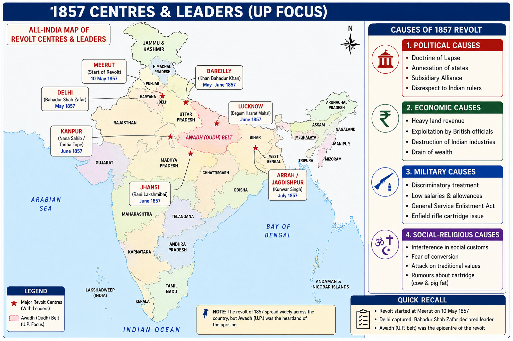

# Topic 5 — Revolt of 1857
### ★ Complete Source of Truth — No other book/notes needed for this topic

> **Covers syllabus:** Revolt of 1857 | Causes | Beginning of Revolt | Centres of Revolt | Leaders of Revolt | Important Places | Consequences | Rani Lakshmibai | Nana Sahib | Tantia Tope | Kunwar Singh | Begum Hazrat Mahal | Mangal Pandey | Role of Awadh | Role of Uttar Pradesh  
> **Sources baked in:** NCERT *Themes in Indian History Part III*, Spectrum *A Brief History of Modern India*, Bipan Chandra, UPPCS Prelims PYQs 2018–2025  
> **Exam weight:** ★★★ High — centre↔leader matching, place↔date traps, UP centres (Bareilly, Lucknow, Kanpur, Awadh), Kunwar Singh / Lakshmibai traps  
> **Last verified:** July 2026

---

## Quick Revision Box — Raata This First

```
DATES (must match — 2023 Q40):
  Barrackpore — 29 March 1857 (Mangal Pandey) ✓
  Meerut — 10 May 1857 (outbreak) ✓
  Lucknow — 4 June 1857 ✓
  Jhansi — NOT 11 May 1857 ✗ (Jhansi rose later, June 1857) ← 2023 Q40 answer D

CENTRE ↔ LEADER:
  Delhi — Bahadur Shah Zafar (nominal); Bakht Khan (military)
  Kanpur — Nana Sahib + Tantia Tope
  Lucknow/Awadh — Begum Hazrat Mahal (+ Birjis Qadr)
  Jhansi — Rani Lakshmibai
  Bihar (Jagdishpur) — Kunwar Singh ← 2024 Q148 statement 1 TRUE
  Bareilly — Khan Bahadur Khan ← 2023 Q46
  Faizabad — Maulvi Ahmadullah Shah
  Baghpat/Meerut region — local sepoy leadership after 10 May

CAUSES (raata layers):
  Political: Doctrine of Lapse + Awadh annexation 1856 (Dalhousie)
  Economic: land revenue pressure; artisan ruin; peasant debt
  Social-religious: conversions fear; widow remarriage; greased cartridge
  Military: greased Enfield cartridge; overseas service; pay discrimination

COURSE SNAPSHOT:
  29 Mar Barrackpore → 10 May Meerut → Delhi seized → regional centres → British reconquest 1857–58
  Crown rule 1858; Queen's Proclamation 1 Nov 1858; Canning first Viceroy

UP FOCUS:
  Meerut, Lucknow, Kanpur, Bareilly, Faizabad, Allahabad, Awadh peasants — core of revolt geography

TRAPS:
  Jhansi start ≠ 11 May 1857 (2023 Q40)
  Bareilly ≠ Hazrat Mahal / Nana / Kunwar (2023 Q46 = Khan Bahadur Khan)
  Dalhousie did NOT recognise Lakshmibai's adopted son (2024 Q148)
  Awadh annexed 1856 (before revolt) — 2025 Q127 chronology
```

### Must-Know Term Comparisons (very frequently asked)

| Term | One-line difference | Hindi |
|------|---------------------|-------|
| **Sepoy Mutiny vs First War of Independence** | British label = **sepoy mutiny**; nationalist label = **First War of Independence / Revolt of 1857** | सिपाही विद्रोह / स्वतंत्रता का प्रथम युद्ध |
| **Meerut vs Barrackpore** | Barrackpore **29 Mar** = Mangal Pandey incident; Meerut **10 May** = mass outbreak | बैरकपुर / मेरठ |
| **Nana Sahib vs Tantia Tope** | Nana = Kanpur political leader (Bithoor); Tantia = military commander of Nana | नाना साहेब / तात्या टोपे |
| **Hazrat Mahal vs Khan Bahadur Khan** | Hazrat Mahal = **Lucknow/Awadh**; Khan Bahadur Khan = **Bareilly** | हज़रत महल / खान बहादुर खान |
| **Kunwar Singh vs Lakshmibai** | Kunwar = **Jagdishpur, Bihar**; Lakshmibai = **Jhansi** (later Gwalior) | कुंवर सिंह / रानी लक्ष्मीबाई |
| **Awadh annexation vs Doctrine of Lapse** | Awadh **1856** = **misrule** excuse; Jhansi = **Lapse** (adopted heir rejected) | अवध अधिग्रहण / विलुप्ति सिद्धांत |
| **Bahadur Shah Zafar vs Bakht Khan** | Zafar = symbolic emperor at Delhi; Bakht Khan = actual military organiser from Bareilly contingent | बहादुर शाह ज़फ़र / बख़्त खान |
| **Company rule vs Crown rule** | Revolt ended Company rule; **GOI Act 1858** = Crown + Viceroy | कंपनी शासन / क्राउन शासन |

### Memory Tricks

| Trick | Remembers |
|-------|-----------|
| **B-M-L-J dates** | Barrackpore 29 Mar → Meerut 10 May → Lucknow 4 June; Jhansi **not** 11 May |
| **D-K-L-J-B-B** | Delhi–Kanpur–Lucknow–Jhansi–Bihar–Bareilly leader map |
| **KBK = Bareilly** | **K**han **B**ahadur **K**han |
| **Kunwar = Jagdishpur** | Bihar landlord — **2024 Q148** |
| **Awadh 1856** | Annexed **before** 1857 — cause, not consequence |
| **1858 Crown** | Canning Viceroy + Queen's Proclamation |

---



## 5.1 Revolt of 1857 — Overview

### Definitions

| Term | Meaning |
|------|---------|
| **Revolt of 1857** | Widespread uprising against East India Company rule that began among sepoys and spread to civilians in North and Central India (**1857–1858**) |
| **Sepoy Mutiny** | Contemporary British term stressing military indiscipline |
| **First War of Independence** | Nationalist term stressing anti-colonial character of the revolt |
| **Enfield Rifle / Greased Cartridge** | New rifle whose cartridges were rumoured to be greased with cow and pig fat — immediate military spark |

### Causes — Why the Revolt Happened

1. **Political annexations:** Policies such as the **Doctrine of Lapse** and the annexation of **Awadh in 1856** destroyed the legitimacy of Indian rulers and alienated nobility and soldiers recruited from those regions.
2. **Economic exploitation:** Heavy land revenue, destruction of handicrafts, and commercialisation of agriculture created mass rural distress, especially in **Awadh** and the North-Western Provinces.
3. **Social and religious fear:** Reform laws, missionary activity, and rumours of forced conversion convinced many that British rule threatened Hindu and Muslim customs.
4. **Military grievances:** Indian sepoys faced racial discrimination in pay and promotion, overseas service rules, and the greased cartridge insult to religion.
5. **Immediate trigger:** Introduction of the **Enfield rifle** and the greased cartridge controversy turned long-term resentment into open mutiny at **Barrackpore** and **Meerut**.

### Course of the Revolt — Step by Step

1. **29 March 1857:** At **Barrackpore**, sepoy **Mangal Pandey** attacked British officers; he was executed, and the 34th Native Infantry was disbanded.
2. **9–10 May 1857:** At **Meerut**, sepoys who refused greased cartridges were sentenced; on **10 May** the regiment mutinied, freed prisoners, and marched toward Delhi.
3. **11–12 May 1857:** Mutineers seized **Delhi** and proclaimed **Bahadur Shah Zafar** as emperor, giving the revolt a symbolic all-India centre.
4. **May–June 1857:** Revolt spread to **Kanpur, Lucknow, Jhansi, Bareilly, Faizabad, Allahabad**, and parts of Bihar and Central India.
5. **June–September 1857:** Major sieges and battles unfolded at Delhi, Lucknow Residency, and Kanpur; British reinforcements began to reconquer key cities.
6. **September 1857:** British forces under **John Nicholson** and others recaptured **Delhi**; Bahadur Shah Zafar was captured and later exiled to Rangoon.
7. **1858:** Remaining centres such as Lucknow, Jhansi, and Kalpi–Gwalior were suppressed; **Kunwar Singh** and **Lakshmibai** became legendary last-phase fighters.
8. **1 November 1858:** **Queen's Proclamation** and the **Government of India Act 1858** ended Company rule and began Crown administration under **Lord Canning**.

### Revolt of 1857 — How It Works

- The Revolt of 1857 was both a **sepoy uprising** and a wider **civil rebellion** involving peasants, landlords, artisans, and displaced rulers.
- Its strongest geography was **North India and Central India**, especially present-day **Uttar Pradesh**, with weaker or delayed participation in most of South India and Punjab.
- **Delhi** provided symbolic legitimacy through the Mughal emperor, but real fighting power rested with regional leaders and sepoy contingents.
- British victory came from superior arms, telegraph and railway communication, Sikh and Gurkha support, and the failure of rebels to create a unified command.
- Nationalist historiography treats 1857 as the **First War of Independence**, while colonial writers called it a mutiny; UPPCS expects both labels and the factual chronology.
- The revolt permanently ended Company political rule and forced the British to change army, princely, and land policies.
- Trap: "The revolt began at Delhi." The mass outbreak began at **Meerut on 10 May 1857** after the Barrackpore incident.
- Trap: "Jhansi rose on 11 May 1857." That date is wrongly matched in **UPPCS 2023 Q40**; Jhansi rose later in **June 1857**.
- Trap: "All of India rose together." Large areas of the South, Punjab, and Bengal remained relatively quiet or actively assisted the British.

> **Exam note:** Memorise **place ↔ date** and **centre ↔ leader** tables first. **2023 Q40** and **2023 Q46** are direct matching traps.

### Results of the Revolt of 1857

| Result | Why it matters |
|--------|----------------|
| End of Company rule **1858** | Crown takes India |
| Queen's Proclamation | Non-annexation pledge; equal treatment promise |
| Army reorganisation | Higher British-to-Indian ratio; caste/region mix |
| Princely policy softened | No more aggressive Lapse annexations |
| National memory | Seed of later nationalist imagination |

### Key Persons — Revolt Overview

| Person | Role |
|--------|------|
| **Bahadur Shah Zafar** | Nominal rebel emperor at Delhi |
| **Mangal Pandey** | Barrackpore spark, March 1857 |
| **Lord Canning** | GG during revolt; first Viceroy after 1858 |
| **John Nicholson / Colin Campbell / Hugh Rose** | Major British reconquest commanders |

### Exam Facts (raata)

- Outbreak: **Meerut, 10 May 1857**
- Barrackpore spark: **29 March 1857**
- Delhi captured by rebels: **May 1857**
- Crown rule begins: **1858**
- Queen's Proclamation: **1 Nov 1858**
- Strongest zone: North India / UP

### PYQs — Revolt Overview

1. **(UPPCS Prelims 2023, Q40)** Place–date matching; incorrect pair = **Jhansi — 11 May 1857**.

2. **(UPSC pattern)** Revolt of 1857 began at → **Meerut**.

### Examples (5.1)

| Example | What it teaches |
|---------|-----------------|
| **Meerut 10 May** | True outbreak date |
| **Delhi Mughal revival** | Symbolic centre |
| **1858 Crown** | Political consequence |

---

## 5.2 Causes of the Revolt

### Definitions

| Term | Meaning |
|------|---------|
| **Political causes** | Annexations and succession policies that destroyed Indian ruling houses |
| **Economic causes** | Revenue, trade, and artisan policies that impoverished peasantry and craftsmen |
| **Socio-religious causes** | Fear that British reforms and missionaries would destroy religion and caste |
| **Military causes** | Sepoy grievances over cartridge, pay, overseas service, and racial insult |

### Causes — Step-by-Step Build-up

1. **Doctrine of Lapse** annexed states such as **Satara, Jhansi, Nagpur**, creating unemployed soldiers and angry nobles.
2. **Awadh annexation (1856)** on the plea of misrule removed the Nawab, hurt taluqdars, and alienated Awadh sepoys who formed a large part of the Bengal Army.
3. Peasant discontent rose because land settlements and cash revenue left little surplus and increased moneylender control.
4. Artisans suffered as British machine goods undercut Indian handicrafts.
5. Social legislation and missionary activity were interpreted as attacks on Hindu and Muslim religion.
6. The **greased cartridge** rumour (cow and pig fat) made religious pollution a mass military issue.
7. Sepoy service conditions — low pay, no promotion equality, and General Service Enlistment Act fears — completed the military fuse.

### Causes — How It Works

- Causes of 1857 must be memorised in **four layers**: political, economic, social-religious, and military.
- **Political causes** mattered most for princes and taluqdars; **military causes** ignited the sepoys; **economic and religious** causes brought civilians into the fight.
- **Awadh 1856** is the highest-yield political cause for UPPCS because Awadh was a major recruiting ground and later a major centre of revolt.
- **Doctrine of Lapse** links Jhansi and Rani Lakshmibai directly to the revolt narrative.
- The greased cartridge was the **spark**, not the sole cause; long-term grievances made the spark explosive.
- British racial arrogance and Christian missionary zeal deepened mistrust across communities.
- Trap: "Only greased cartridges caused 1857." Cartridges were the immediate trigger within a wider structure of discontent.
- Trap: "Awadh was annexed during the revolt." It was annexed in **1856**, one year earlier — **2025 Q127** chronology.

> **Exam note:** For 2-statement questions, separate **long-term causes** from the **immediate cartridge spark**.

### Causes Master Table

| Layer | Key examples | Who was alienated |
|-------|--------------|-------------------|
| **Political** | Lapse; Awadh 1856; Subsidiary system | Princes, nobles, taluqdars |
| **Economic** | High land revenue; deindustrialization | Peasants, artisans |
| **Social-religious** | Missionaries; reform laws; conversion fear | Hindus and Muslims |
| **Military** | Cartridge; pay; overseas service | Sepoys of Bengal Army |

### Exam Facts (raata)

- Awadh annexed: **1856**
- Doctrine of Lapse: Dalhousie
- Spark: greased Enfield cartridge
- Four cause layers: political / economic / social / military

### PYQs — Causes

1. **(UPPCS Prelims 2025, Q127)** Acquisition of Awadh by the British comes before Indigo Revolt and Second Afghan War — Awadh **1856**.

2. **(UPSC pattern)** Immediate cause of Revolt of 1857 → **Greased cartridges**.

### Examples (5.2)

| Example | What it teaches |
|---------|-----------------|
| **Awadh 1856** | Political cause + UP angle |
| **Jhansi Lapse** | Lakshmibai's grievance |
| **Enfield cartridge** | Military spark |

---

## 5.3 Beginning of the Revolt

### Definitions

| Term | Meaning |
|------|---------|
| **Barrackpore incident** | **29 March 1857** — Mangal Pandey attacks officers |
| **Meerut outbreak** | **10 May 1857** — mass sepoy mutiny and march to Delhi |
| **Delhi seizure** | Rebels take Delhi and proclaim Bahadur Shah Zafar emperor |

### Course — Beginning Step by Step

1. **February–March 1857:** Cartridge refusals and unrest spread in Bengal Army units.
2. **29 March 1857:** **Mangal Pandey** of the 34th Native Infantry attacks British officers at **Barrackpore**.
3. **8 April 1857:** Mangal Pandey is hanged; later the regiment is disbanded — anger spreads.
4. **9 May 1857:** At **Meerut**, sepoys who refused cartridges are court-martialled and imprisoned.
5. **10 May 1857:** Meerut sepoys mutiny, kill officers, free comrades, and set out for Delhi.
6. **11 May 1857:** Rebels reach Delhi; local soldiers join; British officers are killed or flee.
7. **12 May onward:** Bahadur Shah Zafar is proclaimed emperor; the revolt gains a political centre.
8. **Late May–June:** News and mutiny cascade to Kanpur, Lucknow, Jhansi, Bareilly, and other stations.

### Beginning of the Revolt — How It Works

- The **beginning** has two linked stages: the **Barrackpore spark** and the **Meerut outbreak**.
- **Mangal Pandey** made the first famous individual act of defiance, but the revolt became a mass movement only after **Meerut on 10 May**.
- Meerut mattered because sepoys there acted collectively, freed imprisoned comrades, and carried the revolt to the imperial capital.
- Seizing **Delhi** transformed a regimental mutiny into a political challenge to Company sovereignty.
- The opening sequence every student must raata is **Barrackpore 29 March → Meerut 10 May → Delhi mid-May**.
- **UPPCS 2023 Q40** tests whether students confuse Barrackpore, Meerut, Lucknow, and Jhansi dates.
- Lucknow correctly rose on **4 June 1857**, while Jhansi did **not** rise on **11 May**.
- Trap: "Revolt began on 11 May at Jhansi." Jhansi's start date of **11 May** is the incorrect pair in 2023 Q40.
- Trap: "Mangal Pandey started the Meerut revolt." Mangal Pandey acted at **Barrackpore**; Meerut rose later.

> **Exam note:** **Barrackpore 29 March** → **Meerut 10 May** → **Delhi May** is the opening sequence.

### Results of the Opening Phase

| Result | Why it matters |
|--------|----------------|
| Barrackpore punishment | Spread anger in Bengal Army |
| Meerut mutiny | True mass outbreak |
| Delhi under rebels | Symbolic imperial centre |
| Contagion northwards | Multiple centres ignited |

### Exam Facts (raata)

- Mangal Pandey: **29 March 1857**, Barrackpore
- Meerut: **10 May 1857**
- Delhi seized: **11–12 May 1857**
- Lucknow rise: **4 June 1857** (2023 Q40 correct pair)

### PYQs — Beginning

1. **(UPPCS Prelims 2023, Q40)** Incorrect match = **Jhansi — 11 May 1857**.

2. **(UPSC pattern)** Mangal Pandey associated with → **Barrackpore**.

### Examples (5.3)

| Example | What it teaches |
|---------|-----------------|
| **29 March Barrackpore** | Individual spark |
| **10 May Meerut** | Mass outbreak |
| **Delhi proclamation** | Political turn |

---

## 5.4 Centres of Revolt

### Definitions

| Term | Meaning |
|------|---------|
| **Centre of revolt** | City or region where rebel authority temporarily replaced British control |
| **Place–date match** | UPPCS pattern pairing a centre with the date rebellion began there |

### Centres Master Table

| Centre | Region | Main leader(s) | Start / note |
|--------|--------|----------------|--------------|
| **Barrackpore** | Bengal | Mangal Pandey | **29 March 1857** |
| **Meerut** | UP | Sepoy leadership | **10 May 1857** |
| **Delhi** | Delhi | Bahadur Shah Zafar; Bakht Khan | Mid-May 1857 |
| **Kanpur** | UP | Nana Sahib; Tantia Tope | June 1857 |
| **Lucknow** | UP / Awadh | Begum Hazrat Mahal | **4 June 1857** |
| **Jhansi** | Central India | Rani Lakshmibai | **June 1857** (not 11 May) |
| **Bareilly** | UP | Khan Bahadur Khan | 1857 |
| **Jagdishpur** | Bihar | Kunwar Singh | 1857 |
| **Faizabad** | UP | Maulvi Ahmadullah Shah | 1857 |
| **Allahabad / Banaras** | UP | Local leaders; British harsh reprisals | 1857 |

### Centres of Revolt — How It Works

- UPPCS loves **centre ↔ leader** and **place ↔ date** matching more than narrative essays.
- **Delhi** was the symbolic capital; **Awadh–Lucknow**, **Kanpur**, and **Jhansi** were the hardest-fought regional theatres.
- **Bareilly** is a frequent UP question because its leader was **Khan Bahadur Khan**, not Hazrat Mahal or Nana Sahib — **2023 Q46**.
- **Jhansi** must not be paired with **11 May 1857**; that wrong pair is the answer to **2023 Q40**.
- Bihar's main centre was around **Jagdishpur** under **Kunwar Singh**.
- Many centres lacked coordination, which helped the British reconquer them one by one.
- Trap: "Hazrat Mahal led Bareilly." She led **Lucknow/Awadh**.
- Trap: "Kunwar Singh led Jhansi." He led **Bihar (Jagdishpur)**.

> **Exam note:** Raata the table above until place–leader–date are automatic.

### Results — Pattern of Centres

| Pattern | Meaning |
|---------|---------|
| Strong North/Central India | Main rebel geography |
| Weak South/Punjab support | Limited national spread |
| No single command | Easy for British to isolate centres |

### Exam Facts (raata)

- Lucknow start: **4 June 1857**
- Jhansi ≠ 11 May
- Bareilly = Khan Bahadur Khan
- Kanpur = Nana + Tantia
- Jagdishpur = Kunwar Singh

### PYQs — Centres

1. **(UPPCS Prelims 2023, Q40)** Incorrect pair → **Jhansi — 11 May 1857**.

2. **(UPPCS Prelims 2023, Q46)** Bareilly leader → **Khan Bahadur Khan**.

### Examples (5.4)

| Example | What it teaches |
|---------|-----------------|
| **Lucknow 4 June** | Correct date pair |
| **Bareilly–KBK** | UP leader trap |
| **Jhansi date trap** | 2023 Q40 |

---


## 5.5 Leaders of the Revolt — Master Map

### Definitions

| Term | Meaning |
|------|---------|
| **Rebel leader** | Local ruler, noble, or commander who organised resistance in a centre |
| **Nominal vs real leadership** | Bahadur Shah Zafar gave legitimacy; regional leaders ran actual war |

### Leader ↔ Centre Master Table

| Leader | Centre | Side note |
|--------|--------|-----------|
| **Bahadur Shah Zafar** | Delhi | Last Mughal; exiled to Rangoon |
| **Bakht Khan** | Delhi (military) | Came from Bareilly contingent |
| **Nana Sahib** | Kanpur / Bithoor | Adopted son of last Peshwa |
| **Tantia Tope** | Kanpur; later with Lakshmibai | Finest rebel general |
| **Begum Hazrat Mahal** | Lucknow / Awadh | Declared son Birjis Qadr Nawab |
| **Rani Lakshmibai** | Jhansi; died at Gwalior | Lapse grievance |
| **Kunwar Singh** | Jagdishpur, Bihar | Aged landlord; **2024 Q148** |
| **Khan Bahadur Khan** | Bareilly | **2023 Q46** |
| **Maulvi Ahmadullah Shah** | Faizabad | Fiery religious-military leader |
| **Mangal Pandey** | Barrackpore | Opening martyr |

### Leaders — How It Works

- Leaders of 1857 were **regional**, not a single national cabinet, which is why British forces could defeat centres separately.
- Matching questions dominate UPPCS: student must not swap Lucknow with Bareilly or Jhansi with Bihar.
- **Nana Sahib** and **Tantia Tope** formed the Kanpur leadership pair — political head plus military brain.
- **Begum Hazrat Mahal** kept Awadh resistance alive after British pressure on Lucknow.
- **Rani Lakshmibai** became the most celebrated woman leader; her adopted son's rejection under Lapse was a personal cause.
- **Kunwar Singh** of Jagdishpur proved that even an elderly landlord could organise long guerrilla resistance in Bihar.
- Trap: "Nana Sahib led Bareilly." Bareilly = **Khan Bahadur Khan**.
- Trap: "Dalhousie accepted Lakshmibai's heir." He did **not** — **2024 Q148** statement 2 is false.

> **Exam note:** Master the table; then read each leader section for narrative depth.

### Exam Facts (raata)

- Delhi: Zafar + Bakht Khan
- Kanpur: Nana + Tantia
- Lucknow: Hazrat Mahal
- Jhansi: Lakshmibai
- Bihar: Kunwar Singh
- Bareilly: Khan Bahadur Khan

### PYQs — Leaders Map

1. **(UPPCS Prelims 2023, Q46)** Bareilly → **Khan Bahadur Khan**.

2. **(UPPCS Prelims 2024, Q148)** Kunwar Singh of Jagdishpur led rebellion → **True**; Dalhousie recognised Lakshmibai heir → **False**.

### Examples (5.5)

| Example | What it teaches |
|---------|-----------------|
| **KBK Bareilly** | 2023 Q46 |
| **Kunwar Jagdishpur** | 2024 Q148 |
| **Nana–Tantia pair** | Kanpur leadership |

---

## 5.6 Important Places

### Definitions

| Term | Meaning |
|------|---------|
| **Residency, Lucknow** | British fortified compound besieged during the revolt |
| **Bithoor** | Nana Sahib's seat near Kanpur |
| **Jagdishpur** | Kunwar Singh's estate in Bihar |
| **Gwalior** | Scene of Lakshmibai's final battle (**June 1858**) |

### Important Places — How It Works

- Exam questions often ask **where** a leader fought or died, not only who led which province.
- **Meerut** is the outbreak town; **Delhi** is the imperial symbol; **Lucknow Residency** is the famous siege site.
- **Kanpur** and **Bithoor** are linked to Nana Sahib; **Kalpi** and **Gwalior** to the Lakshmibai–Tantia Tope phase.
- **Allahabad** saw severe British repression and later became a political centre of Crown India.
- **Jagdishpur** is the Bihar place-name that unlocks Kunwar Singh questions.
- **Faizabad** must be paired with **Maulvi Ahmadullah Shah**, and **Bareilly** with **Khan Bahadur Khan**.
- **Rangoon** matters because **Bahadur Shah Zafar** was exiled there after Delhi fell.
- Trap: "Lakshmibai died at Jhansi." She died fighting near **Gwalior in June 1858**.
- Trap: "Revolt's main southern centre was Madras." The South was largely quiet.

> **Exam note:** Pair places with both leader and fate (siege, death, exile).

### Places Quick Table

| Place | Association |
|-------|-------------|
| **Barrackpore** | Mangal Pandey |
| **Meerut** | 10 May outbreak |
| **Delhi** | Zafar; British reconquest Sept 1857 |
| **Lucknow** | Hazrat Mahal; Residency siege |
| **Kanpur / Bithoor** | Nana Sahib |
| **Jhansi / Gwalior** | Lakshmibai |
| **Bareilly** | Khan Bahadur Khan |
| **Jagdishpur** | Kunwar Singh |
| **Faizabad** | Ahmadullah Shah |
| **Rangoon** | Zafar's exile |

### Exam Facts (raata)

- Lakshmibai death: **Gwalior 1858**
- Zafar exile: **Rangoon**
- Nana seat: **Bithoor**
- Kunwar estate: **Jagdishpur**

### PYQs — Places

1. **(UPPCS Prelims 2023, Q40)** Place–date pairs for Barrackpore, Meerut, Lucknow, Jhansi.

2. **(UPSC pattern)** Rani Lakshmibai died at → **Gwalior**.

### Examples (5.6)

| Example | What it teaches |
|---------|-----------------|
| **Lucknow Residency** | Siege warfare |
| **Gwalior 1858** | Lakshmibai's end |
| **Jagdishpur** | Kunwar Singh base |

---

## 5.7 Consequences of the Revolt

### Definitions

| Term | Meaning |
|------|---------|
| **Government of India Act 1858** | Ended Company rule; transferred India to the British Crown |
| **Queen's Proclamation (1 Nov 1858)** | Royal pledge of non-interference in religion and no further aggressive annexation policy |
| **Army reorganisation** | Changes in recruitment and British–Indian troop ratios after 1857 |

### Course — Aftermath Step by Step

1. **1858:** Military suppression completed in major centres.
2. **Government of India Act 1858:** Company abolished as a political authority; **Secretary of State for India** created in London.
3. **Lord Canning** became the first **Viceroy** of India under the Crown.
4. **Queen's Proclamation (1 November 1858)** promised equal treatment, religious non-interference, and respect for princely rights.
5. Army policy changed: more British troops relative to Indians; recruitment shifted toward so-called "martial races."
6. Aggressive Doctrine of Lapse annexations were abandoned; princes were cultivated as allies.
7. Racial divide hardened in social life even as official policy spoke of equality.
8. Later nationalists treated 1857 as the founding memory of anti-colonial struggle.

### Consequences — How It Works

- The most important constitutional consequence was the **end of East India Company rule** and the start of **Crown rule**.
- The **Government of India Act 1858** created the office of **Secretary of State for India** and made the Governor-General the **Viceroy**.
- The **Queen's Proclamation** of **1 November 1858** tried to calm princes and religious communities after the shock of 1857.
- Military reorganisation aimed to prevent another combined Bengal Army revolt by changing recruitment and British–Indian ratios.
- Land and taluqdar policies in Awadh were adjusted to win back local elites after the revolt.
- Politically, Indians gained no democracy in 1858, but the revolt permanently changed British imperial strategy in India.
- Later nationalists treated 1857 as the founding memory of anti-colonial struggle even though it failed militarily.
- Trap: "1857 created the Indian National Congress." Congress was founded in **1885**.
- Trap: "Company continued ruling after 1857." Company political rule ended in **1858**.

> **Exam note:** Consequences = **1858 Crown + Proclamation + army changes + end of Lapse aggression**.

### Results Table

| Consequence | Detail |
|-------------|--------|
| Crown rule | GOI Act 1858 |
| Viceroy | Canning first |
| Proclamation | 1 Nov 1858 |
| Army changes | Divide-and-rule recruitment |
| Princely policy | Conciliation replaces Lapse |

### Exam Facts (raata)

- GOI Act: **1858**
- Proclamation: **1 Nov 1858**
- First Viceroy: **Canning**
- Company ends as ruler

### PYQs — Consequences

1. **(UPSC pattern)** Transfer of power from Company to Crown → **1858**.

2. **(UPSC pattern)** Queen's Proclamation issued on → **1 November 1858**.

### Examples (5.7)

| Example | What it teaches |
|---------|-----------------|
| **GOI Act 1858** | End of Company |
| **Canning as Viceroy** | New office title |
| **Army recomposition** | Preventive reform |

---

## 5.8 Rani Lakshmibai

### Definitions

| Term | Meaning |
|------|---------|
| **Rani Lakshmibai** | Queen of **Jhansi**; leading woman warrior of 1857 |
| **Damodar Rao** | Her adopted son — rejected under Doctrine of Lapse |
| **Hugh Rose** | British commander who captured Jhansi and fought her later campaigns |

### Causes — Why Lakshmibai Joined

1. **Lord Dalhousie** refused to recognise her adopted son as heir under the **Doctrine of Lapse**.
2. Jhansi was annexed to Company territory, ending her regency rights.
3. The wider revolt of 1857 gave her a chance to reclaim Jhansi by arms.
4. Local loyalty to the Rani and hatred of annexation mobilised Jhansi's soldiers and civilians.

### Course — Step by Step

1. After annexation, Lakshmibai protested through petitions but received no justice.
2. In **June 1857**, Jhansi rose and she assumed leadership of the rebel state.
3. She organised defence and administration from Jhansi fort.
4. In **1858**, British forces under **Hugh Rose** besieged and captured Jhansi.
5. Lakshmibai escaped and joined **Tantia Tope** in further campaigns around **Kalpi**.
6. They briefly seized **Gwalior**.
7. In **June 1858**, she was killed in battle near Gwalior.
8. Her death made her the most iconic martyr-heroine of 1857.

### Rani Lakshmibai — How It Works

- Lakshmibai's personal cause was the **rejection of her adopted heir**, a direct product of Dalhousie's Lapse policy.
- **UPPCS 2024 Q148** statement 2 is false because Dalhousie did **not** recognise Damodar Rao as heir apparent.
- She is paired with **Jhansi** as centre, but her final battle was at **Gwalior**.
- Her alliance with **Tantia Tope** linked the Jhansi and Kanpur military traditions in the last phase.
- British commander **Hugh Rose** captured Jhansi in 1858 and then pursued her into Central India.
- British accounts themselves praised her courage, which later nationalist memory amplified.
- She remains the most celebrated woman leader of 1857 in both popular and exam memory.
- Trap: "Dalhousie accepted Lakshmibai's adopted son." He rejected the adoption — key 2024 trap.
- Trap: "Jhansi revolt began on 11 May 1857." Wrong date in **2023 Q40**.

> **Exam note:** Lakshmibai = **Jhansi + Lapse + death at Gwalior + 2024 Q148 trap**.

### Results

| Result | Why it matters |
|--------|----------------|
| Jhansi became symbol of resistance | Woman leadership in 1857 |
| Lapse policy exposed | Political injustice of annexation |
| Martyrdom at Gwalior | National memory |

### Key Persons

| Person | Role |
|--------|------|
| **Rani Lakshmibai** | Leader of Jhansi |
| **Damodar Rao** | Adopted son rejected |
| **Tantia Tope** | Ally in final phase |
| **Hugh Rose** | British opponent |

### Exam Facts (raata)

- Centre: **Jhansi**
- Policy grievance: **Doctrine of Lapse**
- Death: **Gwalior, June 1858**
- 2024 Q148: adopted son **not** recognised

### PYQs — Lakshmibai

1. **(UPPCS Prelims 2024, Q148)** Statement 2 on Dalhousie recognising adopted son → **False**.

2. **(UPSC pattern)** Rani of Jhansi died at → **Gwalior**.

### Examples (5.8)

| Example | What it teaches |
|---------|-----------------|
| **Damodar Rao** | Lapse victim |
| **Jhansi siege 1858** | Hugh Rose campaign |
| **Gwalior death** | Final battle site |

---

## 5.9 Nana Sahib

### Definitions

| Term | Meaning |
|------|---------|
| **Nana Sahib (Dhondu Pant)** | Adopted son of last Peshwa **Baji Rao II**; leader at **Kanpur** |
| **Bithoor** | Nana's residence and political base near Kanpur |
| **Pension dispute** | Company stopped Peshwa pension to Nana — major personal grievance |

### Causes — Why Nana Rose

1. After **Baji Rao II's** death, the Company refused Nana Sahib the Peshwa's pension.
2. Loss of status and income at Bithoor pushed him toward rebellion.
3. When sepoys at Kanpur mutinied, Nana emerged as their political head.
4. Maratha memory and local support around Kanpur strengthened his claim.

### Course — Step by Step

1. Nana Sahib initially maintained contact with British authorities while discontent grew.
2. In **June 1857**, Kanpur rose and Nana assumed leadership of the rebel administration.
3. British garrison under **Wheeler** was besieged at Kanpur.
4. After a temporary surrender arrangement, violence at Kanpur blackened the episode in British memory.
5. British forces under **Havelock** and later **Campbell** retook Kanpur.
6. Nana fled; **Tantia Tope** continued military resistance.
7. Nana's later fate remained obscure; he was never conclusively captured.
8. Nationalist memory treats him as a major North Indian leader of 1857.

### Nana Sahib — How It Works

- Nana Sahib is the **political face of Kanpur**, while Tantia Tope is its **military face**.
- His grievance was **pension denial**, not Doctrine of Lapse in the Jhansi sense.
- He was the adopted son of the last Peshwa **Baji Rao II** and lived at **Bithoor** near Kanpur.
- Kanpur became one of the bloodiest and most controversial theatres of the revolt.
- After British reconquest, Nana fled and was never conclusively captured by the British.
- Nationalist memory treats him as a major North Indian leader of 1857 despite the contested Kanpur episode.
- He must not be confused with Bareilly or Lucknow leaders in matching questions.
- Trap: "Nana Sahib led Lucknow." Lucknow = **Begum Hazrat Mahal**.
- Trap: "Nana Sahib was Peshwa of Poona in 1857." He was the adopted claimant at **Bithoor**, not ruling Poona.

> **Exam note:** Nana = **Kanpur + Bithoor + pension grievance + Tantia alliance**.

### Results

| Result | Why it matters |
|--------|----------------|
| Kanpur as major centre | UP core of revolt |
| Pension issue highlighted | Company injustice to adopted heirs |
| Tantia continued fight | Military legacy beyond Nana |

### Exam Facts (raata)

- Centre: **Kanpur**
- Base: **Bithoor**
- Grievance: **pension stopped**
- Ally: **Tantia Tope**

### PYQs — Nana Sahib

1. **(UPSC pattern)** Nana Sahib led the revolt at → **Kanpur**.

2. **(UPPCS Prelims 2023, Q46)** Nana Saheb was **not** the Bareilly leader.

### Examples (5.9)

| Example | What it teaches |
|---------|-----------------|
| **Bithoor** | Nana's seat |
| **Kanpur siege** | Major theatre |
| **Pension denial** | Personal cause |

---


## 5.10 Tantia Tope

### Definitions

| Term | Meaning |
|------|---------|
| **Tantia Tope (Ramachandra Pandurang)** | Principal military commander of Nana Sahib and later ally of Lakshmibai |
| **Guerrilla phase** | After conventional defeats, Tantia fought a mobile campaign across Central India |

### Causes / Context

1. He shared Nana Sahib's Kanpur revolt and became its chief general.
2. After Kanpur's fall, he kept resistance alive through rapid marches.
3. Alliance with Lakshmibai extended the war into Jhansi–Kalpi–Gwalior theatre.
4. His skill forced the British to divert large forces for a long chase.

### Course — Step by Step

1. Tantia Tope organised rebel forces around Kanpur under Nana Sahib.
2. He fought British columns during the Kanpur campaigns of 1857.
3. After setbacks, he moved into Central India and coordinated with Jhansi forces.
4. With Lakshmibai he participated in the **Kalpi** and **Gwalior** operations of 1858.
5. After Lakshmibai's death, he continued guerrilla warfare for months.
6. He was betrayed, captured, and executed by the British in **1859**.
7. His long resistance made him the outstanding military professional among rebel leaders.
8. Nationalist memory ranks him among the greatest generals of 1857.

### Tantia Tope — How It Works

- Tantia Tope is remembered as the **best military strategist** of the revolt, not merely a local notable.
- He began as the chief general of **Nana Sahib** in the Kanpur theatre.
- He links the **Kanpur** story with the **Jhansi–Gwalior** last phase through his alliance with Lakshmibai.
- Unlike many leaders who fell with their cities, he prolonged the war through mobility and guerrilla tactics.
- After Lakshmibai's death he continued resistance until betrayal and capture.
- The British executed him in **1859**, making him one of the last major field leaders to fall.
- Students should remember him as a commander, not as a territorial nawab or taluqdar.
- Trap: "Tantia Tope led Bareilly." Bareilly = **Khan Bahadur Khan**.
- Trap: "Tantia Tope was captured in 1857." He fought into **1859**.

> **Exam note:** Tantia = **Kanpur general + Lakshmibai ally + executed 1859**.

### Results

| Result | Why it matters |
|--------|----------------|
| Prolonged Central Indian war | Delayed British pacification |
| Military reputation | Model guerrilla leader |
| Execution 1859 | End of major field leadership |

### Exam Facts (raata)

- Role: commander of Nana Sahib
- Later ally of Lakshmibai
- Executed: **1859**

### PYQs — Tantia Tope

1. **(UPSC pattern)** Military commander of Nana Sahib → **Tantia Tope**.

2. **(UPSC pattern)** Tantia Tope was executed in → **1859**.

### Examples (5.10)

| Example | What it teaches |
|---------|-----------------|
| **Kanpur command** | Early role |
| **Gwalior phase** | With Lakshmibai |
| **1859 execution** | Final fate |

---

## 5.11 Kunwar Singh

### Definitions

| Term | Meaning |
|------|---------|
| **Kunwar Singh** | Zamindar of **Jagdishpur** (Bihar) who led the 1857 revolt in his region |
| **Jagdishpur** | His estate and principal base in Bihar |

### Causes — Why Kunwar Singh Rose

1. He was a powerful landlord whose interests and prestige were threatened by British revenue and administrative pressure.
2. The wider sepoy revolt created an opening for regional chiefs to expel British authority.
3. Local peasants and soldiers rallied to his leadership in western Bihar.
4. Despite old age, he chose armed resistance rather than submission.

### Course — Step by Step

1. In **1857**, Kunwar Singh raised the standard of revolt from **Jagdishpur**.
2. He organised local forces and fought British detachments in Bihar.
3. His campaigns disrupted British control along key routes in the region.
4. Even when wounded and aged, he continued operations against pursuing columns.
5. He scored notable local successes before the eventual British reconquest of Bihar.
6. He died in **1858**, shortly after returning toward Jagdishpur.
7. Bihar remembered him as the foremost 1857 hero of the province.
8. UPPCS directly tests his identity as landlord of Jagdishpur — **2024 Q148**.

### Kunwar Singh — How It Works

- Kunwar Singh represents the **Bihar theatre** of 1857, distinct from UP centres like Lucknow and Kanpur.
- **Statement 1 of UPPCS 2024 Q148** is correct: he was the landlord of Jagdishpur and led rebellion against the British.
- His age is often emphasised to show the depth of elite commitment to the revolt.
- He organised local forces from **Jagdishpur** and disrupted British control in western Bihar.
- Despite wounds and old age, he continued campaigning until near the end of his life in **1858**.
- Bihar's 1857 memory centres on him just as UP memory centres on Nana, Hazrat Mahal, and Khan Bahadur Khan.
- He should never be mixed with Jhansi or Bareilly options in matching questions.
- Trap: "Kunwar Singh led Bareilly." Bareilly = **Khan Bahadur Khan**.
- Trap: "Kunwar Singh was from Jhansi." He was from **Bihar**.

> **Exam note:** Kunwar Singh = **Jagdishpur, Bihar + 2024 Q148 statement 1 true**.

### Results

| Result | Why it matters |
|--------|----------------|
| Bihar revolt organised | Eastern theatre of 1857 |
| Landlord leadership model | Elite participation |
| 2024 Q148 anchor | Exact PYQ fact |

### Exam Facts (raata)

- Place: **Jagdishpur, Bihar**
- Role: landlord-leader
- Died: **1858**
- 2024 Q148: statement 1 **correct**

### PYQs — Kunwar Singh

1. **(UPPCS Prelims 2024, Q148)** Kunwar Singh, landlord of Jagdishpur, led rebellion → **Correct**; only statement 1 is true in that question.

2. **(UPSC pattern)** Kunwar Singh is associated with → **Bihar / Jagdishpur**.

### Examples (5.11)

| Example | What it teaches |
|---------|-----------------|
| **Jagdishpur** | Estate and base |
| **Aged warrior** | Commitment despite age |
| **2024 Q148** | Exact wording trap |

---

## 5.12 Begum Hazrat Mahal

### Definitions

| Term | Meaning |
|------|---------|
| **Begum Hazrat Mahal** | Wife of Nawab Wajid Ali Shah; leader of revolt in **Lucknow/Awadh** |
| **Birjis Qadr** | Her son, proclaimed Nawab of Awadh during the revolt |

### Causes — Why She Led Awadh

1. The British had annexed **Awadh in 1856** and exiled **Wajid Ali Shah** to Calcutta.
2. Awadh's taluqdars and people deeply resented the annexation.
3. When Lucknow rose in June 1857, Hazrat Mahal provided royal leadership in the Nawab's absence.
4. She proclaimed her son **Birjis Qadr** as Nawab to restore Awadh sovereignty.

### Course — Step by Step

1. After annexation, Hazrat Mahal stayed connected to Awadh politics while the Nawab lived in exile.
2. On **4 June 1857**, Lucknow rebelled — a date correctly matched in **2023 Q40**.
3. She assumed leadership and declared Birjis Qadr Nawab.
4. Rebel forces besieged the British **Residency** in Lucknow.
5. British relief and reconquest under **Havelock, Outram, and Campbell** gradually broke the siege system.
6. Hazrat Mahal continued resistance even after major setbacks.
7. She eventually escaped toward Nepal frontier zones and refused British offers of surrender on unequal terms.
8. She remains the foremost woman leader of the Awadh revolt.

### Begum Hazrat Mahal — How It Works

- Hazrat Mahal is the leader of **Lucknow/Awadh**, not Bareilly — a frequent option trap in **2023 Q46**.
- Her authority came from Awadh royalty and popular anger against the **1856 annexation**.
- She proclaimed her son **Birjis Qadr** as Nawab to restore Awadh sovereignty in the absence of Wajid Ali Shah.
- The Lucknow Residency siege is the most famous military episode of her theatre.
- Lucknow correctly rose on **4 June 1857**, a date tested as a correct pair in **2023 Q40**.
- She continued resistance even after major British relief operations and refused humiliating surrender terms.
- Among woman leaders of 1857, she stands beside Lakshmibai as an indispensable exam name.
- Trap: "Hazrat Mahal led Bareilly." **Khan Bahadur Khan** led Bareilly.
- Trap: "Awadh annexed in 1857 during the revolt." Annexation was **1856**.

> **Exam note:** Hazrat Mahal = **Lucknow + Birjis Qadr + Awadh 1856 grievance**.

### Results

| Result | Why it matters |
|--------|----------------|
| Awadh became fiercest theatre | Long British struggle |
| Woman royal leadership | Parallel to Lakshmibai |
| Annexation exposed | Political cause of revolt |

### Exam Facts (raata)

- Centre: **Lucknow / Awadh**
- Son: **Birjis Qadr**
- Lucknow rise: **4 June 1857**
- Not Bareilly leader

### PYQs — Hazrat Mahal

1. **(UPPCS Prelims 2023, Q46)** Hazrat Mahal is a wrong option for Bareilly leader.

2. **(UPPCS Prelims 2023, Q40)** Lucknow — **4 June 1857** is correctly matched.

### Examples (5.12)

| Example | What it teaches |
|---------|-----------------|
| **Birjis Qadr** | Restored Nawabi claim |
| **Lucknow Residency** | Siege centre |
| **Awadh 1856** | Root grievance |

---

## 5.13 Mangal Pandey

### Definitions

| Term | Meaning |
|------|---------|
| **Mangal Pandey** | Sepoy of the 34th Native Infantry who attacked British officers at **Barrackpore on 29 March 1857** |
| **Barrackpore** | Military station near Calcutta where the opening incident occurred |

### Causes — Why Pandey Acted

1. Sepoys believed the new Enfield cartridges were greased with cow and pig fat.
2. Religious pollution fears made obedience seem a betrayal of faith.
3. Anger at British officers and punishments for refusal was already high.
4. Pandey's act became the first dramatic signal of open defiance.

### Course — Step by Step

1. Unrest over cartridges intensified in early 1857.
2. On **29 March 1857**, Mangal Pandey attacked British officers at Barrackpore.
3. He was overpowered and arrested.
4. On **8 April 1857**, he was hanged.
5. His regiment was later disbanded, spreading resentment.
6. The Meerut outbreak followed in May, turning spark into conflagration.
7. Nationalist memory elevated him as the first martyr of 1857.
8. Exam questions fix him firmly at Barrackpore, not Meerut.

### Mangal Pandey — How It Works

- Mangal Pandey is the **opening martyr**, not the commander of the all-India revolt.
- His date **29 March 1857** is correctly matched with Barrackpore in **2023 Q40**.
- He belonged to the **34th Native Infantry** and attacked British officers over the cartridge issue.
- He was hanged on **8 April 1857**, and his regiment was later disbanded.
- The revolt's mass beginning still remains **Meerut, 10 May**, not Barrackpore alone.
- His act mattered because it showed that religious fear could turn into open violence against officers.
- Nationalist memory elevated him as the first martyr of 1857, which UPPCS also expects students to know.
- Trap: "Mangal Pandey led the Meerut mutiny." He acted at **Barrackpore**.
- Trap: "Revolt began only with Pandey and ended there." His act was the spark before Meerut.

> **Exam note:** Mangal Pandey = **Barrackpore + 29 March 1857 + greased cartridge context**.

### Results

| Result | Why it matters |
|--------|----------------|
| First famous act of defiance | Moral spark |
| Regiment disbanded | Spread anger |
| Martyr image | National memory |

### Exam Facts (raata)

- Date: **29 March 1857**
- Place: **Barrackpore**
- Fate: hanged **8 April 1857**
- Linked to cartridge issue

### PYQs — Mangal Pandey

1. **(UPPCS Prelims 2023, Q40)** Barrackpore — **29 March 1857** correctly matched.

2. **(UPSC pattern)** Mangal Pandey belonged to → **34th Native Infantry, Barrackpore**.

### Examples (5.13)

| Example | What it teaches |
|---------|-----------------|
| **29 March** | Exact spark date |
| **Barrackpore** | Place match |
| **Cartridge rumour** | Religious fuse |

---

## 5.14 Role of Awadh

### Definitions

| Term | Meaning |
|------|---------|
| **Annexation of Awadh (1856)** | Dalhousie annexed Awadh on the plea of misrule; Nawab Wajid Ali Shah exiled |
| **Taluqdars of Awadh** | Local landed elites who lost rights after annexation and later joined the revolt |
| **Awadh sepoys** | Large number of Bengal Army sepoys came from Awadh villages |

### Causes — Why Awadh Became Central

1. **Annexation in 1856** destroyed the Nawabi court and unemployed thousands dependent on it.
2. Summary settlement attacked taluqdar rights and created rural elite hostility.
3. Awadh was a major recruiting ground; sepoys carried village anger into the army.
4. Religious and cultural life of Lucknow felt humiliated by the exile of Wajid Ali Shah.

### Role of Awadh — How It Works

- Awadh is both a **cause** and a **centre** of 1857: annexed in **1856**, rising at **Lucknow on 4 June 1857**.
- **UPPCS 2025 Q127** places Acquisition of Awadh before Indigo Revolt (**1859**) and Second Afghan War (**1878**).
- **Begum Hazrat Mahal** gave the revolt royal leadership after the Nawab's exile.
- Awadh sepoys in the Bengal Army carried village anger into the mutiny, linking army and countryside.
- British reconquest of Lucknow was among the longest and costliest campaigns of the revolt.
- After 1858, British policy partially restored taluqdar influence to stabilise Awadh.
- For UPPCS, Awadh is the single most important regional case-study inside the revolt topic.
- Trap: "Awadh annexed under Canning during the revolt." Annexed under **Dalhousie in 1856**.
- Trap: "Awadh annexation used Doctrine of Lapse." It used the **misrule** argument, not Lapse.

> **Exam note:** Awadh = **1856 annexation + Lucknow centre + Hazrat Mahal + sepoy recruitment link**.

### Results

| Result | Why it matters |
|--------|----------------|
| Deepest popular participation | Peasants + taluqdars + sepoys |
| Lucknow as key theatre | Long siege warfare |
| Post-1858 conciliation | Taluqdar restoration |

### Exam Facts (raata)

- Annexation: **1856**
- Nawab: **Wajid Ali Shah**
- Rebel leader: **Hazrat Mahal**
- Lucknow date: **4 June 1857**
- 2025 Q127: Awadh first in chronology

### PYQs — Awadh

1. **(UPPCS Prelims 2025, Q127)** Acquisition of Awadh → earliest among given events (**1856**).

2. **(UPPCS Prelims 2023, Q40)** Lucknow — **4 June 1857** correctly matched.

### Examples (5.14)

| Example | What it teaches |
|---------|-----------------|
| **Wajid Ali Shah exile** | Political humiliation |
| **Taluqdar anger** | Rural elite cause |
| **Lucknow Residency** | Military centre |

---

## 5.15 Role of Uttar Pradesh

### Definitions

| Term | Meaning |
|------|---------|
| **UP / North-Western Provinces & Awadh** | Core geography of the 1857 revolt in present-day Uttar Pradesh |
| **UP centres** | Meerut, Delhi periphery links, Kanpur, Lucknow, Bareilly, Faizabad, Allahabad, Banaras |

### UP Centres and Leaders Table

| UP place | Leader / note |
|----------|---------------|
| **Meerut** | Outbreak, **10 May 1857** |
| **Kanpur** | Nana Sahib, Tantia Tope |
| **Lucknow** | Begum Hazrat Mahal |
| **Bareilly** | **Khan Bahadur Khan** — **2023 Q46** |
| **Faizabad** | Maulvi Ahmadullah Shah |
| **Allahabad** | Strategic Doab town; harsh British reprisals |
| **Banaras / nearby** | Local unrest; British crackdown |
| **Awadh countryside** | Peasant and taluqdar participation |

### Role of Uttar Pradesh — How It Works

- Present-day **Uttar Pradesh** contained more major 1857 centres than any other region of comparable size.
- **Meerut** gave the revolt its beginning; **Kanpur and Lucknow** gave it its hardest battles; **Bareilly** gave it a major Rohilkhand centre.
- **UPPCS 2023 Q46** is a direct UP question: Bareilly's leader was **Khan Bahadur Khan**.
- Awadh's annexation made eastern and central UP uniquely combustible.
- Many Bengal Army sepoys came from UP villages, so military mutiny quickly became a regional popular revolt.
- After suppression, UP districts faced confiscations, hangings, and village punishments that entered local memory.
- Trap: "Main 1857 centres were only in Delhi and Jhansi." UP had multiple simultaneous centres.
- Trap: "Bareilly was led by Nana Sahib." Nana led **Kanpur**.

> **Exam note:** For UPPCS, treat **Meerut–Kanpur–Lucknow–Bareilly–Faizabad** as compulsory UP geography of 1857.

### Results — UP Focus

| Result | Why it matters |
|--------|----------------|
| Core rebel geography | Highest exam weight for centres |
| Multiple leaders | Matching questions |
| Local memory | Regional identity of revolt |

### Exam Facts (raata)

- Outbreak in UP: **Meerut**
- Bareilly leader: **Khan Bahadur Khan**
- Kanpur: Nana + Tantia
- Lucknow: Hazrat Mahal
- Faizabad: Ahmadullah Shah

### PYQs — Role of UP

1. **(UPPCS Prelims 2023, Q46)** Bareilly (Uttar Pradesh) leader → **Khan Bahadur Khan**.

2. **(UPPCS Prelims 2023, Q40)** Meerut — **10 May 1857**; Lucknow — **4 June 1857**.

### Examples (5.15)

| Example | What it teaches |
|---------|-----------------|
| **Meerut outbreak** | UP beginning |
| **Bareilly–KBK** | UP-specific PYQ |
| **Awadh taluqdars** | Popular base in UP |

---


## Consolidated Reference — Everything in One Place

### Important Dates

| Year / date | Event |
|-------------|-------|
| **1856** | Awadh annexed by Dalhousie |
| **29 March 1857** | Mangal Pandey at Barrackpore |
| **10 May 1857** | Meerut outbreak |
| **4 June 1857** | Lucknow rises |
| **June 1857** | Jhansi rises (not 11 May) |
| **Sept 1857** | Delhi recaptured by British |
| **June 1858** | Lakshmibai dies near Gwalior |
| **1858** | Kunwar Singh dies; Company rule ends |
| **1 Nov 1858** | Queen's Proclamation |
| **1859** | Tantia Tope executed |

### Centre ↔ Leader ↔ Date (one page)

| Centre | Leader | Date / note |
|--------|--------|-------------|
| Barrackpore | Mangal Pandey | 29 Mar 1857 |
| Meerut | Sepoys | 10 May 1857 |
| Delhi | Zafar / Bakht Khan | May 1857 |
| Lucknow | Hazrat Mahal | 4 June 1857 |
| Kanpur | Nana + Tantia | June 1857 |
| Jhansi | Lakshmibai | June 1857 |
| Bareilly | Khan Bahadur Khan | 1857 |
| Jagdishpur | Kunwar Singh | 1857 |
| Faizabad | Ahmadullah Shah | 1857 |

### UP Focus — Revolt of 1857

| UP angle | Detail |
|----------|--------|
| Meerut | Outbreak of revolt |
| Kanpur–Bithoor | Nana Sahib theatre |
| Lucknow–Awadh | Hazrat Mahal; 1856 annexation grievance |
| Bareilly | Khan Bahadur Khan — **2023 Q46** |
| Faizabad | Maulvi Ahmadullah Shah |
| Allahabad / Banaras | Strategic towns; repression |
| Sepoy recruitment | Many Bengal Army sepoys from UP |

---

## Practice Zone — UPPCS Format Questions

> **How to use:** Answer first, then click **Show answer**.

**Q1.** Which one of the following pairs is **not** correctly matched?

A. Barrackpore — 29 March 1857  
B. Meerut — 10 May 1857  
C. Lucknow — 4 June 1857  
D. Jhansi — 11 May 1857  

<details><summary>Show answer</summary>

**Ans: D** — Jhansi did not rise on 11 May 1857. **UPPCS 2023 Q40**.

</details>

**Q2.** Who was the leader of the revolt in Bareilly during 1857?

A. Hazrat Mahal  
B. Khan Bahadur Khan  
C. Kunwar Singh  
D. Nana Saheb  

<details><summary>Show answer</summary>

**Ans: B** — **UPPCS 2023 Q46**.

</details>

**Q3.** Consider the following statements:

1. Kunwar Singh, landlord of Jagdishpur in Bihar, led the rebellion against the British.  
2. Lord Dalhousie recognised the adopted son of Rani Lakshmibai as the heir apparent.

Options: A. Only 2  B. Neither  C. Only 1  D. Both

<details><summary>Show answer</summary>

**Ans: C** — Only 1 is correct. **UPPCS 2024 Q148**.

</details>

**Q4.** Arrange chronologically:

1. Acquisition of Awadh  
2. Ilbert Bill Controversy  
3. Indigo Revolt  
4. Second Anglo-Afghan War  

Options: A. 1,3,4,2  B. 3,1,2,4  C. 3,1,4,2  D. 1,3,2,4

<details><summary>Show answer</summary>

**Ans: A** — 1856 → 1859 → 1878 → 1883. **UPPCS 2025 Q127**.

</details>

**Q5.** Assertion (A): The greased cartridge was the sole cause of the Revolt of 1857.  
Reason (R): Political annexations, economic distress, and social fears had already created deep discontent.

Options: A. Both true; R explains A  B. Both true; R does not explain A  C. A false, R true  D. A true, R false

<details><summary>Show answer</summary>

**Ans: C** — Cartridge was the spark, not the sole cause.

</details>

**Q6.** Match List-I with List-II:

List-I: A. Nana Sahib  B. Hazrat Mahal  C. Kunwar Singh  D. Khan Bahadur Khan  
List-II: 1. Bareilly  2. Kanpur  3. Lucknow  4. Jagdishpur

Options: A. 2 3 4 1  B. 3 2 1 4  C. 2 1 4 3  D. 4 3 2 1

<details><summary>Show answer</summary>

**Ans: A**.

</details>

**Q7.** The Revolt of 1857 began as a mass outbreak at:

Options: A. Delhi  B. Jhansi  C. Meerut  D. Lucknow

<details><summary>Show answer</summary>

**Ans: C — Meerut, 10 May 1857**.

</details>

**Q8.** Consider:

1. Awadh was annexed in 1856 on the plea of misrule.  
2. Jhansi was annexed under the Doctrine of Lapse.

Options: A. Only 1  B. Only 2  C. Both  D. Neither

<details><summary>Show answer</summary>

**Ans: C**.

</details>

**Q9.** Rani Lakshmibai died fighting near:

Options: A. Jhansi  B. Kanpur  C. Gwalior  D. Bareilly

<details><summary>Show answer</summary>

**Ans: C**.

</details>

**Q10.** Who among the following was the military commander associated with Nana Sahib?

Options: A. Bakht Khan  B. Tantia Tope  C. Ahmadullah Shah  D. Hugh Rose

<details><summary>Show answer</summary>

**Ans: B**.

</details>

**Q11.** Mangal Pandey is associated with:

Options: A. Meerut, 10 May 1857  B. Barrackpore, 29 March 1857  C. Delhi, September 1857  D. Lucknow, 4 June 1857

<details><summary>Show answer</summary>

**Ans: B**.

</details>

**Q12.** Which Act ended East India Company rule after the revolt?

Options: A. Charter Act 1853  B. Government of India Act 1858  C. Indian Councils Act 1861  D. Regulating Act 1773

<details><summary>Show answer</summary>

**Ans: B**.

</details>

**Q13.** Consider the following about Begum Hazrat Mahal:

1. She led the revolt at Lucknow.  
2. She proclaimed Birjis Qadr as Nawab of Awadh.

Options: A. Only 1  B. Only 2  C. Both  D. Neither

<details><summary>Show answer</summary>

**Ans: C**.

</details>

**Q14.** Assertion (A): Jhansi rose against the British on 11 May 1857.  
Reason (R): Meerut mutinied on 10 May 1857.

Options: A. Both true; R explains A  B. Both true; R does not explain A  C. A false, R true  D. A true, R false

<details><summary>Show answer</summary>

**Ans: C** — A is false (2023 Q40 trap); R is true.

</details>

**Q15.** Bahadur Shah Zafar was finally exiled to:

Options: A. Singapore  B. Rangoon  C. Aden  D. London

<details><summary>Show answer</summary>

**Ans: B**.

</details>

**Q16.** Which of the following is correctly matched?

Options: A. Kunwar Singh — Jhansi  B. Khan Bahadur Khan — Bareilly  C. Nana Sahib — Lucknow  D. Hazrat Mahal — Jagdishpur

<details><summary>Show answer</summary>

**Ans: B**.

</details>

**Q17.** Queen's Proclamation was issued on:

Options: A. 10 May 1857  B. 1 November 1858  C. 15 August 1858  D. 29 March 1857

<details><summary>Show answer</summary>

**Ans: B**.

</details>

**Q18.** Consider:

1. Tantia Tope was executed in 1859.  
2. Kunwar Singh died in 1858.

Options: A. Only 1  B. Only 2  C. Both  D. Neither

<details><summary>Show answer</summary>

**Ans: C**.

</details>

**Q19.** The immediate cause of the Revolt of 1857 was:

Options: A. Annexation of Punjab  B. Greased cartridges  C. Ilbert Bill  D. Partition of Bengal

<details><summary>Show answer</summary>

**Ans: B**.

</details>

**Q20.** Match List-I with List-II:

List-I: A. Bakht Khan  B. Maulvi Ahmadullah Shah  C. Hugh Rose  D. Colin Campbell  
List-II: 1. British commander against Jhansi  2. Delhi military leader  3. Faizabad leader  4. Lucknow relief operations

Options: A. 2 3 1 4  B. 3 2 4 1  C. 2 1 3 4  D. 1 2 3 4

<details><summary>Show answer</summary>

**Ans: A**.

</details>

**Q21.** Which statement about Awadh is correct?

Options: A. Annexed by Wellesley in 1801 under Subsidiary Alliance only  B. Annexed in 1856 on misrule plea  C. Never annexed before 1857  D. Annexed under Doctrine of Lapse in 1853

<details><summary>Show answer</summary>

**Ans: B**.

</details>

**Q22.** Consider the following centres:

1. Meerut  
2. Kanpur  
3. Bareilly  
4. Madras

Which were major centres of the Revolt of 1857?

Options: A. 1, 2 and 3 only  B. 1 and 4 only  C. 2, 3 and 4 only  D. All four

<details><summary>Show answer</summary>

**Ans: A** — Madras was not a major 1857 centre.

</details>

**Q23.** Who among the following is called the first Viceroy of India after 1858?

Options: A. Dalhousie  B. Canning  C. Lawrence  D. Ripon

<details><summary>Show answer</summary>

**Ans: B**.

</details>

**Q24.** Assertion (A): Kunwar Singh belonged to Jagdishpur in Bihar.  
Reason (R): He is incorrectly described as the leader of Bareilly.

Options: A. Both true; R explains A  B. Both true; R does not explain A  C. A true, R false  D. A false, R true

<details><summary>Show answer</summary>

**Ans: B** — Both true, but R is a separate fact, not the explanation of A.

</details>

**Q25.** Nana Sahib's seat was at:

Options: A. Poona  B. Bithoor  C. Gwalior  D. Faizabad

<details><summary>Show answer</summary>

**Ans: B**.

</details>

---

## Complete PYQ Bank — Revolt of 1857

### (UPPCS Prelims 2025, Q127)
Arrange: 1. Acquisition of Awadh  2. Ilbert Bill Controversy  3. Indigo Revolt  4. Second Anglo-Afghan War

<details><summary>Show answer</summary>

**Ans: A (1, 3, 4, 2)** — Awadh **1856** → Indigo **1859** → Afghan War **1878** → Ilbert **1883**.

</details>

### (UPPCS Prelims 2024, Q148)
Statements: (1) Kunwar Singh, landlord of Jagdishpur in Bihar, led the rebellion against the British. (2) Lord Dalhousie recognised the adopted son of Rani Lakshmibai as the heir apparent.

<details><summary>Show answer</summary>

**Ans: C — Only 1**

</details>

### (UPPCS Prelims 2023, Q40)
Which pair (Place of the Revolt of 1857 — Start of Rebellion) is **not** correctly matched?  
A. Barrackpore — 29 March 1857  
B. Meerut — 10 May 1857  
C. Lucknow — 4 June 1857  
D. Jhansi — 11 May 1857

<details><summary>Show answer</summary>

**Ans: D** — Jhansi did not begin on 11 May 1857.

</details>

### (UPPCS Prelims 2023, Q46)
Who was the leader of the revolt in Bareilly (Uttar Pradesh) during the Revolt of 1857?

<details><summary>Show answer</summary>

**Ans: B — Khan Bahadur Khan**

</details>

---

## Common Traps — Don't Fall For These

1. **Trap:** Jhansi revolt began on 11 May 1857. **Correct:** That pair is wrong — **2023 Q40**. Jhansi rose in **June 1857**.

2. **Trap:** Bareilly was led by Hazrat Mahal / Nana / Kunwar Singh. **Correct:** **Khan Bahadur Khan** — **2023 Q46**.

3. **Trap:** Dalhousie recognised Lakshmibai's adopted son. **Correct:** He did **not** — **2024 Q148**.

4. **Trap:** Revolt began at Delhi. **Correct:** Mass outbreak at **Meerut, 10 May 1857**.

5. **Trap:** Mangal Pandey led Meerut. **Correct:** He acted at **Barrackpore, 29 March 1857**.

6. **Trap:** Awadh annexed during 1857. **Correct:** Annexed in **1856** — **2025 Q127**.

7. **Trap:** Awadh annexed by Doctrine of Lapse. **Correct:** Annexed on **misrule** plea.

8. **Trap:** Lakshmibai died at Jhansi. **Correct:** Died near **Gwalior, June 1858**.

9. **Trap:** Nana Sahib led Lucknow. **Correct:** Lucknow = **Hazrat Mahal**; Nana = **Kanpur**.

10. **Trap:** Kunwar Singh led Jhansi. **Correct:** **Jagdishpur, Bihar**.

11. **Trap:** Company continued after 1857. **Correct:** Crown rule from **1858**.

12. **Trap:** Greased cartridge was the only cause. **Correct:** It was the **immediate spark** among deeper causes.

13. **Trap:** Tantia Tope captured in 1857. **Correct:** Executed in **1859**.

14. **Trap:** Bahadur Shah Zafar was the real military commander of all India. **Correct:** He was **nominal**; regional leaders fought separately.

15. **Trap:** South India was the main theatre. **Correct:** Strongest in **North and Central India**, especially UP.
