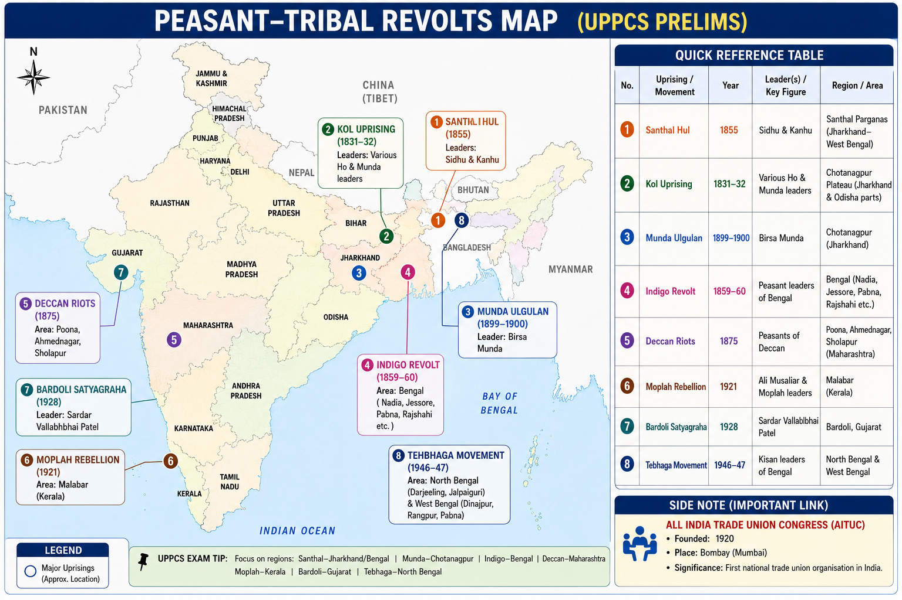

# Topic 8 — Peasant, Tribal & Labour Movements
### ★ Complete Source of Truth — No other book/notes needed for this topic

> **Covers syllabus:** Peasant Movements | Peasant Revolts | Leaders | Tribal Revolts | Tribal Leaders | Labour Movement | Trade Union Congress | Labour Organisations | Bonded Labour Practices | Early Uprisings Chronology | Indigo Revolt | Deccan Riots | Santhal Rebellion | Munda Ulgulan | Kol Rebellion | Moplah Rebellion | Tebhaga Movement | Bardoli Satyagraha  
> **Sources baked in:** NCERT *Themes in Indian History Part III*, Spectrum, Bipan Chandra, UPPCS Prelims PYQs 2018–2025  
> **Exam weight:** ★★★ High — revolt↔year matching, revolt↔leader matching, peasant chronology, UP Kisan Sabha, trade-union affiliations  
> **Last verified:** July 2026

---

## Quick Revision Box — Raata This First

```
EARLY CHRONOLOGY (must drill):
  Sanyasi/Fakir ~1763–1800 → Paika 1817 → Ahom 1828 (NOT 1815) → Khasi 1829 → Kol 1831–32
  → Santhal 1855–56 → Indigo 1859–60 → Deccan 1875 → Kuka ~1872 → Pabna 1873–85
  → Munda Ulgulan 1899–1900 → Tana Bhagat 1914 → Moplah 1921 → Eka 1921–22 → Bardoli 1928 → Tebhaga 1946–47

2025 Q25 ORDER:
  Sanyasi → Indigo → Kuka → Pabna = 4, 2, 3, 1

2018 Q23 NOT matched:
  Ahom 1815 ✗ (correct ~1828). Santhal 1855 / Kol 1831 / Khasi 1829 ✓

2019 Q18 MATCH:
  Pabna 1873–85 | Eka 1922 | Santhal 1855–56 | Tana Bhagat 1914 → B (2,3,1,4)

LEADERS:
  Santhal = Sidhu & Kanhu | Munda = Birsa Munda | Kol = Buddhu Bhagat & others (Chotanagpur)
  Indigo = Digambar/Bishnu Biswas (Nadia) | Bardoli = Vallabhbhai Patel
  Paika = Jagabandhu Bidyadhar | Malabar/Moplah leader tag = Edachena Kungan
  Bareilly (1857-linked) = Mufti Muhammad Aiwaz | Sylhet = Radharam ← 2024 Q138

UP PEASANTS:
  UP Kisan Sabha 1918 = Indra Narayan Dwivedi (+ Gauri Shankar Mishra; Malaviya support) ← 2023 Q41
  Baba Ramchandra = Awadh Kisan / later Oudh Kisan Sabha stream (not 1918 founder answer)
  Eka = Madari Pasi, Hardoi–Bahraich–Sitapur, ~1921–22

LABOUR:
  AITUC 1920 | INTUC 1947 (Congress) | BMS 1955 (BJP/RSS) | UTUC (left; UPPCS maps CPI-M)
  ILO Washington 1919 labour rep = N.M. Joshi ← 2020 Q16
  WPP (Workers & Peasants Party) ~1927–28; work within Congress ← 2024 Q14 Both

MOPLAH LAST (2023 Q47):
  Home Rule 1916 → Jallianwala 1919 → Khilafat → Moplah 1921 = last
```

### Must-Know Term Comparisons (very frequently asked)

| Term | One-line difference | Hindi |
|------|---------------------|-------|
| **Peasant revolt vs Tribal revolt** | Peasant = rent/indigo/zamindar issues of settled cultivators; Tribal = land/forest/diku intrusion in tribal belts | किसान / आदिवासी विद्रोह |
| **Indigo vs Pabna** | Indigo **1859–60** vs European planters; Pabna **1873–85** vs zamindar rent enhancement | नील / पाबना |
| **Santhal vs Munda** | Santhal **1855** Sidhu-Kanhu; Munda Ulgulan **1899–1900** Birsa | संथाल / मुंडा |
| **Kol vs Khasi** | Kol **1831** Chotanagpur; Khasi **1829** Meghalaya hills (Tirut Singh) | कोल / खासी |
| **Ahom 1828 vs 1815** | Correct Ahom rising ~**1828**; **1815 is the exam trap year** | अहोम |
| **Moplah vs Bardoli** | Moplah **1921** Malabar tenants (violent phase); Bardoli **1928** no-tax satyagraha under Patel | मोपला / बारडोली |
| **Tebhaga vs Eka** | Tebhaga **1946–47** Bengal sharecroppers 2/3 demand; Eka **1921–22** Awadh unity/rent receipts | तेभागा / एका |
| **AITUC vs INTUC** | AITUC **1920** left/CPI stream; INTUC **1947** Congress labour wing | एटक / इंटक |
| **Dwivedi vs Ramchandra** | Dwivedi = UP Kisan Sabha **1918** founder tag; Ramchandra = Awadh peasant mobiliser | द्विवेदी / रामचंद्र |
| **Bonded labour vs free wage labour** | Bonded = debt-tied forced labour; wage labour = paid industrial/rural workers | बंधुआ मजदूरी / मजदूरी |

### Memory Tricks

| Trick | Remembers |
|-------|-----------|
| **S-I-K-P** | Sanyasi → Indigo → Kuka → Pabna (2025) |
| **Ahom ≠ 1815** | 2018 trap |
| **Sidhu-Kanhu = Santhal 1855** | Twin brothers |
| **Birsa = Ulgulan ~1900** | Munda |
| **Dwivedi 1918** | UP Kisan Sabha |
| **Patel = Bardoli** | 1928 |
| **Joshi = ILO 1919** | Labour rep |

---



## 8.1 Overview & Early Uprisings Chronology

### Definitions

| Term | Meaning |
|------|---------|
| **Peasant movement** | Organised or semi-organised rural protest against rent, indigo, eviction, or landlord–state oppression |
| **Tribal revolt** | Armed or mass resistance by tribal communities against land loss, forest rules, moneylenders, and outsider (*diku*) domination |
| **Early uprising chronology** | Prelims pattern that orders revolts by year rather than asking full narratives |

### Causes — Why Rural India Rose Repeatedly

1. Colonial land revenue and zamindari pressure raised rents and illegal cesses.
2. European planters and Indian landlords forced unfavourable crops and contracts (indigo).
3. Tribal land and forest rights were invaded by outsiders, contractors, and new laws.
4. Debt and bonded labour tied cultivators and tribal households to moneylenders.
5. Political openings (Non-Cooperation, Khilafat, left politics) later linked local grievances to national movements.

### Overview — How It Works

- Treat this topic as three streams that often overlap: **peasant**, **tribal**, and **labour**.
- Early tribal/peasant risings (Sanyasi, Paika, Kol, Santhal) were mostly local and military. Later movements (Bardoli, Tebhaga, AITUC) were more organised and political.
- UPPCS loves **year matching** and **leader matching** more than long essays. Build one master chronology table and revise it weekly.
- UP has its own peasant map: **UP Kisan Sabha 1918**, Awadh mobilisation, and **Eka Movement**.
- Labour questions shift to unions, ILO representation, and party affiliations.
- Trap: "All tribal revolts happened after 1857." Kol, Khasi, Santhal, and others are earlier or mid-century.
- Trap: "Ahom revolt = 1815." Wrong year in **2018 Q23**.
- Trap: "Indigo came before Sanyasi." Sanyasi is far earlier; Indigo is **1859–60**.
- Trap: "Every peasant movement was led by Gandhi." Indigo/Pabna/Santhal/Tebhaga have their own leaders; Gandhi appears in Champaran/Bardoli-type politics.

> **Exam note:** First master **2025 Q25** and **2018 Q23** chronologies; then add leader pairs.

### Master Chronology Table

| Revolt / movement | Year (exam) | Region | Leader tag |
|-------------------|-------------|--------|------------|
| Sanyasi–Fakir | ~1763–1800 | Bengal | Ascetics/fakirs |
| Paika | 1817 | Odisha | Jagabandhu Bidyadhar |
| Ahom | **1828** | Assam | Gomdhar Konwar |
| Khasi | **1829** | Meghalaya | Tirut Singh |
| Kol | **1831–32** | Chotanagpur | Buddhu Bhagat & others |
| Santhal | **1855–56** | Rajmahal/Santhal Parganas | Sidhu & Kanhu |
| Indigo | **1859–60** | Bengal | Biswas brothers (Nadia) |
| Kuka (Namdhari) | **~1872** | Punjab | Ram Singh / Namdhari action |
| Deccan Riots | **1875** | Maharashtra | Agrarian crowds vs moneylenders |
| Pabna | **1873–85** | Bengal | Agrarian leagues |
| Munda Ulgulan | **1899–1900** | Chotanagpur | Birsa Munda |
| Tana Bhagat | **1914** | Chotanagpur | Jatra Oraon / Tana Bhagats |
| Moplah | **1921** | Malabar | Variyamkunnath / Edachena Kungan (exam tag) |
| Eka | **1921–22** | Awadh UP | Madari Pasi |
| Bardoli | **1928** | Gujarat | Vallabhbhai Patel |
| Tebhaga | **1946–47** | Bengal | Sharecroppers + Kisan Sabha/CPI |

### Exam Facts (raata)

- 2025 order: Sanyasi → Indigo → Kuka → Pabna
- Ahom ≠ 1815
- Santhal 1855; Kol 1831; Khasi 1829
- Pabna / Eka / Santhal / Tana Bhagat = 2019 matching set
- Moplah 1921 often the latest in early-1920s chronologies

### PYQs — Overview / Chronology

1. **(UPPCS Prelims 2025, Q25)** Sanyasi → Indigo → Kuka → Pabna = **4, 2, 3, 1**.

2. **(UPPCS Prelims 2018, Q23)** NOT correctly matched → **Ahom 1815**.

### Examples (8.1)

| Example | What it teaches |
|---------|-----------------|
| **Ahom year trap** | 2018 pattern |
| **Sanyasi earliest** | 2025 pattern |
| **Santhal 1855** | Mid-century tribal rising |

---

## 8.2 Indigo Revolt (1859–60)

### Definitions

| Term | Meaning |
|------|---------|
| **Indigo Revolt / Blue Rebellion** | Peasant uprising in Bengal against forced indigo cultivation by European planters |
| **Tinkathia / forced indigo system** | Coercive planting contracts that trapped ryots in debt and unremunerative indigo |

### Causes

1. European planters forced peasants to grow indigo on the best lands at unfair prices.
2. Advances (*dadon*) created debt bondage; refusal invited beatings and eviction threats.
3. Food crops were displaced, worsening household insecurity.
4. After 1857 the colonial state was sensitive, and Bengal's press/intelligentsia amplified peasant grievances.
5. Local leadership in Nadia and nearby districts organised refusal to sow indigo.

### Course — Step by Step

1. In **1859**, peasants in Nadia and other Bengal districts refused indigo contracts.
2. Leadership associated with **Digambar Biswas and Bishnu Biswas** helped organise resistance.
3. Ryots stopped sowing indigo, resisted planter agents, and sometimes attacked indigo factories.
4. The revolt spread across large parts of Bengal through village solidarity.
5. Missionaries, journalists, and Indian intellectuals publicised planter atrocities.
6. The government appointed the **Indigo Commission (1860)** to inquire.
7. Official findings exposed the coercive system; indigo planting under old forced methods declined.
8. The revolt became a model of a successful peasant struggle short of full anti-colonial war.

### Indigo Revolt — How It Works

- Indigo was not a free market crop choice. Planters used debt, force, and factory power to lock peasants into blue dye production for export.
- Peasants calculated that indigo ruined them economically compared with rice and other food crops.
- The movement combined **non-cultivation**, social boycott, and occasional violence against planter property.
- Unlike Santhal or Kol wars, Indigo is remembered as a **ryot versus European planter** struggle inside settled Bengal agriculture.
- Its success came partly because public opinion and an official commission weakened planter legitimacy.
- In chronologies, place Indigo **after Santhal (1855)** and **before Deccan/Pabna/Kuka cluster of the 1870s**.
- For 2025 Q25, Indigo is item 2 after Sanyasi and before Kuka.
- Trap: "Indigo Revolt = 1857." It is **1859–60**, after the Great Revolt.
- Trap: "Indigo was led by Birsa Munda." Birsa led the **Munda Ulgulan**.
- Trap: "Indigo came after Pabna." Pabna is later (**1873–85**).

> **Exam note:** Indigo = **1859–60 Bengal + planter coercion + Indigo Commission**.

### Results

| Result | Why it matters |
|--------|----------------|
| Decline of forced indigo system | Peasant victory with official inquiry |
| Indigo Commission 1860 | State forced to investigate planter abuse |
| Model peasant struggle | Later agrarian politics remembered it |
| Chronology anchor | Fixed place in 2025 ordering |

### Key Persons

| Person | Role |
|--------|------|
| **Digambar & Bishnu Biswas** | Nadia peasant leaders |
| **European planters** | Oppressive indigo interest |
| **Indigo Commission** | Official inquiry body |

### Exam Facts (raata)

- Years: **1859–60**
- Region: **Bengal**
- Against: **European indigo planters**
- Inquiry: **Indigo Commission 1860**
- 2025 position: after Sanyasi, before Kuka

### PYQs — Indigo

1. **(UPPCS Prelims 2025, Q25)** Indigo placed between Sanyasi and Kuka.

2. **(UPPCS Prelims 2025, Q127)** Indigo Revolt after Awadh annexation (1856) and before Second Afghan War / Ilbert in that chronology set.

### Examples (8.2)

| Example | What it teaches |
|---------|-----------------|
| **Refusal to sow** | Core tactic |
| **Nadia leadership** | Local organisation |
| **Commission 1860** | Outcome |

---

## 8.3 Deccan Riots (1875)

### Definitions

| Term | Meaning |
|------|---------|
| **Deccan Riots** | 1875 agrarian riots in Maharashtra Deccan against moneylender exploitation |
| **Ryotwari debt crisis** | Peasant indebtedness under colonial market and revenue pressure |

### Causes

1. Ryots in the Deccan faced high land revenue and harvest fluctuations.
2. Moneylenders (*sahukars*), often outsider traders, trapped peasants in debt and seized land/ornaments.
3. Falling cotton prices after the American Civil War boom worsened repayment capacity.
4. Legal processes favoured creditors; peasants saw courts as moneylender allies.
5. Social anger turned into collective attacks on moneylender houses and bond documents.

### Course — Step by Step

1. In **1875**, riots began in the Poona–Ahmednagar belt of the Deccan.
2. Crowds attacked moneylender property and destroyed debt bonds (*bonds/bahi-khata*).
3. The violence targeted records of debt more than random killing, showing an economic logic.
4. British authorities suppressed the riots with police and troops.
5. The **Deccan Riots Commission** investigated causes.
6. The **Deccan Agriculturists' Relief Act (1879)** tried to restrain usury and protect ryots in court.
7. The episode became a textbook case of colonial peasantry versus merchant-moneylender capital.
8. It sits in the same 1870s agrarian crisis decade as Pabna and Kuka chronologies.

### Deccan Riots — How It Works

- Deccan Riots are about **debt and moneylenders**, not indigo factories or tribal forest law.
- Destroying bonds was rational in peasant eyes: erase the paper that enslaved them.
- The colonial state responded with both repression and limited legal reform.
- Compare with Pabna: Pabna organised longer agrarian leagues against zamindars; Deccan exploded as riots against sahukars.
- Trap: "Deccan Riots = 1857." Year is **1875**.
- Trap: "Deccan Riots led by Birsa Munda." Wrong region and leader.
- Trap: "Deccan Riots = Bardoli." Bardoli is **1928** no-tax satyagraha in Gujarat.
- Trap: "Only Muslims attacked moneylenders." The Deccan story is agrarian-debt politics across communities in that belt.

> **Exam note:** Deccan **1875** = ryots vs moneylenders + Relief Act **1879**.

### Results

| Result | Why it matters |
|--------|----------------|
| Deccan Riots Commission | Official diagnosis of agrarian debt |
| Relief Act 1879 | Legal protection attempt |
| Symbol of debt peasantry | Exam classification tag |

### Exam Facts (raata)

- Year: **1875**
- Region: **Maharashtra Deccan**
- Target: **moneylenders / bonds**
- Law: **Deccan Agriculturists' Relief Act 1879**
- Not a tribal forest revolt

### PYQs — Deccan

1. **(UPSC pattern)** Deccan Riots of 1875 were mainly against → **moneylenders**.

2. **(UPSC pattern)** Deccan Agriculturists' Relief Act → **1879**.

### Examples (8.3)

| Example | What it teaches |
|---------|-----------------|
| **Bond burning** | Anti-usury tactic |
| **Poona–Ahmednagar** | Geography |
| **Relief Act** | Legal aftermath |

---

## 8.4 Santhal Rebellion (1855–56)

### Definitions

| Term | Meaning |
|------|---------|
| **Santhal Rebellion / Hul** | Major tribal uprising of Santhals in 1855–56 |
| **Diku** | Outsider exploiters — moneylenders, zamindars, police, traders |
| **Sidhu and Kanhu** | Santhal brothers who led the rebellion |

### Causes

1. Santhals had been settled in the Rajmahal–Damin-i-Koh region under colonial agrarian expansion.
2. Zamindars, moneylenders, and traders (*dikus*) seized land and trapped Santhals in debt.
3. Police and courts failed to protect tribal cultivators and often backed exploiters.
4. Traditional Santhal leadership sought to end diku rule and restore autonomous tribal order.
5. Economic misery plus cultural humiliation produced a messianic call to arms.

### Course — Step by Step

1. In **1855**, Sidhu and Kanhu declared rebellion and called Santhals to rise.
2. Rebel bands attacked moneylenders, zamindars, and symbols of colonial authority.
3. The Hul spread rapidly across the Santhal belt with large tribal mobilisation.
4. British forces responded with military campaigns.
5. After fierce fighting through **1855–56**, the rebellion was crushed.
6. Sidhu and Kanhu were captured/killed in the suppression process (exam focus stays on leadership and year).
7. Colonial administration later created the **Santhal Parganas** administrative arrangement to manage the region differently.
8. The rebellion remains the classic mid-nineteenth-century tribal rising in Prelims memory.

### Santhal Rebellion — How It Works

- Santhal Hul is a **tribal war against diku exploitation**, not a planter-indigo dispute.
- Leadership is almost always asked as **Sidhu and Kanhu**.
- Year **1855** (or 1855–56) is a fixed match; 2018 and 2019 both use it.
- Place it before Indigo (1859) and long before Munda Ulgulan (1899–1900).
- Trap: "Santhal Rebellion = 1857." It precedes 1857.
- Trap: "Santhal led by Birsa Munda." Birsa = **Munda**.
- Trap: "Santhal = 1922." That year is **Eka** in the 2019 set.
- Trap: "Santhal Parganas existed unchanged before the Hul." The special administration is linked to the aftermath.

> **Exam note:** Santhal = **1855–56 + Sidhu-Kanhu + diku exploitation**.

### Results

| Result | Why it matters |
|--------|----------------|
| Military suppression | Shows colonial force against tribal revolt |
| Santhal Parganas arrangement | Administrative consequence |
| Permanent exam anchor | Year/leader matching staple |

### Key Persons

| Person | Role |
|--------|------|
| **Sidhu Murmu** | Leader |
| **Kanhu Murmu** | Leader |
| **Diku exploiters** | Immediate targets of anger |

### Exam Facts (raata)

- Year: **1855–56**
- Leaders: **Sidhu & Kanhu**
- Against: **dikus** (zamindar–moneylender–police nexus)
- 2018 pair correctly matched
- 2019 match code for Santhal = **1 (1855–56)**

### PYQs — Santhal

1. **(UPPCS Prelims 2018, Q23)** Santhal 1855 is correctly matched.

2. **(UPPCS Prelims 2019, Q18)** Santhal → **1855–56**.

### Examples (8.4)

| Example | What it teaches |
|---------|-----------------|
| **Hul call** | Mass tribal rising |
| **Diku attacks** | Social target |
| **1855 year** | Matching fact |

---

## 8.5 Kol Rebellion (1831–32)

### Definitions

| Term | Meaning |
|------|---------|
| **Kol Rebellion** | Tribal uprising in Chotanagpur around 1831–32 |
| **Chotanagpur tribal belt** | Region of Kol, Munda, and related communities under expanding colonial–zamindari pressure |

### Causes

1. Transfer of tribal lands to outsider farmers and moneylenders disrupted Kol livelihoods.
2. New administrative and revenue arrangements ignored customary tribal rights.
3. Oppression by *thikedars*, moneylenders, and police intensified.
4. Local chiefs and tribal groups organised armed resistance.
5. The rebellion expressed defence of land and community autonomy.

### Course — Step by Step

1. Around **1831**, unrest exploded among Kols in Chotanagpur.
2. Rebel groups attacked outsider settlements, moneylenders, and local oppressors.
3. The rising spread through Ranchi–Singhbhum and neighbouring tracts.
4. British forces and local allies suppressed the rebellion by **1832**.
5. Leaders associated in textbooks include figures such as **Buddhu Bhagat** in the wider Kol resistance memory.
6. The episode warned the Company that tribal land alienation could produce war.
7. Later Munda politics continued related grievances in the same broad region.
8. For Prelims, **Kol 1831** is the year match tested in 2018.

### Kol Rebellion — How It Works

- Kol is an **early Chotanagpur tribal revolt**, before Santhal and long before Birsa.
- Remember it with **1831** (sometimes 1831–32) beside Khasi 1829 and Santhal 1855.
- It belongs to the land-alienation family of tribal revolts, not indigo contracts.
- Trap: "Kol Rebellion = 1855." That is Santhal.
- Trap: "Kol = Malabar Moplah." Completely different region and community.
- Trap: "Kol led by Tirut Singh." Tirut Singh is **Khasi**.
- Trap: "Kol after Munda Ulgulan." Kol is earlier nineteenth century; Ulgulan is ~1900.
- Keep Kol with the early tribal cluster: Khasi **1829** → Kol **1831** → Santhal **1855**.

> **Exam note:** Kol = **1831 Chotanagpur**; correctly matched in 2018.

### Results

| Result | Why it matters |
|--------|----------------|
| Suppression by 1832 | Colonial military response |
| Land-alienation warning | Pattern for later tribal policy debates |
| Chronology anchor | 2018 matching |

### Exam Facts (raata)

- Year: **1831** (1831–32)
- Region: **Chotanagpur**
- Type: **tribal land revolt**
- 2018: correctly matched
- Before Santhal and Indigo

### PYQs — Kol

1. **(UPPCS Prelims 2018, Q23)** Kol 1831 correctly matched.

2. **(UPSC pattern)** Kol Rebellion region → **Chotanagpur**.

### Examples (8.5)

| Example | What it teaches |
|---------|-----------------|
| **1831 year** | Matching |
| **Land alienation** | Cause family |
| **Link to later Munda** | Same broad belt |

---
## 8.6 Munda Ulgulan (1899–1900)

### Definitions

| Term | Meaning |
|------|---------|
| **Munda Ulgulan** | "Great Tumult" — Birsa Munda's millenarian tribal uprising around 1899–1900 |
| **Birsa Munda** | Munda leader who combined religious revival with anti-colonial and anti-diku politics |
| **Khuntkatti** | Traditional Munda joint land system undermined by colonial–zamindari intrusion |

### Causes

1. Munda khuntkatti land rights were eroded by landlords, contractors, and colonial law.
2. Missionary activity and social change created religious ferment in Chotanagpur.
3. Forced labour and moneylender exploitation deepened misery.
4. Birsa's religious leadership promised a golden age free of dikus and unjust officials.
5. Forest and agrarian restrictions hit tribal subsistence.

### Course — Step by Step

1. Birsa emerged in the 1890s as a charismatic religious-political leader of the Mundas.
2. His followers, sometimes called Birsaites, rejected diku domination and colonial authority.
3. In **1899–1900**, the Ulgulan broke into open revolt.
4. Attacks targeted churches, police stations, and symbols of outsider power in the Ranchi belt.
5. British forces suppressed the rising with military action.
6. Birsa was captured and died in jail in **1900**.
7. The revolt forced attention to tribal land questions in Chotanagpur.
8. Birsa later became a lasting icon of tribal resistance in Indian memory and exams.

### Munda Ulgulan — How It Works

- Ulgulan is late-nineteenth-century **millenarian tribal revolt**: religion + land + anti-colonial anger.
- Leader tag is always **Birsa Munda**; do not swap with Sidhu-Kanhu.
- Chronology: after Santhal/Indigo/Deccan/Pabna, before Tana Bhagat (1914) and Moplah (1921).
- Trap: "Birsa led Santhal Rebellion." Santhal = Sidhu-Kanhu, 1855.
- Trap: "Ulgulan = 1855." Ulgulan ~**1899–1900**.
- Trap: "Birsa led Moplah Rebellion." Moplah is Malabar 1921.
- Trap: "Ulgulan was a peaceful satyagraha like Bardoli." It was an armed tumult, later crushed.
- In Chotanagpur memory, Kol (1831) and Santhal (1855) are earlier warnings; Birsa is the end-century climax.

> **Exam note:** Birsa Munda = **Ulgulan 1899–1900, Chotanagpur**.

### Results

| Result | Why it matters |
|--------|----------------|
| Suppression and Birsa's death | End of rising |
| Tribal land question spotlight | Long policy echo |
| Iconic tribal leader memory | High-frequency Prelims name |

### Key Persons

| Person | Role |
|--------|------|
| **Birsa Munda** | Leader of Ulgulan |
| **Munda peasantry/followers** | Social base |
| **Colonial police/army** | Suppression force |

### Exam Facts (raata)

- Years: **1899–1900**
- Leader: **Birsa Munda**
- Region: **Chotanagpur**
- Meaning: Great Tumult
- Not Santhal 1855

### PYQs — Munda

1. **(UPSC pattern)** Birsa Munda is associated with → **Munda Ulgulan**.

2. **(UPSC pattern)** Ulgulan occurred around → **1899–1900**.

### Examples (8.6)

| Example | What it teaches |
|---------|-----------------|
| **Khuntkatti erosion** | Land cause |
| **Birsaites** | Follower identity |
| **1900 death** | End point |

---

## 8.7 Moplah Rebellion (1921)

### Definitions

| Term | Meaning |
|------|---------|
| **Moplah / Malabar Rebellion (1921)** | Rising of Muslim Moplah (Mapilla) tenants in Malabar against landlords and British authority |
| **Jenmi** | Malabar landlord class, mostly Hindu in many localities |
| **Edachena Kungan** | Leader tag used in UPPCS 2024 matching for Malabar Revolt |

### Causes

1. Moplah tenants faced insecurity of tenure, high rents, renewal fees, and landlord exactions.
2. Agrarian tension in Malabar had a long pre-history before 1921.
3. Khilafat and Non-Cooperation politics radicalised local mobilisation.
4. Arrests of established leaders left space for more militant local command.
5. Class conflict between tenants and jenmis often overlapped with communal lines, worsening violence later.

### Course — Step by Step

1. Tenant agitation in Malabar intensified in the Khilafat–NCM years.
2. In **August 1921**, rebellion erupted on a large scale.
3. Early targets included unpopular landlords, police stations, courts, and colonial offices.
4. Leaders in the wider movement included figures such as **Variyamkunnath Kunjahammed Haji**; UPPCS matching also uses **Edachena Kungan** for Malabar.
5. British martial law and harsh repression transformed and deepened the conflict.
6. In later phases, communal atrocities stained the rebellion's agrarian character.
7. By late **1921**, the revolt was crushed.
8. In chronologies of 1916–21 events, Moplah is often the **last** major item (2023 Q47).

### Moplah Rebellion — How It Works

- Start with agrarian facts: insecure tenancy under jenmi domination.
- Politics of Khilafat/NCM provided the spark and organisational climate.
- Exam questions may say **Moplah**, **Malabar Revolt**, or match **Edachena Kungan**.
- Compare with Bardoli: both are 1920s peasant politics, but Bardoli is a disciplined no-tax satyagraha; Moplah became a violent rebellion under martial law.
- Trap: "Moplah Revolt = 1919." Year is **1921**.
- Trap: "Moplah was before Jallianwala Bagh." Jallianwala is **1919**; Moplah is later.
- Trap: "Moplah led by Vallabhbhai Patel." Patel = **Bardoli**.
- Trap: "Moplah = only communal riot with no agrarian cause." Agrarian tenancy is the root; communalisation is a later/parallel distortion under repression.

> **Exam note:** Moplah **1921** = Malabar tenants; often **last** in 1916–21 chronologies; leader match **Edachena Kungan**.

### Results

| Result | Why it matters |
|--------|----------------|
| Brutal suppression | End of rising |
| Debate on agrarian vs communal character | Historiographical trap zone |
| Chronology anchor | 2023 "last event" pattern |

### Key Persons

| Person | Role |
|--------|------|
| **Edachena Kungan** | UPPCS Malabar leader tag |
| **Variyamkunnath Kunjahammed Haji** | Prominent Moplah leader in wider memory |
| **Jenmi landlords** | Agrarian antagonists |

### Exam Facts (raata)

- Year: **1921**
- Region: **Malabar (Kerala)**
- 2023 Q47: **last** among Home Rule / Khilafat / Jallianwala / Moplah
- 2024 match: Malabar → Edachena Kungan
- Not Bardoli 1928

### PYQs — Moplah

1. **(UPPCS Prelims 2023, Q47)** Last chronologically → **Moplah Revolt**.

2. **(UPPCS Prelims 2024, Q138)** Malabar Revolt → **Edachena Kungan**.

### Examples (8.7)

| Example | What it teaches |
|---------|-----------------|
| **Jenmi rents** | Agrarian root |
| **Martial law** | Repression turn |
| **1921 year** | Chronology |

---

## 8.8 Tebhaga Movement (1946–47)

### Definitions

| Term | Meaning |
|------|---------|
| **Tebhaga** | Bengal sharecropper movement demanding two-thirds (*te-bhaga*) of the produce instead of half |
| **Bargadar / adhiar** | Sharecropper cultivating landlord's land for a produce share |

### Causes

1. Sharecroppers commonly surrendered half the crop while bearing most cultivation costs.
2. Wartime scarcity and post-war politics raised rural militancy in Bengal.
3. The Kisan Sabha and Communist organisers backed bargadar demands.
4. Landlords resisted any cut in their customary share.
5. The slogan of tebhaga offered a clear, measurable peasant demand.

### Course — Step by Step

1. In **1946**, sharecroppers in north Bengal and other pockets began tebhaga campaigns.
2. Peasants harvested and stacked crops claiming two-thirds share.
3. Clashes occurred with landlords and police.
4. The movement spread unevenly across Bengal districts.
5. Political flux of 1946–47 (interim government, communal tension, Partition) shaped outcomes.
6. Limited legal/administrative responses addressed sharecropper issues incompletely.
7. Partition and new borders disrupted organisation.
8. Tebhaga remains the classic late-colonial sharecropper struggle in exams.

### Tebhaga Movement — How It Works

- Tebhaga is **produce-share arithmetic politics**: half → two-thirds for the tiller.
- It is a Bengal sharecropper movement, not a Gujarat no-tax campaign and not a Chotanagpur tribal war.
- Left/Kisan Sabha organisation distinguishes it from earlier spontaneous indigo-style risings.
- Trap: "Tebhaga = 1921." That year is Moplah/Eka zone.
- Trap: "Tebhaga led by Patel." Patel = Bardoli.
- Trap: "Tebhaga demanded abolition of all rent in Gujarat." Wrong region and demand.
- Trap: "Tebhaga = Indigo Revolt." Indigo is 1859 planter coercion; Tebhaga is 1946 sharecropping.
- Remember the slogan literally: *te-bhaga* means the tiller's claim to two of three parts of the harvest.

> **Exam note:** Tebhaga **1946–47** = Bengal sharecroppers' **2/3** demand.

### Results

| Result | Why it matters |
|--------|----------------|
| Sharecropper politicisation | Left agrarian politics |
| Incomplete legal redress | Demand outran settlement |
| Partition disruption | Organisational break |

### Exam Facts (raata)

- Years: **1946–47**
- Region: **Bengal**
- Demand: **two-thirds produce share**
- Backing: **Kisan Sabha / CPI stream**
- Late-colonial classic

### PYQs — Tebhaga

1. **(UPSC pattern)** Tebhaga movement related to → **sharecroppers in Bengal**.

2. **(UPSC pattern)** Tebhaga demand → **2/3 of produce**.

### Examples (8.8)

| Example | What it teaches |
|---------|-----------------|
| **Half to two-thirds** | Core demand |
| **Bargadar identity** | Social base |
| **1946 timing** | Pre-independence peak |

---

## 8.9 Bardoli Satyagraha (1928)

### Definitions

| Term | Meaning |
|------|---------|
| **Bardoli Satyagraha** | 1928 no-tax peasant satyagraha in Bardoli taluka, Gujarat |
| **Vallabhbhai Patel** | Leader who organised Bardoli; earned the title "Sardar" |

### Causes

1. Bombay Presidency authorities sharply enhanced land revenue in Bardoli despite agrarian distress.
2. Peasants argued the enhancement was unjust and ignored local conditions.
3. Congress/Gandhian politics provided a method: non-violent refusal to pay.
4. Local cadres were ready for disciplined mobilisation after earlier satyagraha experiences.
5. Leadership of Vallabhbhai Patel gave organisational steel.

### Course — Step by Step

1. In **1928**, Bardoli peasants refused to pay the enhanced revenue.
2. Patel organised volunteers, village networks, and social pressure against collaborators.
3. Government attached property and pressured peasants.
4. Satyagraha held firm through non-violent discipline.
5. Publicity across India made Bardoli a national symbol.
6. The government eventually climbed down and revised the enhancement through inquiry/settlement.
7. Patel's prestige soared; "Sardar" title became associated with this victory.
8. Bardoli showed how peasant no-tax could win under nationalist leadership without Moplah-style collapse into martial-law chaos.

### Bardoli Satyagraha — How It Works

- Bardoli is a **no-tax satyagraha**, not a tribal armed tumult.
- Year **1928**, leader **Patel**, region **Gujarat** — three-point memory.
- Compare with Champaran (1917 indigo/blue) and Kheda (1918 revenue) as Gandhian peasant politics; Bardoli is Patel's signature victory.
- Trap: "Bardoli = 1921." 1921 is Moplah/Eka.
- Trap: "Bardoli led by Birsa / Sidhu." Wrong universe of movements.
- Trap: "Bardoli demanded tebhaga share." Tebhaga is Bengal 1946 produce share.
- Trap: "Bardoli failed completely." It is remembered as a **successful** climb-down forcing settlement.
- Place Bardoli after Moplah/Eka in the 1920s peasant timeline and long before Tebhaga.

> **Exam note:** Bardoli **1928** = Patel + revenue enhancement resistance.

### Results

| Result | Why it matters |
|--------|----------------|
| Revenue enhancement rolled back/settled | Peasant victory |
| Patel as "Sardar" | Leadership legend |
| Model no-tax satyagraha | Nationalist peasant repertoire |

### Key Persons

| Person | Role |
|--------|------|
| **Vallabhbhai Patel** | Organiser-leader |
| **Bardoli peasantry** | Satyagraha base |
| **Bombay Presidency officials** | Revenue authorities |

### Exam Facts (raata)

- Year: **1928**
- Leader: **Vallabhbhai Patel**
- Issue: **land revenue enhancement**
- Method: **no-tax satyagraha**
- Region: **Bardoli, Gujarat**

### PYQs — Bardoli

1. **(UPSC pattern)** Bardoli Satyagraha leader → **Vallabhbhai Patel**.

2. **(UPSC pattern)** Bardoli year → **1928**.

### Examples (8.9)

| Example | What it teaches |
|---------|-----------------|
| **No-tax pledge** | Method |
| **Property attachment** | State pressure |
| **Sardar title** | Outcome prestige |

---

## 8.10 Pabna, Eka, Tana Bhagat & Related Peasant Politics

### Definitions

| Term | Meaning |
|------|---------|
| **Pabna agrarian league** | 1873–85 Bengal peasant resistance to illegal rent hikes |
| **Eka Movement** | 1921–22 "unity" movement in Awadh UP for fair rents/receipts |
| **Tana Bhagat Movement** | 1914 Oraon socio-religious agrarian movement in Chotanagpur |

### Causes

1. Pabna: zamindars enhanced rents and denied customary rights; peasants formed leagues.
2. Eka: Awadh tenants faced bedakhli threats, unpaid labour, and disputed rent records.
3. Tana Bhagat: Oraon agrarian and purity movement rejected landlord/colonial exactions and impure practices.
4. All three show peasants organising beyond one-week riots.

### Course — Step by Step

1. **Pabna (1873–85):** peasants of Pabna (Bengal) used agrarian leagues, legal resistance, and collective pressure against zamindars.
2. Pabna is the agrarian partner of the 1870s crisis decade (with Deccan/Kuka) in chronologies.
3. **Tana Bhagat (1914):** Jatra Bhagat / Tana Bhagats mobilised Oraons on religious-agrarian lines.
4. **Eka (1921–22):** Madari Pasi and others united tenants in Hardoi–Bahraich–Sitapur for recorded fair rents and receipts.
5. Eka overlapped Non-Cooperation's rural climate but kept strong local autonomy.
6. UPPCS 2019 asks Pabna/Eka/Santhal/Tana Bhagat as a pure year-match set.
7. UPPCS 2025 asks Pabna after Indigo and Kuka.
8. Keep Eka (UP, 1922) distinct from Moplah (Malabar, 1921) despite nearby years.

### Pabna / Eka / Tana Bhagat — How It Works

- These three are **matching-question fuel**. Learn years first, stories second.
- **Pabna 1873–85** = Bengal rent resistance.
- **Tana Bhagat 1914** = Oraon Chotanagpur.
- **Eka 1921–22** = Awadh UP unity/rent receipts; leader memory **Madari Pasi**.
- 2019 correct code: Pabna=2, Eka=3, Santhal=1, Tana Bhagat=4 → **B**.
- Trap: "Eka = 1855." Santhal is 1855.
- Trap: "Pabna = 1922." Eka is 1922.
- Trap: "Tana Bhagat = 1873." Pabna starts 1873.
- Trap: "Eka led by Indra Narayan Dwivedi." Dwivedi = UP Kisan Sabha 1918 founder tag.

> **Exam note:** Drill **2019 Q18** pairs until automatic.

### Results

| Result | Why it matters |
|--------|----------------|
| Pabna leagues | Organised rent politics |
| Eka unity tactic | UP tenant solidarity |
| Tana Bhagat identity | Religious-agrarian tribal peasant blend |

### Exam Facts (raata)

- Pabna: **1873–85**
- Eka: **1921–22**
- Tana Bhagat: **1914**
- 2019 answer: **B (2,3,1,4)**
- 2025: Pabna last among Sanyasi–Indigo–Kuka–Pabna

### PYQs — Pabna / Eka / Tana Bhagat

1. **(UPPCS Prelims 2019, Q18)** Pabna / Eka / Santhal / Tana Bhagat year match → **B**.

2. **(UPPCS Prelims 2025, Q25)** Pabna last in that four-revolt order.

### Examples (8.10)

| Example | What it teaches |
|---------|-----------------|
| **Pabna league** | Rent politics |
| **Madari Pasi** | Eka leadership |
| **1914 Tana Bhagat** | Matching year |

---
## 8.11 Other Tribal Revolts — Ahom, Khasi, Paika, Sylhet, Bareilly Tags

### Definitions

| Term | Meaning |
|------|---------|
| **Ahom revolt (~1828)** | Assamese resistance after Anglo-Burmese War settlements; exam trap year is 1815 |
| **Khasi revolt (1829)** | Meghalaya hills resistance under Tirut Singh against road/annexation pressure |
| **Paika Rebellion (1817)** | Odisha military-peasant rising under Jagabandhu Bidyadhar Mahapatra |
| **Sylhet / Bareilly leader tags** | 2024 matching: Radharam (Sylhet); Mufti Muhammad Aiwaz (Bareilly) |

### Causes

1. Ahom elites resisted permanent British absorption of Assam after the Burma wars.
2. Khasi chiefs opposed British road-building and intrusion between hills.
3. Paikas lost traditional service tenures and faced Company revenue-military disruption in Odisha.
4. Local risings also erupted in Sylhet and, in 1857-linked Bareilly politics, under distinct local leaders.
5. UPPCS tests whether students can attach the **correct leader** to each named revolt.

### Course — Step by Step

1. **Paika (1817):** Jagabandhu led Paikas and peasants against Company rule in Khurda/Odisha.
2. **Khasi (1829):** Tirut Singh resisted British projects; fighting continued into the early 1830s.
3. **Ahom (~1828):** Gomdhar Konwar and associates rose; the exam wrong year is **1815**.
4. **Sylhet rising:** associated in the 2024 question with **Radharam**.
5. **Bareilly** leader tag in that question is **Mufti Muhammad Aiwaz** (1857-linked Bareilly politics memory).
6. **Malabar** in the same question maps to **Edachena Kungan**.
7. Together these names form a pure matching drill rather than one continuous war.
8. Revise them as a table, not as one story.

### Other Tribal / Regional Revolts — How It Works

- This section exists because UPPCS asks **sparse matching facts** outside the big eight syllabus revolts.
- **2018:** Ahom **1815** is the incorrect pair; remember **~1828**.
- **2024 Q138:** Paika–Jagabandhu; Bareilly–Mufti Muhammad Aiwaz; Malabar–Edachena Kungan; Sylhet–Radharam = **4,3,1,2**.
- Khasi **1829** is correctly matched in 2018 beside Kol and Santhal.
- Trap: "Ahom revolt 1815." **Wrong.**
- Trap: "Paika led by Birsa." Paika = **Jagabandhu**, 1817 Odisha.
- Trap: "Khasi = 1855." Khasi **1829**; Santhal 1855.
- Trap: "Sylhet = Edachena Kungan." Edachena = **Malabar**; Sylhet = **Radharam**.

> **Exam note:** Memorise **2018 Ahom trap** and **2024 four-leader map** as one flashcard.

### Results

| Result | Why it matters |
|--------|----------------|
| Ahom year correction | Direct 2018 score |
| 2024 leader map | Direct matching score |
| Wider tribal geography | Assam–Meghalaya–Odisha beyond Chotanagpur |

### Key Persons

| Person | Revolt |
|--------|--------|
| **Jagabandhu Bidyadhar Mahapatra** | Paika |
| **Tirut Singh** | Khasi |
| **Gomdhar Konwar** | Ahom |
| **Radharam** | Sylhet |
| **Mufti Muhammad Aiwaz** | Bareilly |
| **Edachena Kungan** | Malabar |

### Exam Facts (raata)

- Ahom ≠ 1815
- Khasi 1829; Kol 1831; Santhal 1855
- Paika 1817 = Jagabandhu
- 2024 answer code: **4 3 1 2**
- Malabar ≠ Sylhet leaders

### PYQs — Other Revolts

1. **(UPPCS Prelims 2018, Q23)** NOT matched → **Ahom 1815**.

2. **(UPPCS Prelims 2024, Q138)** Paika/Bareilly/Malabar/Sylhet leader match → **A (4 3 1 2)**.

### Examples (8.11)

| Example | What it teaches |
|---------|-----------------|
| **1815 trap** | Ahom |
| **Jagabandhu** | Paika |
| **Radharam** | Sylhet |

---

## 8.12 Peasant Leaders — UP Kisan Sabha & National Kisan Politics

### Definitions

| Term | Meaning |
|------|---------|
| **United Provinces Kisan Sabha (1918)** | Early provincial peasant organisation formed at Lucknow |
| **Indra Narayan Dwivedi** | Leader tagged by UPPCS as forming UP Kisan Sabha in 1918 |
| **Baba Ramchandra** | Awadh peasant mobiliser; linked more with later Awadh/Oudh Kisan politics |
| **Swami Sahajanand Saraswati** | Later All India Kisan Sabha leadership figure (1936 stream) |

### Causes

1. Awadh and UP tenants faced high rents, nazrana, bedakhli, and unpaid labour.
2. Home Rule / nationalist politics created organisers interested in peasant associations.
3. Local grievances needed a provincial platform beyond village riots.
4. Later national politics produced All India Kisan Sabha and left peasant fronts.

### Course — Step by Step

1. In **February 1918**, the **UP Kisan Sabha** was formed through efforts of **Indra Narayan Dwivedi** and **Gauri Shankar Mishra**, with support from **Madan Mohan Malaviya**.
2. By 1919 it claimed hundreds of branches across the province.
3. **Baba Ramchandra** mobilised Awadh peasants with great intensity; he is a major leader but not the 1918 "formed by" answer in UPPCS options.
4. In **1920**, Non-Cooperators helped form the **Oudh Kisan Sabha** stream amid splits over methods.
5. **Eka Movement (1921–22)** continued tenant politics in Hardoi–Bahraich–Sitapur under leaders like **Madari Pasi**.
6. **All India Kisan Sabha (1936)** later nationalised peasant demands under leaders such as Sahajanand Saraswati.
7. Workers and Peasants Party experiments in the late 1920s tried to radicalise Congress from within on worker-peasant lines.
8. UPPCS 2023 isolates the **1918 founder tag** as Dwivedi.

### Peasant Leaders — How It Works

- For UPPCS, **1918 UP Kisan Sabha = Indra Narayan Dwivedi** is non-negotiable.
- Do not mark Baba Ramchandra, Nehru, or Sahajanand as the 1918 founder answer.
- Ramchandra still matters for Awadh mobilisation narrative and Oudh Kisan Sabha climate.
- Sahajanand belongs to the later AIKS phase, not the 1918 Lucknow founding question.
- Workers and Peasants Party (**~1927–28**) sought to work within Congress to radicalise it — both 2024 statements are treated as correct in standard keys.
- Trap: "UP Kisan Sabha 1918 founded by Baba Ramchandra." Wrong option.
- Trap: "UP Kisan Sabha founded by Sahajanand." He is later AIKS.
- Trap: "Nehru founded UP Kisan Sabha in 1918." He later worked with Awadh peasants; not the 1918 tagged founder.
- Trap: "WPP rejected all work inside Congress." Its strategy was to radicalise Congress from within.

> **Exam note:** **2023 Q41 = Indra Narayan Dwivedi**; keep Ramchandra/Sahajanand in separate boxes.

### Results

| Result | Why it matters |
|--------|----------------|
| Provincial kisan organisation | Modern peasant politics in UP |
| Awadh mobilisation | Mass base for NCM-era rural politics |
| AIKS later | National peasant platform |

### Key Persons

| Person | Tag |
|--------|------|
| **Indra Narayan Dwivedi** | UP Kisan Sabha 1918 |
| **Gauri Shankar Mishra** | Co-organiser 1918 |
| **Baba Ramchandra** | Awadh peasant leader |
| **Madari Pasi** | Eka Movement |
| **Sahajanand Saraswati** | AIKS stream |

### Exam Facts (raata)

- UP Kisan Sabha: **1918**, Dwivedi
- Oudh Kisan Sabha stream: **1920**
- Eka: **1921–22**, Madari Pasi
- AIKS: **1936**
- WPP: ~**1927–28**, work within Congress

### PYQs — Peasant Leaders

1. **(UPPCS Prelims 2023, Q41)** UP Kisan Sabha 1918 formed by → **Indra Narayan Dwivedi**.

2. **(UPPCS Prelims 2024, Q14)** Workers and Peasants Party statements → **Both 1 and 2**.

### Examples (8.12)

| Example | What it teaches |
|---------|-----------------|
| **Lucknow 1918** | Founding |
| **Awadh rallies** | Ramchandra mass politics |
| **WPP inside Congress** | 2024 fact |

---

## 8.13 Labour Movement, AITUC & Labour Organisations

### Definitions

| Term | Meaning |
|------|---------|
| **Labour movement** | Organised working-class action through unions, strikes, and political labour bodies |
| **AITUC (1920)** | All India Trade Union Congress — first major national trade-union centre |
| **INTUC / BMS / UTUC** | Later central trade unions with party affiliations |
| **N.M. Joshi** | Labour leader; Indian government labour representative to ILO Washington Summit 1919 |

### Causes

1. Modern factories, mills, railways, and mines created a wage-labour class.
2. Low wages, long hours, and racial discrimination in industry produced strikes.
3. Nationalist and left politics sought organised labour support.
4. International labour diplomacy (ILO) pulled Indian representatives onto a world stage after WWI.
5. Post-1947 party system split unions along political lines.

### Course — Step by Step

1. Early twentieth-century strikes in mills and railways built local unions.
2. In **1919**, **N.M. Joshi** went as labour representative to the **ILO Washington Summit**.
3. In **1920**, **AITUC** was formed as an all-India trade-union platform (Lala Lajpat Rai associated with early presidentship memory).
4. Left influence grew inside AITUC over the 1920s–30s; Communists became central to its identity.
5. **INTUC** was formed in **1947** as the Congress labour wing.
6. **BMS** was founded in **1955** and is linked with the RSS/BJP labour stream.
7. **UTUC** emerged as another left centre; UPPCS matching maps it to **CPI(M)** (note: historically closer to RSP; CITU is the clearer CPI(M) union — learn the UPPCS key).
8. Matching questions ask union ↔ party, not strike narratives.

### Labour Movement — How It Works

- Labour Prelims = **years + persons + party affiliations**.
- **N.M. Joshi = ILO 1919** is a direct UPPCS fact.
- **AITUC 1920** is the classic "Trade Union Congress" syllabus bullet.
- Affiliation map used by UPPCS 2022: **BMS–BJP; INTUC–Congress; UTUC–CPI(M); AITUC–CPI**.
- Bonded labour is a separate rural coercion form (next section), not the same as factory wage unions.
- Trap: "INTUC founded in 1920." That is **AITUC**; INTUC is **1947**.
- Trap: "AITUC = Congress union." AITUC = **CPI** stream in matching keys; Congress = **INTUC**.
- Trap: "ILO 1919 rep = V.P. Wadia only." UPPCS answer key tag is **N.M. Joshi**.
- Trap: "BMS = CPI." BMS = **BJP**.

> **Exam note:** Joshi–ILO 1919; AITUC 1920; 2022 union–party map.

### Results

| Result | Why it matters |
|--------|----------------|
| National union centres | Organised labour politics |
| Party-split unions | Matching questions |
| ILO link | International labour diplomacy |

### Key Persons

| Person | Role |
|--------|------|
| **N.M. Joshi** | ILO 1919 labour representative |
| **Lala Lajpat Rai** | Early AITUC leadership association |
| **Dattopant Thengadi** | BMS founder (1955) |

### Exam Facts (raata)

- ILO Washington labour rep: **N.M. Joshi (1919)**
- AITUC: **1920**
- INTUC: **1947**, Congress
- BMS: **1955**, BJP
- 2022 map: A-4 B-1 C-3 D-2 (per standard keys using UTUC–CPI(M), AITUC–CPI)

### PYQs — Labour

1. **(UPPCS Prelims 2020, Q16)** ILO Washington 1919 labour representative → **N.M. Joshi**.

2. **(UPPCS Prelims 2022, Q123)** BMS/INTUC/UTUC/AITUC party match → **A-4, B-1, C-3, D-2**.

### Examples (8.13)

| Example | What it teaches |
|---------|-----------------|
| **AITUC 1920** | First national TUC |
| **Joshi 1919** | ILO fact |
| **INTUC 1947** | Congress labour wing |

---

## 8.14 Bonded Labour Practices

### Definitions

| Term | Meaning |
|------|---------|
| **Bonded labour** | Labour tied by debt or customary obligation so the worker cannot freely leave |
| **Debt bondage** | Advance/loan used to lock a labourer or peasant into unpaid/underpaid work |
| **Begar / forced labour** | Unpaid labour extracted by landlords or officials |

### Bonded Labour — How It Works

- Bonded labour appears inside peasant and tribal stories whenever moneylenders or landlords use debt to command work.
- Santhal and Deccan narratives both show debt documents as weapons of domination.
- Indigo advances (*dadon*) functioned like bondage: take cash now, lose freedom over crop choice later.
- Colonial law sometimes recognised the problem (for example Deccan relief) but did not end rural bondage.
- After independence, bonded labour became a constitutional/legal abolition issue; for Modern History Prelims, focus on **colonial mechanisms**.
- Trap: "Bonded labour = only factory workers." It is mainly a **rural debt-coercion** form in this topic.
- Trap: "Trade unions ended all bonded labour in 1920." AITUC organised wage workers; bondage persisted in villages.
- Trap: "Begar is free wage labour." Begar is unpaid forced labour.
- Trap: "Bonded labour is unrelated to peasant revolts." Debt bondage is a recurring cause of rural risings.

> **Exam note:** Link bondage to **debt, indigo advances, and diku moneylenders**, not only to post-1947 law.

### Exam Facts (raata)

- Debt bondage = advance → unfree labour
- Indigo dadon = crop bondage mechanism
- Deccan bonds = moneylender power
- Begar = unpaid labour demand
- Unions ≠ automatic end of rural bondage

### PYQs — Bonded Labour

1. **(UPSC pattern)** Forced labour / begar as peasant grievance in Awadh and tribal areas.

2. **(UPSC pattern)** Debt bondage linked with moneylender domination in Deccan/Santhal contexts.

### Examples (8.14)

| Example | What it teaches |
|---------|-----------------|
| **Indigo dadon** | Advance bondage |
| **Deccan debt bonds** | Paper slavery |
| **Awadh begar** | Unpaid landlord labour |

---

## Consolidated Reference — Everything in One Place

### Important Dates

| Year | Event |
|------|-------|
| ~1763–1800 | Sanyasi–Fakir resistance |
| 1817 | Paika Rebellion |
| **1828** | Ahom rising (not 1815) |
| **1829** | Khasi revolt |
| **1831–32** | Kol Rebellion |
| **1855–56** | Santhal Hul |
| **1859–60** | Indigo Revolt |
| ~1872 | Kuka (Namdhari) action |
| **1873–85** | Pabna |
| **1875** | Deccan Riots |
| **1899–1900** | Munda Ulgulan |
| **1914** | Tana Bhagat |
| **1918** | UP Kisan Sabha |
| **1919** | N.M. Joshi at ILO Washington |
| **1920** | AITUC; Oudh Kisan Sabha stream |
| **1921** | Moplah |
| **1921–22** | Eka |
| **1928** | Bardoli |
| **1946–47** | Tebhaga |
| **1947** | INTUC |
| **1955** | BMS |

### UP Focus

| UP angle | Detail |
|----------|--------|
| **UP Kisan Sabha 1918** | Indra Narayan Dwivedi |
| **Awadh peasants** | Baba Ramchandra; Oudh Kisan Sabha |
| **Eka Movement** | Hardoi–Bahraich–Sitapur; Madari Pasi |
| **Bareilly leader tag** | Mufti Muhammad Aiwaz (2024 set) |

---
## Practice Zone — UPPCS Format Questions

> Answer first, then click **Show answer**.

**Q1.** Which pair is NOT correctly matched?
A. Santhal — 1855  B. Kol — 1831  C. Khasi — 1829  D. Ahom — 1815

<details><summary>Show answer</summary>

**Ans: D** — Ahom rising ~**1828**, not 1815 — **UPPCS 2018 Q23**.

</details>

**Q2.** Match: A. Pabna  B. Eka  C. Santhal  D. Tana Bhagat with 1. 1855–56  2. 1873–85  3. 1922  4. 1914

Options: A. 1 2 4 3  B. 2 3 1 4  C. 3 1 4 2  D. 4 3 2 1

<details><summary>Show answer</summary>

**Ans: B** — **UPPCS 2019 Q18**.

</details>

**Q3.** Arrange: 1. Pabna  2. Indigo  3. Kuka  4. Sanyasi

Options: A. 4,3,2,1  B. 3,4,1,2  C. 3,4,2,1  D. 4,2,3,1

<details><summary>Show answer</summary>

**Ans: D** — **UPPCS 2025 Q25**.

</details>

**Q4.** United Provinces Kisan Sabha (1918) was formed by:

Options: A. Baba Ramchandra  B. Indra Narayan Dwivedi  C. Swami Sahajanand  D. Jawaharlal Nehru

<details><summary>Show answer</summary>

**Ans: B** — **UPPCS 2023 Q41**.

</details>

**Q5.** Which event was last chronologically?
A. Home Rule Movement  B. Khilafat Movement  C. Jallianwala Bagh Massacre  D. Moplah Revolt

<details><summary>Show answer</summary>

**Ans: D** — **UPPCS 2023 Q47**.

</details>

**Q6.** Match: A. Paika  B. Bareilly  C. Malabar  D. Sylhet with 1. Edachena Kungan  2. Radharam  3. Mufti Muhammad Aiwaz  4. Jagabandhu Bidyadhar

Options: A. 4 3 1 2  B. 3 4 1 2  C. 3 2 1 4  D. 2 1 3 4

<details><summary>Show answer</summary>

**Ans: A** — **UPPCS 2024 Q138**.

</details>

**Q7.** ILO Washington Summit 1919 labour representative sent by Indian Government:

Options: A. V.P. Wadia  B. N.M. Joshi  C. C.F. Andrews  D. Joseph Baptista

<details><summary>Show answer</summary>

**Ans: B** — **UPPCS 2020 Q16**.

</details>

**Q8.** Match unions with parties: A. BMS  B. INTUC  C. UTUC  D. AITUC with 1. Congress  2. CPI  3. CPI(M)  4. BJP

Options: A. A-2 B-4 C-3 D-1  B. A-3 B-2 C-1 D-4  C. A-1 B-3 C-2 D-4  D. A-4 B-1 C-3 D-2

<details><summary>Show answer</summary>

**Ans: D** — **UPPCS 2022 Q123** (standard key).

</details>

**Q9.** Workers and Peasants Party:
1. Formed in 1927 and given all-India form.
2. Aimed to work within Congress to make it more revolutionary and of common people.

Options: A. Both  B. Neither  C. Only 1  D. Only 2

<details><summary>Show answer</summary>

**Ans: A** — **UPPCS 2024 Q14**.

</details>

**Q10.** Indigo Revolt is associated with:

Options: A. 1855 Bengal tribal war  B. 1859–60 against European planters  C. 1928 Gujarat no-tax  D. 1946 sharecroppers

<details><summary>Show answer</summary>

**Ans: B**

</details>

**Q11.** Consider the following:
1. Santhal Rebellion was led by Sidhu and Kanhu.
2. Munda Ulgulan was led by Birsa Munda.

Options: A. Only 1  B. Only 2  C. Both  D. Neither

<details><summary>Show answer</summary>

**Ans: C**

</details>

**Q12.** Bardoli Satyagraha (1928) was led by:

Options: A. Gandhi only in person throughout  B. Vallabhbhai Patel  C. Baba Ramchandra  D. Birsa Munda

<details><summary>Show answer</summary>

**Ans: B**

</details>

**Q13.** Tebhaga movement demanded:

Options: A. Abolition of all zamindari in Gujarat  B. Two-thirds produce share for sharecroppers in Bengal  C. End of indigo in Bihar only  D. Forest rights in Assam

<details><summary>Show answer</summary>

**Ans: B**

</details>

**Q14.** Deccan Riots of 1875 were mainly directed against:

Options: A. European indigo planters  B. Moneylenders  C. Railway contractors in Assam  D. Moplah tenants

<details><summary>Show answer</summary>

**Ans: B**

</details>

**Q15.** Which sequence is correct?

Options: A. Santhal → Kol → Khasi  B. Khasi → Kol → Santhal  C. Indigo → Santhal → Kol  D. Moplah → Santhal → Indigo

<details><summary>Show answer</summary>

**Ans: B**

</details>

**Q16.** Eka Movement is associated with:

Options: A. Malabar 1921  B. Awadh UP 1921–22  C. Bengal 1859  D. Punjab 1872

<details><summary>Show answer</summary>

**Ans: B**

</details>

**Q17.** AITUC was formed in:

Options: A. 1918  B. 1920  C. 1947  D. 1955

<details><summary>Show answer</summary>

**Ans: B**

</details>

**Q18.** Assertion (A): Ahom 1815 is correctly matched.
Reason (R): Santhal Rebellion occurred in 1855.

Options: A. Both true; R explains A  B. Both true; R does not explain A  C. A false, R true  D. Both false

<details><summary>Show answer</summary>

**Ans: C**

</details>

**Q19.** Bonded labour in colonial countryside was often sustained by:

Options: A. Only factory unions  B. Debt advances and moneylender bonds  C. Free weekly wages with exit rights  D. University grants-in-aid

<details><summary>Show answer</summary>

**Ans: B**

</details>

**Q20.** Match: A. Indigo  B. Bardoli  C. Tebhaga  D. Ulgulan with 1. Patel  2. Birsa  3. Planters 1859  4. Sharecroppers 1946

Options: A. 3 1 4 2  B. 3 2 1 4  C. 1 3 4 2  D. 4 1 3 2

<details><summary>Show answer</summary>

**Ans: A**

</details>

**Q21.** Consider:
1. INTUC is linked with Indian National Congress.
2. BMS is linked with BJP.

Options: A. Only 1  B. Only 2  C. Both  D. Neither

<details><summary>Show answer</summary>

**Ans: C**

</details>

**Q22.** Which is correctly matched?

Options: A. Tana Bhagat — 1922  B. Eka — 1914  C. Pabna — 1873–85  D. Santhal — 1922

<details><summary>Show answer</summary>

**Ans: C**

</details>

**Q23.** Moplah Rebellion region:

Options: A. Chotanagpur  B. Malabar  C. Bardoli  D. Pabna

<details><summary>Show answer</summary>

**Ans: B**

</details>

**Q24.** Arrange: 1. Awadh annexation  2. Ilbert Bill  3. Indigo Revolt  4. Second Anglo-Afghan War

Options: A. 1,3,4,2  B. 3,1,2,4  C. 3,1,4,2  D. 1,3,2,4

<details><summary>Show answer</summary>

**Ans: A** — **UPPCS 2025 Q127**.

</details>

**Q25.** Kol Rebellion is associated with:

Options: A. 1831 Chotanagpur  B. 1921 Malabar  C. 1946 Bengal  D. 1928 Gujarat

<details><summary>Show answer</summary>

**Ans: A**

</details>

---

## Complete PYQ Bank — Peasant, Tribal & Labour

### (UPPCS Prelims 2025, Q25)
Arrange: 1. Pabna  2. Indigo  3. Kuka  4. Sanyasi → **D — 4, 2, 3, 1**

### (UPPCS Prelims 2025, Q127)
Arrange: 1. Awadh acquisition  2. Ilbert Bill  3. Indigo Revolt  4. Second Anglo-Afghan War → **A — 1, 3, 4, 2**

### (UPPCS Prelims 2024, Q14)
Workers and Peasants Party statements (all-India form ~1927; work within Congress) → **A — Both 1 and 2**

### (UPPCS Prelims 2024, Q138)
Paika–Jagabandhu; Bareilly–Mufti Muhammad Aiwaz; Malabar–Edachena Kungan; Sylhet–Radharam → **A — 4 3 1 2**

### (UPPCS Prelims 2023, Q41)
UP Kisan Sabha 1918 formed by → **B — Indra Narayan Dwivedi**

### (UPPCS Prelims 2023, Q47)
Last chronologically among Home Rule / Khilafat / Jallianwala / Moplah → **D — Moplah Revolt**

### (UPPCS Prelims 2022, Q123)
BMS–BJP; INTUC–Congress; UTUC–CPI(M); AITUC–CPI → **D — A-4, B-1, C-3, D-2**

### (UPPCS Prelims 2020, Q16)
ILO Washington 1919 labour representative → **B — N.M. Joshi**

### (UPPCS Prelims 2019, Q18)
Pabna 1873–85; Eka 1922; Santhal 1855–56; Tana Bhagat 1914 → **B — 2 3 1 4**

### (UPPCS Prelims 2018, Q23)
NOT correctly matched → **D — Ahom 1815**

---

## Common Traps — Don't Fall For These

1. **Trap:** Ahom revolt in 1815. **Correct:** ~**1828** — **2018 Q23**.

2. **Trap:** Sanyasi after Indigo. **Correct:** Sanyasi earliest → Indigo → Kuka → Pabna — **2025 Q25**.

3. **Trap:** UP Kisan Sabha 1918 founded by Baba Ramchandra / Sahajanand / Nehru. **Correct:** **Indra Narayan Dwivedi** — **2023 Q41**.

4. **Trap:** Moplah before Jallianwala. **Correct:** Moplah **1921** is last in that set — **2023 Q47**.

5. **Trap:** Santhal led by Birsa. **Correct:** **Sidhu & Kanhu**; Birsa = Munda Ulgulan.

6. **Trap:** Bardoli = 1921 violent Malabar rising. **Correct:** Bardoli **1928** Patel satyagraha; Moplah = 1921 Malabar.

7. **Trap:** Tebhaga = indigo planter struggle. **Correct:** **1946–47** Bengal sharecroppers' 2/3 demand.

8. **Trap:** Eka = 1855. **Correct:** Eka **1921–22**; Santhal **1855–56**.

9. **Trap:** Pabna = 1922. **Correct:** Pabna **1873–85**; Eka 1922.

10. **Trap:** ILO 1919 rep = Wadia as UPPCS answer. **Correct:** **N.M. Joshi** — **2020 Q16**.

11. **Trap:** AITUC = Congress union. **Correct:** AITUC ↔ **CPI**; INTUC ↔ **Congress**.

12. **Trap:** BMS = CPI(M). **Correct:** BMS ↔ **BJP**.

13. **Trap:** Paika led by Radharam. **Correct:** Paika = **Jagabandhu**; Sylhet = Radharam — **2024 Q138**.

14. **Trap:** Deccan Riots against indigo planters. **Correct:** against **moneylenders** (1875).

15. **Trap:** Bonded labour ended with AITUC founding. **Correct:** Rural debt bondage persisted; unions mainly organised wage labour.
