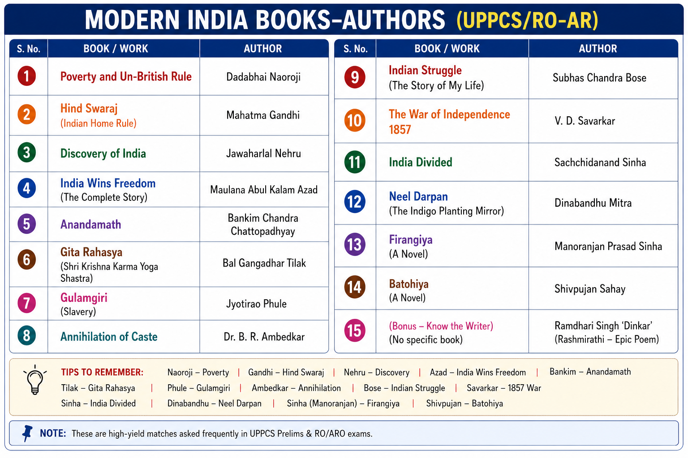

# Topic 10 — Books & Authors
### ★ Complete Source of Truth — No other book/notes needed for this topic

> **Covers syllabus:** Books and Authors | History Books | Books on Freedom Movement | Political Books | Books by Ambedkar | Books Related to Governors-General | Books on Partition | Bankim Chandra Chattopadhyay | Bhojpuri Literature | Realistic Novels | Anandamath | Poverty and Un-British Rule | Hind Swaraj | Discovery of India | India Wins Freedom | Gita Rahasya | Gulamgiri | Annihilation of Caste  
> **Sources baked in:** Spectrum, Bipan Chandra, standard Modern India lists, UPPCS Prelims PYQs 2018–2025, RO-ARO culture hits (Firangiya etc.; local `pyq/ro-aro/` not yet in repo)  
> **Exam weight:** ★★★ High — book↔author matching, year traps, freedom-movement classics  
> **Last verified:** July 2026

---

## Quick Revision Box — Raata This First

```
SYLLABUS EIGHT (automatic):
  Anandamath — Bankim Chandra Chattopadhyay (1882); contains Vande Mataram
  Poverty and Un-British Rule in India — Dadabhai Naoroji (1901) ← 2021 Q139
  Hind Swaraj — M.K. Gandhi (1909)
  The Discovery of India — Jawaharlal Nehru (Ahmednagar jail; pub. 1946)
  India Wins Freedom — Maulana Abul Kalam Azad
  Gita Rahasya — Bal Gangadhar Tilak ← 2020 Q26
  Gulamgiri — Jyotiba Phule (1873, Marathi)
  Annihilation of Caste — B.R. Ambedkar (1936)

2020 Q26 MATCH:
  The Story of My Deportation — Lala Lajpat Rai
  Gita Rahasya — Tilak
  A Nation in Making — Surendranath Banerjee
  India Wins Freedom — Azad
  → A (3, 4, 1, 2)

HISTORIOGRAPHY:
  The Rise and Growth of Economic Nationalism in India — Bipan Chandra ← 2019 Q97

EXTRA HIGH-YIELD:
  My Experiments with Truth — Gandhi | Toward Freedom — Nehru
  Satyarth Prakash — Dayanand | Neel Darpan — Dinabandhu Mitra
  Arctic Home in the Vedas — Tilak | Unhappy India — Lajpat Rai (reply to Mayo’s Mother India)
  Economic History of India — R.C. Dutt
  Pakistan or the Partition of India — Ambedkar
  Freedom at Midnight — Collins & Lapierre | Train to Pakistan — Khushwant Singh
  The Indian Struggle — Subhas Chandra Bose | An Indian Pilgrim — Bose
  The Indian War of Independence — V.D. Savarkar (1909; on 1857)
  India Divided — Rajendra Prasad | Why I Am an Atheist — Bhagat Singh
  Gitanjali — Rabindranath Tagore (Nobel 1913)
  Tuhfat-ul-Muwahhidin / Gift to Monotheists — Raja Rammohan Roy
  Causes of the Indian Mutiny (Asbab-e-Baghawat-e-Hind) — Sir Syed Ahmad Khan
  History of the Indian National Congress — Pattabhi Sitaramayya
  Problems of the Far East — Lord Curzon | My Indian Years — Lord Hardinge
  What Congress and Gandhi have done to the Untouchables — Ambedkar
  Young India — Lala Lajpat Rai

AMBEDKAR CLUSTER:
  Annihilation of Caste | Who Were the Shudras? | The Untouchables
  Pakistan or the Partition of India | States and Minorities | The Buddha and His Dhamma
  What Congress and Gandhi have done to the Untouchables

BANKIM CLUSTER:
  Anandamath | Durgeshnandini | Kapalkundala | Devi Chaudhurani

UP ANGLE / BHOJPURI (★★ — RO-ARO + UP culture):
  Firangiya / Firangia — Manoranjan Prasad Sinha (1921, Non-Cooperation; anti-British) ← RO-ARO 2021
  Batohiya — Raghuveer Narayan (1911; called Vande Mataram of Bhojpuri)
  Bidesiya — Bhikhari Thakur (Shakespeare of Bhojpuri; migrant theme; also Beti Bechwa, Gabarghichor)
  Achhut Kee Shikayat — Heera Dom (1914; early printed Dalit/Bhojpuri protest poem)
  Premchand — Godaan / Gaban / Sevasadan / Kafan (Hindi realist social novels)
```

### Must-Know Term Comparisons (very frequently asked)

| Term | One-line difference | Hindi |
|------|---------------------|-------|
| **Anandamath vs Hind Swaraj** | Bankim nationalist novel (1882) vs Gandhi’s Swaraj dialogue (1909) | आनंदमठ / हिंद स्वराज |
| **Discovery of India vs India Wins Freedom** | Nehru’s civilisational narrative vs Azad’s freedom memoir | भारत एक खोज / इंडिया विन्स फ्रीडम |
| **Gita Rahasya vs Arctic Home in the Vedas** | Both Tilak; Gita ethics/politics vs Vedic homeland theory | गीता रहस्य / आर्कटिक होम |
| **Gulamgiri vs Annihilation of Caste** | Phule’s caste-slavery tract vs Ambedkar’s destroy-caste argument | गुलामगिरी / जाति का विनाश |
| **Poverty… (Naoroji) vs Economic Nationalism (Bipan)** | 1901 drain classic vs later historiography of economic nationalism | दरिद्रता… / आर्थिक राष्ट्रवाद |
| **Nation in Making vs Story of My Deportation** | Banerjee autobiography vs Lajpat Rai deportation memoir | ए नेशन इन मेकिंग / डिपोर्टेशन |
| **Neel Darpan vs Anandamath** | Dinabandhu Mitra indigo play vs Bankim Sannyasi novel | नील दर्पण / आनंदमठ |
| **Bidesiya vs Firangiya** | Bhikhari Thakur’s migrant folk-drama vs Manoranjan Prasad Sinha’s 1921 anti-British Bhojpuri poem | बिदेसिया / फिरंगिया |
| **Batohiya (poem) vs Batohiya (character)** | Raghuveer Narayan’s 1911 patriotic poem vs traveller-character inside Thakur’s *Bidesiya* play | बटोहिया |
| **Realistic novel vs Political pamphlet** | Social fiction (Premchand) vs argumentative tract (Hind Swaraj / Annihilation) | यथार्थवादी उपन्यास / राजनीतिक पुस्तिका |

### Memory Tricks

| Trick | Remembers |
|-------|-----------|
| **BAG-NAG-GIA** | Bankim–Anandamath; Gandhi–Hind Swaraj; Nehru–Discovery; Azad–Freedom; Naoroji–Poverty; Tilak–Gita; Phule–Gulamgiri; Ambedkar–Annihilation |
| **Poverty = 1901** | Naoroji year |
| **2020 four** | Deportation–Lajpat; Gita–Tilak; Nation–Banerjee; Freedom–Azad |
| **Bipan = Economic Nationalism** | 2019 Q97 |
| **Vande Mataram ∈ Anandamath** | Bankim |
| **Firangiya = Manoranjan** | RO-ARO anti-British Bhojpuri poem |
| **Batohiya = Raghuveer Narayan** | Bhojpuri patriotic song |
| **Bidesiya = Bhikhari Thakur** | Shakespeare of Bhojpuri |

---



## 10.1 Books & Authors — Overview

### Definitions

| Term | Meaning |
|------|---------|
| **Book–author matching** | Prelims pattern that pairs a title with its writer |
| **Freedom-movement book** | Work by or about nationalist politics and leaders |
| **Historiography book** | Later scholarly interpretation of nationalism/economy |

### Causes — Why Books Matter in Modern India Notes

1. Nationalists used print to spread ideology faster than speeches alone.
2. Novels and songs created emotional nationalism (Bankim / Vande Mataram).
3. Economic tracts turned poverty into a political charge against empire (Naoroji, Dutt).
4. Memoirs preserved insider accounts of negotiations and conflicts (Azad, Banerjee, Lajpat Rai).
5. Social radicals used books as weapons against caste (Phule, Ambedkar).

### Books & Authors — How It Works

- UPPCS usually asks **who wrote this** or **which pair is wrong**, not a full literary essay.
- First lock the **syllabus eight**. Then add the **2020 four-book set** and **Bipan Chandra’s historiography title**.
- Learn twin titles for the same author so options cannot swap them (Tilak, Gandhi, Nehru, Ambedkar, Lajpat Rai).
- Only a few years are exam-critical; the highest-yield is **Poverty and Un-British Rule = 1901**.
- Keep Modern India books separate from ancient/medieval historiography asked in other sections.
- Trap: "Discovery of India by Azad." Azad wrote **India Wins Freedom**.
- Trap: "Gita Rahasya by Gandhi." Gita Rahasya = **Tilak**.
- Trap: "Gulamgiri by Ambedkar." Gulamgiri = **Phule**.
- Trap: "Poverty book published in 1885." Year is **1901**.

> **Exam note:** One drill before Prelims = syllabus eight + 2020 match + 1901 year.

### Exam Facts (raata)

- Matching beats summary in Prelims
- Critical year: **1901** (Naoroji)
- Azad ≠ Nehru titles
- Tilak = Gita Rahasya
- Phule = Gulamgiri; Ambedkar = Annihilation of Caste

### PYQs — Overview

1. **(UPPCS Prelims 2020, Q26)** Four freedom books matching → **A (3 4 1 2)**.

2. **(UPPCS Prelims 2021, Q139)** Poverty book year → **1901**.

### Examples (10.1)

| Example | What it teaches |
|---------|-----------------|
| **2020 match set** | Classic pattern |
| **1901 year** | Rare date ask |
| **Bipan 2019** | Historiography ask |

---

## 10.2 Master Match Table

| Book | Author | Tag |
|------|--------|-----|
| **Anandamath** | Bankim Chandra Chattopadhyay | Vande Mataram; 1882 |
| **Poverty and Un-British Rule in India** | Dadabhai Naoroji | Drain; **1901** |
| **Hind Swaraj** | M.K. Gandhi | True Swaraj critique; 1909 |
| **The Discovery of India** | Jawaharlal Nehru | Civilisation + nation; 1946 |
| **India Wins Freedom** | Abul Kalam Azad | Freedom memoir |
| **Gita Rahasya** | B.G. Tilak | Gita + nationalist ethics |
| **Gulamgiri** | Jyotiba Phule | Caste as slavery |
| **Annihilation of Caste** | B.R. Ambedkar | Destroy caste |
| **A Nation in Making** | Surendranath Banerjee | Early nationalist autobiography |
| **The Story of My Deportation** | Lala Lajpat Rai | Deportation memoir |
| **My Experiments with Truth** | M.K. Gandhi | Autobiography |
| **Toward Freedom** | Jawaharlal Nehru | Autobiography |
| **Satyarth Prakash** | Dayanand Saraswati | Arya Samaj doctrine |
| **Neel Darpan** | Dinabandhu Mitra | Indigo oppression |
| **Economic History of India** | R.C. Dutt | Economic nationalism |
| **Rise and Growth of Economic Nationalism in India** | Bipan Chandra | Historiography |
| **Unhappy India** | Lala Lajpat Rai | Reply to *Mother India* |
| **Arctic Home in the Vedas** | B.G. Tilak | Vedic homeland theory |
| **Pakistan or the Partition of India** | B.R. Ambedkar | Partition analysis |
| **The Buddha and His Dhamma** | B.R. Ambedkar | Buddhist work |
| **Freedom at Midnight** | Collins & Lapierre | Popular Partition narrative |
| **Train to Pakistan** | Khushwant Singh | Partition novel |
| **Firangiya / Firangia** | Manoranjan Prasad Sinha | Anti-British Bhojpuri poem, 1921 |
| **Batohiya** | Raghuveer Narayan | Bhojpuri patriotic poem, 1911 |
| **Bidesiya** | Bhikhari Thakur | Migrant folk-drama; Shakespeare of Bhojpuri |
| **Achhut Kee Shikayat** | Heera Dom | 1914; early printed Dalit/Bhojpuri protest poem |
| **Godaan / Gaban** | Premchand | Hindi realist social novels |
| **The Indian Struggle** | Subhas Chandra Bose | Freedom-movement narrative |
| **An Indian Pilgrim** | Subhas Chandra Bose | Bose autobiography |
| **The Indian War of Independence** | V.D. Savarkar | 1857 as national war (1909) |
| **India Divided** | Rajendra Prasad | Partition analysis |
| **Why I Am an Atheist** | Bhagat Singh | Revolutionary essay |
| **Gitanjali** | Rabindranath Tagore | Poems; Nobel 1913 |
| **Tuhfat-ul-Muwahhidin** | Raja Rammohan Roy | Against idolatry / monotheism tract |
| **Causes of the Indian Mutiny** | Sir Syed Ahmad Khan | 1857 analysis (Asbab-e-Baghawat-e-Hind) |
| **History of the Indian National Congress** | Pattabhi Sitaramayya | Official Congress history |
| **Mother India** | Katherine Mayo | Anti-India tract; answered by Unhappy India |
| **Problems of the Far East** | Lord Curzon | GG/Viceroy-linked book |
| **My Indian Years** | Lord Hardinge | Viceroy memoir |
| **What Congress and Gandhi have done to the Untouchables** | B.R. Ambedkar | Critique of Congress caste politics |
| **Young India** | Lala Lajpat Rai | Nationalist interpretation |

### Master Table — How It Works

- This table is the revision weapon. Read author aloud while covering the title column.
- Syllabus eight first; 2020 four second; Ambedkar and Bankim clusters third.
- Trap: "Neel Darpan by Bankim." Dinabandhu Mitra wrote it.
- Trap: "Unhappy India by Katherine Mayo." Mayo wrote *Mother India*; Lajpat Rai replied with **Unhappy India**.
- Trap: "Economic Nationalism book by Naoroji." That historiography title is **Bipan Chandra**.
- Trap: "Train to Pakistan by Azad." Fiction by **Khushwant Singh**.
- Trap: "Toward Freedom by Azad." Toward Freedom = **Nehru** autobiography.
- Trap: "Satyarth Prakash by Vivekananda." Dayanand wrote it.
- Trap: "Arctic Home by Dayanand." Tilak wrote it.
- Keep twin-author rows linked so one remembered title does not erase the other.

> **Exam note:** If a match question appears, eliminate using twin-title traps first.

### Exam Facts (raata)

- Syllabus eight locked
- 2020 four locked
- Bipan Chandra title locked
- Twin authors: Tilak, Gandhi, Nehru, Ambedkar, Lajpat Rai
- Neel Darpan ≠ Anandamath

### PYQs — Master Table

1. **(UPPCS Prelims 2020, Q26)** Deportation / Gita / Nation / Freedom.

2. **(UPPCS Prelims 2019, Q97)** Economic Nationalism → **Bipan Chandra**.

### Examples (10.2)

| Example | What it teaches |
|---------|-----------------|
| **Twin Tilak titles** | Gita + Arctic Home |
| **Twin Gandhi titles** | Hind Swaraj + Autobiography |
| **Twin Nehru titles** | Discovery + Toward Freedom |

---

## 10.3 Anandamath & Bankim Chandra Chattopadhyay

### Definitions

| Term | Meaning |
|------|---------|
| **Bankim Chandra Chattopadhyay (1838–1894)** | Bengali novelist; father figure of modern Bengali fiction and literary nationalism |
| **Anandamath (1882)** | Nationalist novel set against Sannyasi rebellion / famine backdrop |
| **Vande Mataram** | Song from Anandamath that became a nationalist anthem and later the national song |

### Causes — Why Anandamath Mattered

1. Bengal’s print culture needed fiction that could carry political emotion.
2. Memory of famine and resistance gave Bankim a dramatic historical frame.
3. Nationalists needed a mother-symbol for the country beyond dry petitions.
4. Vernacular literature could reach readers English pamphlets could not.

### Course — Step by Step

1. Bankim writes major Bengali novels including Durgeshnandini, Kapalkundala, and Devi Chaudhurani.
2. In **1882** he publishes **Anandamath**.
3. The story imagines ascetic patriots fighting oppression in a famine-scarred Bengal setting.
4. **Vande Mataram** appears in the novel and spreads through nationalist meetings.
5. Swadeshi-era politics later sings and ritualises the song widely.
6. First stanzas become India’s **national song**.
7. Bankim’s fiction becomes the model of literary nationalism in exams.
8. Students must separate Bankim’s novel from Dinabandhu Mitra’s indigo play *Neel Darpan*.

### Anandamath / Bankim — How It Works

- Anandamath is not a Congress resolution. It is a **novel that politicised emotion**.
- Exam triangle: **Bankim ↔ Anandamath ↔ Vande Mataram**.
- Bankim’s other novels matter for literature depth, but Anandamath is the Modern History scoring title.
- Trap: "Anandamath written by Tagore." Tagore is a different literary-nationalist stream.
- Trap: "Vande Mataram written as a separate pamphlet by Tilak." It comes from **Anandamath**.
- Trap: "Anandamath = indigo planter novel." That is closer to **Neel Darpan**.
- Trap: "Bankim wrote Hind Swaraj." Hind Swaraj = **Gandhi**.
- Trap: "Anandamath published in 1905 with Partition." Novel is **1882**; Partition politics reused its song later.
- For Prelims, author match beats plot summary.

> **Exam note:** Bankim = **Anandamath + Vande Mataram**.

### Results

| Result | Why it matters |
|--------|----------------|
| Literary nationalism | Fiction as political force |
| Vande Mataram | National song origin |
| Bankim as exam name | Permanent matching staple |

### Exam Facts (raata)

- Author: **Bankim Chandra Chattopadhyay**
- Year: **1882**
- Song: **Vande Mataram**
- Language: Bengali
- Not Neel Darpan

### PYQs — Bankim / Anandamath

1. **(UPSC pattern)** Anandamath author → **Bankim Chandra Chattopadhyay**.

2. **(UPSC pattern)** Vande Mataram is associated with → **Anandamath**.

### Examples (10.3)

| Example | What it teaches |
|---------|-----------------|
| **Vande Mataram** | Song–novel link |
| **1882** | Publication frame |
| **Neel Darpan contrast** | Wrong-author trap |

---

## 10.4 Poverty and Un-British Rule in India — Dadabhai Naoroji

### Definitions

| Term | Meaning |
|------|---------|
| **Poverty and Un-British Rule in India** | Naoroji’s major book stating the Drain of Wealth case |
| **Drain of Wealth** | Argument that Britain systematically drained India’s resources |
| **Un-British rule** | Rule violating Britain’s own professed liberal principles |

### Causes

1. Naoroji needed a systematic statement of India’s poverty under colonial rule.
2. Drain theory had to move from speeches into a durable published text.
3. British public opinion and Parliament were his target audience as much as Indians.
4. Economic nationalism required numbers and moral language together.

### Course — Step by Step

1. Naoroji develops Drain arguments through papers and public life in India and Britain.
2. He founds East India Association (1866) and leads early Congress economics.
3. In **1901** he publishes **Poverty and Un-British Rule in India**.
4. The book links Indian poverty to colonial tribute, unrequited exports, and unfair fiscal arrangements.
5. “Un-British” in the title means betrayal of British justice, not a call to hate British ideals.
6. The work becomes the bible of Moderate economic critique.
7. Later historians (including Bipan Chandra) study this tradition as economic nationalism.
8. UPPCS asks the **publication year** directly.

### Poverty and Un-British Rule — How It Works

- This is the highest-yield **year + author** book in the syllabus list.
- Author = **Dadabhai Naoroji**; year = **1901**; theme = **Drain / poverty**.
- Do not swap it with Bipan Chandra’s later book on the growth of economic nationalism.
- Trap: "Published in 1900 / 1902 / 1903." Correct is **1901** — **2021 Q139**.
- Trap: "Written by R.C. Dutt." Dutt wrote *Economic History of India*; Naoroji wrote *Poverty…*.
- Trap: "Written by Gokhale." Gokhale used similar critique; book author is Naoroji.
- Trap: "Book proves Moderates hated all British connection." They attacked Un-British exploitation while valuing British political ideals.
- Trap: "Same as Hind Swaraj." Hind Swaraj is Gandhi 1909 on civilisation/Swaraj.

> **Exam note:** Naoroji + **1901** + Drain = locked triangle.

### Results

| Result | Why it matters |
|--------|----------------|
| Canon of economic nationalism | Poverty as politics |
| Moderate intellectual core | Evidence-based critique |
| Direct Prelims year ask | 2021 scoring |

### Exam Facts (raata)

- Author: **Dadabhai Naoroji**
- Year: **1901**
- Theme: Drain of Wealth
- Not Bipan Chandra’s historiography title
- Not R.C. Dutt’s Economic History

### PYQs — Naoroji Book

1. **(UPPCS Prelims 2021, Q139)** Published in → **1901**.

2. **(UPSC pattern)** Drain of Wealth associated with → **Dadabhai Naoroji**.

### Examples (10.4)

| Example | What it teaches |
|---------|-----------------|
| **1901** | Year trap |
| **Drain** | Content tag |
| **Un-British** | Moral-political phrase |

---

## 10.5 Hind Swaraj — M.K. Gandhi

### Definitions

| Term | Meaning |
|------|---------|
| **Hind Swaraj (1909)** | Gandhi’s dialogue-form book on true Swaraj and modern civilisation |
| **True Swaraj** | Self-rule as moral self-control, not only transfer of political office |

### Causes

1. Gandhi wanted to explain why machine civilisation and blind imitation of the West were not freedom.
2. The book answers a reader/critic in dialogue form, making ideology teachable.
3. Written in the Indian-ocean political climate after his South Africa years.
4. It sets ethical foundations later visible in non-violence and constructive work.

### Course — Step by Step

1. Gandhi writes **Hind Swaraj in 1909** (originally in Gujarati; English follows).
2. The text criticises railways, lawyers, doctors, and modern civilisation as often false progress.
3. It argues Swaraj begins with rule over the self.
4. Passive resistance / soul-force is preferred to arms.
5. The book is banned by the colonial government for a time, proving its political sting.
6. Later Gandhi’s mass movements rest on many of these moral claims.
7. Students must not confuse it with Nehru’s Discovery or Tilak’s Gita Rahasya.
8. Autobiography *My Experiments with Truth* is a different Gandhi book.

### Hind Swaraj — How It Works

- Hind Swaraj is a **political-philosophical tract**, not a memoir and not a novel.
- Year tag: **1909**; author: **Gandhi**.
- Core idea: political freedom without moral Swaraj is incomplete.
- Trap: "Hind Swaraj by Nehru." Nehru = Discovery / Toward Freedom.
- Trap: "Hind Swaraj by Tilak." Tilak = Gita Rahasya / Arctic Home.
- Trap: "Hind Swaraj = Gandhi autobiography." Autobiography is **My Experiments with Truth**.
- Trap: "Written in 1942 Quit India year." Written **1909**.
- Trap: "It praises modern industrial civilisation." It criticises it.

> **Exam note:** Gandhi = **Hind Swaraj (1909)** + autobiography separately.

### Results

| Result | Why it matters |
|--------|----------------|
| Ethical Swaraj vocabulary | Foundation of Gandhian politics |
| Anti-blind-Westernisation critique | Distinct from Moderate constitutionalism |
| Exam twin with autobiography | Prevents title swap |

### Exam Facts (raata)

- Author: **Gandhi**
- Year: **1909**
- Form: dialogue
- Not Discovery of India
- Not Gita Rahasya

### PYQs — Hind Swaraj

1. **(UPSC pattern)** Hind Swaraj author → **Mahatma Gandhi**.

2. **(UPSC pattern)** Hind Swaraj year → **1909**.

### Examples (10.5)

| Example | What it teaches |
|---------|-----------------|
| **Dialogue form** | Genre |
| **1909** | Date |
| **Autobiography contrast** | Twin Gandhi titles |

---

## 10.6 The Discovery of India — Jawaharlal Nehru

### Definitions

| Term | Meaning |
|------|---------|
| **The Discovery of India** | Nehru’s book on India’s past, culture, and national movement |
| **Ahmednagar Fort writing** | Composed during imprisonment (1942–46 period memory) |

### Causes

1. Jail time gave Nehru space to reflect on India’s long civilisation.
2. He wanted a narrative linking ancient heritage to modern nationalism.
3. The book educates readers about unity in diversity as a political resource.
4. It also narrates the freedom struggle from a Congress socialist-nationalist viewpoint.

### Course — Step by Step

1. During imprisonment connected with Quit India years, Nehru writes the manuscript.
2. The book surveys India’s philosophy, society, invasions, culture, and modern politics.
3. It is published in **1946**.
4. It becomes one of the most cited nationalist interpretations of India’s past.
5. Separately, Nehru’s autobiography is **Toward Freedom** (also called *An Autobiography*).
6. Exams love swapping Discovery with Azad’s *India Wins Freedom*.
7. Discovery is civilisational-national; Azad’s book is more a freedom-struggle memoir.
8. Keep both Nehru titles clear.

### Discovery of India — How It Works

- Author = **Nehru**; famous writing context = **prison**; publication around **1946**.
- Content = India’s civilisation + national movement synthesis.
- Trap: "Discovery of India by Azad." Wrong.
- Trap: "Discovery of India is Nehru’s only book." Also **Toward Freedom**.
- Trap: "Written by Gandhi in 1909." That is Hind Swaraj.
- Trap: "It is only about Partition negotiations." That is closer to Azad/Freedom at Midnight territory.
- Trap: "Published in 1857." Absurd chronology trap; it is mid-20th century.
- Use it as Nehru’s big interpretive book; use Toward Freedom when the question wants autobiography.

> **Exam note:** Nehru = **Discovery of India**; Azad = **India Wins Freedom**.

### Results

| Result | Why it matters |
|--------|----------------|
| Civilisational nationalism text | Broad reader influence |
| Prison-literature icon | Freedom-struggle culture |
| Matching staple | Against Azad swap |

### Exam Facts (raata)

- Author: **Jawaharlal Nehru**
- Pub.: **1946**
- Context: Ahmednagar imprisonment
- Twin: Toward Freedom
- Not Azad

### PYQs — Discovery of India

1. **(UPSC pattern)** Discovery of India author → **Jawaharlal Nehru**.

2. **(UPPCS Prelims 2020, Q26)** India Wins Freedom is Azad, not Nehru.

### Examples (10.6)

| Example | What it teaches |
|---------|-----------------|
| **Prison writing** | Context |
| **1946** | Publication |
| **Azad contrast** | Title trap |

---

## 10.7 India Wins Freedom — Maulana Abul Kalam Azad

### Definitions

| Term | Meaning |
|------|---------|
| **India Wins Freedom** | Azad’s memoir of the freedom struggle and endgame politics |
| **Maulana Abul Kalam Azad** | Congress leader; longest-serving Congress President in a continuous wartime phase; educationist |

### Causes

1. Azad wanted an insider record of negotiations, conflicts, and Partition politics.
2. Memoirs compete with official British and other leader narratives.
3. His account is especially cited on Cabinet Mission / Partition controversies.
4. UPPCS uses the title in matching sets with other freedom books.

### Course — Step by Step

1. Azad participates at the top of Congress politics through the 1940s.
2. After independence he writes/publishes the memoir **India Wins Freedom**.
3. The book discusses Congress–League–British triangular politics.
4. It becomes a standard freedom-movement book in exam lists.
5. In **2020 Q26** it is correctly matched with Azad.
6. Students must not assign it to Nehru or Patel.
7. Pair it against Discovery of India to avoid swaps.
8. Partition literature section also lists it under firsthand political memoir.

### India Wins Freedom — How It Works

- Pure matching fact: **India Wins Freedom = Azad**.
- Genre = political memoir, not civilisational survey.
- Trap: "India Wins Freedom by Nehru." Nehru = Discovery / Toward Freedom.
- Trap: "India Wins Freedom by Patel." Wrong.
- Trap: "Same book as Freedom at Midnight." Freedom at Midnight = Collins & Lapierre.
- Trap: "Azad wrote Gita Rahasya." Gita Rahasya = Tilak.
- Trap: "Azad wrote Story of My Deportation." That is Lajpat Rai.
- In any four-book match, place Azad only against India Wins Freedom and nowhere else.

> **Exam note:** 2020 set locks Azad to **India Wins Freedom**.

### Results

| Result | Why it matters |
|--------|----------------|
| Insider endgame narrative | Partition/freedom source |
| Direct matching staple | 2020 Q26 |
| Contrast with Nehru | Prevents swap |

### Exam Facts (raata)

- Author: **Abul Kalam Azad**
- Genre: memoir
- 2020 match: correct with Azad
- Not Discovery of India
- Not Freedom at Midnight

### PYQs — India Wins Freedom

1. **(UPPCS Prelims 2020, Q26)** India Wins Freedom → **Azad**.

2. **(UPSC pattern)** India Wins Freedom author → **Maulana Azad**.

### Examples (10.7)

| Example | What it teaches |
|---------|-----------------|
| **2020 code** | Exact match |
| **Memoir genre** | Type |
| **Nehru contrast** | Trap |

---

## 10.8 Gita Rahasya — Bal Gangadhar Tilak

### Definitions

| Term | Meaning |
|------|---------|
| **Gita Rahasya (Bhagavad Gita Rahasya)** | Tilak’s commentary presenting the Gita as a call to active karma-yoga |
| **Arctic Home in the Vedas** | Tilak’s other famous book on Vedic homeland |

### Causes

1. Tilak wanted scriptural support for action-oriented nationalism.
2. Imprisonment periods gave him time for philosophical-political writing.
3. He sought to counter purely renunciatory readings of the Gita.
4. Exams use Gita Rahasya as his signature book title.

### Course — Step by Step

1. Tilak studies and writes on the Gita as philosophy of action.
2. **Gita Rahasya** argues for karma-yoga and righteous action in the world.
3. The book links spiritual discourse with public duty — useful for Extremist politics.
4. Separately he writes **Arctic Home in the Vedas**.
5. UPPCS 2020 matches Gita Rahasya specifically with Tilak.
6. Do not give Gita Rahasya to Gandhi or Aurobindo in a hurry.
7. Tilak’s newspapers (Kesari/Maratha) are press facts, not this book’s title.
8. Remember he never presidied Congress, but he did write major books.

### Gita Rahasya — How It Works

- Matching fact: **Gita Rahasya = Tilak**.
- Second Tilak book often used in other papers: **Arctic Home in the Vedas**.
- Trap: "Gita Rahasya by Gandhi." Wrong.
- Trap: "Gita Rahasya by Aurobindo." Aurobindo has Gita essays; exam signature for this title is Tilak.
- Trap: "Tilak wrote India Wins Freedom." Wrong.
- Trap: "Gita Rahasya = Hind Swaraj." Different author and purpose.
- Trap: "Only newspaper Kesari, no books." He has major books.
- If a question gives Tilak, check whether it wants Gita Rahasya or Arctic Home before answering.

> **Exam note:** 2020 Q26 — **Gita Rahasya → Tilak**.

### Results

| Result | Why it matters |
|--------|----------------|
| Scriptural nationalism | Action ethic |
| Matching staple | 2020 |
| Twin-title awareness | Arctic Home |

### Exam Facts (raata)

- Author: **Tilak**
- Twin: Arctic Home in the Vedas
- 2020 match confirmed
- Not Gandhi
- Not Azad

### PYQs — Gita Rahasya

1. **(UPPCS Prelims 2020, Q26)** Gita Rahasya → **Tilak**.

2. **(UPSC pattern)** Arctic Home in the Vedas → **Tilak**.

### Examples (10.8)

| Example | What it teaches |
|---------|-----------------|
| **Karma-yoga reading** | Content tag |
| **2020 match** | Direct PYQ |
| **Arctic Home twin** | Second title |

---

## 10.9 Gulamgiri — Jyotiba Phule

### Definitions

| Term | Meaning |
|------|---------|
| **Gulamgiri (Slavery)** | Phule’s critique of caste domination as slavery |
| **Jyotiba / Jyotirao Phule** | Anti-caste reformer of Maharashtra; Satyashodhak founder |

### Causes

1. Phule needed a sharp text exposing Brahmanical social slavery.
2. Lower-caste education and equality required an intellectual manifesto.
3. Dialogue form made the argument accessible.
4. The book supports the same struggle as Satyashodhak politics.

### Course — Step by Step

1. Phule writes **Gulamgiri in 1873** in Marathi.
2. It attacks caste hierarchy and priestly domination.
3. Slavery becomes the metaphor for caste oppression.
4. The text strengthens anti-caste public argument in western India.
5. Exams pair Gulamgiri with Phule the way Annihilation is paired with Ambedkar.
6. Do not assign Gulamgiri to Ambedkar or Periyar.
7. Link with Satyashodhak Samaj (1873) in reform notes.
8. Language memory: originally **Marathi**.

### Gulamgiri — How It Works

- Triangle: **Phule ↔ Gulamgiri ↔ anti-caste**.
- Year zone **1873** aligns with Satyashodhak founding memory.
- Trap: "Gulamgiri by Ambedkar." Ambedkar = Annihilation of Caste.
- Trap: "Gulamgiri by Dayanand." Dayanand = Satyarth Prakash.
- Trap: "Gulamgiri is a Partition novel." No — caste critique.
- Trap: "Written in English first." Classic memory is **Marathi**.
- Trap: "Phule wrote Anandamath." Bankim did.
- Keep Gulamgiri in the social-reform bookshelf beside Satyashodhak, not in the Partition bookshelf.

> **Exam note:** Phule = **Gulamgiri**; Ambedkar = **Annihilation of Caste**.

### Results

| Result | Why it matters |
|--------|----------------|
| Anti-caste manifesto | Social radicalism |
| Exam contrast with Ambedkar | Prevents swap |
| Link to Satyashodhak | Reform topic bridge |

### Exam Facts (raata)

- Author: **Jyotiba Phule**
- Year: **1873**
- Language: Marathi
- Theme: caste as slavery
- Not Ambedkar

### PYQs — Gulamgiri

1. **(UPSC pattern)** Gulamgiri author → **Jyotiba Phule**.

2. **(UPPCS theme)** Phule associated with anti-caste movement (book supports that identity).

### Examples (10.9)

| Example | What it teaches |
|---------|-----------------|
| **Slavery metaphor** | Content |
| **1873** | Date zone |
| **Ambedkar contrast** | Trap |

---

## 10.10 Books by B.R. Ambedkar

### Definitions

| Term | Meaning |
|------|---------|
| **Annihilation of Caste (1936)** | Ambedkar’s radical critique arguing caste must be destroyed, not mildly reformed |
| **Pakistan or the Partition of India** | Ambedkar’s analysis of communal politics and partition |
| **The Buddha and His Dhamma** | Ambedkar’s major work on Buddhism |

### Causes

1. Ambedkar fought caste as a structural injustice needing intellectual demolition.
2. Political debates on Pakistan/Partition needed legal-political analysis from a Dalit-minority lens.
3. Conversion to Buddhism later needed a doctrinal-literary foundation.
4. Syllabus specifically flags Ambedkar books, especially Annihilation of Caste.

### Course — Step by Step

1. Ambedkar prepares **Annihilation of Caste** as a speech text (1936) that becomes a famous published tract.
2. He argues caste cannot be cured by temple entry tinkering alone.
3. He writes on constitutional rights, minorities, and political safeguards (*States and Minorities*).
4. **Pakistan or the Partition of India** analyses Muslim League politics and partition logic.
5. Historical-sociological works include **Who Were the Shudras?** and **The Untouchables**.
6. Late in life he writes **The Buddha and His Dhamma**.
7. For Prelims, Annihilation is the first recall; Partition book is the second.
8. Never swap Annihilation with Phule’s Gulamgiri.

### Ambedkar Books — How It Works

- Syllabus anchor: **Annihilation of Caste = Ambedkar**.
- Partition syllabus bullet also pulls in **Pakistan or the Partition of India**.
- Trap: "Annihilation of Caste by Phule/Periyar." Author is **Ambedkar**.
- Trap: "Ambedkar wrote Gulamgiri." Phule did.
- Trap: "Ambedkar wrote Hind Swaraj." Gandhi did.
- Trap: "Only one Ambedkar book exists." Know the cluster.
- Trap: "Buddha and His Dhamma is by Nehru." Ambedkar.
- Political books and partition books sections both reuse these titles.

> **Exam note:** Ambedkar first = **Annihilation of Caste**; also know Partition title.

### Results

| Result | Why it matters |
|--------|----------------|
| Radical caste critique | Social-political thought |
| Partition analysis | Endgame politics |
| Buddhist work | Later life ideology |

### Key Ambedkar Titles

| Book | Tag |
|------|-----|
| **Annihilation of Caste** | Destroy caste |
| **Pakistan or the Partition of India** | Partition politics |
| **Who Were the Shudras?** | Historical sociology |
| **The Untouchables** | Origin of untouchability |
| **States and Minorities** | Safeguards |
| **The Buddha and His Dhamma** | Buddhism |
| **What Congress and Gandhi have done to the Untouchables** | Critique of Congress on caste |

### Exam Facts (raata)

- Annihilation of Caste: **1936**, Ambedkar
- Partition book: Ambedkar
- Not Gulamgiri
- Cluster memory beats single-title memory
- Syllabus explicitly lists Ambedkar books

### PYQs — Ambedkar

1. **(UPSC pattern)** Annihilation of Caste → **B.R. Ambedkar**.

2. **(UPSC pattern)** Pakistan or the Partition of India → **Ambedkar**.

### Examples (10.10)

| Example | What it teaches |
|---------|-----------------|
| **1936 tract** | Annihilation |
| **Partition analysis** | Political book |
| **Phule contrast** | Gulamgiri trap |

---

## 10.11 Books on Freedom Movement & Political Books

### Definitions

| Term | Meaning |
|------|---------|
| **Freedom-movement book** | Memoir/tract tied to nationalist leaders and events |
| **Political book** | Work primarily arguing political theory or strategy |

### High-Yield Freedom / Political Set

| Book | Author |
|------|--------|
| A Nation in Making | Surendranath Banerjee |
| The Story of My Deportation | Lala Lajpat Rai |
| Unhappy India | Lala Lajpat Rai |
| Young India | Lala Lajpat Rai |
| India Wins Freedom | Abul Kalam Azad |
| Hind Swaraj | M.K. Gandhi |
| My Experiments with Truth | M.K. Gandhi |
| Discovery of India | Jawaharlal Nehru |
| Toward Freedom | Jawaharlal Nehru |
| Gita Rahasya | B.G. Tilak |
| The Indian Struggle | Subhas Chandra Bose |
| An Indian Pilgrim | Subhas Chandra Bose |
| The Indian War of Independence | V.D. Savarkar |
| India Divided | Rajendra Prasad |
| Why I Am an Atheist | Bhagat Singh |
| History of the Indian National Congress | Pattabhi Sitaramayya |
| Causes of the Indian Mutiny | Sir Syed Ahmad Khan |
| Tuhfat-ul-Muwahhidin | Raja Rammohan Roy |
| Gitanjali | Rabindranath Tagore |

### Freedom / Political Books — How It Works

- **2020 Q26** is the template: Deportation–Lajpat Rai; Gita–Tilak; Nation–Banerjee; Freedom–Azad.
- Political books include Hind Swaraj and Annihilation of Caste as argumentative tracts.
- Revolutionary / endgame extras: Bose (*Indian Struggle*), Savarkar (*Indian War of Independence*), Bhagat Singh (*Why I Am an Atheist*), Rajendra Prasad (*India Divided*).
- Trap: "Nation in Making by Gokhale." Banerjee wrote it.
- Trap: "Story of My Deportation by Savarkar." Lajpat Rai wrote it. Savarkar’s signature history book is **The Indian War of Independence**.
- Trap: "Unhappy India by Mayo." Mayo wrote **Mother India**; Lajpat Rai replied with Unhappy India.
- Trap: "Indian Struggle by Nehru." **Bose**.
- Trap: "India Divided by Ambedkar." Ambedkar = *Pakistan or the Partition of India*; Prasad = **India Divided**.
- Trap: "All freedom books are novels." Many are memoirs/tracts.
- Trap: "Banerjee wrote India Wins Freedom." Azad did.
- Revise this set as one flashcard block.

> **Exam note:** Master **2020 Q26** until automatic; also lock Bose / Savarkar / Prasad / Bhagat Singh titles.
### Exam Facts (raata)

- 2020 answer **A (3 4 1 2)**
- Banerjee = Nation in Making
- Lajpat Rai = Deportation (+ Unhappy India)
- Political tracts ≠ only novels
- Azad = India Wins Freedom in that set
- Tilak = Gita Rahasya in that set

### PYQs — Freedom Books

1. **(UPPCS Prelims 2020, Q26)** Four-book match → **A**.

2. **(UPSC pattern)** Nation in Making → **Surendranath Banerjee**.

### Examples (10.11)

| Example | What it teaches |
|---------|-----------------|
| **2020 set** | Core drill |
| **Unhappy India** | Lajpat extra |
| **Hind Swaraj** | Political tract |

---

## 10.12 History Books & Historiography

### Definitions

| Term | Meaning |
|------|---------|
| **History book (exam sense)** | Scholarly or classic work on Indian history/nationalism used in matching |
| **Economic nationalism historiography** | Study of how nationalists critiqued colonial economy |

### Key Titles

| Book | Author |
|------|--------|
| The Rise and Growth of Economic Nationalism in India | **Bipan Chandra** |
| Economic History of India | R.C. Dutt |
| Poverty and Un-British Rule in India | Dadabhai Naoroji |
| The Discovery of India | Jawaharlal Nehru (interpretive history-national narrative) |

### History Books — How It Works

- **2019 Q97** asks Bipan Chandra’s *Rise and Growth of Economic Nationalism in India*.
- Distinguish primary economic critique (Naoroji/Dutt) from later historiography (Bipan Chandra).
- Primary texts create the drain argument; historiography explains how that argument grew into a nationalist school.
- Trap: "Economic Nationalism book by Naoroji." Wrong title/author pairing for that exact book name.
- Trap: "Bipan Chandra wrote Poverty and Un-British Rule." Naoroji did.
- Trap: "R.C. Dutt wrote Anandamath." Bankim did.
- Ancient/medieval historiography matching (Basham, Kosambi, Jayaswal) is out of this Modern India topic’s core.
- For Modern India Prelims, Bipan’s title is the highest-yield pure historiography ask.

> **Exam note:** **2019 Q97 = Bipan Chandra**.

### Exam Facts (raata)

- Bipan Chandra = Economic Nationalism book
- R.C. Dutt = Economic History of India
- Naoroji = Poverty… (1901)
- Historiography ≠ primary nationalist tract
- 2019 Q97 answer: **D**

### PYQs — History Books

1. **(UPPCS Prelims 2019, Q97)** Rise and Growth of Economic Nationalism → **Bipan Chandra**.

2. **(UPPCS Prelims 2021, Q139)** Poverty… year **1901**.

### Examples (10.12)

| Example | What it teaches |
|---------|-----------------|
| **Bipan title** | Direct PYQ |
| **Dutt contrast** | Economic history |
| **Naoroji primary text** | Source vs historiography |

---

## 10.13 Books Related to Governors-General & Books on Partition

### Definitions

| Term | Meaning |
|------|---------|
| **Books related to Governors-General / Viceroys** | Works that record, criticise, or narrate policies of top colonial executives |
| **Partition literature** | Memoirs/novels/histories of 1947 division |

### Useful Links

| Book | How it links |
|------|--------------|
| Poverty and Un-British Rule | Critiques colonial governance/economy under Crown/Company successors |
| India Wins Freedom | Endgame under Wavell/Mountbatten period politics |
| Freedom at Midnight | Popular narrative of Mountbatten–Partition months |
| Pakistan or the Partition of India | Ambedkar’s political analysis |
| India Divided | Rajendra Prasad’s Partition analysis |
| Train to Pakistan | Partition’s human violence in fiction |
| Discovery of India | Broader colonial-national context including late Raj |
| **Problems of the Far East** | **Lord Curzon** — classic GG-linked book title |
| **My Indian Years** | **Lord Hardinge** — Viceroy memoir |
| Mother India | Katherine Mayo; answered by Lajpat Rai’s Unhappy India |

### GG / Partition Books — How It Works

- Syllabus bullet **Books Related to Governors-General** is thin in PYQs; still lock **Curzon → Problems of the Far East** and **Hardinge → My Indian Years**.
- Endgame/Partition scoring set: **Azad + Ambedkar + Rajendra Prasad (India Divided) + Freedom at Midnight + Train to Pakistan**.
- Mountbatten Plan era is popularly narrated in **Freedom at Midnight**.
- Fiction such as Train to Pakistan teaches human consequences; memoirs teach elite politics.
- Trap: "Freedom at Midnight by Azad." Collins & Lapierre.
- Trap: "Train to Pakistan by Nehru." Khushwant Singh.
- Trap: "Pakistan or Partition by Jinnah as author." Ambedkar wrote that title.
- Trap: "India Divided by Ambedkar." **Rajendra Prasad**.
- Trap: "Problems of the Far East by Hardinge." **Curzon**.
- Trap: "No book links to Viceroys." Curzon/Hardinge titles + endgame memoirs are the link.
- Keep fiction and political analysis separate in memory.

> **Exam note:** Partition set = **Azad + Ambedkar + Prasad + Freedom at Midnight + Train to Pakistan**; GG pair = **Curzon / Hardinge**.

### Exam Facts (raata)

- Freedom at Midnight = Collins & Lapierre
- Train to Pakistan = Khushwant Singh
- Partition analysis = Ambedkar title + India Divided (Prasad)
- Memoir = Azad
- Curzon = Problems of the Far East
- Hardinge = My Indian Years
- Not all Partition books are novels
- GG link = Curzon/Hardinge books + Wavell/Mountbatten endgame

### PYQs — Partition / GG-linked

1. **(UPPCS Prelims 2020, Q26)** India Wins Freedom → Azad (endgame memoir).

2. **(UPSC pattern)** Train to Pakistan → Khushwant Singh.

### Examples (10.13)

| Example | What it teaches |
|---------|-----------------|
| **Freedom at Midnight** | Popular history |
| **Ambedkar / Prasad Partition books** | Analysis pair |
| **Curzon / Hardinge** | GG-linked titles |
| **Azad memoir** | Insider politics |

---

## 10.14 Realistic Novels

### Definitions

| Term | Meaning |
|------|---------|
| **Realistic novel** | Fiction portraying social reality — poverty, gender, rural life — rather than pure romance/fantasy |
| **Premchand (Dhanpat Rai)** | Master of modern Hindi–Urdu social realism |

### Realistic Novels — How It Works

- In Modern India / UP culture notes, **Premchand** is the safest realist name: *Godaan*, *Gaban*, *Kafan*, *Sevasadan*.
- Realist fiction exposed landlordism, dowry, colonial-era social hypocrisy, and peasant misery.
- This is different from Bankim’s romantic-political nationalism, though both are “novels.”
- Realism asks you to remember social theme + author, not Vande Mataram-style anthem politics.
- Trap: "Premchand wrote Anandamath." Bankim did.
- Trap: "All nationalist novels are realist." Anandamath is historical-political romance more than Premchand-style social realism.
- Trap: "Godaan by Bankim." Premchand.
- Trap: "Realistic novel means only English novels." Hindi realism is central for UPPCS culture overlap.

> **Exam note:** Premchand = **Godaan / Gaban** social realism.

### Exam Facts (raata)

- Premchand: Godaan, Gaban, Kafan
- Realism = social reality fiction
- Not Bankim
- Not Bhojpuri folk-drama
- Peasant/landlord themes common

### PYQs — Realistic Novels

1. **(UPSC pattern)** Godaan author → **Premchand**.

2. **(UPSC pattern)** Premchand associated with → **Hindi social realism**.

### Examples (10.14)

| Example | What it teaches |
|---------|-----------------|
| **Godaan** | Peasant realism |
| **Gaban** | Middle-class social hypocrisy |
| **Anandamath contrast** | Different novel type |

---

## 10.15 Bhojpuri Literature (UP Focus — High Yield)

### Definitions

| Term | Meaning |
|------|---------|
| **Bhojpuri literature** | Literature in Bhojpuri; strong Purvanchal/UP–Bihar cultural stream tested by UPPCS/RO-ARO |
| **Firangiya / Firangia** | Anti-British Bhojpuri poem by **Manoranjan Prasad Sinha (1921)** during Non-Cooperation |
| **Batohiya** | Patriotic Bhojpuri poem by **Raghuveer Narayan (1911)**; often called Vande Mataram of Bhojpuri |
| **Bidesiya** | Bhikhari Thakur’s famous play/folk tradition on migration and household pain |
| **Bhikhari Thakur** | Called **Shakespeare of Bhojpuri**; also *Beti Bechwa*, *Gabarghichor*, *Bhai Birodh* |
| **Achhut Kee Shikayat** | Heera Dom’s 1914 poem; early printed Dalit literary protest (*Saraswati*, Allahabad) |
| **Rahul Sankrityayan** | Wrote ~8 Bhojpuri plays incl. *Mehrarun ke Durdasa*, *Naiki Duniya* |

### Causes — Why Bhojpuri Works Enter the Exam

1. Syllabus explicitly lists **Bhojpuri Literature** under Modern India Topic 10.
2. UP/Purvanchal identity questions often use Bhojpuri patriotic or social texts.
3. Anti-colonial Bhojpuri poems link language culture to the freedom struggle.
4. Migration plays like Bidesiya capture eastern UP social reality.
5. RO-ARO has already asked the Firangiya poet by name.

### Course — Patriotic and Social Stream

1. **1911:** Raghuveer Narayan writes **Batohiya**, a traveller-song of homeland love that became a Bhojpuri patriotic classic.
2. **1914:** Heera Dom’s **Achhut Kee Shikayat** appears in print — early Dalit voice in Bhojpuri/Hindi print culture from Allahabad’s *Saraswati*.
3. **1917 zone:** Bhikhari Thakur’s **Bidesiya** tradition matures as folk theatre of migrant sorrow and women’s waiting.
4. **1921:** During Non-Cooperation, **Manoranjan Prasad Sinha** writes **Firangiya**, attacking British colonialism in popular Bhojpuri.
5. Firangiya spreads in Bihar–Purvanchal nationalist meetings as a sung protest poem.
6. Bhikhari Thakur continues social plays on dowry/daughter-sale (*Beti Bechwa*) and family conflict.
7. **Rahul Sankrityayan** contributes Bhojpuri plays (*Mehrarun ke Durdasa*, *Naiki Duniya*).
8. Later memory crowns Thakur as Shakespeare of Bhojpuri; Sinha remains the Firangiya poet in exam keys.
9. UPPCS/RO-ARO therefore test **poem/play ↔ author**, not literary criticism essays.

### Bhojpuri Literature — How It Works

- Do not stop at Bhikhari Thakur alone. The exam set has at least four high-yield names: **Sinha–Firangiya**, **Raghuveer Narayan–Batohiya**, **Thakur–Bidesiya**, **Heera Dom–Achhut Kee Shikayat**. Add **Rahul Sankrityayan** for Bhojpuri plays if options widen.
- **Firangiya / Firangia** is the anti-British Non-Cooperation poem. Author = **Manoranjan Prasad Sinha** (keys also say Manoranjan Prasad Singh). RO-ARO 2021 option text may show only **Manoranjan**. Year memory = **1921**.
- **Batohiya** (patriotic poem) is by **Raghuveer Narayan** (often dated **1911**). Culture nicknames call it the Vande Mataram of Bhojpuri. This is **not** the same as the traveller-character named Batohiya inside Thakur’s *Bidesiya* play — do not merge the two.
- **Bidesiya** is migration theatre/folk drama. Author = **Bhikhari Thakur** (Shakespeare of Bhojpuri). Other Thakur tags: *Beti Bechwa*, *Gabarghichor*, *Bhai Birodh*.
- **Achhut Kee Shikayat** (1914, *Saraswati*) = **Heera Dom** — early printed Dalit protest poem. Do not credit it to Thakur.
- **Rahul Sankrityayan** wrote multiple Bhojpuri plays (*Mehrarun ke Durdasa*, *Naiki Duniya*) — secondary recall after the four core pairs.
- Trap: "Firangiya written by Bhikhari Thakur." Thakur = **Bidesiya**.
- Trap: "Firangiya written by Raghuveer Narayan." Narayan = **Batohiya**.
- Trap: "Batohiya poem = anti-British Firangiya of 1921." Batohiya poem is older patriotic homeland/traveller song; Firangiya is the 1921 colonialism attack.
- Trap: "Batohiya poem author = Bhikhari Thakur because Batohiya appears in Bidesiya." Character ≠ poem author.
- Trap: "Bidesiya by Premchand / Manoranjan Sinha." Premchand = Hindi realist novels; Sinha = Firangiya.
- Trap: "Achhut Kee Shikayat by Bhikhari Thakur." Author = **Heera Dom** (1914).
- Trap: "No Bhojpuri author is asked because RO-ARO papers are missing from repo." The Firangiya question exists (**RO-ARO Prelims 2021**); notes must still teach it.
- Trap: "Bhojpuri literature = only folklore with no named authors." Named authors are exactly what Prelims asks.

> **Exam note:** Firangiya → **Manoranjan Prasad Sinha (1921)**; Batohiya → **Raghuveer Narayan**; Bidesiya → **Bhikhari Thakur**; Achhut Kee Shikayat → **Heera Dom**.

### Results

| Result | Why it matters |
|--------|----------------|
| Anti-colonial Bhojpuri poetry | Links language to nationalism |
| Folk theatre of migration | UP/Purvanchal social history |
| Direct RO-ARO scoring | Firangiya poet question |
| Dalit print beginning | Heera Dom 1914 |

### Key Persons

| Person | Work / tag |
|--------|------------|
| **Manoranjan Prasad Sinha** | Firangiya (1921) |
| **Raghuveer Narayan** | Batohiya (patriotic poem) |
| **Bhikhari Thakur** | Bidesiya; Shakespeare of Bhojpuri |
| **Heera Dom** | Achhut Kee Shikayat (1914) |
| **Rahul Sankrityayan** | Bhojpuri plays (Mehrarun ke Durdasa, Naiki Duniya) |

### Exam Facts (raata)

- Firangiya = Manoranjan Prasad Sinha = 1921 Non-Cooperation
- Batohiya (poem) = Raghuveer Narayan
- Bidesiya = Bhikhari Thakur
- Shakespeare of Bhojpuri = Bhikhari Thakur
- Achhut Kee Shikayat = Heera Dom, 1914
- Do not swap Firangiya / Bidesiya / Batohiya authors
- Batohiya character in Bidesiya ≠ Batohiya poem

### PYQs — Bhojpuri

1. **(RO-ARO Prelims 2021)** What was the name of the poet, who wrote the popular poem "Firangiya" in Bhojpuri against 'British Colonialism'?
   A. Manoranjan  B. Ranjan Prasad  C. Triloki Singh  D. Rajendra Pandey
   → **A. Manoranjan** (Manoranjan Prasad Sinha / Singh; poem 1921, Non-Cooperation).

2. **(UPSC/UP pattern)** Bidesiya associated with → **Bhikhari Thakur**.

3. **(pattern)** Batohiya (patriotic Bhojpuri poem) → **Raghuveer Narayan**.

### Examples (10.15)

| Example | What it teaches |
|---------|-----------------|
| **Firangiya 1921** | Anti-British Bhojpuri poem |
| **Batohiya poem** | Patriotic traveller song — Raghuveer Narayan |
| **Bidesiya** | Migration folk-drama — Bhikhari Thakur |
| **Achhut Kee Shikayat** | Early Dalit print protest — Heera Dom |
| **Mehrarun ke Durdasa** | Rahul Sankrityayan Bhojpuri play |

---

## Consolidated Reference — Everything in One Place

### One-Page Author Map

| Author | Book(s) |
|--------|---------|
| Bankim | Anandamath (+ other novels); Vande Mataram |
| Naoroji | Poverty and Un-British Rule (1901) |
| Gandhi | Hind Swaraj; My Experiments with Truth |
| Nehru | Discovery of India; Toward Freedom |
| Azad | India Wins Freedom |
| Tilak | Gita Rahasya; Arctic Home in the Vedas |
| Phule | Gulamgiri |
| Ambedkar | Annihilation of Caste; Pakistan or Partition; Buddha and His Dhamma |
| Banerjee | A Nation in Making |
| Lajpat Rai | Story of My Deportation; Unhappy India |
| Bipan Chandra | Rise and Growth of Economic Nationalism in India |
| Dinabandhu Mitra | Neel Darpan |
| Premchand | Godaan, Gaban, Sevasadan, Kafan |
| Manoranjan Prasad Sinha | Firangiya / Firangia (1921) |
| Raghuveer Narayan | Batohiya (1911) |
| Bhikhari Thakur | Bidesiya; Shakespeare of Bhojpuri |
| Heera Dom | Achhut Kee Shikayat (1914) |
| Rahul Sankrityayan | Mehrarun ke Durdasa; Naiki Duniya (Bhojpuri plays) |
| Subhas Chandra Bose | The Indian Struggle; An Indian Pilgrim |
| V.D. Savarkar | The Indian War of Independence |
| Rajendra Prasad | India Divided |
| Bhagat Singh | Why I Am an Atheist |
| Rabindranath Tagore | Gitanjali |
| Raja Rammohan Roy | Tuhfat-ul-Muwahhidin |
| Sir Syed Ahmad Khan | Causes of the Indian Mutiny |
| Pattabhi Sitaramayya | History of the Indian National Congress |
| Katherine Mayo | Mother India |
| Lord Curzon | Problems of the Far East |
| Lord Hardinge | My Indian Years |
| Collins & Lapierre | Freedom at Midnight |
| Khushwant Singh | Train to Pakistan |

### Important Years

| Year | Book |
|------|------|
| 1873 | Gulamgiri |
| 1882 | Anandamath |
| **1901** | Poverty and Un-British Rule |
| 1909 | Hind Swaraj |
| **1911** | Batohiya (Raghuveer Narayan) |
| **1914** | Achhut Kee Shikayat (Heera Dom) |
| **1921** | Firangiya (Manoranjan Prasad Sinha) |
| 1936 | Annihilation of Caste |
| 1946 | Discovery of India (publication) |

### UP Focus

| Angle | Detail |
|-------|--------|
| Bhojpuri core four | Firangiya–Sinha; Batohiya–Raghuveer; Bidesiya–Thakur; Achhut–Heera Dom |
| Bhojpuri secondary | Rahul Sankrityayan plays; Thakur’s Beti Bechwa / Gabarghichor |
| Hindi realism | Premchand social novels |
| Matching practice | Same all-India PYQ set + RO-ARO Firangiya |

---

## Practice Zone — UPPCS Format Questions

> Answer first, then click **Show answer**.

**Q1.** Match: A. Story of My Deportation  B. Gita Rahasya  C. A Nation in Making  D. India Wins Freedom with 1. Banerjee  2. Azad  3. Lajpat Rai  4. Tilak

Options: A. 3 4 1 2  B. 4 2 1 3  C. 2 4 1 3  D. 4 3 2 1

<details><summary>Show answer</summary>

**Ans: A** — **UPPCS 2020 Q26**.

</details>

**Q2.** *Poverty and Un-British Rule in India* published in:
A. 1900  B. 1901  C. 1902  D. 1903

<details><summary>Show answer</summary>

**Ans: B** — **UPPCS 2021 Q139**.

</details>

**Q3.** *The Rise and Growth of Economic Nationalism in India* was written by:
A. Partha Sarathi Gupta  B. S. Gopal  C. B.R. Nanda  D. Bipan Chandra

<details><summary>Show answer</summary>

**Ans: D** — **UPPCS 2019 Q97**.

</details>

**Q4.** Anandamath was written by:
A. Tagore  B. Bankim Chandra Chattopadhyay  C. Premchand  D. Sarat Chandra

<details><summary>Show answer</summary>

**Ans: B**

</details>

**Q5.** Hind Swaraj author:
A. Tilak  B. Nehru  C. Gandhi  D. Azad

<details><summary>Show answer</summary>

**Ans: C**

</details>

**Q6.** Discovery of India author:
A. Azad  B. Nehru  C. Patel  D. Rajendra Prasad

<details><summary>Show answer</summary>

**Ans: B**

</details>

**Q7.** Gulamgiri author:
A. Ambedkar  B. Phule  C. Periyar  D. Dayanand

<details><summary>Show answer</summary>

**Ans: B**

</details>

**Q8.** Annihilation of Caste author:
A. Phule  B. Gandhi  C. Ambedkar  D. Naoroji

<details><summary>Show answer</summary>

**Ans: C**

</details>

**Q9.** Consider: 1. Gita Rahasya — Tilak  2. India Wins Freedom — Nehru

Options: A. Only 1  B. Only 2  C. Both  D. Neither

<details><summary>Show answer</summary>

**Ans: A**

</details>

**Q10.** Vande Mataram is associated with:
A. Hind Swaraj  B. Anandamath  C. Gulamgiri  D. Discovery of India

<details><summary>Show answer</summary>

**Ans: B**

</details>

**Q11.** Neel Darpan is by:
A. Bankim  B. Dinabandhu Mitra  C. Tagore  D. Premchand

<details><summary>Show answer</summary>

**Ans: B**

</details>

**Q12.** Match: A. Gandhi  B. Tilak  C. Ambedkar  D. Phule with 1. Gulamgiri  2. Hind Swaraj  3. Annihilation of Caste  4. Gita Rahasya

Options: A. 2 4 3 1  B. 2 3 4 1  C. 4 2 3 1  D. 2 4 1 3

<details><summary>Show answer</summary>

**Ans: A**

</details>

**Q13.** Freedom at Midnight authors:
A. Azad  B. Collins & Lapierre  C. Nehru  D. Hodson only

<details><summary>Show answer</summary>

**Ans: B**

</details>

**Q14.** Train to Pakistan author:
A. Khushwant Singh  B. Azad  C. Premchand  D. Bankim

<details><summary>Show answer</summary>

**Ans: A**

</details>

**Q15.** Bidesiya is associated with:
A. Premchand  B. Bhikhari Thakur  C. Bankim  D. Phule

<details><summary>Show answer</summary>

**Ans: B**

</details>

**Q16.** Godaan author:
A. Bankim  B. Premchand  C. Azad  D. Tagore

<details><summary>Show answer</summary>

**Ans: B**

</details>

**Q17.** Arctic Home in the Vedas author:
A. Dayanand  B. Tilak  C. Vivekananda  D. Naoroji

<details><summary>Show answer</summary>

**Ans: B**

</details>

**Q18.** Consider: 1. Nation in Making — Banerjee  2. Story of My Deportation — Lajpat Rai

Options: A. Only 1  B. Only 2  C. Both  D. Neither

<details><summary>Show answer</summary>

**Ans: C**

</details>

**Q19.** Pakistan or the Partition of India author:
A. Jinnah  B. Ambedkar  C. Azad  D. Mountbatten

<details><summary>Show answer</summary>

**Ans: B**

</details>

**Q20.** Satyarth Prakash author:
A. Dayanand  B. Phule  C. Roy  D. Vivekananda

<details><summary>Show answer</summary>

**Ans: A**

</details>

**Q21.** Which pair is NOT correct?
A. Hind Swaraj — Gandhi  B. Discovery of India — Nehru  C. Gita Rahasya — Azad  D. Anandamath — Bankim

<details><summary>Show answer</summary>

**Ans: C**

</details>

**Q22.** My Experiments with Truth author:
A. Nehru  B. Gandhi  C. Tilak  D. Bose

<details><summary>Show answer</summary>

**Ans: B**

</details>

**Q23.** Economic History of India author:
A. Naoroji  B. R.C. Dutt  C. Bipan Chandra  D. Gokhale

<details><summary>Show answer</summary>

**Ans: B**

</details>

**Q24.** Assertion (A): Poverty and Un-British Rule was published in 1901.
Reason (R): It was written by Dadabhai Naoroji.

Options: A. Both true; R explains A  B. Both true; R not explain A  C. A true R false  D. A false R true

<details><summary>Show answer</summary>

**Ans: B** — Both true; authorship does not by itself explain the year.

</details>

**Q25.** Which is a Bhojpuri literature tag?
A. Anandamath  B. Bidesiya  C. Hind Swaraj  D. Godaan

<details><summary>Show answer</summary>

**Ans: B**

</details>

**Q26.** Poet of the popular Bhojpuri poem *Firangiya* against British colonialism:
A. Manoranjan  B. Ranjan Prasad  C. Triloki Singh  D. Rajendra Pandey

<details><summary>Show answer</summary>

**Ans: A** — **RO-ARO Prelims 2021** (Manoranjan Prasad Sinha / Singh; 1921 Non-Cooperation).

</details>

**Q27.** Match: A. Firangiya  B. Batohiya  C. Bidesiya  D. Achhut Kee Shikayat with 1. Bhikhari Thakur  2. Raghuveer Narayan  3. Manoranjan Prasad Sinha  4. Heera Dom

Options: A. 3 2 1 4  B. 3 1 2 4  C. 2 3 1 4  D. 1 2 3 4

<details><summary>Show answer</summary>

**Ans: A**

</details>

**Q28.** "Shakespeare of Bhojpuri" refers to:
A. Premchand  B. Manoranjan Prasad Sinha  C. Bhikhari Thakur  D. Heera Dom

<details><summary>Show answer</summary>

**Ans: C**

</details>

---

## Complete PYQ Bank — Books & Authors (Modern India)

### (UPPCS Prelims 2021, Q139)
In which year was *Poverty and Un-British Rule in India* published?
A. 1900  B. 1901  C. 1902  D. 1903

<details><summary>Show answer</summary>

**Ans: B — 1901**

</details>

### (UPPCS Prelims 2020, Q26)
Match books with writers: Story of My Deportation; Gita Rahasya; A Nation in Making; India Wins Freedom
→ Lajpat Rai; Tilak; Banerjee; Azad

<details><summary>Show answer</summary>

**Ans: A — 3 4 1 2**

</details>

### (UPPCS Prelims 2019, Q97)
*The Rise and Growth of Economic Nationalism in India* was written by?

<details><summary>Show answer</summary>

**Ans: D — Bipan Chandra**

</details>

### (RO-ARO Prelims 2021) — not yet in local `pyq/ro-aro/`
What was the name of the poet, who wrote the popular poem "Firangiya" in Bhojpuri against 'British Colonialism'?
A. Manoranjan  B. Ranjan Prasad  C. Triloki Singh  D. Rajendra Pandey

<details><summary>Show answer</summary>

**Ans: A — Manoranjan** (full name in notes: Manoranjan Prasad Sinha / Singh; poem written 1921 during Non-Cooperation).

</details>

---

## Common Traps — Don't Fall For These

1. **Trap:** Poverty book in 1900/1902. **Correct:** **1901** — **2021 Q139**.

2. **Trap:** India Wins Freedom by Nehru. **Correct:** **Azad** — **2020 Q26**.

3. **Trap:** Gita Rahasya by Gandhi. **Correct:** **Tilak**.

4. **Trap:** Discovery of India by Azad. **Correct:** **Nehru**.

5. **Trap:** Gulamgiri by Ambedkar. **Correct:** **Phule**.

6. **Trap:** Annihilation of Caste by Phule. **Correct:** **Ambedkar**.

7. **Trap:** Economic Nationalism book by Naoroji. **Correct:** Exact title → **Bipan Chandra** — **2019 Q97**.

8. **Trap:** Anandamath by Tagore/Premchand. **Correct:** **Bankim**.

9. **Trap:** Vande Mataram unrelated to Anandamath. **Correct:** Song is from **Anandamath**.

10. **Trap:** Neel Darpan by Bankim. **Correct:** **Dinabandhu Mitra**.

11. **Trap:** Nation in Making by Gokhale. **Correct:** **Surendranath Banerjee**.

12. **Trap:** Story of My Deportation by Savarkar. **Correct:** **Lala Lajpat Rai**.

13. **Trap:** Freedom at Midnight by Azad. **Correct:** **Collins & Lapierre**.

14. **Trap:** Bidesiya by Premchand. **Correct:** **Bhikhari Thakur**.

15. **Trap:** Firangiya by Bhikhari Thakur / Raghuveer Narayan. **Correct:** **Manoranjan Prasad Sinha** — **RO-ARO 2021**.

16. **Trap:** Batohiya (patriotic poem) by Bhikhari Thakur. **Correct:** **Raghuveer Narayan (1911)**; Thakur’s play has a traveller-*character* also called Batohiya.

17. **Trap:** Achhut Kee Shikayat by Bhikhari Thakur. **Correct:** **Heera Dom (1914)**.

18. **Trap:** Hind Swaraj is Gandhi’s autobiography. **Correct:** Autobiography = **My Experiments with Truth**; Hind Swaraj is the 1909 tract.

19. **Trap:** Shakespeare of Bhojpuri = Manoranjan Sinha. **Correct:** **Bhikhari Thakur**.

20. **Trap:** Bhojpuri = only Bidesiya. **Correct:** Also **Firangiya, Batohiya, Achhut Kee Shikayat**.

21. **Trap:** Indian Struggle by Nehru/Azad. **Correct:** **Subhas Chandra Bose**.

22. **Trap:** Indian War of Independence by Lajpat Rai. **Correct:** **V.D. Savarkar** (1909).

23. **Trap:** India Divided by Ambedkar. **Correct:** **Rajendra Prasad** (Ambedkar = *Pakistan or the Partition of India*).

24. **Trap:** Why I Am an Atheist by Gandhi. **Correct:** **Bhagat Singh**.

25. **Trap:** Problems of the Far East by Hardinge. **Correct:** **Lord Curzon**.
