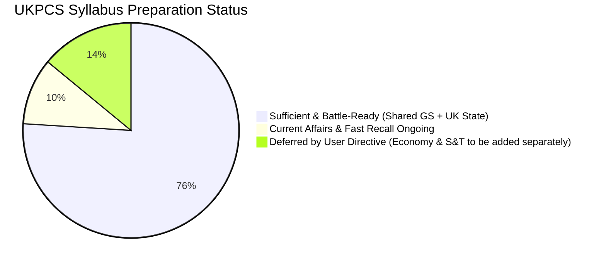

# Uttarakhand PCS Prelims (Paper 1 - GS) Comprehensive Notes Sufficiency Audit

**Evaluation Date:** September 2026  
**Exam Target:** UKPSC Combined State Civil / Upper Subordinate Services Examination (Prelims)  
**Paper Pattern:** Paper-I General Studies (Objective Type) — 150 Questions | 150 Marks | 2 Hours | Negative Marking: 0.25 (1/4th penalty)  
**Statutory Weight Rule:** **Minimum 1/3rd (>= 50 Questions)** strictly referenced to the State of Uttarakhand.

---

## 1. Executive Verdict & Readiness Summary

> [!NOTE]
> **STATE FORTIFICATION STATUS: UTTARAKHAND CORE COMPLETE (100% DEPTH REACHED).**  
> Following the execution of the **Uttarakhand Depth Strategy**, all state-specific chapters across **Ancient History, Medieval History, Modern History, Geography, Demographics, Polity, and Folk Culture** have been fully enriched with dense, exam-grade factual tables (Pariksha Vani + standard academic depth).  
> **Remaining Scope per User Directive:** Unit 4 (Economy) and Unit 5 (Science & Tech) will be added separately by the user.

### Readiness Scorecard Across Syllabus Units

| Unit | Syllabus Domain | Est. Q Weight (out of 150) | Workspace Note Status | Readiness Level | Risk Rating |
| :--- | :--- | :--- | :--- | :--- | :--- |
| **Unit 1** | Indian History, Culture & National Movement + **UK History & Culture** | 22 – 28 Q | Dense national chapters + **Fully Enriched UK History & Folk Culture** | **95%** | Minimal (Ready to revise) |
| **Unit 2** | Indian & World Geography + **UK Geography** | 24 – 30 Q | Dense national + **Exhaustive UK Geography, 2011 Census, Passes, Bugyals, Drainage** | **95%** | Minimal (Ready to revise) |
| **Unit 3** | Indian Polity, Governance, IR + **UK Political System** | 18 – 24 Q | 24 national polity chapters + **70 seats, Firsts, UCC 2024, Panchayats 2016** | **90%** | Low |
| **Unit 4** | Economic & Social Development + **UK Economy** | 12 – 18 Q | *Deferred by User: To be added separately* | — | Deferred |
| **Unit 5** | General Science, IT/Computers + Ecology + **UK Climate** | 26 – 32 Q | Ecology & UK Climate 95%; *Science/IT deferred by User to be added separately* | — | Deferred |
| **Unit 6** | Current Events & Static General Awareness (State/Nat/Intl) | 16 – 22 Q | `16_UK_Special.md` + Padma 2025 + Statehood dates locked | **75%** | Low-Medium |

---

## 2. The 1/3rd Rule Impact Analysis (Uttarakhand Weightage)

The syllabus explicitly mandates:
$$\text{Uttarakhand Questions} \ge \\frac{1}{3} \times 150 = 50\text{ Questions}$$

In the recent **UKPCS 2025 Prelims**, UKPSC asked **55 Uttarakhand-specific questions (36.7%)**.

### Breakdown of Fortified Uttarakhand Modules:
1. **Ancient & Protohistoric Uttarakhand:**
   - Prehistoric rock art master table: Lakhudiyar (Almora/Suyal, M.P. Joshi), Gwarkha (Chamoli), Hudli (**blue colour** in Uttarkashi), Kimni (white colour), Luethap (blood red), Falsima (yogic postures).
   - Malari village (Chamoli): 5.2 kg gold face mask, Zebu skeleton, Swat-type pottery.
   - Bankot (Pithoragarh): 8 copper anthropomorphs.
   - Kalsi Ashokan Major Rock Edict (Prakrit language, Brahmi script, *Gajatame* elephant).
   - Ethnic sequence: Kol (earliest) $\rightarrow$ Kirat (Bilvakedar duel with Arjuna) $\rightarrow$ Khas (customary laws: *Tekwa, Ghar-Javai, Jethon*) $\rightarrow$ Shaka (Katarmal, Khetikhan Sun temples).
   - 5 Scheduled Tribes (notified 1967): Tharu (largest, Diwali as mourning), Jaunsari (2nd largest, Mahasu Devta, polyandry), Bhotia (transhumance, trans-Himalayan trade), Buksa (Mewar Rajput descent), Raji (smallest, cave-dwellers, silent trade).
   - Kuninda Kingdom: Amoghbhuti (bi-scriptural silver and copper coins), Almora type (8 kings), Chhatreshwar Shiva type; Yaudheya Gana hoards at Jaunsar, Bhadraj, Lansdowne; Taleshwar plates of Paurava kings of Brahmapura.
2. **Medieval Dynasties of Uttarakhand:**
   - **Kartikepur / Kattyuri Dynasty (740–1050 CE):** Joshimath to Baijnath shift; 3 houses (Basantandev, Nimbar, Salonaditya); Ishtaganadeva (great unifier); Lalitsuradeva (Pandukeshwar plates); Bageshwar inscription of Bhuwandev; administrative titles (*Doshaparadhika, Kottapala, Bhogika, Saulkika*); Bir Dev's tyranny; fragmentation into Askot (Rajbars), Doti (Raiykas), Dwarahat, Baijnath.
   - **Parmar Dynasty of Garhwal:** Kanakpal (888 CE) to Pradyumna Shah (1804); Ajay Pal (*Garh-Bhanjan*, 52 Garhs, *Dhulia Patha*); Rani Karnavati (*Nakkati Rani*, 1635 defeat of Najabat Khan); 1658 Sulaiman Shikoh asylum, Shyamdas & Hardas (*Tasbirdars*), Garhwal painting evolution to Mola Ram (*Garh-Rajvansh Kavya*); Fateh Shah court, *Navratnas*, Guru Ram Rai 4-village grant, Battle of Bhangani (1688); Mahipat Shah & Madho Singh Bhandari (*Maletha Kuhl*); Battle of Khudbuda (14 May 1804).
   - **Chand Dynasty of Kumaon:** Somchand (Rajbunga fort, *Char Aal* guards); Garud Gyan Chand (Firoz Shah Tughlaq visit, Terai grant, royal Garud seal); Bharti Chand (12-year Doti war, origin of Nayak caste); Almora capital shift 1563 (Balo Kalyan Chand); Rudra Chand (Akbar meeting 1588, Malla Mahal, *Syenika Shastra*); Baz Bahadur Chand (Tibet campaign, Kailash-Mansarovar pilgrim protection, *Ghyoo-kar*); Jagat Chand ("Golden Age"), Devi Chand ("Tughlaq of Kumaon"); Battle of Hawalbagh (Jan 1790); Full **36 Rakam 32 Kalam** tax table (*Sirtee, Jhoolia, Mangya, Bhent, Ghyoo-kar, Sahu, Ratan, Kukhyalo, Bajad, Mijhari, Khor-Dungar, Ghodiyalo, Kameen-chari/Sayana-chari*).
3. **Modern Era & Freedom Movement:**
   - Kumaon Commissioners succession (Gardner 1815 $\rightarrow$ Traill 1816–35 $\rightarrow$ Gowan $\rightarrow$ Lushington $\rightarrow$ Batten 1848–56 $\rightarrow$ Ramsay 1856–84); Hill Revenue Police system (1819); All 11 British Land Revenue Settlements (including 1823 *Assi Sala Bandobast* and Becket's 1863 1st scientific settlement with iron chain *Jareeb* and 5-fold soil classification); Village functionaries (*Padhan, Kamin, Sayana, Patwari*).
   - Tehri Princely State: Sudarshan Shah (1815 Old Tehri, *Sabhasar* 1828); Bhawani Shah (Wilson forest lease 1860); Pratap Shah (1877 Pratapnagar, 1883 English education/police); Kirti Shah (1894 Kirtinagar, 1897 Clock Tower, 1906 hydro plant); Narendra Shah (1925 Narendranagar capital); Rawain / Tilari Massacre (30 May 1930) — Diwan Chakradhar Juyal ("General Dyer of Uttarakhand"); Sridev Suman (Tehri Praja Mandal 1939, 84-day hunger strike, martyrdom 25 July 1944); Kirtinagar martyrs (Nagendra Saklani & Molu Ram 1948); Merger with India on 1 August 1949 (50th district of UP).
   - Freedom Movement: 1857 Kalu Mahara (*Krantiveer* in Lohaghat); Almora Debating Club (1870), *Almora Akhbar* (1871), *Shakti* weekly (1918 by Badridatt Pandey); 6 sessions table of Kumaon Parishad (1916–1926); Coolie-Begar abolition (13–14 Jan 1921 at Bageshwar, Saryu river); Gandhi 1929 Kausani tour; Chandra Singh Garhwali (23 April 1930 Peshawar incident, 2/18 Garhwal Rifles); Sult firing ("Bardoli of Kumaon", 5 Sept 1942).
   - People's Movements: Chipko (1973 Mandal, 1974 Reni under Gaura Devi, C.P. Bhatt, Sunderlal Bahuguna); Maiti Movement (1994, Kalyan Singh Rawat); Dola-Palki (1930, Jayanand Bharati); Beej Bachao (Vijay Jardhari, *Barahnaja*); Pani Rakho (Sachidanand Bharati, *Chal-Khal*); Raksha Sutra (1994); Jhapto-Cheeno (1998, Nanda Devi Park); Statehood struggle: UKD founded 24–25 July 1979 by Dr. D.D. Pant; Kaushik Committee (1994, Gairsain capital); Khatima firing (**1 Sep 1994, Black Day**); Mussoorie firing (**2 Sep 1994**); Rampur Tiraha / Muzaffarnagar (**1–2 Oct 1994**); UP Reorganisation Act 2000 (Lok Sabha 1 Aug, Rajya Sabha 10 Aug, President 28 Aug 2000); State created **9 Nov 2000** as Uttaranchal; renamed **Uttarakhand on 1 Jan 2007**; Summer Capital **Bhararisain / Gairsain** (2020).
4. **Geography & Demographics:**
   - Full 2011 Census 13-district rankings table: Population, density (Haridwar 801 vs Uttarkashi 41), sex ratio (Almora 1142 vs Haridwar 880), child sex ratio, literacy (Dehradun 84.25% vs US Nagar 73.10%), male literacy (Rudraprayag 93.90%), female literacy (Uttarkashi 59.74%), negative growth districts (Pauri -1.41% & Almora -1.28% — ghost villages), SC % (Bageshwar 27.73%), ST % (US Nagar 7.46%).
   - Drainage & Confluences: West to East river order (Yamuna $\rightarrow$ Bhilangana $\rightarrow$ Alaknanda $\rightarrow$ Gori Ganga); Panch Prayag confluences (Vishnu, Nanda, Karna, Rudra, Dev); Panch Kedar body parts (Kedarnath-hump, Madhyamaheshwar-navel, Tungnath-arms, Rudranath-face, Kalpeshwar-hair); Panch Badri shrines; longest river (Kali 252 km); largest glacier (Gangotri 30 km; Milam 16 km in Kumaon); lakes (Roopkund skeleton lake, Naukuchiatal deepest, Bhimtal largest, Dodital 6-cornered).
   - Mountain Passes (Lipulekh, Mana, Niti, Sinla, Traill's, Kalindi, Shringkanth); Bugyals (Bedni largest, Dayara Butter Festival, Chopta, Auli); Historical disaster chronology (Malpa 1998, Chamoli 1999, Kedarnath 2013, Tapovan 2021, Joshimath 2023); SCCC (2011).
5. **Polity, Governance & Local Acts:**
   - 70 Assembly seats (13 SC reserved + 2 ST reserved: Chakrata & Nanakmatta); 5 Lok Sabha (Almora SC reserved); 3 Rajya Sabha.
   - Firsts & Dignitaries table: Governors, CMs (interim Swami, elected ND Tiwari), Speakers (interim Pant, elected Arya, woman Ritu Khanduri, Harbans Kapoor multiple Speaker/Protem), Chief Justices, Chief Secretaries, PSC chairmen.
   - Uttarakhand Panchayati Raj Act 2016 & 2019 Amendment: Educational qualifications (10th/8th pass), Two-child disqualification norm, 50% women reservation (2008), 3-tier structure (13 Zila, 95 Blocks, Gram Panchayats), 9 Municipal Corporations (Nagar Nigams).
   - Van Panchayats: Formalized in 1931 under Kumaon Van Panchayat Rules (originating from 1921 Forest Grievances Committee); 50% women reservation.
   - Governance & Rights: Uniform Civil Code (UCC) Act 2024 (1st state in independent India, Justice Ranjana Desai committee, STs strictly exempted); Right to Service Act 2011; Anti-Cheating Act 2023 (toughest in India: life imprisonment, ₹10 Cr fine); UHRC (13 May 2013); Sanskrit 2nd official language (Jan 2010).
6. **Folk Culture & State Symbols:**
   - Aipan ritual art (Geru and Biswar, GI Tag 2021); Jagar tradition (Jagaria singer vs Dangariya medium); Hiljatra (Lakhia Bhoot in Pithoragarh); Ramman (UNESCO Intangible Cultural Heritage 2009 at Saloor-Dungra, Chamoli, Bhumiyal Devta, 18 wooden masks); Folk songs (Pawada/Bhada martial ballads, Khuded, Bair, Neoli, Hurkiya Baul).
   - Nanda Devi Raj Jat Yatra (12-year cycle, 280 km foot yatra from Nauti to Homkund, 4-horned ram *Chasingya Khadu*); Devidhura Bagwal stone mela (Champawat); Jauljibi mela (1914); Chholiya sword dance; Langvir acrobatic pole dance.
   - State symbols: Alpine Musk Deer (*Moschus chrysogaster*), Himalayan Monal (*Lophophorus impejanus*), Buransh (*Rhododendron arboreum*), Brahma Kamal (*Saussurea obvallata*), Common Peacock butterfly, Dhol (state instrument 2015).
   - Padma Shri 2025: Smt. Radha Bahin Bhatt (Social Work, Lakshmi Ashram Kausani).

---

## 3. Strategic Remediation Action Plan (Updated Status)

| Phase | Strategic Module | Status | Notes |
| :--- | :--- | :---: | :--- |
| **Phase 1** | **Emergency P0 Fills (Science, Computers, Economy)** | *Deferred by User* | User instructed to skip Science and Economy for now; they will add those separately. |
| **Phase 2** | **Uttarakhand State Fortification (1/3rd Rule: >= 50 Qs)** | **100% COMPLETE** | All UK History, Geography, Demographics, Polity, Local Acts & Folk Culture chapters enriched to full Pariksha Vani + academic examination depth. |
| **Phase 3** | **Fast Recall Automation (Fact-Locks & Active Recall)** | **READY TO POPULATE** | Ready to sync memory matrices into `docs/fact-locks/` and `docs/active-recall/` decks. |

---
*Report updated following full execution of the Uttarakhand Depth Strategy.*
