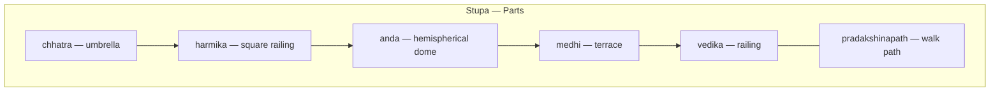

# Mauryan Art & Architecture

> GS-1 · Topic 01 · Mauryan art, architecture, technology

---

## PYQs

| Year | M | Words | Question (EN) | प्रश्न (HI) | ID |
|------|---|-------|---------------|-------------|-----|
| 2025 | 8 | 125 | Comment briefly on the development of art and technology during the Maurya period. | मौर्य काल में कला एवं प्रौद्योगिकी के विकास पर एक संक्षिप्त टिप्पणी कीजिए। | Q1 |
| 2022 | 8 | 125 | Describe the salient features of Mauryan Art and Architecture. | मौर्यकालीन कला एवं स्थापत्य कला की प्रमुख विशेषताओं का वर्णन कीजिए। | Q2 |

---

## Quick Revision

```
PERIOD: 322–185 BCE | Chandragupta → Bindusara → Ashoka (268–232 BCE peak)
PATRONAGE: Imperial court + Buddhist/Jain dhamma after Kalinga (261 BCE)

PILLARS: Chunar sandstone | Mauryan polish | Lotus bell base | Animal capital
  Sites: Sarnath, Rampurva, Lauriya Nandangarh, Allahabad-Kosam, Lauriya Araraj, Delhi-Topra
  Sarnath Lion Capital = 4 lions + dharmachakra = national emblem (1950)
  Edicts: Brahmi, Kharosthi, Greek, Aramaic | Feroz Shah Kotla pillar (Delhi)

YAKSHA-YAKSHI: Nature-deity sculptural tradition (pre-Mauryan roots → Mauryan polish)
  Parkham (Mathura) | Rampurva (yaksha figure) | Didarganj Yakshi (mirror polish, Patna Museum)
  Besnagar Yaksha | Patna Museum collection

STUPAS: Sanchi (UNESCO 1989 core), Bharhut | anda + harmika + chhatra + vedika + pradakshinapath
  ≠ CHAITYA: stupa = solid relic mound | chaitya = rock-cut prayer hall (stupa inside apse)
  Brick core + stone facing | Railings/toranas often later (Shunga)

ROCK-CUT: Barabar + Nagarjuni hills (Bihar) | Lomas Rishi, Sudama, Karan Chaupar, Gopi, Vadathika
  Polished granite | Horseshoe arch (Lomas Rishi) | Jain + Ajivika patronage | Ashoka + Dasharatha

SPREAD: Material culture → Odisha (Dhauli/Jaugada edicts) | AP/Karnataka (Maski, Brahmagiri, Udegolam)
  Kandahar/Kabul pillars (north-west) | wood → stone shift

WOOD: Megasthenes (Indica) — wooden Pataliputra palace (perishable; stone shift marks advance)

TECHNOLOGY: Mirror polish | Monolithic quarrying/transport | Stupa engineering | Edict engraving
  NBPW pottery link | Chunar quarry → Sarnath transport = civil engineering feat

CONTEMPORARY: ASI protected monuments | Art 49/51A(f) | Sanchi UNESCO | Buddhist Circuit tourism
  NEP 2020 IKS (Ashoka dhamma, early statecraft) | National emblem = living Mauryan symbol

TRAPS: Lion Capital = Mauryan NOT Gupta | 2025 = art + tech | Nagar ≠ Mauryan
  Stupa ≠ chaitya | Yakshi ≠ only terracotta folk art | All Sanchi carving ≠ Mauryan
```

---

## Content

### Period and historical context

- Maurya Empire c. **322–185 BCE** — first **pan-subcontinental** empire uniting Magadha heartland with Afghanistan, Deccan fringes, and Kalinga.
- **Chandragupta Maurya** (with **Chanakya/Kautilya**) founded empire after overthrowing **Nanda** dynasty; **Bindusara** expanded southward; **Ashoka** (r. c. **268–232 BCE**) peak after **Kalinga war (261 BCE)** — turned to **Buddhist dhamma** as state ethic.
- **Megasthenes** (Greek ambassador of **Seleucus Nicator** at Chandragupta's court) describes a magnificent **wooden palace at Pataliputra** — multi-storeyed, gilded/silvered pillars, carved wood — **none survives**; Mauryan art shift from **wood/thatch/bamboo** to **permanent stone and brick** monumentality is historically significant.
- Patronage: **imperial state**, Buddhist sangha, Jain communities (**Barabar caves**), Ajivika sect — art serves **politics, religion, and imperial communication** simultaneously.
- **Exam frame:** UPPCS asks both **salient features** (2022) and **art + technology together** (2025) — never treat as purely aesthetic; engineering is half the answer.

### Salient features of Mauryan art and architecture

**1. Monolithic pillars (finest imperial symbol)**
- Tall tapering shaft from **Chunar sandstone** (Mirzapur, UP quarries); **lotus bell** base; **abacus**; **animal capital** (lion, bull, elephant, horse/lions combination).
- **Mauryan polish** — mirror-like surface unique to period; technique lost after Mauryas — major **technological signature**.
- **Sarnath Lion Capital** — four lions back-to-back, **dharmachakra** in abacus, bull/horse/lion reliefs; adopted as **Republic of India emblem (1950)**; original in **Sarnath Archaeological Museum**.
- Major sites: **Sarnath, Sanchi, Rampurva, Lauriya Nandangarh, Lauriya Araraj, Allahabad-Kosam (Prayag), Delhi-Topra (Feroz Shah Kotla), Kandahar, Kabul**.
- **Ashokan edicts** inscribed — **Brahmi** (most), **Kharosthi** (north-west), **Greek and Aramaic** (north-west) — art + **state propaganda/communication technology**.

**2. Yaksha-yakshi sculptural tradition**
- **Yakshas** (male) and **yakshis** (female) = nature/fertility deities — sculptural tradition predates Mauryas but reaches **court refinement** under Mauryan polish.
- **Parkham Yakshi** (Mathura region) — early stone yakshi figure; links to later **Mathura sculptural school**.
- **Rampurva** — famous for **bull and lion pillar capitals**; also associated with **yaksha sculpture** from same cultural milieu.
- **Didarganj Yakshi** (Patna Museum) — tall female figure in **Chunar sandstone**, **high mirror polish**, naturalistic anatomy, holding **chauri** (fly-whisk) — finest Mauryan court sculpture.
- **Besnagar Yaksha** (Vidisha) — large monolithic yaksha; shows spread of yaksha cult beyond Magadha.
- Distinction: yakshi tradition = **polished stone court art**; terracotta mother-goddesses = **popular/folk** tier.

**3. Stupas (Buddhist relic architecture)**
- Hemispherical **anda** (relic mound) on **medhi** (terrace); **harmika** (square railing on top); **chhatra** (umbrella); **vedika** (railing) around base; **pradakshinapath** (circumambulatory path).
- **Sanchi** (Madhya Pradesh) and **Bharhut** — Mauryan **brick core** with stone facing; among earliest large stupas; **Sanchi** later **UNESCO World Heritage (1989)**.
- Elaborate **railings, toranas, narrative reliefs** at Bharhut/Sanchi largely **post-Mauryan (Shunga)** — distinguish core vs later additions.



**Chaitya vs stupa (exam distinction)**

| Feature | **Stupa** | **Chaitya** |
|---------|-----------|-------------|
| Form | **Solid** relic mound | **Rock-cut hall** for worship |
| Function | Enshrines relics of Buddha/saints | Prayer/assembly hall |
| Interior | No congregational space inside mound | Long nave + apse; often **stupa at far end** |
| Examples | Sanchi, Bharhut (free-standing) | Lomas Rishi, Karle, Bhaja (later rock-cut) |
| Mauryan link | Mauryan **brick cores** at Sanchi/Bharhut | Mauryan **Barabar** caves = earliest rock-cut; chaitya form matures later |

- **Stupa** = monument around relic; **chaitya** = covered hall where devotees gather — a chaitya may **contain** a stupa at its apse but is architecturally a **different type**.

**4. Rock-cut caves**
- **Barabar and Nagarjuni hills** (Bihar) — polished granite caves for Ajivika/Jain monks; earliest Indian rock-cut tradition.
- **Lomas Rishi cave** — famous **horseshoe-shaped** entrance facade (elephant frieze); **Sudama, Karan Chaupar, Vishva Zopri, Gopi, Vadathika** caves.
- Donated by **Ashoka** and grandson **Dasharatha** — shows continuity of rock-cut tradition across two generations.
- **Polished interior walls** — same technical mastery as pillar polish applied to cave architecture.

**5. Sculpture and minor arts**
- **Terracotta figurines** — mother goddesses, animals; widespread among common people — folk/popular art.
- **Ring stones, disc stones** — decorative motifs; fertility/cosmic symbolism; found across Gangetic and Deccan sites.
- **Pottery** — **Northern Black Polished Ware (NBPW)** associated with Mauryan urban culture; glossy surface parallels stone polish aesthetic.

**6. Material culture spread beyond Magadha**
- Mauryan **imperial art language** reached regional peripheries through pillars, edicts, and craft styles:
  - **Odisha:** **Dhauli** and **Jaugada** rock edicts (Kalinga war site) — Ashokan dhamma art on hills.
  - **Andhra/Karnataka:** Minor rock edicts at **Maski, Brahmagiri, Jalinga, Siddapur, Udegolam** — proves Mauryan political-religious communication deep in south.
  - **North-west:** Pillars and edicts at **Kandahar, Kabul** — bilingual Greek-Aramaic; connects to **Seleucid** diplomatic world.
  - **Material culture** (NBPW pottery, ring stones, terracotta types) found at sites across **Deccan and eastern India** — not only pillars.
- Shows Mauryan art as **pan-Indian imperial idiom**, not confined to Gangetic core.

**7. General artistic character**
- **Imperial uniformity** — pillars and edicts from Kandahar to Karnataka share script, polish, and dhamma vocabulary.
- **Buddhist-Jain religious idiom** — not Hindu temple phase (temple architecture comes later under Guptas and regional dynasties).
- **Persian/Achaemenid influence debated** on pillar form — but Mauryan polish and capitals are distinctly Indian synthesis.
- **Court atelier vs folk** — polished stone = state workshops; terracotta = broader social base.

### Ashoka's dhamma and art (future-angle)

- After **Kalinga (261 BCE)**, Ashoka used **art as dhamma propaganda** — pillars, rock edicts, stupas = visual + textual moral messaging.
- **Dhamma themes in art:** non-violence, tolerance among sects, respect for parents/elderly, proper conduct of officials, animal welfare (restricting slaughter).
- **Sarnath Lion Capital** — dhamma symbol (dharmachakra) + imperial authority (lions) — art serves **religion + state**.
- **Barabar cave donations** — patronage beyond Buddhism (Jain/Ajivika) shows dhamma as **broad ethical policy**, not sectarian art alone.
- **Minor edicts** across south = art + communication technology spreading **ethical governance** — template for later Gupta/regional dynasties.

### Technology during Mauryan period

- **Mauryan mirror polish** on hard sandstone — technical mastery without equal in later periods; lost craft knowledge debated by archaeologists.
- **Quarrying, carving, transport, erection** of monolithic columns weighing tons — **Chunar to Sarnath** transport = major **civil engineering** feat.
- **Stupa construction** — planned geometry, concentric brick layers, stone veneer, drainage — architectural engineering.
- **Rock-cutting** — precision excavation in granite hills for caves; horseshoe arch prototype at Lomas Rishi.
- **Edict engraving** — standardised Brahmi script across empire — literacy + administration + art combined.
- Shift from **perishable wood** (Megasthenes' palace) to **durable stone** marks technological advance in building materials.

| Technology | Mauryan application | Significance |
|------------|---------------------|--------------|
| **Mirror polish** | Pillars, yakshi, cave walls | Unique period signature; lost later |
| **Monolithic quarrying** | Chunar sandstone pillars | Imperial scale engineering |
| **Brick-stone stupa core** | Sanchi, Bharhut | Religious architecture engineering |
| **Rock excavation** | Barabar-Nagarjuni granite | Earliest rock-cut tradition |
| **Multi-script engraving** | Brahmi, Kharosthi, Greek, Aramaic | Imperial communication technology |
| **NBPW pottery** | Urban centres | Industrial-level ceramic production |

### Significance and legacy

- First **imperial art language** unifying diverse regions under one aesthetic-political idiom.
- Foundation for later **Buddhist monumental tradition** (stupa → Gandhara/Mathura → Amaravati → Ajanta).
- Model of **state-art relationship** — Ashoka used art for dhamma propagation; pillars as **permanent billboards**.
- Pillars and stupas remain among **most recognisable symbols** of ancient India — **national emblem from Sarnath** is living Mauryan legacy.
- **Barabar caves** ancestor of entire **Indian rock-cut architecture** line (Ajanta, Ellora, Elephanta).

### Comparisons (future-angle ready)

| Compare with | Mauryan position |
|--------------|------------------|
| **Harappan** | Brick cities, seals, no monolithic pillars or stupas |
| **Gupta** | Mauryan = pillars/stupas/early caves; Gupta = mature temple (Deogarh), classical sculpture (Mathura/Sarnath schools) |
| **Shunga** | Mauryan stupa **core**; Shunga adds railings, reliefs, toranas |
| **Nagar style temples** | Medieval north Indian — **not** Mauryan |
| **Barabar vs Ajanta** | Barabar = polished granite, no painting; Ajanta = basalt, frescoes — both rock-cut but different phases |

### Site and object reference

| Site / object | What to write |
|---------------|---------------|
| Sarnath Lion Capital | National emblem; Ashokan dhamma; finest capital |
| Didarganj Yakshi | Court yakshi; mirror polish; Chunar sandstone |
| Parkham Yakshi | Early yakshi; Mathura sculptural link |
| Rampurva | Bull/lion capitals; yaksha association |
| Sanchi stupa (core) | Mauryan origin; later Shunga decoration; UNESCO 1989 |
| Bharhut stupa | Early stupa remains; narrative art later |
| Lomas Rishi cave | Horseshoe facade; rock-cut pioneer |
| Barabar caves | Polished granite; Jain/Ajivika |
| Dhauli / Jaugada | Odisha rock edicts; Kalinga dhamma |
| Maski / Brahmagiri | Southern minor rock edicts |
| Ashokan rock edicts | Dhamma propagation + communication technology |

### Contemporary relevance

- **UNESCO World Heritage:** **Buddhist Monuments at Sanchi (1989)** — includes Mauryan-era stupa core; global recognition of Mauryan Buddhist architectural foundation.
- **ASI (Archaeological Survey of India)** — protects Mauryan pillars (**Sarnath, Lauriya Nandangarh, Rampurva**), rock edicts (**Dhauli, Jaugada**), and caves (**Barabar-Nagarjuni**); ongoing conservation of polish surfaces and edict legibility.
- **Constitutional framework:** **Article 49** — state shall protect monuments of national importance; **Article 51A(f)** — fundamental duty of citizens to value and preserve rich heritage — Mauryan sites are primary examples in heritage education.
- **National emblem:** **Sarnath Lion Capital** adopted **26 January 1950** — Mauryan art as **living national symbol** on currency, government documents, and official seals.
- **NEP 2020 — Indian Knowledge Systems (IKS):** Ashokan **dhamma ethics**, early **statecraft-art interface**, and Mauryan **engineering** integrated into history and civics curriculum; promotes critical study of empire-building and moral governance.
- **Tourism and schemes:** **Swadesh Darshan** and **PRASAD** (Pilgrimage Rejuvenation and Spiritual Augmentation Drive) develop **Buddhist Circuit** infrastructure — **Sarnath, Sanchi, Bodh Gaya** corridor connects Mauryan heritage to pilgrimage economy; **Incredible India** campaigns feature Ashokan pillars.
- **Digital documentation:** ASI **National Mission on Monuments and Antiquities (NMMA)** and 3D scanning of pillars/stupas create preservation records against weathering and vandalism.
- **Soft power:** Mauryan Buddhist heritage supports **international Buddhist diplomacy** — Japan, Sri Lanka, Thailand pilgrimage routes to Sanchi-Sarnath; Ashoka as global icon of non-violence referenced in UN and international peace discourse.
- **Museum display:** **Patna Museum** (Didarganj Yakshi), **Sarnath Museum** (Lion Capital replica and originals) — public access to Mauryan art under **Ministry of Culture** stewardship.

### Limitations

- Surviving Mauryan **stone sculpture limited** — much early art perishable (wood); Megasthenes' palace known only from text.
- Religious bias toward **Buddhist/Jain imperial patronage** after Ashoka — Hindu monumental art largely absent in this phase.
- Attribution debates — some polished sculptures may be late Mauryan vs early Shunga.
- **Polish technique lost** — cannot fully replicate Mauryan mirror finish; conservation challenge for exposed pillars.

---

## Answers

### Q1: Comment briefly on the development of art and technology during the Maurya period. (2025, 8M, 125W)

**Opening:**
> The Maurya period marked a decisive leap — court-sponsored art fused with advanced stone-working technology under imperial patronage.

**Write these points:**
- Under Ashoka, art became an instrument of dhamma — polished pillars with edicts and early stupas like Sanchi.
- Technological breakthrough: **Mauryan polish**, quarrying and erecting monolithic sandstone columns across the empire.
- Stupa building used engineered brick cores and stone facing — architectural planning plus religious function.
- Rock-cut caves at Barabar-Nagarjuni show precision granite excavation; yaksha-yakshi and terracotta reflect art beyond court ateliers.
- Together, art and technology shifted building from perishable materials (Megasthenes' wooden Pataliputra palace) to permanent stone monuments and imperial communication — now protected under **ASI** and **Article 51A(f)** heritage duty.

**Conclusion:**
> Mauryan art and technology were inseparable — aesthetic ambition enabled by superior stone engineering that still defines India's national emblem and Buddhist heritage identity.

---

### Q2: Describe the salient features of Mauryan Art and Architecture. (2022, 8M, 125W)

**Opening:**
> Mauryan art and architecture represent India's earliest pan-imperial monumental tradition — pillars, stupas, caves, and court sculpture.

**Write these points:**
- **Pillars:** Monolithic Chunar sandstone, polished surface, lotus base, animal capitals — Sarnath lions finest example; edicts in Brahmi/Kharosthi/Greek/Aramaic.
- **Stupas:** Hemispherical relic mounds at Sanchi and Bharhut — anda, harmika, chhatra, vedika; simpler than later Shunga elaborations; distinct from **chaitya** prayer halls.
- **Sculpture:** **Didarganj Yakshi**, Parkham and Rampurva yaksha-yakshi tradition; terracotta among common people.
- **Rock-cut caves:** Barabar-Nagarjuni — polished interiors; Lomas Rishi horseshoe facade.
- Synthesis of Buddhist/Jain patronage, imperial ideology, and durable stone architecture — template for classical Indian art; **Sanchi UNESCO (1989)** and national emblem preserve this legacy today.

**Conclusion:**
> Mauryan monuments combined devotion, propaganda, and technical mastery that shaped later Indian visual culture and remains central to India's heritage framework.

---

### Q3 (Future variant): How did Ashoka use art and architecture to propagate dhamma? (8M, 125W)

**Opening:**
> After the Kalinga war, Ashoka transformed art from mere imperial display into a vehicle for ethical dhamma across the Mauryan empire.

**Write these points:**
- **Pillars and edicts** — Brahmi/Kharosthi/Greek/Aramaic inscriptions on polished sandstone pillars and rock faces carried messages of non-violence, tolerance, and righteous governance.
- **Stupas** — relic monuments at Sanchi/Bharhut linked Buddhist devotion to state patronage of dhamma.
- **Geographic reach** — edicts from Dhauli-Jaugada (Odisha) to Brahmagiri-Maski (Karnataka) show art as **pan-empire moral communication**.
- **Cave patronage** — Barabar-Nagarjuni donations to Jain/Ajivika monks demonstrate dhamma beyond sectarian narrowness.
- **Sarnath capital** — dharmachakra + lions symbolise moral law backed by imperial authority — now India's **national emblem** and **NEP 2020 IKS** teaching anchor.

**Conclusion:**
> Ashoka's dhamma art thus pioneered the use of permanent monuments as India's earliest large-scale ethical propaganda system — still honoured through UNESCO-listed Sanchi and national heritage policy.

---

## Traps

| Wrong | Correct |
|-------|---------|
| Lion Capital is Gupta | **Mauryan — Ashoka**, Sarnath |
| 2025 Q = art only | Must include **technology** (polish, quarrying, stupa engineering, edicts) |
| Mauryan art = only Hindu | Primarily **Buddhist/Jain** imperial patronage |
| All stupa carving is Mauryan | **Core** Mauryan; railings/toranas often **Shunga** |
| Stupa = chaitya | **Stupa** = solid relic mound; **chaitya** = rock-cut prayer hall |
| Nagar temple style = Mauryan | Nagar = **medieval** north Indian temples |
| Didarganj Yakshi = terracotta folk | **Polished stone** court sculpture |
| Yakshi only at Didarganj | Also **Parkham, Rampurva, Besnagar** tradition |
| Mauryan art only in Bihar | Edicts/pillars in **Odisha, Karnataka, AP, Afghanistan** too |
| Megasthenes describes stone palace | **Wooden** palace at Pataliputra — perished |
| Ashoka built Hindu temples | **Stupas, pillars, caves** — temple phase later |
| Sanchi not UNESCO | **UNESCO 1989** — Buddhist Monuments at Sanchi |

---

*Complete.*
