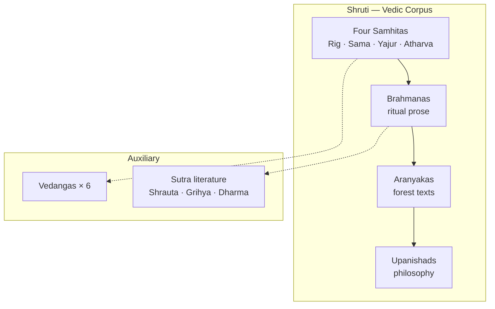

# Vedic Literature

> GS-1 · Topic 01 · Vedic literature — corpus, features, geographical knowledge

---

## PYQs

| Year | M | Words | Question (EN) | प्रश्न (HI) | ID |
|------|---|-------|---------------|-------------|-----|
| 2023 | 8 | 125 | Describe the salient features of Vedic literature. | वैदिक साहित्य की प्रमुख विशेषताओं का वर्णन कीजिए। | Q1 |
| 2021 | 8 | 125 | Discuss the geographical knowledge as reflected in the Vedic literature. | वैदिक साहित्य में निहित भौगोलिक ज्ञान की विवेचना कीजिए। | Q2 |
| — | 8 | 125 | *Likely:* Discuss Vedic society as reflected in Vedic literature. | *संभावित:* वैदिक साहित्य में प्रतिबिंबित वैदिक समाज की विवेचना कीजिए। | Q3 |

---

## Quick Revision

```
CORPUS (Shruti): Samhitas → Brahmanas → Aranyakas → Upanishads
  Rig (1500–1000 BCE, hymns) | Sama (melody) | Yajur (ritual prose) | Atharva (charms)
  Brahmanas = ritual commentary | Aranyakas = forest texts | Upanishads = philosophy (600 BCE)

RIGVEDA MANDALAS: II–VII = earliest (family books) | I, X = later additions
  Mandala X = Purusha Sukta (varna hymn) — late layer

SUTRA LAYER: Shrauta (public sacrifice) | Grihya (domestic rites) | Dharma sutras (law/custom)
  Sulva sutras = altar geometry | Kalpa vedanga umbrella

VEDANGAS (6): Shiksha, Kalpa, Vyakarana, Nirukta, Chhanda, Jyotisha

WOMEN RISHIS: Lopamudra (Rig I.179) | Ghosha (Rig X.39–40) | Apala, Vishvavara — rare but significant

FEATURES: Sanskrit | Oral → written | Layered compilation | Religious-ritual core
  No south of Vindhyas in early phase

GEOGRAPHY — RIG: Sapta-Sindhu (Punjab-Afghanistan) | Sindhu=Indus | Sarasvati=Naditama
  Kubha=Kabul | Vitasta=Jhelum | Asikni=Chenab | Parushni=Ravi | Vipash=Beas | Shutudri=Sutlej

GEOGRAPHY — LATER: Ganga-Yamuna Doab | Kuru-Panchala | Hastinapur | Kosala, Videha (Bihar)
  Expansion: Punjab → W UP → E UP → Bihar | No full pan-India map

SOCIETY IN TEXTS: jana/tribe → rajan | sabha, samiti | varna emergence | gavishthi (cattle raids)
  Later: kingdoms, ashvamedha, priestly dominance

CONTEMPORARY: UNESCO Vedic chanting (2008) | NEP 2020 IKS + Sanskrit | Sarasvati Heritage Project
  Art 49/51A(f) | ASI PGW site correlation | Rigveda manuscript preservation

TRAPS: Vedic lit ≠ epics/Puranas | Geography expands over time | Sarasvati debate
  Grihya ≠ Shrauta | Upanishads = knowledge over ritual | Education = separate file (05)
```

---

## Content

### What is Vedic literature

- **Vedic literature** = corpus of **Indo-Aryan Sanskrit texts** composed during **Vedic age** (c. **1500–500 BCE**) — primary source for early Indian history, society, religion, economy.
- Classified as **Shruti** ("heard"/revealed) — distinct from later **Smriti** (epics, Puranas, Dharmashastras).
- Transmitted through **oral tradition** (shruti = hearing) for centuries before fixed recensions; extreme precision of memorization (**padapatha, kramapatha**).
- Language: **Vedic Sanskrit** — older form of classical Sanskrit.
- **UNESCO Intangible Cultural Heritage (2008):** Vedic chanting tradition recognised globally — oral literary preservation still living in **Kerala, Maharashtra, Karnataka** Vedic schools.

### Structure of the Vedic corpus

| Layer | Text type | Nature | Historical utility |
|-------|-----------|--------|-------------------|
| **Samhitas** | Four Vedas | Hymns, prayers, ritual formulas | Early society, gods, geography, economy |
| **Brahmanas** | Prose attached to each Veda | Ritual explanation, sacrifice details | Social hierarchy, kingship rituals, customs |
| **Aranyakas** | "Forest books" | Mystical-ritual thought for hermits | Transition from external ritual to inner meaning |
| **Upanishads** | Philosophical appendices | Metaphysics — Atman, Brahman | Intellectual revolution; challenge to pure ritualism |
| **Sutra literature** | Shrauta, Grihya, Dharma sutras | Codified ritual and domestic law | Later Vedic social norms, household rites |



### The four Samhitas (Vedas)

| Veda | Approx. date | Content / character | Notes |
|------|--------------|---------------------|-------|
| **Rigveda** | c. 1500–1000 BCE | **1028 hymns** to gods (Indra, Agni, Varuna, Soma) | **Oldest** Indo-Aryan text; 10 mandalas — **II–VII earliest**, **I and X later** |
| **Samaveda** | c. 1000 BCE onward | Melodic rendering of Rig verses for **sacred chant** | Music in ritual |
| **Yajurveda** | c. 1000 BCE onward | **Prose + verse** ritual formulas for sacrifices | Shukla (White) and Krishna (Black) recensions |
| **Atharvaveda** | c. 1000 BCE onward | **Charms, spells, healing**, everyday magic | Popular religion; less "orthodox" than other three |

- Together the four Vedas = **Chaturveda**; early period dominated by **Rigveda** for historical reconstruction.

### Rigveda mandala chronology

| Mandala group | Approx. date | Character |
|---------------|--------------|-----------|
| **II–VII** (family books) | Earliest (c. 1500–1200 BCE) | Core hymns; tribal society; Sapta-Sindhu geography |
| **IV, IX** | Middle layers | Soma hymns (IX); expanding ritual |
| **I, X** | Latest (c. 1000 BCE onward) | **Mandala I** — composite; **Mandala X** — Purusha Sukta (varna origin hymn), philosophical hymns |

- **Exam point:** Do not treat entire Rigveda as one uniform age — **internal stratigraphy** essential for society/geography questions.

### Brahmanas, Aranyakas, Upanishads

**Brahmanas**
- Prose texts explaining **meaning and procedure of sacrifices** (yajnas).
- Examples: **Aitareya, Kaushitaki** (Rig); **Shatapatha Brahmana** (Yajur — largest) — rich on social institutions, royal consecration (rajasuya, ashvamedha).
- Reflect **Later Vedic** society — stronger priesthood, kingdoms, complex rituals.

**Aranyakas**
- Bridge between Brahmanas and Upanishads — esoteric ritual symbolism for forest-dwelling students.
- "Forest treatises" — inward turn in Vedic thought.

**Upanishads**
- c. **600 BCE** onward; composed mainly in **Kuru-Panchala and Videha** regions.
- Core ideas: **Atman** (soul), **Brahman** (ultimate reality), **karma**, **moksha**; **Atman = Brahman**.
- **Philosophical reaction** against excessive ritualism and brahmanical domination — foundation of Hindu philosophy; influenced Buddhism and Jainism.
- Important ones: **Chhandogya, Brihadaranyaka, Isha, Katha, Mundaka, Taittiriya**.

### Sutra literature — Shrauta, Grihya, and Dharma layer

| Sutra type | Subject | Historical value |
|------------|---------|------------------|
| **Shrautasutras** | Rules for **grand public sacrifices** (yajnas) | State ritual, royal consecration procedures |
| **Grihyasutras** | **Domestic rites** — birth, marriage, funeral, household worship | Family structure, life-cycle customs, gender roles |
| **Dharma sutras** | Early **law and custom** — varna duties, penance, property | Proto-Dharmashastra; social norms of Later Vedic age |
| **Sulvasutras** | Geometry of fire altars | Early mathematical knowledge (Pythagorean triples) |

- Sutras belong to **Kalpa** vedanga — practical manuals codifying Brahmana-era ritual into concise aphorisms.
- **Grihya + Dharma sutras** bridge Vedic religion to classical **Smriti** legal tradition (Manusmriti etc.).

### Vedangas (auxiliary sciences of the Vedas)

| Vedanga | Subject |
|---------|---------|
| **Shiksha** | Phonetics, pronunciation |
| **Kalpa** | Ritual rules (Shrauta, Grihya, Dharma sutras) |
| **Vyakarana** | Grammar (Panini's Ashtadhyayi later systematizes) |
| **Nirukta** | Etymology (Yaska) |
| **Chhanda** | Prosody/metrics |
| **Jyotisha** | Astronomy/astrology for fixing sacrifice dates |

### Women rishis in Vedic literature

- Vedic corpus is **overwhelmingly male-composed**, but **Rigveda names several women rishis (rishikas)** — important for women's agency in early Vedic intellectual life.
- **Lopamudra** — composer of Rigveda **I.179**; dialogue hymn with sage **Agastya** on marital and spiritual themes.
- **Ghosha** — hymns in Rigveda **X.39–40**; daughter of Kakshivat; associated with Ashvins.
- Others: **Apala, Vishvavara, Shachi, Indrani** — fewer hymns but cited in tradition.
- **Historical caution:** Exceptional cases within patriarchal ritual society — do not overstate gender equality, but **must cite** when asked about Vedic society.

### Salient features of Vedic literature (as a whole)

1. **Oral composition and transmission** — poetry composed by rishis/sages; preserved by specialized reciter families before writing.
2. **Religious-ritual core** — centred on **yajna** (sacrifice), gods (Indra, Agni, Varuna), and cosmic order (**Rita**).
3. **Layered growth** — texts accreted over centuries; Rigveda mandalas, Brahmanas, Upanishads belong to different phases — not one uniform age.
4. **Sanskrit literary foundation** — root of later classical Sanskrit literature, grammar, philosophy.
5. **Historical embedded in hymnology** — not history writing but contains **tribal names, rivers, places, occupations, conflicts** (e.g. **Battle of Ten Kings** — Dasarajna in Rigveda).
6. **Shift from Rigvedic to Later Vedic tone** — Rig = pastoral-tribal hymns; Later Samhitas + Brahmanas = elaborate ritualism; Upanishads = philosophical critique.
7. **Elite/male priestly perspective** — common people and non-Aryan groups appear indirectly.

### Vedic society as reflected in literature

| Aspect | Rigvedic phase | Later Vedic phase |
|--------|----------------|-------------------|
| **Polity** | Tribes (**jana**), chiefs (**rajan**), assemblies (**sabha, samiti**) | Kingdoms (Kuru, Panchala); royal sacrifices (rajasuya, ashvamedha) |
| **Social order** | **Varna** ideas emerging; two-class (Arya/Dasa) | Fourfold varna crystallised (Purusha Sukta, Mandala X); jati beginnings |
| **Economy** | **Cattle wealth**, **gavishthi** (cattle raids); pastoral | Plough agriculture, land revenue (bali/bali tribute); crafts, trade |
| **Religion** | Nature gods (Indra, Agni); simple yajnas | Elaborate sacrifices; priestly (**brahmana**) dominance |
| **Technology** | Copper/bronze (**ayas**) | Iron (**shyama ayas/krishna ayas**) in later texts |
| **Women** | Some **rishikas** (Lopamudra, Ghosha); marriage references | Increasing patriarchal norms in Grihya/Dharma sutras |

- Must be used with **archaeology** (PGW, OCP) — literature alone cannot fix exact chronology.

### Historical value of Vedic literature

- Reconstruct **early and later Vedic society** — tribes (jana), chiefs (rajan), assemblies (sabha, samiti), varna emergence.
- **Economy** — cattle wealth (gavishthi = cattle raids), later agriculture, crafts, trade references.
- **Religion** — from nature worship (Indra, Agni) to ritualism to Upanishadic philosophy.
- **Polity** — tribal confederacies → kingdoms (Kuru, Panchala); taxes (bali → bali/tribute).
- **Technology** — copper/bronze (**ayas**) in Rigveda; iron (**shyama ayas/krishna ayas**) in later texts.

### Limitations

- **Not a chronicle** — no dated events; hymns mythologise victories.
- **Geographic knowledge expands over time** — early texts ≠ full subcontinental map.
- **Religious bias** — Aryan perspective; opponents called **dasa/dasyu/pani**.
- **Interpolation** — especially **Mandalas I and X** of Rigveda and later Brahmanas.
- **Sarasvati identification debated** — Ghaggar-Hakra vs Helmand (Afghanistan).

---

## Geographical knowledge in Vedic literature

### Overall pattern

- Vedic geography is **progressive** — earliest texts know **north-west (Sapta-Sindhu)**; later texts show **eastward expansion** into Ganga valley and Bihar.
- **No mention of deep south** (Tamilakam) or full Deccan in early Vedic corpus — confirms initial concentration in **Punjab–Afghanistan–western UP** fringe.
- Rivers, mountains, tribes, and kingdom names = main geographic data — not latitude/longitude or systematic cartography.


### Rigvedic geography (c. 1500–1000 BCE)

**Region of settlement — Sapta-Sindhu (land of seven rivers)**

| # | Rigvedic name | Modern river |
|---|---------------|--------------|
| 1 | **Sindhu** | Indus |
| 2 | **Vitasta** | Jhelum |
| 3 | **Asikni** | Chenab |
| 4 | **Parushni** | Ravi |
| 5 | **Vipash** | Beas |
| 6 | **Shutudri** | Sutlej |
| 7 | **Sarasvati** | Ghaggar-Hakra (debated) |

- **Sapta-Sindhu** = core Aryan heartland in Rigveda — **eastern Afghanistan, Pakistan Punjab, Indian Punjab**, fringes of **western UP**.
- **Sarasvati** — called **Naditama** (best of rivers); identified mainly with **Ghaggar-Hakra** (dry river bed in Rajasthan-Haryana); alternative theory = **Helmand** in Afghanistan.
- **Kubha** = **Kabul river**; **Gomati, Drishadvati** also mentioned — shows familiarity with **Afghanistan and upper Indus system**.
- **Battle of Ten Kings** (Dasarajna) — fought on **Parushni (Ravi)**; Bharatas vs confederacy of ten tribes — locates political conflict in Punjab region.
- Tribes/places: **Bharatas, Purus, Anus, Druhyus, Turvasas, Yadus, Pakthas** — tribal geography of north-west.

### Later Vedic geographical expansion (c. 1000–500 BCE)

**Direction of movement**

| From | To |
|------|-----|
| Punjab | Western UP |
| Western UP | Eastern UP (Ganga plain) |
| Eastern UP | Bihar (Videha) |

**New regions and centres in later texts (Samhitas, Brahmanas)**

| Ancient name | Location / modern region | Significance |
|--------------|--------------------------|--------------|
| **Kuru-Panchala** | **Ganga-Yamuna Doab**, Haryana-Delhi, Rohilkhand | Political-cum-literary centre; Brahmanas compiled here |
| **Hastinapur** | Meerut (Kuru capital) | Later Vedic urban proto-settlement (archaeology) |
| **Kosala** | Eastern UP (Awadh) | Eastern expansion |
| **Videha** | North Bihar (Mithila) | Upanishadic philosophical centre (Janaka's court) |
| **Kaushambi** | Near Allahabad | Kuru shift after Hastinapur flood tradition |

**Rivers in later phase**
- **Ganga and Yamuna** become central — "doab" culture replaces Sapta-Sindhu focus.
- References to **Sadānīra** and eastern tributaries as Aryans move east.
- **Narmada** mentioned only in **later books** (e.g. some Brahmanas/Upanishads) — marks gradual geographic widening, not Rigvedic knowledge.

### Mountains, directions, and frontiers

- **Himalaya ( Himavant )** — northern boundary; source of rivers.
- **Vindhya** — known in later texts as southern limit of Aryan expansion (not in early Rigveda core).
- **Sea (Samudra)** — references in Rigveda (likely Arabian Sea/Indus mouth); later texts mention **eastern sea** as trade/contact zone.
- **Copper/iron, horse, chariot** geography aligns with **north-west to upper Gangetic** cultural zone.

### What Vedic geography tells historians

- Confirms **gradual eastward migration/settlement** of Vedic people — from Indus basin to Ganga valley.
- **Place-name correlation** helps link literary tradition with **archaeological cultures** (PGW in Doab = Later Vedic).
- **Limitation:** rivers shift course (Sarasvati drying); names repeated in multiple regions; poetic exaggeration — must cross-check with excavation and hydrology.

### Geography comparison table (exam-ready)

| Aspect | Rigvedic phase | Later Vedic phase |
|--------|----------------|-------------------|
| **Core region** | Sapta-Sindhu (Punjab–Afghanistan) | Ganga-Yamuna Doab + eastern UP–Bihar |
| **Main river** | Sindhu, Sarasvati | Ganga, Yamuna |
| **Political geography** | Tribes (jana) | Kingdoms (Kuru, Panchala, Kosala, Videha) |
| **South India** | Absent | Minimal/absent in core Vedic texts |
| **Key text evidence** | Rigveda hymns (Mandalas II–VII) | Yajurveda, Brahmanas, Upanishads |

### Contemporary relevance

- **UNESCO Intangible Heritage (2008):** **Vedic chanting** — Rig, Sama, Yajur, Atharva recitation traditions preserved in **Kerala Vedic schools (Thirunavaya, etc.)**, Maharashtra, Karnataka — living link to oral Vedic literature.
- **NEP 2020 — Indian Knowledge Systems (IKS):** Vedic corpus taught **critically** in Sanskrit, philosophy, and history departments — emphasis on Upanishadic thought, Sulva geometry, Jyotisha astronomy as indigenous knowledge systems.
- **Sanskrit promotion:** **Central Sanskrit Universities**, **Rashtriya Sanskrit Sansthan**, CBSE Sanskrit curriculum — linguistic continuity from Vedic Sanskrit to classical Sanskrit.
- **Sarasvati Heritage Project:** Government and ASI-supported research on **Ghaggar-Hakra river system** — correlates Rigvedic **Sarasvati (Naditama)** references with hydrology and Painted Grey Ware sites.
- **Constitutional framework:** **Article 49** protects archaeological sites (Hastinapur, Kurukshetra); **Article 51A(f)** — citizen duty to value Vedic heritage as part of India's civilizational identity.
- **Archaeological correlation:** **ASI excavations** at **Hastinapur, Atranjikhera, Alamgirpur** (PGW culture) validate Later Vedic geography; **OCP** (Ochre Coloured Pottery) linked to early Vedic fringe.
- **Manuscript preservation:** **Bhandarkar Oriental Research Institute (Pune)**, **Adyar Library (Chennai)** — critical editions of Vedic texts; **National Manuscript Mission** digitisation.
- **Living ritual geography:** **Kumbh Mela** at **Prayag (Ganga-Yamuna confluence)** — sacred geography described in Later Vedic texts remains active pilgrimage economy under **PRASAD scheme**.

### Balanced view

- Vedic literature is **foundational** but must be read with **stratigraphy, archaeology, and critical edition** — not as uniform chronicle or literal migration narrative alone.
- Modern policy supports **preservation of oral tradition + critical academic study** — not uncritical revival of varna hierarchy from Purusha Sukta.

---

## Answers

### Q1: Describe the salient features of Vedic literature. (2023, 8M, 125W)

**Opening:**
> Vedic literature forms the oldest extensive Sanskrit corpus of ancient India — orally composed Shruti texts spanning hymns, rituals, and philosophy from c. 1500–500 BCE.

**Write these points:**
- **Structure:** Four **Samhitas** (Rig, Sama, Yajur, Atharva) followed by **Brahmanas**, **Aranyakas**, and **Upanishads** — layered from ritual hymns to philosophical thought.
- **Rigveda** (oldest) contains hymns to Indra, Agni, Varuna; **Mandalas II–VII earliest**, I and X later; later Vedas and Brahmanas elaborate **sacrifice (yajna)**; Upanishads teach **Atman-Brahman**.
- **Oral tradition** precisely preserved before writing; **Vedic Sanskrit**; six **Vedangas** and **Shrauta/Grihya/Dharma sutras** codify ritual and domestic life.
- Historically reveals **tribal-to-kingdom transition**, varna formation, cattle-to-agriculture economy, and religious evolution — though elite priestly perspective.
- **UNESCO-recognised Vedic chanting (2008)** and **NEP 2020 IKS** preserve and teach this corpus as living civilizational heritage.

**Conclusion:**
> Vedic literature is thus the foundational textual bedrock of Indian civilization — ritualistic in origin yet philosophically transformative, preserved through oral mastery and modern conservation policy.

---

### Q2: Discuss the geographical knowledge as reflected in the Vedic literature. (2021, 8M, 125W)

**Opening:**
> Vedic literature preserves a progressively expanding geographical horizon — from the Sapta-Sindhu of the Rigveda to the Gangetic and Bihar regions of later texts.

**Write these points:**
- **Rigvedic phase:** Core area = **Sapta-Sindhu** (seven rivers) — Sindhu, Vitasta, Asikni, Parushni, Vipash, Shutudri, Sarasvati — covering Punjab, Afghanistan, western UP; **Sarasvati** as Naditama.
- Battles like **Dasarajna** on Parushni and tribal names (Bharatas, Purus) locate early Aryans in **north-western subcontinent**, not yet in deep south.
- **Later Vedic texts:** Eastward expansion to **Ganga-Yamuna Doab** — **Kuru-Panchala**, **Hastinapur**, then **Kosala** and **Videha** (Bihar); Ganga and Yamuna replace Sindhu centrality.
- Himalaya as northern limit; gradual mention of wider frontiers; geography tied to **political evolution** from tribes to janapadas.
- **Limits:** poetic not cartographic; Sarasvati debate; south largely absent — geography corroborated with **PGW archaeology** and **Sarasvati Heritage Project** today.

**Conclusion:**
> Vedic geographical knowledge thus maps the eastward civilizational movement of early Indo-Aryan society across the river systems of northern India — still studied through IKS and archaeological correlation.

---

### Q3: Discuss Vedic society as reflected in Vedic literature. (Likely PYQ)

**Opening:**
> Vedic literature embeds a evolving social portrait — from Rigvedic tribal pastoralism with assemblies and cattle wealth to Later Vedic kingdoms, varna hierarchy, and priestly ritual dominance.

**Write these points:**
- **Polity:** Early **jana** (tribe), **rajan** (chief), **sabha/samiti** (assemblies); later **Kuru-Panchala** kingdoms with **rajasuya, ashvamedha** sacrifices (Brahmanas).
- **Social order:** Varna ideas emerge in early hymns; **Purusha Sukta** (Rigveda X) codifies fourfold varna; **Dharma/Grihya sutras** later formalise household and legal norms.
- **Economy:** **Gavishthi** (cattle raids) and pastoral wealth in Rigveda; plough agriculture, tribute (**bali**), crafts and trade in Later Vedic texts; iron (**krishna ayas**) appears later.
- **Religion and gender:** Nature-god worship and yajnas; Upanishadic philosophical turn; rare **women rishis** — **Lopamudra, Ghosha** — within broadly patriarchal framework.
- **Limits:** Hymnic not sociological survey; elite brahmanical lens — corroborate with **PGW archaeology**; modern **NEP IKS** teaches critical reading, not uncritical revival of varna norms.

**Conclusion:**
> Vedic society, as read through its literature, charts the transition from tribal Gangetic fringe communities to the hierarchical kingdom culture that shaped classical Indian social order.

---

## Traps

| Wrong | Correct |
|-------|---------|
| Vedic literature = Mahabharata/Puranas | **Shruti corpus** — Samhitas to Upanishads; epics are Smriti/later |
| All Rigveda mandalas same age | **II–VII earliest**; **I and X later** (Purusha Sukta in X) |
| All Vedas same age as Rigveda | **Rigveda oldest**; Sama, Yajur, Atharva, Brahmanas later |
| Rigveda covers all India including south | Early Vedic = **north-west/Sapta-Sindhu**; south absent |
| Geography static in all Vedas | **Expands eastward** over time — Punjab → Doab → Bihar |
| No women in Vedic intellectual life | **Rishikas** — Lopamudra (I.179), Ghosha (X.39–40) — rare but real |
| Grihya sutras = public sacrifice manuals | **Grihya = domestic rites**; Shrauta = public yajnas |
| Sarasvati certainly = Ganga tributary | Main identification **Ghaggar-Hakra**; debate continues |
| Vedic texts = exact history book | **Hymnic/ritual** sources — need archaeology cross-check |
| Upanishads promote more sacrifices | Upanishads stress **knowledge over ritual** |
| Vedic education = this file's focus | **Gurukula/education** = separate subtopic (05) |
| NEP 2020 = uncritical revival of Purusha Sukta varna | **IKS = critical study** with archaeology and ethics |

---

*Complete.*
