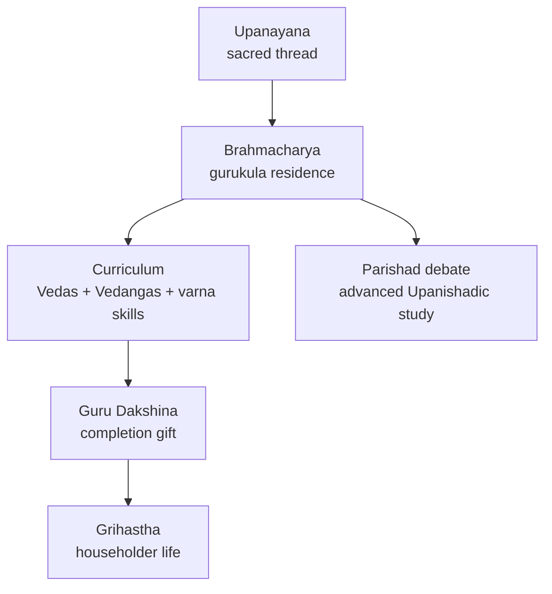

# Vedic Education System

> GS-1 · Topic 01 · Vedic education — gurukula, features, present relevance

---

## PYQs

| Year | M | Words | Question (EN) | प्रश्न (HI) | ID |
|------|---|-------|---------------|-------------|-----|
| 2019 | 8 | 125 | Describe the salient features of the Vedic education system and discuss its relevance in the present context. | वैदिक शिक्षा-प्रणाली की प्रमुख विशेषताओं का वर्णन कीजिए तथा वर्तमान संदर्भ में इसकी प्रासंगिकता की विवेचना कीजिए। | Q1 |

---

## Quick Revision

```
SYSTEM: Gurukula — Guru/Acharya + Shishyas at ashrama (forest/hermitage)
STAGE: Brahmacharya (1st ashrama) — student life, celibacy, discipline

ENTRY: Upanayana (sacred thread) = dvija ("twice-born")
  Allowed: Brahmana, Kshatriya, Vaishya | Denied: Shudra, women (Later Vedic onward)
  Age: ~8–12 (varna-wise variation in texts)

METHOD: Oral (shruti) | Memorization — padapatha, kramapatha | No fees; Guru Dakshina at end
SUBJECTS: Vedas, Vedangas, grammar, ethics, dharma, warfare (Kshatriya), agriculture (Vaishya)
VALUES: Character (sadachar), simplicity, service to guru, self-control

CENTRES: Guru's ashrama | Sandipani (Ujjain) | Janaka-Videha parishad | Kuru-Panchala
WOMEN: Early Rig Vedic — rishis (Apala, Lopamudra, Ghosha) | Later Vedic — formal access closed
  Upanishadic: Gargi, Maitreyi — philosophical debate, not formal gurukula

DHARMASHASTRA: Manu/Yajnavalkya — duties of guru, shishya, brahmacharya rules
LIMITS: Exclusionary (varna/gender) | Elite ritual focus | No mass literacy

CONTEMPORARY: Guru-shishya parampara | NEP 2020 IKS | Art 21A + RTE universal access
  UNESCO Vedic chanting (2008) | Rashtriya Sanskrit Sansthan | reject caste/gender exclusion

TRAPS: ≠ modern school/university | ≠ Nalanda/Takshashila (later, cosmopolitan, Buddhist)
  Takshashila = 6th c. BCE urban | Grihya sutras codify domestic education norms
```

---

## Content

### What was Vedic education

- **Vedic education** = system of learning through which **Vedic knowledge** (Shruti, ritual, dharma, auxiliary sciences) was transmitted in ancient India — roughly **Vedic age** (c. 1500–500 BCE) and codified further in **Dharmashastra/Smriti** tradition.
- Organized around **gurukula** (teacher's household/ashrama) — not state schools or written textbooks as primary mode.
- Goal: produce **learned dvijas** (priests, rulers, producers) versed in **Vedas and righteous conduct** — education inseparable from **religion and ethics**.
- **Exam frame:** UPPCS 2019 explicitly asks **features + present relevance** — must balance positive legacy with exclusionary limits and link to **NEP 2020**.

### Gurukula system — institutions and roles

| Element | Details |
|---------|---------|
| **Guru / Acharya** | Teacher — often a **brahmana** scholar; absolute authority; moral exemplar |
| **Shishya** | Resident pupil; lives with guru |
| **Ashrama** | Forest/hermitage or guru's dwelling — simple, disciplined environment |
| **Guru Dakshina** | Fee/gift given **at completion** — not monthly tuition; could be cattle, service, or blessing |
| **Parishad** | Assembly of learned scholars (vidvat parishad) for advanced philosophical debate |

- **Residential and personal** — guru-shishya bond (parampara) more important than institutional degree.
- Education **free during study** — pupil served guru through **collecting fuel, tending cattle, household work** (seva).

### Named centres of Vedic learning

| Centre | Significance |
|--------|--------------|
| **Guru's ashrama** | Default unit — forest/hermitage; teacher-centred, not campus-based |
| **Sandipani (Ujjain)** | Famous guru **Sandipani** — tradition links **Krishna and Sudama** as pupils; western India Vedic centre |
| **Janaka's Videha parishad** | **King Janaka** of Videha (Mithila) hosted **vidvat parishads** — **Yajnavalkya-Gargi** debates in Upanishadic texts |
| **Kuru-Panchala region** | **Kuru** (Delhi-Meerut) and **Panchala** (western UP) — heartland of Later Vedic learning; many Brahmanas and Upanishads composed here |

- Advanced philosophical education moved from isolated ashramas to **royal courts and regional assemblies** in Later Vedic–Upanishadic phase — but still guru-led, not degree-granting universities.



### Brahmacharya ashrama and Upanayana

- First of **four ashramas** — **Brahmacharya** = student life (celibacy, austerity, study).
- Entry marked by **Upanayana** (sacred thread ceremony) — initiates become **dvija** ("twice-born").
- **Three upper varnas** eligible: **Brahmana, Kshatriya, Vaishya**.
- **Shudras and women** — denied Upanayana and formal Vedic education in **Later Vedic** period (social closure tightened).
- Traditional ages for Upanayana (Smriti texts): Brahmana **8**, Kshatriya **11**, Vaishya **12** — variations exist in sources.
- Student dress: simple **deer skin / bark cloth**; staff; **mekhala** (girdle); begged alms (**bhiksha**) to learn humility.

### Women in Early vs Later Vedic education

| Aspect | **Early Rig Vedic** | **Later Vedic** |
|--------|---------------------|-----------------|
| **Women scholars** | **Apala, Lopamudra, Vishvavara, Ghosha** — women rishis; composed hymns | Rare; **Gargi, Maitreyi** in Upanishadic debate — exceptional, not norm |
| **Upanayana** | Less rigid exclusion in earliest period (debated) | **Women denied** sacred thread and formal Vedic study |
| **Participation** | Some role in **sabha/samiti** discourse | Brahmanical monopoly; education reinforces **patriarchy + varna** |
| **Exam line** | "Women participated more in Early Rig Vedic intellectual life" | "Later Vedic system formally excluded women from Vedic adhyayana" |

- Contrast is **exam-critical** — do not say women never learned; do not say equality existed throughout.

### Curriculum and subjects

**Core for all dvija students**
- **Veda adhyayana** — memorization and recitation of Samhitas (one's shakha/recension).
- **Vedangas** — Shiksha (phonetics), Chhanda (prosody), Vyakarana (grammar), Nirukta (etymology), Jyotisha (astronomy), Kalpa (ritual rules).

**Varna-oriented additions**

| Varna | Emphasis |
|-------|----------|
| **Brahmana** | Ritual (yajna), Brahmanas, mantras, priestly duties |
| **Kshatriya** | **Dhanurvidya** (archery), warfare, statecraft, ethics of kingship |
| **Vaishya** | Agriculture, cattle, trade, accounting basics |

**Higher learning (later Vedic–Upanishadic)**
- **Upanishads** — philosophical inquiry; **debate** (shastrartha) between scholars.
- **Ethics and dharma** — truthfulness, self-control, non-violence (except Kshatriya duty), respect for guru and parents.

### Dharmashastra on education duties

- **Smriti texts** (Manu, Yajnavalkya, Gautama) codify Vedic education norms:

| Party | Duties (summary) |
|-------|-------------------|
| **Guru** | Teach without meanness; protect pupil like son; impart Vedas, dharma, self-control |
| **Shishya (Brahmacharin)** | Celibacy; serve guru (fuel, alms, cattle); study with concentration; truthfulness; no luxury |
| **Householder (after study)** | Support scholars; fund education; ensure son's Upanayana |

- **Manusmriti** prescribes **24 years** of Vedic study for brahmana (12 for kshatriya, same for vaishya in some recensions) — idealised duration.
- Dharmashastra thus **legalises** the gurukula model — education = moral duty (dharma), not optional skill.

### Methods of teaching and learning

- **Oral transmission (shruti)** — primary mode; writing absent or minimal in early phase.
- **Rigorous memorization** — **padapatha** (word-by-word), **kramapatha** (step recitation) to prevent corruption of Vedic text.
- **Repetition and listening** — shishya hears, repeats, questions only when permitted.
- **Learning by doing** — participation in **domestic and ritual chores**; Kshatriya trained in martial skills.
- **No mass examination system** — mastery judged by guru; completion = permission to enter **Grihastha** (householder life) or advanced study.

### Salient features (summary for exams)

1. **Gurukula-based residential education** — guru-shishya parampara.
2. **Religious-ethical foundation** — education = character building + sacred knowledge.
3. **Oral and memorization-centric** — world's most precise oral literary tradition.
4. **Free teaching; dakshina at end** — not commercialized.
5. **Varna-differentiated curriculum** — functional specialization (priest, warrior, producer).
6. **Simple, disciplined life** — celibacy, frugality, physical labour.
7. **Exclusionary access** — formal Vedic study restricted to **upper three varnas**; women and shudras largely excluded in later period.
8. **Regional centres** — Kuru-Panchala, Videha parishads, Sandipani-Ujjain tradition.

### Takshashila trap (do not confuse)

- **Takshashila (Taxila)** = ancient learning centre in **Gandhara** — flourished mainly **6th c. BCE–5th c. CE** as **cosmopolitan urban university**.
- Taught **medicine, grammar, polity, warfare** — attracted **international students**; strong **Buddhist** influence later.
- **NOT the same as Vedic gurukula:**
  - Gurukula = **oral Vedic**, forest ashrama, dvija-only, pre-Buddhist core tradition.
  - Takshashila = **later**, **multi-subject**, urban, wider social access (including non-brahmin traditions).
- UPPCS trap: "Vedic education = Takshashila/Nalanda" — **wrong**; mention only as **contrast/alternative** education model.

### Social context and change

- Early Vedic: relatively **open tribal learning**; assemblies (**sabha, samiti**) suggest broader participation in discourse.
- Later Vedic: **brahmanical monopoly** on Vedic lore; education reinforces **varna hierarchy**.
- **Buddhist/Jain alternative:** monastic **pabbajja** education open to wider sections including women — explains historical alternative to closed Vedic gurukula.

### Limitations of Vedic education

- **Narrow eligibility** — majority (shudras, women) denied formal Vedic study.
- **Ritual-religious bias** — little room for secular sciences, arts for non-elite.
- **No universal literacy** — education for small priestly-ruling minority.
- **Oral dependence** — knowledge loss if lineages break; limited spread.
- **Conservative** — preservation of tradition over innovation (though Upanishads show philosophical growth).

### Contemporary relevance

- **NEP 2020 — Indian Knowledge Systems (IKS):** Explicitly integrates ancient learning traditions — **Sanskrit, Ayurveda, yoga, astronomy, philosophy** — into school and higher education while mandating **21st-century skills**; gurukula ethos of **holistic learning** cited as model, not exclusionary structure.
- **Guru-shishya parampara today:** Recognised in **mentorship programmes**, **research supervision**, **vocational apprenticeship** (ITI guru-shishya schemes), and **classical music/dance** training — UNESCO-listed oral traditions preserve pedagogical lineages.
- **UNESCO Intangible Heritage (2008):** **Vedic chanting** transmission depends on gurukula-style oral pedagogy — living proof of ancient educational method's precision.
- **Constitutional contrast — what modern India adopts vs rejects:**
  - **Adopt:** Character education, teacher-student bond, value-based learning, Sanskrit/IKS heritage, simplicity and discipline ethos.
  - **Reject:** Caste/gender exclusion — **Article 15** (non-discrimination), **Article 21A** (right to education), **RTE Act 2009** mandate **universal free compulsory education** for 6–14 years.
- **Article 51A(f):** Citizen duty to value heritage — Vedic educational tradition is part of civilizational identity, studied **critically** not revived as discriminatory system.
- **Institutional continuity:** **Rashtriya Sanskrit Sansthan**, **Central Sanskrit Universities**, **Gurukul Kangri (Haridwar)** — blend traditional and modern curricula; **IITs/IISERs** offer IKS electives.
- **Yoga and AYUSH education:** Gurukula-style residential training in **yoga, Ayurveda, Unani** under **Ministry of AYUSH** — selective adaptation of ancient pedagogical model with modern certification.
- **Tourism and living heritage:** Vedic schools in **Kerala (Thirunavaya)**, **Maharashtra, Karnataka** open to scholars — cultural tourism and diaspora interest in authentic Vedic pedagogy.
- **Balanced present-day view:** Relevance is **selective and reformist** — adopt ethos of dedication and holistic growth; reject discrimination and elitism; combine **IKS + STEM + universal access**.

---

## Answers

### Q1: Describe the salient features of the Vedic education system and discuss its relevance in the present context. (2019, 8M, 125W)

**Opening:**
> Vedic education was a gurukula-based, oral, and ethics-centred system through which sacred knowledge was transmitted to dvija pupils during the Vedic age.

**Write these points:**
- **Institution:** **Gurukula** — pupils lived with **guru/acharya** in ashrama; **Brahmacharya** stage; entry via **Upanayana** (sacred thread) for Brahmana, Kshatriya, Vaishya; centres like **Kuru-Panchala**, **Janaka's Videha parishad**, **Sandipani (Ujjain)**.
- **Method & curriculum:** **Oral memorization** of Vedas and **Vedangas**; varna-specific skills — ritual for brahmins, warfare for kshatriyas, agriculture/trade for vaishyas; **guru dakshina** at completion, not commercial fees; **Dharmashastra** codified guru-shishya duties.
- **Values:** Discipline, celibacy, simplicity, seva to guru, truthfulness — education fused with **character building**.
- **Limits:** Excluded **shudras and women** (Later Vedic); Early Rig Vedic had **women rishis** — contrast important; elite ritual focus; not same as **Takshashila/Nalanda**.
- **Present relevance:** **Guru-shishya parampara**, holistic and value-based learning align with **NEP 2020 IKS** — but only with **universal access** under **Article 21A/RTE**, gender equality, and modern scientific curriculum.

**Conclusion:**
> Vedic education's enduring legacy lies in its moral depth and teacher-pupil tradition — relevant today only when stripped of exclusion and adapted to democratic, inclusive schooling under constitutional rights.

---

## Traps

| Wrong | Correct |
|-------|---------|
| Vedic education = Nalanda/Takshashila | **Gurukula** oral Vedic system; Nalanda/Takshashila = **later**, cosmopolitan, Buddhist-influenced |
| All varnas and women studied Vedas equally | **Dvija only**; shudras/women **excluded** in Later Vedic formal system |
| No women ever learned in Vedic India | **Early Rig Vedic** women rishis (Apala, Ghosha); decline in **Later Vedic** |
| Written textbooks were primary | **Oral shruti** — padapatha/kramapatha memorization |
| Paid monthly fees to guru | **Free study**; **Guru Dakshina** at end |
| Vedic education purely secular | **Religious-ritual** core — Vedas, yajna, dharma |
| Present relevance = restore varna-based access | Reject exclusion; adopt **values only** — NEP universal equity + **Article 21A** |
| Takshashila = Vedic gurukula | Takshashila = **later urban university**; different period, scope, access |
| Same as Vedic literature file topic | Literature = **texts**; this file = **education system/institution** |
| NEP 2020 = return to gurukula exclusion | NEP = **IKS + modern skills + inclusive access** |
| Gargi/Maitreyi = formal gurukula graduates | **Upanishadic debaters** — exceptional, not representative of formal Vedic schooling |
| UNESCO Vedic chanting = proves universal ancient education | Proves **oral pedagogy mastery** — not mass literacy or inclusive access |

---

*Complete.*
