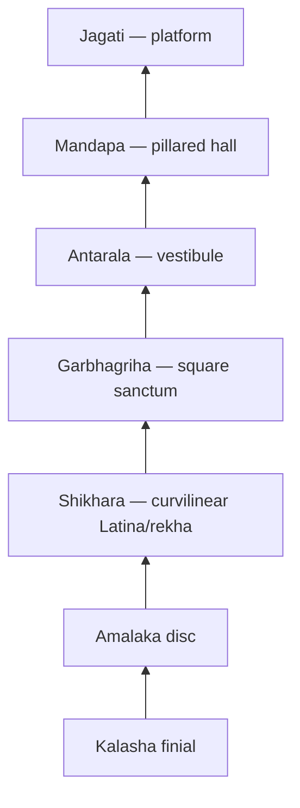
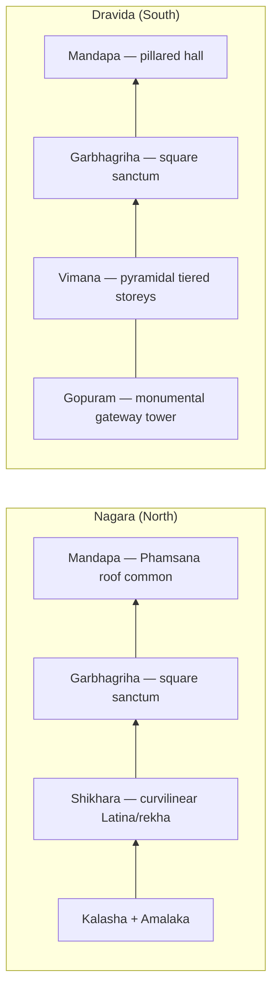

# Nagar Style Temple Architecture

> GS-1 · Topic 01 · Nagara (Nagar) style temple architecture — north India

---

## PYQs

| Year | M | Words | Question (EN) | प्रश्न (HI) | ID |
|------|---|-------|---------------|-------------|-----|
| 2023 | 8 | 125 | Describe the salient features of Nagar style of temple architecture. | नागर शैली की मंदिर वास्तुकला की प्रमुख विशेषताओं का वर्णन कीजिए। | Q1 |

---

## Quick Revision

```
STYLE: Nagara (Nagara) = NORTH Indian Hindu temple idiom | Curvilinear SHIKHARA (Latina/rekha)
NOT: Mauryan stupa | NOT Dravida pyramidal vimana (south) | NOT Vesara hybrid (Deccan)

TEXTS: Mayamata · Vishnudharmottara · Manasara · Brihat Samhita (temple proportions, vastu)
PARTS: Jagati (platform) → Garbhagriha (sanctum) → Antarala (vestibule) → Mandapa (hall)
  Shikhara above garbhagriha | Amalaka (disc) + Kalasha (finial pot) on top
  Pradakshina patha | Optional: ardha-mandapa, mahamandapa, torana, nandi-mandapa

SHIKHARA SUB-TYPES: Latina/rekha (curvilinear — sanctum) | Phamsana (pyramidal — mandapa roof)
  Valabhi (rectangular barrel vault — rare, e.g. Vaital Deul khakhara)

PLAN: Square sanctum common | Panchayatana = 1 main + 4 subsidiary shrines (corners)
  Nagara = curvilinear tower focus | Dravida = pyramidal vimana + monumental gopuram

MATERIAL: Stone (sandstone) later; early brick (Bhitargaon, Gupta) | Terracotta (Bengal)

REGIONS & PEAKS:
  Gupta early: Deogarh (Jhansi) · Bhitargaon (Kanpur brick) · Bhitari
  Chandelas: Khajuraho — Kandariya Mahadeva (c. 950–1050 CE) | UNESCO 1986
  Odisha: Lingaraja · Jagannath (Puri) · Konark Sun Temple (13th c.) | UNESCO 1984
  Gujarat: Modhera Sun Temple (Solanki) | Somnath tradition
  Bengal: Vishnupur char-chala · at-chala (Pala-Sena brick)
  Chalukya transitional: Aihole · Pattadakal (Nagara-Dravida blend → Vesara)
  Himalayan: Martand Sun Temple (Kashmir, Lalitaditya, 8th c.)

ODISHA DEUL: Rekha (curvilinear sanctum) · Pidha (pyramidal mandapa) · Khakhara (barrel vault)

FEATURES: Vertical Mount Meru axis | Rich sculptural walls (mithunas, dvara-shakhas)
  Khajuraho = peak Nagara sculpture + architecture

vs DRAVIDA: Nagara = curvilinear shikhara | Dravida = pyramidal vimana + gopuram gateway
  Aihole/Pattadakal = transitional | Vesara = Deccan hybrid (Hoysala Belur/Halebidu)

CONTEMPORARY: UNESCO — Khajuraho (1986) · Konark (1984) | ASI protected monuments
  Art 49 (state protect) · Art 51A(f) (citizen duty) | NEP 2020 IKS — Shilpashastra in curriculum
  PRASAD · Swadesh Darshan · Incredible India — temple tourism circuits
  Digital ASI documentation · craft revival (stone carving GI clusters)

TRAPS: Nagar ≠ Nagara spelling both OK | Odisha rekha deul = Nagara sub-school | Mauryan ≠ Nagar
  Phamsana ≠ sanctum shikhara | Aihole = transitional not pure Nagara | Khakhara ≠ rekha
  Bengal char-chala = regional Nagara not Dravida | Konark = Nagara not separate style
  Garbhagriha = sanctum not mandapa | Vesara ≠ same as Nagara | Kandariya = Nagara not Dravida
```

---

## Content

### Context — what is Nagara (Nagar) style

- **Nagara** (also written **Nagar**) = principal **north Indian** style of **Hindu temple architecture** from the early historic period through the medieval era — the dominant sacred building idiom of the Gangetic plains, central India, Odisha, Gujarat, Rajasthan, Bengal, and the Himalayan foothills.
- Named for **Nagara desha** (north country) in traditional **Shilpashastra** texts — **Mayamata**, **Vishnudharmottara Purana**, **Manasara**, and **Varahamihira's Brihat Samhita** prescribe temple proportions, orientation, and iconographic programmes for north Indian builders.
- Mature form: **square sanctum (garbhagriha)** crowned by a **curvilinear shikhara** (tower), preceded by **mandapa** (pillared hall), often on a raised **jagati** (platform), with **pradakshina patha** (circumambulatory passage).
- Associated with **Brahmanical temple worship** expansion from the **Gupta period** (5th–6th c. CE) onward; reached artistic peak under **Chandelas** (Khajuraho), **Ganga dynasty** (Odisha), **Solankis** (Gujarat), and **Pala-Sena** patrons (Bengal).
- **Exam frame:** UPPCS asks **salient features**, **regional sub-schools**, **Nagara vs Dravida comparison**, and **evolution from Gupta to medieval** — all covered below.

### Core architectural components

| Part | Function | Exam note |
|------|----------|-----------|
| **Garbhagriha** | Sanctum sanctorum — main deity image (murti); small, dark, square cella | Heart of worship; orientation fixed by vastu |
| **Shikhara** | Tower above garbhagriha — **curvilinear outline** (Nagara hallmark) | Not to be confused with mandapa roof |
| **Amalaka** | Large ribbed stone disk at shikhara summit | Supports kalasha finial |
| **Kalasha** | Finial pot on top of amalaka — cosmic/ auspicious symbol | Completes vertical sacred axis |
| **Antarala** | Vestibule between garbhagriha and mandapa | Transition space for ritual |
| **Mandapa** | Pillared assembly/prayer hall — **ardha-mandapa** (porch), **mahamandapa** (large hall) | Often has **Phamsana** pyramidal roof |
| **Jagati** | Raised platform — circumambulation base | Social and ritual gathering space |
| **Pradakshina patha** | Circumambulatory passage around sanctum | Clockwise worship circuit |
| **Torana / Dwar** | Decorative gateway (early temples) | Later replaced by high enclosure walls |
| **Nandi-mandapa** | Pillared pavilion for Nandi bull (Shaiva temples) | e.g. before main shrine at Khajuraho |



### Shikhara sub-types (Nagara vocabulary)

| Sub-type | Form | Typical use | Key example |
|----------|------|-------------|-------------|
| **Latina / Rekha** | **Curvilinear** tower — single convex curve rising to amalaka | **Sanctum shikhara** — classic Nagara hallmark | Deogarh, Kandariya Mahadeva, Lingaraja rekha deul |
| **Phamsana** | **Pyramidal** roof with horizontal tiers/steps | **Mandapa roofs**, subsidiary shrines | Khajuraho mandapa roofs, Odisha pidha deul |
| **Valabhi** | **Rectangular barrel vault** (wagon-roof shape) | Rare — special shrines | Vaital Deul (khakhara type), some mandapas |

- **Exam precision:** Main Nagara identity = **Latina/rekha shikhara over garbhagriha**; Phamsana and Valabhi are **roof forms** for halls or special structures, not substitutes for the sanctum tower.
- **Shilpashastra logic:** Vertical shikhara symbolises **Mount Meru** — cosmic axis connecting earth and heaven; worshipper's gaze is drawn upward from mandapa to sanctum to finial.

### Odisha deul types (regional Nagara)

| Deul type | Shikhara form | Example / note |
|-----------|---------------|----------------|
| **Rekha deul** | **Curvilinear rekha/latina** shikhara | **Lingaraja** (Bhubaneswar, 11th c.), **Jagannath Puri** — classic Nagara sanctum tower |
| **Pidha deul** | **Pyramidal pidha** (stepped tiers) | **Jagamohana** (assembly hall) roofs in Odisha complexes — parallels Phamsana |
| **Khakhara deul** | **Barrel-vault / wagon-roof** (valabhi-like) | **Vaital Deul** (Bhubaneswar, 8th c.) — rarer, often **Shakta** shrines |

- **Konark Sun Temple** (13th c., **Narasimhadeva I**, Ganga dynasty) — massive **rekha deul** designed as **Surya's chariot** with 24 wheels and seven horses; among India's most celebrated Nagara monuments.
- Odisha school = **regional Nagara**, not a separate pan-Indian style — rekha deul shares the curvilinear sanctum logic with Khajuraho and Deogarh.

### Bengal regional variants (Nagara family)

- **Char-chala** — roof formed by **four sloping planes** meeting at apex (four-roofed); common in **medieval Bengal** brick temples (e.g. **Vishnupur/Mallabhum** region, 17th–18th c. but rooted in Pala-Sena idiom).
- **At-chala** — **eight-roofed** variant (char-chala base + four smaller roofs above) — taller, tiered silhouette; **Rasmancha** (Vishnupur) is a famous multi-arched pavilion.
- Built mainly in **brick and terracotta** — same Nagara logic (sanctum + tower-roof + mandapa) adapted to **Gangetic delta** climate, alluvial soil (stone scarce), and **local patronage** (Pala-Sena period onward).
- **Terracotta panels** narrate **Ramayana, Mahabharata, Krishna lila** — sculptural substitute when stone carving unavailable.

### Salient features of Nagara style (exam core)

1. **Curvilinear shikhara (Latina/rekha)** — tall tower with convex-to-inward curve over garbhagriha; defining visual mark of north Indian temples.
2. **Square garbhagriha** — sanctum plan usually square; deity image oriented for worship from mandapa; darkness of cella emphasises mystery of divine presence.
3. **Vertical emphasis** — temple rises dramatically upward — symbol of **Mount Meru** / axis between earth and heaven; contrasts with horizontal spread of mandapa.
4. **Mandapa integration** — horizontal pillared halls balance vertical shikhara; **Phamsana** roofs often cover mandapas while sanctum retains rekha tower.
5. **Rich sculptural decoration** — walls, doorframes (**dvara-shakhas** with river-goddess figures Ganga-Yamuna), ceilings carved with deities, **mithunas** (celestial couples), narrative panels from epics and Puranas.
6. **Panchayatana plan** (many medieval examples) — **one central shrine + four subsidiary shrines** at corners (e.g. **Lakshmana temple, Khajuraho**; some Odisha complexes).
7. **Material evolution** — early **brick** (Gupta **Bhitargaon**, c. 5th c. CE — among oldest surviving brick temples); mature phase **sandstone/stone** (Chandelas, Odisha, Rajasthan).
8. **Regional sub-schools** — same Nagara idiom adapts to local stone, climate, patron dynasties without losing rekha-shikhara identity.

### Regional schools and named examples

| Region / dynasty | Key temples | Period / notes |
|------------------|-------------|----------------|
| **Gupta (early Nagara)** | **Deogarh** (Jhansi, Vishnu temple), **Bhitargaon** (Kanpur, brick), **Bhitari** (Varanasi region) | **Earliest** structural temple forms; brick + stone; modest rekha shikhara — c. 5th–6th c. CE |
| **Chandelas — Khajuraho** | **Kandariya Mahadeva** (~31 m shikhara), Lakshmana, Vishvanatha, Parsvanatha (Jain) | **Peak** Nagara — tallest shikharas, famed sculpture (c. 950–1050 CE); **UNESCO 1986** |
| **Odisha — Ganga/Eastern Ganga** | Lingaraja (Bhubaneswar), Jagannath (Puri), **Konark Sun Temple** (13th c.) | **Rekha, pidha, khakhara deul** types; Konark **UNESCO 1984** |
| **Gujarat — Solanki** | **Modhera Sun Temple** (Surya, stepped tank), Somnath tradition | Stone carving; torana gateways; ratha (chariot) motifs |
| **Rajasthan / Malwa** | **Osian** (Osiya, 8th–12th c.), Nagda, Eklingji | Sandstone Nagara; Maru-Gurjara sub-style |
| **Bengal** | Vishnupur terracotta temples, **Bishnupur Rasmancha** | **Char-chala, at-chala** — brick Nagara variants |
| **Chalukya transitional** | **Aihole, Pattadakal** (Karnataka) | **Nagara-Dravida blend** — Lad Khan, Durga temple (Aihole); Virupaksha (Dravida), Papanatha (Nagara) at Pattadakal |
| **Himalayan / Kashmir** | **Martand Sun Temple** (Kashmir, 8th c., **Lalitaditya Muktapida**) | **Himalayan Nagara** — peristyle colonnade, central rekha shikhara |

### Aihole and Pattadakal — transitional architecture

- **Chalukyas** (6th–8th c. CE) built at **Aihole** ("cradle of Indian temple architecture") and **Pattadakal** when **Nagara and Dravida** vocabularies were actively combined.
- **Aihole:** **Lad Khan temple** (pillared hall type), **Durga temple** (apsidal/experimental plan), **Huchimalligudi** — early Nagara shikhara experiments on Deccan soil.
- **Pattadakal:** **Virupaksha** (Dravida-influenced vimana, built by queen **Lokamahadevi**), **Papanatha** (Nagara shikhara) — **same site, both idioms** side by side; **UNESCO 1987** (Pattadakal group).
- **Exam angle:** Not pure Nagara — marks **transition** toward **Vesara** (Deccan hybrid); shows pan-Indian temple vocabulary exchange before Hoysala maturity at Belur and Halebidu.

### Himalayan Nagara — Martand (Kashmir)

- **Martand Sun Temple** (8th c., patron **Lalitaditya Muktapida** of Karkota dynasty) — finest **Kashmir Nagara** example; now in ruins but plan recoverable.
- Features: **peristyle courtyard**, central **garbhagriha** with **rekha-type shikhara**, heavy limestone construction adapted to **Himalayan** setting and snow-load.
- Demonstrates Nagara idiom **beyond Gangetic north** — regional variant influenced by Gandharan and Gupta traditions, not Dravida.

### Evolution and period chronology

| Phase | Period | Character | Landmark sites |
|-------|--------|-----------|----------------|
| **Origins** | c. 5th–6th c. CE (Gupta) | Simple **rekha shikhara**, brick temples, single-cell garbhagriha + mandapa | **Deogarh, Bhitargaon** |
| **Experimentation** | c. 6th–8th c. CE | **Aihole/Pattadakal** — Nagara-Dravida synthesis; stone replaces brick | Chalukya courts |
| **Maturity** | c. 8th–12th c. CE | Stone, complex plans, towering shikharas, elaborate sculpture | **Khajuraho, Lingaraja, Modhera** |
| **Medieval peak** | c. 10th–13th c. CE | Regional sub-schools fully developed; large temple complexes | **Konark**, Bengal char-chala, Martand legacy |

- Gupta architecture overall less spectacular than Gupta sculpture/literature — but **Deogarh marks crucial transition** from rock-cut and flat-roofed shrines to classic Nagara vocabulary that dominated north India for a millennium.

### Nagara vs Dravida vs Vesara (comparison)

| Feature | **Nagara** (North) | **Dravida** (South) | **Vesara** (Deccan) |
|---------|-------------------|---------------------|---------------------|
| **Tower** | Curvilinear **shikhara** (Latina/rekha) | Pyramidal **vimana** (tiered storeys) | **Hybrid** — combined features |
| **Region** | North & central India, Odisha, Bengal, Gujarat | Tamil Nadu, Karnataka, AP | Karnataka, Deccan plateau |
| **Entrance** | Torana / later enclosure walls | Monumental **gopuram** (gateway tower) | Mixed — often low vimana, ornate exterior |
| **Mandapa roof** | Often **Phamsana** (pyramidal) | Pyramidal or flat pillared | Mixed |
| **Vertical axis** | Single soaring shikhara | Vimana + increasingly dominant gopuram | Star-shaped plan (Hoysala) |
| **Examples** | Khajuraho, Deogarh, Konark, Martand | Brihadeshwara (Thanjavur), Kailasanatha (Kanchi) | Hoysala (Belur, Halebidu); Chalukya Pattadakal |



*Exam memory:* Nagara = **curving rekha shikhara** (north) · Dravida = **pyramidal vimana + gopuram** (south) · Aihole/Pattadakal = **transitional blend** toward Vesara

### Significance and civilizational legacy

- Represents **distinctive north Indian sacred architecture** — visual identity of medieval Hindu polities (**Chandelas, Ganga dynasty Odisha, Solankis, Palas**).
- Temples functioned as **cultural, economic, social centres** — **devadana** land grants, festival economies, craft patronage (stone-carvers, sculptors, musicians); Khajuraho and Puri Jagannath remain pilgrimage hubs.
- **Sculptural galleries** preserve iconography of **Vishnu, Shiva, Devi, Surya**, and Jain **tirthankaras** — indispensable for art history, religious studies, and iconography papers.
- **Influence on later Rajput, Mughal-influenced, Bengal, and Himalayan** temple building — Nagara rekha logic persists in **Bishnupur, Rajasthan maru-gurjara**, and **Kashmir** stone temples.
- **Soft power today:** Khajuraho dance festival, Konark festival, Puri Rath Yatra — living heritage economies rooted in Nagara-built sacred landscapes.

### Contemporary relevance

- **UNESCO World Heritage:** **Khajuraho Group of Monuments (1986)**, **Konark Sun Temple (1984)**, **Pattadakal (1987)** — global obligations under World Heritage Convention; international tourism and conservation funding follow listing.
- **ASI (Archaeological Survey of India):** Central protection of notified monuments — structural monitoring at **Konark** (sandstone weathering), **Khajuraho** (water seepage on sculpture), **Deogarh** and **Bhitargaon** (early Nagara conservation challenges).
- **Constitutional framework:** **Article 49** — state shall protect monuments of national importance; **Article 51A(f)** — fundamental duty of citizens to value and preserve composite culture.
- **NEP 2020 — Indian Knowledge Systems (IKS):** **Shilpashastra**, temple proportion geometry, and Nagara-Dravida comparison integrated into **art history, architecture, and heritage management** curriculum at school and university levels.
- **Government tourism schemes:** **PRASAD** (Pilgrimage Rejuvenation and Spiritual Augmentation Drive) and **Swadesh Darshan** develop connectivity and amenities at **Puri, Khajuraho, Varanasi-region** circuits; **Incredible India** campaigns feature Konark and Khajuraho globally.
- **Craft revival and GI tags:** Stone-carving clusters in **Khajuraho, Puri, Rajasthan** linked to temple restoration workshops — heritage skills as livelihood; **terracotta craft** revival in Bengal tied to Vishnupur temple panels.
- **Digital heritage:** ASI **National Mission on Monuments and Antiquities (NMMA)** and 3D documentation of endangered Nagara temples — creates preservation record for **Martand, Bhitargaon**, and Odisha deul complexes.
- **Living pilgrimage economy:** **Puri Jagannath Rath Yatra**, **Konark Dance Festival**, **Khajuraho Dance Festival** — Nagara monuments anchor **annual cultural tourism** worth crores to state economies (Odisha, MP, UP border regions).

### Limits / balanced view (exam nuance)

- **Not monolithic** — Odisha rekha/pidha/khakhara, Bengal **char-chala/at-chala**, Kashmir Martand, and Maru-Gurjara Rajasthan are **regional variants** under broader Nagara family — avoid calling every north Indian temple "identical Khajuraho."
- Early temples **small and experimental** — do not attribute full medieval features (panchayatana, 30 m shikhara, mithuna galleries) to Gupta **Deogarh**.
- **Phamsana** covers mandapas — do not call it the main sanctum shikhara in exam answers.
- **Aihole/Pattadakal** = transitional — not textbook pure Nagara or pure Dravida; cite when question asks "evolution" or "Deccan."
- **Distinct from Buddhist stupa, chaitya, vihara** and from **Mauryan pillars/stupas** — Nagara is post-Gupta Brahmanical structural temple tradition.
- **Destruction and rebuilding:** Many Nagara sites (Somnath, Kashmiri temples) suffered **medieval invasions and earthquakes** — present structures may be **rebuilt/restored** layers, not always original medieval fabric.

---

## Answers

### Q1: Describe the salient features of Nagar style of temple architecture. (2023, 8M, 125W)

**Opening:**
> Nagara (Nagar) style is the classic north Indian Hindu temple architecture distinguished by a curvilinear rekha/latina shikhara rising above a square garbhagriha, integrated with mandapa halls on a raised platform.

**Write these points:**
- **Plan and parts:** **Garbhagriha** (sanctum) + **mandapa** (pillared hall), often **antarala** (vestibule) and **jagati** (platform); **pradakshina patha** for circumambulation; **panchayatana** plan in many medieval examples.
- **Shikhara types:** Main tower = **Latina/rekha** (curvilinear) over sanctum — crowned by **amalaka** and **kalasha**; **Phamsana** (pyramidal) for mandapa roofs; **Valabhi/khakhara** (barrel vault) in rare cases (Vaital Deul).
- **Sculpture and material:** Rich carved walls and **dvara-shakhas** — deities, mithunas, narrative panels; early **brick** temples (Bhitargaon, Gupta) to mature **sandstone** (Khajuraho, Odisha rekha deul).
- **Regional peaks:** Early Nagara at **Deogarh**; Chandela **Khajuraho** (UNESCO 1986); Odisha **Lingaraja/Konark** (rekha, pidha, khakhara deul; Konark UNESCO 1984); Bengal **char-chala/at-chala**; Himalayan **Martand** (Kashmir).
- Defines north Indian sacred landscape from **Gupta origins** through medieval period — vertical axis symbolising Mount Meru; temples as religious, artistic, and community centres protected today under **ASI** and **Art 49/51A(f)**.

**Conclusion:**
> Nagara style thus embodies the north Indian temple ideal — sanctum, curving rekha shikhara, and sculptural richness — forming a counter-tradition to Dravida architecture of the south and anchoring India's UNESCO-listed temple heritage.

---

### Q2: Compare Nagara and Dravida styles of temple architecture. (Future PYQ, 8M, 125W)

**Opening:**
> Nagara (north) and Dravida (south) represent the two classical poles of Hindu temple architecture — differing chiefly in tower form, gateway emphasis, and regional evolution.

**Write these points:**
- **Tower:** Nagara = **curvilinear Latina/rekha shikhara** over garbhagriha with **amalaka-kalasha** finial; Dravida = **pyramidal tiered vimana** over sanctum — horizontal storeys, not inward curve.
- **Gateway:** Nagara uses **torana** or later enclosure walls; Dravida foregrounds monumental **gopuram** (gateway tower) — often taller than vimana in later temples (e.g. Srirangam).
- **Plan and parts:** Both have **garbhagriha, mandapa, pradakshina** — but Nagara mandapas often have **Phamsana** (pyramidal) roofs; Dravida complexes integrate **gopuram-vimana-mandapa** axis.
- **Region and examples:** Nagara — **Khajuraho, Deogarh, Konark, Martand**; Dravida — **Brihadeshwara (Thanjavur), Kailasanatha (Kanchi)**; **Aihole/Pattadakal** shows transitional blend toward **Vesara**.
- **Significance:** Nagara = north Indian sacred skyline (Khajuraho/Konark UNESCO sites); Dravida = Tamil/Chola-Pallava idiom — together define pan-Indian temple heritage taught under **NEP 2020 IKS**.

**Conclusion:**
> The comparison turns on shikhara versus vimana and gopuram — two solutions to the same ritual need of housing the deity and guiding the worshipper's gaze upward.

---

### Q3: Trace the evolution of Nagara temple architecture from the Gupta period to the medieval era. (Future PYQ, 8M, 125W)

**Opening:**
> Nagara architecture evolved from modest Gupta brick experiments to towering medieval stone masterpieces — a trajectory from simple rekha shikhara to regional sub-schools across north and central India.

**Write these points:**
- **Gupta origins (5th–6th c.):** **Deogarh** (stone), **Bhitargaon** (brick) — earliest structural **garbhagriha + rekha shikhara + mandapa**; modest scale, foundational vocabulary codified later in Shilpashastras.
- **Transitional phase (6th–8th c.):** **Aihole and Pattadakal** (Chalukya) — Nagara shikhara and Dravida vimana experimented on same sites; bridge to **Vesara** hybrid idiom (Pattadakal UNESCO 1987).
- **Maturity (8th–12th c.):** Stone construction, **panchayatana** plans, taller shikharas, dense sculpture — **Khajuraho** (Chandelas) as north Indian peak (UNESCO 1986).
- **Medieval regional peaks (10th–13th c.):** Odisha **rekha/pidha/khakhara deul** (Lingaraja, Konark UNESCO 1984); Bengal **char-chala/at-chala** brick temples; **Martand** (Kashmir) as Himalayan Nagara.
- **Continuity:** Throughout — square sanctum, vertical sacred axis, mandapa integration, and Brahmanical worship context; change is in **scale, material, and regional roof/tower sub-types** — all now under **ASI/UNESCO** conservation frameworks.

**Conclusion:**
> From Gupta Deogarh to Chandela Khajuraho and Ganga-period Konark, Nagara architecture charts a clear evolution in grandeur while retaining the curvilinear shikhara as its defining mark across fifteen centuries of sacred building.

---

## Traps

| Wrong | Correct |
|-------|---------|
| Nagar style = Mauryan period | **Gupta onward** (5th c. CE+); Mauryan = stupas/pillars |
| Nagar = Dravida vimana | Nagara = **curvilinear rekha shikhara** (north); Dravida = **pyramidal vimana + gopuram** (south) |
| Shikhara = flat roof mandapa | **Shikhara = tower over garbhagriha**; mandapa often has **Phamsana** pyramidal roof |
| Phamsana = main sanctum tower | **Phamsana = pyramidal roof for mandapa**; sanctum = **Latina/rekha shikhara** |
| Khajuraho = Dravida/Chola | **Chandela — Nagara** (Madhya Pradesh); UNESCO 1986 |
| Konark/Odisha = non-Nagara separate style | Odisha **rekha deul** = **regional Nagara** sub-school; UNESCO 1984 |
| Khakhara deul = rekha deul | **Khakhara** = **barrel-vault/wagon-roof**; **rekha** = curvilinear |
| Aihole/Pattadakal = pure Nagara | **Transitional** Chalukya site — **Nagara-Dravida blend** toward Vesara |
| Bengal char-chala = Dravida | **Char-chala/at-chala** = **Bengal regional Nagara** (brick, sloping roofs) |
| Martand = Dravida temple | **Martand (Kashmir)** = **Himalayan Nagara** with peristyle and rekha shikhara |
| Garbhagriha = assembly hall | **Garbhagriha = sanctum**; mandapa = hall |
| Vesara = same as Nagara | Vesara = **Deccan hybrid** of Nagara + Dravida (Hoysala, Chalukya legacy) |
| Modhera = Nagara peak in Odisha | **Modhera** = **Gujarat** (Solanki Sun Temple) — Nagara, not Odisha |
| Kandariya Mahadeva = Buddhist chaitya | **Shaiva Brahmanical** Nagara temple at Khajuraho — not Buddhist |

---

*Complete.*
