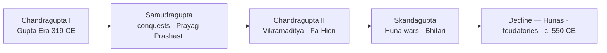
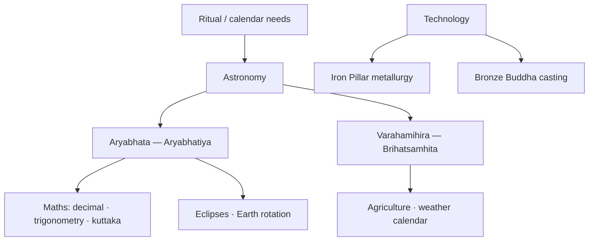

# Gupta Golden Age

> GS-1 · Topic 01 · Gupta period — Golden Age, literature, art, science

---

## PYQs

| Year | M | Words | Question (EN) | प्रश्न (HI) | ID |
|------|---|-------|---------------|-------------|-----|
| 2022 | 8 | 125 | Discuss why the Gupta period is regarded as the Golden Age of ancient India. | गुप्त काल को प्राचीन भारत का स्वर्ण युग क्यों माना जाता है? विवेचना कीजिए। | Q1 |
| 2021 | 8 | 125 | Discuss the scientific achievements during the Gupta period. | गुप्त काल में विज्ञान की उपलब्धियों की विवेचना कीजिए। | Q2 |

---

## Quick Revision

```
PERIOD: c. AD 275–550 | Gupta Era starts AD 319–20 (Chandragupta I)
RULERS: Chandragupta I → Samudragupta → Chandragupta II (Vikramaditya) → Skandagupta (last great)

POLITY: North India reunified | Prayagraj centre | Allahabad Pillar Inscription (Samudragupta, Harisena)
  Fa-Hien (399–414 CE) — Buddhist monasteries, prosperous Magadha under Chandragupta II
  Skandagupta — repelled Hunas | Bhitari inscription (defence against Hunas)

GOLDEN AGE = Art + Literature + Science + Classical Sanskrit + Religion (NOT full economic golden age)
  Kalidasa (Shakuntala, Meghaduta, Raghuvamsha) | Vishakhadatta (Mudrarakshasa) | Shudraka (Mrichchhakatika)
  Puranas compiled | Kamasutra (Vatsyayana) | Amarasimha (Amarakosha lexicon)

ART: Ajanta paintings (Gupta phase 5th–6th c.) | Sarnath/Mathura Buddha | Deogarh temple (early Nagara)
  Samudragupta on coin playing veena | Gupta dinara — gold coins (king + Lakshmi, horse/sash type)
  Amaravati (Andhra narrative relief) · Gandhara (Greco-Buddhist) — contemporary parallel schools

SCIENCE: Aryabhata (Aryabhatiya, c. 499 CE) — decimal, place value, eclipses, Earth rotation
  Varahamihira (Brihatsamhita, Panchasiddhantika) — astronomy, agriculture, weather
  Iron Pillar (Delhi, Mehrauli, 4th c.) — rust-resistant metallurgy | Nalanda (5th c. foundation)

FEUDALISM: Brahmadeya · agrahara · devadana land grants | Vishti (forced labour)
  Sati inscriptions (c. 510 AD, Eran) | RS Sharma — town/trade decline, emerging feudalism

DECLINE: Hunas after Skandagupta | Maukharis (Kanauj) · Pushyabhutis break away | c. 550 CE fragmentation

CONTEMPORARY: Ajanta UNESCO 1983 | Nalanda University revival (international) | NEP 2020 IKS
  ISRO Aryabhata satellite (1975) | Iron Pillar ASI protected | Art 49/51A(f) heritage duty
  Gupta dinara in National Museum · Sarnath ASI site museum

TRAPS: Golden age ≠ only politics/military | Aryabhata ≠ invented zero alone
  Sarnath ≠ Mathura style | Skandagupta ≠ founder | Gupta dinara ≠ punch-marked coins
  Fa-Hien ≠ Ashoka period | Bhitari = Skandagupta not Samudragupta | Vishwaguru = separate file (08)
```

---

## Content

### Context — period and political background

- **Gupta Empire** c. **AD 275–550** — reunified **north India** after post-Mauryan fragmentation (Shungas, Kushans, Satavahanas declined by mid-3rd c. AD).
- **Gupta Era** begins **AD 319–20** under **Chandragupta I** (marriage alliance with **Lichchhavi** princess Kumaradevi — celebrated on gold coins).
- Core region: **eastern UP and Bihar** — **Prayag (Prayagraj)**, Magadha, Pataliputra; expansion into Malwa, Gujarat, Bengal fringes under Samudragupta and Chandragupta II.
- Historians often identify Guptas with **Vaishya** origin (title "Gupta" in Dharmashastra lists) — though royal inscriptions claim **Kshatriya** lineage; debate continues but not exam-critical.
- **UP angle:** Prayagraj pillar, Sarnath Buddha, Bhitari inscription (near Varanasi), Aryabhata's Pataliputra base, decimal inscription in Prayagraj region (448 AD).

**Major rulers**

| Ruler | Reign / period | Significance |
|-------|----------------|--------------|
| **Chandragupta I** | c. 319–335 CE | Founded Gupta Era; Lichchhavi alliance; expanded Magadha base |
| **Samudragupta** | c. 335–375 CE | Greatest conqueror — **Allahabad Pillar Inscription** (Prayag Prashasti) by **Harisena**; veena-player on coins; Ashvamedha type coins |
| **Chandragupta II (Vikramaditya)** | c. 375–415 CE | Peak — **Ujjain** second capital; **Navaratnas** tradition; **Fa-Hien** visited; defeated Shakas (Malwa, Gujarat) |
| **Skandagupta** | c. 455–467 CE | Last great ruler — repelled **Huna** invasions; **Bhitari inscription** records defence; fiscal strain begins |
| **Later Guptas** | Post-467 CE | Weakened empire; feudatories (**Maukharis**, **Pushyabhutis**) break away |



### Skandagupta, Hunas, and Bhitari inscription

- **Hunas** (Hephtalites) invaded northwest India in **mid-5th c. CE** — threatened Gupta frontiers after peak under Chandragupta II; linked to weakening of Kushan buffer states.
- **Skandagupta** (c. **455–467 CE**) — last capable Gupta emperor; **repelled Huna attacks** but at heavy cost to treasury and administration; some coins show **reverse legend "Kritartha"** (satisfied/accomplished) after victory.
- **Bhitari inscription** (near **Varanasi**, Ghazipur district, UP) — pillar inscription of Skandagupta describing **defence against Hunas** and restoration of dharma; key epigraphic source for late Gupta military crisis.
- After Skandagupta: **repeated Huna pressure**, loss of western provinces (Malwa, Gujarat fringes), **feudatory independence** — political decline accelerates toward c. 550 CE fragmentation.

### Why "Golden Age" — cultural high point

The Gupta period is called **Golden Age of ancient India** primarily for **culture, not uniform economic prosperity**:

| Domain | Achievements | Named examples |
|--------|--------------|----------------|
| **Literature** | **Classical Sanskrit** matures — ornate, refined prose/poetry | **Kalidasa**, Vishakhadatta, Shudraka, Puranas |
| **Art** | Peak sculpture (stone/bronze); **Ajanta** frescoes; Buddha images | **Sarnath, Mathura** schools |
| **Architecture** | Early **Nagara** brick/stone temples | **Deogarh, Bhitargaon** |
| **Science & maths** | **Aryabhata, Varahamihira**; decimal/place-value; astronomy | *Aryabhatiya*, *Brihatsamhita* |
| **Religion** | **Bhagavatism/Vaishnavism** under royal patronage; Buddhism strong | **Nalanda**, Fa-Hien's account |
| **Coins** | **Gupta dinara** — gold coins reflecting court prosperity | Samudragupta lyrist, Lakshmi reverse |
| **Music & court culture** | Samudragupta as **veena-player** on coins; Navaratnas tradition | Court at Ujjain/Pataliputra |

**Navaratnas (tradition at Chandragupta II's court)**
- **Kalidasa** — *Abhijnanashakuntala*, *Meghaduta*, *Raghuvamsha*, *Kumarasambhava*
- Other gems (tradition): **Amarasimha** (*Amarakosha* lexicon), **Dhanvantari** (medicine), **Varahamihira** (astronomy), **Vararuchi**, **Shanku**, **Vetala Bhatta**, **Ghatakarpara**, **Kshapanaka**

**Other literature**
- **Vishakhadatta** — *Mudrarakshasa* (political drama — Chandragupta Maurya and Chanakya theme, Gupta-era composition)
- **Shudraka** — *Mrichchhakatika* (social drama)
- **Puranas** — major compilation/redaction in Gupta age (Vishnu, Shiva, Bhagavata traditions)
- **Kamasutra** — **Vatsyayana** (attributed to this broad period) — treatise on erotics and social conduct

### Gupta art — sculpture and painting

**Mathura vs Sarnath Buddha (Gupta phase comparison)**

| Feature | **Mathura school** | **Sarnath school** |
|---------|-------------------|-------------------|
| **Region** | **Mathura** (UP) — Kushan-Gupta continuity | **Sarnath** (near Varanasi) — Gupta refinement |
| **Material** | **Red sandstone** | **Chunar sandstone** (fine-grained) |
| **Form** | Robust, fuller body; earlier Kushan influence | **Slender, graceful** proportions |
| **Drapery** | Transparent clinging robe; folds less refined | **Sheer diaphanous sanghati** — "wet drapery" effect |
| **Face/expression** | Less introspective | **Serene, spiritualised** — downcast eyes, subtle smile |
| **Halos/pedestal** | Lotus pedestal common | Refined halo; **dharmachakra** on pedestal |
| **Peak example** | Standing Buddha, Mathura museum | **Sarnath Buddha** (Sarnath museum) — classic Gupta icon |
| **Exam line** | **Mathura = volume and vitality** | **Sarnath = spiritual serenity** — Gupta classicism |

- **Ajanta** — majority of surviving paintings from **Gupta phase** (5th–6th c.); narrative Jataka scenes, refined line and colour; Caves 1, 2, 16, 17 peak; **UNESCO World Heritage 1983**.
- **Iron Pillar of Delhi** (Mehrauli) — 4th c. CE; rust-resistant wrought iron; possibly Chandragupta II association (debated); **ASI protected** — emblem of Gupta metallurgy.

### Contemporary art context — Amaravati and Gandhara

- **Amaravati** (Andhra, Satavahana-Gupta phase) — **narrative relief sculpture** on stupa; dynamic figures, floral motifs; contemporary with Gupta zenith but **regional Andhra idiom** (not Gupta heartland style).
- **Gandhara** (northwest) — **Greco-Buddhist** art: Buddha in **Greek robe**, wavy hair, realistic folds; Kushan-Gupta era overlap; shows **pan-Indian Buddhist art diversity** during Gupta period.
- **Exam use:** Mention as **contemporary parallel schools** — Gupta Golden Age in north = Sarnath/Mathura/Ajanta; south/northwest had their own active traditions; avoids overstating "Gupta art = all India."

### Gupta dinara — coins

- **Gupta dinara** = **gold coin** of Gupta emperors — marks high point of ancient Indian coinage artistry; displayed in **National Museum, New Delhi** and **State Museum Lucknow** (UP relevance).
- **Types:** **Standard type** — king standing, casting incense on altar; **Archer type** (Samudragupta) — king with bow; **Ashvamedha type** — horse sacrifice commemoration; **Lyrist type** — Samudragupta playing **veena**; **Tiger-slayer / Lion-slayer** types; **Chandragupta II** horseman/sash types.
- Reverse often shows **Lakshmi** (goddess of prosperity) seated on lotus — symbol of imperial fortune and Vaishnava patronage.
- **Significance:** Reflects **elite prosperity**, royal ideology (conquest, sacrifice, culture), and **controlled minting** — not the same as earlier **punch-marked** silver coins of Mahajanapada age.

### Fa-Hien's account (foreign corroboration)

- Chinese pilgrim **Fa-Hien** visited India **AD 399–414** during **Chandragupta II** — travelled Pataliputra, Tamralipti, Ujjain region.
- Describes **prosperous Magadha**, Buddhist monasteries, relatively mild punishments, flourishing religious life; notes **absence of capital punishment** (debated accuracy).
- Useful external validation of Gupta **cultural-religious vitality** — not detailed political chronicle; complements Indian epigraphic sources.

### Scientific achievements (Gupta period)

**Aryabhata** (c. **AD 476–500**, Pataliputra)
- Work: **Aryabhatiya** (c. 499 CE) — 121 stanzas covering maths and astronomy
- **Mathematics:** decimal system, **place-value**, trigonometry (sine tables — *jya*), area of triangle; **kuttaka* method (linear indeterminate equations)
- **Astronomy:** Earth **rotates** on axis; explained **eclipses** (shadow theory); planetary periods; measured Earth circumference (~39,968 km — close to modern value)
- **Note for exams:** Aryabhata used zero as placeholder and decimal — **did not alone "invent" zero** (long evolution from 2nd c. BCE onward)

**Varahamihira** (6th c.)
- Work: **Brihatsamhita**, **Panchasiddhantika**
- **Astronomy:** Earth revolves around Sun (heliocentric hints); Moon around Earth; synthesised **Greek/Romaka** and indigenous siddhantas
- **Applied science:** plant/animal classification, **agricultural calendar**, weather/season prediction, village site selection, earthquake prediction attempts

**Other science & technology**

| Area | Gupta achievement | Evidence |
|------|-------------------|----------|
| **Metallurgy** | **Iron Pillar of Delhi** — corrosion-resistant; large bronze Buddha images | ASI Mehrauli site; Sarnath casting |
| **Medicine** | Continued **Charaka-Sushruta** tradition; surgery, herbal pharmacopoeia | Dhanvantari in Navaratnas tradition |
| **Chemistry/crafts** | High-quality steel references; purple dye/silk trade | Roman silk learning c. 550 CE |
| **Astronomical tables** | **Romaka Siddhanta** — Greco-Roman influence acknowledged | Varahamihira's Panchasiddhantika |
| **Inscriptions** | **448 AD** Prayagraj area inscription — evidence of **decimal notation** | Epigraphic record |

**Nalanda Mahavihara** (c. **5th c. CE** foundation under Gupta patronage) — great Buddhist **monastic university**; international students; logic, grammar, Buddhist philosophy — part of Gupta intellectual landscape; revived as **Nalanda University** (21st c., international campus in Rajgir, Bihar).



### Land grants, feudalism, and social strains

**Land grant types**

| Term | Meaning | Effect |
|------|---------|--------|
| **Brahmadeya** | Land **gifted to Brahmanas** — often tax-free | Brahmana settlements; local authority |
| **Agrahara** | **Brahmana village/grant** — entire village or tract with revenue rights | Donees collect revenue; central state weakens |
| **Devadana** | Grants to temples — temple as landholder | Temple economies; priestly power |

- **Feudal trend (RS Sharma):** Crown transferred **revenue and administrative rights** to priests, officials, temples — weakening central control; **local intermediaries** grew; marks transition toward **early medieval feudalism**.
- **Vishti** — **forced labour** extracted from peasants for royal/public works — documented in Gupta inscriptions (e.g. Eran); sign of **peasant burden** contradicting "uniform prosperity" narrative.
- **Sati** — **earliest inscriptions** referencing widow immolation from **c. 510 AD** (**Eran**, Madhya Pradesh) — indicates **hardening patriarchal norms** in late Gupta phase.
- **Women's status** — further restrictions in law and practice; contrast with earlier Buddhist/Jain egalitarian currents; **Kumaradevi** on coins shows royal women visibility but not general social equality.

### Limits of "Golden Age" label (balanced view — RS Sharma)

- **Not golden for entire economy** — several **towns declined** (Pataliputra, Shravasti debated); **long-distance trade reduced** compared to Kushan-Roman peak; urban decay evidence in archaeology.
- **Emerging feudalism** — **brahmadeya/agrahara** grants; **vishti** and peasant exploitation increased in later Gupta phase; revenue diverted from centre to local donees.
- **Political decline** after Skandagupta — **Huna** invasions; **Bhitari inscription** marks defensive crisis; feudatories (Maukharis, later Guptas of Magadha) independent.
- Exam answer: call it **cultural golden age** with **economic and political caveats** — shows analytical maturity expected in UPPCS Mains.

### Decline of Gupta empire — factors

| Factor | Detail |
|--------|--------|
| **Huna invasions** | Repeated attacks after mid-5th c.; Skandagupta repulsed but empire weakened |
| **Feudatory breakaway** | Maukharis (Kanauj), Pushyabhutis, later Guptas of Magadha assert independence |
| **Land grants** | Revenue diverted to donees — fiscal base of centre eroded |
| **Administrative strain** | Large empire difficult to govern with growing local autonomy |
| **No strong successor** | Post-Skandagupta rulers unable to restore unity |

- Empire **fragmented by c. 550 CE** — north India entered **early medieval regional kingdom** phase (Harsha, Maukharis, later Guptas).

### Mauryan vs Gupta comparison (future-angle)

| Aspect | Mauryan | Gupta |
|--------|---------|-------|
| **Empire** | First all-India scale | North India reunification |
| **Art** | Pillars, stupas, polish | Sculpture, temples, paintings |
| **Economy** | State-led, trade peak | Elite prosperity; town decline debate |
| **Religion** | Buddhist imperial (Ashoka) | Hindu revival + Buddhist centres |
| **Science** | Sulva geometry, statecraft | Aryabhata astronomy/maths |
| **Coins** | Punch-marked/pan-Mauryan | **Gupta dinara** gold |
| **Foreign account** | Megasthenes (Greek) | Fa-Hien (Chinese) |

### Significance and legacy

- Defined **classical Indian civilizational template** — Sanskrit culture, Puranic Hinduism, Nagara temple idiom, scientific texts referenced for centuries in India, Tibet, and Southeast Asia.
- **UP angle:** Prayagraj pillar, eastern UP-Bihar heartland, Aryabhata/decimal inscription in UP region, Sarnath Buddha (ASI museum), Bhitari inscription, Mathura school.
- Bridge to **Harsha** (7th c.) and early medieval regional kingdoms after collapse — but Gupta cultural forms persisted as **"classical" benchmark** for later dynasties.

### Contemporary relevance

- **UNESCO World Heritage:** **Ajanta Caves (1983)** — Gupta-phase paintings are global heritage; conservation science (humidity control, pigment analysis) links ancient art to modern **materials research** under **NEP 2020 IKS**.
- **ASI protection:** **Sarnath** (ASI site museum), **Iron Pillar (Mehrauli)**, **Deogarh temple**, **Allahabad/Prayagraj pillar** — monuments under **Ancient Monuments and Archaeological Sites and Remains Act, 1958**.
- **Constitutional duty:** **Article 49** — state shall protect monuments; **Article 51A(f)** — citizens must value composite heritage including Gupta-era art and science.
- **NEP 2020 — Indian Knowledge Systems (IKS):** Aryabhata's astronomy, Kalidasa's literature, Gupta art history integrated into curriculum — connects **classical golden age** to contemporary **innovation identity**.
- **ISRO legacy:** **Aryabhata satellite (1975)** — India's first satellite named after Gupta mathematician-astronomer; symbol of science heritage → space programme continuity.
- **Nalanda University revival:** International campus at **Rajgir, Bihar** (2010 onward) — educational diplomacy echoing Gupta-era **Nalanda Mahavihara** as knowledge hub; parallels **Vishwaguru** discourse (see file 08).
- **Museum and tourism:** Gupta **dinara** coins, Sarnath Buddha, Ajanta copies in **National Museum Delhi**, **State Museum Lucknow** — heritage tourism under **Incredible India** and state cultural circuits.
- **Critical balance:** Celebrate Gupta achievements while acknowledging **RS Sharma feudalism thesis** and social inequalities — heritage pride must not erase **vishti, sati, caste hierarchy** of the same period.

---

## Answers

### Q1: Discuss why the Gupta period is regarded as the Golden Age of ancient India. (2022, 8M, 125W)

**Opening:**
> The Gupta period (c. 4th–6th c. CE) is hailed as ancient India's Golden Age for unparalleled achievements in literature, art, science, and classical Sanskrit culture under imperial patronage — though the label applies chiefly to culture, not the entire economy.

**Write these points:**
- **Political unity** under Chandragupta I, **Samudragupta**, and **Chandragupta II (Vikramaditya)** reunited north India — **Allahabad Pillar Inscription** and **Fa-Hien** attest prosperity and Buddhist flourishing at peak.
- **Literature:** **Kalidasa** (*Shakuntala*, *Meghaduta*), Vishakhadatta (*Mudrarakshasa*), Puranic compilation — **classical Sanskrit** reaches refinement; **Navaratnas** tradition at Vikramaditya's court.
- **Art & architecture:** **Ajanta** paintings (UNESCO 1983); **Sarnath** (serene Buddha) and **Mathura** (robust Buddha) sculpture peaks; **Deogarh** early Nagara temple; **Gupta dinara** coins with royal/cultural motifs (veena-playing Samudragupta).
- **Science & institutions:** **Aryabhata** and **Varahamihira** advanced astronomy and mathematics; **Iron Pillar** demonstrates metallurgical mastery; **Nalanda** (5th c.) as intellectual centre (revived as international university today).
- **Caveat:** RS Sharma notes **economic limits** — urban/trade decline, **brahmadeya/agrahara** feudal grants, **vishti**, late **sati** inscriptions — "golden" applies chiefly to **culture and learning**.

**Conclusion:**
> Thus the Gupta Golden Age marks the classical zenith of ancient Indian civilization — artistic and intellectual brilliance within a politically unified north India, though not without economic, social, and later political strains.

---

### Q2: Discuss the scientific achievements during the Gupta period. (2021, 8M, 125W)

**Opening:**
> Gupta-period science combined indigenous astronomical tradition with mathematical rigour and practical metallurgy — best exemplified by Aryabhata and Varahamihira, supported by inscriptions and technological monuments.

**Write these points:**
- **Aryabhata** (*Aryabhatiya*, c. 499 CE): **decimal and place-value** system, trigonometry, area calculations; astronomy — **Earth's rotation**, **eclipse theory**, planetary periods, Earth circumference measurement.
- **Varahamihira** (*Brihatsamhita*, 6th c.): synthesised Greek and Indian astronomy in *Panchasiddhantika*; **heliocentric hints**; agricultural calendars, weather science, plant/animal classification for farming.
- **Technology:** **Iron Pillar of Delhi** (4th c.) — extraordinary **rust-resistant** iron (ASI protected); advanced **bronze** casting for Buddha images; Sulva tradition evolved into applied geometry.
- **Institutional context:** **Nalanda** and monastic centres fostered logic, grammar, medicine (Charaka-Sushruta legacy); **448 AD inscription** (Prayagraj region) confirms decimal usage.
- Science served **ritual calendars, tax/land measurement, temple building** — theory linked to state and society; legacy continues in **ISRO Aryabhata satellite** and **NEP 2020 IKS** curriculum.

**Conclusion:**
> Gupta science thus stands as a high watermark of ancient Indian rational inquiry — especially in astronomy and mathematics — whose texts influenced later Indian and Asian scholarship.

---

### Q3: Discuss the decline of the Gupta empire. (Future PYQ, 8M, 125W)

**Opening:**
> After the reign of Skandagupta, the Gupta empire entered a phase of political fragmentation driven by external invasions, fiscal strain, and internal feudalisation — ending north Indian unity by c. 550 CE.

**Write these points:**
- **Huna invasions:** **Hephtalite (Huna)** pressure from northwest from mid-5th c.; **Skandagupta** repelled them (recorded in **Bhitari inscription**) but at great cost — treasury and military exhausted.
- **Weak later rulers:** Post-Skandagupta emperors could not restore authority; **western and central provinces** lost; defensive posture replaced Samudragupta's expansionism.
- **Feudatory independence:** **Maukharis** (Kanauj), **Pushyabhutis**, and **later Guptas of Magadha** broke away — empire devolved into **regional kingdoms**.
- **Land grants and fiscal erosion:** **Brahmadeya/agrahara** grants transferred revenue to priests and temples — central state income declined; **vishti** (forced labour) signalled peasant distress.
- **Legacy:** Fragmentation paved way for **Harsha** and early medieval polities — but **classical cultural template** (Sanskrit, art, science) of Gupta age endured in **Ajanta, Sarnath, Aryabhatiya**.

**Conclusion:**
> The Gupta decline was thus political and fiscal rather than cultural — the Golden Age's intellectual and artistic legacy outlasted the empire that had patronised it.

---

## Traps

| Wrong | Correct |
|-------|---------|
| Golden Age = only military conquests | **Culture** — literature, art, science, Sanskrit |
| Gupta economy uniformly prosperous | **Town/trade decline** debated — cultural, not full economic, golden age |
| Aryabhata invented zero alone | **Decimal/place-value** user; zero evolved over centuries |
| Varahamihira wrote Aryabhatiya | **Aryabhata** = Aryabhatiya; **Varahamihira** = Brihatsamhita |
| Fa-Hien came during Ashoka | **Gupta age** — Chandragupta II (399–414 CE) |
| Gupta art = only Hindu | **Buddhist** Ajanta, Sarnath Buddha equally iconic |
| Sarnath Buddha = same as Mathura | **Sarnath** = serene/spiritual; **Mathura** = robust/volumetric |
| Iron Pillar = Mauryan Ashoka | **Gupta-period** metallurgy (c. 4th c. CE), Delhi Mehrauli |
| Skandagupta founded Gupta Era | **Chandragupta I** (319–20 CE); Skandagupta = **last great** ruler |
| Gupta coins = punch-marked | **Gupta dinara** = **gold** imperial coins; punch-marked = earlier age |
| Land grants strengthened central state | **Brahmadeya/agrahara** = **feudal trend** — revenue to local donees |
| Bhitari inscription = Samudragupta | **Bhitari** = **Skandagupta** — Huna defence |
| Allahabad Pillar = Skandagupta | **Prayag Prashasti** = **Samudragupta** (by Harisena) |
| Gupta science = same as 09 Scientific Heritage file | This file = **Gupta period only**; 09 = broader Indian heritage science |

---

*Complete.*
