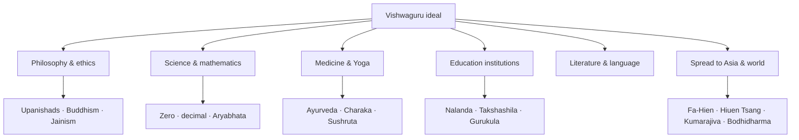

# Ancient Indian Knowledge & Vishwaguru

> GS-1 · Topic 01 · Ancient knowledge tradition and India as Vishwaguru

---

## PYQs

| Year | M | Words | Question (EN) | प्रश्न (HI) | ID |
|------|---|-------|---------------|-------------|-----|
| 2022 | 8 | 125 | Discuss the contribution of ancient Indian knowledge tradition in establishing India as Vishwaguru. | विश्वगुरु के संदर्भ में प्राचीन भारतीय ज्ञान परंपरा के योगदान की विवेचना कीजिए। | Q1 |

---

## Quick Revision

```
VISHWAGURU = "World teacher" — India as civilizational knowledge exporter, not only military/economic power
  Modern use: NEP 2020 IKS · yoga diplomacy · Nalanda revival · diaspora soft power

ANCIENT PILLARS:
  Philosophy: Upanishads (Atman-Brahman) | Buddhism/Jainism (ahimsa, anekantavada)
    Vasudhaiva Kutumbakam | Charvaka/Lokayata (materialist diversity)
  Science: Zero · decimal · Aryabhata · Varahamihira | Iron Pillar metallurgy | Sulvasutra geometry
  Numerals: India → Arabs (Al-Khwarizmi, c. 873 CE) → Europe (Fibonacci, 13th c.)
  Medicine: Ayurveda (Charaka, Sushruta) | Yoga (Patanjali) · meditation
  Education: Gurukula | Nalanda · Takshashila — Dvarapandita admission debate test
  Literature: Sanskrit · Panini Ashtadhyayi | epics · Puranas · Kalidasa
  Statecraft: Arthashastra (Kautilya)

CARRIERS: Kumarajiva · Bodhidharma · Fa-Hien · Hiuen Tsang · I-tsing
  Spread: Buddhism → Sri Lanka, China, Japan, SE Asia | Suvarnabhumi · Angkor Indianisation

SE ASIA: Suvarnabhumi (Mainland SE Asia) · Suvarnadvipa (Indonesia) · Angkor Wat · Sri Vijaya
  Sanskrit inscriptions · Ramayana traditions · temple cosmology

CONTEMPORARY: NEP 2020 IKS (curriculum integration) | International Day of Yoga (21 June, UN 2014)
  Nalanda University revival (Rajgir) | AYUSH ministry | GI tags (yoga, handloom, Ayurveda herbs)
  UNESCO: Yoga intangible heritage discourse | Art 49/51A(f) | PRASAD/Swadesh Darshan Buddhist circuit
  ISRO Aryabhata satellite | CSIR manuscript digitisation

BALANCED: Past glory + modern science | caste/gender limits | Vishwaguru = critical revival not slogan
  RS Sharma — cultural brilliance coexisted with inequality

TRAPS: ≠ only Gupta (07) | ≠ only science (09) | Zero ≠ single inventor | Nalanda ≠ Hindu-only
  Arabic numerals ≠ Arab invention | Kumarajiva = Indian/Kuchean monk | Bodhidharma = Indian not Chinese
```

---

## Content

### Context — what Vishwaguru means (exam framing)

- **Vishwaguru** (विश्वगुरु) = ideal of India as **world teacher** — sharing knowledge, ethics, and civilizational wisdom with humanity across borders and centuries.
- Not purely political or economic dominance — rooted in **ancient India's knowledge export**: philosophy, science, medicine, education, art, and spiritual traditions that reached **Asia, the Arab world, and eventually Europe**.
- Historical basis: from **Vedic-Upanishadic** metaphysics through **Buddhist missionary expansion**, **Ayurveda and yoga**, **mathematical numerals**, and **university institutions** (Nalanda, Takshashila) — India functioned as a **knowledge civilisation** before modern nation-states existed.
- Modern usage (**NEP 2020**, cultural diplomacy, **International Day of Yoga**) invokes **continuity** between ancient heritage and 21st-century **soft power** — but Mains answers must cite **specific ancient contributions** + **balanced present relevance**, not slogan alone.
- **Distinction:** File **07** = Gupta period only; File **09** = scientific heritage focus; **This file (08)** = holistic **Vishwaguru civilizational frame** spanning Vedic to classical to early medieval.

### Pillars of ancient Indian knowledge tradition



### Philosophy, ethics, and religion

- **Upanishads** (c. 8th–5th c. BCE onward) — metaphysics (**Atman, Brahman, karma, moksha**); foundation of Hindu philosophy; influenced Buddhist and Jain thought; **Isha, Katha, Chandogya** among most cited.
- **Buddhism** — **ahimsa**, middle path, dependent origination, logic (**pramana** theory); spread as **India's gift to Asia** (Sri Lanka from Ashokan missions, China, Japan, Tibet, Southeast Asia).
- **Jainism** — non-violence, **anekantavada** (multiplicity of truth), **syadvada** (conditional predication); ethical rigour influencing Gandhi's non-violence later.
- **Charvaka/Lokayata** — materialist philosophy; only perception as valid knowledge; shows **intellectual diversity** (not monolithic orthodoxy).
- **Vasudhaiva Kutumbakam** ("world is one family") — from **Maha Upanishad**; civilizational ethic cited for global harmony (with historical caveat: social inequalities coexisted).

| Tradition | Core teaching | Global reach |
|-----------|---------------|--------------|
| **Upanishadic** | Atman-Brahman unity, karma-moksha | Influenced neo-Vedanta, Western philosophers (Schopenhauer) |
| **Buddhist** | Ahimsa, middle path, meditation | Sri Lanka, China, Japan, Korea, Tibet, SE Asia |
| **Jain** | Anekantavada, ahimsa | Trade communities across India; ethical influence |
| **Charvaka** | Materialism, scepticism | Evidence of plural intellectual culture |

### Science, mathematics, and technology

- **Zero and decimal place-value** — Indian numerals transformed global mathematics; **Bakhshali manuscript** (c. 3rd–4th c. CE) shows early zero use; enabled algebra, astronomy, commerce.
- **Transmission route:** **India → Arab world → Europe**
  - Arab scholars **Al-Fazari, Al-Khwarizmi** (c. **873 CE** and after) translated and used Indian numerals in astronomical tables (*Zij al-Sindhind*).
  - Via Arabs, **"Arabic numerals"** reached Europe (**Fibonacci's Liber Abaci**, 13th c.) — actually **Indian origin**; exam must state this precisely.
- **Aryabhata** (*Aryabhatiya*, c. 499 CE) — trigonometry, eclipses, Earth rotation; **Varahamihira** — astronomy, calendars, agriculture.
- **Geometry** — **Sulvasutras** (Baudhayana, Apastamba) for altar construction; practical engineering for rituals and building.
- **Metallurgy** — **Iron Pillar of Delhi** (rust-resistant); **Wootz steel** exported for Persian/Damascus swords; bronze sculpture traditions.
- **Navigation** — monsoon knowledge (Arabic *mausim* from Sanskrit); Indian Ocean trade networks linking **Suvarnabhumi** and **Suvarnadvipa**.

### Medicine, yoga, and wellness

- **Ayurveda** — holistic health system; **Charaka Samhita** (internal medicine, c. 2nd c. CE), **Sushruta Samhita** (surgery — cataract, **121 instruments**, rhinoplasty).
- Rooted in **Atharvaveda** tradition; emphasis on diet, cleanliness, medicinal plants (**triphala, ashwagandha** — now GI and AYUSH focus).
- **Yoga** — physical-mental-spiritual discipline; **Patanjali's Yoga Sutras** (c. 2nd c. BCE–4th c. CE); **ashtanga yoga** eight limbs.
- Today **UN International Day of Yoga** (**21 June**, proclaimed **2014**, first observed 2015) — global Vishwaguru export; **AYUSH Ministry** (2014) institutionalises Ayurveda, yoga, unani, siddha, homeopathy.

### Education and learning institutions

- **Gurukula system** — guru-shishya transmission of Vedic and classical knowledge; residential, oral, discipline-based (see file 05 for system detail).
- **Takshashila** (Taxila, Gandhara) — ancient centre of learning (polity, medicine, grammar); international students from c. **6th c. BCE**; Chanakya/Kautilya associated; destroyed c. 5th c. CE (Huna invasions).
- **Nalanda Mahavihara** (Bihar, c. **5th c. CE** foundation, peak under **Palas** 8th–12th c.) — **residential international university**; subjects: Buddhist philosophy, logic, grammar, medicine, astronomy.
- **Nalanda admission — Dvarapandita:** Gatekeeper scholar tested entrants in **debate/logic** — only those who defeated the gate scholar gained entry; shows **rigorous intellectual standard** (Hiuen Tsang records system).
- **Varanasi (Kashi)** — ancient centre of **Sanskrit and philosophical debate** (Shankaracharya, later); **Prayagraj** — learning tradition linked to imperial courts (Gupta, Mughal, British).

### Knowledge carriers — pilgrims, monks, translators

| Figure | Period | Role as knowledge carrier |
|--------|--------|---------------------------|
| **Fa-Hien** | 4th–5th c. CE | Chinese monk; visited India during **Gupta age**; recorded monasteries, Vinaya, Buddhist learning — took texts/practices back to China |
| **Hiuen Tsang (Xuanzang)** | 7th c. CE | Chinese pilgrim; studied at **Nalanda** under **Shilabhadra**; carried **657 Buddhist texts** to China; translated; key source on Indian knowledge |
| **I-tsing** | 7th c. CE | Chinese monk; studied at Nalanda; recorded monastic education, grammar, Vinaya |
| **Kumarajiva** | 344–413 CE | **Kuchean-Indian** monk-scholar; translated **Mahayana sutras** into Chinese at Chang'an — bridged Indian philosophy and East Asian Buddhism |
| **Bodhidharma** | trad. 5th–6th c. CE | Indian monk; travelled to **China**; associated with **Chan/Zen** transmission — Indian meditative knowledge to East Asia |

- These figures prove India was not isolated — **active bidirectional knowledge flow** through pilgrims and translators; India exported texts, methods, and teachers; imported Greek astronomy (Romaka Siddhanta) and Central Asian Buddhist schools.

### Literature, language, and arts

- **Sanskrit** — **Panini's Ashtadhyayi** (c. 5th–4th c. BCE) — scientific **generative grammar**; **Amarakosha** (Amarasimha) lexicon; classical literature (**Kalidasa**, epics, Puranas).
- **Pali and Prakrit** — Buddhist and Jain canonical languages; spread with religion to Sri Lanka and Southeast Asia.
- **Art architecture** — Ajanta frescoes, Sarnath Buddha, Gandhara Greco-Buddhist, temple traditions — visual export via Buddhism and trade.
- **Arthashastra** (Kautilya) — statecraft, economy, espionage, welfare — early political science text studied globally today.

### Southeast Asian Indianisation

- **Indianisation** = spread of Sanskrit, Hindu-Buddhist ideas, art, law, and kingship models to Southeast Asia via **trade, monks, and emigrants** — not mainly military conquest.

| Region / site | Indian knowledge influence |
|---------------|----------------------------|
| **Suvarnabhumi** ("Land of Gold") | Classical Indian name for **Mainland Southeast Asia** (Thailand, Myanmar, Cambodia region) — Buddhist-Hindu cultural zone |
| **Suvarnadvipa** | Indian name for **Indonesia/Malay** archipelago |
| **Angkor (Cambodia)** | **Angkor Wat** (12th c.) — Hindu-Buddhist temple architecture; Sanskrit inscriptions; Indian **Mount Meru** cosmology in urban planning |
| **Sri Vijaya, Funan** | Indianised maritime kingdoms — centres of Buddhist learning and trade |
| **Bali, Java, Champa** | Living Sanskrit-derived scripts, Ramayana/Mahabharata traditions, temple styles |

- Ancient India functioned as **knowledge civilisation** — Indianisation in SE Asia is strongest historical evidence for **Vishwaguru soft power** before modern diplomacy.

### Global spread — channels summary

| Channel | What spread | Direction |
|---------|-------------|-----------|
| **Buddhism** | Monasteries, art, Pali/Sanskrit texts | India → Central Asia, China, Korea, Japan, SE Asia |
| **Trade (Indian Ocean)** | Spices, textiles, numerals, ideas | India ↔ Suvarnabhumi/Suvarnadvipa |
| **Pilgrims & scholars** | Nalanda attracted Asian students | Bidirectional — also Greek astronomy into India |
| **Translators** | Kumarajiva, monks | Indian texts → Chinese/Tibetan |
| **Colonies & kingdoms** | Indianised states | Angkor, Sri Vijaya, Srivijaya maritime network |

### Significance — why Vishwaguru claim has historical depth

- India was among the earliest civilisations to develop **formal grammar (Panini)**, **decimal mathematics**, **university-scale institutions (Nalanda)**, **surgical texts (Sushruta)**, and **missionary religions (Buddhism)** — all exportable knowledge forms.
- **Al-Biruni's Kitab-ul-Hind** (11th c.) — systematic record of Indian sciences for Islamic world; proves external recognition of Indian scholarly traditions.
- **Colonial-era Orientalists** (Max Müller, Rhys Davids) translated Sanskrit/Pali — revived global academic interest; also carried biases, but confirmed **depth of ancient Indian knowledge archives**.

### Contemporary relevance

- **NEP 2020 — Indian Knowledge Systems (IKS):** Mandates integration of **Sanskrit, Ayurveda, yoga, astronomy, philosophy, and traditional crafts** into school and higher education — institutionalises Vishwaguru discourse into **curriculum reform**, not rhetoric alone.
- **International Day of Yoga (21 June):** UN General Assembly resolution (**2014**); observed globally since **2015** — largest soft-power export of ancient Indian **body-mind science**; led by **AYUSH Ministry** and **Ministry of External Affairs** cultural diplomacy.
- **Nalanda University revival:** International campus at **Rajgir, Bihar** (2010 onward, Nalanda University Act 2010) — **educational diplomacy** echoing ancient Mahavihara; partners include ASEAN nations, Australia, China (debated).
- **AYUSH Ministry (2014):** Ayurveda, yoga, unani, siddha, homeopathy — policy framework for **living heritage** as health economy; **WHO Traditional Medicine Strategy** recognises Ayurveda and yoga globally.
- **UNESCO and heritage:** **Ajanta/Ellora (1983)**, **Nalanda Mahavihara archaeological ruins (2016)** as World Heritage — ancient knowledge sites under global conservation; **Buddhist circuit** tourism (Sarnath, Bodh Gaya, Kushinagar, Lumbini link).
- **Constitutional framework:** **Article 51A(h)** — develop scientific temper; **51A(f)** — value composite culture; **Article 49** — protect monuments (Nalanda ruins, Sarnath, Ajanta).
- **Government schemes:** **Swadesh Darshan** and **PRASAD** develop **Buddhist circuit, Krishna circuit, Ramayana circuit** infrastructure — heritage knowledge routes as **tourism and pilgrimage economy**.
- **Digital and research:** **CSIR, IGNCA, National Mission for Manuscripts** digitise Sanskrit/Palm-leaf texts; **ISRO** names satellite **Aryabhata (1975)** — science heritage → space identity.
- **GI tags and craft revival:** Yoga-related wellness products, **Kashmir saffron, Darjeeling tea, Banaras silk** — living economic heritage linked to ancient knowledge systems.
- **Critical balance:** Vishwaguru achievable only if India invests in **modern education, research, equity** — ancient pride supports, not replaces, contemporary **STEM funding, social justice, and global collaboration**.

### Limits and balanced view (essential for 125W)

- Ancient India also had **varna hierarchy, untouchability, gender discrimination, sati** — cannot claim flawless "golden" social model for Vishwaguru ideal.
- Many knowledge systems were **elite/brahmanical** — excluded shudras and women from formal Vedic education (exceptions: Buddhist nuns, Gargi Maitreyi in Upanishadic dialogues).
- **Scientific claims** must be precise — zero evolved over centuries; avoid "India invented everything" exaggeration that examiners penalise.
- **Transmission was syncretic** — Indian astronomy absorbed **Greek (Romaka Siddhanta)** inputs; Vishwaguru narrative must acknowledge **exchange**, not pure isolation.
- **RS Sharma caution:** cultural brilliance coexisted with **economic inequality and feudal trends** in late ancient period — Vishwaguru is **intellectual leadership**, not uniform social utopia.

### Distinction from nearby subtopic files

| File | Focus |
|------|-------|
| **07 Gupta Golden Age** | Gupta period only — politics, culture, science |
| **09 Scientific Heritage** | Scientific aspects of heritage (separate PYQ 2021) |
| **05 Vedic Education** | Gurukula system mechanics |
| **This file (08)** | **Vishwaguru framing** — holistic ancient knowledge export + world-teacher ideal |

---

## Answers

### Q1: Discuss the contribution of ancient Indian knowledge tradition in establishing India as Vishwaguru. (2022, 8M, 125W)

**Opening:**
> The ideal of India as Vishwaguru rests on an ancient civilisation that exported philosophy, science, medicine, and learning across Asia — not merely military power but intellectual and ethical leadership sustained over millennia.

**Write these points:**
- **Philosophy & ethics:** Upanishadic thought, **Buddhism and Jainism** (ahimsa, anekantavada) spread to Sri Lanka, China, and Southeast Asia — India's earliest **soft power**; *Vasudhaiva Kutumbakam* speaks to global fraternity.
- **Science & medicine:** **Zero/decimal** (India → Arabs **873 CE** → Europe), Aryabhata's astronomy, Ayurveda (Charaka-Sushruta), **yoga** (Patanjali) — practical knowledge systems with lasting global impact.
- **Education & carriers:** **Nalanda** (Dvarapandita admission) and **Takshashila** attracted international scholars; **Fa-Hien, Hiuen Tsang, Kumarajiva, Bodhidharma** carried Indian knowledge to East Asia.
- **Indianisation:** **Suvarnabhumi, Angkor Wat** — Sanskrit, Buddhism, temple art spread to Southeast Asia — civilizational export beyond borders through trade and monks, not conquest alone.
- **Contemporary link:** **NEP 2020 IKS**, **International Day of Yoga (UN 2014)**, AYUSH, **Nalanda University revival**, **PRASAD Buddhist circuit** — with **balance** on social exclusions and need for modern scientific excellence.

**Conclusion:**
> Ancient Indian knowledge thus provides historical depth to the Vishwaguru vision — a civilisation that taught the world, provided its foundations are renewed with equity and contemporary innovation.

---

### Q2 (Future variant): Examine the role of Nalanda as a knowledge hub in ancient India. (8M, 125W)

**Opening:**
> Nalanda Mahavihara was among the world's earliest residential international universities — a knowledge hub where Indian learning attracted scholars from across Asia for nearly seven centuries.

**Write these points:**
- **Institutional scale:** C. **5th–12th c. CE**; thousands of monks; subjects included **Buddhist philosophy, logic (pramana), grammar, medicine, astronomy**.
- **International character:** Chinese pilgrims **Fa-Hien, Hiuen Tsang, I-tsing** studied/recorded Nalanda — proof of **global pull**; **Shilabhadra** as Hiuen Tsang's teacher.
- **Admission rigour:** **Dvarapandita** (gate scholar) tested entrants through **debate** — only the intellectually qualified entered; model of merit-based access.
- **Knowledge export:** Texts and teachers from Nalanda shaped **Tibetan, Chinese, Southeast Asian** Buddhist scholastic traditions; destroyed c. **1197 CE** (Bakhtiyar Khilji).
- **Legacy:** **UNESCO World Heritage (2016)** for archaeological ruins; revived as **Nalanda University** (Rajgir) — symbol of India's **educational diplomacy** and NEP 2020 IKS.

**Conclusion:**
> Nalanda embodied ancient India's role as Vishwaguru — a hub where knowledge crossed borders through rigorous scholarship, not conquest.

---

### Q3 (Future variant): How did ancient Indian numerals and mathematics contribute to global knowledge? (8M, 125W)

**Opening:**
> Ancient Indian numerals — especially zero and decimal place-value — represent one of India's most transformative global knowledge exports, enabling modern arithmetic, algebra, and astronomy worldwide.

**Write these points:**
- **Indian innovations:** **Zero (sunya)** as placeholder and number (c. 2nd c. BCE onward); **decimal place-value** system in **Aryabhatiya** and 448 AD inscriptions; **Baudhayana Sulvasutra** geometry.
- **Transmission:** **India → Arab scholars (Al-Khwarizmi, c. 873 CE) → Europe (Fibonacci, 13th c.)** — misnamed "Arabic numerals" are **Indian origin**.
- **Impact:** Enabled advanced calculation in **Islamic astronomy, European commerce, scientific revolution** — foundation of modern mathematics.
- **Broader context:** Part of Vishwaguru knowledge export alongside **Aryabhata's trigonometry, Varahamihira's calendars** — not isolated from philosophy and ritual needs.
- **Today:** **NEP 2020 IKS**, **ISRO Aryabhata satellite** — heritage legitimacy linked to contemporary STEM identity; avoid exaggeration that India alone "invented all maths."

**Conclusion:**
> Indian numerals demonstrate Vishwaguru in its most concrete form — ideas born on the subcontinent that became indispensable to global civilisation.

---

## Traps

| Wrong | Correct |
|-------|---------|
| Vishwaguru = only Gupta age | **Multi-period** heritage — Vedic to classical to early medieval |
| Vishwaguru = only Hindu religion | **Buddhism, Jainism, Charvaka** + secular sciences count |
| Only spirituality, no science | Include **math, astronomy, Ayurveda, metallurgy** |
| Arabic numerals invented by Arabs | **Indian origin** — transmitted via Arab scholars (873 CE onward) |
| Nalanda = open admission | **Dvarapandita** debate test required |
| Nalanda = only Hindu university | **Buddhist Mahayana** centre; international, not sectarian |
| Kumarajiva = Chinese only | **Indian/Kuchean** monk — translated Indian Buddhist texts to Chinese |
| Bodhidharma = Chinese figure | **Indian monk** who took meditation tradition to China (Chan/Zen) |
| Suvarnabhumi = Sri Lanka only | **Mainland Southeast Asia** (Thailand/Cambodia region) broadly |
| Same answer as 07 Gupta file | 07 = **Gupta period**; 08 = **Vishwaguru civilizational frame** |
| Same as 09 Scientific Heritage | 09 = **science focus**; 08 = **holistic knowledge + world teacher** |
| Zero invented by Aryabhata alone | **Long evolution**; Indian numerals via Arabs to world |
| Yoga Day = Indian domestic holiday only | **UN International Day of Yoga** — 21 June, proclaimed 2014 |
| Vishwaguru = no social criticism needed | Must note **caste, gender, inequality** limits for balanced Mains answer |

---

*Complete.*
