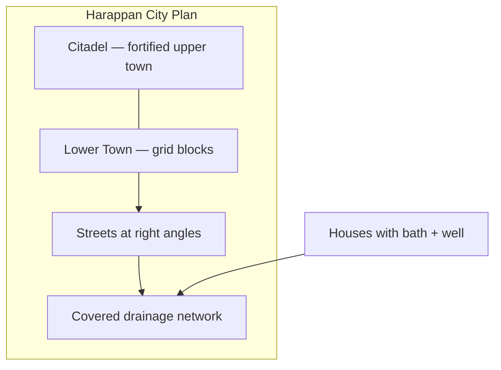

# Harappan Town Planning

> GS-1 · Topic 01 · Harappan / Indus Valley urban planning

---

## PYQs

| Year | M | Words | Question (EN) | प्रश्न (HI) | ID |
|------|---|-------|---------------|-------------|-----|
| 2020 | 8 | 125 | Describe the salient features of Harappan town planning. | हड़प्पा नगर नियोजना की प्रमुख विशेषताओं का वर्णन कीजिए। | Q1 |

---

## Quick Revision

```
PERIOD: Mature Harappan c. 2600–1900 BCE | Bronze Age | First urban India | Decline c. 1900 BCE
PHASES: Early Harappan (7000–2600 BCE) → Mature (2600–1900) → Late (1900–1300 BCE)
SITES: Mohenjo-daro · Harappa · Dholavira · Lothal · Kalibangan · Chanhudaro · Rakhigarhi · Banawali · Surkotada

PLAN: Citadel (upper fortified) + Lower Town (common people) | GRID streets (right angles)
DRAINAGE: Covered drains · house → street → main drain | bathrooms + wells in houses | manholes
BRICKS: Baked/burnt bricks (4:2:1 ratio) — superior to Egypt's sun-dried | standardised across 1000+ km

KEY STRUCTURES:
  Mohenjo-daro — Great Bath (11.88 × 7.01 m) | Harappa — granaries (6)
  Dholavira — 16+ reservoirs · signboard (10 symbols) | UNESCO 2021
  Lothal — dockyard (217 × 37 m) NOT reservoir | Kalibangan — ploughed field · fire altars (7)
  Chanhudaro — bead-making craft quarter (no citadel) | Rakhigarhi — largest Indian site (Haryana)

ECONOMY: Agriculture (wheat, barley, cotton) · pastoralism · craft · long-distance trade (Mesopotamia)
  Seals + weights standardised | Script UNDECIPHERED — limits governance/economy knowledge
  Meluhha in Mesopotamian texts = likely Indus region

DECLINE c. 1900 BCE: Ghaggar-Hakra drying · floods · tectonics · ecological stress
  Aryan migration NOT sole cause | Horse scarce in mature Harappan

COMPARISON: Harappan grid + drainage > Mesopotamia | Burnt brick > Egypt sun-dried
  Script undeciphered vs cuneiform/hieroglyph | Dholavira water > Nile/Irrigation model in arid zone

CONTEMPORARY: Dholavira UNESCO WH 2021 | Rakhigarhi excavation (Haryana) · ASI protection
  NEP 2020 IKS — archaeology, hydrology, urban planning curriculum
  Swachh Bharat · Smart Cities · AMRUT — Harappan drainage as sanitation model
  Art 49/51A(f) | National Museum Harappan gallery · Incredible India heritage tourism
  Jal Shakti — Dholavira rainwater harvesting studied by modern hydrologists

TRAPS: ≠ Vedic pastoral | Horse evidence doubtful | Dockyard ≠ reservoir
  Script unread | Great Bath = Mohenjo-daro not Harappa | Dholavira = inland not port
  Chanhudaro = no citadel craft town | Lothal = dockyard not reservoir city
```

---

## Content

### Context — Harappan civilization

- **Harappan (Indus Valley) Civilization** — **first urban civilization of India**; **Bronze Age** (c. **2600–1900 BCE** mature phase); among the **three earliest Old World urban civilisations** alongside Mesopotamia and Egypt.
- Also called **IVC** (Indus Valley Civilization) — flourished along **Indus and Ghaggar-Hakra** (Saraswati) river systems in present-day **Pakistan, India, Afghanistan**.
- Extent: **Siwaliks to Arabian Sea**, **Baluchistan to Meerut (UP)** — largest ancient civilization by area (~**13 lakh sq km**); over **1400 sites** identified, **5 major cities** and many towns/villages.
- Major cities: **Mohenjo-daro, Harappa** (Pakistan); **Dholavira, Lothal, Surkotada** (Gujarat); **Kalibangan, Banawali, Rakhigarhi** (Rajasthan/Haryana — **Rakhigarhi** largest Indian site, ongoing ASI excavations); **Chanhudaro** (Sindh — craft specialist town).
- **Named after Harappa** (first discovered 1921, **R.D. Banerji** and **Sir John Marshall**, ASI) — but **Mohenjo-daro** ("Mound of the Dead") is among best-preserved for town planning study.
- **Exam frame:** UPPCS asks **salient features of town planning**, **site-specific structures**, **economy/trade**, and **comparison with Mesopotamia/Egypt** — all below.

### Salient features of Harappan town planning

Harappans had the **most advanced town planning of the ancient world** — **planned layout before construction**, not organic growth; implies **central authority** (state or priestly administration — debated because script unread).

**1. Citadel and lower town (dual settlement)**

| Part | Features | Examples |
|------|----------|----------|
| **Citadel (Acropolis)** | Raised **upper fortified** platform — granaries, Great Bath, assembly structures; likely **elite/administrative** zone | Mohenjo-daro, Harappa, Dholavira, Kalibangan |
| **Lower town** | Larger residential area for **common people** — grid of houses on flat ground east/west of citadel | All major cities |
| **Exception** | **Chanhudaro** — **no citadel**; specialised **craft-production town** | Bead-making, bangle industry |

- Clear **horizontal social zoning** — one of earliest examples of planned urban hierarchy in world history.
- Citadel often on **west side** (Mohenjo-daro, Harappa) — possibly flood-protection or ritual orientation (debated).

**2. Grid pattern (street layout)**

- Streets and lanes intersected at **right angles** — **gridiron pattern** (Hippodamus of Miletus in Greece came later, c. 5th c. BCE).
- **Main streets** ran **north-south** and **east-west**; width varied (e.g. Mohenjo-daro main street ~**10 m**; side lanes ~1.5–3 m).
- Blocks divided into **rectangular house plots** — uniformity shows **central planning authority** and standardised land division.
- **No encroachment** on streets in mature phase — suggests **municipal regulation** (unique for Bronze Age).



**3. Drainage and sanitation (hallmark feature)**

- **Most striking** aspect — **covered drains** along streets; **house drains connected** to street drains → main outlet.
- Almost every house had **bathroom** with sloping floor to drain; **wells** inside or near houses (Mohenjo-daro houses often had private well + bathroom).
- **Manholes** for cleaning drains at intervals; brick-lined channels with **precise gradient** for self-flushing.
- Priority to **cleanliness and public health** — unmatched in contemporary Egypt/Mesopotamia for **systematic household-linked sanitation**.
- **Exam relevance:** Often cited in **Swachh Bharat / Smart Cities** discourse as ancient Indian urban hygiene precedent (use carefully — not identical technology, but principle of planned sanitation).

**4. Burnt (baked) bricks**

- Standardized **burnt brick** ratio often **4 : 2 : 1** (length : breadth : thickness) — consistent across sites 1000+ km apart.
- Unlike **Egypt** (mainly sun-dried/mud bricks) — Harappan **fired bricks** survived millennia in flood-prone Indus plains.
- Used for houses, drains, wells, Great Bath, fortification walls, dockyard — **mass production** implies organised kiln industry.
- **Wood fuel** for kilns in bronze-age Punjab/Sindh — environmental cost debated as factor in later decline.

**5. Domestic architecture**

- Houses of **burnt brick** — typically **courtyard** plan; ground floor + sometimes upper storey (staircase evidence).
- **Private wells** and **bathrooms** standard; **no windows on street side** in many houses (privacy/coolness/security).
- **Public wells** and **bathing platforms** in neighbourhoods; **Great Bath** at Mohenjo-daro for communal ritual bathing.
- Room sizes suggest **middle-class uniformity** — fewer extreme palaces than Mesopotamia (no clear "palace" identified).

**6. Public monumental structures — site-specific**

| Structure | Site | Significance |
|-----------|------|--------------|
| **Great Bath** | **Mohenjo-daro** | 11.88 × 7.01 m; waterproofed with bitumen; steps on north/south; **earliest public tank** — ritual bathing |
| **Granaries** | **Harappa** (6), Mohenjo-daro | Raised platforms with ventilation channels — **grain storage**, state/temple reserve |
| **16+ reservoirs (baolis)** | **Dholavira** (Kutch) | Sophisticated **rainwater harvesting** — channels, dams, **16–18 reservoirs**; survival in arid Rann of Kutch |
| **Signboard** | **Dholavira** | Large **10-symbol inscription** on stone — possibly **direction sign** to palace/administration; among longest Harappan texts |
| **Dockyard** | **Lothal** | Rectangular basin (**217 × 37 m**) linked to Sabarmati channel — **maritime trade** with Mesopotamia |
| **Ploughed field** | **Kalibangan** | **Earliest evidence of ploughed agricultural field** (pre-Harappan/Harappan) — furrow marks preserved |
| **Fire altars** | **Kalibangan** | **Seven fire altars** on citadel + **underground fire altars** in lower town — ritual urban planning |
| **Bead factory quarter** | **Chanhudaro** | **Craft-specialist town** — carnelian/faience **bead-making**, bangle factory, no citadel |
| **Assembly/ pillared hall** | Mohenjo-daro | Large public building — civic function debated (market, assembly, education?) |

**Dockyard vs reservoir (exam distinction)**

| Feature | **Lothal dockyard** | **Dholavira reservoirs** |
|---------|---------------------|----------------------------|
| Purpose | **Maritime trade** — ship berthing, cargo | **Freshwater storage** in arid zone |
| Location | Near **Sabarmati/Arabian Sea** coast (Gujarat) | Inland **Kutch** — no sea access |
| Structure | Rectangular **basin with inlet/outlet** to river channel | Series of **dams, channels, baolis** |
| Function | Export-import (beads, copper, cotton) | Rainwater harvesting for city survival |
| Trap | Do not call Lothal a "reservoir city" | Do not call Dholavira a "port" |

- **No clear temple or palace** like Mesopotamia — possibly **secular/civic** urbanism (debate continues); **Great Bath** and **fire altars** suggest ritual importance without monumental ziggurat.

**7. Town planning principles (summary)**

| Principle | Evidence |
|-----------|----------|
| **Pre-planned geometry** | Grid, standard brick, uniform block sizes |
| **Water integration** | Wells, baths, drains, Dholavira reservoirs |
| **Defence** | Citadel fortification; city walls at Dholavira, Kalibangan |
| **Craft zoning** | Chanhudaro bead-making; separate industrial areas |
| **Standardization** | Weights, measures, brick ratio across 1000+ km — strong administrative coordination |
| **Sanitation priority** | Covered drains, household bathrooms — public health engineering |

### Harappan economy and trade

- **Economic base:** **Agriculture** (wheat, barley, **cotton** — first cotton producers in world), **pastoralism** (cattle, sheep, goat, buffalo), **craft specialisation** (beads, seals, pottery, metallurgy), **long-distance trade**.
- **Internal organisation:** Granaries, standardised **weights** (binary system — 16, 64, 1600 units), craft quarters (Chanhudaro); suggests **centralised state or temple administration** (exact governance unknown).
- **External trade:**

| Direction | Evidence | Goods |
|-----------|----------|-------|
| **Mesopotamia (Sumer)** | Harappan seals at **Ur, Lagash**; Mesopotamian texts mention **Meluhha** | Beads, carnelian, cotton, timber |
| **Afghanistan/Baluchistan** | **Shortugai** (Afghanistan) Harappan trading post | Lapis lazuli, copper routes |
| **Maritime (Arabian Sea)** | **Lothal dockyard** | Export beads, carnelian; import copper, shell |
| **Internal networks** | Standardised weights across sites | Inter-city commerce |

- **Seals** (steatite) — likely **trade/administration** markers; animal motifs (**unicorn bull**, elephant, rhinoceros, brahmani bull); **script undeciphered** — cannot read merchant names or transactions.
- **Script undeciphered — limits on economic knowledge:**
  - Cannot read **merchant records, ownership, tax receipts** on seals/tablets (~400 symbols, short texts).
  - **Governance structure unknown** — no king list, no readable law codes; "priest-king" seal from Mohenjo-daro is debated identification.
  - Debates on **state vs merchant guild** control remain open.
  - Archaeology (weights, workshop debris, dockyard) fills gap — but **written economic history incomplete**.

### Technology supporting urban life

| Technology | Application | Site evidence |
|------------|-------------|---------------|
| **Bronze** tools | Craft, construction | Copper + tin alloy; no iron in mature phase |
| **Potter's wheel** | Mass pottery | Red and black ware (Kalibangan) |
| **Cotton weaving** | Textile export | First cotton producers; spindle whorls |
| **Bead drilling** | Long carnelian beads | Chanhudaro micro-craft precision |
| **Metrology** | Trade standardisation | Cubical weights — binary system |
| **Faience** | Ornaments, tiles | Chanhudaro, Harappa |
| **Bitumen** | Waterproofing | Great Bath lining (Mohenjo-daro) |

### Comparison with contemporary civilizations

| Feature | Harappan | Mesopotamia | Egypt |
|---------|----------|-------------|-------|
| **Street grid** | Systematic right-angle grid | Less uniform | Nile-oriented, less grid |
| **Drainage** | Covered, house-linked | Inferior sanitation in many cities | Nile disposal, less urban drainage |
| **Bricks** | **Burnt** bricks standard | Mud/brick mix | Sun-dried mud brick (pyramids = stone) |
| **Monuments** | Great Bath, granaries | Ziggurats, temples | Pyramids, temples |
| **Script** | **Undeciphered** (~400 signs) | Deciphered cuneiform | Deciphered hieroglyph |
| **Water management** | Dholavira reservoirs | Tigris-Euphrates irrigation | Nile flood dependence |
| **Social hierarchy evidence** | Less extreme palace gap | Clear palaces, kings | Divine pharaoh |

### Significance and legacy

- Marks **beginning of urban India** — planned cities **4000+ years ago**; foundation for all later subcontinental urban traditions.
- Demonstrates **advanced civic engineering** — grid, hygiene, standardisation — relevant to modern **Smart Cities, AMRUT (sanitation), Swachh Bharat** policy discourse (as historical inspiration, not direct copy).
- **UP angle:** **Rakhigarhi** (Haryana — largest Indian Harappan site, DNA and settlement studies ongoing), **Kalibangan** (Rajasthan), eastern limit near **Meerut**; connects to UPPCS state geography questions.
- **Global recognition:** **Dholavira: A Harappan City** inscribed as **UNESCO World Heritage Site (2021)** — part of "Harappan City" serial nomination; validates international significance of Harappan town planning and water management.

### Contemporary relevance

- **UNESCO World Heritage — Dholavira (2021):** Inscribed as **"Dholavira: a Harappan City"** — recognises **16-reservoir water management**, signboard inscription, and planned urban layout; obligates **ASI** conservation and international monitoring under World Heritage Convention.
- **ASI excavations and protection:** **Rakhigarhi** (Haryana) — largest Indian Harappan site; ongoing excavations reveal **cemetery, lanes, jewellery**; **Mohenjo-daro, Harappa, Lothal, Dholavira** under ASI/state protection; **Ancient Monuments Act 1958**.
- **Constitutional framework:** **Article 49** — state shall protect monuments of national importance; **Article 51A(f)** — citizen duty to value heritage including **first urban civilization of India**.
- **NEP 2020 — Indian Knowledge Systems (IKS):** Harappan **metrology, hydrology (Dholavira), urban grid planning, bead technology** integrated into **archaeology, ancient history, and civil engineering** curriculum — links Bronze Age science to modern town planning education.
- **Sanitation and urban policy:** Harappan **covered drainage and household bathrooms** cited in **Swachh Bharat Mission, AMRUT, Smart Cities Mission** discourse as historical precedent for **planned urban sanitation** — useful for GS papers linking heritage to governance (state carefully — technology differs, principle of planning aligns).
- **National Museum and tourism:** Harappan gallery at **National Museum, New Delhi**; **Dholavira, Lothal** on Gujarat heritage circuit; **Incredible India** and state tourism promote **Indus Valley archaeological tourism**.
- **Climate and water relevance:** **Dholavira rainwater harvesting** in arid Kutch studied by **modern hydrologists and architects** for **water-scarce region planning** — ancient engineering informs contemporary **Jal Shakti, watershed management** discussions.
- **Script research:** Ongoing **computational linguistics and AI-assisted decipherment** attempts — if successful, would revolutionise understanding of Harappan governance and economy; currently **stable exam fact: script undeciphered**.

### Limits and decline (balanced view)

- **Decline** c. **1900 BCE** — causes debated (multi-causal, not single factor):
  - **Climate change** — **Ghaggar-Hakra (Saraswati) drying**; reduced monsoon (evidence from Kotla Dahar lake sediments).
  - **Floods** — Mohenjo-daro rebuilt multiple times over flood damage.
  - **Tectonic shifts** — Indus course changes.
  - **Ecological overexploitation** — deforestation for kiln fuel.
  - **Aryan migration** — **not proven** as sole cause of decline; **Horse** evidence in mature Harappan is **doubtful/scarce** — major difference from later Vedic age.
- **Script unread** — limits knowledge of governance, religion, language family, and **full economic organisation**; avoid over-confident claims about "Harappan kings" or "Harappan laws."
- Not all sites equally planned — **village sites** simpler; mature cities (Mohenjo-daro, Dholavira) show full features; **regional variation** exists (Dholavira water-focused, Lothal trade-focused, Chanhudaro craft-focused).
- **No iron, no horse (mainly), no deciphered literature** — Bronze Age urbanism with limits compared to later historic periods.

---

## Answers

### Q1: Describe the salient features of Harappan town planning. (2020, 8M, 125W)

**Opening:**
> Harappan town planning represents the earliest and most systematic urban design in ancient India — combining grid layout, burnt-brick construction, and advanced drainage in the Bronze Age.

**Write these points:**
- **Dual structure:** **Citadel** (fortified upper town with granaries, Great Bath) and **lower town** (residential grid) — planned social zoning at Mohenjo-daro, Harappa, Dholavira.
- **Grid pattern:** Streets intersecting at **right angles**; standardized **burnt bricks** (4:2:1); rectangular house blocks show central planning authority.
- **Drainage:** **Covered drains** — house bathrooms linked to street channels and main outlets; wells in houses; unmatched ancient sanitation priority — cited today in **Swachh Bharat/Smart Cities** discourse.
- **Site-specific works:** **Great Bath** (Mohenjo-daro), **Kalibangan** ploughed field and fire altars, **Dholavira** 16 reservoirs and signboard (**UNESCO 2021**), **Lothal dockyard**, **Chanhudaro** bead quarter.
- First **urban civilization of India** (c. 2600–1900 BCE) — decline debated but planning legacy remains historically significant under **ASI/NEP 2020 IKS** heritage framework.

**Conclusion:**
> Harappan cities thus stand as monuments to prehistoric urban engineering — where grid, hygiene, and standardization preceded much of the ancient world and continue to inform India's heritage and urban policy discourse.

---

### Q2 (Future variant): Discuss the economic life and trade of the Harappan civilization. (8M, 125W)

**Opening:**
> Harappan economy combined productive agriculture, specialised crafts, and long-distance trade — supported by urban planning and standardised weights, though script limits full understanding.

**Write these points:**
- **Agriculture & crafts:** Wheat, barley, cotton (first producers); **Kalibangan ploughed field**; **Chanhudaro** bead-making and bangle industry — craft specialisation within planned towns.
- **Internal organisation:** **Granaries**, standardised **weights** (binary system), planned craft quarters — suggests coordinated **state or guild** administration.
- **External trade:** Seals and goods link to **Mesopotamia (Meluhha)**; **Lothal dockyard** for maritime export of beads, cotton, carnelian; **Shortugai** (Afghanistan) trading post; imports of copper, shell.
- **Evidence limits:** **Script undeciphered** (~400 signs) — cannot read merchant/admin records; economic history reconstructed mainly from **archaeology** (workshops, dockyard, weights).
- **Significance:** Among earliest **international trading urban economies** of India — foundation for later subcontinental commerce; **Dholavira UNESCO 2021** recognises planned urban-economic integration.

**Conclusion:**
> Harappan economic life was urban, standardised, and outward-looking — a Bronze Age commercial civilisation whose full written record awaits script decipherment.

---

### Q3 (Future variant): Compare Harappan town planning with contemporary Mesopotamian and Egyptian urbanism. (8M, 125W)

**Opening:**
> Harappan urban planning surpassed contemporary Mesopotamia and Egypt in grid regularity, burnt-brick standardisation, and household-linked drainage — though lacked their deciphered script and monumental royal architecture.

**Write these points:**
- **Grid and sanitation:** Harappan **right-angle street grid** and **covered house-linked drains** more systematic than most Mesopotamian cities; Egypt relied on Nile, less urban drainage infrastructure.
- **Construction:** Harappan **burnt bricks (4:2:1)** vs Egyptian **sun-dried mud brick** (stone only for elite monuments like pyramids).
- **Monuments:** Mesopotamian **ziggurats**, Egyptian **pyramids** vs Harappan **Great Bath, granaries, Dholavira reservoirs** — civic/ritual rather than royal tomb focus.
- **Water management:** **Dholavira 16 reservoirs** in arid Kutch vs Mesopotamian irrigation and Nile flood dependence — region-specific engineering brilliance.
- **Knowledge gap:** Mesopotamian/Egyptian **deciphered scripts** vs Harappan **undeciphered** — limits comparison of governance models; Harappan planning inferred mainly from archaeology.

**Conclusion:**
> Harappan town planning thus represents a distinctive Bronze Age urban experiment — prioritising sanitation, standardisation, and grid geometry at a scale unmatched in its time, now recognised globally through **Dholavira UNESCO listing (2021)**.

---

## Traps

| Wrong | Correct |
|-------|---------|
| Harappan = Vedic city | **Bronze Age pre-Vedic** — c. 2600–1900 BCE mature phase |
| Horse central to Harappan | **Horse evidence doubtful/scarce** — major difference from Vedic age |
| Sun-dried bricks like Egypt | **Burnt/baked bricks** standard (4:2:1 ratio) |
| No drainage system | **Covered drains** = hallmark feature |
| Every site had dockyard | **Lothal only** — dockyard for maritime trade |
| Dholavira = port city | **Dholavira** = **reservoir/rainwater** city in arid Kutch (UNESCO 2021) |
| Lothal = reservoir system | **Lothal** = **dockyard/basin** for ships |
| Great Bath at Harappa | **Mohenjo-daro** (11.88 × 7.01 m) |
| Kalibangan = only fire altars | Also **earliest ploughed field** evidence |
| Chanhudaro = typical citadel city | **No citadel** — specialised **bead-making** town |
| Script tells us economy in detail | **Undeciphered** (~400 signs) — limits governance/trade text evidence |
| Town planning = only Mohenjo-daro | **Grid + drains** at multiple sites — Harappa, Dholavira, Kalibangan |
| Clear palace/temple like Egypt | **No definitive temple/palace** — civic structures debated |
| Aryan invasion alone caused decline | **Multi-causal** — climate, floods, tectonics; migration not sole cause |
| Rakhigarhi in Pakistan | **Rakhigarhi** = **Haryana, India** — largest Indian Harappan site |
| Dholavira not UNESCO | **UNESCO World Heritage 2021** — "Dholavira: a Harappan City" |

---

*Complete.*
