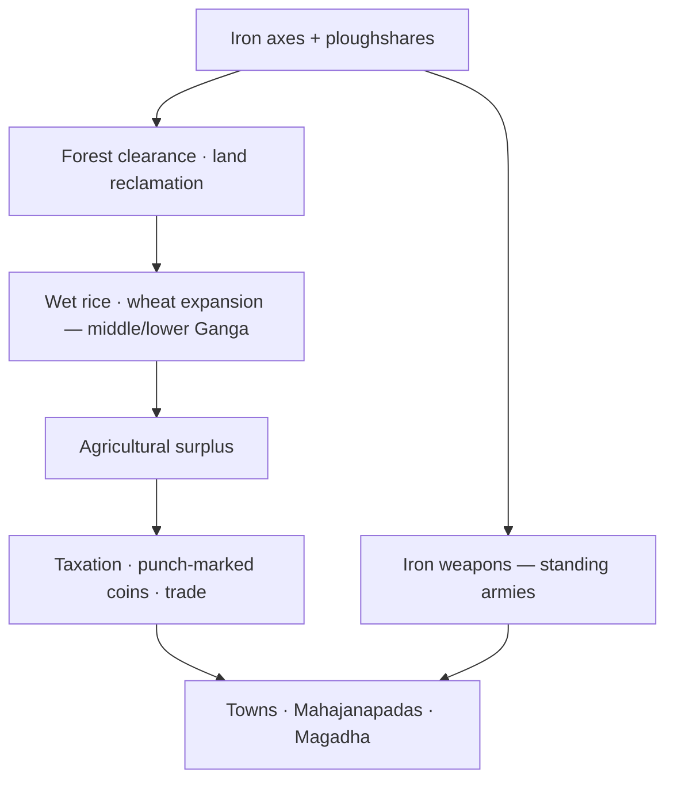

# Iron Age & Socio-economic Change (600–300 BCE)

> GS-1 · Topic 01 · Iron technology, second urbanisation, Mahajanapadas

---

## PYQs

| Year | M | Words | Question (EN) | प्रश्न (HI) | ID |
|------|---|-------|---------------|-------------|-----|
| 2019 | 8 | 125 | Discuss the role of iron in bringing socio-economic changes in India during c. 600–300 BCE. | 600–300 ई.पू. की अवधि में भारत में सामाजिक-आर्थिक परिवर्तनों में लोहे की भूमिका की विवेचना कीजिए। | Q1 |

---

## Quick Revision

```
PERIOD: c. 600–300 BCE | Age of Buddha (6th–5th c.) | Second Urbanisation
CONTEXT: Harappan decline c. 1900 BCE → ~1500 yr gap → iron enables Gangetic forest clearance

IRON TECH: Axe · ploughshare · sickle · adze · knife | Low-carbon steel c. 600 BCE
ORE: Singhbhum (Jharkhand) · Mayurbhanj (Odisha) | Sites: Kaushambi · Rajghat (Varanasi)

CAUSAL CHAIN: Iron tools → forest clearance → wet rice/wheat → surplus → coins · tax · towns
ARCHAEOLOGY: Black-and-Red → PGW (Doab) → NBPW (c. 500 BCE) + iron = urban marker
  Burnt brick · ring wells · punch-marked coins in NBPW layers

16 MAHAJANAPADAS (Anguttara Nikaya):
  Anga-Champa | Magadha-Rajgir→Pataliputra | Kashi-Varanasi | Vatsa-Kaushambi
  Kosala-Shravasti | Shurasena-Mathura | Panchala-Ahichhatra | Kuru-Indraprastha
  Matsya-Virat | Chedi-Shuktimati | Avanti-Ujjain | Gandhara-Taxila | Kamboja
  Asmaka-Potana | Malla-Kushinagar | Vajji-Vaishali (Lichchhavi confederacy)

MAGADHA RISE: Iron ore proximity · Ganga-Son-Punpun rivers · war elephants
  Bimbisara (alliances) · Ajatashatru (Kosala/Vajji) · Udayin (Rajgir→Pataliputra)
  Haryanka → Nanda (Mahapadma Nanda, 4th c. BCE) → Maurya foundation

ECONOMY: Punch-marked silver coins · shrenis (guilds) · gahapati (householder farmers)
  Town-village exchange · craft villages · Pali 500-plough deposit evidence
SOCIETY: Varna rigidity · Jainism/Buddhism (anti-cattle sacrifice) · Sutra literature codification
REGIONS: Eastern Gangetic = fastest iron urban growth | Doab = PGW first | South = later

UP/Bihar CITIES: Kaushambi · Shravasti · Ayodhya · Varanasi · Rajgir · Vaishali · Pataliputra

CONTEMPORARY: ASI excavations (Rajghat, Kaushambi) · Art 49/51A(f) · NEP 2020 IKS
  Swadesh Darshan Buddhist Circuit (Sarnath, Kushinagar, Shravasti) · heritage tourism

TRAPS: ≠ Harappan iron (bronze) | ≠ Early Rig Vedic pan-India | 2nd not 1st urbanisation
  16 not 18 mahajanapadas | Taxila = Gandhara not Kamboja | Nanda ≠ Maurya
```

---

## Content

### Period and historical setting

- **c. 600–300 BCE** marks a **turning point** in Indian history — often called the **Age of Buddha** (Mahavira and Buddha: **6th–5th century BCE**).
- Follows **~1500 years** after **Harappan decline** (first urbanisation ended c. 1900 BCE) with **no major cities** — then **second urbanisation** begins in the **mid-Gangetic basin**.
- **Geography:** Eastern UP and Bihar — **dense forests**, **heavy rainfall**, **hard alluvial soil** — difficult to settle without **iron tools** (unlike wheat zone of western Ganga/Doab settled earlier under **PGW** culture).

### What changed — iron technology

**Iron vs earlier metals**

| Metal age | Limitation | Iron advantage |
|-----------|------------|----------------|
| **Chalcolithic** (copper) | Soft tools; limited forest clearing | — |
| **Bronze** (Harappan) | Tin scarce; mainly tools/weapons for elite | — |
| **Iron** (from c. **600 BCE** widespread) | — | **Harder, cheaper, abundant** ore; axes + ploughs for masses |

- **Low-carbon steel** produced around **600 BCE** — technological advance beyond pure wrought iron.
- **Iron ore sources:** **Singhbhum** (Jharkhand), **Mayurbhanj** (Odisha); iron objects at **Rajghat (Varanasi)** made from these ores.
- **Key tools:** **ploughshare**, **axe**, **sickle**, **adze**, **knife** — found in **NBPW layers** at **Kaushambi** (Prayagraj region).

### Role of iron — causal chain

Iron was the **most important technological factor** behind state formation and second urbanisation.



**1. Agricultural revolution**
- **Iron axes** cleared **dense Gangetic forests**; **iron ploughshares** tilled **hard alluvial soil**.
- **Crop shift:** **rice** dominant in **middle and lower Ganga**; wheat/barley continued in west — food surplus supported non-farm population.
- **Commercial agriculture:** Pali evidence — village trader deposited **500 ploughs** with town merchant (likely **iron ploughshares**) — rural-urban economic link.

**2. Second urbanisation**
- Archaeological marker: **Northern Black Polished Ware (NBPW)** from c. **500 BCE** — glossy luxury pottery of wealthy urban classes.
- NBPW layers associated with **iron implements**, **burnt bricks**, **ring wells**, **punch-marked coins**.
- Settlement expansion sequence: **Black-and-Red Ware → Painted Grey Ware (PGW) → NBPW** — each phase larger (e.g. Kanpur district: PGW **3×** Black-and-Red; NBPW **2.5×** PGW).

**Features of second urbanisation (exam list)**

| Feature | Detail |
|---------|--------|
| **Material base** | **Iron tools** enable surplus agriculture |
| **Archaeological marker** | **NBPW** (c. 500 BCE) + iron, burnt brick, ring wells |
| **Economic** | **Punch-marked coins**, guild (**shreni**) organisation, town-village exchange |
| **Political** | **16 Mahajanapadas** — territorial states, tax, standing armies |
| **Social** | **Gahapati** farmers, craft specialisation, varna rigidity |
| **Geography** | Core = **eastern Gangetic plain** (eastern UP, Bihar) |
| **Gap from first urbanisation** | ~**1500 years** after Harappan decline |

**Important urban centres (excavated + Buddhist texts)**

| Ancient city | Modern location |
|--------------|-----------------|
| **Kaushambi** | Prayagraj region |
| **Shravasti** | UP |
| **Ayodhya** | UP |
| **Varanasi** | UP |
| **Rajgir** | Bihar |
| **Vaishali** | Bihar |
| **Pataliputra** | Patna |

- **UPPCS focus:** Most Buddha-period cities lie in **eastern UP and Bihar**.

**3. Economic changes**
- **Punch-marked coins** — earliest Indian coinage (silver); money economy replaces pure barter.
- **Shrenis (guilds)** of craftsmen and merchants — regulated production, prices, and standards; corporate identity for artisans.
- **Gahapati** — prosperous **householder** class (often large landholding farmers); key tax-paying and production unit in Pali/Jaina texts; bridge between village and town economy.
- **Town-village exchange** — villages supply food/raw materials/tax; towns supply **iron tools**, cloth, manufactured goods.
- **Craft villages** (carpenters, chariot-makers) near towns — specialised production.
- **Trade routes:** rivers as highways (Ganga system); overland routes linking Gangetic heartland.

**4. Political changes — 16 Mahajanapadas**

| # | Mahajanapada | Capital |
|---|--------------|---------|
| 1 | **Anga** | **Champa** |
| 2 | **Magadha** | **Rajgir** (later **Pataliputra**) |
| 3 | **Kashi** | **Varanasi** |
| 4 | **Vatsa** | **Kaushambi** |
| 5 | **Kosala** | **Shravasti** |
| 6 | **Shurasena** | **Mathura** |
| 7 | **Panchala** | **Ahichhatra** (northern Panchala) |
| 8 | **Kuru** | **Indraprastha** |
| 9 | **Matsya** | **Virat** (Viratnagar) |
| 10 | **Chedi** | **Shuktimati** |
| 11 | **Avanti** | **Ujjain** |
| 12 | **Gandhara** | **Taxila** |
| 13 | **Kamboja** | — (northwest frontier region) |
| 14 | **Asmaka** | **Potana** / **Paithan** region |
| 15 | **Malla** | **Kushinagar** (and Pava) |
| 16 | **Vajji** | **Vaishali** (confederacy — Lichchhavis prominent) |

- **16 Mahajanapadas** — large territorial states replacing smaller tribal polities ( Buddhist **Anguttara Nikaya** lists them).
- **Permanent taxation**, **standing armies**, **official bureaucracy** — funded by agrarian surplus enabled by iron agriculture.
- **Magadha** and **Koshala** became most powerful — iron weapons strengthened military dominance.

### Why Magadha rose to dominance

**Geographic and resource advantages**

| Factor | Advantage |
|--------|-----------|
| **Iron ore** | Proximity to **Singhbhum** and eastern ore sources — weapons and tools |
| **Rivers** | **Ganga, Son, Punpun** — transport, irrigation, communication |
| **Elephants** | Forest tracts supplied **war elephants** — military edge |
| **Fertile land** | Rich alluvial soil once forests cleared — high agrarian surplus |
| **Strategic location** | Eastern Gangetic heartland — access to trade routes |

**Political leadership**

| Ruler / dynasty | Role |
|-----------------|------|
| **Bimbisara** (Haryanka) | Early Magadhan expansion; matrimonial alliances (Kosala, Licchhavi); annexed **Anga** |
| **Ajatashatru** (Haryanka) | Defeated **Kosala** and **Vajji (Vaishali)** confederacy; fortified **Pataliputra** |
| **Udayin** (Haryanka) | Shifted capital **Rajgir → Pataliputra** — better riverine position |
| **Haryanka dynasty** | First Magadhan imperial line (6th–5th c. BCE) |
| **Nanda dynasty** | **Mahapadma Nanda** — first empire-builders; large army and treasury (4th c. BCE) |

- **Without iron** (per R.S. Sharma framework): forests uncleared → agriculture limited → **no Gangetic urbanization → no Magadhan empire**.

**5. Social and cultural changes**
- **Varna system hardened** — birth-based hierarchy; tensions with tribal egalitarianism.
- **Jainism and Buddhism** (6th century BCE) — challenged Vedic sacrifice (especially **cattle killing** harmful to plough agriculture dependent on bullocks).
- **New social groups** — prosperous **gahapati** (householder) farmers, **shreni** guild merchants/artisans, urban **vaishya** traders.
- **Sutra literature** (600–300 BCE) — codification of ritual and law reflecting settled agrarian society.

### Iron and regional spread

| Region | Pattern |
|--------|---------|
| **Eastern Gangetic plain** | Chalcolithic → **directly Iron Age** → fastest urban growth |
| **Indo-Gangetic Doab** | **PGW** (iron rare) → later full iron integration |
| **South India** | Iron later (megalithic phase); state formation (Chola/Chera/Pandya) also linked to iron plough/axe — mainly **early centuries CE** |

- **Exam precision:** This file's core period **600–300 BCE** = **north Indian Gangetic revolution**; south follows different chronology.

### Significance

- Iron transformed India from **pastoral-agricultural villages** to **urban-centred territorial states** — foundation of **Mauryan and later empires**.
- Represents **material base** of classical Indian civilization — cities, coins, philosophy, and statecraft of the Buddha age all rest on **iron-enabled surplus**.
- **Historiographic framework:** R.S. Sharma and others link **iron technology → forest clearance → agrarian surplus → state formation** — standard UPPCS explanatory chain.
- **Archaeological corroboration:** NBPW + iron at **Kaushambi, Rajghat, Shravasti, Pataliputra** layers validates literary references in Buddhist and Jain texts.
- **Long civilizational arc:** Second urbanisation connects **Harappan decline** to **Mauryan unification** — iron is the technological hinge between both.

### Contemporary relevance

- **ASI excavations and protected sites:** **Rajghat (Varanasi)**, **Kaushambi** (Prayagraj), **Shravasti**, **Vaishali**, and **Rajgir** remain active archaeological zones — iron implements, NBPW sherds, and burnt-brick structures documented under **Archaeological Survey of India** supervision; these sites anchor UP/Bihar heritage tourism.
- **Constitutional duty:** **Article 49** directs the state to protect monuments and sites of national importance; **Article 51A(f)** makes it every citizen's duty to value and preserve heritage — applies to excavated Mahajanapada-era urban remains.
- **NEP 2020 — Indian Knowledge Systems (IKS):** Ancient **metallurgy, agrarian economy, and state formation** (600–300 BCE) taught in history/archaeology curricula — connects iron-age surplus to later Indian political thought and economic history.
- **Tourism circuits:** **Swadesh Darshan** and **Buddhist Circuit** schemes link **Sarnath, Kushinagar, Shravasti, Bodh Gaya** — cities that rose during second urbanisation; pilgrimage economy revives historical geography of eastern Gangetic heartland.
- **Museums and public history:** **Allahabad Museum**, **Patna Museum**, and **Mathura Museum** display NBPW, punch-marked coins, and iron tools — bridging academic reconstruction with public heritage education.
- **Living metallurgical memory:** Traditional **iron smelting** in tribal belts (e.g. **Bastar, Singhbhum** region continuity) echoes ancient ore-source geography — IKS links ancient technology to ethnographic present.
- **Urban planning debate:** Second urbanisation offers historical precedent for **riverine city growth** (Varanasi, Prayagraj, Patna on Ganga system) — relevant when discussing modern Gangetic urbanisation and heritage conservation balance.

### Limits

- Iron **known in later Vedic texts** (*shyama ayas*) but **widespread tools and social transformation** mainly from **6th–5th century BCE** — do not back-project full Iron Age to Early Vedic period.
- **Not every change was caused by iron alone** — geography, climate, social conflict, and political innovation also matter.
- **Harappans** used bronze, **not iron** — separate civilizational phases.

---

## Answers

### Q1: Discuss the role of iron in bringing socio-economic changes in India during c. 600–300 BCE. (2019, 8M, 125W)

**Opening:**
> During c. 600–300 BCE, iron technology became the decisive material force transforming Gangetic India — enabling forest clearance, surplus agriculture, and the second urbanisation that produced the Mahajanapadas.

**Write these points:**
- **Technology:** **Iron axes and ploughshares** (ore from Singhbhum/Mayurbhanj) cleared forests and tilled hard alluvial soil — low-carbon steel c. **600 BCE**; tools at **Kaushambi** and **Rajghat**.
- **Agriculture & economy:** **Wet rice** expansion in middle/lower Ganga produced **surplus**; **punch-marked coins**, **shreni guilds**, **gahapati** farmers, and town-village trade in ploughs and craft goods.
- **Urbanisation:** **NBPW** (c. 500 BCE) marks **second urbanisation** — cities like **Kaushambi, Varanasi, Rajgir, Pataliputra** after post-Harappan gap.
- **Polity & society:** **16 Mahajanapadas**, permanent **tax and armies**; **Magadha's rise** (Bimbisara, Ajatashatru, Nanda) aided by iron ore, rivers, elephants; varna rigidity; **Jainism/Buddhism** in new agrarian-commercial milieu.
- Iron linked **production to state power** — agricultural surplus + iron weapons made territorial empires possible.
- **Present link:** **ASI-protected** Buddha-age cities and **NEP IKS** curricula keep this transformation visible in heritage tourism and education.

**Conclusion:**
> Thus iron was not merely a metal but the engine of socio-economic restructuring that laid the foundation of classical Indian civilization in the Gangetic heartland.

---

### Q2: Discuss the salient features of the second urbanisation in ancient India. (Future PYQ, 8M, 125W)

**Opening:**
> The second urbanisation (c. 600–300 BCE) marked the re-emergence of cities in the Gangetic plain after the Harappan decline — driven by iron technology, agricultural surplus, and the rise of territorial Mahajanapada states.

**Write these points:**
- **Historical gap:** ~**1500 years** after first (Harappan) urbanisation ended — new phase centred on **eastern UP and Bihar**, not Indus valley.
- **Archaeological markers:** **NBPW** (c. 500 BCE) with **iron tools**, burnt bricks, ring wells — follows **PGW** phase in Doab; settlement sizes expand sharply.
- **Economic features:** **Punch-marked coins** (silver), **shreni guilds**, **gahapati** householder-producers, specialised craft villages, and **town-village exchange** (e.g. iron plough trade).
- **Political features:** **16 Mahajanapadas** with capitals (Magadha-Rajgir/Pataliputra, Vatsa-Kaushambi, Kosala-Shravasti, etc.); standing armies, taxation, bureaucracy — **Magadha** eventually dominant.
- **Social-religious context:** Varna rigidity; rise of **Jainism and Buddhism**; cities as centres of trade, crafts, and new intellectual life.

**Conclusion:**
> Second urbanisation thus represents the material and political foundation of classical India — iron-enabled agriculture converting the Gangetic forest belt into the heartland of empires.

---

## Traps

| Wrong | Correct |
|-------|---------|
| Harappan used iron tools | **Bronze Age** — iron evidence doubtful at Harappan sites |
| Iron Age = Early Rig Vedic period | **Widespread iron tools** mainly from **6th–5th c. BCE** onward |
| First urbanisation in 600 BCE | **Second** urbanisation — first = **Harappan** |
| Iron alone created Buddhism | **Social/economic context** + religious reform; iron = material base |
| Same as Vedic Education PYQ (2019) | **Different 2019 question** — education vs iron/socio-economy |
| Same as Scientific Heritage (09) | 09 = **pan-heritage science**; 11 = **iron-driven historical change** |
| All India urbanised equally by 300 BCE | Core = **eastern Gangetic plain**; south later |
| PGW = iron urban marker | **NBPW + iron** = hallmark of second urbanisation; PGW earlier phase |
| No coinage in this period | **Punch-marked coins** appear — money economy begins |
| 18 Mahajanapadas in standard list | Buddhist/Anguttara tradition lists **16** — learn full table with capitals |
| Magadha capital always Pataliputra | Early capital **Rajgir**; **Udayin** shifted to **Pataliputra** |
| Gahapati = shreni guild member | **Gahapati** = prosperous **householder/farmer**; **shreni** = **craft/merchant guild** |
| Kamboja capital = Taxila | **Taxila** = **Gandhara** capital; **Kamboja** = northwest frontier region |
| Nanda dynasty = Mauryan | **Nandas** preceded **Mauryas** — Mahapadma Nanda (4th c. BCE) |

---

*Complete.*
