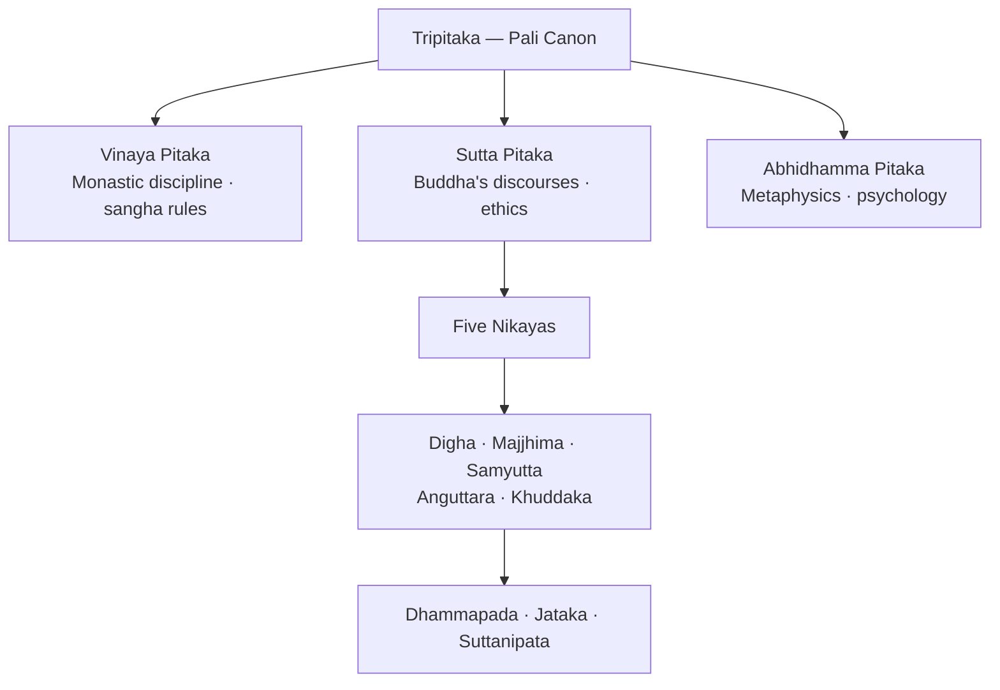
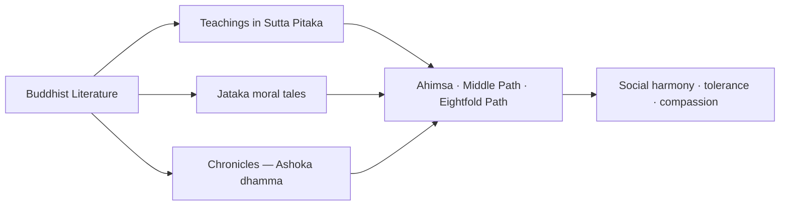

# Buddhist Literature

> GS-1 · Topic 01 · Buddhist texts — Tripitaka, Jataka, peace and ahimsa

---

## PYQs

| Year | M | Words | Question (EN) | प्रश्न (HI) | ID |
|------|---|-------|---------------|-------------|-----|
| 2018 | 8 | 125 | Discuss the salient features of Buddhist literature and its contribution to the promotion of peace. | बौद्ध साहित्य की प्रमुख विशेषताओं का वर्णन कीजिए तथा शान्ति के प्रचार में इसके योगदान की विवेचना कीजिए। | Q1 |
| — | 8 | 125 | *Likely:* Compare Buddhist and Jain literature as sources of ancient Indian history. | *संभावित:* प्राचीन भारतीय इतिहास के स्रोत के रूप में बौद्ध और जैन साहित्य की तुलना कीजिए। | Q2 |

---

## Quick Revision

```
CORE: Pali canon (Theravada) + later Sanskrit/Mahayana + chronicles
TRIPITAKA: Vinaya (monastic rules) · Sutta (discourses) · Abhidhamma (philosophy)

NIKAYAS (Sutta Pitaka): Digha (long) · Majjhima (middle) · Samyutta (connected)
  Anguttara (numerical) · Khuddaka (minor — Dhammapada, Jataka, Suttanipata, Therigatha)

COUNCILS: 1st Rajgriha (483 BCE, Upali+Ananda) | 2nd Vaishali (383 BCE, schism)
  3rd Pataliputra (250 BCE, Ashoka, Moggaliputta Tissa) — Theravada fixation
  4th Kashmir/Kanishka (Mahayana tradition — separate from Ashoka council)

MAHAYANA SUTRAS: Lotus (Saddharmapundarika) · Prajnaparamita · Vimalakirti
  Sanskrit spread to Central/East Asia via Kushan-Gupta routes

OTHER TEXTS: Jataka · Dhammapada · Dipavamsa/Mahavamsa · Ashokavadana
  Buddhacharita (Ashvaghosa) · Milindapanho (Menander-Nagasena debate)

LANGUAGE: Pali/Prakrit → masses | Sanskrit → Mahayana scholarly spread
THEMES: Ahimsa · Middle Path · Eightfold Path · Metta/Karuna · rejection of sacrifice

PEACE IN TEXTS: Non-violence code · Jataka compassion stories · Vinaya dispute resolution
  Ashoka dhamma narratives (tolerance, not imposed state Buddhism)

HISTORICAL VALUE: Buddha's life · Mahajanapadas · Magadha · urban economy · Ashoka missions
COMPARE JAIN: Tripitaka vs Angas | Middle Path vs extreme ahimsa | both Prakrit corpora

CONTEMPORARY: Bodh Gaya/Sarnath/Kushinagar UNESCO · Buddhist Circuit tourism
  NEP 2020 IKS · Art 49/51A(f) · Pali studies · ahimsa-Gandhi living heritage

TRAPS: ≠ all literary sources (02) | ≠ Jain extreme ahimsa | Dhamma ≠ state-imposed Buddhism
  Third Council = Pataliputra not Vaishali | Nikayas inside Sutta not separate pitaka
```

---

## Content

### What counts as Buddhist literature

- **Buddhist literature** = corpus of texts recording **Gautama Buddha's teachings**, monastic discipline, philosophy, biographies, and sectarian history — composed mainly from **5th century BCE** onward.
- Primary language early on: **Pali** (Prakrit) — Buddha preached in language of **common people**, not Sanskrit elite.
- Later: **Sanskrit** and **Buddhist Hybrid Sanskrit** for **Mahayana** texts — wider pan-Asian transmission.
- Major value for historians: **religion, ethics, society, economy, polity** of ancient India — especially **eastern Gangetic plain** and **Mauryan age**.

### Structure of the canon — Tripitaka (Three Baskets)



| Pitaka | Subject | Exam relevance |
|--------|---------|----------------|
| **Vinaya Pitaka** | Rules for **monks and nuns** — conduct, penalties, sangha organisation | Ordered **peaceful community life**; no violence within order |
| **Sutta Pitaka** | **Buddha's sermons** — Four Noble Truths, Eightfold Path, ethics | Core **peace and non-violence** teachings |
| **Abhidhamma Pitaka** | Philosophical analysis — mind, karma, reality | Rational, debate-oriented Buddhism |

### Sutta Pitaka — the five Nikayas

| Nikaya | Meaning | Content |
|--------|---------|---------|
| **Digha Nikaya** | Long discourses | Extended sermons to kings, brahmins — polity, ethics, cosmology |
| **Majjhima Nikaya** | Middle-length discourses | Core doctrinal teaching; debates with rival sects |
| **Samyutta Nikaya** | Connected/ grouped themes | Thematic collections (aggregates, senses, Mara) |
| **Anguttara Nikaya** | Numerical (1–11 items) | Graduated moral instruction — lay and monastic |
| **Khuddaka Nikaya** | Minor/miscellaneous collection | **Dhammapada**, **Jataka**, **Suttanipata**, **Therigatha** (nuns' verses) |

- **Dhammapada** (in Khuddaka) — anthology of verses on **mind control, anger, hatred, truth, non-violence** (widely quoted for ethics).
- Compiled and transmitted orally first; **written down** in Sri Lanka (Theravada tradition) around **1st century BCE** — long oral phase before fixation.

### Buddhist Councils and canon formation

| Council | Place | Patron / date | Outcome |
|---------|-------|---------------|---------|
| **First** | **Rajgriha** | c. **483 BCE** (after Buddha's parinirvana) | **Upali** recited **Vinaya**; Ananda recited **Suttas** — oral fixation of core canon |
| **Second** | **Vaishali** | c. **383 BCE** | Dispute over monastic rules; schism between **Sthaviravada** (elders) and **Mahasanghika** (majority) |
| **Third** | **Pataliputra** | c. **250 BCE** under **Ashoka** | Presided by **Moggaliputta Tissa**; **Theravada** orthodoxy affirmed; missions to Sri Lanka and beyond |

- Councils show **literature as living oral tradition** before writing — also source of **sectarian splits** (Theravada vs Mahasanghika → later Mahayana).

### Mahayana sutra literature

- **Mahayana** ("Great Vehicle") developed from c. **1st century CE** onward — Sanskrit texts, bodhisattva ideal, wider lay appeal.
- Key sutras:

| Sutra | Theme | Significance |
|-------|-------|--------------|
| **Lotus Sutra** (*Saddharmapundarika*) | Universal Buddhahood; skillful means | Most influential Mahayana text in East Asia |
| **Prajnaparamita** (*Perfection of Wisdom*) | Emptiness (**shunyata**); transcendent wisdom | Philosophical foundation of Mahayana; linked to **Nagarjuna** |
| **Vimalakirti Sutra** | Lay bodhisattva ideal | Social inclusiveness |

- Mahayana literature spread via **Kushan, Gupta, and Central Asian** routes — complements Pali Theravada canon for pan-Asian Buddhist history.

### Other important Buddhist texts

| Text | Language / period | Content |
|------|-------------------|---------|
| **Jataka tales** | Pali (Khuddaka Nikaya) | Stories of Buddha's **previous births** — morality, kingship, trade, urban life |
| **Dipavamsa, Mahavamsa** | Pali chronicles (Sri Lanka) | History of Buddhism; **Ashoka** sending missionaries; dynastic chronology |
| **Ashokavadana, Divyavadana** | Sanskrit avadana literature | Legends of Ashoka; Buddhist morality (miraculous elements — use critically) |
| **Buddhacharita** | Sanskrit — **Ashvaghosa** (c. 1st–2nd c. CE) | Epic biography of Buddha — renunciation, enlightenment |
| **Mahavastu** | Buddhist Hybrid Sanskrit | Mahayana biography/lore — Buddha's career |
| **Milindapanho** | Pali dialogue | King **Menander (Milinda)** and monk **Nagasena** — rational debate |

### Salient features of Buddhist literature

**1. Popular and accessible language**
- **Pali/Prakrit** — unlike Vedic Sanskrit restricted to priests; literature could reach **traders, artisans, peasants**.
- Organised **sangha** used texts for **missionary preaching** across India and abroad.

**2. Ethical and rational emphasis**
- Rejected **Vedic sacrificial killing** and blind ritual authority.
- Stress on **personal conduct**, **logic**, and **debate** (e.g. Milindapanho) — not mere faith.

**3. Social inclusiveness (in principle)**
- Literature records **entry of women** into sangha; opposition to **rigid caste barriers** — more **egalitarian** tone than many Brahmanical texts.
- **Three Jewels:** Buddha (teacher), **Dhamma** (doctrine), **Sangha** (order).

**4. Rich historical embeddedness**
- Jatakas describe **towns, merchants, guilds, kings** — invaluable for **second urbanisation** and **Mauryan** society.
- Chronicles link **Ashoka**, **Magadha**, spread to **Sri Lanka**.

**5. Regional and sectarian diversity**
- **Theravada** (Pali canon) vs **Mahayana** (Sanskrit sutras — Lotus, Prajnaparamita) — literature evolved with schools.
- **Limitation:** hagiography and miracles in **Avadana** texts — historians cross-check with **Ashokan edicts** and archaeology.

### Peace and non-violence in Buddhist literature

Buddhist literature is a primary vehicle for India's ancient **peace ethic** — not abstract pacifism alone but **structured moral discipline**.



**Doctrinal foundations (recorded in Sutta literature)**

| Teaching | Peace message |
|----------|---------------|
| **Four Noble Truths** | Suffering rooted in **desire/attachment** — including greed and aggression; liberation through restraint |
| **Eightfold Path** | **Right Speech** (no lies/abuse), **Right Action** (no killing/stealing), **Right Livelihood** (honest non-harmful work) |
| **Middle Path (Madhyama Marga)** | Rejects **extremes** — luxury and harsh asceticism; moderate, peaceful living |
| **Ahimsa** | **Non-violence** — no killing of humans or animals; opposed **animal sacrifice** central to Vedic ritual |
| **Metta & Karuna** | **Loving-kindness** and **compassion** toward all beings — ethical basis for peaceful society |
| **Panchashila** (lay code) | Avoid killing, stealing, falsehood, intoxication, sexual misconduct |

- **Dhammapada** famously teaches that **hatred is never appeased by hatred** — literature codifies **psychological peace** as civic virtue.

**Narrative and institutional peace**

- **Jataka stories** — kings renouncing violence, choosing **forbearance** over war; merchants practising honesty — **moral education** for lay society.
- **Vinaya Pitaka** — dispute resolution within sangha without bloodshed; monastic life as **model peaceful community**.
- **Ashokavadana / Mahavamsa** — portray **Ashoka** after **Kalinga war** turning to **dhamma** — literature reinforces **state-level peace policy** (tolerance, compassion to animals, respect for all sects).
- **Buddhacharita** — Buddha abandons princely life and warfare-path for enlightenment — literary archetype of **peace over conquest**.

**Historical impact on peace culture**

- Helped legitimise **Ashoka's dhamma** — ethical code of **social harmony, religious tolerance, animal protection** (dhamma ≠ imposed Buddhism as state religion).
- Supported **missionary spread** to Sri Lanka, Central Asia, Southeast Asia — carried **non-violent ethic** across cultures.
- Contrasted with contemporary **militarised Mahajanapadas** — offered ideological alternative to sacrificial violence.

### Buddhist vs Jain literature (comparison — future-angle)

| Aspect | **Buddhist literature** | **Jain literature** |
|--------|-------------------------|---------------------|
| **Core canon** | **Tripitaka** (Vinaya, Sutta, Abhidhamma) + Nikayas | **Angas** (+ lost **Purvas**) |
| **Language** | **Pali/Prakrit** early; Sanskrit Mahayana later | **Ardhamagadhi/Prakrit** (Shvetambara); Maharashtri Prakrit |
| **Ahimsa** | **Middle Path** — moderate non-violence | **Extreme ahimsa** — even insects, strict asceticism |
| **Historical focus** | Buddha's life, sangha, Magadha, Ashoka missions | Tirthankaras, Jain kings, eastern India cosmology |
| **Social tone** | Egalitarian sangha; lay Panchashila | Ascetic rigour; monastic discipline (Kalpasutra) |
| **Historian's use** | Urban economy (Jataka), Mauryan Buddhism | Magadha society, trade, Jain patronage networks |

### Significance for Indian heritage

- Buddhist literature is both **religious canon** and **historical source** — bridges **philosophy, ethics, and social history**.
- Its **peace discourse** (ahimsa, compassion, tolerance) influenced later **Indian thought** — including Gandhi's ahimsa (modern link, cite briefly if asked).
- Art-literature link: texts inspired **stupa, chaitya, vihara** narratives (Jataka scenes at **Bharhut, Sanchi, Ajanta**) — literature and material culture reinforce same values.
- **Pan-Asian civilizational export:** Pali canon and Sanskrit Mahayana sutras shaped **Sri Lanka, Tibet, China, Japan, Southeast Asia** — India's oldest sustained soft-power literature.

### Contemporary relevance

- **UNESCO World Heritage — Buddhist sites:** **Mahabodhi Temple, Bodh Gaya (2002)**, **Sanchi (1989)**, and the broader **Buddhist pilgrimage geography** (Sarnath, Kushinagar in UP) connect living worship to the textual tradition this file covers.
- **ASI and manuscript conservation:** Buddhist archaeological sites (**Sarnath, Sanchi, Bharhut**) and manuscript collections (e.g. **National Museum, Indian Museum Kolkata**) preserve material context of Buddhist literature; **Art 49** and **Article 51A(f)** frame state and citizen duty to protect this heritage.
- **NEP 2020 — Indian Knowledge Systems (IKS):** Buddhist **philosophy, ethics, and peace studies** integrated into higher-education curricula; **Pali and Buddhist Studies** departments (e.g. **Delhi University, Nava Nalanda Mahavihara**) continue the textual tradition academically.
- **Government tourism schemes:** **Swadesh Darshan — Buddhist Circuit** and **PRASAD** develop infrastructure at **Bodh Gaya, Sarnath, Kushinagar, Shravasti** — pilgrimage economy driven by literature-linked sacred geography.
- **International Buddhist diplomacy:** India hosts **Vesak Day** celebrations, supports **International Buddhist Confederation (Delhi)** — literature's peace ethic underpins cultural foreign policy toward **Japan, Sri Lanka, Thailand, Myanmar**.
- **Living heritage — ahimsa:** Buddhist **non-violence** informs modern **Gandhian satyagraha** and constitutional **fraternity** discourse — literature's ethical code remains politically relevant.
- **Digital preservation:** **Tripitaka** and **Jataka** digitisation projects (universities, **Buddhist Digital Resource Center** partnerships) make ancient corpus accessible without physical book dependency — aligns with book-free exam prep plus authentic source access.

### Limits and balanced view

- Literature **idealises** Buddha and Ashoka — not neutral chronicle.
- Buddhism did not **eliminate war** in Indian history; kings could patronise Buddhism while fighting — texts preach peace, practice varied.
- **Distinct from Jain literature** — Jain **extreme ahimsa** (even agriculture debated); Buddhist **Middle Path** more moderate.
- **Distinct from file 02** (Literary Sources) — this file focuses **Buddhist corpus and peace theme**, not all ancient sources.

---

## Answers

### Q1: Discuss the salient features of Buddhist literature and its contribution to the promotion of peace. (2018, 8M, 125W)

**Opening:**
> Buddhist literature — from the Pali Tripitaka to Jataka tales and Sanskrit biographies — combines accessible ethical teaching with a sustained message of non-violence and social harmony.

**Write these points:**
- **Corpus:** **Tripitaka** (Vinaya, Sutta, Abhidhamma) in **Pali** with **five Nikayas** (Digha, Majjhima, Samyutta, Anguttara, Khuddaka); **Jataka**, **Dhammapada**, **Mahavamsa**, **Buddhacharita** — oral then written tradition from Buddha age onward.
- **Features:** Popular language, **rational debate**, inclusiveness, rich data on **Mahajanapadas/Mauryan** society — not only theology.
- **Peace teachings:** **Ahimsa**, **Middle Path**, **Eightfold Path** (Right Speech/Action), **metta-karuna** — rejection of Vedic **animal sacrifice**.
- **Promotion of peace:** Jataka **moral tales**, Vinaya's **peaceful sangha discipline**, Ashoka **dhamma** narratives — tolerance, compassion, animal protection.
- Literature transmitted peace ethic to **Sri Lanka and Asia** — foundation of Buddhism as a **world religion of ethical restraint**.
- **Present link:** **UNESCO Buddhist sites**, **NEP IKS**, and **Buddhist Circuit tourism** keep textual peace ethics alive in policy and pilgrimage.

**Conclusion:**
> Thus Buddhist literature is both a historical archive and a civilizational charter of peace — shaping ancient India's moral imagination through text and missionary culture.

---

### Q2: Compare Buddhist and Jain literature as sources of ancient Indian history. (Likely PYQ)

**Opening:**
> Buddhist and Jain literatures are twin heterodox corpora documenting post-Vedic eastern India — both invaluable for social history yet differing in language, structure, and ideological emphasis.

**Write these points:**
- **Canon structure:** Buddhist **Tripitaka** (Vinaya-Sutta-Abhidhamma) with **Nikayas** vs Jain **Angas** and lost **Purvas** — both orally fixed before writing.
- **Language:** Buddhist **Pali/Prakrit** (later Sanskrit Mahayana — Lotus, Prajnaparamita) vs Jain **Ardhamagadhi/Prakrit** (Kalpasutra tradition).
- **Historical utility:** Both record **Magadha, urban economy, guilds, kings**; Buddhist **Jataka** and **Mahavamsa** especially rich on **Mauryan Ashoka**; Jain texts on **tirthankara lineage** and eastern Indian society.
- **Ideological contrast:** Buddhist **Middle Path ahimsa** vs Jain **extreme non-violence** — affects how each tradition portrays society and asceticism.
- **Limits:** Religious hagiography in both — cross-verify with **Ashokan edicts, archaeology, inscriptions**.

**Conclusion:**
> Used critically together, Buddhist and Jain literatures complement Brahmanical sources — offering the fullest literary picture of ancient India's heterodox age.

---

## Traps

| Wrong | Correct |
|-------|---------|
| Same as Literary Sources PYQ (02) | 02 = **all sources**; 12 = **Buddhist texts + peace** |
| Buddhist literature only Sanskrit | Early canon mainly **Pali/Prakrit**; Mahayana later Sanskrit |
| Tripitaka has four pitakas | **Three** — Vinaya, Sutta, Abhidhamma |
| Nikaya = separate pitaka | **Nikayas** are subdivisions of **Sutta Pitaka** (five) |
| Third Council at Vaishali | **Third = Pataliputra** under **Ashoka**; Second = Vaishali |
| Jain and Buddhist ahimsa identical | Jain = **extreme** ahimsa; Buddha = **Middle Path** |
| Ashoka imposed Buddhism via literature | **Dhamma** = ethical code; **tolerance** of all sects |
| Jataka = Buddha's final life only | **Previous births** — social/economic vignettes |
| Buddhist literature = only religious, no history | Records **cities, trade, Magadha, Ashoka** |
| All texts historically exact | **Avadana** legends — cross-check with **edicts** |
| Peace message = no warfare ever in Buddhist India | **Prescriptive ethics**; political reality more complex |
| Fourth Council = Ashoka's Third Council | **Fourth Council** = Kanishka tradition (Mahayana); Ashoka = **Third at Pataliputra** |
| Buddhist literature irrelevant to modern policy | **NEP IKS**, **Buddhist Circuit**, **UNESCO sites** — active contemporary links |

---

*Complete.*
