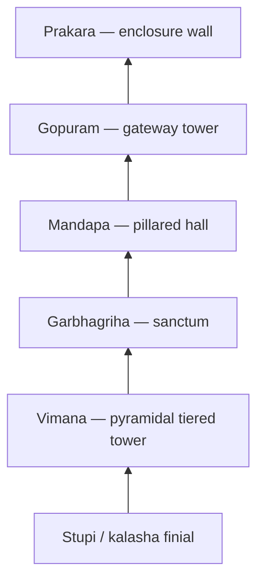

# Dravida Style Temple Architecture

> GS-1 · Topic 01 · Dravida (south Indian) temple architecture — vimana, gopuram, examples

---

## PYQs

| Year | M | Words | Question (EN) | प्रश्न (HI) | ID |
|------|---|-------|---------------|-------------|-----|
| — | 8 | 125 | *Likely:* Describe the salient features of Dravida style of temple architecture. | *संभावित:* द्रविड़ शैली की मंदिर वास्तुकला की प्रमुख विशेषताओं का वर्णन कीजिए। | Q1 |
| — | 8 | 125 | *Likely:* Compare Nagara and Dravida temple architecture. | *संभावित:* नागर और द्रविड़ मंदिर वास्तुकला की तुलना कीजिए। | Q2 |

---

## Quick Revision

```
STYLE: Dravida = SOUTH Indian Hindu temple idiom | Pyramidal tiered VIMANA
NOT: Nagara curvilinear shikhara (north) | NOT Mauryan stupa | Vesara = Deccan hybrid

PARTS: Garbhagriha (sanctum) → Vimana (pyramidal tower above) → Mandapa (hall)
  Gopuram = monumental GATEWAY tower (often taller than vimana in later temples)
  Prakara = enclosure wall | Pradakshina patha | Teppakulam (ritual tank)

PLAN: Square/square-derived sanctum | Complex = multiple shrines + gopurams + prakaras
MATERIAL: Granite (Tamil Nadu — Chola) | Sandstone (Pallava Kanchi) | Chloritic schist (Hoysala)

EVOLUTION:
  Pallava rock-cut (6th–8th c.) — Mahabalipuram rathas, Shore Temple
  Early structural (7th–9th c.) — Kailasanatha Kanchi, 58 subsidiary shrines
  Imperial Chola (10th–12th c.) — Brihadeshwara 216 ft granite vimana
  Vijayanagara/Nayak (14th–17th c.) — gopuram dominance (Meenakshi Madurai)

EXAMPLES:
  Brihadeshwara/Thanjavur (Rajaraja Chola, 11th c.) — UNESCO Great Living Chola Temples
  Kailasanatha/Kanchipuram (Pallava Narasimhavarman II, 8th c.)
  Shore Temple + Pancha Rathas/Mahabalipuram (Pallava, 7th–8th c.) — UNESCO 1984
  Gangaikonda Cholapuram (Rajendra I) | Airavatesvara/Darasuram (Chola)
  Meenakshi/Madurai (Nayak gopurams) | Srirangam (largest functioning complex)
  Hoysala Belur/Halebidu = Vesara hybrid — star-plan, NOT pure Dravida

vs NAGARA: Dravida = pyramidal vimana + gopuram | Nagara = curving shikhara + amalaka/kalasha
  Nagara mandapa = Phamsana roof | Dravida = concentric prakaras, granite mass

CONTEMPORARY: UNESCO Great Living Chola Temples (1987) · Mahabalipuram (1984)
  ASI + TN HR&CE · Art 49/51A(f) · NEP IKS vastushastra · Tamil Nadu temple tourism

TRAPS: Gopuram ≠ vimana | Brihadeshwara = Chola not Pallava | Kailasanatha Kanchi ≠ Ellora Kailasa
  Vesara ≠ pure Dravida | Gopuram dominance = later not Pallava origin | Shore Temple ≠ Nagara
```

---

## Content

### What is Dravida style

- **Dravida** (Dravidian) = principal **south Indian** style of **Hindu temple architecture** from early historic rock-cut phase through Chola, Pallava, Pandya, Vijayanagara eras.
- Named for **Dravida desha** (south country) in traditional **Vastushastra** texts — contrast with **Nagara** (north) and **Vesara** (Deccan hybrid).
- Mature form: **square garbhagriha** crowned by a **pyramidal tiered vimana** (tower), surrounded by **mandapas**, enclosed by **prakara** (wall) with monumental **gopuram** (gateway towers).
- Associated with **Pallava, Chola, Pandya, Hoysala, Vijayanagara** patronage — Tamil Nadu, Karnataka, Andhra heartland.

### Core architectural components

| Part | Function |
|------|----------|
| **Garbhagriha** | Sanctum sanctorum — main deity image (murti); small, dark, square cella |
| **Vimana** | **Pyramidal tower** above garbhagriha — tiered storeys (talas) with **karnas** (projections); Dravida hallmark |
| **Shikhara (Dravida sense)** | Crowning element (**stupi/kalasha**) atop vimana — not to be confused with Nagara curvilinear shikhara |
| **Mandapa** | Pillared hall — **maha-mandapa**, **artha-mandapa** (antechamber), **nritta-mandapa** (dance hall) |
| **Gopuram** | **Monumental gateway tower** at entrance — in later temples often **taller and more ornate than vimana** |
| **Prakara** | **Enclosure wall** around temple complex — may have multiple concentric prakaras |
| **Pradakshina patha** | Circumambulatory passage around sanctum or within prakara |
| **Teppakulam / tank** | Ritual tank attached to temple — south Indian feature |



### Salient features of Dravida style

1. **Pyramidal vimana** — horizontal tiers (talas) diminishing upward — vertical axis symbolising **Mount Meru** / cosmic axis.
2. **Square garbhagriha** — sanctum plan usually square; deity oriented for worship from mandapa.
3. **Gopuram dominance (later phase)** — from Chola-Vijayanagara onward, **entrance towers** become primary visual landmark — contrast with Nagara where **shikhara over garbhagriha** dominates.
4. **Prakara-centred complex** — temple as **walled sacred city** with multiple shrines, halls, tanks.
5. **Sculptural richness** — narrative panels, **dvarapalas** (guardian figures), deity icons on vimana and gopuram tiers.
6. **Material** — **granite** in Tamil Nadu (Brihadeshwara); sandstone at Kanchi; Hoysala **chloritic schist** for intricate carving.
7. **Regional evolution** — Pallava rock-cut → structural granite → Vijayanagara gopuram grandeur.

### Sculptural and iconographic programme

- **Dvarapalas** (guardian figures) flank sanctum and mandapa entrances — fierce Shaiva/Vaishnava doorkeepers (e.g. **Brihadeshwara**).
- **Vimana tiers** carry **koshta deities** (niche icons) — Brahma, Vishnu, Shiva, Durga on cardinal faces — cosmic hierarchy on vertical axis.
- **Gopuram tiers** display **narrative puranic panels** — Ramayana, Mahabharata, Shaiva/Vaishnava mythology readable from street level in later temples (**Meenakshi, Srirangam**).
- **Mandapa pillars** — **Yali** (leogriff), **horse-mounted warriors**, and **dancing figures**; Hoysala pillars lathe-turned to near-jewel precision.
- **Bronze icons** — **Chola lost-wax bronzes** (Nataraja, Parvati) made for temple processions complement stone vimana/gopuram programmes.

| Sculptural element | Location | Function |
|--------------------|----------|----------|
| **Dvarapala** | Sanctum/mandapa doorway | Guardian; marks sacred threshold |
| **Koshta deity** | Vimana/gopuram niches | Cardinal directional gods |
| **Narrative frieze** | Gopuram base and tiers | Puranic storytelling for devotees |
| **Bronze utsava murti** | Processional worship | Mobile deity image during festivals |

### Vijayanagara and Nayak phase — gopuram revolution

- From **14th–17th century CE**, **Vijayanagara** and **Nayak** rulers enlarged **gopurams** to dominate skyline — political statement of renewed Hindu kingship after Delhi Sultanate incursions.
- **Hampi (Vijayanagara)** — **Virupaksha temple gopuram** and **Vitthala complex** show imperial scale; granite and brick combination.
- **Madurai Nayaks** — **Meenakshi temple** four gopurams painted with vivid stucco figures — Dravida gateway becomes **primary landmark**, vimana secondary in visual hierarchy.
- **Exam nuance:** Cite gopuram dominance as **phase-specific** — do not attribute to Pallava Shore Temple or early Chola Brihadeshwara where **vimana** still commands.

### Temple as sacred town — economic role

- **Devadana** (land grants to temples) sustained **Brahmin settlements, artisans, musicians, and temple servants** — temples functioned as **landlord-institutions**.
- **Teppakulam** tanks stored monsoon water for ritual and irrigation — temple complex integrated **hydraulic management**.
- **Utsavam** (festival) calendars drove **pilgrimage, craft markets, and regional trade** — Madurai, Kanchi, Srirangam as medieval **temple towns**.
- **Bharatanatyam** codified in **Sadir** tradition performed in mandapas — performing arts inseparable from Dravida architectural space.

### Key examples

| Temple | Dynasty / period | Location | Features |
|--------|------------------|----------|----------|
| **Shore Temple** | Pallava, 7th–8th c. CE | **Mahabalipuram** | Structural temple by sea; Shiva/Vishnu; Pallava transition from rock-cut |
| **Pancha Rathas** | Pallava, 7th c. CE | **Mahabalipuram** | Monolithic rock-cut **rathas** — architectural experiments (Dharamaraja, Arjuna ratha) |
| **Kailasanatha Temple** | Pallava (Narasimhavarman II), 8th c. CE | **Kanchipuram** | Sandstone; **58 subsidiary shrines**; Dravida vimana prototype |
| **Brihadeshwara (Rajarajesvaram)** | Chola (**Rajaraja I**), 11th c. CE | **Thanjavur** | **216 ft granite vimana**; monolithic **Nandi**; Chola imperial peak; UNESCO site |
| **Gangaikonda Cholapuram** | Chola (Rajendra I) | Tamil Nadu | Rival scale to Brihadeshwara; Chola architectural programme |
| **Airavatesvara (Darasuram)** | Chola (Rajaraja II) | Kumbakonam | UNESCO Great Living Chola Temple; intricate vimana sculpture |
| **Srirangam (Ranganathaswamy)** | Chola-Pandya-Vijayanagara layers | Trichy | Largest functioning temple complex; concentric prakaras |
| **Meenakshi Temple** | Pandya / later Nayak | Madurai | **Four gopurams** — classic later Dravida gopuram emphasis |
| **Hoysaleswara** | Hoysala, 12th c. CE | **Halebidu** | **Vesara hybrid** — star-shaped plan, lathe-turned pillars, dense sculpture |
| **Chennakesava (Belur)** | Hoysala, 12th c. CE | Karnataka | Vesara-Dravida blend; jewelled exterior carving |

### Evolution and period

| Phase | Period | Character |
|-------|--------|-----------|
| **Rock-cut origins** | c. 6th–8th c. CE (Pallava) | Mahabalipuram caves and rathas — experiments in form |
| **Early structural** | c. 7th–9th c. CE | Kailasanatha Kanchi — vimana + subsidiary shrines |
| **Imperial Chola** | c. 10th–12th c. CE | Granite vimanas — Brihadeshwara scale; engineering mastery |
| **Later medieval** | c. 14th–17th c. CE | Vijayanagara/Nayak — **gopuram** becomes tallest element |

### Dravida vs Nagara vs Vesara (comparison)

| Feature | **Nagara** (North) | **Dravida** (South) | **Vesara** (Deccan) |
|---------|-------------------|---------------------|---------------------|
| **Tower over garbhagriha** | Curvilinear **shikhara** | Pyramidal **vimana** (tiered) | **Hybrid** — combined features |
| **Entrance emphasis** | Torana / later walls | Monumental **gopuram** | Mixed — often ornate gateways |
| **Summit ornament** | **Amalaka + kalasha** | **Stupi** on vimana | Blended |
| **Region** | North & central India | Tamil Nadu, AP, Kerala | Karnataka (Hoysala) |
| **Material** | Sandstone (Khajuraho, Odisha) | Granite (Chola) | Chloritic schist (Hoysala) |
| **Examples** | Khajuraho, Konark, Deogarh | Brihadeshwara, Kailasanatha Kanchi | Belur, Halebidu |


### Hoysala / Vesara note (brief)

- **Vesara** = architectural idiom blending **Nagara verticality** with **Dravida vimana tiers** — flourished under **Hoysala** dynasty (11th–14th c. CE).
- **Star-shaped (stellate) plan**, lathe-turned pillars, exterior covered in **continuous sculpture** — Belur, Halebidu, Somnathpur.
- Exam framing: cite as **Deccan hybrid**, not pure Dravida — but often grouped with south Indian tradition in contrast to Nagara.

### Significance

- Defines **south Indian sacred landscape** — Chola temples as symbols of **imperial bhakti and state power**.
- **Engineering achievement** — Brihadeshwara granite vimana (216 ft) built with sophisticated lifting and quarrying; monolithic **Nandi** (16 ft long, 13 ft high) at Thanjavur.
- Temples as **economic and cultural hubs** — **devadana** land grants, festivals, craft guilds, dance (**Bharatanatyam** in mandapas), and irrigation tank management.
- **Bhakti movement** anchor — Shaiva/Vaishnava temple centres (**Kanchi, Chidambaram, Srirangam, Madurai, Rameswaram**).
- **Pan-Indian contrast:** Dravida vimana-gopuram vocabulary is the standard **south Indian counter-pole** to Nagara rekha shikhara in every comparative architecture question.

### Contemporary relevance

- **UNESCO World Heritage — Great Living Chola Temples (1987):** **Brihadeshwara (Thanjavur)**, **Gangaikonda Cholapuram**, and **Airavatesvara (Darasuram)** — still **active places of worship**, demonstrating Dravida architecture as **living heritage**, not only archaeology.
- **UNESCO — Group of Monuments at Mahabalipuram (1984):** Pallava **Shore Temple** and **Pancha Rathas** — rock-cut to structural transition visible to global visitors; **ASI** maintains site with coastal conservation challenges.
- **ASI and state temple administration:** Central **ASI** protects notified monuments; **Tamil Nadu Hindu Religious and Charitable Endowments (HR&CE)** manages many functioning Dravida temples — daily ritual continuity alongside conservation.
- **Constitutional framework:** **Article 49** (state protects monuments) and **Article 51A(f)** (citizen heritage duty) apply to Chola and Pallava temple complexes of national importance.
- **NEP 2020 — Indian Knowledge Systems (IKS):** **Vastushastra, temple architecture, and iconography** taught in art-history and conservation programmes — Dravida vocabulary (vimana, gopuram, prakara) is core IKS content.
- **Tourism and economy:** **Tamil Nadu temple tourism** (Thanjavur, Madurai, Kanchipuram, Rameswaram) drives regional economy; **Swadesh Darshan** and state spiritual circuits promote **south Indian heritage corridors**.
- **Craft and performing arts revival:** Temple sculpture traditions, **bronze Chola icons** (lost-wax technique), and **Bharatanatyam** performance in mandapas link medieval Dravida architecture to **living intangible heritage**.
- **Conservation science:** Granite weathering, gopuram structural stability, and pigment loss on vimana sculpture require ongoing **ASI-INTACH** interventions — ancient engineering meets modern materials science.

### Limitations / exam nuance

- **Not monolithic** — Pallava, Chola, Pandya, Vijayanagara phases differ; gopuram dominance is **later** feature, not Pallava origin.
- **Distinct from Buddhist chaitya/stupa** and **Mauryan pillars**.
- **Kailasanatha (Kanchi) ≠ Kailasa (Ellora)** — latter is **Rashtrakuta rock-cut**, not structural Dravida.

---

## Answers

### Q1: Describe the salient features of Dravida style of temple architecture. (Likely PYQ)

**Opening:**
> Dravida style is the classic south Indian Hindu temple architecture distinguished by a pyramidal tiered vimana over the garbhagriha, enclosed within prakara walls and entered through monumental gopuram gateway towers.

**Write these points:**
- **Plan and parts:** **Garbhagriha** (sanctum) + **vimana** (pyramidal tower with talas/storeys) + **mandapa** (pillared halls); **prakara** (enclosure), **pradakshina patha**, ritual tanks.
- **Gopuram:** Monumental **gateway tower** — in later temples often taller than vimana — south Indian visual signature.
- **Material and examples:** Pallava **Kailasanatha (Kanchi)** and Mahabalipuram; Chola **Brihadeshwara (Thanjavur)** — 216 ft granite vimana; sculptural narrative panels and dvarapalas.
- **Evolution:** Pallava rock-cut (Mahabalipuram rathas) → structural granite Chola imperial temples → Vijayanagara gopuram grandeur.
- Temples as **bhakti, economic, and cultural centres** — land grants, festivals, performing arts.
- **Present link:** **UNESCO Chola Temples** and **Mahabalipuram** under **ASI** — living worship plus global heritage status.

**Conclusion:**
> Dravida architecture thus embodies the south Indian temple ideal — pyramidal vimana, gopuram gateway, and prakara-enclosed sacred complex — forming the counter-tradition to Nagara shikhara architecture of the north.

---

### Q2: Compare Nagara and Dravida temple architecture. (Likely PYQ)

**Opening:**
> Nagara and Dravida represent the two classical pan-Indian Hindu temple idioms — north emphasising curvilinear shikhara over the sanctum, south emphasising pyramidal vimana and gopuram gateways within prakara enclosures.

**Write these points:**
- **Tower form:** Nagara = **curvilinear shikhara** with **amalaka-kalasha** summit (Khajuraho, Konark); Dravida = **pyramidal tiered vimana** with stupi (Brihadeshwara, Kailasanatha Kanchi).
- **Entrance:** Nagara uses **torana**/walls; Dravida develops monumental **gopuram** — often dominant visual element in later period.
- **Plan:** Both use **garbhagriha + mandapa + pradakshina**; Dravida favours **concentric prakaras** and multiple subsidiary shrines; Nagara **panchayatana** (five-shrine) plan common in north.
- **Material/regional:** Nagara — sandstone (Khajuraho, Odisha); Dravida — **granite** (Chola Thanjavur), sandstone (Pallava Kanchi).
- **Vesara (Hoysala)** as Deccan **hybrid** — star-plan, intricate sculpture — bridges both traditions.
- **Heritage today:** **UNESCO Chola Temples** and **Mahabalipuram** exemplify Dravida legacy under **ASI** protection.

**Conclusion:**
> Together Nagara and Dravida map the regional sacred geography of medieval India — same Hindu worship logic expressed through contrasting architectural vocabularies.

---

## Traps

| Wrong | Correct |
|-------|---------|
| Dravida = curvilinear shikhara | Dravida = **pyramidal vimana**; curvilinear = **Nagara** |
| Gopuram = vimana | **Gopuram = gateway tower**; **vimana = tower over garbhagriha** |
| Brihadeshwara = Pallava temple | **Chola** (Rajaraja I, 11th c.) — Thanjavur granite |
| Kailasanatha = Ellora Kailasa | Kanchi = **Pallava structural**; Ellora = **Rashtrakuta rock-cut** |
| Dravida = only Chola period | **Pallava origins** (Mahabalipuram, Kanchi) → Chola → Vijayanagara |
| Hoysala = pure Dravida | **Vesara hybrid** — star-plan, Deccan blend |
| Shore Temple = Nagara | **Pallava Dravida** — Mahabalipuram |
| All south temples have tall gopurams | **Early Dravida** (Pallava/Chola vimana focus) — gopuram dominance = **later** |
| Dravida = Mauryan architecture | Mauryan = **stupas/pillars**; Dravida temples = **post-Gupta/Pallava** onward |
| Brihadeshwara not UNESCO | Part of **Great Living Chola Temples (UNESCO 1987)** |
| Mahabalipuram unrelated to Dravida | **Pallava Dravida** rock-cut origin — **UNESCO 1984** |
| Gopuram always taller than vimana | True mainly in **Vijayanagara/Nayak later phase** — not early Pallava/Chola |
| Dravida temples no longer functional | **Great Living Chola Temples** = active worship — living heritage |
| ASI irrelevant to south temples | **ASI** central protection + **TN HR&CE** local management |
| NEP has no architecture content | **NEP 2020 IKS** includes **vastushastra/temple architecture** |
| Srirangam = small shrine | **Largest functioning** Hindu temple complex — concentric prakaras |
| Chola bronzes unrelated to temples | **Lost-wax bronzes** commissioned for same **Dravida temple** worship |

---

*Complete.*
