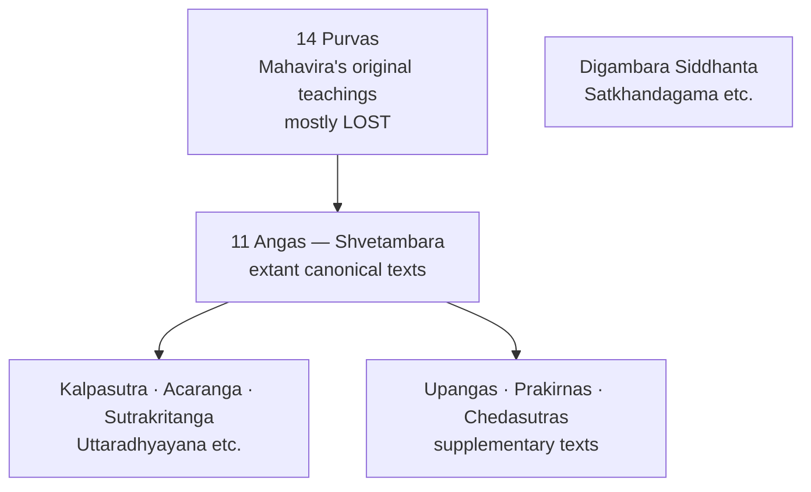
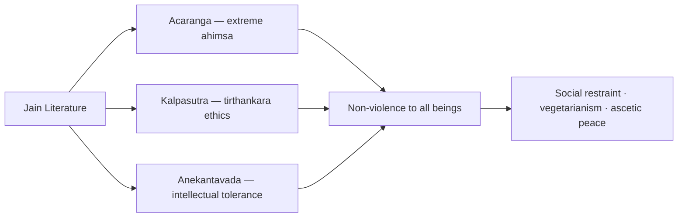

# Jain Literature

> GS-1 · Topic 01 · Jain texts — Angas, Purvas, Prakrit canon, historical value

---

## PYQs

| Year | M | Words | Question (EN) | प्रश्न (HI) | ID |
|------|---|-------|---------------|-------------|-----|
| — | 8 | 125 | *Likely:* Discuss the salient features of Jain literature and its historical value. | *संभावित:* जैन साहित्य की प्रमुख विशेषताओं और इसके ऐतिहासिक महत्व की विवेचना कीजिए। | Q1 |
| — | 8 | 125 | *Likely:* Compare Jain and Buddhist literature as sources of ancient Indian history. | *संभावित:* प्राचीन भारतीय इतिहास के स्रोत के रूप में जैन और बौद्ध साहित्य की तुलना कीजिए। | Q2 |

---

## Quick Revision

```
CORE: Angas (11 extant Shvetambara) + lost Purvas (14) | Digambara: Siddhanta texts
LANGUAGE: Ardhamagadhi · Maharashtri Prakrit — NOT Sanskrit elite (early canon)

KEY TEXTS:
  Acaranga Sutra (Anga 1) — oldest Jain text; extreme ahimsa, ascetic conduct
  Kalpasutra (Bhadrabahu) — Mahavira's life, tirthankara genealogy, Paryushana
  Sutrakritanga · Uttaradhyayana — ethics, debate with rival sects
  Chedasutras (6) — monastic discipline | Upangas · Prakirnas — supplementary

LOST PURVAS: 14 original teachings of Mahavira — basis of Angas; mostly lost after schism
SECTS: Shvetambara (white-clad, 11 Angas) | Digambara (sky-clad, Siddhanta — Satkhandagama)

CONTRAST BUDDHIST TRIPITAKA:
  Jain Angas vs Vinaya-Sutta-Abhidhamma | Both Prakrit/Pali | Both eastern Magadha
  Jain ahimsa = extreme (all life) | Buddhist = Middle Path
  Jain anekantavada/syadvada | Buddhist Middle Path pragmatism

HISTORICAL VALUE: Magadha society · Vaishali · Kundagrama (Mahavira birthplace)
  Trade/urban life · kings (Ajatashatru, Chandragupta) · Jain patronage networks
  Ashokan edicts mention Nirgranthas · Hathigumpha — Kharavela Jain patronage

PEACE/AHIMSA: Ahimsa paramo dharma · Anekantavada (intellectual tolerance)
  Lay anuvratas (five small vows) · vegetarianism · shravaka merchant ethics

CONTEMPORARY: Palitana · Ranakpur · Dilwara pilgrimage · Art 49/51A(f)
  NEP 2020 IKS (anekantavada) · Jain manuscript conservation · GI/craft revival

TRAPS: ≠ Buddhist Tripitaka | Purvas mostly LOST | Digambara ≠ Shvetambara canon
  Kalpasutra = Jain not Buddhist | Acaranga = oldest Anga not medieval
```

---

## Content

### What counts as Jain literature

- **Jain literature** = corpus of texts recording **teachings of Tirthankaras** (especially **Mahavira**, 24th), monastic discipline, cosmology, ethics, and sectarian history — composed from **6th century BCE** onward.
- Primary language: **Ardhamagadhi** and other **Prakrits** — Jain tradition deliberately avoided Sanskrit dominance in early canon (unlike later Brahmanical texts).
- Two major sects preserve **different canons:**
  - **Shvetambara** — 45 texts including **11 Angas** (12th lost).
  - **Digambara** — rejects Shvetambara Angas as fully authentic; preserves **Siddhanta** texts (e.g. **Satkhandagama** — later compilation).
- Major value for historians: **eastern Gangetic plain**, **Magadha**, urban economy, heterodox age, Jain patronage networks.

### Structure of the Jain canon



| Category | Status | Content |
|----------|--------|---------|
| **Purvas** | **14 texts — largely lost** | Original doctrinal corpus attributed to Mahavira's disciples; basis from which Angas derived |
| **Angas** | **11 extant** (12th Anga lost) | Core canonical texts — ethics, cosmology, monastic life, legends |
| **Upangas** | 12 texts | Supplementary — geography, astronomy, narrative |
| **Prakirnas** | 10 texts | Mixed topics — conduct, stories |
| **Chedasutras** | 6 texts | Monastic discipline (parallel to Buddhist Vinaya) |

### Key Jain texts

| Text | Nature | Historical / exam relevance |
|------|--------|----------------------------|
| **Acaranga Sutra** | Oldest Jain text (Anga 1) | **Extreme ahimsa** — careful walking, straining water; ascetic ethics |
| **Kalpasutra** | Attributed to **Bhadrabahu** | **Mahavira's life**, genealogy of tirthankaras, monastic rules; recited at **Paryushana** festival |
| **Sutrakritanga** | Anga text | Debates with rival teachers; social and religious polemics |
| **Uttaradhyayana** | Anga text | Ethics, death contemplation, disciple instruction |
| **Nayadhammakahao** | Prakirna | Stories of merchants, kings — social vignettes |
| **Parisishtaparvana** (Hemachandra) | Later Sanskrit | **Kumarapala** (Gujarat) biography — medieval Jain patronage |

### Salient features of Jain literature

**1. Prakrit/Ardhamagadhi language**
- Early canon in **Ardhamagadhi** — language of **common people and eastern Magadha** region.
- Parallel to Buddhist **Pali** — both heterodox traditions democratised religious text away from Sanskrit brahmanical monopoly.

**2. Extreme ahimsa (non-violence)**
- **Acaranga Sutra** codifies non-violence toward **all living beings** — insects, plants, microorganisms (conceptually).
- Ascetics avoid harming even by breath, footsteps, or occupation — stricter than Buddhist **Middle Path**.
- Literature promotes **compassion, restraint, vegetarianism** — civilizational peace ethic.

**3. Anekantavada (non-absolutism) and Syadvada**
- **Many-sidedness of truth** — tolerance of multiple viewpoints; intellectual non-violence.
- Literature models **debate without dogmatic closure** — contrasts with absolutist religious claims.

**4. Cosmological and cyclical time**
- Jain texts describe **lokakasha** cosmology — **Mount Meru**, **bharata-kshetra**, cyclical **avasarpini/utsarpini** time.
- Less useful for linear political chronology but rich for **intellectual history** and social worldview.

**5. Historical embeddedness**
- References to **Magadha kings** (Ajatashatru, Shrenika/Bimbisara), urban life, merchants, guilds.
- **Kalpasutra** biographies of tirthankaras include **genealogical and geographic** data — use critically.

### Jain vs Buddhist literature (Tripitaka contrast)

| Aspect | **Jain literature** | **Buddhist literature (Tripitaka)** |
|--------|---------------------|-------------------------------------|
| **Core structure** | **Angas** (+ lost **Purvas**) | **Vinaya, Sutta, Abhidhamma** + **five Nikayas** |
| **Language** | **Ardhamagadhi/Prakrit** | **Pali/Prakrit** early; Sanskrit Mahayana later |
| **Founder focus** | **24 Tirthankaras** — Mahavira central | **Gautama Buddha** — single historical founder emphasis |
| **Ahimsa** | **Extreme** — all life forms | **Middle Path** — moderate, practical |
| **Monastic rules** | **Chedasutras**, Kalpasutra | **Vinaya Pitaka** |
| **Historical utility** | Eastern India, trade, ascetic networks | Jataka urban life, Ashoka, Mauryan Buddhism |
| **Councils** | Jain **councils** at Pataliputra (3rd–4th c. CE) — canon fixation | Buddhist councils (Rajgriha, Vaishali, Pataliputra) |

- Both are **indispensable heterodox sources** for post-Vedic **Magadha** — complement Brahmanical and archaeological evidence.

### Peace and ahimsa in Jain texts



| Concept | Text / tradition | Peace message |
|---------|------------------|---------------|
| **Ahimsa paramo dharma** | Acaranga, all Angas | Non-violence as **supreme duty** — physical, verbal, mental |
| **Anekantavada** | Philosophical sutras | Tolerance of multiple truths — reduces sectarian conflict |
| **Ascetic restraint** | Kalpasutra, Chedasutras | Self-discipline as foundation of social harmony |
| **Lay vows (anuvratas)** | Later texts | Five small vows for householders — scaled-down non-violence |

- Jain literature's peace ethic is **more radical** than Buddhist — influenced Indian vegetarian culture, trading communities (Jain **shravakas**), and ethical commerce ideals.

### Historical value

- **Geography and polity** — eastern India (**Magadha, Vaishali, Kundagrama** — Mahavira's birthplace near **Vaishali**); references to **Nanda-Maurya** era figures including **Chandragupta Maurya's** reputed Jain association in tradition.
- **Urban and economic life** — merchant ethics, **shrenis** (guilds), banking traditions (later Jain **hundi** culture has ancient roots in **shravaka** values); **Nayadhammakahao** merchant-king stories.
- **Religious history** — parallel to Buddhism as **shramana** movement; explains spread of heterodox ideas during **second urbanisation**.
- **Art and architecture link** — Jain patronage of **Mathura, Khajuraho (Parsvanatha), Dilwara (Mount Abu), Ranakpur, Palitana** — literature explains iconography and **24 tirthankara** lineage.
- **Inscriptional corroboration** — Jain texts + **Mauryan edicts** (mention of **Nirgranthas/Jains**) + **Hathigumpha inscription** (Kharavela, 1st c. BCE — Jain patronage, Kalinga).

### Contemporary relevance

- **Pilgrimage and living heritage:** **Palitana (Gujarat)** — sacred Shatrunjaya hill with hundreds of temples; **Ranakpur** and **Dilwara (Mount Abu)** marble temples — active worship sites rooted in literature's tirthankara cosmology and ahimsa ethic.
- **ASI-protected Jain monuments:** **Khajuraho Parsvanatha temple**, **Kankali Tila (Mathura)** Jain remains, **Hathigumpha (Udayagiri, Odisha)** — material evidence complementing literary sources; protected under **Article 49** and **Article 51A(f)** heritage duties.
- **NEP 2020 — Indian Knowledge Systems (IKS):** Jain **anekantavada** (many-sided truth) and **syadvada** (conditional predication) taught as India's early **pluralism and logic** tradition — directly derived from Jain sutra literature.
- **Manuscript conservation:** Institutions like **Jain Manuscript Preservation Project**, **Bhandarkar Oriental Research Institute (Pune)**, and **National Mission for Manuscripts** preserve Prakrit/Ardhamagadhi texts — modern continuation of oral-written transmission chain.
- **Ahimsa and vegetarianism:** Jain literature's **extreme non-violence** shaped Indian **vegetarian food culture**, ethical commerce, and modern **animal welfare** discourse — living practice, not only ancient text.
- **GI tags and craft economy:** Jain **shravaka** merchant communities historically patronised **handloom, jewellery, and manuscript illumination** — connects to contemporary **GI-tagged crafts** and ethical trade ideals.
- **Tourism circuits:** **Rajasthan Jain temple circuit** (Ranakpur-Dilwara), **Gujarat Palitana-Shatrunjaya**, and **Karnataka Shravanabelagola** (Gommateshwara) — pilgrimage economy sustained by literature-linked sacred geography.
- **Interfaith dialogue:** **Anekantavada** cited in modern **secular and constitutional tolerance** debates — literature offers indigenous intellectual framework for pluralism.

### Limitations

- **Cosmological framing** — tirthankara cycles mix history with mythology.
- **Purvas lost** — earliest layer inaccessible; Angas are derivative/redacted compilations (c. **4th–5th c. CE** written fixation after oral phase).
- **Sectarian split** — Shvetambara vs Digambara **different canons**; not one uniform corpus.
- **Ascetic bias** — lay life and non-Jain groups under-represented compared to monastic ideals.

---

## Answers

### Q1: Discuss the salient features of Jain literature and its historical value. (Likely PYQ)

**Opening:**
> Jain literature — composed mainly in Ardhamagadhi Prakrit — forms the canonical record of the shramana tradition founded by Mahavira, offering both a radical ethics of non-violence and a vital source for ancient eastern Indian history.

**Write these points:**
- **Corpus:** **11 Angas** (Shvetambara) derived from lost **14 Purvas**; key texts — **Acaranga Sutra**, **Kalpasutra**, **Sutrakritanga**; Digambara **Siddhanta** tradition separate.
- **Features:** **Prakrit** language; **extreme ahimsa**; **anekantavada** (non-absolutism); cosmological cyclical time; monastic **Chedasutras**.
- **Historical value:** Documents **Magadha, Vaishali**, urban merchants, guilds, kings; complements archaeology and **Ashokan** references to Nirgranthas.
- **Peace ethic:** Non-violence to all living beings — stricter than Buddhist Middle Path; shaped ascetic and lay **shravaka** culture.
- **Present link:** **Palitana/Ranakpur pilgrimage**, **NEP IKS anekantavada**, and **ASI Jain monuments** keep literature's ethics and history publicly alive.

**Conclusion:**
> Jain literature thus stands as an essential heterodox archive — preserving ancient India's ethical radicalism and eastern Gangetic social history alongside Buddhist and Brahmanical sources.

---

### Q2: Compare Jain and Buddhist literature as sources of ancient Indian history. (Likely PYQ)

**Opening:**
> Jain and Buddhist literatures are parallel Prakrit-language corpora documenting the shramana revolution in post-Vedic Magadha — equally vital yet structurally and ideologically distinct.

**Write these points:**
- **Structure:** Jain **Angas/Purvas** vs Buddhist **Tripitaka** (Vinaya, Sutta, Abhidhamma) with **five Nikayas** — both orally transmitted before writing.
- **Language and audience:** Both use **Prakrit** (Ardhamagadhi/Pali) for mass accessibility against Sanskrit brahmanical monopoly.
- **Historical data:** Both record **Mahajanapadas, urban economy, merchants**; Buddhist **Jataka/Mahavamsa** stronger on **Ashoka**; Jain texts on **tirthankara lineage** and Jain royal/merchant patronage.
- **Ideology:** Jain **extreme ahimsa** and **anekantavada** vs Buddhist **Middle Path** and **Eightfold Path** — different social prescriptions.
- **Method:** Neither is neutral chronicle — corroborate with **edicts, archaeology, inscriptions** (Kharavela, Ashoka).

**Conclusion:**
> Together they provide the richest literary window on ancient India's heterodox age — best read comparatively, not in isolation.

---

## Traps

| Wrong | Correct |
|-------|---------|
| Jain canon = Tripitaka | Jain = **Angas** (+ lost **Purvas**); Tripitaka = **Buddhist** |
| All 14 Purvas extant | **Purvas mostly LOST** — Angas are surviving derivative canon |
| Jain literature in Sanskrit originally | Early canon = **Ardhamagadhi/Prakrit** |
| Jain ahimsa = Buddhist ahimsa | Jain = **extreme** (all life); Buddhist = **Middle Path** |
| Shvetambara = Digambara same canon | **Different canons** — Shvetambara Angas vs Digambara Siddhanta |
| Kalpasutra = Buddhist text | **Jain** — Mahavira life, Bhadrabahu tradition |
| Jain texts = no historical data | Rich on **Magadha, trade, urban life** — use critically |
| Acaranga = later medieval text | **Oldest Jain Anga** — extreme ahimsa code |
| Jain literature = only religious | Also **social-economic** source for ancient eastern India |
| Only Mahavira in all texts | **24 Tirthankaras** — full cosmological lineage |
| Anekantavada irrelevant today | **NEP 2020 IKS** — pluralism/tolerance framework from Jain philosophy |
| Jain literature no pilgrimage link | **Palitana, Ranakpur, Dilwara** — active sites rooted in textual tradition |
| Hathigumpha unrelated to Jain texts | **Kharavela inscription** corroborates Jain patronage in literature |

---

*Complete.*
