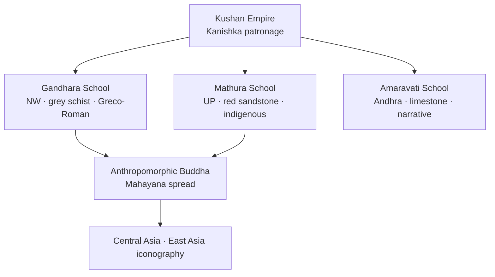

# Kushan Art — Gandhara & Mathura Schools

> GS-1 · Topic 01 · Gandhara vs Mathura art, Kanishka patronage, Mahayana link

---

## PYQs

| Year | M | Words | Question (EN) | प्रश्न (HI) | ID |
|------|---|-------|---------------|-------------|-----|
| — | 8 | 125 | *Likely:* Compare Gandhara and Mathura schools of art. | *संभावित:* गांधार और मथुरा कला शैलियों की तुलना कीजिए। | Q1 |
| — | 8 | 125 | *Likely:* Discuss the contribution of Kushan patronage to Indian art and religion. | *संभावित:* भारतीय कला और धर्म में कुषाण संरक्षण के योगदान की विवेचना कीजिए। | Q2 |

---

## Quick Revision

```
PERIOD: Kushan Empire c. 1st–3rd c. CE | Kanishka peak (c. 127–150 CE)
CAPITALS: Purushapura (Peshawar) · Mathura (UP) · Taxila region

TWO SCHOOLS: Gandhara (NW — Peshawar, Taxila, Swat, Hadda) | Mathura (UP — Yamuna)

GANDHARA: Grey schist / bluish-grey stone | Greco-Roman (Hellenistic) influence
  Wavy hair Buddha · Apollo-like face · toga-like sanghati · realistic anatomy
  Jataka reliefs · bodhisattvas (Maitreya, Avalokiteshvara) · Corinthian columns in background
  Silk Route transmission to Central Asia · China · Japan

MATHURA: Red sandstone (Sikri range quarries) | Indigenous Indian style
  Spiritual calm · fleshy/youthful body · transparent clinging drapery
  Buddhist + Jain + Hindu Yaksha/Yakshi · Kushan royal portraits (Kanishka, Huvishka)
  UP angle: Mathura = major Kushan workshop on Yamuna — imperial capital region

KANISHKA: 4th Buddhist Council (Kashmir/Jalandhar tradition) | Mahayana patronage
  Gold dinars — Buddha, Shiva, Nanaia syncretism | Grand stupas (Peshawar Kanishka stupa)

AMARAVATI (3rd school): Andhra · white/green limestone · Satavahana-Kushan overlap
  Dynamic narrative panels · tribhanga · lotus motifs — ≠ Gandhara/Mathura but exam-compared

ICONOGRAPHY SHIFT: Aniconic (wheel, footprints) → Anthropomorphic Buddha (Kushan standardisation)
  Mathura type → pan-India canonical | Gandhara type → Silk Route export

STUPA ART: Gandhara — narrative friezes, Corinthian columns | Mathura — railing reliefs, yaksha panels
  Kanishka stupa Peshawar (lost) — described by Xuanzang

GANDHARA SYNCretism: Herakles-Vajrapani · Atlas figures · stucco over brick (Hadda)
MATHURA MULTI-FAITH: Kankali Tila Jain · Yaksha/Yakshi · Kushan royal portraits on coins

CONTEMPORARY: Mathura Archaeological Museum (ASI) · Buddhist Circuit UP
  Art 49/51A(f) · NEP IKS art history · Gandhara repatriation debates · Incredible India

TRAPS: Gandhara ≠ Mathura material | Kanishka 4th ≠ Ashoka 3rd Council | Amaravati = south not NW
  Buddha Apollo-like = Gandhara only | Mathura = Jain+Hindu+Buddhist | Gandhara mostly outside modern India
```

---

## Content

### Historical context — Kushan Empire

- **Kushanas** (c. **1st–3rd century CE**) — nomadic origin; empire from **Central Asia to Gangetic plain**; capitals **Purushapura (Peshawar)**, **Mathura**, **Taxila** region.
- **Kanishka** (c. **127–150 CE**) — greatest Kushan ruler; patron of **Buddhism, art, trade** (Silk Route).
- Kushan period = **first anthropomorphic Buddha images** standardised — revolution in Indian and Asian art.
- **UP relevance:** **Mathura** in Uttar Pradesh was a **major Kushan artistic and political centre** — red sandstone sculpture hub on Yamuna.

### Two principal schools — overview

| Feature | **Gandhara School** | **Mathura School** |
|---------|---------------------|-------------------|
| **Region** | North-west — **Gandhara** (Peshawar, Taxila, Swat, Hadda) | **Mathura** (UP) — Yamuna basin |
| **Material** | **Grey schist** / bluish-grey stone | **Red sandstone** (Sikri range) |
| **Style influence** | **Greco-Roman (Hellenistic)** — Alexander's legacy, Bactrian Greeks | **Indigenous Indian** — local sculptural tradition |
| **Buddha image** | Wavy hair, **Apollo-like face**, toga-like **sanghati**, realistic anatomy | **Spiritual calm**, fleshy/youthful body, **transparent drapery** clinging to body |
| **Other subjects** | Buddhist dominant; some Greco-Buddhist syncretism | **Buddhist + Jain + Hindu** (Yaksha/Yakshi, Kushan royal portraits) |
| **Trade link** | **Silk Route**, Roman contact | Gangetic heartland, imperial capital zone |



### Gandhara school — features and examples

**Salient features**
- **Hellenistic naturalism** — realistic human anatomy, drapery folds, architectural backgrounds (Corinthian columns in reliefs).
- **Buddha as human god** — wavy hair bun (ushnisha), moustache in early examples, **Greek-Roman facial type**.
- **Sanghati** (monastic robe) rendered like **Roman toga** — heavy folds.
- **Narrative reliefs** — Jataka scenes, Buddha's life, bodhisattvas (**Maitreya**, **Avalokiteshvara**) with Hellenistic features.
- **Stupa decoration** — friezes at **Taxila, Jamalgarhi, Hadda**.

**Examples / sites**
- **Taxila** (Pakistan) — stupa complexes, monastery sculpture.
- **Peshawar** — Kanishka's **stupa** (described by Chinese pilgrims — now lost).
- **Swat valley, Hadda** — stucco and schist sculpture.

**Historical significance**
- Gateway for **Buddhist art transmission** to **Central Asia, China, Japan** via Silk Route.
- Closely linked to **Mahayana** development — **bodhisattva cult** and rich narrative iconography.

### Mathura school — features and examples

**Salient features**
- **Indigenous Indian aesthetic** — spiritual serenity over Hellenistic realism.
- **Red sandstone** — warm colour, fine grain from **Sikri quarries** near Mathura.
- **Buddha** — broad chest, transparent **clinging drapery**, **ushnisha**, **urna**, elongated earlobes — becomes **canonical Indian Buddha type**.
- **Jain tirthankara** images (nude, srivatsa mark) and **Yaksha/Yakshi** (e.g. **Parkham Yakshi**) — cosmopolitan religious production.
- **Kushan royal portraits** — coins and sculptures of Kanishka, Huvishka — imperial patronage evidence.

**Examples / sites**
- **Mathura Archaeological Museum** — Kushan Buddha, bodhisattvas, Jain icons.
- **Kankali Tila** — Jain stupa remains, sculptures.
- **Govindnagar, Jamalpur** finds — Kushan-period red sandstone.

**UP angle (exam relevance)**
- **Mathura, Uttar Pradesh** — not peripheral but **central Kushan workshop**; Yamuna location connected empire's **north-west to Gangetic** zones.
- UP PCS candidates should cite **Mathura red sandstone** as state's ancient artistic heritage alongside Sarnath (Gupta) and Kushan Mathura.

### Kanishka patronage — art and religion

| Domain | Contribution |
|--------|--------------|
| **Buddhist Council** | **Fourth Buddhist Council** (trad. **Kashmir/Jalandhar**, c. 1st–2nd c. CE) — Mahayana texts codified; sectarian significance debated |
| **Buddha image** | Imperial patronage standardised **anthropomorphic Buddha** — Gandhara and Mathura workshops |
| **Mahayana** | Promotion of **bodhisattva** cult — Maitreya, Avalokiteshvara sculptures |
| **Coinage** | Gold **dinar/stater** — Greek script + Indian deities; images of **Buddha, Shiva, Nanaia** (Persian goddess) — religious syncretism |
| **Architecture** | Grand **stupas** (Peshawar Kanishka stupa); monastery building across empire |
| **Trade** | Silk Route prosperity funded artistic production |

### Mahayana link

- Kushan period sees shift from **aniconic** (symbol-only) to **iconic** Buddha representation — essential for **Mahayana** spread.
- **Gandhara** especially associated with **bodhisattva** imagery and narrative **Jataka reliefs** — visual theology of **Mahayana sutras** (Lotus, Prajnaparamita traditions).
- **Mathura** Buddha type becomes **dominant pan-Indian form** — influences Gupta Sarnath Buddha and all later Asian iconography.
- Both schools together = **artistic foundation of Buddhist world religion**.

### Aniconic to iconic transition (exam-critical)

| Phase | Representation | Period | Example |
|-------|----------------|--------|---------|
| **Aniconic** | Wheel, footprints, throne, Bodhi tree | Pre-Kushan (Maurya onward) | **Sanchi, Bharhut** reliefs — Buddha not shown in human form |
| **Early iconic** | Anthropomorphic Buddha emerges | c. **1st c. CE** | Scattered experiments |
| **Kushan standardisation** | Full Buddha and bodhisattva images | **1st–3rd c. CE** | **Gandhara schist, Mathura sandstone** |
| **Gupta refinement** | Spiritualised canonical type | **4th–6th c. CE** | **Sarnath Buddha** — inherits Mathura lineage |

- Kushan period is the **decisive break** — enables **Mahayana visual theology** (bodhisattva cult, Jataka narrative panels) and pan-Asian icon export.

### Gandhara — stucco and schist traditions

- Besides **grey schist**, Gandhara artists used **stucco (lime plaster)** over brick cores — cheaper, faster production for monastery and stupa decoration (**Hadda, Taxila**).
- **Greco-Buddhist syncretism:** **Herakles-Vajrapani** as Buddha's protector; **Atlas figures** support stupas; **Corinthian pilasters** frame Indian divine narratives.
- **Chinese pilgrim evidence:** **Faxian** and **Xuanzang** describe **Kanishka's Peshawar stupa** — literary corroboration for lost monumental architecture.
- Gandhara's **naturalistic portraiture** influenced **Central Asian mural traditions** (Kizil, Dunhuang) — Silk Route artistic chain.

### Mathura — cosmopolitan religious production

- **Yaksha/Yakshi cult** precedes and merges with Buddhist/Jain iconography — **Parkham Yakshi**, **Chauri-bearer Yakshi** show indigenous fertility-deity tradition absorbed into Kushan art.
- **Jain tirthankara** images (standing nude, **srivatsa** chest mark) and **Ayagapatas** (devotional tablets) from **Kankali Tila** — Mathura as **multi-faith workshop**.
- **Kushan royal cult:** **Kanishka and Huvishka** portraits on coins and sculptures document **imperial dress, fire-altar rituals**, and multi-religious patronage.
- **Mathura Buddha typology** features: **ushnisha** (cranial protuberance), **urna** (forehead mark), elongated earlobes, **abhayamudra** — becomes **standard Indian Buddha** through Gupta Sarnath refinement.

### Amaravati school (brief — third contemporary school)

- **Amaravati** (Andhra Pradesh, lower Krishna valley) — **white/green limestone**; **Satavahana** and Kushan-era overlap.
- **Narrative relief panels** on **stupa** (Amaravati, Nagarjunakonda) — dynamic movement, **lotus motifs**, tribhanga posture.
- Less Hellenistic than Gandhara; more **fluid, sensuous Indian** style than Mathura's monumental solidity.
- Often compared in exams as **third major early historic Buddhist art centre** — south Indian counterpart.

### Gandhara vs Mathura vs Amaravati (comparison table)

| Aspect | Gandhara | Mathura | Amaravati |
|--------|----------|---------|-----------|
| **Region** | North-west | **UP (Mathura)** | Andhra (south-east) |
| **Stone** | Grey schist | **Red sandstone** | White/green limestone |
| **Foreign influence** | **Greco-Roman strong** | Indigenous | Indigenous (Dravidian zone) |
| **Buddha type** | Apollo-like, toga robe | Spiritual, clinging drapery | Slender, dynamic narrative |
| **Other religions** | Mainly Buddhist | Buddhist + Jain + Hindu | Mainly Buddhist |
| **Dynasty link** | Kushan (NW) | **Kushan (UP centre)** | Satavahana-Ikshvaku overlap |

### Significance

- **First Buddha image** — Kushan art solves aniconic tradition; enables Buddhist **visual devotion** across Asia.
- **Cultural synthesis** — Gandhara = Indo-Greek fusion; Mathura = indigenous Indian spiritual aesthetic.
- **Historiography** — coins, sculptures, inscriptions date Kushan chronology; **Kanishka era** debates (accession date, council location).
- **Pan-Asian legacy:** Gandhara transmitted iconography via **Silk Route**; Mathura type influenced **Gupta Sarnath Buddha** and all later Asian Buddhist art.
- **UP civilizational pride:** **Mathura red sandstone** heritage on Yamuna — Kushan, Gupta, and medieval layers — central to UPPCS art-history questions.

### Contemporary relevance

- **Mathura Archaeological Museum (ASI):** Houses premier **Kushan red sandstone** Buddha, bodhisattva, Jain tirthankara, and Yaksha sculptures from **Govindnagar, Kankali Tila, Jamalpur** — UP's flagship ancient art collection under **Archaeological Survey of India**.
- **Constitutional heritage duty:** Kushan sculptures at Mathura and related sites fall under **Article 49** (state protection) and **Article 51A(f)** (citizen appreciation) — same framework as all nationally important monuments.
- **NEP 2020 — Indian Knowledge Systems (IKS):** **Gandhara-Mathura art history**, iconography, and **Silk Route cultural exchange** taught in fine-arts and archaeology programmes — Kushan period is core IKS module for ancient Indian aesthetics.
- **Buddhist Circuit tourism (UP):** **Mathura** on Yamuna links to **Sarnath** (Gupta Buddha refinement) and broader **Swadesh Darshan Buddhist Circuit** — Kushan Mathura as historical node in pilgrimage geography.
- **Gandhara heritage and repatriation debate:** Gandhara collections in **Peshawar, Lahore, and international museums** (British Museum, Met) — UNESCO and **Incredible India** campaigns highlight India's civilizational claim to **Greco-Buddhist synthesis** despite sites lying mainly in Pakistan/Afghanistan today.
- **Conservation science:** **Red sandstone weathering** at Mathura and **schist fragmentation** at Gandhara sites require **ASI** chemical consolidation and climate-controlled museum display — ancient craft meets modern conservation.
- **Soft power and diaspora:** Kushan Buddha images underpin India's **Buddhist diplomacy** with **Japan, Sri Lanka, Thailand** — Mathura and Gandhara types referenced in joint exhibitions and cultural agreements.
- **Digital documentation:** **3D scanning** of Kushan sculptures (museum and site programmes) creates permanent records — supports both research and **virtual tourism** without handling fragile originals.

### Limitations / exam nuance

- **Gandhara ≠ all Kushan art** — Mathura equally important; do not conflate.
- **Kanishka's Fourth Council** — date/location debated; do not confuse with **Ashoka's Third Council**.
- **Amaravati ≠ Gandhara** — different region, material, dynasty context.
- Gandhara mostly **outside modern India** (Pakistan/Afghanistan) — but integral to **ancient Indian art history** syllabus.

---

## Answers

### Q1: Compare Gandhara and Mathura schools of art. (Likely PYQ)

**Opening:**
> Gandhara and Mathura — both flourishing under Kushan patronage — represent two distinct sculptural responses to the invention of the anthropomorphic Buddha image: Hellenistic naturalism in the north-west and indigenous Indian spirituality at Mathura in Uttar Pradesh.

**Write these points:**
- **Region and material:** Gandhara = **NW (Taxila, Peshawar)**, **grey schist**; Mathura = **UP Yamuna centre**, **red sandstone**.
- **Style:** Gandhara — **Greco-Roman** influence, Apollo-like Buddha face, toga-like sanghati, realistic anatomy; Mathura — **indigenous** spiritual calm, fleshy body, transparent clinging drapery.
- **Subject range:** Gandhara mainly **Buddhist** (Jataka, bodhisattvas); Mathura — **Buddhist + Jain + Hindu** Yaksha icons and Kushan royal portraits.
- **Historical role:** Both standardise **Buddha image** under **Kanishka**; Gandhara transmits via **Silk Route**; Mathura type becomes **pan-India canonical form**.
- **Heritage today:** **Mathura Museum (ASI)** and **NEP IKS** art-history modules preserve Kushan legacy for UP and national exams.

**Conclusion:**
> Together Gandhara and Mathura mark the Kushan artistic revolution — fusing external Hellenistic and indigenous Indian idioms into the foundational iconography of Buddhism and ancient Indian sculpture.

---

### Q2: Discuss the contribution of Kushan patronage to Indian art and religion. (Likely PYQ)

**Opening:**
> Kushan imperial patronage — especially under Kanishka — transformed ancient Indian art and religion by standardising the Buddha image, fostering Mahayana iconography, and linking Gangetic and north-western cultural zones.

**Write these points:**
- **Art schools:** Patronage of **Gandhara** (grey schist, Greco-Buddhist) and **Mathura** (red sandstone, indigenous) workshops — first systematic **anthropomorphic Buddha**.
- **Mahayana and councils:** **Fourth Buddhist Council** tradition; **bodhisattva** cult (Maitreya, Avalokiteshvara); visual theology supporting **Mahayana sutras**.
- **Religious syncretism:** Kushan **coinage** depicts Buddha, Shiva, Nanaia — multi-faith empire; Jain and Hindu sculpture at Mathura alongside Buddhist.
- **Trade and spread:** **Silk Route** prosperity funded monasteries and stupas; Gandhara art transmitted Buddhism to **Central and East Asia**.
- **UP relevance:** **Mathura** as Kushan capital-region centre — red sandstone heritage on Yamuna under **ASI museum protection**.

**Conclusion:**
> Kushan patronage thus stands at the crossroads of ancient Indian art history — converting Buddhism into a visually rich world religion while leaving enduring sculptural legacies at Gandhara and Mathura.

---

## Traps

| Wrong | Correct |
|-------|---------|
| Gandhara = red sandstone | Gandhara = **grey schist**; **Mathura = red sandstone** |
| Mathura school in Gandhara region | **Mathura = UP**; Gandhara = **NW (Pakistan/Afghanistan)** |
| Buddha images existed fully in Mauryan age | **Anthropomorphic Buddha standardised Kushan period** (1st–3rd c. CE) |
| Kanishka Council = Ashoka 3rd Council | Kanishka = **4th Council** (trad. Kashmir); Ashoka = **3rd at Pataliputra** |
| Gandhara art purely Indian | Strong **Greco-Roman/Hellenistic** influence |
| Mathura = only Buddhist | **Jain + Hindu** Yaksha/tirthankara icons too |
| Amaravati = Gandhara subsidiary | **Separate school** — Andhra, limestone, Satavahana context |
| Kushan art only in foreign territory | **Mathura (UP)** = major Kushan centre — UP PCS angle |
| All Buddha images Apollo-like | Apollo-like = **Gandhara**; Mathura = **indigenous spiritual type** |
| Gandhara and Mathura identical | **Contrast** = standard compare question format |
| Mathura Museum not ASI-managed | **Mathura Archaeological Museum** under **ASI** — premier Kushan collection |
| Gandhara irrelevant to modern India | **Gandhara-Mathura synthesis** in **NEP IKS**, museums, **Buddhist diplomacy** |
| Sarnath Buddha = Kushan Gandhara type | **Sarnath = Gupta refinement** of **Mathura-type** indigenous Buddha |
| Aniconic Buddha continued after Kushan | Kushan period marks shift to **dominant anthropomorphic** iconography |
| Kanishka only patronised Gandhara | **Mathura equally central** — red sandstone workshop on Yamuna |

---

*Complete.*
