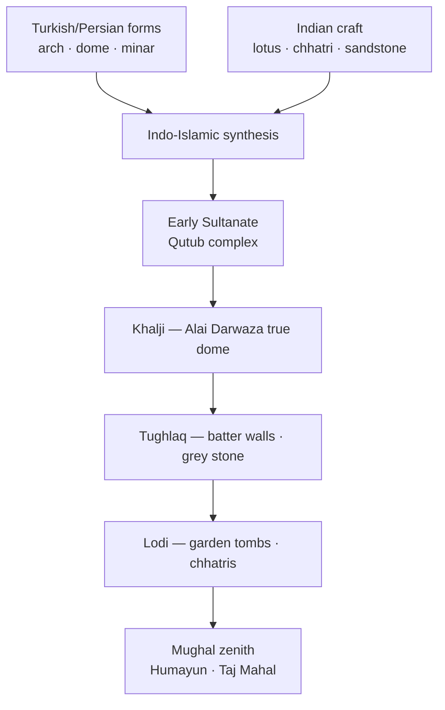

# Indo-Islamic & Delhi Sultanate Architecture

> GS-1 · Topic 01 · Sultanate architecture — arch, dome, synthesis

---

## PYQs

| Year | M | Words | Question (EN) | प्रश्न (HI) | ID |
|------|---|-------|---------------|-------------|-----|
| — | 8 | 125 | *Likely:* Describe the main features of Indo-Islamic architecture during the Delhi Sultanate. | *संभावित:* दिल्ली सल्तनत काल में भारतीय-इस्लामी वास्तुकला की प्रमुख विशेषताओं का वर्णन कीजिए। | Q1 |
| — | 8 | 125 | *Likely:* Discuss the evolution of Indo-Islamic architecture from the Sultanate to the Mughal period. | *संभावित:* सल्तनत से मुगल काल तक भारतीय-इस्लामी वास्तुकला के विकास की विवेचना कीजिए। | Q2 |

---

## Quick Revision

```
SYNTHESIS CORE: Turkish/Persian/Central Asian forms + Indian craftsmen/materials/motifs = Indo-Islamic
  NOT pure West Asian import | NOT mere temple destruction — composite craft tradition over centuries

NEW STRUCTURAL ELEMENTS (Turkish introduction, Indian mastery):
  TRUE ARCH (voussoir) · TRUE DOME (squinches/pendentives) · LIME MORTAR · MINAR · COURTYARD MOSQUE
  Route of arch: Rome → Byzantine → Arab world → India (Indians did NOT invent arch independently)

DECORATION RULE (religious buildings): No human/animal figures → geometry · arabesque · Quranic CALLIGRAPHY
  Indian motifs absorbed: LOTUS · BEL (creeper) · bell · swastika · CHHATRI · balcony · deep eaves

MATERIALS: Red/yellow SANDSTONE (Delhi-Agra belt) · MARBLE (increasing Lodi-Mughal) · Tughlaq GREY stone
  Early SPOLIA: temple columns reused in Quwwat-ul-Islam — conflict + synthesis both true

DELHI SULTANATE PHASES:
  Early 13th c. (Slave): Quwwat-ul-Islam · Qutub Minar (~71.4 m) · Arhai Din ka Jhonpra (Ajmer)
  Khalji: Alai Darwaza — FIRST scientific TRUE DOME in India · Siri capital (few remains)
  Tughlaq: BATTER (sloping) walls · Tughlaqabad · Hauz Khas · Kotla Firoz Shah · grey stone austerity
  Sayyid-Lodi: ARCH+ LINTEL hybrid · GARDEN TOMBS · octagonal tombs → direct Mughal precursor

KEY MONUMENTS (named for exam):
  Qutub Minar (Aibak start → Iltutmish complete) | Alai Darwaza (Khalji) | Ghiyasuddin Tughlaq tomb
  Lodi Gardens tombs (Delhi) | Atala Masjid Jaunpur | Adina Mosque Pandua (Bengal brick)
  Jama Masjid Ahmedabad | Gol Gumbaz Bijapur (Deccan — later, world's large dome)

REGIONAL SCHOOLS: Jaunpur Sharqi · Bengal (curved cornices, brick) · Gujarat (screen of domes)
  Deccan Bahmani/Adil Shahi · UP transition zone (Chunar, Jaunpur)

BRIDGE TO MUGHAL: Sher Shah Suri — Sasaram tomb · Purana Qila mosque → Humayun's Tomb → Taj

TRAPS: Qutub Minar ≠ for saint Qutbuddin Kaki | Arch ≠ Turkish invention | Alai Darwaza ≠ Mughal
  Indo-Islamic ≠ zero Indian influence | Batter walls = Tughlaq not all dynasties | Qutub = Delhi not UP

CONTEMPORARY: Qutub Minar complex UNESCO 1993 · ASI protection · Art 49/51A(f) · NEP 2020 IKS
  Delhi heritage city · PRASAD/Swadesh Darshan · Incredible India · Mehrauli Archaeological Park
```

---

## Content

### Context — what is Indo-Islamic architecture

- **Indo-Islamic architecture** denotes the **composite building tradition** that emerged in the Indian subcontinent from roughly the **13th century** (Delhi Sultanate) onward, when **Islamic architectural forms** — arch, dome, minar, courtyard mosque, mihrab-oriented prayer hall — were executed by **Indian artisans** using **local materials and decorative vocabularies**.
- It is **neither a pure import from West Asia** nor a continuation of Hindu temple architecture unchanged — it is a **synthesis** produced over centuries of patronage, migration, and craft exchange.
- **Exam frame:** Medieval Indian culture was **neither purely Hindu nor purely Islamic**; Sultanate monuments are evidence of **interaction, adaptation, and innovation** — not only conquest and destruction.
- The Delhi Sultanate (**1206–1526**) provides the **first large-scale pan-North Indian Islamic building programme** — congregational mosques, tombs, madrasas, forts, and urban quarters from Delhi to Bengal, Gujarat, and the Deccan.

### New elements introduced and Indian contributions

| Element | Description | Significance |
|---------|-------------|--------------|
| **True arch** | Voussoir-based semicircular or pointed arch | Wider spans, fewer pillars; transmitted via **Rome → Byzantine → Arab → India** |
| **True dome** | Spherical/conical vault on **squinches** or **pendentives** | Monumental enclosed prayer halls; technical mastery grows Khalji → Mughal |
| **Lime mortar** | High-quality binding material | Enabled large arches and domes impossible with dry masonry alone |
| **Minar** | Tall tower — call to prayer, victory landmark | **Qutub Minar** (~**71.4 m**) — most iconic Sultanate minar |
| **Arabesque** | Geometric/floral interlace + **Quranic calligraphy** | Islam discouraged figural imagery in mosques; script becomes major art form |
| **Courtyard mosque** | Open **sahn** + **riwaq** (colonnade) | **Quwwat-ul-Islam** model — Indian climate adaptation |

**Indian contributions to synthesis**
- **Motifs:** lotus, bel (creeper), bell, swastika carved on Islamic buildings — visible on **Iltutmish's tomb**, **Alai Darwaza**, Firuz Shah structures.
- **Structural habits:** corbel tradition adapted; **arch + lintel together** under Lodis — hybrid engineering.
- **Chhatris, balconies, deep eaves** — Rajasthan-Gujarat craft absorbed into tomb and gateway design.
- **Materials:** red/yellow **sandstone** (Delhi-Agra-Rajasthan belt), **marble** increasing from Lodi period; **Bengal brick** in eastern schools.
- **Stone-carving density:** Sultanate walls often fully carved — **no empty surface** (Iltutmish tomb tradition).



### Delhi Sultanate — period-wise architecture

**Early Sultanate (13th century — Slave dynasty)**
- **Quwwat-ul-Islam Mosque** (Delhi, Mehrauli) — near **Qutub Minar**; **first congregational mosque in Delhi**; built with **temple spolia** (reused columns); shows both **conflict and craft continuity**.
- **Qutub Minar** — begun **Qutb-ud-Din Aibak** (**1199**), completed and extended by **Iltutmish**; tapering **red sandstone** tower with projecting **balconies**; **NOT** built for Sufi saint **Qutbuddin Bakhtiyar Kaki** (shrine is separate in Mehrauli).
- **Arhai Din ka Jhonpra** (Ajmer) — converted monastery/mosque under **Qutb-ud-Din Aibak**; early synthesis of Hindu-Jain craft with Islamic plan.
- **Iltutmish's tomb** (Delhi) — dense carving, lotus motifs, horseshoe arch — Indian decorative saturation.

**Khalji period (1290–1320)**
- **Alai Darwaza** (Delhi, **1311**) — gateway to Quwwat-ul-Islam enlargement under **Alauddin Khalji**; **first true scientific dome in India**; perfect pointed arches; red sandstone + white marble inlay; milestone in **dome-on-square** technology.
- **Siri** — Alauddin's new capital (Delhi); few remains; planned tower **twice Qutub height** (never built).
- **Alai Minar** — unfinished companion to Qutub; shows Khalji ambition.

**Tughlaq period (1320–1414)**
- **Tughlaqabad** — massive fort-palace of **Ghiyasuddin Tughlaq**; artificial lake; **batter** (sloping defensive walls) — distinctive Tughlaq military aesthetic.
- **Tomb of Ghiyasuddin Tughlaq** — elevated platform, marble dome, sloping walls — begins formal **tomb-garden** tradition.
- **Muhammad bin Tughlaq** — shifted capital Daulatabad experiment; **Bijai Mandal**, **Adilabad** fort remains in Delhi.
- **Firuz Shah Tughlaq** (**1351–1388**) — **Hauz Khas** (reservoir + madrasa complex), **Kotla Firoz Shah** (Ashokan pillar moved here), **Firoz Shah Kotla mosque**; **grey stone**, reduced ornament, lotus panels — austerity phase.

**Sayyid and Lodi period (1414–1526 — pre-Mughal culmination)**
- **Arch + lintel used together** — transitional structural habit unique to late Sultanate.
- **Garden tombs** on high platforms — **Lodi Gardens** (Delhi): **Muhammad Shah Sayyid tomb**, **Sikandar Lodi tomb**, **Bara Gumbad**, **Shish Gumbad** — octagonal/plan forms, chhatris.
- **Moth ki Masjid**, **Mosque of Jamali Kamali** — Lodi decorative refinement.
- **Legacy:** Direct architectural precursor to **Mughal tomb architecture** — **Humayun's Tomb (1565)** → **Taj Mahal (1632–53)**.

### Regional Indo-Islamic schools (beyond Delhi)

| Region | Key example | Distinctive features |
|--------|-------------|----------------------|
| **Jaunpur (Sharqi Sultanate)** | **Atala Masjid** (1377), **Jami Masjid** | Huge **propylon gateway**, Hindu-Buddhist-Jain craft continuity; Sharqi independent style |
| **Bengal** | **Adina Mosque, Pandua** (14th c.) | **Brick** construction, curved **cornices**, pointed vaults — local material logic |
| **Gujarat** | **Jama Masjid, Ahmedabad** (Ahmed Shah, 1424) | **Screen of domes**, Hindu artisan carving, minars at corners |
| **Malwa** | **Jami Masjid, Mandu** | Afghan-Malwa fusion; large domes, austere grandeur |
| **Deccan (Bahmani → Adil Shahi)** | **Gol Gumbaz, Bijapur** (1656) | One of **world's largest domes**; whispering gallery; later than Delhi Sultanate but same Indo-Islamic lineage |
| **UP belt** | **Chunar fort**, **Jaunpur** | Sultanate-Mughal transition zone; Sharqi + Mughal overlap |

### Characteristics summary — salient features for exam

1. **Arch and dome** as defining structural vocabulary — contrast with post-and-lintel Hindu **nagara/dravida** temple.
2. **Geometric arabesque + Quranic calligraphy** instead of figural sculpture on mosques and tombs.
3. **Minar, mihrab, qibla orientation, courtyard, water tank (wudu)** in mosque complexes.
4. **Red sandstone + marble** contrast palette; marble dominance increases Lodi → Mughal.
5. **Tomb architecture evolution:** simple grave → elevated platform → **char-bagh garden setting** → double dome (Mughal).
6. **Cultural synthesis visible** — lotus, chhatri, Indian carving density on Islamic plans.
7. **Regional variation** — Bengal brick ≠ Delhi stone; Deccan dome scale ≠ Jaunpur gateway type.

### Evolution to Mughal architecture

| Sultanate contribution | Mughal development | Example chain |
|------------------------|-------------------|---------------|
| True dome (Alai Darwaza, 1311) | Double dome, bulbous profile | **Buland Darwaza**, **Taj Mahal** inner+outer dome |
| Garden tomb (Tughlaq, Lodi) | Char-bagh symmetry, platform tomb | **Humayun's Tomb**, **Taj Mahal** |
| Chhatri, balcony, eaves | Imperial fusion ateliers | **Fatehpur Sikri**, **Agra Fort** |
| Iqta-era court culture | Imperial **karkhana** workshops | Manuscript + building crafts unified |
| **Sher Shah Suri** (1540–45 interregnum) | Bridge figure | **Sasaram tomb**, **Purana Qila mosque** → Mughal resume |

- **Sher Shah Suri** represents **climax of pre-Mughal** and **beginning of Mughal** architectural idiom — exam often treats him as transition marker.
- **Humayun's Tomb (1565, Mirak Mirza Ghiyas)** — first major Mughal garden tomb on **UNESCO list**; explicitly builds on **Lodi tomb-garden** vocabulary.

### Significance and legacy

- First **visible pan-Indian Islamic building tradition** at scale — mosques, tombs, madrasas, forts across North India and Deccan.
- Proves **composite medieval culture** — Indian craftsmen, not imported labour alone, mastered dome technology.
- Foundation for **Taj Mahal**, **Red Fort**, **Jama Masjid Delhi** — exam continuity questions Sultanate → Mughal arc.
- **Jaunpur, Bengal, Gujarat** schools show Indo-Islamic was **never monolithic** — regional identity persisted within shared arch-dome vocabulary.
- **Sufi khanqahs** and **madrasas** (Hauz Khas) linked architecture to **education and spiritual life** — not only military monuments.

### Contemporary relevance

- **UNESCO World Heritage — Qutub Minar and its Monuments, Delhi (inscribed 1993):** Includes **Qutub Minar**, **Quwwat-ul-Islam Mosque**, **Alai Darwaza**, **Alai Minar**, **Iron Pillar** — global heritage obligations under World Heritage Convention; **ASI** (Archaeological Survey of India) is custodian.
- **ASI conservation:** Ongoing structural monitoring of Qutub Minar (tilt surveys), lime-mortar restoration matching Sultanate technique, visitor management at Mehrauli complex; **digital documentation** (3D laser scanning) creates preservation record.
- **Constitutional framework:** **Article 49** — state shall protect monuments of national importance; **Article 51A(f)** — citizen duty to value and preserve composite heritage including Indo-Islamic monuments.
- **NEP 2020 — Indian Knowledge Systems (IKS):** Sultanate architecture taught in **art-history, archaeology, and craft curricula** — arch-dome engineering, calligraphy, synthesis historiography; links medieval craft to modern **conservation science** and **materials research**.
- **Heritage cities and tourism:** **Delhi** (Mehrauli Archaeological Park, Qutub complex) anchors **Incredible India** and **Dekho Apna Desh** campaigns; **Swadesh Darshan** and **PRASAD** (Pilgrimage Rejuvenation and Spiritual Augmentation Drive) fund **heritage infrastructure** — connectivity, amenities, interpretation centres at cultural circuits.
- **Living heritage economy:** Qutub Minar area **light-and-sound shows**, craft bazaars, guide training — heritage as **soft power** and local livelihood; **Jaunpur**, **Ahmedabad** ( UNESCO World Heritage City, 2017) extend Sultanate legacy into urban heritage policy.
- **Balanced public discourse:** Contemporary debates on **monument protection vs urban development** (Delhi ridge, Mehrauli buffer zones) require knowing **Sultanate history** — neither romanticising conquest nor erasing synthesis.

### Limits and balanced view

- Early period involved **temple material reuse (spolia)** and documented **destruction** — historiography must acknowledge **conflict + synthesis** simultaneously; exam answers gain balance from both.
- **Not all "Islamic" buildings identical** — Bengal brick, Tughlaq grey austerity, Lodi garden tombs, Jaunpur gateways are **distinct sub-styles**.
- **Attribution traps:** many monuments have **multiple patrons** across dynasties (Qutub Minar: Aibak → Iltutmish → later repairs).
- **Gol Gumbaz (Bijapur)** is **17th-century Deccan** — do not place it in 13th-century Delhi Sultanate chronology, though same Indo-Islamic dome tradition.

---

## Answers

### Q1: Describe the main features of Indo-Islamic architecture during the Delhi Sultanate. (Likely, 8M, 125W)

**Opening:**
> Delhi Sultanate architecture marks India's first large-scale Indo-Islamic synthesis — combining true arch, dome, and minar with Indian materials, motifs, and craftsman traditions executed across mosques, tombs, and forts.

**Write these points:**
- **Structural forms:** **True arch, true dome, lime mortar** — wider prayer halls; landmark **Qutub Minar** (~71.4 m); **Quwwat-ul-Islam** courtyard mosque model; **Alai Darwaza (1311)** — first scientific true dome in India.
- **Decoration:** **Arabesque** geometry, floral patterns, **Quranic calligraphy** — avoiding figural imagery in religious buildings; Indian **lotus, bel, chhatri** motifs integrated on gateways and tombs.
- **Materials and phases:** **Red/yellow sandstone, marble**; early **spolia** from temples; **Tughlaq batter walls** and **grey stone** austerity; **Lodi garden tombs** — high platform + char-bagh precursor.
- **Regional diversity:** Beyond Delhi — **Atala Masjid (Jaunpur)**, **Adina Mosque (Bengal brick)**, **Ahmedabad Jama Masjid** — same vocabulary, local materials.
- **Synthesis:** Turkish/Persian plans executed by **Indian craftsmen** — neither purely imported nor purely indigenous; foundation for later **Mughal** refinement.

**Conclusion:**
> Sultanate architecture thus established the vocabulary — arch, dome, minar, tomb-garden — that Mughal builders perfected from Humayun's Tomb to the Taj Mahal.

---

### Q2: Discuss the evolution of Indo-Islamic architecture from the Sultanate to the Mughal period. (Likely, 8M, 125W)

**Opening:**
> Indo-Islamic architecture evolved from experimental Sultanate mosques and tombs to the refined imperial style of the Mughals — a continuous arc of structural mastery, garden planning, and decorative synthesis.

**Write these points:**
- **Sultanate base (13th–15th c.):** **Qutub Minar**, **Alai Darwaza** (true dome), Tughlaq **batter forts** and **Hauz Khas**, Lodi **garden tombs** with chhatris and arch-lintel hybrid.
- **Bridge figure:** **Sher Shah Suri** — **Sasaram tomb**, **Purana Qila mosque** — pre-Mughal climax linking Sultanate to Mughal revival.
- **Mughal Akbar:** **Red sandstone**, **Fatehpur Sikri**, **Buland Darwaza** — fusion of Gujarat, Bengal, Rajput, Persian elements; imperial **karkhana** ateliers.
- **Jahangir–Shah Jahan:** **Marble**, **pietra dura**, **Taj Mahal** — double dome, char-bagh, minarets — zenith of tomb architecture building on **Lodi-Humayun** garden-tomb lineage.
- **Continuity theme:** Arch-dome-tomb-garden vocabulary from **Alai Darwaza → Humayun's Tomb → Taj** — same synthesis tradition matured with imperial scale.

**Conclusion:**
> The evolution shows growing confidence — from spolia mosques to the Taj Mahal — as Indo-Islamic architecture became India's most recognisable medieval visual language, now protected as UNESCO and ASI heritage.

---

### Q3 (Future variant): Compare Indo-Islamic architecture of Delhi Sultanate with regional schools. (Likely, 8M, 125W)

**Opening:**
> While Delhi Sultanate monuments established the arch-dome-minar vocabulary of Indo-Islamic architecture, regional schools in Jaunpur, Bengal, Gujarat, and the Deccan adapted it to local materials and craft traditions.

**Write these points:**
- **Delhi core:** Stone **sandstone**, **Alai Darwaza** true dome, **Tughlaq batter**, **Lodi garden tombs** — imperial capital sequence.
- **Jaunpur Sharqi:** **Atala Masjid** — massive **propylon gateway**, Hindu-Jain carving continuity; independent of Delhi stylistically.
- **Bengal:** **Adina Mosque, Pandua** — **brick**, curved cornices, pointed vaults — climatic and material adaptation.
- **Gujarat:** **Ahmedabad Jama Masjid** — **screen of domes**, Hindu artisan work; maritime trade patronage.
- **Shared + distinct:** All share **arch-dome-calligraphy** grammar; differ in **material (brick vs stone)**, **ornament density**, and **gateway vs dome emphasis**.

**Conclusion:**
> Regional Indo-Islamic schools prove the tradition was a **pan-Indian synthesis network**, not a single Delhi import — a point essential for balanced heritage and exam answers.

---

## Traps

| Wrong | Correct |
|-------|---------|
| Qutub Minar built for saint Qutbuddin Kaki | **Victory/minar** linked to **Quwwat-ul-Islam** mosque; saint's dargah is separate |
| Arch invented by Turks in India | Transmitted via **Roman-Byzantine-Arab** chain; Indians **mastered** it locally |
| Indo-Islamic = no Indian influence | **Lotus, chhatri, bel**, Indian stone-carving tradition are **central** |
| All Sultanate buildings use batter walls | **Tughlaq** feature; Firuz Shah grey-stone phase differs |
| Alai Darwaza = Mughal monument | **Alauddin Khalji (1311)** — Sultanate; first true scientific dome |
| Indo-Islamic allows figural sculpture in mosques | **Geometric/calligraphic** decoration dominant in religious buildings |
| Sultanate architecture unrelated to Taj Mahal | **Lodi garden tombs** → **Humayun's Tomb** = direct precursor chain |
| Qutub Minar located in UP | **Delhi** (Mehrauli); not Agra or Lucknow |
| Gol Gumbaz = Delhi Sultanate period | **1656, Bijapur (Adil Shahi)** — Deccan; same dome tradition, later date |
| Quwwat-ul-Islam built without temple spolia | Early mosque used **reused temple columns** — spolia documented |
| Hauz Khas built by Alauddin Khalji | **Firuz Shah Tughlaq** — lake + madrasa complex |
| Indo-Islamic = only mosques | Also **tombs, forts, madrasas, gateways, minars** |
| Qutub Minar height ~100 m | Approximately **71.4 m** — do not confuse with unbuilt Alai Minar plan |
| Atala Masjid is in Delhi | **Jaunpur (Sharqi Sultanate, UP)** — not Delhi Sultanate capital work |

---

*Complete.*
