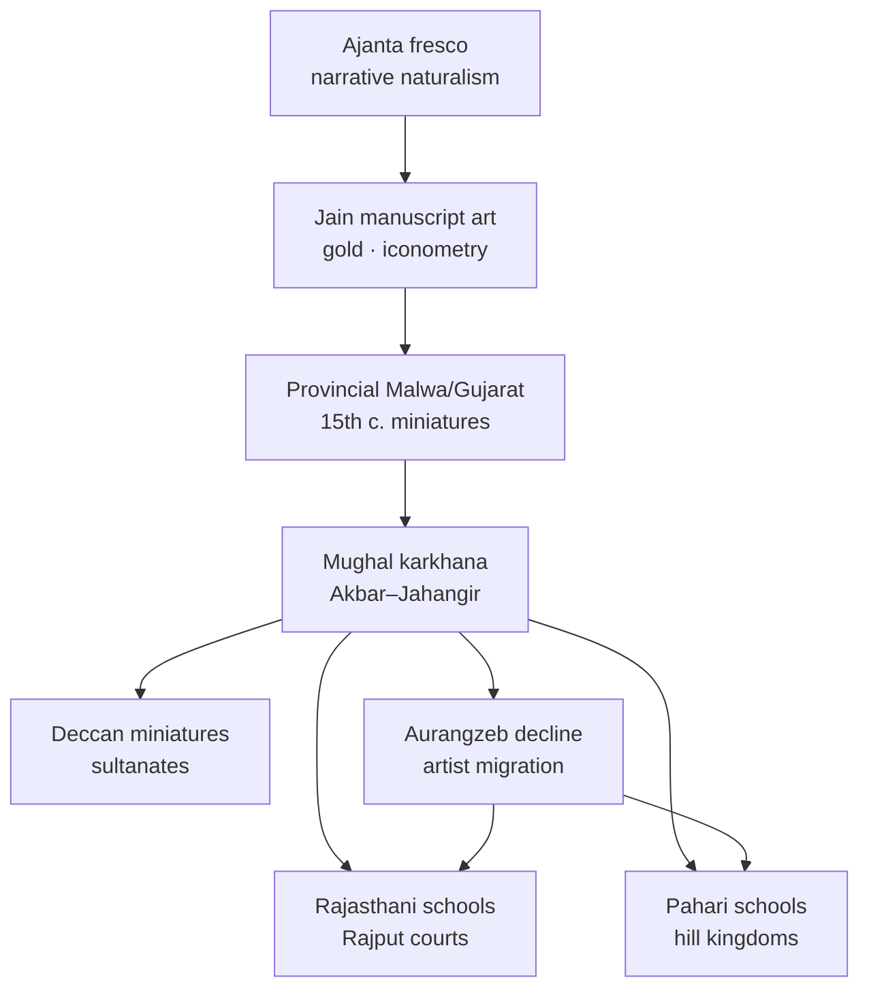

# Medieval Indian Painting

> GS-1 · Topic 01 · Miniature schools — Mughal, Rajasthani, Pahari, Jain

---

## PYQs

| Year | M | Words | Question (EN) | प्रश्न (HI) | ID |
|------|---|-------|---------------|-------------|-----|
| — | 8 | 125 | *Likely:* Describe the main features of Mughal miniature painting. | *संभावित:* मुगल लघुचित्रकला की प्रमुख विशेषताओं का वर्णन कीजिए। | Q1 |
| — | 8 | 125 | *Likely:* Discuss the Rajasthani and Pahari schools of painting. | *संभावित:* राजस्थानी और पहाड़ी चित्र शैलियों की विवेचना कीजिए। | Q2 |
| — | 8 | 125 | *Likely:* Trace the evolution of Indian painting from Ajanta to Mughal and regional schools. | *संभावित:* अजंता से मुगल और क्षेत्रीय शैलियों तक भारतीय चित्रकला के विकास का सिलसिला प्रस्तुत कीजिए। | Q3 |

---

## Quick Revision

```
LINEAGE: Ajanta FRESCO (Gupta-Vakataka, 5th–6th c.) → Jain palm-leaf (8th c.+) → Sultanate provincial (Malwa/Gujarat 15th c.)
  → Mughal karkhana (Akbar–Jahangir peak) → post-Aurangzeb dispersal → Rajasthani + Pahari + Deccan

MINIATURE DEFINITION: Small-scale detailed OPAQUE WATERCOLOUR on PAPER/CLOTH — NOT "small subject only"
  Features: fine brush · profile/portrait · border decoration · manuscript illustration · album (muraqqa)

MUGHAL (imperial court):
  Humayun → Persian masters (Mir Sayyid Ali, Abdus Samad) | Akbar karkhana: Daswant · Basawan · Mansur
  Akbarnama · Baburnama · Mahabharata/Ramayana illustrated | Jahangir: portrait peak · Mansur ANIMALS · foreshortening
  Realism · natural history · European perspective (Portuguese) | Decline Aurangzeb → Rajput courts

RAJASTHANI SCHOOLS (post-Mughal dispersal, 17th–19th c.):
  Mewar (Udaipur) · Marwar (Jodhpur/Bikaner) · Bundi-Kota (Hadoti) · Kishangarh (Bani Thani) · Amber/Jaipur
  Themes: Krishna-Radha · Ragamala · Barahmasa · court · hunting · heroism
  Style: bold colour · decorative landscape · bhakti emotion > Mughal documentary realism
  Fusion: Jain manuscript tradition + local bardic themes + Mughal technique

PAHARI (Himalayan foothills — Himachal, J&K fringe):
  Basohli (bold colour, bold lines, early 18th c.) → Guler (softness, Mughal influence)
  → Kangra (late 18th c. PEAK — lyrical Krishna-Radha, nature, romance)
  Themes: Vaishnav bhakti · Gita Govinda · nature · monsoon · Ragamala
  Artists: Nainsukh · Manaku (familial ateliers)

OTHER: Deccan miniatures (Ahmednagar · Bijapur · Golconda · Hyderabad) — Persian influence, vibrant colour, distinct
JAIN: Kalpasutra · Kalkacharya Katha — marginal paintings, gold, strict Tirthankara iconometry

COMPARE: Mughal = realism/history/portraiture | Rajasthani = heroic/bhakti/bold | Pahari = lyrical/soft/nature

TRAPS: Ajanta = mural fresco NOT miniature | Mughal ≠ only Persian | Rajasthani ≠ one school
  Pahari ≠ Punjab plains only | Kangra = Pahari NOT Rajasthani | Mansur = Mughal NOT Rajasthani
  Miniature ≠ merely tiny size | Deccan ≠ identical to Mughal

CONTEMPORARY: National Museum Delhi · CSMVS Mumbai · NEP 2020 IKS art history · GI craft tags
  Museum digitisation · Kangra/Rajasthani folk revival · Incredible India cultural tourism · ASI manuscript care
```

---

## Content

### Context — evolution of Indian painting

Indian painting history spans **monumental murals** to **court miniatures** — a continuous thread of **narrative, colour, and patronage** adapting to new mediums and political centres.

| Phase | Medium | Period | Hallmarks |
|-------|--------|--------|-----------|
| **Ajanta** | **Fresco** on cave walls | 2nd c. BCE–7th c. CE | Jataka narratives, naturalism, Gupta-Vakataka peak (Caves 1, 2, 16, 17) |
| **Jain manuscripts** | **Palm-leaf**, later paper | 8th c. onward | Marginal miniatures, gold, strict **Tirthankara** iconography |
| **Sultanate provincial** | Paper | 15th c. | **Malwa, Gujarat** — early miniature tradition pre-Mughal |
| **Mughal** | Paper, imperial karkhana | 16th–17th c. | Realism, portraiture, court history, natural history |
| **Rajasthani & Pahari** | Paper, court ateliers | 17th–19th c. | Bhakti themes, Ragamala, post-Mughal dispersal |
| **Deccan** | Paper | 16th–17th c. | Persianate sultanate courts — distinct palette and themes |



### What is miniature painting

- **Miniature painting** = **small-scale, highly detailed painting** on **paper or cloth** — the term refers to **technique and format**, not merely a tiny subject.
- **Opaque watercolour** — pigments mixed with gum arabic; layered washes; fine **squirrel-hair brushes** (single-hair tips for faces).
- Distinguished from **Ajanta mural fresco** by medium (portable paper vs wall plaster) and **court/album patronage** context.
- Common elements: **decorative borders** (floral, gold), **calligraphy**, **profile view** (early), **shaded modelling** (Mughal adds depth and foreshortening).
- Formats: **manuscript illustration** (Akbarnama folios), **album leaf (muraqqa)**, **Ragamala series**, **Barahmasa** (twelve months) sets.

### Mughal miniature painting — detailed features

**Institutional foundation**
- **Humayun** brought **Persian masters** from Safavid court — **Mir Sayyid Ali**, **Abdus Samad** — after exile (**c. 1555**).
- **Akbar** formalised imperial **karkhana** (atelier) — artists of **multiple faiths and regions** recruited by talent.

**Akbar era (1556–1605)**
- Master artists: **Daswant, Basawan, Farrukh Beg, Mukund, Kesu Das, Lal**.
- Major works: **Akbarnama** (historical chronicle of Akbar — battles, court, construction), **Baburnama**, **Hamzanama** (early large-format folios on cloth), Persian translations of **Ramayana** and **Mahabharata**.
- Style: **Narrative crowd scenes**, Indian landscape backgrounds (hills, monsoon clouds), **Indian colour palette** (peacock blue, Indian red, yellow ochre), emerging **three-dimensional modelling** of faces and textiles.
- **Syncretic themes:** Islamic court illustrating Hindu epics — evidence of **composite manuscript culture**.

**Jahangir era (1605–1627) — golden age**
- **Portrait perfection** — named subjects, individual likeness, psychological depth; **Jahangir's own taste** for natural history.
- **Mansur** — supreme **animal and bird painter** (zebra, falcon, chameleon, florals) — scientific observation quality.
- **Bichitr** — self-portraits; European technique experiments.
- **Album tradition (muraqqa)** — collected leaves with exquisite borders; finer brushwork than Akbar period.
- **European influence:** Portuguese Jesuits at Mughal court → **foreshortening**, linear perspective, shading on carpets and thrones.

**Decline and dispersal (Aurangzeb onward)**
- **Aurangzeb** reduced imperial painting patronage → master artists migrated to **Rajput courts** (Amber, Bikaner, Bundi, Mewar) and **Pahari hills** — direct seed of **regional schools**.

### Rajasthani schools of painting

**Origin and character**
- Fusion of **Jain manuscript tradition** (western India), **local bardic and heroic themes**, and **Mughal technique** absorbed after artist dispersal (**late 17th century onward**).
- **Less documentary realism** than Mughal — more **emotion, devotion, decorative landscape, bold colour**.

| Sub-school | Centre | Features |
|------------|--------|----------|
| **Mewar** | Udaipur | Bold colours, heroic themes, **Ragamala**, Krishna lore, **Battle of Haldighati** scenes |
| **Marwar** | Jodhpur, Bikaner | Robust figures, hunting scenes, court processions; strong Mughal influence at Bikaner |
| **Bundi-Kota** | Hadoti region | Lush nature, Krishna-**Bhagavata** themes, fine detail, rich greens |
| **Kishangarh** | Kishangarh (Ajmer district) | **Radha-Krishna** devotion; **Bani Thani** portrait style — elongated features, poetic romance (**Nihal Chand**, Savant Singh patronage) |
| **Amber/Jaipur** | Jaipur | Later Mughal-Rajput blend; court portraits, festivals |

**Common themes:** **Krishna-Radha** lilas, **Barahmasa** (twelve months — seasonal love poetry), **Ragamala** (visualisation of **raga** musical modes as human figures), court processions, hunting, **Pabuji** phad narrative (related folk tradition).

**Style traits:** Vibrant **Indian palette** (orange, ultramarine, gold), decorative stylised trees and architecture, **emotion and bhakti** over Mughal documentary accuracy; **flat or shallow perspective** compared to Mughal depth.

### Pahari (Hills) schools of painting

- **Geography:** **Himalayan foothill** kingdoms — **Basohli** (Jammu), **Guler**, **Kangra**, **Mandi**, **Garhwal**, **Jammu** — not Punjab plains.
- **Patronage:** Hill **rajas** and Vaishnav devotional courts; **Gita Govinda** and **Bhagavata Purana** as dominant textual sources.

**Evolution sequence (exam-critical)**

| Phase | Centre | Style |
|-------|--------|-------|
| **Early bold** | **Basohli** (c. 1700–30) | Intense colour (red, yellow, blue), bold outlines, static figures, strong iconography |
| **Mughal softening** | **Guler** (mid-18th c.) | Softer faces, Mughal modelling influence, refined line |
| **Lyrical peak** | **Kangra** (c. 1770–1810) | Graceful figures, **detailed nature** (trees, streams, monsoon), romantic **Krishna-Radha** — **"Kangra Valley School"** zenith |

**Kangra features (exam favourite)**
- **Soft colours**, graceful elongated figures, **detailed natural settings** — mango trees, lotus ponds, rain clouds.
- Themes from **Jayadeva's Gita Govinda**, **Bhagavata Purana**, **Ragamala**, **Barahmasa**.
- Famous artist families: **Nainsukh**, **Manaku** — linked to **Raja Sansar Chand** of Kangra patronage.
- **Romantic bhakti aesthetics** — divine love mirrored in landscape beauty.

### Deccan and Jain traditions

**Deccan miniatures (16th–17th century)**
- **Ahmednagar, Bijapur, Golconda, Hyderabad** sultanates — **Persian influence**, rich colour, erotic and portrait themes.
- Distinct from Mughal: more **stylisation**, vibrant palette, **simpler backgrounds**, sultanate court costume.
- **Najm al-Din** and Bijapur school — album traditions parallel to Mughal but politically independent.

**Jain miniatures**
- **Kalpasutra**, **Kalkacharya Katha** — western India (**Gujarat, Rajasthan**); marginal paintings on manuscripts.
- **Gold, red, blue** palette; strict **Tirthankara** iconometry — no deviation from canonical proportions.
- Continuity link from **medieval Jain art** to **Rajasthani** colour boldness.

### Comparison — Mughal vs Rajasthani vs Pahari

| Feature | **Mughal** | **Rajasthani** | **Pahari** |
|---------|------------|----------------|------------|
| **Patron** | Imperial Mughal court | Rajput desert/thar courts | Hill rajas (Himachal/Jammu) |
| **Theme** | History, portraiture, nature study | Heroic, Krishna, Ragamala, court | Bhakti romance, Gita Govinda, nature |
| **Style** | Realism, perspective, modelling | Bold, decorative, flat perspective | Lyrical, soft, nature-integrated |
| **Period peak** | Jahangir (1605–27) | 17th–19th c. (Kishangarh 18th c.) | Kangra (late 18th c.) |
| **Key artist** | Mansur, Basawan | Nihal Chand (Kishangarh) | Nainsukh, Manaku |

### Bengal School connection (brief bridge to modern)

- **Late 19th–early 20th century Bengal School** (Abanindranath Tagore, Nandalal Bose) consciously **revived Ajanta line and Mughal-Pahari softness** against academic European realism — shows medieval painting lineage alive in **modern Indian art nationalism** (exam context for "continuity").

### Significance and legacy

- Medieval painting proves **continuity** from Ajanta colour naturalism to **paper miniatures** — not a break but medium shift.
- **Living heritage:** Kangra and Rajasthani styles influence **folk art** (phad, pichwai), **calendar art**, **textile design**, and **contemporary illustration**.
- **UPPCS/Mains angle:** Frequently compares **Mughal vs Rajasthani** or asks **Pahari/Kangra** features; evolution questions span **Ajanta → Mughal → regional**.
- **Manuscript collections:** **National Museum (New Delhi)**, **Chhatrapati Shivaji Maharaj Vastu Sangrahalaya (CSMVS, Mumbai)**, **Government Museum Chennai**, **Indian Museum Kolkata** — national repositories.

### Contemporary relevance

- **NEP 2020 — Indian Knowledge Systems (IKS):** Medieval painting schools integrated into **fine arts, art history, and design curricula** — pigment chemistry (lapis, gold leaf), brush technique, **Ragamala** music-painting interdisciplinarity; links court ateliers to modern **cultural education**.
- **Museum digitisation and access:** **National Museum**, **CSMVS**, **Google Arts & Culture** partnerships — high-resolution **Mughal album** and **Kangra folio** digitisation for global access without handling fragile originals; supports **Incredible India** cultural diplomacy.
- **Constitutional heritage duty:** **Article 51A(f)** — value composite artistic heritage including **Mughal-Rajput-Pahari** traditions; **Article 49** — state protection of cultural institutions and monuments housing collections.
- **Craft revival and GI tags:** **Rajasthani miniature** workshops (Jaipur, Udaipur), **Kangra painting** (Himachal Pradesh **GI tag**) — **Hunar Haat**, **Ek Bharat Shreshtha Bharat** cultural exchanges; medieval idioms sustain **livelihood craft**.
- **Tourism and soft power:** **City Palace Udaipur**, **Mehrangarh Jodhpur**, **Kangra Fort** museum displays — **Swadesh Darshan** cultural circuit infrastructure; **Rajasthani and Pahari** imagery defines global **"Indian miniature"** aesthetic in tourism branding.
- **Conservation science:** **INTACH**, museum **climate-controlled storage**, **pigment analysis** (Raman spectroscopy) on Mughal folios — medieval techniques inform modern **conservation science** (IKS-aligned research).
- **Manuscript care:** Not ASI monuments but **national library/museum** mandate — **Nai Manzil**, **National Mission on Manuscripts** legacy programmes for cataloguing medieval illustrated texts.

### Limits and balanced view

- **Regional labels** simplify diverse workshops — many **artist migrations** (Mughal artists to Bikaner, Guler artists to Kangra) blur rigid school boundaries.
- **Colonial-era Company paintings** (18th–19th c.) = separate **hybrid category** (Indian artists + European patrons) — do not collapse into Mughal or Rajasthani schools.
- **Dating and attribution** often uncertain — "Kangra school" may span workshops across neighbouring states.
- **Aurangzeb decline narrative** is broadly true but **some imperial painting continued** — avoid absolute "Mughal painting ended" trap.

---

## Answers

### Q1: Describe the main features of Mughal miniature painting. (Likely, 8M, 125W)

**Opening:**
> Mughal miniature painting combined Persian manuscript discipline with Indian themes and observation — creating a distinctive court art of realism, historical illustration, and natural history under imperial karkhana patronage.

**Write these points:**
- **Institution:** Imperial **karkhana** from **Akbar**; **Humayun** brought **Persian masters**; artists **Daswant, Basawan, Mansur** from diverse backgrounds.
- **Themes:** **Court life, battles, hunting, Akbarnama, Baburnama**, illustrated **Mahabharata/Ramayana** — documentary and narrative historical painting.
- **Technique:** Fine brushwork, **portraiture** with individual likeness, Indian colours (peacock blue, Indian red), **3D modelling**; Jahangir-era **animal studies** (Mansur).
- **Influence:** Persian miniature format + **Indian palette** + **European foreshortening** (Portuguese Jesuit contact) — depth and scientific observation.
- **Legacy:** Court realism dispersed after **Aurangzeb** — seeded **Rajasthani/Pahari schools**; folios preserved in **National Museum** and global collections today.

**Conclusion:**
> Mughal miniatures remain the most refined court visual archive of medieval India — bridging Persian, Indian, and European techniques into a composite painting tradition.

---

### Q2: Discuss the Rajasthani and Pahari schools of painting. (Likely, 8M, 125W)

**Opening:**
> Rajasthani and Pahari schools flourished after Mughal atelier dispersal — channelling bhakti devotion and regional identity into vibrant miniature traditions distinct from imperial documentary realism.

**Write these points:**
- **Rajasthani:** Multiple courts — **Mewar, Marwar, Bundi-Kota, Kishangarh**; themes **Krishna-Radha, Ragamala, Barahmasa**, hunting and heroism; bold colour, Jain-Mughal fusion; **Bani Thani (Kishangarh)** iconic romantic portrait style.
- **Pahari:** Himalayan foothills — **Basohli** (bold colour/lines) → **Guler** (Mughal softness) → **Kangra** (late 18th c. lyrical peak); **Gita Govinda**, nature, monsoon romance.
- **Artists:** **Nainsukh, Manaku** (Kangra); **Nihal Chand** (Kishangarh) — familial atelier tradition.
- **Contrast with Mughal:** Less documentary realism — more **emotion, devotion, decorative landscape**; shallower perspective, bolder palette.
- **Living heritage:** **Kangra GI tag**, Rajasthani workshops, museum collections — **NEP IKS** and tourism sustain medieval idioms today.

**Conclusion:**
> Together Rajasthani and Pahari painting extended India's miniature heritage beyond the imperial Mughal court into regional bhakti aesthetics that define popular images of Krishna-Radha art.

---

### Q3: Trace the evolution of Indian painting from Ajanta to Mughal and regional schools. (Likely, 8M, 125W)

**Opening:**
> Indian painting evolved from Ajanta's monumental frescoes to paper miniatures under Mughal and Rajput patronage — a continuous thread of narrative richness, colour mastery, and adapting court cultures.

**Write these points:**
- **Ajanta (Gupta-Vakataka murals):** **Fresco** Jataka narratives — naturalism, emotion, mineral pigments on wet plaster — foundation of Indian **colour and figure tradition**.
- **Medieval bridge:** **Jain palm-leaf** manuscripts (gold, iconometry); **Malwa/Gujarat** pre-Mughal miniatures (15th c.) on paper.
- **Mughal phase:** **Akbar–Jahangir karkhana** — realism, portraiture, **Akbarnama**, European perspective; apex under **Jahangir** and **Mansur**.
- **Regional phase:** Post-**Aurangzeb** dispersal → **Rajasthani** (heroic/Krishna/bold) and **Pahari/Kangra** (lyrical bhakti/nature); **Deccan** parallel Persianate schools.
- **Pattern:** Medium shifts **wall → palm-leaf → paper**; patron shifts **monastery → empire → Rajput/hill courts**; themes shift **Buddhist Jataka → court history → bhakti romance**.

**Conclusion:**
> This evolution shows Indian painting adapting to new patrons and mediums while retaining narrative and chromatic brilliance — now preserved through museums, IKS curricula, and living craft revival.

---

### Q4 (Future variant): Compare Mughal and Rajasthani schools of miniature painting. (Likely, 8M, 125W)

**Opening:**
> Mughal and Rajasthani miniature traditions share Persian-derived technique but diverge in patronage, theme, and aesthetic — imperial documentary realism versus Rajput devotional boldness.

**Write these points:**
- **Mughal:** Imperial court; **Akbarnama**, portraits, **Mansur** natural history; **perspective, modelling, foreshortening**; Jahangir golden age.
- **Rajasthani:** Rajput courts post-Mughal dispersal; **Krishna-Radha, Ragamala, Barahmasa**, heroism; **bold flat colour**, decorative landscape.
- **Technique:** Mughal finer **3D modelling**; Rajasthani stronger **line and colour field**, less European perspective.
- **Patron intent:** Mughal = **history and imperial record**; Rajasthani = **bhakti, dharma, regional identity**.
- **Continuity:** Rajasthani artists absorbed **Mughal-trained masters** — synthesis, not isolation.

**Conclusion:**
> The comparison illustrates how one Indo-Persian miniature vocabulary split into imperial realism and regional devotional schools — both now celebrated as composite Indian heritage.

---

## Traps

| Wrong | Correct |
|-------|---------|
| Ajanta = miniature painting | **Fresco mural** on cave walls — miniatures are later on **paper** |
| Mughal painting purely Persian | **Indian artists, themes, colours** (Daswant, Basawan) essential |
| Rajasthani = single uniform style | **Many sub-schools** — Mewar, Marwar, Bundi, Kishangarh, Jaipur |
| Pahari = only Punjab plains | **Himachal/Jammu hill states** — Kangra, Basohli, Guler, Mandi |
| Kangra belongs to Rajasthani school | **Pahari** school — geographically and stylistically distinct |
| Mansur = Rajasthani painter | **Mughal** court artist — famous for **animal/nature** studies |
| Miniature = only small-sized pictures | Means **detailed manuscript/album art tradition** on paper/cloth |
| Deccan painting = Mughal identical | **Separate sultanate** Persianate tradition (Bijapur, Golconda) |
| Basohli is in Rajasthan | **Jammu region** — early Pahari, not Rajput desert school |
| Mughal painting ended completely under Aurangzeb | **Patronage declined**; artists migrated — some court work continued |
| Jain miniatures show Krishna lilas | **Tirthankara** iconometry — strict Jain canonical subjects |
| Ragamala = musical instrument painting | Visualises **raga** (musical modes) as human figures/scenes |
| Bani Thani = Mughal portrait | **Kishangarh school** (Nihal Chand) — Rajput devotional romance |
| Bengal School = medieval school | **Modern** (early 20th c.) revival movement — Abanindranath Tagore |

---

*Complete.*
