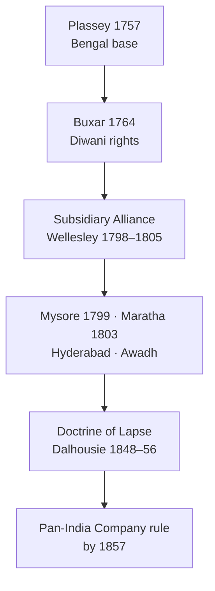
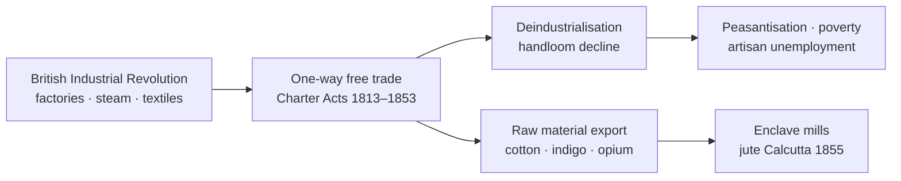

# British Expansion & Economic Impact

> GS-1 · Topic 02 · British conquest (1757–1857), colonial economy, deindustrialisation, drain of wealth

---

## PYQs

| Year | M | Words | Question (EN) | प्रश्न (HI) | ID |
|------|---|-------|---------------|-------------|-----|
| 2020 | 12 | 200 | Discuss the expansion of British rule in India during Governor Generalship of Lord Wellesley. | भारत में गवर्नर जनरल लॉर्ड वेलेजली के काल में ब्रिटिश शासन के प्रसार की विवेचना कीजिए। | Q1 |
| 2019 | 8 | 125 | Critically examine the effects of British Industrial Revolution on India's Economic life. | ब्रिटेन की औद्योगिक क्रांति का भारत के आर्थिक जीवन पर पड़ने वाले प्रभावों का आलोचनात्मक परीक्षण कीजिए। | Q2 |
| 2018 | 12 | 200 | "The spine of Indian Economy was badly injured during the 200 years of British Rule." Explain. | "200 वर्षों के ब्रिटिश शासन ने भारतीय अर्थव्यवस्था का मेरुदंड क्षतिग्रस्त कर दिया था।" व्याख्या कीजिए। | Q3 |

---

## Quick Revision

```
1757 PLASSEY (Clive) → Bengal foothold | 1764 BUXAR → Diwani rights (Bengal, Bihar, Orissa)
1765 DUAL GOVT (Clive) → Company Diwan + Nawab nizamat | 1772–73 famine Bengal

EXPANSION TOOLS:
  Subsidiary Alliance (Wellesley 1798–1805): Nizam 1798 · Mysore 1799 (Tipu) · Awadh 1801 · Peshwa 1802
  Doctrine of Lapse (Dalhousie 1848–56): Satara · Jhansi · Nagpur · Awadh annexed 1856
  Wars: Anglo-Mysore (Hyder/Tipu) · Maratha (Wel. 1803) · Anglo-Sikh (Ranjit Singh heirs) · Afghan

WELLESLEY (1798–1805): Subsidiary Alliance architect | Mysore IV war → Seringapatam 1799
  Maratha defeat 1803 | Ceylon from Dutch | Fort William College 1800

ECONOMIC COLONISATION:
  Permanent Settlement 1793 (Cornwallis, Bengal) → zamindars fixed revenue
  Ryotwari (Munro, Thomas Munro, Madras/Bombay) | Mahalwari (NW provinces)
  Commercialisation of agri → indigo, cotton, opium, jute for export

DEINDUSTRIALISATION: Handloom decline (Dacca muslin, Murshidabad silk) | Charter Act 1813 → one-way free trade
  Manchester cloth floods India post-1820s | Artisans → landless labour

DRAIN OF WEALTH: Dadabhai Naoroji — "Poverty & Un-British Rule" (1901)
  Home charges · salaries · pensions · trade surplus to Britain · no capital reinvestment
  RC Dutt "Economic History of India" (1901–03) — tribute thesis

INDUSTRIAL REVOLUTION IMPACT ON INDIA:
  Britain = factory goods exporter | India = raw material supplier + captive market
  Railways 1853 (Thane) — trade extraction + famine grain export debate
  Tea (Assam 1830s) · jute mills (Calcutta 1855) — enclave modern industry

POSITIVE (limited): Unified market · modern admin · census · codified law · English education (1835 Macaulay)
  Railways/post/telegraph — infrastructure but profit-oriented

CONTEMPORARY: Azadi Ka Amrit Mahotsav · economic nationalism · Atmanirbhar Bharat echo of swadeshi
  Drain debate → post-1947 planning · FDI vs colonial extraction comparison in academia
  Art 49 heritage of colonial buildings (Victoria Memorial, Rajpath) · NEP 2020 critical history

TRAPS: Plassey ≠ full conquest of India | Wellesley ≠ Doctrine of Lapse
  Permanent Settlement ≠ all India | Drain theory ≠ only Naoroji coined phrase
  Railways built for Indian welfare primarily — FALSE (commercial/military)
  Industrial Revolution helped Indian industry — FALSE (deindustrialisation)
```

---

## Content

### Context — from trade to territorial empire (1757–1857)

- **Modern Indian history** in UPPCS begins conventionally with **Battle of Plassey (1757)** — **Robert Clive** defeated **Siraj-ud-Daulah**, Nawab of Bengal — giving the **English East India Company** political foothold in Bengal.
- **Battle of Buxar (1764)** — Company defeated **Mir Qasim, Shuja-ud-Daulah, Shah Alam II**; **Treaty of Allahabad (1765)** granted **Diwani** (revenue collection rights) of Bengal, Bihar, Orissa — Company became **revenue ruler** while retaining Mughal fiction.
- **1765–1857** = phase of **territorial expansion** (subsidiary alliances, wars, annexations) + **economic restructuring** (land revenue systems, one-way trade, deindustrialisation) — foundation of colonial exploitation debated by **Dadabhai Naoroji, Romesh Chunder Dutt, Bipan Chandra**.
- **Exam frame:** UPPCS asks **Wellesley expansion**, **Industrial Revolution impact**, and **200-year economic injury** — all require linking **political conquest tools** to **economic consequences**.

### Political expansion — key phases and instruments

| Phase | Period | Key events / tools |
|-------|--------|-------------------|
| **Bengal foundation** | 1757–1772 | Plassey, Buxar, **Dual Government (1765)**, Bengal famine **1770** |
| **Regulating Act era** | 1773–1793 | **Regulating Act 1773**, Pitt's India Act **1784**, Cornwallis as GG |
| **Wellesley expansion** | 1798–1805 | **Subsidiary Alliance**, Mysore, Maratha, Ceylon |
| **Consolidation** | 1813–1856 | Charter Acts, **Dalhousie's Doctrine of Lapse**, Punjab annexation **1849** |
| **1857 watershed** | 1857 | Revolt → Crown rule **1858** (outside this file's core but contextual) |

**Dual Government (1765–1772)**
- **Clive** arranged **Diwani** for Company, **Nizamat** (police/judicial) nominally with **Nawab** — Company controlled revenue without direct administration responsibility.
- Corruption, revenue maximisation, and **1770 Bengal famine** (estimates **1/3 of Bengal population**) exposed failure — **Warren Hastings** ended dual system **1772**.

**Subsidiary Alliance — Lord Wellesley (1798–1805)**
- Indian ruler accepts **British Resident**, maintains **British subsidiary force** (paid by ruler or ceded territory), **no foreign relations** without British approval — **"controlled independence."**
- **First:** **Nizam of Hyderabad (1798)** — ceded **Northern Circars** for subsidiary.
- **Fourth Anglo-Mysore War (1799):** **Tipu Sultan** killed at **Seringapatam**; **Krishna Raja Wodeyar IV** restored under subsidiary; **Mysore** integrated into Company's security ring.
- **Second Anglo-Maratha War (1803):** Defeated **Daulat Rao Scindia, Raghuji Bhonsle** — **Treaty of Bassein (1802)** with **Peshwa Baji Rao II** made Maratha confederacy subsidiary.
- **Awadh (1801):** Half territory ceded for subsidiary arrears.
- **Fort William College (1800):** Training **Company servants in Indian languages** — admin tool for expanded empire.
- **Ceylon (1796–1805):** Taken from Dutch — Indian Ocean strategic gain.

**Other expansion tools (post-Wellesley, exam context)**
- **Doctrine of Lapse (Dalhousie):** Annex if ruler died without **natural heir** — **Satara (1848), Jhansi, Nagpur, Sambalpur**; **Awadh (1856)** on misgovernance plea — major grievance before **1857**.
- **Anglo-Sikh Wars:** After **Ranjit Singh (d. 1839)**, Punjab annexed **1849** — **Dalhousie**.
- **Anglo-Afghan, Sind, Burma** campaigns extended frontiers — strategic buffer and revenue.



### Lord Wellesley — expansion in detail (PYQ core)

- **Richard Colley Wellesley** — Governor-General **1798–1805**; brother of **Duke of Wellington**; most aggressive expansionist before **Dalhousie**.
- **Strategic vision:** Eliminate **French influence** in India (post-French Revolutionary wars); create **buffer ring** around British territories; make **Company supreme power**.
- **Subsidiary Alliance** = his master instrument — reduced Indian states to **protected dependencies** without immediate full annexation (cheaper than direct rule initially).
- **Military campaigns:**
  - **Fourth Anglo-Mysore War (1798–99):** **Tipu Sultan** allied with French; fell at **Seringapatam (4 May 1799)**; large territory to **Madras Presidency**.
  - **Second Anglo-Maratha War (1803–05):** **Assaye (1803)** victory; **Treaty of Deogaon, Surji-Anjangaon** — Maratha power broken in north and central India.
  - **Carnatic, Tanjore, Surat** — brought under closer control.
- **Administrative legacy:** **Fort William College (1800)** for **Persian, Sanskrit, Bengali, Hindi, Marathi, Telugu** — produced trained intermediaries; **College of Fort St George (1816)** followed in Madras.
- **Criticism:** Subsidiary payments **bankrupted** princely states (Awadh debt); ** militarisation** of politics; expansion overstretched Company finances — recalled **1805**.
- **Significance:** By **1805**, British paramountcy in **Deccan, Mysore, and much of Maratha land** established — **not yet Punjab or Awadh annexation**, but **political hegemony** clear.

### Land revenue systems — restructuring agrarian India

| System | Introduced by | Region | Features | Consequences |
|--------|---------------|--------|----------|--------------|
| **Permanent Settlement (1793)** | **Lord Cornwallis** | Bengal, Bihar, parts of Orissa, Madras (later) | **Zamindars** as permanent proprietors; **fixed revenue** forever | Zamindar landlordism; peasant insecurity; some zamindars became loyal gentry |
| **Ryotwari** | **Thomas Munro, Alexander Read** | Madras, Bombay, Assam | Direct settlement with **ryot (cultivator)**; periodic revision | Peasant bore risk; commercial crops pushed |
| **Mahalwari** | **Holt Mackenzie (1819)**; revised under **Dalhousie** | NW Provinces, Punjab, parts of Central India | Revenue from **village/mahal** collectively | Village headmen as intermediaries |

- **Common thread:** Maximise **land revenue** for Company/British treasury; convert agriculture to **export-oriented commercialisation** — **indigo (Champaran, Bihar)**, **cotton, opium (Malwa-Bengal to China)**, **jute, tea (Assam plantations from 1830s)**.
- **Indigo revolt (1859–60)** and later **Champaran (1917)** show **planter-peasant tension** rooted in colonial commercial agriculture.

### British Industrial Revolution and India's economic life

**What was the Industrial Revolution (Britain)?**
- From **late 18th century** — **steam engine (James Watt)**, **textile machinery (Spinning Jenny, Power Loom)**, factory system, coal-iron complex — Britain became **"workshop of the world"** by **mid-19th century**.

**Impact on India — critical dimensions**

| Channel | Mechanism | Indian effect |
|---------|-----------|---------------|
| **One-way free trade** | **Charter Act 1813** ended Company trade monopoly; **1833/1853** further opened; **low tariffs** in India | **Machine-made British textiles** undersold Indian handlooms |
| **Deindustrialisation** | Manchester/Lancashire **mass production** | Decline of **Dacca muslin, Murshidabad silk, Surat textiles**; weavers impoverished |
| **Raw material drain** | India supplies **cotton, jute, indigo, wheat** cheap | Indian agriculture **skewed to export**; food security weakened |
| **Capital goods absent** | Investment in **railways, ports, plantations** — not Indian-owned industry | **Enclave industrialisation** — **jute mills (1855 Rishra/Calcutta)**, later cotton mills Bombay |
| **Market captive** | India = **major export destination** for British manufactures | **Destruction of handicraft sector** — **"deindustrialisation thesis"** (Amiya Bagchi, Morris D. Morris debate) |

- **1813 Charter Act:** Allowed **private British traders** in India; missionary activity permitted — ideological + economic opening.
- **1833 Charter Act:** Company lost commercial functions; became **pure administrative body**; **Macaulay's Minute (1835)** — English education for clerical class serving colonial economy.
- **1853 Charter Act:** **Competition** for Indian Civil Service introduced (after 1853, exams in London then India).

**Railways (from 1853 — contextual for long-term impact)**
- **First train:** Bombay–Thane **1853**; by **1880s** extensive network.
- **Official justification:** Market integration, famine relief.
- **Nationalist critique (RC Dutt, Naoroji):** Built with **Indian capital/revenue**, **British guaranteed profits**, facilitated **raw material export** and **grain movement during famines** (e.g. **1876–77 Deccan, 1896–97** debates).

**Positive effects (for balanced "critical examine" answers)**
- **Modern infrastructure:** Post, telegraph (**1850s**), ports, partial **administrative unification**.
- **New merchant class:** **Parsi, Marwari, Bhatia** traders in opium, cotton export.
- **Limited industrial start:** Jute, cotton mills — though **foreign-owned or comprador capital** dominated late 19th century.



### "Spine of Indian economy injured" — colonial exploitation thesis

**What "merudand" (spine) means in exam answers:**
- India's **self-sufficient rural-urban economy** with strong **handicrafts + agriculture** was **systematically weakened** — not accidental but **structural outcome** of colonial policy.

**Key injury mechanisms**

1. **Deindustrialisation**
   - **Dhaka muslin** and **Bengal textiles** lost global and domestic markets to **British mill cloth** after **1820s–40s**.
   - **William Bentinck (1830s):** Report noted **weavers' distress**; **export of Indian textiles** fell dramatically while **imports of British cotton piece goods** rose (statistics in **RC Dutt** — e.g. import value escalation mid-19th century).

2. **Drain of wealth (tribute)**
   - **Dadabhai Naoroji** — **"Poverty and Un-British Rule in India" (1901)**; **drain theory**: substantial portion of India's wealth transferred to Britain without **equivalent return**.
   - Components: **Home charges** (India paid for British office in London), **salaries/pensions** of British officials, **interest on railway debt**, **trade surplus** appropriated, **"gentlemen capitalism"** profits.
   - **Romesh Chunder Dutt** — **"The Economic History of India" (1901–03)** documented **high land revenue + export of food/raw materials** during **famines**.

3. **Impoverishment of peasantry**
   - **High revenue demand** under Permanent Settlement/Ryotwari; **commercial crops** over food; **moneylender-trader** dominance — **debt bondage**.
   - **Recurring famines** — **1770 Bengal, 1876–77 Deccan, 1896–97** — grain exported while peasants starved (nationalist historiography emphasis).

4. **Destruction of Indian merchant-manufacturer link**
   - Pre-colonial **samanvaya** between **artisan, merchant, ruler patronage** broken; Indian traders became **agents of British firms** in many cases.

5. **Finance imperialism**
   - **Sterling area** control; Indian **gold/silver** drained; **exchange rate manipulation** debates in early Congress.

**Historiographical balance (for "critical" answers)**
- **Nationalist school (Naoroji, Dutt, Bipan Chandra):** Colonialism = primary cause of underdevelopment.
- **Revisionist (Morris D. Morris, Tirthankar Roy):** Internal structural limits + global market integration; some productivity gains.
- **Exam strategy:** Accept **substantial injury** with **specific examples**; acknowledge **infrastructure/enclave industry** as **limited, non-Indian-controlled** benefits.

### Significance — why this subtopic matters

- Explains **roots of Indian poverty** debated in **early Congress (1885+)** — economic nationalism preceded political mass nationalism.
- **Swadeshi (1905)** and **Gandhi's khadi (1920s)** directly respond to **deindustrialisation** legacy.
- **Post-1947 planning (Nehru, Mahalanobis)** — **import substitution industrialisation** as reversal of colonial free-trade dependency.
- **UP relevance:** **Awadh annexation**, **Champaran indigo**, **UP zamindari** under Permanent Settlement extensions — link to peasant movements.

### Contemporary relevance

- **Azadi Ka Amrit Mahotsav (2021–2025):** Government narrative emphasises **200 years of colonial struggle** + **economic self-reliance legacy** — connects to **drain/deindustrialisation** themes in public history and **ICHR/NCERT** discourse.
- **Atmanirbhar Bharat (2020):** Policy language echoes **swadeshi/self-reliance** — exam-useful parallel to colonial **import dependency** critique (not identical policy, but **historical continuity** argument).
- **NEP 2020 — Indian Knowledge Systems (IKS):** Encourages **critical study** of colonial economic history alongside indigenous craft traditions — **handloom GI tags, Khadi and Village Industries Commission (KVIC)** as **living response** to mill-cloth dominance.
- **Constitutional heritage:** **Article 49** — state protects monuments including **colonial-era public buildings** (Victoria Memorial Kolkata, India Gate) as **heritage**, debated as **memory sites** of empire; **Article 51A(f)** — value composite heritage including **freedom struggle economic dimension**.
- **Academic/policy debate:** **WTO/trade openness vs protection** revisits **Charter Act free-trade** history; **Railway heritage (UNESCO Mountain Railways)** — dual narrative of **integration vs extraction**.
- **Tourism/economy:** **Swadesh Darshan / PRASAD** heritage circuits include **colonial-era sites** (Kolkata, Murshidabad, Seringapatam) — **heritage economy** reframes former extraction centres.
- **Archives:** **National Archives of India**, **British Library India Office Records** — primary source for **drain of wealth** research; digitisation aids **book-free** exam preparation.

### Limits and balanced view

- **Do not claim** India had uniform industrial modernity pre-1757 — **regional variations**; Mughal decline preceded full colonial impact.
- **Railways/famine link** — evidence strong for **market integration enabling export** but **not sole cause** of famine mortality (crop failure, admin failure also).
- **Drain quantification** — Naoroji's figures **debated**; direction of transfer **accepted broadly** by nationalist historians, **disputed in magnitude** by some economists.
- **Wellesley** expanded empire but **did not annex all subsidiary states** — distinction from **Dalhousie annexationism**.
- **Positive legacy** (English law, census, unified market) benefited **colonial administration first** — Indian access **unequal and delayed**.

---

## Answers

### Q1: Discuss the expansion of British rule in India during Governor Generalship of Lord Wellesley. (2020, 12M, 200W)

**Opening:**
> Lord Wellesley (1798–1805) transformed the East India Company from a dominant regional power into the paramount authority over much of India through the Subsidiary Alliance and decisive wars against Mysore and the Marathas.

**Write these points:**
- **Subsidiary Alliance:** Indian rulers kept titular power but accepted **British troops, Residents, and loss of foreign policy** — **Nizam (1798)** first; model for **indirect control**.
- **Fourth Anglo-Mysore War (1799):** Defeat and death of **Tipu Sultan** at **Seringapatam**; large Mysore territory absorbed — removed **French-aligned rival** in south.
- **Second Anglo-Maratha War (1803–05):** **Treaty of Bassein (1802)** with **Peshwa**; victories over **Scindia and Bhonsle** — Maratha confederacy subordinated; British hegemony in **central and western India**.
- **Awadh (1801)** territory ceded for subsidiary dues; **Ceylon** secured; **Fort William College (1800)** strengthened administrative grip over expanded domains.
- **Significance:** By 1805, **Hyderabad, Mysore, much of Maratha land** under Company paramountcy — foundation for later **Dalhousie annexations** and **1857 empire**.

**Conclusion:**
> Wellesley's expansion was less about immediate annexation than creating a ring of dependent states — yet it decisively made the Company the supreme political power in India before 1857.

---

### Q2: Critically examine the effects of British Industrial Revolution on India's Economic life. (2019, 8M, 125W)

**Opening:**
> Britain's Industrial Revolution (late 18th–19th century) integrated India into an imperial economic order as a supplier of raw materials and consumer of factory goods — with devastating consequences for indigenous industry.

**Write these points:**
- **One-way free trade** after **Charter Acts (1813, 1833)** — **low Indian tariffs**; **Manchester textiles** flooded markets, **underselling handlooms** (Dacca muslin, Bengal weavers).
- **Deindustrialisation:** Mass **artisan unemployment** and **peasantisation** — Indian economy shifted from **balanced craft-agriculture** to **colonial agrarian export**.
- **Commercial agriculture:** **Indigo, cotton, opigo, tea, jute** grown for **British industry/consumption** — food security and peasant debt weakened.
- **Limited enclave industry:** **Jute mills (1855 Calcutta)** etc. emerged but **foreign/comprador capital** dominated — not broad-based Indian industrialisation.
- **Critical balance:** **Railways, ports, telegraph** aided market integration but primarily served **extraction and British profit** (Naoroji, RC Dutt).

**Conclusion:**
> The Industrial Revolution's impact on India was asymmetric — modern infrastructure without sovereign industrial development, structurally injuring India's handicraft "spine" while binding it to imperial trade.

---

### Q3: "The spine of Indian Economy was badly injured during the 200 years of British Rule." Explain. (2018, 12M, 200W)

**Opening:**
> Two centuries of colonial rule (c. 1757–1947) dismantled India's self-reliant pre-colonial economic structure through deindustrialisation, heavy land revenue, and systematic drain of wealth to Britain.

**Write these points:**
- **Deindustrialisation:** Decline of **textile centres (Dhaka, Murshidabad, Surat)** after **British mill cloth imports** post-1820s — weavers impoverished; **"injured spine"** = destroyed craft-manufacturing backbone.
- **Exploitative land revenue:** **Permanent Settlement (1793), Ryotwari, Mahalwari** — high extraction; **commercial crops** prioritised over food; peasant debt to **moneylenders**.
- **Drain of wealth:** **Dadabhai Naoroji** and **RC Dutt** documented **tribute** via **Home charges, salaries, pensions, trade surplus** — capital not reinvested in Indian industry.
- **Famines and export:** **1770, 1876–77, 1896–97** — grain and raw material **export during scarcity** exposed colonial priorities (nationalist historiography).
- **Structural dependency:** India reduced to **raw material appendage** of British economy — **Charter Act free trade** prevented protective industrialisation until late nationalist pressure.
- **Limited counterpoints:** **Railways, unified market, English education** brought partial modernisation — but **subordinate to imperial interest**, not balanced national development.

**Conclusion:**
> The metaphor of an injured "merudand" captures how colonialism crippled indigenous production and drained surplus — laying the economic foundations for poverty that nationalist movements and post-1947 planning sought to reverse.

---

### Q4: *Likely:* Analyse the role of Charter Acts (1813, 1833, 1853) in transforming India's economic relationship with Britain. (Future variant, 8M, 125W)

**Opening:**
> The Charter Acts progressively opened India to private British trade and ended the Company's commercial monopoly — legally embedding the one-way economic integration that followed Britain's Industrial Revolution.

**Write these points:**
- **1813:** End of Company **trade monopoly** (except China tea/opium); **Indian tariffs kept low** — British manufactures entered freely.
- **1833:** Company lost **commercial functions** entirely; became **administrative ruler**; opened path for **British private capital** in plantations, trade.
- **1853:** Further **liberalisation**; **competitive ICS** — strengthened **bureaucratic** not **Indian industrial** capacity.
- Combined effect: India as **captive market + raw material source** without **protective industrial policy**.
- **Congress critique later:** **Economic nationalism** demanded **tariff autonomy** — achieved only post-1947.

**Conclusion:**
> Charter Acts institutionalised free-trade imperialism — the legal complement to deindustrialisation described by Naoroji and Dutt.

---

## Traps

| Wrong | Correct |
|-------|---------|
| Battle of Plassey (1757) gave British direct rule over all India | Plassey gave **Bengal foothold**; pan-India empire evolved over **a century** |
| Wellesley introduced Doctrine of Lapse | **Doctrine of Lapse = Lord Dalhousie (1848–56)**; Wellesley used **Subsidiary Alliance** |
| Permanent Settlement applied to all of India | **Cornwallis 1793 — mainly Bengal/Bihar/Orissa**; **Ryotwari (Madras/Bombay), Mahalwari (North)** elsewhere |
| Subsidiary Alliance meant immediate annexation | Rulers kept **titular sovereignty** but lost **defence and foreign policy** |
| Industrial Revolution modernised Indian industry broadly | Caused **deindustrialisation of handlooms**; limited **enclave mills** only |
| Railways were built primarily for Indian welfare | Built for **military, admin, and commercial extraction**; Indian capital with **guaranteed British profits** |
| Drain of wealth theory invented by Gandhi | Formulated by **Dadabhai Naoroji**; documented by **RC Dutt** — Gandhi came later |
| Tipu Sultan defeated in Third Anglo-Mysore War | **Fourth Anglo-Mysore War (1799)** — Seringapatam |
| Charter Act 1813 strengthened Indian tariff protection | It **opened India** to British private trade — **weakened** indigenous industry |
| Dual Government was successful admin reform | **1765–1772 failure** — led to famine and Hastings' reforms |
| Buxar (1764) only a military battle | Led to **Diwani rights (1765)** — revenue foundation of empire |
| British land revenue systems protected peasant rights | High **fixed/extractable revenue** — peasant distress, commercial crop coercion |
| 200-year injury claim has no scholarly support | **Nationalist historiography strongly supports**; magnitude **debated** but structural harm **widely accepted in UPPCS answers** |

---

*Complete.*
