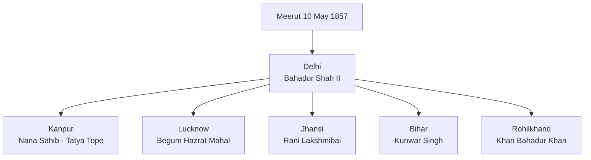
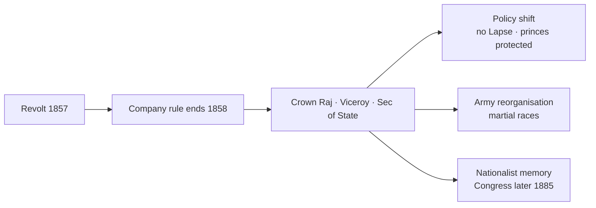

# Revolt of 1857

> GS-1 · Topic 02 · Uprising of 1857 — causes, centres, leaders, ideology, turning point

---

## PYQs

| Year | M | Words | Question (EN) | प्रश्न (HI) | ID |
|------|---|-------|---------------|-------------|-----|
| 2023 | 12 | 200 | Underline ideological dimensions of the uprising of 1857. | 1857 के स्वतंत्रता संग्राम के वैचारिक आयामों की रेखांकित कीजिए। | Q1 |
| 2018 | 12 | 200 | "Revolt of 1857 was a turning point in Indian History". Analyse. | "1857 का विद्रोह भारतीय इतिहास में एक निर्णायक मोड़ था।" विश्लेषण कीजिए। | Q2 |

---

## Quick Revision

```
1857 = UPRISING / REVOLT / FIRST WAR OF INDEPENDENCE (Savarkar 1909)
  Trigger: Meerut 10 May → Delhi 11 May (Bahadur Shah II proclaimed)
  Spread: Delhi · Kanpur · Lucknow · Jhansi · Bareilly · Bihar · Assam fringes

CAUSES:
  Military: Enfield greased cartridges (cow/pig fat rumour) · Barrackpore Mangal Pandey (29 Mar 1857)
  Religious: Missionary activity · Religious Disabilities Act 1850 · interference in customs
  Political: Doctrine of Lapse (Dalhousie) · Awadh annexed 1856 · Mughal humiliation · Subsidiary Alliance
  Economic: Land revenue · taluqdars displaced (Awadh) · peasant-artisan distress · deindustrialisation

CENTRES & LEADERS:
  Delhi — Bahadur Shah II · Bakht Khan · General Bakht Khan (Fatehpuri mosque HQ)
  Kanpur — Nana Sahib · Tatya Tope · Azimullah Khan
  Lucknow — Begum Hazrat Mahal · Birjis Qadr
  Jhansi — Rani Lakshmibai (d. Gwalior 1858) · joined by Tatya Tope
  Bihar — Kunwar Singh (Jagdispur, 80+ age)
  Bareilly — Khan Bahadur Khan · Banaras — Maulvi Ahmadullah Shah
  Faizabad — Maulvi Ahmadullah · Rohilkhand — Fazl-e-Haq Khairabadi

BRITISH SUPPRESSION: Delhi recaptured Sep 1857 (John Nicholson died) · Lucknow 1858 · Jhansi fell ·
  Gwalior June 1858 · Kunwar Singh died Apr 1858 · Bahadur Shah exiled Rangoon (d. 1862)

IDEOLOGICAL DIMENSIONS:
  Restorationism: Bahadur Shah as symbol — NOT modern nationalism but Mughal-Indian sovereignty
  Hindu-Muslim unity: joint fight at Delhi, Lucknow — "unity in adversity" (limited, regional)
  Anti-foreign / anti-Christian missionary · anti-British rule — NOT anti-modernity uniformly
  Peasant-talukdar-grievance · military sepoy identity · regional kings (Nana, Begum, Rani)
  NO unified programme · NO all-India organisation · NO post-1857 economic ideology

TURNING POINT:
  End of Company rule → Govt of India Act 1858 (Crown rule) · Queen's Proclamation Nov 1858
  Doctrine of Lapse withdrawn · Religious non-interference pledged · Indian rulers protected
  Army reorganisation: British ratio increased · recruitment from "martial races" (Punjab, Gurkha)
  Racial arrogance ↑ · ICS · Railways/telegraph expansion · Congress only 1885 (28 yrs later)

HISTORIOGRAPHY:
  British: "Sepoy Mutiny" (law-and-order) | Nationalist: V.D. Savarkar "First War of Independence"
  R.C. Majumdar: limited + not planned national revolt | S.B. Chaudhuri / Bipan Chandra: broader than mutiny

CONTEMPORARY: 1857 memorials · Red Fort museum · Azadi Ka Amrit Mahotsav · Art 49/51A(f)
  NEP 2020 critical history · UP sites: Lucknow Residency · Jhansi fort · Meerut

TRAPS: 1857 ≠ planned national independence war (exam nuance) | NOT all India participated
  Cartridge ONLY cause — FALSE | Savarkar ≠ contemporary leader | Bahadur Shah ≠ active organiser
  Unity ≠ permanent communal harmony thesis | Lapse ended AFTER 1857 | Rani ≠ only woman leader
```

---

## Content

### Context — what was the Revolt of 1857

- The **Revolt of 1857** (also called **Sepoy Mutiny, Uprising of 1857, First War of Independence**) was a **major armed rebellion** against the **English East India Company** — May 1857 to mid-1858 — spanning **north and central India** with limited spread elsewhere.
- **Conventional dates:** **10 May 1857** — sepoys at **Meerut** marched to **Delhi**; **11 May** — **Bahadur Shah II** proclaimed as symbolic head; suppression largely complete by **June 1858** (**Gwalior**).
- **UPPCS relevance:** UP had **critical centres** — **Lucknow (Awadh), Kanpur, Delhi, Bareilly, Faizabad**; questions ask **ideological dimensions** and **turning-point analysis** — requires **causes + leaders + consequences + historiography**.

### Immediate trigger and military origins

**Greased cartridges and Barrackpore**
- New **Enfield rifle** cartridges (1857) rumoured greased with **cow and pig fat** — offensive to **Hindu and Muslim sepoys**.
- **Mangal Pandey** — **34th Native Infantry, Barrackpore (29 March 1857)** — attacked British officers; hanged **8 April 1857** — early martyr symbol.
- **85 sepoys** of **19th Native Infantry, Meerut** — court-martialled **9 May 1857** for refusing cartridges; released comrades **10 May**, killed British officers, marched to **Delhi**.

**Why sepoys led but others joined**
- Sepoys = **socially mobile peasant-artisan** class with **grievances** beyond cartridges — **pay, foreign service (General Service Enlistment Act 1856)**, loss of **bhatta** (allowances), caste rules violated (**crossing seas**).
- Rebellion **generalised** when **civil population** (talukdars, peasants, dispossessed rulers' followers) saw opportunity to settle scores with **Company rule**.

### Causes — political, economic, religious, military

| Dimension | Specific grievances | Examples |
|-----------|---------------------|----------|
| **Political** | Annexation, lapse, humiliation of princes | **Awadh annexed 1856** (Dalhousie); **Jhansi** under Doctrine of Lapse; **Nana Sahib** denied pension; **Mughal** threatened by **House of Delhii extinction plan (1856)** |
| **Economic** | Revenue extraction, land loss, artisan decline | **Permanent Settlement** stress; **Awadh taluqdars** displaced by **Summary Settlement**; **deindustrialisation** (link to colonial economy file) |
| **Religious** | Missionary activity, legal interference | **Religious Disabilities Act 1850**; **Christian missionaries** protected; fear of **conversion**; **cow protection** sentiment |
| **Military** | Cartridges, caste, service conditions | **Enfield cartridges**; **General Service Enlistment Act 1856** (overseas posting); low pay vs **European soldiers** |

**Doctrine of Lapse and Awadh — political fuse**
- **Dalhousie (1848–56)** annexed **Satara, Jhansi, Nagpur, Sambalpur** under **Doctrine of Lapse** (no natural heir).
- **Awadh annexed February 1856** on **misgovernance** charge — displaced **talukdars and nawabi elite** — **Lucknow** became major rebel hub under **Begum Hazrat Mahal**.
- **Mughal succession** — Company ordered **Bahadur Shah II** to choose heir excluding **Zehan Shah** — perceived attack on **dynastic legitimacy**.

### Spread — centres, leaders, and character



**Regional leadership table (exam must-know)**

| Centre | Leader(s) | Significance |
|--------|-----------|--------------|
| **Delhi** | **Bahadur Shah II**, **Bakht Khan** (from Bareilly) | Symbolic **Mughal sovereignty**; **Bakht Khan** organised sepoy-civil administration |
| **Kanpur** | **Nana Sahib** (Peshwa heir), **Tatya Tope**, **Azimullah Khan** | **Wheeler entrenchment** siege; **Bibighar massacre** (contested accounts); guerrilla phase after fall |
| **Lucknow** | **Begum Hazrat Mahal**, **Birjis Qadr** | **Awadh** resistance; **Residency** siege; talukdar-peasant coalition |
| **Jhansi** | **Rani Lakshmibai** | Annexation grievance; died fighting **17 June 1858** at **Kotah-ki-Serai, Gwalior** |
| **Bihar** | **Kunwar Singh** (Jagdispur) | **Landlord-national** symbol; **80+ years**; wounded, died **26 April 1858** |
| **Bareilly/Rohilkhand** | **Khan Bahadur Khan** | Mughal prince lineage claim; **Shahjahanpur** operations |
| **Faizabad/Ayodhya belt** | **Maulvi Ahmadullah Shah** | **Ulama** leadership; anti-British **jihad** idiom in some accounts |
| **Assam (limited)** | **Kandapareshwar Singh, Maniram Dewan** | Localised; **Maniram Dewan** executed |

**Participation limits (balanced view)**
- **Strong:** **Gangetic plain, Awadh, Rohilkhand, parts of Central India, Bihar, Delhi region**.
- **Weak/absent:** **Punjab** (recently annexed, **Sikh chiefs sided with British** — **John Lawrence**), **Sind**, most of **south India**, **eastern Bengal**, **Bombay Presidency** largely quiet.
- **Not a coordinated all-India war** — **regional grievances** with **Delhi Mughal symbol** as loose umbrella.

### Course of revolt and British suppression

**Delhi**
- Rebels held **Red Fort** area; **Bahadur Shah** nominal head.
- **Siege of Delhi (June–September 1857)** — **John Nicholson** led assault; **Delhi fell 20 September 1857**; Nicholson died; **Bahadur Shah** captured.

**Kanpur**
- **June–July 1857** — Nana Sahib's forces besieged **Wheeler's entrenchment**; after British surrender, **Bibighar killings** — British reprisals extremely brutal (**Collectors' accounts**).

**Lucknow**
- **Residency** besieged; **Henry Lawrence** died; **relief columns** (Havelock, Outram, **Campbell**); city finally recaptured **March 1858**.

**Jhansi and Gwalior**
- **Rani Lakshmibai** captured **Gwalior** with **Tatya Tope**; British under **Hugh Rose**; Rani killed **June 1858**; **Gwalior fell**.

**Guerrilla phase**
- **Tatya Tope** — **guerrilla warfare** till **April 1859** (captured, executed).
- **Kunwar Singh**, **Maulvi Ahmadullah** — mobile resistance until death.

**British brutality and policy shift**
- **Collective punishment**, **village burning**, **blowing from guns** — deepened **racial divide**.
- Suppression cost Company ** legitimacy** — led to **transfer of power to Crown**.

### Ideological dimensions of 1857 (PYQ core)

**What "ideological" means in UPPCS answers:** Not fully developed **modern nationalism** (as post-1885 Congress), but **ideas, symbols, and motivations** that gave the revolt meaning beyond a simple army mutiny.

| Ideological strand | Content | Evidence / limits |
|--------------------|---------|-------------------|
| **Restoration of indigenous sovereignty** | **Bahadur Shah II** as **Badshah-e-Hind** — restore **Mughal-Indian political order** pre-Company dominance | **Delhi manifestos**; **coinage in Bahadur Shah's name**; **not democratic nationalism** |
| **Hindu-Muslim unity (conjunctural)** | Joint participation of **Hindu sepoys, Muslim talukdars, ulama, rajas** at **Delhi, Lucknow, Kanpur** | **Bakht Khan + Mughal court**; **Begum + talukdars**; unity **tactical, regional** — not permanent ideological programme |
| **Anti-foreign / anti-Company rule** | Opposition to **British paramountcy**, **annexations**, **missionary protection** | **Anti-British** clear; **not uniformly anti-modern technology** (some rebels used firearms, telegraph awareness) |
| **Religious idiom** | **Cow protection**, **Islamic legitimacy** (fatwas in some areas), fear of **Christianisation** | **Maulvi Ahmadullah**, **Fazl-e-Haq Khairabadi** (Deobandi scholar, exiled); **religious language ≠ communal war against Hindus** |
| **Feudal-bureaucratic restoration** | **Talukdars** (Awadh), **dispossessed princes** (Nana, Rani, Kunwar Singh) sought **old order** | **Socially conservative** — not peasant revolution; **no land redistribution ideology** |
| **Sepoy identity and honour** | **Caste, religion, military honour** — cartridges as insult to **dharma/imaan** | Trigger phase; **General Service Enlistment** — **overseas service** violated **caste pollution** fears |
| **Regional patriotism** | **Awadh**, **Jhansi**, **Maratha Peshwa claim** — localised loyalties | **Nana Sahib** = Peshwa legacy; **Begum** = Awadh autonomy |

**What 1857 ideology was NOT (exam nuance)**
- **Not** **secular modern nationalism** in **1885+ Congress** sense — no **democratic constitution**, **swaraj programme**, or **mass organisation**.
- **Not** unified **"India"** consciousness everywhere — **regional and restorationist** themes dominated.
- **Not** purely **religious war** — **Hindu-Muslim cooperation** in major centres contradicts simplistic communal framing.

**Historiographical labels as ideology debate**
- **British official:** **"Sepoy Mutiny"** — military breach of discipline; deny broader ideology.
- **V.D. Savarkar (1909):** **"The Indian War of Independence 1857"** — nationalist **ideological reclamation**.
- **R.C. Majumdar:** **Limited in extent and planning** — caution against over-nationalist reading.
- **S.B. Chaudhuri / Bipan Chandra:** **More than mutiny** — **anti-colonial** character with **multi-class participation**.

### Why 1857 was a turning point (PYQ core)

**1. End of Company rule — Crown Raj begins**
- **Government of India Act 1858** — Company dissolved; **Secretary of State for India** (British cabinet); **Governor-General** becomes **Viceroy**.
- **Queen Victoria's Proclamation (1 November 1858)** — read by **Lord Canning** at **Allahabad** — promised **non-annexation**, **religious non-interference**, **equal protection**, **Indian entry into administration** (gradual).

**2. Change in British Indian policy**

| Pre-1857 (Company) | Post-1857 (Crown) |
|--------------------|-------------------|
| **Doctrine of Lapse** active | **Lapse abolished** — princely states stabilised as **buffer** |
| Aggressive annexation (Awadh) | **Paramountcy** over **protected states** — indirect rule emphasis |
| Missionary zeal perceived | **Cautious religious neutrality** pledged (partially observed) |
| Indian army mixed | **Army reorganisation** — **"martial races" theory**; **Punjab/Gurkha** recruitment ↑; **Bengal/Brahmin** recruitment ↓ |

**3. Racial and administrative hardening**
- **"White mutiny" fears** ended — British **racial arrogance** increased; **Whites-only** certain spheres; **ICS** (though exams opened later in practice slowly).
- **1861 Councils Act** — tiny Indian nominated presence — **not democracy**, but **new constitutional track**.

**4. Economic and infrastructural acceleration**
- **Railways, telegraph, postal expansion** — **control and integration** after rebellion (Delhi–Calcutta telegraph restored for military use during revolt).
- **Canals in Punjab**, **forest laws** — **colonial state strengthening**.

**5. Seeds of future nationalism (indirect)**
- **Memory of martyrs** — **Mangal Pandey, Rani Lakshmibai, Kunwar Singh, Tatya Tope** — folklore and **nationalist canon** (1880s onward).
- **NOT immediate Congress** — **Indian National Congress founded 1885** — **28 years later**; 1857 **did not produce** lasting **national organisation**.
- **Peasant and tribal revolts** continued — **Indigo 1859–60, Deccan Riots 1875** — **anti-colonial stream** separate but linked thematically.

**6. UP/ regional legacy**
- **Awadh talukdars** partly **rehabilitated** by British post-1857 to **pacify** region — changed **land politics**.
- **Lucknow, Jhansi, Meerut** — **heritage memorials** today.



### Significance — short and long term

- **Short term:** Failed militarily — **British victory**; **massive reprisals**; **Mughal dynasty ended** (**Bahadur Shah exiled to Rangoon**, died **1862**).
- **Long term:** **Structural transformation** of **colonial state** — from **expanding Company merchant-state** to **imperial Crown bureaucracy**; **princely state system** formalised; **nationalist historiography** made 1857 **foundational martyrdom narrative**.
- **UPPCS synthesis:** Turning point = **political (Crown rule) + military (army policy) + ideological (anti-colonial memory)** — **not** turning point because India became free in **1858**.

### Contemporary relevance

- **Azadi Ka Amrit Mahotsav (2021–2025):** Government commemorations highlight **1857 heroes** — **Rani Lakshmibai, Mangal Pandey, Kunwar Singh** — in **school curricula, exhibitions, Amar Chitra Katha-style public history**.
- **1857 memorials & museums:** **Red Fort (Delhi)** — **1857 museum**; **Lucknow Residency** (ASI); **Jhansi Fort**; **Meerut** — **Shaheed Smarak**; **Art 49** protection of these **heritage sites**.
- **Article 51A(f):** Citizen duty to value **freedom struggle heritage** — **1857** as **first major pan-regional anti-colonial upsurge** in nationalist pedagogy.
- **NEP 2020 — critical history:** Encourages **multi-perspective study** — **mutiny vs war of independence** debate taught **without single textbook dogma**; **Indian Knowledge Systems** alongside **colonial archive critique**.
- **UP tourism:** **Swadesh Darshan / PRASAD** circuits include **Awadh, Jhansi, Meerut** — **heritage economy** linked to **1857 narrative**.
- **Debate on unity:** **1857 Hindu-Muslim cooperation** cited in **contemporary secular nationalism** discourse — historians caution **context-specific**, not **permanent communal harmony model**.
- **Digital archives:** **National Archives of India**, **British Library India Office** — **Mutiny records** digitised for research.

### Limits and balanced view

- **Extent:** **Not all-India** — **Punjab, south, most of east** largely unaffected; avoid **" entire country rose"** trap.
- **Planning:** **No central command** after **Bakht Khan's Delhi effort** — **regional pockets**.
- **Social character:** **Elite-led restoration** with **mass participation** — **not peasant socialist revolution**.
- **Unity:** **Hindu-Muslim cooperation real but limited** — **post-suppression communal recruitment policy** changed army composition.
- **Outcome:** Rebels **lost** — turning point is in **British policy and nationalist memory**, **not immediate freedom**.
- **Women:** **Rani Lakshmibai, Begum Hazrat Mahal** prominent — but **overall patriarchal military culture**.

---

## Answers

### Q1: Underline ideological dimensions of the uprising of 1857. (2023, 12M, 200W)

**Opening:**
> The Revolt of 1857 was not a mere military mutiny but expressed layered ideologies — restoration of indigenous sovereignty, religious honour, anti-foreign rule, and conjunctural Hindu-Muslim unity — even though it lacked modern nationalist organisation.

**Write these points:**
- **Restorationist sovereignty:** Proclamation of **Bahadur Shah II** as **Badshah-e-Hind** — ideology of **restoring pre-Company Indian political order**, not republican nationalism.
- **Anti-colonial / anti-Company:** Resistance to **annexations (Awadh, Jhansi)**, **Doctrine of Lapse**, **subsidiary humiliation** — **Nana Sahib, Begum Hazrat Mahal, Rani Lakshmibai** fought for **dispossessed indigenous authority**.
- **Religious idiom:** **Greased cartridges**, **missionary activity**, **Religious Disabilities Act 1850** — revolt framed as defence of **dharma/imaan**; **Maulvi Ahmadullah**, **Fazl-e-Haq Khairabadi** used **Islamic legitimacy** in some regions.
- **Hindu-Muslim unity (tactical):** Joint sepoy-civil struggle at **Delhi, Lucknow, Kanpur** — **Bakht Khan** and Mughal court; **talukdar-Muslim-Hindu coalitions in Awadh** — unity **against British**, not a permanent secular programme.
- **Sepoy honour and caste:** **General Service Enlistment Act 1856**, pay, **foreign service** — **military self-respect** ideology among **peasant-soldiers**.
- **Limits:** **No unified manifesto**, **regional loyalties** (Awadh, Maratha, Jhansi) dominated; **Savarkar's "War of Independence"** is **later nationalist reading** — **R.C. Majumdar** cautions on **extent and planning**.

**Conclusion:**
> Ideologically, 1857 combined restorationist, religious, and anti-colonial strands with remarkable but regional Hindu-Muslim cooperation — a precursor spirit to later nationalism, not yet modern mass ideology.

---

### Q2: "Revolt of 1857 was a turning point in Indian History". Analyse. (2018, 12M, 200W)

**Opening:**
> The Revolt of 1857 failed militarily but fundamentally altered India's colonial trajectory — ending Company rule, reshaping British policy, army structure, and nationalist memory.

**Write these points:**
- **Political turning point:** **Government of India Act 1858** — **Company rule ended**; **British Crown** direct rule; **Viceroy + Secretary of State for India** — new **imperial administrative system**.
- **Queen's Proclamation (1858):** **Doctrine of Lapse withdrawn**, pledge of **non-annexation of states**, **religious non-interference** — **princely states** integrated as **subordinate allies** (new paramountcy system).
- **Military reorganisation:** Indian army restructured — **"martial races" recruitment** (Punjab, Gurkha); reduced **Bengal/Brahmin** sepoys; **British racial distrust** hardened after mutiny.
- **State strengthening:** Post-1857 expansion of **railways, telegraph, canals, forest laws** — **colonial control infrastructure** accelerated.
- **Nationalist memory:** Martyrs **Mangal Pandey, Rani Lakshmibai, Kunwar Singh, Tatya Tope** became **freedom struggle icons** — **Savarkar (1909)** called it **First War of Independence**; **Congress (1885)** came later but drew on **1857 legacy**.
- **Limits of "turning point":** **Not independence** — British rule **deepened** for **90 more years**; revolt **not all-India**; **immediate outcome** was **stronger empire**.

**Conclusion:**
> 1857 marks the decisive transition from Company mercantile expansion to Crown imperialism and planted anti-colonial memory — a turning point in colonial structure and nationalist consciousness, not in immediate liberation.

---

### Q3: *Likely:* Discuss the causes of the Revolt of 1857. (Future variant, 12M, 200W)

**Opening:**
> The Revolt of 1857 erupted from accumulated political, economic, religious, and military grievances under Company rule — with the greased cartridge incident as trigger, not sole cause.

**Write these points:**
- **Political:** **Doctrine of Lapse**, **Awadh annexation (1856)**, **Jhansi**, denial of **Nana Sahib's pension**, threat to **Mughal succession**.
- **Economic:** **Land revenue systems**, **Awadh talukdar displacement**, **peasant indebtedness**, **deindustrialisation** — artisan and rural distress.
- **Religious:** **Missionary activity**, **Religious Disabilities Act 1850**, fear of **conversion** and **interference in customs**.
- **Military:** **Enfield cartridges**, **General Service Enlistment Act 1856**, pay and caste violations — **Mangal Pandey (March 1857)**, **Meerut (May 1857)**.
- **Immediate spark:** **85 sepoys Meerut** → **Delhi 11 May** — **Bahadur Shah** proclaimed.

**Conclusion:**
> Multi-causal in origin, 1857 expressed a crisis of legitimacy of Company rule across classes and regions of north India — far exceeding a simple sepoy mutiny.

---

### Q4: *Likely:* Evaluate the role of Rani Lakshmibai and Begum Hazrat Mahal in the Revolt of 1857. (Future variant, 8M, 125W)

**Opening:**
> Rani Lakshmibai of Jhansi and Begum Hazrat Mahal of Awadh embodied regional resistance led by dispossessed indigenous rulers — women who became national icons of 1857.

**Write these points:**
- **Rani Lakshmibai:** Jhansi annexed under **Doctrine of Lapse**; refused submission; captured **Gwalior** with **Tatya Tope**; died fighting **June 1858** — symbol of **defiance and military leadership**.
- **Begum Hazrat Mahal:** Led **Awadh** resistance after **Nawab exiled**; proclaimed **Birjis Qadr**; held **Lucknow** with **talukdar support**; exiled to **Nepal** after defeat.
- **Significance:** Both transformed **personal/dynastic grievance** into **mass anti-British movements** in their regions.
- **Limit:** **Regional**, not **all-India command**; post-1857 **British gendered and racial policies** still patriarchal.

**Conclusion:**
> Their roles prove 1857 was broader than sepoy mutiny — yet remained rooted in restorationist regional politics later canonised by nationalist memory.

---

## Traps

| Wrong | Correct |
|-------|---------|
| 1857 was a planned national war of independence across all India | **Regional uprising** — strong in **north/central**; **Punjab largely pro-British**; **not fully coordinated** |
| Greased cartridges were the only cause | **Trigger**, not sole cause — **annexations, revenue, religion, army policies** accumulated |
| Savarkar led the 1857 revolt | **Savarkar wrote in 1909** — **retrospective nationalist interpretation** |
| Bahadur Shah II actively planned the revolt | **Sepoys proclaimed him** at Delhi — he was **reluctant symbolic head** |
| Revolt succeeded in ending British rule | **British won by 1858** — outcome was **Crown rule**, not freedom |
| Doctrine of Lapse continued after 1857 | **Withdrawn** in **Queen's Proclamation 1858** |
| 1857 had modern secular nationalism like Congress | **Restorationist + religious + anti-Company** — **not 1885-style nationalism** |
| Hindu-Muslim unity in 1857 proves permanent communal harmony | **Conjunctural alliance** against British — **do not overgeneralise** |
| Mangal Pandey rebelled at Meerut | **Barrackpore, 29 March 1857** — Meerut was **10 May 1857** |
| Rani Lakshmibai was the only woman leader | Also **Begum Hazrat Mahal** and others — **multiple women leaders** |
| Transfer of power to Crown meant democracy for Indians | **Imperial bureaucracy** — **1861 Councils** had **nominal Indian presence only** |
| Entire Indian army mutinied | **Many regiments stayed loyal** — especially **Punjab, Gurkha** units |
| 1857 immediately led to Indian National Congress | **Congress founded 1885** — **28 years later** |

---

*Complete.*
