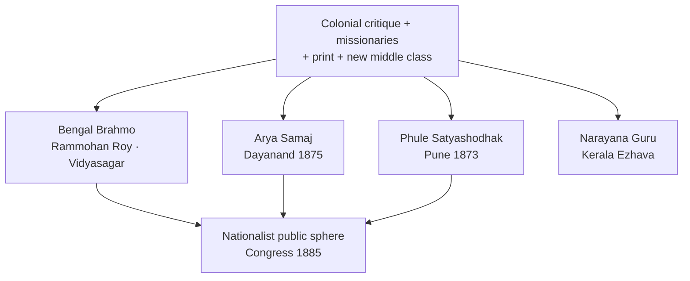
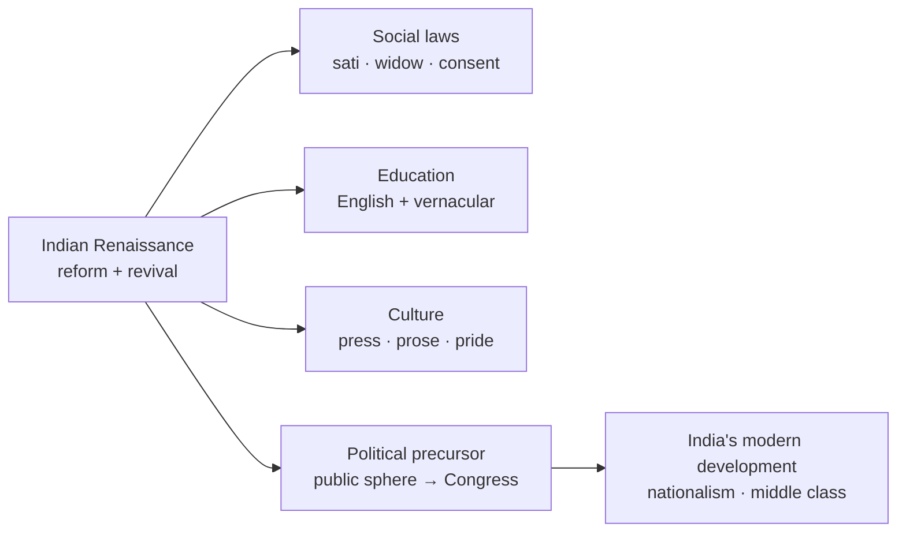

# Socio-Religious Reform Movements

> GS-1 · Topic 02 · 19th-century reform, Indian Renaissance, women, caste, education

---

## PYQs

| Year | M | Words | Question (EN) | प्रश्न (HI) | ID |
|------|---|-------|---------------|-------------|-----|
| 2025 | 8 | 125 | "Women's issue was a major concern in the socio-religious reform movements of 19th century India". Explain. | "उन्नीसवीं शताब्दी के भारतीय सामाजिक-धार्मिक सुधार आंदोलनों में महिलाओं के मुद्दे एक प्रमुख चिंता का विषय थे"। स्पष्ट कीजिए। | Q1 |
| 2021 | 12 | 200 | How did Indian Renaissance Movement of 19th Century help in the development of India? Describe. | 19वीं सदी के भारतीय पुनरुद्धार आंदोलन ने भारत के विकास में किस प्रकार सहयोग दिया? वर्णन कीजिए। | Q2 |

---

## Quick Revision

```
19th C REFORM = response to COLONIAL CRITIQUE + MISSIONARIES + INTERNAL CRISIS
  Colonial: "Oriental despotism, sati, child marriage, idolatry" | Internal: caste rigidity, purdah, illiteracy
  NOT one movement — Brahmo · Arya Samaj · Prarthana · Ramakrishna-Vivekananda · Aligarh · Sikh/Nanak panth reform

INDIAN RENAISSANCE (c.1800–1900): Bengal leads → spreads west/south
  Features: Rationalism · monotheism · vernacular press · English-educated elite · revival + reform dialectic
  Raja Rammohan Roy (1772–1833): Brahmo Samaj 1828 · sati abolition 1829 · Vedantic monotheism
  Ishwar Chandra Vidyasagar: Widow Remarriage Act 1856 · Bengali prose · girls' schools
  Swami Dayanand Saraswati: Arya Samaj 1875 · "Back to Vedas" · shuddhi · women's education
  Jyotirao Phule: Satyashodhak Samaj 1873 · anti-Brahmin · girls' school with Savitribai 1848
  Sri Narayana Guru (Kerala): caste equality · "One caste, one religion, one God"
  Syed Ahmad Khan: Aligarh — modern education (separate file 03.3) · social reform limited

WOMEN'S ISSUES — REFORM AGENDA:
  Sati (1829 Reg V) · widow remarriage (1856 Bengal Act, Vidyasagar) · child marriage opposition
  Purdah/zenana · female infanticide · education ( Bethune School 1849 · SNDT · Arya Kanya pathsalas)
  Age of Consent Act 1891 (Rukhmabai case) · legal property rights limited
  Women as agents: Savitribai Phule · Pandita Ramabai · Sarojini Naidu (later) · Tarabai Shinde "Stri Purush Tulana" 1882

CAUSES OF REFORM:
  British utilitarian critique (Macaulay, Benthamites) · Christian missionaries · Orientalist rediscovery
  Print culture (Samachar Darpan 1818) · railways/telegraph · 1857 aftermath caution on religious interference
  New middle class — bhadralok, Parsi, Marathi intelligentsia

CONTRIBUTION TO INDIA'S DEVELOPMENT:
  Social: humanised customs · legal abolitions · education spread · caste challenge (Phule, Guru)
  Cultural: Bengali/Marathi/Gujarati prose · theatre · historical consciousness
  Political precursor: public sphere · nationalist critique · unity symbols (not yet mass Congress)
  Economic: technical/modern education · merchant reformists (Parsi)

LIMITS: Elite-led · partial geography · women "protection" not full equality · caste reform uneven
  Revivalism (Arya Samaj shuddhi) also had exclusionary side · no peasant land reform

CONTEMPORARY: NEP 2020 Beti Bachao · Article 15 · anti-sati law legacy · widows' rights
  ICHR/NCERT reform narratives · Art 51A(e) dignity of women · UNESCO intangible (Baul, Vedic chant parallel)

TRAPS: Renaissance ≠ European copy | Roy ≠ abolished sati alone (Bentinck + law)
  Reform ≠ all India same time | Arya Samaj ≠ Brahmo (Vedic revival vs monotheism)
  Women issue central BUT patriarchal reform frame | Phule ≠ Brahmo Samaj
```

---

## Content

### Context — what were 19th-century socio-religious reform movements

- **Socio-religious reform movements** (c. **1800–1900**) = organised efforts by **Indian intellectuals, religious leaders, and social activists** to **critique and change** Hindu, Muslim, Sikh, and Parsi social practices — partly in response to **British colonial critique**, **Christian missionary activity**, and **internal social crisis** (caste, gender, ritual excess).
- Often called **Indian Renaissance** or **Indian awakening** — **not identical to European Renaissance** but denotes **intellectual regeneration**, **rational religion**, and **social modernisation** within Indian frameworks.
- **Geography:** Started strongly in **Bengal (Calcutta)** — spread to **Bombay, Pune, Madras, Punjab, Kerala, UP** — **uneven timing and character**.
- **UPPCS frame:** Questions ask **women's issues in reforms** and **contribution to India's development** — need **leaders, laws, limits, and legacy to nationalism**.

### Causes — why reform arose in 19th century

| Cause | Mechanism | Examples |
|-------|-----------|----------|
| **Colonial critique** | British administrators/utilitarians attacked **"superstition"** — **sati, thagi, infanticide** | **William Bentinck**, **Lord William Bentinck's sati abolition 1829**; **Rammohan Roy** petition |
| **Missionary activity** | Christian proselytisation + **schools/hospitals** challenged Hindu-Muslim orthodoxy | **Serampore missionaries (Carey)**, **Alexander Duff** — provoked **defensive reform** |
| **Orientalist rediscovery** | **William Jones, Asiatic Society (1784)** — Sanskrit/Persian texts → **pride + selective revival** | **Dayanand's "Back to Vedas"**; **Brahmo monotheism from Upanishads** |
| **New middle class** | **English education (Macaulay 1835)**, **legal profession, print** | **Bhadralok**, **Parsi reformers (Dadabhai Naoroji, Naoroji, Malabari)** |
| **Print culture** | Vernacular newspapers, tracts | **Samachar Darpan (1818)**, **Sambad Kaumudi (Rammohan Roy)** |
| **Post-1857 caution** | Crown pledged **religious non-interference** — **Indians took lead** in social legislation | **Widow Remarriage Act 1856**, **Age of Consent 1891** — Indian campaign + British law |

### Major reform movements and leaders

| Movement / leader | Founded | Region | Key ideas & work |
|-------------------|---------|--------|------------------|
| **Raja Rammohan Roy** | **Brahmo Samaj (1828)** | Bengal | **Monotheism**, anti-idolatry, **anti-sati** (1829), **freedom of press**, Persian/Arabic + Sanskrit scholarship |
| **Debendranath Tagore, Keshab Chandra Sen** | Brahmo Samaj phases | Bengal | Rational religion; **Keshab** — more radical social reform, **Brahmo Marriage Act 1872** |
| **Ishwar Chandra Vidyasagar** | Personal + institutional | Bengal | **Widow Remarriage Act 1856** campaign; **Bengali prose**, **Sanskrit College reform**, **girls' schools** |
| **Swami Dayanand Saraswati** | **Arya Samaj (1875)** | Punjab/North | **"Go back to Vedas"**, **shuddhi**, **cow protection**, **women's education**, **Dayanand Anglo-Vedic schools** |
| **Prarthana Samaj** | **1867** (Atmaram Pandurang) | Bombay | Moderate theistic reform — **Ranade, Gopal Hari Deshmukh ("Lokhitwadi")** |
| **Jyotirao Phule + Savitribai Phule** | **Satyashodhak Samaj (1873)** | Pune | **Anti-caste**, **Shudra-Ati-Shudra uplift**, **India's first girls' school (1848, Savitribai)**, *Gulamgiri* (1873) |
| **Sri Narayana Guru** | **SNDP / Aruvippuram (1888)** | Kerala | **"One caste, one religion, one God"** — **Ezhava** dignity against caste oppression |
| **Ramakrishna — Vivekananda** | **Ramakrishna Mission (1897)** | Bengal | **Practical Vedanta**, **social service**, **religious unity**, **Chicago 1893** |
| **Syed Ahmad Khan** | **Aligarh Movement (1875 MAO College)** | North | **Modern Muslim education**, **Urdu journal Tahzib-ul-Akhlaq** — social reform **limited** (see 03.3 file) |
| **Parsi reform** | Rahnumai Mazdayasnan | Bombay | **Parsi marriage/ inheritance reform**, women's education |



### Women's issues — central concern of reform (PYQ core)

**Why women became a reform focus**
- Colonial and missionary discourse singled out **sati, child marriage, purdah, female illiteracy, infanticide** as evidence of **"backwardness"** — Indian reformers **internalised and contested** this critique on **their own terms** (scriptural reinterpretation + humanity).
- Reformers argued **true religion/civilisation** required **dignity for women** — but often within **patriarchal "protection" frame**, not full **gender equality**.

**Key women's issues and reform responses**

| Issue | Pre-reform practice | Reform action | Leader / law |
|-------|---------------------|---------------|--------------|
| **Sati** | Widow immolation | Campaign + legislation | **Rammohan Roy** petition; **Bengal Sati Regulation 1829** (Bentinck) |
| **Widow remarriage** | Social ban, penury | Legalisation campaign | **Vidyasagar** — **Widow Remarriage Act 1856** (Ishwar Chandra Vidyasagar) |
| **Child marriage** | Early marriage norm | Agitation, legal age | **Age of Consent Act 1891** (raised age to 12); **Behramji Malabari** campaign; **Rukhmabai case (1884–88)** |
| **Female education** | Exclusion from schools | Girls' schools, curricula | **Savitribai Phule (1848)**, **Bethune School Calcutta (1849)**, **Arya Kanya Pathshala**, **Pandita Ramabai's Sharada Sadan (1889)** |
| **Purdah / zenana** | Seclusion | **Zenana education**, medical visits | **Ramabai**, **Cornelia Sorabji** (first woman advocate), Brahmo women's meetings |
| **Infanticide (especially female)** | Killing of infant girls | Awareness, regulation | **Female Infanticide Prevention Acts** (1870s, Punjab/Bombay) |
| **Property / legal rights** | Limited | Partial gains | **Married Women's Property Act 1874** (British India); **Hindu inheritance debates** later |
| **Domestic patriarchy** | Stri subordination | Literary critique | **Tarabai Shinde** — *Stri Purush Tulana* (1882, Marathi) — early feminist text |

**Women as reformers (not just objects)**
- **Savitribai Phule** — **India's first woman teacher** (Pune girls' school **1848** with **Jyotirao Phule**); fought **caste-gender double oppression**.
- **Pandita Ramabai** — Sanskrit scholar; **widows' home Sharada Sadan**; **Mukti Mission**; challenged **scriptural patriarchy**.
- **Tarabai Shinde** — **Maharashtra** — radical critique of **male hypocrisy** after **Vijayalakshmi suicide case**.
- **Keshab Chandra Sen** — promoted **women's education** in Brahmo Samaj; **Brahmo Marriage Act** — consent-based marriage idea.
- **Dayanand Saraswati** — **Arya Samaj** supported **female education**, opposed **child marriage** (scriptural arguments in *Satyarth Prakash*).

**Limits of women's reform (balanced exam view)**
- **Elite-led** — benefits reached **upper castes first** (Brahmo, Parsi women before peasant masses).
- **Reform ≠ feminism** — goal often **"ideal Hindu/Muslim womanhood"** educated but **domestic**, not political equality until **20th century** (Sarojini Naidu, **Women's India Association 1917**).
- **Muslim women** — **Aligarh** focused **male education**; **Begum Rokeya** (Bengal, early 20th) beyond core 19th century but shows **parallel struggle**.
- **Legal change ahead of social change** — **1856 Widow Remarriage Act** rarely implemented in villages for decades.

### Indian Renaissance — nature and features

**What historians mean by "Indian Renaissance"**
- Period of **intellectual and social regeneration** — **rational critique of tradition**, **recovery of classical texts**, **vernacular literary flowering**, **new ethics of social service**.
- **Dual character:** **Reform** (change evil customs) + **Revival** (pride in ancient heritage) — e.g. **Brahmo monotheism** vs **Dayanand's Vedic revival** vs **Vivekananda's neo-Hinduism**.

**Salient features**

| Feature | Manifestation |
|---------|---------------|
| **Rational religion** | Monotheism, anti-superstition — **Roy, Brahmo Samaj, Prarthana Samaj** |
| **Scriptural reinterpretation** | Sati not sanctioned; Vedas support education — **Roy, Dayanand, Phule (anti-Brahmanic reading)** |
| **Vernacular literature** | **Bengali prose (Vidyasagar)**, **Marathi satire (Phule)**, **Gujarati reform tracts** |
| **Education modernisation** | **English + vernacular**, **scientific outlook**, **female schools** |
| **Press and associations** | **Samaj/sabha** model — voluntary organisation pre-Congress |
| **Caste critique** | **Phule, Narayana Guru, Arya Samaj shuddhi** — uneven, sometimes exclusionary |
| **Inter-religious dialogue** | **Ramakrishna's experiments**, **Roy's Persian/Islamic scholarship** |

**Comparison — reform vs revival emphasis**

| Stream | Emphasis | Example |
|--------|----------|---------|
| **Reformist-modernist** | Change society via reason + law | **Brahmo Samaj, Vidyasagar, Phule** |
| **Revivalist-reformist** | Purify religion from later corruption | **Arya Samaj — Dayanand** |
| **Neo-Hindu synthesis** | Universal Vedanta + social service | **Vivekananda, Ramakrishna Mission** |
| **Communal-modernist (Muslim)** | Modern education within Islamic identity | **Aligarh — Syed Ahmad Khan** |

### How Renaissance helped India's development (PYQ core)

**1. Social development — humanising society**
- **Legal abolitions and campaigns:** **Sati (1829)**, **widow remarriage (1856)**, **infanticide laws**, **Age of Consent (1891)** — reduced **extreme forms of gender violence**; created **precedent for social legislation**.
- **Caste challenge:** **Phule's Satyashodhak Samaj**, **Narayana Guru's temple entry (Aruvippuram 1888)**, **Arya Samaj shuddhi** — **weakened rigid orthodoxy** in regions (though **shuddhi also communalised** later).
- **Public health/education ethos:** **Mission-style service** adapted by **Ramakrishna Mission**, **Brahmo schools**.

**2. Cultural and intellectual development**
- **Vernacular modern prose** — **Bengali, Marathi, Tamil, Gujarati** — enabled **mass communication** later used by **nationalism**.
- **Historical consciousness:** Reformers rediscovered **Ashoka, ancient science** — foundation for **later nationalist pride** (not yet full **history writing** like **Bankim Chandra**).
- **Scientific temper seeds:** **Rationalism against miracles** — **Brahmo Samaj**, **Prarthana Samaj**; **Parsi embrace of Western science**.

**3. Political and national development (precursor)**
- **Public sphere before Congress:** Reform associations trained **petitioning, press debate, platform oratory** — **Roy's political liberalism**, **Ranade's moderation**.
- **Unity symbols:** **Vivekananda's Chicago address (1893)** — **Hinduism as world religion** boosted **self-confidence**; **Brahmo universalism**.
- **Economic nationalism roots:** **Dadabhai Naoroji, G.V. Joshi** linked from **social reform to drain of wealth** — bridge to **Congress economic critique**.
- **NOT direct independence movement** — most reformers **loyal to British rule** early ( **Roy, Syed Ahmad Khan** ) — **political nationalism separate phase post-1885**.

**4. Educational development**
- **Spread of schools:** **Hindu College (1817)**, **Presidency**, **Phule schools**, **DAV schools**, **Aligarh** — created **Indian middle class** that led **national movement and modern professions**.
- **Women's education** — expanded **female literacy** slowly; **teachers like Savitribai** — **human capital** for 20th century.

**5. Legal-administrative modernisation (Indian demand)**
- Reformers used **British courts and statutes** to **codify change** — model for later **Gandhian legal satyagraha** and **constitutionalism**.



### Significance and legacy

- **Without 19th-century reform**, **nationalist mass mobilisation** would lack **social base** — **Congress (1885)** inherited **educated elite, press, partial women's awakening**.
- **Constitution later (1950)** — **anti-untouchability (Art 17)**, **gender equality (Art 14–15)** — **long arc from reform campaigns** (though **Ambedkar** brought **radical Dalit perspective** beyond upper-caste reform).
- **Regional diversity:** **Bengal Brahmo**, **Punjab Arya Samaj**, **Maharashtra Phule**, **Kerala Guru** — **composite Indian modernity**, not single blueprint.

### Contemporary relevance

- **Constitutional rights:** **Article 15** prohibits discrimination including **sex**; **Article 21** dignity — legal descendants of **19th-century social legislation** trajectory.
- **Article 51A(e):** Fundamental duty to **renounce practices derogatory to women** — echoes **anti-sati, anti-infanticide** reform logic in **citizen ethics**.
- **Beti Bachao Beti Padhao (2015):** Continues **female education/infanticide prevention** themes — **Savitribai Phule, Vidyasagar** cited in **government campaigns**.
- **NEP 2020:** **Gender inclusion, girls' education, Indian knowledge + critical history** — teaches **reform movements** as **foundation of modern India** without **uncritical glorification**.
- **Anti-sati laws:** **Commission of Sati (Prevention) Act 1987** — **1829 abolition** remains **living legal precedent**; **Roop Kanwar case (1987, Rajasthan)** shows **unfinished reform agenda**.
- **Widow rights:** **Maintenance laws, pension schemes** — trace to **1856 Widow Remarriage** and **Ramabai's widow homes**.
- **ICHR / museums:** **Rammohan Roy, Phule, Vivekananda** memorials — **Azadi Ka Amrit Mahotsav** highlights **social reformers as freedom precursors**.
- **Art 49 / heritage:** **Brahmo Samaj buildings, Arya Samaj halls, Phule wada Pune** — **local heritage tourism** (Maharashtra, Bengal circuits).

### Limits and balanced view

- **Elite bias:** **Bhadralok, Chitpavan, upper castes** dominated — **Dalit women** largely outside Brahmo/Arya benefits until **Ambedkarite movement**.
- **Geographic gaps:** **North-east, tribal belts, much of rural UP** — **minimal direct reform penetration** in 19th century.
- **Revivalism's dark side:** **Arya Samaj shuddhi** later fed **communal politics**; **Dayanand's anti-idolatry** hurt **popular Hinduism** relations.
- **Colonial partnership:** Many reforms **needed British law** — **reformers not revolutionaries**; **Syed Ahmad Khan** opposed **Congress nationalism**.
- **Women's gains partial:** **Legal change > social change**; **purdah, dowry, labour exploitation** persisted — **20th-century feminism** needed.

---

## Answers

### Q1: "Women's issue was a major concern in the socio-religious reform movements of 19th century India". Explain. (2025, 8M, 125W)

**Opening:**
> Nineteenth-century socio-religious reform movements placed women's condition at the centre of their agenda — responding to colonial critique and internal patriarchal customs through legislation, education, and scriptural reinterpretation.

**Write these points:**
- **Issues targeted:** **Sati, widow ban, child marriage, purdah, female infanticide, illiteracy** — seen as obstacles to a **rational, humane society**.
- **Key campaigns/laws:** **Rammohan Roy** — anti-sati → **Regulation 1829**; **Vidyasagar** — **Widow Remarriage Act 1856**; **Age of Consent Act 1891** after **Malabari/Rukhmabai** agitation.
- **Women's education:** **Savitribai Phule (1848 girls' school)**, **Bethune School (1849)**, **Pandita Ramabai's Sharada Sadan (1889)**, **Arya Kanya pathsalas** — **Dayanand, Brahmo Samaj** supported learning.
- **Women as agents:** **Savitribai, Ramabai, Tarabai Shinde (*Stri Purush Tulana* 1882)** — not passive recipients but **writers, teachers, organisers**.
- **Limit:** Reform framed as **"protection" within patriarchy** — **legal gains** (sati, widow marriage) **outran village custom**; **full equality** came later.

**Conclusion:**
> Women's issues were indeed a major reform concern — producing landmark social laws and education experiments that laid groundwork for later constitutional gender equality, though within elite and patriarchal limits.

---

### Q2: How did Indian Renaissance Movement of 19th Century help in the development of India? Describe. (2021, 12M, 200W)

**Opening:**
> The 19th-century Indian Renaissance — a cluster of socio-religious reform and intellectual awakening movements — helped modernise Indian society, culture, and public life, creating foundations for nationalism and constitutional India.

**Write these points:**
- **Social development:** Campaigns abolished or restricted **sati (1829)**, legalised **widow remarriage (1856)**, combated **infanticide**, raised **age of consent (1891)** — **humanised social relations**.
- **Caste and equality:** **Jyotirao Phule (Satyashodhak Samaj)**, **Sri Narayana Guru (Kerala)**, **Arya Samaj** challenged **Brahmanical orthodoxy** — expanded **social justice discourse**.
- **Education and middle class:** **Schools, colleges** (Hindu College, **DAV**, **Aligarh**, Phule schools) — **English + vernacular** literacy created **modern professionals** and **nationalist leadership**.
- **Cultural awakening:** **Bengali/Marathi prose**, rational religion (**Brahmo, Prarthana Samaj**), **Vivekananda (1893 Chicago)** — **self-confidence and global Hindu-Buddhist pride**.
- **Political precursor:** **Press, sabhas, petition politics** before **Congress (1885)** — **Rammohan Roy's liberalism**, **Ranade's moderation**; link to **economic nationalism (Naoroji)**.
- **Women's development:** **Female schools, widow homes, legal reforms** — began **long-term gender modernisation** (Savitribai, Vidyasagar, Ramabai).
- **Limits:** **Elite-led, regionally uneven**, often **loyal to British** early — **not independence movement itself** but **enabler of modern Indian nation**.

**Conclusion:**
> Indian Renaissance thus helped India's development by legally and culturally dismantling regressive customs, spreading education, and forging a critical public sphere — the social infrastructure on which later political freedom and constitutional democracy were built.

---

### Q3: *Likely:* Distinguish between Brahmo Samaj and Arya Samaj as reform movements. (Future variant, 8M, 125W)

**Opening:**
> Both Brahmo Samaj (1828) and Arya Samaj (1875) sought religious and social reform, but differed in scriptural authority, social base, and methods.

**Write these points:**
- **Founders:** **Rammohan Roy / Debendranath Tagore** vs **Swami Dayanand Saraswati**.
- **Theology:** **Brahmo** — **Upanishadic monotheism**, reject idolatry; **Arya Samaj** — **"Back to Vedas"**, **Vedic infallibility**.
- **Social work:** Both supported **women's education, anti-sati**; **Arya Samaj** added **shuddhi, cow protection, gurukul/DAV schools**.
- **Character:** **Brahmo** — **Bengali bhadralok elite**; **Arya Samaj** — **Punjab/North Hindu revivalism**, wider **vernacular reach**.

**Conclusion:**
> Brahmo Samaj represented rationalist-modernist reform; Arya Samaj combined social reform with militant Vedic revival — together illustrating the dual reform-revival nature of Indian Renaissance.

---

### Q4: *Likely:* Assess the contribution of Jyotirao Phule to social reform. (Future variant, 8M, 125W)

**Opening:**
> Jyotirao Phule (1827–1890) was Maharashtra's foremost social revolutionary — linking caste oppression with gender and colonial exploitation in the Satyashodhak Samaj.

**Write these points:**
- **Satyashodhak Samaj (1873):** **Truth-seeking society** against **Brahmanical dominance** — **Shudra and Dalit uplift**.
- **Education:** With **Savitribai**, opened **India's first girls' school (1848)** — **anti-caste + pro-women**.
- **Writings:** ***Gulamgiri* (1873)** — slavery metaphor for **Shudra status**; opened **wells** for **Dalits**.
- **Legacy:** Precursor to **Ambedkarite movement**; **broader than elite Brahmo reform**.

**Conclusion:**
> Phule democratised the Renaissance — making caste and gender equity central to India's development in ways elite Bengal reform often did not.

---

## Traps

| Wrong | Correct |
|-------|---------|
| Rammohan Roy alone abolished sati by law | **Roy campaigned**; **Bentinck's Regulation XII 1829** enacted abolition |
| Indian Renaissance = exact copy of European Renaissance | **Indian-specific** — **reform + revival** within **colonial context** |
| All reform movements supported Indian nationalism | Many early reformers **loyal to British** (**Roy, Syed Ahmad Khan**) — **Congress came later** |
| Brahmo Samaj and Arya Samaj identical | **Brahmo = monotheism/Upanishads**; **Arya Samaj = Vedic revival/shuddhi** |
| Widow Remarriage Act 1856 ended widow suffering | **Legal permission ≠ social acceptance** for decades |
| Women's reform achieved gender equality in 19th century | **Partial legal/educational gains** — **patriarchal frame**; **full political equality later** |
| Phule was part of Brahmo Samaj | **Phule = Satyashodhak Samaj, Pune** — **anti-Brahmin**, distinct tradition |
| Reform movements covered all India uniformly | **Strong in Bengal, Bombay, Punjab, Kerala** — **weak in many tribal/rural belts** |
| Age of Consent Act 1891 fixed marriage at 18 | Raised to **12** in 1891 — **incremental**, not modern 18 |
| Vivekananda founded Brahmo Samaj | **Ramakrishna Mission 1897** — ** disciple of Ramakrishna**, not Brahmo founder |
| Social reform automatically weakened caste | **Elite reforms often retained caste**; **Phule/Guru** more radical — **shuddhi could communalise** |
| Sati was universal across India before 1829 | **Regional practice** — **Bengal/Bihar/Rajputana** concentration; **not all regions** |
| Savitribai Phule started Bethune School | **Bethune School 1849 Calcutta** — **Savitribai's school Pune 1848** (India's first girls' school by Phules) |

---

*Complete.*
