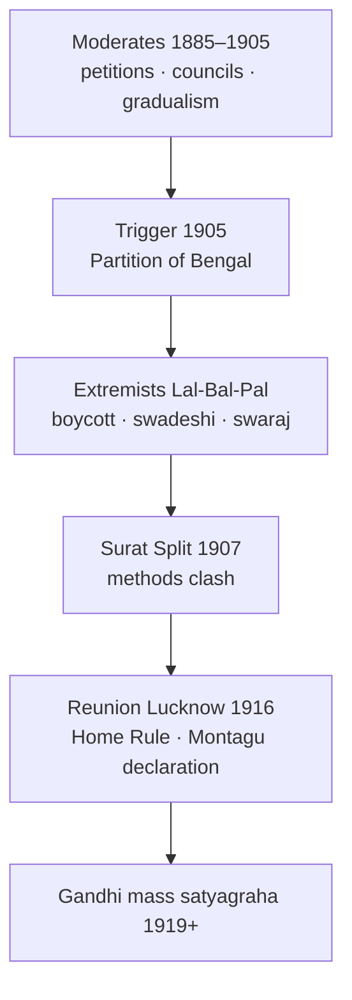

# Extremists vs Moderates

> GS-1 · Topic 02 · Congress factions (1885–1917) — Moderates, Extremists, Surat split, methods

---

## PYQs

| Year | M | Words | Question (EN) | प्रश्न (HI) | ID |
|------|---|-------|---------------|-------------|-----|
| 2025 | 8 | 125 | 'Extremism was a reaction against the ideas and modus operandi of the moderates'. Critically explain this statement. | 'उग्रवाद उदारवादियों के विचारों और कार्य-प्रणाली के विरुद्ध एक प्रतिक्रिया थी'। इस कथन की आलोचनात्मक व्याख्या कीजिए। | Q1 |
| — | 12 | 200 | *Likely:* Analyse the causes and consequences of the Surat Split (1907). | *संभावित:* सूरत विभाजन (1907) के कारणों और परिणामों का विश्लेषण कीजिए। | Q2 |

---

## Quick Revision

```
CONGRESS PHASES:
  1885–1905 Moderate dominance | 1905–1917 Extremist rise | 1917+ Gandhi era (Home Rule bridge)

MODERATES ("Early Nationalists"):
  Leaders: Dadabhai Naoroji · Gopal Krishna Gokhale · Surendranath Banerjea · Feroze Shah Mehta · Pherozeshah Mehta
  Period: c.1885–1905 (dominant till Surat 1907)
  Ideas: British rule beneficial if reformed · faith in British justice · gradualism · constitutional agitation
  Methods: Petitions · prayers · resolutions · legislative councils (1892, 1909) · economic critique (drain theory)
  Achievements: Indian Councils Act 1892 · spread nationalism · unity · expose colonial exploitation
  Limits: No mass mobilisation · no boycott · failed to prevent Partition of Bengal 1905

EXTREMISTS ("Assertive Nationalists"):
  Leaders: Bal Gangadhar Tilak · Bipin Chandra Pal · Lala Lajpat Rai (LAL-BAL-PAL) · Aurobindo Ghosh
  Rise: post-1905 Swadeshi · dissatisfaction with Moderate failure
  Ideas: Self-government swaraj NOW · reject "political mendicancy" · pride in Indian civilisation · passive resistance
  Methods: Boycott · swadeshi · national education · mass meetings · festivals (Ganesh/Gokulashtami — Tilak)
  Milestones: Swadeshi movement 1905 · Surat Split Dec 1907 · Tilak trials · deportation of Lala Lajpat Rai 1907

EXTREMISM AS REACTION TO MODERATES:
  Against IDEAS: Lost faith in British fairness after Curzon Partition 1905 · Lyallpur 1907 deportations
  Against MODUS OPERANDI: Petitions failed → boycott/swaraj · council work insufficient → mass mobilisation
  Against TIMELINE: Moderates wanted slow reform → Extremists wanted immediate self-respect action

CRITICAL NUANCE (exam):
  Extremism NOT purely negative — constructive swadeshi, education, cultural nationalism
  Moderates NOT useless — laid intellectual/foundation (Naoroji drain, Gokhale education)
  Both shared goal: Indian self-rule — differed on means and speed
  Surat 1907 = clash methods + personal/communal undertones · reunited 1916 Lucknow Pact

SURAT SPLIT 1907: Moderates wanted accept Minto-Morley reforms · Extremists rejected
  Rash Behari Ghosh president issue · Tilak denied presidency · physical clash · Congress weakened temporarily

POST-EXTREMIST: Tilak Home Rule 1916 · Gandhi absorbs mass satyagraha · Revolutionary terrorism parallel (separate file)

CONTEMPORARY: Art 51A(a) sovereignty · constitutional methods debate · NEP 2020 freedom struggle curriculum
  Azadi Ka Amrit Mahotsav — Lal-Bal-Pal icons · Partition museum narratives

TRAPS: Moderates ≠ pro-British loyalists only | Extremists ≠ armed revolutionaries (mostly)
  Surat ≠ permanent split (Lucknow 1916) | Tilak ≠ Moderate | Gandhi ≠ Extremist of 1905 type exactly
  Partition 1905 caused Extremist rise — key trigger | Councils Act 1892 Moderate win but insufficient
```

---

## Content

### Context — Congress and the Moderate–Extremist divide

- After **Indian National Congress (1885)** — founded by **A.O. Hume, Dadabhai Naoroji, Gopal Krishna Gokhale, Allan Octavian Hume** with **Moderate leadership** — nationalist politics centred on **constitutional petitioning** and **moral persuasion** of the British.
- By **1905**, failure to stop **Partition of Bengal (Curzon)**, rising **economic nationalism**, and **cultural awakening** produced **Extremist** challenge led by **Lal-Bal-Pal** (**Lala Lajpat Rai, Bal Gangadhar Tilak, Bipin Chandra Pal**) and **Aurobindo Ghosh**.
- **UPPCS 2025 question** asks **critical explanation** of Extremism as **reaction against Moderate ideas AND modus operandi** — must cover **both ideology and methods**, with **balanced critique**.

### Who were the Moderates (1885–1905)

**Leaders**
- **Dadabhai Naoroji** — **Grand Old Man of India**; **drain of wealth theory**; **Congress president 1886, 1893**; MP in **British House of Commons**.
- **Gopal Krishna Gokhale** — **Servants of India Society (1905)**; mentor tradition (later **Gandhi**); **legislative reformist**.
- **Surendranath Banerjea** — **Indian Association (1876)**; **Indian Mirror**; **Partition of Bengal opposition** but **Moderate methods**.
- **Pherozeshah Mehta, Feroze Shah Mehta** — **Bombay** lawyer-politician; **municipal reform**.
- **W.C. Bonnerjee** — first **Congress president (1885)**.

**Ideas (what Extremists reacted against)**
- **Faith in British liberalism:** Belief that **British public opinion** and **Parliament** would grant ** gradual self-government** if **facts presented** rationally.
- **Colonial rule as reformable:** **Not immediate independence** — aim **greater Indian representation**, **civil rights**, **economic justice** within empire initially.
- **Gradualism:** **"Political mendicancy"** (Tilak's critique) — **petitions, memoranda, prayers** to government.
- **Legal-constitutional path:** Work through **Imperial Legislative Council**, **provincial councils** — **Indian Councils Act 1892** seen as **Moderate victory**.

**Modus operandi (methods)**
- **Annual Congress sessions** — resolutions on **civil rights, civil service, military expenditure, drain of wealth**.
- **Press and speeches** — **moderate tone**, **English language** elite discourse.
- **No mass boycott**, **no swadeshi as weapon** (pre-1905), **no cultural mobilisation through festivals** at national scale.
- **Collaboration with reform-minded British** — **Hume, Wedderburn** allies early Congress.

**Moderate achievements (critical balance — not "failures only")**
- **National awakening** — unified **elite across regions**; **economic critique** (**Naoroji, R.C. Dutt**) exposed **colonial exploitation**.
- **Legal gains:** **Indian Councils Act 1892** — expanded nomination/indirect representation.
- **Social reform link:** **Gokhale** on **education, famine relief**; **Banerjea** on **public grievances**.
- **Limits (Extremist grievance):** **Could not prevent Partition of Bengal 1905**; **no mass base**; **British ignored** most demands — **Lyallpur deportations (1907)**, **Press Acts**.

### Who were the Extremists (1905–1917)

**Leaders — Lal-Bal-Pal**
- **Bal Gangadhar Tilak (1856–1920)** — **Maharashtra**; **Kesari, Maratha** newspapers; **"Swaraj is my birthright"** (popularised); **Ganesh/Gokulashtami festivals** for mass nationalism.
- **Bipin Chandra Pal (1858–1932)** — **Bengal**; fiery oratory; **New India**; **boycott-swadeshi** ideologue.
- **Lala Lajpat Rai (1865–1928)** — **Punjab**; **social reform + nationalism**; **deported 1907 (Minto)**; died **1928 lathi charge** protesting **Simon Commission**.

**Other Extremists**
- **Aurobindo Ghosh** — **Bengal**; **Bande Mataram**; spiritual nationalism; later **retired to Pondicherry (1910)**.
- **Lala Lajpat Rai, Ashwini Kumar Dutt** — Punjab-Bengal links.

**Extremist ideas (reaction to Moderate ideas)**
- **Rejection of "British sense of justice":** **Curzon's Partition of Bengal (1905)** — proof **appeals useless**; **British imperialism** not benevolent.
- **Immediate self-respect and swaraj:** **Swadeshi, swaraj, national education** — not distant **gradual reform**.
- **Positive nationalism:** **Pride in ancient civilisation** — **Tilak's Bhagavad Gita interpretation**, **Pal's cultural nationalism** — contrast Moderate **imitation of British constitutionalism**.
- **Anti-mendicancy:** **"Prayer and petition"** replaced by **self-reliant action** — **boycott foreign goods**, **build national schools**.

**Extremist modus operandi (reaction to Moderate methods)**

| Moderate method | Extremist alternative |
|-----------------|----------------------|
| Petitions to Viceroy/Secretary of State | **Mass meetings, hartals, boycott** |
| Council speeches | **Street mobilisation, festivals** |
| Faith in British law | **Passive resistance**, violate **unjust laws** (seeds of **Gandhi**) |
| Elite English discourse | **Vernacular press** (**Kesari, Bande Mataram**) |
| Wait for reforms | **Swadeshi movement (1905)** immediate action |

**Constructive programme (critical nuance — Extremism not mere "violence")**
- **Swadeshi:** **Khadi, handloom, indigenous industry** — economic **self-strength**.
- **National education:** **Bengal National College (Aurobindo principal)**, **Tilak's schools** — **boycott of government colleges**.
- **Samiti network:** **Anushilan Samiti, Swadesh Bandhab Samiti (Ashwini Coomar Dutt)** — **relief, arbitration, physical culture** (some drift to **revolutionary terrorism** — separate subtopic).



### Extremism as reaction — detailed analysis (PYQ core)

**1. Reaction against Moderate IDEAS**

| Moderate idea | Extremist reaction | Evidence |
|---------------|-------------------|----------|
| British justice fair | **Imperialism exploitative** — **Partition 1905** deliberate divide | **Curzon**, **Minto's repression 1907** |
| Gradual self-government | **Swaraj now** — national dignity | **Tilak's Kesari**, **Pal's speeches** |
| Empire beneficial if reformed | **Economic nationalism** — **swadeshi** as political weapon | **Boycott of Manchester cloth** |
| Constitutional loyalty | **Cultural revival** — **Ganesh utsav politicised (Tilak 1893+)** | Mass Hindu festivals as **nationalist platforms** |

**2. Reaction against Moderate MODUS OPERANDI**

- **Petitions failed:** **Six-point petition 1906** to **Morley** — **no reversal of Partition**; **Moderate reliance on British Parliament** discredited after **1907 deportations** (**Lajpat Rai, Tilak trials**).
- **Council politics insufficient:** **1892 Councils Act** — **no real power**; Extremists demanded **boycott of councils** (later **Gandhi's Non-Cooperation** extends this).
- **No mass line:** Moderates = **lawyer-elite**; Extremists reached **students, artisans, peasants partially** via **vernacular press and festivals**.
- **Timidity on boycott:** **1905 Congress Benares** — Moderates **hesitant on full boycott**; **Extremists pushed swadeshi resolution** at **Calcutta 1906** (** Dadabhai Naoroji president** — compromise wording **"self-government like colonies"**).

**3. Critical evaluation — statement is partly true, partly incomplete**

**True aspects:**
- Extremism **emerged from Moderate failure** and **same nationalist stream** — **Naoroji presided 1906** with **Extremist pressure**.
- **Methods genuinely inverted** — **mendicancy → self-help**; **elite → mass attempts**.
- **1905 Partition** = **decisive trigger** — Moderate **protests, petitions** could not stop it.

**Incomplete / critical limits:**
- **Extremists did not reject all Moderate work** — still used **Congress platform**, **drain theory (Naoroji)**, **legal idioms**.
- **Extremism not uniform** — **Tilak** later **Moderate-Extremist bridge** (**Home Rule 1916** with **Annie Besant**); **Gokhale** and **Tilak** had **mutual respect** despite differences.
- **Surat Split weakened movement** — **1908–1916** Congress **inactive** — **reaction also had costs**.
- **Some Extremist methods** bordered **communal** (**Bande Mataram** controversies, **Shuddhi** overlaps) — **not purely progressive**.
- **Revolutionary terrorism** ( **Khudiram Bose, Alipore bomb 1908** ) — **separate strand** from **Lal-Bal-Pal mass Extremism** — do not conflate.

### Surat Split (1907) — climax of Moderate–Extremist clash

**Background**
- **1906 Calcutta Congress** — **Dadabhai Naoroji** — **Swaraj resolution** (vague self-gov); **Extremists** gained strength.
- **1907 Congress scheduled Surat** — **Rash Behari Ghosh** (Moderate) proposed president; **Extremists wanted Tilak**.

**Issues at Surat (December 1907)**
- **Acceptance of Morley-Minto reforms?** Moderates inclined to **work councils**; Extremists **reject as inadequate**.
- **Method of agitation:** **Boycott resolution** wording — **Moderates fear illegalities, repression**.
- **Personal rivalry:** **Mehta vs Tilak** — **Bombay-Pune tensions**.

**Outcome**
- **Physical clash** on platform — **Congress split**; **1908 session Moderates only** ( **Madras** ); **Extremists held separate meetings**.
- **Government repression:** **Tilak sentenced (1908)** — **Mandalay (Burma) 6 years** for **seditious writings**; **Aurobindo** acquitted **Alipore bomb case (1909)** then retired.

**Consequences**
- **Temporary weakening** of **national united front**.
- **Extremists pushed underground/revolutionary** in Bengal partly.
- **Reunion:** **Lucknow Pact 1916** — **Tilak, Besant Home Rule**; **Montagu declaration 1917** — new phase.

### Comparison table — Moderates vs Extremists (exam-ready)

| Aspect | **Moderates** | **Extremists** |
|--------|---------------|----------------|
| **Period** | **1885–1905** dominant | **1905–1917** rise |
| **Leaders** | **Naoroji, Gokhale, Banerjea, Mehta** | **Tilak, Pal, Lajpat Rai, Aurobindo** |
| **Goal (stated)** | Reforms, gradual self-gov | **Swaraj**, immediate self-respect |
| **British faith** | **High** initially | **Rejected** post-1905 |
| **Methods** | **Petition, council, prayer** | **Boycott, swadeshi, mass mobilisation** |
| **Social base** | **Elite, English-educated** | **Wider — vernacular middle class, students** |
| **Press** | **Moderate English papers** | **Kesari, Bande Mataram, New India** |
| **Assessment** | **Foundation builders** | **Massifiers — also split costs** |

### Significance and legacy

- **Extremist phase** transformed Congress from **elite club** toward **mass politics** — **direct precursor** to **Gandhi's satyagraha (1919+)**.
- **Swadeshi (1905)** — **economic weapon** reused in **Non-Cooperation, Civil Disobedience**.
- **Moderate legacy** — **constitutionalism, economic critique, international lobbying (Naoroji in UK)** — **independent India's parliamentary culture**.
- **Synthesis post-1916:** **Tilak + Besant Home Rule**; **Gandhi** combined **Moderate moral law** with **Extremist mass action**.

### Contemporary relevance

- **Article 51A(a):** Duty to **abide by Constitution** — echoes debate **constitutional vs extra-constitutional** methods (Moderate legacy vs mass agitation).
- **Article 51A(f):** Value **freedom struggle heritage** — **Azadi Ka Amrit Mahotsav** commemorates **Lal-Bal-Pal** alongside **Gandhi-Nehru**.
- **NEP 2020:** Teaches **multiple phases of nationalism** — **Moderate, Extremist, Gandhian, Revolutionary** as **critical history**, not single narrative.
- **Parliamentary democracy:** **Moderate council work** → **Indian Councils Acts** → **Government of India Act 1919/1935** → **Constitution 1950** — institutional continuity.
- **Swadeshi–Atmanirbhar parallel:** **1905 boycott** cited in **contemporary economic nationalism** discourse (historical analogy, not identical policy).
- **Partition of Bengal memory:** **1905 division** and **1905 swadeshi** — **Bangladesh-India cultural links**, **museum heritage** (Victoria Memorial exhibitions).
- **Press freedom:** **Tilak sedition trials** — precedent for **Article 19(1)(a)** free speech debates.

### Limits and balanced view

- **Binary oversimplification trap:** Many leaders **straddled phases** — **Tilak (Extremist → Home Rule moderate)**; **Banerjea (Moderate but anti-Partition)**.
- **Extremists did not achieve swaraj immediately** — **repression succeeded** short term.
- **Mass base still limited** compared to **Gandhi era (1919–1942)** — **Extremism = intermediate** phase.
- **Regional variation:** **Extremism strongest Bengal, Maharashtra, Punjab** — **Madras more Moderate (Rajagopalachari)**.
- **Communal undertones:** **Bande Mataram**, **religious festivals** — **debated inclusivity**; **Muslim League separate trajectory** ( **Simla deputation 1906** ).

---

## Answers

### Q1: 'Extremism was a reaction against the ideas and modus operandi of the moderates'. Critically explain this statement. (2025, 8M, 125W)

**Opening:**
> Extremism in the Indian National Congress (c.1905–1917) emerged largely as a reaction against Moderate faith in British justice and their petition-based methods — yet it built upon Moderate economic and political foundations rather than rejecting nationalism itself.

**Write these points:**
- **Against Moderate ideas:** Extremists (**Tilak, Pal, Lajpat Rai**) rejected belief that **British rule would grant self-government through appeals** — **Partition of Bengal (1905)** and **1907 repression** proved **"political mendicancy"** futile.
- **Against Moderate modus operandi:** Shift from **petitions, prayers, council speeches** to **boycott, swadeshi, national education, mass meetings, vernacular press (Kesari, Bande Mataram)**.
- **Positive Extremist content:** Not mere negation — **constructive swadeshi**, **cultural nationalism (Tilak's festivals)**, demand for **swaraj** as **self-respect**.
- **Critical nuance:** Extremism **reacted to Moderate failure** but **continued Congress platform**; **Naoroji (1906)** bridged both; **Moderates laid drain theory, legal awareness** — **not worthless**.
- **Limits:** **Surat Split (1907)** **weakened movement**; **Extremists did not win swaraj**; some methods had **communal edges** — reaction was **necessary but incomplete**.

**Conclusion:**
> The statement is substantially true — Extremism was a methodological and ideological revolt against Moderate gradualism after 1905 — yet a critical view recognises Moderate contributions and Extremism's own shortcomings, culminating in later Gandhian synthesis.

---

### Q2: *Likely:* Analyse the causes and consequences of the Surat Split (1907). (Future variant, 12M, 200W)

**Opening:**
> The Surat Split of December 1907 marked the open rupture between Moderate and Extremist wings of the Indian National Congress over methods of agitation and acceptance of colonial reforms.

**Write these points:**
- **Causes — ideological:** **Extremists** rejected **Moderate faith** in **Morley-Minto reforms**; demanded **boycott and swaraj** vs **gradual constitutionalism**.
- **Causes — immediate:** **Rash Behari Ghosh vs Tilak** presidency dispute; **1905 Partition** legacy — **Extremists** felt **Moderates too soft**; **1907 deportations (Lajpat Rai)** fuelled radicalism.
- **Causes — procedural:** Wording of **swadeshi/boycott resolutions**; **fear of illegality** among Moderates (**Mehta, Banerjea**).
- **Event:** **Physical clash at Surat session** — **Congress split**; **1908 Moderate-only session**.
- **Consequences — negative:** **Weakened united nationalist front**; **government repression** (**Tilak Mandalay 1908**); **some Bengal Extremists → revolutionary terrorism**.
- **Consequences — long term:** **Extremist methods** (boycott, mass line) **influenced Gandhi**; **reunion Lucknow 1916** — **Home Rule League phase**.

**Conclusion:**
> Surat Split was both culmination of the Moderate–Extremist reaction and a temporary setback — its consequences nonetheless shaped the mass character of later Indian nationalism.

---

### Q3: *Likely:* Compare the methods of Moderates and Extremists in the Indian freedom struggle. (Future variant, 8M, 125W)

**Opening:**
> Moderates (1885–1905) relied on constitutional petitioning and council work, while Extremists (post-1905) adopted boycott, swadeshi, and mass mobilisation — reflecting a shift from elite persuasion to self-reliant agitation.

**Write these points:**
- **Moderates:** **Petitions, prayers, annual resolutions**, **Imperial Legislative Council (1892 Act)**, **English press**, **economic critique (Naoroji drain)**.
- **Extremists:** **Boycott foreign goods**, **swadeshi**, **national schools**, **vernacular newspapers**, **public festivals (Tilak)**, **hartals**.
- **Goal difference:** **Gradual reform** vs **immediate swaraj/self-respect**.
- **Assessment:** Moderates **built awareness**; Extremists **widened participation** — **Gandhi later combined both**.

**Conclusion:**
> Methodological divergence defined the two phases — Extremism reacting against Moderate modus operandi while sharing the broader anti-colonial objective.

---

## Traps

| Wrong | Correct |
|-------|---------|
| Moderates were pro-British traitors | **Nationalists seeking reform/self-gov** — **faith in British institutions**, not betrayal |
| Extremists always used bombs and violence | **Main Lal-Bal-Pal line = boycott, swadeshi, press**; **terrorism = separate revolutionary strand** |
| Surat Split permanently destroyed Congress | **Reunited 1916 Lucknow**; **Home Rule movement** bridged gap |
| Tilak was a Moderate | **Tilak = foremost Extremist** — later **Home Rule 1916** moderated tactics, not ideology fully |
| Partition of Bengal unrelated to Extremist rise | **1905 Partition = key trigger** for **swadeshi and Extremism** |
| Extremists rejected Congress entirely after Surat | **Continued parallel work**; **Tilak rejoined unified Congress** |
| Gandhi was an Extremist of 1905 type | **Gandhi (1919+)** — **distinct mass satyagraha**; synthesised earlier streams |
| Indian Councils Act 1892 satisfied Extremists | **Moderate gain** — **Extremists saw as inadequate** |
| Only Bengal had Extremists | **Strong in Bengal, Maharashtra, Punjab** — **regional variation** |
| Extremism had no constructive programme | **Swadeshi, national education, arbitration samitis** — **constructive content** |
| Naoroji was an Extremist | **Naoroji = Moderate** — presided **1906** under **Extremist pressure** on swaraj wording |
| Moderates opposed Partition of Bengal | **Banerjea opposed** — but **Moderate methods failed** to reverse it |
| "Political mendicancy" praised by Extremists | **Tilak's critique OF Moderate petition politics** — **not praise** |

---

*Complete.*
