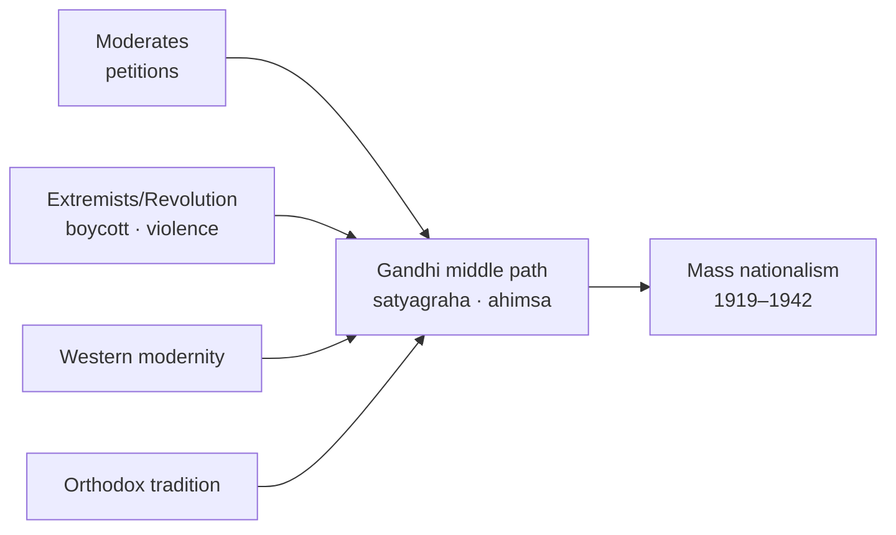
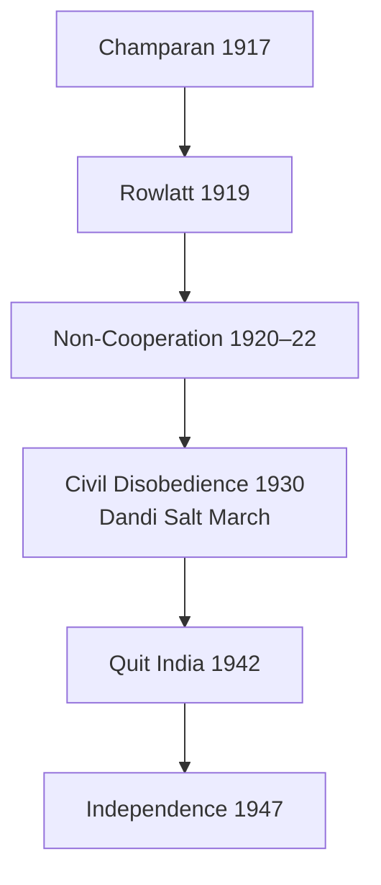

# Gandhi & National Movement

> GS-1 · Topic 02 · Gandhian ideology, satyagraha, middle path, varna, mass movements (1917–1942)

---

## PYQs

| Year | M | Words | Question (EN) | प्रश्न (HI) | ID |
|------|---|-------|---------------|-------------|-----|
| 2018 | 8 | 125 | Mahatma Gandhi represents the middle path approach in Indian Politics. Give logical explanation. | महात्मा गांधी भारतीय राजनीति के मध्यम मार्ग दृष्टिकोण का प्रतिनिधित्व करते हैं। तर्कपूर्ण व्याख्या कीजिए। | Q1 |
| 2020 | 8 | 125 | Evaluate the views of Gandhi on the Varna system. | वर्ण व्यवस्था पर गाँधी के विचारों का मूल्यांकन कीजिए। | Q2 |
| — | 12 | 200 | *Likely:* Discuss Gandhi's role in the Indian freedom struggle. | *संभावित:* भारतीय स्वतंत्रता संग्राम में गांधी की भूमिका की विवेचना कीजिए। | Q3 |
| — | 8 | 125 | *Likely:* Examine the significance of the Non-Cooperation Movement. | *संभावित:* असहयोग आंदोलन के महत्व का परीक्षण कीजिए। | Q4 |

---

## Quick Revision

```
GANDHI IN INDIA: 1915 (from S.Africa) → Champaran 1917 → Kheda 1918 → Rowlatt 1919
  Non-Cooperation 1920–22 · Civil Disobedience 1930–34 · Quit India 1942

IDEOLOGY CORE:
  Satyagraha = truth-force · ahimsa · swaraj (self-rule moral + political)
  Trusteeship · sarvodaya · antyodaya · swadeshi/khadi · village republics
  Ram Rajya ideal · religion = ethics not ritual supremacy

MIDDLE PATH (Madhyam Marg — PYQ 2018):
  Between Moderates (petitions) ↔ Extremists (radical boycott) → satyagraha mass legal-moral
  Between violence (revolutionary) ↔ passivity → non-violent direct action
  Between Western modernity ↔ blind tradition → selective Indian village civilisation
  Between Hindu majoritarianism ↔ Western secularism → sarva dharma sambhava
  Between capitalism ↔ state socialism → trusteeship of property
  Between cooperation ↔ full rupture with British → phased non-cooperation

SATYAGRAHA METHODS: Hartal · boycott foreign cloth · picketing · salt march · fasting
  Constructive: khadi · charkha · harijan uplift · prohibition · village industries

MAJOR MOVEMENTS:
  Champaran (1917) indigo · Kheda (1918) famine tax · Ahmedabad mill strike (1918)
  Rowlatt Satyagraha 1919 · NCM 1920 (Khilafat alliance) · CDM 1930 (Dandi Salt March 6 Apr)
  Gandhi-Irwin Pact 1931 · Second CDM · Quit India 8 Aug 1942 "Do or Die"

VARNA (PYQ 2020):
  Supported varna as DIVISION OF LABOUR by aptitude — NOT birth-based caste (jati)
  Opposed untouchability — "sin against Hinduism" · renamed Dalits "Harijan" (debated term)
  No inter-dining/marriage initially · manual scavenging abolition campaign
  Critics: Ambedkar — varna theory impractical; preserves hierarchy symbolically
  Poona Pact 1932 — reserved seats for depressed classes vs separate electorate

ORGANISATIONS: Sabarmati · Sevagram · Harijan Sevak Sangh · All India Spinners Association
  Young India · Harijan (journal) · Indian Opinion (S.Africa)

CONTEMPORARY: Art 51A(a)(f) · KVIC/khadi GI · NEP 2020 Gandhi heritage · Swachh Bharat (cleanliness)
  UN International Day of Non-Violence 2 Oct · Sabarmati Ashram UNESCO tentative

TRAPS: Gandhi ≠ invented satyagraha concept alone (Tolstoy/Ruskin influence)
  Middle path ≠ compromise always | Varna ≠ caste support (nuance!) | Khilafat ≠ permanent alliance
  Chauri Chaura → NCM withdrawn | Gandhi ≠ Quit India organiser in jail
  Harijan term ≠ universally accepted today
```

---

## Content

### Context — Gandhi's place in Indian nationalism

- **Mohandas Karamchand Gandhi (1869–1948)** — returned from **South Africa (1915)** after **Satyagraha campaigns (1906–14)** against **racist laws** — transformed Indian nationalism from **elite politics** to **mass movement**.
- **Gandhian era (1917–1947):** **Champaran → Quit India** — **Congress under Gandhi** became **nation-wide anti-colonial force** with **non-violent method (satyagraha)**.
- **UPPCS asks:** **Middle path in politics (2018)** and **views on varna (2020)** — need **ideology, movements, critics, balanced evaluation**.

### Gandhian ideology — key concepts

| Concept | Meaning | Exam use |
|---------|---------|----------|
| **Satyagraha** | **Hold fast to truth** — soul-force against injustice | Non-violent resistance — **not passive weakness** |
| **Ahimsa** | Non-violence — **active love**, willingness to suffer | Applied to **British, communal violence, social evil** |
| **Swaraj** | **Self-rule** — moral self-discipline + political independence | **"Poorna swaraj" (1930 Lahore Congress)** |
| **Swadeshi** | Use **home products** — **khadi, village industry** | Economic wing of nationalism |
| **Trusteeship** | Rich hold wealth as **trust for society** | Middle path between **capitalism and communism** |
| **Sarvodaya** | Welfare of all — **antyodaya** (last person first) | Social justice frame |
| **Sarv dharma sambhava** | **Equal respect for all religions** | Communal harmony |

**Influences on Gandhi**
- **Leo Tolstoy** — *The Kingdom of God Is Within You*; **non-violence, simple life**.
- **John Ruskin** — *Unto This Last* — **bread labour**, dignity of manual work.
- **Henry David Thoreau** — **civil disobedience**.
- **Bhagavad Gita** — **detached action (nishkama karma)**; **Gandhi's interpretation emphasised ahimsa**.
- **Gokhale** — **political mentor**; **Servants of India** ethos.

### Gandhi as "middle path" in Indian politics (PYQ core)

**What "madhyam marg" means in exam answers**
- Gandhi **avoided extremes** — synthesised **conflicting Indian and colonial political traditions** into **practical mass politics** that **neither copied West blindly nor frozen orthodox society**.

**Middle path — major polarities Gandhi bridged**

| Extreme pole A | Extreme pole B | Gandhi's middle path |
|----------------|----------------|----------------------|
| **Moderate petition politics** | **Extremist/Revolutionary violence** | **Satyagraha** — **mass civil disobedience** within **moral self-limitation (ahimsa)** |
| **Westernisation/modern industry** | **Blind traditionalism** | **Village-centred swadeshi** — **charkha, handicrafts** + **selective modern hygiene, education** |
| **Complete cooperation with British** | **Immediate armed revolt** | **Phased non-cooperation** — **boycott courts/schools/cloth** but **willing to negotiate (Gandhi-Irwin Pact 1931)** |
| **Majoritarian Hindu politics** | **Western secular indifference to religion** | **Religious idiom for masses** + **sarv dharma sambhava** — **inclusive symbols (Ram Rajya as justice)** |
| **Capitalist accumulation** | **State socialism/Marxism** | **Trusteeship** — **voluntary sharing**, not violent expropriation |
| **Untouchability status quo** | **Ambedkarite separate identity politics** | **Temple entry, harijan uplift** within **Hindu reform** — **Poona Pact 1932 compromise** |
| **Full law-breaking anarchy** | **Legalistic passivity** | **Break specific unjust laws** (salt tax) while **respecting broader order** until **swaraj** |



**Logical evidence for middle path thesis**

1. **Methodological synthesis**
   - Adopted **Extremist boycott/swadeshi** but rejected **violence** after assessing **revolutionary terrorism limits**.
   - Retained **Moderate moral constitutionalism** — **appeals to British conscience**, **negotiations with Viceroys** — yet **led illegal salt march (1930)**.

2. **Non-Cooperation Movement (1920–22)**
   - **Boycott** of **titles, councils, courts, schools, foreign cloth** — **radical**.
   - **Withdrawal after Chauri Chaura (1922)** when **violence erupted** — **self-limiting** — proves **middle path not extremism**.

3. **Khilafat-Congress alliance (1920)**
   - **Hindu-Muslim unity** attempt — **bridge communal divide**.
   - **Ended with disillusion** — shows **pragmatic not dogmatic** alliance.

4. **Round Table Conferences (1930–32)**
   - Participated **despite imprisonment**; **Poona Pact with Ambedkar** — **negotiated middle ground** on **depressed classes representation**.

5. **Quit India (1942)**
   - **"Do or Die"** — radical mass phase.
   - Still **ahimsa principle**; **not coordinated armed insurrection** — **disciplined mass disorder**.

**Critical limits (for balanced 2018 answer)**
- **Middle path ≠ always successful** — **Partition 1947** shows **communal problem unresolved**.
- **Ambedkar criticised** Gandhi's **caste approach** as **too gradual/paternalistic**.
- **Revolutionaries (Bhagat Singh)** saw **Gandhi as too compromising** — **not middle for everyone**.
- **Women's role** — **mass participants** but **patriarchal ashram norms**.

### Gandhi on varna system (PYQ core)

**Gandhi's stated position**
- Distinguished **varna (four-fold division of labour)** from **jati (birth-based caste)**.
- **Ideal varna:** **Occupation by aptitude and choice** — **Shudra, Vaishya, Kshatriya, Brahmin** as **functional roles**, **equal spiritual dignity**, **interchangeable in theory**.
- **Opposed untouchability absolutely** — called it **"great sin in Hinduism"**; **manual scavenging** must end.
- **Term "Harijan"** (children of God) for **Dalits** — **paternalistic**, **rejected later by Dalit activists**.

**Gandhi's practical campaigns**
- **Harijan uplift weeks**, **temple entry movements** (**Guruvayur, Vaikom satyagraha support**).
- **Harijan Sevak Sangh (1932)**; journal **Harijan**.
- **Fast unto death (1932)** against **Communal Award separate electorate for Dalits** — led to **Poona Pact** with **Ambedkar** — **reserved seats within joint electorate**.

**Evaluation table — strengths vs criticisms**

| Gandhi's view | Support argument | Criticism (Ambedkar, others) |
|---------------|------------------|------------------------------|
| Varna = labour division, not birth | **Scriptural reformist reading**; attacked **untouchability** directly | **Historical varna always birth-based** — **ideal divorced from practice** |
| End untouchability within Hindu fold | **Mass Hindu audience reached** via religion | **Dalit identity subsumed** — **no separate political voice** (until Poona Pact partial win) |
| No inter-dining/marriage early on | **Strategic gradualism** for orthodox society | **Preserved social separation** — **symbolic hierarchy continued** |
| Harijan term | **Dignifying intent** | **Patronising** — **Dalits prefer own names/identities** |
| Poona Pact fast | **Avoided separate electorate** (feared fragmentation) | **Coercive fasting on depressed classes issue** — **Ambedkar pressured** |

**Ambedkar-Gandhi debate (exam essential)**
- **Ambedkar:** **Annihilation of caste** — **reject varna entirely**; **political rights first**; **separate electorate** in **Communal Award (1932)**.
- **Gandhi:** **Reform Hinduism** from within; feared **separate electorate** would **permanently segregate** Dalits.
- **Poona Pact (September 1932):** **Reserved seats for depressed classes** in provincial assemblies — **joint electorate** — **compromise neither fully accepted**.

**Balanced evaluation conclusion for exams**
- Gandhi **revolutionised Hindu attitude to untouchability** among **middle classes** — **real social campaigns**.
- **Failed to abandon varna vocabulary** — **Ambedkar right** that **without destroying caste, varna theory idealistic**.
- **Legacy:** **Article 17** (untouchability abolished) **closer to Ambedkar constitutionally**; **Gandhi's moral crusade** **prepared ground** among **Hindu masses**.

### Major Gandhian movements (chronology)

| Year | Movement | Issue | Significance |
|------|----------|-------|--------------|
| **1917** | **Champaran** | **Indigo tinkathia** | First **satyagraha in India**; **peasant mobilisation** |
| **1918** | **Kheda** | **Land revenue during famine** | **Patidar peasant alliance** |
| **1918** | **Ahmedabad mill strike** | **Textile workers' wages** | **Industrial satyagraha** |
| **1919** | **Rowlatt Satyagraha** | **Repressive Rowlatt Act** | **Nationwide hartal**; **Jallianwala Bagh** aftermath |
| **1920–22** | **Non-Cooperation** | **Punjab/Khilafat wrongs** | **Mass boycott**; **Congress becomes mass party** |
| **1930–34** | **Civil Disobedience** | **Salt tax, poorna swaraj** | **Dandi March (12 Mar–6 Apr 1930)**; **global publicity** |
| **1942** | **Quit India** | **Immediate independence** | **"Do or Die"**; **leaderless mass upsurge** |

### Key movements — exam depth (NCM, CDM, Khilafat, Jallianwala)

**Jallianwala Bagh and Rowlatt (1919)**
- **Rowlatt Act (1919)** — **detention without trial** — **Gandhi's first nationwide satyagraha**.
- **13 April 1919** — **General Dyer** fired on **unarmed crowd at Jallianwala Bagh, Amritsar** — **hundreds killed** — **national outrage**.
- **Rabindranath Tagore** renounced **knighthood**; **Hunter Commission** — **Dyer condemned by some British liberals**.
- **Significance:** **Ended Moderate faith in British justice** for many — **bridge to Non-Cooperation**.

**Non-Cooperation Movement (1920–22)**
- **Causes:** **Punjab wrongs (Jallianwala)**, **Khilafat issue** (Ottoman Caliph), **Swaraj demand**.
- **Programme:** **Boycott courts, schools, councils, foreign cloth**; **surrender titles**; **picketing**; **khadi promotion**.
- **Khilafat-Congress alliance:** **Maulana Shaukat Ali, Muhammad Ali** — **Hindu-Muslim unity attempt** — **ended 1922–24 disillusion**.
- **Withdrawal (Feb 1922):** **Chauri Chaura** — **police station burned, 22 killed** — **Gandhi suspended movement** — **ahimsa principle over momentum**.

**Civil Disobedience Movement (1930–34)**
- **Trigger:** **Lord Irwin** ignored **11 demands**; **Lahore Congress (1929)** — **Poorna Swaraj** — **26 January 1930 as Independence Day**.
- **Salt March (12 March–6 April 1930):** **Dandi** — **broke salt law** — **global media event**; **women (Sarojini Naidu)** joined **Dharasana raid**.
- **Spread:** **Forest law violation**, **foreign cloth boycott**, **no-tax campaigns** — **Bardoli (Patel), UP, Bengal**.
- **Gandhi-Irwin Pact (March 1931):** **CDM suspended** — **political prisoners released** — **Round Table Conference participation** — **critics: partial retreat**.
- **Second CDM (1932):** **Poona Pact fast** — **communal award** — **restart and repression**.

**Round Table Conferences (1930–32)**
- Gandhi attended **Second RTC (1931)** as **sole Congress representative** — **no agreement on communal issues/federation**.



### Gandhi's role in freedom struggle — overview

- **Mass base:** Expanded Congress to **peasants, artisans, women, urban poor** — **khadi, charkha** as **participatory symbols**.
- **Unity efforts:** **Khilafat**, **Communal harmony fasts (1924, 1932)** — **mixed results**.
- **International moral pressure:** **Salt March**, **Round Table** — **world opinion**.
- **Limits:** **Could not prevent Partition**; **withdrawals** (**1922, 1934**) **demoralised cadres** sometimes; **no solution to caste-class fully**.

### Contemporary relevance

- **UN International Day of Non-Violence — 2 October** (Gandhi Jayanti) — **global ahimsa legacy**.
- **Article 51A(a):** **Constitution abidance** — **Gandhi's rule of law satyagraha** debated vs **civil disobedience tradition**.
- **Article 51A(f):** **Value freedom struggle heritage** — **Sabarmati, Sevagram ashrams** (**Art 49** protected heritage).
- **KVIC, khadi GI tags, charkha:** **Swadeshi institutionalised** — **economic nationalism legacy**.
- **NEP 2020:** **Gandhian basic education (Nai Talim)** referenced in **IKS** — **craft-centred pedagogy**.
- **Swachh Bharat Mission (2014):** Invokes **Gandhi's cleanliness obsession** — **sanitation as national mission**.
- **Sabarmati Ashram restoration (2023):** **Heritage tourism**, **Azadi Ka Amrit Mahotsav** anchor site.
- **Caste discourse today:** **Article 15, 17** — **Ambedkar-Gandhi debate** still frames **reservation, temple entry, dignity politics**.

### Limits and balanced view

- **Middle path** sometimes read as **inconsistency** — **negotiate and confront alternately**.
- **Varna idealism** — **historically inadequate** to **annihilate caste** — **Ambedkar critique stands**.
- **Gender:** **Ashram rules patriarchal** despite **mass women's participation** (**Sarojini Naidu, Kasturba**).
- **Not sole hero of independence** — **Revolutionaries, Subhash Bose, peasant movements, WWII context** also matter.
- **Religious idiom** — **effective for Hindu masses**, **Muslim League separate trajectory**.

---

## Answers

### Q1: Mahatma Gandhi represents the middle path approach in Indian Politics. Give logical explanation. (2018, 8M, 125W)

**Opening:**
> Gandhi's politics synthesised opposing extremes — between Moderate petitioning and violent revolution, Western modernity and blind tradition, cooperation and rupture with Britain — through satyagraha, ahimsa, and constructive swadeshi.

**Write these points:**
- **Method:** Between **Moderate legalism** and **Extremist/revolutionary violence** — **satyagraha**: **mass civil disobedience** with **self-imposed ahimsa** (e.g. **Salt March 1930**, **NCM 1920**).
- **Economy/society:** Between **industrial Westernisation** and **rigid orthodoxy** — **village swadeshi, khadi, trusteeship** — not **Marxist expropriation** nor **unregulated capitalism**.
- **British rule:** Between **loyal cooperation** and **immediate armed revolt** — **non-cooperation phases** + **negotiation (Gandhi-Irwin Pact 1931)**; **withdrew NCM after Chauri Chaura (1922)** when **violence broke out**.
- **Communal politics:** Between **majoritarianism** and **rootless secularism** — **sarv dharma sambhava**, **Khilafat unity attempt**, **religious idiom with inclusivity aim**.
- **Limit:** Middle path **not always successful** — **Partition 1947**, **Ambedkar/Bhagat Singh critics** — yet **defined mass constitutional nationalism**.

**Conclusion:**
> Gandhi's madhyam marg thus logically bridged India's political polarities — making nationalism moral, inclusive, and mass-based without fully embracing any single extreme.

---

### Q2: Evaluate the views of Gandhi on the Varna system. (2020, 8M, 125W)

**Opening:**
> Gandhi distinguished varna as ideal division of labour by aptitude from birth-based jati, fiercely opposed untouchability, yet his framework drew substantial criticism from Ambedkar for preserving hierarchical categories.

**Write these points:**
- **Gandhi's varna theory:** **Four varnas** as **equal, complementary occupations** chosen by **merit** — **not hereditary caste**; spiritual equality of **all labour (bread labour ideal)**.
- **Anti-untouchability:** Called untouchability **sin against Hinduism**; **Harijan campaigns, temple entry, Harijan Sevak Sangh (1932)** — **practical reform focus**.
- **Poona Pact (1932):** **Fast against separate electorate** — compromise **reserved seats for depressed classes in joint electorate** with **Ambedkar**.
- **Positive evaluation:** **Mobilised Hindu society** against **untouchability** at **mass scale** — **prepared social ground** for **Article 17 abolition**.
- **Critical evaluation:** **Ambedkar** — varna concept **idealistic**, **historically birth-based**; **Harijan term patronising**; **no inter-dining/marriage** early — **hierarchy persisted**; **annihilation of caste** needed, not **varna reinterpretation**.

**Conclusion:**
> Gandhi's varna views were progressive on untouchability but conservatively framed — morally transformative yet politically and structurally insufficient for Dalit emancipation, as Ambedkar argued.

---

### Q3: *Likely:* Discuss Gandhi's role in the Indian freedom struggle. (Future variant, 12M, 200W)

**Opening:**
> Gandhi (1915–1947) transformed the Indian freedom struggle into a mass movement through satyagraha, linking peasant grievances, swadeshi economics, and moral anti-colonialism.

**Write these points:**
- **Early satyagrahas:** **Champaran (1917), Kheda (1918), Ahmedabad (1918)** — **peasant-worker alliances**, proof of **method**.
- **Mass movements:** **Rowlatt (1919), Non-Cooperation (1920–22), Civil Disobedience (1930–34), Quit India (1942)** — **Congress as mass party**.
- **Methods:** **Boycott, hartal, salt march, khadi, constructive programme** — **non-violent direct action**.
- **Political achievements:** **Poorna swaraj resolution (1929)**, **global moral pressure**, **widened participation (women, peasants)**.
- **Social agenda:** **Harijan uplift, prohibition, village industries** — **freedom as moral reconstruction**.
- **Limits:** **Withdrawals after violence**, **could not prevent Partition**, **caste/gender limits** — **not solitary architect of independence**.

**Conclusion:**
> Gandhi's role was pivotal in making nationalism mass-based and moral — the central architect of non-violent resistance, even if independence also required other streams and historical contingencies.

---

### Q4: *Likely:* Examine the significance of the Non-Cooperation Movement. (Future variant, 8M, 125W)

**Opening:**
> The Non-Cooperation Movement (1920–22) was Gandhi's first all-India mass campaign — transforming Congress into a people's party through boycott and constructive programme, though withdrawn after Chauri Chaura.

**Write these points:**
- **Mass expansion:** **Boycott of courts, schools, councils, foreign cloth** — **peasants, students, women** entered **national politics**.
- **Khilafat alliance:** **Hindu-Muslim joint struggle** — **temporary unity** on **anti-British platform**.
- **Constructive work:** **Khadi, national schools, tribal uplift** — **economic side of swaraj**.
- **Withdrawal at Chauri Chaura (1922):** **Principled ahimsa** — **also slowed momentum** — **debated significance**.
- **Legacy:** **Template for CDM and Quit India** — **proved British rule needed Indian consent**.

**Conclusion:**
> Non-Cooperation marked the decisive shift from elite petition politics to mass satyagraha — a watershed even in its suspension.

---

## Traps

| Wrong | Correct |
|-------|---------|
| Gandhi invented all ideas without influence | Influenced by **Tolstoy, Ruskin, Thoreau, Gita, Gokhale** |
| Middle path = weak compromise always | **Strategic self-limitation (ahimsa)** — **Chauri Chaura withdrawal** was **principled**, not cowardice |
| Gandhi supported caste/varna as birth system | **Supported ideal varna by aptitude** — **opposed untouchability**; **still criticised by Ambedkar** |
| Gandhi and Ambedkar fully agreed on caste | **Poona Pact 1932** = **negotiated compromise** after **fast** — **deep ideological differences** |
| Non-Cooperation continued after 1922 | **Suspended after Chauri Chaura violence (Feb 1922)** |
| Salt March = Quit India | **Salt March = Civil Disobedience 1930**; **Quit India = 1942** |
| Gandhi led Quit India from forefront | **Arrested 9 Aug 1942** — movement largely **leaderless at local level** |
| Khilafat alliance permanently unified Hindus-Muslims | **Temporary (1920–24)** — **communal tensions returned** |
| Harijan is universally accepted term today | **Patronising** — **Dalit/Bahujan self-naming preferred** |
| Gandhi was purely religious politician | **Used religious idiom** but **political goals (swaraj, salt tax)** |
| Gandhi rejected all Western ideas | **Selective** — **law, hygiene, railways** acknowledged; **rejected exploitative modernity** |
| Varna views = same as Manusmriti orthodoxy | **Reformist reinterpretation** — **equal dignity of labour** — **still insufficient for caste annihilation** |
| Gandhi single-handedly won independence | **Mass movement + WWII + other leaders/revolutionaries** contributed |

---

*Complete.*
