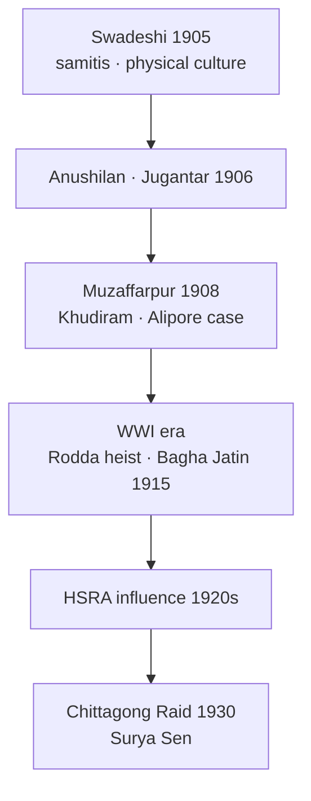

# Revolutionary Movement

> GS-1 · Topic 02 · Revolutionary terrorism, Bengal samitis, Bhagat Singh, HSRA philosophy

---

## PYQs

| Year | M | Words | Question (EN) | प्रश्न (HI) | ID |
|------|---|-------|---------------|-------------|-----|
| 2024 | 12 | 200 | Outline the development of revolutionary movement in Bengal. | बंगाल में क्रांतिकारी आंदोलन के विकास की रेखांकित कीजिए। | Q1 |
| 2022 | 12 | 200 | Throw light on the 'Revolutionary Philosophy' formulated by Bhagat Singh. | भगत सिंह द्वारा प्रतिपादित 'क्रांतिकारी दर्शन' पर प्रकाश डालिए। | Q2 |

---

## Quick Revision

```
REVOLUTIONARY TERRORISM (1905–1934): Armed propaganda · individual heroism · NOT mass army revolt
  Trigger: Swadeshi failure + Surat 1907 + repression → youth disillusioned with Moderate/early Gandhi methods

BENGAL PHASES:
  1905–08 Swadeshi samitis → Anushilan (Dacca 1906) · Jugantar (1906, Bhupendranath Dutt)
  1908: Khudiram Bose · Prafulla Chaki → Muzaffarpur bomb (Kingsford) | Alipore Bomb Case (Aurobindo)
  1908–14: Dacca Anushilan · Maniktala · Barin Ghosh networks · Yugantar journal
  WWI: Ghadar overlap · Bagha Jatin (Jatin Mukherjee) · German Plot 1914–15 (Balasore)
  1920s: HSRA (Hindustan Socialist Republican Association) · Kakori 1925 · Chittagong Armoury Raid 1930 (Surya Sen)

BENGAL LEADERS:
  Aurobindo Ghosh · Barindra Kumar Ghosh · Khudiram Bose · Prafulla Chaki · Bagha Jatin
  Surya Sen (Masterda) · Pritilata Waddedar · Bina Das · Jatindranath Mukherjee

BHAGAT SINGH (1907–1931):
  Naujawan Bharat Sabha · HSRA · Lahore conspiracy
  1928: Lala Lajpat Rai death (Simon protest) → Saunders avenging (Dec 1928)
  1929: Central Assembly bomb (NOT to kill — "to make the deaf hear") · hunger strike Lahore jail
  1931: Hanged 23 March with Rajguru · Sukhdev

REVOLUTIONARY PHILOSOPHY (Bhagat Singh — PYQ):
  Beyond mere violence → socialist revolution · class analysis · atheism (Why I Am an Atheist)
  Political aim: complete independence + social-economic revolution (not just British swap)
  Method: "Propaganda by deed" + pamphlets (Inquilab Zindabad) · organised party not lone anarchism
  Critique of Gandhi/Chamber of commerce nationalism · mass mobilisation ideal but used dramatic acts
  Martyrdom as consciousness-raising — "Inquilab Zindabad" · "Samrajyavad ka naash"

ALL-INDIA LINKS:
  Punjab: HSRA · Ram Prasad Bismil · Ashfaqullah · Kakori conspiracy 1925
  Maharashtra: Savarkar (Abhinav Bharat, London) · Chaphekar brothers
  UP: Chandrashekhar Azad · Hindustan Republican Association (1924)

GOVT RESPONSE: Rowlatt · Defence of India Act · CID infiltration · executions · Andaman Cellular Jail

CONTEMPORARY: Shaheed memorials · Hussainiwala · Cellular Jail UNESCO · Art 51A(f) · NEP 2020
  Azadi Ka Amrit Mahotsav — Bhagat Singh, Khudiram icons

TRAPS: Bengal rev ≠ only bombs from day one (samiti physical culture first)
  Aurobindo ≠ lifelong revolutionary (retired 1910 Pondicherry) | Bhagat Singh ≠ anarchist only
  HSRA = socialist · earlier Anushilan more nationalist-mystical | Gandhi opposed methods NOT all goals
  Chittagong 1930 ≠ 1857 | Kakori ≠ Bengal
```

---

## Content

### Context — what was the revolutionary movement

- **Revolutionary movement** (often termed **revolutionary terrorism** in historiography) = **underground networks** using **political violence** — **assassinations, bombings, robberies for funds** — against **British rule**, c. **1905–1934**, parallel to **Congress/Gandhian nationalism**.
- **Distinct from:** **1857 revolt** (army-led mass uprising); **Gandhi's mass satyagraha** (non-violent); **Extremist swadeshi** (legal mass boycott) — though **many revolutionaries began in swadeshi samitis**.
- **Core idea:** **British will not leave through petitions** — **armed struggle + heroic sacrifice (balidan)** needed to **awaken nation**.
- **UPPCS focus:** **Bengal development (2024)** and **Bhagat Singh's philosophy (2022)** — require **chronology, organisations, leaders, ideology, limits**.

### Causes — why revolutionary terrorism arose

| Cause | Explanation |
|-------|-------------|
| **Swadeshi disillusion (1905–07)** | **Partition of Bengal**, **Moderate failure**, **Surat Split** — youth turned **underground** |
| **Repression** | **Tilak jailed (1908)**, **deportations**, **Press Acts** — closed **legal agitation space** |
| **Inspiration models** | **Irish nationalism, Russian nihilists/narodniks, Italian Carbonari**, **Japanese victory over Russia (1905)** |
| **Heroic sacrifice ethos** | **Bhagavad Gita, Bande Mataram cult** — **martyrdom as national regeneration** (early Bengal phase) |
| **Class/colonial exploitation** | Later **HSRA socialist turn** — **Bhagat Singh** links **freedom to economic justice** |

### Bengal — development of revolutionary movement (PYQ core)

**Phase I: Swadeshi samitis to secret societies (1905–1908)**

- **Swadeshi movement (1905)** created **voluntary associations** — **relief, arbitration, physical culture (lathi, drill)**.
- **Anushilan Samiti** — **1906, Dacca (Dhaka)** under **Pulin Behari Das**; branches in **Calcutta, Chittagong** — **paramilitary training**, **revolutionary literature**.
- **Jugantar (Yugantar)** group — **1906**, linked to **Barindra Kumar Ghosh**, **Bhupendranath Dutt**; journal **Jugantar** — **fiery nationalist rhetoric**.
- **Aurobindo Ghosh** — **Bengal National College principal**, **Bande Mataram** editor — **spiritual nationalism**; brother **Barin Ghosh** ran **Maniktala garden bomb factory (Calcutta)**.

**Key early actions**
- **30 April 1908 — Muzaffarpur bomb:** **Khudiram Bose (18)** and **Prafulla Chaki** threw bomb at **Mrs Kennedy's carriage** — mistarget; killed **two British women**; **Khudiram hanged (11 Aug 1908)** — youngest martyr icon; **Chaki suicides**.
- **Alipore Bomb Conspiracy Case (1908–09):** **Barin Ghosh's network** exposed; **Aurobindo acquitted**; **Barin sentenced** — **transferred to Andaman**.
- **Significance:** **First major Bengal revolutionary martyrdom cycle** — **popular sympathy** despite Gandhi's later critique of violence.

**Phase II: Networks, dacoities, and WWI (1908–1918)**

- **Dacca Anushilan Samiti** — **largest structured body** — **hierarchical cells**, **oath-bound membership**.
- **Rodda company arms heist (1914)** — **revolutionaries stole 202 Mauser pistols** from **Calcutta** — **major arms coup**.
- **Bagha Jatin (Jatindranath Mukherjee)** — **Jugantar leader**; **Orissa-Balasore coast operation (1915)** — **German arms conspiracy** with **Zimmermann/Mahendra Pratap links** — **failed**; **Jatin died fighting (1915)**.
- **Ghadr overlap:** **Punjab Ghadar Party (1913)** — some **Bengal-Punjab revolutionary contact** during **WWI anti-British opportunity**.



**Phase III: Interwar and socialist turn in Bengal (1919–1934)**

- **Non-Cooperation (1920–22)** briefly **drew revolutionaries toward Gandhi** — **disillusion after suspension**.
- **Hindustan Republican Association (1924)** — **North India**; **Kakori conspiracy (1925)** — **Ram Prasad Bismil, Ashfaqullah, Chandrashekhar Azad**.
- **HSRA (1928)** — **Hindustan Socialist Republican Association** — **socialist programme** influenced **Bengal youth too**.
- **Chittagong Armoury Raid (30 April 1930):** **Surya Sen (Masterda)** — **captured police armoury**, **raised Indian flag**, **guerrilla in hills**; **Pritilata Waddedar** — **Pahartali European Club attack (1932)**; **Surya Sen hanged (1934)**.
- **Women revolutionaries:** **Bina Das (1932)** — **shot at Governor Stanley Jackson**; **Kalpana Dutt (Joshi)** — **Chittagong raid participant**.

**Bengal revolutionary features table**

| Feature | Bengal pattern |
|---------|----------------|
| **Social base** | **Bhadralok youth, students, few peasants/tribals (Chittagong)** |
| **Organisation** | **Samiti cells, oaths, physical culture** |
| **Ideology early** | **Nationalist-mystical (Aurobindo, Bande Mataram)** |
| **Ideology later** | **Socialist (HSRA influence, Surya Sen)** |
| **Methods** | **Bombs, assassinations, dacoities, guerrilla raids** |
| **Geography** | **Calcutta, Dacca, Chittagong, Midnapore** |

### Bhagat Singh and revolutionary philosophy (PYQ core)

**Biographical anchor**
- **Bhagat Singh (1907–1931)** — **Lyallpur (Punjab)**; **Ghadr influence**; **Naujawan Bharat Sabha (1926)**; joined **HRSA → HSRA**.
- **1928:** **Lala Lajpat Rai** injured in **Simon Commission protest (Lahore)** — died **17 Nov 1928**; **Bhagat Singh, Rajguru, Chandrashekhar Azad** planned **Saunders assassination (17 Dec 1928)** — **avenging police brutality**.
- **8 April 1929:** **Bomb in Central Legislative Assembly, Delhi** — thrown by **Bhagat Singh and Batukeshwar Dutt** — **low-intensity smoke bombs** — **deliberately non-lethal** — to **protest Public Safety Bill & Trade Disputes Bill** — **court use as platform**.
- **Lahore Conspiracy Case:** **Hunger strike in jail (1929–30)** for **political prisoner status** — **Jatin Das died on hunger strike (1929)**.
- **23 March 1931:** **Hanged** in **Lahore jail** with **Rajguru, Sukhdev** — **nationwide mourning**.

**Components of Bhagat Singh's revolutionary philosophy**

| Element | Content |
|---------|---------|
| **Complete independence** | Not **dominion status** — **full severance from British imperialism** |
| **Socialist revolution** | **HSRA aim:** **socialist republic** — **workers-peasants liberation**, not **mere elite swap** |
| **Class analysis** | **Critique of capitalism and feudalism** — **Inquilab Zindabad** = **revolutionary socialism popularised** |
| **Atheism/rationalism** | ***Why I Am an Atheist* (jail essay)** — **reject religious fatalism**; **science and reason** guide action |
| **Propaganda by deed + literature** | **Bombs as alarm bells**, not **terror for terror** — **pamphlets thrown in Assembly**; **newspapers (*Kirti*)** |
| **Organised party discipline** | **HSRA constitution** — **centralised revolutionary party**, not **individual anarchism** |
| **Martyrdom as consciousness** | **Sacrifice educates masses** — **"It is easy to kill individuals but not ideas"** (court statements) |
| **Critique of Gandhism/chamber nationalism** | **Non-violence insufficient alone**; **mass movement needed** but **revolutionary vanguard role** |

**Key texts and slogans**
- ***Why I Am an Atheist*** — rationalist rejection of **god as obstacle to action**.
- **Assembly bomb leaflet** — **"It takes a loud voice to make the deaf hear"** — **political theatre**.
- **Slogans:** **"Inquilab Zindabad"** (Long live revolution); **"Samrajyavad ka naash ho"** (Down with imperialism); **"Down with colonialism"**.

**Evolution — Bhagat Singh vs early Bengal revolutionaries**

| Aspect | **Early Bengal (1908–15)** | **Bhagat Singh / HSRA (1928–31)** |
|--------|---------------------------|-----------------------------------|
| **Ideology** | **Nationalist, spiritual (Aurobindo)** | **Socialist, atheist, rational** |
| **Target selection** | **Officials, bombs** | **Symbolic + political messaging** |
| **Organisation** | **Samiti cells** | **HSRA party with programme** |
| **Social vision** | **Vague swaraj** | **Explicit socialist republic** |

**Critical evaluation of philosophy**
- **Advanced beyond terrorist label** — **intellectual revolutionary** — **read Lenin, Marx, Bakunin, Trotsky** (jail notebooks).
- **Limit:** **Mass base not built** like **Gandhi** — **elite youth cadre**; **violent acts** allowed **British legal repression**.
- **Legacy:** **Icon of secular socialist patriotism** — **youth symbol** post-1947; **Inquilab Zindabad** in **Left and nationalist discourse**.

### All-India revolutionary network (context for exams)

| Region | Group / event | Leaders |
|--------|---------------|---------|
| **Maharashtra** | **Abhinav Bharat (1904, Savarkar)** | **V.D. Savarkar**, **Chaphekar brothers (1897)** |
| **Punjab** | **HSRA, Naujawan Bharat Sabha** | **Bhagat Singh, Sukhdev, Rajguru, Bhagwati Charan Vohra** |
| **UP** | **Kakori (1925), Azad** | **Ram Prasad Bismil, Ashfaqullah Khan, Chandrashekhar Azad** |
| **Bengal** | **Anushilan, Jugantar, Chittagong** | **Khudiram, Bagha Jatin, Surya Sen** |

- **Hindustan Republican Association (1924)** renamed **HSRA (1928)** after **socialist manifesto** — **Bismil to Bhagat Singh generational shift**.

### British suppression and consequences

- **Defence of India Act (1915)**, **Rowlatt Act (1919)**, **special tribunals** — **fast trials**.
- **Andaman Cellular Jail** — **revolutionary prisoners** — **Savarkar, Barin Ghosh**.
- **CID infiltration** — many networks **broken** after **individual spectacular actions**.
- **Outcome:** **Did not achieve independence** — but **sustained revolutionary nationalist mythology** and **pushed British security state**; **some goals absorbed by Congress mass movements**.

### Significance and legacy

- **Bengal:** **Khudiram, Bagha Jatin, Surya Sen, Pritilata** — **regional martyrdom canon** — **cultural memory (films, literature)**.
- **Bhagat Singh:** **Secular, socialist, youth icon** — **transcends region** — **Shaheed Diwas (23 March)**.
- **Methodological debate:** **Gandhi condemned violence** but **nationalists honoured martyrs** — **dual memory**.
- **Post-1947:** **Revolutionary socialism strand** influenced **Left parties**; **martyrs in school curricula**.

### Contemporary relevance

- **Shaheed Bhagat Singh memorials:** **Khatkar Kalan (Punjab)**, **Hussainiwala border** — **Art 51A(f)** freedom struggle heritage.
- **Cellular Jail, Port Blair** — **national memorial**; **UNESCO World Heritage tentative list** — **Andaman tourism (Swadesh Darshan)**.
- **Azadi Ka Amrit Mahotsav:** **Khudiram Bose, Surya Sen, Bhagat Singh** featured in ** exhibitions, digital archives**.
- **NEP 2020 — critical history:** Teaches **multiple streams** — **Gandhian + revolutionary** — **without glorifying violence uncritically**.
- **Inquilab Zindabad:** **Political slogan** in **democratic movements** — **semantic evolution from HSRA**.
- **Women revolutionaries:** **Pritilata, Bina Das, Kalpana Joshi** — **gender history revival** in **public memory**.
- **Anti-terror debate:** **Distinction** in academic/policy discourse between **colonial revolutionary nationalism** and **contemporary terrorism** — **exam nuance**.

### Limits and balanced view

- **Small cadre** — **not mass revolution** like **1917 Russia** or **1857**.
- **Violence often counter-productive** — **repression, no swaraj directly**.
- **Early Bengal** — **Hindu nationalist idiom** — **limited Muslim participation** (contrast **Ashfaqullah Khan in HSRA** — **later intercommunal unity**).
- **Aurobindo** left **active politics (1910)** — **spiritual turn** — **not lifelong revolutionary**.
- **Do not conflate** all **Extremists** with **revolutionaries** — **Tilak ≠ bomb network**.

---

## Answers

### Q1: Outline the development of revolutionary movement in Bengal. (2024, 12M, 200W)

**Opening:**
> The Bengal revolutionary movement evolved from Swadeshi-era samitis into structured secret societies and interwar guerrilla actions — using political violence against British rule from 1905 to the mid-1930s.

**Write these points:**
- **Origins (1905–08):** **Swadeshi physical culture samitis** → **Anushilan Samiti (1906, Dacca)** and **Jugantar group** — **Aurobindo, Barin Ghosh** — **training, nationalist press (Jugantar, Bande Mataram)**.
- **Martyrdom phase:** **Muzaffarpur bomb (1908)** — **Khudiram Bose, Prafulla Chaki**; **Alipore Conspiracy Case** — **Maniktala bomb factory** exposed; **youth martyrdom** galvanised sympathy.
- **Organisation (1908–15):** **Dacca Anushilan** hierarchical cells; **Rodda arms heist (1914)**; **Bagha Jatin (Jatin Mukherjee)** — **German Plot (1915, Balasore)** — **WWI anti-British attempt**.
- **Interwar:** Brief **Gandhi phase**; renewed **underground** — **HSRA socialist influence**; **Chittagong Armoury Raid (1930, Surya Sen)** — **guerrilla, flag hoisting**; **Pritilata Waddedar, Bina Das** — **women revolutionaries**.
- **Character:** **Elite student-youth base**, **bombs/assassinations/dacoities**, shift from **mystical nationalism (Aurobindo)** toward **socialist ideas (1930s)**.
- **Outcome:** **Suppressed by British CID/trials** — **Andaman sentences** — but **enduring martyrdom legacy** in **Bengal freedom narrative**.

**Conclusion:**
> Bengal's revolutionary movement thus developed in phases from Swadeshi samitis to armed propaganda and guerrilla raids — failing militarily but permanently shaping India's revolutionary nationalist memory.

---

### Q2: Throw light on the 'Revolutionary Philosophy' formulated by Bhagat Singh. (2022, 12M, 200W)

**Opening:**
> Bhagat Singh's revolutionary philosophy, articulated through HSRA and his jail writings, went beyond individual terrorism to advocate socialist revolution, rational atheism, and propaganda combining action with ideas.

**Write these points:**
- **Political goal:** **Complete independence** — not **dominion status** — plus **socialist republic** addressing **workers, peasants, capitalism and feudalism** (**HSRA manifesto 1928**).
- **Method — propaganda by deed:** **Assembly bomb (1929)** with **leaflets** — **"make the deaf hear"** — **symbolic violence**, **court statements as public education**; **Inquilab Zindabad**.
- **Rationalism/atheism:** ***Why I Am an Atheist*** — reject **religious fatalism**; **science, reason, materialist history** guide revolution — **distinct from mystical early revolutionaries**.
- **Organised party:** **HSRA discipline** — **centralised revolutionary organisation**, not **anarchy** — **pamphlets, *Kirti* journal**, **youth mobilisation (Naujawan Bharat Sabha)**.
- **Martyrdom theory:** **Sacrifice inspires masses** — **"easy to kill individuals, not ideas"** — **conscious balidan (23 March 1931)**.
- **Critique:** **Gandhi's non-violence insufficient alone**; **mass movement + vanguard action** needed — yet **cadre remained limited** — **philosophy advanced, mass base incomplete**.

**Conclusion:**
> Bhagat Singh's revolutionary philosophy thus fused socialist goals, atheist rationalism, and propaganda-by-deed — elevating Indian revolution from heroic terrorism to an articulated ideology of social transformation.

---

### Q3: *Likely:* Compare early Bengal revolutionaries with HSRA under Bhagat Singh. (Future variant, 8M, 125W)

**Opening:**
> Early Bengal revolutionaries (1905–15) emphasised nationalist martyrdom and samiti secrecy, while HSRA under Bhagat Singh (1928–31) explicitly adopted socialist, atheist, and party-based revolutionary philosophy.

**Write these points:**
- **Ideology:** **Aurobindo/spiritual nationalism** vs **Bhagat Singh's socialism + atheism**.
- **Organisation:** **Anushilan/Jugantar cells** vs **HSRA central programme**.
- **Actions:** **Assassinations (Khudiram, Bagha Jatin)** vs **symbolic Assembly bomb + court propaganda**.
- **Social vision:** **Vague swaraj** vs **workers-peasants republic**.

**Conclusion:**
> HSRA represented ideological maturation of Indian revolutionary thought — though both phases shared anti-colonial armed resistance against British rule.

---

## Traps

| Wrong | Correct |
|-------|---------|
| Bengal revolutionary movement began with Khudiram bomb only | **Evolved from 1905 Swadeshi samitis** — **Anushilan/Jugantar 1906** |
| Aurobindo remained active revolutionary till independence | **Retired to Pondicherry spirituality (1910)** after **Alipore acquittal** |
| Bhagat Singh's Assembly bomb aimed to kill many | **Low-intensity symbolic bomb + leaflets** — **propaganda, not mass killing** |
| Bhagat Singh was anarchist with no ideology | **HSRA socialist programme**, ***Why I Am an Atheist***, **class analysis** |
| All Extremists (Tilak) were revolutionaries | **Extremists = legal mass boycott**; **revolutionaries = underground violence** — **overlap but distinct** |
| Chittagong Armoury Raid was in 1928 | **30 April 1930** — **Surya Sen** |
| Kakori conspiracy was Bengal event | **Kakori (1925) — UP/Punjab** — **HRSA/Bismil, Ashfaqullah** |
| Revolutionary movement won swaraj | **Failed militarily** — **legacy ideological/moral** |
| HSRA ignored mass mobilisation entirely | **Advocated mass + vanguard** — **could not achieve mass base like Gandhi** |
| Khudiram targeted Kingsford successfully | **Bomb hit wrong carriage** — **Khudiram hanged anyway at 18** |
| Women absent in Bengal revolution | **Pritilata Waddedar, Bina Das, Kalpana Dutt** — **active participants** |
| Gandhi and Bhagat Singh shared same method | **Shared anti-colonial goal** — **Gandhi rejected violent means** |
| Early revolutionaries were all socialist | **Socialism explicit in HSRA phase** — **early Bengal more nationalist-mystical** |

---

*Complete.*
