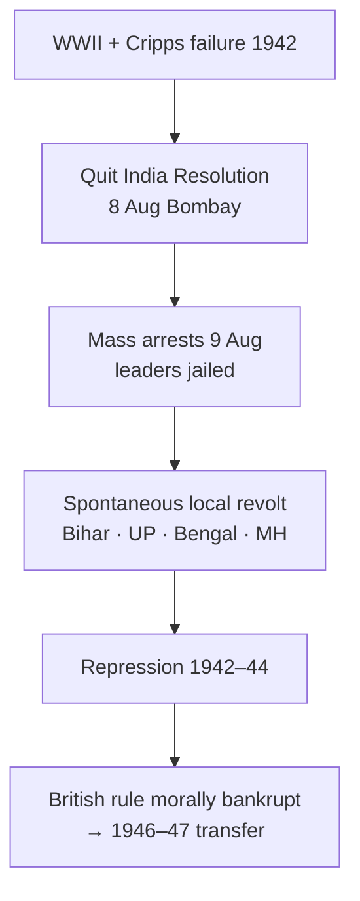

# Quit India & Late Nationalism

> GS-1 · Topic 02 · Quit India 1942, WWII phase, Cripps, INA, transfer of power build-up

---

## PYQs

| Year | M | Words | Question (EN) | प्रश्न (HI) | ID |
|------|---|-------|---------------|-------------|-----|
| 2019 | 12 | 200 | Examine the role of Quit India Movement in the freedom movement of India. | भारत के स्वतंत्रता आंदोलन में भारत छोड़ो आंदोलन के योगदान का परीक्षण कीजिए। | Q1 |
| — | 12 | 200 | *Likely:* Discuss the significance of the Quit India Resolution (1942). | *संभावित:* भारत छोड़ो प्रस्ताव (1942) के महत्व की विवेचना कीजिए। | Q2 |

---

## Quick Revision

```
LATE NATIONALISM (1939–47): WWII · Congress ministries resign 1939 · Cripps 1942 · Quit India · INA trials · 1946 RIN mutiny

QUIT INDIA 1942:
  Trigger: WWII — India forced into war · Cripps Mission failure (Mar 1942) · Japanese advance in Burma
  Resolution: 8 Aug 1942 Bombay (Gowalia Tank) · "Do or Die" · Gandhi · AICC
  Arrests: 9 Aug — Gandhi, Nehru, Patel, Azad, all top leaders → LEADERLESS revolt
  Spread: Bihar · UP · Bengal · Maharashtra · Karnataka — parallel govts (Ballia, Tamluk, Satara)
  Methods: Hartals · sabotage · telegraph/rail disruption · student-workers-peasants · NOT army mutiny (mostly)
  Repression: Mass shootings · fines · village burning · 94000+ arrests · army occupation
  Outcome: Suppressed by 1944 · BUT British moral authority destroyed · "August Revolution"

ROLE IN FREEDOM STRUGGLE (PYQ):
  Peak mass upsurge after 1919–42 Gandhian phases · proved British can't rule without consent
  Forced post-war settlement · Wavell Plan · Cabinet Mission 1946 · accelerated independence
  Youth/women/peasants radicalised · underground (Usha Mehta Congress Radio, Jayaprakash Narayan)
  Communal violence ↑ during vacuum · Muslim League strengthened separate Pakistan demand
  Complement: INA trials 1945–46 · RIN mutiny Feb 1946 · post-war Labour govt in Britain

CRIPPS MISSION (Mar 1942): Dominion status after war · provinces could secede · rejected by Congress
  Gandhi: "post-dated cheque on failing bank" · Hindu Mahasabha/Muslim League also dissatisfied

PARALLEL LATE NATIONALISM:
  Subhas Bose · INA · Azad Hind Govt (1943) · "Delhi Chalo" · Imphal/Kohima 1944
  Rajaji formula 1944 · Wavell Plan 1945 · Cabinet Mission 1946 · Direct Action Day 1946

CONTEMPORARY: 8 Aug Quit India Day · Art 51A(f) · Red Fort trials memory · NEP 2020
  Azadi Ka Amrit Mahotsav · August Kranti memorial Mumbai

TRAPS: Quit India ≠ Gandhi led on ground (in jail) | NOT immediate independence 1942
  Cripps ≠ offered full independence now | INA ≠ same as Quit India but complementary
  Ballia/Tamluk parallel govts ≠ all-India gov | Movement suppressed ≠ failure
  Muslim League did NOT lead Quit India — separate Pakistan politics
```

---

## Content

### Context — late nationalism and Quit India

- **Late nationalism phase (1939–1947):** Indian freedom struggle entered **final confrontation** — **World War II**, **Congress ministries resign (1939)**, **Cripps Mission failure (1942)**, **Quit India Movement**, **INA trials**, **1946 naval mutiny**, **Cabinet Mission**, leading to **Independence and Partition (1947)**.
- **Quit India Movement (August 1942)** — also called **August Kranti** — **final Gandhian mass upsurge**; **Congress leadership arrested** within **hours** — movement became **spontaneous, leaderless, localised**.
- **UPPCS 2019 question:** **Examine role** in freedom movement — requires **causes, course, character, repression, outcomes, link to 1947**, **balanced limits**.

### Background — why Quit India arose (1939–42)

| Factor | Detail |
|--------|--------|
| **WWII (1939)** | **Linlithgow** declared **India at war** without **Congress consent** — **provincial ministries resigned (Oct-Nov 1939)** |
| **Nationalist frustration** | **1935 Act** insufficient; **war sacrifices** without **freedom promise** |
| **Japanese threat** | **Fall of Burma (1942)** — **Imphal/Kohima** frontier — fear **British would abandon India** after using resources |
| **Cripps Mission failure (March 1942)** | **Dominion status after war**, **constituent assembly**, **provinces could secede** — **Congress rejected** — **no immediate transfer** |
| **Gandhi's conviction** | **British presence** invited **Japanese invasion**; **"Do or Die"** for **orderly British withdrawal** |

**Cripps Mission — why it failed (exam context)**
- **Sir Stafford Cripps** — **March 1942** — **Labour war cabinet** envoy.
- **Offer:** **Dominion status** post-war, **Constituent Assembly**, **Muslim/non-Muslim provinces option to secede**.
- **Congress rejection:** **Gandhi** — **"post-dated cheque on a crashing bank"**; **no immediate self-government**, **defence retained by British**, **province secession = Pakistan embryo**.
- **Muslim League** also **rejected** — wanted **explicit Pakistan** first.
- **Result:** **Last major negotiation before Quit India** — **breakdown → mass struggle**.

### Quit India Resolution and launch (8 August 1942)

**Resolution — AICC, Gowalia Tank Maidan, Bombay (7–8 August 1942)**
- Moved by **Jawaharlal Nehru**, seconded by **Narendra Deva** — adopted **8 August 1942**.
- **Demand:** **Immediate end to British rule in India** — Gandhi named movement **"Quit India"**.
- **Gandhi's mantra:** **"Do or Die" ( Karenge ya marenge )** — **non-violent** but **total commitment**.
- **Authorised Gandhi** to lead **mass struggle** on **widest scale**.

**Immediate repression (Operation Zero Hour)**
- **9 August 1942 dawn:** **All top leaders arrested** — **Gandhi, Nehru, Patel, Azad, Rajagopalachari, Abdul Ghaffar Khan** — imprisoned in **Ahmednagar Fort, Yerwada, etc.**
- **Congress banned** — **local leaders** carried burden — **no central command**.



### Course and character of the movement

**Geographic spread and intensity**

| Region | Features |
|--------|----------|
| **Bihar** | **Strongest** — **students, peasants**; **Muzaffarpur, Patna**; **Jayaprakash Narayan** underground |
| **Eastern UP** | **Ballia** — **parallel government (Chittu Pandey)** for **short period** |
| **Bengal** | **Tamluk (Midnapore)** — **Tamralipta Jatiya Sarkar** — **relief, courts, schools** |
| **Maharashtra** | **Satara** — **Prati Sarkar (1942–44)** under **Nana Patil** — **most sustained parallel rule** |
| **Karnataka** | **Peasant upsurge**, **sabotage** |
| **Bombay, Delhi** | **Strikes, hartals** — **Usha Mehta's Congress Radio** (underground) |

**Methods used**
- **Hartals, demonstrations, processions** — **students and workers** prominent.
- **Sabotage:** **Railway lines cut**, **telegraph wires destroyed** — **deny British communication** ( **not same as terrorist bombings** — **mass decentralised**).
- **Attacks on police stations, treasuries** — **local anger** — **some violence** despite **Gandhi's non-violence call**.
- **Parallel institutions:** **People's courts, volunteer corps, famine relief** — **Satara Prati Sarkar** — **alternative governance experiment**.

**Underground and communication**
- **Jayaprakash Narayan (JP), Ram Manohar Lohia, Aruna Asaf Ali** — **underground networks**.
- **Usha Mehta** — **Secret Congress Radio (42.34 metres)** — **broadcast 14 Aug–27 Oct 1942** — **symbol of defiance**.
- **Aruna Asaf Ali** — **hoisted flag at Gowalia Tank** when **leaders arrested**.

**Social composition**
- **Peasants, students, workers, tribals (parts of Bihar/Orissa)** — **wider than earlier urban Congress phases**.
- **Women:** **Usha Mehta, Aruna Asaf Ali, Matangini Hazra (1942 procession, Tamluk)** — **active participation**.
- **Muslim participation:** **Limited in League-dominated areas** — **League opposed Quit India**, **cooperated with British** — **communal politics sharpened**.

### British repression and suppression

- **Military deployment:** **572 battalions** by **end 1942** — **collective fines**, **village burning** (**Madhya Pradesh, Bihar**).
- **Massacres:** **Patna, Gorakhpur, Delhi** — **firing on crowds**.
- **Arrests:** **Approx. 94,000+** — **60,000+ in Bihar alone** (figures vary by source).
- **Press blackout, censorship** — **movement suppressed by 1943–44** in **most areas** — **Satara Prati Sarkar till 1944**.
- **Gandhi fast (1943)** in **Aga Khan Palace** — **health decline** — **Kasturba died (1944)**.

### Role of Quit India in the freedom movement (PYQ core)

**1. Culmination of Gandhian mass nationalism**
- After **Non-Cooperation (1920–22), Civil Disobedience (1930–34), Individual Satyagraha (1940–41)** — **Quit India = final mass phase**.
- **Proved** Indian **rejection of colonial rule** was **mass-based**, not **elite alone**.

**2. Destroyed British moral legitimacy**
- **Viceroy Linlithgow's** **repression** — **international criticism** ( **Allied war against fascism** while **crushing democracy in India** ).
- **Official British view post-war:** **India ungovernable without consent** — **Attlee (1947)** acknowledged **Quit India, INA, mutinies** role in **leaving India**.

**3. Accelerated post-war constitutional settlement**
- **Wavell Plan (1945)**, **Simla Conference failure**, **Cabinet Mission (1946)**, **Constituent Assembly** — **direct chain** from **1942 breakdown of negotiation**.
- **1946 elections** — **Congress massive victory** — **mandate for freedom** strengthened.

**4. Radicalised youth and underground legacy**
- **JP, Lohia, socialist wing** — **post-independence politics** shaped by **1942 underground**.
- **Peasant militancy** — **post-1947 land movements** partly rooted in **1942 awakening**.

**5. Parallel and complementary streams (not Quit India alone)**
- **Subhas Chandra Bose, INA (1943–45)** — **military challenge**; **INA trials (Red Fort 1945–46)** — **national upsurge**.
- **Royal Indian Navy mutiny (Feb 1946)** — ** Bombay, Karachi** — **armed personnel revolt** — **final nail** in **colonial confidence**.
- **Exam balance:** **Quit India + INA + 1946 mutiny + post-war Labour government + WWII exhaustion** together **secured 1947** — **not Quit India alone**.

**6. Limits and negative consequences**
- **Did not achieve immediate quit (1942)** — **suppressed militarily**.
- **Leaderless violence** in pockets — **Gandhi's non-violence diluted** — ** gave British propaganda**.
- **Communal divide widened** — **Muslim League** **strengthened** as **"loyal opposition"** during **1942–45** — **Pakistan demand hardened**.
- **No unified alternative government at national level** — **parallel govts local and temporary**.

### Late nationalism beyond Quit India (1943–47) — contextual frame

| Event | Year | Significance |
|-------|------|--------------|
| **Azad Hind Govt / INA** | **1943–45** | **Subhas Bose** — **Imphal/Kohima 1944**; **INA trials unified sentiment 1945–46** |
| **Rajaji formula** | **1944** | **Congress-League coexistence attempt** — failed |
| **Wavell Plan / Simla Conference** | **1945** | **Executive Council expansion** — **Jinnah-Congress deadlock** |
| **INA Red Fort trials** | **Nov 1945–46** | **Mass protests** — **"Sehgal, Dhillon, Shah Nawaz"** |
| **RIN Mutiny** | **Feb 1946** | **Sailors' strike** — **nationalist sympathy** |
| **Cabinet Mission** | **1946** | **Three-tier plan** — **Constituent Assembly elected** |
| **Direct Action Day** | **16 Aug 1946** | **Calcutta killings** — **Partition trajectory** |
| **Mountbatten Plan** | **June 1947** | **Partition + independence (15 Aug 1947)** |

### Significance — short synthesis

- **Quit India (1942)** = **"August Revolution"** in **nationalist historiography** — **largest short-term mass rebellion** against **British since 1857** (different character — **Congress-led ethos**, **decentralised**).
- **Psychological turning point:** **British elite** accepted **exit inevitable** after **1945** — **Attlee statement 1947** references **multiple pressures**.
- **UP relevance:** **Eastern UP (Ballia)**, **Bihar border** — **strong 1942 participation** — **regional pride in memorials**.

### Contemporary relevance

- **August Kranti Diwas (8 August)** — **national observance**; **Gowalia Tank (August Kranti Maidan), Mumbai** — **memorial, museum**.
- **Article 51A(f):** **Cherish freedom struggle heritage** — **Quit India central to school/NCC/NEP narratives**.
- **Azadi Ka Amrit Mahotsav (2021–25):** **1942 exhibitions**, **digital archives of martyrs**, **Usha Mehta Congress Radio recreated**.
- **Aga Khan Palace, Pune** — **Gandhi national memorial (Art 49)** — **1942 arrest site**, **Kasturba samadhi**.
- **NEP 2020:** **Critical history** — **Quit India successes and communal costs** taught together.
- **Democracy debate:** **1942 leaderless upsurge** vs **constitutional transfer 1947** — **foundational tension in republic legitimacy**.
- **JP/Lohia legacy:** **Socialist movement, Total Revolution (1974)** — **traces to 1942 underground**.

### Limits and balanced view

- **Not immediate independence** — **5 years later (1947)** with **Partition**.
- **Muslim League trajectory diverged** — **cannot claim Quit India unified all communities**.
- **Violence and sabotage** — **debated** as **departure from Gandhian ahimsa**.
- **British records** emphasise **lawlessness** — **nationalist records** emphasise **moral victory** — **exam answers need both**.
- **INA/RIN mutiny** — **separate but complementary** — **credit Quit India role without ignoring other factors**.

---

## Answers

### Q1: Examine the role of Quit India Movement in the freedom movement of India. (2019, 12M, 200W)

**Opening:**
> The Quit India Movement (August 1942) was the final Gandhian mass upsurge against British rule — leaderless after top arrests, suppressed by 1944, yet decisive in destroying colonial moral authority and accelerating India's path to independence in 1947.

**Write these points:**
- **Context and launch:** After **Cripps Mission failure (1942)** and **WWII imposition**, **AICC Quit India resolution (8 Aug, Gowalia Tank)** with **"Do or Die"** — **immediate arrest of Gandhi, Nehru, Patel (9 Aug)** — **spontaneous nationwide revolt**.
- **Mass character:** **Students, peasants, workers** in **Bihar, UP (Ballia), Bengal (Tamluk), Maharashtra (Satara Prati Sarkar)** — **hartals, sabotage of railways/telegraphs**, **parallel local governments** — **widest social participation since 1919**.
- **Underground role:** **JP, Lohia, Usha Mehta (Congress Radio), Aruna Asaf Ali** — **sustained morale** when **Congress banned**.
- **Repression and moral defeat of British:** **94000+ arrests**, **massacres, village fines** — **Allied war for democracy vs Indian firing** — **post-war British consensus: exit necessary**.
- **Link to 1947:** Combined with **INA trials (1945–46), RIN mutiny (1946), Cabinet Mission, 1946 elections** — **Quit India proved India ungovernable without consent** — **Attlee acknowledged 1942 pressures**.
- **Limits:** **Not immediate freedom**; **Muslim League opposed** — **Pakistan demand hardened**; **some violence** beyond **Gandhi's non-violence** — **movement suppressed militarily by 1944**.

**Conclusion:**
> Quit India's role was pivotal as the climactic mass rejection of British rule — morally bankrupting the Raj and forcing post-war constitutional settlement, even though independence came in 1947 through a broader convergence of forces including INA, mutinies, and imperial exhaustion.

---

### Q2: *Likely:* Discuss the significance of the Quit India Resolution (1942). (Future variant, 12M, 200W)

**Opening:**
> The Quit India Resolution of 8 August 1942 marked Congress's formal demand for immediate British withdrawal and authorised the largest mass struggle of the Gandhian era.

**Write these points:**
- **Content:** **Immediate independence**; **Gandhi to lead struggle**; **"Do or Die"** slogan — **non-violent in intent**.
- **Historical moment:** **Post-Cripps breakdown** — **last constitutional hope exhausted**.
- **Consequence of arrests:** **Leaderless decentralised revolt** — **unexpected mass scale**.
- **Significance:** **August Revolution** label; **parallel govts**; **British repression exposed**.
- **Legacy:** **Direct path to 1946–47 negotiations**; **radicalised youth (JP, Lohia)**.

**Conclusion:**
> The resolution transformed wartime impasse into open mass confrontation — its significance lies in unleashing spontaneous nationwide resistance that made continued colonial rule politically impossible after WWII.

---

### Q3: *Likely:* Why did the Cripps Mission fail and how did it lead to Quit India? (Future variant, 8M, 125W)

**Opening:**
> The Cripps Mission (March 1942) failed because its offer of post-war dominion status with provincial secession satisfied neither Congress's demand for immediate self-government nor the Muslim League's Pakistan demand — directly triggering Quit India.

**Write these points:**
- **Cripps offer:** **Dominion status after war**, **Constituent Assembly**, **provinces may secede**, **British control defence during war**.
- **Congress rejection:** **Gandhi** — **post-dated cheque**; **no real transfer now**.
- **League rejection:** **No explicit Pakistan** — **insufficient**.
- **Link:** **Negotiation dead end** → **8 Aug Quit India resolution** — **"Do or Die"**.

**Conclusion:**
> Cripps failure closed the constitutional outlet during WWII, making Quit India the inevitable Congress response to colonial intransigence.

---

## Traps

| Wrong | Correct |
|-------|---------|
| Gandhi personally led Quit India on the ground in 1942 | **Arrested 9 Aug 1942** — movement **leaderless/spontaneous** |
| Quit India achieved independence immediately | **Suppressed by 1944** — **independence 1947** after **multiple factors** |
| Muslim League led Quit India | **League opposed** — **cooperated with British** during **1942–45** |
| Cripps offered immediate full independence | **Dominion status after war** only — **defence under British during war** |
| Quit India was purely non-violent everywhere | **Gandhi's call non-violent** — **sabotage, clashes** occurred **locally** |
| INA and Quit India are the same movement | **Separate streams** — **complementary** pressure on British (Bose vs Gandhi methods) |
| Parallel governments ruled all India | **Local and temporary** — **Ballia, Tamluk, Satara** — **not national government** |
| British welcomed Quit India negotiations | **Mass repression** — **Congress banned** |
| Quit India alone caused 1947 | Also **WWII, INA trials, RIN mutiny 1946, Labour Attlee govt, economic exhaustion** |
| August Kranti was in Delhi | **Resolution at Bombay (Gowalia Tank)** — **8 August 1942** |
| All Congress leaders free during movement | **Top leadership in Ahmednagar/Yerwada** — **underground second line active** |
| Cripps satisfied Congress partially | **Congress unanimously rejected** — **Gandhi, Nehru, Azad** |
| Movement had central command after arrests | **Decentralised local initiative** — **strength and weakness** |

---

*Complete.*
