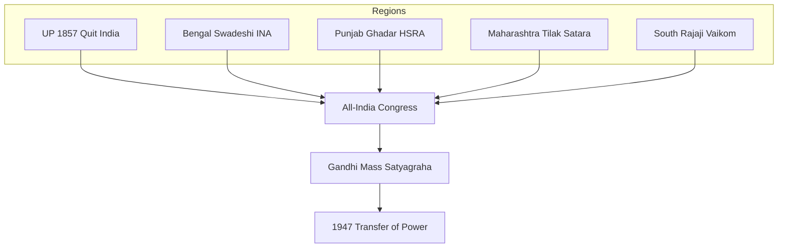

# Regional Contributors — Freedom Struggle

> GS-1 · Topic 03 · Bengal, UP, Punjab, Maharashtra, South — leaders and movements by region

---

## PYQs

| Year | M | Words | Question (EN) | प्रश्न (HI) | ID |
|------|---|-------|---------------|-------------|-----|
| — | 12 | 200 | *Likely:* Highlight contributions of different regions to the freedom struggle. | *संभावित:* स्वतंत्रता संग्राम में विभिन्न क्षेत्रों के योगदान पर प्रकाश डालिए। | Q1 |

---

## Quick Revision

```
UP (UPPCS priority):
  1857: Begum Hazrat Mahal (Lucknow) · Rani Lakshmibai (Jhansi) · Kunwar Singh (Bihar border)
  Peasant: Eka 1921–22 (Awadh) · Bardoli linked Patel not UP · Quit India Ballia parallel govt
  Leaders: Motilal/Jawaharlal Nehru (Allahabad) · Purushottam Das Tandon · Govind Ballabh Pant
  Muslim: Maulana Shaukat Ali · Hakim Ajmal Khan (Khilafat)

BENGAL: Partition 1905 swadeshi · Anushilan/Jugantar · Surya Sen Chittagong · Subhas Bose
  Bipin Pal · C.R. Das · Surendranath Banerjea · Quit India Tamluk Tamralipta Sarkar

PUNJAB: Lala Lajpat Rai · Bhagat Singh · HSRA · Komagata Maru 1914 · Jallianwala 1919
  Ghadar Party (1913) · Akali movement linked · Partition trauma 1947

MAHARASHTRA: Tilak (Extremist) · Savarkar · Prati Sarkar Satara 1942 · Ambedkar (social)
  Gandhi base Sabarmati/ Yerwada · Revolutionary Chapekar

SOUTH: Rajaji (Madras) · K. Kelappan (Vaikom) · Andhra Rampa 1922–24 · Kerala Mapilla 1921
  Periyar self-respect (social, overlaps Dravidian)

TRAPS: Regional ≠ isolated — all-India Congress connected | UP 1857 ≠ only Rani Jhansi
  Bengal revolution ≠ only violence | South ≠ absent in nationalism
```

---

## Content

### Context — regional diversity in one struggle

- **Freedom struggle** was **nationwide** but **regionally textured** — **leaders, methods, social bases** varied — **UPPCS favours UP** alongside **Bengal, Punjab, Maharashtra**.
- **Syllabus keyword:** *contributors from different parts of country* — exam expects **named regions, events, leaders**, not a generic Congress timeline (see **03.1** for stages).
- **Exam approach:** **Region → key events → leaders → contribution to all-India movement** — finish with **synthesis** (Gandhi integrated regional grievances).

### Delhi and North-West — imperial centre to mass politics

| Phase | Contribution | Leaders / sites |
|-------|--------------|-----------------|
| **1857** | **Delhi siege** — **Bahadur Shah II symbolic centre** | **Ghazi-ud-din, Bakht Khan** |
| **1911** | **Capital shifted Calcutta → Delhi** — **imperial symbolism** | **British Raj consolidation** |
| **1919** | **Rowlatt satyagraha** — **national protest hub** | **Gandhi, Muslim-Hindu joint hartals** |
| **1942 Quit India** | **Gowalia Tank (Bombay resolution)** but **Delhi underground** | **Aruna Asaf Ali hoists Congress flag at Asaf Ali Road** |
| **Frontier** | **North-West Frontier Province** — **Pathan satyagraha** | **Khan Abdul Ghaffar Khan ("Frontier Gandhi")**, **Khudai Khidmatgars** |

- **Punjab-Delhi corridor:** **Jallianwala (1919)** and **1947 Partition violence** — **North-West as high-intensity theatre**.
- **UP-Delhi link:** **Meerut 1857 → Delhi** — **Awadh-Doab belt** fed **1857 and 1942** peaks.

### Bombay (Maharashtra-Gujarat axis) — business, press, labour

- **Early Congress:** **1885 first session Bombay** — **Pherozeshah Mehta, Dinshaw Wacha** — **Moderate merchant elite base**.
- **Extremist-revolutionary:** **Chapekar brothers (1897)** — **Tilak-linked context** — **first political assassinations of British officers**.
- **Labour nationalism:** **Bombay textile strikes (1919–21)** — **Girni Kamgar Union** — **urban working class joined Rowlatt/NCM**.
- **Quit India:** **Congress Radio (Usha Mehta, 1942)** — **underground communication** when **leaders arrested**.
- **Gandhi sites:** **Mani Bhavan, August Kranti Maidan (Gowalia Tank)** — **national but Bombay-rooted**.

### Bihar, Odisha, Assam — eastern belt

| Region | Contribution | Leaders / events |
|--------|--------------|------------------|
| **Bihar** | **Champaran (1917)**, **Quit India stronghold**, **1857 Kunwar Singh** | **Gandhi, JP Narayan, Rajendra Prasad** |
| **Odisha** | **Utkal Sammilani (1903)** — **separate province demand** | **Madhusudan Das** — **regional + nationalist** |
| **Assam** | **Non-Cooperation**, **Quit India**, **tea garden labour** | **Gopinath Bordoloi** — **Congress, later CM** |
| **Chittagong (Bengal)** | **1930 Armoury Raid** | **Surya Sen, Pritilata Waddedar** |

### Gujarat and Rajasthan

- **Gujarat:** **Kheda (1918), Bardoli (1928), Dandi Salt March (1930)** — **Gandhi-Sardar Patel base**.
- **Rajasthan:** **1857 in Kota, Awagarh**; **princely states mostly loyal to British** — **post-1947 integration complex**.
- **Rajasthan peasant:** **Bijolia movement (1916–20)** — **against feudal dues** — **precursor to agrarian politics**.

### Women — regional contributors (cross-region)

| Leader | Region | Role |
|--------|--------|------|
| **Rani Lakshmibai** | **Jhansi (UP)** | **1857 military leadership** |
| **Begum Hazrat Mahal** | **Lucknow (UP)** | **Awadh resistance** |
| **Pritilata Waddedar** | **Bengal** | **Chittagong raid, Pahartali** |
| **Aruna Asaf Ali** | **Delhi/Bombay** | **Quit India flag hoisting** |
| **Usha Mehta** | **Bombay** | **Congress Radio 1942** |
| **Matangini Hazra** | **Bengal** | **Quit India procession martyr** |
| **Savitribai Phule** | **Maharashtra** | **Social reform + 1857 generation precursor** |

### Uttar Pradesh — exam priority

| Phase | Contribution | Leaders / sites |
|-------|--------------|-----------------|
| **1857** | **Awadh centre** — **Lucknow siege**, **Jhansi** | **Begum Hazrat Mahal**, **Rani Lakshmibai**, **Nana Sahib (Kanpur)** |
| **Congress era** | **Allahabad sessions** — **1888, 1892**; **Nehru family base** | **Motilal Nehru, Jawaharlal Nehru** |
| **Khilafat-Non-Cooperation** | **Strong Muslim participation** | **Maulana Shaukat Ali, Hakim Ajmal Khan** |
| **Peasant** | **Eka movement (1921–22)** — **Awadh tenants vs taluqdars** | **Madhari Pasi and local leaders** |
| **Quit India** | **Ballia parallel government (1942)** | **Chittu Pandey** |
| **Constitutional** | **Govind Ballabh Pant** — **UP premier 1937**; **Purushottam Das Tandon** — **Hindi-Hindustani debate** |
| **Revolutionary link** | **Kakori conspiracy (1925)** — **Ram Prasad Bismil, Ashfaqullah** — **UP heartland** |
| **1930 CDM** | **No-tax campaigns**, **forest satyagraha** in **eastern UP** | **Integrated with all-India salt march** |

### Uttar Pradesh — additional sites (UPPCS)

- **Meerut (1857)** — **sepoy mutiny starting point** — **national memorial**.
- **Faizabad** — **Maulvi Ahmadullah Shah** — **1857 Awadh resistance**.
- **Allahabad** — **Anand Bhawan, Swaraj Bhawan** — **Nehru family political base**.
- **Chauri Chaura (1922, Gorakhpur district)** — **police station burnt** — **Gandhi withdrew NCM** — **UP peasant anger**.
- **Rampur, Bareilly, Shahjahanpur** — **1857 and Kakori revolutionary belt**.
- **Aligarh (adjacent)** — **Sir Syed's MAO College** — **Muslim modern education hub** (see 03.3).

### Bengal — swadeshi, revolution, Bose

| Phase | Contribution | Leaders / events |
|-------|--------------|------------------|
| **Moderate era** | **Early Congress leadership** | **Surendranath Banerjea**, **Indian Association (1876)** |
| **1905 Swadeshi** | **Partition of Bengal protest** — **boycott, national schools, rakhi bandhan** | **Bipin Chandra Pal**, **Aurobindo Ghosh**, **C.R. Das** |
| **Extremist/revolutionary** | **Anushilan Samiti, Jugantar** — **underground networks** | **Khudiram Bose (1908)**, **Surya Sen (Chittagong 1930)** |
| **Gandhian-constitutional** | **Non-Cooperation, CDM** | **C.R. Das, Subhas Chandra Bose (early Congress)** |
| **1930s–40s** | **Congress Left, Forward Bloc, INA** | **Subhas Bose** — **president 1938, 1939** — **Azad Hind** |
| **Quit India** | **Tamralipta Jatiya Sarkar (Tamluk, 1942)** — **parallel government** | **Satish Chandra Samanta** |

- **Constructive swadeshi:** **National Council of Education (1906)**, **Bengal National College** — **linked to nationalist education** (see 03.3).
- **Partition annulled 1911** — **capital shifted to Delhi** — **partial Swadeshi victory**.

### Punjab

- **Lala Lajpat Rai** — **Extremist, Simon protest martyr (1928)**.
- **Jallianwala Bagh (1919)** — **Amritsar massacre** — **national turning point**.
- **Ghadar Party (1913)** — **revolutionary diaspora**.
- **HSRA:** **Bhagat Singh, Sukhdev, Rajguru, Chandrashekhar Azad**.
- **Komagata Maru (1914)** — **racist immigration policy protest**.

### Maharashtra

- **Tilak** — **Extremist icon**, **Ganesh utsav nationalism**.
- **Savarkar** — **Abhinav Bharat, Andaman imprisonment**.
- **Quit India:** **Satara Prati Sarkar (1942–44)** — **longest parallel rule**.
- **Gandhi:** **Sabarmati, Yerwada, Aga Khan Palace** — **national but Maharashtra-based sites**.
- **Ambedkar** — **Mahad satyagraha (1927), Poona Pact** — **social dimension**.

### South India

- **C. Rajagopalachari (Rajaji)** — **Madras Congress, salt march participant, first Indian Governor-General**.
- **K. Kelappan** — **Vaikom satyagraha (1924–25)** — **temple road access**.
- **Rampa rebellion (1922–24)** — **Alluri Sitarama Raju** — **tribal anti-British**.
- **Malabar Mapilla rebellion (1921)** — **Khilafat-linked, complex communal dimension**.
- **Periyar** — **Self-Respect Movement** — **social reform parallel to nationalism**.
- **Annie Besant** — **Home Rule League (Madras base 1916)** — **Theosophical network** — **South as bridge to mass politics** (see 03.1).
- **Andhra:** **Salt satyagraha at Vedaranyam (1930)** — **Rajaji-led southern counterpart to Dandi**.

### Princely states — loyalism vs exceptions

| State / region | British policy | Nationalist exception |
|----------------|----------------|----------------------|
| **Rajasthan, Central India** | **Most rulers loyal in 1857 and 1942** | **1857: Kota, Awagarh** — **limited revolt** |
| **Hyderabad (Deccan)** | **Nizam resisted accession till 1948** | **Communist-led Telangana peasant revolt (1946–51)** — **post-1947 but rooted in colonial agrarian order** |
| **Travancore** | **Progressive social reforms** | **Vaikom, temple entry movements** |
| **Kashmir** | **Dogra rule under paramountcy** | **Sheikh Abdullah's early activism (1930s)** — **regional autonomy strand** |

- **Exam trap:** **Princely states ≠ absent from struggle** — **peasant/tribal unrest often regional** even when **rulers loyal**.

### How regions connected — synthesis for answers

- **Congress as national spine:** **Regional leaders rose through provincial Congress** — **Pant (UP), Bose (Bengal), Patel (Gujarat), Rajaji (Madras)** — **all-India sessions rotated cities**.
- **Gandhi's method:** **Localized grievances (Champaran, Kheda, Bardoli) → national campaigns (NCM, CDM)** — **regions supplied foot soldiers**.
- **Revolutionary regionalism:** **Bengal samitis, Punjab HSRA, UP Kakori** — **fed all-India martyrdom narrative** without replacing **Congress mass base**.
- **Communal geography:** **Partition cut Punjab and Bengal** — **regional contribution includes tragic territorial division** — **link to 03.1 Partition section**.



### Regional comparison table

| Region | Primary strength in struggle | Signature method |
|--------|------------------------------|------------------|
| **UP** | **1857, Quit India, Congress leadership** | **Peasant + political** |
| **Bengal** | **Swadeshi, revolution, Bose** | **Boycott + underground** |
| **Punjab** | **Martyrs, Ghadar, HSRA** | **Revolutionary + agrarian protest** |
| **Maharashtra** | **Extremism, parallel govts** | **Cultural nationalism + satyagraha base** |
| **South** | **Constitutional Congress, social reform** | **Satyagraha on social issues** |

### Contemporary relevance

- **UP tourism/heritage:** **Jhansi fort, Lucknow Residency, Anand Bhawan (Allahabad)** — **Swadesh Darshan**.
- **Art 51A(f)** — **regional martyrs** in **state curricula**.
- **Azadi Ka Amrit Mahotsav** — **region-wise freedom fighter databases**.
- **UP-specific schemes:** **Rani Lakshmibai Gaurav Yatra, 1857 memorials at Meerut/Lucknow** — **state heritage tourism**.

### Limits

- **Regions interconnected** — **not isolated struggles**.
- **Avoid regional chauvinism** — **all contributed to all-India outcome**.
- **Some movements (Mapilla 1921)** — **communal/violent complexity** — **nuanced answers**.

---

## Answers

### Q1: *Likely:* Highlight contributions of different regions to the freedom struggle. (Future variant, 12M, 200W)

**Opening:**
> India's freedom struggle drew strength from regional centres — each contributing distinct leaders, movements, and methods to the all-India anti-colonial campaign.

**Write these points:**
- **UP:** **1857 (Begum Hazrat Mahal, Rani Lakshmibai)**, **Nehru leadership**, **Eka peasant (1921)**, **Ballia Quit India (1942)**.
- **Bengal:** **1905 Swadeshi**, **revolutionary samitis**, **Subhas Bose/INA**, **Tamluk parallel govt**.
- **Punjab:** **Jallianwala 1919**, **Lala Lajpat Rai**, **Ghadar, Bhagat Singh/HSRA**.
- **Maharashtra:** **Tilak's Extremism**, **Satara Prati Sarkar**, **Savarkar revolutionary legacy**.
- **South:** **Rajaji, Vaikom, Rampa tribal revolt** — **Congress + social satyagraha**.
- **Synthesis:** **Regional diversity enriched national movement** — **Gandhi integrated peasant-regional grievances into mass satyagraha**.

**Conclusion:**
> Regional contributions prove the freedom struggle was truly subcontinental — with UP, Bengal, and Punjab among the most decisive theatres shaping 1947.

---

### Q2: *Likely:* Discuss the contribution of Uttar Pradesh to the Indian freedom struggle. (Future variant, 12M, 200W)

**Opening:**
> Uttar Pradesh was a pivotal theatre of the freedom struggle — from 1857 revolt centres through Congress leadership to Quit India parallel government at Ballia.

**Write these points:**
- **1857:** **Lucknow (Begum Hazrat Mahal), Jhansi (Rani Lakshmibai), Kanpur (Nana Sahib), Faizabad (Maulvi Ahmadullah)**.
- **Congress era:** **Allahabad base of Nehrus**; **1888, 1892 sessions**; **Pant as UP premier 1937**.
- **Peasant:** **Eka movement (1921–22 Awadh)** against **talukdar exploitation**.
- **Revolutionary:** **Kakori conspiracy (1925)** — **Bismil, Ashfaqullah Khan**.
- **Quit India:** **Ballia parallel government (Chittu Pandey, 1942)** — **among strongest UP episodes**.
- **Khilafat-NCM:** **Shaukat Ali, Hakim Ajmal Khan** — **Hindu-Muslim joint participation**.

**Conclusion:**
> UP combined princely rebellion, peasant unrest, constitutional leadership, and Quit India radicalism — making it indispensable to India's freedom narrative.

---

## Traps

| Wrong | Correct |
|-------|---------|
| Freedom struggle only in Bengal and Maharashtra | **UP, Punjab, South all major** — **1857, 1919, 1942 peaks nationwide** |
| Regional leaders worked only locally | **Nehru, Bose, Tilak, Gandhi** — **national impact from regional bases** |
| South India absent in struggle | **Rajaji, Kelappan, Alluri Sitarama Raju** — **significant contributions** |
| UP contribution only 1857 Jhansi | Also **Awadh 1857, Nehrus, Eka, Ballia 1942, Pant, Kakori** |
| Princely states did not participate in struggle | **Most loyal to British** — **exceptions and post-1947 integration** |
| Women only in Bengal revolution | **Rani, Begum, Usha Mehta, Matangini Hazra, Pritilata** — **multi-region** |
| Kakori was Bengal event | **1925 UP** — **HRSA/Bismil** |
| Chauri Chaura was Bengal | **1922 Gorakhpur district, UP** — **NCM withdrawal context** |
| Tamralipta Sarkar was UP | **1942 Bengal (Midnapore)** — **not Ballia** |
| Regional struggle = separatism from India | **Regional bases fed all-India Congress/nationalism** |
| Frontier Gandhi was from Punjab | **Khan Abdul Ghaffar Khan — NWFP (now Khyber Pakhtunkhwa)** |
| Bombay only Moderate, no Extremism | **Chapekar 1897, labour strikes, Quit India Radio** |

---

*Complete.*
