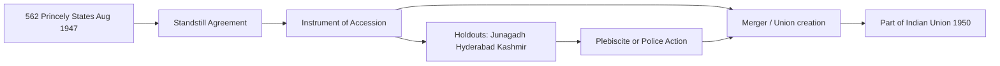

# Sardar Patel — Integration of Princely States

> GS-1 · Topic 04 · Unification of India 1947–65 — Patel, Menon, accession, Operation Polo, Goa

---

## PYQs

| Year | M | Words | Question (EN) | प्रश्न (HI) | ID |
|------|---|-------|---------------|-------------|-----|
| 2025 | 12 | 200 | Critically analyse the role of Sardar Vallabhbhai Patel in the Unification of India after Independence. | स्वतन्त्रता पश्चात् भारत के एकीकरण में सरदार पटेल की भूमिका का आलोचनात्मक विश्लेषण कीजिए। | Q1 |
| 2023 | 8 | — | Discuss the role of Sardar Patel in the unification of India after independence. | स्वतंत्रता प्राप्ति के उपरांत भारत के एकीकरण में सरदार पटेल की भूमिका की विवेचना कीजिए। | Q2 |
| 2018 | 8 | 125 | Explain the role of Sardar Vallabhbhai Patel in the integration of Princely States of India. | सरदार वल्लभभाई पटेल की भारतीय रियासतों के विलीनीकरण में भूमिका को स्पष्ट कीजिए। | Q3 |

---

## Quick Revision

```
PATEL (1875–1950): "Iron Man of India" · Home Minister + Minister of States (1947–50)
  Partner: V.P. Menon (Secretary, States Department) · Mountbatten (transition diplomacy)

CONTEXT Aug 1947:
  562 princely states · ~40% area · ~23% population · Paramountcy LAPSED (not transferred to India)
  British provinces → India/Pakistan · Rulers theoretically free → Patel integrated into Indian Union

POLICY TOOLS:
  1 Standstill Agreements (Aug 1947) — interim status quo
  2 Instrument of Accession (IoA) — defence, foreign affairs, communications to Dominion
  3 Merger / integration — smaller states into unions (Rajasthan, PEPSU, Saurashtra, Madhya Bharat)
  4 Plebiscite — Junagadh (Feb 1948 → India)
  5 Police action — Hyderabad Operation Polo (Sept 1948)

KEY CASES:
  Junagadh — Muslim ruler acceded Pakistan Oct 1947 · Indian blockade · plebiscite 1948 → India
  Kashmir — Maharaja Hari Singh IoA Oct 1947 · Pakistan invasion · UN/ war 1947–48 · UNRESOLVED
  Hyderabad — Nizam delayed · Razakars · Operation Polo 13–18 Sept 1948 · annexed
  Travancore — initial independence talk (CP Ramaswami) · acceded later
  Bhopal, Jodhpur — hesitation · Patel-Menon persuasion

CHRONOLOGY:
  July 1947 States Department · 15 Aug Independence · Nov 1947 Junagadh issue peaks
  Jan 1948 Gandhi assassination · Feb 1948 Junagoth plebiscite · Sept 1948 Hyderabad
  1949–50 major mergers · Patel died 15 Dec 1950 · Goa Portuguese till Dec 1961 (Operation Vijay)

SIGNIFICANCE: Prevented Balkanisation · single map for Republic 1950 · Art 1 "Union of States"
LIMITS (critical): Kashmir unfinished · force in Hyderabad criticized · Menon operational credit
  Privy purses abolished 1971 (post-Patel) · some accession terms debated (Art 370 era)

TRAPS: Patel ≠ sole actor (Menon, Mountbatten, Nehru) | 562 ≠ all by same method
  IoA ≠ full merger immediately | Hyderabad 1948 not 1947 | Goa 1961 not Patel (died 1950)
  Integration ≠ identical to present state boundaries (reorganisation 1956 later)
```

---

## Content

### Context — why integration was existential (1947)

- **15 August 1947:** British **paramountcy over 562 princely states lapsed** — rulers became **legally independent**; **British India** partitioned into **Dominion of India** and **Dominion of Pakistan**.
- **Without integration**, India risked **Balkanisation** — **~40% territory** and **~23% population** under princes; **Congress goal** = **single sovereign, secular, democratic Union**.
- **Sardar Vallabhbhai Patel** as **Deputy Prime Minister, Home Minister, and Minister of States** led political strategy; **V.P. Menon** (Secretary, States Department) executed negotiations — **Patel-Menon team** is standard exam framing.
- **Mountbatten** (Governor-General) provided **imperial-transition leverage** — **Standstill Agreements** and **Instrument of Accession (IoA)** template.

### Legal instruments — how accession worked

| Instrument | Purpose | Key subjects transferred to Dominion |
|------------|---------|--------------------------------------|
| **Standstill Agreement (Aug 1947)** | **Interim** — existing administrative arrangements continue | **No full accession yet** — buying time |
| **Instrument of Accession (IoA)** | **Ruler accedes to Dominion of India** | **Defence, foreign affairs, communications** (three subjects) |
| **Merger Agreement (1948–50)** | **Full integration** — ruler surrendered sovereignty | **State became part of Indian Union** — privy purse promised |
| **Integration Agreement** | **Gradual absorption into provinces/unions** | **Administrative unification** |

- **Art 1 Constitution (1950):** **"India, that is Bharat, shall be a Union of States"** — legal culmination of Patel's integration project.
- **IoA ≠ immediate merger:** Many rulers signed **IoA 1947** but **full merger** happened **1948–1956** through **Menon's phased plan**.



### Patel's strategy — persuasion, pressure, and force

**Phase 1 — Diplomatic consolidation (Aug–Dec 1947)**
- **All-India States' Peoples Conference** pressure + **Patel's personal letters** to rulers — **appeal to patriotism** and **warning of popular revolt**.
- **Most states acceded by August–November 1947** — **except holdouts**.
- **Privy purse and gun salute guarantees** — **carrot** for rulers surrendering power.

**Phase 2 — Problem states**

| State | Problem | Patel's response | Outcome |
|-------|---------|------------------|---------|
| **Junagadh (Kathiawar)** | **Nawab acceded to Pakistan (Sept 1947)** despite **Hindu majority** | **Blockade**, **provisional govt (Arzi Hukumat)**, **referendum** | **Plebiscite Feb 1948** — **over 99% for India** |
| **Kashmir** | **Maharaja Hari Singh** undecided; **Pathan invasion Oct 1947** | **IoA signed 26 Oct 1947**; **Indian troops airlifted**; **Sheikh Abdullah** supported accession | **Acceded but dispute with Pakistan** — **UN, 1947–48 war** — **unfinished** |
| **Hyderabad (Deccan)** | **Nizam Osman Ali** sought **independence**; **Razakar militia** (Qasim Razvi) | **Standstill violated**; **Operation Polo (13–18 Sept 1948)** — **police action** | **Annexed as Hyderabad State** — later **Andhra Pradesh** (1956) |
| **Travancore** | **Dewan C.P. Ramaswami Iyer** explored **separate independence** | **Patel-Menon pressure**, **popular agitation** | **Acceded July 1947** |
| **Bhopal, Indore, Jodhpur** | **Initial hesitation** | **Patel's firm diplomacy** | **Acceded 1947** |

**Phase 3 — Structural merger (1948–1950)**
- **Small states merged** into **unions**: **Saurashtra, Rajasthan (Rajputana), Madhya Bharat, Vindhya Pradesh, PEPSU, Patiala-East Punjab States Union**.
- **By Patel's death (15 December 1950)**, **integration largely complete** except **Kashmir special status** and **foreign-held Goa, Pondicherry** (later episodes).

### V.P. Menon and Mountbatten — shared credit

| Actor | Role |
|-------|------|
| **Sardar Patel** | **Political authority**, **final decisions**, **use of force approval (Hyderabad)**, **coordination with Nehru/Congress** |
| **V.P. Menon** | **Drafted IoA**, **negotiated with rulers**, **designed merger roadmap** — *Integration of Indian States* (1956 memoir) |
| **Lord Mountbatten** | **Governor-General** — **persuaded hesitant princes**, **Standstill template**, **Junagadh/Kashmir context** |
| **Jawaharlal Nehru** | **PM** — **Kashmir internationalised**, **foreign policy**; sometimes **more cautious on force** than Patel |

- **Exam balance:** Credit **Patel's leadership** but note **Menon's operational genius** — not one-man show.

### Kashmir — integration success and limit

- **Maharaja Hari Singh** signed **IoA (26 October 1947)** after **tribal invasion** from Pakistan.
- **Sheikh Abdullah** — **National Conference** — **supported accession** to **secular India**.
- **First Indo-Pak war (1947–48)** — **UN ceasefire**, **Line of Control** — **territory divided**, **not fully integrated politically** as normal state until **Art 370 abrogation (2019)** — **beyond Patel era but root in 1947**.
- **Critical point:** Patel secured **IoA** but **Kashmir remained India's most complex integration challenge**.

### Hyderabad — Operation Polo (1948)

- **Largest princely state** — **Nizam** wealthy, **Muslim ruler over Hindu majority**.
- **Razakars** — **communal militia** — **atrocities**, **economic blockade of Indian territory**.
- **Patel ordered police action** after **negotiations failed** — **13–18 September 1948** — **Indian Army (Gen. J.N. Chaudhari)**.
- **Criticism:** **Use of force**, **Sundarlal Report** (unreleased for decades) on **post-action violence** — **critical exam angle for 2025**.
- **Significance:** **Removed biggest secessionist threat** — **unified Deccan** under India.

### Junagadh — plebiscite model

- **Nawab Muhammad Mahabat Khanji** acceded to **Pakistan (15 Sept 1947)** — **geographically linked to India**.
- **India rejected accession** — **economic blockade**, **Provisional Government of Junagadh (Arzi Hukumat)** under **Samaldas Gandhi**.
- **Plebiscite 20 February 1948** — **overwhelming for India** — **democratic legitimacy** model vs **Hyderabad force**.

### Integration by 1965 — syllabus endpoint

| Milestone | Year | Note |
|-----------|------|------|
| **Major princely accession** | **1947–48** | **Patel-Menon phase** |
| **Hyderabad annexed** | **1948** | **Operation Polo** |
| **Constitution commencement** | **26 Jan 1950** | **Union of States** |
| **Patel's death** | **15 Dec 1950** | **"Iron Man"** |
| **States Reorganisation Act** | **1956** | **Linguistic states** — **reorganisation, not secession** |
| **Goa liberation (Operation Vijay)** | **19 Dec 1961** | **Portuguese exit** — **within syllabus till 1965** |
| **Privy purses abolished** | **1971** (26th Amendment) | **Post-Patel — ends princely privileges** |

### Major unions and mergers (1948–1950) — exam table

| Union / entity | Constituent princely states (examples) | Significance |
|----------------|----------------------------------------|--------------|
| **Saurashtra** | **Kathiawar peninsula states** | **Western India consolidation** |
| **Rajasthan (Rajputana)** | **Jodhpur, Jaipur, Udaipur, Bikaner etc.** | **Largest union by area** — **Patel's patient negotiation** |
| **Madhya Bharat** | **Gwalior, Indore, Malwa region** | **Central India integration** |
| **Vindhya Pradesh** | **Bundelkhand princely cluster** | **Later merged into MP (1956)** |
| **PEPSU** | **Patiala, Kapurthala, Faridkot etc.** | **Punjab region Sikh states** |
| **Travancore-Cochin** | **1949 merger** | **South Indian union** — **later Kerala (1956)** |

- **Patel's method:** **Stage-wise** — **IoA first**, **central control of defence/foreign affairs**, **then absorption** — **avoided revolt by sequencing concessions (privy purse, titles)**.

### Portuguese and French enclaves — unfinished at Patel's death

| Territory | Colonial power | Integrated | Note |
|-----------|----------------|------------|------|
| **Goa, Daman, Diu** | **Portugal** | **19 December 1961 (Operation Vijay)** | **Within 1965 syllabus** — **not Patel era** |
| **Pondicherry, Karaikal, Yanam, Mahe** | **France** | **1962 (de facto transfer)** | **Chandernagore earlier (1951)** |
| **Sikkim** | **Protectorate** | **1975 (later)** | **Outside immediate Patel phase** |

- **Exam point:** Patel **nearly completed** princely integration; **European enclaves** remained **post-1950 challenge** — **Goa by 1961** fits **syllabus till 1965**.

### Patel vs Nehru — integration and Kashmir (critical nuance)

- **Patel** — **pragmatic, firm on Hyderabad/Junagadh**, **preferred administrative integration**.
- **Nehru** — **internationalised Kashmir**, **UN reference**, **more cautious on visible force** — **some historians note tension** on **Hyderabad timing**.
- **Both agreed** on **non-fragmentation** — **disagreement on methods/pace**, not **goal of unity**.
- **2025 critical answer:** Acknowledge **Patel's indispensability** without **ignoring Nehru-Mountbatten roles** or **Kashmir complexity**.

### Instrument of Accession — legal content (exam depth)

- **Signed by ruler**, **accepted by Governor-General** — **bilateral treaty** under **Indian Independence Act 1947**.
- **Three subjects ceded to Dominion:** **Defence, External Affairs, Communications** — **all other subjects with state until merger**.
- **Clause on popular consent:** **Not mandatory in IoA text** — **criticism that integration was ruler-led**, not **plebiscite-based** (except **Junagadh**).
- **Jammu & Kashmir IoA (26 Oct 1947)** — **special conditions** — **later Art 370 (1950)** — **asymmetric federalism until 2019**.
- **Merge with Constitution:** **Part B States (1950)** listed princely territories — **1956 reorganisation** moved to **Part A state map**.

### Comparison — integration models in post-1947 India

| Model | Example | Patel's preference |
|-------|---------|-------------------|
| **Voluntary IoA + gradual merger** | **Most Rajputana, Central India states** | **Default preferred path** |
| **Plebiscite after provisional govt** | **Junagadh (1948)** | **When ruler acceded to wrong dominion** |
| **Police action / military integration** | **Hyderabad (1948)** | **Last resort when negotiations failed** |
| **Accession under war conditions** | **Kashmir (1947)** | **Accepted under invasion — internationalised** |
| **Negotiated with European power** | **Goa (1961)** | **Post-Patel — not princely state model** |

- **World comparison (one line):** Unlike **Bismarck's wars of German unification**, Patel mixed **law (IoA), diplomacy (Menon), and limited force** — **Indian federal compromise with princes**.

### Significance of Patel's integration

- **Prevented fragmentation** — **single Indian Union** for **Constitution, elections, defence**.
- **Secular state-building** — **Hyderabad, Junagadh** prevented **communal enclaves** aligned with **Pakistan or independence**.
- **Administrative unity** — **railways, currency, foreign policy** under **one centre**.
- **Symbolism:** **Statue of Unity (2018, Kevadia)** — **world's tallest statue** — **Patel as national integrator narrative**.
- **Federal template** — **Part B states (princely)** merged into **Part A/B reorganisation** — **1950 map ≠ 1956 map** but **sovereignty unified**.

### Contemporary relevance

- **Statue of Unity (Gujarat)** — **tourism circuit**, **Rashtriya Ekta Diwas (31 October, Patel's birth anniversary)** since **2014**.
- **Art 1–4 Constitution** — **Union of States** — **legal legacy of 1947–50 integration**.
- **Jammu & Kashmir Reorganisation Act (2019)** — **contemporary chapter of 1947 accession debate** — **stable exam link**.
- **North-East integration** — **continued post-1947 challenge** (Naga, Mizo issues) — **Patel era started consolidation, not complete by 1965**.
- **National Unity Day (Rashtriya Ekta Diwan)** — **31 October** — **school essay, civil service training on integration ethics** — **Art 51A(c) unity of nation**.
- **Azadi Ka Amrit Mahotsav** — **integration narrative** alongside **freedom struggle**.

### Limits — critical analysis (2025 PYQ essential)

- **Kashmir unresolved** — **IoA secured** but **dispute persists** — **not full "unification" in lived sense**.
- **Force in Hyderabad** — **human cost**, **debate on alternatives** — **Patel pragmatic, not purely peaceful**.
- **Menon's role underplayed** in popular memory — **historiography credits duo**.
- **Mountbatten influence** — **some scholars argue British shaped IoA terms** — **not wholly indigenous negotiation**.
- **Privy purses** — **patriarchal/feudal compromise** — **reversed only 1971** — **integration bought loyalty of princes**.
- **Goa (1961)** — **after Patel's death** — **Portuguese enclave** remained **14 years post-1947**.
- **Northeast, tribal belts** — **integration ongoing beyond 1950** — **not all solved by Patel alone**.
- **No plebiscite in all states** — **democratic consent uneven** — **ruler-centric IoA model**.

---

## Answers

### Q1: Critically analyse the role of Sardar Vallabhbhai Patel in the Unification of India after Independence. (2025, 12M, 200W)

**Opening:**
> Sardar Patel, as Home and States Minister (1947–50), led the political integration of 562 princely states into the Indian Union — combining diplomacy, legal instruments, and selective force to prevent Balkanisation, though with unresolved limits in Kashmir and contested methods in Hyderabad.

**Write these points:**
- **Context:** **Paramountcy lapsed Aug 1947** — **~40% territory** at risk; **Patel-Menon States Department** created **Standstill Agreements** and **Instrument of Accession (defence, foreign affairs, communications)**.
- **Diplomatic success:** **Most rulers acceded 1947** through **persuasion, privy purse guarantees**, **Mountbatten's leverage** — **mergers into unions (Rajasthan, PEPSU, Saurashtra)**.
- **Decisive cases:** **Junagadh plebiscite (Feb 1948)** after **Pakistan accession rejected**; **Hyderabad Operation Polo (Sept 1948)** ended **Razakar threat**; **Kashmir IoA (Oct 1947)** during **invasion**.
- **Significance:** **Single Union for 1950 Constitution (Art 1)** — **avoided fragmentation** — **"Iron Man"** narrative of **national unity**.
- **Critical limits:** **Kashmir dispute unfinished**; **Hyderabad force — human rights concerns**; **Menon/Mountbatten shared credit**; **ruler-centric IoA, not mass plebiscite everywhere**; **Goa freed only 1961**.

**Conclusion:**
> Patel's integration was indispensable and largely successful — yet critical analysis must acknowledge unfinished Kashmir, coercive episodes, and the collaborative Patel-Menon architecture behind India's unified map.

---

### Q2: Discuss the role of Sardar Patel in the unification of India after independence. (2023, 8M)

**Opening:**
> After Independence, Sardar Patel as Minister of States orchestrated the accession and merger of princely states — transforming a fragmented subcontinent into the Union of India through legal accession and firm statecraft.

**Write these points:**
- **Problem:** **562 princely states** with **lapsed paramountcy** — **threat of Balkanisation**.
- **Methods:** **Standstill Agreements**, **Instrument of Accession**, **merger into unions**, **plebiscite (Junagadh)**, **police action (Hyderabad 1948)**.
- **Partnership:** **V.P. Menon** negotiated; **Mountbatten** assisted transition.
- **Key outcomes:** **Hyderabad, Junagadh, Kashmir accession**; **majority states merged by 1950**.
- **Legacy:** **Enabled Constitution and democratic elections** on **unified territory**.

**Conclusion:**
> Patel's role was central to India's territorial unity — the foundation on which the Republic of India was built.

---

### Q3: Explain the role of Sardar Vallabhbhai Patel in the integration of Princely States of India. (2018, 8M, 125W)

**Opening:**
> Sardar Patel integrated over 500 princely states into India after 1947 through accession instruments, negotiations, and when necessary, military action — securing a united India for the new Dominion.

**Write these points:**
- **Minister of States** with **V.P. Menon** — **IoA on defence, foreign affairs, communications**.
- **Most states acceded peacefully 1947**; **Junagadh resolved by plebiscite 1948**.
- **Hyderabad integrated via Operation Polo (1948)** after **Razakar violence**.
- **Kashmir IoA (Oct 1947)** during **Pakistani invasion**.

**Conclusion:**
> Patel's firm diplomacy and decisive action on holdouts made princely integration the crowning achievement of post-Independence consolidation.

---

### Q4: *Likely:* Discuss the contribution of V.P. Menon in the integration of princely states. (Future variant, 8M, 125W)

**Opening:**
> V.P. Menon, as Secretary of the States Department under Sardar Patel, was the chief architect of accession negotiations and merger plans that integrated 562 princely states into India.

**Write these points:**
- **Drafted Instrument of Accession** and **merger agreements** — **operational brain to Patel's political authority**.
- **Negotiated with rulers** — **phased integration roadmap** — **unions like Rajasthan, PEPSU**.
- **Handled Junagadh, Kashmir, Hyderabad files** alongside Patel.
- **Authored *The Integration of Indian States* (1956)** — **primary source**.

**Conclusion:**
> Menon's administrative genius complemented Patel's leadership — together they achieved India's territorial unification.

---

## Traps

| Wrong | Correct |
|-------|---------|
| Patel integrated all 562 states alone | **Patel + V.P. Menon + Mountbatten** — **team effort** |
| Instrument of Accession = full merger immediately | **IoA = 3 subjects first** — **full merger later (1948–50)** |
| All states joined peacefully | **Hyderabad = Operation Polo (1948)** — **force used** |
| Junagadh acceded to India voluntarily | **Nawab acceded to Pakistan first** — **plebiscite Feb 1948** reversed it |
| Kashmir fully integrated in 1947 | **IoA signed Oct 1947** — **war, LOC, long dispute** — **special status history** |
| Patel liberated Goa | **Goa = Operation Vijay Dec 1961** — **Patel died 1950** |
| Paramountcy transferred to India automatically | **Paramountcy LAPSED** — **Patel created new legal accession** |
| Hyderabad integrated in 1947 | **Operation Polo September 1948** |
| Integration finished exactly on 15 Aug 1947 | **Process continued till 1950+** — **1956 linguistic reorganisation later** |
| Privy purses ended with Patel | **Guaranteed in merger** — **abolished 1971 (26th Amendment)** |
| Standstill Agreement = permanent accession | **Interim only** — **pending IoA/merger** |
| Travancore never threatened secession | **CP Ramaswami explored independence** — **later acceded** |
| Sikkim integrated by Patel | **Sikkim = protectorate** — **merged 1975** — **outside Patel phase** |
| All princes happily volunteered merger | **Many needed pressure** — **privy purse carrot essential** |

---

*Complete.*
