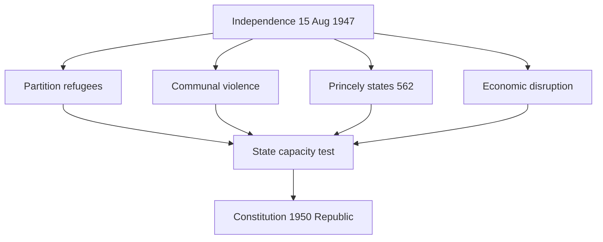

# Post-1947 Challenges — Immediate After Independence

> GS-1 · Topic 04 · Refugees, Partition, economy, princely states, Constitution, 1947–48 war (till 1965 frame)

---

## PYQs

| Year | M | Words | Question (EN) | प्रश्न (HI) | ID |
|------|---|-------|---------------|-------------|-----|
| 2024 | 8 | 125 | Give an account of the challenges faced by India immediately after Independence. | स्वतंत्रता के तुरंत बाद भारत के समक्ष चुनौतियों का लेखा-जोखा प्रस्तुत कीजिए। | Q1 |

---

## Quick Revision

```
IMMEDIATE CHALLENGES (Aug 1947 – ~1950):
  1 PARTITION & REFUGEES — ~10–14 million displaced · communal riots · Punjab/Bengal bloodshed
     Hindu-Sikh west → India · Muslims east → Pakistan · camps · rehabilitation · minority insecurity

  2 COMMUNAL VIOLENCE — Delhi, Punjab, Bengal massacres · Gandhi's peace missions (died 30 Jan 1948)
     State had to restore law and order · integrate divided society

  3 PRINCELY STATES — 562 states · paramountcy lapsed · Balkanisation risk
     → Patel-Menon integration (see 04.1): Junagadh · Kashmir · Hyderabad

  4 KASHMIR & FIRST WAR — IoA Oct 1947 · tribal invasion · 1947–48 Indo-Pak war · UN ceasefire · LOC

  5 ECONOMIC — Partition of assets/liabilities · British war debt share · food shortage · inflation
     Refugee burden · ruined industries in Punjab · zamindari/agriculture disruption

  6 ADMINISTRATIVE — New Dominion machinery · Constituent Assembly framing Constitution
     Integration of ICS · refugee ministries · law and order with limited police/military

  7 CONSTITUTION-MAKING — Dec 1946 – Nov 1949 draft · 26 Jan 1950 Republic · unity in diversity

  8 MINORITIES & NATIONAL UNITY — Muslim minority in India · Scheduled Castes/Tribes integration
     Linguistic diversity · demand for language states (seed of 1956)

  9 FOREIGN POLICY START — Non-Alignment seed · Pakistan hostility · China on horizon

CONTEMPORARY: Partition Horrors Remembrance Day (14 Aug) · Citizenship debates · Art 1 Union
  Refugee rehabilitation legacy in Punjab/Delhi/Bengal demographics

TRAPS: Challenges ≠ only economic | "Immediate" = 1947–50 not 1962 China war primarily
  Partition violence both sides · Patel integration = challenge AND response
  Constitution not ready on 15 Aug 1947 — Dominion first
```

---

## Content

### Context — what "immediately after Independence" means

- **15 August 1947:** India became a **Dominion** — **not yet a Republic** ( **26 January 1950** ) — **freedom with unfinished nation-building**.
- **UPPCS 2024** asks **account of challenges** — cover **political, social, economic, administrative, external** dimensions in **125 words (8 marks)** — **bullet-rich answer** needed.
- **Syllabus cap: till 1965** — **immediate** phase = primarily **1947–1950**, with **1947–48 war** and **integration through 1948–50** as early follow-ons.

### Challenge 1 — Partition and refugee crisis

| Aspect | Detail |
|--------|--------|
| **Scale** | **Est. 10–14 million displaced** — **largest migration in human history** |
| **Geography** | **Punjab and Bengal** bisected — **Radcliffe Line (Aug 1947)** — **hasty, controversial** |
| **Direction** | **Hindus/Sikhs from West Punjab** → **India**; **Muslims from east** → **Pakistan** |
| **Violence** | **Massacres, abductions, looting** on **both sides** — **trains attacked** |
| **State response** | **Refugee camps**, **Evacuee Property Act**, **Ministry of Rehabilitation** — **long-term resettlement in Delhi, UP, Punjab, Bengal** |
| **Legacy** | **Demographic transformation** — **Punjab refugee enterprise**, **Delhi expansion** |

- **Exam point:** Partition was **simultaneously freedom and trauma** — **challenge to social cohesion and state capacity**.

### Challenge 2 — Communal violence and national unity

- **Communal riots** in **Delhi, Rawalpindi, Lahore, Noakhali (1946–47)** spilled into **Independence period**.
- **Mahatma Gandhi** — **fasts and peace missions in Delhi (1947–48)** — **assassinated 30 January 1948** — **loss of moral arbiter**.
- **Muslim minority (~10–12%)** in India — **fear, migration pressure** — **state pledged secular citizenship** ( **Constitution Part III later** ).
- **Challenge:** Build **secular democratic nationalism** after **Partition defined by religion**.

### Challenge 3 — Integration of princely states

- **562 princely states** — **paramountcy lapsed** — **potential 565+ fragments** (with **Portuguese Goa, French pockets**).
- **Rulers considered independence** — **Travancore, Hyderabad, Bhopal, Junagadh, Kashmir**.
- **Government response:** **Sardar Patel and V.P. Menon** — **Instrument of Accession, mergers, Operation Polo (1948)** — full detail in **04.1 file**.
- **As challenge:** Threatened **territorial integrity**, **defence planning**, **single economic market**.



### Challenge 4 — Kashmir and external security (1947–48)

- **Maharaja Hari Singh** delayed accession — **Pathan tribesmen supported by Pakistan (Oct 1947)** invaded.
- **Instrument of Accession to India (26 Oct 1947)** — **Indian Army airlifted to Srinagar**.
- **First Indo-Pak war (1947–48)** — **UN mediation**, **ceasefire January 1949**, **Line of Control**.
- **Challenge:** **Defend territory while nation-building** — **Kashmir unsettled for decades**.

### Challenge 5 — Economic and food challenges

| Problem | Cause | Impact |
|---------|-------|--------|
| **Partition of assets** | **British India split** — **industries, railways, cash balances divided** | **Negotiations with Pakistan** — **tension** |
| **Food shortage** | **1946–47 famine conditions**, **disrupted supply lines** | **Import dependence**, **rationing pressure** |
| **Inflation** | **War economy legacy**, **refugee demand** | **Urban cost of living rise** |
| **Refugee rehabilitation cost** | **Millions to resettle** | **Fiscal burden on new state** |
| **Deindustrialisation legacy** | **Colonial economy** | **Planning need → Planning Commission (1950)** |

- **Economic challenge:** **Build self-sustaining economy** from **colonial extraction model** amid **Partition shock**.

### Challenge 6 — Administrative and constitutional tasks

- **Dominion status initially** — **Governor-General Mountbatten**, **PM Nehru** — **adapt British apparatus**.
- **Constituent Assembly (Dec 1946)** continued — **Draft Constitution adopted 26 Nov 1949**, **effective 26 Jan 1950**.
- **Key debates:** **Federalism, minority rights, language, property, fundamental rights** — **integrate princely states legally**.
- **Bureaucracy:** **ICS → IAS/IPS transition** — **shortage of trained administrators**.
- **Election preparation:** **Universal adult franchise** chosen — **massive logistical challenge** — **first general election 1951–52**.

### Challenge 7 — Social and regional diversity

- **Scheduled Castes and Tribes** — **Constitutional safeguards debated (Ambedkar)** — **abolition of untouchability (Art 17)**.
- **Linguistic diversity** — **demands for Andhra, Karnataka etc.** — **Potti Sriramulu fast (1952, post-immediate)** — **seed challenge visible by 1947**.
- **Tribal and North-East regions** — **integration incomplete** — **Naga unrest from late 1940s**.
- **Women's legal status** — **Hindu Code Bills debate** begins — **social reform continuity from colonial era**.

### Challenge 8 — Foreign relations beginning

- **Hostile neighbour Pakistan** — **Partition disputes** ( **Kashmir, Indus waters later** ).
- **Non-Alignment** not yet formalised ( **Bandung 1955** ) but **refusal to join Cold War blocs** emerging under **Nehru**.
- **Chinese revolution (1949)** — **Tibet border question** — **becomes acute by 1962** ( **syllabus till 1965** includes early phase).

### Refugee rehabilitation — institutional response (detail)

| Measure | Purpose |
|---------|---------|
| **Ministry of Rehabilitation** | **Central coordination of refugee resettlement** |
| **Evacuee Property Acts** | **Manage abandoned property** — **legal disputes prevention** |
| **East Punjab Refugees Act (1948)** | **Land allotment to Punjabi refugees** |
| **Integrated township projects** | **Delhi colonies (Lajpat Nagar, Rajinder Nagar)** — **named after leaders** |
| **Exchange of population agreements** | **With Pakistan on minorities** — **incomplete implementation** |

- **Long-term impact:** **Refugees became entrepreneurs, professionals** — **transformed Delhi, Haryana, Punjab economy** — **challenge converted to demographic asset over decades**.

### Communal situation — Delhi and Gandhi's last mission

- **September 1947 Delhi riots** — **Muslim neighbourhoods attacked** — **government imposed curfew**.
- **Gandhi fasted in Delhi (January 1948)** — **demanded protection for Muslims**, **restoration of mosques**, **payment of Pakistan's cash balances share**.
- **Assassination 30 January 1948 (Nathuram Godse)** — **removed moral voice for communal harmony** — **state alone bore unity burden**.
- **Constitutional response:** **Secularism as basic structure debate later** — **Constitution framers enshrined equality (Art 14–15)**.

### Currency, defence, and civil service continuity

- **Rupee continuity** — **Indian Union Banknotes from Aug 1947** — **monetary unification across acceding states**.
- **Armed forces split** — **British Indian Army divided** with **Pakistan** — **shortage of officers**, **Kashmir deployment immediate test**.
- **ICS officers** — **many Muslim officers went to Pakistan** — **vacancies filled by promotion** — **administrative strain**.
- **Railways and telegraph** — **Partition cut Punjab/Bengal lines** — **rerouting and repair urgent**.

### How the state responded — brief synthesis

| Challenge | Response (1947–50) |
|-----------|---------------------|
| **Refugees** | **Camps, rehabilitation, Evacuee Property laws** |
| **Communalism** | **Police, Gandhi's peace, secular Constitution framing** |
| **Princely states** | **Patel-Menon accession and merger** |
| **Kashmir war** | **Military defence + UN diplomacy** |
| **Economy** | **Food imports, planning discourse, rupee/currency consolidation** |
| **Governance** | **Constituent Assembly → Republic 1950** |

### Contemporary relevance

- **Partition Horrors Remembrance Day (14 August)** — **declared 2021** — **memorialisation of 1947 trauma**.
- **Citizenship Amendment Act debates (2019)** — **linked to Partition-refugee narratives** in public discourse.
- **Art 1** — **Union of States** — **response to 1947 fragmentation challenge**.
- **Refugee policy today** — **historical parallel to 1947 rehabilitation** — **exam comparative mention**.
- **India-Pakistan relations** — **rooted in 1947 Partition and Kashmir**.

### Limits — balanced account

- **Not all challenges solved by 1950** — **poverty, literacy, health** persisted.
- **Partition violence** — **both communities suffered** — **avoid one-sided blame in answers**.
- **Patel integration** solved **princely challenge** but **Kashmir, Northeast** continued.
- **"Immediate"** — **do not write 1962 China war or 1965 Indo-Pak as primary focus** for **2024 PYQ** — **mention as emerging, not central**.

---

## Answers

### Q1: Give an account of the challenges faced by India immediately after Independence. (2024, 8M, 125W)

**Opening:**
> Independent India in August 1947 inherited freedom alongside a cascade of crises — Partition, mass refugee influx, communal violence, economic disruption, and the urgent task of integrating princely states into one Union.

**Write these points:**
- **Partition and refugees:** **~10–14 million displaced**; **Punjab/Bengal riots**; **rehabilitation camps** — **social and fiscal strain**.
- **Communalism:** **Hindu-Muslim violence**; **minority insecurity**; **Gandhi's assassination (Jan 1948)** — **unity challenge**.
- **Princely states:** **562 states**, **paramountcy lapsed** — **Balkanisation risk** — **Patel-Menon integration (Junagadh, Hyderabad, Kashmir)**.
- **External security:** **Kashmir invasion 1947**, **Indo-Pak war 1947–48**, **UN ceasefire** — **defence while building state**.
- **Economy:** **Partition of assets**, **food shortage**, **inflation**, **refugee resettlement costs** — **colonial legacy**.
- **Governance:** **Dominion → Republic (1950)** — **Constituent Assembly**, **new Constitution**, **administrative integration**.

**Conclusion:**
> The immediate post-1947 period tested India's state capacity at birth — meeting Partition trauma, territorial consolidation, and economic survival while framing a democratic Constitution.

---

### Q2: *Likely:* How did the Partition of 1947 create administrative and humanitarian challenges for India? (Future variant, 8M, 125W)

**Opening:**
> Partition simultaneously created India and Pakistan but imposed massive humanitarian and administrative burdens on the new Indian state through mass migration and communal violence.

**Write these points:**
- **Humanitarian:** **Millions of refugees**, **camp housing**, **disease, trauma, abducted persons recovery**.
- **Administrative:** **Evacuee Property management**, **new border policing**, **rehabilitation ministries**.
- **Communal:** **Riots in Delhi, Punjab** — **law and order stretched thin**.
- **Long-term:** **Changed demographics** — **Punjab, Delhi, Bengal** permanently reshaped.

**Conclusion:**
> Partition's refugee and communal crisis was among the gravest immediate challenges — shaping India's early social policy and national identity.

---

### Q3: *Likely:* Discuss the economic challenges India faced after Independence till 1950. (Future variant, 8M, 125W)

**Opening:**
> Post-1947 India faced economic dislocation from Partition, food scarcity, and inherited colonial underdevelopment — requiring urgent stabilisation before planning-era growth.

**Write these points:**
- **Partition:** **Division of railways, industries, cash reserves** with **Pakistan** — **negotiation disputes**.
- **Food:** **Shortages and imports** — **famine memory of 1943 Bengal** still fresh.
- **Refugees:** **Resettlement, housing, employment** — **state expenditure surge**.
- **Legacy:** **Deindustrialisation, low literacy** — **Planning Commission (1950)** as institutional response.

**Conclusion:**
> Economic challenges after Independence demanded immediate relief and long-term planning — laying groundwork for Nehruvian development strategy.

---

## Traps

| Wrong | Correct |
|-------|---------|
| India was a Republic on 15 Aug 1947 | **Dominion 1947** — **Republic 26 Jan 1950** |
| Only Pakistan faced refugee crisis | **Both states** — **~10–14 million displaced total** |
| Princely states automatically joined India | **Paramountcy lapsed** — **Patel-Menon negotiated accession** |
| Immediate challenges = only economic | **Political, communal, territorial, external security** equally core |
| Kashmir resolved in 1947 | **IoA Oct 1947** — **1947–48 war**, **LOC**, **long dispute** |
| Gandhi led government after 1947 | **No official role** — **moral peace missions** — **died Jan 1948** |
| Constitution ready before Independence | **Adopted Nov 1949**, **effective Jan 1950** |
| Partition violence only in Punjab | **Bengal (Noakhali, Kolkata), Delhi** also severely affected |
| All princely states integrated by 15 Aug 1947 | **Majority acceded 1947** — **Hyderabad 1948**, **mergers till 1950** |
| 1962 China war = immediate 1947 challenge | **Emerging by 1949–50** — **acute from 1959** — **1962 beyond "immediate"** |
| No ministry for refugees | **Ministry of Rehabilitation established** — **central resettlement policy** |
| Gandhi prevented all post-1947 riots | **Riots occurred** — **Gandhi mitigated Delhi situation** — **assassinated Jan 1948** |

---

*Complete.*
