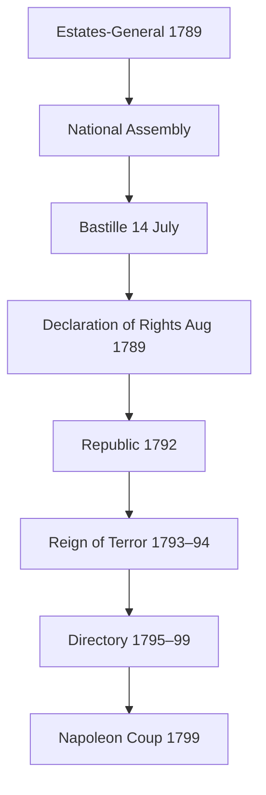

# French Revolution & Napoleon (1789–1815)

> GS-1 · Topic 05 · Enlightenment, 1789 Revolution, Jacobins, Napoleon — forms and societal impact

---

## PYQs

| Year | M | Words | Question (EN) | प्रश्न (HI) | ID |
|------|---|-------|---------------|-------------|-----|
| 2024 | 12 | 200 | "The French Revolution was a great result of enlightenment period." – Comment. | "फ्रांस की क्रांति प्रबोधनकाल का सुफलायन थी।" – टिप्पणी कीजिए। | Q1 |
| 2024 | 8 | 125 | "Napoleon was the son of the Revolution." – Explain. | "नेपोलियन क्रांति का पुत्र था।" – व्याख्या कीजिए। | Q2 |
| 2020 | 12 | 200 | Who were Jacobins? What was their role in the French Revolution? | जैकबिन कौन थे? फ्रांसीसी क्रांति में उनकी क्या भूमिका थी? | Q3 |

---

## Quick Revision

```
PERIOD: Old Regime (Ancien Régime) → 1789 Revolution → 1792 Republic → Terror → Directory → Napoleon → 1815 Waterloo

OLD REGIME PROBLEMS:
  Louis XVI + Marie Antoinette | Estates-General (1789) | 1st Clergy · 2nd Nobility · 3rd Commoners (98% tax burden)
  Financial crisis (American War cost) | Bread riots | Enlightenment critique of privilege

ENLIGHTENMENT → REVOLUTION LINK:
  Voltaire (tolerance, reason) | Rousseau (social contract, general will) | Montesquieu (separation of powers)
  Encyclopedists (Diderot) | Locke (natural rights) | Ideas: liberty, equality, reason vs divine-right monarchy

1789 KEY EVENTS:
  5 May — Estates-General | 17 June — National Assembly | 14 July — Bastille stormed
  4 Aug — feudal privileges abolished | 26 Aug — Declaration of Rights of Man and Citizen
  1791 Constitutional monarchy | 1792 — Republic declared | 1793 — Louis XVI executed

PHASES / GROUPS:
  Girondins (moderates, provinces) vs Jacobins (radicals, Paris sans-culottes)
  Jacobins — Robespierre, Danton, Marat | Club at Jacobin convent | Montagnards in Convention
  Reign of Terror (1793–94) — Committee of Public Safety | Law of Suspects | guillotine
  Thermidor 1794 — Robespierre executed | Directory 1795–99 (5 directors, corrupt, weak)

NAPOLEON (1769–1821):
  Corsican | 1799 Coup of 18 Brumaire → Consulate → 1804 Emperor
  Son of Revolution: Civil Code 1804, meritocracy, ended feudalism, spread revolutionary ideas
  Betrayal of Revolution: crowned himself, restricted press, restored nobility titles, wars of conquest
  1812 Russia disaster | 1814 exile Elba | 1815 Hundred Days → Waterloo (Wellington + Blücher) → St Helena

SOCIETAL IMPACT:
  End feudalism + Church land | secular state trend | nationalism | metric system | women's limited gains then rollback
  Fear in Europe → conservatism (Metternich) | inspired 1830, 1848, later anti-colonial nationalism

CONTEMPORARY: Liberty-Equality-Fraternity → Indian Preamble ethos | UN Human Rights Declaration lineage
  Bastille Day · French Republican values · secularism debates · museum of revolutions worldwide

TRAPS: Revolution ≠ only 1789 one day | Jacobins ≠ only Robespierre from day one
  Napoleon ≠ pure revolutionary OR pure reactionary — BOTH | Bastille ≠ many prisoners (7 only)
  Third Estate ≠ proletariat (included bourgeoisie) | Declaration 1789 ≠ gave women vote
```

---

## Content

### Context — why France exploded in 1789

- **Ancien Régime (Old Regime):** French society under **absolute monarchy** of **Louis XVI** (r. 1774–1792) divided into **Three Estates** — **First Estate** (Catholic clergy, ~1% land, tax exempt), **Second Estate** (nobility, ~2%, tax exempt, feudal dues), **Third Estate** (everyone else — peasants, urban workers, **bourgeoisie** — paid **taille**, **gabelle** salt tax, **corvée** labour).
- **Deep crisis by 1780s:** **State bankruptcy** after **French aid to American Revolution (1778–83)** + court luxury at **Versailles** + inefficient tax collection; **bad harvests 1788–89** → **bread prices soared** → urban **sans-culottes** (literally "without silk breeches" — working-class revolutionaries) and rural unrest.
- **Intellectual climate:** **Enlightenment (Siècle des Lumières)** had prepared moral case against **privilege, superstition, arbitrary rule** — revolution was not spontaneous mob violence alone but **political breakdown + ideas + economic pain**.

### Enlightenment — thinkers, ideas, and link to 1789

| Thinker | Key work / idea | Revolutionary relevance |
|---------|-----------------|-------------------------|
| **Voltaire** (1694–1778) | *Candide*; attack on **Church dogma** and **intolerance** | **Freedom of thought**, religious tolerance — undermined clerical authority of First Estate |
| **Montesquieu** (1689–1755) | *Spirit of the Laws* (1748) — **separation of powers** (executive, legislature, judiciary) | Model for **constitutional limits** on king; influenced **US Constitution** and French reforms |
| **Jean-Jacques Rousseau** (1712–1778) | *Social Contract* (1762) — **"general will"**, sovereignty of **people**, not monarch | **Legitimacy of popular sovereignty** — National Assembly claimed to represent nation |
| **Denis Diderot** | *Encyclopédie* (1751–72) | Spread **scientific reason**, crafts, criticism of feudalism |
| **John Locke** (English) | Natural rights — **life, liberty, property** | **Rights of Man** vocabulary |

- **Comment line for exam:** Enlightenment did **not mechanically cause** revolution (no single pamphlet ordered Bastille storming), but it **legitimized change**, **educated bourgeois lawyers** who led Third Estate, and supplied **language of rights** used in **Declaration of the Rights of Man and of the Citizen (26 August 1789)**.
- **Limits of Enlightenment:** Many philosophes were **elitist**; **women's rights** largely absent (Olympe de Gouges later challenged this); **Voltaire admired "enlightened despots"** — ideas were **radical in context** but not fully democratic by modern standards.

### French Revolution — chronology and phases

| Date | Event | Significance |
|------|-------|--------------|
| **5 May 1789** | **Estates-General** meets at Versailles | Deadlock over voting — **one vote per estate** (Third always outvoted) |
| **17 June 1789** | Third Estate declares **National Assembly** | Claimed to represent **nation**, not estate |
| **20 June 1789** | **Tennis Court Oath** | Vowed not to disperse until **constitution** written |
| **14 July 1789** | **Storming of the Bastille** (Paris) | Symbol of royal tyranny destroyed; **only 7 prisoners** freed — **symbolism > facts** |
| **4 August 1789** | **Abolition of feudal privileges** | **Night of 4 August** — nobles renounced dues (under pressure) |
| **26 August 1789** | **Declaration of Rights of Man and Citizen** | **Liberty, property, security, resistance to oppression**; **popular sovereignty** |
| **1791** | **Constitutional monarchy** | **Legislative Assembly**; **Civil Constitution of the Clergy** — Church under state |
| **1792** | **First Coalition** vs France; **10 August** attack on Tuileries | Monarchy collapses |
| **21 Sept 1792** | **First French Republic** proclaimed | **Universal male suffrage** in parts of period |
| **21 Jan 1793** | **Execution of Louis XVI** | Republic radicalized |
| **1793–1794** | **Reign of Terror** | **~40,000** executed; internal **counter-revolution** suppressed |
| **1794** | **Thermidorian Reaction** (27 July) | **Robespierre guillotined** — Terror ends |
| **1795–1799** | **Directory** | Five-man executive; **corruption, war fatigue** |
| **9 Nov 1799** | **Coup of 18 Brumaire** — **Napoleon Bonaparte** | End of radical republican experiment → **Consulate** |

### Causes of 1789 — social, economic, political (exam-ready list)

| Cause type | Details |
|------------|---------|
| **Social** | **Three Estates** — **98% in Third Estate** paid taxes; **nobility/clergy exempt** — **Abbé Sieyès**, *What Is the Third Estate?* (1789): **"Everything"** but treated as nothing |
| **Economic** | **State bankruptcy** — **Calonne** and **Necker** (finance ministers) failed to reform taxes; **cost of American War**; **1788–89 crop failure** → **bread riots** |
| **Political** | **Weak Louis XVI**; **Estates-General deadlock** (May 1789); **Tennis Court Oath**; dismissal of popular **Necker** (July) inflamed Paris |
| **Intellectual** | **Enlightenment** — **Voltaire, Rousseau, Montesquieu** — **rights, reason, popular sovereignty** |
| **Immediate** | **Storming of Bastille (14 July 1789)**; **Great Fear (July–Aug 1789)** — **peasant attacks on châteaux**, **feudal records burned** — **rural revolution parallel to Paris** |

- **Finance ministers (exam names):** **Jacques Necker** (Swiss banker, dismissed 1789) and **Charles Alexandre de Calonne** (proposed wide taxes on nobles — blocked) show **monarchy could not reform itself**.
- **Great Fear** proves revolution was **not only Paris elite** — **countryside participated**, forcing **4 August abolition of feudalism**.



### Jacobins — who they were and their role

**Definition:** **Jacobins** were members of the **Jacobin Club** (originally Breton deputies meeting at **Dominican convent of St Jacques — "Jacobins"** in Paris), evolving into the **most radical political society** of the Revolution.

**Leadership and factions**
- Key figures: **Maximilien Robespierre**, **Georges Danton**, **Jean-Paul Marat** (radical journalist, *L'Ami du peuple*), **Saint-Just**, **Camille Desmoulins**.
- In the **National Convention (1792–95)**, Jacobin **Montagnards** ("Mountain" — left side seating) fought **Girondins** (moderates from **Gironde** region, favoured **provincial federalism**, less Paris mob power).

**Programme and actions**
- **Republicanism:** Pushed **abolition of monarchy** (1792) — Girondins initially hesitated.
- **Centralization:** **Revolutionary government** — **Committee of Public Safety** (1793), **Representatives on mission**, **levée en masse** (mass conscription) — **first modern total war** mobilization.
- **Reign of Terror (June 1793 – July 1794):** **Law of Suspects**, **Revolutionary Tribunal**, **de-Christianization** campaigns (though Robespierre later promoted **Supreme Being** cult), **price controls** (Maximum) for sans-culottes.
- **Social policy:** **Abolished slavery** briefly in colonies (**1794** — later reversed by Napoleon **1802**); **redistributed Church lands**; **metric system** groundwork.

**Why they matter for society**
- Jacobins embodied **radical equality** and **emergency dictatorship for virtue** — template for later **revolutionary vanguards** (Lenin studied French Revolution closely).
- **Downfall:** **Thermidor** — **excess of Terror**, **Robespierre's purges** (Danton executed) alienated allies; **middle class** feared **sans-culottes** economic radicalism.

### Napoleon — "son of the Revolution" and its contradictions

**Rise:** **Napoleon Bonaparte** (b. **1769**, **Ajaccio, Corsica**) — ** artillery officer**; saved **Directory** by **whiff of grapeshot (1795)** against royalist uprising; **Italian campaign (1796–97)** and **Egypt (1798–99)** made him national hero; **18 Brumaire Year VIII (9 Nov 1799)** coup → **First Consul**, then **Emperor (1804)**.

**As heir / "son" of Revolution (preserved gains)**
- **Napoleonic Code (Civil Code, 1804):** **Equality before law**, **abolition of feudal privileges**, **religious toleration**, **property rights**, **secular civil marriage** — spread across **Europe** via conquest — **legal modernity**.
- **Meritocracy:** **Careers open to talent** in **army and bureaucracy** — not birth alone.
- **Administrative centralization:** **Prefects**, **Bank of France (1800)**, **Lycées** — **rational state** continuing Revolutionary centralism.
- **Revolutionary nationalism:** **Citizen-army**, **Tricolour**, **La Marseillaise** — **nation above king**.
- **Spread of ideas:** **Code Napoléon** in **Italy, Rhine Confederation, Spain** undermined **local feudal and clerical courts**.

**As betrayer of Revolution (reversal)**
- **Crowned himself Emperor (1804)** at **Notre-Dame** — **Pope Pius VII** present — restored **hereditary power** symbolism.
- **Restricted press**, **political police (Fouché)**, **spy networks** — **closed Jacobin clubs**.
- **Restored slavery (1802)** in **French colonies** — devastating blow to Revolutionary emancipation.
- **Created new nobility**, **Concordat (1801)** with Church — **stability over secular radicalism**.
- **Wars of conquest** — **Continental System**, **Peninsular War**, **invasion of Russia (1812)** — **millions dead** for empire, not liberty.

**Fall:** **1812 Russia** — **Grande Armée** destroyed; **1814** abdication → **Elba**; **1815 Hundred Days** → **Waterloo (18 June 1815)** — **Duke of Wellington** + **Prussian Blücher**; exiled **St Helena** — died **1821**.

### Societal impact — France and the world

| Domain | Change |
|--------|--------|
| **Feudalism** | **Legally ended** in France — dues, serfdom (where existed), provincial privileges |
| **Church** | **Land nationalized**; **Civil Constitution**; later **Concordat** compromise under Napoleon |
| **Law** | **Uniform codes** replaced **local customary law** — foundation of modern **civil law tradition** |
| **Nationalism** | **People's war**, **citizen identity** — model for **19th-century unification movements** (Germany, Italy) and **anti-colonial nationalism** (including later Indian discourse on liberty) |
| **Women** | **Brief activism** (Olympe de Gouges — *Declaration of Rights of Woman*, 1791; **executed 1793**); **Republic of Virtue** pushed **domestic roles** — **no political equality** |
| **Economy** | **Metric system**; **internal free trade** barriers removed gradually; **war inflation** |
| **Europe** | **Conservative reaction:** **Congress of Vienna (1815)**, **Metternich** system — **"legitimacy"** of monarchs restored — but **ideas could not be bottled** |

### Comparison — Girondins vs Jacobins

| | **Girondins** | **Jacobins** |
|---|-------------|--------------|
| **Base** | **Provincial bourgeoisie**, ports | **Paris**, **sans-culottes** alliance |
| **Monarchy** | **Constitutional monarchy** initially | **Republic** — execute king |
| **Terror** | **Opposed** escalation | **Led** Committee of Public Safety |
| **Fate** | **Purged 1793** (Brunswick crisis context) | **Thermidor 1794** — Robespierre fell |

### Contemporary relevance

- **Liberty, Equality, Fraternity** — inscribed on **French institutions**; echoes in **Indian Preamble** ("justice, liberty, equality") and **global human-rights vocabulary** — **UN Universal Declaration of Human Rights (1948)** sits in lineage of **1789 Declaration**.
- **Secular republicanism:** French **laïcité** (1905 separation of Church and state) traces to **Revolutionary anti-clericalism** — debates on **religion in public life** remain live (headscarf laws, etc.).
- **Revolution as political memory:** **14 July Bastille Day** — global symbol of **people vs tyranny**; museums and ** UNESCO Memory of the World** documents preserve Revolutionary archives.
- **Legal legacy:** **Napoleonic Code** still influences **civil law countries** (France, parts of Europe, Latin America, Louisiana) — comparative law studies in **Indian judiciary training**.
- **Caution for democracies:** **Emergency powers**, **terror in name of virtue**, **personality cult** (Napoleon) — **case studies in governance ethics** (GS-IV overlap).

### Limits and balanced historiography

- Revolution **benefited bourgeoisie** more than **poorest peasants** long-term; **women and slaves** saw **reversal under Napoleon**.
- **Violence was structural** — **Vendée civil war**, **Terror** — not only "heroic progress."
- Enlightenment **inspired** but **did not single-handedly cause** — **material crisis** essential.
- **Napoleon** must be answered **dialectically** in exam — **both carrier and gravedigger** of Revolutionary ideals.

---

## Answers

### Q1: "The French Revolution was a great result of enlightenment period." – Comment. (2024, 12M, 200W)

**Opening:**
> The French Revolution of 1789 was deeply shaped by Enlightenment ideas of reason, rights, and popular sovereignty, though it also arose from fiscal collapse and social conflict — making it the political "culmination" (sufalayan) of the Enlightenment, not its automatic product.

**Write these points:**
- **Enlightenment thinkers** — **Voltaire** (tolerance), **Rousseau** (social contract, general will), **Montesquieu** (separation of powers) — attacked **divine-right monarchy** and **feudal privilege** that the **Ancien Régime** embodied.
- **Third Estate leaders** (lawyers, bourgeois) used **Enlightenment language** in **Tennis Court Oath (1789)** and **Declaration of the Rights of Man (26 Aug 1789)** — **liberty, property, security, resistance to oppression**.
- **Encyclopédie** and **salons** spread **scientific rationality** undermining **Church-state alliance** of the **First Estate** — context for **Civil Constitution of the Clergy (1790)**.
- **Material triggers** were equally vital — **bankruptcy**, **bread riots**, **American War debts** — Enlightenment alone did not storm the **Bastille (14 July 1789)**.
- **Radical phase (1792–94)** went **beyond** moderate Enlightenment — **Terror**, **de-Christianization** — showing **revolutionary excess** not fully scripted by philosophes.
- **Legacy:** Spread **constitutional nationalism** across Europe; **Congress of Vienna (1815)** tried to reverse gains but **could not erase ideas**.

**Conclusion:**
> Comment must affirm the **strong intellectual lineage** from Enlightenment to Revolution while noting **economic-social causation** — together they transformed France from feudal monarchy toward modern **nation-state and rights discourse**.

---

### Q2: "Napoleon was the son of the Revolution." – Explain. (2024, 8M, 125W)

**Opening:**
> Napoleon Bonaparte both inherited and distorted the French Revolution — he consolidated its legal and administrative modernity while crowning himself Emperor and restoring slavery.

**Write these points:**
- **Preserved:** **Napoleonic Code (1804)** — **equality before law**, **abolition of feudal privileges**, **property rights**, **religious toleration** — exported across **Europe**.
- **Preserved:** **Merit-based careers**, **centralized prefectoral state**, **citizen nationalism**, **secular civil institutions** — continuation of **1789–99** centralization.
- **Betrayed:** **Self-coronation (1804)**, **new nobility**, **press censorship**, **Concordat with Pope**, **re-imposition of slavery (1802)** in colonies.
- **Wars of conquest** replaced **revolutionary liberation** — yet **Code and nationalism** outlived his **1815 Waterloo** defeat.

**Conclusion:**
> He was the Revolution's **"son"** in **destroying feudalism and codifying rights**, but its **stepfather** in **authoritarian empire** — a dialectical legacy examiners expect.

---

### Q3: Who were Jacobins? What was their role in the French Revolution? (2020, 12M, 200W)

**Opening:**
> The Jacobins were the radical republican political club of the French Revolution, led by figures like Robespierre and Danton, who pushed the revolution from constitutional monarchy to republic and directed the Reign of Terror (1793–94).

**Write these points:**
- **Origin:** **Jacobin Club** — deputies at **St Jacques convent**, Paris; became **Montagnard** faction in **National Convention (1792)** against **Girondins**.
- **Republic:** Led **abolition of monarchy (1792)**, **trial and execution of Louis XVI (Jan 1793)**.
- **Committee of Public Safety:** **Robespierre**, **Saint-Just** — **levée en masse**, **price controls**, **Revolutionary Tribunal** — **Reign of Terror** against **counter-revolutionaries and Girondins**.
- **Social impact:** **Church lands sold**, **feudal dues ended**, **1794 abolition of slavery** (later reversed); mobilized **sans-culottes** of Paris.
- **Excess and fall:** **~40,000 executions**; **Danton and Robespierre** themselves guillotined — **Thermidor Reaction (July 1794)** ended Jacobin dominance.
- **Legacy:** Model of **revolutionary vanguard** and **emergency revolutionary dictatorship** — influenced **19th–20th century radical politics** globally.

**Conclusion:**
> Jacobins were the **engine of radical republican transformation** — decisive in destroying Old Regime monarchy, but their **Terror** remains the revolution's most contested chapter.

---

### Q4 (Future variant): Discuss the causes of the French Revolution of 1789. (Likely, 12M, 200W)

**Opening:**
> The French Revolution resulted from the intersection of **Ancien Régime structural inequality**, **state fiscal bankruptcy**, **Enlightenment political culture**, and **immediate food crisis**.

**Write these points:**
- **Social:** **Three Estates** — **Third Estate** (98% population) bore taxes; **clergy/nobility** exempt — **feudal dues** burdened peasants.
- **Economic:** **Cost of American War (1778–83)**, ** inefficient tax farming**, **1788–89 harvest failure** → **bread riots**.
- **Political:** **Louis XVI's weakness**, **Estates-General deadlock (May 1789)**, **Tennis Court Oath** — **legitimacy crisis**.
- **Intellectual:** **Enlightenment** — **Rousseau, Montesquieu, Voltaire** — **rights, reason, popular sovereignty**.
- **Immediate triggers:** **Dismissal of finance minister Necker**, **storming of Bastille (14 July 1789)**, **Great Fear** in countryside — **feudal châteaux attacked**.

**Conclusion:**
> Multi-causal explanation — **material grievance plus ideological challenge** — distinguishes serious answers from "only Enlightenment" or "only hunger" one-liners.

---

### Q5 (Future variant): Discuss the impact of the French Revolution on Europe and the world. (Likely, 12M, 200W)

**Opening:**
> The French Revolution (1789–99) and Napoleonic wars exported ideas of nationalism, citizenship, and legal equality — triggering both democratic aspirations and conservative reaction across Europe.

**Write these points:**
- **End of feudalism in France** — **Declaration of Rights (1789)**, **Napoleonic Code (1804)** spread via **French conquests** — **modern civil law states**.
- **Rise of nationalism** — **citizen army**, **mass mobilization** — model for **German/Italian unification (1870s)** and later **anti-colonial movements**.
- **Conservative reaction:** **Congress of Vienna (1815)**, **Metternich** — **restore monarchies**, **suppress liberal revolts** — yet **could not erase ideas**.
- **Revolutions of ** **1830 and 1848** — **liberal-national uprisings** inspired by **1789**.
- **Women/slaves:** **Limited gains reversed** — **Olympe de Gouges executed**; **Napoleon restored slavery 1802** — **impact uneven and contradictory**.
- **India/world:** **Rights discourse** influenced **later colonial nationalist vocabulary** (liberty, equality) — **global political modernity**.

**Conclusion:**
> French Revolution ** dissolved Old Regime in France** and **permanently changed international politics** — **liberation and war**, **progress and terror** — **foundational event of modern world history**.

---

## Traps

| Wrong | Correct |
|-------|---------|
| French Revolution started only with Bastille — no prior politics | **Estates-General (May 1789)** and **National Assembly (June)** were constitutional prelude |
| Enlightenment alone caused Revolution | **Bankruptcy + famine + estate inequality** were necessary conditions |
| Third Estate = industrial working class only | Included **bourgeois lawyers, merchants, peasants** — diverse |
| Bastille held hundreds of political prisoners | Only **7 prisoners** — **symbolic** fortress of royal power |
| Jacobins always led from 1789 | **Jacobin radical dominance** peaked **1792–94**, not from day one |
| Robespierre was first revolutionary leader | Earlier leaders: **Mirabeau, Lafayette, Brissot (Girondin)** |
| Napoleon was purely anti-revolutionary | **Napoleonic Code** preserved core **Revolutionary legal reforms** |
| Napoleon fully continued Revolution | **Emperor title, slavery restored 1802, censorship** — reversals |
| Women gained equal political rights in Revolution | **Olympe de Gouges executed 1793** — **no voting rights** for women |
| French Revolution had no global impact | Inspired **1848 revolutions, nationalism, Latin American independence waves, rights discourse** |
| Reign of Terror = entire revolution period | Terror = **~1793–94** only — phases before/after differ |
| Girondins and Jacobins were identical republicans | **Girondins** opposed **Paris-centric Terror** — **purged 1793** |
| Great Fear = unrelated peasant panic | **July–Aug 1789** — **drove feudal abolition (4 Aug)** — **linked to Revolution** |
| Necker was a revolutionary leader | **Royal finance minister** — **popular with Third Estate**, **dismissal triggered unrest** |

---

*Complete.*
