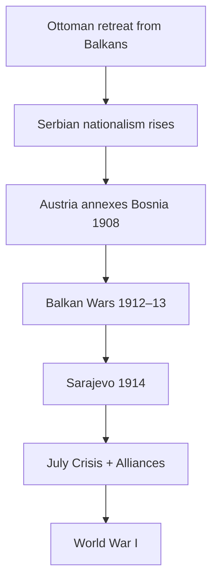

# World Wars, Boundaries & Decolonization (1914–1945+)

> GS-1 · Topic 05 · WWI, WWII, Balkan crisis, Hitler, peace efforts, boundary redraw, colonialism and its end

---

## PYQs

| Year | M | Words | Question (EN) | प्रश्न (HI) | ID |
|------|---|-------|---------------|-------------|-----|
| 2021 | 12 | 200 | What do you understand by the Balkan Crisis? What was its role in the First World War? | बालकन संकट से आप क्या समझते हैं? प्रथम विश्व युद्ध में इसकी क्या भूमिका थी? | Q1 |
| 2019 | 12 | 200 | Describe the efforts made for world peace after the second world war on global level. | द्वितीय विश्वयुद्ध के पश्चात वैश्विक स्तर पर विश्व शांति के लिए किए गए प्रयासों का वर्णन कीजिए। | Q2 |
| 2018 | 12 | 200 | Discuss the role of Hitler in bringing about the Second World War. | द्वितीय विश्व युद्ध को अवश्यम्भावी बनाने में हिटलर की भूमिका की विवेचना कीजिए। | Q3 |

---

## Quick Revision

```
WWI (1914–18): "Great War" | Central Powers (Germany, Austria-Hungary, Ottoman, Bulgaria)
  vs Allies (France, UK, Russia → USA 1917, Italy, Japan)
  Trigger: Sarajevo 28 June 1914 — Gavrilo Princip kills Archduke Franz Ferdinand (Austria)

BALKAN CRISIS = "Powder keg of Europe":
  Ottoman decline → independent Balkan states (Serbia, Bulgaria, Greece, Romania)
  Pan-Slavism (Russia backs Serbia) vs Austro-Hungarian empire (Slavs in Bosnia)
  Balkan Wars 1912–13 — territorial scramble | Austria annexed Bosnia 1908 — angered Serbia
  Role in WWI: Sarajevo → Austria ultimatum to Serbia → alliance chain → general war

WWI FEATURES: Trench warfare, Verdun, Somme | Total war | Chemical weapons | Collapse: Russia 1917, Ottoman, AH
  Treaty of Versailles 1919 — Germany "war guilt", reparations, lost Alsace-Lorraine, colonies stripped

INTERWAR: League of Nations (1920) — weak | Great Depression | Appeasement (Munich 1938)
  Rise: Mussolini 1922, Hitler 1933, Japanese militarism

WWII (1939–45): 1 Sept 1939 Germany invades Poland
  Axis: Germany, Italy, Japan | Allies: UK, USSR (1941), USA (1941), France, China
  Hitler role: remilitarize Rhineland, Anschluss Austria, Sudetenland, Poland invasion, Barbarossa USSR 1941
  Holocaust — 6 million Jews | Total ~70–85 million dead | Atomic bombs Hiroshima/Nagasaki Aug 1945

POST-WWII PEACE EFFORTS:
  UN (1945 San Francisco) — Security Council, General Assembly, ICJ
  Bretton Woods: IMF, World Bank | Nuremberg + Tokyo trials — war crimes precedent
  NATO 1949 / Warsaw Pact 1955 | Universal Declaration Human Rights 1948
  Decolonization: India 1947, Indonesia, Africa 1950s–60s | Non-Aligned Movement 1961

BOUNDARY REDRAW:
  Versailles — new Poland, Czechoslovakia, Yugoslavia | Mandate system (Middle East)
  Yalta/Potsdam 1945 — Germany divided, Oder-Neisse border, Cold War lines

COLONIALISM END: WWII weakened Europe | Atlantic Charter self-determination | UN Charter Ch XI
  Bandung 1955 | Suez 1956 symbol | French Indochina, Algeria wars

CONTEMPORARY: UN peacekeeping · ICC · Russia-Ukraine = sovereignty norm tests · UN Security Council reform debate
  India's UN contribution · Geneva Conventions · nuclear non-proliferation (NPT)

TRAPS: WWI ≠ only Sarajevo cause | USA entered WWI 1917 not 1914 | USSR entered WWII 1941 not 1939
  League ≠ same as UN | Hitler ≠ sole cause WWII (structural Versailles, appeasement) but decisive accelerator
  Decolonization ≠ complete by 1950 — Algeria to 1962, Portugal later
```

---

## Content

### Context — Europe from 1914 to 1945

- **Two world wars** in **30 years** killed **tens of millions**, destroyed **European economic dominance**, **redrew maps**, ended **four empires** (German, Austro-Hungarian, Ottoman, Russian tsarist), accelerated **decolonization**, and created **United Nations — Cold War order**.
- **Syllabus keywords covered here:** **World Wars**, **redraw of national boundaries**, **colonialism and end of colonialism**, plus **post-WWII peace architecture**.

### First World War — causes and nature

**Long-term causes**
- **Militarism:** **Anglo-German naval race** (Dreadnoughts), **conscription** — **arms culture**.
- **Alliance system:** **Triple Alliance** (Germany, Austria-Hungary, Italy*) vs **Triple Entente** (France, Russia, Britain) — **localized war → continental**.
- **Imperialism:** **Moroccan crises (1905, 1911)**, **competition for colonies** — **tension between powers**.
- **Nationalism:** **Pan-Slavism**, **Irredentism** — especially **Balkans**.

**Immediate trigger:** **28 June 1914, Sarajevo** — **Gavrilo Princip** (Young Bosnia / Serbian nationalist) assassinated **Archduke Franz Ferdinand** (heir to **Austria-Hungary**) — **July Crisis** → **Austria's ultimatum to Serbia** → **Russia mobilizes** → **Germany Schlieffen Plan vs France** → **Britain enters over Belgium**.

**Nature of war**
- **Western Front trench warfare:** **Somme (1916)**, **Verdun** — **attrition, barbed wire, machine guns**.
- **Eastern Front:** More mobile — **Russian collapse 1917** after **Revolution**.
- **Total war:** **Home front mobilization**, **rationing**, **propaganda**, **women in factories** — **state control of economy**.
- **New weapons:** **Poison gas**, **tanks (1916)**, **aircraft**, **submarines (U-boats)** — **Lusitania sinking** helped push **USA (April 1917)**.
- **End:** **Armistice 11 November 1918**; **Treaty of Versailles 28 June 1919** with **Germany**.

**WWI causes — "MAIN" mnemonic (likely direct question)**

| Factor | Exam detail |
|--------|-------------|
| **M**ilitarism | **Arms race**, **conscription**, **Anglo-German Dreadnought rivalry** |
| **A**lliances | **Triple Alliance** vs **Triple Entente** — **local war becomes continental** |
| **I**mperialism | **Moroccan crises**, **colonial competition**, **Scramble for Africa** tensions |
| **N**ationalism | **Pan-Slavism**, **Balkans**, **Irredentism** — **ethnic groups seek states** |

- **Immediate spark:** **Sarajevo (28 June 1914)** + **July Crisis** — structure already existed; **assassination was detonator**.

**What is Balkan Crisis**
- **Balkans** = **Southeast Europe** — **Ottoman Empire** retreat left **competing nation-states**: **Serbia, Montenegro, Greece, Bulgaria, Romania**, later **Albania**.
- **"Powder keg of Europe":** **Ethnic minorities trapped in empires** — **Slavs under Austria-Hungary** (Bosnia, Croatia), **Macedonian disputes**, **Bulgarian revisionism**.
- **Key episodes before 1914:**

| Year | Crisis | Effect |
|------|--------|--------|
| **1878** | **Congress of Berlin** | **Austria-Hungary** allowed to **administer Bosnia** |
| **1908** | **Bosnian Annexation Crisis** | Austria **formally annexed Bosnia** — **Serbia furious** — wanted **pan-South Slav state** |
| **1912–13** | **Balkan Wars** | **Ottoman Europe expelled** — **Serbia gained**, but **blocked from Adriatic** by Austria |
| **1914** | **Sarajevo assassination** | **Spark** for **July Crisis** |

**Russia's role:** **Pan-Slav solidarity** — **"Protector" of Serbia** — mobilization after **Austria declares war on Serbia (28 July 1914)**.
**Role in WWI:** Balkan **nationalism + great-power rivalry** converted **regional assassination** into **world war via alliances** — **not sole cause**, but **decisive detonator** in **already militarized Europe**.



### Treaty of Versailles and boundary redraw (1919–20)

- **Paris Peace Conference:** **Big Three** — **Clemenceau (France), Lloyd George (Britain), Wilson (USA)**.
- **Germany:** **Article 231 "war guilt"**, **reparations**, **military limits**, **Alsace-Lorraine to France**, **Polish Corridor**, **Saar, demilitarized Rhineland**, **colonies → mandates**.
- **New/ enlarged states:** **Poland, Czechoslovakia, Yugoslavia**, **Baltic states** — **principle of nationality** (imperfectly applied).
- **Ottoman partition:** **Turkey reduced** — **mandates in Middle East** (British/French) — ** seeds of later conflicts**.
- **League of Nations (1920):** **Collective security** — **USA never joined** — **structural weakness**.

### Interwar period — road to WWII

- **Weimar instability:** **Hyperinflation 1923**, **Great Depression** — **Nazi vote surge**.
- **Appeasement:** **Munich Agreement (1938)** — **Sudetenland to Hitler** — failed to prevent war.
- **Other aggressors:** **Italy — Ethiopia (1935)**, **Japan — Manchuria (1931), China (1937)**.

### Second World War — Hitler's role and course

**Hitler's escalatory steps (exam-critical chronology)**

| Year | Action | Significance |
|------|--------|--------------|
| **1933** | **Chancellor → Führer** | **Nazi dictatorship** — **rearmament begins secretly** |
| **1935** | **Saar plebiscite, conscription** | Breaks **Versailles military limits** |
| **1936** | **Remilitarization of Rhineland** | **Western powers no response** — **boldness rewarded** |
| **1938** | **Anschluss (Austria)**, **Sudetenland (Munich)** | **German expansion** |
| **March 1939** | **Czechoslovakia occupied wholly** | Ends **appeasement credibility** |
| **Sept 1939** | **Invasion of Poland** | **Britain & France declare war** — **WWII begins** |
| **1940** | **Blitzkrieg — France falls, Dunkirk** | **Axis dominance in Europe** |
| **1941** | **Operation Barbarossa (USSR)**, **USA enters after Pearl Harbor** | **Global war** |
| **1942–45** | **Holocaust industrialized**, **Stalingrad turning point** | **Genocide + defeat of Germany** |
| **1945** | **Berlin falls; Hitler suicide 30 April** | **German surrender May 8** |

**Hitler's role — balanced exam answer**
- **Not sole cause:** **Versailles humiliation**, **failure of League**, **Great Depression**, **Japanese/Italian aggression** created **permissive environment**.
- **Hitler decisive:** **Ideological revisionism (Lebensraum)**, **rapid rearmament**, **risk-taking diplomacy**, ** racial war of annihilation** — **made general European war likely and barbaric**.
- **Holocaust:** **Wannsee Conference (1942)** — **systematic murder of 6 million Jews** + **Roma, disabled, Slavs, political opponents** — **crimes against humanity**.

**War's scale:** **~70–85 million dead**; **atomic bombs (Hiroshima 6 Aug, Nagasaki 9 Aug 1945)** — **Japan surrendered**.

### Post-WWII efforts for world peace (global level)

| Institution / effort | Year | Purpose |
|---------------------|------|---------|
| **United Nations** | **1945 (San Francisco Charter)** | **Collective security**, **General Assembly**, **Security Council (5 permanent veto powers)**, **Secretariat**, **ICJ** |
| **UN specialized agencies** | 1940s+ | **WHO, UNESCO, FAO** — **health, culture, food security** |
| **Universal Declaration of Human Rights** | **1948** | **Global rights norm** — **Genocide Convention (1948)** |
| **Nuremberg Trials (1945–46)** | | **Individual criminal responsibility** for **war crimes, crimes against humanity** |
| **Tokyo Trials** | **1946–48** | **Japanese leadership accountability** |
| **Bretton Woods system** | **1944** | **IMF, World Bank** — **economic stability** to prevent **Depression-style collapse** |
| **NATO** | **1949** | **Western collective defence** |
| **Warsaw Pact** | **1955** | **Eastern bloc counterpart** — **Cold War balance (and risk)** |
| **UN Peacekeeping** | **1948 onwards (UNEF etc.)** | **Blue helmets** — **interposition, observation** |
| **Partial Test Ban / NPT (1968)** | | **Nuclear arms control architecture** |
| **European Coal and Steel Community → EU** | **1951+** | **Functional integration** — **"never again" Franco-German war** |
| **Decolonization under UN framework** | **1940s–60s** | **Trusteeship, self-determination (Charter Chapter XI)** |

**Why stronger than League:** **USA participation**, **broader membership**, **economic institutions**, **human-rights law**, **peacekeeping practice** — though **Cold War veto paralysis**, **Korean/Vietnam wars**, and **failed prevention in Rwanda/Bosnia** show **limits**.

### Colonialism and its end (mid 20th century)

**Colonialism (brief):** **Industrial powers** (**Britain, France, Belgium, Netherlands, Portugal**) ruled **Asia, Africa, Pacific** through **direct rule, protectorates, mandates** — **economic extraction**, **cultural dominance**, **racist administration**.

**Why WWII accelerated end**
- **European metropoles weakened** — **France, Britain, Netherlands** occupied or drained.
- **Atlantic Charter (1941)** — **Roosevelt & Churchill** affirmed **self-determination** (interpreted by colonies as **independence promise**).
- **Japanese victories (1942)** — **destroyed myth of white invincibility** in **Asia**.
- **UN Charter + NAM pressure** — **legitimacy of empire collapsed**.

**Examples of decolonization**

| Region | Illustrative cases | Approx. independence |
|--------|-------------------|----------------------|
| **South Asia** | **India, Pakistan (1947)**, **Ceylon, Burma** | **1947–48** |
| **Southeast Asia** | **Indonesia (1945–49 struggle)**, **Indochina/Vietnam** | **1945–54+** |
| **Middle East** | **Mandates → Israel 1948, Jordan, Syria** | **1940s–50s** |
| **Africa** | **Ghana (1957)**, **wave 1960s**, **Algeria (1962)** | **1950s–70s** |
| **Caribbean/Pacific** | **Jamaica, Fiji** etc. | **1960s–70s** |

- **Neocolonialism critique:** **Formal independence** but **economic dependency** — **Franz Fanon**, **Kwame Nkrumah** — **political freedom ≠ structural equality**.

### Boundary redraw after WWII (Yalta & Potsdam)

- **Yalta (Feb 1945):** **Germany to be divided**, **Poland's borders shifted west** ( **Oder-Neisse line** ), **USSR influence in Eastern Europe** agreed tacitly.
- **Potsdam (July–Aug 1945):** **Denazification, demilitarization, reparations**, **de facto Cold War lines** — **Iron Curtain (Churchill 1946)**.
- **Middle East, Kashmir, Palestine** — **mandate exits** left **ongoing disputes** — **1947 UN partition plan**.

### Contemporary relevance

- **United Nations:** India seeks **permanent Security Council seat** — reform debates rooted in **1945 power map**; India **largest troop contributor** to **UN peacekeeping**.
- **International Criminal Court (2002):** Lineage from **Nuremberg** — **Russia-Ukraine war** renews **accountability** debates.
- **Geneva Conventions (1949):** **Humanitarian law** in **conflict zones** — **Red Cross** monitoring.
- **NATO expansion / sovereignty:** **Principle of territorial integrity** ( **Ukraine 2014/2022** ) tests **post-1945 order**.
- **Nuclear non-proliferation:** **NPT, IAEA** — **India not signatory** but **"no first use"** policy — **historical link to Hiroshima**.
- **Decolonization memory:** **Global South diplomacy**, **NAM legacy**, **reparations discourse** — **Bandung Spirit** in **G-77, BRICS** forums.

### Limits and balanced view

- **WWI cause lists** must include **structure + Balkan trigger** — not one alone.
- **Hitler** — **accelerator and ideologue**, not **only** explanation for WWII.
- **UN/peace institutions** **prevented WWIII direct superpower war** but **did not stop** **proxy wars, genocides, civil conflicts**.
- **Decolonization** ** uneven** — ** settler colonies, Portuguese empire, Rhodesia** lasted longer; **neo-colonial economics** persisted.

---

## Answers

### Q1: What do you understand by the Balkan Crisis? What was its role in the First World War? (2021, 12M, 200W)

**Opening:**
> The Balkan Crisis refers to chronic instability in Southeast Europe as Ottoman power declined and rival nationalisms clashed under Austro-Russian great-power competition — it acted as the detonator of World War I through the Sarajevo assassination and July Crisis of 1914.

**Write these points:**
- **Definition:** **Balkans** — **Serbia, Bulgaria, Greece, Romania, Bosnia etc.** — **ethnic fragmentation**, **Ottoman retreat**, **pan-Slav vs Austro-Hungarian imperial control**.
- **Key episodes:** **Bosnian annexation (1908)**, **Balkan Wars (1912–13)** — **Serbia blocked from Adriatic**, **resentment against Austria**.
- **Sarajevo (28 June 1914):** **Gavrilo Princip** killed **Archduke Franz Ferdinand** — **Austria blamed Serbia**, **ultimatum**, **declaration of war (28 July)**.
- **Alliance escalation:** **Russia mobilized** to support **Serbia** → **Germany vs Russia/France** → **Schlieffen Plan** → **Britain over ** **Belgian neutrality**.
- **Role:** Balkan **nationalism supplied immediate spark** in **already militarized alliance system** — **"powder keg"** metaphor — **not sole cause** but **critical pathway**.
- **Outcome:** **Four empires collapsed**, **Versailles redrew Eastern Europe** — **Yugoslavia, Czechoslovakia** created.

**Conclusion:**
> Balkan Crisis = **regional nationalist conflict embedded in imperial rivalry**; its role was to **convert a Balkan assassination into general European war** via **entangling alliances**.

---

### Q2: Describe the efforts made for world peace after the second world war on global level. (2019, 12M, 200W)

**Opening:**
> After 1945, victor powers and the international community built multilateral institutions for collective security, economic stability, human rights, and decolonization — learning from the League of Nations' failure.

**Write these points:**
- **United Nations (1945):** **Charter at San Francisco** — **General Assembly, Security Council, ICJ, Secretariat** — **collective security** and **dispute settlement**.
- **Legal accountability:** **Nuremberg and Tokyo trials** — **individual responsibility** for **war crimes, crimes against humanity, genocide** — **precedent for ICC later**.
- **Human rights:** **Universal Declaration (1948)**, **Genocide Convention (1948)** — **global normative framework**.
- **Economic peace:** **Bretton Woods — IMF, World Bank (1944)** — **prevent Depression-style instability** feeding extremism.
- **Collective defence & arms control:** **NATO (1949)**, later **Warsaw Pact**, **NPT (1968)**, **partial test bans** — **manage Cold War risk**.
- **European integration:** **ECSC (1951) → EEC → EU** — **Franco-German reconciliation**.
- **Decolonization & peacekeeping:** **UN trusteeship/self-determination**, **peacekeeping missions from 1948** — **blue helmets** in conflict zones.

**Conclusion:**
> Post-1945 architecture combined **security (UN), law (HR conventions), economics (Bretton Woods), and regional integration (EU)** — imperfect but **prevented a third world war among great powers for decades**.

---

### Q3: Discuss the role of Hitler in bringing about the Second World War. (2018, 12M, 200W)

**Opening:**
> Adolf Hitler and Nazi Germany were central in making World War II inevitable through aggressive revision of Versailles, rapid rearmament, and expansionist wars — though structural failures of interwar order also created the permissive context.

**Write these points:**
- **Ideology:** **Lebensraum**, ** racial hierarchy**, **abolition of Treaty of Versailles** — **war as policy**, not accident.
- **Timeline:** **Rhineland (1936)**, **Anschluss & Sudetenland (1938)**, **Czech takeover (1939)**, **Poland invasion (1 Sept 1939)** — **Britain/France declare war**.
- **Blitzkrieg & European domination (1940)** — **France falls** — **Britain alone** until **1941**.
- **Globalization of war:** **Operation Barbarossa (1941)** vs **USSR**; **alliance with Japan** — **US entry after Pearl Harbor** — **world war in full sense**.
- **Holocaust:** **Industrial genocide** — **6 million Jews** — **war of annihilation** in East.
- **Context factors:** **Versailles resentment, appeasement, Depression, weak League** — **enabled** but **Hitler's decisions** were **decisive accelerators**.

**Conclusion:**
> Hitler **transformed interwar crisis into total war and genocide** — exam answer must balance **personal/agency (Nazi leadership)** with **structural causes (Versailles, economic crisis)**.

---

### Q4 (Future variant): How did the Treaty of Versailles redraw national boundaries in Europe? (Likely, 8M, 125W)

**Opening:**
> The Treaty of Versailles (1919) dismantled empires and created new nation-states in Europe while punishing Germany — reshaping the map but planting future grievances.

**Write these points:**
- **Germany lost:** **Alsace-Lorraine (France)**, **Polish Corridor**, **Danzig (Free City)**, **Saar**, **colonies → mandates**.
- **New states:** **Poland restored**, **Czechoslovakia, Yugoslavia**, **Baltic republics** from **Russian/German/Austrian collapse**.
- **Austria-Hungary dissolved:** **Austria, Hungary, Czechoslovakia, Yugoslavia, Romania gains**.
- **Principle of nationality** applied **inconsistently** — **German minorities in Sudetenland**, **Polish corridor** — ** Hitler exploited later**.

**Conclusion:**
> Versailles **redrew boundaries on nationalist logic** but **humiliated Germany** — **interwar instability** linked to **WWII origins**.

---

### Q5 (Future variant): Discuss the causes of the First World War. (Likely, 12M, 200W)

**Opening:**
> World War I resulted from long-term militarism, alliance blocs, imperial rivalry, and nationalism — triggered by the Sarajevo assassination and July Crisis of 1914.

**Write these points:**
- **Militarism:** **Arms race**, **general staffs**, **Schlieffen Plan** — **war plans treated conflict as feasible**.
- **Alliances:** **Triple Alliance** (Germany, Austria-Hungary, Italy*) vs **Triple Entente** (Britain, France, Russia) — **chain reaction**.
- **Imperialism:** **Moroccan crises (1905, 1911)**, **colonial competition** — **great-power friction**.
- **Nationalism:** **Balkans "powder keg"** — **Serbia vs Austria-Hungary**, **Pan-Slavism**, **Russian backing of Serbia**.
- **Immediate:** **Sarajevo 28 June 1914** — **Austria's ultimatum**, **Russia mobilizes**, **Germany vs France**, **Britain over Belgium**.
- **Nature reminder:** **Total war** — **trenches, gas, empires collapse** — **not limited 19th-century war**.

**Conclusion:**
> **Structural causes + Balkan spark** — avoid **single-cause** answers; **Versailles (1919)** ended war but **planted WWII seeds**.

---

## Traps

| Wrong | Correct |
|-------|---------|
| Balkan Crisis = only 1914 events | **Series from 1878 Congress of Berlin through Balkan Wars** |
| Sarajevo assassin was Serbian government agent officially | **Princip** linked to **nationalist groups**; **Austria used as pretext** — **evidence debated** |
| Russia started WWI alone | **Alliance chain** — **multiple actors** |
| USA fought WWI from 1914 | **Entered April 1917** |
| Treaty of Versailles signed with all Central Powers in one doc | **Separate treaties** — **St Germain (Austria), Trianon (Hungary), etc.** |
| League of Nations = United Nations | **League (1920)** failed — **UN (1945)** successor, **stronger design** |
| WWII began when Germany invaded USSR | **Began Sept 1939 — Poland**; **USSR invaded Poland too (Molotov-Ribbentrop)** |
| Hitler declared war on USA first in all accounts | **Germany declared war on US Dec 1941** after **Pearl Harbor** — **Japan attacked US** |
| UN prevented all wars after 1945 | **Many conflicts** — **Korea, Vietnam, Middle East, Africa** — **no WWIII direct great-power war** |
| Decolonization finished immediately in 1945 | **Wave lasted decades** — **Algeria 1962, Portuguese Africa 1970s** |
| Post-WWII peace = only UN | Also **Bretton Woods, Nuremberg, UDHR, NATO, EU roots, NPT** |
| Boundary redraw = only after WWI | **Also Yalta/Potsdam 1945**, **mandate → state transitions in Middle East** |

---

*Complete.*
