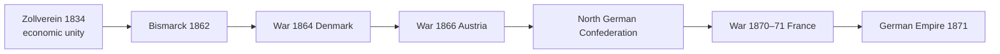

# German & Italian Unification — Nationalism vs Realpolitik

> GS-1 · Topic 05 · Bismarck, blood and iron, Zollverein, Cavour, Garibaldi, Mazzini — international implications

---

## PYQs

| Year | M | Words | Question (EN) | प्रश्न (HI) | ID |
|------|---|-------|---------------|-------------|-----|
| 2025 | 12 | 200 | The Unification of Germany is considered as a symbol of the contradiction between the 'ideal of nationalism' and the 'realities of power politics'. In this context, critically examine the paths of unification and its international implications. | जर्मनी का एकीकरण 'राष्ट्रवाद के आदर्श' और 'यथार्थवादी शक्ति-राजनीति' के अंतर्विरोध का प्रतीक माना जाता है। इस सन्दर्भ में एकीकरण के मार्गों और उसके अंतर्राष्ट्रीय निहितार्थों का आलोचनात्मक परीक्षण कीजिए। | Q1 |
| 2023 | 12 | — | Evaluate the role of Bismarck in the unification of Germany. | जर्मनी के एकीकरण में बिस्मार्क की भूमिका का मूल्यांकन कीजिए। | Q2 |

---

## Quick Revision

```
NATIONALISM (ideal): Shared language/culture/history → self-determination → unified nation-state
  German: 1848 Frankfurt Parliament failed | Italian: Mazzini "Young Italy" 1831 — romantic nationalism

POWER POLITICS (realities): Alliances, wars, dynastic interest, Realpolitik — Bismarck model

GERMAN UNIFICATION PATH:
  Pre-1815: 300+ states → 1815 Congress of Vienna → German Confederation (39 states) under Austrian influence
  Zollverein (1834) — Prussia-led customs union — economic unity without political unity
  1862 Bismarck PM of Prussia — "blood and iron" speech 1862
  Three wars of unification:
    1864 vs Denmark (Schleswig-Holstein)
    1866 Austro-Prussian War — Königgrätz — Dissolves German Confederation → North German Confederation
    1870–71 Franco-Prussian War — Ems Telegram provocation → German Empire proclaimed Versailles 18 Jan 1871
  Bismarck: Realpolitik, alliances, exclude Austria (Kleindeutschland — "small Germany")

ITALIAN UNIFICATION (Risorgimento):
  Before 1850: Metternich called Italy "mere geographical expression"
  Mazzini — republican nationalism (Young Italy)
  Cavour — PM Piedmont-Sardinia — diplomacy + economy (1852+)
  Garibaldi — "Red Shirts" — Expedition of the Thousand 1860 (Sicily, Naples)
  1859 war vs Austria (with France Napoleon III help) — Lombardy
  1861 Kingdom of Italy proclaimed — Victor Emmanuel II — capital Rome only 1871
  Venetia 1866 (Austro-Prussian war side deal) | Rome 1870 (French troops left — Papal States taken)

CONTRADICTION nationalism vs power politics:
  National rhetoric (unity) BUT achieved via war, manipulation, elite deals — not pure popular will
  Germany: liberal 1848 failed; conservative Prussian militarism succeeded
  Italy: north-led; south integrated by force; plebiscites but limited democracy

INTERNATIONAL IMPLICATIONS:
  Shift European balance — new powerful central European empire
  France lost Alsace-Lorraine → revanchism → WWI seed
  Austria weakened → dual monarchy 1867 | Italy rival
  Bismarck alliance system post-1871 — isolate France ( Dreikaiserbund, Reinsurance)
  Italian unification — end of papal temporal power crisis; great-power bargaining

CONTEMPORARY: EU integration vs nationalist separatism (Scotland, Catalonia) | Ukraine self-determination
  German reunification 1990 | nationalism + Realpolitik in IR studies

TRAPS: Germany unified 1871 not 1848 | Bismarck excluded Austria (Kleindeutsch not Grossdeutsch)
  Garibaldi ≠ unified Italy alone (Cavour diplomacy critical) | Italy complete Rome 1871 not 1861
  Unification ≠ purely bottom-up popular revolution
```

---

## Content

### Context — nationalism in 19th-century Europe

- After **1815 Congress of Vienna**, **Metternich's conservative order** tried to **suppress liberal-national revolutions** — yet **industrial capitalism, print culture, railways, and wars** fuelled **"nation-state" ideal**: **one people, one language, one government**.
- **Syllabus link:** **National boundaries redrawn** through **Italian (1861/1871)** and **German (1871)** unification — **paradigm shift from multi-ethnic empires to national states**.
- **Exam tension:** **Romantic nationalism (Mazzini, 1848 liberals)** vs **Realpolitik (Bismarck, Cavour)** — **unification achieved more by ** **statecraft and war** than by ** Frankfurt Parliament ideals**.

### Germany before unification

- **Holy Roman Empire legacy** — **300+ states** reduced to **39** in **German Confederation (Deutscher Bund, 1815)** — **Austrian presidency**, **Prussian rivalry**.
- **Economic nationalism first:** **Zollverein (1834)** — **Prussia-led customs union** — **free trade among member states**, **common external tariff** — **created economic "Germany" before political Germany** — **excluded Austria** (key later).
- **1848 Revolutions:** **Frankfurt Parliament** in **St Paul's Church** — **liberal dream of unified constitutional Germany** — **failed** over **Schleswig-Holstein, monarchy refusal, bourgeois fear of mob** — **lesson: nationalism needs strong state arm**.

### Bismarck and German unification — path and methods

**Otto von Bismarck (1815–1898)**
- **Junker (landed noble)**, **conservative**, appointed **Prime Minister of Prussia by William I (1862)** — famous **"blood and iron"** speech — **not speeches but military strength** will unify Germany.
- **Philosophy: Realpolitik** — **practical power over ideology**; **alliance manipulation**; **limited war objectives**.

**Three wars of unification**

| War | Year | Opponent | Outcome |
|-----|------|----------|---------|
| **Schleswig-Holstein** | **1864** | **Denmark** | **Prussia + Austria** take duchies — **later dispute between them** |
| **Austro-Prussian (Seven Weeks' War)** | **1866** | **Austria** | **Prussia crushes Austria at Königgrätz (Sadowa)** — **Dissolves German Confederation** — **North German Confederation (1867)** — **Austria excluded (Kleindeutsch solution)** |
| **Franco-Prussian War** | **1870–71** | **France (Napoleon III)** | **Ems Telegram provocation** — **French defeat at Sedan** — **German Empire proclaimed at Versailles 18 January 1871** — **Alsace-Lorraine annexed** |



**Internal policy after 1871**
- **Kulturkampf** vs Catholic Church — **state supremacy**.
- **Socialist laws** — **repress SPD** while introducing **early social insurance (1880s)** — **"carrot and stick"**.
- **Foreign alliance web:** **Dreikaiserbund**, **Dual Alliance with Austria-Hungary (1879)**, **Reinsurance Treaty with Russia** — **isolate France** — **peace as tactical choice** (" **satiated power**").

**Evaluate Bismarck (exam core)**
- **Architect of unity** through ** calibrated warfare**, **constitutional federation of north**, **annexation of south German states after 1870 patriotic surge**.
- **Not democrat:** **Unified Germany under ** **Prussian Hohenzollern monarchy + junker-officer elite**, **not 1848 liberals' republic**.
- **International stabilizer then destabilizer seed:** **Alsace-Lorraine** **poisoned Franco-German relations** → **WWI**.

### Italian unification (Il Risorgimento)

**Leaders — three types of nationalism**

| Leader | Approach | Role |
|--------|----------|------|
| **Giuseppe Mazzini** | **Republican, romantic nationalism** — **Young Italy (1831)** | **Moral inspiration**, **failed revolutions 1848** — **idealist pole** |
| **Count Camillo di Cavour** | **Liberal monarchist Realpolitik** — **PM Piedmont-Sardinia (1852–61)** | **Modernized Piedmont**, **alliance with ** **Napoleon III (Plombières 1858)**, **1859 war vs Austria** — **got Lombardy** |
| **Giuseppe Garibaldi** | **Popular military hero** — **Red Shirts** | **Expedition of the Thousand (1860)** — **Sicily & Naples** — **handed conquests to ** **Victor Emmanuel II** (not Mazzini's republic) |

**Chronology**
- **1859:** **France-Piedmont vs Austria** — **Lombardy to Piedmont** — **central Italy states vote to join Piedmont**.
- **1860:** **Garibaldi's landing at Marsala, Sicily** — **defeats Bourbon forces** — **March on Naples**.
- **17 March 1861:** **Kingdom of Italy proclaimed** — **capital Turin then Florence** — **Rome still papal + French garrison**.
- **1866:** **Italy allies with Prussia** — gains **Venetia** after **Austro-Prussian War**.
- **1870:** **Franco-Prussian War** — **French troops leave Rome** — **Italian capture of Rome (20 Sept 1870)** — **capital Rome 1871** — **unification "complete"** except **Italia irredenta** debates.

**Contradictions in Italian case**
- **Northern elite ** ** Piedmontization** of south — ** brigandage repression** — **north-south economic divide** persists.
- **Papal ** ** temporal power** ended — **Catholic Church hostile** until **Lateran Pacts (1929)**.
- **Nationalism** ** rhetoric of unity** masked **elite bargains and plebiscites under occupation**.

### Nationalism vs power politics — critical synthesis

| **Nationalist ideal** | **Power-political reality** |
|----------------------|----------------------------|
| **Self-determination of "German/Italian people"** | **Prussian army + Piedmont diplomacy** decided borders |
| **1848 popular parliaments** | **Failed** — **1860s-70s conservative states won** |
| **Cultural unity (language, history)** | **Excluded minorities** — **Poles in German east**, **German speakers in Sudetenland**, **southern Italian marginalization** |
| **Peaceful union** | **Three wars (Germany)**, **multiple wars (Italy)** |
| **Republican brotherhood (Mazzini)** | **Monarchical kingdoms (Victor Emmanuel, Kaiser William I)** |

- **2025 PYQ framing:** Germany especially **symbolizes contradiction** — **national unification celebrated** but accomplished via **Realpolitik, dynastic war, annexation** — **liberal nationalists subordinated to junker-military state**.

### International implications

**Balance of power shift**
- **New German Empire** — **largest economy/military on continent** by **1900** — ** shattered French supremacy** — **Dual Monarchy Austria weakened** — **Italy unified but militarily weaker rival**.

**Franco-German antagonism**
- **Alsace-Lorraine (Elsaß-Lothringen)** — **French revanchism** — **central cause chain to ** **World War I** — **1919 Versailles returned provinces to France**.

**Alliance system**
- **Bismarck's hub-and-spoke diplomacy** — **1879 Austro-German alliance** — **1882 Triple Alliance (Italy)** — **model for pre-1914 bloc politics**.

**Italian great-power politics**
- **Plombières bargain** — **Nice and Savoy to France** for help — **nationalism traded territory**.
- **Scramble for Africa** — **Italy takes Eritrea, Libya (1911)** — ** imperial compensation for weak unification gains**.

**Inspiration and fear elsewhere**
- **Inspired:** **Slavic nationalisms**, **Young Turks**, **anti-colonial nationalists** saw **model of unity**.
- **Feared:** **Metternich-style conservatives**, **multi-ethnic empires (Ottoman, Habsburg, Romanov)** — **nationalism as disintegration force** — **Balkan crises**.

### Comparison — Germany vs Italy unification

| Feature | **Germany** | **Italy** |
|---------|-------------|-----------|
| **Lead state** | **Prussia** | **Piedmont-Sardinia** |
| **Master strategist** | **Bismarck** | **Cavour** |
| **Popular hero** | **Less central (army institution)** | **Garibaldi** |
| **Wars** | **1864, 1866, 1870–71** | **1859, 1860, 1866, 1870** |
| **Excluded power** | **Austria (Kleindeutsch)** | **Austria from north initially** |
| **Capital issue** | **Berlin clear** | **Rome delayed till ** **1870** |
| **Completed** | **1871 Versailles proclamation** | **1871 Rome as capital** |

### Contemporary relevance

- **European Union:** **Irony** — **19th c. nation-states at war** → **21st c. supranational integration** — **Brexit** shows **nationalism vs pragmatic interdependence** tension repeats.
- **German reunification (1990):** **Post-Cold War** — **national aspiration (Wiedervereinigung)** achieved via **diplomacy + NATO/EU frameworks** — **modern Realpolitik**.
- **Self-determination norms:** **UN Charter**, **Kosovo, Ukraine** debates echo **1871 plebiscite logic** — **when is secession legitimate?**
- **India parallel (cross-topic):** **Patel's integration** vs **European unification** — **both combine ideal of nation with coercion/diplomacy** — useful **comparative sentence in Mains**.

### Limits and balanced view

- **Bismarck indispensable but not alone** — **Prussian army (Moltke)**, **economic Zollverein**, **south German cultural nationalism post-1870** all mattered.
- **Italian unification ** ** incomplete socially** — **mass emigration**, **regional inequality** — **political unity ≠ national homogenization**.
- **Nationalism** ** liberating and destructive** — **unified states** later ** pursued imperialism and WWI**.

---

## Answers

### Q1: The Unification of Germany… contradiction between 'ideal of nationalism' and 'realities of power politics'… critically examine paths and international implications. (2025, 12M, 200W)

**Opening:**
> German unification (1871) fulfilled the cultural dream of a united German nation, yet was engineered by Bismarck's Realpolitik, dynastic wars, and exclusion of Austria — embodying tension between nationalist ideals and power politics with far-reaching European consequences.

**Write these points:**
- **Nationalist ideal:** **Shared language, literature (Goethe), liberal hopes of 1848 Frankfurt Parliament** — **self-determination for German people**.
- **Power-political path:** **Bismarck (1862+)** — **"blood and iron"** — **1864 Denmark**, **1866 Austria (Königgrätz)**, **1870–71 France** — **not popular revolution but ** **Prussian military-diplomatic statecraft**.
- **Kleindeutsch vs Grossdeutsch:** **Excluded Austria** — **nationalism subordinated to ** **Prussian hegemony**, **Hohenzollern monarchy** — **1848 liberals sidelined**.
- **Zollverein (1834):** **Economic unity** preceded **political** — **nationalism via trade + war**, not speeches alone.
- **International implications:** **German Empire shifts balance** — **France loses Alsace-Lorraine** → **revanchism** → **WWI**; **Bismarck alliance system (1879 Dual Alliance)** shapes **pre-1914 blocs**; **Austria weakened**, **Italian rivalry**.
- **Critical view:** **Unification modernized Germany** but **embedded militarism, authoritarianism, irredentism** — **national ideal corrupted by power means**.

**Conclusion:**
> Germany 1871 proves **nationalism and Realpolitik are intertwined** — **ideal gave legitimacy**, **power politics gave form** — **international order destabilized for decades**.

---

### Q2: Evaluate the role of Bismarck in the unification of Germany. (2023, 12M)

**Opening:**
> Otto von Bismarck was the decisive architect of German unification through Realpolitik, three calculated wars, and federation under Prussia — yet he was a conservative dynast, not a liberal nationalist.

**Write these points:**
- **Appointment 1862** as **Prussian PM** — **resolved constitutional crisis** — ** army reforms** funded — **power base for wars**.
- **1864 Schleswig-Holstein:** **Joint with Austria then engineered conflict** — **national issue instrumentally used**.
- **1866 vs Austria:** **Dissolved German Confederation**, **North German Confederation** — **excluded Austria (Kleindeutsch)** — **decisive strategic choice**.
- **1870–71 vs France:** **Ems Telegram manipulation** — **south German states joined north** — **Empire proclaimed Versailles Jan 1871**.
- **Domestic consolidation:** **Constitution of 1871**, **Kulturkampf**, **anti-socialist laws**, **social insurance** — **strong centralized Reich**.
- **Limits:** **Not democrat** — ** crushed 1848 ideals**; **Alsace-Lorraine annexation** sowed **WWI**; **dependent on ** **army, king** — **personal diplomacy ended with Kaiser Wilhelm II dismissal (1890)**.

**Conclusion:**
> Bismarck ** indispensable for timing, war calibration, and diplomatic isolation of opponents** — **greatest Realpolitiker** — but **unification's costs (militarism, revanchism)** partly his legacy too.

---

### Q3 (Future variant): Discuss the role of Cavour and Garibaldi in Italian unification. (Likely, 12M, 200W)

**Opening:**
> Italian unification combined Cavour's diplomatic Realpolitik from Piedmont with Garibaldi's popular military campaigns — Mazzini's republican ideal largely sidelined.

**Write these points:**
- **Cavour:** **Modernized Piedmont**, **alliance with France (1859)**, **Lombardy from Austria**, **diplomatic annexation of central duchies**.
- **Garibaldi:** **Expedition of the Thousand (1860)** — **Sicily and Naples** — **Red Shirts' popular nationalism**.
- **1861 Kingdom under Victor Emmanuel** — **Garibaldi yielded to monarchy** — **Cavour's statecraft dominant**.
- **Rome 1870** — **French withdrawal** — **capital moved** — **completion**.
- **Contradiction:** **National hero vs elite bargain** — **south integrated with repression**.

**Conclusion:**
> **Cavour gave structure; Garibaldi gave passion** — together **Risorgimento succeeded where 1848 failed**.

---

### Q4 (Future variant): Compare the unification of Germany and Italy. (Likely, 12M, 200W)

**Opening:**
> Both Germany (1871) and Italy (1871) unified fragmented regions into nation-states through Realpolitik and war — yet differed in lead states, heroes, and international bargains.

**Write these points:**
- **Common:** **Nationalism after 1815**; **1848 failures**; **war + diplomacy**, not pure popular revolution; **monarchical outcome** ( **Kaiser William I**, **Victor Emmanuel II** ).
- **Germany:** **Prussia-led**, **Bismarck**, **three wars (1864, 1866, 1870–71)**, **Zollverein first**, **excluded Austria (Kleindeutsch)**.
- **Italy:** **Piedmont-led**, **Cavour's diplomacy + Garibaldi's Red Shirts (1860)**, **French help (1859)**, **Rome capital delayed to 1870**.
- **Contradiction both:** **National ideal** vs **elite militarism** — **Alsace-Lorraine grievance (Germany)**, **north-south divide (Italy)**.
- **International effect:** **New powers shift balance** — **Franco-German rivalry**, **Italian colonial compensations (Libya)**.

**Conclusion:**
> **Same era, same tools (war, alliances)** — **different personalities and geography** — **both symbols of nationalism married to power politics**.

---

## Traps

| Wrong | Correct |
|-------|---------|
| Germany unified in 1848 | **1848 Frankfurt Parliament failed** — **unity 1871** |
| Bismarck was a liberal nationalist | **Conservative Junker** — **Realpolitik**, **anti-1848** |
| Grossdeutschland including Austria was outcome | **Kleindeutsch** — **Austria excluded 1866** |
| Italian unification finished 1861 with Rome | **1861 proclaimed** but **Rome capital only 1871** |
| Garibaldi alone unified Italy | **Cavour's diplomacy + Piedmont state essential** |
| Mazzini led unified Italy politically | **Republican idealist** — **monarchy won** |
| Unification was peaceful plebiscite only | **Multiple wars**, **Garibaldi's campaigns**, **Austrian defeats** |
| Zollverein included Austria | **Excluded Austria** — **Prussian economic leadership** |
| Alsace-Lorraine irrelevant later | **Core Franco-German grievance** → **WWI** |
| Italian unification had no colonial aftermath | **Italy pursued ** **Libya/Eritrea** — ** imperial compensation** |
| Bismarck caused WWI directly | **Died 1898** — **system he built + Wilhelm II's policy** contributed to **1914** |
| Nationalism always democratic | **1871 Germany = semi-authoritarian monarchy** |

---

*Complete.*
