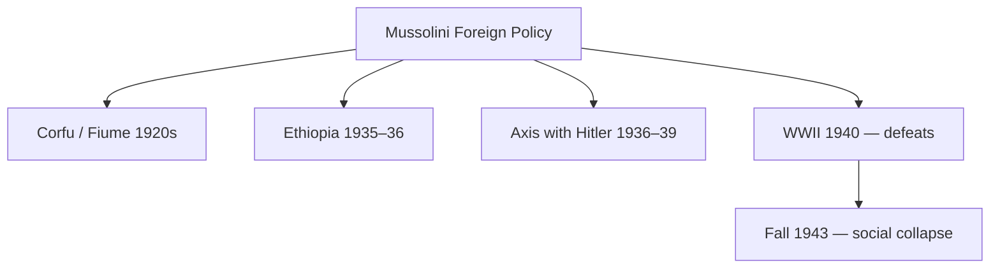

# Fascism, Nazism & Socialism — Ideologies and Social Impact

> GS-1 · Topic 05 · Mussolini, Hitler, Marx, Soviet model — forms, features, effect on society (18th c.–mid 20th c.)

---

## PYQs

| Year | M | Words | Question (EN) | प्रश्न (HI) | ID |
|------|---|-------|---------------|-------------|-----|
| 2020 | 8 | 125 | Write a critical note on the Foreign Policy of Mussolini, the leader of Fascism in Italy. | इटली में फासीवाद के नेता मुस्सोलिनी की विदेश नीति पर समीक्षात्मक टिप्पणी लिखिए। | Q1 |

---

## Quick Revision

```
IDEOLOGIES SYLLABUS: Socialism · Communism · Fascism · Nazism — forms + societal impact

SOCIALISM (broad):
  Critique of industrial capitalism inequality | Public/community ownership of means of production
  Utopian: Owen, Saint-Simon, Fourier — model communities
  Scientific: Marx & Engels — historical materialism, class struggle, dictatorship of proletariat
  Revisionist: Bernstein — evolutionary socialism | Fabians in Britain

COMMUNISM (Marxist-Leninist form):
  1917 Russian Revolution — Lenin, Bolsheviks | Soviets | Red Army civil war
  Stalin (1928+) — Five-Year Plans, collectivization, Great Purge | command economy + totalitarian state
  Society: literacy up, women legal equality formal, atheism promoted; terror, gulags, famine (Holodomor debate)

FASCISM (Italy — Mussolini):
  March on Rome 1922 | Duce | Corporate state — syndicates under state
  Features: ultra-nationalism, one-party, cult of leader, anti-communist, anti-liberal, violence
  Society: youth leagues (Opera Nazionale Balilla), censorship, church deal (Lateran 1929), women as mothers of nation

NAZISM (Germany — Hitler):
  National Socialism ≠ Italian fascism exactly — added biological racism, Lebensraum, antisemitism
  Nuremberg Laws 1935 | Kristallnacht 1938 | Holocaust 1941–45
  Hitler Youth, Gleichschaltung (coordination), total mobilization, war economy

MUSSOLINI FOREIGN POLICY (PYQ):
  Revise imperial prestige — Corfu 1923 | Fiume (D'Annunzio) context
  Ethiopia invasion 1935–36 — League sanctions weak | Albania 1939
  Axis with Hitler — Pact of Steel 1939 | entered WWII June 1940 — disastrous
  Critical: imperial ambition > capacity; subordinate to Hitler; colonies poor; regime fell 1943

SOCIETAL IMPACT COMPARE:
  Socialism/Communism: reduced formal class privilege (USSR), welfare, education; also repression, famine
  Fascism/Nazism: crushed labour rights, militarized youth, gender traditionalism; genocide (Nazism)
  All: mass politics, propaganda, state control of culture — end of 19th c. liberal optimism

CONTEMPORARY: Rise of populism studies | UN anti-fascism resolution | Holocaust education (Yad Vashem)
  ICC genocide prosecutions | India's fight against colonialism aligned with anti-fascist WWII
  Communism collapse 1991 vs China model | extremism deradicalization policies

TRAPS: Fascism ≠ all dictatorships | Nazism ≠ same as Italian Fascism (race core in Nazism)
  Mussolini ≠ always Hitler's equal partner — junior ally | Socialism ≠ only USSR
  Stalinism ≠ Marx's democratic vision as interpreted by critics | Foreign policy ≠ only Ethiopia
```

---

## Content

### Context — age of mass ideologies (late 19th – mid 20th century)

- **Industrial Revolution** and **World War I** shattered **19th-century liberal confidence** — **mass politics** (universal male suffrage, parties, press) made **ideologies** compete for **state power**: **socialism/communism (left)**, **fascism/nazism (radical right)**, **liberal democracy (centre, weakened)**.
- **Syllabus demand:** **Forms** (structure, doctrine) + **effect on society** (class, gender, culture, violence) — not biography alone.

### Socialism — origins, forms, social impact

**Core ideas**
- **Critique:** **Industrial capitalism** exploits **wage workers (proletariat)** — **private profit** vs **social need**.
- **Goal:** **Collective ownership** of **means of production** — **equality, end of class exploitation**.
- **Marx & Engels, *Communist Manifesto* (1848):** **Historical materialism**, **class struggle**, **capitalism seeds own destruction**, ** dictatorship of proletariat** → **classless communism**.
- **First International (1864)**, **Second International (1889)** — ** socialist parties across Europe**.

**Branches (exam must distinguish)**

| Type | Figures | Features |
|------|---------|----------|
| **Utopian socialism** | **Robert Owen**, **Saint-Simon**, **Charles Fourier** | **Model communities**, **moral persuasion** — pre-Marx |
| **Revolutionary Marxism** | **Marx, Engels, Lenin** | **Violent revolution**, **smash bourgeois state** |
| **Revisionist / democratic socialism** | **Eduard Bernstein**, **Fabian Society (UK)** | **Parliamentary path**, **gradual reform** |
| **Syndicalism** | **Sorel** | **General strike**, **trade-union power** |

**Social impact (where implemented partially — Europe)**
- **Trade unions legalized** in many states; **8-hour day campaigns**; **social insurance (Bismarck 1880s)** partly **response to socialist pressure**.
- **Women in labour movement:** **Clara Zetkin** — **International Women's Day (1910)** — ** socialist-feminist link**.
- **Education & literacy** demands — **workers' self-education circles**.

### Communism — Soviet model and society

**1917 Russian Revolution**
- **February 1917:** **Tsar Nicholas II** abdicates — **Provisional Government**.
- **October 1917:** **Lenin & Bolsheviks** seize power — **"All power to Soviets"** — **Treaty of Brest-Litovsk (1918)** exits WWI.
- **Civil war (1918–21):** **Red vs White** — **War Communism**, then **NEP (1921)**.

**Stalin era (1928–53) — "socialism in one country"**
- **Five-Year Plans:** **Forced industrialization**, **collectivization of agriculture** — ** kulaks "eliminated as class"**.
- **Gulag forced labour**, **Great Purge (1936–38)** — **millions dead** from **terror, famine (1932–33 Ukraine Holodomor debated as genocide)**.
- **Society transformed:**
  - **Mass literacy**, **female workforce participation**, **official gender equality laws**, **secularization**, **urbanization**.
  - **Loss of political freedom**, ** famine**, **family informer culture**, **cult of Stalin**.

**Global impact**
- **Comintern** supported **communist parties worldwide** — **Indian CPI (1925)**.
- **Cold War bifurcation** after **1945** — **welfare states in West partly** to **undercut communist appeal**.

### Fascism — Italian form (Mussolini)

**Rise**
- **Post-WWI Italy:** **"mutilated victory"** — **economic crisis**, **Biennio Rosso (1919–20) socialist unrest**, **elite fear of Bolshevism**.
- **Benito Mussolini (1883–1945):** Ex-socialist → **Fasci di Combattimento (1919)** — **nationalist, anti-communist squads (Blackshirts)**.
- **March on Rome (28 October 1922)** — **King Victor Emmanuel III** appoints Mussolini PM — **legal seizure**, not full coup initially.
- **Duce** — **dictatorship consolidated by 1925–26** — **press laws, OVRA secret police**.

**Doctrine and form**
- **Ultra-nationalism**, **myth of Roman imperial revival**, **anti-liberalism**, **anti-communism**, ** cult of violence and youth**.
- **Corporate State (1930s):** **Economy organized into ** **state-controlled syndicates** — **neither free market nor socialist** — **autarky** push.
- **Lateran Accords (1929):** **Pope Pius XI** — **Vatican City**, **Catholicism as state religion** — **bought Church acquiescence**.

**Effect on Italian society**
- **Opera Nazionale Balilla** — **youth militarization**, **ideological training**.
- **Women:** **"battle for births"** — **pro-natalism**, **excluded from many jobs** — **subordinate gender role**.
- **Culture:** **Censorship**, **fascist aesthetics in architecture (EUR district Rome)**, ** suppression of opposition (Antonio Gramsci imprisoned)**.
- **Labour:** **Crushed strikes**, ** unions subordinated to corporations**.

### Nazism — German form (Hitler)

**Distinct from Italian fascism — racial biology central**
- **NSDAP (Nazi Party)** — **Hitler**, **Goebbels (propaganda)**, **Himmler (SS)**, **Göring**.
- **Ideas:** **Aryan racial supremacy**, **antisemitism**, **Lebensraum (living space)**, **Führerprinzip (leader principle)**, **revanche against Versailles**.

**State and society**
- **Gleichschaltung (1933–34):** **Coordination** — **trade unions abolished (May 1933)**, ** parties banned**, ** Reichstag Fire Decree**, **Enabling Act**.
- **Nuremberg Laws (1935):** **Stripped Jews of citizenship** — **legal basis for persecution**.
- **Hitler Youth, League of German Girls** — **total youth mobilization**.
- **Women:** **"Kinder, Küche, Kirche"** — **removed from some professions**, ** medals for mothers**.
- **Economy:** **Rearmament**, **autarky**, **Strength Through Joy (KdF)**, ** reduced unemployment ( partly military spending, hidden deficit)**.
- **Holocaust:** **Industrial genocide** — **6 million Jews**, ** Sinti-Roma, disabled, Slavs, political prisoners** — **society complicit through ** **bureaucracy, businesses, bystanders** — **deepest societal rupture of modernity**.

### Comparison table — Fascism vs Nazism vs Communism (Soviet)

| Feature | **Italian Fascism** | **Nazism** | **Soviet Communism** |
|---------|---------------------|------------|----------------------|
| **Leader** | **Mussolini (Duce)** | **Hitler (Führer)** | **Stalin (General Secretary)** |
| **Race doctrine** | Secondary (later antisemitic laws 1938) | **Central — biological antisemitism** | **Official internationalism** (practice: Russification, deportations) |
| **Economy** | **Corporate state, autarky** | **War economy, big business complicity** | **Command planning, collectivization** |
| **Class policy** | **Crush labour, co-opt capital** | **Same + slavery in camps** | **Abolish bourgeoisie legally** |
| **Religion** | **Lateran pact with Church** | **Positive Christianity then persecution** | **State atheism, church suppression** |
| **Gender** | **Pro-natalist traditional roles** | **Similar + racial breeding ideology** | **Formal equality, double burden** |
| **Violence scale** | **Political opponents, Ethiopia war crimes** | **Holocaust + WWII tens of millions** | **Purges, gulag, famine millions** |

### Mussolini's foreign policy — critical note (PYQ focus)

| Phase | Action | Assessment |
|-------|--------|------------|
| **1920s prestige building** | **Corfu incident (1923)**, **Fiume dispute** ( **D'Annunzio** precedents) | **Asserted power** despite **weak economy** |
| **Colonial empire** | **Libya pacification (1920s)**, **Somalia/Eritrea** | **Costly**, **limited economic gain** |
| **Ethiopia (1935–36)** | **Invasion** — ** mustard gas**, **League of Nations sanctions (weak)** | **Temporary prestige** — **isolated Italy diplomatically** |
| **Spanish Civil War (1936–39)** | **Supported Franco** | **Anti-communist crusade** — **drained resources** |
| **Axis alignment** | **Rome-Berlin Axis (1936)**, **Pact of Steel (1939)**, **Anti-Comintern Pact with Japan** | **Subordinated Italy to Hitler** |
| **WWII entry (June 1940)** | **Invaded Greece, North Africa** — ** defeats by UK, partisans** | **Overreach** — ** regime collapsed 1943** — **Mussolini executed 1945** |

**Critical themes for exam**
- **Foreign adventures** **compensated for** **domestic economic weakness** — **propaganda over substance**.
- **Ethiopia** **exposed League impotence** — ** lesson for appeasement era**.
- **Alliance with Hitler** ** dragged Italy to disaster** — **not equal partner** — **Mediterranean ambitions failed**.
- **Italian society:** **Initial popularity (1920s order)** → **war fatigue, bombing, partisan resistance** — **fascism's social contract broke**.



### Societal impact — cross-cutting themes

**Mass politics and propaganda**
- All ideologies used **radio, rallies, cinema, posters** — **Goebbels**, ** Soviet agitprop**, ** Mussolini's balcony speeches** — **created new political emotions** — **identity over rational debate**.

**Class and labour**
- **Communism:** **Formal abolition of capitalist class** — **new elite ( nomenklatura)**.
- **Fascism/Nazism:** **Independent unions destroyed** — **labour tied to state/corporations** — **strike illegal**.

**Gender and family**
- **Fascist/Nazi:** **Women pushed to domestic reproduction** — **Nazism added racial purity**.
- **Communist:** **Legal equality, childcare, employment** — ** patriarchy persisted informally**.

**Culture and intellectuals**
- **Book burnings (Germany 1933)**, ** fascist art**, ** socialist realism** — **state defined "true culture"**.
- **Exiles:** **Einstein, Thomas Mann, Gramsci** — **brain drain vs prison death**.

**Minorities and genocide**
- **Nazism most extreme** — **Holocaust** — **industrial society turned to mass murder**.
- **Fascist Italy:** **Racial laws 1938** under **German pressure** — **persecution of Jews accelerated**.
- **Soviet:** **Deportation of nationalities (Chechens, Crimean Tatars 1944)** — ** empire within communist shell**.

### Contemporary relevance

- **Holocaust remembrance:** **UN International Holocaust Remembrance Day (27 Jan)**, **Yad Vashem**, ** Auschwitz-Birkenau UNESCO site** — **"never again"** education — **genocide prevention norm**.
- **International Criminal Court:** **Prosecutes crimes against humanity** — lineage **Nuremberg Principles (1946)**.
- **UN General Assembly resolution on combating glorification of Nazism** — **debates on free speech vs hate**.
- **India's WWII role:** **2.5 million Indian soldiers** fought **against fascism** — **Azad Hind parallel complexity** — **anti-colonial nationalism vs anti-fascist war**.
- **Communism's legacy:** **1991 Soviet collapse** — **China's market-Leninism** — **debates on inequality vs authoritarian efficiency**.
- **Populism studies:** **Historians compare** **21st century populist leaders** to **1920s fascist tactics (us vs them, media control)** — **careful academic distinction required in exam**.

### Limits and balanced view

- **Fascism** label ** overused loosely** — **define by ** **one-party, violence, anti-liberalism, nationalism** — not every authoritarian regime.
- **Italian Fascism ≠ Nazism** — **race not original core in Italy** until **1938**.
- **Socialism** ** broad church** — **do not equate all socialists with ** **Stalin's terror**.
- **Mussolini foreign policy** — **critical note** must include **both ambition and failure**, **Ethiopia + Axis + WWII collapse**.

---

## Answers

### Q1: Write a critical note on the Foreign Policy of Mussolini, the leader of Fascism in Italy. (2020, 8M, 125W)

**Opening:**
> Mussolini's foreign policy sought to revive Roman imperial glory and domestic legitimacy through colonial expansion and alignment with Hitler — achieving short-term propaganda wins but ending in national catastrophe.

**Write these points:**
- **Aims:** **Prestige dictatorship**, **deflect economic weakness**, **anti-communist crusade**, **Mediterranean empire ("Mare Nostrum")**.
- **1920s–30s:** **Corfu (1923)**, **Libya consolidation**, **Ethiopia invasion (1935–36)** — **League sanctions weak** — ** exposed international order limits**.
- **Axis:** **Rome-Berlin Axis (1936)**, **Pact of Steel (1939)**, **Spanish Civil War support to Franco** — ** tied Italy to Nazi Germany**.
- **WWII (1940):** **Greece and North Africa campaigns failed** — **Italy occupied, Mussolini deposed 1943** — **social collapse, partisan war**.
- **Critical balance:** **Temporary popularity from empire** but **overreach, moral cost (gas in Ethiopia), subordination to Hitler** — **foreign policy destroyed fascist regime**.

**Conclusion:**
> Mussolini's diplomacy was **aggressive, propaganda-driven Realpolitik without economic base** — **critical note must stress imperial illusion and WWII disaster**, not merely list invasions.

---

### Q2 (Future variant): Compare Fascism and Nazism as ideologies and their impact on society. (Likely, 12M, 200W)

**Opening:**
> Italian Fascism and German Nazism shared ultra-nationalism, one-party dictatorship, and anti-communism, but Nazism's biological racism and Holocaust made its societal destruction qualitatively worse.

**Write these points:**
- **Common forms:** **Single party**, **leader cult**, ** crushed unions**, **youth militias**, ** censorship**, ** militarized gender roles**.
- **Fascism (Mussolini):** **Corporate state**, **Lateran Pacts with Church**, ** imperialism in Ethiopia** — **antisemitism escalated late (1938)**.
- **Nazism (Hitler):** **Nuremberg Laws**, **Holocaust**, **Lebensraum**, ** Gleichschaltung** — **genocide as state policy**.
- **Social impact Italy:** **Order for middle class 1920s**, **later war misery** — **limited racial genocide scale**.
- **Social impact Germany:** **Total mobilization**, **complicity of bureaucracy/industry**, ** destruction of Jewish society**, ** WWII devastation**.
- **Legacy:** **Post-war denazification**, ** EU born from ** **"never again"** — **fascism studies as warning**.

**Conclusion:**
> **Family resemblance** in **form of mass authoritarian nationalism** — **Nazism distinguished by racial extermination and global war scale**.

---

### Q3 (Future variant): Discuss the impact of socialism and communism on society in the 19th–20th centuries. (Likely, 12M, 200W)

**Opening:**
> Socialism and communism challenged capitalist inequality, reshaping labour politics, welfare, and — where revolutionary communism took power — entire social structures through industrialization and repression.

**Write these points:**
- **Socialist movements:** **Trade unions**, **8-hour day**, ** women's labour activism (Zetkin)**, ** democratic socialist parties in Europe**.
- **Marxist theory:** **Class consciousness**, ***Communist Manifesto (1848)** — **intellectual framework for parties**.
- **Soviet model:** **Literacy**, **female workforce**, ** secularization**, **urbanization** via **Five-Year Plans**.
- **Costs:** **Stalinist terror**, **gulag**, **famines**, ** loss of political freedom** — **dictatorship of proletariat became party dictatorship**.
- **Global:** **Welfare capitalism response**, **decolonization socialist variants**, **Cold War** — **Indian communists in trade unions, Kerala model debates**.

**Conclusion:**
> **Dual legacy** — **social justice impulses and mass organization** alongside **authoritarian perversions where revolution conquered state power**.

---

### Q4 (Future variant): What are the main features of Fascism? Discuss its impact on society. (Likely, 12M, 200W)

**Opening:**
> Fascism (exemplified by Mussolini's Italy) was an ultra-nationalist, anti-liberal, one-party ideology using violence and mass propaganda — reshaping society through corporatism, youth mobilization, and suppression of dissent.

**Write these points:**
- **Political features:** **One-party state**, **cult of Duce/leader**, **anti-communist**, **anti-parliamentary liberalism**, **violence (Blackshirts)**.
- **Economic form:** **Corporate state (1930s)** — **syndicates under state**, **neither free market nor socialist**, **autarky**.
- **Social impact:** **Youth leagues (Balilla)**, **censorship**, **women as mothers (pro-natalism)**, **crushed trade unions**.
- **Church deal:** **Lateran Accords (1929)** — **stability via religion** — **limited pluralism**.
- **Foreign policy link:** **Imperial prestige (Ethiopia 1935–36)**, **Axis with Hitler** — **war destroyed regime 1943**.
- **Contrast Nazism:** **Italian Fascism** — **race laws mainly from 1938**; **Holocaust scale smaller** than **Nazism**.

**Conclusion:**
> Fascism **mobilized mass society for nationalist discipline** — **short-term order, long-term war and repression** — **societal impact = militarized culture + lost freedoms**.

---

### Q5 (Future variant): Evaluate the impact of the Russian Revolution (1917) on society. (Likely, 12M, 200W)

**Opening:**
> The Russian Revolutions of 1917 (February and October) overthrew tsarism and established Bolshevik rule — transforming class relations, education, and gender laws while imposing one-party dictatorship.

**Write these points:**
- **February 1917:** **Tsar Nicholas II** abdicates — **Provisional Government** — **end of Romanov dynasty**.
- **October 1917:** **Lenin, Bolsheviks** — **"Peace, Land, Bread"** — **Treaty of Brest-Litovsk (1918)** exits WWI.
- **Social gains:** **Mass literacy campaigns**, **formal gender equality**, **secularization**, **workers' state rhetoric**.
- **Stalin era (1928+):** **Five-Year Plans**, **collectivization**, **gulag**, **Great Purge** — **industrial power at human cost**.
- **Global:** **Comintern**, **Cold War**, **welfare capitalism response in West** — **Indian CPI (1925)**.

**Conclusion:**
> 1917 **shattered old elite society** — **equality and terror intertwined** — **defining model of 20th-century communism**.

---

## Traps

| Wrong | Correct |
|-------|---------|
| Fascism and Nazism are identical | **Shared traits** but **Nazism adds scientific racism, Holocaust centrality** |
| Mussolini seized power by full military coup 1922 | **March on Rome** + **King's appointment** — **legal veneer** |
| Italian Fascism always antisemitic from 1922 | **Major racial laws 1938** — **partly German influence** |
| Nazism means "socialist" like welfare state | **"Socialism" in name only** — ** allied with big business, crushed labour** |
| Stalin fulfilled Marx's free communist society | **Command state, class repression** — **debated relation to Marx** |
| All socialism = Soviet dictatorship | **Democratic socialism, Fabians, trade unions** — ** diverse tradition** |
| Mussolini's Ethiopia war was universally approved | **League sanctions**, **international criticism** — **weak enforcement** |
| Mussolini remained equal to Hitler in WWII | **Junior partner** — **Italian defeats, dependency** |
| Holocaust was only death camps | Also **Einsatzgruppen shootings**, **ghettos, starvation** |
| Communist states eliminated gender inequality fully | **Formal laws yes** — **double burden, party patriarchy persisted** |
| Foreign policy PYQ = only list invasions without critique | **Must evaluate success/failure** — **critical note directive** |
| Ideologies had no effect beyond politics | **Deep effects on ** **gender, youth, culture, labour, genocide** — syllabus asks societal impact |

---

*Complete.*
