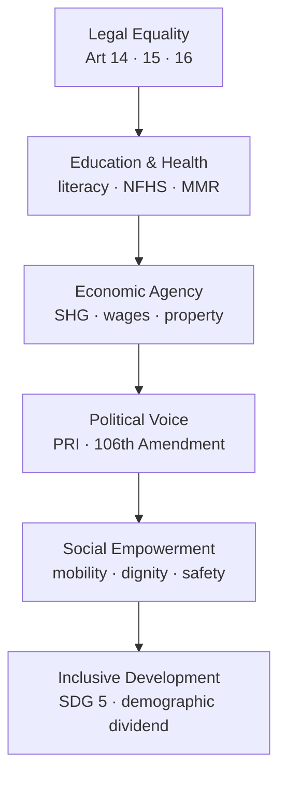

# Women — Status, Organisations & Empowerment

> GS-1 · Topic 07 · Women in society, women's organisations, empowerment, crime

---

## PYQs

| Year | M | Words | Question (EN) | प्रश्न (HI) | ID |
|------|---|-------|---------------|-------------|-----|
| 2024 | 8 | 125 | Explain the contribution of women's organisation in the development of Indian rural society. | भारतीय ग्रामीण समाज के विकास में महिला संगठनों के योगदान का वर्णन कीजिए। | Q1 |
| 2023 | 8 | — | Do you agree with the statement that crime against women in India is increasing? | क्या आप सहमत हैं कि भारत में महिलाओं के प्रति अपराध में वृद्धि हो रही है? | Q2 |
| 2023 | 12 | — | Evaluate the role of woman organisations in woman empowerment. | महिला सशक्तिकरण में महिला संगठनों की भूमिका का मूल्यांकन कीजिए। | Q3 |
| 2021 | 12 | 200 | Why social empowerment of women is necessary for inclusive development? Elaborate in detail. | समावेशी विकास के लिए महिलाओं का सामाजिक सशक्तिकरण क्यों आवश्यक है? विस्तारपूर्वक वर्णन कीजिए। | Q4 |
| 2020 | 8 | 125 | Critically examine the contributions of major women's organisations in contemporary India. | समकालीन भारत में प्रमुख महिला संगठनों के योगदानों का आलोचनात्मक परीक्षण कीजिये। | Q5 |
| 2018 | 8 | 125 | Evaluate the changing status of women in India. | भारत में स्त्रियों की बदलती प्रतिष्ठा का मूल्यांकन कीजिए। | Q6 |

---

## Quick Revision

```
WOMEN STATUS = Legal equality (Constitution) + Persistent social-economic gaps (patriarchy, unpaid care)

HISTORICAL ARC: Purdah/sati reform (Raja Rammohun Roy, Ishwar Chandra Vidyasagar) → Gandhian satyagraha
  (Kasturba, Sarojini Naidu) → Constitution (Art 14/15/16, DPSP 39/42) → 73rd/74th (1/3 PRI seats)
  → 106th Amendment 2023 (33% LS/Assemblies) → still low LFPR (~24% PLFS), son preference (NFHS-5)

EMPOWERMENT DIMENSIONS:
  Economic = wages, property, SHGs, MGNREGA workdays | Political = PRI, reservation, voting
  Social = education, mobility, voice, freedom from violence | Legal = courts, NCW, special laws

MAJOR ORGS:
  AIWC 1927 (Margaret Cousins, Delhi) — education, health, legislative reform
  NFIW 1954 (communist-led federation) — workers, peasants, anti-price rise
  SEWA 1972 (Ela Bhatt, Ahmedabad) — informal sector, union + cooperative + bank
  MKSS 1990s (Aruna Roy, Rajasthan) — RTI, jan sunwai, wage transparency
  Mahila Samakhya (1989, MHRD/now MoWCD) — education for empowerment, collectives
  Kudumbashree 1998 (Kerala) — NHG network, micro-enterprise
  SHG-Bank Linkage (NABARD 1992) — 12+ crore women linked nationally

RURAL DEV CONTRIBUTION: SHGs → credit + livelihood | Mahila mandals → sanitation (Swachh Bharat)
  | Anganwadi/ASHA frontline | Water-user groups | Legal literacy (Protection of Women from DV Act 2005)
  | Panchayat leadership (PRI reservation) | Food security (Annapurna/ration vigilance)

CRIME AGAINST WOMEN (debate Q):
  NCRB registers rise in recorded cases — better reporting + new offences (Sec 498A, POCSO, digital)
  BUT under-reporting in rural/tribal areas persists | Dowry deaths, rape, cruelty by husband still high
  Answer: PARTIAL YES — recorded crimes ↑; also awareness ↑; structural patriarchy remains root

KEY LAWS: Dowry Prohibition 1961 | DV Act 2005 | Vishaka 1997 → POSH 2013 | POCSO 2012
  | Triple Talaq Act 2019 | Sexual Harassment at Workplace | Medical Termination of Pregnancy (amended)

CONSTITUTION: Art 14 equality | Art 15(3) special provisions | Art 16 opportunity | Art 39(a)(d)(e) DPSP
  | Art 42 maternity | Art 51A(e) renounce derogatory practices | Art 243D/243T 1/3 PRI reservation

SCHEMES: Beti Bachao Beti Padhao 2015 | Mission Shakti (2021 umbrella) | Nirbhaya Fund
  | Sukanya Samriddhi | PM Matru Vandana | One Stop Centres | Mahila Police Volunteers

CONTEMPORARY: 106th Amendment (Nari Shakti Vandan Adhiniyam) | Mission Shakti | Digital Shakti
  | NFHS-5 sex ratio at birth improving in some states | Gig/platform worker rights debate

TRAPS: Status improved ≠ full equality | Crime data ↑ ≠ only more crime (reporting effect)
  | SHG ≠ only microcredit — also social capital | Women's org ≠ only urban elite (grassroots strong)
  | Social empowerment ≠ only economic | Reservation ≠ substitute for behavioural change
  | Sati banned 1829 ≠ all practices ended | Legal rights ≠ effective access in courts/police
```

---

## Content

### Context — women in Indian society

- **Indian society** has historically been **patrilineal and patriarchal** — property, ritual authority, and public decision-making centred on men; women’s roles defined through **marriage, motherhood, and domestic labour**, often under **purdah, child marriage, and dowry** systems in many regions.
- **Colonial and reform phase (19th–early 20th c.):** **Raja Rammohun Roy** campaigned against **sati** (abolished **1829**); **Ishwar Chandra Vidyasagar** pushed **Widow Remarriage Act 1856**; **Jyotirao Phule** and **Savitribai Phule** opened schools for girls (**1848**, Pune); **Pandita Ramabai** worked on women’s education; **Gandhi** mobilized women in **Salt March, Khadi, Harijan** work — **Kasturba Gandhi, Sarojini Naidu, Aruna Asaf Ali** entered nationalist leadership.
- **Constitutional modernity (1950 onward):** Independent India promised **formal equality**; yet **son preference, violence, low workforce participation, unpaid care burden**, and **under-representation in top economy/politics** persist — the central **UPPCS debate**: **legal progress vs social lag**.
- **Exam frame:** Questions cluster on **(a) changing status**, **(b) women’s organisations**, **(c) empowerment–development link**, **(d) crime trends** — all require **constitutional, statistical, organisational, and balanced** answers.

### Changing status of women — continuity and change

**Legal and political gains**

| Domain | Milestone | Significance |
|--------|-----------|--------------|
| **Constitution** | **Art 14, 15, 16** | Equality, non-discrimination, equal opportunity in state employment |
| **DPSP** | **Art 39(a)(d)(e), 42** | Adequate livelihood, equal pay, dignity, maternity relief |
| **Fundamental Duties** | **Art 51A(e)** | Renounce practices derogatory to women’s dignity |
| **Panchayati Raj** | **73rd/74th Amendments (1992)** | **Not less than one-third** seats and chairpersons for women in PRI/urban local bodies |
| **Parliamentary reservation** | **106th Constitutional Amendment (2023)** — *Nari Shakti Vandan Adhiniyam* | **33% reservation** for women in **Lok Sabha and State Assemblies** (implementation phased) |
| **Personal laws** | **Hindu Marriage Act 1955**, **Special Marriage Act**, **Muslim Women (Protection of Rights on Marriage) Act 2019** | Marriage age, divorce reform, triple talaq criminalization |

**Social and educational indicators**

- **Literacy:** Female literacy rose from **~9% (1951)** to **~70% (Census 2011)**; gender gap narrowed but **rural-tribal pockets** remain weak.
- **NFHS-5 (2019–21):** Women with **10+ years schooling** increased; **sex ratio at birth (SRB)** shows improvement in several states though **son preference** persists in **Haryana, Punjab, UP** belt historically.
- **Health:** **Maternal Mortality Ratio (MMR)** declined (UN SDG progress) but **anaemia, nutrition, reproductive health access** remain concerns.
- **Workforce:** **Female Labour Force Participation Rate (LFPR)** remains **low (~24% PLFS 2022–23)** vs men — **unpaid care work**, **safety**, **social norms**, and **lack of decent work** explain gap; **urban educated women** face **glass ceiling** in corporate boards despite **Companies Act** provisions.

**Persistent challenges**

- **Violence:** **Dowry deaths, domestic cruelty, sexual assault, harassment, acid attacks, trafficking, cyber crimes** — patriarchal control + economic dependency.
- **Economic:** **Wage gap**, limited **land ownership** (despite **Hindu Succession Amendment 2005**), **informal sector** vulnerability.
- **Political:** PRI reservation created **mass grassroots leadership**; yet **parliament/ministry/corporate apex** still male-dominated until **106th Amendment** fully operationalizes.



### Major women's organisations — timeline and roles

| Organisation | Founded | Key figures / base | Primary contribution |
|--------------|---------|-------------------|----------------------|
| **All India Women's Conference (AIWC)** | **1927**, Delhi | **Margaret Cousins**, **Sarojini Naidu**, **Kamaladevi Chattopadhyay** | Education, health, **legislative reform** (age of consent, inheritance), international women's networks |
| **National Federation of Indian Women (NFIW)** | **1954** | Left-led mass federation | **Working women, peasants**, anti-price rise, **legal aid**, rights campaigns |
| **Self Employed Women's Association (SEWA)** | **1972**, Ahmedabad | **Ela Bhatt** | **Trade union + cooperative + bank** for **informal sector** (hawkers, beedi rollers, garment home-workers) |
| **Mazdoor Kisan Shakti Sangathan (MKSS)** | **1990s**, Rajasthan | **Aruna Roy, Nikhil Dey** | **Right to Information** movement, **jan sunwai** (public hearings), wage transparency — women-led grassroots accountability |
| **Mahila Samakhya Programme** | **1989** (national scale) | MoWCD / earlier MHRD | **Education for empowerment**, collectives, **gender pedagogy** in rural/tribal blocks |
| **Kudumbashree** | **1998**, Kerala | State mission | **Neighbourhood Groups (NHGs)** — micro-enterprise, **community governance**, disaster response model |
| **SHG–Bank Linkage** | **NABARD 1992** onward | NABARD, banks, DAY-NRLM | **Credit + insurance + livelihood** — world's largest microfinance network; **>12 crore** women linked (official aggregates) |
| **National Commission for Women (NCW)** | **1992** (statutory) | Government | **Investigate**, recommend, **review laws**, redress — statutory **watchdog** (not grassroots org but exam-relevant) |

**Typology for answers:** (1) **National federations** (AIWC, NFIW); (2) **Trade/livelihood unions** (SEWA); (3) **Rights/campaign CSOs** (MKSS); (4) **State missions** (Kudumbashree); (5) **Government programme collectives** (Mahila Samakhya, SHGs under **DAY-NRLM**).

### Women's organisations and rural development

- **Credit and livelihood:** **SHGs** under **Deendayal Antyodaya Yojana–NRLM** provide **revolving funds, bank linkage, skill training** — women move from **subsistence to petty trade, dairy, handicrafts (GI-tagged)**; **SEWA rural extensions** replicate cooperative model.
- **Panchayat leadership:** **73rd Amendment** reservation enables women as **sarpanches** — **water, sanitation, mid-day meal, ICDS** oversight; examples from **Rajasthan, UP, Bihar** show **visible development delivery** when supported by collectives.
- **Health and nutrition:** **ASHA, Anganwadi workers** (majority women) + **Mahila Arogya Samitis** strengthen **primary healthcare, immunization, nutrition** — frontline of **Anaemia Mukt Bharat, Poshan Abhiyan**.
- **Transparency and accountability:** **MKSS-style social audits** expose **corruption in MGNREGA, PDS** — women gain **information power** via **RTI Act 2005**.
- **Legal awareness:** Grassroots groups train on **Protection of Women from Domestic Violence Act 2005**, **Dowry Prohibition Act 1961**, **inheritance rights** — reduces **silent suffering**.
- **Infrastructure:** **Swachh Bharat** **mahila mandals** drove **toilet construction, menstrual hygiene** campaigns in villages.
- **Limits (for critical answers):** **Elite capture** in some SHGs; **debt distress** if microcredit commercialized; **sarpanch proxies** ( **pati-panch** phenomenon); **funding dependence** on government schemes.

### Women empowerment — dimensions and link to development

| Dimension | Indicators / tools | Development link |
|-----------|-------------------|------------------|
| **Economic** | Wages, **MGNREGA** workdays (women ~50%+ person-days in many states), **property**, **MSME** | Raises **household income**, **child nutrition/education** spillovers |
| **Political** | **PRI reservation**, voting turnout (women often **higher than men** in recent elections), **106th Amendment** | **Voice in allocation** — water, roads, schools |
| **Social** | Education, **mobility**, **freedom from violence**, **decision-making in family** | Breaks **intergenerational poverty**, improves **health outcomes** |
| **Legal** | Courts, **Legal Services Authorities**, **One Stop Centres**, **Mahila Police Stations** | Converts **rights on paper** to **remedies** |

**Why social empowerment precedes inclusive development (2021 PYQ logic):**
- **Inclusive development** = growth that reaches **SC/ST, women, disabled, poor** — not GDP alone.
- Without **social empowerment**, women lack **agency** to use **economic assets** (credit wasted on male-controlled spending); **education** undermined by **early marriage**; **political reservation** ineffective under **proxy rule**.
- **Amartya Sen** capability approach: development = **freedom to choose** — social norms restricting **mobility, speech, bodily autonomy** cap capabilities.
- **Demographic dividend:** India's youth bulge needs **gender-equal human capital** — **half population** cannot be sidelined for **sustainable growth (SDG 5)**.

### Crime against women — data, debate, root causes

**Legal categories (NCRB — Crime in India)**

- **Cruelty by husband/relatives (Sec 498A IPC)**, **assault on women with intent to outrage modesty**, **kidnapping/abduction**, **rape (Sec 376)**, **dowry deaths (Sec 304B)**, **POCSO** offences, **acid attacks**, **cyber stalking/harassment** (IT Act amendments).
- **Trend:** **Registered cases** show **upward trajectory** over decades — exam answer must **not stop at "yes increasing"**.

**Why recorded crimes rise — nuanced view**

| Factor | Explanation |
|--------|-------------|
| **Better reporting** | **Awareness, media, Nirbhaya 2012** shock, **women's helplines (181), OSCs** |
| **Legal expansion** | New offences codified; **police mandatory registration** after **Criminal Law reforms** |
| **Persistence of patriarchy** | **Dowry, honour logic, son preference, alcohol**, **urban anonymity** in slums |
| **Under-reporting still** | **Rural, migrant, Dalit-Adivasi women**, **marital rape not criminalized** (debated), **stigma** |

**Institutional response**

- **Nirbhaya Fund (2013)** — **One Stop Centres, fast-track courts, forensic labs, Mahila Police**
- **Mission Shakti (2021)** — umbrella: **Samarthya, Shakti Sadan, Hub for Empowerment of Women**
- **Fast-track special courts** for **rape/POCSO**
- **POSH Act 2013** — workplace committees post-**Vishaka Guidelines (1997)**

### Constitutional and policy framework (table)

| Provision / Policy | Content |
|--------------------|---------|
| **Art 15(3)** | State may make **special provisions for women and children** |
| **Art 39(d)** | **Equal pay for equal work** |
| **Art 39(e)** | Health and strength of workers; **not to enter avocations unsuited to age/strength** |
| **Art 42** | **Just and humane conditions of work and maternity relief** |
| **Art 243D / 243T** | **≥1/3 reservation** women in **PRI and urban local bodies** |
| **106th Amendment** | **33% reservation** in **Lok Sabha + State Assemblies** |
| **Beti Bachao Beti Padhao (2015)** | Improve **SRB**, education — **Panipat to Panchkula** campaign logic |
| **Mission Shakti** | Integrated **protection + empowerment** |
| **Maternity Benefit (Amendment) Act 2017** | **26 weeks** paid leave (eligible establishments) |

### Significance — women's agency and national development

- **Human capital:** Educated, healthy, **economically active women** correlate with **lower fertility, better child schooling, higher household savings** — **NFHS** evidence on **education– fertility link**.
- **Governance quality:** **Women PRI leaders** often prioritize **drinking water, sanitation, education** (studies from **Kerala, West Bengal, Karnataka**).
- **Social justice:** Empowerment operationalizes **Constitutional promise** to **half the population** — prerequisite for **Sabka Saath, Sabka Vikas** rhetoric to be substantive.
- **Global standing:** **Gender Inequality Index (UNDP)**, **WEF Global Gender Gap Report** — India ranks **moderate/low** on **economic participation and health** — improvement needed for **soft power and SDGs**.

### Contemporary relevance

- **106th Constitutional Amendment (2023)** — **Nari Shakti Vandan Adhiniyam**: **33% women in Parliament and assemblies** — historic shift; exam link to **political empowerment** and **policy prioritization** (health, safety, education).
- **Mission Shakti (2021)** and **Mission Vatsalya** — integrated **protection, shelter, legal aid** for women and children.
- **Digital Shakti / cyber safety** campaigns — rising **online harassment, deepfakes, financial fraud** targeting women; **IT Rules** and **Cyber Crime Prevention against Women and Children (CCPWC)** scheme.
- **NFHS-5** — use for **SRB, anaemia, spousal violence** statistics in answers; **Poshan 2.0, Anaemia Mukt Bharat** for health empowerment.
- **Gig/platform economy** — **SEWA, labour codes debate**, social security for **domestic workers and anganwadi** ( **Code on Social Security** recognition struggles).
- **International Women's Day / SDG 5** — stable hook for **gender equality** conclusion.

### Limits and balanced view

- **Legal equality ≠ lived equality** — **implementation gaps** in police, courts, ** patriarchal village councils (khap)**.
- **Reservation ≠ empowerment alone** — needs **capacity building, freedom from violence, economic base**.
- **SHG success uneven** — **commercial microfinance crises** ( Andhra precedent) caution against **debt without livelihood**.
- **Crime statistics** — **NCRB records cases registered**, not **conviction rates** (often low) nor **unreported crime**; avoid **sensationalism** without **structural analysis**.
- **Urban bias in NGOs** — credit **grassroots Dalit-Adivasi women's movements** ( **VAMP, Narmada Bachao Andolan** women's wings) alongside **elite clubs**.

---

## Answers

### Q1: Explain the contribution of women's organisation in the development of Indian rural society. (2024, 8M, 125W)

**Introduction:**
> Women's organisations in rural India are **collective platforms** — SHGs, Mahila Samakhya groups, SEWA cooperatives — that convert **individual disadvantage into bargaining power** for livelihood, governance, and dignity.

**Main Characteristics:**
- **Microfinance & Livelihood** — **SHG–Bank Linkage (NABARD)** and **DAY-NRLM** provide **revolving credit, insurance, skill training** for dairy, crafts, petty trade — raising **household income**.
- **Panchayat Leadership** — **73rd Amendment** reservation plus org support enables women **sarpanches** to prioritize **water, roads, anganwadi, sanitation**.
- **Health & Nutrition Frontline** — Collectives back **ASHA/Anganwadi** networks under **Poshan Abhiyan**, **immunization, anaemia reduction**.
- **Transparency in Schemes** — **MKSS-style social audits** with women's groups expose **MGNREGA/PDS leakages** via **RTI and jan sunwai**.
- **Legal Literacy** — Training on **Domestic Violence Act 2005**, **dowry laws, inheritance (HSA 2005)** — reduces **silent exploitation**.
- **Swachh & WASH** — **Mahila mandals** drove **toilet construction, menstrual hygiene** under **Swachh Bharat**.
- **Social Capital** — **Kudumbashree NHGs, Mahila Samakhya** build **solidarity, mobility, voice** beyond pure credit.

**Keywords (underline in exam):** SHG–Bank Linkage · DAY-NRLM · 73rd Amendment · Mahila Samakhya · RTI · Inclusive Development

**Exam diagram (30 sec):**
```
SHG credit → Livelihood ↑
     ↓
PRI leadership → Local infra
     ↓
ASHA/ICDS + legal literacy → Health & rights
     ↓
Rural society development
```

**Conclusion:**
> Supported women's collectives translate **constitutional equality** into **village-level development** — essential for **inclusive rural transformation**.

---

### Q2: Do you agree with the statement that crime against women in India is increasing? (2023, 8M)

**Introduction:**
> **Crime against women** spans **domestic cruelty, dowry deaths, sexual assault, trafficking, cyber harassment** — **NCRB data** shows rising **registered cases**, but the trend is **multi-causal**, not purely rising violence.

**Main Points:**
- **Recorded Cases Have Risen** — **NCRB Crime in India** reports higher **Sec 498A, 376, dowry deaths** over years — partial agreement with statement.
- **Reporting & Awareness Effect** — Post-**Nirbhaya (2012)**, **helplines (181), OSCs, media** — more victims **register FIRs** previously suppressed.
- **Expanded Legal Categories** — **POCSO 2012, POSH 2013, IT Act cyber offences** — statistics capture **more offence types**.
- **Structural Patriarchy Persists** — **Dowry, son preference, alcohol, economic dependency** — root **violence continues** despite laws.
- **Under-Reporting Remains** — **Rural, migrant, Dalit-Adivasi women**, **marital rape gap, stigma** — **true incidence understated**.
- **Weak Deterrence** — **Low conviction rates, delays** — impunity encourages **repeat offences**.
- **Balanced Verdict** — **Agree partially:** registered crimes **increased**; both **real violence burden** and **better registration** explain trend.

**Keywords (underline in exam):** NCRB · Sec 498A · Nirbhaya Fund · One Stop Centres · Patriarchy · Under-reporting

**Exam diagram (30 sec):**
```
Violence (patriarchy)
    + Reporting ↑ + New laws
         ↓
NCRB cases ↑
    ≠ full picture (hidden crime)
```

**Conclusion:**
> Rising **registered** crime reflects **both heightened awareness and unfinished gender justice** — policy must target **prevention, speedy justice, economic autonomy**.

---

### Q3: Evaluate the role of woman organisations in woman empowerment. (2023, 12M)

**Introduction:**
> **Women's organisations** — from **AIWC/SEWA** to **SHGs and MKSS** — advance empowerment by building **economic, social, political, and legal capabilities** beyond individual effort.

**Main Points:**
- **Economic Agency** — **SEWA, SHG–NRLM** provide **credit, cooperatives, skills** — informal workers and rural women gain **income control**.
- **Political Voice** — Organisations train **PRI leaders** post-**73rd Amendment** — women influence **budgets, water, schools**.
- **Social Solidarity** — **Mahila Samakhya, Kudumbashree** create **collective identity**, **mobility, education** — challenge **purdah/isolation**.
- **Legal Rights Campaigns** — **AIWC, NFIW, MKSS** drove **RTI, anti-dowry, DV Act** awareness — **rights into practice**.
- **Health & Nutrition** — Grassroots groups support **ASHA networks, Poshan** — **bodily autonomy and care knowledge**.
- **National Advocacy** — **NCW, federations** press for **better laws, shelters, fast-track courts**.
- **Limitations** — **Elite capture, microcredit debt, pati-panch proxy, funding dependence** — empowerment **uneven**.
- **Net Assessment** — **Indispensable** for scaling **women's agency**; must pair with **state accountability and economic transformation**.

**Keywords (underline in exam):** SEWA · SHG · 73rd Amendment · Mahila Samakhya · RTI · Mission Shakti · SDG 5

**Exam diagram (30 sec):**
```
Orgs → Economic + Political + Social + Legal
              ↓
        Empowerment (agency)
              ↓
     Limits: debt · proxy · capture
```

**Conclusion:**
> Women's organisations are **critical intermediaries** between **constitutional promises and lived freedom** — success depends on **democratic, accountable, livelihood-linked design**.

---

### Q4: Why social empowerment of women is necessary for inclusive development? Elaborate in detail. (2021, 12M, 200W)

**Introduction:**
> **Inclusive development** ensures **growth benefits all sections** — **social empowerment of women** (education, dignity, freedom from violence, decision-making) is foundational because **half of India's population** cannot be economically or politically empowered without **transformed social norms**.

**Main Points:**
- **Agency Precedes Asset Use** — Without **social voice**, **credit/property** may be **controlled by male kin** — **capabilities (Amartya Sen)** remain unrealized.
- **Human Capital Formation** — **Girl's education, delayed marriage** (linked to **NFHS-5**) improve **child health, fertility choices** — intergenerational poverty break.
- **Economic Participation** — Social restrictions on **mobility, safety, unpaid care** depress **LFPR (~24%)** — inclusion needs **norm change + childcare**.
- **Political Inclusion** — **PRI and 106th Amendment** reservation works when women **attend meetings, speak freely** — not as **proxies**.
- **Health & Nutrition Outcomes** — Empowered women prioritize **family nutrition, healthcare** — **Poshan, MMR** gains.
- **Violence as Development Block** — **Domestic/sexual violence** damages **mental health, work attendance** — **development cost** of patriarchy.
- **SDG 5 & Demographic Dividend** — **Gender equality** accelerates **SDG progress**; youth bulge needs **women's skills**.
- **Social Justice Ethic** — Constitution **Art 15(3), DPSP** — inclusion is **moral and legal**, not charity.

**Keywords (underline in exam):** Inclusive Development · Social Empowerment · Capability Approach · NFHS-5 · SDG 5 · Art 15(3)

**Exam diagram (30 sec):**
```
Social empowerment (dignity · voice · safety)
        ↓
Economic + Political participation
        ↓
Inclusive development (no one left behind)
```

**Conclusion:**
> **Social empowerment** converts **legal equality into lived freedom** — without it, **GDP growth remains exclusionary** and **demographic potential underused**.

---

### Q5: Critically examine the contributions of major women's organisations in contemporary India. (2020, 8M, 125W)

**Introduction:**
> Contemporary **women's organisations** span **national federations (AIWC, NFIW), trade unions (SEWA), rights CSOs (MKSS), and SHG federations** — shaping **policy, livelihoods, and accountability** since Independence.

**Main Points:**
- **AIWC (1927)** — Pioneered **education, health, legislative reform**; bridged **nationalist and international feminist** networks.
- **NFIW (1954)** — Mass **working-class and peasant women's** mobilization; **anti-price rise, legal aid**.
- **SEWA (1972, Ela Bhatt)** — **Union + cooperative + bank** for **informal sector** — global model for **economic empowerment**.
- **MKSS (1990s)** — Women-led **RTI campaign, jan sunwai** — **transparency in welfare schemes**.
- **Mahila Samakhya / Kudumbashree / NRLM SHGs** — **Scale outreach** — **credit, enterprise, local governance**.
- **NCW (1992)** — Statutory **redress and law review** — institutionalizes **gender justice discourse**.
- **Critical Limits** — **Urban/elite bias in some clubs; SHG debt distress; co-option by political parties; pati-panch** undermines **PRI gains**.

**Keywords (underline in exam):** AIWC · SEWA · MKSS · RTI · SHG · NCW · Grassroots Empowerment

**Exam diagram (30 sec):**
```
AIWC/NFIW → policy advocacy
SEWA/SHG → economic power
MKSS → transparency
     ↓
Gains + limits (debt · capture)
```

**Conclusion:**
> Major women's organisations **transformed India's empowerment landscape** — sustained impact requires **accountable funding, legal backing, and grassroots leadership**.

---

### Q6: Evaluate the changing status of women in India. (2018, 8M, 125W)

**Introduction:**
> The **status of women** — legal, educational, economic, political — has **transformed since 1950** from **reform-era subordination** toward **constitutional equality**, though **social patriarchy and violence** persist.

**Main Characteristics:**
- **Constitutional Equality** — **Art 14, 15, 16** and **DPSP** guarantee **non-discrimination, equal pay, maternity** — legal foundation strengthened.
- **Educational Advance** — Female literacy **~9% (1951) → ~70% (2011)**; **NFHS-5** shows more **years of schooling**.
- **Political Participation** — **73rd/74th Amendment** **≥1/3 PRI seats**; **106th Amendment (2023)** for **Parliament/Assemblies**.
- **Legal Reforms** — **Hindu Marriage Act 1955, Dowry Act 1961, DV Act 2005, Triple Talaq Act 2019, POSH 2013**.
- **Economic Presence** — **MGNREGA, SHGs, SEWA** raised **income** but **LFPR remains low (~24%)** — **unpaid care burden**.
- **Health Gains** — **MMR decline**, **institutional deliveries** up — yet **anaemia, malnutrition** persist.
- **Continuing Challenges** — **Dowry deaths, sexual violence, son preference, wage gap, glass ceiling** — **status improved, equality incomplete**.

**Keywords (underline in exam):** Art 14 · 73rd Amendment · 106th Amendment · NFHS-5 · LFPR · Gender Equality

**Exam diagram (30 sec):**
```
1950: reform legacy
   ↓
Legal + education + PRI ↑
   ↓
Still: violence · low LFPR · wage gap
```

**Conclusion:**
> Women's status shows **remarkable legal-political progress** — achieving **full equality** demands **economic opportunity, safety, and social norm change**.

---

### Q7: *Likely variant:* Discuss the significance of the 106th Constitutional Amendment (Women's Reservation) for women empowerment. (—, 12M, 200W)

**Introduction:**
> The **106th Constitutional Amendment (2023)** — *Nari Shakti Vandan Adhiniyam* — provides **33% reservation for women** in **Lok Sabha and State Legislative Assemblies**, marking a **structural shift in political empowerment**.

**Main Points:**
- **Representation Gap** — Women historically **<15% in Lok Sabha** — reservation corrects **democratic deficit**.
- **Policy Prioritization** — Female legislators often emphasize **health, education, safety, welfare** — **gender-sensitive budgeting**.
- **Role Model Effect** — **Visible leadership** inspires **girl's education and political aspiration**.
- **Complements PRI Experience** — **73rd Amendment** created **grassroots pipeline** — national reservation **scales impact**.
- **Implementation Framework** — Phased application post **delimitation/census** — answer must note **procedural timeline**.
- **Not a Panacea** — Needs **party democracy, violence-free elections, economic base** — avoid **tokenism**.
- **Inclusive Development Link** — Political voice embeds **women's interests in law-making** — **SDG 5 target**.
- **Constitutional Legitimacy** — Fulfills long **pending demand** since **1990s bills** — **gender justice in governance**.

**Keywords (underline in exam):** 106th Amendment · 33% Reservation · Nari Shakti Vandan · 73rd Amendment · SDG 5 · Political Empowerment

**Exam diagram (30 sec):**
```
PRI 1/3 (local) + LS/MLA 33% (national/state)
              ↓
Policy voice + role models
              ↓
Inclusive governance
```

**Conclusion:**
> **Parliamentary reservation** is a **historic institutional reform** — its empowerment potential depends on **transparent implementation and supportive social change**.

---

### Q8: *Likely variant:* Examine the role of Self Help Groups in women's economic and social empowerment. (—, 8M, 125W)

**Introduction:**
> **Self Help Groups (SHGs)** — institutionalized through **NABARD SHG–Bank Linkage (1992)** and **DAY-NRLM** — are **women-centred collectives** combining **microfinance, livelihood, and social mobilization**.

**Main Characteristics:**
- **Financial Inclusion** — **Bank linkage, interest subvention** — access for **rural poor women** excluded from formal credit.
- **Livelihood Diversification** — Training in **dairy, handicrafts, retail** — reduces **distress migration**.
- **Social Capital** — Regular **meetings build solidarity, confidence, mobility** — precondition for **speaking in public/panchayat**.
- **Government Last-Mile Delivery** — SHGs implement **Swachh Bharat, Poshan, financial literacy** — **convergence platform**.
- **Kudumbashree Model** — **Kerala NHGs** show **enterprise + disaster response** at scale.
- **Risks** — **Over-indebtedness, commercial MF abuse, elite capture** — need **livelihood-first design**.
- **Policy Anchor** — **DAY-NRLM** targets **universal SHG coverage** — links to **Mission Shakti, Aatmanirbhar Bharat**.

**Keywords (underline in exam):** SHG–Bank Linkage · NABARD · DAY-NRLM · Kudumbashree · Financial Inclusion · Social Capital

**Exam diagram (30 sec):**
```
10–20 women → SHG savings
      ↓
Bank credit → enterprise
      ↓
Income + voice + scheme delivery
```

**Conclusion:**
> SHGs are **India's largest women's empowerment platform** — success hinges on **productive livelihoods, not debt alone**.

---

## Traps

| Wrong | Correct |
|-------|---------|
| Women's status = only legal equality today | **Legal + social + economic + political** dimensions all needed; **LFPR, violence** show gaps |
| Crime against women ↑ (NCRB) = only more violence | Also **reporting ↑, new offences, awareness post-Nirbhaya** — give **nuanced partial agreement** |
| Women's organisations = only urban NGOs | Include **SEWA, MKSS, SHGs, Mahila Samakhya, Kudumbashree** — strong **rural grassroots** |
| SHGs = only microcredit | Also **social capital, scheme convergence, PRI training, legal literacy** |
| 73rd Amendment reserves 50% for women | **Not less than one-third (≥33%)** — some states adopted **50%** voluntarily |
| 106th Amendment already fully implemented everywhere | **Phased** — tied to **delimitation/census** — check **timeline nuance** |
| Sati abolished = all harmful customs ended | **Dowry, child marriage, son preference** persist — **NFHS, NCRB** evidence |
| Social empowerment = soft issue unrelated to GDP | **Sen's capabilities** — social norms block **economic/political** empowerment |
| NCW is a women's grassroots organisation | **Statutory national commission** — **investigate/recommend**, not SHG-type collective |
| Female literacy ↑ = automatic workforce parity | **LFPR still low** — **unpaid care, safety, decent work deficit** |
| Reservation alone empowers women | Needs **capacity building, freedom from violence, economic assets** — avoid **tokenism/proxy** |
| Dowry Prohibition Act eliminated dowry deaths | **NCRB still records dowry deaths** — **implementation gap** |
| POSH Act applies only to government offices | Covers **private sector, NGOs, unorganized** workplaces — **Internal Complaints Committee** mandatory |
| All women's org contributions uniformly positive | **Critical examine** = cite **debt distress, elite capture, political co-option** |

---

*Complete.*
