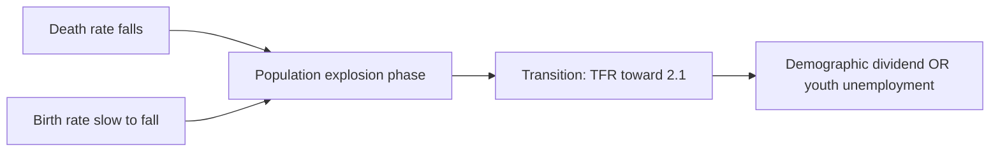

# Population — Explosion, Policy & Stabilization

> GS-1 · Topic 07.2 · Population and associated issues — explosion, policy, demographic dividend

---

## PYQs

| Year | M | Words | Question (EN) | प्रश्न (HI) | ID |
|------|---|-------|---------------|-------------|-----|
| 2024 | 12 | 200 | 'Population explosion is a serious challenge to India's holistic development.' — Examine | 'जनसंख्या विस्फोट भारत के समग्र विकास के लिए गंभीर चुनौती है।' — कथन की समीक्षा कीजिए। | Q1 |
| 2022 | 8 | 125 | Mention the causes of population explosion in India and give suggestions to combat the problem. | भारत में जनसंख्या विस्फोट के कारणों का उल्लेख तथा समस्या से निपटने के सुझाव दीजिए। | Q2 |
| 2021 | 12 | 200 | Discuss the salient features of National Population Policy 2000 and measures for population stabilization. | भारत की जनसंख्या नीति (2000) की मुख्य विशेषताएँ एवं जनसंख्या स्थिरीकरण के उपायों की चर्चा कीजिए। | Q3 |
| 2020 | 8 | 125 | Is growing population the main cause of poverty or is poverty the main cause of population increase? Analyse. | क्या बढ़ती जनसंख्या गरीबी का मुख्य कारण है या गरीबी जनसंख्या वृद्धि का? विश्लेषण कीजिए। | Q4 |

---

## Quick Revision

```
POPULATION EXPLOSION: Phase when death rate falls (medical/public health) but birth rate stays high
  → rapid net growth (India 1950s–1980s peak) · NOT same as today's slower growth

INDIA DATA:
  Census 2011: 121 crore · density 382/km² · urban 31.16%
  NFHS-5 (2019–21): TFR 2.0 (replacement level nationally)
  Still high TFR pockets: Bihar, UP, MP · ageing in Kerala/Tamil Nadu
  Sex ratio 943 (2011) · child sex ratio 919 (son preference concern)
  Working age 15–59 ~62% → demographic dividend window

CAUSES EXPLOSION (2022):
  High birth rate historically · fall in IMR/MMR · better sanitation/vaccines
  · early marriage · preference for sons · lack of contraception access
  · poverty as insurance (more children = labour/security) · cultural norms
  · migration adds to regional concentration (not natural increase alone)

NPP 2000 (2021 PYQ):
  Voluntary · target-free · decentralised · community need-based
  Long-term goal TFR 2.1 · stabilize by 2045 · meet RH needs
  Focus: education (esp. girls) · economic role of women · RH services · spacing

STABILIZATION MEASURES:
  Girls' education · RH/contraception access · economic development
  · late marriage · PM-JANMAN/tribal health · Mission Parivar Vikas (high-fertility districts)
  · NOT coercion (post Emergency sterilisation legacy)

DEMOGRAPHIC DIVIDEND vs BURDEN:
  Dividend = skilled youthful workforce → growth IF jobs + health + education
  Burden = dependency, unemployment, resource strain, environmental pressure

POPULATION ↔ POVERTY (2020):
  Both directions: large family → resource dilution · poverty → high fertility insurance
  Avoid mono-causal answer · development breaks vicious cycle

INSTITUTIONS: Census · NFHS · NITI Aayog · MoHFW · UNFPA · SDG 3

TRAPS: TFR 2.0 ≠ uniform across states | Explosion ≠ current reality everywhere
  | NPP 2000 ≠ two-child coercion | Population ≠ only numbers (age structure matters)
  | Dividend automatic ≠ needs skilling (Skill India)
```

---

## Content

### Context — India's demographic transition

- **India world's most populous country (2023 UN estimate surpassed China)** — **demographic story defines development trajectory**.
- **Demographic transition:** **High birth + high death → high birth + low death (explosion) → low birth + low death (stabilization)** — **India in late transition nationally, uneven regionally**.
- **Exam lens:** **Population explosion as historical challenge** + **current policy focus on quality, age structure, dividend**.

### Population explosion — meaning and causes (2022 PYQ)

**Definition:** **Rapid population growth** when **birth rates remain substantially above death rates** over decades — **net addition overwhelms resource and service capacity**.

| Cause | Explanation |
|-------|-------------|
| **Mortality decline** | **Post-independence public health** — smallpox eradication, ORS, immunization, malaria control — **IMR/MMR fell faster than birth rate** |
| **High fertility norms** | **Large family preference**, **patriarchal son preference**, **early marriage** (NFHS still shows child marriage pockets) |
| **Economic insecurity** | **Children as old-age insurance and farm labour** in agrarian economy — **poverty-fertility link** |
| **Low female agency** | **Female literacy/LFPR correlation with TFR** — **empowered women space births** |
| **Limited contraception access** | **Unmet need for family planning** historically in rural/tribal areas |
| **Religious/cultural factors** | **Opposition to birth control in some communities** — **policy must respect voluntary approach** |

**Regional dimension:** **UP, Bihar, MP** lagged **southern states (Kerala, Tamil Nadu, Andhra)** in fertility decline — **demographic divergence within India**.



### National Population Policy 2000 (2021 PYQ)

**Salient features**

| Feature | Detail |
|---------|--------|
| **Voluntary & target-free** | **Rejects coercive sterilisation** — **post-Emergency (1975–77) sensitivity** |
| **Decentralised planning** | **Panchayat/ULB-level RH planning** — **community need assessment** |
| **Long-term goal** | **TFR 2.1 by 2010 (revised timelines)** — **population stabilization by 2045** |
| **Immediate objectives** | **Universal immunization, 80% institutional deliveries, 100% registration of births/deaths/marriage/pregnancy** |
| **Cross-sectoral** | **Education, nutrition, women's economic role, RH care, adolescents** |
| **Rights-based RH** | **Informed choice in contraception** — **quality of care, not quotas** |

**Measures for stabilization (2021 PYQ)**
- **Social:** **Girls' secondary education**, **women's workforce participation**, **delay marriage (Prohibition of Child Marriage Act enforcement)**.
- **Health:** **Universal access to RH services**, ** spacing methods**, **safe abortion access within law**, **ASHA/ANM outreach**.
- **Economic:** **Poverty reduction** lowers **insurance fertility** — **MGNREGS, poverty alleviation linkage**.
- **Governance:** **Civil registration**, **NFHS monitoring**, **Mission Parivar Vikas in high-TFR districts**.
- **Communication:** **BCC (behaviour change)** — **small family norm without coercion**.

### Population explosion as development challenge (2024 PYQ)

**Arguments — serious challenge**
- **Resource pressure:** **Land, water, forests, urban carrying capacity** — **per capita availability falls**.
- **Employment:** **~12 million entrants to workforce annually** — **job creation must match**.
- **Social services:** **Schools, hospitals, housing deficit** if growth unplanned.
- **Environment:** **Pollution, waste, carbon footprint** of large population.
- **Governance:** **Implementation capacity stretched** in high-growth districts.

**Counter / nuance — not only burden**
- **NFHS-5 TFR 2.0** — **explosion phase easing nationally**.
- **Demographic dividend** — **young workforce** if **skilled (Skill India, NEP 2020)**.
- **Size = market scale** — **domestic demand engine** for economy.
- **Holistic development** failure is also **governance/inequality** — **not population alone**.

**Balanced exam verdict:** **Statement partially valid historically and regionally** — **today's challenge shifts from ** **sheer numbers to human capital quality and regional equity****.

### Population ↔ poverty debate (2020 PYQ)

| Direction | Mechanism |
|-----------|-----------|
| **Population → poverty** | **Large household dilutes per capita land/income** — **dependency ratio high** — **public goods scarce** |
| **Poverty → population** | **Poor rely on more children for labour/old-age support** — **low education → high fertility** |
| **Third factor** | **Underdevelopment, gender inequality, weak RH access** cause **both** |

**Exam approach:** **Reject single main cause** — **vicious cycle** broken by **education, women's empowerment, social security, jobs**.

### Demographic dividend

- **Definition:** **Economic growth potential from rising share of working-age population** (15–59) **with falling dependency ratio**.
- **Conditions:** **Health, education, skilling, female LFPR, formal jobs** — else **youth unemployment and unrest**.
- **UP relevance:** **Large youthful population** — **Purvanchal/Bundelkhand need employment or migration continues**.

### Contemporary relevance

- **NFHS-5 national TFR 2.0** — **policy success but son preference (SRB) persists**.
- **Mission Parivar Vikas** — **146 high-fertility districts focus**.
- **PM-JANMAN (2023)** — **tribal health/RH gaps**.
- **Census 2021 delayed** — **policy uses NFHS/survey data**.
- **Ageing debate emerging** — ** Kerala model vs youthful north**.

### Limits and balanced view

- **Population not destiny** — **Japan/South Korea developed with ageing; Bangladesh reduced fertility without high GDP first**.
- **Coercive policies backfire** — **China one-child legacy, India Emergency lesson**.
- **Focus shifting to ** **population quality, ageing preparedness, migration, urban concentration****.

---

## Answers

### Q1: 'Population explosion is serious challenge to holistic development.' — Examine. (2024, 12M, 200W)

**Introduction:**
> **Population explosion denotes rapid growth when falling death rates precede fertility decline** — **India experienced this intensely post-1950, straining resources, services, and employment**.

**Main Points:**
- **Challenge dimensions** — **Resource pressure, job creation gap, education-health infrastructure, environmental stress, governance capacity**.
- **Regional persistence** — **Some states/districts still above replacement TFR (UP, Bihar belt)**.
- **Counter-nuances** — **National TFR 2.0 (NFHS-5); demographic dividend potential if youth skilled**.
- **Holistic development** — **Requires education, women's empowerment, RH services, jobs — not coercion**.
- **Verdict** — **Statement valid as structural challenge; overstated if ignores transition progress and quality focus**.

**Keywords (underline in exam):** Population Explosion · TFR · Demographic Dividend · NPP 2000 · NFHS-5 · Dependency Ratio

**Exam diagram (30 sec):**
```
Explosion → strain on jobs/resources
But TFR 2.0 nationally → shift to dividend vs quality
Holistic dev = people-centred policy
```

**Conclusion:**
> **India must convert ** **population weight into human capital advantage** through **education, health, and inclusive employment** — **stabilization achieved, equity unfinished**.

---

### Q2: Causes of population explosion + suggestions. (2022, 8M, 125W)

**Introduction:**
> **India's population explosion resulted from ** **mortality revolution outpacing fertility decline**, reinforced by **socio-economic and cultural factors**.

**Main Points:**
- **Causes** — **IMR/MMR fall, high birth rate, early marriage, son preference, poverty-as-insurance, low contraception access**.
- **Suggestions** — **Girls' education, voluntary family planning, women's economic role, poverty reduction, RH outreach, BCC**.
- **Policy frame** — **NPP 2000 voluntary, target-free approach**.

**Keywords (underline in exam):** Birth Rate · Death Rate · IMR · Family Planning · NPP 2000 · TFR

**Exam diagram (30 sec):**
```
Death ↓ fast + Birth ↓ slow = explosion
Fix: education · RH · women empowerment · development
```

**Conclusion:**
> **Sustainable stabilization follows ** **social development, not demographic coercion**.

---

### Q3: NPP 2000 features + stabilization measures. (2021, 12M, 200W)

**Introduction:**
> **National Population Policy 2000 marked India's shift to ** **voluntary, rights-based, decentralised population stabilization** after coercive Emergency-era legacy**.

**Main Points:**
- **Features** — **Target-free, community-based, TFR 2.1 goal, stabilize by 2045, cross-sectoral (education, RH, women)**.
- **Stabilization measures** — **Universal immunization, institutional delivery, registration, contraceptive choice, adolescent health**.
- **Social measures** — **Female education, late marriage, economic participation, poverty alleviation**.
- **Institutional** — **Panchayat planning, NFHS monitoring, high-fertility district missions**.
- **Ethical limit** — **No sterilisation targets — informed consent central**.

**Keywords (underline in exam):** NPP 2000 · Voluntary · Target-Free · TFR 2.1 · Reproductive Health · Decentralised Planning

**Exam diagram (30 sec):**
```
NPP 2000: voluntary + rights + decentralised
Measures: education · RH · women · economy
Goal: TFR 2.1 · stabilize 2045
```

**Conclusion:**
> **NPP 2000 aligns population policy with ** **democratic rights and human development** — **NFHS-5 TFR 2.0 shows partial success, regional gaps remain**.

---

### Q4: Population cause poverty or poverty cause population? (2020, 8M, 125W)

**Introduction:**
> **Population and poverty interact in a ** **two-way vicious cycle** rather than a single-direction causal chain**.

**Main Points:**
- **Population → poverty** — **Resource dilution, high dependency, pressure on land/jobs/public goods**.
- **Poverty → population** — **Children as economic/security asset, low education, unmet family planning**.
- **Common drivers** — **Gender inequality, underemployment, weak social security**.
- **Break cycle** — **Education, SHGs, MGNREGS, RH access, old-age security schemes**.

**Keywords (underline in exam):** Vicious Cycle · Dependency Ratio · Family Size · Human Development · Women's Education

**Exam diagram (30 sec):**
```
Poverty ↔ high fertility ↔ poverty
Break via: education · jobs · RH · social security
```

**Conclusion:**
> **Neither is sole cause** — **integrated development policy addresses both simultaneously**.

---

## Traps

| Wrong | Correct |
|-------|---------|
| India still in explosive growth everywhere | **National TFR 2.0 — regional variation persists** |
| NPP 2000 promotes two-child coercion | **Explicitly ** **voluntary and target-free** |
| Population explosion = only birth rate | **Death rate decline triggered phase** |
| Demographic dividend automatic | **Needs jobs, skills, health — else youth burden** |
| Population only challenge, not opportunity | **Market scale + workforce potential** |
| Sterilisation camps = current policy | **Emergency legacy — rejected by NPP 2000** |
| TFR 2.0 = population stops growing immediately | **Momentum of young age structure continues growth for decades** |
| Son preference irrelevant today | **SRB concerns persist in some states** |
| Census only source | **NFHS for fertility/health indicators** |
| Population policy = only family planning | **Education, women's work, poverty reduction equally key** |

---

*Complete.*
