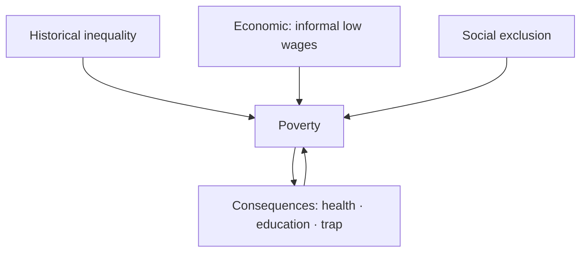

# Poverty — Causes, Consequences & Debates

> GS-1 · Topic 07.3 · Poverty and developmental issues — causes, consequences, multidimensional poverty

---

## PYQs

| Year | M | Words | Question (EN) | प्रश्न (HI) | ID |
|------|---|-------|---------------|-------------|-----|
| 2025 | 8 | 125 | What is the relationship between illiteracy and poverty in rural India? Critically evaluate. | ग्रामीण भारत में विकासात्मक मुद्दों के संदर्भ में निरक्षरता और गरीबी के बीच क्या सम्बन्ध है? आलोचनात्मक मूल्यांकन कीजिए। | Q1 |
| 2024 | 12 | 200 | Discuss the causes and consequences of poverty. | गरीबी के कारणों और परिणामों की चर्चा कीजिए। | Q2 |
| 2023 | 8 | 125 | 'Unemployment is the only cause for prevalent poverty in India.' — Comment. | 'बेरोजगारी भारत में व्यापक निर्धनता का एकमात्र कारण है' — टिप्पणी कीजिए। | Q3 |
| 2022 | 8 | 125 | When poverty transmits over generations it becomes a culture — Elucidate. | जब निर्धनता कई पीढ़ियों तक हस्तांतरित होती है, तो वह संस्कृति का रूप ले लेती है — स्पष्ट कीजिए। | Q4 |
| 2020 | 8 | 125 | Is growing population the main cause of poverty or is poverty the main cause of population increase? Analyse. | क्या बढ़ती जनसंख्या गरीबी का मुख्य कारण है या गरीबी जनसंख्या वृद्धि का? विश्लेषण कीजिए। | Q5 |

---

## Quick Revision

```
POVERTY TYPES:
  Absolute = below poverty line income (Tendulkar/Rangarajan)
  Relative = below societal minimum standard
  Multidimensional (MPI) = health + education + living standard (NITI Aayog)

INDIA DATA:
  MPI poor (NITI 2023): ~14.96% (down from 29.17% in 2013–14)
  Tendulkar line (2011–12 ref): ~₹27/day rural · ~₹33/day urban (approx)
  Employed poor common — informal sector low wages ≠ unemployment only

CAUSES (multi-causal — 2024):
  Historical: colonial drain · zamindari · deindustrialization · landlessness
  Economic: underemployment · informal labour · low agri productivity · shocks
  Social: caste/gender exclusion · illiteracy · disability · tribal isolation
  Demographic: large family · dependency ratio
  Governance: leakage · weak implementation · disaster vulnerability

ILLITERACY ↔ POVERTY (2025):
  Mutual reinforcement: illiteracy → low skills/wage · scheme exclusion
  poverty → child labour · dropout · early marriage
  Break: RTE · NEP · MGNREGS · SHGs · digital literacy

UNEMPLOYMENT ONLY? (2023): NO — employed poor, landless working poor, casual labour
  · disguised unemployment in agriculture · wage stagnation · social exclusion

INTERGENERATIONAL / CULTURE (2022):
  Oscar Lewis "culture of poverty" — attitudes transmitted
  Indian reality: structural trap (assets, nutrition, education, networks) primary
  · avoid deterministic blame on poor · POSHAN · scholarships · MGNREGS assets

CONSEQUENCES:
  Malnutrition/stunting · low human capital · ill health · crime/clientelism
  · gender violence · slums · political exclusion · intergenerational trap

FRAMEWORKS: Amartya Sen capability deprivation · poverty trap · MPI

SCHEMES: MGNREGA · PM-JAY · PMAY · NFSA · NRLM · PM POSHAN · Aspirational Districts

TRAPS: Unemployment ≠ only cause | Culture of poverty ≠ excuse for policy failure
  | MPI decline ≠ no poverty | Income line ≠ full picture (use Sen/MPI)
```

---

## Content

### Context — Poverty in India

- **Poverty** is **multidimensional** — **income, nutrition, education, housing, dignity, voice** — **Amartya Sen's capability approach** dominates academic framing.
- **Progress:** **NITI Aayog MPI** shows **sharp decline 2013–2023** — **yet absolute numbers large, regional inequality stark** — **UP aspirational districts lag**.
- **UPPCS pattern:** **Multi-causal answers**, **critique absolute statements**, **link poverty to development, gender, urbanization**.

### Definitions and measurement

| Measure | Detail |
|---------|--------|
| **Poverty line (absolute)** | **Tendulkar Committee (2011–12)** — **~₹27.2/day rural, ₹33.3/day urban** — **consumption-based** |
| **Rangarajan** | **Higher threshold** — **debated replacement for Tendulkar** |
| **Multidimensional Poverty Index (MPI)** | **NITI Aayog (Alkire-Foster)** — **health, education, standard of living** — **14.96% poor (2023)** |
| **Capability deprivation (Sen)** | **Poverty = denial of freedoms** — **health, education, political voice, not cash alone** |

### Causes of poverty (2024 PYQ)

**1. Historical-structural**
- **Colonial deindustrialization**, **land revenue systems (zamindari)**, **unequal land distribution**.
- **Caste-based exclusion** from assets, education, dignified employment.

**2. Economic**
- **Underemployment/disguised unemployment** in agriculture — **family works but income insufficient**.
- **Informal sector dominance** — **no minimum wage enforcement, no social security**.
- **Landlessness and small holdings** — **UP/Bihar agrarian distress**.
- **Economic shocks** — **drought, COVID, medical catastrophe poverty**.

**3. Social**
- **Illiteracy and skill gaps** — **limits non-farm mobility**.
- **Gender discrimination** — **women's unpaid care, wage gap, property denial**.
- **Tribal/remote geography** — **forest displacement without adequate resettlement**.

**4. Demographic and health**
- **Large household size** — **per capita resource dilution**.
- **Malnutrition-stunting** — **cognitive and productivity loss intergenerationally**.

**5. Governance**
- **Implementation leakage historically** — **Aadhaar-DBT improved targeting debate**.
- **Weak local institutions** in backward districts.



### Illiteracy and poverty in rural India (2025 PYQ)

**Linkage — mutual reinforcement**
- **Illiteracy → poverty:** **Low skills**, **wage discrimination**, **cannot navigate welfare/schemes**, **financial fraud vulnerability**, **poor health literacy**.
- **Poverty → illiteracy:** **Child labour**, **school dropout**, **early marriage (especially girls)**, **hidden fees/uniform costs**, **distance to school**.

**Critical evaluation**
- **Not deterministic** — **many literate poor (underemployed graduates)** exist.
- **Illiteracy is ** **necessary but not sufficient** explanation — **landlessness, caste, gender equally vital**.
- **Digital divide** — **new form of functional illiteracy in e-governance era**.
- **Way forward:** **NEP 2020 retention**, **girls' secondary education**, **adult literacy missions**, **MGNREGS + skill bridge**, **SHG financial literacy**.

### Unemployment as ONLY cause? (2023 PYQ)

**Refute absolutism — comment question trap**

| Reality | Example |
|---------|---------|
| **Employed poor** | **Casual labour below poverty line wage** |
| **Working poor in agriculture** | **Disguised unemployment — work shared, income low** |
| **Informal urban workers** | **Street vendors, domestic workers — employed but poor** |
| **Asset poverty** | **Landless SC/ST households — employed seasonally still poor** |
| **Social exclusion** | **Exclusion from common resources and markets** |

**Unemployment matters** but **alongside** underemployment, wages, health shocks, discrimination — **multi-causal poverty**.

### Intergenerational poverty as "culture" (2022 PYQ)

**Oscar Lewis (1960s) — "culture of poverty"**
- **Thesis:** **Persistent poverty generates attitudes, aspirations, and behaviours transmitted across generations** — **fatalism, present-orientation, weak institutional trust**.

**Elucidate for India — balanced**
- **Valid observation:** **Poor nutrition + schooling + social networks → children replicate deprivation** — **poverty trap mechanics**.
- **Critique:** **"Culture" language risks blaming victims** — **structural factors (land, caste, policy) primary**.
- **Indian mechanisms:** **Stunting (NFHS-5)**, **first-generation learners' dropout**, **debt bondage**, **lack of collateral for credit**.
- **Policy response:** **POSHAN 2.0/ICDS**, **scholarships (pre-matric/post-matric)**, **MGNREGS asset creation**, **inheritance rights (Hindu Succession Amendment 2005)**, **PM-JAY health shock protection**.

### Consequences of poverty (2024 PYQ)

**Human development**
- **Malnutrition, stunting, anaemia** — **intergenerational cognitive loss**.
- **Low educational attainment**, **child labour**, **early marriage**.

**Social**
- **Crime, substance abuse, political clientelism** — **patronage dependency**.
- **Gender violence** — **economic dependency traps women**.
- **Social stigma and exclusion**.

**Economic**
- **Low productivity trap** — **poor cannot invest in skills/tools**.
- **Informal housing/slums** — **urban poverty manifestation**.

**Political**
- **Voicelessness** — **weak bargaining with state and markets**.
- **Vote bank vulnerability** — **short-term welfare vs structural reform**.

### Population ↔ poverty (2020 — cross with 07.2)

- **Bidirectional** — see Population file **Q4** — **include brief cross-reference in poverty answer**.

### Contemporary relevance

- **MPI decline** — **Aspirational Districts Programme** targets laggards.
- **PM-JAY** — **health shock poverty prevention**.
- **COVID reverse migration** — **exposed rural vulnerability**.
- **Inflation food/fuel** — **poor hit hardest**.
- **SDG 1 (No Poverty)** and **SDG 2 (Zero Hunger)** monitoring.

### Limits and balanced view

- **Poverty reduction ≠ inequality reduction** — **top decile gains can coexist with MPI progress**.
- **Welfare necessary not sufficient** — **quality jobs and asset redistribution debate continues**.
- **Avoid culture-of-poverty determinism** — **structural reform central**.

---

## Answers

### Q1: Illiteracy and poverty relationship in rural India — critically evaluate. (2025, 8M, 125W)

**Introduction:**
> **In rural India, illiteracy and poverty form a mutually reinforcing cycle** — **each constrains escape routes from the other**, though **neither alone explains deprivation fully**.

**Main Points:**
- **Illiteracy → poverty** — **Low skills/wages, scheme exclusion, health ignorance, exploitation**.
- **Poverty → illiteracy** — **Child labour, dropout, early marriage, hidden schooling costs**.
- **Critical limits** — **Literate underemployed exist; landlessness, caste, gender equally causal**.
- **Way forward** — **NEP retention, girls' education, SHG literacy, MGNREGS + skilling**.

**Keywords (underline in exam):** Mutual Reinforcement · Capability Deprivation · Child Labour · Multi-causal Poverty · NEP 2020

**Exam diagram (30 sec):**
```
Illiteracy ↔ Poverty (rural cycle)
Break: education + assets + social security
Not single-cause
```

**Conclusion:**
> **Policy must attack ** **both human capital and structural asset deficits** — **literacy alone without livelihoods fails**.

---

### Q2: Causes and consequences of poverty. (2024, 12M, 200W)

**Introduction:**
> **Poverty in India stems from ** **historical inequality, economic informality, social exclusion, and governance gaps**, producing **deep human development and intergenerational costs**.

**Main Points:**
- **Causes** — **Colonial legacy, landlessness, underemployment, caste/gender, illiteracy, health deprivation, demographic pressure, shocks**.
- **Consequences** — **Malnutrition/stunting, low education, ill health, slums, crime/clientelism, gender violence, political voicelessness**.
- **Measurement** — **MPI decline (14.96%) but regional disparities persist**.
- **Framework** — **Sen's capability deprivation beyond income lines**.
- **Remedies pointer** — **MGNREGA, PM-JAY, PMAY, NRLM, POSHAN — integrated approach**.

**Keywords (underline in exam):** MPI · Tendulkar Line · Capability Deprivation · Informal Sector · Intergenerational Trap · MGNREGA

**Exam diagram (30 sec):**
```
Causes: structural + social + economic
Effects: health · education · slums · trap
Multi-dimensional (Sen/MPI)
```

**Conclusion:**
> **Sustainable poverty reduction demands ** **growth with jobs, human development, and social inclusion** — **not welfare alone**.

---

### Q3: Unemployment the only cause of poverty — Comment. (2023, 8M, 125W)

**Introduction:**
> **The statement is ** **overstated** — **unemployment contributes to poverty but India's poor include millions who work for subsistence wages**.

**Main Points:**
- **Refute "only"** — **Employed poor, disguised agricultural unemployment, informal sector**.
- **Other causes** — **Landlessness, caste/gender exclusion, illiteracy, health shocks, low productivity**.
- **Accept partial truth** — **Jobless growth periods worsen poverty**.
- **Policy** — **MGNREGA safety net + skilling + wage enforcement + social security**.

**Keywords (underline in exam):** Employed Poor · Underemployment · Informal Sector · Multi-causal · Disguised Unemployment

**Exam diagram (30 sec):**
```
Poverty ≠ only jobless
Many WORKING poor → wage/asset/exclusion causes
Trap word "only"
```

**Conclusion:**
> **Poverty is ** **multidimensional** — **employment quality matters as much as employment quantity**.

---

### Q4: Intergenerational poverty becomes culture — Elucidate. (2022, 8M, 125W)

**Introduction:**
> **When poverty persists across generations, behavioural patterns and limited aspirations can resemble a "culture," but Indian experience is rooted primarily in ** **structural deprivation of assets, nutrition, and education****.

**Main Points:**
- **Lewis thesis** — **Attitudes/fatalism transmitted in long poverty**.
- **Indian mechanisms** — **Stunting, dropout, debt, weak inheritance, caste barriers**.
- **Critique** — **Avoid blaming poor; structures primary**.
- **Break cycle** — **POSHAN, scholarships, MGNREGS assets, property rights, PM-JAY**.

**Keywords (underline in exam):** Intergenerational Transmission · Poverty Trap · Culture of Poverty · Stunting · Structural Deprivation

**Exam diagram (30 sec):**
```
Generation 1 poor → poor health/education → Generation 2 poor
Structure > blame · Policy breaks cycle
```

**Conclusion:**
> **"Culture" describes ** **symptoms of prolonged structural poverty** — **policy must transform material conditions, not moralize**.

---

### Q5: Population vs poverty causality. (2020, 8M, 125W)

**Introduction:**
> **Population growth and poverty reinforce each other in a vicious cycle** — **neither is the sole "main" cause**.

**Main Points:**
- **Population → poverty** — **Resource dilution, dependency, service strain**.
- **Poverty → population** — **Insurance fertility, low RH access, education gap**.
- **Shared drivers** — **Gender inequality, underdevelopment**.
- **Solution** — **Integrated human development + social security**.

**Keywords (underline in exam):** Vicious Cycle · Dependency Ratio · Family Size · Women's Education · Social Security

**Exam diagram (30 sec):**
```
Poverty ↔ Population (both ways)
Break: education · jobs · RH · security
```

**Conclusion:**
> **Development policy must address ** **both fertility choices and poverty traps simultaneously**.

---

## Traps

| Wrong | Correct |
|-------|---------|
| Unemployment is only poverty cause | **Employed poor widespread — multi-causal** |
| Poverty = only income | **MPI/Sen capability — health, education, living standard** |
| Culture of poverty = poor people's fault | **Structural trap; Lewis thesis debated, don't victim-blame** |
| MPI decline means poverty ended | **14.96% MPI poor; absolute numbers still large** |
| Illiteracy alone causes poverty | **Mutual with landlessness, caste, gender** |
| MGNREGA alone ends poverty | **Safety net, not structural transformation alone** |
| Urban poverty unrelated | **Working poor in informal sector, slums** |
| Poverty line universal truth | **Tendulkar vs Rangarajan debate; MPI complements** |
| Welfare schemes no leakage concern | **DBT improved but exclusion/inclusion errors debated** |
| Population always main poverty driver | **Bidirectional; avoid mono-causality** |

---

*Complete.*
