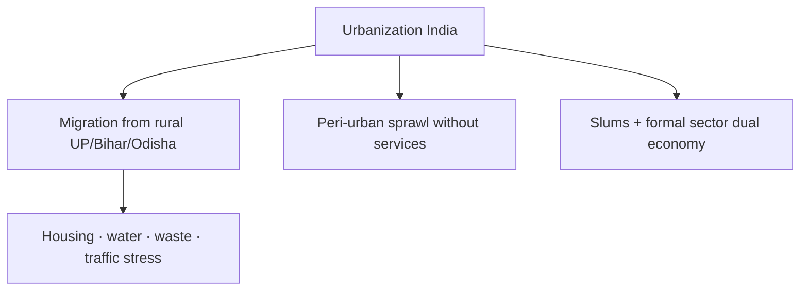

# Urbanization — Problems, Slums & Remedies

> GS-1 · Topic 07.4 · Urbanization — problems, slums, remedies (distinct from Smart Cities Mission — see Topic 15.2)

---

## PYQs

| Year | M | Words | Question (EN) | प्रश्न (HI) | ID |
|------|---|-------|---------------|-------------|-----|
| 2025 | 12 | 200 | Discuss socio-economic problems of urbanization. What structural measures are necessary for sustainable urban development? | नगरीकरण से संबद्ध सामाजिक-आर्थिक समस्याओं की विवेचना कीजिए। सतत शहरी विकास हेतु कौन-से संरचनात्मक उपाय आवश्यक हैं? | Q1 |
| 2023 | 12 | 200 | Is the process of urbanization development or devastation for society? Write your views. | शहरीकरण की प्रक्रिया समाज के लिए विकास या विनाश है — अपना मत लिखिए। | Q2 |
| 2021 | 8 | 125 | Do you agree that urbanization and slums are inseparable? Explain. | क्या आप सहमत हैं कि शहरीकरण और मलिन बस्तियाँ अपृथक्करीय हैं? व्याख्या कीजिए। | Q3 |
| 2021 | 12 | 200 | Examine the nature of urbanization in India and social implications of its fast pace. | भारत में नगरीकरण की प्रवृत्ति का परीक्षण तथा तीव्र गति से बढ़ते नगरीकरण के सामाजिक परिणाम लिखिए। | Q4 |
| 2019 | 8 | 125 | Discuss the role of urban planning for development of basic civic amenities in slums. | मलिन बस्तियों में मूलभूत नागरिक सुविधाओं के विकास हेतु नगर नियोजन की भूमिका की विवेचना कीजिए। | Q5 |
| 2019 | 12 | 200 | Define urbanization. Discuss problems caused by fast pace of urbanization. | नगरीयकरण की परिभाषा। तीव्र गति से नगरीयकरण से उत्पन्न समस्याओं की विवेचना कीजिए। | Q6 |
| 2018 | 8 | 125 | Discuss solutions to urban problems. | शहरी समस्याओं के समाधान की विवेचना कीजिए। | Q7 |

---

## Quick Revision

```
URBANIZATION: Rise in % population in urban areas + growth of urban economic/social character
  Census 2011: 31.16% urban · 377 million · projected ~40%+ by 2030
  Urban areas ~60%+ GDP · migration main driver now (not natural increase)

NATURE IN INDIA (2021):
  Over-urbanization of metros · peri-urban sprawl without services
  · census towns · dual economy (formal IT + informal majority)
  · in-situ slum growth vs planned expansion

SOCIO-ECONOMIC PROBLEMS (2025):
  Housing deficit → slums (~17%+ urban in informal settlements est.)
  · water-sewerage-waste gaps · traffic/pollution/heat islands
  · informal jobs without social security · inequality · crime
  · strain on health/education · loss of community bonds · gender safety

SLUMS INSEPARABLE? (2021): NO — outcome of failed planning, land cost, weak ULB
  · PMAY-U in-situ redevelopment · Singapore/HK planned housing counter-examples

STRUCTURAL MEASURES (2025):
  74th Amendment ULB empowerment · municipal finance (property tax, bonds)
  · master plans + inclusive zoning · transit-oriented development
  · regional planning tier-2 cities · climate-resilient drainage
  · NOT just welfare — institutions + finance + spatial planning

SCHEMES: AMRUT 2.0 · PMAY-Urban · SBM-Urban 2.0 · Metro/MRTS · SCM (see 15.2)
  SDG 11 Sustainable Cities

UP: Kanpur-Lucknow slums · NCR spillover · Smart Cities Lucknow/Varanasi/Kanpur
  · COVID migrant return stress on peri-urban villages

TRAPS: Urbanization ≠ only devastation | Slums ≠ inevitable
  | Smart Cities ≠ full urbanization answer | 74th Amendment weak implementation
  | Urban growth ≠ urbanization (rural growth too)
```

---

## Content

### Context — Urbanization in India

- **Urbanization** is **defining demographic shift of 21st century India** — **Census 2011: 31.16% urban (377 million)** — **projected 40%+ by 2030**.
- **Dual reality:** **Cities engine of GDP (~60%+)** and **sites of inequality, slums, pollution**.
- **UP angle:** **Kanpur, Lucknow, NCR (Noida/Ghaziabad), Varanasi, Agra** — **industrial and service hubs with large informal settlements**.

### Definition and nature of urbanization in India (2019/2021 PYQ)

**Definition:** **Process by which proportion of population living in urban areas increases** and **settlements acquire urban characteristics** (non-agricultural economy, density, infrastructure needs).

**Nature — Indian specificity**

| Feature | Detail |
|---------|--------|
| **Migration-led** | **Rural push (distress) + urban pull (jobs)** — **not mainly natural urban birth rate** |
| **Mega-city concentration** | **Mumbai, Delhi, Bengaluru, Kolkata, Chennai dominate economic opportunity** |
| **Peri-urban sprawl** | **Village fringes urbanize without municipal services** — ** governance lag (A18 pattern)** |
| **Census towns** | **Settlements urban by criteria but weak ULB status** |
| **Informal dominance** | **80%+ non-agri urban jobs informal** — **no contracts, no SS** |
| **Dual economy** | **Formal IT/services coexist with slum-embedded labour** |



### Socio-economic problems of urbanization (2025 PYQ)

**Economic**
- **Housing shortage** — **demand >> supply → high rents, slums, squatting**.
- **Informal employment** — **street vendors, construction, domestic work — wage insecurity**.
- **Underemployment** — **educated unemployed in cities**.
- **Infrastructure deficit** — **water (hours/day supply), sewerage (partial coverage), solid waste**.

**Social**
- **Anonymity** — **weak community bonds, nuclear family stress**.
- **Slum communities** — **overcrowding, poor sanitation, child labour, school dropout**.
- **Gender safety** — **public space harassment, poor lighting, transport gaps**.
- **Crime and substance abuse** — **inequality-driven**.
- **Health stress** — **respiratory disease, heat exposure, epidemic vulnerability (COVID slums)**.

**Environmental**
- **Air pollution, heat islands, flood vulnerability** — **concretization, poor drainage**.
- **Waste landfill crisis** — **single-use plastic, unprocessed MSW**.

**Governance**
- **Weak ULB finances** — **property tax collection poor**.
- **Master plans outdated** — **illegal construction, encroachment**.

### Fast pace — social implications (2021 PYQ)

- **Family structure change** — **joint → nuclear; elderly care crisis**.
- **Cultural hybridity** — **migration diversifies city culture** — **also communal tension potential**.
- **Slum social capital** — **mutual aid vs stigma** — **"illegal" resident insecurity**.
- **Child upbringing** — **hostile built environment, screen/time poverty for poor children**.
- **Political** — **slum vote banks, clientelism** — **short-term promises vs tenure security**.

### Urbanization — development or devastation? (2023 PYQ)

**Development case**
- **GDP engine, innovation, services, women's mobility (limited), education/health access**.
- **Demographic opportunity** — **youth employment in cities**.
- **Social mobility** — **escape rural caste/feudal constraints for some migrants**.

**Devastation case**
- **Slums, pollution, inequality, mental health stress, crime**.
- **Unplanned growth destroys wetlands, increases disaster risk**.
- **Distress migration** — **urban poverty replaces rural poverty without uplift**.

**Exam answer:** **Both — context-dependent** — **"urbanization of hope" vs "urbanization of exclusion"** — **policy determines outcome**.

### Slums and urbanization — inseparable? (2021 PYQ)

**Partially agree — historically often co-occur**
- **Rapid in-migration + land scarcity + low wages → informal housing inevitable without intervention**.

**Disagree — not law of nature**
- **Slums = policy failure** — **land use planning, affordable housing, tenure security absent**.
- **Counter-examples:** **Proactive public housing, inclusionary zoning, in-situ upgrading (PMAY-U)**.
- **Singapore, Curitiba lessons** — **planned density with services**.

**Verdict for exam:** **Inseparable under ** **current weak planning**; **avoidable with structural reform**.

### Urban planning for slum amenities (2019 PYQ)

**Role of planning**
- **Slum surveys and GIS mapping** — **know population, tenure, hazard zones**.
- **In-situ upgrading** — **water pipes, community toilets, drainage without mass displacement**.
- **Mixed-income housing** — **PMAY-U EWS/LIG components**.
- **Regularization with standards** — **street grids, fire access, open spaces**.
- ** Livelihood linkage** — **vendor zones, skill centres near slums**.
- **Participatory planning** — **slum dweller federations (NSDF model)** — **community consent**.

**UP example:** **Kanpur tannery belt slums** — **sewage, housing, industrial pollution intersection**.

### Structural measures for sustainable urban development (2025 PYQ)

| Measure | Detail |
|---------|--------|
| **74th Amendment implementation** | **Functional ULBs, mayor authority, ward committees, devolution of funds/functions** |
| **Municipal finance reform** | **Property tax rationalization, user charges, municipal bonds, GST compensation clarity** |
| **Spatial planning** | **Enforced master plans, green belts, TOD (transit-oriented development), compact cities** |
| **Inclusive zoning** | **Affordable housing mandates, rental housing policy, land pooling** |
| **Infrastructure mission mode** | **AMRUT 2.0 water-sewerage, SBM-Urban 2.0 waste, metro expansion** |
| **Regional planning** | **Invest tier-2/3 cities — reduce mega-city overload (AMRUT, industrial corridors)** |
| **Climate resilience** | **Urban drainage, flood maps, urban forestry, heat action plans** |
| **Informal worker security** | **e-Shram, portable welfare, ONORC, street vendor Act 2014 implementation** |

**"Structural" = institutions + finance + planning** — **not only welfare handouts**.

### Solutions to urban problems (2018 PYQ) — scheme summary

- **AMRUT 2.0** — **water, sewerage, parks, transport**.
- **PMAY-Urban** — **affordable housing, slum redevelopment**.
- **SBM-Urban 2.0** — **ODF+, waste processing**.
- **Smart Cities Mission** — **area-based retrofit (see Topic 15.2)**.
- **Metro/MRTS** — **mass transit reduces congestion**.
- **National Urban Digital Mission** — **data for planning**.

### Contemporary relevance

- **COVID-19** — **migrant exodus exposed slum vulnerability**.
- **Heat waves** — **urban poor most exposed**.
- **Climate urban flooding (Chennai, Bengaluru, Delhi)** — **drainage crisis**.
- **PM SVANidhi** — **street vendor credit post-COVID**.
- **Rental housing policy draft** — **tenure for migrants**.

### Limits and balanced view

- **Smart Cities cover limited area** — **majority wards still underserved**.
- **Slum redevelopment risks gentrification** — **displacement without resettlement violates justice**.
- **Urbanization inevitable** — **manage, not prevent** — **rural-urban balance via rurban policy**.

---

## Answers

### Q1: Socio-economic problems of urbanization + structural measures. (2025, 12M, 200W)

**Introduction:**
> **Urbanization concentrates economic opportunity but simultaneously generates ** **housing deficits, infrastructure stress, informal labour exploitation, and environmental degradation** unless governed structurally**.

**Main Points:**
- **Socio-economic problems** — **Slums, water-sewage-waste gaps, traffic/pollution, informal jobs, inequality, crime, gender insecurity, health stress**.
- **Indian nature** — **Migration-led, peri-urban sprawl, dual formal-informal economy**.
- **Structural measures** — **74th Amendment ULB empowerment, municipal finance, master plans, inclusive zoning, TOD, regional tier-2 investment**.
- **Infrastructure missions** — **AMRUT 2.0, PMAY-U, SBM-Urban, climate-resilient drainage**.
- **Worker inclusion** — **e-Shram, ONORC, Street Vendors Act**.
- **UP** — **Kanpur-Lucknow slum stress; NCR peri-urban governance gaps**.

**Keywords (underline in exam):** Slums · Informal Sector · ULB · 74th Amendment · AMRUT · PMAY-U · Structural Planning · SDG 11

**Exam diagram (30 sec):**
```
Urbanization problems: housing · infra · informal jobs · pollution
Structural fix: ULB finance + planning + inclusive housing + regional cities
```

**Conclusion:**
> **Sustainable urbanization requires ** **institutional and spatial reform**, not ad hoc slum clearance alone.

---

### Q2: Urbanization — development or devastation? (2023, 12M, 200W)

**Introduction:**
> **Urbanization is neither purely development nor devastation** — **it is a dual process whose outcome depends on planning, inclusion, and livelihood security**.

**Main Points:**
- **Development** — **60%+ GDP, services, education/health access, social mobility, innovation**.
- **Devastation** — **Slums, pollution, inequality, distress migration, weak community, disasters**.
- **Indian evidence** — **Mega-city growth + informal majority workforce**.
- **Policy determinant** — **PMAY-U, AMRUT, ULB reform vs unplanned sprawl**.
- **Balanced view** — **Urbanization inevitable; quality of urbanization is choice**.

**Keywords (underline in exam):** Dual Nature · Informal Sector · Slums · Inclusive Growth · Distress Migration

**Exam diagram (30 sec):**
```
Urbanization = engine (GDP) + crisis (slums/pollution)
Outcome = policy quality
```

**Conclusion:**
> **Cities can be ** **engines of inclusive growth** if structural urban reform prioritizes the working poor.

---

### Q3: Urbanization and slums inseparable? (2021, 8M, 125W)

**Introduction:**
> **Slums frequently accompany rapid urbanization in India, but they are ** **not inherently inseparable** — **they reflect planning failure and housing market exclusion**.

**Main Points:**
- **Why co-occur** — **Migration surge, land cost, low wages, weak ULB capacity**.
- **Not inevitable** — **Planned affordable housing, in-situ upgrading, inclusionary zoning (PMAY-U)**.
- **Slum = symptom** — **Tenure insecurity, absent services, not criminality of poor**.
- **Way forward** — **Participatory slum planning, regularization with standards**.

**Keywords (underline in exam):** Slums · Housing Deficit · PMAY-U · Urban Planning · Tenure Security

**Exam diagram (30 sec):**
```
Rapid migration + no housing plan → slums
Policy can decouple: PMAY · planning · tenure
```

**Conclusion:**
> **Slums are ** **policy outcomes, not natural laws of urban growth**.

---

### Q4: Nature of urbanization in India + fast pace social implications. (2021, 12M, 200W)

**Introduction:**
> **Indian urbanization is ** **migration-driven, uneven, and informal-sector dominated**, **with fast pace straining social fabric and basic services**.

**Main Points:**
- **Nature** — **31.16% urban (2011), mega-city concentration, peri-urban sprawl, census towns, dual economy**.
- **Fast pace drivers** — **Rural distress, LPG-era service growth, demographic youth bulge**.
- **Social implications** — **Nuclear families, slum communities, cultural change, gender risks, political clientelism, weakened traditional support**.
- **Mitigation** — **Regional urban investment, migrant portable welfare, planned density**.

**Keywords (underline in exam):** Migration-led · Peri-urban · Informal Sector · Social Disorganization · Census 2011

**Exam diagram (30 sec):**
```
India: migration → metros/peri-urban
Social: family change · slums · anonymity · inequality
```

**Conclusion:**
> **Managing pace through ** **planned urban expansion and migrant inclusion** determines social sustainability.

---

### Q5: Urban planning for slum civic amenities. (2019, 8M, 125W)

**Introduction:**
> **Urban planning must treat slums as ** **formal planning zones**, not invisible settlements, to deliver water, sanitation, and safety**.

**Main Points:**
- **Slum mapping/GIS surveys** — **evidence-based intervention**.
- **In-situ upgrading** — **water, community toilets, drainage, street access**.
- **PMAY-U linkage** — **affordable tenure without mass eviction**.
- **Participatory planning** — **slum dweller federations, vendor zones, health/education nodes**.
- **UP** — **Kanpur/Lucknow industrial belt slums need sewage-housing integration**.

**Keywords (underline in exam):** In-situ Upgrading · PMAY-U · Slum Survey · Participatory Planning · Civic Amenities

**Exam diagram (30 sec):**
```
Plan slums in master plan → pipes · toilets · roads · tenure
Not bulldoze-only approach
```

**Conclusion:**
> **Slum upgrading is ** **cheaper and more just than recurrent demolition cycles**.

---

### Q6: Define urbanization + fast pace problems. (2019, 12M, 200W)

**Introduction:**
> **Urbanization is the rising share and character of urban population; India's rapid transition produces ** **acute housing, infrastructure, and social inequality challenges**.

**Main Points:**
- **Definition** — **Urban population share increase + non-farm economic dominance in settlements**.
- **Fast pace problems** — **Slums, water-sewage deficit, waste, traffic/pollution, informal poverty, health/education gaps, disasters**.
- **Governance gap** — **ULB weakness, outdated master plans**.
- **Remedies pointer** — **AMRUT, PMAY-U, 74th Amendment, regional planning**.

**Keywords (underline in exam):** Urbanization · Slums · Infrastructure Deficit · Informal Sector · ULB

**Exam diagram (30 sec):**
```
Define urbanization → list fast-growth problems → structural remedies
```

**Conclusion:**
> **Speed of urbanization is manageable only with ** **anticipatory infrastructure and inclusive housing policy**.

---

### Q7: Solutions to urban problems. (2018, 8M, 125W)

**Introduction:**
> **Urban problems require ** **integrated missions plus institutional reform** — **welfare schemes alone insufficient**.

**Main Points:**
- **Housing** — **PMAY-Urban, rental policy, slum redevelopment**.
- **Water-sanitation** — **AMRUT 2.0, SBM-Urban 2.0**.
- **Transport** — **Metro, BRT, walkability**.
- **Governance** — **74th Amendment, municipal finance, digital planning**.
- **Inclusion** — **ONORC, e-Shram for migrants; Street Vendors Act**.

**Keywords (underline in exam):** PMAY-U · AMRUT · SBM-Urban · 74th Amendment · SDG 11

**Exam diagram (30 sec):**
```
Solutions: housing · water · waste · transport · ULB reform · migrant welfare
```

**Conclusion:**
> **Sustainable cities combine ** **hard infrastructure with social inclusion and local self-government**.

---

## Traps

| Wrong | Correct |
|-------|---------|
| Urbanization = only negative | **GDP engine, mobility, services — dual nature** |
| Slums inevitable with cities | **Planning and affordable housing can prevent/upgrad** |
| Smart Cities solve all urban problems | **Limited ABD pockets — see Topic 15.2** |
| Urbanization = urban growth only | **Urbanization is ** **% shift**; both can grow |
| 74th Amendment fully implemented | **Devolution weak in most states** |
| Slum clearance = best solution | **In-situ upgrading + tenure often better** |
| Urban problems only economic | **Social, environmental, governance equally tested** |
| Rural urbanization unrelated | **Peri-urban fringe is hybrid crisis zone** |
| Metro alone fixes congestion | **Needs integrated land use + last mile** |
| Distress migration = voluntary urbanization | **Push factors dominate for poor migrants** |

---

*Complete.*
