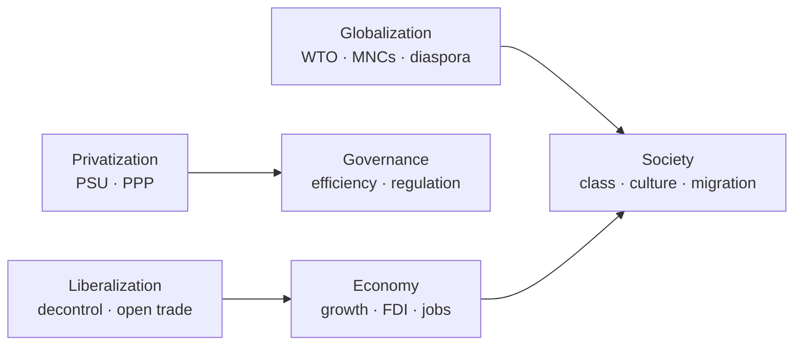

# LPG — Liberalization, Privatization & Globalization (Effects on India)

> GS-1 · Topic 08 · LPG reforms, economy, polity, social structure

---

## PYQs

| Year | M | Words | Question (EN) | प्रश्न (HI) | ID |
|------|---|-------|---------------|-------------|-----|
| 2025 | 8 | 125 | Does globalization lead to both cultural integration and cultural conflict? Elucidate. | क्या वैश्वीकरण सांस्कृतिक एकीकरण एवं सांस्कृतिक द्वन्द्व दोनों उत्पन्न करता है? स्पष्ट कीजिए। | Q1 |
| 2024 | 8 | 125 | Discuss the impacts of Globalisation on Indian Society. | भारतीय समाज पर वैश्वीकरण के प्रभावों की चर्चा कीजिए। | Q2 |
| 2022 | 12 | — | Define Globalization and Privatization. Discuss their objectives. | वैश्वीकरण एवं निजीकरण की परिभाषा कीजिए। इन दोनों के उद्देश्यों पर भी प्रकाश डालिए। | Q3 |
| 2021 | 12 | 200 | Define globalization. Assess its impacts on rural social structure in India. | वैश्वीकरण की परिभाषा कीजिए। भारत में ग्रामीण सामाजिक संरचना पर इसके प्रभाव का मूल्यांकन कीजिए। | Q4 |
| 2020 | 12 | 200 | What is Liberalization? How is it affecting the Indian social structure? | उदारीकरण क्या है? उदारीकरण ने भारतीय सामाजिक संरचना को किस प्रकार प्रभावित किया है? | Q5 |
| 2018 | 12 | 200 | Discuss the impact of globalization on the status of women in Indian society by citing suitable examples. | भारतीय महिलाओं पर भूमण्डलीकरण के प्रभावों की विवेचना उपयुक्त उदाहरणों की सहायता से कीजिए। | Q6 |
| 2018 | 12 | 200 | What is globalization? Discuss its impact on the social structure of India. | वैश्वीकरण क्या है? भारतीय सामाजिक संरचना पर इसके प्रभावों की विवेचना कीजिए। | Q7 |

---

## Quick Revision

```
LPG = 1991 watershed (BoP crisis, Rao-Manmohan) → New Industrial Policy 1991 · LPG trinity

LIBERALIZATION: Remove licensing/controls · open trade · easier FDI · deregulate finance
  Objectives: efficiency · competition · integrate world economy · tech transfer

PRIVATIZATION: PSU disinvestment · exit non-core · PPP · reduce fiscal burden
  Objectives: efficiency · reduce govt loss · professional management · market discipline

GLOBALIZATION: Flows — goods, capital, ideas, people across borders (WTO 1995 · IMF · WB · MNCs)
  Objectives: comparative advantage · scale economies · cultural exchange · SDG linkages

ECONOMY: GDP ↑ · IT/services boom (Bangalore, Hyderabad) · FDI · consumer choice (MNC retail)
  BUT inequality ↑ (Gini) · agrarian distress · informal sector precarity

POLITY: Regulatory state (SEBI, TRAI) · federal tax competition · coalition era policy
  · governance reforms · RTI-era accountability alongside market logic

SOCIAL STRUCTURE: Caste-joint family-village authority under strain
  · middle class expansion · urban migration · consumerism · English premium
  · Sanskritization + Westernization (Srinivas) · glocalization (yoga + McDonald's)

CULTURAL INTEGRATION: Bollywood diaspora · yoga/AYUSH global · Indian CEOs · food fusion · IPL
CULTURAL CONFLICT: McDonaldization · homogenization fear · religious backlash · job insecurity
  · tribal displacement · language erosion anxiety · "culture vs commerce" debates

RURAL: Cash crops · contract farming · SHG-NRLM + migration remittances · youth exit agriculture
  · jajmani weakening · women's SHG visibility · suicides (Vidarbha) · digital India reach

WOMEN: SEWA informal workers · IT/BPO jobs · beauty/fashion industry · double burden
  · LFPR still low · domestic violence + consumer aspiration tension

1991 ANCHORS: Dunkel Draft · WTO · NEP 1991 · abolition industrial licensing · rupee devaluation

CONTEMPORARY: Make in India · PLI · Digital India · G20 2023 · NEP 2020 IKS · Atmanirbhar
  · gig economy · OTT cultural flows · FTA debates · semiconductor push

TRAPS: LPG ≠ only 1991 (ongoing process) | Globalization ≠ only Westernization
  | Integration + conflict BOTH true | Liberalization ≠ full laissez-faire in India
  | Rural ≠ untouched by LPG | Women gains ≠ uniform | Cultural ≠ only loss narrative
```

---

## Content

### Context — LPG and Indian society

- **India's 1991 crisis** — forex reserves barely **~2 weeks of imports**; **IMF conditionalities**; **P.V. Narasimha Rao** government with **Dr Manmohan Singh** as Finance Minister launched **New Economic Policy (NEP 1991)** — **Liberalization, Privatization, Globalization (LPG)**.
- **Sociological lens:** **Yogendra Singh** (*Modernization of Indian Tradition*, 1973) and **M.N. Srinivas** (**Sanskritization, Westernization, Little and Great traditions**) provide frameworks — LPG accelerates **structural differentiation**: caste, village, joint family, occupation lose **monolithic control**; **class, market, media** gain salience.
- **UPPCS frame:** Define **L/P/G**, state **objectives**, analyse **economy + polity + social structure**, **rural change**, **women**, **cultural integration vs conflict** — always **balanced** (gains + costs).

### Definitions and objectives

| Term | Meaning | Primary objectives (exam) |
|------|---------|---------------------------|
| **Liberalization** | Reducing **state controls** — industrial licensing, trade barriers, FDI caps, financial repression | **Efficiency, competition, innovation**, integrate with global markets, attract **technology and capital** |
| **Privatization** | Transfer/management of **public sector** assets to **private** hands — **disinvestment, PPP, strategic sale** | Cut **fiscal losses**, improve **PSU efficiency**, focus government on ** governance/social sectors** |
| **Globalization** | Intensified **worldwide flows** of **goods, services, capital, technology, ideas, people** — institutions **WTO (1995), IMF, World Bank, MNCs** | **Comparative advantage**, scale economies, **cultural exchange**, poverty reduction (pro-market view); critics cite **dependency and inequality** |

**1991 policy landmarks:** abolition of **industrial licensing** (except few sectors); **MRTP** dilution; ** rupee devaluation**; **foreign investment** eased; later **WTO membership** formalized trade rules; successive **FDI reforms** in retail, telecom, insurance.

**Chronology — LPG milestones (exam table)**

| Year | Event | Social-economic significance |
|------|-------|------------------------------|
| **1991** | **BoP crisis**, **NEP**, **Manmohan Singh** budget | Reform watershed; **middle-class consumer boom** begins |
| **1993** | **SEBI statutory**, **NSE** expansion | **Capital market culture** — **equity, mutual funds** enter middle-class lexicon |
| **1994** | **Telecom liberalization** | **Mobile revolution** — **connectivity transforms village youth aspirations** |
| **1995** | **WTO entry** (Uruguay Round) | **Trade rules bind agriculture, IPR, services** — **Amul vs imported butter** consumer choice |
| **2001** | **Disinvestment ministry** push | **PSU culture** shifts — **job insecurity debates** in **organized sector** |
| **2005** | **MGNREGA** | **Reform-with-human-face** — **rural wage floor** amid **LPG inequality** |
| **2014–** | **Make in India, Digital India, GST, UPI** | **Second-generation globalization** — **digital public goods** model |
| **2020** | **Farm laws debate/repeal** | **Rural society vs global agribusiness** — **politicized cultural conflict** |



### Effects on economy

- **GDP growth** averaged higher post-reform vs **Hindu rate of growth** era — **services and IT** led (**Bangalore, Hyderabad, Pune, Gurugram**).
- **FDI and MNCs** — **Coca-Cola** re-entry, **automobile** (Suzuki-Maruti model), **telecom revolution** (Airtel, Vodafone era), **retail and e-commerce** (Flipkart, Amazon India).
- **Employment:** New **middle class** in **IT/BPO, finance, services**; simultaneous **informalization** — **contract labour, gig workers** (Swiggy, Zomato) with weak social security.
- **Inequality:** **Gini coefficient** rise; ** billionaire wealth** vs **farm labour** — **Oxfam** reports used in answers cautiously; **PLI, Make in India** aim **manufacturing jobs**.
- **Agriculture:** **Input costs, market volatility, WTO subsidy debates** — **farmer protests (2020–21)** symbolize **rural–global market friction**.

### Effects on polity and governance

- **Regulatory institutions** strengthened — **SEBI (capital markets), TRAI (telecom), RBI autonomy debates, Competition Commission** — shift from **command to regulatory state**.
- **Federal dynamics:** States compete for **investment** ( **Vibrant Gujarat model**); **GST (2017)** unified indirect tax — **cooperative federalism** with **revenue conflicts**.
- **Political economy:** **Coalition era** tied reforms to **welfare schemes** (MGNREGA 2005 as **reform-with-human-face**); **crony capitalism** allegations — need **critical balance**.
- **Transparency:** **RTI Act 2005**, **e-governance, Digital India** — citizens demand accountability even as **state withdraws from production**.

**Sector snapshots — privatization/globalization visible in daily life**

| Sector | Pre-1991 | Post-LPG visible change |
|--------|----------|-------------------------|
| **Telecom** | **DOT monopoly**, decade-long wait for phone | **Mobile penetration**, **Jio data revolution** — **farmer WhatsApp groups** |
| **Aviation** | **Air India monopoly**, elite flyer | **IndiGo, SpiceJet** — **middle-class air travel**, ** migrant worker flights** |
| **Automobiles** | **Ambassador, Premier Padmini** | **Maruti-Suzuki, Hyundai** — **two-wheeler explosion** — **status symbol in villages** |
| **Media** | **Doordarshan monopoly** | **Private TV (Star Plus 1990s), OTT** — **soap operas reshape gender norms** |
| **Banking** | **Nationalized bank dominance** | **Private banks, ATM culture, UPI** — **cashless hawkers** |

**Social movements responding to LPG**

- **Anti-globalization protests** — **WTO Seattle 1999** inspired **Indian farmer-labour alliances**; **Narmada Bachao Andolan** linked **displacement to development models**.
- **Identity assertion** — **Mandal (1990)** contemporaneous with **1991** — **social justice vs market merit** tension in **polity**.
- **Consumer rights** — **CERC, legal activism** — **middle class** uses courts against **MNC malpractice**.

### Effects on social structure

**Caste and class**
- **Market meritocracy** ( imperfect) alongside **reservation** — **urban service economy** creates **caste-crossing middle class**; rural land still **caste-linked**.
- **M.N. Srinivas:** **Sanskritization** (lower groups emulate upper rituals) now interacts with **Western consumer styles** — **hybrid identities**.

**Village and kinship**
- **Jajmani, biradari authority** weaken with **migration, cash wages, Panchayati Raj (73rd Amendment)**.
- **Remittances** from **Gulf, IT cities** change **status hierarchies** in villages.

**Culture and lifestyle**
- **English premium**, **private schooling**, **mall culture**, **social media** — stratified **cultural capital** ( **Pierre Bourdieu** concept useful).
- **Glocalization:** **McDonald's aloo tikki burger**, **Starbucks in metros**, alongside **yoga, Ayurveda, Bollywood** global reach — both **integration and conflict**.

### Cultural integration vs cultural conflict (2025 theme)

| Integration examples | Conflict examples |
|---------------------|-------------------|
| **Diaspora** — **NRIs, Silicon Valley CEOs**, **Diwali/International Yoga Day** | **Homogenization fear** — youth ** abandoning regional languages** |
| **Bollywood, IPL, Indian cuisine** worldwide | **Religious-nationalist backlash** against **"Western values"** |
| **Fusion music, fashion, food** | **MNC labour practices**, **Walmart vs kirana** livelihood loss |
| **UNESCO yoga, AYUSH export** | **Tribal displacement** for **mining/SEZ** |
| **Internet cosmopolitanism** — shared Netflix, YouTube | **Cyber nationalism**, **fake news**, **polarization** |

**Exam line:** Globalization is **dual** — creates **cosmopolitan identities** and ** reactive localism** simultaneously.

### Rural social structure impacts

- **Green Revolution legacy + LPG markets:** shift to **cash crops, contract farming** ( **Punjab, Maharashtra**); **cooperative weakening** in some belts.
- **Out-migration:** **Bihar, UP, Odisha** labour to cities — **left-behind women, elderly**; **remittance houses** visible in villages.
- **SHG–NRLM, microfinance** — women's **public role** increases despite **patriarchy**.
- **Distress:** **farmer suicides (Vidarbha, Marathwada)**, **debt** — link to **global price shocks, seed MNCs (Mahyco-Monsanto debates)**.
- **Digital penetration:** **UPI, Common Service Centres** — **information power** alters **patwari-centric hierarchy**.

### Globalization and women (2018 PYQ ammunition)

- **Positive:** **IT/BPO jobs** for urban educated women; **SEWA** organizes **globalized informal sector**; **beauty/fashion/media** employment; **awareness of rights** via **NGO/global feminist networks**.
- **Negative:** **Double burden** (wage + unpaid care); **consumer beauty standards**; **trafficking and surrogate tourism** debates; **LFPR still ~24%** — globalization **did not automatically empower**.
- **Examples:** **Anganwadi + SHG** vs **garment sweatshops**; **WEF Gender Gap** ranking context.

### Contemporary relevance

- **NEP 2020** — **IKS (Indian Knowledge Systems)** as **cultural self-assertion** amid global edu flows; **Atmanirbhar Bharat** — **de-risking supply chains** post-COVID.
- **G20 presidency (2023)** — India projecting **digital public infrastructure (UPI, Co-WIN)** as **globalization with Indian characteristics**.
- **Production Linked Incentive (PLI)** schemes — **semiconductor, electronics** — **manufacturing globalization** repositioning.
- **OTT platforms** — **Paatal Lok, Sacred Games** vs **Korean Wave** — **cultural import-export** balance.
- **WTO fishery subsidies, MSP debates** — **rural India in global trade rules**.

### Limits and balanced view

- **LPG ≠ complete free market** — India retains **subsidies, FCI, MGNREGA, bank nationalization core** — **mixed economy** persists.
- **Globalization benefits skewed** to **English-educated urban youth** — **regional, Dalit-Adivasi** exclusion unless **affirmative action + skilling** work.
- **Cultural conflict** often **politicized** — distinguish **real livelihood threats** from **instrumental nativism**.
- **Not uni-linear modernity** — **joint family persists** in modified form; **arranged marriage** survives with **apps** — **continuity + change**.

### Economy–polity–society linkage (integrated answer scaffold)

- **Economy → Society:** **IT exports** create **English-speaking coastal elite**; **displacement** from **mining/SEZ** triggers ** tribal social conflict** — economy **never purely technical**.
- **Polity → Society:** **GST, cooperative federalism** change **citizen-state interface**; **welfare rights (RTE, RTI, MGNREGA)** — **rights consciousness** among **women, Dalits, Adivasis**.
- **Society → Polity:** **Farmer protests, #MeToo, caste census demand** — **social movements feed back** into **policy** — **globalization politically contested**, not ** technocratic consensus**.
- **Amartya Sen — Development as Freedom:** LPG expands **some freedoms (consumption, mobility)** while **contracting others (employment security, ecological)** — useful **conclusion frame** for **12-mark essays**.

---

## Answers

### Q1: Does globalization lead to both cultural integration and cultural conflict? Elucidate. (2025, 8M, 125W)

**Introduction:**
> **Globalization** is the intensification of **cross-border flows** of goods, capital, ideas, and people — in India since **1991 LPG**, it simultaneously **connects cultures** and **provokes defensive reactions**.

**Main Points:**
- **Integration — Economic-Cultural Hybrid** — **McDonald's aloo tikki, Bollywood diaspora, yoga (UN International Day)**, **Indian IT in Silicon Valley** — shared **global consumer and professional cultures**.
- **Integration — Diaspora Bridge** — **NRIs** transmit **festivals, cuisine, remittances**, creating **transnational Indian identity**.
- **Conflict — Livelihood Insecurity** — **Walmart vs kirana**, **farm price volatility (WTO)** — local producers fear **cultural-economic displacement**.
- **Conflict — Identity Politics** — **Backlash against "Western values"** — dress, dating, religious conversion debates **weaponized politically**.
- **Conflict — Language & Media Homogenization** — **English premium**, **OTT Western content** — anxiety over **regional culture erosion**.
- **Dual Process (Srinivas/Yogendra Singh)** — **Westernization** alongside **revivalism (IKS, NEP 2020)** — not one-way assimilation.
- **Balanced Elucidation** — Globalization **integrates through markets/media** while **conflicts emerge at margins** — both coexist.

**Keywords (underline in exam):** Globalization · Cultural Integration · Glocalization · LPG 1991 · Westernization · Identity Politics

**Exam diagram (30 sec):**
```
Global flows (trade · media · diaspora)
    ↓
Integration (fusion · yoga · IT)  ||  Conflict (jobs · language · revivalism)
```

**Conclusion:**
> Indian experience confirms globalization as **dual-edged** — fostering **cosmopolitanism** and **cultural contestation** together; policy must **protect livelihoods and plural heritage**.

---

### Q2: Discuss the impacts of Globalisation on Indian Society. (2024, 8M, 125W)

**Introduction:**
> **Globalisation** reshaped Indian society post-**1991** through **market expansion, technology, and transnational culture**, altering **class, family, caste, and lifestyle** beyond pure economics.

**Main Characteristics:**
- **Middle Class Expansion** — **IT, services, consumer durables** — new **aspirational lifestyle** in metros and Tier-2 cities.
- **Inequality & Informalization** — **Gini rise**, **gig/contract labour** — benefits **unevenly distributed**.
- **Urbanization & Migration** — **rural–urban flows** weaken **village jajmani**, strengthen **cash nexus**.
- **Cultural Flows** — **MNC brands, social media, OTT** — **global youth culture** with **Indian adaptations**.
- **Women's Dual Impact** — **BPO jobs/SHGs** vs **consumer beauty standards, double burden**.
- **English & Education Premium** — **private international schools** — new **cultural capital divide**.
- **Political Response** — **welfare (MGNREGA) + nationalist economic policy (Atmanirbhar)** — society shapes ** reform pace**.

**Keywords (underline in exam):** LPG 1991 · Middle Class · Migration · Glocalization · Inequality · Social Structure

**Exam diagram (30 sec):**
```
1991 LPG → Market + Media
     ↓
Class ↑ · Migration · Culture hybrid · Inequality
```

**Conclusion:**
> Globalisation **modernized consumption and opportunity** while **straining equality and tradition** — Indian society navigates **mixed economy and plural culture**.

---

### Q3: Define Globalization and Privatization. Discuss their objectives. (2022, 12M)

**Introduction:**
> **Globalization** and **Privatization** are pillars of **India's 1991 reforms** — first expands **cross-border integration**, second shifts **production from state to private sector** for **efficiency and fiscal sustainability**.

**Main Points:**
- **Globalization — Definition** — Intensified **worldwide exchange** of **goods, services, capital, technology, ideas** via **WTO, MNCs, diaspora networks**.
- **Globalization — Objectives** — **Comparative advantage**, **scale economies**, **technology spillovers**, **export-led growth**, **poverty reduction** (market integration logic).
- **Privatization — Definition** — **Disinvestment, strategic sale, PPP** — reducing direct **state commercial role**.
- **Privatization — Objectives** — Cut **PSU losses**, improve **efficiency/profitability**, **professional management**, focus government on **regulation and welfare**.
- **Mutual Reinforcement** — Privatized firms seek **global capital/markets**; globalization needs **competitive domestic players**.
- **Social-Political Objectives** — **Job creation, consumer choice** — but also **regulatory safeguards** ( **SEBI, TRAI, Competition Commission**).
- **Indian Caveat** — **Mixed economy retained** — **MGNREGA, food security** alongside reform — objectives **not pure laissez-faire**.
- **Critical Balance** — Success in **telecom/IT**; challenges in **disinvestment politics, labour displacement**.

**Keywords (underline in exam):** Globalization · Privatization · WTO · Disinvestment · PPP · LPG 1991 · Efficiency

**Exam diagram (30 sec):**
```
Privatization → efficient firms
Globalization → world markets
        ↓
Growth + choice + regulation need
```

**Conclusion:**
> Both aim at **competitive integration with the world economy** — Indian experience shows **objectives partially met** with **persistent equity and governance challenges**.

---

### Q4: Define globalization. Assess its impacts on rural social structure in India. (2021, 12M, 200W)

**Introduction:**
> **Globalization** connects **Indian villages to national and world markets** through **migration, media, and agricultural trade**, restructuring **caste, authority, gender, and livelihood** patterns.

**Main Points:**
- **Market Integration** — **Cash crops, contract farming, input MNCs** alter **subsistence logic** — **Punjab, Maharashtra** commercialization.
- **Migration & Remittances** — **UP, Bihar, Odisha** labour outflow — **status via remittance houses**; **left-behind families**.
- **Weakening Traditional Authority** — **Jajmani, landlord patronage** decline; **Panchayati Raj (73rd Amendment)** and **SHGs** create **new leadership**.
- **Women's Changing Role** — **SHG–NRLM, ASHA** — greater **public visibility** amid continuing **patriarchy**.
- **Agrarian Distress** — **Global price shocks, debt, suicides (Vidarbha)** — globalization **without stable incomes** hurts rural structure.
- **Digital & Media Penetration** — **UPI, smartphones** — youth **aspirations** diverge from **agriculture**.
- **Class Differentiation Within Village** — **Contractors, large farmers vs landless** — caste overlaid with **class**.
- **Assessment** — **Transformative but uneven** — connectivity and **women's collectives** vs **distress and hollowed villages**.

**Keywords (underline in exam):** Rural Social Structure · Remittances · Jajmani · SHG · Agrarian Distress · Migration

**Exam diagram (30 sec):**
```
Village → markets + migration
   ↓
Old authority ↓ · SHG/women ↑ · class split · distress
```

**Conclusion:**
> Globalization **modernizes rural India selectively** — empowerment through **markets and mobility** coexists with ** agrarian crisis** needing **strong safety nets**.

---

### Q5: What is Liberalization? How is it affecting the Indian social structure? (2020, 12M, 200W)

**Introduction:**
> **Liberalization** means reducing **state economic controls** (licensing, trade barriers, FDI limits) — initiated **1991** to boost **efficiency**, with profound **social structural** consequences.

**Main Points:**
- **Definition & Scope** — **Industrial delicensing, trade openness, financial sector reforms** — easier **private investment**.
- **New Middle Class & Occupations** — **IT, finance, services** — **merit-based urban careers** partially bypass **traditional caste occupations**.
- **Consumer Culture** — **Malls, brands, credit cards** — **lifestyle stratification** by ** purchasing power**.
- **Urbanization Acceleration** — **Liberalized construction, SEZ** — **rural push + urban pull** migration.
- **Family & Gender** — **Dual-income nuclear households** in metros; **women in corporate/BPO** — yet **patriarchy persists**.
- **Education Divide** — **English private schools** vs **underfunded rural schools** — **social mobility gatekeeper**.
- **Caste-Class Reconfiguration** — **Reservation + market** — Dalit entrepreneurs (**Dalit Indian Chamber)** alongside **persistent discrimination**.
- **Critical Effect** — Society shifts from **status by birth/land** toward **status by education/capital** — **incomplete transition**.

**Keywords (underline in exam):** Liberalization · 1991 Reforms · Middle Class · Consumerism · Social Stratification · Migration

**Exam diagram (30 sec):**
```
Decontrol 1991 → competition
      ↓
New jobs · consumer class · migration · caste-class shift
```

**Conclusion:**
> Liberalization **differentiated Indian society** by **market capabilities** — inclusive growth requires **skilling, welfare, and equal opportunity**.

---

### Q6: Discuss the impact of globalization on the status of women in Indian society by citing suitable examples. (2018, 12M, 200W)

**Introduction:**
> **Globalization** affects **Indian women's status** through **labour markets, media, NGOs, and consumer culture** — outcomes are **contradictory**, not uniformly emancipatory.

**Main Points:**
- **Employment Opportunities** — **IT/BPO (Bangalore, Hyderabad)** employ **thousands of women** — **financial autonomy** in urban centres.
- **Informal Sector Organization** — **SEWA (Ela Bhatt)** mobilizes **home-based workers** in **global supply chains** (garments, beedi) — **collective bargaining**.
- **SHG–Global Microfinance Models** — **NABARD linkage** — **rural women's credit and livelihood** — **panchayat leadership** spillover.
- **Media & Rights Awareness** — **Global feminist discourse**, **social media campaigns** (#MeToo India) — **legal awareness (POSH 2013)**.
- **Negative — Double Burden** — Paid work without **redistribution of domestic labour** — **time poverty**.
- **Negative — Commodification** — **Beauty/fashion industry** reinforces **body standards**; **trafficking** in **border zones**.
- **LFPR Paradox** — Despite growth, **female LFPR ~24%** — globalization **did not absorb majority**.
- **Examples Synthesis** — **TCS campus hires** vs **garment factory precarity** — **class-education mediates impact**.

**Keywords (underline in exam):** SEWA · IT/BPO · SHG · Double Burden · LFPR · Women's Status · Global Supply Chain

**Exam diagram (30 sec):**
```
Globalization
  ├→ IT/SHG/SEWA (empowerment)
  └→ precarity + beauty norms (constraint)
```

**Conclusion:**
> Globalization **opens niches of empowerment** for some women while **reproducing gender inequality** — policy must **protect labour and expand decent work**.

---

### Q7: What is globalization? Discuss its impact on the social structure of India. (2018, 12M, 200W)

**Introduction:**
> **Globalization** denotes **deepening global interconnectedness** in **economy, culture, and communication** — since **1991**, it has **reconfigured** India's **caste, class, family, and village** systems.

**Main Points:**
- **Definition** — **Transnational flows** via **trade, FDI, MNCs, internet, diaspora** — institutional anchor **WTO (1995)**.
- **Class & Middle Class Growth** — **Service sector boom** — new **consumption-based identity**.
- **Caste in Flux** — **Urban anonymity + reservation + market merit** — ** ritual hierarchy softened** in cities, **persists in marriage/land**.
- **Family Nuclearization** — **Joint family** gives way to **nuclear units** in **migrant metros** — **kinship obligations change**.
- **Village Authority Decline** — **Migration, media, PRI** — **jajmani and elder dominance** weaken.
- **Cultural Hybridization** — **Glocalization** — **yoga + fast food**, **Bollywood + Hollywood** — **integration and backlash**.
- **Inequality & Regional Divide** — **Coastal metros vs hinterland** — **social structure geographically split**.
- **State Response** — **MGNREGA, food security, Digital India** — ** cushioning structural change**.

**Keywords (underline in exam):** Social Structure · Caste · Class · Nuclear Family · Glocalization · LPG 1991 · Migration

**Exam diagram (30 sec):**
```
Globalization → class ↑ · caste flux · nuclear family · village authority ↓
```

**Conclusion:**
> Globalization **transformed stratification from traditional hierarchy toward market-mediated differentiation** — India's ** plural tradition adapts under ongoing tension**.

---

### Q8: *Likely variant:* Critically examine the impact of LPG reforms on Indian polity and governance. (—, 12M, 200W)

**Introduction:**
> **LPG reforms (1991 onward)** shifted Indian **polity** from **state-led command** toward **regulatory market governance**, reshaping **federalism, policy-making, and accountability**.

**Main Points:**
- **Regulatory State** — **SEBI, TRAI, CCI** — **rules for markets** replace **direct production control**.
- **Federal Competition** — States vie for **FDI (Vibrant Gujarat)** — **investment politics** intensifies.
- **GST (2017)** — **Fiscal federalism** rebalanced — **cooperation + conflict**.
- **Coalition & Welfare Bargains** — **MGNREGA, food security** — **reforms paired with social protection**.
- **Crony Capitalism Risks** — **Policy capture, telecom/ coal scams** — **governance ethics** challenged.
- **RTI & Digital Governance** — **Transparency** counters **opaque deals** — **citizen empowerment**.
- **Nationalist Economic Turn** — **Atmanirbhar, PLI** — **polity reasserts strategic autonomy** within globalization.
- **Critical Verdict** — **Modernized governance capacity** with **persistent corruption and inequality risks**.

**Keywords (underline in exam):** Regulatory State · SEBI · Federalism · GST · RTI · Atmanirbhar · LPG 1991

**Exam diagram (30 sec):**
```
LPG → regulatory agencies + state competition
         ↓
Growth · scams debate · welfare offset · Atmanirbhar turn
```

**Conclusion:**
> LPG **transformed polity toward market regulation** — durable legitimacy requires **inclusive institutions and accountable capital**.

---

## Traps

| Wrong | Correct |
|-------|---------|
| LPG started all globalization in India | **Colonial trade, Green Revolution, diaspora** predate 1991 — **1991 = accelerated integration** |
| Globalization = only Westernization | Also **diaspora export of Indian culture**, **IKS revival (NEP 2020)** — **glocalization** |
| Only integration OR only conflict | **Both simultaneously** — dual process |
| Liberalization = zero government role | **Mixed economy** — **MGNREGA, FCI, RBI, regulators** remain |
| Privatization = all PSUs sold | **Strategic retention** (oil, rail core) — **partial disinvestment** |
| Rural India unaffected by globalization | **Migration, cash crops, SHGs, media, UPI** deeply affect villages |
| Women uniformly empowered by globalization | **Class/education divide** — **LFPR still low**, **precarious garment work** |
| Social structure = only caste | Include **class, gender, region, religion, urban-rural** |
| 1991 reforms purely economic | Explicit **social effects** on **family, culture, inequality** required |
| Cultural conflict = only religious | Also **language, livelihood (WTO), tribal land** |
| WTO and IMF optional in answer | Name **WTO (1995), 1991 BoP crisis, IMF loan** for credibility |
| Consumerism = unqualified progress | Tie to **debt, inequality, environmental cost** |
| Yogendra Singh = optional | Cite **modernization of tradition** framework in social-structure answers |

---

*Complete.*
