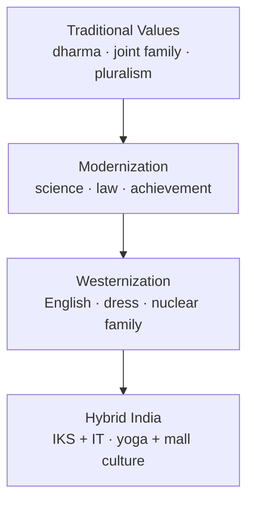

# Modernization & Westernization in India

> GS-1 · Topic 08 · Modernisation, westernisation, traditional values, education

---

## PYQs

| Year | M | Words | Question (EN) | प्रश्न (HI) | ID |
|------|---|-------|---------------|-------------|-----|
| 2025 | 12 | 200 | Critically evaluate the impact of modernisation and westernisation on the traditional Indian values. | भारतीय परम्परागत मूल्यों पर आधुनिकीकरण एवं पश्चिमीकरण के प्रभावों का आलोचनात्मक मूल्यांकन कीजिये। | Q1 |
| 2020 | 12 | 200 | Critically examine the impacts of West on the field of Indian education. | भारतीय शिक्षा के क्षेत्र में पाश्चात्य प्रभावों का आलोचनात्मक परीक्षण कीजिये। | Q2 |

---

## Quick Revision

```
MODERNIZATION (Yogendra Singh): Structural shift — rationality, science, bureaucracy, achievement, differentiation
  NOT = blind Western copy | Indian path = "modernization of tradition"

WESTERNIZATION (M.N. Srinivas): Adoption of Western lifestyle/institutions — dress, food, English, nuclear family
  Often upper castes/classes first → trickle down | Distinct from Sanskritization (emulate upper Hindu ritual)

TRADITIONAL INDIAN VALUES (exam list):
  Dharma · Ahimsa · Joint family · Vasudhaiva Kutumbakam · Guru-shishya · Tolerance/pluralism
  · Tyaga/seva · Atithi devo bhava · Harmony with nature (prakriti)

POSITIVE IMPACTS: Constitutional democracy · scientific temper (Nehru) · women's education/reform
  · abolition sati/untouchability campaigns · universalistic citizenship · human rights discourse

NEGATIVE / STRAIN: Materialism · individualism vs collectivism · consumerism · erosion joint family
  · English hegemony · cultural inferiority complex · homogenized youth culture · mental health stress

EDUCATION — WESTERN IMPACT:
  Macaulay Minute 1835 ("English class") · Wood's Dispatch 1854 · Universities 1857 (Calcutta, Bombay, Madras)
  · English medium privilege · missionary + colonial curricula · scientific/rational knowledge
  POSITIVE: literacy expansion · professional classes · IIT/IIM · global competitiveness
  CRITICAL: uprooting from village culture · deskilling traditional crafts · commercial coaching culture
  · NEP 2020 IKS pushback — reintegrate Indian knowledge

GANDHI vs TAGORE: Gandhi = Nai Talim, vernacular, craft-centred | Tagore = Visva-Bharati, global humanism
  · both critiqued colonial education differently

D.P. MUKERJI: Tradition and modernity = dialectical, not binary destruction

CONTEMPORARY: NEP 2020 (IKS, multilingual) · Ek Bharat Shreshtha Bharat · yoga/AYUSH global
  · OTT Western content vs regional cinema revival · AI/ed-tech English bias

TRAPS: Modernization ≠ Westernization only | Westernization ≠ all bad
  | Tradition ≠ static (reforms always existed) | Macaulay ≠ only damage (also institutions)
  | Critical evaluate = BOTH sides mandatory | Education impact ≠ only colonial era (LPG private univs)
```

---

## Content

### Context — tradition, modernity, and the West

- **Indian society** carries **ancient value systems** — **dharma, karma, ahimsa, joint family, guru-shishya, religious pluralism** — continuously **reinterpreted** through **Bhakti, Sufi, reform movements**, and **colonial encounter**.
- **Modernization** (sociological) = **structural transformation** toward **rationality, scientific outlook, achievement orientation, occupational specialization, universalistic norms** — **Yogendra Singh** (*Modernization of Indian Tradition*, **1973**) argues India modernizes **through** tradition, not by ** erasing** it.
- **Westernization** (**M.N. Srinivas**) = adoption of **Western habits and institutions** — **dress, diet, language, marriage forms, secular education** — often starting with **upper castes/classes**, distinct from **Sanskritization** (emulating **upper-caste Hindu ritual status**).
- **Exam frame:** **Critical evaluate/examine** = **positive + negative + synthesis** — never one-sided glorification or rejection.

### Traditional Indian values — core reference list

| Value cluster | Traditional expression | Modern/Western pressure |
|---------------|------------------------|-------------------------|
| **Ethical-spiritual** | **Dharma, ahimsa, moksha orientation** | **Secular rationalism, utilitarianism** |
| **Social organization** | **Joint family, patriarchy, filial duty** | **Nuclear family, individual rights** |
| **Knowledge** | **Guru-shishya, oral tradition, IKS** | **Formal schooling, English, STEM dominance** |
| **Cosmology** | **Vasudhaiva Kutumbakam, sarva dharma** | **Nation-state citizenship, competitive nationalism** |
| **Economy** | **Tyaga, seva, frugality, jajmani reciprocity** | **Consumerism, market self-interest** |
| **Nature** | **Sacred ecology (rivers, trees)** | **Industrial extraction, climate crisis** |

### Modernization — features and Indian trajectory

- **Yogendra Singh:** Modernization in India produces **structural differentiation** — **caste-jati** partially gives way to **class, occupation, education** as status markers; **little tradition** (village) interacts with **great tradition** (Sanskritic) and **modern institutions**.
- **Nehruvian scientific temper** — **Constitution, planning, IITs, ISRO** — modernization as **nation-building**, not cultural self-destruction.
- **Legal reforms** — **Hindu Marriage Act 1955, anti-dowry laws, abolition of untouchability (Art 17)** — **tradition reformed by modern law**.
- **Limits of linear modernity** — **caste endogamy, arranged marriage, ritual festivals** persist — **M.S.A. Rao** and **Andre Béteille** note ** selective adaptation**.

### Westernization — mechanisms and social layers

- **Colonial phase:** **English language, railways, postal system, Western medicine, Christianity, Victorian morality** — **Macaulay 1835** aimed at **"interpreters"** between British and Indians.
- **Post-Independence:** **Bollywood Western dress, cricket, parliamentary democracy, university system** — **Western forms with Indian content**.
- **LPG era (1991+):** **MNC lifestyle, social media, Valentine's Day debates, fast food** — **accelerated Westernization** among **urban youth**.
- **Srinivas insight:** Westernization often **precedes or accompanies upward mobility** — not random mimicry but **status strategy**.



### Impact on traditional values — critical evaluation matrix

**Positive / transformative impacts**

- **Human rights & equality** — **Constitutional morality** challenges **untouchability, gender injustice, arbitrary authority** — aligns with **universalistic ethics** in **Upanishadic and Bhakti** traditions reframed.
- **Education & gender** — **Women's literacy, widow remarriage history, Savitribai Phule** lineage extended by **modern schooling**.
- **Democracy & rule of law** — **Western institutional borrowings** enable **accountable governance** — **not culturally alien to deliberative traditions** (sabha, panchayat memory).
- **Scientific medicine & technology** — **Smallpox eradication, green revolution, digital India** — **life quality gains**.

**Negative / strains on tradition**

- **Materialism & consumerism** — **Market self-interest** erodes **frugality, tyaga, community reciprocity**.
- **Individualism vs joint family** — **Care of elderly**, **inheritance disputes**, **mental health isolation** in **nuclear metros**.
- **English hegemony** — **Cultural capital divide**; **regional language decline anxiety** — **NEP 2020 multilingualism** as response.
- **Homogenized youth culture** — **Body image, dating, alcohol** — **moral panic** and **reactive conservatism**.
- **IKS erosion risk** — **Ayurveda, astronomy, philosophy** sidelined in **colonial-era curricula** until **recent revival**.

**Synthesis (exam conclusion line)**
- **D.P. Mukerji:** Tradition and modernity in **dialectical tension** — India ** selectively absorbs** West while **reasserting identity** (**IKS, yoga diplomacy, festivals**).

### Western impact on Indian education — historical layers

| Phase | Milestone | Impact |
|-------|-----------|--------|
| **Colonial** | **Macaulay Minute 1835** | **English as medium** — created **babu class**, **disconnected elite from masses** |
| **Colonial** | **Wood's Dispatch 1854** | **Departmental education system**, grants-in-aid — **mass schooling framework** |
| **Colonial** | **Universities 1857** — **Calcutta, Bombay, Madras** | **Higher education, professional classes, nationalist intelligentsia** |
| **Post-1947** | **IITs (1950s), NCERT, Kothari Commission (1964–66)** | **Science-technology focus**, **standardized curricula** |
| **LPG era** | **Private schools, international boards (IB), coaching (Kota)** | **Competitive exam culture**, **English premium intensified** |
| **Contemporary** | **NEP 2020** | **IKS integration, multilingual, holistic** — **corrective to one-sided Westernization** |

**Gandhi — *Nai Talim*:** Education through **craft, vernacular, non-violence** — rejected **colonial literary education** as ** soul-killing**.
**Tagore — *Visva-Bharati*:** **Global humanism** without ** colonial mimicry** — **creative engagement with West**.

**Critical positives of Western education:** **Universal literacy project**, **women's schools**, **research universities**, **global IIT/IIM/IISc pipeline**, **constitutional citizenship education**.

**Critical negatives:** **Rootlessness**, **contempt for manual labour/crafts**, ** coaching factories**, **mental health crisis among students**, **commercialization**, **digital divide**.

### Indian vs Western paths to modernity (comparison)

| Dimension | **Western trajectory** | **Indian trajectory** |
|-----------|------------------------|-------------------------|
| **Secularization** | **Church authority decline** | **Religious festivals, pilgrimage economy thrive** alongside science |
| **Individualism** | **Strong autonomous self** | **Individual rights via Constitution** but **family remains identity unit** |
| **Industrialization** | **Factory proletariat early** | **Services leapfrogging**, ** informal sector massive** |
| **Colonialism** | **Self-driven imperial expansion** | **Colonial subordination** shapes ** defensive modernization** |
| **Knowledge** | **Enlightenment rationalism** | **NEP 2020 IKS + STEM** dual track |

**Exam line:** India **cannot be judged by pure Western modernization template** — **Yogendra Singh's Indian modernity** is **distinctive synthesis**.

### Contemporary relevance

- **NEP 2020 — IKS (Indian Knowledge Systems)** embedded in **higher education** — **Ayurveda, philosophy, astronomy, linguistics** — state response to **Western-centric curriculum critique**.
- **Ek Bharat Shreshtha Bharat** — **cultural exchange** across states — **internal pluralism** as antidote to **homogenization**.
- **International Yoga Day (UN 2014)** — **traditional value globalized** — reverses **one-way Westernization narrative**.
- **Ed-tech (BYJU's era collapse, DIKSHA platform)** — **Western VC model** meets **Indian exam obsession** — new **critical education question**.
- **AI and English bias** — **regional language AI (Bhashini)** — **digital modernization with Indian languages**.

### Limits and balanced view

- **Modernization ≠ Westernization** — Japan-style **modern institutions + cultural continuity** cited as **comparative analogy**.
- **Tradition ≠ pure golden age** — **sati, caste, patriarchy** were **traditional** yet **reformed** — avoid **nostalgic uncritical praise**.
- **Western education** also produced **Ambedkar, Tagore, Raman, Kalam** — **empowerment through hybridity**.
- **Reactive nativism** (book bans, anti-Valentine vigilantism) ** harms pluralism** — distinguish **legitimate IKS revival** from **xenophobia**.

### Reform movements — tradition modernized before LPG

| Movement / Figure | Issue | Link to values debate |
|-------------------|-------|----------------------|
| **Raja Rammohun Roy** | **Sati abolition 1829** | **Rational reform** within **Hindu tradition** |
| **Jyotirao & Savitribai Phule** | **Girls' education 1848** | **Social justice** vs **Brahminical orthodoxy** |
| **Swami Vivekananda (1893 Chicago)** | **Universal Vedanta** | **Global presentation** of **Indian spirituality** |
| **Gandhi** | **Swadeshi, Harijan, Nai Talim** | **Modernization without Western materialism** |
| **Ambedkar** | **Constitution, annihilation of caste** | **Legal modernity** attacking **traditional hierarchy** |

**Comparative frameworks (value-add)**

| Thinker | Core argument | Exam use |
|---------|---------------|----------|
| **M.N. Srinivas** | **Sanskritization + Westernization** | **Elite diffusion of change** |
| **Yogendra Singh** | **Modernization of Indian Tradition** | **Structural differentiation, not wipeout** |
| **D.P. Mukerji** | **Dialectical tradition-modernity** | **Avoid binary glorify/trash tradition** |
| **Ashis Nandy** | **Critique of homogenizing modernity** | **Voice for plural knowledge systems** |

---

## Answers

### Q1: Critically evaluate the impact of modernisation and westernisation on the traditional Indian values. (2025, 12M, 200W)

**Introduction:**
> **Modernisation** is structural shift toward **rationality, science, and achievement**; **Westernisation** ( **M.N. Srinivas**) is adoption of **Western lifestyle and institutions** — together they **transform**, not simply destroy, **traditional Indian values**.

**Main Points:**
- **Human Rights & Constitutional Morality** — **Art 14, 17, 15** — modern law attacks **untouchability, gender injustice** — aligns with **Bhakti-Sufi equality ethics**.
- **Erosion of Joint Family & Collectivism** — **Nuclear metros, individual rights** strain **filial duty, elder care, tyaga values**.
- **Scientific Temper & Progress** — **Nehruvian modernization** — **medicine, ISRO, digital India** — **life-quality gains** without abandoning **spiritual pluralism**.
- **Consumerism vs Frugality** — **LPG consumer culture** challenges **simple living, seva orientation**.
- **English & Cultural Capital** — **Westernization of language** creates **elite-mass divide** — **regional identity stress**.
- **Persistence & Hybridity (Yogendra Singh)** — **Arranged marriage with apps, festivals + malls** — **tradition modernized**, not erased.
- **IKS Revival (NEP 2020)** — **Conscious reassertion** of **Ayurveda, philosophy** — **critical correction** to one-way Westernization.
- **Critical Verdict** — **Necessary modernization** of ** oppressive customs**; **risk** of **materialism and rootlessness** — **selective synthesis** needed.

**Keywords (underline in exam):** Modernization · Westernization · M.N. Srinivas · Yogendra Singh · Joint Family · NEP 2020 IKS · Dharma

**Exam diagram (30 sec):**
```
Traditional values
   ↓ modernize + westernize
Gains (rights · science) || Strains (consumerism · nuclear family)
   ↓
Hybrid India (IKS + democracy)
```

**Conclusion:**
> India must **modernize traditions** — retaining **pluralism, ethics, community** while **rejecting inequality and colonial mimicry**.

---

### Q2: Critically examine the impacts of West on the field of Indian education. (2020, 12M, 200W)

**Introduction:**
> **Western/colonial education** reshaped Indian **pedagogy, language, and social mobility** from **Macaulay (1835)** onward — producing **both empowerment and cultural dislocation**.

**Main Points:**
- **Institutional Foundation** — **Wood's Dispatch 1854**, **universities 1857 (Calcutta, Bombay, Madras)** — **mass schooling and professional classes**.
- **English-Medium Elite** — **Macaulay's "interpreter class"** — **global connectivity** but **distance from vernacular masses**.
- **Scientific-Rational Curriculum** — **Medicine, engineering, law** — **IIT/IIM pipeline**, **economic competitiveness**.
- **Nationalist Counter-Currents** — **Gandhi's Nai Talim**, **Tagore's Visva-Bharati** — **critique of colonial literary education**.
- **Democratization Post-1947** — **Kothari Commission, NCERT, RTE 2009** — **expanded access**, yet **quality divide** persists.
- **LPG-Era Commercialization** — **Private international schools, Kota coaching** — **stress, inequality, deskilling of crafts**.
- **NEP 2020 Corrective** — **IKS, multilingualism, holistic education** — **rebalances Western tilt**.
- **Critical Balance** — West enabled **Ambedkar, Kalam, global diaspora**; also **rootlessness and English hegemony**.

**Keywords (underline in exam):** Macaulay Minute 1835 · Wood's Dispatch 1854 · Nai Talim · NEP 2020 · IKS · English Medium

**Exam diagram (30 sec):**
```
Colonial Western edu → institutions + English
        ↓
Empowerment (IIT/RTE) || Dislocation (coaching · IKS loss)
        ↓
NEP 2020 rebalancing
```

**Conclusion:**
> Western impact **built modern educational capacity** — India's challenge is **integrating IKS and equity** without ** surrendering scientific universalism**.

---

### Q3: *Likely variant:* Distinguish between modernization and westernization with reference to M.N. Srinivas and Yogendra Singh. (—, 8M, 125W)

**Introduction:**
> **Modernization** and **Westernization** are related but **distinct** processes in Indian sociology — clarified by **Yogendra Singh** and **M.N. Srinivas**.

**Main Characteristics:**
- **Modernization — Structural Change** — **Rationality, occupational specialization, universalistic law, scientific outlook** — **Yogendra Singh's "modernization of tradition."**
- **Westernization — Cultural Borrowing** — **Dress, diet, language, nuclear family, secular holidays** — **Srinivas** — often **elite-led diffusion**.
- **Different from Sanskritization** — **Srinivas:** Sanskritization emulates **upper-caste Hindu ritual**; Westernization emulates **Western lifestyle** — can overlap.
- **Modernization Can Be Indigenous** — **Panchayati Raj, ISRO, Ayurveda research** — **modern form, Indian content**.
- **Westernization Not Sufficient for Modernization** — **Superficial mimicry** without **institutional reform** — **cargo cult risk**.
- **Indian Hybrid Outcomes** — **Democracy + dharma discourse**, **IT + joint festivals** — **both processes interact**.
- **Exam Trap Avoided** — Treating both as **synonyms** — **incorrect sociologically**.

**Keywords (underline in exam):** Modernization · Westernization · Sanskritization · Yogendra Singh · M.N. Srinivas · Little and Great Tradition

**Exam diagram (30 sec):**
```
Modernization = institutions + rationality
Westernization = lifestyle + English
      ↓
Both → hybrid social change
```

**Conclusion:**
> India's path involves **modernizing through selective Westernization** while **reworking tradition** — not ** wholesale copying**.

---

### Q4: *Likely variant:* How does NEP 2020 address the imbalance created by colonial Western education? (—, 8M, 125W)

**Introduction:**
> **NEP 2020** responds to **colonial-era English-centric, rote-based education** by promoting **IKS, multilingualism, and holistic learning**.

**Main Points:**
- **IKS Integration** — **Ayurveda, philosophy, astronomy, linguistics** in **higher education curricula**.
- **Multilingual Mother-Tongue Base** — **Instruction till Grade 5+ in regional language** — counters **Macaulay elite divide**.
- **Holistic & Flexible Curriculum** — **Arts-science convergence**, **vocational exposure** — echoes **Gandhi-Nai Talim spirit**.
- **Critical Thinking vs Rote** — Reduces **coaching culture dependency**.
- **Digital + Regional (Bhashini)** — **Technology without English-only bias**.
- **Limits** — **Implementation funding, teacher training, exam system inertia** — **policy ≠ instant change**.

**Keywords (underline in exam):** NEP 2020 · IKS · Multilingualism · Macaulay · Holistic Education · Vocational

**Exam diagram (30 sec):**
```
Colonial English rote → NEP 2020
  IKS + mother tongue + vocational + critical thinking
```

**Conclusion:**
> NEP 2020 aims **education decolonization** — **modern science with civilizational rootedness**.

---

## Traps

| Wrong | Correct |
|-------|---------|
| Modernization = Westernization | **Distinct concepts** — modernization can be **indigenous-institutional** |
| Westernization = always negative | **Democracy, medicine, universities** — **critical examine both sides** |
| Traditional values = wholly good | **Sati, untouchability, patriarchy** were **traditional** — reformed by **modern law** |
| Macaulay = only destruction | Also created **modern elite, universities, global linkages** — **dialectical impact** |
| Gandhi and Tagore agreed on education | **Gandhi: craft-vernacular** vs **Tagore: global humanism** — **different critiques** |
| Sanskritization = Westernization | **Srinivas:** Sanskritization = **upper-caste ritual mimicry** — different mechanism |
| NEP 2020 ends English importance | **English retained** alongside **multilingualism** — **balance, not abolition** |
| Modernization erases religion | **Bhakti revival, festival economy, yoga global** — **religion adapts** |
| Critical evaluate = only criticism | **Evaluate = judge pros and cons** — **balanced verdict required** |
| Western education impact ended in 1947 | **LPG private schools, IB, ed-tech, coaching** — **ongoing Western/global influence** |
| IKS = anti-science | NEP frames **IKS + STEM together** — **not rejection of rationality** |
| Joint family disappeared | **Modified continuity** — **stem families, occasional co-residence** |

---

*Complete.*
