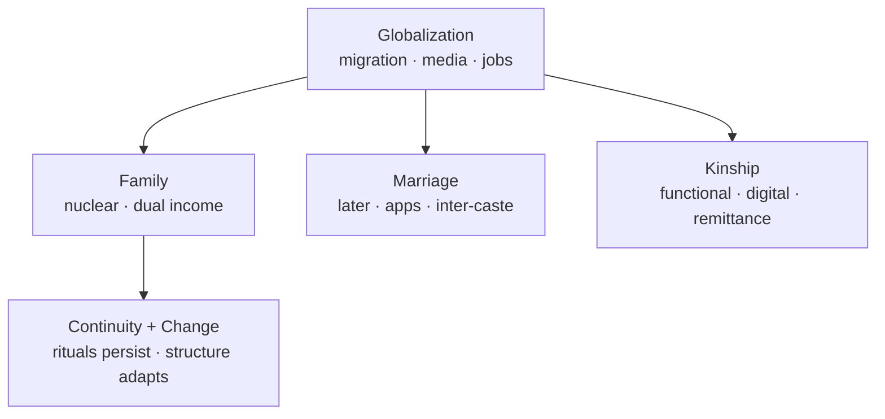

# Globalization & Social Institutions — Family, Marriage, Kinship

> GS-1 · Topic 08 · Globalization effects on family, marriage, kinship in India

---

## PYQs

| Year | M | Words | Question (EN) | प्रश्न (HI) | ID |
|------|---|-------|---------------|-------------|-----|
| 2025 | 12 | 200 | What are the visible effects of globalization on family, marriage and kinship system? Analyse with reference to the Indian society. | परिवार, विवाह एवं नातेदारी व्यवस्था पर वैश्वीकरण का क्या प्रभाव दिखाई देता हैं? भारतीय समाज के सन्दर्भ में इसका विश्लेषण कीजिए। | Q1 |

---

## Quick Revision

```
FAMILY (Indian baseline): Joint/stem family · patrilineal · extended · collectivist · filial piety · authority of elders

GLOBALIZATION CHANNELS: LPG 1991 · migration · remittances · media/OTT · social media · dating apps · MNC work culture
  · nuclear housing in metros · women's employment · consumer weddings

FAMILY CHANGES:
  Joint → nuclear/stem · smaller household size (Census trend)
  · geographically dispersed (Skype/WhatsApp families) · individualism ↑ · privacy demand
  · dual-income households · elderly care crisis · single-parent (rare but rising visibility)
  · live-in relationships (urban, legally debated) · pet families · DINK couples

MARRIAGE CHANGES:
  Arranged → assisted (apps: Shaadi.com, BharatMatrimony) · love-inter-caste/inter-faith ↑ (still contested)
  · rising age at marriage (NFHS-5) · divorce ↑ (urban courts) · dowry persists despite law
  · destination/consumption weddings · cross-border NRI marriages · Special Marriage Act 1954
  · court rulings on privacy (Puttaswamy 2017) affect marital autonomy

KINSHIP CHANGES:
  Bilateral influence (NRI remittance kin) · weakening village exogamy/jati rules in metros
  · functional kinship (who sends money) vs ritual kinship · sibling bonds via digital contact
  · matrilineal pockets (Kerala, Meghalaya) react differently
  · caste endogamy persists — globalization did NOT erase

SOCIOLOGISTS: Irawati Karve (kinship regions) · M.N. Srinivas · A.M. Shah (joint family change)
  · Patricia Uberoi (family in Asia) · Roland Lardinois (Indian family modernity)

POSITIVE: Women voice ↑ · choice in partner (urban) · smaller families + education · rights awareness (DV Act)
NEGATIVE: Marriage commodification · domestic violence under stress · lonely elderly · commercial surrogacy debates

CONTEMPORARY: UPI remittance families · OTT portrayal of relationships · Supreme Court same-sex marriage petition (2023)
  · NEP lifelong learning · migrant worker family separation · COVID return migration stress

TRAPS: Nuclear ≠ no kinship obligation | Apps ≠ love marriage majority yet
  | Divorce ↑ ≠ family collapse | Globalization ≠ Western-only marriage forms
  | Caste endogamy still dominant | Live-in ≠ legally married — different rights
```

---

## Content

### Context — family, marriage, kinship as exam unit

- **Family** = **co-residing unit** bound by **marriage, blood, adoption** — in India historically **joint family** ( **multiple generations, common kitchen, patrilineal authority**).
- **Marriage** = ** sacramental-social contract** linking **two kin groups** — **arranged, endogamous (caste/jati), patrilocal** norm dominant; **Hindu Marriage Act 1955**, **Special Marriage Act 1954**, personal laws govern.
- **Kinship** = **relational network** — **blood (consanguine), affinal (marriage), fictive ( guru, bhai)**; **Irawati Karve** mapped **north vs south vs tribal** kinship **regional variations**.
- **Globalization (post-1991)** intensifies **migration, media, consumer markets, women's employment** — **restructures** but **does not abolish** family institutions — **A.M. Shah** and **Patricia Uberoi** emphasize ** adaptive continuity**.

### Baseline — traditional Indian family system

| Feature | Traditional pattern | Globalization pressure |
|---------|---------------------|------------------------|
| **Structure** | **Joint/stem family**, elder authority | **Nuclear units** in **migrant metros** |
| **Marriage** | **Arranged, caste endogamy, early age** | **Later marriage, apps, inter-caste love** (urban) |
| **Residence** | **Patrilocal (virilocal)** | **Neolocal** (couple sets separate home) |
| **Gender roles** | **Male breadwinner, female homemaker** | **Dual-earner couples**, **unpaid care debate** |
| **Kin obligations** | **Jajmani, lifecycle rituals, dowry exchange** | **Remittance-based obligations**, **smaller ritual scale** |
| **Decision-making** | **Collective (elder male)** | **Individual/couple autonomy** |

### Visible effects on family

**Structural — nuclearization and stem family**
- **Census household data:** **Average household size declined** over decades — **urban nuclear** common among **IT/migrant professionals** in **Bangalore, Pune, Gurugram**.
- **Stem family** — parents with **one married son** co-reside while **siblings migrate** — **partial jointness**, not classical joint family.
- **Geographic dispersion** — **WhatsApp/Skype families**, **NRI siblings** — **emotional bonds persist**, **daily cooperation weakens**.

**Economic — dual income and consumer lifestyle**
- **LPG service economy** enables **women's paid work** — **BPO, retail, gig** — **family budget** tied to **global market cycles**.
- **Housing EMI culture** — **nuclear housing** in ** gated communities** — **privacy norm** imported via **global urban form**.

**Care crisis**
- **Elderly left alone** in villages or **old-age homes** (still stigma but **rising in metros**) — **global time-pressure work culture** reduces ** intergenerational care**.
- **Childcare** — **nuclear couple** relies on **creches, grandparents flying in** — **new dependency patterns**.

**Alternative family forms (urban visibility)**
- **Live-in relationships** — **Supreme Court privacy (Puttaswamy 2017)** context — **legal rights incomplete** vs marriage.
- **Single-parent, divorcee-headed households** — **still minority** but **less hidden**.
- **DINK (double income no kids)** — **consumer urban lifestyle**.



### Visible effects on marriage

**From arranged to assisted / hybrid**
- **Matrimonial websites/apps** — **Shaadi.com, BharatMatrimony, Jeevansathi** — **global tech, Indian endogamy filters** (caste, gotra, horoscope).
- **Love marriages** increase in **metros and education groups** — **honour crimes** in **conservative hinterland** show ** conflict**.

**Age and agency**
- **NFHS-5:** **Median age at first marriage** rising for **women** — linked to **education and career** — **global norm of delayed marriage** partially adopted.
- **Women's consent voice** — **legal age 18/21 debates** ( **Prohibition of Child Marriage Amendment** discussions).

**Instability and law**
- **Divorce rates** — higher in **urban, educated cohorts** — **family courts, mutual consent** under **HMA 1955**.
- **Domestic Violence Act 2005** — **married and live-in** protection — **rights awareness** via **NGO/global discourse**.

**Commodification**
- **Destination weddings, luxury spend** — **global wedding industry** — ** dowry disguised as gifts** persists despite **Dowry Prohibition Act 1961**.

**Cross-border dimensions**
- **NRI marriages** — **Indian diaspora** — **transnational matchmaking**, ** visa-trading fraud** cases — **Ministry of External Affairs advisories**.

### Visible effects on kinship

**Weakening of ritual kin obligations**
- **Lifecycle rituals (birth, thread, marriage, death)** — **shortened, outsourced to event managers** — **symbolic kin roles** shrink.

**Functional vs ritual kinship**
- **Remittance kin** — **Gulf, US NRIs** — **who sends money** gains **authority** over **ritual elders** without land.

**Caste endogamy persistence**
- **Globalization did not erase jati marriage rules** — **CSDS studies** show **overwhelming endogamy** still — ** apps reinforce caste filters**.

**Regional variation (Karve framework)**
- **North India (Indo-Aryan)** — **village exogamy, gotra rules** — **globalization via migration** loosens **local enforcement**.
- **South India (Dravidian)** — **cross-cousin marriage traditions** — **IT migration** creates **new partner pools**.
- **Matrilineal pockets (Kerala, Khasi, Garo)** — **different globalization trajectory** — **women's property rights** historically stronger.

**Digital kinship**
- **Facebook family groups**, **genealogy apps** — **maintain affinal ties** across **continents**.

### Analytical frameworks for answers

**Continuity + change model**
- **Roland Lardinois / Uberoi:** **Institutional adaptation** — **marriage remains central** but **its form commodified and individualized**.

**Gender lens**
- **Global employment** increases **women's leverage** inside marriage; **patriarchal violence** persists under **economic stress**.

**Class lens**
- **Elite globalized marriages** vs **child marriage pockets** — **globalization effects class-segregated**.

### Positive and negative synthesis

| Domain | Positive visible effects | Negative visible effects |
|--------|-------------------------|-------------------------|
| **Family** | **Smaller, planned families**, **women's say in fertility** | **Elderly isolation**, **care deficits** |
| **Marriage** | **Later marriage, choice (urban)**, **legal rights awareness** | **Commodification, dowry, NRI fraud, honour crimes** |
| **Kinship** | **Digital connectivity**, **remittance support** | **Ritual erosion, caste-endogamy rigidity online** |

### Contemporary relevance

- **Supreme Court (2023)** — **same-sex marriage petition** — **global LGBTQ discourse** meets **Indian kinship law** — **ongoing legal position** (stable exam hook: **institutional debate**).
- **OTT serials** — **Indian family norms** globally streamed — **soft power + norm contestation**.
- **Migrant worker families (COVID exodus 2020)** — **global supply chains** expose **fragile urban family survival**.
- **UPI remittances** — **instant cross-border family support** — **new kin economic bond**.
- **Special Marriage Act** — **inter-faith couples** navigating **global cosmopolitanism vs local communal pressure**.

### Limits and balanced view

- **Majority marriages still arranged-endogamous** — **do not overstate Westernization**.
- **Nuclearization ≠ kinship death** — **festival gatherings, wedding networks** continue — **modified intensity**.
- **Urban visibility bias** — **rural joint patterns** persist where **land and agriculture** anchor **co-residence**.
- **Legal change lags practice** — **live-in, same-sex, divorce** — **social stigma** remains strong in **many communities**.

### Personal laws and marriage institutions (table)

| Community / Law | Marriage feature | Globalization interaction |
|-----------------|------------------|---------------------------|
| **Hindu Marriage Act 1955** | **Monogamy, judicial divorce** | **Urban divorce filings** rise with **women's employment** |
| **Muslim personal law** | **Nikah, triple talaq reformed (2019 Act)** | **Global feminist pressure + Supreme Court activism** |
| **Special Marriage Act 1954** | **Civil, inter-faith** | **Cosmopolitan couples** bypass **community courts** |
| **Christian Indian Marriage Act** | **Church registration** | **NRI Christian diaspora** matches globally |
| **Tribal customs (Sixth Schedule areas)** | **Community-specific rules** | **Mining/global capital** disrupts ** tribal kin land bonds** |

### COVID-19 and family structure (contemporary hook)

- **Reverse migration 2020** — **millions returned to villages** — **temporary joint family reunification** under **economic shock**.
- **Work-from-home** — **dual earner couples** renegotiate **domestic division of labour** — **some reports of increased domestic violence (NFHS-5 spousal violence data context)**.
- **Digital weddings** — **global pandemic** normalized **online rituals** — **kin participation without travel** — **may persist post-COVID**.

---

## Answers

### Q1: What are the visible effects of globalization on family, marriage and kinship system? Analyse with reference to the Indian society. (2025, 12M, 200W)

**Introduction:**
> **Globalization** — through **LPG reforms, migration, media, and global labour markets** — visibly reshapes **Indian family structure, marriage practices, and kin networks** while ** retaining core institutional importance**.

**Logical Analysis:**
- **Family — Nuclearization** — **Migrant IT/service workers** in **metros (Bangalore, Pune)** form **nuclear households**; **Census trend** of **smaller household size**.
- **Family — Dual-Income & Care Crisis** — **Women's BPO/retail jobs** — **dual earners**; **elderly/childcare gaps** as **joint support weakens**.
- **Family — Digital Connectedness** — **WhatsApp/Skype** sustain **dispersed kin** — **emotional ties without co-residence**.
- **Marriage — Assisted Arranged** — **Shaadi.com, BharatMatrimony** — **global tech + caste endogamy filters** — **hybrid modernity**.
- **Marriage — Later Age & Rising Divorce (Urban)** — **NFHS-5** later **first marriage**; **family courts** handle **mutual consent divorce (HMA 1955)**.
- **Marriage — Commodification** — **Destination weddings, luxury spend** — **global consumer wedding industry**; **dowry persists** despite law.
- **Kinship — Functional Remittance Kin** — **Gulf/US NRIs** — **economic authority** shifts to **migrants** over **land-based elders**.
- **Kinship — Endogamy Persists** — **Caste marriage rules** continue on **apps** — globalization **does not erase jati boundaries**.

**Keywords (underline in exam):** Nuclear Family · Joint Family · Arranged Marriage · NFHS-5 · Remittance · Kinship · Endogamy

**Exam diagram (30 sec):**
```
Globalization (migration · media · jobs)
   ├→ Family: nuclear · dual income · digital
   ├→ Marriage: apps · later age · commodified
   └→ Kinship: remittance power · endogamy stays
```

**Conclusion:**
> Globalization **individualizes and commodifies** family life yet **marriage-kinship remain central** — India shows **adaptive continuity**, not ** wholesale Western family replacement**.

---

### Q2: *Likely variant:* Discuss the impact of migration and remittances on rural family and kinship structure in India. (—, 12M, 200W)

**Introduction:**
> **Globalization-driven migration** — **internal (UP→Mumbai) and international (Kerala→Gulf)** — restructures **rural families** through **remittances, absent members, and shifting authority**.

**Main Points:**
- **Stem/Joint Family Modification** — **Male out-migration** — **women-headed de facto households** in **Bihar, UP, Odisha**.
- **Remittance Status** — **Concrete houses, consumer goods** — **migrant's kin prestige** rises over **traditional land elites**.
- **Gender Role Shift** — **Women manage farms, SHGs** — **greater autonomy** with ** added burden**.
- **Marriage Markets** — **NRI groom preference** — **dowry inflation**, ** fraud risk** — **MEA advisories**.
- **Kin Obligation Recalibration** — **Lifecycle rituals funded by remittances** but **physical absence** weakens **daily reciprocity**.
- **Left-Behind Elderly & Children** — **Care deficits**, **schooling in hostels** — **social cost of migration**.
- **Return Migration (COVID 2020)** — **Sudden reunification stress** on **urban-rural family budgets**.
- **Assessment** — **Economic uplift** with ** relational thinning** — **kinship becomes transactional**.

**Keywords (underline in exam):** Remittances · Migration · Stem Family · NRI Marriage · SHG · Left-Behind Families

**Exam diagram (30 sec):**
```
Rural migrant → remittance
     ↓
Status ↑ · women roles ↑ · rituals funded · daily kinship ↓
```

**Conclusion:**
> Migration **globalizes village economies** while **transforming kinship from ritual-co-residence to remittance-supported networks**.

---

### Q3: *Likely variant:* How has globalization affected the institution of marriage in urban India? (—, 8M, 125W)

**Introduction:**
> **Urban India** experiences **globalization most intensely** — marriage shows **later ages, technology mediation, commodification, and rising divorce visibility**.

**Main Characteristics:**
- **Matrimonial Apps** — **Caste-filtered assisted arranged** — **Shaadi.com ecosystem**.
- **Love-Inter-Caste/Inter-Faith** — **Special Marriage Act 1954** — **still socially contested**.
- **Consumer Wedding Industry** — **Destination, themed weddings** — **global luxury norms**.
- **Working Women & Delayed Marriage** — **Career before marriage** — **NFHS-5 age trend**.
- **Divorce & Remarriage Visibility** — **Urban family courts** — **stigma slowly reducing**.
- **Live-In & Privacy Jurisprudence** — **Puttaswamy 2017** — **autonomy discourse** without **full marital rights**.
- **Double Burden Post-Marriage** — **Paid work + domestic roles** — **unresolved gender equity**.

**Keywords (underline in exam):** Assisted Arranged · Special Marriage Act · NFHS-5 · Consumer Wedding · Divorce · Urbanization

**Exam diagram (30 sec):**
```
Urban + global media/jobs
   → apps · late marriage · luxury wedding · divorce visibility
```

**Conclusion:**
> Urban marriage becomes **more individual-choice oriented and commodified** while **family approval and caste endogamy** still **shape outcomes**.

---

### Q4: *Likely variant:* Analyse continuity and change in the Indian joint family system under globalization. (—, 8M, 125W)

**Introduction:**
> The **joint family** — **multi-generational, common property, ritual unity** — ** adapts rather than vanishes** under **globalization-induced migration and nuclear housing**.

**Main Points:**
- **Change — Nuclear/Stem Forms** — **Metros**: **neolocal residence**; villages: **stem family** with **one co-residing son**.
- **Change — Authority Erosion** — **Land-less youth** depend on **global wages**, not ** elder land control**.
- **Continuity — Ritual Unity** — **Festivals, weddings, funerals** reunite **dispersed kin** annually.
- **Continuity — Financial Mutual Aid** — **Remittances, education loans** — **family as social security**.
- **Continuity — Patrilineal Ideals** — **Son preference, inheritance disputes** persist (**HSA 2005** amended daughters' rights).
- **A.M. Shah Insight** — **Joint family as cultural ideal** survives though **practice pluralizes**.
- **Class Divide** — **Elite nuclear** vs **rural joint** — **globalization effects uneven**.

**Keywords (underline in exam):** Joint Family · Stem Family · Nuclearization · Migration · Ritual Kinship · A.M. Shah

**Exam diagram (30 sec):**
```
Practice: nuclear/stem ↑
Ideal + rituals: joint unity persists
```

**Conclusion:**
> Globalization **fragments co-residence** but **preserves kin collective** through **ritual, remittance, and crisis solidarity**.

---

## Traps

| Wrong | Correct |
|-------|---------|
| Globalization destroyed joint family in India | **Nuclearization in metros** + **stem/joint persistence** in **village/rural** |
| Most marriages are love marriages now | **Majority still arranged/assisted** — **apps reinforce endogamy** |
| Dating apps eliminated caste | **Caste filters** common on **matrimonial platforms** |
| Nuclear family = no kin obligations | **Festivals, remittances, crisis support** — **obligations continue** |
| Divorce explosion everywhere | **Higher in urban educated cohorts** — **national rate still moderate** |
| Live-in = same legal status as marriage | **DV Act covers some protection** — **inheritance, maintenance differ** |
| Kinship identical across India | **Irawati Karve regional models** — **north vs south vs tribal** |
| Globalization only Western marriage | Also **NRI, Gulf, diaspora** patterns — **not only American model** |
| Smaller families = only positive | **Elderly care gap, loneliness** — **mention costs** |
| Dowry ended with law | **Persists disguised as gifts** — **consumer weddings** worsen display |
| WhatsApp families = weakened bonds only | **Also strengthens long-distance ties** — **dual effect** |
| Same-sex marriage legalized in India | **Supreme Court heard petitions 2023** — state **legal position evolving** — avoid false certainty |

---

*Complete.*
