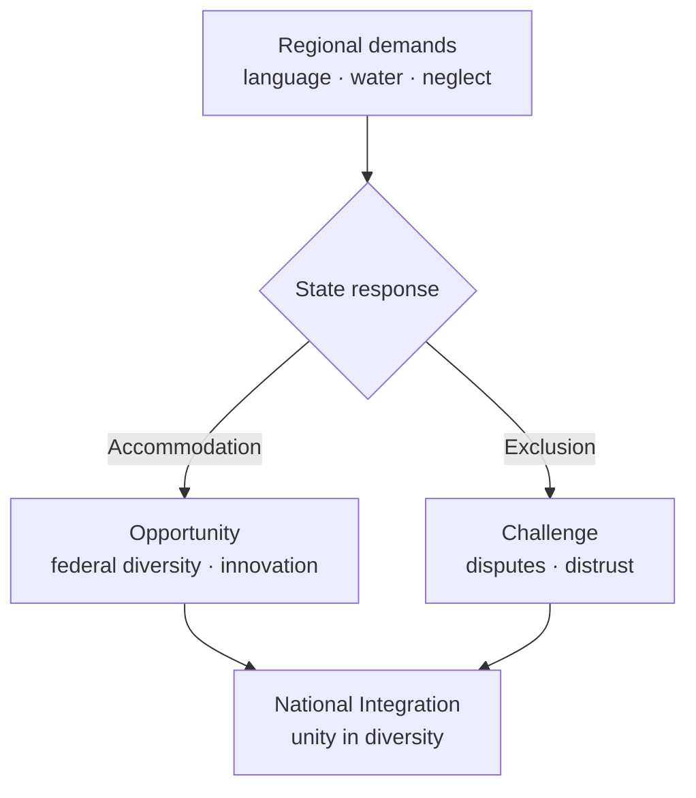

# Regionalism in India

> GS-1 · Topic 09 · Regionalism — challenge, opportunity, economy, polity, national integration

---

## PYQs

| Year | M | Words | Question (EN) | प्रश्न (HI) | ID |
|------|---|-------|---------------|-------------|-----|
| 2025 | 8 | 125 | Regionalism in modern India is both a challenge and an opportunity. Clarify. | आधुनिक भारत में क्षेत्रवाद चुनौती एवं अवसर दोनों है। स्पष्ट कीजिए। | Q1 |
| 2024 | 12 | 200 | How is the growing regionalism in India affecting the economy and polity? Explain. | भारत में बढ़ता हुआ क्षेत्रवाद किस प्रकार से अर्थव्यवस्था तथा राज्यव्यवस्था को प्रभावित कर रहा है? स्पष्ट कीजिए। | Q2 |
| 2023 | 8 | — | What kind of hindrances do regionalism create in the development of India? | क्षेत्रवाद भारत के विकास में किस प्रकार की बाधाएँ उत्पन्न करता हैं? | Q3 |
| 2021 | 8 | 125 | Examine how regionalism affects the national integration. | परीक्षण कीजिए कि क्षेत्रवाद राष्ट्रीय एकता को कैसे प्रभावित करता है? | Q4 |

---

## Quick Revision

```
REGIONALISM = Identity + interest assertion based on language, culture, ethnicity, economy, sub-region
  NOT always separatist — often demands recognition, resources, autonomy within Union

TYPES:
  Linguistic (DMK/Tamil, Shiv Sena/Marathi, Gorkhaland Nepali)
  Sub-regional (Telangana, Jharkhand, Uttarakhand, Bodoland)
  Economic/resource (inter-state water: Cauvery, Krishna, Narmada; mining royalties)
  Son-of-soil (jobs for locals — Mumbai, Hyderabad IT belt debates)

THEORISTS: Rajni Kothari (Congress system breakdown → regional parties)
  · Paul Brass (UP communal/regional politics) · D.L. Sheth (region as political community)

CONSTITUTIONAL: Art 1 (India = Union of States) · Art 3 (reorganisation) · Art 371 (special provisions)
  · 7th Schedule (Centre-State lists) · Inter-State Council · Zonal Councils

CHALLENGES: Secessionist memory (Khalistan, early DMK) · river disputes · coalition instability
  · policy fragmentation · xenophobic son-of-soil · development diversion to identity politics

OPPORTUNITIES: Competitive federalism · regional language/culture preservation (8th Schedule)
  · closer-to-people governance · corrective against homogenization · Ek Bharat Shreshtha Bharat
  · state-specific welfare innovation (Kerala health, Tamil Nadu mid-day meal)

ECONOMY IMPACT: GST Council bargaining · investment competition (Vibrant Gujarat/TN)
  · labour migration tensions · resource royalty fights · infra duplication risk

POLITY IMPACT: Rise of regional parties (TMC, BJD, AAP, DMK) · coalition governments
  · federal balance shifts · national parties ally with state identities

NATIONAL INTEGRATION: Stress if exclusive/ethnic · strengthens if civic federal diversity
  · unity in diversity (Nehru) · Article 1 integrity + regional pride compatible

CONTEMPORARY: NITI Aayog · cooperative-competitive federalism · new states demand (Vidarbha, Gorkhaland)
  · North-East AFSPA debates · Hindi imposition protests (Tamil Nadu, NE)

TRAPS: Regionalism ≠ separatism always | Linguistic states ≠ mistake (reduced secession pressure)
  | All regional parties ≠ anti-national | Federalism ≠ regionalism same thing
  | Water dispute = federal issue not only regionalism | Challenge AND opportunity both mandatory
```

---

## Content

### Context — regionalism in modern India

- **Regionalism** = mobilization around **region-based identity or interest** — **language, ethnicity, culture, economic deprivation, sub-regional neglect** — seeking **power, resources, autonomy, or recognition** within the **Indian Union**.
- **Not synonymous with separatism:** Most regional movements culminate in **statehood, special status, or policy concessions** — **Telangana (2014), Jharkhand (2000), Uttarakhand (2000), Chhattisgarh (2000)** — rather than exit from India.
- **Historical arc:** **Congress dominance (1950s–60s)** → **States Reorganisation Act 1956** (linguistic states) → **decline of one-party system (Rajni Kothari)** → **regional party era** from **1980s–90s** — **DMK, AIADMK, TDP, Shiv Sena, AGP**.
- **UPPCS frame:** Always **dual answer** — **challenge AND opportunity**; link to **economy, polity, national integration, development hindrances**.

### Types and examples of regionalism

| Type | Drivers | Examples |
|------|---------|----------|
| **Linguistic** | Language pride, education, media | **Tamil Nadu (anti-Hindi agitations 1965)**, **Maharashtra (Shiv Sena)**, **Punjab** |
| **Sub-regional** | Within-state neglect | **Telangana vs Andhra**, **Vidarbha vs Maharashtra**, **Gorkhaland**, **Bodoland** |
| **Economic/resource** | Royalties, water, jobs | **Cauvery (TN-Karnataka)**, **Krishna-Godavari**, **mining in Odisha-Jharkhand** |
| **Ethnic/tribal** | Identity + autonomy | **North-East (Mizo, Naga movements)**, **Sixth Schedule areas** |
| **Son-of-the-soil** | Local job protection | **Mumbai nativist politics**, **local job quotas in HP, Haryana** debates |

### Constitutional and institutional framework

- **Article 1** — India = **"Union of States"** — **indestructible union of destructible states** (K.C. Wheare) — **reorganisation without breaking Union**.
- **Article 3** — Parliament may **form new states**, alter boundaries — **Telangana, bifurcation of J&K (2019)** precedents.
- **Article 371** — **special provisions** (Maharashtra-Gujarat, NE states, Andhra, Sikkim, etc.).
- **Seventh Schedule** — **Union, State, Concurrent lists** — friction on **water, minerals, education**.
- **Inter-State Council (Art 263)**, **Zonal Councils** — **dispute resolution forums** — underutilized but exam-relevant.
- **Eighth Schedule** — **22 official languages** — ** linguistic federalism** institutionalized.



### Regionalism as challenge

**Political-security challenges**
- **Separatist movements (historical/contemporary pockets):** **Khalistan (1980s Punjab)**, early **DMK separatist rhetoric (dropped)**, **North-East insurgencies** — strain **national security**.
- **Communal-regional overlap (Paul Brass):** **UP, Bihar** — regional and religious identities **intersect dangerously** in **electoral conflict**.

**Governance and development hindrances**
- **Inter-state water disputes** delay **irrigation, hydropower** — **Cauvery Management Authority** tensions.
- **Policy fragmentation** — **50+ state variants** of schemes — **implementation inconsistency**.
- **Son-of-soil laws** — **discourage labour mobility**, hurt **efficiency** — **Mumbai textile decline debates**.
- **Identity politics diversion** — resources to **symbolic conflicts** over **human development**.
- **Coalition instability** — **regional party bargaining** may **delay national reforms** (1990s era lesson).

### Regionalism as opportunity

- **Linguistic states (1956)** — **reduced secession pressure** — **Tamil, Telugu, Marathi** pride **within India** — **Nehru-Patel-Verma commission logic**.
- **Competitive federalism** — States compete on **ease of doing business, health, education** — **Kerala HDI, Tamil Nadu industrial policy, Gujarat investment summits**.
- **Cultural preservation** — **regional cinema (Tollywood, Kollywood), literature, festivals** — **unity in diversity** materialized.
- **Closer accountability** — **regional parties** represent **local grievances** better than distant national HQ — **TMC in Bengal, BJD in Odisha**.
- **Ek Bharat Shreshtha Bharat (2015)** — **paired state cultural exchange** — **positive regionalism** institutionalized.
- **Corrective to homogenization** — **LPG/ Hindi-Hindustan anxiety** — regional assertion **protects pluralism**.

### Impact on economy (2024 PYQ core)

| Channel | Effect |
|---------|--------|
| **GST Council federal bargaining** | States negotiate **rates, compensation** — **economic federalism** |
| **Investment competition** | **Vibrant Gujarat, Tamil Nadu Global Investors Meet** — **FDI diffusion** beyond metros |
| **Resource conflicts** | **Mining royalties Odisha vs Centre** — **fiscal regionalism** |
| **Labour migration** | **Bihar-UP workers in Mumbai/Punjab** — **productivity** but **social tension** |
| **Infrastructure duplication** | **Competing ports, airports** — **efficiency risk** if uncoordinated |
| **Special category / finance commission** | **Horizontal devolution** to **backward regions** — **reduces disparity** |

### Impact on polity (2024 PYQ core)

- **Regional party rise** — **National coalition governments** depend on **DMK, TDP, JD(U), Shiv Sena (historical)** — **federalization of power**.
- **National party adaptation** — **BJP, Congress** build **state-specific alliances, leaders** — **Modi-Shah vs regional satraps**.
- **Centre-State conflicts** — **Article 356 misuse history (SR Bommai 1994 curbed)**; **CAA-NRC protests** took **regional colour** (Assam, NE).
- **Governor politics** — **appointed Centre representatives** vs **elected state governments** — **Tamil Nadu, Kerala, Bengal** friction episodes.
- **Democratic deepening** — **More entry points** for **marginal regions** into **power structure**.

### Regionalism and national integration

**Stress on integration when:**
- **Exclusive ethnic-linguistic majoritarianism** — **other groups feel alien**.
- **Violence and blockades** — **Manipur, NE highway blockades**, **river riots**.
- **External interference** — **cross-border support to insurgency** (historical NE).

**Strengthens integration when:**
- **Constitutional accommodation** — **new states, 371, autonomy councils**.
- **Shared civic symbols** — **cricket, Constitution, army, ISRO** transcend region.
- **Inter-regional migration & marriage** — **pan-Indian middle class**.
- **Art 51A(c)** — **unity and integrity of nation** as **fundamental duty**.

**Sociological synthesis:** **Rajni Kothara** — breakdown of **Congress system** produced **regionalization of politics**, not necessarily **disintegration of nation** if **federal institutions hold**.

### Contemporary relevance

- **NITI Aayog (2015)** — **cooperative federalism** replacing **Planning Commission one-size model**.
- **Finance Commission (15th)** — **devolution formula** balances **equity vs efficiency** across regions.
- **New statehood demands** — **Vidarbha, Gorkhaland, Bundelkhand** — **ongoing federal negotiation**.
- **Hindi imposition debates (2020 NEET-JEE, NEP)** — **Tamil Nadu, Karnataka** resist **central linguistic homogenization**.
- **North-East connectivity** — **Act East Policy, Kaladan, Bharatmala** — **integration through development**.

### Limits and balanced view

- **Regionalism instrumentalized** by **elites for votes** — not always **authentic grievance**.
- **National integration ≠ cultural uniformity** — **federal diversity is constitutional design**.
- **Some disputes need ** technical tribunals** (water) not ** emotional politics**.
- **Avoid romanticizing all regional parties** — **corruption and dynastic politics** also exist.

### Case studies for exam illustrations

| Case | Type | Outcome / lesson |
|------|------|------------------|
| **Anti-Hindi agitation (1965, TN)** | Linguistic | **Central retreat on Hindi imposition** — **regional pride accommodated** — **integration preserved** |
| **Punjab Khalistan (1980s)** | Separatist | **Security + political settlement** — **shows challenge extreme** |
| **Telangana (2014)** | Sub-regional | **New state via constitutional process (Art 3)** — **opportunity through federal flexibility** |
| **Cauvery dispute (TN-Karnataka)** | Resource | **Tribunal awards, periodic flare-ups** — **development hindrance until institutional compliance** |
| **North-East insurgencies** | Ethnic | **Accords (Mizo 1986, some Naga talks)** — **negotiation converts challenge to stability** |
| **Shiv Sena son-of-soil (1990s–2000s)** | Exclusionary | **Migrant worker attacks** — **regionalism as challenge to integration and economy** |

### Rajni Kothari and federal party system (exam value-add)

- **Congress system breakdown (1960s–80s):** **Single national party hegemony** ended — **politics regionalized** into **state-specific arenas**.
- **Regional parties as federalizers:** **DMK, AIADMK, TDP, AGP, Shiv Sena** — **forced national parties** to **negotiate, not dictate**.
- **Not disintegration:** **Kothari argued** **regionalization deepens democracy** — **challenge only when exclusive or violent**.
- **Link to 2025 PYQ:** **Opportunity = democratic deepening**; **challenge = coordination failure** — **same phenomenon, two faces**.

---

## Answers

### Q1: Regionalism in modern India is both a challenge and an opportunity. Clarify. (2025, 8M, 125W)

**Introduction:**
> **Regionalism** asserts **region-based linguistic, cultural, or economic interests** within the **Union** — in modern India it **simultaneously strains and strengthens** the **federal democratic project**.

**Main Points:**
- **Challenge — Separatist & Dispute Risk** — **Historical Khalistan, NE insurgencies**, **inter-state water wars (Cauvery)** — **security and governance costs**.
- **Challenge — Son-of-Soil & Exclusion** — **Local job politics (Maharashtra)** — **blocks labour mobility**, fuels **xenophobia**.
- **Challenge — Policy Fragmentation** — **Coalition bargaining, state law variations** — ** delays national reforms**.
- **Opportunity — Linguistic Federalism** — **States Reorganisation Act 1956** — **Tamil, Telugu pride within India** — **reduced secession pressure**.
- **Opportunity — Competitive Federalism** — **States innovate** — **Kerala health, TN welfare, Gujarat investment** — **development laboratory**.
- **Opportunity — Plural Integration** — **Regional cinema, Eighth Schedule languages**, **Ek Bharat Shreshtha Bharat** — **unity in diversity**.
- **Clarification** — Outcome depends on **constitutional accommodation vs exclusive majoritarianism**.

**Keywords (underline in exam):** Regionalism · Competitive Federalism · Unity in Diversity · Art 1 · States Reorganisation 1956 · Inter-State Disputes

**Exam diagram (30 sec):**
```
Regional demands
  ├→ Challenge: disputes · exclusion · instability
  └→ Opportunity: federalism · culture · innovation
         ↓
   Constitutional handling → integration
```

**Conclusion:**
> Regionalism is **inevitable in a continental plural democracy** — **challenge if divisive**, **opportunity if channelled through federal institutions**.

---

### Q2: How is the growing regionalism in India affecting the economy and polity? Explain. (2024, 12M, 200W)

**Introduction:**
> **Growing regionalism** — expressed through **regional parties, resource claims, and identity politics** — **reconfigures India's economic federalism and political power map** since the **1990s coalition era**.

**Main Points:**
- **Economy — GST Bargaining** — **GST Council** — states negotiate **tax rates, compensation** — **regional fiscal voice**.
- **Economy — Investment Competition** — **State summits (Gujarat, TN)** — **FDI diffusion** but **regional disparity risk**.
- **Economy — Resource Conflicts** — **Mining royalties, river water** — **Odisha, Karnataka, TN** — ** delays projects**.
- **Economy — Labour Mobility Tension** — **Migration from Bihar-UP** vs **son-of-soil** — **efficiency vs conflict**.
- **Polity — Regional Party Ascendance** — **TMC, BJD, DMK, AAP** — **Centre depends on state satraps**.
- **Polity — Coalition Federalism** — **Policy trade-offs** — **regional veto on national legislation**.
- **Polity — Centre-State Friction** — **Governor disputes, CAA in Assam, NE**, **SR Bommai federalism norms**.
- **Net Effect** — **Democratic deepening + economic decentralization** with **coordination costs** — **needs Inter-State Council, Finance Commission balance**.

**Keywords (underline in exam):** Regional Parties · GST Council · Competitive Federalism · Coalition Politics · Centre-State Relations · Resource Federalism

**Exam diagram (30 sec):**
```
Regionalism → GST/investment fights (economy)
           → regional parties/coalitions (polity)
                    ↓
        Deepening federalism + coordination cost
```

**Conclusion:**
> Regionalism **democratizes economic-political power** beyond **Delhi** — **healthy if institutions manage disputes**, **harmful if exclusionary**.

---

### Q3: What kind of hindrances do regionalism create in the development of India? (2023, 8M)

**Introduction:**
> **Regionalism** can **obstruct national development** when **identity conflicts displace investment, cooperation, and policy continuity** required for **long-term growth**.

**Main Characteristics:**
- **Inter-State Water Disputes** — **Cauvery, Krishna** — ** delays irrigation, hydropower, agriculture**.
- **Infrastructure Blockades** — **Highway/rail blockades in NE, protests** — **trade and supply chain disruption**.
- **Son-of-Soil Restrictions** — **Local job reservations** — **reduce efficient labour allocation**.
- **Policy Paralysis in Coalitions** — **Regional party veto** — ** delays structural reforms**.
- **Resource Diversion to Symbolic Politics** — **Language riots, border statues** over **health-education spend**.
- **Security Costs** — **Insurgency pockets** — **defence expenditure**, **investor hesitation**.
- **Duplicative Sub-National Competition** — **Uncoordinated ports, tax wars** — **inefficiency**.

**Keywords (underline in exam):** Water Disputes · Son-of-Soil · Policy Paralysis · Insurgency · Development Hindrance · Inter-State Conflict

**Exam diagram (30 sec):**
```
Exclusive regionalism → water fights · blockades · policy veto
              ↓
National development slowed
```

**Conclusion:**
> Hindrances peak when regionalism turns **zero-sum and exclusionary** — **mitigated by constitutional negotiation and equitable resource sharing**.

---

### Q4: Examine how regionalism affects the national integration. (2021, 8M, 125W)

**Introduction:**
> **National integration** means **unity amid diversity under constitutional citizenship** — **regionalism affects it** by either **accommodating plural identities** or ** polarizing them**.

**Main Points:**
- **Strain — Exclusive Identity** — **Ethno-linguistic majoritarianism** alienates **minorities within region**.
- **Strain — Violence & Separatist Memory** — **Khalistan, NE insurgency, river riots** — ** erodes trust**.
- **Strain — Inter-Regional Stereotyping** — **North-South, Bihari-migrant abuse** — **social fracture**.
- **Strength — Federal Accommodation** — **New states (Telangana), Art 371** — **channels grievances institutionally**.
- **Strength — Shared Civic Bonds** — **Army, cricket, elections, Constitution** — **pan-Indian symbols**.
- **Strength — Cultural Exchange** — **Migration, inter-state education, Ek Bharat Shreshtha Bharat**.
- **Examination Verdict** — **Integration weakened by divisive regionalism**, ** strengthened by inclusive federalism**.

**Keywords (underline in exam):** National Integration · Unity in Diversity · Art 1 · Federal Accommodation · Separatism · Constitutional Patriotism

**Exam diagram (30 sec):**
```
Inclusive regionalism → federal fit → integration ↑
Exclusive regionalism → conflict → integration ↓
```

**Conclusion:**
> Regionalism **need not anti-national** — **integration survives when regions feel respected within the Union** ( **Nehruvian unity in diversity** ).

---

### Q5: *Likely variant:* Discuss the role of linguistic reorganisation of states in managing regionalism. (—, 8M, 125W)

**Introduction:**
> **States Reorganisation Act 1956** created **linguistic states** — **landmark strategy** to **contain regionalism by honoring language identity** within **Indian Union**.

**Main Characteristics:**
- **Reduced Secession Pressure** — **Tamil, Telugu, Marathi** administrative units — **pride without exit**.
- **Administrative Efficiency** — **Local language governance** — **better policy delivery**.
- **Eighth Schedule Linkage** — **22 languages** — **institutional pluralism**.
- **Continued Sub-Regional Demands** — **Telangana, Vidarbha** — **reorganisation ongoing process**.
- **Anti-Hindi Agitation Legacy (1965 TN)** — **shows limits of central linguistic push**.
- **Federal Balance** — **Art 3** allows **future adjustment** — **flexible union**.

**Keywords (underline in exam):** States Reorganisation 1956 · Linguistic States · Fazl Ali Commission · Eighth Schedule · Sub-Regionalism

**Exam diagram (30 sec):**
```
Language identity → linguistic state → grievance channelled → union preserved
```

**Conclusion:**
> **Linguistic federalism** is India's **primary tool** converting **regionalism from secession threat to democratic asset**.

---

## Traps

| Wrong | Correct |
|-------|---------|
| Regionalism = always separatism | **Most movements seek accommodation** — **Telangana, Jharkhand within Union** |
| Linguistic states weakened India | **1956 reorganisation strengthened integration** — reduced **secession appeal** |
| Regional parties = anti-national | Many are **regional-national** — **BJD, BJD-style state pride + Union** |
| Regionalism only negative | **2025 PYQ requires opportunity side** — **competitive federalism, culture** |
| Federalism = regionalism | **Federalism is constitutional structure**; **regionalism is political assertion** |
| Water dispute = pure regionalism | Also **legal-technical** — **tribunals, river boards** needed |
| National integration = uniformity | **Unity in diversity** — **not one language/one culture** |
| All regionalism is authentic grievance | Often **elite electoral instrumentalization (Paul Brass)** |
| Rajni Kothari irrelevant | **Congress system breakdown → regionalization** — cite for **polity impact** |
| Son-of-soil helps development | **Blocks migration**, hurts **labour market efficiency** |
| NE regionalism = only insurgency | Also **development, connectivity, Sixth Schedule autonomy** |
| Challenge-opportunity = pick one side | **Both mandatory** in **clarify/examine** questions |

---

*Complete.*
