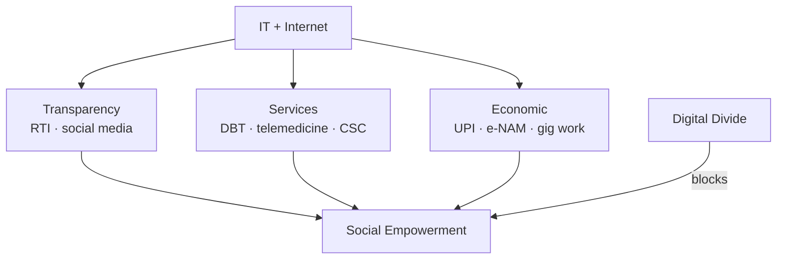

# Social Empowerment — IT, Internet & Scheduled Tribes

> GS-1 · Topic 09 · Social empowerment, digital inclusion, tribal empowerment barriers

---

## PYQs

| Year | M | Words | Question (EN) | प्रश्न (HI) | ID |
|------|---|-------|---------------|-------------|-----|
| 2022 | 8 | — | Evaluate the role of Information Technology and Internet in social empowerment. | सामाजिक सशक्तिकरण में सूचना प्रौद्योगिकी की एवं अंतर्जाल (इंटरनेट) की भूमिका का मूल्यांकन कीजिए। | Q1 |
| 2019 | 8 | 125 | Evaluate the main problems of the empowerment of Schedule Tribes in India. | भारत में जनजातियों के सशक्तिकरण में मूल बाधाओं का परीक्षण कीजिए। | Q2 |

---

## Quick Revision

```
SOCIAL EMPOWERMENT = Marginalized groups gain agency, rights, resources, voice — SC/ST/OBC, women, disabled, minorities
  Dimensions: political · economic · social · educational · digital

IT/INTERNET EMPOWERMENT CHANNELS:
  Digital India (2015) · UMANG · e-Governance · MyGov · RTI online · e-NAM · DBT (JAM trinity)
  · social media mobilization (#MeToo, farmer protests) · telemedicine · DIKSHA education · CSCs
  · UPI financial inclusion · gig platforms · Open Network for Digital Commerce

LIMITS: Digital divide (gender, rural, tribal) · literacy · language (English bias) · misinformation
  · surveillance · cybercrime · Aadhaar exclusion errors · tribal connectivity gaps

ST (Scheduled Tribes) — Art 366(25) · ST list per Constitution Order · ~8.6% population (2011)
  Constitutional: Art 46 (DPSP) · Art 15(4)(5) · Art 16(4)(4A) · Art 243D PRI · Art 338A NCST
  · Art 244 + 5th/6th Schedule · PESA 1996 (partial implementation)

ST EMPOWERMENT BARRIERS:
  Land alienation · forest eviction vs FRA 2006 · displacement (mining, dams)
  · illiteracy (~59% ST literacy vs national ~73%) · health (malaria, malnutrition, TB)
  · loss of language/culture · bonded labour · trafficking · witch-hunting (Odisha, Jharkhand)
  · Naxal conflict zones · poor implementation PESA/FRA · absent health-education infra
  · untouchability in tribal contact zones · seasonal migration · alcohol exploitation

KEY ACTS/SCHEMES: Forest Rights Act 2006 · SC/ST PoA Act 1989 · TRIFED · Eklavya Model Schools
  · Dharti Aaba Janjatiya Gram Utkarsh Abhiyan (2024) · PM-JANMAN · Vanbandhu Kalyan Yojana

CONTEMPORARY: Digital India tribal push · BharatNet · tribal university · PESA rules 2022 delay debates
  · IP rights on traditional knowledge · GI tags tribal crafts

TRAPS: IT empowerment ≠ uniform | ST = homogeneous (700+ communities) | Reservation ≠ full empowerment
  | FRA ≠ fully implemented | PESA on paper in many states | Social empowerment ≠ only digital
```

---

## Content

### Context — social empowerment in India

- **Social empowerment** = process by which **marginalized groups** — **SC, ST, OBC, women, disabled, religious minorities** — acquire **capabilities, rights awareness, economic assets, political voice, and social dignity** to participate **equally in development**.
- **Amartya Sen / Martha Nussbaum capability approach:** Empowerment = **expanded real freedoms** — not just **formal legal equality**.
- **Constitutional vision:** **Art 38 (social order justice)**, **Art 46 (ST/SC promotion)**, **Fundamental Rights**, **reservation (Art 15(4), 16(4), 243D)**, **special protections (5th/6th Schedule)**.
- **This file focuses on PYQ clusters:** **(a) IT/Internet in empowerment broadly**, **(b) ST empowerment barriers** — but Content covers **full social empowerment keyword** for book-free rule.

### Dimensions of social empowerment

| Dimension | Mechanisms | Examples |
|-----------|------------|----------|
| **Political** | **Reservation, PRI seats, voting** | **73rd Amendment ST reservation**, **PESA gram sabha power** |
| **Economic** | **Land, credit, livelihood schemes** | **FRA titles, MGNREGA, TRIFED MSP for MFP** |
| **Social** | **Anti-discrimination, cultural rights** | **SC/ST PoA Act**, **protection of tribal language** |
| **Educational** | **Scholarships, residential schools** | **Eklavya Model Residential Schools (EMRS)** |
| **Digital** | **Connectivity, e-services, information** | **CSCs, DBT, telemedicine** |

### IT and Internet — role in social empowerment

**Information and transparency**
- **RTI online portals** — **citizens expose corruption** — **MKSS-style audits scaled digitally**.
- **Social media campaigns** — **#MeToo, Nirbhaya protests, farmer movement** — **marginal voices amplify**.
- **MyGov, participatory budgeting pilots** — **direct citizen input**.

**Service delivery (Digital India 2015)**
- **DBT via JAM (Jan Dhan-Aadhaar-Mobile)** — **subsidies reach beneficiaries**, reduce **middleman leakage** — **MGNREGA wage payments, LPG PAHAL**.
- **UMANG app** — **multiple government services unified**.
- **e-Hospital, e-Sanjeevani telemedicine** — **rural-tribal health access**.
- **DIKSHA platform** — **teacher training, student content** — **NEP 2020 digital push**.

**Economic inclusion**
- **UPI (NPCI)** — **street vendors, SHGs** accept **digital payments** — **financial trail, credit history**.
- **e-NAM** — **farmers access national mandi prices** — **reduces exploitative middlemen** ( uneven adoption).
- **Gig platforms** — **Swiggy, Urban Company** — **low-entry jobs** but **precarity**.

**Political mobilization and education**
- **WhatsApp political awareness** — **double-edged** — **empowerment + misinformation**.
- **YouTube education channels** — **vernacular competitive exam coaching** — **democratizes knowledge** beyond **metro coaching hubs**.
- **Open Government Data** — **researchers, activists** use **datasets** for **accountability**.



### Digital divide — limits of IT empowerment

| Gap | Who affected | Consequence |
|-----|--------------|-------------|
| **Connectivity** | **Tribal hamlets, NE hills** | **BharatNet delays** — **services on paper only** |
| **Gender** | **Rural women** | **Lower phone ownership**, **digital literacy** |
| **Language** | **Non-English speakers** | **Apps English-first** — **exclusion** |
| **Literacy** | **Elderly, landless labour** | **Cannot navigate e-governance** |
| **Misinformation** | **All, especially WhatsApp** | **Mob violence, vaccine hesitancy** |
| **Aadhaar errors** | **Poorest, migrants** | **Benefit exclusion** — **due process fights** |
| **Surveillance fears** | **Activists, minorities** | **Chilling effect on dissent** |

**Evaluation line for exams:** IT/Internet are **force multipliers for empowerment** where **access, literacy, and rights exist** — **without addressing structural inequality**, digital tools ** reproduce gaps**.

### Scheduled Tribes — constitutional and legal framework

- **Definition:** **Art 366(25)** — **STs** are communities **notified under Constitution (Scheduled Tribes) Order** — **705 ethnic groups**, **~8.6% population (Census 2011)**.
- **Art 46 (DPSP):** State shall **promote with special care ST educational and economic interests**, **protect from injustice**.
- **Art 15(4)/(5), 16(4)/(4A):** **Reservation** in education, jobs, **promotion (with conditions)**.
- **Art 244 + Fifth Schedule:** **Governor report, Tribes Advisory Council** — **major states (MP, Chhattisgarh, Jharkhand, Odisha, Rajasthan, Gujarat, Maharashtra, AP, Telangana, Himachal)**.
- **Sixth Schedule:** **Autonomous councils (Assam, Meghalaya, Tripura, Mizoram)** — **greater self-governance**.
- **Art 338A:** **National Commission for Scheduled Tribes (NCST)** — **constitutional watchdog (2004)**.
- **PESA Act 1996:** **Gram sabha consent** for **land acquisition, minor minerals, local plans** in **Fifth Schedule areas** — **implementation weak in many states**.
- **Forest Rights Act 2006:** **Individual and community forest rights** — **correct historical injustice** — **slow title distribution, eviction conflicts continue**.

### Main barriers to ST empowerment (2019 PYQ core)

**Land, forest, displacement**
- **Historical land alienation** — **moneylenders, non-tribal settlers** — **despite protective laws (SPT Cess, tenancy laws)**.
- **Development-induced displacement** — **mining (Odisha bauxite), dams, SEZ** — **Jindal, Vedanta, Narmada** conflicts — **livelihood loss without fair resettlement**.
- **FRA non-implementation** — **forest department vs tribal claims** — **evictions (Kaziranga, tiger reserve conflicts)**.

**Education and health**
- **Literacy gap** — **ST female literacy especially low** — **dropout, child labour, seasonal migration**.
- **EMRS insufficient** — **quality residential schooling gaps**.
- **Health indicators** — **malnutrition, malaria, TB, sickle cell** — **primary centres far from hamlets**.
- **Witch-hunting, trafficking** — **gendered violence in ** **Jharkhand, Odisha**.

**Governance and PESA failure**
- **PESA rules not notified** fully — **gram sabha powerless** on **mining leases**.
- **Corruption in welfare** — **ration, pension** — **middlemen in isolated villages**.
- **Naxal-affected districts** — **schools closed, admin absent** — **Chhattisgarh, Jharkhand, Odisha belt**.

**Social discrimination and cultural erosion**
- **Untouchability at tribal-plain interface** — **Anusuchit Jati vs Janjati dynamics**.
- **Language loss** — **medium of instruction Hindi/English** — **tribal language extinction risk**.
- **Alcohol exploitation, bonded labour** — **debt traps**.

**Economic structure**
- **Dependence on forest produce (MFP)** — **TRIFED MSP** helps but **market volatility**.
- **Seasonal migration to cities** — **vulnerable labour, no social security**.

### Schemes and contemporary developments

| Scheme / Policy | Purpose |
|-----------------|---------|
| **TRIFED / MSP for MFP (2020 revision)** | **Fair price for minor forest produce** — **economic empowerment** |
| **Eklavya Model Residential Schools** | **Quality ST education** — **target 728 schools** |
| **Vanbandhu Kalyan Yojana** | **Integrated tribal development** |
| **PM-JANMAN (2023)** | **PVTG (Particularly Vulnerable Tribal Groups)** — **housing, water, roads, mobile** |
| **Dharti Aaba Janjatiya Gram Utkarsh Abhiyan (2024)** | **5 crore tribal beneficiaries** — **village saturation development** |
| **BharatNet / digital tribal push** | **Connectivity for e-services** |
| **GI tags** — **Warli, Dokra, bamboo crafts** | **Cultural-economic empowerment** |

### Contemporary relevance

- **PESA implementation push (2022 rules debate)** — **Centre-state friction** on **forest governance** — **ST autonomy vs mining revenue**.
- **Digital India for tribals** — **Common Service Centres in blocks**, **mobile towers in PVTG habitations**.
- **Traditional Knowledge Digital Library (CSIR)** — **protect ** **tribal bio-piracy** — **empowerment through IP**.
- **NCST reports on eviction, FRA** — **use in answers for ** **current institutional voice**.
- **Supreme Court FRA-eviction orders (2019 episode)** — **political mobilization** — **rights vs conservation debate**.

### Limits and balanced view

- **ST communities heterogeneous** — **Bhils, Gonds, Santhals, Nagas, PVTGs** — **avoid monolithic answer**.
- **Reservation necessary not sufficient** — **quality education, land rights, health** needed.
- **IT helps ST only with connectivity** — **PVTGs in Andaman, remote MP** still **offline**.
- **Development vs conservation false binary** — **FRA recognizes ** **community forest stewardship** as **empowerment + ecology**.

---

## Answers

### Q1: Evaluate the role of Information Technology and Internet in social empowerment. (2022, 8M)

**Introduction:**
> **Information Technology and Internet** expand **access to information, services, and markets** — **multiplying social empowerment** for **marginalized groups** when **digital divides are bridged**.

**Main Points:**
- **Transparency & Voice** — **RTI online, social media (#MeToo, farmer protests)** — **citizens hold power accountable**.
- **Service Delivery** — **Digital India, DBT-JAM** — **subsidies, pensions, MGNREGA wages** — **reduces leakage**.
- **Health & Education Access** — **e-Sanjeevani telemedicine, DIKSHA** — **rural-tribal reach**.
- **Financial Inclusion** — **UPI, Jan Dhan** — **SHGs, vendors** enter **formal digital economy**.
- **Economic Opportunity** — **e-NAM mandi prices, gig platforms** — **income channels** (with precarity).
- **Political Awareness** — **Vernacular YouTube, WhatsApp** — **political literacy** (also **misinformation risk**).
- **Limits — Digital Divide** — **Tribal connectivity, gender gap, literacy, Aadhaar exclusion** — **uneven empowerment**.

**Keywords (underline in exam):** Digital India · DBT · JAM Trinity · UPI · Digital Divide · e-Governance · RTI

**Exam diagram (30 sec):**
```
IT/Internet → info + services + markets → empowerment
Digital divide → blocks marginal groups
```

**Conclusion:**
> IT/Internet are **empowerment accelerators**, not **substitutes for land rights, education, and anti-discrimination** — **inclusive design determines outcome**.

---

### Q2: Evaluate the main problems of the empowerment of Schedule Tribes in India. (2019, 8M, 125W)

**Introduction:**
> **Scheduled Tribes (~8.6% population)** face **structural barriers** despite **constitutional protections (Art 46, FRA, PESA, reservation)** — **empowerment remains incomplete**.

**Main Points:**
- **Land Alienation & Displacement** — **Mining, dams, encroachment** — **livelihood loss (Odisha, Jharkhand)**.
- **Forest Rights Denial** — **FRA 2006 slow implementation** — **eviction conflicts with forest department**.
- **PESA Non-Implementation** — **Gram sabha bypassed** on **minerals, land acquisition**.
- **Education Gap** — **Low literacy, dropout, seasonal migration** — **EMRS access insufficient**.
- **Health Deprivation** — **Malnutrition, malaria, TB, sickle cell** — **remote PHCs dysfunctional**.
- **Cultural Erosion & Discrimination** — **Language loss, untouchability at plains interface, witch-hunting**.
- **Naxal Conflict & Governance Vacuum** — **Schools/admin absent** in **affected districts**.
- **Evaluation** — **Legal framework strong on paper** — **implementation, land, and service delivery** are **core barriers**.

**Keywords (underline in exam):** Art 46 · FRA 2006 · PESA 1996 · Land Alienation · Fifth Schedule · NCST · Digital Divide

**Exam diagram (30 sec):**
```
Land/forest loss + poor edu/health + PESA failure
              ↓
ST empowerment blocked
```

**Conclusion:**
> ST empowerment needs **FRA-PESA enforcement, quality education-health, and displacement justice** — **not reservation alone**.

---

### Q3: *Likely variant:* How does Digital India contribute to social empowerment of marginalized communities? (—, 8M, 125W)

**Introduction:**
> **Digital India (2015)** aims **digital infrastructure, governance, and literacy** — **targeting inclusion** of **rural, SC/ST, women**.

**Main Characteristics:**
- **BharatNet / mobile connectivity** — **village internet backbone**.
- **Common Service Centres (CSCs)** — **last-mile e-services in blocks**.
- **DBT via JAM** — **direct benefit to ** **poor, reducing corruption**.
- **UMANG, DigiLocker** — **documents accessible** — ** migrants, labour**.
- **DIKSHA, SWAYAM** — **education access beyond metros**.
- **UPI inclusion** — **small vendors, SHGs** — **economic participation**.
- **Limits** — **Tribal PVTG offline pockets**, **digital literacy, gender phone gap**.

**Keywords (underline in exam):** Digital India · CSC · DBT · BharatNet · JAM · Inclusive Governance

**Exam diagram (30 sec):**
```
Digital infra + e-services + UPI → marginal inclusion
Divide persists without literacy/connectivity
```

**Conclusion:**
> **Digital India empowers when paired with ** **literacy, connectivity, and legal rights** for **SC/ST/women/rural poor**.

---

### Q4: *Likely variant:* Discuss the significance of Forest Rights Act 2006 for tribal empowerment. (—, 12M, 200W)

**Introduction:**
> **Forest Rights Act (FRA) 2006** recognizes **individual and community forest rights** of **STs and other traditional forest dwellers** — **landmark empowerment law** correcting **colonial forest criminalization**.

**Main Points:**
- **Individual Forest Rights (IFR)** — **Cultivation, residence** — **security against eviction**.
- **Community Forest Rights (CFR)** — **Collective management, MFP, sacred groves** — **autonomy restored**.
- **Community Resource Rights** — **Grazing, fishing, access** — **livelihood base**.
- **Gram Sabha Role** — **FRA claims initiated at village** — **democratic empowerment**.
- **Link to PESA** — **Synergy for ** **Fifth Schedule tribal self-governance**.
- **Implementation Gaps** — **Low title acceptance, eviction drives, forest dept resistance**.
- **Conservation Debate** — **Evidence: CFR can improve ** **forest cover when communities manage**.
- **Significance** — **Shifts paradigm from ** **protect forests from tribals → protect forests with tribals**.

**Keywords (underline in exam):** FRA 2006 · Community Forest Rights · Gram Sabha · MFP · PESA · Tribal Empowerment

**Exam diagram (30 sec):**
```
Colonial forest laws → FRA 2006 → IFR/CFR titles → livelihood + autonomy
Implementation gap = ongoing barrier
```

**Conclusion:**
> **FRA is cornerstone of tribal empowerment** — **realizing it requires ** **political will against extractive development models**.

---

## Traps

| Wrong | Correct |
|-------|---------|
| IT empowerment = automatic for all | **Digital divide** — **tribal, gender, rural gaps** |
| Social empowerment = only digital | **Political, economic, land, education** dimensions essential |
| ST = one homogeneous group | **700+ communities**, **PVTGs especially vulnerable** |
| Reservation alone empowers ST | **Land, FRA, health, education** equally critical |
| FRA fully implemented | **Many states lag** — **evictions continue** |
| PESA grants full autonomy everywhere | **Rules not notified in key states** — **weak gram sabha power** |
| Digital India solved corruption | **Reduces leakage** but **Aadhaar exclusion, data errors** persist |
| Internet always democratizing | **Misinformation, hate speech, surveillance** — **dual edge** |
| Tribal displacement inevitable for development | **FRA, PESA consent, fair R&R** — **constitutional requirements** |
| SC/ST PoA Act irrelevant to ST | **Atrocities at tribal-plain interface** — **distinct from FRA but related** |
| Evaluate = only praise IT | **Evaluation requires limits** — **divide, misinformation** |
| EMRS solved ST education | **Access and quality gaps remain** |

---

*Complete.*
