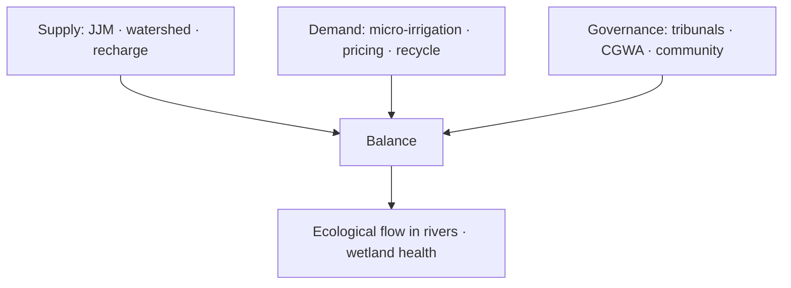

# Water Resources — Crisis, Management & Conservation

> GS-1 · Topic 10 · Water resources, crisis, management, ecological balance (India)

---

## PYQs

| Year | M | Words | Question (EN) | प्रश्न (HI) | ID |
|------|---|-------|---------------|-------------|-----|
| 2021 | 8 | 125 | What is water crisis? Suggest suitable measures for water resource management. | जल संकट क्या है? जल संसाधन प्रबन्धन के लिए उपयुक्त उपाय सुझाइये। | Q1 |

---

## Quick Revision

```
WATER CRISIS = Demand exceeds sustainable supply OR quality unfit OR inequitable access
  Physical scarcity + economic scarcity + ecological degradation

INDIA FACTS: ~4% global freshwater · ~18% population · per capita ↓ (stress <1700 m³)
  Groundwater 40%+ irrigation · 80%+ rural domestic in many states · 60+ districts critical (CGWB)

SOURCES: Rainfall (monsoon-dependent) · rivers (Ganga, Brahmaputra, Godavari…) · glaciers (Himalaya)
  · groundwater · tanks/lakes · desalination (coastal)

SOUTH/SOUTH-EAST ASIA: Monsoon regimes · Mekong, Irrawaddy, Indus basins · shared transboundary waters
  · delta vulnerability (Bangladesh, Vietnam) · India = upstream riparian for several

MANAGEMENT MEASURES:
  Jal Jeevan Mission (Har Ghar Jal) · Atal Bhujal Yojana · PMKSY (micro-irrigation)
  · National Water Mission · watershed (NABARD) · rainwater harvesting · aquifer recharge
  · inter-state tribunals (Cauvery, Krishna) · National Green Tribunal · groundwater rules 2020
  · AMRUT 2.0 · river rejuvenation (Namami Gange) · wastewater recycling · pricing/demand mgmt

ECOLOGICAL BALANCE (link forest-water PYQ):
  Forests = catchment · wetlands = aquifer recharge · mangroves buffer coast
  · biodiversity in rivers (Ganges dolphin) · eutrophication if polluted

TRAPS: Water crisis ≠ only drought | India water-rich in absolute (Himalayan rivers) but maldistributed
  | Groundwater ≠ infinite | Interlinking ≠ silver bullet | JJM = supply not source creation alone
```

---

## Content

### Context — water as natural resource in India

- **Water** is **renewable but finite locally** — **India receives ~4% of global precipitation** for **~18% world population** — **spatial-temporal mismatch** ( **Himalayan abundance vs peninsular scarcity**, **monsoon concentration**).
- **CPCB/NITI estimates:** **Per capita availability** declined from **~5,177 m³ (1951)** to **~1,486 m³ (2021)** — approaching **water stress** threshold (**1,700 m³**) — **absolute scarcity below 1,000 m³**.
- **South & South-East Asia:** **Monsoon-dominated**, **transboundary river basins** ( **Ganges-Brahmaputra-Meghna, Indus, Mekong**), **deltaic vulnerability** — **India upstream for Pakistan, Bangladesh, Nepal** — **hydro-diplomacy** dimension.
- **Exam frame:** **Define crisis**, **management measures**, **link to ecological balance with forests** (cross with Forest file).

### Dimensions of water crisis (2021 PYQ)

| Dimension | Manifestation in India |
|-----------|------------------------|
| **Quantity** | **Groundwater over-extraction** — **Punjab, Haryana, Rajasthan, UP, Tamil Nadu** — **CGWB "critical/over-exploited" blocks** |
| **Quality** | **Industrial/sewage pollution** — **Ganga, Yamuna, Hindon** — **CPCB polluted river stretches** |
| **Access inequity** | **Rural women long-distance fetch**; **slum supply gaps** despite **urban concentration** |
| **Inter-sector competition** | **Agriculture ~78% withdrawal** vs **industry, drinking, ecology** |
| **Climate change** | **Glacier melt timing shift**, **extreme floods/droughts**, **sea intrusion (Sundarbans, Kerala coast)** |

**Water crisis definition (exam):** **Situation where available ** **clean freshwater is insufficient** to meet **human and ecosystem needs** sustainably — **not only drought**.

### Water resources distribution — India & region

**Surface water**
- **Himalayan rivers** (perennial) — **Indus, Ganga, Brahmaputra** — **70%+ utilizable flow in monsoon months**.
- **Peninsular rivers** (rain-fed) — **Godavari, Krishna, Cauvery, Mahanadi, Narmada, Tapi** — **inter-state disputes**.
- **Tanks & lakes** — **Traditional systems (talabs, eris in TN)** — **decline and revival efforts**.

**Groundwater**
- **Largest user: irrigation** — **Green Revolution legacy** — **free/power-subsidized pumping**.
- **Hard-rock aquifers (Deccan)** vs **alluvial (Indo-Gangetic)** — **different recharge rates**.

**South-East Asia comparison**
- **Mekong basin** — **China, Laos, Cambodia, Vietnam** — **dam upstream issues** ( **Indian analogous: Teesta, Brahmaputra**).
- **Bangladesh delta** — **salinity, arsenic groundwater** — **regional lesson for ** **Indian coastal aquifers**.

### Water resource management measures (2021 PYQ core)

**Supply-side**
- **Jal Jeevan Mission (2019)** — **Functional household tap connections (Har Ghar Jal)** by **2024 target extension** — **village-level source sustainability plans**.
- **Atal Bhujal Yojana** — **Community-led groundwater management** in **7 states, 8,000+ gram panchayats**.
- **PMKSY — Per Drop More Crop** — **Drip/sprinkler micro-irrigation subsidies**.
- **Watershed development (NABARD, IWMP)** — **Soil-moisture conservation, check dams**.
- **Rainwater harvesting** — **Tamil Nadu mandatory (2003)**, **Delhi building bylaws**, **traditional stepwell revival**.
- **Inter-linking of rivers (Ken-Betwa first link)** — **debated ecological/social costs**.

**Demand-side & governance**
- **National Water Mission (NAPCC 2008)** — **20% efficiency gain target**.
- **Groundwater regulation** — **Central Ground Water Authority**, **state rules (2020 model)** — **industrial extraction control**.
- **Inter-state tribunals** — **Cauvery Water Management Authority, Krishna, Ravi-Beas**.
- **Pricing & user associations** — **Pani Panchayat (Maharashtra)**, **tank user societies**.
- **Wastewater recycling** — **Namami Gange STPs**, **Bengaluru treated water for industry**.
- **AMRUT 2.0** — **Urban water supply, rejuvenation of water bodies**.



### Water bodies & biodiversity — ecological balance (link to 2024 PYQ)

- **Wetlands (Ramsar)** — **Keoladeo, Chilika, Sundarbans, Loktak** — **fish, migratory birds, flood buffer**.
- **River biodiversity** — **Ganges river dolphin (Platanista)** — **indicator species** — **Namami Gange conservation**.
- **Forest-watershed link** — **Deforestation increases siltation** — **reduces reservoir life (Tehri, Sardar Sarovar)**.
- **Eutrophication** — **Fertilizer runoff** — **fish kills, algal blooms** — **need catchment forest + STP**.

### Contemporary relevance

- **JJM dashboard** — **>10 crore+ connections** milestone — **sustainability of source (aquifer/spring) new focus**.
- **UN Water Conference 2023** — **India commitments on ** **water action decade**.
- **Climate-resilient water infrastructure** — **sponge cities, floodplain zoning**.
- **Millets (Shree Anna)** — **lower water footprint crops** — **policy nudge**.
- **Ken-Betwa link project** — **first river interlink** — **Panna tiger habitat debate**.

### Limits and balanced view

- **JJM success ≠ water security** if **groundwater depletes** — **source sustainability critical**.
- **Inter-linking** — **Kerala, NE opposition** — **not universal solution**.
- **Virtual water** — **export of water-intensive crops (rice, sugar)** — **regional equity issue**.

---

## Answers

### Q1: What is water crisis? Suggest suitable measures for water resource management. (2021, 8M, 125W)

**Introduction:**
> **Water crisis** arises when **available clean freshwater** is **insufficient** to meet **drinking, agricultural, industrial, and ecological needs** sustainably — **India faces quantity, quality, and equity dimensions**.

**Main Points:**
- **Crisis Definition** — **Over-exploited aquifers, polluted rivers, monsoon dependence, per capita decline (~1,486 m³)**.
- **Supply Augmentation** — **Jal Jeevan Mission, watershed development, rainwater harvesting, aquifer recharge (Atal Bhujal)**.
- **Demand Management** — **PMKSY micro-irrigation, crop diversification (millets), industrial water recycling**.
- **Governance** — **Inter-state tribunals (Cauvery, Krishna), CGWA regulation, NGT enforcement**.
- **Urban & Rural** — **AMRUT, functional tap connections with ** **source sustainability plans**.
- **Ecological Flow** — **Maintain river-wetland health** — **Namami Gange, Ramsar sites**.
- **Community Participation** — **Pani Panchayat, water user associations** — **local stewardship**.

**Keywords (underline in exam):** Water Crisis · Jal Jeevan Mission · Groundwater · PMKSY · Watershed · Inter-state Tribunal

**Exam diagram (30 sec):**
```
Crisis: quantity · quality · equity
Fix: supply ↑ + demand ↓ + governance + ecology
```

**Conclusion:**
> **Integrated water resource management** — **not dams alone** — **secures India's ** **food, health, and ecological balance**.

---

### Q2: *Likely variant:* Elucidate why biodiversity conservation of water bodies is essential for ecological balance. (—, 12M, 200W)

**Introduction:**
> **Water bodies** — **rivers, wetlands, lakes, aquifers** — **host aquatic biodiversity** and **provide ecosystem services** essential for **regional ecological balance**.

**Main Points:**
- **Habitat Services** — **Fish, dolphins, migratory birds (Chilika, Keoladeo)** — **food web stability**.
- **Hydrological Regulation** — **Wetlands store floodwater, recharge groundwater** — **buffer drought-flood cycle**.
- **Water Quality** — **Healthy ecosystems filter nutrients** — **prevent eutrophication**.
- **Climate Regulation** — **Wetlands sequester carbon** — **local microclimate moderation**.
- **Threats** — **Pollution (Ganga-Yamuna), encroachment, dam fragmentation, invasive species**.
- **Conservation Tools** — **Ramsar designation, wetland rules 2017, river rejuvenation, ESZ**.
- **Forest Linkage** — **Catchment forest cover protects ** **sediment and flow regime**.
- **Human Dependence** — **Fisheries, tourism, drinking water** — **collapse harms livelihoods**.

**Keywords (underline in exam):** Wetlands · Ramsar · Ecological Balance · Namami Gange · Aquifer Recharge · Biodiversity

**Exam diagram (30 sec):**
```
Water body biodiversity → flood control · clean water · fisheries
Threat: pollution · encroachment → imbalance
```

**Conclusion:**
> **Water body conservation is ** **non-negotiable for India's monsoon-fed ** **hydrological and food security**.

---

## Traps

| Wrong | Correct |
|-------|---------|
| India has no water — only poor management | **Himalayan rivers abundant** — **maldistribution and inefficiency** |
| Water crisis = only drought years | **Includes pollution, groundwater collapse, inequity** |
| JJM alone solves crisis | **Needs source sustainability + demand management** |
| Groundwater is private unlimited resource | **Public trust doctrine, CGWA regulation** |
| Inter-linking solves all regional deficit | **Ecological, social, financial costs** — **partial tool** |
| South India always water-scarce | **Kerala, Konkan receive high rain** — **storage problem** |
| Industrial use negligible | **Growing share** — **recycling needed** |
| Wetlands wasteland to reclaim | **Ramsar ecological services critical** |
| Water management = only government | **Community watershed, pani panchayat essential** |
| Namami Gange = only Ganga states | **Tributaries, basin approach, industrial belts along river** |

---

*Complete.*
